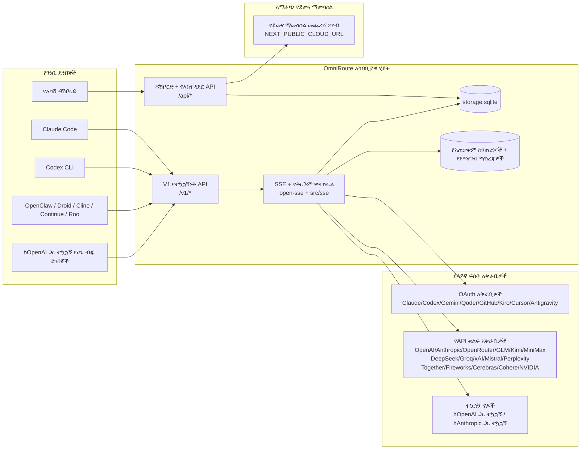
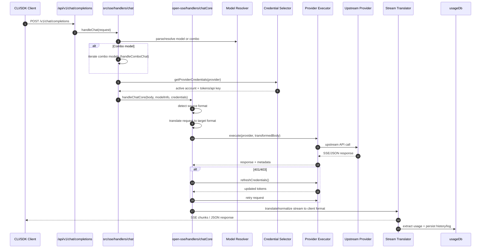
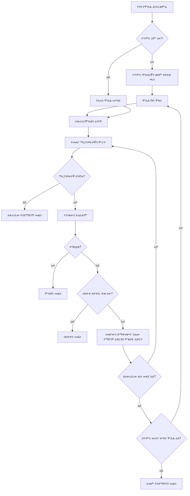
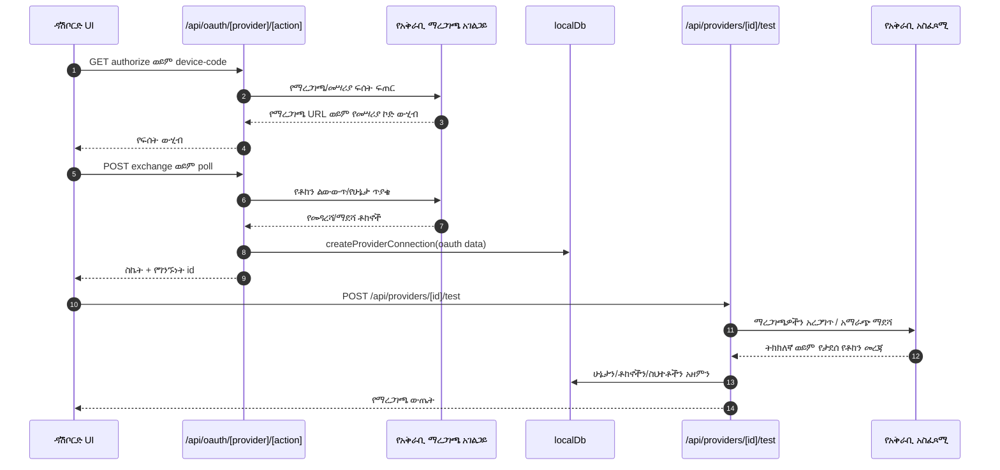
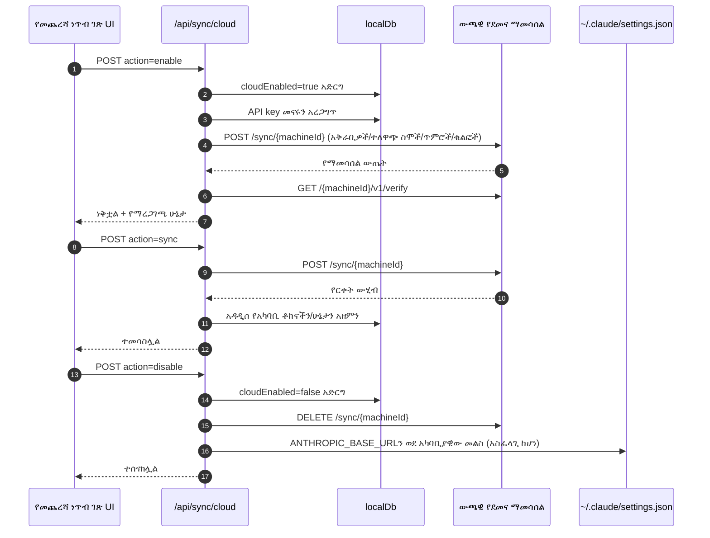
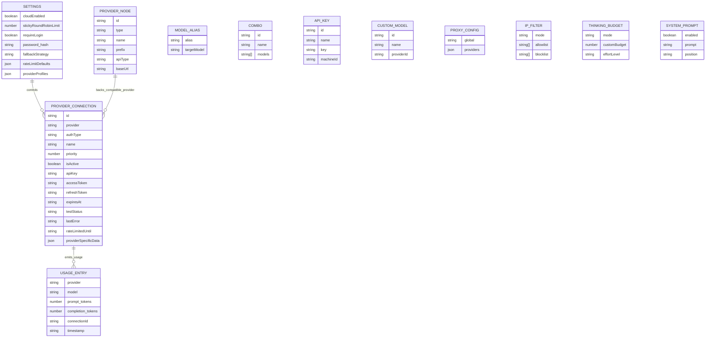
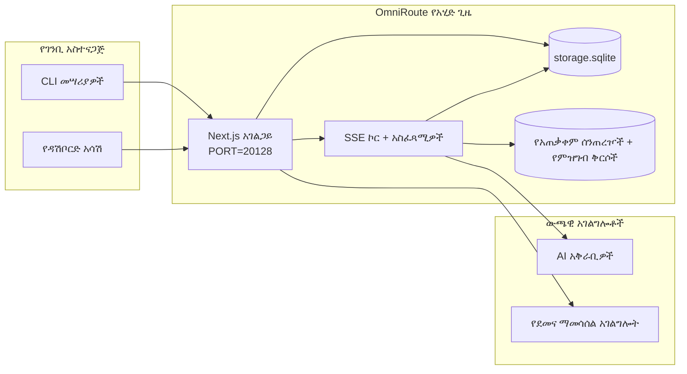

# OmniRoute Architecture (አማርኛ)

🌐 **Languages:** 🇺🇸 [English](../../../../architecture/ARCHITECTURE.md) · 🇸🇦 [ar](../../../ar/docs/architecture/ARCHITECTURE.md) · 🇦🇿 [az](../../../az/docs/architecture/ARCHITECTURE.md) · 🇧🇬 [bg](../../../bg/docs/architecture/ARCHITECTURE.md) · 🇧🇩 [bn](../../../bn/docs/architecture/ARCHITECTURE.md) · 🇧🇦 [bs](../../../bs/docs/architecture/ARCHITECTURE.md) · 🇨🇿 [cs](../../../cs/docs/architecture/ARCHITECTURE.md) · 🇩🇰 [da](../../../da/docs/architecture/ARCHITECTURE.md) · 🇩🇪 [de](../../../de/docs/architecture/ARCHITECTURE.md) · 🇬🇷 [el](../../../el/docs/architecture/ARCHITECTURE.md) · 🇪🇸 [es](../../../es/docs/architecture/ARCHITECTURE.md) · 🇪🇪 [et](../../../et/docs/architecture/ARCHITECTURE.md) · 🇮🇷 [fa](../../../fa/docs/architecture/ARCHITECTURE.md) · 🇫🇮 [fi](../../../fi/docs/architecture/ARCHITECTURE.md) · 🇫🇷 [fr](../../../fr/docs/architecture/ARCHITECTURE.md) · 🇮🇪 [ga](../../../ga/docs/architecture/ARCHITECTURE.md) · 🇮🇳 [gu](../../../gu/docs/architecture/ARCHITECTURE.md) · 🇳🇬 [ha](../../../ha/docs/architecture/ARCHITECTURE.md) · 🇮🇱 [he](../../../he/docs/architecture/ARCHITECTURE.md) · 🇮🇳 [hi](../../../hi/docs/architecture/ARCHITECTURE.md) · 🇭🇷 [hr](../../../hr/docs/architecture/ARCHITECTURE.md) · 🇭🇺 [hu](../../../hu/docs/architecture/ARCHITECTURE.md) · 🇦🇲 [hy](../../../hy/docs/architecture/ARCHITECTURE.md) · 🇮🇩 [id](../../../id/docs/architecture/ARCHITECTURE.md) · 🇳🇬 [ig](../../../ig/docs/architecture/ARCHITECTURE.md) · 🇮🇹 [it](../../../it/docs/architecture/ARCHITECTURE.md) · 🇯🇵 [ja](../../../ja/docs/architecture/ARCHITECTURE.md) · 🇬🇪 [ka](../../../ka/docs/architecture/ARCHITECTURE.md) · 🇰🇭 [km](../../../km/docs/architecture/ARCHITECTURE.md) · 🇮🇳 [kn](../../../kn/docs/architecture/ARCHITECTURE.md) · 🇰🇷 [ko](../../../ko/docs/architecture/ARCHITECTURE.md) · 🇱🇹 [lt](../../../lt/docs/architecture/ARCHITECTURE.md) · 🇱🇻 [lv](../../../lv/docs/architecture/ARCHITECTURE.md) · 🇮🇳 [ml](../../../ml/docs/architecture/ARCHITECTURE.md) · 🇮🇳 [mr](../../../mr/docs/architecture/ARCHITECTURE.md) · 🇲🇾 [ms](../../../ms/docs/architecture/ARCHITECTURE.md) · 🇲🇹 [mt](../../../mt/docs/architecture/ARCHITECTURE.md) · 🇲🇲 [my](../../../my/docs/architecture/ARCHITECTURE.md) · 🇳🇵 [ne](../../../ne/docs/architecture/ARCHITECTURE.md) · 🇳🇱 [nl](../../../nl/docs/architecture/ARCHITECTURE.md) · 🇳🇴 [no](../../../no/docs/architecture/ARCHITECTURE.md) · 🇮🇳 [or](../../../or/docs/architecture/ARCHITECTURE.md) · 🇮🇳 [pa](../../../pa/docs/architecture/ARCHITECTURE.md) · 🇵🇭 [phi](../../../phi/docs/architecture/ARCHITECTURE.md) · 🇵🇱 [pl](../../../pl/docs/architecture/ARCHITECTURE.md) · 🇵🇹 [pt](../../../pt/docs/architecture/ARCHITECTURE.md) · 🇧🇷 [pt-BR](../../../pt-BR/docs/architecture/ARCHITECTURE.md) · 🇷🇴 [ro](../../../ro/docs/architecture/ARCHITECTURE.md) · 🇷🇺 [ru](../../../ru/docs/architecture/ARCHITECTURE.md) · 🇱🇰 [si](../../../si/docs/architecture/ARCHITECTURE.md) · 🇸🇰 [sk](../../../sk/docs/architecture/ARCHITECTURE.md) · 🇸🇮 [sl](../../../sl/docs/architecture/ARCHITECTURE.md) · 🇷🇸 [sr](../../../sr/docs/architecture/ARCHITECTURE.md) · 🇸🇪 [sv](../../../sv/docs/architecture/ARCHITECTURE.md) · 🇰🇪 [sw](../../../sw/docs/architecture/ARCHITECTURE.md) · 🇮🇳 [ta](../../../ta/docs/architecture/ARCHITECTURE.md) · 🇮🇳 [te](../../../te/docs/architecture/ARCHITECTURE.md) · 🇹🇭 [th](../../../th/docs/architecture/ARCHITECTURE.md) · 🇹🇷 [tr](../../../tr/docs/architecture/ARCHITECTURE.md) · 🇺🇦 [uk-UA](../../../uk-UA/docs/architecture/ARCHITECTURE.md) · 🇵🇰 [ur](../../../ur/docs/architecture/ARCHITECTURE.md) · 🇺🇿 [uz](../../../uz/docs/architecture/ARCHITECTURE.md) · 🇻🇳 [vi](../../../vi/docs/architecture/ARCHITECTURE.md) · 🇳🇬 [yo](../../../yo/docs/architecture/ARCHITECTURE.md) · 🇨🇳 [zh-CN](../../../zh-CN/docs/architecture/ARCHITECTURE.md) · 🇹🇼 [zh-TW](../../../zh-TW/docs/architecture/ARCHITECTURE.md)

---

🌐 **Languages:** 🇺🇸 [English](../../../../architecture/ARCHITECTURE.md) · 🇸🇦 [ar](../../../ar/docs/architecture/ARCHITECTURE.md) · 🇦🇿 [az](../../../az/docs/architecture/ARCHITECTURE.md) · 🇧🇬 [bg](../../../bg/docs/architecture/ARCHITECTURE.md) · 🇧🇩 [bn](../../../bn/docs/architecture/ARCHITECTURE.md) · 🇧🇦 [bs](../../../bs/docs/architecture/ARCHITECTURE.md) · 🇨🇿 [cs](../../../cs/docs/architecture/ARCHITECTURE.md) · 🇩🇰 [da](../../../da/docs/architecture/ARCHITECTURE.md) · 🇩🇪 [de](../../../de/docs/architecture/ARCHITECTURE.md) · 🇬🇷 [el](../../../el/docs/architecture/ARCHITECTURE.md) · 🇪🇸 [es](../../../es/docs/architecture/ARCHITECTURE.md) · 🇪🇪 [et](../../../et/docs/architecture/ARCHITECTURE.md) · 🇮🇷 [fa](../../../fa/docs/architecture/ARCHITECTURE.md) · 🇫🇮 [fi](../../../fi/docs/architecture/ARCHITECTURE.md) · 🇫🇷 [fr](../../../fr/docs/architecture/ARCHITECTURE.md) · 🇮🇪 [ga](../../../ga/docs/architecture/ARCHITECTURE.md) · 🇮🇳 [gu](../../../gu/docs/architecture/ARCHITECTURE.md) · 🇳🇬 [ha](../../../ha/docs/architecture/ARCHITECTURE.md) · 🇮🇱 [he](../../../he/docs/architecture/ARCHITECTURE.md) · 🇮🇳 [hi](../../../hi/docs/architecture/ARCHITECTURE.md) · 🇭🇷 [hr](../../../hr/docs/architecture/ARCHITECTURE.md) · 🇭🇺 [hu](../../../hu/docs/architecture/ARCHITECTURE.md) · 🇦🇲 [hy](../../../hy/docs/architecture/ARCHITECTURE.md) · 🇮🇩 [id](../../../id/docs/architecture/ARCHITECTURE.md) · 🇳🇬 [ig](../../../ig/docs/architecture/ARCHITECTURE.md) · 🇮🇹 [it](../../../it/docs/architecture/ARCHITECTURE.md) · 🇯🇵 [ja](../../../ja/docs/architecture/ARCHITECTURE.md) · 🇬🇪 [ka](../../../ka/docs/architecture/ARCHITECTURE.md) · 🇰🇭 [km](../../../km/docs/architecture/ARCHITECTURE.md) · 🇮🇳 [kn](../../../kn/docs/architecture/ARCHITECTURE.md) · 🇰🇷 [ko](../../../ko/docs/architecture/ARCHITECTURE.md) · 🇱🇹 [lt](../../../lt/docs/architecture/ARCHITECTURE.md) · 🇱🇻 [lv](../../../lv/docs/architecture/ARCHITECTURE.md) · 🇮🇳 [ml](../../../ml/docs/architecture/ARCHITECTURE.md) · 🇮🇳 [mr](../../../mr/docs/architecture/ARCHITECTURE.md) · 🇲🇾 [ms](../../../ms/docs/architecture/ARCHITECTURE.md) · 🇲🇹 [mt](../../../mt/docs/architecture/ARCHITECTURE.md) · 🇲🇲 [my](../../../my/docs/architecture/ARCHITECTURE.md) · 🇳🇵 [ne](../../../ne/docs/architecture/ARCHITECTURE.md) · 🇳🇱 [nl](../../../nl/docs/architecture/ARCHITECTURE.md) · 🇳🇴 [no](../../../no/docs/architecture/ARCHITECTURE.md) · 🇮🇳 [or](../../../or/docs/architecture/ARCHITECTURE.md) · 🇮🇳 [pa](../../../pa/docs/architecture/ARCHITECTURE.md) · 🇵🇭 [phi](../../../phi/docs/architecture/ARCHITECTURE.md) · 🇵🇱 [pl](../../../pl/docs/architecture/ARCHITECTURE.md) · 🇵🇹 [pt](../../../pt/docs/architecture/ARCHITECTURE.md) · 🇧🇷 [pt-BR](../../../pt-BR/docs/architecture/ARCHITECTURE.md) · 🇷🇴 [ro](../../../ro/docs/architecture/ARCHITECTURE.md) · 🇷🇺 [ru](../../../ru/docs/architecture/ARCHITECTURE.md) · 🇱🇰 [si](../../../si/docs/architecture/ARCHITECTURE.md) · 🇸🇰 [sk](../../../sk/docs/architecture/ARCHITECTURE.md) · 🇸🇮 [sl](../../../sl/docs/architecture/ARCHITECTURE.md) · 🇷🇸 [sr](../../../sr/docs/architecture/ARCHITECTURE.md) · 🇸🇪 [sv](../../../sv/docs/architecture/ARCHITECTURE.md) · 🇰🇪 [sw](../../../sw/docs/architecture/ARCHITECTURE.md) · 🇮🇳 [ta](../../../ta/docs/architecture/ARCHITECTURE.md) · 🇮🇳 [te](../../../te/docs/architecture/ARCHITECTURE.md) · 🇹🇭 [th](../../../th/docs/architecture/ARCHITECTURE.md) · 🇹🇷 [tr](../../../tr/docs/architecture/ARCHITECTURE.md) · 🇺🇦 [uk-UA](../../../uk-UA/docs/architecture/ARCHITECTURE.md) · 🇵🇰 [ur](../../../ur/docs/architecture/ARCHITECTURE.md) · 🇺🇿 [uz](../../../uz/docs/architecture/ARCHITECTURE.md) · 🇻🇳 [vi](../../../vi/docs/architecture/ARCHITECTURE.md) · 🇳🇬 [yo](../../../yo/docs/architecture/ARCHITECTURE.md) · 🇨🇳 [zh-CN](../../../zh-CN/docs/architecture/ARCHITECTURE.md) · 🇹🇼 [zh-TW](../../../zh-TW/docs/architecture/ARCHITECTURE.md)

_መጨረሻ የተዘመነው: 2026-06-28_

## አጠቃላይ ማጠቃለያ

OmniRoute በNext.js ላይ የተገነባ የአካባቢ AI ማዘዋወሪያ መግቢያ እና ዳሽቦርድ ነው።
አንድ OpenAI-ተኳሃኝ endpoint (`/v1/*`) ያቀርባል፣ እንዲሁም ትራፊክን በትርጉም፣ በአማራጭ መመለሻ፣ በቶከን ማደስ እና በአጠቃቀም ክትትል አማካኝነት በበርካታ የላይኛው ደረጃ አቅራቢዎች መካከል ያዘዋውራል።

ዋና ችሎታዎች፦

- ለCLI/መሣሪያዎች OpenAI-ተኳሃኝ API በይነገጽ (355 አቅራቢዎች፣ 108 አስፈጻሚዎች)
- በአቅራቢ ቅርጸቶች መካከል የጥያቄ/ምላሽ ትርጉም
- የሞዴል ጥምረት አማራጭ መመለሻ (ባለብዙ-ሞዴል ቅደም ተከተል)
- የተዋቀሩ የጥምረት ደረጃዎች (`provider + model + connection`)፣ በ`compositeTiers` መሠረት የአፈጻጸም ጊዜ ቅደም ተከተል ያላቸው
- በመለያ ደረጃ የሚደረግ አማራጭ መመለሻ (ለእያንዳንዱ አቅራቢ ባለብዙ-መለያ)
- በዋናው የውይይት መንገድ ውስጥ የኮታ ቅድመ-ምርመራ እና ኮታን ያገናዘበ P2C የመለያ ምርጫ
- OAuth + API-key የአቅራቢ ግንኙነት አስተዳደር (22 OAuth የአቅራቢ ሞጁሎች)
- በ`/v1/embeddings` በኩል የማካተቻ ማመንጨት (18 አቅራቢዎች)
- በ`/v1/images/generations` በኩል የምስል ማመንጨት (10+ አቅራቢዎች፣ 20+ ሞዴሎች)
- በ`/v1/audio/transcriptions` በኩል የድምፅ ጽሑፍ ቅጂ ማዘጋጀት (18 አቅራቢዎች)
- በ`/v1/audio/speech` በኩል ጽሑፍን ወደ ንግግር መቀየር (24 አብሮገነብ አቅራቢዎች)
- በ`/v1/videos/generations` በኩል የቪዲዮ ማመንጨት (ComfyUI + SD WebUI)
- በ`/v1/music/generations` በኩል የሙዚቃ ማመንጨት (ComfyUI)
- በ`/v1/search` በኩል የድር ፍለጋ (20 አቅራቢዎች)
- በ`/v1/moderations` በኩል የይዘት ቁጥጥር
- በ`/v1/rerank` በኩል ዳግም ደረጃ መስጠት
- ለማመዛዘኛ ሞዴሎች የማሰቢያ መለያ ትንተና (`<think>...</think>`)
- ከጥብቅ OpenAI SDK ተኳሃኝነት ጋር እንዲጣጣሙ ምላሾችን ማጽዳት
- ለተለያዩ አቅራቢዎች ተኳሃኝነት የሚደረግ የሚና መደበኛነት (developer→system, system→user)
- የተዋቀረ ውጤት ልወጣ (json_schema → Gemini responseSchema)
- ለአቅራቢዎች፣ ቁልፎች፣ ቅጽል ስሞች፣ ጥምረቶች፣ ቅንብሮች እና ዋጋ አወጣጥ የአካባቢ ጽናት (122 DB ሞጁሎች)
- የአጠቃቀም/ወጪ ክትትል እና የጥያቄ ምዝገባ
- ለባለብዙ-መሣሪያ/ሁኔታ ማመሳሰል አማራጭ የደመና ማመሳሰል
- ለAPI መዳረሻ ቁጥጥር የIP ፈቃድ ዝርዝር/እገዳ ዝርዝር
- የማሰቢያ በጀት አስተዳደር (passthrough/auto/custom/adaptive)
- ዓለም አቀፍ የስርዓት መመሪያ ማስገባት
- የክፍለ ጊዜ ክትትል እና አሻራ መለየት
- አቅራቢ-ተኮር መገለጫዎች ያሉት በየመለያው የተሻሻለ የፍጥነት ገደብ
- ለአቅራቢ ጽናት የወረዳ ቆራጭ ንድፍ
- በmutex መቆለፊያ የሚደረግ የተመሳሳይ ጊዜ የጥያቄ መጨናነቅ መከላከያ
- በፊርማ ላይ የተመሠረተ የተደጋጋሚ ጥያቄ ማስወገጃ መሸጎጫ
- የጎራ ንብርብር፦ የወጪ ደንቦች፣ የአማራጭ መመለሻ ፖሊሲ፣ የመቆለፍ ፖሊሲ
- Context Relay፦ የመለያ ሽግግር ቀጣይነትን ለመጠበቅ የክፍለ ጊዜ ርክክብ ማጠቃለያዎች
- የጎራ ሁኔታ ጽናት (ለአማራጭ መመለሻዎች፣ በጀቶች፣ መቆለፊያዎች እና የወረዳ ቆራጮች SQLite የወዲያውኑ ጽሑፍ መሸጎጫ)
- ለማዕከላዊ የጥያቄ ግምገማ የፖሊሲ ሞተር (መቆለፊያ → በጀት → አማራጭ መመለሻ)
- p50/p95/p99 የመዘግየት ጊዜ ድምር ያለው የጥያቄ ቴሌሜትሪ
- የጥምረት ዒላማ ቴሌሜትሪ እና ታሪካዊ የጥምረት ዒላማ ጤና በ`combo_execution_key` / `combo_step_id`
- ከጫፍ እስከ ጫፍ ለመከታተል የግንኙነት መለያ (X-Request-Id)
- ለእያንዳንዱ API key የመውጣት አማራጭ ያለው የተገዢነት ኦዲት ምዝገባ
- ለLLM የጥራት ማረጋገጫ የግምገማ ማዕቀፍ
- ቅጽበታዊ የአቅራቢ ወረዳ ቆራጭ ሁኔታ ያለው የጤና ዳሽቦርድ
- MCP Server (110 መሣሪያዎች) ከ3 ማጓጓዣዎች ጋር (stdio/SSE/Streamable HTTP)
- A2A Server (JSON-RPC 2.0 + SSE) ከክህሎቶች እና ከተግባር የሕይወት ዑደት ጋር
- የማስታወሻ ስርዓት (ማውጣት፣ ማስገባት፣ ሰርስሮ ማውጣት፣ ማጠቃለል)
- የክህሎት ስርዓት (መዝገብ፣ አስፈጻሚ፣ ማጠሪያ፣ አብሮገነብ ክህሎቶች)
- የምስክር ወረቀት አስተዳደር እና DNS አያያዝ ያለው MITM proxy
- የመመሪያ ጥቃት መከላከያ middleware
- Caveman፣ RTK፣ የተደራረቡ pipelines፣ የመጭመቂያ ጥምረቶች፣ የቋንቋ ጥቅሎች እና ትንታኔዎች ያሉት የመመሪያ መጭመቂያ pipeline
- ACP (Agent Communication Protocol) መዝገብ
- ሞጁላር OAuth አቅራቢዎች (በ`src/lib/oauth/providers/` ስር ያሉ 22 የተናጠል ሞጁሎች)
- የማራገፊያ/ሙሉ-ማራገፊያ scripts
- የOAuth አካባቢ ጥገና እርምጃ
- ለOpenAI-ተኳሃኝ WS ደንበኞች WebSocket bridge (`/v1/ws`)
- የማመሳሰያ ቶከን አስተዳደር (መስጠት/መሻር፣ ETag-ስሪት ያለው የውቅር ጥቅል ማውረድ)
- GLM Thinking (`glmt`) እንደ ዋና የአቅራቢ ቅድመ-ቅንብር
- ድብልቅ የቶከን ቆጠራ (የአቅራቢ-ወገን `/messages/count_tokens` ከግምት አማራጭ ጋር)
- የሞዴል ቅጽል ስም ራስ-ሰር መዝራት (በመነሻ ጊዜ 30+ በproxy ቀበሌኛዎች መካከል መደበኛነት)
- ከSSRF መከላከያ፣ የግል URL እገዳ እና ሊዋቀር የሚችል ዳግም ሙከራ ጋር ደህንነቱ የተጠበቀ ወደ ውጭ የሚላክ fetch
- ሊዋቀሩ የሚችሉ `requestRetry` እና `maxRetryIntervalSec` ያሏቸው የማቀዝቀዣ ጊዜን ያገናዘቡ የውይይት ዳግም ሙከራዎች
- በመነሻ ጊዜ Zodን በመጠቀም የአፈጻጸም አካባቢ ማረጋገጫ
- የተገዢነት ኦዲት v2 ከገጽ ክፍፍል፣ የአቅራቢ CRUD ክስተቶች እና SSRF-የታገደ የማረጋገጫ ምዝገባ ጋር

ዋና የአፈጻጸም ሞዴል፦

- በ`src/app/api/*` ስር ያሉ Next.js app routes ሁለቱንም የዳሽቦርድ APIs እና የተኳሃኝነት APIs ይተገብራሉ
- በ`src/sse/*` + `open-sse/*` ውስጥ ያለ የጋራ SSE/ማዘዋወሪያ ኮር የአቅራቢ አፈጻጸምን፣ ትርጉምን፣ የዥረት ስርጭትን፣ አማራጭ መመለሻን እና አጠቃቀምን ያስተዳድራል

## የማጣቀሻ ንድፎች

ለ v3.8.0 መድረክ መደበኛ እና በስሪት ቁጥጥር ስር ያሉ Mermaid ምንጮች በ
[`docs/diagrams/`](../diagrams/README.md) ውስጥ ይገኛሉ። ለመነሻ ግንዛቤ ሁለቱ ከዚህ በታች እንደገና ቀርበዋል፤
የተቀሩት ከየጎራቸው ጋር በተያያዙ መመሪያዎች ውስጥ ተገናኝተዋል።


> ምንጭ፦ [diagrams/request-pipeline.mmd](../diagrams/request-pipeline.mmd)


> ምንጭ፦ [diagrams/resilience-3layers.mmd](../diagrams/resilience-3layers.mmd) — እንዲሁም ከ
> [RESILIENCE_GUIDE.md](./RESILIENCE_GUIDE.md) እና ከ `CLAUDE.md` የመቋቋም ማጣቀሻ ጋር ተገናኝቷል።

## ወሰን እና ገደቦች

### በወሰን ውስጥ

- የአካባቢያዊ gateway አሂድ አካባቢ
- የDashboard አስተዳደር APIዎች
- የProvider ማረጋገጫ እና የtoken ማደስ
- የጥያቄ ትርጉም እና SSE ዥረት
- የአካባቢያዊ ሁኔታ + የአጠቃቀም ቋሚ ማከማቻ
- አማራጭ የcloud ማመሳሰል ማስተባበር

### ከወሰን ውጭ

- ከ `NEXT_PUBLIC_CLOUD_URL` በስተጀርባ ያለው የcloud አገልግሎት ትግበራ
- ከአካባቢያዊው ሂደት ውጭ ያለ የProvider SLA/መቆጣጠሪያ ማዕከል
- ውጫዊ CLI ሁለትዮሽ ፋይሎች ራሳቸው (Claude CLI፣ Codex CLI፣ ወዘተ.)

## የDashboard ገጽታ (የአሁኑ)

በ `src/app/(dashboard)/dashboard/` ስር ያሉ ዋና ገጾች፦

- `/dashboard` — ፈጣን መጀመሪያ + የProvider አጠቃላይ እይታ
- `/dashboard/endpoint` — የendpoint proxy + MCP + A2A + የAPI endpoint ትሮች
- `/dashboard/providers` — የProvider ግንኙነቶች እና ማረጋገጫዎች
- `/dashboard/combos` — የcombo ስልቶች፣ አብነቶች፣ በደረጃ ላይ የተመሠረተ ገንቢ፣ የmodel ማዘዋወሪያ ደንቦች፣ እና በእጅ የሚቀመጥ ቋሚ ቅደም ተከተል
- `/dashboard/auto-combo` — Auto Combo Engine፦ የውጤት መስጫ ክብደቶች፣ የmode ጥቅሎች፣ የvirtual factory ቅድመ-ቅንብሮች፣ telemetry
- `/dashboard/costs` — የወጪ ድምር እና የዋጋ ታይነት
- `/dashboard/analytics` — የአጠቃቀም ትንታኔ፣ ግምገማዎች፣ የcombo ዒላማ ጤና
- `/dashboard/limits` — የኮታ/ፍጥነት መቆጣጠሪያዎች
- `/dashboard/cli-tools` — የCLI መጀመሪያ ዝግጅት፣ የአሂድ አካባቢ ማወቂያ፣ የውቅር ማመንጫ
- `/dashboard/agents` — የተገኙ ACP agentዎች + ብጁ agent ምዝገባ
- `/dashboard/cloud-agents` — በcloud የሚስተናገዱ የagent ተግባራት (Codex Cloud፣ Devin፣ Jules) እና የተግባር የሕይወት ዑደት
- `/dashboard/skills` — የA2A skill ምዝገባ፣ የsandbox አፈጻጸም፣ አብሮገነብ የskill ካታሎግ
- `/dashboard/memory` — የቋሚ ውይይት ማህደረ ትውስታ ምርመራ እና ሰርስሮ ማውጣት
- `/dashboard/webhooks` — ወደ ውጭ የሚላኩ የwebhook ምዝገባዎች፣ የsecret ማዞሪያ፣ የድጋሚ ሙከራ ስታቲስቲክስ
- `/dashboard/batch` — የbatch ሥራ ማስገባት እና ሂደት
- `/dashboard/cache` — የread-through እና reasoning cache ስታቲስቲክስ፣ የማስወገጃ መቆጣጠሪያዎች
- `/dashboard/playground` — በማንኛውም በተዋቀረ combo/model ላይ የሚሠራ መስተጋብራዊ የውይይት መሞከሪያ
- `/dashboard/changelog` — በመተግበሪያው ውስጥ ያለ የለውጥ ምዝግብ መመልከቻ (`CHANGELOG.md`ን ያሳያል)
- `/dashboard/system` — የአሂድ አካባቢ ምርመራዎች፣ የስሪት መረጃ፣ የአካባቢ ማረጋገጫ ገጽታ
- `/dashboard/onboarding` — ለአዲስ ጭነቶች የመጀመሪያ አሂድ ማዋቀሪያ አዋቂ
- `/dashboard/media` — የምስል/ቪዲዮ/ሙዚቃ መሞከሪያ
- `/dashboard/search-tools` — የፍለጋ Provider ሙከራ እና ታሪክ
- `/dashboard/health` — የሥራ ላይ ቆይታ፣ circuit breakerዎች፣ የፍጥነት ገደቦች፣ ኮታቸው የሚከታተል ክፍለ ጊዜዎች
- `/dashboard/logs` — የጥያቄ/proxy/audit/console መዝገቦች
- `/dashboard/settings` — የስርዓት ቅንብሮች ትሮች (አጠቃላይ፣ ማዘዋወር፣ የcombo ነባሪዎች፣ ወዘተ.)
- `/dashboard/context/caveman` — የCaveman ማመቂያ ደንቦች፣ የቋንቋ ጥቅሎች፣ ቅድመ ዕይታ፣ እና የውጤት mode
- `/dashboard/context/rtk` — የRTK command ውጤት ማጣሪያዎች፣ ቅድመ ዕይታ፣ እና የአሂድ አካባቢ ደህንነት ቅንብሮች
- `/dashboard/context/combos` — ለማዘዋወሪያ comboዎች የተመደቡ ስም ያላቸው የማመቂያ ሂደቶች
- `/dashboard/translator` — የተርጓሚ ምርመራ እና የጥያቄ ቅርጸት ልወጣ ቅድመ ዕይታ
- `/dashboard/audit` — ገጽ ክፍፍል እና የተዋቀረ metadata ያለው የተገዢነት audit መዝገብ ማሰሻ
- `/dashboard/usage` — ከ `usage_history` ጋር የተያያዘ የእያንዳንዱ ጥያቄ አጠቃቀም ማሰሻ
- `/dashboard/compression` — የማመቂያ ትንታኔ፣ ስታቲስቲክስ፣ እና የሂደት ምደባ
- `/dashboard/api-manager` — የAPI key የሕይወት ዑደት እና የmodel ፈቃዶች

## ከፍተኛ ደረጃ የስርዓት አውድ



## ዋና የአሂድ ጊዜ ክፍሎች

## 1) API እና የማስተላለፊያ ንብርብር (Next.js App Routes)

ዋና ማውጫዎች፦

- `src/app/api/v1/*` እና `src/app/api/v1beta/*` ለተኳኋኝነት APIዎች
- `src/app/api/*` ለአስተዳደር/ውቅረት APIዎች
- በ`next.config.mjs` ውስጥ ያሉ የNext ዳግም ጽሑፎች `/v1/*`ን ወደ `/api/v1/*` ያመላክታሉ

አስፈላጊ የተኳኋኝነት መስመሮች፦

- `src/app/api/v1/chat/completions/route.ts`
- `src/app/api/v1/messages/route.ts`
- `src/app/api/v1/responses/route.ts`
- `src/app/api/v1/models/route.ts` — `custom: true` ያላቸውን ብጁ ሞዴሎች ያካትታል
- `src/app/api/v1/embeddings/route.ts` — የመክተቻ ማመንጨት (6 አቅራቢዎች)
- `src/app/api/v1/images/generations/route.ts` — የምስል ማመንጨት (Antigravity/Nebiusን ጨምሮ 4+ አቅራቢዎች)
- `src/app/api/v1/messages/count_tokens/route.ts`
- `src/app/api/v1/providers/[provider]/chat/completions/route.ts` — ለእያንዳንዱ አቅራቢ የተወሰነ ውይይት
- `src/app/api/v1/providers/[provider]/embeddings/route.ts` — ለእያንዳንዱ አቅራቢ የተወሰኑ መክተቻዎች
- `src/app/api/v1/providers/[provider]/images/generations/route.ts` — ለእያንዳንዱ አቅራቢ የተወሰነ የምስል ማመንጨት
- `src/app/api/v1beta/models/route.ts`
- `src/app/api/v1beta/models/[...path]/route.ts`

የአስተዳደር ጎራዎች፦

- ማረጋገጫ/ቅንብሮች፦ `src/app/api/auth/*`, `src/app/api/settings/*`
- አቅራቢዎች/ግንኙነቶች፦ `src/app/api/providers*`
- የአቅራቢ ኖዶች፦ `src/app/api/provider-nodes*`
- ብጁ ሞዴሎች፦ `src/app/api/provider-models` (GET/POST/DELETE)
- የሞዴል ካታሎግ፦ `src/app/api/models/route.ts` (GET)
- የፕሮክሲ ውቅር፦ `src/app/api/settings/proxy` (GET/PUT/DELETE) + `src/app/api/settings/proxy/test` (POST)
- OAuth፦ `src/app/api/oauth/*`
- ቁልፎች/ተለዋጭ ስሞች/ጥምረቶች/ዋጋ አወጣጥ፦ `src/app/api/keys*`, `src/app/api/models/alias`, `src/app/api/combos*`, `src/app/api/pricing`
- አጠቃቀም፦ `src/app/api/usage/*`
- ማመሳሰል/ደመና፦ `src/app/api/sync/*`, `src/app/api/cloud/*`
- የCLI መሣሪያ ረዳቶች፦ `src/app/api/cli-tools/*`
- የIP ማጣሪያ፦ `src/app/api/settings/ip-filter` (GET/PUT)
- የአስተሳሰብ በጀት፦ `src/app/api/settings/thinking-budget` (GET/PUT)
- የስርዓት መመሪያ፦ `src/app/api/settings/system-prompt` (GET/PUT)
- መጭመቅ፦ `src/app/api/settings/compression`, `src/app/api/compression/*`, እና
  `src/app/api/context/*`
- ክፍለ ጊዜዎች፦ `src/app/api/sessions` (GET)
- የፍጥነት ገደቦች፦ `src/app/api/rate-limits` (GET)
- የመቋቋም ችሎታ፦ `src/app/api/resilience` (GET/PATCH) — የጥያቄ ወረፋ፣ የግንኙነት የማቀዝቀዣ ጊዜ፣ የአቅራቢ ሰባሪ፣ እና የማቀዝቀዣ ጊዜን የመጠበቅ ውቅር
- የመቋቋም ችሎታ ዳግም ማስጀመር፦ `src/app/api/resilience/reset` (POST) — የአቅራቢ ሰባሪዎችን ዳግም ያስጀምራል
- የመሸጎጫ ስታቲስቲክስ፦ `src/app/api/cache/stats` (GET/DELETE)
- ቴሌሜትሪ፦ `src/app/api/telemetry/summary` (GET)
- በጀት፦ `src/app/api/usage/budget` (GET/POST)
- የመጠባበቂያ ሰንሰለቶች፦ `src/app/api/fallback/chains` (GET/POST/DELETE)
- የተገዢነት ኦዲት፦ `src/app/api/compliance/audit-log` (GET፣ ከገጽ ክፍፍል + ከተዋቀረ ሜታዳታ ጋር)
- ግምገማዎች፦ `src/app/api/evals` (GET/POST), `src/app/api/evals/[suiteId]` (GET)
- ፖሊሲዎች፦ `src/app/api/policies` (GET/POST)
- የማመሳሰል ቶከኖች፦ `src/app/api/sync/tokens` (GET/POST), `src/app/api/sync/tokens/[id]` (GET/DELETE)
- የውቅር ጥቅል፦ `src/app/api/sync/bundle` (GET፣ በETag ስሪት የተያዘ የቅንብሮች/አቅራቢዎች/ጥምረቶች/ቁልፎች ቅጽበታዊ ቅጂ)
- WebSocket፦ `src/app/api/v1/ws/route.ts` — ከOpenAI ጋር ተኳኋኝ ለሆኑ የWS ደንበኞች የUpgrade ተቆጣጣሪ

## 2) SSE + የትርጉም ኮር

ዋና የፍሰት ሞጁሎች፦

- መግቢያ፦ `src/sse/handlers/chat.ts`
- ዋና ኦርኬስትሬሽን፦ `open-sse/handlers/chatCore.ts`
- የአቅራቢ አፈጻጸም አስማሚዎች፦ `open-sse/executors/*`
- የቅርጸት ማወቂያ/የአቅራቢ ውቅር፦ `open-sse/services/provider.ts`
- የሞዴል መተንተን/መፍታት፦ `src/sse/services/model.ts`, `open-sse/services/model.ts`
- የመለያ አማራጭ አመክንዮ፦ `open-sse/services/accountFallback.ts`
- የትርጉም መዝገብ፦ `open-sse/translator/index.ts`
- የዥረት ለውጦች፦ `open-sse/utils/stream.ts`, `open-sse/utils/streamHandler.ts`
- የአጠቃቀም ማውጣት/ወጥነት ማስያዝ፦ `open-sse/utils/usageTracking.ts`
- የThink መለያ ተንታኝ፦ `open-sse/utils/thinkTagParser.ts`
- የEmbedding አስተናጋጅ፦ `open-sse/handlers/embeddings.ts`
- የEmbedding አቅራቢ መዝገብ፦ `open-sse/config/embeddingRegistry.ts`
- የምስል ማመንጫ አስተናጋጅ፦ `open-sse/handlers/imageGeneration.ts`
- የምስል አቅራቢ መዝገብ፦ `open-sse/config/imageRegistry.ts`
- የምላሽ ማጽዳት፦ `open-sse/handlers/responseSanitizer.ts`
- የሚና ወጥነት ማስያዝ፦ `open-sse/services/roleNormalizer.ts`

አገልግሎቶች (የንግድ አመክንዮ)፦

- የመለያ ምርጫ/ነጥብ አሰጣጥ፦ `open-sse/services/accountSelector.ts`
- የአውድ የሕይወት ዑደት አስተዳደር፦ `open-sse/services/contextManager.ts`
- የIP ማጣሪያ ማስፈጸሚያ፦ `open-sse/services/ipFilter.ts`
- የክፍለ ጊዜ ክትትል፦ `open-sse/services/sessionManager.ts`
- የጥያቄ ብዜት ማስወገድ፦ `open-sse/services/signatureCache.ts`
- የስርዓት መመሪያ ማስገባት፦ `open-sse/services/systemPrompt.ts`
- የማሰቢያ በጀት አስተዳደር፦ `open-sse/services/thinkingBudget.ts`
- የWildcard ሞዴል ማዘዋወሪያ፦ `open-sse/services/wildcardRouter.ts`
- የጥያቄ መጠን ገደብ አስተዳደር፦ `open-sse/services/rateLimitManager.ts`
- የወረዳ ሰባሪ፦ `src/shared/utils/circuitBreaker.ts`
- የአውድ ርክክብ፦ `open-sse/services/contextHandoff.ts` — ለአውድ-ማስተላለፊያ ስትራቴጂ የርክክብ ማጠቃለያ ማመንጨትና ማስገባት
- መጭመቅ፦ `open-sse/services/compression/*` — ከአቅራቢ ትርጉም በፊት ቀድሞ የሚከናወን መጭመቅ፤
  የCaveman ደንቦችን፣ የRTK ማጣሪያዎችን፣ በተደራራቢ የተዋቀሩ የሂደት መስመሮችን፣ የመጭመቂያ ጥምረቶችን፣ ስታቲስቲክስን እና ማረጋገጫን ያካትታል
- የCodex ኮታ አምጪ፦ `open-sse/services/codexQuotaFetcher.ts` — ለአውድ-ማስተላለፊያ ርክክብ ውሳኔዎች የCodex ኮታን ያመጣል
- የማቀዝቀዣ ጊዜን የሚያገናዝብ ዳግም ሙከራ፦ `src/sse/services/cooldownAwareRetry.ts` — ሊዋቀሩ በሚችሉ `requestRetry` / `maxRetryIntervalSec` ለእያንዳንዱ ሞዴል የማቀዝቀዣ ጊዜ ዳግም ሙከራዎች
- ደህንነቱ የተጠበቀ ወደ ውጭ የሚላክ ማምጣት፦ `src/shared/network/safeOutboundFetch.ts` — በSSRF መከላከያ፣ የግል-URL እገዳ፣ ዳግም ሙከራ እና የጊዜ ገደብ የተጠበቀ የአቅራቢ/ሞዴል ማምጣት
- ወደ ውጭ የሚላክ URL መከላከያ፦ `src/shared/network/outboundUrlGuard.ts` — የአቅራቢ URLዎችን ከግል/localhost CIDR ክልሎች አንጻር ያረጋግጣል
- የአቅራቢ ጥያቄ ነባሪዎች፦ `open-sse/services/providerRequestDefaults.ts` — የአቅራቢ-ደረጃ `maxTokens`፣ `temperature`፣ `thinkingBudgetTokens` ነባሪዎች
- የGLM አቅራቢ ቋሚዎች፦ `open-sse/config/glmProvider.ts` — የጋራ GLM ሞዴሎች፣ የኮታ URLዎች፣ የGLMT የጊዜ ገደብ/ነባሪዎች
- የAntigravity ወደላይኛው ምንጭ፦ `open-sse/config/antigravityUpstream.ts` — የመሠረታዊ URL እና የግኝት ዱካ ቋሚዎች
- የCodex ደንበኛ ቋሚዎች፦ `open-sse/config/codexClient.ts` — ስሪት ያላቸው የuser-agent እና የደንበኛ-ስሪት እሴቶች
- የሞዴል ቅጽል ስም መነሻ ውሂብ፦ `src/lib/modelAliasSeed.ts` — ሲጀመር 30+ የተለያዩ የፕሮክሲ ቀበሌኛ ቅጽል ስሞችን ይመዘግባል

የዶሜይን ንብርብር ሞጁሎች፦

- የወጪ ደንቦች/በጀቶች፦ `src/domain/costRules.ts`
- የአማራጭ ፖሊሲ፦ `src/domain/fallbackPolicy.ts`
- የጥምረት ፈቺ፦ `src/domain/comboResolver.ts`
- የመቆለፍ ፖሊሲ፦ `src/domain/lockoutPolicy.ts`
- የፖሊሲ ሞተር፦ `src/domain/policyEngine.ts` — የተማከለ መቆለፍ → በጀት → የአማራጭ ግምገማ
- የስህተት ኮዶች ካታሎግ፦ `src/shared/constants/errorCodes.ts`
- የጥያቄ መታወቂያ፦ `src/shared/utils/requestId.ts`
- የማምጣት የጊዜ ገደብ፦ `src/shared/utils/fetchTimeout.ts`
- የጥያቄ ቴሌሜትሪ፦ `src/shared/utils/requestTelemetry.ts`
- ተገዢነት/ኦዲት፦ `src/lib/compliance/index.ts`
- የግምገማ አስኪያጅ፦ `src/lib/evals/evalRunner.ts`
- የዶሜይን ሁኔታ ቋሚ ማከማቻ፦ `src/lib/db/domainState.ts` — ለአማራጭ ሰንሰለቶች፣ በጀቶች፣ የወጪ ታሪክ፣ የመቆለፍ ሁኔታ እና የወረዳ ሰባሪዎች SQLite CRUD

የOAuth አቅራቢ ሞጁሎች (`src/lib/oauth/providers/` ስር ያሉ 22 የተናጠል ፋይሎች)፦

- የመዝገብ ማውጫ፦ `src/lib/oauth/providers/index.ts`
- የተናጠል አቅራቢዎች፦ `agy.ts`, `antigravity.ts`, `claude.ts`, `cline.ts`, `codebuddy-cn.ts`, `codex.ts`, `cursor.ts`, `devin-desktop.ts`, `ghe-copilot.ts`, `github.ts`, `gitlab-duo.ts`, `grok-cli-oauth.ts`, `grok-cli.ts`, `kilocode.ts`, `kimi-coding.ts`, `kiro.ts`, `openference.ts`, `qoder.ts`, `trae.ts`, `xai-oauth.ts`, `zed-hosted.ts`, `zed.ts`
- ቀላል መጠቅለያ፦ `src/lib/oauth/providers.ts` — ከተናጠል ሞጁሎች ዳግም ወደ ውጭ ይልካል

## 5) የተካተቱ አገልግሎቶች (v3.8.4)

OmniRoute በአካባቢው የሚሰሩና **የተካተቱ አገልግሎቶች** ተብለው የሚጠሩ የAI መሣሪያ ሂደቶችን
መጫን፣ መቆጣጠር እና ወደእነሱ መምራት ይችላል። አምስት አገልግሎቶች አብረው ይቀርባሉ፦ 9Router፣ CLIProxyAPI፣ Bifrost፣ Mux እና Dario።

የአርክቴክቸር ንብርብሮች፦

- **UI** (`/dashboard/providers/services`) — የሕይወት ዑደት መቆጣጠሪያዎች፣
  የቀጥታ ምዝግብ ማስተላለፍ፣ የAPI ቁልፍ አስተዳደር እና (ለ9Router) በውስጣዊ
  reverse proxy በኩል የተካተተ native UI ያለው ባለሁለት-ትር ገጽ።
- **API** (`/api/services/{name}/*`) — ለ9Router 11 endpoints፣ ለCLIProxyAPI 10፣ ለBifrost / Mux / Dario እያንዳንዳቸው 8፣
  ሁሉም **LOCAL_ONLY** ተብለው የተመደቡ (ጥብቅ ደንብ #17)። የጋራ `GET /api/services/[name]/logs`
  SSE endpoint ሁለቱንም አገልግሎቶች ያገለግላል።
- **Supervisor** (`src/lib/services/`) — አጠቃላይ `ServiceSupervisor` class
  `child_process.spawn`ን ይጠቀልላል፣ ለSSE ምዝግብ ማስተላለፍ የ5 MB ring buffer፣ የጤና
  ምርመራ loop፣ የአቶሚክ ክወና lock እና SIGTERM→SIGKILL ለስላሳ መዝጋትን ይይዛል።
  `bootstrap.ts` በሂደቱ መጀመሪያ ላይ ሁሉንም የተዋቀሩ አገልግሎቶች ያገናኛል።
- **Provider/executor** (`open-sse/executors/ninerouter.ts`) — 9Router እንደ
  እውነተኛ provider ቀርቧል። Models `9router/{sub}/{model}` በሚል ቅድመ-ቅጥያ ይቀርባሉ፣ እና በየ5 ደቂቃው
  ከ9Router `/v1/models` endpoint ጋር ይመሳሰላሉ።

ዝርዝር ማብራሪያ፦ `docs/frameworks/EMBEDDED-SERVICES.md`

## ዋና ንዑስ ሥርዓቶች (v3.8.0)

### A. Auto Combo Engine

Auto Combo በማይንቀሳቀስ combo ፍቺ ላይ ከመመርኮዝ ይልቅ፣ ጥያቄው በሚቀርብበት ጊዜ የማስተላለፊያ
ዒላማዎችን በተለዋዋጭ ሁኔታ ይመዝናል እና ይመርጣል። የ`auto/*` model ቅድመ-ቅጥያ ቤተሰብን ያንቀሳቅሳል።

- የengine መግቢያ፦ `open-sse/services/autoCombo/` (`autoComboEngine.ts`፣
  `scoringEngine.ts`፣ `virtualFactory.ts`፣ `modePacks.ts`)
- Resolver፦ `src/domain/comboResolver.ts` (የ`auto/` ቅድመ-ቅጥያ ራስ-ሰር ማወቂያ)
- Dashboard፦ `/dashboard/auto-combo`
- Telemetry፦ `auto_combo_decisions` SQLite table

ቁልፍ ችሎታዎች፦

- **19 የማስተላለፊያ ስልቶች** (ቅድሚያ፣ ክብደት የተሰጠው፣ መጀመሪያ-ሙላ፣ ተራ-በ-ተራ፣ P2C፣ የዘፈቀደ፣
  በትንሹ-ጥቅም-ላይ-የዋለ፣ ወጪ-የተመቻቸ፣ reset-aware፣ reset-window፣ headroom፣ strict-random፣
  **auto**፣ lkgp፣ context-optimized፣ context-relay፣ **fusion**፣ እንዲሁም fallback መንገድ) —
  auto በv3.8.0 ውስጥ ዋነኛው አዲስ ባህሪ ነው፤ `fusion` (የpanel fan-out + judge synthesis፣
  `open-sse/services/fusion.ts`) በv3.8.36 አዲስ ነው።
- **ባለ16-መለኪያ ውጤት አሰጣጥ**፦ quota፣ ጤና፣ ተገላቢጦሽ ወጪ፣ ተገላቢጦሽ latency፣ ከተግባር ጋር መጣጣም እና
  ሌሎች አሥር። የመለኪያዎቹ እና የነባሪ ክብደቶቻቸው መደበኛ ሠንጠረዥ
  በ[`docs/routing/AUTO-COMBO.md`](../routing/AUTO-COMBO.md) ውስጥ ይገኛል — እዚህ እንደገና መግለጹ
  ጊዜ ያለፈበት መረጃ የሚኖርበት ሁለተኛ ቦታ ይፈጥርለታል።
- **Virtual factory** ተዛማጅ ስም ያለው combo በማይኖርበት ጊዜ፣
  እጩዎችን ጤናማና ንቁ ከሆኑ provider connections በማምጣት ጊዜያዊ combos ይፈጥራል።
- **Auto prefixes**፦ `auto/coding`፣ `auto/cheap`፣ `auto/fast`፣ `auto/offline`፣
  `auto/smart`፣ `auto/lkgp` — እያንዳንዳቸው በተስተካከለ የክብደት profile የሚደገፉ ናቸው።
- **6 mode packs**፦ `ship-fast`፣ `cost-saver`፣ `quality-first`፣ `offline-friendly`፣
  `reliability-first` እና `chaos-mode` — ከdashboard ሊጠሩ የሚችሉ ቀድሞ የተዘጋጁ የክብደት ውቅሮች። (ከላይ ካሉት `auto/*` prefixes ጋር
  መደባለቅ የለባቸውም፤ እነዚያ ጥያቄ በሚቀርብበት ጊዜ የሚያገለግሉ variants ናቸው።)

ሙሉ የalgorithm ዝርዝር መረጃ (የመለኪያ formulas፣ የክብደት ማስተካከያ) ለማግኘት፣
[`docs/routing/AUTO-COMBO.md`](../routing/AUTO-COMBO.md)ን ይመልከቱ።

### B. Cloud Agents

Cloud Agents የሦስተኛ ወገን hosted code-agent platformsን (Codex Cloud፣ Devin፣
Jules) በአንድ ወጥ DB-የተደገፈ የተግባር ሕይወት ዑደት ውስጥ ይጠቀልላል። ሁሉም የተግባር ፈጠራ/ምርመራ
endpoints የአስተዳደር ማረጋገጫ ይፈልጋሉ።

- የmodule root፦ `src/lib/cloudAgent/` (`baseAgent.ts`፣ `registry.ts`፣ `api.ts`፣
  `types.ts`፣ `db.ts`፣ እንዲሁም በ`agents/` ሥር ያሉ የእያንዳንዱ agent ንዑስ ማውጫዎች)
- የእያንዳንዱ agent implementations፦ `agents/codex/`፣ `agents/devin/`፣ `agents/jules/`
- ይፋዊ endpoints፦ `/api/v1/agents/tasks/*` (መዘርዘር/መፍጠር/ማግኘት/መሰረዝ)
- የአስተዳደር endpoints፦ `/api/cloud/*` (provisioning፣ ሁኔታ፣ batch)
- Dashboard፦ `/dashboard/cloud-agents`
- ማከማቻ፦ `cloud_agent_tasks` table

ለእያንዳንዱ agent provisioning እና ለOAuth ዝርዝሮች፣
[`docs/frameworks/CLOUD_AGENT.md`](../frameworks/CLOUD_AGENT.md)ን ይመልከቱ።

### C. Guardrails

የguardrails module ጥያቄዎችን እና ምላሾችን ለPII፣ prompt injection እና አደገኛ vision content
የሚመረምር hot-reloadable middleware ንብርብር ነው። ጥሰቶች ጥያቄውን በHTTP **503**
እና በተዋቀረ error code ወዲያውኑ ያቋርጣሉ፤ ይህም downstream callers እንደገና እንዲሞክሩ
ወይም ወደ ሌላ ቅርንጫፍ እንዲሄዱ ያስችላቸዋል።

- የmodule root፦ `src/lib/guardrails/` (`base.ts`፣ `registry.ts`፣ `piiMasker.ts`፣
  `promptInjection.ts`፣ `visionBridge.ts`፣ `visionBridgeHelpers.ts`)
- Hot reload፦ registry የconfig ለውጦችን ይከታተላል፣ እና chainን በቦታው ላይ እንደገና ይገነባል
- Wire-in points፦ የchat handler መግቢያ፣ የምስል ማመንጫ handler፣ የምላሽ sanitizer
- HTTP contract፦ ጥሰቶች `error.code = "GUARDRAIL_VIOLATION"` ያለው `503` ሆነው ይታያሉ

ለruleset ዝግጅት እና threshold ማስተካከያ፣
[`docs/security/GUARDRAILS.md`](../security/GUARDRAILS.md)ን ይመልከቱ።

### D. Domain Layer

የ`src/domain/` namespace የመስመር አስተናጋጆች የlockout/budget/fallback logicን ራሳቸው
መገጣጠም እንዳይኖርባቸው የፖሊሲ ውሳኔዎችን ወደ አንድ ቦታ ያሰባስባል።

- የፖሊሲ engine፦ `src/domain/policyEngine.ts` — ከመፈጸም በፊት ለሚደረግ
  ግምገማ ነጠላ መግቢያ ነጥብ (lockout → budget → fallback ቅደም ተከተል)
- የወጪ ደንቦች፦ `src/domain/costRules.ts`
- Fallback policy፦ `src/domain/fallbackPolicy.ts`
- Lockout policy፦ `src/domain/lockoutPolicy.ts`
- በtag ላይ የተመሠረተ ማስተላለፊያ፦ `src/domain/tagRouter.ts`
- Combo resolver፦ `src/domain/comboResolver.ts` — የcombo ስሞችን፣ auto/\*
  prefixesን እና wildcard model ዒላማዎችን ወደ ተጨባጭ የአፈጻጸም ዕቅዶች ይፈታል
- የConnection/model rule joiner፦ `src/domain/connectionModelRules.ts`
- የModel availability snapshots፦ `src/domain/modelAvailability.ts`
- የProvider expiration ክትትል፦ `src/domain/providerExpiration.ts`
- Quota cache፦ `src/domain/quotaCache.ts`
- የDegradation ሁኔታ፦ `src/domain/degradation.ts`
- የውቅር audit፦ `src/domain/configAudit.ts`
- የOmniRoute ምላሽ metadata builder፦ `src/domain/omnirouteResponseMeta.ts`
- የAssessment ንዑስ ሥርዓት፦ `src/domain/assessment/` — ወቅታዊ የግምገማ jobs

### E. የፈቃድ አሰጣጥ Pipeline

የፈቃድ መስጫ ፓይፕላይኑ እያንዳንዱን ገቢ ጥያቄ ይመድባል፣ ከመላኩም በፊት ተገቢውን
የፖሊሲ ሰንሰለት ይተገብራል።

- የፓይፕላይን መግቢያ፦ `src/server/authz/pipeline.ts`
- የጥያቄ መድብ፦ `src/server/authz/classify.ts` — የሕዝብ
  ተኳኋኝነት መስመሮችን ከአስተዳደር መስመሮች ይለያል
- የሕዝብ መስመሮች ዝርዝር፦ `src/shared/constants/publicApiRoutes.ts`
- ፖሊሲዎች፦ `src/server/authz/policies/` — ሊዋሃዱ የሚችሉ ግምገማዎች
  (`requireApiKey`፣ `requireManagement`፣ `requireFreshAuth`፣ ወዘተ)
- የራስጌ መገልገያዎች፦ `src/server/authz/headers.ts`
- የማረጋገጫ ረዳት፦ `src/server/authz/assertAuth.ts`
- የጥያቄ አውድ፦ `src/server/authz/context.ts`

የሕዝብ እና የአስተዳደር መስመሮች ጥብቅ ድንበር አላቸው፦ የagent/cooldown APIዎች እና
የprovider ለውጦች የአስተዳደር ማረጋገጫ ይፈልጋሉ (ከሌለ HTTP 401)።

ሙሉውን የመስመር ምደባ ደንቦች ለማየት፣
[`docs/architecture/AUTHZ_GUIDE.md`](./AUTHZ_GUIDE.md)ን ይመልከቱ።

### F. የሥራ ፍሰት FSM እና ተግባር-ተኮር ራውተር

በተለየው የሥራ ፍሰት ደረጃ (ዕቅድ፣ አፈጻጸም፣
ግምገማ) እና ከበስተጀርባ ተግባር ጋር ባለው ቅርርብ መሠረት ትራፊክን ለመምራት
ከcombo ምርጫ በላይ የተደራረበ በውሱን-ሁኔታ-ማሽን የሚመራ ራውተር።

- የሥራ ፍሰት FSM፦ `open-sse/services/workflowFSM.ts`
- ተግባር-ተኮር ራውተር፦ `open-sse/services/taskAwareRouter.ts`
- የበስተጀርባ ተግባር መለያ፦ `open-sse/services/backgroundTaskDetector.ts`
- የዓላማ መድብ፦ `open-sse/services/intentClassifier.ts`

የFSM ሽግግሮች ወደ Auto Combo የውጤት አሰጣጥ ይገባሉ፤ ለበስተጀርባ/አውቶሜሽን
ተግባራት ወደ ርካሽ ሞዴሎች፣ ለመስተጋብራዊ ዕቅድ/ግምገማ ተራዎች ደግሞ
ወደ ጠንካራ ሞዴሎች እንዲያደላ ያደርጋሉ።

### G. ለProvider-ተኮር የመቋቋም ችሎታ

በርካታ providers በዓለም አቀፉ የcircuit breaker / connection cooldown /
model lockout ንብርብሮች ላይ የሚደገፉ ልዩ የመቋቋም እና የስውርነት ሞጁሎችን ያቀርባሉ፦

- Antigravity 429 engine፦ `open-sse/services/antigravity429Engine.ts` (ማንነትን
  ያዘዋውራል፣ የምላሽ ራስጌዎችን ያጸዳል፣ በ
  `antigravityCredits.ts`፣ `antigravityHeaderScrub.ts`፣ `antigravityHeaders.ts`፣
  `antigravityIdentity.ts`፣ `antigravityVersion.ts` በኩል የcredits/version ክትትልን ያንቀሳቅሳል)
- የModelScope ኮታ ፖሊሲ፦ `open-sse/services/modelscopePolicy.ts`
- Claude Code CCH (የተኳኋኝነት ቻናል መጨባበጥ)፦ `open-sse/services/claudeCodeCCH.ts`፣
  እንዲሁም `claudeCodeCompatible.ts`፣ `claudeCodeConstraints.ts`፣ `claudeCodeExtraRemap.ts`፣
  `claudeCodeToolRemapper.ts`
- የClaude Code አሻራ ቅርጽ ማስያዝ፦ `open-sse/services/claudeCodeFingerprint.ts`
- የClaude Code ድብቅነት፦ `open-sse/services/claudeCodeObfuscation.ts`

ሙሉውን የስውርነት መመሪያ እና የአሠራር መመሪያ ለማየት፣
`docs/security/STEALTH_GUIDE.md`ን ይመልከቱ (git፤ ወደ `/docs` አልተጠናቀረም)።

### H. Webhooks፣ የምክንያታዊነት Cache፣ የንባብ Cache

- **Webhooks** — ለprovider/account/task ክስተቶች ወደ ውጭ መላክ።
  - ላኪ፦ `src/lib/webhookDispatcher.ts`
  - ማከማቻ፦ `webhooks` SQLite ሰንጠረዥ (በ`src/lib/db/webhooks.ts` በኩል)
  - ዳሽቦርድ፦ `/dashboard/webhooks` (ምዝገባዎች፣ ሚስጥሮች፣ የድጋሚ ሙከራ ታሪክ)
  - ለክስተት ምድብ አወቃቀር እና የድጋሚ ሙከራ ትርጓሜ፣ [`docs/frameworks/WEBHOOKS.md`](../frameworks/WEBHOOKS.md)ን ይመልከቱ።
- **የምክንያታዊነት Cache** — የአስተሳሰብ tokens ለሚያወጡ providers
  (Claude፣ GLMT፣ ወዘተ) በድጋሚ ሊጫወቱ የሚችሉ የምክንያታዊነት ብሎኮች፤ በዚህም ተከታታይ ተራዎች እንደገና ማሰብን ሊዘሉ ይችላሉ።
  - የDB ንብርብር፦ `src/lib/db/reasoningCache.ts`
  - የአገልግሎት ንብርብር፦ `open-sse/services/reasoningCache.ts`
  - ለድጋሚ ማጫወት ትርጓሜ፣ [`docs/routing/REASONING_REPLAY.md`](../routing/REASONING_REPLAY.md)ን ይመልከቱ።
- **የንባብ Cache** — በsignature የሚለይ እና ከተበላሹ upstream SDKዎች
  የሚመጡ ተመሳሳይ ድጋሚ ሙከራዎችን ለማዋሃድ የሚያገለግል አጭር ጊዜ የሚቆይ የምላሽ cache።
  - የDB ንብርብር፦ `src/lib/db/readCache.ts`
  - የስታቲስቲክስ endpoint፦ `GET /api/cache/stats`፣ ዳሽቦርድ በ`/dashboard/cache`

## 3) የመረጃ ቋሚነት ንብርብር

ዋናው የሁኔታ DB (SQLite):

- መሠረታዊ መዋቅር፦ `src/lib/db/core.ts` (better-sqlite3፣ ማይግሬሽኖች፣ WAL)
- የDB መዳረሻ፦ የተወሰኑ `src/lib/db/*` ሞጁሎችን በቀጥታ import ያድርጉ (የቀድሞው `localDb.ts` barrel ተወግዷል)
- ፋይል፦ `${DATA_DIR}/storage.sqlite` (`$XDG_CONFIG_HOME/omniroute/storage.sqlite` ከተዋቀረ፣ ካልሆነ `~/.omniroute/storage.sqlite`)
- አካላት (ሰንጠረዦች + KV namespaces)፦ providerConnections, providerNodes, modelAliases, combos, apiKeys, settings, pricing, **customModels**, **proxyConfig**, **ipFilter**, **thinkingBudget**, **systemPrompt**

የአጠቃቀም መረጃ ቋሚነት፦

- facade፦ `src/lib/usageDb.ts` (በ`src/lib/usage/*` ውስጥ ወደ ተከፋፈሉ ሞጁሎች ተከፍሏል)
- በ`storage.sqlite` ውስጥ ያሉ SQLite ሰንጠረዦች፦ `usage_history`, `call_logs`, `proxy_logs`
- ለተኳኋኝነት/ለማረም አማራጭ የፋይል አርቲፋክቶች እንደቀሩ ናቸው (`${DATA_DIR}/log.txt`, `${DATA_DIR}/call_logs/`, `<repo>/logs/...`)
- የቆዩ JSON ፋይሎች ካሉ፣ በማስጀመሪያ ማይግሬሽኖች ወደ SQLite ይዛወራሉ

የዶሜይን ሁኔታ DB (SQLite):

- `src/lib/db/domainState.ts` — ለዶሜይን ሁኔታ የCRUD ክወናዎች
- ሰንጠረዦች (በ`src/lib/db/core.ts` ውስጥ የሚፈጠሩ)፦ `domain_fallback_chains`, `domain_budgets`, `domain_cost_history`, `domain_lockout_state`, `domain_circuit_breakers`
- የWrite-through cache ንድፍ፦ በሂደት ላይ ሳለ in-memory Maps ዋና የመረጃ ምንጭ ናቸው፤ ለውጦች በተመሳሰለ ሁኔታ ወደ SQLite ይጻፋሉ፤ በcold start ጊዜ ሁኔታው ከDB ይመለሳል

## 4) የማረጋገጫ + ደህንነት መገናኛዎች

- የDashboard cookie ማረጋገጫ፦ `src/proxy.ts`, `src/app/api/auth/login/route.ts`
- የAPI key ማመንጨት/ማረጋገጥ፦ `src/shared/utils/apiKey.ts`
- የአቅራቢ ምስጢሮች በ`providerConnections` entries ውስጥ በቋሚነት ይቀመጣሉ
- የውጪ proxy ድጋፍ በ`open-sse/utils/proxyFetch.ts` (env vars) እና `open-sse/utils/networkProxy.ts` (በየአቅራቢው ወይም በዓለም አቀፍ ደረጃ ሊዋቀር የሚችል)
- SSRF / የውጪ URL መከላከያ፦ `src/shared/network/outboundUrlGuard.ts` — ለሁሉም የአቅራቢ ጥሪዎች private/loopback/link-local ክልሎችን ያግዳል
- የRuntime env ማረጋገጫ፦ `src/lib/env/runtimeEnv.ts` — ለሁሉም የአካባቢ ተለዋዋጮች Zod schema፣ እንደ ማስጀመሪያ ስህተቶች/ማስጠንቀቂያዎች ይቀርባል
- የSync tokens፦ `src/lib/db/syncTokens.ts` — ለconfig bundle የማውረጃ endpoints የተገደበ ወሰን ያላቸው tokens፤ በ`sync_tokens` SQLite ሰንጠረዥ የተደገፉ (migration `024_create_sync_tokens.sql`)
- የWebSocket handshake ማረጋገጫ፦ `src/lib/ws/handshake.ts` — የWS upgrade requestsን በAPI key ወይም በsession cookie ያረጋግጣል

## 5) የCloud ማመሳሰል

- የScheduler ማስጀመሪያ፦ `src/lib/initCloudSync.ts`, `src/shared/services/initializeCloudSync.ts`, `src/shared/services/modelSyncScheduler.ts`
- ወቅታዊ ተግባር፦ `src/shared/services/cloudSyncScheduler.ts`
- ወቅታዊ ተግባር፦ `src/shared/services/modelSyncScheduler.ts`
- የመቆጣጠሪያ route፦ `src/app/api/sync/cloud/route.ts`

## የጥያቄ የሕይወት ዑደት (`/v1/chat/completions`)



## ጥምር + የመለያ ተተኪ ፍሰት



የተተኪ ውሳኔዎች በሁኔታ ኮዶች እና በስህተት መልዕክት ግምታዊ ሕጎች በመጠቀም በ`open-sse/services/accountFallback.ts` ይመራሉ። የጥምር ማስተላለፊያ አንድ ተጨማሪ ጥበቃ ያክላል፦ እንደ የላይኛው ምንጭ ይዘት እገዳ እና የሚና ማረጋገጫ ውድቀቶች ያሉ አቅራቢ-ተኮር 400 ስህተቶች፣ ቀጣዮቹ የጥምር ኢላማዎች አሁንም እንዲሰሩ እንደ ሞዴል-አካባቢያዊ ውድቀቶች ይቆጠራሉ።

## የOAuth መጀመሪያ ማዋቀር እና የቶከን ማደሻ የሕይወት ዑደት



በቀጥታ ትራፊክ ወቅት ማደስ በ`open-sse/handlers/chatCore.ts` ውስጥ በአስፈጻሚው `refreshCredentials()` በኩል ይከናወናል።

## የደመና ማመሳሰል የሕይወት ዑደት (ማንቃት / ማመሳሰል / ማሰናከል)



ደመናው ሲነቃ፣ ወቅታዊ ማመሳሰል በ`CloudSyncScheduler` ይጀመራል።

## የውሂብ ሞዴል እና የማከማቻ ካርታ



አካላዊ የማከማቻ ፋይሎች፦

- ዋናው የአሂድ ጊዜ DB፦ `${DATA_DIR}/storage.sqlite`
- የጥያቄ ምዝግብ መስመሮች፦ `${DATA_DIR}/log.txt` (የተኳኋኝነት/ማረሚያ ቅርስ)
- የተዋቀሩ የጥሪ ይዘት ማህደሮች፦ `${DATA_DIR}/call_logs/`
- አማራጭ የተርጓሚ/ጥያቄ ማረሚያ ክፍለ-ጊዜዎች፦ `<repo>/logs/...`

## የማሰማሪያ ቶፖሎጂ



## የሞጁል ማዛመድ (ለውሳኔ ወሳኝ)

### የመስመር እና API ሞጁሎች

- `src/app/api/v1/*`, `src/app/api/v1beta/*`፦ የተኳኋኝነት APIዎች
- `src/app/api/v1/providers/[provider]/*`፦ ለእያንዳንዱ አቅራቢ የተመደቡ መስመሮች (ውይይት፣ መክተቻዎች፣ ምስሎች)
- `src/app/api/providers*`፦ የአቅራቢ CRUD፣ ማረጋገጫ እና ሙከራ
- `src/app/api/provider-nodes*`፦ ብጁ ተኳኋኝ የኖድ አስተዳደር
- `src/app/api/provider-models`፦ ብጁ የሞዴል አስተዳደር (CRUD)
- `src/app/api/models/route.ts`፦ የሞዴል ካታሎግ API (ተለዋጭ ስሞች + ብጁ ሞዴሎች)
- `src/app/api/oauth/*`፦ OAuth/የመሣሪያ-ኮድ ፍሰቶች
- `src/app/api/keys*`፦ የአካባቢያዊ API ቁልፍ የሕይወት ዑደት
- `src/app/api/models/alias`፦ የተለዋጭ ስም አስተዳደር
- `src/app/api/combos*`፦ የአማራጭ ጥምር አስተዳደር
- `src/app/api/pricing`፦ ለወጪ ስሌት የዋጋ ማሻሻያዎች
- `src/app/api/settings/proxy`፦ የፕሮክሲ ውቅር (GET/PUT/DELETE)
- `src/app/api/settings/proxy/test`፦ የወጪ ፕሮክሲ ግንኙነት ሙከራ (POST)
- `src/app/api/usage/*`፦ የአጠቃቀም እና የምዝግብ APIዎች
- `src/app/api/sync/*` + `src/app/api/cloud/*`፦ የደመና ማመሳሰል እና ከደመና ጋር የተያያዙ ረዳቶች
- `src/app/api/cli-tools/*`፦ የአካባቢያዊ CLI ውቅር ጸሐፊዎች/አረጋጋጮች
- `src/app/api/settings/ip-filter`፦ የIP ፈቃድ ዝርዝር/እገዳ ዝርዝር (GET/PUT)
- `src/app/api/settings/thinking-budget`፦ የማሰቢያ ቶከን በጀት ውቅር (GET/PUT)
- `src/app/api/settings/system-prompt`፦ ዓለም አቀፍ የስርዓት መጠየቂያ (GET/PUT)
- `src/app/api/settings/compression`፦ ዓለም አቀፍ የማመቂያ ቅንብሮች (GET/PUT)
- `src/app/api/compression/*`፦ የማመቂያ ቅድመ-ዕይታ፣ የደንብ ሜታዳታ እና የቋንቋ ጥቅሎች
- `src/app/api/context/caveman/config`፦ የCaveman ቅንብሮች ተለዋጭ ስም (GET/PUT)
- `src/app/api/context/rtk/*`፦ የRTK ውቅር፣ የማጣሪያ ካታሎግ፣ የሙከራ መጨረሻ ነጥብ እና ያልተሰናዳ ውጤት መልሶ ማግኘት
- `src/app/api/context/combos*`፦ የማመቂያ ጥምር CRUD እና የማዞሪያ-ጥምር ምደባዎች
- `src/app/api/context/analytics`፦ የማመቂያ ትንታኔ ተለዋጭ ስም
- `src/app/api/sessions`፦ ንቁ የክፍለ-ጊዜ ዝርዝር (GET)
- `src/app/api/rate-limits`፦ የእያንዳንዱ መለያ የፍጥነት ገደብ ሁኔታ (GET)
- `src/app/api/sync/tokens`፦ የማመሳሰያ ቶከን CRUD (GET/POST)
- `src/app/api/sync/tokens/[id]`፦ የማመሳሰያ ቶከን ማግኘት/መሰረዝ (GET/DELETE)
- `src/app/api/sync/bundle`፦ የውቅር ጥቅል ማውረድ (GET፣ ETag የስሪት አስተዳደር)
- `src/app/api/v1/ws`፦ OpenAI-ተኳኋኝ ለሆኑ WS ደንበኞች የWebSocket ማሻሻያ አስተናጋጅ

### የማዞሪያ እና አፈጻጸም ኮር

- `src/sse/handlers/chat.ts`፦ የጥያቄ ትንተና፣ የጥምር አያያዝ፣ የመለያ ምርጫ ዙር
- `open-sse/handlers/chatCore.ts`፦ ትርጉም፣ የአስፈጻሚ መላክ፣ ዳግም ሙከራ/ማደስ አያያዝ፣ የዥረት ማዋቀር
- `open-sse/executors/*`፦ ለአቅራቢ የተለየ የአውታረ መረብ እና የቅርጸት ባህሪ

### የትርጉም መዝገብ እና የቅርጸት መቀየሪያዎች

- `open-sse/translator/index.ts`: የተርጓሚዎች መዝገብ እና ማስተባበሪያ
- የጥያቄ ተርጓሚዎች፦ `open-sse/translator/request/*` (9 ሞጁሎች — `antigravity-to-openai`, `claude-to-gemini`, `claude-to-openai`, `gemini-to-openai`, `openai-responses`, `openai-to-claude`, `openai-to-cursor`, `openai-to-gemini`, `openai-to-kiro`)
- የምላሽ ተርጓሚዎች፦ `open-sse/translator/response/*` (11 ሞጁሎች — `claude-to-openai`, `cursor-to-openai`, `gemini-to-claude`, `gemini-to-openai`, `kiro-to-openai`, `openai-responses`, `openai-to-antigravity`, `openai-to-claude`, `openai-to-gemini`, `openai-to-gemini-sse`, `responsesToolItem`)
- ረዳቶች፦ `open-sse/translator/helpers/*` (12 ሞጁሎች — `claudeHelper`, `geminiHelper`, `geminiToolsSanitizer`, `jsonUtil`, `markdownBoundary`, `maxTokensHelper`, `openaiHelper`, `responsesApiHelper`, `schemaCoercion`, `strictSystemHoist`, `toolCallHelper`, `toolCallShim`)
- የቅርጸት ቋሚዎች፦ `open-sse/translator/formats.ts`
- የመነሻ ማስጀመሪያ እና መዝገብ፦ `open-sse/translator/bootstrap.ts`, `open-sse/translator/registry.ts`
- የምስል ቅርጸት ረዳቶች፦ `open-sse/translator/image/`

### ቋሚ ማከማቻ

- `src/lib/db/*`: ቋሚ ውቅር/ሁኔታ እና የጎራ ውሂብ በSQLite ላይ ማከማቸት
- `src/lib/db/*`: የተወሰኑ ሞጁሎችን በቀጥታ ያስመጡ — barrel አይጠቀሙ (የቀድሞው `localDb.ts` ዳግም-የመላኪያ ንብርብር ተወግዷል)
- `src/lib/usageDb.ts`: በSQLite ሰንጠረዦች ላይ የተገነባ የአጠቃቀም ታሪክ/የጥሪ ምዝግቦች facade

## የአቅራቢ ኤግዚኪዩተር ሽፋን (የስትራቴጂ ንድፍ)

እያንዳንዱ አቅራቢ `BaseExecutor`ን (በ`open-sse/executors/base.ts` ውስጥ) የሚያስፋፋ ልዩ ኤግዚኪዩተር አለው፤ ይህም የURL ግንባታን፣ የራስጌ መፍጠርን፣ በኤክስፖኔንሺያል መዘግየት እንደገና መሞከርን፣ የማረጋገጫ መረጃ ማደሻ መንጠቆዎችን እና የ`execute()` ኦርኬስትሬሽን ዘዴን ያቀርባል።

| አስፈጻሚ                     | አቅራቢ(ዎች)                                                                                                                                                   | ልዩ አያያዝ                                                   |
| ------------------------- | ---------------------------------------------------------------------------------------------------------------------------------------------------------- | --------------------------------------------------------- |
| `DefaultExecutor`         | OpenAI, Claude, Gemini, Qwen, OpenRouter, GLM, Kimi, MiniMax, DeepSeek, Groq, xAI, Mistral, Perplexity, Together, Fireworks, Cerebras, Cohere, NVIDIA, ወዘተ | ለእያንዳንዱ አቅራቢ ተለዋዋጭ URL/ራስጌ ውቅር                            |
| `AntigravityExecutor`     | Google Antigravity                                                                                                                                         | ብጁ የፕሮጀክት/ክፍለ-ጊዜ IDዎች፣ የRetry-After ትንተና፣ የ429 ማደብዘዝ      |
| `AzureOpenAIExecutor`     | Azure OpenAI                                                                                                                                               | በዲፕሎይመንት ላይ የተመሠረተ ማዘዋወር፣ የapi-version መጠይቅ ማስገደድ         |
| `BlackboxWebExecutor`     | Blackbox AI (የድር ሁነታ)                                                                                                                                      | የድር ክፍለ-ጊዜ ተቃራኒ ምህንድስና ከTLS አሻራ ማስመሰል ጋር                  |
| `ClaudeIdentityExecutor`  | Claude.ai (CCH ዱካ)                                                                                                                                         | የገደብ + የመሣሪያ-ዳግም-መድብ ሂደቶች፣ የአሻራ ቅርጽ ማስተካከያ                |
| `CliProxyApiExecutor`     | ከCLIProxyAPI ጋር ተኳሃኝ አቅራቢዎች                                                                                                                                | ብጁ ማረጋገጫ እና የፕሮቶኮል አያያዝ                                   |
| `CloudflareAiExecutor`    | Cloudflare Workers AI                                                                                                                                      | የመለያ ID ማስገባት፣ በNeurons ላይ የተመሠረተ የአጠቃቀም ክትትል             |
| `CodexExecutor`           | OpenAI Codex                                                                                                                                               | የስርዓት መመሪያዎችን ያስገባል፣ የማመዛዘን ጥረትን ያስገድዳል                   |
| `ChatGptWebCodexExecutor` | ChatGPT Web (Codex)                                                                                                                                        | የአሳሽ ክፍለ-ጊዜ Responses API ድልድይ ከthread/turn ማጣበቅ ጋር       |
| `CommandCodeExecutor`     | Command Code                                                                                                                                               | OAuth + በየክፍለ-ጊዜው የራስጌ ማዞር                                |
| `CursorExecutor`          | Cursor IDE                                                                                                                                                 | ConnectRPC ፕሮቶኮል፣ Protobuf ኢንኮዲንግ፣ በchecksum በኩል የጥያቄ ፊርማ |
| `DevinCliExecutor`        | Devin CLI                                                                                                                                                  | በcloud agent ሞጁል በኩል የDevin ተግባር የሕይወት ዑደት ማገናኘት          |
| `GithubExecutor`          | GitHub Copilot                                                                                                                                             | የCopilot ቶከን ማደስ፣ VSCodeን የሚመስሉ ራስጌዎች                     |
| `GitlabExecutor`          | GitLab Duo                                                                                                                                                 | GitLab OAuth + በፕሮጀክት ወሰን የተገደበ ማዘዋወር                     |
| `GlmExecutor`             | Z.AI GLM (`glmt` ቅድመ-ዝግጅትን ጨምሮ)                                                                                                                            | የማሰብ በጀትን የሚያገናዝብ፣ የGLMT ቅድመ-ዝግጅት ቋሚዎች                    |
| `GrokWebExecutor`         | xAI Grok web                                                                                                                                               | የድር ክፍለ-ጊዜ ተቃራኒ ምህንድስና፣ የሁነታ ምርጫ (ማሰብ/መደበኛ)               |
| `KieExecutor`             | KIE                                                                                                                                                        | ብጁ ቶከን ማውጣት ከሚዞሩ የክፍለ-ጊዜ መልሕቆች ጋር                         |
| `KiroExecutor`            | AWS CodeWhisperer/Kiro                                                                                                                                     | AWS EventStream ሁለትዮሽ ቅርጸት → SSE ልወጣ                      |
| `MuseSparkWebExecutor`    | Muse Spark (ድር)                                                                                                                                            | የድር ክፍለ-ጊዜ ተቃራኒ ምህንድስና ከምስል-መልዕክት ማገናኘት ጋር                |
| `NlpCloudExecutor`        | NLP Cloud                                                                                                                                                  | ለአቅራቢው የተለየ የጥያቄ አካል ቅርጽ                                  |
| `OpenCodeExecutor`        | OpenCode                                                                                                                                                   | ከAI SDK ጋር ተኳሃኝ የአቅራቢ ማዋቀር                                |
| `PerplexityWebExecutor`   | Perplexity web                                                                                                                                             | ለውይይት ቀጣይነት የድር ክፍለ-ጊዜ ተቃራኒ ምህንድስና                        |
| `PetalsExecutor`          | Petals የተከፋፈለ ኢንፈረንስ                                                                                                                                       | ያልተማከለ የswarm ማዘዋወር                                       |
| `PollinationsExecutor`    | Pollinations AI                                                                                                                                            | API ቁልፍ አያስፈልግም፣ የጥያቄ መጠን የተገደበ ነው                        |
| `QoderExecutor`           | Qoder AI                                                                                                                                                   | የPAT እና OAuth ድጋፍ፣ ባለብዙ-ሞዴል ነፃ ደረጃ                        |
| `VertexExecutor`          | Google Vertex AI                                                                                                                                           | የservice account ማረጋገጫ፣ በክልል ላይ የተመሠረቱ endpoints          |
| `DevinDesktopExecutor`    | Devin Desktop                                                                                                                                              | ከውጭ የገባ API ቁልፍ + Connect-protobuf የውይይት ዥረት              |

ሌሎች ሁሉም አቅራቢዎች (ብጁ ተኳኋኝ ኖዶችን ጨምሮ) `DefaultExecutor`ን ይጠቀማሉ።

## የአቅራቢዎች ተኳኋኝነት ማትሪክስ

> **ማስታወሻ፦** ከታች ያለው ማትሪክስ በOmniRoute v3.8.0 ውስጥ ከተመዘገቡት 351 አቅራቢዎች ተወካይ ናሙና ነው።
> ለዋናው እና በቀጣይነት ለሚዘመነው ዝርዝር፣
> [`docs/reference/PROVIDER_REFERENCE.md`](../reference/PROVIDER_REFERENCE.md) (በራስ-ሰር የመነጨ) ወይም በ
> `src/shared/constants/providers.ts` የሚገኘውን ዋና ምንጭ (በሚጫንበት ጊዜ በZod የተረጋገጠ) ይመልከቱ።

| አቅራቢ                | ቅርጸት             | ማረጋገጫ                | ዥረት              | ዥረት-ያልሆነ | ቶከን ማደስ | የአጠቃቀም API         |
| ------------------- | ---------------- | -------------------- | ---------------- | -------- | ------- | ------------------ |
| Claude              | claude           | API ቁልፍ / OAuth      | ✅               | ✅       | ✅      | ⚠️ ለአስተዳዳሪ ብቻ      |
| Gemini              | gemini           | API ቁልፍ / OAuth      | ✅               | ✅       | ✅      | ⚠️ Cloud Console   |
| Antigravity         | antigravity      | OAuth                | ✅               | ✅       | ✅      | ✅ ሙሉ የኮታ API      |
| OpenAI              | openai           | API ቁልፍ              | ✅               | ✅       | ❌      | ❌                 |
| Codex               | openai-responses | OAuth                | ✅ አስገዳጅ         | ❌       | ✅      | ✅ የፍጥነት ገደቦች      |
| ChatGPT Web (Codex) | openai-responses | የአሳሽ ክፍለ ጊዜ          | ✅ አስገዳጅ         | ❌       | ❌      | ❌                 |
| GitHub Copilot      | openai           | OAuth + Copilot ቶከን  | ✅               | ✅       | ✅      | ✅ የኮታ ቅጽበታዊ እይታዎች |
| Cursor              | cursor           | ብጁ ቼክሰም              | ✅               | ✅       | ❌      | ❌                 |
| Kiro                | kiro             | AWS SSO OIDC         | ✅ (EventStream) | ❌       | ✅      | ✅ የአጠቃቀም ገደቦች     |
| Qoder               | openai           | OAuth / PAT          | ✅               | ✅       | ✅      | ⚠️ በእያንዳንዱ ጥያቄ     |
| Kilo Code           | openai           | OAuth                | ✅               | ✅       | ✅      | ❌                 |
| Cline               | openai           | OAuth                | ✅               | ✅       | ✅      | ❌                 |
| Kimi Coding         | openai           | OAuth                | ✅               | ✅       | ✅      | ❌                 |
| OpenRouter          | openai           | API ቁልፍ              | ✅               | ✅       | ❌      | ❌                 |
| GLM/Kimi/MiniMax    | claude           | API ቁልፍ              | ✅               | ✅       | ❌      | ❌                 |
| DeepSeek            | openai           | API ቁልፍ              | ✅               | ✅       | ❌      | ❌                 |
| Groq                | openai           | API ቁልፍ              | ✅               | ✅       | ❌      | ❌                 |
| xAI (Grok)          | openai           | API ቁልፍ              | ✅               | ✅       | ❌      | ❌                 |
| Mistral             | openai           | API ቁልፍ              | ✅               | ✅       | ❌      | ❌                 |
| Perplexity          | openai           | API ቁልፍ              | ✅               | ✅       | ❌      | ❌                 |
| Together AI         | openai           | API ቁልፍ              | ✅               | ✅       | ❌      | ❌                 |
| Fireworks AI        | openai           | API ቁልፍ              | ✅               | ✅       | ❌      | ❌                 |
| Cerebras            | openai           | API ቁልፍ              | ✅               | ✅       | ❌      | ❌                 |
| Cohere              | openai           | API ቁልፍ              | ✅               | ✅       | ❌      | ❌                 |
| NVIDIA NIM          | openai           | API ቁልፍ              | ✅               | ✅       | ❌      | ❌                 |
| Cloudflare AI       | openai           | API ቶከን + የመለያ መታወቂያ | ✅               | ✅       | ❌      | ❌                 |
| Pollinations        | openai           | የለም (ቁልፍ አያስፈልግም)    | ✅               | ✅       | ❌      | ❌                 |
| Scaleway AI         | openai           | API ቁልፍ              | ✅               | ✅       | ❌      | ❌                 |
| LongCat             | openai           | API ቁልፍ              | ✅               | ✅       | ❌      | ❌                 |
| Ollama Cloud        | openai           | API ቁልፍ (አማራጭ)       | ✅               | ✅       | ❌      | ❌                 |
| HuggingFace         | openai           | API ቁልፍ              | ✅               | ✅       | ❌      | ❌                 |
| Nebius              | openai           | API ቁልፍ              | ✅               | ✅       | ❌      | ❌                 |
| SiliconFlow         | openai           | API ቁልፍ              | ✅               | ✅       | ❌      | ❌                 |
| Hyperbolic          | openai           | API ቁልፍ              | ✅               | ✅       | ❌      | ❌                 |
| Vertex AI           | gemini           | የአገልግሎት መለያ          | ✅               | ✅       | ✅      | ⚠️ Cloud Console   |
| Command Code        | openai           | OAuth                | ✅               | ✅       | ✅      | ⚠️ በእያንዳንዱ ጥያቄ     |
| Z.AI / GLM          | openai           | API ቁልፍ / OAuth      | ✅               | ✅       | ❌      | ❌                 |
| GLMT (ቅድመ-ቅንብር)     | claude           | API ቁልፍ              | ✅               | ✅       | ❌      | ⚠️ በእያንዳንዱ ጥያቄ     |
| Kimi Coding         | openai           | OAuth / API ቁልፍ      | ✅               | ✅       | ✅      | ❌                 |
| KIE                 | openai           | API ቁልፍ              | ✅               | ✅       | ❌      | ❌                 |
| Devin Desktop       | openai           | የገባ API ቁልፍ          | ✅ (Connect→SSE) | ✅       | ❌      | ⚠️ በእያንዳንዱ ጥያቄ     |
| GitLab Duo          | openai           | OAuth (GitLab)       | ✅               | ✅       | ✅      | ❌                 |
| Devin CLI           | openai           | የአካባቢ CLI መግቢያ       | ✅               | ✅       | ❌      | ✅ የተግባር API       |
| Codex Cloud         | openai-responses | OAuth                | ✅               | ❌       | ✅      | ✅ የፍጥነት ገደቦች      |
| Jules               | openai           | OAuth                | ✅               | ✅       | ✅      | ✅ የተግባር API       |
| AgentRouter         | openai           | API ቁልፍ              | ✅               | ✅       | ❌      | ❌                 |
| Grok-Web            | openai           | የክፍለ ጊዜ ኩኪ           | ✅               | ✅       | ❌      | ❌                 |
| Perplexity-Web      | openai           | የክፍለ ጊዜ ኩኪ           | ✅               | ✅       | ❌      | ❌                 |
| BlackBox-Web        | openai           | የክፍለ ጊዜ ኩኪ + TLS     | ✅               | ✅       | ❌      | ❌                 |
| Muse-Spark-Web      | openai           | የክፍለ ጊዜ ኩኪ           | ✅               | ✅       | ❌      | ❌                 |
| ModelScope          | openai           | API ቁልፍ              | ✅               | ✅       | ❌      | ⚠️ የኮታ ፖሊሲ         |
| BazaarLink          | openai           | API ቁልፍ              | ✅               | ✅       | ❌      | ❌                 |
| Petals              | openai           | የለም                  | ✅               | ✅       | ❌      | ❌                 |
| Qoder               | openai           | OAuth / PAT          | ✅               | ✅       | ✅      | ⚠️ በእያንዳንዱ ጥያቄ     |
| OpenCode (Go/Zen)   | openai           | OAuth                | ✅               | ✅       | ✅      | ❌                 |
| CLIProxyAPI         | openai           | ብጁ                   | ✅               | ✅       | ❌      | ❌                 |

## የቅርጸት ትርጉም ሽፋን

የተገኙ የምንጭ ቅርጸቶች የሚከተሉትን ያካትታሉ፦

- `openai`
- `openai-responses`
- `claude`
- `gemini`

የዒላማ ቅርጸቶች የሚከተሉትን ያካትታሉ፦

- OpenAI ውይይት/Responses
- Claude
- Gemini/Antigravity ኤንቨሎፕ
- Kiro
- Cursor

ትርጉሞች **OpenAIን እንደ ማዕከላዊ ቅርጸት** ይጠቀማሉ — ሁሉም ልወጣዎች OpenAIን እንደ መካከለኛ ደረጃ ይጠቀማሉ፦

```
የምንጭ ቅርጸት → OpenAI (ማዕከል) → የዒላማ ቅርጸት
```

ትርጉሞች በምንጭ የውሂብ ጭነት ቅርጽ እና በአቅራቢው የዒላማ ቅርጸት መሠረት በተለዋዋጭ ሁኔታ ይመረጣሉ።

በትርጉም ቧንቧው ውስጥ ያሉ ተጨማሪ የማቀናበሪያ ንብርብሮች፦

- **የምላሽ ማጽዳት** — ጥብቅ የSDK ተኳሃኝነትን ለማረጋገጥ፣ መደበኛ ያልሆኑ መስኮችን ከOpenAI-ቅርጸት ምላሾች (ዥረት ያላቸውም ሆነ ዥረት የሌላቸው) ያስወግዳል
- **የሚና መደበኛነት** — OpenAI ላልሆኑ ዒላማዎች `developer` → `system` ይቀይራል፤ የስርዓት ሚናን ውድቅ ለሚያደርጉ ሞዴሎች (GLM፣ ERNIE) `system` → `user` ያዋህዳል
- **የThink መለያ ማውጣት** — ከይዘት ውስጥ ያሉ `\<think>...\</think>` ብሎኮችን በመተንተን ወደ `reasoning_content` መስክ ያስገባል
- **የተዋቀረ ውፅዓት** — የOpenAI `response_format.json_schema`ን ወደ Gemini `responseMimeType` + `responseSchema` ይቀይራል

## የሚደገፉ የAPI መጨረሻ ነጥቦች

| መጨረሻ ነጥብ                                           | ቅርጸት               | አስተናጋጅ                                       |
| -------------------------------------------------- | ------------------ | -------------------------------------------- |
| `POST /v1/chat/completions`                        | OpenAI Chat        | `src/sse/handlers/chat.ts`                   |
| `POST /v1/messages`                                | Claude Messages    | ተመሳሳይ አስተናጋጅ (በራስ-ሰር የሚለይ)                   |
| `POST /v1/responses`                               | OpenAI Responses   | `open-sse/handlers/responsesHandler.ts`      |
| `POST /v1/embeddings`                              | OpenAI Embeddings  | `open-sse/handlers/embeddings.ts`            |
| `GET /v1/embeddings`                               | የሞዴል ዝርዝር          | የAPI መስመር                                    |
| `POST /v1/images/generations`                      | OpenAI Images      | `open-sse/handlers/imageGeneration.ts`       |
| `GET /v1/images/generations`                       | የሞዴል ዝርዝር          | የAPI መስመር                                    |
| `POST /v1/providers/{provider}/chat/completions`   | OpenAI Chat        | የሞዴል ማረጋገጫ ያለው ለእያንዳንዱ አቅራቢ የተለየ             |
| `POST /v1/providers/{provider}/embeddings`         | OpenAI Embeddings  | የሞዴል ማረጋገጫ ያለው ለእያንዳንዱ አቅራቢ የተለየ             |
| `POST /v1/providers/{provider}/images/generations` | OpenAI Images      | የሞዴል ማረጋገጫ ያለው ለእያንዳንዱ አቅራቢ የተለየ             |
| `POST /v1/messages/count_tokens`                   | Claude Token Count | የAPI መስመር                                    |
| `GET /v1/models`                                   | OpenAI Models list | የAPI መስመር (ውይይት + ኢምቤዲንግ + ምስል + ብጁ ሞዴሎች)    |
| `GET /api/models/catalog`                          | ካታሎግ               | ሁሉም ሞዴሎች በአቅራቢ + ዓይነት ተመድበው                  |
| `POST /v1beta/models/*:streamGenerateContent`      | Gemini ቤተኛ         | የAPI መስመር                                    |
| `GET/PUT/DELETE /api/settings/proxy`               | የፕሮክሲ ውቅር          | የአውታረ መረብ ፕሮክሲ ውቅር                           |
| `POST /api/settings/proxy/test`                    | የፕሮክሲ ግንኙነት        | የፕሮክሲ ጤንነት/ግንኙነት ሙከራ መጨረሻ ነጥብ                |
| `GET/POST/DELETE /api/provider-models`             | የአቅራቢ ሞዴሎች         | ብጁ እና የሚተዳደሩ የሚገኙ ሞዴሎችን የሚደግፍ የአቅራቢ ሞዴል ሜታዳታ |

## ማለፊያ ማስተናገጃ

የማለፊያ ማስተናገጃው (`open-sse/utils/bypassHandler.ts`) ከClaude CLI የሚመጡ የታወቁ "ጊዜያዊ" ጥያቄዎችን — የማሟሟቂያ ምልክቶችን፣ የርዕስ ማውጣቶችን እና የቶከን ቆጠራዎችን — በመጥለፍ የላይኛውን አቅራቢ ቶከኖች ሳይጠቀም **ሐሰተኛ ምላሽ** ይመልሳል። ይህ የሚጀምረው `User-Agent` `claude-cli`ን ሲይዝ ብቻ ነው።

## የጥያቄ ምዝገባ እና አርቲፋክቶች

በፋይል ላይ የተመሠረተው የቀድሞው የጥያቄ መዝጋቢ (`open-sse/utils/requestLogger.ts`) ለቆየ ተኳሃኝነት ብቻ ተቀምጧል። የአሁኑ የአሂድ ጊዜ ውል የሚከተሉትን ይጠቀማል፦

- `APP_LOG_TO_FILE=true` ከ`<repo>/logs/` ሥር ለሚጻፉ የመተግበሪያ እና የኦዲት ምዝግቦች
- በSQLite የሚደገፉ የጥሪ ምዝግብ መዝገቦች በ`call_logs` ውስጥ
- የጥሪ ምዝግብ ቧንቧው ሲነቃ የ`${DATA_DIR}/call_logs/YYYY-MM-DD/...` አርቲፋክቶች

## የውድቀት ሁነቶች እና የመቋቋም ችሎታ

## 1) የመለያ/አቅራቢ ተገኝነት

- ዳግም ሊሞከሩ በሚችሉ የላይኛው ምንጭ ውድቀቶች ጊዜ የግንኙነት ማቀዝቀዣ ጊዜ
- ጥያቄውን ከማሳካት በፊት የመለያ አማራጭ መጠቀም
- የአሁኑ የሞዴል/አቅራቢ መንገድ ሲሟጠጥ የተጣመረ ሞዴል አማራጭ መጠቀም

## 2) የቶከን ጊዜ ማብቃት

- ሊታደሱ ለሚችሉ አቅራቢዎች ከዳግም ሙከራ ጋር ቅድመ-ፍተሻ እና እድሳት
- በዋናው መንገድ ውስጥ ከእድሳት ሙከራ በኋላ የ401/403 ዳግም ሙከራ

## 3) የዥረት ደኅንነት

- መቋረጥን የሚያውቅ የዥረት መቆጣጠሪያ
- በዥረት መጨረሻ ፍላሽ እና በ`[DONE]` አያያዝ ያለው የትርጉም ዥረት
- የአቅራቢ የአጠቃቀም ሜታዳታ በማይኖርበት ጊዜ የአጠቃቀም ግምት አማራጭ

## 4) የደመና ማመሳሰል መቀነስ

- የማመሳሰል ስህተቶች ይገለጣሉ፣ ነገር ግን የአካባቢው የአሂድ ጊዜ ይቀጥላል
- መርሐግብር አስያዡ ዳግም ሙከራን የሚደግፍ አመክንዮ አለው፣ ነገር ግን ወቅታዊ አፈጻጸሙ በነባሪነት የአንድ ሙከራ ማመሳሰልን ይጠራል

## 5) የውሂብ ታማኝነት

- የSQLite የመርሃ ግብር ፍልሰቶች እና በጅምር ጊዜ ራስ-ሰር የማሻሻያ ማያያዣዎች
- የቆየ JSON → SQLite የፍልሰት ተኳሃኝነት መንገድ

## 6) SSRF / የወጪ URL ጥበቃ

- `src/shared/network/outboundUrlGuard.ts` ሁሉንም የግል/loopback/link-local ዒላማ URLዎች ወደ አቅራቢ አስፈጻሚዎች ከመድረሳቸው በፊት ያግዳል
- የአቅራቢ ሞዴል ፍለጋ እና የማረጋገጫ መስመሮች `src/shared/network/safeOutboundFetch.ts`ን ይጠቀማሉ፤ ይህም ከእያንዳንዱ የወጪ ጥያቄ በፊት ጥበቃውን ይተገብራል
- የጥበቃ ስህተቶች HTTP 422 ያለው `URL_GUARD_BLOCKED` ሆነው ይታያሉ፣ እና በ`providerAudit.ts` በኩል በተገዢነት ኦዲት ዱካ ውስጥ ይመዘገባሉ

## ምልከታ እና የክወና ምልክቶች

የአሂድ ጊዜ ታይነት ምንጮች፦

- ከ`src/sse/utils/logger.ts` የሚመጡ የኮንሶል ምዝግቦች
- በSQLite ውስጥ በየጥያቄው ያሉ የአጠቃቀም ድምሮች (`usage_history`፣ `call_logs`፣ `proxy_logs`)
- `settings.detailed_logs_enabled=true` ሲሆን በSQLite (`request_detail_logs`) ውስጥ ባለአራት-ደረጃ ዝርዝር የይዘት ቅጂዎች
- በ`log.txt` ውስጥ ያለ የጽሑፍ ጥያቄ ሁኔታ ምዝግብ (አማራጭ/ተኳሃኝነት)
- `APP_LOG_TO_FILE=true` ሲሆን ከ`logs/` ሥር ያሉ አማራጭ የመተግበሪያ ምዝግብ ፋይሎች
- የጥሪ ምዝግብ ቧንቧው ሲነቃ ከ`${DATA_DIR}/call_logs/` ሥር ያሉ አማራጭ የጥያቄ አርቲፋክቶች
- በUI ውስጥ ለመጠቀም የዳሽቦርድ የአጠቃቀም መዳረሻዎች (`/api/usage/*`)

ዝርዝር የጥያቄ ይዘት ቅጂ ማከማቸት በእያንዳንዱ የተመራ ጥሪ እስከ አራት የJSON ይዘት ደረጃዎችን ያከማቻል፦

- ከደንበኛው የተቀበለ ጥሬ ጥያቄ
- በእርግጥ ወደ ላይኛው ምንጭ የተላከ የተተረጎመ ጥያቄ
- እንደ JSON ዳግም የተገነባ የአቅራቢ ምላሽ፤ በዥረት የተላለፉ ምላሾች ወደ የመጨረሻው ማጠቃለያ እና የዥረት ሜታዳታ ይጠቀለላሉ
- በOmniRoute የተመለሰ የመጨረሻ የደንበኛ ምላሽ፤ በዥረት የተላለፉ ምላሾች በተመሳሳይ የታመቀ የማጠቃለያ ቅርጽ ይከማቻሉ

## ደህንነት-ነክ ወሰኖች

- የJWT ሚስጥር (`JWT_SECRET`) የዳሽቦርድ ክፍለ-ጊዜ ኩኪ ማረጋገጥን/መፈረምን ይጠብቃል
- የመነሻ የይለፍ ቃል ማስነሻ (`INITIAL_PASSWORD`) ለመጀመሪያ ጊዜ አቅርቦት በግልጽ መዋቀር አለበት
- የAPI ቁልፍ HMAC ሚስጥር (`API_KEY_SECRET`) የሚመነጨውን የአካባቢያዊ API ቁልፍ ቅርጸት ይጠብቃል
- የአቅራቢ ሚስጥሮች (API ቁልፎች/ቶከኖች) በአካባቢያዊ DB ውስጥ በቋሚነት ይቀመጣሉ፣ እና በፋይል ስርዓት ደረጃ ሊጠበቁ ይገባል
- የደመና ማመሳሰያ መጨረሻ ነጥቦች በAPI ቁልፍ ማረጋገጫ + የማሽን መለያ ትርጉም ላይ ይመረኮዛሉ

## የአካባቢ እና የአሂድ-ጊዜ ማትሪክስ

በኮዱ በንቃት ጥቅም ላይ የሚውሉ የአካባቢ ተለዋዋጮች፦

- መተግበሪያ/ማረጋገጫ፦ `JWT_SECRET`፣ `INITIAL_PASSWORD`
- ማከማቻ፦ `DATA_DIR`
- አማራጭ የማከማቻ መሠረት መተኪያ (`DATA_DIR` ሳይዘጋጅ ሲቀር በLinux/macOS)፦ `XDG_CONFIG_HOME`
- የደህንነት ሃሺንግ፦ `API_KEY_SECRET`፣ `MACHINE_ID_SALT`
- ምዝግብ ማስቀመጥ፦ `APP_LOG_TO_FILE`፣ `APP_LOG_RETENTION_DAYS`፣ `CALL_LOG_RETENTION_DAYS`
- የማመሳሰል/የደመና URL አወቃቀር፦ `NEXT_PUBLIC_BASE_URL`፣ `NEXT_PUBLIC_CLOUD_URL`
- ወደ ውጭ የሚደረግ ፕሮክሲ፦ `HTTP_PROXY`፣ `HTTPS_PROXY`፣ `ALL_PROXY`፣ `NO_PROXY` እና በትንሽ ፊደል የተጻፉ ተለዋጮቻቸው
- የSOCKS5 ባህሪ ምልክቶች፦ `ENABLE_SOCKS5_PROXY`፣ `NEXT_PUBLIC_ENABLE_SOCKS5_PROXY`
- የመድረክ/የአሂድ-ጊዜ አጋዦች (መተግበሪያውን ብቻ የሚመለከት ውቅር ያልሆኑ)፦ `APPDATA`፣ `NODE_ENV`፣ `PORT`፣ `HOSTNAME`

## የሚታወቁ የሥነ-ሕንፃ ማስታወሻዎች

1. `usageDb` እና `localDb` ከቀድሞ ፋይል ፍልሰት ጋር ተመሳሳዩን የመሠረት ማውጫ ፖሊሲ (`DATA_DIR` -> `XDG_CONFIG_HOME/omniroute` -> `~/.omniroute`) ይጋራሉ።
2. `/api/v1/route.ts` የትርጉም ልዩነትን ለማስቀረት `/api/v1/models` ወደሚጠቀመው ተመሳሳይ የተዋሃደ ካታሎግ ገንቢ (`src/app/api/v1/models/catalog.ts`) ውክልና ይሰጣል።
3. የጥያቄ መዝጋቢው ሲነቃ ሙሉ ራስጌዎችን/ይዘትን ይጽፋል፤ የምዝግብ ማውጫውን እንደ ሚስጥራዊ ይዘት ይቁጠሩት።
4. የደመና ባህሪ በትክክለኛው `NEXT_PUBLIC_BASE_URL` እና የደመና መጨረሻ ነጥብ ተደራሽነት ላይ ይመረኮዛል።
5. የ`open-sse/` ማውጫ እንደ `@omniroute/open-sse` **npm workspace package** ታትሟል። የምንጭ ኮዱ በ`@omniroute/open-sse/...` በኩል ያስመጣዋል (በNext.js `transpilePackages` የሚፈታ)። በዚህ ሰነድ ውስጥ ያሉ የፋይል ዱካዎች ለወጥነት አሁንም `open-sse/` የሚለውን የማውጫ ስም ይጠቀማሉ።
6. በዳሽቦርዱ ውስጥ ያሉ ገበታዎች ተደራሽ እና መስተጋብራዊ የትንታኔ ምስላዊ ማሳያዎችን (የሞዴል አጠቃቀም የአሞሌ ገበታዎች፣ የስኬት መጠኖችን የያዙ የአቅራቢ ክፍፍል ሰንጠረዦች) ለማቅረብ **Recharts**ን (በSVG ላይ የተመሠረተ) ይጠቀማሉ።
7. የE2E ሙከራዎች **Playwright**ን (`tests/e2e/`) ይጠቀማሉ፣ እና በ`npm run test:e2e` ይከናወናሉ። የአሃድ ሙከራዎች **Node.js test runner**ን (`tests/unit/`) ይጠቀማሉ፣ እና በ`npm run test:unit` ይከናወናሉ። በ`src/` ስር ያለው የምንጭ ኮድ **TypeScript** (`.ts`/`.tsx`) ነው፤ የ`open-sse/` workspace ግን JavaScript (`.js`) ሆኖ ይቆያል።
8. የቅንብሮች ገጽ በ7 ትሮች ተደራጅቷል፦ አጠቃላይ፣ ገጽታ፣ AI፣ ደህንነት፣ መስመር ማስያዝ፣ የመቋቋም ችሎታ፣ የላቀ። የመቋቋም ችሎታ ገጹ የጥያቄ ወረፋን፣ የግንኙነት ማቀዝቀዣ ጊዜን፣ የአቅራቢ ወረዳ ቆራጭን እና ማቀዝቀዣውን-የመጠበቅ ባህሪን ብቻ ያዋቅራል፤ ቀጥታ የወረዳ ቆራጭ አሂድ-ጊዜ ሁኔታ በጤና ገጹ ላይ ይታያል።
9. የ**Context Relay** ስትራቴጂ (`context-relay`) በሁለት ንብርብሮች የተከፈለ ነው፦ `combo.ts` ርክክብ መመንጨት እንዳለበት ይወስናል፣ `chat.ts` ደግሞ ከመለያ መፍታት በኋላ ርክክቡን ያስገባል። የርክክብ ውሂብ በ`context_handoffs` SQLite ሰንጠረዥ ውስጥ ይኖራል። ይህ ክፍፍል ሆን ተብሎ የተደረገ ነው፣ ምክንያቱም ትክክለኛው መለያ መቀየሩን የሚያውቀው `chat.ts` ብቻ ነው።
10. **የፕሮክሲ ማስፈጸሚያ** አሁን ሁሉን አቀፍ ነው፦ `tokenHealthCheck.ts` ለእያንዳንዱ ግንኙነት ፕሮክሲን ይፈታል፣ `/api/providers/validate` `runWithProxyContext`ን ይጠቀማል፣ እና `proxyFetch.ts` በNode 22 ላይ የdispatcher ተኳኋኝነትን ለመጠበቅ `undici.fetch()`ን ይጠቀማል።
11. **የNode.js አሂድ-ጊዜ ፖሊሲ ማወቅ**፦ `/api/settings/require-login` የ`nodeVersion` እና `nodeCompatible` መስኮችን ይመልሳል። አሂድ-ጊዜው ከሚደገፉት ደህንነታቸው የተጠበቀ የNode.js ስሪት መስመሮች ውጭ ሲሆን፣ የመግቢያ ገጹ የማስጠንቀቂያ ሰንደቅ ያሳያል።

## የክንውን ማረጋገጫ ዝርዝር

- ከምንጭ ኮድ ይገንቡ፦ `npm run build`
- የDocker ምስል ይገንቡ፦ `docker build -t omniroute .`
- አገልግሎቱን ያስጀምሩና ያረጋግጡ፦
- `GET /api/settings`
- `GET /api/v1/models`
- `PORT=20128` ሲሆን የCLI ዒላማ መሠረታዊ URL `http://<host>:20128/v1` መሆን አለበት
