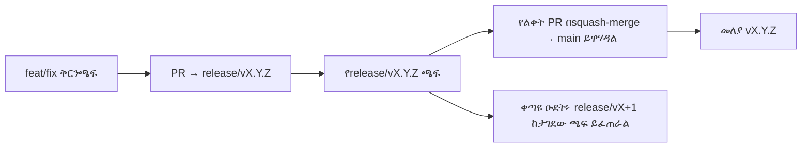

# Branching & Release Model (አማርኛ)

🌐 **Languages:** 🇺🇸 [English](../../../../ops/BRANCHING_MODEL.md) · 🇸🇦 [ar](../../../ar/docs/ops/BRANCHING_MODEL.md) · 🇦🇿 [az](../../../az/docs/ops/BRANCHING_MODEL.md) · 🇧🇬 [bg](../../../bg/docs/ops/BRANCHING_MODEL.md) · 🇧🇩 [bn](../../../bn/docs/ops/BRANCHING_MODEL.md) · 🇧🇦 [bs](../../../bs/docs/ops/BRANCHING_MODEL.md) · 🇨🇿 [cs](../../../cs/docs/ops/BRANCHING_MODEL.md) · 🇩🇰 [da](../../../da/docs/ops/BRANCHING_MODEL.md) · 🇩🇪 [de](../../../de/docs/ops/BRANCHING_MODEL.md) · 🇬🇷 [el](../../../el/docs/ops/BRANCHING_MODEL.md) · 🇪🇸 [es](../../../es/docs/ops/BRANCHING_MODEL.md) · 🇪🇪 [et](../../../et/docs/ops/BRANCHING_MODEL.md) · 🇮🇷 [fa](../../../fa/docs/ops/BRANCHING_MODEL.md) · 🇫🇮 [fi](../../../fi/docs/ops/BRANCHING_MODEL.md) · 🇫🇷 [fr](../../../fr/docs/ops/BRANCHING_MODEL.md) · 🇮🇪 [ga](../../../ga/docs/ops/BRANCHING_MODEL.md) · 🇮🇳 [gu](../../../gu/docs/ops/BRANCHING_MODEL.md) · 🇳🇬 [ha](../../../ha/docs/ops/BRANCHING_MODEL.md) · 🇮🇱 [he](../../../he/docs/ops/BRANCHING_MODEL.md) · 🇮🇳 [hi](../../../hi/docs/ops/BRANCHING_MODEL.md) · 🇭🇷 [hr](../../../hr/docs/ops/BRANCHING_MODEL.md) · 🇭🇺 [hu](../../../hu/docs/ops/BRANCHING_MODEL.md) · 🇦🇲 [hy](../../../hy/docs/ops/BRANCHING_MODEL.md) · 🇮🇩 [id](../../../id/docs/ops/BRANCHING_MODEL.md) · 🇳🇬 [ig](../../../ig/docs/ops/BRANCHING_MODEL.md) · 🇮🇹 [it](../../../it/docs/ops/BRANCHING_MODEL.md) · 🇯🇵 [ja](../../../ja/docs/ops/BRANCHING_MODEL.md) · 🇬🇪 [ka](../../../ka/docs/ops/BRANCHING_MODEL.md) · 🇰🇭 [km](../../../km/docs/ops/BRANCHING_MODEL.md) · 🇮🇳 [kn](../../../kn/docs/ops/BRANCHING_MODEL.md) · 🇰🇷 [ko](../../../ko/docs/ops/BRANCHING_MODEL.md) · 🇱🇹 [lt](../../../lt/docs/ops/BRANCHING_MODEL.md) · 🇱🇻 [lv](../../../lv/docs/ops/BRANCHING_MODEL.md) · 🇮🇳 [ml](../../../ml/docs/ops/BRANCHING_MODEL.md) · 🇮🇳 [mr](../../../mr/docs/ops/BRANCHING_MODEL.md) · 🇲🇾 [ms](../../../ms/docs/ops/BRANCHING_MODEL.md) · 🇲🇹 [mt](../../../mt/docs/ops/BRANCHING_MODEL.md) · 🇲🇲 [my](../../../my/docs/ops/BRANCHING_MODEL.md) · 🇳🇵 [ne](../../../ne/docs/ops/BRANCHING_MODEL.md) · 🇳🇱 [nl](../../../nl/docs/ops/BRANCHING_MODEL.md) · 🇳🇴 [no](../../../no/docs/ops/BRANCHING_MODEL.md) · 🇮🇳 [or](../../../or/docs/ops/BRANCHING_MODEL.md) · 🇮🇳 [pa](../../../pa/docs/ops/BRANCHING_MODEL.md) · 🇵🇭 [phi](../../../phi/docs/ops/BRANCHING_MODEL.md) · 🇵🇱 [pl](../../../pl/docs/ops/BRANCHING_MODEL.md) · 🇵🇹 [pt](../../../pt/docs/ops/BRANCHING_MODEL.md) · 🇧🇷 [pt-BR](../../../pt-BR/docs/ops/BRANCHING_MODEL.md) · 🇷🇴 [ro](../../../ro/docs/ops/BRANCHING_MODEL.md) · 🇷🇺 [ru](../../../ru/docs/ops/BRANCHING_MODEL.md) · 🇱🇰 [si](../../../si/docs/ops/BRANCHING_MODEL.md) · 🇸🇰 [sk](../../../sk/docs/ops/BRANCHING_MODEL.md) · 🇸🇮 [sl](../../../sl/docs/ops/BRANCHING_MODEL.md) · 🇷🇸 [sr](../../../sr/docs/ops/BRANCHING_MODEL.md) · 🇸🇪 [sv](../../../sv/docs/ops/BRANCHING_MODEL.md) · 🇰🇪 [sw](../../../sw/docs/ops/BRANCHING_MODEL.md) · 🇮🇳 [ta](../../../ta/docs/ops/BRANCHING_MODEL.md) · 🇮🇳 [te](../../../te/docs/ops/BRANCHING_MODEL.md) · 🇹🇭 [th](../../../th/docs/ops/BRANCHING_MODEL.md) · 🇹🇷 [tr](../../../tr/docs/ops/BRANCHING_MODEL.md) · 🇺🇦 [uk-UA](../../../uk-UA/docs/ops/BRANCHING_MODEL.md) · 🇵🇰 [ur](../../../ur/docs/ops/BRANCHING_MODEL.md) · 🇺🇿 [uz](../../../uz/docs/ops/BRANCHING_MODEL.md) · 🇻🇳 [vi](../../../vi/docs/ops/BRANCHING_MODEL.md) · 🇳🇬 [yo](../../../yo/docs/ops/BRANCHING_MODEL.md) · 🇨🇳 [zh-CN](../../../zh-CN/docs/ops/BRANCHING_MODEL.md) · 🇹🇼 [zh-TW](../../../zh-TW/docs/ops/BRANCHING_MODEL.md)

---

OmniRoute **ትይዩ-ዑደት** የልቀት ሞዴልን ይጠቀማል፦ ለንቁው ዑደት የተወሰነ `release/vX.Y.Z`
ቅርንጫፍ፣ ለታተመው መስመር `main`፣ እና ያ ዑደት ሲለቀቅ የማይለወጥ
`vX.Y.Z` መለያ። ኮሚቶች በ`release/*` _እና_ በ
`main` ላይ ሲገቡ ማየት የሚጠበቅ ነው — የተደበላለቀ አሠራር አይደለም።

የጥገና ኃላፊዎች ዝርዝር በ`CLAUDE.md` (ጥብቅ ደንብ #21) እና
በ[RELEASE_CHECKLIST.md](./RELEASE_CHECKLIST.md) ውስጥ ይገኛል። ይህ ገጽ ለሕዝብ
የቀረበ፣ ለአስተዋጽዖ አድራጊዎች የተዘጋጀ ማጠቃለያ ነው።

## በአጭሩ

| ማጣቀሻ             | ሚና                                                             |
| ---------------- | -------------------------------------------------------------- |
| `release/vX.Y.Z` | **ንቁ ዑደት** — ለዚያ ስሪት ዕለታዊ ልማት እና የPR ውህደቶች                     |
| `main`           | **የታተመ መስመር** — ልቀቱ ሲወጣ ዑደቱን በsquash-merge ይቀበላል               |
| `vX.Y.Z` (መለያ)   | **የልቀት ምልክት** — በልቀት ጊዜ የሚፈጠር፣ “ምን እንደተለቀቀ” የሚያመለክት የማይለወጥ ጠቋሚ |



## የእኔ PR የትኛውን ቅርንጫፍ ማነጣጠር አለበት?

**ንቁውን `release/vX.Y.Z` ቅርንጫፍ ያነጣጥሩ — `main`ን አይደለም።**

1. ከተከፈቱት `release/v*` ቅርንጫፎች ከፍተኛውን ይፈልጉ (ይህ ሲጻፍ የነበረው ምሳሌ፦
   `release/v3.8.49`)።
2. ከዚያ ጫፍ ቅርንጫፍ ይፍጠሩ (`git fetch` + checkout / rebase ወደዚያ)።
3. PRን **base = ያ `release/vX.Y.Z`** በማድረግ ይክፈቱ።

`main` የዕለት ተዕለት ውህደት ቅርንጫፍ አይደለም። `main`ን በማነጣጠር የተከፈቱ PRዎች
ከመዋሃዳቸው በፊት ብዙውን ጊዜ ወደ ሌላ ቅርንጫፍ እንዲያነጣጥሩ መቀየር ያስፈልጋቸዋል።

## የልቀት ማገድ (ትይዩ ዑደቶች)

አንድ ልቀት በሚጣጣምበት ጊዜ፣ `release-freeze` የሚል መለያ ያለው ምልክት ጉዳይ
ይከፈታል። ይህ **ልማትን አያቆምም**፦

- የታገደው `release/vX.Y.Z` ለዚያ ልቀት የልቀት ኃላፊው ይሆናል።
- አስተዋጽዖ አድራጊዎች ሥራቸውን ማስገባታቸውን እንዲቀጥሉ፣ የቀጣዩ ዑደት `release/vX+1`
  ከታገደው ጫፍ ይፈጠራል።
- አሁንም የታገደውን ቅርንጫፍ የሚያነጣጥሩ ክፍት PRዎች ንቁውን (ከፍተኛውን)
  `release/v*` ቅርንጫፍ **እንዲያነጣጥሩ መቀየር** አለባቸው።

የሚፈልጉት ቅርንጫፍ ሊዋሃድ የሚችል ነው ብለው ከመገመትዎ በፊት፣ ክፍት የማገድ ጉዳይ እንዳለ ያረጋግጡ፦

```bash
gh issue list --repo diegosouzapw/OmniRoute --label release-freeze --state open
```

የውህደት አሠራሮች (የባለቤቱ `queue` መለያ → Mergify) በ
[MERGE_TRAIN.md](./MERGE_TRAIN.md) ውስጥ ተመዝግበዋል።

## ቅርንጫፍና መለያ ሁለቱም ለምን ያስፈልጋሉ?

| ቅርስ              | የቆይታ ጊዜ        | ዓላማ                                                     |
| ---------------- | -------------- | ------------------------------------------------------- |
| `release/vX.Y.Z` | በሂደት ላይ ያለ ዑደት | የተገመገሙ PRዎችን ይሰበስባል፣ CI-green ሆኖ ይቆያል፣ እና የPR መሠረት ይሆናል |
| መለያ `vX.Y.Z`     | ለዘላለም          | ወደ npm / GitHub Releases የተለቀቁትን ትክክለኛ ቢቶች ያመለክታል       |

ቅርንጫፉ የሥራ ቦታ ነው፤ መለያው የታሸገ ጥቅል ነው። ወደ
`main` በsquash-merge ከተዋሃደ በኋላ፣ የቀደመው የልቀት PR እስኪጠናቀቅ ሳይጠብቅ
ቀጣዩ ዑደት በ`release/vX+1` ላይ ይቀጥላል።

## ተዛማጅ ሰነዶች

- [CONTRIBUTING.md](../../CONTRIBUTING.md) — ማዋቀር፣ ሙከራዎች፣ የPR ማረጋገጫ ዝርዝር
- [RELEASE_CHECKLIST.md](./RELEASE_CHECKLIST.md) — ከመልቀቅ በፊት ማረጋገጥ
- [MERGE_TRAIN.md](./MERGE_TRAIN.md) — የውህደት ወረፋ እና አማራጭ የውህደት ባቡር
- [RELEASE_GREEN.md](./RELEASE_GREEN.md) — የልቀት ጫፉን አረንጓዴ አድርጎ ማቆየት
