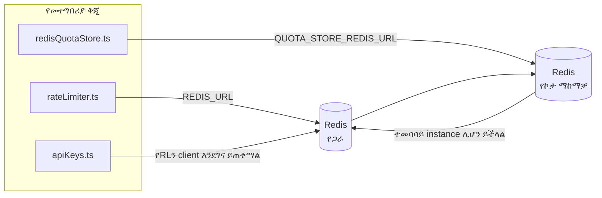

# Redis Production Configuration Guide (አማርኛ)

🌐 **Languages:** 🇺🇸 [English](../../../../ops/REDIS_PRODUCTION_CONFIG.md) · 🇸🇦 [ar](../../../ar/docs/ops/REDIS_PRODUCTION_CONFIG.md) · 🇦🇿 [az](../../../az/docs/ops/REDIS_PRODUCTION_CONFIG.md) · 🇧🇬 [bg](../../../bg/docs/ops/REDIS_PRODUCTION_CONFIG.md) · 🇧🇩 [bn](../../../bn/docs/ops/REDIS_PRODUCTION_CONFIG.md) · 🇨🇿 [cs](../../../cs/docs/ops/REDIS_PRODUCTION_CONFIG.md) · 🇩🇰 [da](../../../da/docs/ops/REDIS_PRODUCTION_CONFIG.md) · 🇩🇪 [de](../../../de/docs/ops/REDIS_PRODUCTION_CONFIG.md) · 🇬🇷 [el](../../../el/docs/ops/REDIS_PRODUCTION_CONFIG.md) · 🇪🇸 [es](../../../es/docs/ops/REDIS_PRODUCTION_CONFIG.md) · 🇪🇪 [et](../../../et/docs/ops/REDIS_PRODUCTION_CONFIG.md) · 🇮🇷 [fa](../../../fa/docs/ops/REDIS_PRODUCTION_CONFIG.md) · 🇫🇮 [fi](../../../fi/docs/ops/REDIS_PRODUCTION_CONFIG.md) · 🇫🇷 [fr](../../../fr/docs/ops/REDIS_PRODUCTION_CONFIG.md) · 🇮🇪 [ga](../../../ga/docs/ops/REDIS_PRODUCTION_CONFIG.md) · 🇮🇳 [gu](../../../gu/docs/ops/REDIS_PRODUCTION_CONFIG.md) · 🇳🇬 [ha](../../../ha/docs/ops/REDIS_PRODUCTION_CONFIG.md) · 🇮🇱 [he](../../../he/docs/ops/REDIS_PRODUCTION_CONFIG.md) · 🇮🇳 [hi](../../../hi/docs/ops/REDIS_PRODUCTION_CONFIG.md) · 🇭🇷 [hr](../../../hr/docs/ops/REDIS_PRODUCTION_CONFIG.md) · 🇭🇺 [hu](../../../hu/docs/ops/REDIS_PRODUCTION_CONFIG.md) · 🇦🇲 [hy](../../../hy/docs/ops/REDIS_PRODUCTION_CONFIG.md) · 🇮🇩 [id](../../../id/docs/ops/REDIS_PRODUCTION_CONFIG.md) · 🇳🇬 [ig](../../../ig/docs/ops/REDIS_PRODUCTION_CONFIG.md) · 🇮🇹 [it](../../../it/docs/ops/REDIS_PRODUCTION_CONFIG.md) · 🇯🇵 [ja](../../../ja/docs/ops/REDIS_PRODUCTION_CONFIG.md) · 🇬🇪 [ka](../../../ka/docs/ops/REDIS_PRODUCTION_CONFIG.md) · 🇰🇭 [km](../../../km/docs/ops/REDIS_PRODUCTION_CONFIG.md) · 🇮🇳 [kn](../../../kn/docs/ops/REDIS_PRODUCTION_CONFIG.md) · 🇰🇷 [ko](../../../ko/docs/ops/REDIS_PRODUCTION_CONFIG.md) · 🇱🇹 [lt](../../../lt/docs/ops/REDIS_PRODUCTION_CONFIG.md) · 🇱🇻 [lv](../../../lv/docs/ops/REDIS_PRODUCTION_CONFIG.md) · 🇮🇳 [ml](../../../ml/docs/ops/REDIS_PRODUCTION_CONFIG.md) · 🇮🇳 [mr](../../../mr/docs/ops/REDIS_PRODUCTION_CONFIG.md) · 🇲🇾 [ms](../../../ms/docs/ops/REDIS_PRODUCTION_CONFIG.md) · 🇲🇹 [mt](../../../mt/docs/ops/REDIS_PRODUCTION_CONFIG.md) · 🇲🇲 [my](../../../my/docs/ops/REDIS_PRODUCTION_CONFIG.md) · 🇳🇵 [ne](../../../ne/docs/ops/REDIS_PRODUCTION_CONFIG.md) · 🇳🇱 [nl](../../../nl/docs/ops/REDIS_PRODUCTION_CONFIG.md) · 🇳🇴 [no](../../../no/docs/ops/REDIS_PRODUCTION_CONFIG.md) · 🇮🇳 [or](../../../or/docs/ops/REDIS_PRODUCTION_CONFIG.md) · 🇮🇳 [pa](../../../pa/docs/ops/REDIS_PRODUCTION_CONFIG.md) · 🇵🇭 [phi](../../../phi/docs/ops/REDIS_PRODUCTION_CONFIG.md) · 🇵🇱 [pl](../../../pl/docs/ops/REDIS_PRODUCTION_CONFIG.md) · 🇵🇹 [pt](../../../pt/docs/ops/REDIS_PRODUCTION_CONFIG.md) · 🇧🇷 [pt-BR](../../../pt-BR/docs/ops/REDIS_PRODUCTION_CONFIG.md) · 🇷🇴 [ro](../../../ro/docs/ops/REDIS_PRODUCTION_CONFIG.md) · 🇷🇺 [ru](../../../ru/docs/ops/REDIS_PRODUCTION_CONFIG.md) · 🇱🇰 [si](../../../si/docs/ops/REDIS_PRODUCTION_CONFIG.md) · 🇸🇰 [sk](../../../sk/docs/ops/REDIS_PRODUCTION_CONFIG.md) · 🇸🇮 [sl](../../../sl/docs/ops/REDIS_PRODUCTION_CONFIG.md) · 🇷🇸 [sr](../../../sr/docs/ops/REDIS_PRODUCTION_CONFIG.md) · 🇸🇪 [sv](../../../sv/docs/ops/REDIS_PRODUCTION_CONFIG.md) · 🇰🇪 [sw](../../../sw/docs/ops/REDIS_PRODUCTION_CONFIG.md) · 🇮🇳 [ta](../../../ta/docs/ops/REDIS_PRODUCTION_CONFIG.md) · 🇮🇳 [te](../../../te/docs/ops/REDIS_PRODUCTION_CONFIG.md) · 🇹🇭 [th](../../../th/docs/ops/REDIS_PRODUCTION_CONFIG.md) · 🇹🇷 [tr](../../../tr/docs/ops/REDIS_PRODUCTION_CONFIG.md) · 🇺🇦 [uk-UA](../../../uk-UA/docs/ops/REDIS_PRODUCTION_CONFIG.md) · 🇵🇰 [ur](../../../ur/docs/ops/REDIS_PRODUCTION_CONFIG.md) · 🇺🇿 [uz](../../../uz/docs/ops/REDIS_PRODUCTION_CONFIG.md) · 🇻🇳 [vi](../../../vi/docs/ops/REDIS_PRODUCTION_CONFIG.md) · 🇳🇬 [yo](../../../yo/docs/ops/REDIS_PRODUCTION_CONFIG.md) · 🇨🇳 [zh-CN](../../../zh-CN/docs/ops/REDIS_PRODUCTION_CONFIG.md) · 🇹🇼 [zh-TW](../../../zh-TW/docs/ops/REDIS_PRODUCTION_CONFIG.md)

---

## አጠቃላይ እይታ

Redis በOmniRoute ውስጥ **አማራጭ፣ ወሳኝ ያልሆነ ጥገኝነት** ነው — Redis በማይገኝበት ጊዜ መተግበሪያው በተገቢ ሁኔታ ወደ አማራጭ አሠራር (በማህደረ ትውስታ ውስጥ
የሚሠሩ አማራጮች) ይሸጋገራል። በምርት አካባቢ Redisን ማስተካከል ለአራት የተለያዩ
የሥራ ጫናዎች መዘግየትን ይቀንሳል፦

| የሥራ ጫና                 | አንቀሳቃሽ                        | የደንበኛ ፋብሪካ                                            | የቁልፍ ንድፍ                                        |
| ---------------------- | ----------------------------- | ----------------------------------------------------- | ----------------------------------------------- |
| የፍጥነት ገደብ              | `rateLimiter.ts`              | `getRedisClient()` — ሲያስፈልግ የሚጀመር `ioredis` singleton | `<prefix>rl:*` በLua አቶሚክ የሆኑ የፍጥነት ገደብ ጊዜ መስኮቶች |
| የማረጋገጫ መሸጎጫ            | `apiKeys.ts`                  | የ`rateLimiter`ን ደንበኛ እንደገና ይጠቀማል                      | `<prefix>auth:api_key:<sha256>` ከTTL ጋር         |
| የኮታ ማከማቻ               | `redisQuotaStore.ts`          | የተለየ `getRedisClient(url)` singleton                  | `<prefix>quota:*` ለእያንዳንዱ instance ሊዋቀር የሚችል    |
| የማሟሟቂያ circuit breaker | `redisCircuitBreakerStore.ts` | በ`circuitBreakerFactory.ts` ውስጥ ያለ የተለየ ደንበኛ          | `<prefix>warmup:cb:<connectionId>`              |

አራቱም የሥራ ጫናዎች OmniRoute ከሌሎች መተግበሪያዎች ጋር በአንድ
Redis instance (ለምሳሌ `127.0.0.1:6379`) ላይ አብሮ እንዲሠራ አንድ የnamespace ቅድመ ቅጥያ ይጋራሉ። [የቁልፍ Namespace አደረጃጀት](#key-namespacing)ን ይመልከቱ።

---

## የአሁኑ ውቅር (የኮድ ነባሪዎች)

| ቅንብር                                | እሴት                                           | የሚገኝበት                                                                                |
| ----------------------------------- | --------------------------------------------- | ------------------------------------------------------------------------------------- |
| `REDIS_URL` የአካባቢ ተለዋዋጭ             | `redis://redis:6379` (compose)፣ አማራጭ          | `rateLimiter.ts:5`, `.env.example`                                                    |
| `REDIS_KEY_PREFIX` የአካባቢ ተለዋዋጭ      | `omniroute:` (ነባሪ)                            | `rateLimiter.ts`, `redisQuotaStore.ts`, `redisCircuitBreakerStore.ts`, `.env.example` |
| `QUOTA_STORE_REDIS_URL` የአካባቢ ተለዋዋጭ | የተለየ፣ ከ`REDIS_URL` ሊለይ ይችላል                   | `quota/storeFactory.ts`                                                               |
| `QUOTA_STORE_DRIVER`                | `"sqlite"` (ነባሪ)፣ `"redis"` አማራጭ              | `quota/storeFactory.ts`                                                               |
| ioredis `maxRetriesPerRequest`      | `3`                                           | የ`rateLimiter.ts` ደንበኛ መፍጠሪያ                                                          |
| `enableReadyCheck`                  | አልተቀናበረም (የioredis ነባሪ፦ `true`)               | —                                                                                     |
| `lazyConnect`                       | አልተቀናበረም (የioredis ነባሪ፦ `false`)              | —                                                                                     |
| `retryStrategy`                     | አልተቀናበረም (የioredis ነባሪ፦ 200ms መሠረት፣ ኤክስፖነንሻል) | —                                                                                     |
| TLS / የይለፍ ቃል / DB መረጃ ጠቋሚ          | **አልተዋቀረም**                                   | —                                                                                     |
| Sentinel / Cluster                  | **አልተዋቀረም** — standalone ባለአንድ-node ብቻ        | —                                                                                     |

---

## የቁልፍ Namespace አደረጃጀት

OmniRoute የRedis instanceን በhost ላይ ከሚሠሩ ሌሎች ማናቸውም ነገሮች ጋር ይጋራል። Namespace ከሌለ፣
እንደ `auth:api_key:<sha256>` ወይም `rl:*` ያሉ ቁልፎች ተመሳሳዩን Redis ከሚጠቀሙ ሌሎች መተግበሪያዎች
ቁልፎች ጋር ሊጋጩ ይችላሉ (ይህ instance Redisን ከሌሎች አገልግሎቶች ጎን ለጎን በ`127.0.0.1:6379` ላይ ያስኬዳል)።

ለ**እያንዳንዱ** የOmniRoute ቁልፍ ቅድመ ቅጥያ ለማከል `REDIS_KEY_PREFIX`ን ባዶ ያልሆነ ሕብረቁምፊ ያድርጉ፦

```bash
# .env — ሁሉም የOmniRoute ቁልፎች omniroute:rl:*, omniroute:auth:*, omniroute:quota:*, omniroute:warmup:cb:* ይሆናሉ
REDIS_KEY_PREFIX=omniroute:
```

- **ነባሪ፦** `omniroute:` (`REDIS_KEY_PREFIX` ካልተቀናበረ ወይም ባዶ ከሆነ ይተገበራል)።
- **የሚተገበርባቸው፦** የፍጥነት ገዳቢ + የማረጋገጫ መሸጎጫ (በ`keyPrefix` በኩል የሚጋራ `ioredis` ደንበኛ)፣
  የኮታ ማከማቻ (`KEY_PREFIX = "${REDIS_KEY_PREFIX}quota"`) እና የማሟሟቂያ circuit breaker
  (`KEY_PREFIX = "${REDIS_KEY_PREFIX}warmup:cb:"`)።
- ቁልፎች በRedis ውስጥ አስቀድመው በሚኖሩበት ጊዜ **ቅድመ ቅጥያውን መቀየር** የድሮ ቁልፎቹን ያለ ተጠቃሚ ያስቀራቸዋል (እነሱም
  በTTL / LRU በኩል ጊዜያቸው ያበቃል)። መቀየሩ ደህንነቱ የተጠበቀ ነው፤ ምንም migration አያስፈልግም። አንዱ ልዩ ሁኔታ የተከለከለ ተብሎ ምልክት ለተደረገበት connection የማሟሟቂያ
  circuit-breaker ቁልፍ ነው፦ ያለ TTL በቋሚነት ይቀመጣል፤ ስለዚህ ቀሪዎቹን በ`redis-cli --scan --pattern '<old-prefix>warmup:cb:*'` ይዘርዝሩና ይሰርዟቸው።
- **ioredis `keyPrefix`** በጽሑፍ ጊዜ ቅድመ ቅጥያውን በራስ-ሰር ይጨምራል፣ በንባብ ጊዜም በራስ-ሰር ያስወግደዋል፤
  ስለዚህ የመተግበሪያው ኮድ ቅድመ ቅጥያውን በፍጹም አያየውም።

---

## የሚመከሩ የምርት አካባቢ ማስተካከያዎች

### 1. የግንኙነት ፑል / የደንበኛ አማራጮች (የioredis `Redis` constructor)

አሁን ያለው ኮድ ያለምንም ብጁ አማራጮች አንድ `new Redis(url)` ይፈጥራል። ለምርት
ባለብዙ-ቅጂ ማሰማራቶች፣ በኮዱ ውስጥ የደንበኛ ፋብሪካ ያስተላልፉ ወይም `getRedisClient()`ን ይጠቅልሉ፦

```typescript
const redis = new Redis(REDIS_URL, {
  maxRetriesPerRequest: null, // የድጋሚ ሙከራ ገደብ የለም፤ retryStrategy እንዲወስን ይተዉት
  enableReadyCheck: true, // ጥሪዎችን ከመቀበሉ በፊት አገልጋዩ ዝግጁ መሆኑን ያረጋግጡ
  lazyConnect: true, // ሲፈጠር አይገናኝ፤ የመጀመሪያውን ጥሪ ይጠብቅ
  retryStrategy: (times) => {
    if (times > 10) return null; // ከ10 ድጋሚ ሙከራዎች በኋላ ይተዉ → በኋላ እንደገና ይገናኙ
    return Math.min(times * 200, 5000); // 200ms፣ 400ms፣ …፣ ከፍተኛው 5s
  },
  enableAutoPipelining: true, // በአንድ ጊዜ የሚከናወኑ ትዕዛዞችን ወደ አንድ የTCP ጽሑፍ ያጣምሩ
  keepAlive: 10000, // በየ10s የTCP keep-alive
});
```

**ቁልፍ የምርጫ ሚዛኖች፦**

- `maxRetriesPerRequest: null` + `retryStrategy` — ጊዜያዊ የRedis ዳግም መጀመሮች እያንዳንዱን
  ጥያቄ ወዲያውኑ እንዳያከሽፉ ለምርት አካባቢ ይመረጣል። በ`checkRateLimit()` ውስጥ ያለው
  የማህደረ ትውስታ አማራጭ የብልሽት መንገዱን ይሸፍናል።
- `lazyConnect: true` — አገልጋዩ ግንኙነቶችን መቀበል ከመጀመሩ በፊት Redis ሥራ ላይ
  መሆኑ የሚፈልግ የጅምር ጥገኝነትን ያስወግዳል።
- `enableAutoPipelining: true` — በአንድ ጊዜ ለሚከናወኑ የፍጥነት-ገደብ ፍተሻዎች የደርሶ-መልስ
  ጉዞዎችን ይቀንሳል፤ በአንድ ግንኙነት ከ50 RPS በላይ ጠቃሚ ነው።

### 2. የRedis አገልጋይ ውቅር (`redis.conf`)

```
# ማህደረ ትውስታ
maxmemory 80%                        # ለOS ገጽ መሸጎጫ ቦታ ይተዉ
maxmemory-policy allkeys-lru         # በጫና ጊዜ የቆዩ የማረጋገጫ መሸጎጫ ግቤቶችን ያስወጡ

# ዘላቂነት (አማራጭ — OmniRoute ያለዚህም ብልሽትን የሚቋቋም ነው)
save 300 1                           # ≥1 ቁልፍ ከተቀየረ ቢያንስ በየ5 ደቂቃው snapshot ያድርጉ
appendonly no                        # AOF አያስፈልግም፤ ውሂቡ እንደገና ሊፈጠር ይችላል
appendfsync no                       # የfsync ተጨማሪ ወጪ የለም (RDB በቂ ነው)

# አውታረ መረብ
timeout 0                            # በሥራ-ፈትነት ምክንያት ግንኙነት አይቋረጥ
tcp-keepalive 300                    # የ5 ደቂቃ keep-alive
tcp-backlog 511                      # ለድንገተኛ ከፍተኛ ጭነት የግንኙነት backlog

# አፈጻጸም
hz 10                                # ነባሪ፤ ለመዘግየት-ስሱ አጠቃቀም 100
activedefrag yes                     # fragmentation >10% ሲሆን በራስ-ሰር ያጠጋጉ
```

**የ`maxmemory-policy allkeys-lru` የምርጫ ሚዛን፦** የማረጋገጫ መሸጎጫ ግቤቶች በማህደረ ትውስታ
ጫና ጊዜ ሊወገዱ ይችላሉ። ይህ ደህንነቱ የተጠበቀ ነው — `setCachedApiKey` በማይገኝበት ጊዜ ሁልጊዜ
እንደገና ይሞላዋል፣ እና የSQLite አማራጭ ባለሥልጣን ምንጭ ነው። የፍጥነት-ገዳቢው Lua script በንድፍ
ለአጭር ጊዜ የሚኖሩ ትናንሽ ቁልፎችን ይፈጥራል።

### 3. የDocker Compose ቅንብሮች

የምርት compose (`docker-compose.prod.yml`) `redis:8.6.2-alpine`ን ይጠቀማል። የሚከተለውን ያክሉ፦

```yaml
redis:
  image: redis:8.6.2-alpine
  command:
    [
      "redis-server",
      "--maxmemory",
      "512mb",
      "--maxmemory-policy",
      "allkeys-lru",
      "--activedefrag",
      "yes",
      "--save",
      "300 1",
    ]
  healthcheck:
    test: ["CMD", "redis-cli", "ping"]
    interval: 10s
    timeout: 3s
    retries: 3
    start_period: 5s
```

### 4. የባለብዙ-ኢንስታንስ / ማስፋፊያ ግምቶች

**ለሁሉም ቅጂዎች አንድ Redis** — የፍጥነት-ገዳቢው Lua script በአንድ
ባለሥልጣን የቁልፍ ክፍተት ላይ ይመረኮዛል። ከቅጂዎች ጀርባ ያሉ በርካታ የRedis ኢንስታንሶች atomicityን
ያሳጣሉ እና በጀቱን በእጥፍ ያሳድጋሉ። ለሁሉም የመተግበሪያ ቅጂዎች አንድ Redis (ወይም failover ያለው
Redis Sentinel cluster) ይጠቀሙ።

**የግንኙነት ብዛት፦** እያንዳንዱ የመተግበሪያ ቅጂ ወደ Redis **2 የTCP ግንኙነቶችን** ይከፍታል
(የፍጥነት ገዳቢ ደንበኛ + የኮታ ማከማቻ ደንበኛ)። በ10 ቅጂዎች → 20 ግንኙነቶች፣ ይህም
ከነባሪ የRedis ኢንስታንስ 10k የግንኙነት ጣሪያ በጣም በታች ነው።

### 5. ክትትል

በጤና-ፍተሻ endpoint በኩል ያጋልጡ፦

```typescript
// src/app/api/monitoring/health/route.ts አስቀድሞ የrateLimiter ፋንክሽኖችን ይጠራል
// ለRedis የተወሰኑ ፍተሻዎችን ያክሉ፦
//   1. የPING መዘግየትን በioredis .ping()
//   2. የማህደረ ትውስታ አጠቃቀምን በINFO memory
//   3. የግንኙነት ብዛትን በINFO clients
//   4. የmaxmemory-policy የስኬት መጠንን (evicted_keys / keyspace_hits)
```

መከታተል ያለባቸው ቁልፍ መለኪያዎች፦

- **በሰከንድ የሚወገዱ ቁልፎች** — ያለማቋረጥ ከዜሮ በላይ ከሆነ፣ `maxmemory`ን ይጨምሩ
- **የታገዱ ደንበኞች** — ከዜሮ በላይ መሆን ዘገምተኛ Lua scripts ወይም ከፍተኛ ፉክክርን ያመለክታል
- **ውድቅ የተደረጉ ግንኙነቶች** — የግንኙነት ገደቡ ላይ ተደርሷል፤ በ20 ግንኙነቶች ይህ አልፎ አልፎ ብቻ ይከሰታል

---

## የአርክቴክቸር ሥዕላዊ መግለጫ



---

## ማጣቀሻዎች

| ፋይል                                | ዓላማ                                                                 |
| ---------------------------------- | ------------------------------------------------------------------- |
| `src/shared/utils/rateLimiter.ts`  | ዋናው Redis client፣ የLua የፍጥነት ገደብ script፣ እና በማህደረ ትውስታ ውስጥ fallback |
| `src/lib/db/apiKeys.ts`            | የማረጋገጫ cache — Redis→SQLite fallback                                |
| `src/lib/quota/redisQuotaStore.ts` | ለአማራጭ የኮታ ማከማቻ የተለየ Redis client                                    |
| `src/lib/quota/storeFactory.ts`    | በ`sqlite` እና `redis` የኮታ drivers መካከል ይቀያየራል                        |
| `docker-compose.prod.yml`          | የምርት Redis container (image `redis:8.6.2-alpine`)                   |
| `.env.example`                     | የRedis env vars ሰነድ                                                 |
| `src/app/api/local/redis/`         | ለልማት container orchestration የAPI routes                            |
| `bin/cli/commands/redis.mjs`       | ለልማት container orchestration የCLI commands                          |
