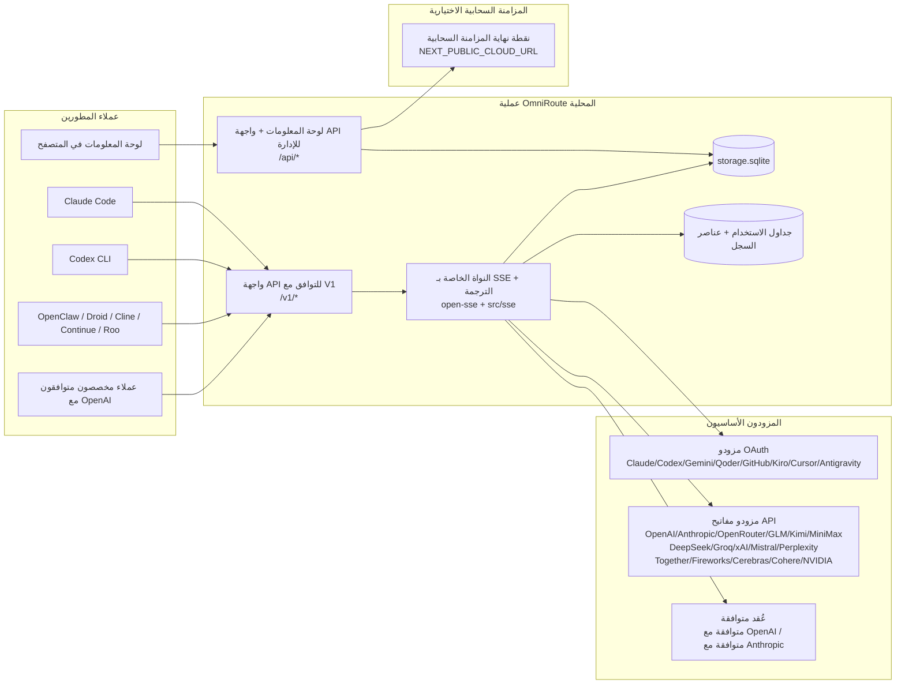
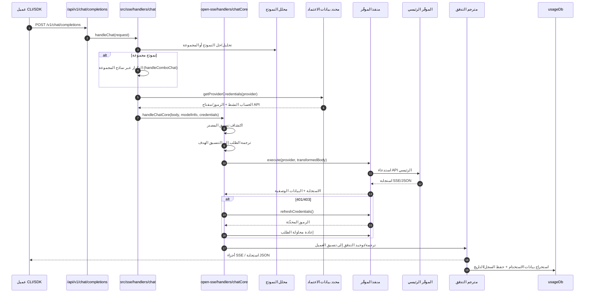
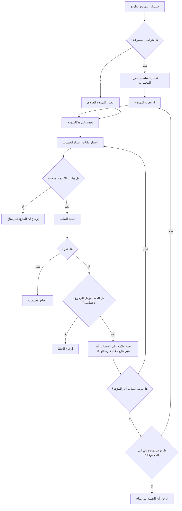
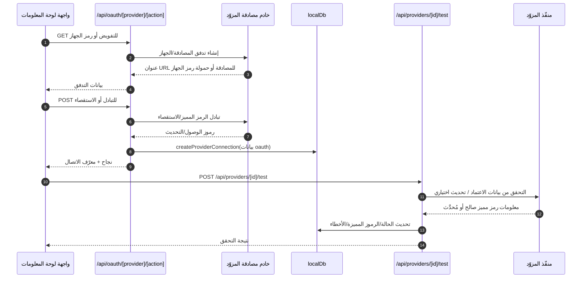
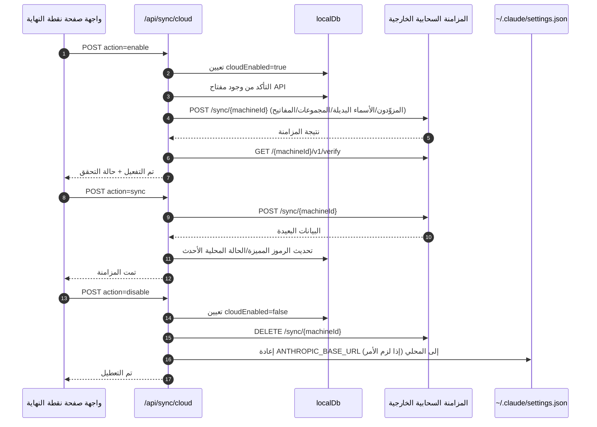
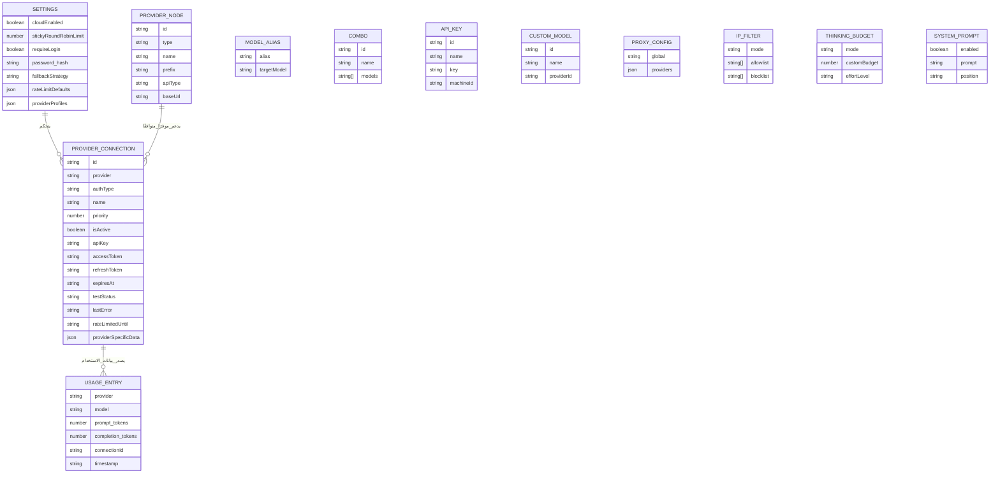
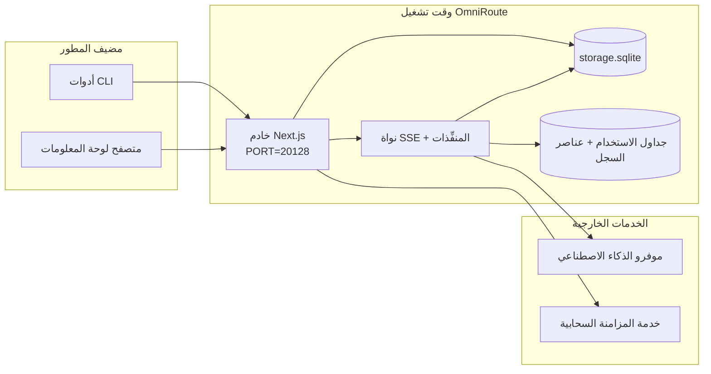

# OmniRoute Architecture (العربية)

🌐 **Languages:** 🇺🇸 [English](../../../../architecture/ARCHITECTURE.md) · 🇪🇹 [am](../../../am/docs/architecture/ARCHITECTURE.md) · 🇦🇿 [az](../../../az/docs/architecture/ARCHITECTURE.md) · 🇧🇬 [bg](../../../bg/docs/architecture/ARCHITECTURE.md) · 🇧🇩 [bn](../../../bn/docs/architecture/ARCHITECTURE.md) · 🇨🇿 [cs](../../../cs/docs/architecture/ARCHITECTURE.md) · 🇩🇰 [da](../../../da/docs/architecture/ARCHITECTURE.md) · 🇩🇪 [de](../../../de/docs/architecture/ARCHITECTURE.md) · 🇬🇷 [el](../../../el/docs/architecture/ARCHITECTURE.md) · 🇪🇸 [es](../../../es/docs/architecture/ARCHITECTURE.md) · 🇪🇪 [et](../../../et/docs/architecture/ARCHITECTURE.md) · 🇮🇷 [fa](../../../fa/docs/architecture/ARCHITECTURE.md) · 🇫🇮 [fi](../../../fi/docs/architecture/ARCHITECTURE.md) · 🇫🇷 [fr](../../../fr/docs/architecture/ARCHITECTURE.md) · 🇮🇪 [ga](../../../ga/docs/architecture/ARCHITECTURE.md) · 🇮🇳 [gu](../../../gu/docs/architecture/ARCHITECTURE.md) · 🇳🇬 [ha](../../../ha/docs/architecture/ARCHITECTURE.md) · 🇮🇱 [he](../../../he/docs/architecture/ARCHITECTURE.md) · 🇮🇳 [hi](../../../hi/docs/architecture/ARCHITECTURE.md) · 🇭🇷 [hr](../../../hr/docs/architecture/ARCHITECTURE.md) · 🇭🇺 [hu](../../../hu/docs/architecture/ARCHITECTURE.md) · 🇦🇲 [hy](../../../hy/docs/architecture/ARCHITECTURE.md) · 🇮🇩 [id](../../../id/docs/architecture/ARCHITECTURE.md) · 🇳🇬 [ig](../../../ig/docs/architecture/ARCHITECTURE.md) · 🇮🇹 [it](../../../it/docs/architecture/ARCHITECTURE.md) · 🇯🇵 [ja](../../../ja/docs/architecture/ARCHITECTURE.md) · 🇬🇪 [ka](../../../ka/docs/architecture/ARCHITECTURE.md) · 🇰🇭 [km](../../../km/docs/architecture/ARCHITECTURE.md) · 🇮🇳 [kn](../../../kn/docs/architecture/ARCHITECTURE.md) · 🇰🇷 [ko](../../../ko/docs/architecture/ARCHITECTURE.md) · 🇱🇹 [lt](../../../lt/docs/architecture/ARCHITECTURE.md) · 🇱🇻 [lv](../../../lv/docs/architecture/ARCHITECTURE.md) · 🇮🇳 [ml](../../../ml/docs/architecture/ARCHITECTURE.md) · 🇮🇳 [mr](../../../mr/docs/architecture/ARCHITECTURE.md) · 🇲🇾 [ms](../../../ms/docs/architecture/ARCHITECTURE.md) · 🇲🇹 [mt](../../../mt/docs/architecture/ARCHITECTURE.md) · 🇲🇲 [my](../../../my/docs/architecture/ARCHITECTURE.md) · 🇳🇵 [ne](../../../ne/docs/architecture/ARCHITECTURE.md) · 🇳🇱 [nl](../../../nl/docs/architecture/ARCHITECTURE.md) · 🇳🇴 [no](../../../no/docs/architecture/ARCHITECTURE.md) · 🇮🇳 [or](../../../or/docs/architecture/ARCHITECTURE.md) · 🇮🇳 [pa](../../../pa/docs/architecture/ARCHITECTURE.md) · 🇵🇭 [phi](../../../phi/docs/architecture/ARCHITECTURE.md) · 🇵🇱 [pl](../../../pl/docs/architecture/ARCHITECTURE.md) · 🇵🇹 [pt](../../../pt/docs/architecture/ARCHITECTURE.md) · 🇧🇷 [pt-BR](../../../pt-BR/docs/architecture/ARCHITECTURE.md) · 🇷🇴 [ro](../../../ro/docs/architecture/ARCHITECTURE.md) · 🇷🇺 [ru](../../../ru/docs/architecture/ARCHITECTURE.md) · 🇱🇰 [si](../../../si/docs/architecture/ARCHITECTURE.md) · 🇸🇰 [sk](../../../sk/docs/architecture/ARCHITECTURE.md) · 🇸🇮 [sl](../../../sl/docs/architecture/ARCHITECTURE.md) · 🇷🇸 [sr](../../../sr/docs/architecture/ARCHITECTURE.md) · 🇸🇪 [sv](../../../sv/docs/architecture/ARCHITECTURE.md) · 🇰🇪 [sw](../../../sw/docs/architecture/ARCHITECTURE.md) · 🇮🇳 [ta](../../../ta/docs/architecture/ARCHITECTURE.md) · 🇮🇳 [te](../../../te/docs/architecture/ARCHITECTURE.md) · 🇹🇭 [th](../../../th/docs/architecture/ARCHITECTURE.md) · 🇹🇷 [tr](../../../tr/docs/architecture/ARCHITECTURE.md) · 🇺🇦 [uk-UA](../../../uk-UA/docs/architecture/ARCHITECTURE.md) · 🇵🇰 [ur](../../../ur/docs/architecture/ARCHITECTURE.md) · 🇺🇿 [uz](../../../uz/docs/architecture/ARCHITECTURE.md) · 🇻🇳 [vi](../../../vi/docs/architecture/ARCHITECTURE.md) · 🇳🇬 [yo](../../../yo/docs/architecture/ARCHITECTURE.md) · 🇨🇳 [zh-CN](../../../zh-CN/docs/architecture/ARCHITECTURE.md) · 🇹🇼 [zh-TW](../../../zh-TW/docs/architecture/ARCHITECTURE.md)

---

🌐 **Languages:** 🇺🇸 [English](../../../../architecture/ARCHITECTURE.md) · 🇪🇹 [am](../../../am/docs/architecture/ARCHITECTURE.md) · 🇦🇿 [az](../../../az/docs/architecture/ARCHITECTURE.md) · 🇧🇬 [bg](../../../bg/docs/architecture/ARCHITECTURE.md) · 🇧🇩 [bn](../../../bn/docs/architecture/ARCHITECTURE.md) · 🇨🇿 [cs](../../../cs/docs/architecture/ARCHITECTURE.md) · 🇩🇰 [da](../../../da/docs/architecture/ARCHITECTURE.md) · 🇩🇪 [de](../../../de/docs/architecture/ARCHITECTURE.md) · 🇬🇷 [el](../../../el/docs/architecture/ARCHITECTURE.md) · 🇪🇸 [es](../../../es/docs/architecture/ARCHITECTURE.md) · 🇪🇪 [et](../../../et/docs/architecture/ARCHITECTURE.md) · 🇮🇷 [fa](../../../fa/docs/architecture/ARCHITECTURE.md) · 🇫🇮 [fi](../../../fi/docs/architecture/ARCHITECTURE.md) · 🇫🇷 [fr](../../../fr/docs/architecture/ARCHITECTURE.md) · 🇮🇪 [ga](../../../ga/docs/architecture/ARCHITECTURE.md) · 🇮🇳 [gu](../../../gu/docs/architecture/ARCHITECTURE.md) · 🇳🇬 [ha](../../../ha/docs/architecture/ARCHITECTURE.md) · 🇮🇱 [he](../../../he/docs/architecture/ARCHITECTURE.md) · 🇮🇳 [hi](../../../hi/docs/architecture/ARCHITECTURE.md) · 🇭🇷 [hr](../../../hr/docs/architecture/ARCHITECTURE.md) · 🇭🇺 [hu](../../../hu/docs/architecture/ARCHITECTURE.md) · 🇦🇲 [hy](../../../hy/docs/architecture/ARCHITECTURE.md) · 🇮🇩 [id](../../../id/docs/architecture/ARCHITECTURE.md) · 🇳🇬 [ig](../../../ig/docs/architecture/ARCHITECTURE.md) · 🇮🇹 [it](../../../it/docs/architecture/ARCHITECTURE.md) · 🇯🇵 [ja](../../../ja/docs/architecture/ARCHITECTURE.md) · 🇬🇪 [ka](../../../ka/docs/architecture/ARCHITECTURE.md) · 🇰🇭 [km](../../../km/docs/architecture/ARCHITECTURE.md) · 🇮🇳 [kn](../../../kn/docs/architecture/ARCHITECTURE.md) · 🇰🇷 [ko](../../../ko/docs/architecture/ARCHITECTURE.md) · 🇱🇹 [lt](../../../lt/docs/architecture/ARCHITECTURE.md) · 🇱🇻 [lv](../../../lv/docs/architecture/ARCHITECTURE.md) · 🇮🇳 [ml](../../../ml/docs/architecture/ARCHITECTURE.md) · 🇮🇳 [mr](../../../mr/docs/architecture/ARCHITECTURE.md) · 🇲🇾 [ms](../../../ms/docs/architecture/ARCHITECTURE.md) · 🇲🇹 [mt](../../../mt/docs/architecture/ARCHITECTURE.md) · 🇲🇲 [my](../../../my/docs/architecture/ARCHITECTURE.md) · 🇳🇵 [ne](../../../ne/docs/architecture/ARCHITECTURE.md) · 🇳🇱 [nl](../../../nl/docs/architecture/ARCHITECTURE.md) · 🇳🇴 [no](../../../no/docs/architecture/ARCHITECTURE.md) · 🇮🇳 [or](../../../or/docs/architecture/ARCHITECTURE.md) · 🇮🇳 [pa](../../../pa/docs/architecture/ARCHITECTURE.md) · 🇵🇭 [phi](../../../phi/docs/architecture/ARCHITECTURE.md) · 🇵🇱 [pl](../../../pl/docs/architecture/ARCHITECTURE.md) · 🇵🇹 [pt](../../../pt/docs/architecture/ARCHITECTURE.md) · 🇧🇷 [pt-BR](../../../pt-BR/docs/architecture/ARCHITECTURE.md) · 🇷🇴 [ro](../../../ro/docs/architecture/ARCHITECTURE.md) · 🇷🇺 [ru](../../../ru/docs/architecture/ARCHITECTURE.md) · 🇱🇰 [si](../../../si/docs/architecture/ARCHITECTURE.md) · 🇸🇰 [sk](../../../sk/docs/architecture/ARCHITECTURE.md) · 🇸🇮 [sl](../../../sl/docs/architecture/ARCHITECTURE.md) · 🇷🇸 [sr](../../../sr/docs/architecture/ARCHITECTURE.md) · 🇸🇪 [sv](../../../sv/docs/architecture/ARCHITECTURE.md) · 🇰🇪 [sw](../../../sw/docs/architecture/ARCHITECTURE.md) · 🇮🇳 [ta](../../../ta/docs/architecture/ARCHITECTURE.md) · 🇮🇳 [te](../../../te/docs/architecture/ARCHITECTURE.md) · 🇹🇭 [th](../../../th/docs/architecture/ARCHITECTURE.md) · 🇹🇷 [tr](../../../tr/docs/architecture/ARCHITECTURE.md) · 🇺🇦 [uk-UA](../../../uk-UA/docs/architecture/ARCHITECTURE.md) · 🇵🇰 [ur](../../../ur/docs/architecture/ARCHITECTURE.md) · 🇺🇿 [uz](../../../uz/docs/architecture/ARCHITECTURE.md) · 🇻🇳 [vi](../../../vi/docs/architecture/ARCHITECTURE.md) · 🇳🇬 [yo](../../../yo/docs/architecture/ARCHITECTURE.md) · 🇨🇳 [zh-CN](../../../zh-CN/docs/architecture/ARCHITECTURE.md) · 🇹🇼 [zh-TW](../../../zh-TW/docs/architecture/ARCHITECTURE.md)

_آخر تحديث: 2026-06-28_

## الملخص التنفيذي

OmniRoute هي بوابة توجيه محلية للذكاء الاصطناعي ولوحة معلومات مبنية على Next.js.
توفر نقطة نهاية واحدة متوافقة مع OpenAI (`/v1/*`)، وتوجّه حركة المرور عبر عدة مزوّدين علويين مع الترجمة، والانتقال الاحتياطي، وتحديث الرموز، وتتبع الاستخدام.

القدرات الأساسية:

- واجهة API متوافقة مع OpenAI لأدوات سطر الأوامر/الأدوات (355 مزوّدًا، و108 منفّذات)
- ترجمة الطلبات/الاستجابات بين تنسيقات المزوّدين
- انتقال احتياطي لمجموعة النماذج (تسلسل متعدد النماذج)
- خطوات مجموعة منظّمة (`provider + model + connection`) مع ترتيب وقت التشغيل حسب `compositeTiers`
- انتقال احتياطي على مستوى الحساب (حسابات متعددة لكل مزوّد)
- فحص مسبق للحصة واختيار حساب P2C مدرك للحصة في مسار الدردشة الرئيسي
- إدارة اتصالات المزوّدين عبر OAuth + مفاتيح API ‏(22 وحدة لمزوّدي OAuth)
- إنشاء التضمينات عبر `/v1/embeddings` ‏(18 مزوّدًا)
- إنشاء الصور عبر `/v1/images/generations` ‏(أكثر من 10 مزوّدين، وأكثر من 20 نموذجًا)
- نسخ الصوت عبر `/v1/audio/transcriptions` ‏(18 مزوّدًا)
- تحويل النص إلى كلام عبر `/v1/audio/speech` ‏(24 مزوّدًا مضمّنًا)
- إنشاء الفيديو عبر `/v1/videos/generations` ‏(ComfyUI + SD WebUI)
- إنشاء الموسيقى عبر `/v1/music/generations` ‏(ComfyUI)
- البحث على الويب عبر `/v1/search` ‏(20 مزوّدًا)
- الإشراف على المحتوى عبر `/v1/moderations`
- إعادة الترتيب عبر `/v1/rerank`
- تحليل وسوم التفكير (`<think>...</think>`) لنماذج الاستدلال
- تنقية الاستجابات لضمان التوافق الصارم مع OpenAI SDK
- توحيد الأدوار (developer→system، وsystem→user) لتحقيق التوافق بين المزوّدين
- تحويل المخرجات المنظّمة (json_schema → Gemini responseSchema)
- تخزين محلي دائم للمزوّدين، والمفاتيح، والأسماء البديلة، والمجموعات، والإعدادات، والتسعير (122 وحدة لقاعدة البيانات)
- تتبع الاستخدام/التكلفة وتسجيل الطلبات
- مزامنة سحابية اختيارية للمزامنة بين أجهزة متعددة/مزامنة الحالة
- قائمة سماح/حظر لعناوين IP للتحكم في الوصول إلى API
- إدارة ميزانية التفكير (التمرير المباشر/التلقائي/المخصص/التكيفي)
- حقن مطالبة نظام عامة
- تتبع الجلسات وإنشاء بصماتها
- تحديد محسّن لمعدل الطلبات لكل حساب، مع ملفات تعريف خاصة بالمزوّدين
- نمط قاطع الدائرة لتعزيز مرونة المزوّدين
- حماية من الاندفاع المتزامن للطلبات باستخدام قفل mutex
- ذاكرة تخزين مؤقت لإزالة تكرار الطلبات استنادًا إلى التوقيع
- طبقة النطاق: قواعد التكلفة، وسياسة الانتقال الاحتياطي، وسياسة الحظر
- ترحيل السياق: ملخصات تسليم الجلسات للحفاظ على الاستمرارية عند تدوير الحسابات
- استمرارية حالة النطاق (ذاكرة تخزين مؤقت بالكتابة الفورية إلى SQLite لعمليات الانتقال الاحتياطي، والميزانيات، والحظر، وقواطع الدائرة)
- محرك سياسات لتقييم الطلبات مركزيًا (الحظر → الميزانية → الانتقال الاحتياطي)
- قياس الطلبات عن بُعد مع تجميع زمن الاستجابة وفق p50/p95/p99
- قياس أهداف المجموعات عن بُعد والسجل التاريخي لصحة أهداف المجموعات عبر `combo_execution_key` / `combo_step_id`
- معرّف الارتباط (X-Request-Id) للتتبع من طرف إلى طرف
- تسجيل تدقيق الامتثال مع إمكانية إلغاء الاشتراك لكل مفتاح API
- إطار تقييم لضمان جودة LLM
- لوحة معلومات للحالة مع عرض فوري لحالة قاطع الدائرة لدى المزوّدين
- خادم MCP ‏(110 أدوات) مع 3 وسائل نقل (stdio/SSE/Streamable HTTP)
- خادم A2A ‏(JSON-RPC 2.0 + SSE) مع المهارات ودورة حياة المهام
- نظام ذاكرة (الاستخراج، والحقن، والاسترجاع، والتلخيص)
- نظام مهارات (السجل، والمنفّذ، ووضع الحماية، والمهارات المضمّنة)
- وكيل MITM مع إدارة الشهادات ومعالجة DNS
- برمجية وسيطة للحماية من حقن المطالبات
- مسار لضغط المطالبات باستخدام Caveman وRTK والمسارات المكدّسة ومجموعات الضغط وحزم اللغات والتحليلات
- سجل ACP ‏(Agent Communication Protocol)
- مزوّدو OAuth معياريون (22 وحدة منفردة ضمن `src/lib/oauth/providers/`)
- نصوص برمجية لإلغاء التثبيت/إلغاء التثبيت الكامل
- إجراء لإصلاح بيئة OAuth
- جسر WebSocket لعملاء WS المتوافقين مع OpenAI ‏(`/v1/ws`)
- إدارة رموز المزامنة (الإصدار/الإبطال، وتنزيل حزمة إعدادات ذات إصدارات مستندة إلى ETag)
- الإعداد المسبق لمزوّد GLM Thinking ‏(`glmt`) كخيار أساسي
- عدّ هجين للرموز (باستخدام `/messages/count_tokens` من جانب المزوّد مع الرجوع إلى التقدير)
- تهيئة تلقائية للأسماء البديلة للنماذج (أكثر من 30 عملية توحيد للهجات الوكلاء المختلفة عند بدء التشغيل)
- جلب صادر آمن مع حماية SSRF، وحظر عناوين URL الخاصة، وإعادة محاولة قابلة للتهيئة
- إعادة محاولات الدردشة مع مراعاة فترة التهدئة، باستخدام `requestRetry` و`maxRetryIntervalSec` القابلين للتهيئة
- التحقق من بيئة وقت التشغيل باستخدام Zod عند بدء التشغيل
- تدقيق الامتثال v2 مع ترقيم الصفحات، وأحداث CRUD للمزوّدين، وتسجيل عمليات التحقق المحظورة بواسطة SSRF

نموذج وقت التشغيل الأساسي:

- تنفّذ مسارات تطبيق Next.js ضمن `src/app/api/*` كلاً من واجهات API للوحة المعلومات وواجهات API للتوافق
- تتولى نواة مشتركة لـSSE/التوجيه ضمن `src/sse/*` + `open-sse/*` تنفيذ المزوّدين، والترجمة، والبث، والانتقال الاحتياطي، والاستخدام

## المخططات المرجعية

توجد مصادر Mermaid الأساسية والخاضعة للتحكم في الإصدارات لمنصة v3.8.0 في
[`docs/diagrams/`](../diagrams/README.md). أُعيد عرض اثنين منها أدناه لتوفير نظرة عامة؛
أما البقية فتوجد روابط إليها في الأدلة الخاصة بنطاقاتها.


> المصدر: [diagrams/request-pipeline.mmd](../diagrams/request-pipeline.mmd)


> المصدر: [diagrams/resilience-3layers.mmd](../diagrams/resilience-3layers.mmd) — مرتبط أيضًا من
> [RESILIENCE_GUIDE.md](./RESILIENCE_GUIDE.md) ومرجع المرونة في `CLAUDE.md`.

## النطاق والحدود

### ضمن النطاق

- وقت تشغيل البوابة المحلية
- واجهات API لإدارة لوحة المعلومات
- مصادقة المزوّد وتحديث الرموز المميزة
- ترجمة الطلبات والبث عبر SSE
- الحالة المحلية + حفظ بيانات الاستخدام
- تنسيق المزامنة السحابية الاختيارية

### خارج النطاق

- تنفيذ الخدمة السحابية خلف `NEXT_PUBLIC_CLOUD_URL`
- اتفاقية مستوى الخدمة/طبقة التحكم الخاصة بالمزوّد خارج العملية المحلية
- ملفات CLI التنفيذية الخارجية نفسها (Claude CLI وCodex CLI وغيرها)

## واجهة لوحة المعلومات (الحالية)

الصفحات الرئيسية ضمن `src/app/(dashboard)/dashboard/`:

- `/dashboard` — بدء سريع + نظرة عامة على المزوّدين
- `/dashboard/endpoint` — وكيل نقطة النهاية + MCP + A2A + علامات تبويب نقاط نهاية API
- `/dashboard/providers` — اتصالات المزوّدين وبيانات الاعتماد
- `/dashboard/combos` — استراتيجيات التجميع والقوالب وأداة إنشاء قائمة على الخطوات وقواعد توجيه النماذج والترتيب اليدوي المحفوظ
- `/dashboard/auto-combo` — محرك Auto Combo: أوزان التقييم وحزم الأوضاع والإعدادات المسبقة للمصنع الافتراضي وبيانات القياس عن بُعد
- `/dashboard/costs` — تجميع التكاليف وإظهار الأسعار
- `/dashboard/analytics` — تحليلات الاستخدام والتقييمات وحالة أهداف التجميع
- `/dashboard/limits` — عناصر التحكم في الحصص/المعدلات
- `/dashboard/cli-tools` — إعداد CLI الأولي واكتشاف وقت التشغيل وإنشاء الإعدادات
- `/dashboard/agents` — وكلاء ACP المكتشفون + تسجيل الوكلاء المخصصين
- `/dashboard/cloud-agents` — مهام الوكلاء المستضافين سحابيًا (Codex Cloud وDevin وJules) ودورة حياة المهام
- `/dashboard/skills` — سجل مهارات A2A والتنفيذ ضمن بيئة معزولة وكتالوج المهارات المدمجة
- `/dashboard/memory` — فحص الذاكرة الحوارية الدائمة واسترجاعها
- `/dashboard/webhooks` — اشتراكات خطافات الويب الصادرة وتدوير الأسرار وإحصاءات إعادة المحاولة
- `/dashboard/batch` — إرسال المهام الدفعية ومتابعة تقدمها
- `/dashboard/cache` — إحصاءات ذاكرة التخزين المؤقت للقراءة المباشرة والاستدلال وعناصر التحكم في الإخلاء
- `/dashboard/playground` — ساحة محادثة تفاعلية مع أي تجميع/نموذج مُعدّ
- `/dashboard/changelog` — عارض سجل التغييرات داخل التطبيق (يعرض `CHANGELOG.md`)
- `/dashboard/system` — تشخيصات وقت التشغيل ومعلومات الإصدار وواجهة التحقق من البيئة
- `/dashboard/onboarding` — معالج الإعداد عند التشغيل الأول لعمليات التثبيت الجديدة
- `/dashboard/media` — ساحة للصور/الفيديو/الموسيقى
- `/dashboard/search-tools` — اختبار مزوّدي البحث والسجل
- `/dashboard/health` — مدة التشغيل وقواطع الدوائر وحدود المعدل والجلسات الخاضعة لمراقبة الحصص
- `/dashboard/logs` — سجلات الطلبات/الوكيل/التدقيق/وحدة التحكم
- `/dashboard/settings` — علامات تبويب إعدادات النظام (العامة والتوجيه وإعدادات التجميع الافتراضية وغيرها)
- `/dashboard/context/caveman` — قواعد ضغط Caveman وحزم اللغات والمعاينة ووضع الإخراج
- `/dashboard/context/rtk` — مرشحات مخرجات أوامر RTK والمعاينة وإعدادات أمان وقت التشغيل
- `/dashboard/context/combos` — مسارات ضغط مسمّاة ومُعيّنة لتجميعات التوجيه
- `/dashboard/translator` — فحص المترجم ومعاينة تحويل تنسيق الطلب
- `/dashboard/audit` — متصفح سجل تدقيق الامتثال مع ترقيم الصفحات والبيانات الوصفية المنظمة
- `/dashboard/usage` — متصفح استخدام لكل طلب مرتبط بـ `usage_history`
- `/dashboard/compression` — تحليلات الضغط والإحصاءات وتعيين مسارات المعالجة
- `/dashboard/api-manager` — دورة حياة مفاتيح API وأذونات النماذج

## سياق النظام عالي المستوى



## مكونات بيئة التشغيل الأساسية

## 1) طبقة API والتوجيه (مسارات تطبيق Next.js)

الأدلة الرئيسية:

- `src/app/api/v1/*` و`src/app/api/v1beta/*` لواجهات API الخاصة بالتوافق
- `src/app/api/*` لواجهات API الخاصة بالإدارة/التهيئة
- تعيد قواعد إعادة الكتابة في Next ضمن `next.config.mjs` توجيه `/v1/*` إلى `/api/v1/*`

مسارات التوافق المهمة:

- `src/app/api/v1/chat/completions/route.ts`
- `src/app/api/v1/messages/route.ts`
- `src/app/api/v1/responses/route.ts`
- `src/app/api/v1/models/route.ts` — يتضمن النماذج المخصصة التي تحمل `custom: true`
- `src/app/api/v1/embeddings/route.ts` — إنشاء التضمينات (6 مزودين)
- `src/app/api/v1/images/generations/route.ts` — إنشاء الصور (أكثر من 4 مزودين، بما في ذلك Antigravity/Nebius)
- `src/app/api/v1/messages/count_tokens/route.ts`
- `src/app/api/v1/providers/[provider]/chat/completions/route.ts` — محادثة مخصصة لكل مزود
- `src/app/api/v1/providers/[provider]/embeddings/route.ts` — تضمينات مخصصة لكل مزود
- `src/app/api/v1/providers/[provider]/images/generations/route.ts` — صور مخصصة لكل مزود
- `src/app/api/v1beta/models/route.ts`
- `src/app/api/v1beta/models/[...path]/route.ts`

نطاقات الإدارة:

- المصادقة/الإعدادات: `src/app/api/auth/*`، `src/app/api/settings/*`
- المزودون/الاتصالات: `src/app/api/providers*`
- عُقد المزودين: `src/app/api/provider-nodes*`
- النماذج المخصصة: `src/app/api/provider-models` (GET/POST/DELETE)
- كتالوج النماذج: `src/app/api/models/route.ts` (GET)
- تهيئة الوكيل: `src/app/api/settings/proxy` (GET/PUT/DELETE) + `src/app/api/settings/proxy/test` (POST)
- OAuth: `src/app/api/oauth/*`
- المفاتيح/الأسماء المستعارة/التركيبات/التسعير: `src/app/api/keys*`، `src/app/api/models/alias`، `src/app/api/combos*`، `src/app/api/pricing`
- الاستخدام: `src/app/api/usage/*`
- المزامنة/السحابة: `src/app/api/sync/*`، `src/app/api/cloud/*`
- أدوات مساعدة لأدوات CLI: `src/app/api/cli-tools/*`
- تصفية عناوين IP: `src/app/api/settings/ip-filter` (GET/PUT)
- ميزانية التفكير: `src/app/api/settings/thinking-budget` (GET/PUT)
- مطالبة النظام: `src/app/api/settings/system-prompt` (GET/PUT)
- الضغط: `src/app/api/settings/compression`، `src/app/api/compression/*`، و
  `src/app/api/context/*`
- الجلسات: `src/app/api/sessions` (GET)
- حدود المعدل: `src/app/api/rate-limits` (GET)
- المرونة: `src/app/api/resilience` (GET/PATCH) — تهيئة قائمة انتظار الطلبات، وفترة تهدئة الاتصال، وقاطع دائرة المزود، وانتظار انتهاء فترة التهدئة
- إعادة ضبط المرونة: `src/app/api/resilience/reset` (POST) — إعادة ضبط قواطع دوائر المزودين
- إحصاءات ذاكرة التخزين المؤقت: `src/app/api/cache/stats` (GET/DELETE)
- القياس عن بُعد: `src/app/api/telemetry/summary` (GET)
- الميزانية: `src/app/api/usage/budget` (GET/POST)
- سلاسل التحويل الاحتياطي: `src/app/api/fallback/chains` (GET/POST/DELETE)
- تدقيق الامتثال: `src/app/api/compliance/audit-log` (GET، مع ترقيم الصفحات + بيانات وصفية مهيكلة)
- التقييمات: `src/app/api/evals` (GET/POST)، `src/app/api/evals/[suiteId]` (GET)
- السياسات: `src/app/api/policies` (GET/POST)
- رموز المزامنة: `src/app/api/sync/tokens` (GET/POST)، `src/app/api/sync/tokens/[id]` (GET/DELETE)
- حزمة التهيئة: `src/app/api/sync/bundle` (GET، لقطة ذات إصدار ETag للإعدادات/المزودين/التركيبات/المفاتيح)
- WebSocket: `src/app/api/v1/ws/route.ts` — معالج Upgrade لعملاء WS المتوافقين مع OpenAI

## 2) SSE + نواة الترجمة

وحدات التدفق الرئيسية:

- نقطة الدخول: `src/sse/handlers/chat.ts`
- التنسيق الأساسي: `open-sse/handlers/chatCore.ts`
- محوّلات تنفيذ المزوّدين: `open-sse/executors/*`
- اكتشاف التنسيق/تهيئة المزوّد: `open-sse/services/provider.ts`
- تحليل/تحديد النموذج: `src/sse/services/model.ts`، `open-sse/services/model.ts`
- منطق الرجوع إلى حساب بديل: `open-sse/services/accountFallback.ts`
- سجل الترجمة: `open-sse/translator/index.ts`
- تحويلات التدفق: `open-sse/utils/stream.ts`، `open-sse/utils/streamHandler.ts`
- استخراج/توحيد بيانات الاستخدام: `open-sse/utils/usageTracking.ts`
- محلّل وسم التفكير: `open-sse/utils/thinkTagParser.ts`
- معالج التضمين: `open-sse/handlers/embeddings.ts`
- سجل مزوّدي التضمين: `open-sse/config/embeddingRegistry.ts`
- معالج توليد الصور: `open-sse/handlers/imageGeneration.ts`
- سجل مزوّدي الصور: `open-sse/config/imageRegistry.ts`
- تنقية الاستجابة: `open-sse/handlers/responseSanitizer.ts`
- توحيد الأدوار: `open-sse/services/roleNormalizer.ts`

الخدمات (منطق الأعمال):

- اختيار الحساب/تقييمه: `open-sse/services/accountSelector.ts`
- إدارة دورة حياة السياق: `open-sse/services/contextManager.ts`
- فرض تصفية عناوين IP: `open-sse/services/ipFilter.ts`
- تتبّع الجلسات: `open-sse/services/sessionManager.ts`
- إزالة تكرار الطلبات: `open-sse/services/signatureCache.ts`
- حقن موجّه النظام: `open-sse/services/systemPrompt.ts`
- إدارة ميزانية التفكير: `open-sse/services/thinkingBudget.ts`
- توجيه النماذج باستخدام أحرف البدل: `open-sse/services/wildcardRouter.ts`
- إدارة حدود المعدّل: `open-sse/services/rateLimitManager.ts`
- قاطع الدائرة: `src/shared/utils/circuitBreaker.ts`
- تسليم السياق: `open-sse/services/contextHandoff.ts` — توليد ملخص التسليم وحقنه لاستراتيجية ترحيل السياق
- الضغط: `open-sse/services/compression/*` — ضغط استباقي قبل ترجمة المزوّد؛
  يتضمن قواعد Caveman، ومرشحات RTK، وخطوط المعالجة المتراكبة، وتوليفات الضغط، والإحصاءات، والتحقق
- أداة جلب حصة Codex: `open-sse/services/codexQuotaFetcher.ts` — تجلب حصة Codex لاتخاذ قرارات تسليم ترحيل السياق
- إعادة المحاولة المراعية لفترة التهدئة: `src/sse/services/cooldownAwareRetry.ts` — عمليات إعادة محاولة لكل نموذج أثناء فترة التهدئة، مع `requestRetry` / `maxRetryIntervalSec` قابلين للتهيئة
- الجلب الخارجي الآمن: `src/shared/network/safeOutboundFetch.ts` — جلب محمي للمزوّد/النموذج مع حماية من SSRF، وحظر عناوين URL الخاصة، وإعادة المحاولة، والمهلة الزمنية
- حارس عناوين URL الصادرة: `src/shared/network/outboundUrlGuard.ts` — يتحقق من عناوين URL الخاصة بالمزوّد مقابل نطاقات CIDR الخاصة/المضيف المحلي
- الإعدادات الافتراضية لطلبات المزوّد: `open-sse/services/providerRequestDefaults.ts` — الإعدادات الافتراضية على مستوى المزوّد لـ `maxTokens` و`temperature` و`thinkingBudgetTokens`
- ثوابت مزوّد GLM: `open-sse/config/glmProvider.ts` — نماذج GLM المشتركة، وعناوين URL للحصص، والمهلة الزمنية/الإعدادات الافتراضية لـ GLMT
- المنبع الخاص بـ Antigravity: `open-sse/config/antigravityUpstream.ts` — ثوابت عنوان URL الأساسي ومسار الاكتشاف
- ثوابت عميل Codex: `open-sse/config/codexClient.ts` — قيم وكيل المستخدم وإصدار العميل المرتبطة بالإصدار
- بذرة الأسماء البديلة للنماذج: `src/lib/modelAliasSeed.ts` — تهيّئ أكثر من 30 اسمًا بديلًا للهجات عبر الوكلاء عند بدء التشغيل

وحدات طبقة المجال:

- قواعد التكلفة/الميزانيات: `src/domain/costRules.ts`
- سياسة الرجوع: `src/domain/fallbackPolicy.ts`
- محلّل التوليفات: `src/domain/comboResolver.ts`
- سياسة الحظر: `src/domain/lockoutPolicy.ts`
- محرك السياسات: `src/domain/policyEngine.ts` — تقييم مركزي للحظر ← الميزانية ← الرجوع
- دليل رموز الأخطاء: `src/shared/constants/errorCodes.ts`
- معرّف الطلب: `src/shared/utils/requestId.ts`
- مهلة الجلب: `src/shared/utils/fetchTimeout.ts`
- القياس عن بُعد للطلبات: `src/shared/utils/requestTelemetry.ts`
- الامتثال/التدقيق: `src/lib/compliance/index.ts`
- مشغّل التقييم: `src/lib/evals/evalRunner.ts`
- استمرارية حالة المجال: `src/lib/db/domainState.ts` — عمليات SQLite CRUD لسلاسل الرجوع، والميزانيات، وسجل التكلفة، وحالة الحظر، وقواطع الدائرة

وحدات مزوّدي OAuth (عددها 22 ملفًا منفصلًا ضمن `src/lib/oauth/providers/`):

- فهرس السجل: `src/lib/oauth/providers/index.ts`
- المزوّدون المنفردون: `agy.ts`، `antigravity.ts`، `claude.ts`، `cline.ts`، `codebuddy-cn.ts`، `codex.ts`، `cursor.ts`، `devin-desktop.ts`، `ghe-copilot.ts`، `github.ts`، `gitlab-duo.ts`، `grok-cli-oauth.ts`، `grok-cli.ts`، `kilocode.ts`، `kimi-coding.ts`، `kiro.ts`، `openference.ts`، `qoder.ts`، `trae.ts`، `xai-oauth.ts`، `zed-hosted.ts`، `zed.ts`
- غلاف خفيف: `src/lib/oauth/providers.ts` — يعيد التصدير من الوحدات المنفردة

## 5) الخدمات المضمّنة (v3.8.4)

يمكن لـ OmniRoute تثبيت عمليات أدوات الذكاء الاصطناعي التي تعمل محليًا والإشراف عليها والتوجيه إليها،
وتُسمّى **الخدمات المضمّنة**. وتُرفق خمس خدمات: 9Router وCLIProxyAPI وBifrost وMux وDario.

طبقات البنية:

- **واجهة المستخدم** (`/dashboard/providers/services`) — صفحة بعلامتي تبويب تتضمن عناصر تحكم في دورة الحياة،
  وبثًا مباشرًا للسجلات، وإدارة مفاتيح API، وواجهة مستخدم أصلية مضمّنة (لـ 9Router) عبر
  وكيل عكسي داخلي.
- **API** (`/api/services/{name}/*`) — 11 نقطة نهاية لـ 9Router، و10 لـ CLIProxyAPI، و8 لكل من Bifrost / Mux / Dario،
  وجميعها مصنّفة **LOCAL_ONLY** (القاعدة الصارمة #17). تخدم نقطة نهاية SSE مشتركة هي `GET /api/services/[name]/logs`
  كلتا الخدمتين.
- **المشرف** (`src/lib/services/`) — تغلّف الفئة العامة `ServiceSupervisor`
  الدالة `child_process.spawn`، وتحتفظ بمخزن حلقي بحجم 5 MB لبث سجلات SSE، وحلقة
  لفحص السلامة، وقفل ذري للعمليات، وإيقاف تدريجي باستخدام SIGTERM→SIGKILL.
  يربط `bootstrap.ts` جميع الخدمات المُهيّأة عند بدء العملية.
- **المزوّد/المنفّذ** (`open-sse/executors/ninerouter.ts`) — يُعرض 9Router باعتباره
  مزوّدًا حقيقيًا. تُضاف البادئة `9router/{sub}/{model}` إلى النماذج، وتُزامن كل 5 دقائق
  من نقطة النهاية `/v1/models` الخاصة بـ 9Router.

للتعمّق: `docs/frameworks/EMBEDDED-SERVICES.md`

## الأنظمة الفرعية الرئيسية (v3.8.0)

### A. محرك Auto Combo

يقيّم Auto Combo أهداف التوجيه ويختارها ديناميكيًا وقت الطلب، بدلًا من
الاعتماد على تعريف combo ثابت. وهو يشغّل عائلة بادئات النماذج `auto/*`.

- مدخل المحرك: `open-sse/services/autoCombo/` (`autoComboEngine.ts`،
  `scoringEngine.ts`، `virtualFactory.ts`، `modePacks.ts`)
- المحلّل: `src/domain/comboResolver.ts` (الاكتشاف التلقائي للبادئة `auto/`)
- لوحة المعلومات: `/dashboard/auto-combo`
- القياس عن بُعد: جدول SQLite المسمّى `auto_combo_decisions`

الإمكانات الرئيسية:

- **19 استراتيجية توجيه** (الأولوية، والموزون، والملء أولًا، والتناوب الدوري، وP2C، والعشوائي،
  والأقل استخدامًا، والمحسّن حسب التكلفة، والمدرك لإعادة التعيين، ونافذة إعادة التعيين، والهامش المتاح، والعشوائي الصارم،
  و**auto**، وlkgp، والمحسّن حسب السياق، وترحيل السياق، و**fusion**، بالإضافة إلى مسار احتياطي) —
  تُعد auto الإضافة الأبرز في v3.8.0؛ أما `fusion` (التوزيع المتوازي على لجنة + تركيب النتيجة بواسطة مُحكِّم،
  `open-sse/services/fusion.ts`) فهي جديدة في v3.8.36.
- **تقييم قائم على 16 عاملًا**: الحصة، والسلامة، ومعكوس التكلفة، ومعكوس زمن الاستجابة، وملاءمة المهمة،
  وعشرة عوامل أخرى. يوجد الجدول المرجعي للعوامل وأوزانها الافتراضية في
  [`docs/routing/AUTO-COMBO.md`](../routing/AUTO-COMBO.md) — وإعادة ذكره هنا ستنشئ
  موضعًا ثانيًا قد تصبح معلوماته قديمة.
- **المصنع الافتراضي** ينشئ مجموعات combo مؤقتة عند عدم وجود combo مُسمّاة مطابقة،
  مستمدًا المرشحين من اتصالات المزوّدين النشطة والسليمة.
- **بادئات Auto**: `auto/coding`، و`auto/cheap`، و`auto/fast`، و`auto/offline`،
  و`auto/smart`، و`auto/lkgp` — تستند كل منها إلى ملف أوزان مضبوط.
- **6 حزم أوضاع**: `ship-fast`، و`cost-saver`، و`quality-first`، و`offline-friendly`،
  و`reliability-first`، و`chaos-mode` — إعدادات أوزان مسبقة الضبط يمكن استدعاؤها من
  لوحة المعلومات. (يجب عدم الخلط بينها وبين بادئات `auto/*` أعلاه، التي تمثل
  تنويعات تُطبّق وقت الطلب.)

للحصول على التفاصيل الخوارزمية الكاملة (صيغ العوامل وضبط الأوزان)، راجع
[`docs/routing/AUTO-COMBO.md`](../routing/AUTO-COMBO.md).

### B. الوكلاء السحابيون

تغلّف Cloud Agents منصات وكلاء البرمجة المستضافة لدى جهات خارجية (Codex Cloud وDevin
وJules) ضمن دورة حياة موحّدة للمهام ومدعومة بقاعدة بيانات. تتطلب جميع نقاط نهاية إنشاء المهام وفحصها
مصادقة إدارية.

- جذر الوحدة: `src/lib/cloudAgent/` (`baseAgent.ts`، و`registry.ts`، و`api.ts`،
  و`types.ts`، و`db.ts`، بالإضافة إلى الأدلة الفرعية الخاصة بكل وكيل ضمن `agents/`)
- تطبيقات كل وكيل: `agents/codex/`، و`agents/devin/`، و`agents/jules/`
- نقاط النهاية العامة: `/api/v1/agents/tasks/*` (السرد/الإنشاء/الجلب/الإلغاء)
- نقاط نهاية الإدارة: `/api/cloud/*` (التوفير، والحالة، والمعالجة الدفعية)
- لوحة المعلومات: `/dashboard/cloud-agents`
- التخزين: جدول `cloud_agent_tasks`

للحصول على تفاصيل التوفير وOAuth الخاصة بكل وكيل، راجع
[`docs/frameworks/CLOUD_AGENT.md`](../frameworks/CLOUD_AGENT.md).

### C. ضوابط الحماية

وحدة ضوابط الحماية هي طبقة برمجيات وسيطة قابلة لإعادة التحميل الفوري، تفحص الطلبات
والاستجابات بحثًا عن معلومات التعريف الشخصية (PII)، وحقن الموجّهات، ومحتوى الرؤية غير الآمن. تؤدي المخالفات
إلى إنهاء الطلب مبكرًا باستجابة HTTP **503** مع رمز خطأ منظّم، مما يتيح
للجهات المستدعية اللاحقة إعادة المحاولة أو التفرّع.

- جذر الوحدة: `src/lib/guardrails/` (`base.ts`، و`registry.ts`، و`piiMasker.ts`،
  و`promptInjection.ts`، و`visionBridge.ts`، و`visionBridgeHelpers.ts`)
- إعادة التحميل الفوري: يراقب السجل تغييرات الإعدادات ويعيد بناء السلسلة في موضعها
- نقاط الربط: مدخل معالج المحادثة، ومعالج إنشاء الصور، ومنقّي الاستجابة
- عقد HTTP: تظهر المخالفات في صورة `503` مع `error.code = "GUARDRAIL_VIOLATION"`

للحصول على تفاصيل تأليف مجموعات القواعد وضبط الحدود، راجع
[`docs/security/GUARDRAILS.md`](../security/GUARDRAILS.md).

### D. طبقة المجال

تجمع مساحة الأسماء `src/domain/` قرارات السياسات في موضع مركزي، بحيث لا تضطر معالجات المسارات
إلى تجميع منطق الحظر/الميزانية/البدائل بنفسها.

- محرك السياسات: `src/domain/policyEngine.ts` — نقطة دخول واحدة
  للتقييم السابق للتنفيذ (ترتيب الحظر ← الميزانية ← البدائل)
- قواعد التكلفة: `src/domain/costRules.ts`
- سياسة البدائل: `src/domain/fallbackPolicy.ts`
- سياسة الحظر: `src/domain/lockoutPolicy.ts`
- التوجيه القائم على الوسوم: `src/domain/tagRouter.ts`
- محلّل combo: `src/domain/comboResolver.ts` — يحل أسماء combo، وبادئات auto/\*
  وأهداف النماذج ذات أحرف البدل إلى خطط تنفيذ فعلية
- رابط قواعد الاتصال/النموذج: `src/domain/connectionModelRules.ts`
- لقطات توافر النماذج: `src/domain/modelAvailability.ts`
- تتبّع انتهاء صلاحية المزوّد: `src/domain/providerExpiration.ts`
- ذاكرة الحصة المؤقتة: `src/domain/quotaCache.ts`
- حالة التدهور: `src/domain/degradation.ts`
- تدقيق الإعدادات: `src/domain/configAudit.ts`
- منشئ بيانات OmniRoute الوصفية للاستجابة: `src/domain/omnirouteResponseMeta.ts`
- النظام الفرعي للتقييم: `src/domain/assessment/` — مهام تقييم دورية

### E. مسار التفويض

تُصنِّف سلسلة التفويض كل طلب وارد وتطبّق سلسلة السياسات
المناسبة قبل تمريره.

- نقطة دخول السلسلة: `src/server/authz/pipeline.ts`
- مُصنِّف الطلبات: `src/server/authz/classify.ts` — يميّز مسارات
  التوافق العامة عن مسارات الإدارة
- قائمة المسارات العامة: `src/shared/constants/publicApiRoutes.ts`
- السياسات: `src/server/authz/policies/` — شروط قابلة للتركيب
  (`requireApiKey`، و`requireManagement`، و`requireFreshAuth`، وغيرها)
- أدوات الرؤوس: `src/server/authz/headers.ts`
- مساعد التحقق: `src/server/authz/assertAuth.ts`
- سياق الطلب: `src/server/authz/context.ts`

توجد حدود صارمة بين المسارات العامة ومسارات الإدارة: تتطلب واجهات API الخاصة
بالوكيل/فترة التهدئة وعمليات تعديل المزوّد مصادقة إدارية (HTTP 401 عند غيابها).

للاطلاع على قواعد تصنيف المسارات كاملةً، راجع
[`docs/architecture/AUTHZ_GUIDE.md`](./AUTHZ_GUIDE.md).

### F. آلة الحالات المنتهية لسير العمل والموجّه المدرك للمهام

موجّه يعتمد على آلة حالات منتهية ومُضاف كطبقة فوق اختيار التركيبات، لتوجيه
حركة البيانات استنادًا إلى مرحلة سير العمل المكتشفة (التخطيط، والتنفيذ،
والمراجعة) ومدى الارتباط بالمهام التي تعمل في الخلفية.

- آلة الحالات المنتهية لسير العمل: `open-sse/services/workflowFSM.ts`
- الموجّه المدرك للمهام: `open-sse/services/taskAwareRouter.ts`
- كاشف مهام الخلفية: `open-sse/services/backgroundTaskDetector.ts`
- مُصنِّف النوايا: `open-sse/services/intentClassifier.ts`

تُغذّي انتقالات آلة الحالات المنتهية نظام التقييم في Auto Combo، بما يرجّح النماذج الأقل
تكلفةً لمهام الخلفية/الأتمتة، والنماذج الأقوى لمراحل التخطيط/المراجعة
التفاعلية.

### G. المرونة الخاصة بالمزوّدين

يأتي العديد من المزوّدين مزوّدًا بوحدات مخصصة للمرونة والتخفي، تستفيد من
طبقات قاطع الدائرة العام / فترة تهدئة الاتصال / حظر النماذج:

- محرك Antigravity 429: `open-sse/services/antigravity429Engine.ts` (يُدوّر
  الهوية، وينقّي رؤوس الاستجابة، ويدير تتبع الأرصدة/الإصدارات عبر
  `antigravityCredits.ts`، و`antigravityHeaderScrub.ts`، و`antigravityHeaders.ts`،
  و`antigravityIdentity.ts`، و`antigravityVersion.ts`)
- سياسة حصة ModelScope: `open-sse/services/modelscopePolicy.ts`
- Claude Code CCH (مصافحة قناة التوافق): `open-sse/services/claudeCodeCCH.ts`،
  بالإضافة إلى `claudeCodeCompatible.ts`، و`claudeCodeConstraints.ts`، و`claudeCodeExtraRemap.ts`،
  و`claudeCodeToolRemapper.ts`
- تشكيل بصمة Claude Code: `open-sse/services/claudeCodeFingerprint.ts`
- تمويه Claude Code: `open-sse/services/claudeCodeObfuscation.ts`

للاطلاع على دليل التخفي الكامل والإرشادات التشغيلية، راجع
`docs/security/STEALTH_GUIDE.md` (في git؛ غير مُضمّن في `/docs`).

### H. خطاطيف الويب، وذاكرة التخزين المؤقت للاستدلال، وذاكرة التخزين المؤقت للقراءة

- **خطاطيف الويب** — إرسال صادر لأحداث المزوّد/الحساب/المهمة.
  - وحدة الإرسال: `src/lib/webhookDispatcher.ts`
  - التخزين: جدول SQLite المسمى `webhooks` (عبر `src/lib/db/webhooks.ts`)
  - لوحة المعلومات: `/dashboard/webhooks` (الاشتراكات، والأسرار، وسجل إعادة المحاولة)
  - للاطلاع على تصنيف الأحداث ودلالات إعادة المحاولة، راجع [`docs/frameworks/WEBHOOKS.md`](../frameworks/WEBHOOKS.md).
- **ذاكرة التخزين المؤقت للاستدلال** — كتل استدلال قابلة لإعادة التشغيل للمزوّدين الذين يُصدرون
  رموز التفكير (Claude، وGLMT، وغيرهما)، بحيث يمكن للأدوار المتتالية تخطي إعادة التفكير.
  - طبقة قاعدة البيانات: `src/lib/db/reasoningCache.ts`
  - طبقة الخدمة: `open-sse/services/reasoningCache.ts`
  - للاطلاع على دلالات إعادة التشغيل، راجع [`docs/routing/REASONING_REPLAY.md`](../routing/REASONING_REPLAY.md).
- **ذاكرة التخزين المؤقت للقراءة** — ذاكرة تخزين مؤقت قصيرة الأجل للاستجابات، تُفهرس بالتوقيع وتُستخدم
  لدمج عمليات إعادة المحاولة المتطابقة الصادرة من حِزم SDK معطّلة في المنبع.
  - طبقة قاعدة البيانات: `src/lib/db/readCache.ts`
  - نقطة نهاية الإحصاءات: `GET /api/cache/stats`، ولوحة المعلومات في `/dashboard/cache`

## 3) طبقة الاستمرارية

قاعدة بيانات الحالة الأساسية (SQLite):

- البنية التحتية الأساسية: `src/lib/db/core.ts` ‏(better-sqlite3، وعمليات الترحيل، وWAL)
- الوصول إلى قاعدة البيانات: استورد وحدات `src/lib/db/*` المحددة مباشرةً (أُزيل ملف التجميع القديم `localDb.ts`)
- الملف: `${DATA_DIR}/storage.sqlite` (أو `$XDG_CONFIG_HOME/omniroute/storage.sqlite` عند تعيينه، وإلا `~/.omniroute/storage.sqlite`)
- الكيانات (الجداول + نطاقات KV): providerConnections، وproviderNodes، وmodelAliases، وcombos، وapiKeys، وsettings، وpricing، و**customModels**، و**proxyConfig**، و**ipFilter**، و**thinkingBudget**، و**systemPrompt**

استمرارية بيانات الاستخدام:

- الواجهة الموحّدة: `src/lib/usageDb.ts` (الوحدات المفككة موجودة في `src/lib/usage/*`)
- جداول SQLite في `storage.sqlite`: `usage_history`، و`call_logs`، و`proxy_logs`
- تبقى عناصر الملفات الاختيارية لأغراض التوافق/التصحيح (`${DATA_DIR}/log.txt`، و`${DATA_DIR}/call_logs/`، و`<repo>/logs/...`)
- تُرحَّل ملفات JSON القديمة إلى SQLite بواسطة عمليات ترحيل بدء التشغيل عند وجودها

قاعدة بيانات حالة النطاق (SQLite):

- `src/lib/db/domainState.ts` — عمليات CRUD لحالة النطاق
- الجداول (المنشأة في `src/lib/db/core.ts`): `domain_fallback_chains`، و`domain_budgets`، و`domain_cost_history`، و`domain_lockout_state`، و`domain_circuit_breakers`
- نمط ذاكرة التخزين المؤقت ذات الكتابة المباشرة: تُعد خرائط الذاكرة المرجع المعتمد في وقت التشغيل؛ وتُكتب التغييرات بشكل متزامن إلى SQLite؛ وتُستعاد الحالة من قاعدة البيانات عند بدء التشغيل البارد

## 4) أسطح المصادقة والأمان

- مصادقة لوحة التحكم عبر ملفات تعريف الارتباط: `src/proxy.ts`، و`src/app/api/auth/login/route.ts`
- إنشاء مفاتيح API والتحقق منها: `src/shared/utils/apiKey.ts`
- تُخزَّن أسرار موفّري الخدمة في إدخالات `providerConnections`
- دعم الوكيل الصادر عبر `open-sse/utils/proxyFetch.ts` (متغيرات البيئة) و`open-sse/utils/networkProxy.ts` (قابل للتهيئة لكل موفّر أو بشكل عام)
- حماية SSRF / عناوين URL الصادرة: `src/shared/network/outboundUrlGuard.ts` — تحظر النطاقات الخاصة/الحلقية/المحلية للرابط لجميع استدعاءات الموفّرين
- التحقق من بيئة وقت التشغيل: `src/lib/env/runtimeEnv.ts` — مخطط Zod لجميع متغيرات البيئة، وتظهر نتائجه كأخطاء/تحذيرات عند بدء التشغيل
- رموز المزامنة: `src/lib/db/syncTokens.ts` — رموز محددة النطاق لنقاط نهاية تنزيل حزم التهيئة؛ مدعومة بجدول SQLite المسمى `sync_tokens` (عملية الترحيل `024_create_sync_tokens.sql`)
- مصادقة مصافحة WebSocket: `src/lib/ws/handshake.ts` — تتحقق من طلبات ترقية WS عبر مفتاح API أو ملف تعريف ارتباط الجلسة

## 5) المزامنة السحابية

- تهيئة المجدول: `src/lib/initCloudSync.ts`، و`src/shared/services/initializeCloudSync.ts`، و`src/shared/services/modelSyncScheduler.ts`
- المهمة الدورية: `src/shared/services/cloudSyncScheduler.ts`
- المهمة الدورية: `src/shared/services/modelSyncScheduler.ts`
- مسار التحكم: `src/app/api/sync/cloud/route.ts`

## دورة حياة الطلب (`/v1/chat/completions`)



## تدفق المجموعة + الرجوع الاحتياطي للحساب



تُحدَّد قرارات الرجوع الاحتياطي بواسطة `open-sse/services/accountFallback.ts` باستخدام رموز الحالة واستدلالات رسائل الخطأ. يضيف توجيه المجموعات شرط حماية إضافيًا: إذ تُعامَل أخطاء 400 الخاصة بالمزوّد، مثل إخفاقات حظر المحتوى والتحقق من صحة الدور في المنبع، على أنها إخفاقات محلية خاصة بالنموذج، بحيث يظل بإمكان أهداف المجموعة اللاحقة العمل.

## دورة إعداد OAuth وتحديث الرمز المميز



يُنفَّذ التحديث أثناء حركة البيانات المباشرة داخل `open-sse/handlers/chatCore.ts` عبر `refreshCredentials()` الخاص بالمنفّذ.

## دورة المزامنة السحابية (التفعيل / المزامنة / التعطيل)



يُشغِّل `CloudSyncScheduler` المزامنة الدورية عندما تكون السحابة مفعّلة.

## نموذج البيانات وخريطة التخزين



ملفات التخزين الفعلية:

- قاعدة بيانات وقت التشغيل الأساسية: `${DATA_DIR}/storage.sqlite`
- أسطر سجل الطلبات: `${DATA_DIR}/log.txt` (عنصر توافق/تصحيح أخطاء)
- أرشيفات حمولات الاستدعاءات المنظَّمة: `${DATA_DIR}/call_logs/`
- جلسات اختيارية لتصحيح أخطاء المترجم/الطلبات: `<repo>/logs/...`

## طوبولوجيا النشر



## تعيين الوحدات (الحاسمة لاتخاذ القرار)

### وحدات المسارات وواجهات API

- `src/app/api/v1/*`، `src/app/api/v1beta/*`: واجهات API للتوافق
- `src/app/api/v1/providers/[provider]/*`: مسارات مخصصة لكل موفر (المحادثة والتضمينات والصور)
- `src/app/api/providers*`: عمليات CRUD للموفر والتحقق والاختبار
- `src/app/api/provider-nodes*`: إدارة العُقد المخصصة المتوافقة
- `src/app/api/provider-models`: إدارة النماذج المخصصة (CRUD)
- `src/app/api/models/route.ts`: واجهة API لكتالوج النماذج (الأسماء البديلة + النماذج المخصصة)
- `src/app/api/oauth/*`: تدفقات OAuth/رمز الجهاز
- `src/app/api/keys*`: دورة حياة مفتاح API المحلي
- `src/app/api/models/alias`: إدارة الأسماء البديلة
- `src/app/api/combos*`: إدارة مجموعات الرجوع الاحتياطية
- `src/app/api/pricing`: تجاوزات التسعير لحساب التكلفة
- `src/app/api/settings/proxy`: إعداد الوكيل (GET/PUT/DELETE)
- `src/app/api/settings/proxy/test`: اختبار اتصال الوكيل الصادر (POST)
- `src/app/api/usage/*`: واجهات API للاستخدام والسجلات
- `src/app/api/sync/*` + `src/app/api/cloud/*`: المزامنة السحابية والأدوات المساعدة الموجَّهة إلى السحابة
- `src/app/api/cli-tools/*`: أدوات محلية لكتابة إعدادات CLI والتحقق منها
- `src/app/api/settings/ip-filter`: قائمة السماح/الحظر لعناوين IP (GET/PUT)
- `src/app/api/settings/thinking-budget`: إعداد ميزانية رموز التفكير (GET/PUT)
- `src/app/api/settings/system-prompt`: موجّه النظام العام (GET/PUT)
- `src/app/api/settings/compression`: إعدادات الضغط العامة (GET/PUT)
- `src/app/api/compression/*`: معاينة الضغط، والبيانات الوصفية للقواعد، وحزم اللغات
- `src/app/api/context/caveman/config`: اسم بديل لإعدادات Caveman ‏(GET/PUT)
- `src/app/api/context/rtk/*`: إعداد RTK، وكتالوج المرشحات، ونقطة نهاية الاختبار، واسترداد المخرجات الأولية
- `src/app/api/context/combos*`: عمليات CRUD لمجموعات الضغط وتعيينات مجموعات التوجيه
- `src/app/api/context/analytics`: اسم بديل لتحليلات الضغط
- `src/app/api/sessions`: عرض الجلسات النشطة (GET)
- `src/app/api/rate-limits`: حالة حدود المعدل لكل حساب (GET)
- `src/app/api/sync/tokens`: عمليات CRUD لرموز المزامنة (GET/POST)
- `src/app/api/sync/tokens/[id]`: جلب/حذف رمز المزامنة (GET/DELETE)
- `src/app/api/sync/bundle`: تنزيل حزمة الإعدادات (GET، تعيين الإصدارات باستخدام ETag)
- `src/app/api/v1/ws`: معالج ترقية WebSocket لعملاء WS المتوافقين مع OpenAI

### نواة التوجيه والتنفيذ

- `src/sse/handlers/chat.ts`: تحليل الطلب، ومعالجة المجموعات، وحلقة اختيار الحساب
- `open-sse/handlers/chatCore.ts`: الترجمة، وتوجيه المنفِّذ، ومعالجة إعادة المحاولة/التحديث، وإعداد التدفق
- `open-sse/executors/*`: سلوك الشبكة والتنسيق الخاص بكل موفر

### سجل الترجمة ومحوّلات التنسيق

- `open-sse/translator/index.ts`: سجلّ المترجمات وتنسيق عملياتها
- مترجمات الطلبات: `open-sse/translator/request/*` (9 وحدات — `antigravity-to-openai`، `claude-to-gemini`، `claude-to-openai`، `gemini-to-openai`، `openai-responses`، `openai-to-claude`، `openai-to-cursor`، `openai-to-gemini`، `openai-to-kiro`)
- مترجمات الاستجابات: `open-sse/translator/response/*` (11 وحدة — `claude-to-openai`، `cursor-to-openai`، `gemini-to-claude`، `gemini-to-openai`، `kiro-to-openai`، `openai-responses`، `openai-to-antigravity`، `openai-to-claude`، `openai-to-gemini`، `openai-to-gemini-sse`، `responsesToolItem`)
- الأدوات المساعدة: `open-sse/translator/helpers/*` (12 وحدة — `claudeHelper`، `geminiHelper`، `geminiToolsSanitizer`، `jsonUtil`، `markdownBoundary`، `maxTokensHelper`، `openaiHelper`، `responsesApiHelper`، `schemaCoercion`، `strictSystemHoist`، `toolCallHelper`، `toolCallShim`)
- ثوابت التنسيق: `open-sse/translator/formats.ts`
- التهيئة والسجلّ: `open-sse/translator/bootstrap.ts`، `open-sse/translator/registry.ts`
- أدوات تنسيق الصور المساعدة: `open-sse/translator/image/`

### الاستمرارية

- `src/lib/db/*`: الإعدادات/الحالة الدائمة واستمرارية بيانات النطاق على SQLite
- `src/lib/db/*`: استورد الوحدات المحددة مباشرةً — من دون ملف تجميعي (أُزيلت طبقة إعادة التصدير القديمة `localDb.ts`)
- `src/lib/usageDb.ts`: واجهة لسجل الاستخدام/سجلات الاستدعاءات مبنية فوق جداول SQLite

## تغطية منفِّذات المزوّدين (نمط الاستراتيجية)

يمتلك كل مزوّد منفِّذًا متخصصًا يوسّع `BaseExecutor` (في `open-sse/executors/base.ts`)، والذي يوفّر إنشاء عناوين URL، وبناء الترويسات، وإعادة المحاولة مع تراجع أُسّي، وخطافات لتحديث بيانات الاعتماد، وطريقة التنسيق `execute()`.

| المنفّذ                   | المزوّد (المزوّدون)                                                                                                                                           | المعالجة الخاصة                                                            |
| ------------------------- | ------------------------------------------------------------------------------------------------------------------------------------------------------------- | -------------------------------------------------------------------------- |
| `DefaultExecutor`         | OpenAI، Claude، Gemini، Qwen، OpenRouter، GLM، Kimi، MiniMax، DeepSeek، Groq، xAI، Mistral، Perplexity، Together، Fireworks، Cerebras، Cohere، NVIDIA، وغيرها | تهيئة ديناميكية لعنوان URL والترويسات لكل مزوّد                            |
| `AntigravityExecutor`     | Google Antigravity                                                                                                                                            | معرّفات مخصّصة للمشروع/الجلسة، وتحليل Retry-After، وتمويه 429              |
| `AzureOpenAIExecutor`     | Azure OpenAI                                                                                                                                                  | توجيه قائم على عمليات النشر، وفرض استعلام api-version                      |
| `BlackboxWebExecutor`     | Blackbox AI (وضع الويب)                                                                                                                                       | هندسة عكسية لجلسة الويب مع محاكاة بصمة TLS                                 |
| `ClaudeIdentityExecutor`  | Claude.ai (مسار CCH)                                                                                                                                          | مسارات معالجة للقيود وإعادة تعيين الأدوات، وتشكيل البصمة                   |
| `CliProxyApiExecutor`     | المزوّدون المتوافقون مع CLIProxyAPI                                                                                                                           | معالجة مخصّصة للمصادقة والبروتوكول                                         |
| `CloudflareAiExecutor`    | Cloudflare Workers AI                                                                                                                                         | حقن معرّف الحساب، وتتبع الاستخدام المستند إلى Neurons                      |
| `CodexExecutor`           | OpenAI Codex                                                                                                                                                  | يحقن تعليمات النظام، ويفرض مستوى جهد الاستدلال                             |
| `ChatGptWebCodexExecutor` | ChatGPT Web (Codex)                                                                                                                                           | جسر Responses API لجلسة المتصفح مع تثبيت سلسلة المحادثة/الدور              |
| `CommandCodeExecutor`     | Command Code                                                                                                                                                  | OAuth مع تدوير الترويسات لكل جلسة                                          |
| `CursorExecutor`          | Cursor IDE                                                                                                                                                    | بروتوكول ConnectRPC، وترميز Protobuf، وتوقيع الطلبات عبر المجموع الاختباري |
| `DevinCliExecutor`        | Devin CLI                                                                                                                                                     | ربط دورة حياة مهام Devin عبر وحدة الوكيل السحابي                           |
| `GithubExecutor`          | GitHub Copilot                                                                                                                                                | تحديث رمز Copilot، وترويسات تحاكي VSCode                                   |
| `GitlabExecutor`          | GitLab Duo                                                                                                                                                    | GitLab OAuth مع توجيه محدد النطاق بالمشروع                                 |
| `GlmExecutor`             | Z.AI GLM (بما في ذلك الإعداد المسبق `glmt`)                                                                                                                   | مراعاة ميزانية التفكير، وثوابت الإعداد المسبق GLMT                         |
| `GrokWebExecutor`         | xAI Grok على الويب                                                                                                                                            | هندسة عكسية لجلسة الويب، واختيار الوضع (التفكير/القياسي)                   |
| `KieExecutor`             | KIE                                                                                                                                                           | إصدار رموز مخصّصة مع نقاط ارتكاز جلسة متناوبة                              |
| `KiroExecutor`            | AWS CodeWhisperer/Kiro                                                                                                                                        | تحويل تنسيق AWS EventStream الثنائي ← SSE                                  |
| `MuseSparkWebExecutor`    | Muse Spark (الويب)                                                                                                                                            | هندسة عكسية لجلسة الويب مع ربط رسائل الصور                                 |
| `NlpCloudExecutor`        | NLP Cloud                                                                                                                                                     | بنية نص طلب خاصة بالمزوّد                                                  |
| `OpenCodeExecutor`        | OpenCode                                                                                                                                                      | إعداد مزوّد متوافق مع AI SDK                                               |
| `PerplexityWebExecutor`   | Perplexity على الويب                                                                                                                                          | هندسة عكسية لجلسة الويب لمتابعة المحادثة                                   |
| `PetalsExecutor`          | الاستدلال الموزّع من Petals                                                                                                                                   | توجيه سرب لامركزي                                                          |
| `PollinationsExecutor`    | Pollinations AI                                                                                                                                               | لا يتطلب مفتاح API، وطلبات محدودة المعدل                                   |
| `QoderExecutor`           | Qoder AI                                                                                                                                                      | دعم PAT وOAuth، وفئة مجانية متعددة النماذج                                 |
| `VertexExecutor`          | Google Vertex AI                                                                                                                                              | مصادقة حساب الخدمة، ونقاط نهاية قائمة على المنطقة                          |
| `DevinDesktopExecutor`    | Devin Desktop                                                                                                                                                 | مفتاح API مستورد مع بث المحادثة عبر Connect-protobuf                       |

تستخدم جميع المزوّدات الأخرى (بما في ذلك العُقد المخصصة المتوافقة) `DefaultExecutor`.

## مصفوفة توافق موفّري الخدمة

> **ملاحظة:** تمثّل المصفوفة أدناه عيّنة من موفّري الخدمة المسجّلين البالغ عددهم 351 موفّرًا في
> OmniRoute v3.8.0. للاطّلاع على القائمة المرجعية والمحدَّثة باستمرار، راجع
> [`docs/reference/PROVIDER_REFERENCE.md`](../reference/PROVIDER_REFERENCE.md) (مولَّدة تلقائيًا) أو مصدر
> الحقيقة في `src/shared/constants/providers.ts` (يتم التحقق منه باستخدام Zod عند التحميل).

| المزوّد             | التنسيق          | المصادقة                      | البث             | من دون بث | تجديد الرمز | واجهة استخدام API        |
| ------------------- | ---------------- | ----------------------------- | ---------------- | --------- | ----------- | ------------------------ |
| Claude              | claude           | مفتاح API / OAuth             | ✅               | ✅        | ✅          | ⚠️ للمشرفين فقط          |
| Gemini              | gemini           | مفتاح API / OAuth             | ✅               | ✅        | ✅          | ⚠️ وحدة تحكم السحابة     |
| Antigravity         | antigravity      | OAuth                         | ✅               | ✅        | ✅          | ✅ واجهة API كاملة للحصة |
| OpenAI              | openai           | مفتاح API                     | ✅               | ✅        | ❌          | ❌                       |
| Codex               | openai-responses | OAuth                         | ✅ إجباري        | ❌        | ✅          | ✅ حدود المعدل           |
| ChatGPT Web (Codex) | openai-responses | جلسة المتصفح                  | ✅ إجباري        | ❌        | ❌          | ❌                       |
| GitHub Copilot      | openai           | OAuth + رمز Copilot           | ✅               | ✅        | ✅          | ✅ لقطات الحصة           |
| Cursor              | cursor           | مجموع تدقيق مخصص              | ✅               | ✅        | ❌          | ❌                       |
| Kiro                | kiro             | AWS SSO OIDC                  | ✅ (EventStream) | ❌        | ✅          | ✅ حدود الاستخدام        |
| Qoder               | openai           | OAuth / PAT                   | ✅               | ✅        | ✅          | ⚠️ لكل طلب               |
| Kilo Code           | openai           | OAuth                         | ✅               | ✅        | ✅          | ❌                       |
| Cline               | openai           | OAuth                         | ✅               | ✅        | ✅          | ❌                       |
| Kimi Coding         | openai           | OAuth                         | ✅               | ✅        | ✅          | ❌                       |
| OpenRouter          | openai           | مفتاح API                     | ✅               | ✅        | ❌          | ❌                       |
| GLM/Kimi/MiniMax    | claude           | مفتاح API                     | ✅               | ✅        | ❌          | ❌                       |
| DeepSeek            | openai           | مفتاح API                     | ✅               | ✅        | ❌          | ❌                       |
| Groq                | openai           | مفتاح API                     | ✅               | ✅        | ❌          | ❌                       |
| xAI (Grok)          | openai           | مفتاح API                     | ✅               | ✅        | ❌          | ❌                       |
| Mistral             | openai           | مفتاح API                     | ✅               | ✅        | ❌          | ❌                       |
| Perplexity          | openai           | مفتاح API                     | ✅               | ✅        | ❌          | ❌                       |
| Together AI         | openai           | مفتاح API                     | ✅               | ✅        | ❌          | ❌                       |
| Fireworks AI        | openai           | مفتاح API                     | ✅               | ✅        | ❌          | ❌                       |
| Cerebras            | openai           | مفتاح API                     | ✅               | ✅        | ❌          | ❌                       |
| Cohere              | openai           | مفتاح API                     | ✅               | ✅        | ❌          | ❌                       |
| NVIDIA NIM          | openai           | مفتاح API                     | ✅               | ✅        | ❌          | ❌                       |
| Cloudflare AI       | openai           | رمز API + معرّف الحساب        | ✅               | ✅        | ❌          | ❌                       |
| Pollinations        | openai           | لا شيء (من دون مفتاح)         | ✅               | ✅        | ❌          | ❌                       |
| Scaleway AI         | openai           | مفتاح API                     | ✅               | ✅        | ❌          | ❌                       |
| LongCat             | openai           | مفتاح API                     | ✅               | ✅        | ❌          | ❌                       |
| Ollama Cloud        | openai           | مفتاح API (اختياري)           | ✅               | ✅        | ❌          | ❌                       |
| HuggingFace         | openai           | مفتاح API                     | ✅               | ✅        | ❌          | ❌                       |
| Nebius              | openai           | مفتاح API                     | ✅               | ✅        | ❌          | ❌                       |
| SiliconFlow         | openai           | مفتاح API                     | ✅               | ✅        | ❌          | ❌                       |
| Hyperbolic          | openai           | مفتاح API                     | ✅               | ✅        | ❌          | ❌                       |
| Vertex AI           | gemini           | حساب خدمة                     | ✅               | ✅        | ✅          | ⚠️ وحدة تحكم السحابة     |
| Command Code        | openai           | OAuth                         | ✅               | ✅        | ✅          | ⚠️ لكل طلب               |
| Z.AI / GLM          | openai           | مفتاح API / OAuth             | ✅               | ✅        | ❌          | ❌                       |
| GLMT (إعداد مسبق)   | claude           | مفتاح API                     | ✅               | ✅        | ❌          | ⚠️ لكل طلب               |
| Kimi Coding         | openai           | OAuth / مفتاح API             | ✅               | ✅        | ✅          | ❌                       |
| KIE                 | openai           | مفتاح API                     | ✅               | ✅        | ❌          | ❌                       |
| Devin Desktop       | openai           | مفتاح API مستورد              | ✅ (Connect→SSE) | ✅        | ❌          | ⚠️ لكل طلب               |
| GitLab Duo          | openai           | OAuth (GitLab)                | ✅               | ✅        | ✅          | ❌                       |
| Devin CLI           | openai           | تسجيل دخول CLI محلي           | ✅               | ✅        | ❌          | ✅ واجهة API للمهام      |
| Codex Cloud         | openai-responses | OAuth                         | ✅               | ❌        | ✅          | ✅ حدود المعدل           |
| Jules               | openai           | OAuth                         | ✅               | ✅        | ✅          | ✅ واجهة API للمهام      |
| AgentRouter         | openai           | مفتاح API                     | ✅               | ✅        | ❌          | ❌                       |
| Grok-Web            | openai           | ملف تعريف ارتباط للجلسة       | ✅               | ✅        | ❌          | ❌                       |
| Perplexity-Web      | openai           | ملف تعريف ارتباط للجلسة       | ✅               | ✅        | ❌          | ❌                       |
| BlackBox-Web        | openai           | ملف تعريف ارتباط للجلسة + TLS | ✅               | ✅        | ❌          | ❌                       |
| Muse-Spark-Web      | openai           | ملف تعريف ارتباط للجلسة       | ✅               | ✅        | ❌          | ❌                       |
| ModelScope          | openai           | مفتاح API                     | ✅               | ✅        | ❌          | ⚠️ سياسة الحصة           |
| BazaarLink          | openai           | مفتاح API                     | ✅               | ✅        | ❌          | ❌                       |
| Petals              | openai           | لا شيء                        | ✅               | ✅        | ❌          | ❌                       |
| Qoder               | openai           | OAuth / PAT                   | ✅               | ✅        | ✅          | ⚠️ لكل طلب               |
| OpenCode (Go/Zen)   | openai           | OAuth                         | ✅               | ✅        | ✅          | ❌                       |
| CLIProxyAPI         | openai           | مخصص                          | ✅               | ✅        | ❌          | ❌                       |

## تغطية ترجمة التنسيقات

تشمل تنسيقات المصدر المكتشفة:

- `openai`
- `openai-responses`
- `claude`
- `gemini`

تشمل التنسيقات المستهدفة:

- دردشة/Responses الخاصة بـ OpenAI
- Claude
- غلاف Gemini/Antigravity
- Kiro
- Cursor

تستخدم الترجمات **OpenAI كتنسيق محوري** — تمر جميع التحويلات عبر OpenAI كتنسيق وسيط:

```
تنسيق المصدر → OpenAI (المحور) → التنسيق المستهدف
```

يتم اختيار الترجمات ديناميكيًا بناءً على بنية حمولة المصدر وتنسيق المزوّد المستهدف.

طبقات المعالجة الإضافية في مسار الترجمة:

- **تنقية الاستجابة** — تزيل الحقول غير القياسية من الاستجابات بتنسيق OpenAI (سواء المتدفقة أو غير المتدفقة) لضمان التوافق الصارم مع حِزم SDK
- **توحيد الأدوار** — تحوّل `developer` → `system` للأهداف غير التابعة لـ OpenAI؛ وتدمج `system` → `user` للنماذج التي ترفض دور النظام (GLM وERNIE)
- **استخراج وسم التفكير** — تحلّل كتل `<think>...</think>` من المحتوى إلى الحقل `reasoning_content`
- **المخرجات المنظّمة** — تحوّل `response_format.json_schema` في OpenAI إلى `responseMimeType` + `responseSchema` في Gemini

## نقاط نهاية API المدعومة

| نقطة النهاية                                       | التنسيق            | المعالج                                                              |
| -------------------------------------------------- | ------------------ | -------------------------------------------------------------------- |
| `POST /v1/chat/completions`                        | دردشة OpenAI       | `src/sse/handlers/chat.ts`                                           |
| `POST /v1/messages`                                | رسائل Claude       | المعالج نفسه (يُكتشف تلقائيًا)                                       |
| `POST /v1/responses`                               | استجابات OpenAI    | `open-sse/handlers/responsesHandler.ts`                              |
| `POST /v1/embeddings`                              | تضمينات OpenAI     | `open-sse/handlers/embeddings.ts`                                    |
| `GET /v1/embeddings`                               | قائمة النماذج      | مسار API                                                             |
| `POST /v1/images/generations`                      | صور OpenAI         | `open-sse/handlers/imageGeneration.ts`                               |
| `GET /v1/images/generations`                       | قائمة النماذج      | مسار API                                                             |
| `POST /v1/providers/{provider}/chat/completions`   | دردشة OpenAI       | مخصّصة لكل مزوّد مع التحقق من النموذج                                |
| `POST /v1/providers/{provider}/embeddings`         | تضمينات OpenAI     | مخصّصة لكل مزوّد مع التحقق من النموذج                                |
| `POST /v1/providers/{provider}/images/generations` | صور OpenAI         | مخصّصة لكل مزوّد مع التحقق من النموذج                                |
| `POST /v1/messages/count_tokens`                   | عدد رموز Claude    | مسار API                                                             |
| `GET /v1/models`                                   | قائمة نماذج OpenAI | مسار API (نماذج الدردشة + التضمين + الصور + النماذج المخصّصة)        |
| `GET /api/models/catalog`                          | الكتالوج           | جميع النماذج مجمّعة حسب المزوّد + النوع                              |
| `POST /v1beta/models/*:streamGenerateContent`      | Gemini الأصلي      | مسار API                                                             |
| `GET/PUT/DELETE /api/settings/proxy`               | إعداد الوكيل       | إعداد وكيل الشبكة                                                    |
| `POST /api/settings/proxy/test`                    | اتصال الوكيل       | نقطة نهاية لاختبار سلامة الوكيل/الاتصال به                           |
| `GET/POST/DELETE /api/provider-models`             | نماذج المزوّد      | بيانات تعريف نماذج المزوّد الداعمة للنماذج المخصّصة والمدارة المتاحة |

## معالج التجاوز

يعترض معالج التجاوز (`open-sse/utils/bypassHandler.ts`) طلبات "الاستخدام لمرة واحدة" المعروفة الواردة من Claude CLI — مثل إشارات الإحماء، واستخراج العناوين، وحساب الرموز — ويعيد **استجابة وهمية** دون استهلاك رموز من مزوّد الخدمة الرئيسي. ولا يتم تفعيل ذلك إلا عندما يحتوي `User-Agent` على `claude-cli`.

## تسجيل الطلبات والعناصر الناتجة

يُحتفظ بمسجّل الطلبات الأقدم القائم على الملفات (`open-sse/utils/requestLogger.ts`) فقط من أجل
التوافق مع الأنظمة القديمة. ويستخدم عقد وقت التشغيل الحالي ما يلي:

- `APP_LOG_TO_FILE=true` لسجلات التطبيق والتدقيق المكتوبة ضمن `<repo>/logs/`
- سجلات استدعاءات مدعومة بـ SQLite في `call_logs`
- عناصر ناتجة في `${DATA_DIR}/call_logs/YYYY-MM-DD/...` عند تمكين مسار معالجة سجلات الاستدعاءات

## أوضاع الفشل والمرونة

## 1) توفّر الحساب/المزوّد

- فترة تهدئة للاتصال عند حدوث إخفاقات قابلة لإعادة المحاولة لدى المزوّد الرئيسي
- الرجوع إلى حساب بديل قبل إعلان فشل الطلب
- الرجوع إلى نموذج مركّب بديل عند استنفاد مسار النموذج/المزوّد الحالي

## 2) انتهاء صلاحية الرمز

- إجراء فحص مسبق وتحديث مع إعادة المحاولة للمزوّدين الذين يدعمون التحديث
- إعادة المحاولة بعد محاولة التحديث عند تلقي 401/403 في المسار الأساسي

## 3) سلامة التدفق

- وحدة تحكم في التدفق تراعي انقطاع الاتصال
- تدفق ترجمة مع تفريغ عند نهاية التدفق ومعالجة `[DONE]`
- الرجوع إلى تقدير الاستخدام عند غياب البيانات الوصفية للاستخدام من المزوّد

## 4) تراجع المزامنة السحابية

- يتم إظهار أخطاء المزامنة، لكن يستمر وقت التشغيل المحلي
- يتضمن المجدول منطقًا يدعم إعادة المحاولة، إلا أن التنفيذ الدوري يستدعي حاليًا مزامنة بمحاولة واحدة افتراضيًا

## 5) تكامل البيانات

- عمليات ترحيل مخطط SQLite وخطافات الترقية التلقائية عند بدء التشغيل
- مسار توافق لترحيل JSON القديم → SQLite

## 6) حماية SSRF / عناوين URL الصادرة

- يحظر `src/shared/network/outboundUrlGuard.ts` جميع عناوين URL المستهدفة الخاصة/المرتدة/المحلية للرابط قبل وصولها إلى منفّذات المزوّد
- تستخدم مسارات اكتشاف نماذج المزوّد والتحقق منها `src/shared/network/safeOutboundFetch.ts`، الذي يطبّق الحماية قبل كل طلب صادر
- تظهر أخطاء الحماية بصيغة `URL_GUARD_BLOCKED` مع HTTP 422، ويتم تسجيلها في سجل تدقيق الامتثال عبر `providerAudit.ts`

## قابلية الرصد والإشارات التشغيلية

مصادر رؤية وقت التشغيل:

- سجلات وحدة التحكم من `src/sse/utils/logger.ts`
- تجميعات استخدام لكل طلب في SQLite (`usage_history`، و`call_logs`، و`proxy_logs`)
- عمليات التقاط مفصّلة للحمولات على أربع مراحل في SQLite (`request_detail_logs`) عندما تكون `settings.detailed_logs_enabled=true`
- سجل نصي لحالة الطلب في `log.txt` (اختياري/للتوافق)
- ملفات سجلات تطبيق اختيارية ضمن `logs/` عندما تكون `APP_LOG_TO_FILE=true`
- عناصر طلب ناتجة اختيارية ضمن `${DATA_DIR}/call_logs/` عند تمكين مسار معالجة سجلات الاستدعاءات
- نقاط نهاية استخدام لوحة المعلومات (`/api/usage/*`) لاستهلاك واجهة المستخدم

يخزّن الالتقاط المفصّل لحمولة الطلب ما يصل إلى أربع مراحل من حمولات JSON لكل استدعاء موجّه:

- الطلب الخام المستلَم من العميل
- الطلب المترجم المُرسَل فعليًا إلى المزوّد الرئيسي
- استجابة المزوّد المعاد تكوينها بصيغة JSON؛ وتُختزل الاستجابات المتدفقة إلى الملخص النهائي بالإضافة إلى البيانات الوصفية للتدفق
- استجابة العميل النهائية التي يعيدها OmniRoute؛ وتُخزّن الاستجابات المتدفقة بصيغة الملخص المختصر نفسها

## الحدود الحساسة أمنيًا

- يؤمّن سر JWT ‏(`JWT_SECRET`) التحقق من ملف تعريف ارتباط جلسة لوحة المعلومات وتوقيعه
- يجب تكوين كلمة المرور الأولية للتهيئة (`INITIAL_PASSWORD`) صراحةً من أجل الإعداد عند التشغيل الأول
- يؤمّن سر HMAC لمفتاح API ‏(`API_KEY_SECRET`) تنسيق مفتاح API المحلي المُنشأ
- تُخزَّن أسرار المزوّدين (مفاتيح API/الرموز المميزة) في قاعدة البيانات المحلية، ويجب حمايتها على مستوى نظام الملفات
- تعتمد نقاط نهاية المزامنة السحابية على مصادقة مفتاح API ودلالات معرّف الجهاز

## مصفوفة البيئة ووقت التشغيل

متغيرات البيئة التي تستخدمها الشيفرة بفاعلية:

- التطبيق/المصادقة: `JWT_SECRET`، `INITIAL_PASSWORD`
- التخزين: `DATA_DIR`
- تجاوز اختياري لمسار التخزين الأساسي (على Linux/macOS عندما لا تكون `DATA_DIR` معيّنة): `XDG_CONFIG_HOME`
- التجزئة الأمنية: `API_KEY_SECRET`، `MACHINE_ID_SALT`
- التسجيل: `APP_LOG_TO_FILE`، `APP_LOG_RETENTION_DAYS`، `CALL_LOG_RETENTION_DAYS`
- عناوين URL للمزامنة/السحابة: `NEXT_PUBLIC_BASE_URL`، `NEXT_PUBLIC_CLOUD_URL`
- الوكيل الصادر: `HTTP_PROXY`، `HTTPS_PROXY`، `ALL_PROXY`، `NO_PROXY` وصيغها بالأحرف الصغيرة
- علامات ميزات SOCKS5:‏ `ENABLE_SOCKS5_PROXY`، `NEXT_PUBLIC_ENABLE_SOCKS5_PROXY`
- مساعدات المنصة/وقت التشغيل (وليست إعدادات خاصة بالتطبيق): `APPDATA`، `NODE_ENV`، `PORT`، `HOSTNAME`

## ملاحظات معمارية معروفة

1. تشترك `usageDb` و`localDb` في سياسة الدليل الأساسي نفسها (`DATA_DIR` -> `XDG_CONFIG_HOME/omniroute` -> `~/.omniroute`) مع ترحيل الملفات القديمة.
2. يفوّض `/api/v1/route.ts` إلى منشئ الفهرس الموحّد نفسه الذي تستخدمه `/api/v1/models` ‏(`src/app/api/v1/models/catalog.ts`) لتجنّب الانحراف الدلالي.
3. يكتب مسجّل الطلبات الرؤوس/المحتوى الكامل عند تمكينه؛ لذا تعامل مع دليل السجلات بوصفه حساسًا.
4. يعتمد السلوك السحابي على صحة `NEXT_PUBLIC_BASE_URL` وإمكانية الوصول إلى نقطة النهاية السحابية.
5. يُنشر الدليل `open-sse/` بوصفه **حزمة مساحة عمل npm ‏`@omniroute/open-sse`**. تستورده الشيفرة المصدرية عبر `@omniroute/open-sse/...` (ويُحلّ بواسطة `transpilePackages` في Next.js). لا تزال مسارات الملفات في هذا المستند تستخدم اسم الدليل `open-sse/` حفاظًا على الاتساق.
6. تستخدم المخططات في لوحة المعلومات **Recharts** (المعتمد على SVG) لتوفير تصورات تحليلية تفاعلية ومتاحة الوصول (مخططات شريطية لاستخدام النماذج، وجداول لتوزيع المزوّدين مع معدلات النجاح).
7. تستخدم اختبارات E2E ‏**Playwright** ‏(`tests/e2e/`)، وتُشغَّل عبر `npm run test:e2e`. تستخدم اختبارات الوحدات **مشغّل اختبارات Node.js** ‏(`tests/unit/`)، وتُشغَّل عبر `npm run test:unit`. الشيفرة المصدرية ضمن `src/` مكتوبة بلغة **TypeScript** ‏(`.ts`/`.tsx`)؛ بينما تظل مساحة العمل `open-sse/` مكتوبة بلغة JavaScript ‏(`.js`).
8. تُنظَّم صفحة الإعدادات في 7 علامات تبويب: عام، المظهر، الذكاء الاصطناعي، الأمان، التوجيه، المرونة، متقدم. لا تهيّئ صفحة المرونة سوى قائمة انتظار الطلبات، وفترة تهدئة الاتصال، وقاطع المزوّد، وسلوك انتظار انتهاء فترة التهدئة؛ وتُعرض حالة وقت التشغيل المباشرة للقاطع في صفحة الصحة.
9. تُقسَّم استراتيجية **ترحيل السياق** (`context-relay`) بين طبقتين: يحدّد `combo.ts` ما إذا كان ينبغي إنشاء تسليم، ويحقن `chat.ts` التسليم بعد تحديد الحساب. توجد بيانات التسليم في جدول SQLite المسمى `context_handoffs`. هذا التقسيم مقصود لأن `chat.ts` وحده يعرف ما إذا كان الحساب الفعلي قد تغيّر.
10. أصبح **فرض استخدام الوكيل** شاملًا الآن: يحلّ `tokenHealthCheck.ts` الوكيل لكل اتصال، ويستخدم `/api/providers/validate` الدالة `runWithProxyContext`، ويستخدم `proxyFetch.ts` الدالة `undici.fetch()` للحفاظ على توافق المرسِل في Node 22.
11. **اكتشاف سياسة وقت تشغيل Node.js**: تُرجع `/api/settings/require-login` الحقلين `nodeVersion` و`nodeCompatible`. تعرض صفحة تسجيل الدخول لافتة تحذير عندما يكون وقت التشغيل خارج إصدارات Node.js الآمنة والمدعومة.

## قائمة التحقق من التشغيل

- البناء من المصدر: `npm run build`
- بناء صورة Docker: `docker build -t omniroute .`
- بدء الخدمة والتحقق من:
- `GET /api/settings`
- `GET /api/v1/models`
- يجب أن يكون عنوان URL الأساسي المستهدف لأداة CLI هو `http://<host>:20128/v1` عندما تكون قيمة `PORT=20128`
