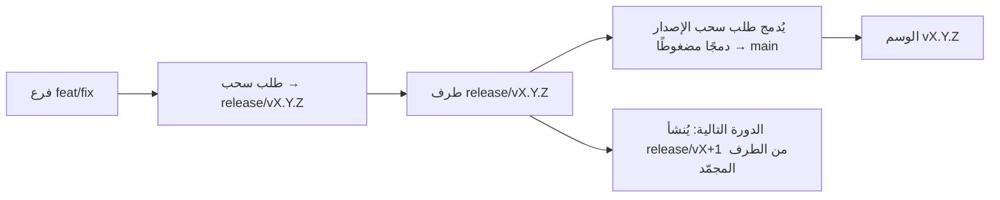

# Branching & Release Model (العربية)

🌐 **Languages:** 🇺🇸 [English](../../../../ops/BRANCHING_MODEL.md) · 🇪🇹 [am](../../../am/docs/ops/BRANCHING_MODEL.md) · 🇦🇿 [az](../../../az/docs/ops/BRANCHING_MODEL.md) · 🇧🇬 [bg](../../../bg/docs/ops/BRANCHING_MODEL.md) · 🇧🇩 [bn](../../../bn/docs/ops/BRANCHING_MODEL.md) · 🇧🇦 [bs](../../../bs/docs/ops/BRANCHING_MODEL.md) · 🇨🇿 [cs](../../../cs/docs/ops/BRANCHING_MODEL.md) · 🇩🇰 [da](../../../da/docs/ops/BRANCHING_MODEL.md) · 🇩🇪 [de](../../../de/docs/ops/BRANCHING_MODEL.md) · 🇬🇷 [el](../../../el/docs/ops/BRANCHING_MODEL.md) · 🇪🇸 [es](../../../es/docs/ops/BRANCHING_MODEL.md) · 🇪🇪 [et](../../../et/docs/ops/BRANCHING_MODEL.md) · 🇮🇷 [fa](../../../fa/docs/ops/BRANCHING_MODEL.md) · 🇫🇮 [fi](../../../fi/docs/ops/BRANCHING_MODEL.md) · 🇫🇷 [fr](../../../fr/docs/ops/BRANCHING_MODEL.md) · 🇮🇪 [ga](../../../ga/docs/ops/BRANCHING_MODEL.md) · 🇮🇳 [gu](../../../gu/docs/ops/BRANCHING_MODEL.md) · 🇳🇬 [ha](../../../ha/docs/ops/BRANCHING_MODEL.md) · 🇮🇱 [he](../../../he/docs/ops/BRANCHING_MODEL.md) · 🇮🇳 [hi](../../../hi/docs/ops/BRANCHING_MODEL.md) · 🇭🇷 [hr](../../../hr/docs/ops/BRANCHING_MODEL.md) · 🇭🇺 [hu](../../../hu/docs/ops/BRANCHING_MODEL.md) · 🇦🇲 [hy](../../../hy/docs/ops/BRANCHING_MODEL.md) · 🇮🇩 [id](../../../id/docs/ops/BRANCHING_MODEL.md) · 🇳🇬 [ig](../../../ig/docs/ops/BRANCHING_MODEL.md) · 🇮🇹 [it](../../../it/docs/ops/BRANCHING_MODEL.md) · 🇯🇵 [ja](../../../ja/docs/ops/BRANCHING_MODEL.md) · 🇬🇪 [ka](../../../ka/docs/ops/BRANCHING_MODEL.md) · 🇰🇭 [km](../../../km/docs/ops/BRANCHING_MODEL.md) · 🇮🇳 [kn](../../../kn/docs/ops/BRANCHING_MODEL.md) · 🇰🇷 [ko](../../../ko/docs/ops/BRANCHING_MODEL.md) · 🇱🇹 [lt](../../../lt/docs/ops/BRANCHING_MODEL.md) · 🇱🇻 [lv](../../../lv/docs/ops/BRANCHING_MODEL.md) · 🇮🇳 [ml](../../../ml/docs/ops/BRANCHING_MODEL.md) · 🇮🇳 [mr](../../../mr/docs/ops/BRANCHING_MODEL.md) · 🇲🇾 [ms](../../../ms/docs/ops/BRANCHING_MODEL.md) · 🇲🇹 [mt](../../../mt/docs/ops/BRANCHING_MODEL.md) · 🇲🇲 [my](../../../my/docs/ops/BRANCHING_MODEL.md) · 🇳🇵 [ne](../../../ne/docs/ops/BRANCHING_MODEL.md) · 🇳🇱 [nl](../../../nl/docs/ops/BRANCHING_MODEL.md) · 🇳🇴 [no](../../../no/docs/ops/BRANCHING_MODEL.md) · 🇮🇳 [or](../../../or/docs/ops/BRANCHING_MODEL.md) · 🇮🇳 [pa](../../../pa/docs/ops/BRANCHING_MODEL.md) · 🇵🇭 [phi](../../../phi/docs/ops/BRANCHING_MODEL.md) · 🇵🇱 [pl](../../../pl/docs/ops/BRANCHING_MODEL.md) · 🇵🇹 [pt](../../../pt/docs/ops/BRANCHING_MODEL.md) · 🇧🇷 [pt-BR](../../../pt-BR/docs/ops/BRANCHING_MODEL.md) · 🇷🇴 [ro](../../../ro/docs/ops/BRANCHING_MODEL.md) · 🇷🇺 [ru](../../../ru/docs/ops/BRANCHING_MODEL.md) · 🇱🇰 [si](../../../si/docs/ops/BRANCHING_MODEL.md) · 🇸🇰 [sk](../../../sk/docs/ops/BRANCHING_MODEL.md) · 🇸🇮 [sl](../../../sl/docs/ops/BRANCHING_MODEL.md) · 🇷🇸 [sr](../../../sr/docs/ops/BRANCHING_MODEL.md) · 🇸🇪 [sv](../../../sv/docs/ops/BRANCHING_MODEL.md) · 🇰🇪 [sw](../../../sw/docs/ops/BRANCHING_MODEL.md) · 🇮🇳 [ta](../../../ta/docs/ops/BRANCHING_MODEL.md) · 🇮🇳 [te](../../../te/docs/ops/BRANCHING_MODEL.md) · 🇹🇭 [th](../../../th/docs/ops/BRANCHING_MODEL.md) · 🇹🇷 [tr](../../../tr/docs/ops/BRANCHING_MODEL.md) · 🇺🇦 [uk-UA](../../../uk-UA/docs/ops/BRANCHING_MODEL.md) · 🇵🇰 [ur](../../../ur/docs/ops/BRANCHING_MODEL.md) · 🇺🇿 [uz](../../../uz/docs/ops/BRANCHING_MODEL.md) · 🇻🇳 [vi](../../../vi/docs/ops/BRANCHING_MODEL.md) · 🇳🇬 [yo](../../../yo/docs/ops/BRANCHING_MODEL.md) · 🇨🇳 [zh-CN](../../../zh-CN/docs/ops/BRANCHING_MODEL.md) · 🇹🇼 [zh-TW](../../../zh-TW/docs/ops/BRANCHING_MODEL.md)

---

يستخدم OmniRoute نموذج إصدار **الدورات المتوازية**: فرعًا مخصصًا باسم `release/vX.Y.Z`
للدورة النشطة، و`main` لمسار الإصدارات المنشورة، ووسمًا غير قابل للتغيير باسم
`vX.Y.Z` عند نشر تلك الدورة. من المتوقع أن ترى الإيداعات تصل إلى `release/*` _وكذلك_ إلى
`main` — فهذا ليس خطأً.

توجد التفاصيل الخاصة بالمشرفين في `CLAUDE.md` (القاعدة الصارمة رقم 21) وفي
[RELEASE_CHECKLIST.md](./RELEASE_CHECKLIST.md). تمثل هذه الصفحة الملخص العام
الموجّه للمساهمين.

## نظرة سريعة

| المرجع           | الدور                                                                        |
| ---------------- | ---------------------------------------------------------------------------- |
| `release/vX.Y.Z` | **الدورة النشطة** — التطوير اليومي ودمج طلبات السحب الخاصة بذلك الإصدار      |
| `main`           | **مسار الإصدارات المنشورة** — يستقبل الدورة عبر دمج مضغوط عند نشر الإصدار    |
| `vX.Y.Z` (وسم)   | **علامة النشر** — مؤشر غير قابل للتغيير يحدد «ما تم نشره» ويُنشأ وقت الإصدار |



## ما الفرع الذي ينبغي أن يستهدفه طلب السحب الخاص بي؟

**استهدف فرع `release/vX.Y.Z` النشط — وليس `main`.**

1. ابحث عن أعلى فرع `release/v*` مفتوح (مثال وقت كتابة هذا المستند:
   `release/v3.8.49`).
2. أنشئ فرعك من طرفه (`git fetch` ثم checkout / rebase عليه).
3. افتح طلب السحب مع ضبط **الفرع الأساسي = فرع `release/vX.Y.Z` ذاك**.

`main` ليس فرع التكامل اليومي. وعادةً ما تحتاج طلبات السحب المفتوحة ضده
إلى إعادة توجيه قبل الدمج.

## تجميد الإصدار (الدورات المتوازية)

عند إجراء تسوية لأحد الإصدارات، تُفتح مشكلة علامة تحمل التصنيف `release-freeze`.
وهذا **لا يوقف التطوير**:

- يصبح فرع `release/vX.Y.Z` المجمّد تحت مسؤولية قائد الإصدار الخاص بذلك النشر.
- يُنشأ فرع الدورة التالية `release/vX+1` من الطرف المجمّد حتى يتمكن المساهمون من مواصلة
  دمج أعمالهم.
- ينبغي **إعادة توجيه** طلبات السحب المفتوحة التي ما زالت تستهدف الفرع المجمّد إلى
  فرع `release/v*` النشط (الأعلى).

تحقق من وجود تجميد مفتوح قبل افتراض أن الفرع المطلوب قابل للدمج:

```bash
gh issue list --repo diegosouzapw/OmniRoute --label release-freeze --state open
```

آليات الدمج (تصنيف المالك `queue` ← Mergify) موثّقة في
[MERGE_TRAIN.md](./MERGE_TRAIN.md).

## لماذا نحتاج إلى فرع ووسم معًا؟

| العنصر           | مدة البقاء       | الغرض                                                                                    |
| ---------------- | ---------------- | ---------------------------------------------------------------------------------------- |
| `release/vX.Y.Z` | دورة قيد التنفيذ | يجمع طلبات السحب التي تمت مراجعتها، ويحافظ على نجاح CI، ويكون الفرع الأساسي لطلبات السحب |
| الوسم `vX.Y.Z`   | إلى الأبد        | يحدد بدقة المكونات التي نُشرت إلى npm / GitHub Releases                                  |

الفرع هو ورشة العمل؛ والوسم هو الحزمة المختومة. بعد الدمج المضغوط في
`main`، تستمر الدورة التالية على `release/vX+1` دون انتظار اكتمال طلب سحب
الإصدار السابق.

## مستندات ذات صلة

- [CONTRIBUTING.md](../../CONTRIBUTING.md) — الإعداد، والاختبارات، وقائمة التحقق لطلب السحب
- [RELEASE_CHECKLIST.md](./RELEASE_CHECKLIST.md) — التحقق قبل النشر
- [MERGE_TRAIN.md](./MERGE_TRAIN.md) — قائمة انتظار الدمج ومسار الدمج الاحتياطي
- [RELEASE_GREEN.md](./RELEASE_GREEN.md) — الحفاظ على نجاح طرف الإصدار
