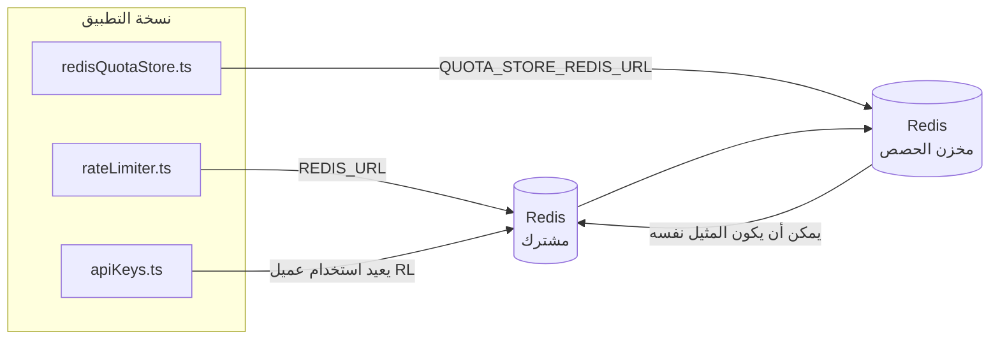

# Redis Production Configuration Guide (العربية)

🌐 **Languages:** 🇺🇸 [English](../../../../ops/REDIS_PRODUCTION_CONFIG.md) · 🇪🇹 [am](../../../am/docs/ops/REDIS_PRODUCTION_CONFIG.md) · 🇦🇿 [az](../../../az/docs/ops/REDIS_PRODUCTION_CONFIG.md) · 🇧🇬 [bg](../../../bg/docs/ops/REDIS_PRODUCTION_CONFIG.md) · 🇧🇩 [bn](../../../bn/docs/ops/REDIS_PRODUCTION_CONFIG.md) · 🇨🇿 [cs](../../../cs/docs/ops/REDIS_PRODUCTION_CONFIG.md) · 🇩🇰 [da](../../../da/docs/ops/REDIS_PRODUCTION_CONFIG.md) · 🇩🇪 [de](../../../de/docs/ops/REDIS_PRODUCTION_CONFIG.md) · 🇬🇷 [el](../../../el/docs/ops/REDIS_PRODUCTION_CONFIG.md) · 🇪🇸 [es](../../../es/docs/ops/REDIS_PRODUCTION_CONFIG.md) · 🇪🇪 [et](../../../et/docs/ops/REDIS_PRODUCTION_CONFIG.md) · 🇮🇷 [fa](../../../fa/docs/ops/REDIS_PRODUCTION_CONFIG.md) · 🇫🇮 [fi](../../../fi/docs/ops/REDIS_PRODUCTION_CONFIG.md) · 🇫🇷 [fr](../../../fr/docs/ops/REDIS_PRODUCTION_CONFIG.md) · 🇮🇪 [ga](../../../ga/docs/ops/REDIS_PRODUCTION_CONFIG.md) · 🇮🇳 [gu](../../../gu/docs/ops/REDIS_PRODUCTION_CONFIG.md) · 🇳🇬 [ha](../../../ha/docs/ops/REDIS_PRODUCTION_CONFIG.md) · 🇮🇱 [he](../../../he/docs/ops/REDIS_PRODUCTION_CONFIG.md) · 🇮🇳 [hi](../../../hi/docs/ops/REDIS_PRODUCTION_CONFIG.md) · 🇭🇷 [hr](../../../hr/docs/ops/REDIS_PRODUCTION_CONFIG.md) · 🇭🇺 [hu](../../../hu/docs/ops/REDIS_PRODUCTION_CONFIG.md) · 🇦🇲 [hy](../../../hy/docs/ops/REDIS_PRODUCTION_CONFIG.md) · 🇮🇩 [id](../../../id/docs/ops/REDIS_PRODUCTION_CONFIG.md) · 🇳🇬 [ig](../../../ig/docs/ops/REDIS_PRODUCTION_CONFIG.md) · 🇮🇹 [it](../../../it/docs/ops/REDIS_PRODUCTION_CONFIG.md) · 🇯🇵 [ja](../../../ja/docs/ops/REDIS_PRODUCTION_CONFIG.md) · 🇬🇪 [ka](../../../ka/docs/ops/REDIS_PRODUCTION_CONFIG.md) · 🇰🇭 [km](../../../km/docs/ops/REDIS_PRODUCTION_CONFIG.md) · 🇮🇳 [kn](../../../kn/docs/ops/REDIS_PRODUCTION_CONFIG.md) · 🇰🇷 [ko](../../../ko/docs/ops/REDIS_PRODUCTION_CONFIG.md) · 🇱🇹 [lt](../../../lt/docs/ops/REDIS_PRODUCTION_CONFIG.md) · 🇱🇻 [lv](../../../lv/docs/ops/REDIS_PRODUCTION_CONFIG.md) · 🇮🇳 [ml](../../../ml/docs/ops/REDIS_PRODUCTION_CONFIG.md) · 🇮🇳 [mr](../../../mr/docs/ops/REDIS_PRODUCTION_CONFIG.md) · 🇲🇾 [ms](../../../ms/docs/ops/REDIS_PRODUCTION_CONFIG.md) · 🇲🇹 [mt](../../../mt/docs/ops/REDIS_PRODUCTION_CONFIG.md) · 🇲🇲 [my](../../../my/docs/ops/REDIS_PRODUCTION_CONFIG.md) · 🇳🇵 [ne](../../../ne/docs/ops/REDIS_PRODUCTION_CONFIG.md) · 🇳🇱 [nl](../../../nl/docs/ops/REDIS_PRODUCTION_CONFIG.md) · 🇳🇴 [no](../../../no/docs/ops/REDIS_PRODUCTION_CONFIG.md) · 🇮🇳 [or](../../../or/docs/ops/REDIS_PRODUCTION_CONFIG.md) · 🇮🇳 [pa](../../../pa/docs/ops/REDIS_PRODUCTION_CONFIG.md) · 🇵🇭 [phi](../../../phi/docs/ops/REDIS_PRODUCTION_CONFIG.md) · 🇵🇱 [pl](../../../pl/docs/ops/REDIS_PRODUCTION_CONFIG.md) · 🇵🇹 [pt](../../../pt/docs/ops/REDIS_PRODUCTION_CONFIG.md) · 🇧🇷 [pt-BR](../../../pt-BR/docs/ops/REDIS_PRODUCTION_CONFIG.md) · 🇷🇴 [ro](../../../ro/docs/ops/REDIS_PRODUCTION_CONFIG.md) · 🇷🇺 [ru](../../../ru/docs/ops/REDIS_PRODUCTION_CONFIG.md) · 🇱🇰 [si](../../../si/docs/ops/REDIS_PRODUCTION_CONFIG.md) · 🇸🇰 [sk](../../../sk/docs/ops/REDIS_PRODUCTION_CONFIG.md) · 🇸🇮 [sl](../../../sl/docs/ops/REDIS_PRODUCTION_CONFIG.md) · 🇷🇸 [sr](../../../sr/docs/ops/REDIS_PRODUCTION_CONFIG.md) · 🇸🇪 [sv](../../../sv/docs/ops/REDIS_PRODUCTION_CONFIG.md) · 🇰🇪 [sw](../../../sw/docs/ops/REDIS_PRODUCTION_CONFIG.md) · 🇮🇳 [ta](../../../ta/docs/ops/REDIS_PRODUCTION_CONFIG.md) · 🇮🇳 [te](../../../te/docs/ops/REDIS_PRODUCTION_CONFIG.md) · 🇹🇭 [th](../../../th/docs/ops/REDIS_PRODUCTION_CONFIG.md) · 🇹🇷 [tr](../../../tr/docs/ops/REDIS_PRODUCTION_CONFIG.md) · 🇺🇦 [uk-UA](../../../uk-UA/docs/ops/REDIS_PRODUCTION_CONFIG.md) · 🇵🇰 [ur](../../../ur/docs/ops/REDIS_PRODUCTION_CONFIG.md) · 🇺🇿 [uz](../../../uz/docs/ops/REDIS_PRODUCTION_CONFIG.md) · 🇻🇳 [vi](../../../vi/docs/ops/REDIS_PRODUCTION_CONFIG.md) · 🇳🇬 [yo](../../../yo/docs/ops/REDIS_PRODUCTION_CONFIG.md) · 🇨🇳 [zh-CN](../../../zh-CN/docs/ops/REDIS_PRODUCTION_CONFIG.md) · 🇹🇼 [zh-TW](../../../zh-TW/docs/ops/REDIS_PRODUCTION_CONFIG.md)

---

## نظرة عامة

يُعد Redis **تبعية اختيارية ومرنة** في OmniRoute — إذ يتراجع التطبيق بسلاسة إلى بدائل داخل الذاكرة
عندما لا يتوفر Redis. في بيئة الإنتاج، يقلل ضبط Redis زمن الاستجابة لأربعة أعباء عمل منفصلة:

| عبء العمل                     | المشغّل                       | مصنع العميل                                        | نمط المفتاح                                              |
| ----------------------------- | ----------------------------- | -------------------------------------------------- | -------------------------------------------------------- |
| تحديد المعدل                  | `rateLimiter.ts`              | نسخة `ioredis` مفردة وكسولة عبر `getRedisClient()` | نوافذ تحديد معدل ذرية باستخدام Lua بالنمط `<prefix>rl:*` |
| ذاكرة التخزين المؤقت للمصادقة | `apiKeys.ts`                  | يعيد استخدام عميل `rateLimiter`                    | `<prefix>auth:api_key:<sha256>` مع TTL                   |
| مخزن الحصص                    | `redisQuotaStore.ts`          | نسخة مفردة منفصلة عبر `getRedisClient(url)`        | `<prefix>quota:*` قابل للتهيئة لكل نسخة                  |
| قاطع دائرة الإحماء            | `redisCircuitBreakerStore.ts` | عميل منفصل في `circuitBreakerFactory.ts`           | `<prefix>warmup:cb:<connectionId>`                       |

تتشارك أعباء العمل الأربعة بادئة مساحة أسماء واحدة، بحيث يمكن لـ OmniRoute التعايش مع تطبيقات أخرى على
نسخة Redis واحدة (مثل `127.0.0.1:6379`). راجع [مساحة أسماء المفاتيح](#key-namespacing).

---

## التهيئة الحالية (القيم الافتراضية في الشيفرة)

| الإعداد                                 | القيمة                                                                  | الموقع                                                                                |
| --------------------------------------- | ----------------------------------------------------------------------- | ------------------------------------------------------------------------------------- |
| متغير البيئة `REDIS_URL`                | `redis://redis:6379` (في compose)، اختياري                              | `rateLimiter.ts:5`، `.env.example`                                                    |
| متغير البيئة `REDIS_KEY_PREFIX`         | `omniroute:` (افتراضي)                                                  | `rateLimiter.ts`، `redisQuotaStore.ts`، `redisCircuitBreakerStore.ts`، `.env.example` |
| متغير البيئة `QUOTA_STORE_REDIS_URL`    | منفصل، ويمكن أن يختلف عن `REDIS_URL`                                    | `quota/storeFactory.ts`                                                               |
| `QUOTA_STORE_DRIVER`                    | `"sqlite"` (افتراضي)، و`"redis"` اختياري                                | `quota/storeFactory.ts`                                                               |
| ‏`maxRetriesPerRequest` في ioredis      | `3`                                                                     | إنشاء العميل في `rateLimiter.ts`                                                      |
| `enableReadyCheck`                      | غير مضبوط (القيمة الافتراضية في ioredis: `true`)                        | —                                                                                     |
| `lazyConnect`                           | غير مضبوط (القيمة الافتراضية في ioredis: `false`)                       | —                                                                                     |
| `retryStrategy`                         | غير مضبوط (القيمة الافتراضية في ioredis: أساس قدره 200ms، وتزايد أُسّي) | —                                                                                     |
| TLS / كلمة المرور / فهرس قاعدة البيانات | **غير مهيأة**                                                           | —                                                                                     |
| Sentinel / Cluster                      | **غير مهيأين** — عقدة مستقلة واحدة فقط                                  | —                                                                                     |

---

## مساحة أسماء المفاتيح

تتشارك OmniRoute نسخة Redis مع أي خدمات أخرى تعمل على المضيف. من دون مساحة أسماء،
قد تتعارض مفاتيح مثل `auth:api_key:<sha256>` أو `rl:*` مع مفاتيح تطبيقات أخرى
تستخدم Redis نفسه (تشغّل هذه النسخة Redis على `127.0.0.1:6379` إلى جانب خدمات أخرى).

اضبط `REDIS_KEY_PREFIX` على سلسلة غير فارغة لإضافة بادئة إلى **كل** مفتاح من مفاتيح OmniRoute:

```bash
# .env — تصبح جميع مفاتيح OmniRoute بالشكل omniroute:rl:* وomniroute:auth:* وomniroute:quota:* وomniroute:warmup:cb:*
REDIS_KEY_PREFIX=omniroute:
```

- **القيمة الافتراضية:** `omniroute:` (تُطبّق عندما يكون `REDIS_KEY_PREFIX` غير مضبوط أو فارغًا).
- **تُطبّق على:** محدد المعدل + ذاكرة التخزين المؤقت للمصادقة (عميل `ioredis` مشترك عبر `keyPrefix`) و
  مخزن الحصص (`KEY_PREFIX = "${REDIS_KEY_PREFIX}quota"`) وقاطع دائرة الإحماء
  (`KEY_PREFIX = "${REDIS_KEY_PREFIX}warmup:cb:"`).
- يؤدي **تغيير البادئة** عندما تكون المفاتيح موجودة بالفعل في Redis إلى جعل المفاتيح القديمة يتيمة (وتنتهي صلاحيتها
  عبر TTL / LRU). ويمكن تغييرها بأمان؛ فلا حاجة إلى ترحيل. الاستثناء الوحيد هو مفتاح قاطع
  دائرة الإحماء لاتصال معلَّم بأنه محظور: إذ يُحفظ من دون TTL، لذا اعرض المفاتيح المتبقية باستخدام
  `redis-cli --scan --pattern '<old-prefix>warmup:cb:*'` واحذفها.
- تقوم خاصية `keyPrefix` في **ioredis** تلقائيًا بإضافة البادئة عند الكتابة **و**إزالتها عند القراءة،
  لذلك لا ترى شيفرة التطبيق البادئة مطلقًا.

---

## الضبط الموصى به لبيئة الإنتاج

### 1. خيارات مجمّع الاتصالات / العميل (مُنشئ ioredis `Redis`)

تنشئ الشيفرة الحالية مثيلًا واحدًا عبر `new Redis(url)` دون خيارات مخصّصة. لعمليات النشر
الإنتاجية متعددة النُسخ، مرّر مصنع عميل في الشيفرة أو غلّف `getRedisClient()`:

```typescript
const redis = new Redis(REDIS_URL, {
  maxRetriesPerRequest: null, // بلا حد لإعادة المحاولة؛ دع retryStrategy يقرر
  enableReadyCheck: true, // تحقّق من جاهزية الخادم قبل قبول الاستدعاءات
  lazyConnect: true, // لا تتصل عند الإنشاء؛ انتظر الاستدعاء الأول
  retryStrategy: (times) => {
    if (times > 10) return null; // توقّف بعد 10 محاولات ← أعد الاتصال لاحقًا
    return Math.min(times * 200, 5000); // 200ms، 400ms، …، بحد أقصى 5s
  },
  enableAutoPipelining: true, // ادمج الأوامر المتزامنة في عملية كتابة TCP واحدة
  keepAlive: 10000, // إبقاء اتصال TCP حيًا كل 10s
});
```

**المفاضلات الرئيسية:**

- `maxRetriesPerRequest: null` + `retryStrategy` — الخيار المفضّل للإنتاج كي لا تؤدي
  عمليات إعادة تشغيل Redis المؤقتة إلى فشل كل طلب فورًا. يتولى البديل الموجود في الذاكرة ضمن
  `checkRateLimit()` معالجة مسار الفشل.
- `lazyConnect: true` — يتجنب جعل بدء التشغيل معتمدًا على توفر Redis قبل أن يبدأ الخادم
  في قبول الاتصالات.
- `enableAutoPipelining: true` — يقلّل الرحلات ذهابًا وإيابًا لفحوصات حدود المعدل المتزامنة؛
  وهو مفيد عند أكثر من 50 طلبًا في الثانية على اتصال واحد.

### 2. تهيئة خادم Redis (`redis.conf`)

```
# الذاكرة
maxmemory 80%                        # اترك مساحة لذاكرة التخزين المؤقت لصفحات نظام التشغيل
maxmemory-policy allkeys-lru         # أزِل إدخالات ذاكرة التخزين المؤقت القديمة للمصادقة عند الضغط

# الاستمرارية (اختيارية — OmniRoute آمن عند التعطل من دونها)
save 300 1                           # التقط صورة كل 5 دقائق على الأقل إذا تغيّر مفتاح واحد أو أكثر
appendonly no                        # لا حاجة إلى AOF؛ يمكن إعادة إنشاء البيانات
appendfsync no                       # لا توجد أعباء fsync إضافية (RDB كافٍ)

# الشبكات
timeout 0                            # لا تفصل الاتصالات الخاملة
tcp-keepalive 300                    # إبقاء الاتصال حيًا لمدة 5 دقائق
tcp-backlog 511                      # قائمة انتظار الاتصالات للأحمال الاندفاعية

# الأداء
hz 10                                # القيمة الافتراضية؛ 100 للحالات الحساسة لزمن الاستجابة
activedefrag yes                     # ألغِ التجزئة تلقائيًا عندما تتجاوز 10%
```

**المفاضلة المتعلقة بـ `maxmemory-policy allkeys-lru`:** قد تُزال إدخالات ذاكرة التخزين
المؤقت للمصادقة عند ضغط الذاكرة. هذا آمن — يعيد `setCachedApiKey` دائمًا ملء البيانات عند عدم
العثور عليها، ويظل بديل SQLite هو المصدر الموثوق. ينشئ برنامج Lua النصي لمحدد المعدل مفاتيح
صغيرة وقصيرة العمر حسب التصميم.

### 3. إعدادات Docker Compose

يستخدم ملف Compose الإنتاجي (`docker-compose.prod.yml`) الصورة `redis:8.6.2-alpine`. أضف:

```yaml
redis:
  image: redis:8.6.2-alpine
  command:
    [
      "redis-server",
      "--maxmemory",
      "512mb",
      "--maxmemory-policy",
      "allkeys-lru",
      "--activedefrag",
      "yes",
      "--save",
      "300 1",
    ]
  healthcheck:
    test: ["CMD", "redis-cli", "ping"]
    interval: 10s
    timeout: 3s
    retries: 3
    start_period: 5s
```

### 4. اعتبارات تعدد المثيلات / التوسّع

**مثيل Redis واحد لجميع النُسخ** — يعتمد برنامج Lua النصي لمحدد المعدل على مساحة مفاتيح
موثوقة واحدة. سيؤدي استخدام عدة مثيلات Redis خلف النُسخ إلى فقدان الذرية ومضاعفة الحصة.
استخدم مثيل Redis واحدًا (أو عنقود Redis Sentinel مع تجاوز الفشل) لجميع نُسخ التطبيق.

**عدد الاتصالات:** تفتح كل نسخة من التطبيق **اتصالَي TCP** مع Redis
(عميل محدد المعدل + عميل مخزن الحصص). عند 10 نُسخ ← 20 اتصالًا، وهو عدد
أقل بكثير من الحد الافتراضي البالغ 10 آلاف اتصال لمثيل Redis.

### 5. المراقبة

اعرض ما يلي عبر نقطة نهاية فحص السلامة:

```typescript
// يستدعي src/app/api/monitoring/health/route.ts بالفعل دوال rateLimiter
// أضف فحوصات خاصة بـ Redis:
//   1. زمن استجابة PING عبر ioredis .ping()
//   2. استخدام الذاكرة عبر INFO memory
//   3. عدد الاتصالات عبر INFO clients
//   4. معدل الإصابة لسياسة maxmemory-policy ‏(evicted_keys / keyspace_hits)
```

المقاييس الرئيسية الواجب مراقبتها:

- **المفاتيح المُزالة / ثانية** — إذا ظلت القيمة غير صفرية، فزِد `maxmemory`
- **العملاء المحظورون** — تشير القيمة غير الصفرية إلى بطء برامج Lua النصية أو ارتفاع التنافس
- **الاتصالات المرفوضة** — تم بلوغ حد الاتصالات؛ وهذا نادر عند 20 اتصالًا

---

## مخطط البنية



---

## المراجع

| الملف                              | الغرض                                                                     |
| ---------------------------------- | ------------------------------------------------------------------------- |
| `src/shared/utils/rateLimiter.ts`  | عميل Redis الأساسي، وبرنامج Lua النصي لتحديد المعدل، والبديل داخل الذاكرة |
| `src/lib/db/apiKeys.ts`            | ذاكرة التخزين المؤقت للمصادقة — Redis←SQLite كبديل                        |
| `src/lib/quota/redisQuotaStore.ts` | عميل Redis منفصل لمخزن الحصص الاختياري                                    |
| `src/lib/quota/storeFactory.ts`    | يبدّل بين مشغّلي الحصص `sqlite` و`redis`                                  |
| `docker-compose.prod.yml`          | حاوية Redis للإنتاج (الصورة `redis:8.6.2-alpine`)                         |
| `.env.example`                     | توثيق متغيرات بيئة Redis                                                  |
| `src/app/api/local/redis/`         | مسارات API لتنسيق حاوية التطوير                                           |
| `bin/cli/commands/redis.mjs`       | أوامر CLI لتنسيق حاوية التطوير                                            |
