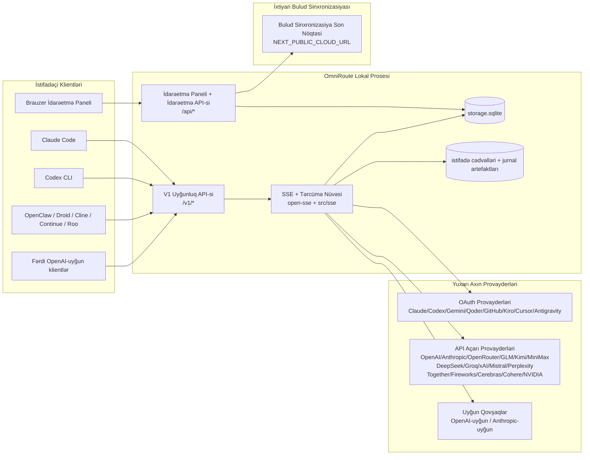
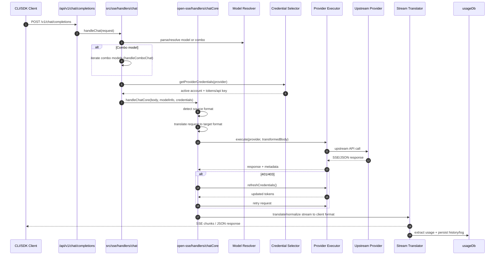
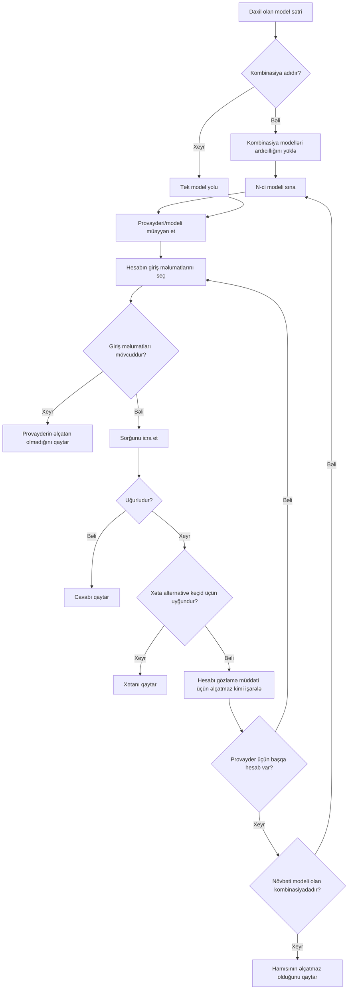
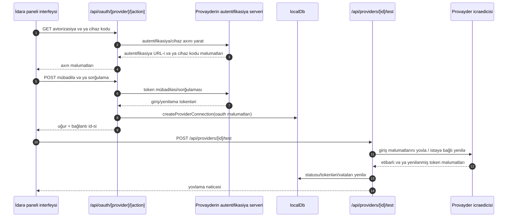
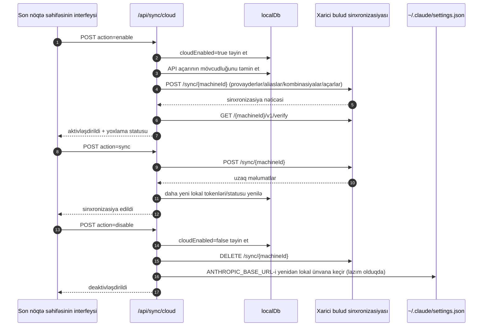
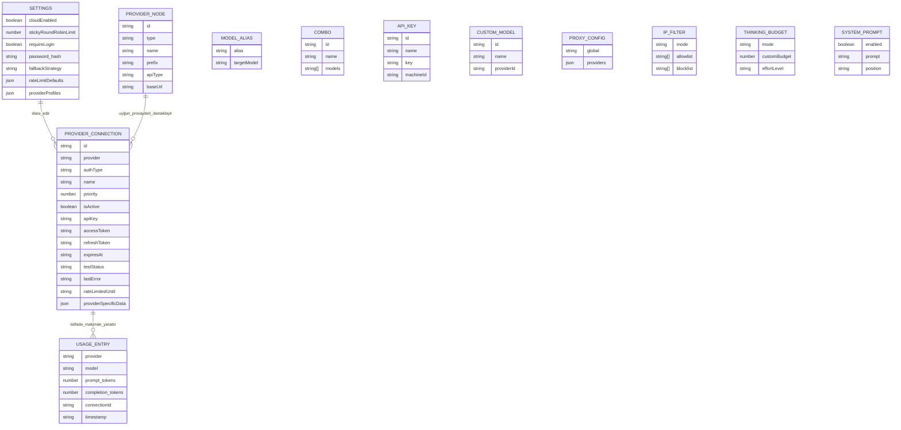
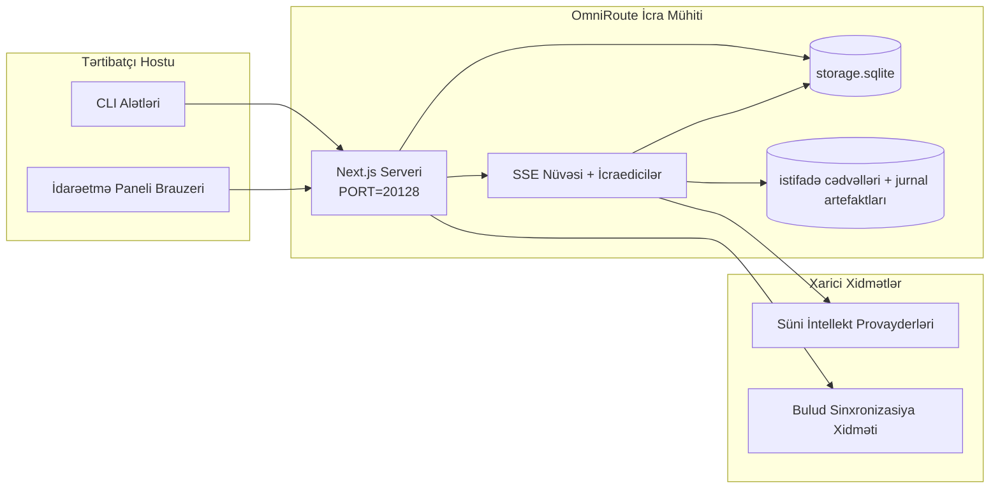

# OmniRoute Architecture (Azərbaycan dili)

🌐 **Languages:** 🇺🇸 [English](../../../../architecture/ARCHITECTURE.md) · 🇪🇹 [am](../../../am/docs/architecture/ARCHITECTURE.md) · 🇸🇦 [ar](../../../ar/docs/architecture/ARCHITECTURE.md) · 🇧🇬 [bg](../../../bg/docs/architecture/ARCHITECTURE.md) · 🇧🇩 [bn](../../../bn/docs/architecture/ARCHITECTURE.md) · 🇨🇿 [cs](../../../cs/docs/architecture/ARCHITECTURE.md) · 🇩🇰 [da](../../../da/docs/architecture/ARCHITECTURE.md) · 🇩🇪 [de](../../../de/docs/architecture/ARCHITECTURE.md) · 🇬🇷 [el](../../../el/docs/architecture/ARCHITECTURE.md) · 🇪🇸 [es](../../../es/docs/architecture/ARCHITECTURE.md) · 🇪🇪 [et](../../../et/docs/architecture/ARCHITECTURE.md) · 🇮🇷 [fa](../../../fa/docs/architecture/ARCHITECTURE.md) · 🇫🇮 [fi](../../../fi/docs/architecture/ARCHITECTURE.md) · 🇫🇷 [fr](../../../fr/docs/architecture/ARCHITECTURE.md) · 🇮🇪 [ga](../../../ga/docs/architecture/ARCHITECTURE.md) · 🇮🇳 [gu](../../../gu/docs/architecture/ARCHITECTURE.md) · 🇳🇬 [ha](../../../ha/docs/architecture/ARCHITECTURE.md) · 🇮🇱 [he](../../../he/docs/architecture/ARCHITECTURE.md) · 🇮🇳 [hi](../../../hi/docs/architecture/ARCHITECTURE.md) · 🇭🇷 [hr](../../../hr/docs/architecture/ARCHITECTURE.md) · 🇭🇺 [hu](../../../hu/docs/architecture/ARCHITECTURE.md) · 🇦🇲 [hy](../../../hy/docs/architecture/ARCHITECTURE.md) · 🇮🇩 [id](../../../id/docs/architecture/ARCHITECTURE.md) · 🇳🇬 [ig](../../../ig/docs/architecture/ARCHITECTURE.md) · 🇮🇹 [it](../../../it/docs/architecture/ARCHITECTURE.md) · 🇯🇵 [ja](../../../ja/docs/architecture/ARCHITECTURE.md) · 🇬🇪 [ka](../../../ka/docs/architecture/ARCHITECTURE.md) · 🇰🇭 [km](../../../km/docs/architecture/ARCHITECTURE.md) · 🇮🇳 [kn](../../../kn/docs/architecture/ARCHITECTURE.md) · 🇰🇷 [ko](../../../ko/docs/architecture/ARCHITECTURE.md) · 🇱🇹 [lt](../../../lt/docs/architecture/ARCHITECTURE.md) · 🇱🇻 [lv](../../../lv/docs/architecture/ARCHITECTURE.md) · 🇮🇳 [ml](../../../ml/docs/architecture/ARCHITECTURE.md) · 🇮🇳 [mr](../../../mr/docs/architecture/ARCHITECTURE.md) · 🇲🇾 [ms](../../../ms/docs/architecture/ARCHITECTURE.md) · 🇲🇹 [mt](../../../mt/docs/architecture/ARCHITECTURE.md) · 🇲🇲 [my](../../../my/docs/architecture/ARCHITECTURE.md) · 🇳🇵 [ne](../../../ne/docs/architecture/ARCHITECTURE.md) · 🇳🇱 [nl](../../../nl/docs/architecture/ARCHITECTURE.md) · 🇳🇴 [no](../../../no/docs/architecture/ARCHITECTURE.md) · 🇮🇳 [or](../../../or/docs/architecture/ARCHITECTURE.md) · 🇮🇳 [pa](../../../pa/docs/architecture/ARCHITECTURE.md) · 🇵🇭 [phi](../../../phi/docs/architecture/ARCHITECTURE.md) · 🇵🇱 [pl](../../../pl/docs/architecture/ARCHITECTURE.md) · 🇵🇹 [pt](../../../pt/docs/architecture/ARCHITECTURE.md) · 🇧🇷 [pt-BR](../../../pt-BR/docs/architecture/ARCHITECTURE.md) · 🇷🇴 [ro](../../../ro/docs/architecture/ARCHITECTURE.md) · 🇷🇺 [ru](../../../ru/docs/architecture/ARCHITECTURE.md) · 🇱🇰 [si](../../../si/docs/architecture/ARCHITECTURE.md) · 🇸🇰 [sk](../../../sk/docs/architecture/ARCHITECTURE.md) · 🇸🇮 [sl](../../../sl/docs/architecture/ARCHITECTURE.md) · 🇷🇸 [sr](../../../sr/docs/architecture/ARCHITECTURE.md) · 🇸🇪 [sv](../../../sv/docs/architecture/ARCHITECTURE.md) · 🇰🇪 [sw](../../../sw/docs/architecture/ARCHITECTURE.md) · 🇮🇳 [ta](../../../ta/docs/architecture/ARCHITECTURE.md) · 🇮🇳 [te](../../../te/docs/architecture/ARCHITECTURE.md) · 🇹🇭 [th](../../../th/docs/architecture/ARCHITECTURE.md) · 🇹🇷 [tr](../../../tr/docs/architecture/ARCHITECTURE.md) · 🇺🇦 [uk-UA](../../../uk-UA/docs/architecture/ARCHITECTURE.md) · 🇵🇰 [ur](../../../ur/docs/architecture/ARCHITECTURE.md) · 🇺🇿 [uz](../../../uz/docs/architecture/ARCHITECTURE.md) · 🇻🇳 [vi](../../../vi/docs/architecture/ARCHITECTURE.md) · 🇳🇬 [yo](../../../yo/docs/architecture/ARCHITECTURE.md) · 🇨🇳 [zh-CN](../../../zh-CN/docs/architecture/ARCHITECTURE.md) · 🇹🇼 [zh-TW](../../../zh-TW/docs/architecture/ARCHITECTURE.md)

---

🌐 **Languages:** 🇺🇸 [English](../../../../architecture/ARCHITECTURE.md) · 🇪🇹 [am](../../../am/docs/architecture/ARCHITECTURE.md) · 🇸🇦 [ar](../../../ar/docs/architecture/ARCHITECTURE.md) · 🇧🇬 [bg](../../../bg/docs/architecture/ARCHITECTURE.md) · 🇧🇩 [bn](../../../bn/docs/architecture/ARCHITECTURE.md) · 🇨🇿 [cs](../../../cs/docs/architecture/ARCHITECTURE.md) · 🇩🇰 [da](../../../da/docs/architecture/ARCHITECTURE.md) · 🇩🇪 [de](../../../de/docs/architecture/ARCHITECTURE.md) · 🇬🇷 [el](../../../el/docs/architecture/ARCHITECTURE.md) · 🇪🇸 [es](../../../es/docs/architecture/ARCHITECTURE.md) · 🇪🇪 [et](../../../et/docs/architecture/ARCHITECTURE.md) · 🇮🇷 [fa](../../../fa/docs/architecture/ARCHITECTURE.md) · 🇫🇮 [fi](../../../fi/docs/architecture/ARCHITECTURE.md) · 🇫🇷 [fr](../../../fr/docs/architecture/ARCHITECTURE.md) · 🇮🇪 [ga](../../../ga/docs/architecture/ARCHITECTURE.md) · 🇮🇳 [gu](../../../gu/docs/architecture/ARCHITECTURE.md) · 🇳🇬 [ha](../../../ha/docs/architecture/ARCHITECTURE.md) · 🇮🇱 [he](../../../he/docs/architecture/ARCHITECTURE.md) · 🇮🇳 [hi](../../../hi/docs/architecture/ARCHITECTURE.md) · 🇭🇷 [hr](../../../hr/docs/architecture/ARCHITECTURE.md) · 🇭🇺 [hu](../../../hu/docs/architecture/ARCHITECTURE.md) · 🇦🇲 [hy](../../../hy/docs/architecture/ARCHITECTURE.md) · 🇮🇩 [id](../../../id/docs/architecture/ARCHITECTURE.md) · 🇳🇬 [ig](../../../ig/docs/architecture/ARCHITECTURE.md) · 🇮🇹 [it](../../../it/docs/architecture/ARCHITECTURE.md) · 🇯🇵 [ja](../../../ja/docs/architecture/ARCHITECTURE.md) · 🇬🇪 [ka](../../../ka/docs/architecture/ARCHITECTURE.md) · 🇰🇭 [km](../../../km/docs/architecture/ARCHITECTURE.md) · 🇮🇳 [kn](../../../kn/docs/architecture/ARCHITECTURE.md) · 🇰🇷 [ko](../../../ko/docs/architecture/ARCHITECTURE.md) · 🇱🇹 [lt](../../../lt/docs/architecture/ARCHITECTURE.md) · 🇱🇻 [lv](../../../lv/docs/architecture/ARCHITECTURE.md) · 🇮🇳 [ml](../../../ml/docs/architecture/ARCHITECTURE.md) · 🇮🇳 [mr](../../../mr/docs/architecture/ARCHITECTURE.md) · 🇲🇾 [ms](../../../ms/docs/architecture/ARCHITECTURE.md) · 🇲🇹 [mt](../../../mt/docs/architecture/ARCHITECTURE.md) · 🇲🇲 [my](../../../my/docs/architecture/ARCHITECTURE.md) · 🇳🇵 [ne](../../../ne/docs/architecture/ARCHITECTURE.md) · 🇳🇱 [nl](../../../nl/docs/architecture/ARCHITECTURE.md) · 🇳🇴 [no](../../../no/docs/architecture/ARCHITECTURE.md) · 🇮🇳 [or](../../../or/docs/architecture/ARCHITECTURE.md) · 🇮🇳 [pa](../../../pa/docs/architecture/ARCHITECTURE.md) · 🇵🇭 [phi](../../../phi/docs/architecture/ARCHITECTURE.md) · 🇵🇱 [pl](../../../pl/docs/architecture/ARCHITECTURE.md) · 🇵🇹 [pt](../../../pt/docs/architecture/ARCHITECTURE.md) · 🇧🇷 [pt-BR](../../../pt-BR/docs/architecture/ARCHITECTURE.md) · 🇷🇴 [ro](../../../ro/docs/architecture/ARCHITECTURE.md) · 🇷🇺 [ru](../../../ru/docs/architecture/ARCHITECTURE.md) · 🇱🇰 [si](../../../si/docs/architecture/ARCHITECTURE.md) · 🇸🇰 [sk](../../../sk/docs/architecture/ARCHITECTURE.md) · 🇸🇮 [sl](../../../sl/docs/architecture/ARCHITECTURE.md) · 🇷🇸 [sr](../../../sr/docs/architecture/ARCHITECTURE.md) · 🇸🇪 [sv](../../../sv/docs/architecture/ARCHITECTURE.md) · 🇰🇪 [sw](../../../sw/docs/architecture/ARCHITECTURE.md) · 🇮🇳 [ta](../../../ta/docs/architecture/ARCHITECTURE.md) · 🇮🇳 [te](../../../te/docs/architecture/ARCHITECTURE.md) · 🇹🇭 [th](../../../th/docs/architecture/ARCHITECTURE.md) · 🇹🇷 [tr](../../../tr/docs/architecture/ARCHITECTURE.md) · 🇺🇦 [uk-UA](../../../uk-UA/docs/architecture/ARCHITECTURE.md) · 🇵🇰 [ur](../../../ur/docs/architecture/ARCHITECTURE.md) · 🇺🇿 [uz](../../../uz/docs/architecture/ARCHITECTURE.md) · 🇻🇳 [vi](../../../vi/docs/architecture/ARCHITECTURE.md) · 🇳🇬 [yo](../../../yo/docs/architecture/ARCHITECTURE.md) · 🇨🇳 [zh-CN](../../../zh-CN/docs/architecture/ARCHITECTURE.md) · 🇹🇼 [zh-TW](../../../zh-TW/docs/architecture/ARCHITECTURE.md)

_Son yenilənmə: 2026-06-28_

## İcraçı xülasə

OmniRoute — Next.js əsasında qurulmuş lokal süni intellekt marşrutlaşdırma şlüzü və idarəetmə panelidir.
O, vahid OpenAI-uyğun son nöqtə (`/v1/*`) təqdim edir və format çevrilməsi, ehtiyat keçid, token yenilənməsi və istifadə izlənməsi ilə trafiki çoxsaylı yuxarı axın provayderləri arasında marşrutlaşdırır.

Əsas imkanlar:

- CLI/alətlər üçün OpenAI-uyğun API səthi (355 provayder, 108 icraçı)
- Provayder formatları arasında sorğu/cavab çevrilməsi
- Model kombinasiyası üzrə ehtiyat keçid (çoxmodelli ardıcıllıq)
- `compositeTiers` əsasında icra zamanı sıralanan strukturlaşdırılmış kombinasiya addımları (`provider + model + connection`)
- Hesab səviyyəsində ehtiyat keçid (hər provayder üçün çoxsaylı hesablar)
- Əsas çat axınında kvotanın ilkin yoxlanılması və kvotanı nəzərə alan P2C hesab seçimi
- OAuth + API açarı ilə provayder bağlantılarının idarə edilməsi (22 OAuth provayder modulu)
- `/v1/embeddings` vasitəsilə yerləşdirmə vektorlarının yaradılması (18 provayder)
- `/v1/images/generations` vasitəsilə təsvirlərin yaradılması (10+ provayder, 20+ model)
- `/v1/audio/transcriptions` vasitəsilə audio transkripsiyası (18 provayder)
- `/v1/audio/speech` vasitəsilə mətndən nitqə çevirmə (24 daxili provayder)
- `/v1/videos/generations` vasitəsilə video yaradılması (ComfyUI + SD WebUI)
- `/v1/music/generations` vasitəsilə musiqi yaradılması (ComfyUI)
- `/v1/search` vasitəsilə veb axtarışı (20 provayder)
- `/v1/moderations` vasitəsilə moderasiya
- `/v1/rerank` vasitəsilə yenidən sıralama
- Mühakimə modelləri üçün Think teqlərinin təhlili (`<think>...</think>`)
- Sərt OpenAI SDK uyğunluğu üçün cavabların təmizlənməsi
- Provayderlərarası uyğunluq üçün rol normallaşdırması (developer→system, system→user)
- Strukturlaşdırılmış çıxışın çevrilməsi (json_schema → Gemini responseSchema)
- Provayderlər, açarlar, aliaslar, kombinasiyalar, parametrlər və qiymətlər üçün lokal davamlı yaddaş (122 DB modulu)
- İstifadə/xərc izlənməsi və sorğuların jurnallaşdırılması
- Çoxsaylı cihazlar/vəziyyət sinxronizasiyası üçün istəyə bağlı bulud sinxronizasiyası
- API girişinə nəzarət üçün IP icazə/blok siyahısı
- Düşünmə büdcəsinin idarə edilməsi (dəyişikliksiz ötürmə/avtomatik/fərdi/adaptiv)
- Qlobal sistem promptunun daxil edilməsi
- Sessiyaların izlənməsi və barmaq izi yaradılması
- Provayderə xas profillərlə hər hesab üzrə təkmilləşdirilmiş sürət məhdudlaşdırması
- Provayder dayanıqlılığı üçün dövrə kəsici nümunəsi
- Mutex kilidləməsi ilə kütləvi paralel sorğulara qarşı qorunma
- İmza əsaslı sorğu deduplikasiyası keşi
- Domen qatı: xərc qaydaları, ehtiyat keçid siyasəti, kilidləmə siyasəti
- Context Relay: hesab rotasiyası zamanı davamlılıq üçün sessiya ötürmə xülasələri
- Domen vəziyyətinin davamlı saxlanması (ehtiyat keçidlər, büdcələr, kilidləmələr və dövrə kəsicilər üçün SQLite yazma-keşi)
- Sorğuların mərkəzləşdirilmiş qiymətləndirilməsi üçün siyasət mühərriki (kilidləmə → büdcə → ehtiyat keçid)
- p50/p95/p99 gecikmə aqreqasiyası ilə sorğu telemetriyası
- `combo_execution_key` / `combo_step_id` vasitəsilə kombinasiya hədəfi telemetriyası və kombinasiya hədəflərinin tarixi sağlamlıq vəziyyəti
- Başdan sona izləmə üçün korrelyasiya ID-si (X-Request-Id)
- Hər API açarı üzrə imtina seçimi olan uyğunluq auditi jurnalı
- LLM keyfiyyət təminatı üçün qiymətləndirmə çərçivəsi
- Provayder dövrə kəsicilərinin real vaxt vəziyyətini göstərən sağlamlıq paneli
- 3 nəqliyyat üsullu (stdio/SSE/Streamable HTTP) MCP Server (110 alət)
- Bacarıqlar və tapşırıq həyat dövrü ilə A2A Server (JSON-RPC 2.0 + SSE)
- Yaddaş sistemi (çıxarma, daxil etmə, əldə etmə, xülasələşdirmə)
- Bacarıqlar sistemi (reyestr, icraçı, sandbox, daxili bacarıqlar)
- Sertifikat idarəetməsi və DNS emalı ilə MITM proksisi
- Prompt inyeksiyasından qoruyan ara proqram
- Caveman, RTK, yığılmış konveyerlər, sıxılma kombinasiyaları, dil paketləri və analitika ilə prompt sıxılma konveyeri
- ACP (Agent Communication Protocol) reyestri
- Modul OAuth provayderləri (`src/lib/oauth/providers/` altında 22 fərdi modul)
- Silmə/tam silmə skriptləri
- OAuth mühitinin bərpası əməliyyatı
- OpenAI-uyğun WS müştəriləri üçün WebSocket körpüsü (`/v1/ws`)
- Sinxronizasiya tokenlərinin idarə edilməsi (vermə/ləğv etmə, ETag versiyalı konfiqurasiya paketinin endirilməsi)
- Birinci dərəcəli GLM Thinking (`glmt`) provayder ilkin ayarı
- Hibrid token sayımı (provayder tərəfli `/messages/count_tokens` və qiymətləndirmə üzrə ehtiyat mexanizm)
- Model aliaslarının avtomatik ilkin doldurulması (işəsalma zamanı 30+ proksilərarası dialekt normallaşdırması)
- SSRF qoruması, özəl URL-lərin bloklanması və konfiqurasiya edilə bilən təkrar cəhdlə təhlükəsiz çıxış fetch əməliyyatı
- Konfiqurasiya edilə bilən `requestRetry` və `maxRetryIntervalSec` ilə gözləmə müddətini nəzərə alan çat təkrar cəhdləri
- İşəsalma zamanı Zod ilə icra mühitinin yoxlanması
- Səhifələmə, provayder CRUD hadisələri və SSRF tərəfindən bloklanmış yoxlama jurnalına malik uyğunluq auditi v2

Əsas icra modeli:

- `src/app/api/*` altındakı Next.js tətbiq marşrutları həm idarəetmə paneli API-lərini, həm də uyğunluq API-lərini həyata keçirir
- `src/sse/*` + `open-sse/*` daxilindəki ortaq SSE/marşrutlaşdırma nüvəsi provayder icrasını, çevrilməni, axın ötürülməsini, ehtiyat keçidi və istifadəni idarə edir

## İstinad Diaqramları

v3.8.0 platforması üçün kanonik, versiya nəzarətində olan Mermaid mənbələri
[`docs/diagrams/`](../diagrams/README.md) qovluğunda yerləşir. İstiqamətləndirmə üçün onlardan ikisi aşağıda təkrar təqdim olunur;
qalanlarına müvafiq sahə üzrə təlimatlardan keçid verilir.


> Mənbə: [diagrams/request-pipeline.mmd](../diagrams/request-pipeline.mmd)


> Mənbə: [diagrams/resilience-3layers.mmd](../diagrams/resilience-3layers.mmd) — həmçinin
> [RESILIENCE_GUIDE.md](./RESILIENCE_GUIDE.md) və `CLAUDE.md` dayanıqlılıq istinadında keçid verilib.

## Əhatə Dairəsi və Sərhədlər

### Əhatə Dairəsinə Daxildir

- Lokal şlüzün icra mühiti
- İdarəetmə panelinin idarəetmə API-ləri
- Provayder autentifikasiyası və tokenlərin yenilənməsi
- Sorğuların çevrilməsi və SSE axını
- Lokal vəziyyət + istifadə məlumatlarının daimi saxlanması
- İxtiyari bulud sinxronizasiyasının orkestrasiyası

### Əhatə Dairəsinə Daxil Deyil

- `NEXT_PUBLIC_CLOUD_URL` arxasındakı bulud xidmətinin implementasiyası
- Lokal prosesdən kənar provayder SLA-sı/idarəetmə müstəvisi
- Xarici CLI binar fayllarının özləri (Claude CLI, Codex CLI və s.)

## İdarəetmə Panelinin İnterfeysi (Cari)

`src/app/(dashboard)/dashboard/` altındakı əsas səhifələr:

- `/dashboard` — sürətli başlanğıc + provayderlərin ümumi icmalı
- `/dashboard/endpoint` — son nöqtə proksisi + MCP + A2A + API son nöqtəsi tabları
- `/dashboard/providers` — provayder bağlantıları və giriş məlumatları
- `/dashboard/combos` — kombinasiya strategiyaları, şablonlar, addım əsaslı qurucu, model marşrutlaşdırma qaydaları, əl ilə daimi saxlanılan sıralama
- `/dashboard/auto-combo` — Avtomatik Kombinasiya Mühərriki: qiymətləndirmə çəkiləri, rejim paketləri, virtual fabrik ilkin quruluşları, telemetriya
- `/dashboard/costs` — xərclərin aqreqasiyası və qiymətlərin görünməsi
- `/dashboard/analytics` — istifadə analitikası, qiymətləndirmələr, kombinasiya hədəflərinin vəziyyəti
- `/dashboard/limits` — kvota/tezlik nəzarətləri
- `/dashboard/cli-tools` — CLI ilkin quraşdırması, icra mühitinin aşkarlanması, konfiqurasiya yaradılması
- `/dashboard/agents` — aşkarlanmış ACP agentləri + fərdi agentlərin qeydiyyatı
- `/dashboard/cloud-agents` — buludda yerləşdirilən agent tapşırıqları (Codex Cloud, Devin, Jules) və tapşırıq həyat dövrü
- `/dashboard/skills` — A2A bacarıq reyestri, sandbox icrası, daxili bacarıqlar kataloqu
- `/dashboard/memory` — daimi söhbət yaddaşının yoxlanılması və məlumatların əldə edilməsi
- `/dashboard/webhooks` — çıxış veb-huk abunəlikləri, məxfi açarın rotasiyası, təkrar cəhd statistikası
- `/dashboard/batch` — toplu tapşırıqların göndərilməsi və gedişatı
- `/dashboard/cache` — keçid zamanı oxunan keş və əsaslandırma keşinin statistikası, çıxarma nəzarətləri
- `/dashboard/playground` — konfiqurasiya edilmiş istənilən kombinasiya/model ilə interaktiv söhbət sınaq mühiti
- `/dashboard/changelog` — tətbiqdaxili dəyişiklik jurnalı görüntüləyicisi (`CHANGELOG.md` faylını render edir)
- `/dashboard/system` — icra mühitinin diaqnostikası, versiya məlumatı, mühitin validasiyası interfeysi
- `/dashboard/onboarding` — yeni quraşdırmalar üçün ilk işəsalma quraşdırma sehrbazı
- `/dashboard/media` — şəkil/video/musiqi sınaq mühiti
- `/dashboard/search-tools` — axtarış provayderinin sınaqdan keçirilməsi və tarixçə
- `/dashboard/health` — fasiləsiz işləmə müddəti, dövrə kəsiciləri, tezlik limitləri, kvotası izlənilən sessiyalar
- `/dashboard/logs` — sorğu/proksi/audit/konsol jurnalları
- `/dashboard/settings` — sistem parametrləri tabları (ümumi, marşrutlaşdırma, standart kombinasiya parametrləri və s.)
- `/dashboard/context/caveman` — Caveman sıxışdırma qaydaları, dil paketləri, önizləmə və çıxış rejimi
- `/dashboard/context/rtk` — RTK əmr çıxışı filtrləri, önizləmə və icra mühitinin təhlükəsizlik parametrləri
- `/dashboard/context/combos` — marşrutlaşdırma kombinasiyalarına təyin edilmiş adlandırılmış sıxışdırma emal xətləri
- `/dashboard/translator` — tərcüməçinin yoxlanılması və sorğu formatının çevrilməsinə önizləmə
- `/dashboard/audit` — səhifələmə və strukturlaşdırılmış metadata ilə uyğunluq auditi jurnalına baxış
- `/dashboard/usage` — `usage_history` ilə əlaqələndirilmiş sorğu üzrə istifadə məlumatlarına baxış
- `/dashboard/compression` — sıxışdırma analitikası, statistika və emal xəttinin təyin edilməsi
- `/dashboard/api-manager` — API açarlarının həyat dövrü və model icazələri

## Yüksək Səviyyəli Sistem Konteksti



## Əsas İcra Mühiti Komponentləri

## 1) API və Marşrutlaşdırma Qatı (Next.js Tətbiq Marşrutları)

Əsas qovluqlar:

- Uyğunluq API-ləri üçün `src/app/api/v1/*` və `src/app/api/v1beta/*`
- İdarəetmə/konfiqurasiya API-ləri üçün `src/app/api/*`
- `next.config.mjs` daxilindəki Next yenidən yazma qaydaları `/v1/*` yolunu `/api/v1/*` yoluna uyğunlaşdırır

Mühüm uyğunluq marşrutları:

- `src/app/api/v1/chat/completions/route.ts`
- `src/app/api/v1/messages/route.ts`
- `src/app/api/v1/responses/route.ts`
- `src/app/api/v1/models/route.ts` — `custom: true` olan fərdi modelləri ehtiva edir
- `src/app/api/v1/embeddings/route.ts` — daxiletmə vektorlarının yaradılması (6 provayder)
- `src/app/api/v1/images/generations/route.ts` — şəkil yaradılması (Antigravity/Nebius daxil olmaqla 4+ provayder)
- `src/app/api/v1/messages/count_tokens/route.ts`
- `src/app/api/v1/providers/[provider]/chat/completions/route.ts` — hər provayder üçün ayrıca çat
- `src/app/api/v1/providers/[provider]/embeddings/route.ts` — hər provayder üçün ayrıca daxiletmə vektorları
- `src/app/api/v1/providers/[provider]/images/generations/route.ts` — hər provayder üçün ayrıca şəkillər
- `src/app/api/v1beta/models/route.ts`
- `src/app/api/v1beta/models/[...path]/route.ts`

İdarəetmə sahələri:

- Autentifikasiya/parametrlər: `src/app/api/auth/*`, `src/app/api/settings/*`
- Provayderlər/bağlantılar: `src/app/api/providers*`
- Provayder qovşaqları: `src/app/api/provider-nodes*`
- Fərdi modellər: `src/app/api/provider-models` (GET/POST/DELETE)
- Model kataloqu: `src/app/api/models/route.ts` (GET)
- Proksi konfiqurasiyası: `src/app/api/settings/proxy` (GET/PUT/DELETE) + `src/app/api/settings/proxy/test` (POST)
- OAuth: `src/app/api/oauth/*`
- Açarlar/aliaslar/kombinasiyalar/qiymətləndirmə: `src/app/api/keys*`, `src/app/api/models/alias`, `src/app/api/combos*`, `src/app/api/pricing`
- İstifadə: `src/app/api/usage/*`
- Sinxronizasiya/bulud: `src/app/api/sync/*`, `src/app/api/cloud/*`
- CLI alətləri üçün köməkçilər: `src/app/api/cli-tools/*`
- IP filtri: `src/app/api/settings/ip-filter` (GET/PUT)
- Düşünmə büdcəsi: `src/app/api/settings/thinking-budget` (GET/PUT)
- Sistem sorğusu: `src/app/api/settings/system-prompt` (GET/PUT)
- Sıxılma: `src/app/api/settings/compression`, `src/app/api/compression/*` və
  `src/app/api/context/*`
- Sessiyalar: `src/app/api/sessions` (GET)
- Tezlik məhdudiyyətləri: `src/app/api/rate-limits` (GET)
- Dayanıqlılıq: `src/app/api/resilience` (GET/PATCH) — sorğu növbəsi, bağlantının gözləmə müddəti, provayder dövrəqırıcısı, gözləmə müddətinin bitməsini gözləmə konfiqurasiyası
- Dayanıqlılığın sıfırlanması: `src/app/api/resilience/reset` (POST) — provayder dövrəqırıcılarını sıfırlayır
- Keş statistikası: `src/app/api/cache/stats` (GET/DELETE)
- Telemetriya: `src/app/api/telemetry/summary` (GET)
- Büdcə: `src/app/api/usage/budget` (GET/POST)
- Ehtiyat keçid zəncirləri: `src/app/api/fallback/chains` (GET/POST/DELETE)
- Uyğunluq auditi: `src/app/api/compliance/audit-log` (GET, səhifələmə + strukturlaşdırılmış metadata ilə)
- Qiymətləndirmələr: `src/app/api/evals` (GET/POST), `src/app/api/evals/[suiteId]` (GET)
- Siyasətlər: `src/app/api/policies` (GET/POST)
- Sinxronizasiya tokenləri: `src/app/api/sync/tokens` (GET/POST), `src/app/api/sync/tokens/[id]` (GET/DELETE)
- Konfiqurasiya paketi: `src/app/api/sync/bundle` (GET, parametrlərin/provayderlərin/kombinasiyaların/açarların ETag versiyalı anlıq görüntüsü)
- WebSocket: `src/app/api/v1/ws/route.ts` — OpenAI-uyğun WS klientləri üçün Upgrade emalçısı

## 2) SSE + Tərcümə Nüvəsi

Əsas axın modulları:

- Giriş nöqtəsi: `src/sse/handlers/chat.ts`
- Əsas orkestrasiya: `open-sse/handlers/chatCore.ts`
- Provayder icra adapterləri: `open-sse/executors/*`
- Formatın aşkarlanması/provayder konfiqurasiyası: `open-sse/services/provider.ts`
- Modelin təhlili/həlli: `src/sse/services/model.ts`, `open-sse/services/model.ts`
- Hesabın ehtiyat variantına keçid məntiqi: `open-sse/services/accountFallback.ts`
- Tərcümə reyestri: `open-sse/translator/index.ts`
- Axın transformasiyaları: `open-sse/utils/stream.ts`, `open-sse/utils/streamHandler.ts`
- İstifadə məlumatlarının çıxarılması/normallaşdırılması: `open-sse/utils/usageTracking.ts`
- Düşünmə teqi təhlilçisi: `open-sse/utils/thinkTagParser.ts`
- Embeddinq emalçısı: `open-sse/handlers/embeddings.ts`
- Embeddinq provayderləri reyestri: `open-sse/config/embeddingRegistry.ts`
- Şəkil yaratma emalçısı: `open-sse/handlers/imageGeneration.ts`
- Şəkil provayderləri reyestri: `open-sse/config/imageRegistry.ts`
- Cavabın təmizlənməsi: `open-sse/handlers/responseSanitizer.ts`
- Rolun normallaşdırılması: `open-sse/services/roleNormalizer.ts`

Servislər (biznes məntiqi):

- Hesab seçimi/xalların hesablanması: `open-sse/services/accountSelector.ts`
- Kontekst həyat dövrünün idarə edilməsi: `open-sse/services/contextManager.ts`
- IP filtrinin tətbiqi: `open-sse/services/ipFilter.ts`
- Sessiyaların izlənməsi: `open-sse/services/sessionManager.ts`
- Sorğuların təkrarlanmasının aradan qaldırılması: `open-sse/services/signatureCache.ts`
- Sistem promptunun daxil edilməsi: `open-sse/services/systemPrompt.ts`
- Düşünmə büdcəsinin idarə edilməsi: `open-sse/services/thinkingBudget.ts`
- Şablon simvollu model marşrutlaşdırması: `open-sse/services/wildcardRouter.ts`
- Sorğu tezliyi limitinin idarə edilməsi: `open-sse/services/rateLimitManager.ts`
- Dövrə kəsicisi: `src/shared/utils/circuitBreaker.ts`
- Kontekst ötürülməsi: `open-sse/services/contextHandoff.ts` — kontekst-rele strategiyası üçün ötürmə xülasəsinin yaradılması və daxil edilməsi
- Sıxışdırma: `open-sse/services/compression/*` — provayderə tərcümədən əvvəl proaktiv sıxışdırma;
  Caveman qaydalarını, RTK filtrlərini, üst-üstə yığılmış emal xətlərini, sıxışdırma kombinasiyalarını, statistikanı və validasiyanı əhatə edir
- Codex kvota əldəedicisi: `open-sse/services/codexQuotaFetcher.ts` — kontekst-rele ötürmə qərarları üçün Codex kvotasını əldə edir
- Soyuma müddətini nəzərə alan təkrar cəhd: `src/sse/services/cooldownAwareRetry.ts` — konfiqurasiya edilə bilən `requestRetry` / `maxRetryIntervalSec` ilə hər model üzrə soyuma müddətli təkrar cəhdlər
- Təhlükəsiz xarici sorğu: `src/shared/network/safeOutboundFetch.ts` — SSRF qoruması, özəl URL-lərin bloklanması, təkrar cəhd və taymaut ilə qorunan provayder/model sorğusu
- Xarici URL qoruması: `src/shared/network/outboundUrlGuard.ts` — provayder URL-lərini özəl/localhost CIDR diapazonlarına qarşı yoxlayır
- Provayder sorğusunun standart dəyərləri: `open-sse/services/providerRequestDefaults.ts` — provayder səviyyəsində standart `maxTokens`, `temperature`, `thinkingBudgetTokens` dəyərləri
- GLM provayder sabitləri: `open-sse/config/glmProvider.ts` — ortaq GLM modelləri, kvota URL-ləri, GLMT taymautu/standart dəyərləri
- Antigravity yuxarı axını: `open-sse/config/antigravityUpstream.ts` — baza URL-i və aşkarlama yolu sabitləri
- Codex müştəri sabitləri: `open-sse/config/codexClient.ts` — versiyalandırılmış istifadəçi agenti və müştəri versiyası dəyərləri
- Model aliaslarının ilkin verilənləri: `src/lib/modelAliasSeed.ts` — başlanğıc zamanı 30-dan çox proksilərarası dialekt aliasını ilkin olaraq yaradır

Domen qatı modulları:

- Xərc qaydaları/büdcələri: `src/domain/costRules.ts`
- Ehtiyat variantına keçid siyasəti: `src/domain/fallbackPolicy.ts`
- Kombinasiya həlledicisi: `src/domain/comboResolver.ts`
- Bloklama siyasəti: `src/domain/lockoutPolicy.ts`
- Siyasət mühərriki: `src/domain/policyEngine.ts` — mərkəzləşdirilmiş bloklama → büdcə → ehtiyat variantına keçid qiymətləndirməsi
- Xəta kodları kataloqu: `src/shared/constants/errorCodes.ts`
- Sorğu ID-si: `src/shared/utils/requestId.ts`
- Sorğu taymautu: `src/shared/utils/fetchTimeout.ts`
- Sorğu telemetriyası: `src/shared/utils/requestTelemetry.ts`
- Uyğunluq/audit: `src/lib/compliance/index.ts`
- Qiymətləndirmə icraçısı: `src/lib/evals/evalRunner.ts`
- Domen vəziyyətinin saxlanması: `src/lib/db/domainState.ts` — ehtiyat keçid zəncirləri, büdcələr, xərc tarixçəsi, bloklama vəziyyəti və dövrə kəsiciləri üçün SQLite CRUD əməliyyatları

OAuth provayder modulları (`src/lib/oauth/providers/` daxilində 22 ayrı fayl):

- Reyestr indeksi: `src/lib/oauth/providers/index.ts`
- Ayrı-ayrı provayderlər: `agy.ts`, `antigravity.ts`, `claude.ts`, `cline.ts`, `codebuddy-cn.ts`, `codex.ts`, `cursor.ts`, `devin-desktop.ts`, `ghe-copilot.ts`, `github.ts`, `gitlab-duo.ts`, `grok-cli-oauth.ts`, `grok-cli.ts`, `kilocode.ts`, `kimi-coding.ts`, `kiro.ts`, `openference.ts`, `qoder.ts`, `trae.ts`, `xai-oauth.ts`, `zed-hosted.ts`, `zed.ts`
- Nazik örtük: `src/lib/oauth/providers.ts` — ayrı-ayrı modullardan təkrar ixrac edir

## 5) Daxili Xidmətlər (v3.8.4)

OmniRoute lokal olaraq işləyən və **daxili xidmətlər** adlandırılan süni intellekt aləti proseslərini quraşdıra, nəzarətdə saxlaya və onlara yönləndirmə edə bilər. Beş xidmət təqdim olunur: 9Router, CLIProxyAPI, Bifrost, Mux və Dario.

Arxitektura qatları:

- **İstifadəçi interfeysi** (`/dashboard/providers/services`) — həyat dövrünün idarəetmə elementləri,
  canlı jurnal axını, API açarlarının idarə edilməsi və (9Router üçün) daxili əks proksi vasitəsilə
  daxili yerli istifadəçi interfeysi olan iki tablı səhifə.
- **API** (`/api/services/{name}/*`) — 9Router üçün 11, CLIProxyAPI üçün 10, Bifrost / Mux / Dario üçün isə hərəsinə 8 endpoint;
  hamısı **LOCAL_ONLY** kimi təsnif edilir (sərt qayda #17). Ortaq `GET /api/services/[name]/logs`
  SSE endpoint-i hər iki xidmətə xidmət göstərir.
- **Nəzarətçi** (`src/lib/services/`) — ümumi `ServiceSupervisor` sinfi
  `child_process.spawn`-ı əhatə edir, SSE jurnal axını üçün 5 MB-lıq halqavari buferi,
  sağlamlıq yoxlaması dövrünü, atomik əməliyyat kilidini və SIGTERM→SIGKILL mərhələli təhlükəsiz dayandırmanı idarə edir.
  `bootstrap.ts` proses başladıqda konfiqurasiya edilmiş bütün xidmətləri əlaqələndirir.
- **Provayder/icraçı** (`open-sse/executors/ninerouter.ts`) — 9Router real provayder kimi təqdim olunur.
  Modellərə `9router/{sub}/{model}` prefiksi əlavə edilir və onlar hər 5 dəqiqədən bir
  9Router-in `/v1/models` endpoint-indən sinxronlaşdırılır.

Ətraflı baxış: `docs/frameworks/EMBEDDED-SERVICES.md`

## Əsas Alt Sistemlər (v3.8.0)

### A. Avtomatik Kombinasiya Mühərriki

Avtomatik Kombinasiya statik kombinasiya tərifinə əsaslanmaq əvəzinə, sorğu zamanı yönləndirmə hədəflərini dinamik şəkildə qiymətləndirir və seçir. O, `auto/*` model prefiksi ailəsini təmin edir.

- Mühərrikin giriş nöqtəsi: `open-sse/services/autoCombo/` (`autoComboEngine.ts`,
  `scoringEngine.ts`, `virtualFactory.ts`, `modePacks.ts`)
- Həlledici: `src/domain/comboResolver.ts` (`auto/` prefiksinin avtomatik aşkarlanması)
- İdarəetmə paneli: `/dashboard/auto-combo`
- Telemetriya: `auto_combo_decisions` SQLite cədvəli

Əsas imkanlar:

- **19 yönləndirmə strategiyası** (prioritet, çəkili, əvvəlcə doldurma, dövri seçim, P2C, təsadüfi,
  ən az istifadə olunan, xərc baxımından optimallaşdırılmış, sıfırlanmanı nəzərə alan, sıfırlama pəncərəsi, ehtiyat tutum, ciddi təsadüfi,
  **avtomatik**, lkgp, kontekstə görə optimallaşdırılmış, kontekst ötürməsi, **füzyon**, üstəgəl ehtiyat yol) —
  avtomatik strategiya v3.8.0 versiyasındakı əsas yenilikdir; `fusion` (panelə paralel göndəriş + hakim sintezi,
  `open-sse/services/fusion.ts`) isə v3.8.36 versiyasında yenidir.
- **16 amilli qiymətləndirmə**: kvota, sağlamlıq, tərs xərc, tərs gecikmə, tapşırığa uyğunluq və
  daha on amil. Amillərin və onların standart çəkilərinin əsas cədvəli
  [`docs/routing/AUTO-COMBO.md`](../routing/AUTO-COMBO.md) sənədindədir — onu burada yenidən təqdim etmək
  köhnəlməsi üçün ikinci bir yer yaradardı.
- **Virtual fabrik** uyğun adlı kombinasiya mövcud olmadıqda, namizədləri sağlam və aktiv provayder bağlantılarından götürərək müvəqqəti kombinasiyalar yaradır.
- **Avtomatik prefikslər**: `auto/coding`, `auto/cheap`, `auto/fast`, `auto/offline`,
  `auto/smart`, `auto/lkgp` — hər biri tənzimlənmiş çəki profili ilə dəstəklənir.
- **6 rejim paketi**: `ship-fast`, `cost-saver`, `quality-first`, `offline-friendly`,
  `reliability-first` və `chaos-mode` — idarəetmə panelindən çağırıla bilən əvvəlcədən təyin edilmiş çəki konfiqurasiyaları.
  (Bunları yuxarıdakı, sorğu zamanı istifadə olunan variantlar olan `auto/*` prefiksləri ilə qarışdırmaq olmaz.)

Alqoritmlə bağlı tam təfərrüatlar (amil düsturları, çəkilərin tənzimlənməsi) üçün
[`docs/routing/AUTO-COMBO.md`](../routing/AUTO-COMBO.md) sənədinə baxın.

### B. Bulud Agentləri

Bulud Agentləri üçüncü tərəflərin hostinq etdiyi kod agenti platformalarını (Codex Cloud, Devin,
Jules) vahid, verilənlər bazası ilə dəstəklənən tapşırıq həyat dövrü arxasında birləşdirir. Bütün tapşırıq yaratma/yoxlama
endpoint-ləri idarəetmə autentifikasiyası tələb edir.

- Modulun kökü: `src/lib/cloudAgent/` (`baseAgent.ts`, `registry.ts`, `api.ts`,
  `types.ts`, `db.ts`, həmçinin `agents/` altındakı hər agentə aid alt qovluqlar)
- Hər agentə aid reallaşdırmalar: `agents/codex/`, `agents/devin/`, `agents/jules/`
- İctimai endpoint-lər: `/api/v1/agents/tasks/*` (siyahılama/yaratma/əldə etmə/ləğv etmə)
- İdarəetmə endpoint-ləri: `/api/cloud/*` (təminat, status, toplu əməliyyatlar)
- İdarəetmə paneli: `/dashboard/cloud-agents`
- Saxlama: `cloud_agent_tasks` cədvəli

Hər agentə aid təminat və OAuth xüsusiyyətləri üçün
[`docs/frameworks/CLOUD_AGENT.md`](../frameworks/CLOUD_AGENT.md) sənədinə baxın.

### C. Qoruyucu Mexanizmlər

Qoruyucu mexanizmlər modulu sorğuları və cavabları şəxsiyyəti müəyyən edən məlumatlar (PII), prompt inyeksiyası və təhlükəli vizual məzmun baxımından yoxlayan, isti yenidən yüklənə bilən aralıq proqram qatıdır. Pozuntular
sorğunu HTTP **503** və strukturlaşdırılmış xəta kodu ilə dərhal dayandıraraq aşağı axındakı çağırış edən tərəflərə yenidən cəhd etməyə və ya alternativ qola keçməyə imkan verir.

- Modulun kökü: `src/lib/guardrails/` (`base.ts`, `registry.ts`, `piiMasker.ts`,
  `promptInjection.ts`, `visionBridge.ts`, `visionBridgeHelpers.ts`)
- İsti yenidən yükləmə: reyestr konfiqurasiya dəyişikliklərini izləyir və zənciri yerindəcə yenidən qurur
- Qoşulma nöqtələri: çat emalçısının giriş nöqtəsi, şəkil yaratma emalçısı, cavab təmizləyicisi
- HTTP müqaviləsi: pozuntular `error.code = "GUARDRAIL_VIOLATION"` ilə birlikdə `503` kimi təqdim olunur

Qaydalar toplusunun yaradılması və hədlərin tənzimlənməsi üçün
[`docs/security/GUARDRAILS.md`](../security/GUARDRAILS.md) sənədinə baxın.

### D. Domen Qatı

`src/domain/` ad məkanı siyasət qərarlarını mərkəzləşdirir ki, marşrut emalçıları bloklama/büdcə/ehtiyat məntiqini özləri birləşdirməli olmasınlar.

- Siyasət mühərriki: `src/domain/policyEngine.ts` — icradan əvvəlki qiymətləndirmə üçün vahid giriş nöqtəsi (bloklama → büdcə → ehtiyat ardıcıllığı)
- Xərc qaydaları: `src/domain/costRules.ts`
- Ehtiyat siyasəti: `src/domain/fallbackPolicy.ts`
- Bloklama siyasəti: `src/domain/lockoutPolicy.ts`
- Teq əsaslı yönləndirmə: `src/domain/tagRouter.ts`
- Kombinasiya həlledicisi: `src/domain/comboResolver.ts` — kombinasiya adlarını, auto/\*
  prefikslərini və şablon işarəli model hədəflərini konkret icra planlarına çevirir
- Bağlantı/model qaydalarının birləşdiricisi: `src/domain/connectionModelRules.ts`
- Model əlçatanlığının ani görüntüləri: `src/domain/modelAvailability.ts`
- Provayderin etibarlılıq müddətinin izlənməsi: `src/domain/providerExpiration.ts`
- Kvota keşi: `src/domain/quotaCache.ts`
- Deqradasiya vəziyyəti: `src/domain/degradation.ts`
- Konfiqurasiya auditi: `src/domain/configAudit.ts`
- OmniRoute cavab metadatası qurucusu: `src/domain/omnirouteResponseMeta.ts`
- Qiymətləndirmə alt sistemi: `src/domain/assessment/` — dövri qiymətləndirmə tapşırıqları

### E. Avtorizasiya Konveyeri

Avtorizasiya konveyeri daxil olan hər bir sorğunu təsnif edir və yönləndirmədən əvvəl
müvafiq siyasətlər zəncirini tətbiq edir.

- Konveyerə giriş: `src/server/authz/pipeline.ts`
- Sorğu təsnifatçısı: `src/server/authz/classify.ts` — açıq uyğunluq
  marşrutlarını idarəetmə marşrutlarından fərqləndirir
- Açıq marşrutların siyahısı: `src/shared/constants/publicApiRoutes.ts`
- Siyasətlər: `src/server/authz/policies/` — birləşdirilə bilən predikatlar
  (`requireApiKey`, `requireManagement`, `requireFreshAuth` və s.)
- Başlıq utilitləri: `src/server/authz/headers.ts`
- Yoxlama köməkçisi: `src/server/authz/assertAuth.ts`
- Sorğu konteksti: `src/server/authz/context.ts`

Açıq və idarəetmə marşrutları arasında sərt sərhəd mövcuddur: agent/cooldown API-ləri və
provayder dəyişiklikləri idarəetmə avtorizasiyası tələb edir (olmadıqda HTTP 401).

Marşrutların tam təsnifat qaydaları üçün
[`docs/architecture/AUTHZ_GUIDE.md`](./AUTHZ_GUIDE.md) sənədinə baxın.

### F. İş Axınının FSM-i və Tapşırığı Nəzərə Alan Router

Aşkarlanmış iş axını mərhələsinə (planlaşdırma, icra,
yoxlama) və fon tapşırığına uyğunluğa əsasən trafiki yönləndirmək üçün
kombinasiya seçiminin üzərində qurulmuş sonlu vəziyyət maşını ilə idarə olunan router.

- İş axınının FSM-i: `open-sse/services/workflowFSM.ts`
- Tapşırığı nəzərə alan router: `open-sse/services/taskAwareRouter.ts`
- Fon tapşırığı detektoru: `open-sse/services/backgroundTaskDetector.ts`
- Niyyət təsnifatçısı: `open-sse/services/intentClassifier.ts`

FSM keçidləri Auto Combo-nun qiymətləndirməsinə daxil edilir, fon/avtomatlaşdırma
tapşırıqları üçün daha ucuz modellərə, interaktiv planlaşdırma/yoxlama gedişləri
üçün isə daha güclü modellərə üstünlük verilir.

### G. Provayderə Xas Dayanıqlılıq

Bir neçə provayder qlobal dövrə kəsicisi / bağlantının soyuma müddəti / modelin
bloklanması qatlarına əsaslanan xüsusi dayanıqlılıq və gizlilik modulları təqdim edir:

- Antigravity 429 mühərriki: `open-sse/services/antigravity429Engine.ts` (identifikasiyanı
  növbələyir, cavab başlıqlarını təmizləyir, kreditlərin/versiyaların izlənməsini
  `antigravityCredits.ts`, `antigravityHeaderScrub.ts`, `antigravityHeaders.ts`,
  `antigravityIdentity.ts`, `antigravityVersion.ts` vasitəsilə idarə edir)
- ModelScope kvota siyasəti: `open-sse/services/modelscopePolicy.ts`
- Claude Code CCH (Uyğunluq Kanalı Əl Sıxışması): `open-sse/services/claudeCodeCCH.ts`,
  həmçinin `claudeCodeCompatible.ts`, `claudeCodeConstraints.ts`, `claudeCodeExtraRemap.ts`,
  `claudeCodeToolRemapper.ts`
- Claude Code barmaq izi formalaşdırması: `open-sse/services/claudeCodeFingerprint.ts`
- Claude Code obfuskasiyası: `open-sse/services/claudeCodeObfuscation.ts`

Tam gizlilik strategiyası və əməliyyat təlimatları üçün
`docs/security/STEALTH_GUIDE.md` sənədinə baxın (git; `/docs` daxilində kompilyasiya edilmir).

### H. Vebhuklar, Mühakimə Keşi, Oxuma Keşi

- **Vebhuklar** — provayder/hesab/tapşırıq hadisələri üçün xaricə göndərmə.
  - Dispetçer: `src/lib/webhookDispatcher.ts`
  - Saxlama: `webhooks` SQLite cədvəli (`src/lib/db/webhooks.ts` vasitəsilə)
  - İdarəetmə paneli: `/dashboard/webhooks` (abunəliklər, məxfi açarlar, təkrar cəhd tarixçəsi)
  - Hadisə taksonomiyası və təkrar cəhd semantikası üçün [`docs/frameworks/WEBHOOKS.md`](../frameworks/WEBHOOKS.md) sənədinə baxın.
- **Mühakimə Keşi** — düşünmə tokenləri yaradan provayderlər (Claude, GLMT və s.)
  üçün təkrar oxuna bilən mühakimə blokları; beləliklə ardıcıl gedişlər yenidən düşünmə mərhələsini ötürə bilər.
  - DB qatı: `src/lib/db/reasoningCache.ts`
  - Xidmət qatı: `open-sse/services/reasoningCache.ts`
  - Təkrar oxutma semantikası üçün [`docs/routing/REASONING_REPLAY.md`](../routing/REASONING_REPLAY.md) sənədinə baxın.
- **Oxuma Keşi** — imzaya əsasən açarlaşdırılan və nasaz yuxarı axın SDK-larından gələn
  eyni təkrar cəhdləri birləşdirmək üçün istifadə olunan qısamüddətli cavab keşi.
  - DB qatı: `src/lib/db/readCache.ts`
  - Statistika son nöqtəsi: `GET /api/cache/stats`, idarəetmə paneli: `/dashboard/cache`

## 3) Davamlı Saxlama Qatı

Əsas vəziyyət verilənlər bazası (SQLite):

- Əsas infrastruktur: `src/lib/db/core.ts` (better-sqlite3, miqrasiyalar, WAL)
- Verilənlər bazasına giriş: konkret `src/lib/db/*` modullarını birbaşa import edin (köhnə `localDb.ts` barrel faylı silinib)
- fayl: `${DATA_DIR}/storage.sqlite` (təyin edildikdə `$XDG_CONFIG_HOME/omniroute/storage.sqlite`, əks halda `~/.omniroute/storage.sqlite`)
- obyektlər (cədvəllər + KV ad fəzaları): providerConnections, providerNodes, modelAliases, combos, apiKeys, settings, pricing, **customModels**, **proxyConfig**, **ipFilter**, **thinkingBudget**, **systemPrompt**

İstifadə məlumatlarının saxlanması:

- fasad: `src/lib/usageDb.ts` (`src/lib/usage/*` daxilində hissələrə ayrılmış modullar)
- `storage.sqlite` daxilindəki SQLite cədvəlləri: `usage_history`, `call_logs`, `proxy_logs`
- uyğunluq/sazlama üçün əlavə fayl artefaktları saxlanılır (`${DATA_DIR}/log.txt`, `${DATA_DIR}/call_logs/`, `<repo>/logs/...`)
- köhnə JSON faylları mövcud olduqda başlanğıc miqrasiyaları vasitəsilə SQLite-a köçürülür

Domen Vəziyyəti Verilənlər Bazası (SQLite):

- `src/lib/db/domainState.ts` — domen vəziyyəti üçün CRUD əməliyyatları
- Cədvəllər (`src/lib/db/core.ts` daxilində yaradılır): `domain_fallback_chains`, `domain_budgets`, `domain_cost_history`, `domain_lockout_state`, `domain_circuit_breakers`
- Sinxron yazılan keş nümunəsi: icra zamanı yaddaşdaxili Maps əsas mənbədir; dəyişikliklər sinxron olaraq SQLite-a yazılır; soyuq başlanğıc zamanı vəziyyət verilənlər bazasından bərpa edilir

## 4) Autentifikasiya + Təhlükəsizlik Səthləri

- İdarəetmə panelinin cookie autentifikasiyası: `src/proxy.ts`, `src/app/api/auth/login/route.ts`
- API açarının yaradılması/yoxlanması: `src/shared/utils/apiKey.ts`
- Provayder məxfi məlumatları `providerConnections` qeydlərində saxlanılır
- `open-sse/utils/proxyFetch.ts` (mühit dəyişənləri) və `open-sse/utils/networkProxy.ts` (hər provayder üçün ayrıca və ya qlobal şəkildə konfiqurasiya edilə bilən) vasitəsilə çıxış proksisi dəstəyi
- SSRF / çıxış URL qoruması: `src/shared/network/outboundUrlGuard.ts` — bütün provayder çağırışları üçün özəl/loopback/link-local diapazonlarını bloklayır
- İcra zamanı mühitin yoxlanması: `src/lib/env/runtimeEnv.ts` — bütün mühit dəyişənləri üçün Zod sxemi; başlanğıc xətaları/xəbərdarlıqları şəklində göstərilir
- Sinxronizasiya tokenləri: `src/lib/db/syncTokens.ts` — konfiqurasiya paketinin endirmə son nöqtələri üçün əhatə dairəsi məhdudlaşdırılmış tokenlər; `sync_tokens` SQLite cədvəli ilə dəstəklənir (`024_create_sync_tokens.sql` miqrasiyası)
- WebSocket əl sıxma autentifikasiyası: `src/lib/ws/handshake.ts` — WS yeniləmə sorğularını API açarı və ya sessiya cookie-si vasitəsilə yoxlayır

## 5) Bulud Sinxronizasiyası

- Planlayıcının başladılması: `src/lib/initCloudSync.ts`, `src/shared/services/initializeCloudSync.ts`, `src/shared/services/modelSyncScheduler.ts`
- Dövri tapşırıq: `src/shared/services/cloudSyncScheduler.ts`
- Dövri tapşırıq: `src/shared/services/modelSyncScheduler.ts`
- İdarəetmə marşrutu: `src/app/api/sync/cloud/route.ts`

## Sorğunun Həyat Dövrü (`/v1/chat/completions`)



## Kombinasiya + Hesab üzrə alternativə keçid axını



Alternativə keçid qərarları status kodları və xəta mesajı evristikalarından istifadə edən `open-sse/services/accountFallback.ts` tərəfindən idarə olunur. Kombinasiya marşrutlaşdırması əlavə bir qoruyucu yoxlama tətbiq edir: yuxarı axındakı məzmun bloklaması və rol yoxlaması uğursuzluqları kimi provayder çərçivəli 400 xətaları modelə məxsus uğursuzluqlar hesab edilir ki, kombinasiyadakı sonrakı hədəflər yenə də işə salına bilsin.

## OAuth ilkin quraşdırma və token yeniləmə həyat dövrü



Canlı trafik zamanı yeniləmə `open-sse/handlers/chatCore.ts` daxilində icraedicinin `refreshCredentials()` funksiyası vasitəsilə həyata keçirilir.

## Buludla sinxronizasiya həyat dövrü (Aktivləşdirmə / Sinxronizasiya / Deaktivləşdirmə)



Bulud aktiv olduqda dövri sinxronizasiya `CloudSyncScheduler` tərəfindən başladılır.

## Məlumat Modeli və Saxlama Xəritəsi



Fiziki saxlama faylları:

- əsas icra mühiti verilənlər bazası: `${DATA_DIR}/storage.sqlite`
- sorğu jurnalının sətirləri: `${DATA_DIR}/log.txt` (uyğunluq/sazlama artefaktı)
- strukturlaşdırılmış çağırış yükü arxivləri: `${DATA_DIR}/call_logs/`
- istəyə bağlı tərcüməçi/sorğu sazlama sessiyaları: `<repo>/logs/...`

## Yerləşdirmə Topologiyası



## Modul Xəritələndirilməsi (Qərar üçün Kritik)

### Marşrut və API Modulları

- `src/app/api/v1/*`, `src/app/api/v1beta/*`: uyğunluq API-ləri
- `src/app/api/v1/providers/[provider]/*`: hər provayder üçün ayrılmış marşrutlar (söhbət, yerləşdirmələr, şəkillər)
- `src/app/api/providers*`: provayder üçün CRUD, doğrulama və sınaq
- `src/app/api/provider-nodes*`: fərdi uyğun qovşaqların idarə edilməsi
- `src/app/api/provider-models`: fərdi modellərin idarə edilməsi (CRUD)
- `src/app/api/models/route.ts`: model kataloqu API-si (ləqəblər + fərdi modellər)
- `src/app/api/oauth/*`: OAuth/cihaz kodu axınları
- `src/app/api/keys*`: lokal API açarının həyat dövrü
- `src/app/api/models/alias`: ləqəblərin idarə edilməsi
- `src/app/api/combos*`: ehtiyat kombinasiya idarəetməsi
- `src/app/api/pricing`: xərc hesablaması üçün qiymət əvəzləmələri
- `src/app/api/settings/proxy`: proksi konfiqurasiyası (GET/PUT/DELETE)
- `src/app/api/settings/proxy/test`: çıxış proksi bağlantısının sınağı (POST)
- `src/app/api/usage/*`: istifadə və jurnal API-ləri
- `src/app/api/sync/*` + `src/app/api/cloud/*`: bulud sinxronizasiyası və buludla əlaqəli köməkçi vasitələr
- `src/app/api/cli-tools/*`: lokal CLI konfiqurasiya yazıcıları/yoxlayıcıları
- `src/app/api/settings/ip-filter`: IP icazə siyahısı/bloklama siyahısı (GET/PUT)
- `src/app/api/settings/thinking-budget`: düşünmə tokenləri büdcəsinin konfiqurasiyası (GET/PUT)
- `src/app/api/settings/system-prompt`: qlobal sistem göstərişi (GET/PUT)
- `src/app/api/settings/compression`: qlobal sıxışdırma parametrləri (GET/PUT)
- `src/app/api/compression/*`: sıxışdırmanın önizləməsi, qayda metaməlumatları və dil paketləri
- `src/app/api/context/caveman/config`: Caveman parametrləri ləqəbi (GET/PUT)
- `src/app/api/context/rtk/*`: RTK konfiqurasiyası, filtr kataloqu, sınaq son nöqtəsi və emal edilməmiş çıxışın bərpası
- `src/app/api/context/combos*`: sıxışdırma kombinasiyaları üçün CRUD və marşrutlaşdırma kombinasiyası təyinatları
- `src/app/api/context/analytics`: sıxışdırma analitikası ləqəbi
- `src/app/api/sessions`: aktiv sessiyaların siyahısı (GET)
- `src/app/api/rate-limits`: hər hesab üzrə sürət həddi vəziyyəti (GET)
- `src/app/api/sync/tokens`: sinxronizasiya tokenləri üçün CRUD (GET/POST)
- `src/app/api/sync/tokens/[id]`: sinxronizasiya tokeninin əldə edilməsi/silinməsi (GET/DELETE)
- `src/app/api/sync/bundle`: konfiqurasiya paketinin endirilməsi (GET, ETag versiyalaşdırması)
- `src/app/api/v1/ws`: OpenAI ilə uyğun WS müştəriləri üçün WebSocket təkmilləşdirmə emaledicisi

### Marşrutlaşdırma və İcra Nüvəsi

- `src/sse/handlers/chat.ts`: sorğunun təhlili, kombinasiyaların emalı, hesab seçimi dövrü
- `open-sse/handlers/chatCore.ts`: tərcümə, icraedici dispetçerləşdirilməsi, yenidən cəhd/yeniləmə emalı, axın qurulması
- `open-sse/executors/*`: provayderə xas şəbəkə və format davranışı

### Tərcümə Reyestri və Format Çeviriciləri

- `open-sse/translator/index.ts`: tərcüməçi reyestri və orkestrasiya
- Sorğu tərcüməçiləri: `open-sse/translator/request/*` (9 modul — `antigravity-to-openai`, `claude-to-gemini`, `claude-to-openai`, `gemini-to-openai`, `openai-responses`, `openai-to-claude`, `openai-to-cursor`, `openai-to-gemini`, `openai-to-kiro`)
- Cavab tərcüməçiləri: `open-sse/translator/response/*` (11 modul — `claude-to-openai`, `cursor-to-openai`, `gemini-to-claude`, `gemini-to-openai`, `kiro-to-openai`, `openai-responses`, `openai-to-antigravity`, `openai-to-claude`, `openai-to-gemini`, `openai-to-gemini-sse`, `responsesToolItem`)
- Köməkçi vasitələr: `open-sse/translator/helpers/*` (12 modul — `claudeHelper`, `geminiHelper`, `geminiToolsSanitizer`, `jsonUtil`, `markdownBoundary`, `maxTokensHelper`, `openaiHelper`, `responsesApiHelper`, `schemaCoercion`, `strictSystemHoist`, `toolCallHelper`, `toolCallShim`)
- Format sabitləri: `open-sse/translator/formats.ts`
- İlkin yükləmə və reyestr: `open-sse/translator/bootstrap.ts`, `open-sse/translator/registry.ts`
- Şəkil formatı köməkçiləri: `open-sse/translator/image/`

### Davamlı saxlanma

- `src/lib/db/*`: SQLite üzərində davamlı konfiqurasiya/vəziyyət və domen məlumatlarının saxlanması
- `src/lib/db/*`: konkret modulları birbaşa idxal edin — ümumi ixrac modulu yoxdur (köhnə `localDb.ts` təkrar ixrac qatı silinib)
- `src/lib/usageDb.ts`: SQLite cədvəlləri üzərində istifadə tarixçəsi/çağırış jurnalları fasadı

## Provayder İcraçılarının Əhatə Dairəsi (Strategiya Şablonu)

Hər bir provayderin `BaseExecutor` sinfini (`open-sse/executors/base.ts` faylında) genişləndirən ixtisaslaşmış icraçısı var. Bu sinif URL-lərin yaradılmasını, başlıqların qurulmasını, eksponensial gecikmə ilə təkrar cəhdləri, giriş məlumatlarının yenilənməsi üçün qarmaqları və `execute()` orkestrasiya metodunu təmin edir.

| İcraçı                    | Təchizatçı(lar)                                                                                                                                             | Xüsusi emal                                                                                     |
| ------------------------- | ----------------------------------------------------------------------------------------------------------------------------------------------------------- | ----------------------------------------------------------------------------------------------- |
| `DefaultExecutor`         | OpenAI, Claude, Gemini, Qwen, OpenRouter, GLM, Kimi, MiniMax, DeepSeek, Groq, xAI, Mistral, Perplexity, Together, Fireworks, Cerebras, Cohere, NVIDIA və s. | Hər təchizatçı üçün dinamik URL/başlıq konfiqurasiyası                                          |
| `AntigravityExecutor`     | Google Antigravity                                                                                                                                          | Fərdi layihə/sessiya ID-ləri, Retry-After təhlili, 429 maskalanması                             |
| `AzureOpenAIExecutor`     | Azure OpenAI                                                                                                                                                | Yerləşdirmə əsaslı marşrutlaşdırma, api-version sorğusunun məcburi tətbiqi                      |
| `BlackboxWebExecutor`     | Blackbox AI (veb rejimi)                                                                                                                                    | TLS barmaq izi emulyasiyası ilə veb sessiyanın əks mühəndisliyi                                 |
| `ClaudeIdentityExecutor`  | Claude.ai (CCH yolu)                                                                                                                                        | Məhdudiyyət + alətlərin yenidən uyğunlaşdırılması konveyerləri, barmaq izinin formalaşdırılması |
| `CliProxyApiExecutor`     | CLIProxyAPI ilə uyğun təchizatçılar                                                                                                                         | Fərdi autentifikasiya və protokol emalı                                                         |
| `CloudflareAiExecutor`    | Cloudflare Workers AI                                                                                                                                       | Hesab ID-sinin əlavə edilməsi, Neurons əsaslı istifadə izlənməsi                                |
| `CodexExecutor`           | OpenAI Codex                                                                                                                                                | Sistem təlimatlarını əlavə edir, əsaslandırma səviyyəsini məcburi edir                          |
| `ChatGptWebCodexExecutor` | ChatGPT Web (Codex)                                                                                                                                         | Axın/müraciət sabitlənməsi ilə brauzer sessiyalı Responses API körpüsü                          |
| `CommandCodeExecutor`     | Command Code                                                                                                                                                | OAuth + hər sessiya üzrə başlıq rotasiyası                                                      |
| `CursorExecutor`          | Cursor IDE                                                                                                                                                  | ConnectRPC protokolu, Protobuf kodlaşdırması, yoxlama cəmi vasitəsilə sorğunun imzalanması      |
| `DevinCliExecutor`        | Devin CLI                                                                                                                                                   | Bulud agenti modulu vasitəsilə Devin tapşırığının həyat dövrü körpüsü                           |
| `GithubExecutor`          | GitHub Copilot                                                                                                                                              | Copilot tokeninin yenilənməsi, VSCode-u təqlid edən başlıqlar                                   |
| `GitlabExecutor`          | GitLab Duo                                                                                                                                                  | GitLab OAuth + layihə əhatəli marşrutlaşdırma                                                   |
| `GlmExecutor`             | Z.AI GLM (`glmt` ön ayarı daxil olmaqla)                                                                                                                    | Düşünmə büdcəsini nəzərə alan emal, GLMT ön ayar sabitləri                                      |
| `GrokWebExecutor`         | xAI Grok veb                                                                                                                                                | Veb sessiyanın əks mühəndisliyi, rejim seçimi (düşünmə/standart)                                |
| `KieExecutor`             | KIE                                                                                                                                                         | Dəyişən sessiya lövbərləri ilə fərdi token verilməsi                                            |
| `KiroExecutor`            | AWS CodeWhisperer/Kiro                                                                                                                                      | AWS EventStream ikili formatı → SSE çevrilməsi                                                  |
| `MuseSparkWebExecutor`    | Muse Spark (veb)                                                                                                                                            | Şəkil mesajı körpüsü ilə veb sessiyanın əks mühəndisliyi                                        |
| `NlpCloudExecutor`        | NLP Cloud                                                                                                                                                   | Təchizatçıya xas sorğu gövdəsi forması                                                          |
| `OpenCodeExecutor`        | OpenCode                                                                                                                                                    | AI SDK ilə uyğun təchizatçı konfiqurasiyası                                                     |
| `PerplexityWebExecutor`   | Perplexity veb                                                                                                                                              | Söhbətin davam etdirilməsi üçün veb sessiyanın əks mühəndisliyi                                 |
| `PetalsExecutor`          | Petals paylanmış inferensi                                                                                                                                  | Mərkəzləşdirilməmiş sürü marşrutlaşdırması                                                      |
| `PollinationsExecutor`    | Pollinations AI                                                                                                                                             | API açarı tələb olunmur, sorğular tezliklə məhdudlaşdırılır                                     |
| `QoderExecutor`           | Qoder AI                                                                                                                                                    | PAT və OAuth dəstəyi, çoxmodelli pulsuz səviyyə                                                 |
| `VertexExecutor`          | Google Vertex AI                                                                                                                                            | Xidmət hesabı autentifikasiyası, region əsaslı son nöqtələr                                     |
| `DevinDesktopExecutor`    | Devin Desktop                                                                                                                                               | İdxal edilmiş API açarı + Connect-protobuf söhbət axını                                         |

Bütün digər provayderlər (xüsusi uyğun qovşaqlar daxil olmaqla) `DefaultExecutor`-dan istifadə edir.

## Provayder Uyğunluğu Matrisi

> **Qeyd:** Aşağıdakı matris OmniRoute v3.8.0-da qeydiyyatdan keçmiş 351 provayderin reprezentativ nümunəsidir.
> Etalon və davamlı yenilənən siyahı üçün [`docs/reference/PROVIDER_REFERENCE.md`](../reference/PROVIDER_REFERENCE.md)
> (avtomatik yaradılır) sənədinə və ya yüklənmə zamanı Zod ilə doğrulanan
> `src/shared/constants/providers.ts` əsas mənbəsinə baxın.

| Provayder           | Format           | Autentifikasiya             | Axın             | Axınsız | Token yeniləməsi | İstifadə API-si                 |
| ------------------- | ---------------- | --------------------------- | ---------------- | ------- | ---------------- | ------------------------------- |
| Claude              | claude           | API açarı / OAuth           | ✅               | ✅      | ✅               | ⚠️ Yalnız administratorlar üçün |
| Gemini              | gemini           | API açarı / OAuth           | ✅               | ✅      | ✅               | ⚠️ Cloud Console                |
| Antigravity         | antigravity      | OAuth                       | ✅               | ✅      | ✅               | ✅ Tam kvota API-si             |
| OpenAI              | openai           | API açarı                   | ✅               | ✅      | ❌               | ❌                              |
| Codex               | openai-responses | OAuth                       | ✅ məcburi       | ❌      | ✅               | ✅ Tezlik limitləri             |
| ChatGPT Web (Codex) | openai-responses | Brauzer sessiyası           | ✅ məcburi       | ❌      | ❌               | ❌                              |
| GitHub Copilot      | openai           | OAuth + Copilot tokeni      | ✅               | ✅      | ✅               | ✅ Kvota anlıq görüntüləri      |
| Cursor              | cursor           | Fərdi yoxlama cəmi          | ✅               | ✅      | ❌               | ❌                              |
| Kiro                | kiro             | AWS SSO OIDC                | ✅ (EventStream) | ❌      | ✅               | ✅ İstifadə limitləri           |
| Qoder               | openai           | OAuth / PAT                 | ✅               | ✅      | ✅               | ⚠️ Hər sorğu üzrə               |
| Kilo Code           | openai           | OAuth                       | ✅               | ✅      | ✅               | ❌                              |
| Cline               | openai           | OAuth                       | ✅               | ✅      | ✅               | ❌                              |
| Kimi Coding         | openai           | OAuth                       | ✅               | ✅      | ✅               | ❌                              |
| OpenRouter          | openai           | API açarı                   | ✅               | ✅      | ❌               | ❌                              |
| GLM/Kimi/MiniMax    | claude           | API açarı                   | ✅               | ✅      | ❌               | ❌                              |
| DeepSeek            | openai           | API açarı                   | ✅               | ✅      | ❌               | ❌                              |
| Groq                | openai           | API açarı                   | ✅               | ✅      | ❌               | ❌                              |
| xAI (Grok)          | openai           | API açarı                   | ✅               | ✅      | ❌               | ❌                              |
| Mistral             | openai           | API açarı                   | ✅               | ✅      | ❌               | ❌                              |
| Perplexity          | openai           | API açarı                   | ✅               | ✅      | ❌               | ❌                              |
| Together AI         | openai           | API açarı                   | ✅               | ✅      | ❌               | ❌                              |
| Fireworks AI        | openai           | API açarı                   | ✅               | ✅      | ❌               | ❌                              |
| Cerebras            | openai           | API açarı                   | ✅               | ✅      | ❌               | ❌                              |
| Cohere              | openai           | API açarı                   | ✅               | ✅      | ❌               | ❌                              |
| NVIDIA NIM          | openai           | API açarı                   | ✅               | ✅      | ❌               | ❌                              |
| Cloudflare AI       | openai           | API tokeni + Hesab ID-si    | ✅               | ✅      | ❌               | ❌                              |
| Pollinations        | openai           | Yoxdur (açar tələb olunmur) | ✅               | ✅      | ❌               | ❌                              |
| Scaleway AI         | openai           | API açarı                   | ✅               | ✅      | ❌               | ❌                              |
| LongCat             | openai           | API açarı                   | ✅               | ✅      | ❌               | ❌                              |
| Ollama Cloud        | openai           | API açarı (istəyə bağlı)    | ✅               | ✅      | ❌               | ❌                              |
| HuggingFace         | openai           | API açarı                   | ✅               | ✅      | ❌               | ❌                              |
| Nebius              | openai           | API açarı                   | ✅               | ✅      | ❌               | ❌                              |
| SiliconFlow         | openai           | API açarı                   | ✅               | ✅      | ❌               | ❌                              |
| Hyperbolic          | openai           | API açarı                   | ✅               | ✅      | ❌               | ❌                              |
| Vertex AI           | gemini           | Xidmət hesabı               | ✅               | ✅      | ✅               | ⚠️ Cloud Console                |
| Command Code        | openai           | OAuth                       | ✅               | ✅      | ✅               | ⚠️ Hər sorğu üzrə               |
| Z.AI / GLM          | openai           | API açarı / OAuth           | ✅               | ✅      | ❌               | ❌                              |
| GLMT (hazır ayar)   | claude           | API açarı                   | ✅               | ✅      | ❌               | ⚠️ Hər sorğu üzrə               |
| Kimi Coding         | openai           | OAuth / API açarı           | ✅               | ✅      | ✅               | ❌                              |
| KIE                 | openai           | API açarı                   | ✅               | ✅      | ❌               | ❌                              |
| Devin Desktop       | openai           | İdxal edilmiş API açarı     | ✅ (Connect→SSE) | ✅      | ❌               | ⚠️ Hər sorğu üzrə               |
| GitLab Duo          | openai           | OAuth (GitLab)              | ✅               | ✅      | ✅               | ❌                              |
| Devin CLI           | openai           | Lokal CLI girişi            | ✅               | ✅      | ❌               | ✅ Tapşırıq API-si              |
| Codex Cloud         | openai-responses | OAuth                       | ✅               | ❌      | ✅               | ✅ Tezlik limitləri             |
| Jules               | openai           | OAuth                       | ✅               | ✅      | ✅               | ✅ Tapşırıq API-si              |
| AgentRouter         | openai           | API açarı                   | ✅               | ✅      | ❌               | ❌                              |
| Grok-Web            | openai           | Sessiya kukisi              | ✅               | ✅      | ❌               | ❌                              |
| Perplexity-Web      | openai           | Sessiya kukisi              | ✅               | ✅      | ❌               | ❌                              |
| BlackBox-Web        | openai           | Sessiya kukisi + TLS        | ✅               | ✅      | ❌               | ❌                              |
| Muse-Spark-Web      | openai           | Sessiya kukisi              | ✅               | ✅      | ❌               | ❌                              |
| ModelScope          | openai           | API açarı                   | ✅               | ✅      | ❌               | ⚠️ Kvota siyasəti               |
| BazaarLink          | openai           | API açarı                   | ✅               | ✅      | ❌               | ❌                              |
| Petals              | openai           | Yoxdur                      | ✅               | ✅      | ❌               | ❌                              |
| Qoder               | openai           | OAuth / PAT                 | ✅               | ✅      | ✅               | ⚠️ Hər sorğu üzrə               |
| OpenCode (Go/Zen)   | openai           | OAuth                       | ✅               | ✅      | ✅               | ❌                              |
| CLIProxyAPI         | openai           | Fərdi                       | ✅               | ✅      | ❌               | ❌                              |

## Format Tərcüməsinin Əhatə Dairəsi

Aşkarlanmış mənbə formatlarına aşağıdakılar daxildir:

- `openai`
- `openai-responses`
- `claude`
- `gemini`

Hədəf formatlarına aşağıdakılar daxildir:

- OpenAI chat/Responses
- Claude
- Gemini/Antigravity zərfi
- Kiro
- Cursor

Tərcümələrdə **OpenAI mərkəzi format kimi** istifadə olunur — bütün çevirmələr aralıq mərhələ kimi OpenAI-dan keçir:

```
Mənbə Formatı → OpenAI (mərkəz) → Hədəf Formatı
```

Tərcümələr mənbə faydalı yükünün strukturuna və provayderin hədəf formatına əsasən dinamik şəkildə seçilir.

Tərcümə konveyerindəki əlavə emal qatları:

- **Cavabın təmizlənməsi** — SDK ilə ciddi uyğunluğu təmin etmək üçün OpenAI formatlı cavablardan (həm axınlı, həm də axınsız) qeyri-standart sahələri silir
- **Rolun normallaşdırılması** — OpenAI olmayan hədəflər üçün `developer` → `system` çevirməsini həyata keçirir; sistem rolunu rədd edən modellər (GLM, ERNIE) üçün `system` → `user` birləşdirməsini yerinə yetirir
- **Think teqlərinin çıxarılması** — Kontentdəki `<think>...</think>` bloklarını təhlil edərək `reasoning_content` sahəsinə çıxarır
- **Strukturlaşdırılmış çıxış** — OpenAI `response_format.json_schema` formatını Gemini-nin `responseMimeType` + `responseSchema` formatına çevirir

## Dəstəklənən API Son Nöqtələri

| Son nöqtə                                          | Format                   | Emal mexanizmi                                                       |
| -------------------------------------------------- | ------------------------ | -------------------------------------------------------------------- |
| `POST /v1/chat/completions`                        | OpenAI Chat              | `src/sse/handlers/chat.ts`                                           |
| `POST /v1/messages`                                | Claude Messages          | Eyni emal mexanizmi (avtomatik aşkarlanır)                           |
| `POST /v1/responses`                               | OpenAI Responses         | `open-sse/handlers/responsesHandler.ts`                              |
| `POST /v1/embeddings`                              | OpenAI Embeddings        | `open-sse/handlers/embeddings.ts`                                    |
| `GET /v1/embeddings`                               | Modellərin siyahısı      | API marşrutu                                                         |
| `POST /v1/images/generations`                      | OpenAI Images            | `open-sse/handlers/imageGeneration.ts`                               |
| `GET /v1/images/generations`                       | Modellərin siyahısı      | API marşrutu                                                         |
| `POST /v1/providers/{provider}/chat/completions`   | OpenAI Chat              | Model yoxlaması ilə hər provayder üçün ayrıca                        |
| `POST /v1/providers/{provider}/embeddings`         | OpenAI Embeddings        | Model yoxlaması ilə hər provayder üçün ayrıca                        |
| `POST /v1/providers/{provider}/images/generations` | OpenAI Images            | Model yoxlaması ilə hər provayder üçün ayrıca                        |
| `POST /v1/messages/count_tokens`                   | Claude Token Sayı        | API marşrutu                                                         |
| `GET /v1/models`                                   | OpenAI Modellər siyahısı | API marşrutu (chat + embedding + şəkil + fərdi modellər)             |
| `GET /api/models/catalog`                          | Kataloq                  | Provayder + növə görə qruplaşdırılmış bütün modellər                 |
| `POST /v1beta/models/*:streamGenerateContent`      | Gemini yerli formatı     | API marşrutu                                                         |
| `GET/PUT/DELETE /api/settings/proxy`               | Proksi Konfiqurasiyası   | Şəbəkə proksisinin konfiqurasiyası                                   |
| `POST /api/settings/proxy/test`                    | Proksi Bağlantısı        | Proksinin işləkliyini/bağlantısını yoxlayan son nöqtə                |
| `GET/POST/DELETE /api/provider-models`             | Provayder Modelləri      | Fərdi və idarə olunan əlçatan modelləri dəstəkləyən model metadatası |

## Yankeçid Emalçısı

Yankeçid emalçısı (`open-sse/utils/bypassHandler.ts`) Claude CLI-dan gələn məlum “birdəfəlik” sorğuları — ilkin isinmə pinglərini, başlıq çıxarışlarını və token sayımlarını — tutur və yuxarı axın provayderinin tokenlərini sərf etmədən **saxta cavab** qaytarır. Bu, yalnız `User-Agent` tərkibində `claude-cli` olduqda işə düşür.

## Sorğuların Jurnallaşdırılması və Artefaktlar

Fayl əsaslı köhnə sorğu jurnalçısı (`open-sse/utils/requestLogger.ts`) yalnız
köhnə sistemlərlə uyğunluq üçün saxlanılır. Cari icra mühiti müqaviləsi bunlardan istifadə edir:

- `<repo>/logs/` altında yazılan tətbiq və audit jurnalları üçün `APP_LOG_TO_FILE=true`
- `call_logs` daxilində SQLite əsaslı çağırış jurnal qeydləri
- Çağırış jurnalı emal xətti aktiv olduqda `${DATA_DIR}/call_logs/YYYY-MM-DD/...` artefaktları

## Nasazlıq Rejimləri və Dayanıqlılıq

## 1) Hesabın/Provayderin Əlçatanlığı

- təkrar sınaq edilə bilən yuxarı axın xətalarında bağlantının gözləmə rejiminə keçirilməsi
- sorğunu uğursuz hesab etməzdən əvvəl ehtiyat hesaba keçid
- cari model/provayder yolu tükəndikdə kombinə edilmiş modelə keçid

## 2) Tokenin Müddətinin Bitməsi

- yenilənə bilən provayderlər üçün ilkin yoxlama və təkrar sınaqla yeniləmə
- əsas emal yolunda yeniləmə cəhdindən sonra 401/403 xətalarında təkrar sınaq

## 3) Axın Təhlükəsizliyi

- bağlantının kəsilməsini nəzərə alan axın nəzarətçisi
- axın sonu boşaldılması və `[DONE]` emalı ilə tərcümə axını
- provayderin istifadə metadatası olmadıqda istifadə həcminin ehtiyat üsulla hesablanması

## 4) Bulud Sinxronizasiyasının Zəifləməsi

- sinxronizasiya xətaları göstərilir, lakin lokal icra mühiti işləməyə davam edir
- planlaşdırıcı təkrar sınağı dəstəkləyən məntiqə malikdir, lakin dövri icra hazırda standart olaraq sinxronizasiyanı yalnız bir dəfə sınayır

## 5) Məlumatların Tamlığı

- işəsalma zamanı SQLite sxem miqrasiyaları və avtomatik təkmilləşdirmə qarmaqları
- köhnə JSON → SQLite miqrasiyası üçün uyğunluq yolu

## 6) SSRF / Xarici URL Qoruyucusu

- `src/shared/network/outboundUrlGuard.ts` bütün özəl/dövrəvi keçid/lokal keçid hədəf URL-lərini provayder icraçılarına çatmazdan əvvəl bloklayır
- Provayder modellərinin aşkarlanması və doğrulama marşrutları hər xarici sorğudan əvvəl qoruyucunu tətbiq edən `src/shared/network/safeOutboundFetch.ts` faylından istifadə edir
- Qoruyucu xətaları HTTP 422 ilə `URL_GUARD_BLOCKED` kimi göstərilir və `providerAudit.ts` vasitəsilə uyğunluq audit jurnalına yazılır

## Müşahidə İmkanı və Əməliyyat Siqnalları

İcra mühitinin görünürlük mənbələri:

- `src/sse/utils/logger.ts` faylından konsol jurnalları
- SQLite daxilində hər sorğu üzrə istifadə aqreqatları (`usage_history`, `call_logs`, `proxy_logs`)
- `settings.detailed_logs_enabled=true` olduqda SQLite daxilində (`request_detail_logs`) dörd mərhələli ətraflı faydalı yük qeydləri
- `log.txt` daxilində mətn əsaslı sorğu statusu jurnalı (istəyə bağlı/uyğunluq üçün)
- `APP_LOG_TO_FILE=true` olduqda `logs/` altında istəyə bağlı tətbiq jurnal faylları
- çağırış jurnalı emal xətti aktiv olduqda `${DATA_DIR}/call_logs/` altında istəyə bağlı sorğu artefaktları
- istifadəçi interfeysinin istifadəsi üçün idarəetmə panelinin istifadə son nöqtələri (`/api/usage/*`)

Ətraflı sorğu faydalı yükünün qeydə alınması hər marşrutlaşdırılmış çağırış üçün dördədək JSON faydalı yük mərhələsini saxlayır:

- müştəridən qəbul edilmiş xam sorğu
- faktiki olaraq yuxarı axına göndərilmiş tərcümə edilmiş sorğu
- JSON kimi yenidən qurulmuş provayder cavabı; axınla ötürülən cavablar yekun xülasə və axın metadatasına qədər sıxlaşdırılır
- OmniRoute tərəfindən qaytarılmış yekun müştəri cavabı; axınla ötürülən cavablar eyni yığcam xülasə formasında saxlanılır

## Təhlükəsizlik Baxımından Həssas Sərhədlər

- JWT sirri (`JWT_SECRET`) idarəetmə panelinin sessiya kukisinin yoxlanmasını/imzalanmasını qoruyur
- İlkin parolun başlanğıc konfiqurasiyası (`INITIAL_PASSWORD`) ilk işə salınma zamanı hazırlıq üçün açıq şəkildə təyin edilməlidir
- API açarının HMAC sirri (`API_KEY_SECRET`) yaradılan lokal API açarı formatını qoruyur
- Provayder sirləri (API açarları/tokenlər) lokal verilənlər bazasında saxlanılır və fayl sistemi səviyyəsində qorunmalıdır
- Buludla sinxronizasiya son nöqtələri API açarı ilə autentifikasiya və maşın identifikatoru semantikasına əsaslanır

## Mühit və İcra Matrisi

Kod tərəfindən aktiv şəkildə istifadə edilən mühit dəyişənləri:

- Tətbiq/autentifikasiya: `JWT_SECRET`, `INITIAL_PASSWORD`
- Saxlama: `DATA_DIR`
- Saxlama bazası üçün istəyə bağlı əvəzləmə (Linux/macOS sistemlərində `DATA_DIR` təyin edilmədikdə): `XDG_CONFIG_HOME`
- Təhlükəsizlik heşləməsi: `API_KEY_SECRET`, `MACHINE_ID_SALT`
- Jurnallaşdırma: `APP_LOG_TO_FILE`, `APP_LOG_RETENTION_DAYS`, `CALL_LOG_RETENTION_DAYS`
- Sinxronizasiya/bulud URL-ləri: `NEXT_PUBLIC_BASE_URL`, `NEXT_PUBLIC_CLOUD_URL`
- Xaricə çıxış proksisi: `HTTP_PROXY`, `HTTPS_PROXY`, `ALL_PROXY`, `NO_PROXY` və kiçik hərfli variantları
- SOCKS5 funksiya bayraqları: `ENABLE_SOCKS5_PROXY`, `NEXT_PUBLIC_ENABLE_SOCKS5_PROXY`
- Platforma/icra mühiti köməkçiləri (tətbiqə xas konfiqurasiya deyil): `APPDATA`, `NODE_ENV`, `PORT`, `HOSTNAME`

## Məlum Arxitektura Qeydləri

1. `usageDb` və `localDb` köhnə faylların miqrasiyası ilə eyni baza kataloqu siyasətini (`DATA_DIR` -> `XDG_CONFIG_HOME/omniroute` -> `~/.omniroute`) paylaşır.
2. `/api/v1/route.ts` semantik uyğunsuzluğun qarşısını almaq üçün `/api/v1/models` tərəfindən istifadə edilən eyni vahid kataloq qurucusuna (`src/app/api/v1/models/catalog.ts`) həvalə edilir.
3. Sorğu jurnallaşdırıcısı aktiv olduqda bütün başlıqları və sorğu gövdəsini yazır; jurnal kataloqunu həssas hesab edin.
4. Bulud davranışı `NEXT_PUBLIC_BASE_URL` dəyişəninin düzgün təyin edilməsindən və bulud son nöqtəsinin əlçatanlığından asılıdır.
5. `open-sse/` kataloqu `@omniroute/open-sse` **npm iş sahəsi paketi** kimi yayımlanır. Mənbə kodu onu `@omniroute/open-sse/...` vasitəsilə import edir (Next.js `transpilePackages` tərəfindən həll olunur). Ardıcıllığı qorumaq üçün bu sənəddəki fayl yollarında hələ də `open-sse/` kataloq adı istifadə olunur.
6. İdarəetmə panelindəki diaqramlar əlçatan, interaktiv analitik vizuallaşdırmalar (model istifadəsi üzrə sütun diaqramları, uğur göstəriciləri olan provayder bölgüsü cədvəlləri) üçün **Recharts** (SVG əsaslı) istifadə edir.
7. E2E testləri **Playwright** (`tests/e2e/`) istifadə edir və `npm run test:e2e` vasitəsilə işə salınır. Vahid testlər **Node.js test icraçısından** (`tests/unit/`) istifadə edir və `npm run test:unit` vasitəsilə işə salınır. `src/` altındakı mənbə kodu **TypeScript** (`.ts`/`.tsx`) dilindədir; `open-sse/` iş sahəsi JavaScript (`.js`) olaraq qalır.
8. Parametrlər səhifəsi 7 nişana bölünüb: Ümumi, Görünüş, AI, Təhlükəsizlik, Marşrutlaşdırma, Dayanıqlılıq, Qabaqcıl. Dayanıqlılıq səhifəsi yalnız sorğu növbəsini, bağlantının soyuma müddətini, provayder dövrəqırıcısını və soyuma müddətini gözləmə davranışını konfiqurasiya edir; dövrəqırıcının canlı icra vəziyyəti Sağlamlıq səhifəsində göstərilir.
9. **Context Relay** strategiyası (`context-relay`) iki təbəqəyə bölünüb: `combo.ts` ötürmənin yaradılıb-yaradılmamalı olduğuna qərar verir, `chat.ts` isə hesab müəyyənləşdirildikdən sonra ötürməni əlavə edir. Ötürmə məlumatları `context_handoffs` SQLite cədvəlində saxlanılır. Bu bölgü məqsədlidir, çünki faktiki hesabın dəyişib-dəyişmədiyini yalnız `chat.ts` bilir.
10. **Proksi tətbiqi** artıq hərtərəflidir: `tokenHealthCheck.ts` hər bağlantı üçün proksini müəyyənləşdirir, `/api/providers/validate` `runWithProxyContext` istifadə edir və `proxyFetch.ts` Node 22-də dispatcher uyğunluğunu qorumaq üçün `undici.fetch()` istifadə edir.
11. **Node.js icra mühiti siyasətinin aşkarlanması**: `/api/settings/require-login` `nodeVersion` və `nodeCompatible` sahələrini qaytarır. İcra mühiti dəstəklənən təhlükəsiz Node.js xətlərindən kənara çıxdıqda giriş səhifəsi xəbərdarlıq banneri göstərir.

## Əməliyyat Yoxlama Siyahısı

- Mənbə kodundan yığın: `npm run build`
- Docker obrazını yığın: `docker build -t omniroute .`
- Xidməti başladın və yoxlayın:
- `GET /api/settings`
- `GET /api/v1/models`
- `PORT=20128` olduqda CLI üçün hədəf əsas URL `http://<host>:20128/v1` olmalıdır
