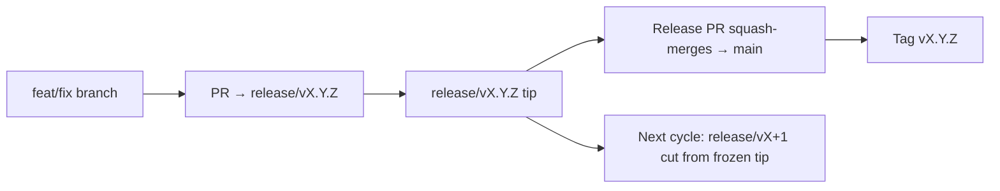

# Branching & Release Model (Azərbaycan dili)

🌐 **Languages:** 🇺🇸 [English](../../../../ops/BRANCHING_MODEL.md) · 🇪🇹 [am](../../../am/docs/ops/BRANCHING_MODEL.md) · 🇸🇦 [ar](../../../ar/docs/ops/BRANCHING_MODEL.md) · 🇧🇬 [bg](../../../bg/docs/ops/BRANCHING_MODEL.md) · 🇧🇩 [bn](../../../bn/docs/ops/BRANCHING_MODEL.md) · 🇨🇿 [cs](../../../cs/docs/ops/BRANCHING_MODEL.md) · 🇩🇰 [da](../../../da/docs/ops/BRANCHING_MODEL.md) · 🇩🇪 [de](../../../de/docs/ops/BRANCHING_MODEL.md) · 🇬🇷 [el](../../../el/docs/ops/BRANCHING_MODEL.md) · 🇪🇸 [es](../../../es/docs/ops/BRANCHING_MODEL.md) · 🇪🇪 [et](../../../et/docs/ops/BRANCHING_MODEL.md) · 🇮🇷 [fa](../../../fa/docs/ops/BRANCHING_MODEL.md) · 🇫🇮 [fi](../../../fi/docs/ops/BRANCHING_MODEL.md) · 🇫🇷 [fr](../../../fr/docs/ops/BRANCHING_MODEL.md) · 🇮🇪 [ga](../../../ga/docs/ops/BRANCHING_MODEL.md) · 🇮🇳 [gu](../../../gu/docs/ops/BRANCHING_MODEL.md) · 🇳🇬 [ha](../../../ha/docs/ops/BRANCHING_MODEL.md) · 🇮🇱 [he](../../../he/docs/ops/BRANCHING_MODEL.md) · 🇮🇳 [hi](../../../hi/docs/ops/BRANCHING_MODEL.md) · 🇭🇷 [hr](../../../hr/docs/ops/BRANCHING_MODEL.md) · 🇭🇺 [hu](../../../hu/docs/ops/BRANCHING_MODEL.md) · 🇦🇲 [hy](../../../hy/docs/ops/BRANCHING_MODEL.md) · 🇮🇩 [id](../../../id/docs/ops/BRANCHING_MODEL.md) · 🇳🇬 [ig](../../../ig/docs/ops/BRANCHING_MODEL.md) · 🇮🇹 [it](../../../it/docs/ops/BRANCHING_MODEL.md) · 🇯🇵 [ja](../../../ja/docs/ops/BRANCHING_MODEL.md) · 🇬🇪 [ka](../../../ka/docs/ops/BRANCHING_MODEL.md) · 🇰🇭 [km](../../../km/docs/ops/BRANCHING_MODEL.md) · 🇮🇳 [kn](../../../kn/docs/ops/BRANCHING_MODEL.md) · 🇰🇷 [ko](../../../ko/docs/ops/BRANCHING_MODEL.md) · 🇱🇹 [lt](../../../lt/docs/ops/BRANCHING_MODEL.md) · 🇱🇻 [lv](../../../lv/docs/ops/BRANCHING_MODEL.md) · 🇮🇳 [ml](../../../ml/docs/ops/BRANCHING_MODEL.md) · 🇮🇳 [mr](../../../mr/docs/ops/BRANCHING_MODEL.md) · 🇲🇾 [ms](../../../ms/docs/ops/BRANCHING_MODEL.md) · 🇲🇹 [mt](../../../mt/docs/ops/BRANCHING_MODEL.md) · 🇲🇲 [my](../../../my/docs/ops/BRANCHING_MODEL.md) · 🇳🇵 [ne](../../../ne/docs/ops/BRANCHING_MODEL.md) · 🇳🇱 [nl](../../../nl/docs/ops/BRANCHING_MODEL.md) · 🇳🇴 [no](../../../no/docs/ops/BRANCHING_MODEL.md) · 🇮🇳 [or](../../../or/docs/ops/BRANCHING_MODEL.md) · 🇮🇳 [pa](../../../pa/docs/ops/BRANCHING_MODEL.md) · 🇵🇭 [phi](../../../phi/docs/ops/BRANCHING_MODEL.md) · 🇵🇱 [pl](../../../pl/docs/ops/BRANCHING_MODEL.md) · 🇵🇹 [pt](../../../pt/docs/ops/BRANCHING_MODEL.md) · 🇧🇷 [pt-BR](../../../pt-BR/docs/ops/BRANCHING_MODEL.md) · 🇷🇴 [ro](../../../ro/docs/ops/BRANCHING_MODEL.md) · 🇷🇺 [ru](../../../ru/docs/ops/BRANCHING_MODEL.md) · 🇱🇰 [si](../../../si/docs/ops/BRANCHING_MODEL.md) · 🇸🇰 [sk](../../../sk/docs/ops/BRANCHING_MODEL.md) · 🇸🇮 [sl](../../../sl/docs/ops/BRANCHING_MODEL.md) · 🇷🇸 [sr](../../../sr/docs/ops/BRANCHING_MODEL.md) · 🇸🇪 [sv](../../../sv/docs/ops/BRANCHING_MODEL.md) · 🇰🇪 [sw](../../../sw/docs/ops/BRANCHING_MODEL.md) · 🇮🇳 [ta](../../../ta/docs/ops/BRANCHING_MODEL.md) · 🇮🇳 [te](../../../te/docs/ops/BRANCHING_MODEL.md) · 🇹🇭 [th](../../../th/docs/ops/BRANCHING_MODEL.md) · 🇹🇷 [tr](../../../tr/docs/ops/BRANCHING_MODEL.md) · 🇺🇦 [uk-UA](../../../uk-UA/docs/ops/BRANCHING_MODEL.md) · 🇵🇰 [ur](../../../ur/docs/ops/BRANCHING_MODEL.md) · 🇺🇿 [uz](../../../uz/docs/ops/BRANCHING_MODEL.md) · 🇻🇳 [vi](../../../vi/docs/ops/BRANCHING_MODEL.md) · 🇳🇬 [yo](../../../yo/docs/ops/BRANCHING_MODEL.md) · 🇨🇳 [zh-CN](../../../zh-CN/docs/ops/BRANCHING_MODEL.md) · 🇹🇼 [zh-TW](../../../zh-TW/docs/ops/BRANCHING_MODEL.md)

---

OmniRoute **paralel dövr** buraxılış modelindən istifadə edir: aktiv dövr üçün xüsusi `release/vX.Y.Z`
budağı, dərc edilmiş xətt üçün `main` və həmin dövr buraxıldıqda dəyişdirilməz
`vX.Y.Z` teqi. Kommitlərin həm `release/*`, həm də `main` üzərinə daxil olduğunu
görmək gözləniləndir — bu, qarışıqlıq deyil.

Müşayiətçilər üçün ətraflı məlumat `CLAUDE.md` sənədində (Sərt Qayda #21) və
[RELEASE_CHECKLIST.md](./RELEASE_CHECKLIST.md) sənədində verilib. Bu səhifə
iştirakçılar üçün açıq xülasədir.

## Qısa baxış

| İstinad          | Rol                                                                                                          |
| ---------------- | ------------------------------------------------------------------------------------------------------------ |
| `release/vX.Y.Z` | **Aktiv dövr** — həmin versiya üçün gündəlik inkişaf və PR birləşdirmələri                                   |
| `main`           | **Dərc edilmiş xətt** — buraxılış yayımlandıqda dövrü squash-merge vasitəsilə qəbul edir                     |
| `vX.Y.Z` (teq)   | **Buraxılış işarəsi** — buraxılış zamanı yaradılan və “nəyin buraxıldığını” göstərən dəyişdirilməz göstərici |



## PR-ım hansı budağı hədəfləməlidir?

**Aktiv `release/vX.Y.Z` budağını hədəfləyin — `main` budağını deyil.**

1. Ən yüksək açıq `release/v*` budağını tapın (yazı hazırlanarkən nümunə:
   `release/v3.8.49`).
2. Həmin son nöqtədən budaq yaradın (`git fetch` + checkout / onun üzərinə rebase).
3. PR-ı **base = həmin `release/vX.Y.Z`** olmaqla açın.

`main` gündəlik inteqrasiya budağı deyil. `main` üçün açılmış PR-ların adətən
birləşdirilməzdən əvvəl başqa hədəfə yönəldilməsi tələb olunur.

## Buraxılışın dondurulması (paralel dövrlər)

Buraxılış uyğunlaşdırılarkən `release-freeze` etiketli marker məsələ açılır.
Bu, **inkişafı dayandırmır**:

- Dondurulmuş `release/vX.Y.Z` həmin buraxılış üçün buraxılış rəhbərinə aiddir.
- İştirakçıların işlərini daxil etməyə davam edə bilməsi üçün növbəti dövrün
  `release/vX+1` budağı dondurulmuş son nöqtədən yaradılır.
- Hələ də dondurulmuş budağı hədəfləyən açıq PR-lar aktiv (ən yüksək)
  `release/v*` budağına **yenidən yönəldilməlidir**.

İstədiyiniz budağın birləşdirilə biləcəyini güman etməzdən əvvəl açıq dondurulmanın
olub-olmadığını yoxlayın:

```bash
gh issue list --repo diegosouzapw/OmniRoute --label release-freeze --state open
```

Birləşdirmə mexanizmləri (sahibin `queue` etiketi → Mergify)
[MERGE_TRAIN.md](./MERGE_TRAIN.md) sənədində təsvir edilib.

## Nə üçün həm budaq, həm də teq var?

| Artefakt         | İstifadə müddəti | Məqsəd                                                                                    |
| ---------------- | ---------------- | ----------------------------------------------------------------------------------------- |
| `release/vX.Y.Z` | Davam edən dövr  | Yoxlanılmış PR-ları toplayır, CI vəziyyətini yaşıl saxlayır və PR bazası kimi xidmət edir |
| `vX.Y.Z` teqi    | Həmişəlik        | npm / GitHub Releases vasitəsilə yayımlanmış dəqiq məzmunu işarələyir                     |

Budaq emalatxanadır; teq isə möhürlənmiş paketdir. `main` budağına squash-merge
edildikdən sonra növbəti dövr əvvəlki buraxılış PR-ının tamamlanmasını gözləmədən
`release/vX+1` üzərində davam edir.

## Əlaqəli sənədlər

- [CONTRIBUTING.md](../../CONTRIBUTING.md) — quraşdırma, testlər, PR yoxlama siyahısı
- [RELEASE_CHECKLIST.md](./RELEASE_CHECKLIST.md) — buraxılışdan əvvəl yoxlama
- [MERGE_TRAIN.md](./MERGE_TRAIN.md) — birləşdirmə növbəsi və ehtiyat birləşdirmə ardıcıllığı
- [RELEASE_GREEN.md](./RELEASE_GREEN.md) — buraxılışın son nöqtəsinin yaşıl saxlanması
