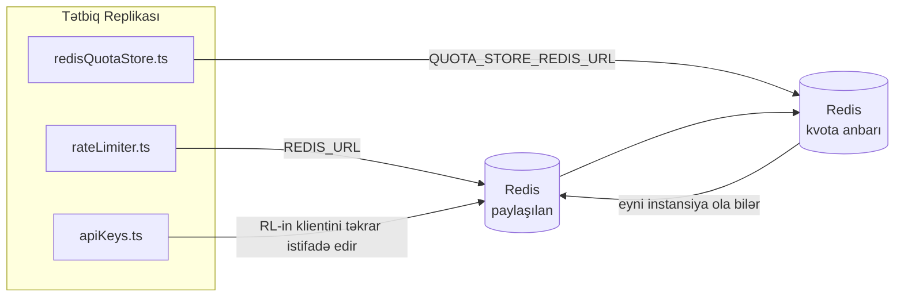

# Redis Production Configuration Guide (Azərbaycan dili)

🌐 **Languages:** 🇺🇸 [English](../../../../ops/REDIS_PRODUCTION_CONFIG.md) · 🇪🇹 [am](../../../am/docs/ops/REDIS_PRODUCTION_CONFIG.md) · 🇸🇦 [ar](../../../ar/docs/ops/REDIS_PRODUCTION_CONFIG.md) · 🇧🇬 [bg](../../../bg/docs/ops/REDIS_PRODUCTION_CONFIG.md) · 🇧🇩 [bn](../../../bn/docs/ops/REDIS_PRODUCTION_CONFIG.md) · 🇧🇦 [bs](../../../bs/docs/ops/REDIS_PRODUCTION_CONFIG.md) · 🇨🇿 [cs](../../../cs/docs/ops/REDIS_PRODUCTION_CONFIG.md) · 🇩🇰 [da](../../../da/docs/ops/REDIS_PRODUCTION_CONFIG.md) · 🇩🇪 [de](../../../de/docs/ops/REDIS_PRODUCTION_CONFIG.md) · 🇬🇷 [el](../../../el/docs/ops/REDIS_PRODUCTION_CONFIG.md) · 🇪🇸 [es](../../../es/docs/ops/REDIS_PRODUCTION_CONFIG.md) · 🇪🇪 [et](../../../et/docs/ops/REDIS_PRODUCTION_CONFIG.md) · 🇮🇷 [fa](../../../fa/docs/ops/REDIS_PRODUCTION_CONFIG.md) · 🇫🇮 [fi](../../../fi/docs/ops/REDIS_PRODUCTION_CONFIG.md) · 🇫🇷 [fr](../../../fr/docs/ops/REDIS_PRODUCTION_CONFIG.md) · 🇮🇪 [ga](../../../ga/docs/ops/REDIS_PRODUCTION_CONFIG.md) · 🇮🇳 [gu](../../../gu/docs/ops/REDIS_PRODUCTION_CONFIG.md) · 🇳🇬 [ha](../../../ha/docs/ops/REDIS_PRODUCTION_CONFIG.md) · 🇮🇱 [he](../../../he/docs/ops/REDIS_PRODUCTION_CONFIG.md) · 🇮🇳 [hi](../../../hi/docs/ops/REDIS_PRODUCTION_CONFIG.md) · 🇭🇷 [hr](../../../hr/docs/ops/REDIS_PRODUCTION_CONFIG.md) · 🇭🇺 [hu](../../../hu/docs/ops/REDIS_PRODUCTION_CONFIG.md) · 🇦🇲 [hy](../../../hy/docs/ops/REDIS_PRODUCTION_CONFIG.md) · 🇮🇩 [id](../../../id/docs/ops/REDIS_PRODUCTION_CONFIG.md) · 🇳🇬 [ig](../../../ig/docs/ops/REDIS_PRODUCTION_CONFIG.md) · 🇮🇹 [it](../../../it/docs/ops/REDIS_PRODUCTION_CONFIG.md) · 🇯🇵 [ja](../../../ja/docs/ops/REDIS_PRODUCTION_CONFIG.md) · 🇬🇪 [ka](../../../ka/docs/ops/REDIS_PRODUCTION_CONFIG.md) · 🇰🇭 [km](../../../km/docs/ops/REDIS_PRODUCTION_CONFIG.md) · 🇮🇳 [kn](../../../kn/docs/ops/REDIS_PRODUCTION_CONFIG.md) · 🇰🇷 [ko](../../../ko/docs/ops/REDIS_PRODUCTION_CONFIG.md) · 🇱🇹 [lt](../../../lt/docs/ops/REDIS_PRODUCTION_CONFIG.md) · 🇱🇻 [lv](../../../lv/docs/ops/REDIS_PRODUCTION_CONFIG.md) · 🇮🇳 [ml](../../../ml/docs/ops/REDIS_PRODUCTION_CONFIG.md) · 🇮🇳 [mr](../../../mr/docs/ops/REDIS_PRODUCTION_CONFIG.md) · 🇲🇾 [ms](../../../ms/docs/ops/REDIS_PRODUCTION_CONFIG.md) · 🇲🇹 [mt](../../../mt/docs/ops/REDIS_PRODUCTION_CONFIG.md) · 🇲🇲 [my](../../../my/docs/ops/REDIS_PRODUCTION_CONFIG.md) · 🇳🇵 [ne](../../../ne/docs/ops/REDIS_PRODUCTION_CONFIG.md) · 🇳🇱 [nl](../../../nl/docs/ops/REDIS_PRODUCTION_CONFIG.md) · 🇳🇴 [no](../../../no/docs/ops/REDIS_PRODUCTION_CONFIG.md) · 🇮🇳 [or](../../../or/docs/ops/REDIS_PRODUCTION_CONFIG.md) · 🇮🇳 [pa](../../../pa/docs/ops/REDIS_PRODUCTION_CONFIG.md) · 🇵🇭 [phi](../../../phi/docs/ops/REDIS_PRODUCTION_CONFIG.md) · 🇵🇱 [pl](../../../pl/docs/ops/REDIS_PRODUCTION_CONFIG.md) · 🇵🇹 [pt](../../../pt/docs/ops/REDIS_PRODUCTION_CONFIG.md) · 🇧🇷 [pt-BR](../../../pt-BR/docs/ops/REDIS_PRODUCTION_CONFIG.md) · 🇷🇴 [ro](../../../ro/docs/ops/REDIS_PRODUCTION_CONFIG.md) · 🇷🇺 [ru](../../../ru/docs/ops/REDIS_PRODUCTION_CONFIG.md) · 🇱🇰 [si](../../../si/docs/ops/REDIS_PRODUCTION_CONFIG.md) · 🇸🇰 [sk](../../../sk/docs/ops/REDIS_PRODUCTION_CONFIG.md) · 🇸🇮 [sl](../../../sl/docs/ops/REDIS_PRODUCTION_CONFIG.md) · 🇷🇸 [sr](../../../sr/docs/ops/REDIS_PRODUCTION_CONFIG.md) · 🇸🇪 [sv](../../../sv/docs/ops/REDIS_PRODUCTION_CONFIG.md) · 🇰🇪 [sw](../../../sw/docs/ops/REDIS_PRODUCTION_CONFIG.md) · 🇮🇳 [ta](../../../ta/docs/ops/REDIS_PRODUCTION_CONFIG.md) · 🇮🇳 [te](../../../te/docs/ops/REDIS_PRODUCTION_CONFIG.md) · 🇹🇭 [th](../../../th/docs/ops/REDIS_PRODUCTION_CONFIG.md) · 🇹🇷 [tr](../../../tr/docs/ops/REDIS_PRODUCTION_CONFIG.md) · 🇺🇦 [uk-UA](../../../uk-UA/docs/ops/REDIS_PRODUCTION_CONFIG.md) · 🇵🇰 [ur](../../../ur/docs/ops/REDIS_PRODUCTION_CONFIG.md) · 🇺🇿 [uz](../../../uz/docs/ops/REDIS_PRODUCTION_CONFIG.md) · 🇻🇳 [vi](../../../vi/docs/ops/REDIS_PRODUCTION_CONFIG.md) · 🇳🇬 [yo](../../../yo/docs/ops/REDIS_PRODUCTION_CONFIG.md) · 🇨🇳 [zh-CN](../../../zh-CN/docs/ops/REDIS_PRODUCTION_CONFIG.md) · 🇹🇼 [zh-TW](../../../zh-TW/docs/ops/REDIS_PRODUCTION_CONFIG.md)

---

## İcmal

Redis OmniRoute-da **ixtiyari, yumşaq asılılıqdır** — Redis əlçatan olmadıqda tətbiq işləməyə davam edir və funksionallığı uyğun şəkildə azaldır (yaddaşdaxili
ehtiyat mexanizmlərindən istifadə edir). İstehsal mühitində Redis-in tənzimlənməsi dörd fərqli
iş yükü üçün gecikməni azaldır:

| İş yükü                             | İdarəedici                    | Klient fabriki                                               | Açar nümunəsi                                                    |
| ----------------------------------- | ----------------------------- | ------------------------------------------------------------ | ---------------------------------------------------------------- |
| Sorğu tezliyinin məhdudlaşdırılması | `rateLimiter.ts`              | `getRedisClient()` — tənbəl başladılan `ioredis` singleton-u | `<prefix>rl:*` Lua ilə atomik sorğu tezliyi limiti pəncərələri   |
| Autentifikasiya keşi                | `apiKeys.ts`                  | `rateLimiter` klientindən təkrar istifadə edir               | TTL ilə `<prefix>auth:api_key:<sha256>`                          |
| Kvota anbarı                        | `redisQuotaStore.ts`          | Ayrı `getRedisClient(url)` singleton-u                       | `<prefix>quota:*`, hər instansiya üçün konfiqurasiya edilə bilər |
| İlkin qızdırma dövrə kəsicisi       | `redisCircuitBreakerStore.ts` | `circuitBreakerFactory.ts` daxilində ayrıca klient           | `<prefix>warmup:cb:<connectionId>`                               |

OmniRoute-un digər tətbiqlərlə tək bir Redis instansiyasında (məsələn, `127.0.0.1:6379`) yanaşı işləyə bilməsi üçün bütün dörd iş yükü eyni ad məkanı prefiksindən istifadə edir.
Baxın: [Açarların ad məkanı üzrə ayrılması](#key-namespacing).

---

## Cari konfiqurasiya (koddakı standart dəyərlər)

| Parametr                               | Dəyər                                                         | Yeri                                                                                  |
| -------------------------------------- | ------------------------------------------------------------- | ------------------------------------------------------------------------------------- |
| `REDIS_URL` mühit dəyişəni             | `redis://redis:6379` (compose), ixtiyari                      | `rateLimiter.ts:5`, `.env.example`                                                    |
| `REDIS_KEY_PREFIX` mühit dəyişəni      | `omniroute:` (standart)                                       | `rateLimiter.ts`, `redisQuotaStore.ts`, `redisCircuitBreakerStore.ts`, `.env.example` |
| `QUOTA_STORE_REDIS_URL` mühit dəyişəni | ayrıdır, `REDIS_URL` dəyərindən fərqli ola bilər              | `quota/storeFactory.ts`                                                               |
| `QUOTA_STORE_DRIVER`                   | `"sqlite"` (standart), `"redis"` ixtiyaridir                  | `quota/storeFactory.ts`                                                               |
| ioredis `maxRetriesPerRequest`         | `3`                                                           | `rateLimiter.ts` klientinin yaradılması                                               |
| `enableReadyCheck`                     | təyin edilməyib (ioredis standartı: `true`)                   | —                                                                                     |
| `lazyConnect`                          | təyin edilməyib (ioredis standartı: `false`)                  | —                                                                                     |
| `retryStrategy`                        | təyin edilməyib (ioredis standartı: 200ms baza, eksponensial) | —                                                                                     |
| TLS / parol / DB indeksi               | **konfiqurasiya edilməyib**                                   | —                                                                                     |
| Sentinel / Cluster                     | **konfiqurasiya edilməyib** — yalnız müstəqil tək qovşaq      | —                                                                                     |

---

## Açarların ad məkanı üzrə ayrılması

OmniRoute Redis instansiyasını hostda işləyən digər xidmətlərlə paylaşır. Ad məkanı olmadan
`auth:api_key:<sha256>` və ya `rl:*` kimi açarlar eyni Redis-dən istifadə edən digər tətbiqlərin
açarları ilə toqquşa bilər (bu instansiya Redis-i digər xidmətlərlə yanaşı `127.0.0.1:6379` ünvanında işlədir).

**Bütün** OmniRoute açarlarına prefiks əlavə etmək üçün `REDIS_KEY_PREFIX` dəyişənini boş olmayan sətirə təyin edin:

```bash
# .env — bütün OmniRoute açarları omniroute:rl:*, omniroute:auth:*, omniroute:quota:*, omniroute:warmup:cb:* formasını alır
REDIS_KEY_PREFIX=omniroute:
```

- **Standart:** `omniroute:` (`REDIS_KEY_PREFIX` təyin edilmədikdə və ya boş olduqda tətbiq edilir).
- **Tətbiq edildiyi yerlər:** sorğu tezliyi məhdudlaşdırıcısı + autentifikasiya keşi (`keyPrefix` vasitəsilə paylaşılan `ioredis` klienti), həmçinin
  kvota anbarı (`KEY_PREFIX = "${REDIS_KEY_PREFIX}quota"`) və ilkin qızdırma dövrə kəsicisi
  (`KEY_PREFIX = "${REDIS_KEY_PREFIX}warmup:cb:"`).
- Redis-də açarlar artıq mövcud olduqda **prefiksin dəyişdirilməsi** köhnə açarları sahibsiz qoyur (onlar
  TTL / LRU vasitəsilə silinir). Dəyişdirmək təhlükəsizdir; miqrasiya tələb olunmur. Yeganə istisna,
  qadağan edilmiş kimi işarələnmiş bağlantı üçün ilkin qızdırma dövrə kəsicisi açarıdır: o, TTL olmadan saxlanılır, buna görə
  qalıqları `redis-cli --scan --pattern '<old-prefix>warmup:cb:*'` ilə siyahıya alın və silin.
- **ioredis `keyPrefix`** yazma zamanı prefiksi avtomatik olaraq əlavə edir **və** oxuma zamanı onu silir,
  buna görə tətbiq kodu prefiksi heç vaxt görmür.

---

## Tövsiyə Olunan İstehsal Mühiti Tənzimləmələri

### 1. Bağlantı Hovuzu / Klient Seçimləri (ioredis `Redis` konstruktoru)

Mövcud kod heç bir fərdi seçim olmadan tək bir `new Redis(url)` yaradır. İstehsal
mühitində çoxsaylı replika yerləşdirmələri üçün kodda klient fabriki ötürün və ya `getRedisClient()` funksiyasını əhatə edən sarmalayıcı yaradın:

```typescript
const redis = new Redis(REDIS_URL, {
  maxRetriesPerRequest: null, // təkrar cəhd limiti yoxdur; qərarı retryStrategy versin
  enableReadyCheck: true, // çağırışları qəbul etməzdən əvvəl serverin hazır olduğunu yoxla
  lazyConnect: true, // yaradılarkən qoşulma; ilk çağırışı gözlə
  retryStrategy: (times) => {
    if (times > 10) return null; // 10 təkrar cəhddən sonra imtina et → daha sonra yenidən qoşul
    return Math.min(times * 200, 5000); // 200ms, 400ms, …, maksimum 5s
  },
  enableAutoPipelining: true, // paralel əmrləri bir TCP yazma əməliyyatında birləşdir
  keepAlive: 10000, // hər 10s-dən bir TCP bağlantısını aktiv saxla
});
```

**Əsas kompromislər:**

- `maxRetriesPerRequest: null` + `retryStrategy` — müvəqqəti Redis yenidən başladılmalarının
  hər sorğunu dərhal uğursuz etməməsi üçün istehsal mühitində üstünlük verilən seçimdir. `checkRateLimit()`
  daxilindəki yaddaşdaxili ehtiyat mexanizmi xəta ssenarisini qarşılayır.
- `lazyConnect: true` — server bağlantıları qəbul etməyə başlamazdan əvvəl Redis-in
  işlək olmasına dair başlanğıc asılılığının qarşısını alır.
- `enableAutoPipelining: true` — paralel sürət limiti yoxlamaları üçün gediş-gəlişlərin sayını azaldır;
  tək bağlantıda >50 RPS olduqda faydalıdır.

### 2. Redis Server Konfiqurasiyası (`redis.conf`)

```
# Yaddaş
maxmemory 80%                        # ƏS səhifə keşi üçün yer saxla
maxmemory-policy allkeys-lru         # yük altında köhnəlmiş autentifikasiya keş qeydlərini çıxar

# Davamlılıq (ixtiyaridir — OmniRoute onsuz da qəzalara davamlıdır)
save 300 1                           # ≥1 açar dəyişibsə, ən azı hər 5 dəqiqədən bir ani görüntü yarat
appendonly no                        # AOF lazım deyil; məlumatlar yenidən yaradıla bilər
appendfsync no                       # fsync əlavə yükü yoxdur (RDB kifayətdir)

# Şəbəkə
timeout 0                            # boşdayanma səbəbindən bağlantını kəsmə
tcp-keepalive 300                    # 5 dəqiqəlik bağlantını aktiv saxlama intervalı
tcp-backlog 511                      # sıçrayışlı yük üçün bağlantı növbəsi

# Məhsuldarlıq
hz 10                                # standart; gecikməyə həssas işlər üçün 100
activedefrag yes                     # fraqmentasiya >10% olduqda avtomatik defraqmentasiya et
```

**`maxmemory-policy allkeys-lru` üçün kompromis:** Yaddaş təzyiqi altında autentifikasiya
keş qeydləri çıxarıla bilər. Bu təhlükəsizdir — `setCachedApiKey` keş buraxılışı zamanı həmişə
məlumatı yenidən doldurur və SQLite ehtiyat mexanizmi əsas etibarlı mənbədir. Sürət məhdudlaşdırıcısının Lua skripti
dizayn etibarilə qısaömürlü olan kiçik açarlar yaradır.

### 3. Docker Compose Parametrləri

İstehsal compose faylı (`docker-compose.prod.yml`) `redis:8.6.2-alpine` istifadə edir. Əlavə edin:

```yaml
redis:
  image: redis:8.6.2-alpine
  command:
    [
      "redis-server",
      "--maxmemory",
      "512mb",
      "--maxmemory-policy",
      "allkeys-lru",
      "--activedefrag",
      "yes",
      "--save",
      "300 1",
    ]
  healthcheck:
    test: ["CMD", "redis-cli", "ping"]
    interval: 10s
    timeout: 3s
    retries: 3
    start_period: 5s
```

### 4. Çoxsaylı İnstanlar / Miqyaslama Mülahizələri

**Bütün replikalar üçün vahid Redis** — sürət məhdudlaşdırıcısının Lua skripti vahid
əsas açar fəzasından asılıdır. Replikaların arxasındakı çoxsaylı Redis instansları atomikliyi
itirər və büdcəni ikiqat artırardı. Bütün tətbiq replikaları üçün vahid Redis-dən (və ya nasazlıq zamanı keçid imkanına malik Redis Sentinel klasterindən)
istifadə edin.

**Bağlantı sayı:** Hər tətbiq replikası Redis-ə **2 TCP bağlantısı** açır
(sürət məhdudlaşdırıcısı klienti + kvota yaddaşı klienti). 10 replika olduqda → 20 bağlantı yaranır ki, bu da
standart Redis instansının 10k bağlantı həddindən xeyli aşağıdır.

### 5. Monitorinq

Sağlamlıq yoxlaması son nöqtəsi vasitəsilə əlçatan edin:

```typescript
// src/app/api/monitoring/health/route.ts artıq rateLimiter funksiyalarını çağırır
// Redis-ə məxsus yoxlamaları əlavə edin:
//   1. ioredis .ping() vasitəsilə PING gecikməsi
//   2. INFO memory vasitəsilə yaddaş istifadəsi
//   3. INFO clients vasitəsilə bağlantı sayı
//   4. maxmemory-policy üçün uyğunluq tezliyi (evicted_keys / keyspace_hits)
```

İzlənilməli əsas metriklər:

- **Çıxarılan açarlar / san** — davamlı olaraq sıfırdan fərqlidirsə, `maxmemory` dəyərini artırın
- **Bloklanmış klientlər** — sıfırdan fərqli olması yavaş Lua skriptlərinə və ya yüksək rəqabətə işarə edir
- **Rədd edilmiş bağlantılar** — bağlantı limitinə çatılıb; 20 bağlantıda nadir haldır

---

## Arxitektura Diaqramı



---

## İstinadlar

| Fayl                               | Təyinat                                                                                      |
| ---------------------------------- | -------------------------------------------------------------------------------------------- |
| `src/shared/utils/rateLimiter.ts`  | Əsas Redis klienti, Lua sorğu tezliyi məhdudlaşdırma skripti, yaddaşdaxili ehtiyat mexanizmi |
| `src/lib/db/apiKeys.ts`            | Autentifikasiya keşi — Redis→SQLite ehtiyat mexanizmi                                        |
| `src/lib/quota/redisQuotaStore.ts` | Opsional kvota anbarı üçün ayrıca Redis klienti                                              |
| `src/lib/quota/storeFactory.ts`    | `sqlite` və `redis` kvota drayverləri arasında keçid edir                                    |
| `docker-compose.prod.yml`          | Prod Redis konteyneri (`redis:8.6.2-alpine` obrazı)                                          |
| `.env.example`                     | Redis mühit dəyişənlərinin sənədləri                                                         |
| `src/app/api/local/redis/`         | Dev konteynerinin orkestrasiya API marşrutları                                               |
| `bin/cli/commands/redis.mjs`       | Dev konteynerinin orkestrasiya CLI komandaları                                               |
