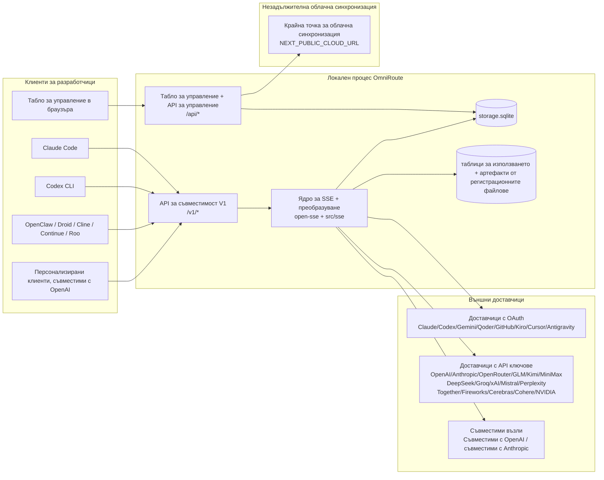
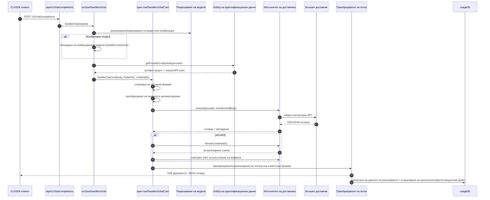
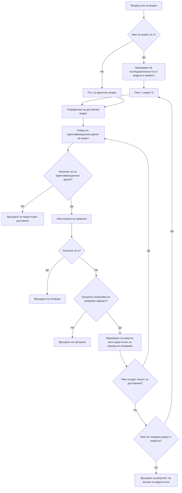
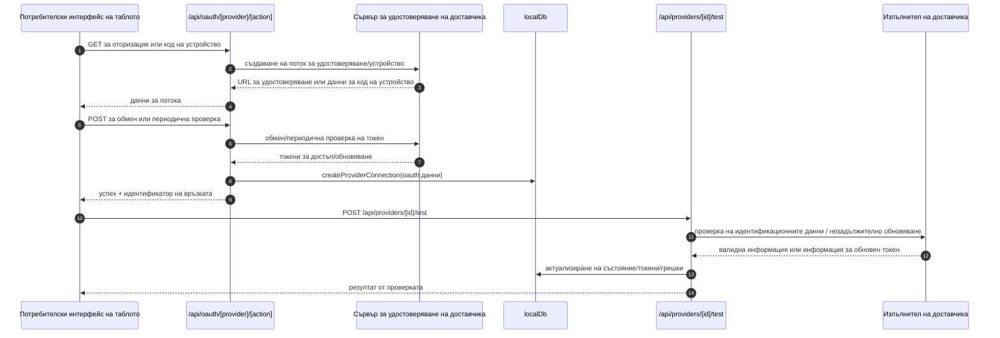
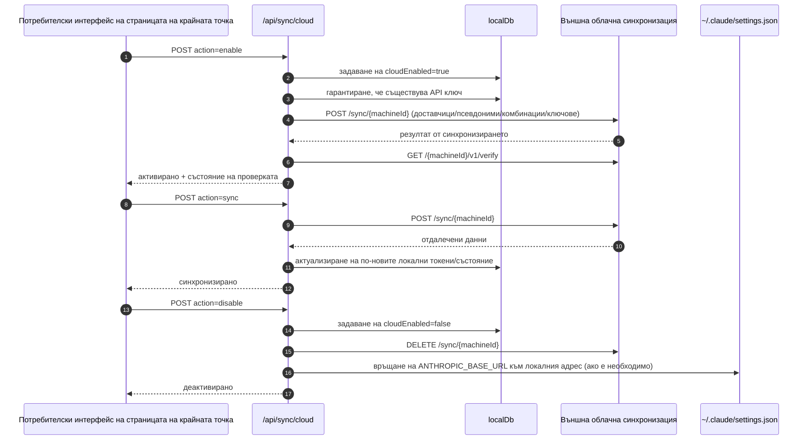
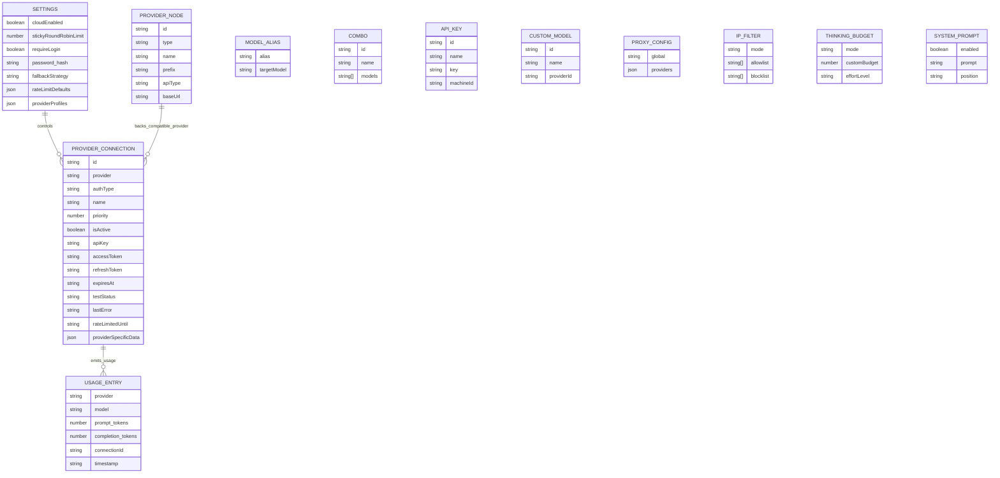
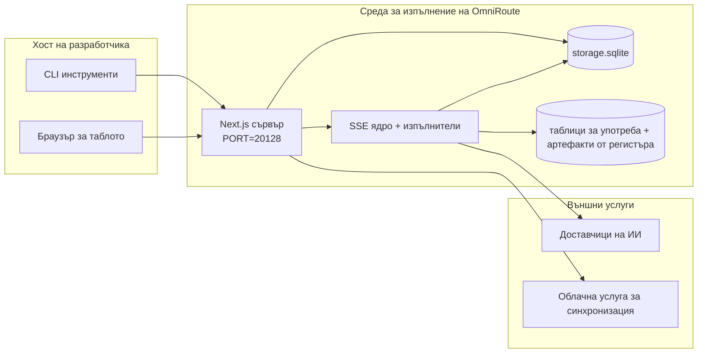

# OmniRoute Architecture (Български)

🌐 **Languages:** 🇺🇸 [English](../../../../architecture/ARCHITECTURE.md) · 🇪🇹 [am](../../../am/docs/architecture/ARCHITECTURE.md) · 🇸🇦 [ar](../../../ar/docs/architecture/ARCHITECTURE.md) · 🇦🇿 [az](../../../az/docs/architecture/ARCHITECTURE.md) · 🇧🇩 [bn](../../../bn/docs/architecture/ARCHITECTURE.md) · 🇧🇦 [bs](../../../bs/docs/architecture/ARCHITECTURE.md) · 🇨🇿 [cs](../../../cs/docs/architecture/ARCHITECTURE.md) · 🇩🇰 [da](../../../da/docs/architecture/ARCHITECTURE.md) · 🇩🇪 [de](../../../de/docs/architecture/ARCHITECTURE.md) · 🇬🇷 [el](../../../el/docs/architecture/ARCHITECTURE.md) · 🇪🇸 [es](../../../es/docs/architecture/ARCHITECTURE.md) · 🇪🇪 [et](../../../et/docs/architecture/ARCHITECTURE.md) · 🇮🇷 [fa](../../../fa/docs/architecture/ARCHITECTURE.md) · 🇫🇮 [fi](../../../fi/docs/architecture/ARCHITECTURE.md) · 🇫🇷 [fr](../../../fr/docs/architecture/ARCHITECTURE.md) · 🇮🇪 [ga](../../../ga/docs/architecture/ARCHITECTURE.md) · 🇮🇳 [gu](../../../gu/docs/architecture/ARCHITECTURE.md) · 🇳🇬 [ha](../../../ha/docs/architecture/ARCHITECTURE.md) · 🇮🇱 [he](../../../he/docs/architecture/ARCHITECTURE.md) · 🇮🇳 [hi](../../../hi/docs/architecture/ARCHITECTURE.md) · 🇭🇷 [hr](../../../hr/docs/architecture/ARCHITECTURE.md) · 🇭🇺 [hu](../../../hu/docs/architecture/ARCHITECTURE.md) · 🇦🇲 [hy](../../../hy/docs/architecture/ARCHITECTURE.md) · 🇮🇩 [id](../../../id/docs/architecture/ARCHITECTURE.md) · 🇳🇬 [ig](../../../ig/docs/architecture/ARCHITECTURE.md) · 🇮🇹 [it](../../../it/docs/architecture/ARCHITECTURE.md) · 🇯🇵 [ja](../../../ja/docs/architecture/ARCHITECTURE.md) · 🇬🇪 [ka](../../../ka/docs/architecture/ARCHITECTURE.md) · 🇰🇭 [km](../../../km/docs/architecture/ARCHITECTURE.md) · 🇮🇳 [kn](../../../kn/docs/architecture/ARCHITECTURE.md) · 🇰🇷 [ko](../../../ko/docs/architecture/ARCHITECTURE.md) · 🇱🇹 [lt](../../../lt/docs/architecture/ARCHITECTURE.md) · 🇱🇻 [lv](../../../lv/docs/architecture/ARCHITECTURE.md) · 🇮🇳 [ml](../../../ml/docs/architecture/ARCHITECTURE.md) · 🇮🇳 [mr](../../../mr/docs/architecture/ARCHITECTURE.md) · 🇲🇾 [ms](../../../ms/docs/architecture/ARCHITECTURE.md) · 🇲🇹 [mt](../../../mt/docs/architecture/ARCHITECTURE.md) · 🇲🇲 [my](../../../my/docs/architecture/ARCHITECTURE.md) · 🇳🇵 [ne](../../../ne/docs/architecture/ARCHITECTURE.md) · 🇳🇱 [nl](../../../nl/docs/architecture/ARCHITECTURE.md) · 🇳🇴 [no](../../../no/docs/architecture/ARCHITECTURE.md) · 🇮🇳 [or](../../../or/docs/architecture/ARCHITECTURE.md) · 🇮🇳 [pa](../../../pa/docs/architecture/ARCHITECTURE.md) · 🇵🇭 [phi](../../../phi/docs/architecture/ARCHITECTURE.md) · 🇵🇱 [pl](../../../pl/docs/architecture/ARCHITECTURE.md) · 🇵🇹 [pt](../../../pt/docs/architecture/ARCHITECTURE.md) · 🇧🇷 [pt-BR](../../../pt-BR/docs/architecture/ARCHITECTURE.md) · 🇷🇴 [ro](../../../ro/docs/architecture/ARCHITECTURE.md) · 🇷🇺 [ru](../../../ru/docs/architecture/ARCHITECTURE.md) · 🇱🇰 [si](../../../si/docs/architecture/ARCHITECTURE.md) · 🇸🇰 [sk](../../../sk/docs/architecture/ARCHITECTURE.md) · 🇸🇮 [sl](../../../sl/docs/architecture/ARCHITECTURE.md) · 🇷🇸 [sr](../../../sr/docs/architecture/ARCHITECTURE.md) · 🇸🇪 [sv](../../../sv/docs/architecture/ARCHITECTURE.md) · 🇰🇪 [sw](../../../sw/docs/architecture/ARCHITECTURE.md) · 🇮🇳 [ta](../../../ta/docs/architecture/ARCHITECTURE.md) · 🇮🇳 [te](../../../te/docs/architecture/ARCHITECTURE.md) · 🇹🇭 [th](../../../th/docs/architecture/ARCHITECTURE.md) · 🇹🇷 [tr](../../../tr/docs/architecture/ARCHITECTURE.md) · 🇺🇦 [uk-UA](../../../uk-UA/docs/architecture/ARCHITECTURE.md) · 🇵🇰 [ur](../../../ur/docs/architecture/ARCHITECTURE.md) · 🇺🇿 [uz](../../../uz/docs/architecture/ARCHITECTURE.md) · 🇻🇳 [vi](../../../vi/docs/architecture/ARCHITECTURE.md) · 🇳🇬 [yo](../../../yo/docs/architecture/ARCHITECTURE.md) · 🇨🇳 [zh-CN](../../../zh-CN/docs/architecture/ARCHITECTURE.md) · 🇹🇼 [zh-TW](../../../zh-TW/docs/architecture/ARCHITECTURE.md)

---

🌐 **Languages:** 🇺🇸 [English](../../../../architecture/ARCHITECTURE.md) · 🇪🇹 [am](../../../am/docs/architecture/ARCHITECTURE.md) · 🇸🇦 [ar](../../../ar/docs/architecture/ARCHITECTURE.md) · 🇦🇿 [az](../../../az/docs/architecture/ARCHITECTURE.md) · 🇧🇩 [bn](../../../bn/docs/architecture/ARCHITECTURE.md) · 🇧🇦 [bs](../../../bs/docs/architecture/ARCHITECTURE.md) · 🇨🇿 [cs](../../../cs/docs/architecture/ARCHITECTURE.md) · 🇩🇰 [da](../../../da/docs/architecture/ARCHITECTURE.md) · 🇩🇪 [de](../../../de/docs/architecture/ARCHITECTURE.md) · 🇬🇷 [el](../../../el/docs/architecture/ARCHITECTURE.md) · 🇪🇸 [es](../../../es/docs/architecture/ARCHITECTURE.md) · 🇪🇪 [et](../../../et/docs/architecture/ARCHITECTURE.md) · 🇮🇷 [fa](../../../fa/docs/architecture/ARCHITECTURE.md) · 🇫🇮 [fi](../../../fi/docs/architecture/ARCHITECTURE.md) · 🇫🇷 [fr](../../../fr/docs/architecture/ARCHITECTURE.md) · 🇮🇪 [ga](../../../ga/docs/architecture/ARCHITECTURE.md) · 🇮🇳 [gu](../../../gu/docs/architecture/ARCHITECTURE.md) · 🇳🇬 [ha](../../../ha/docs/architecture/ARCHITECTURE.md) · 🇮🇱 [he](../../../he/docs/architecture/ARCHITECTURE.md) · 🇮🇳 [hi](../../../hi/docs/architecture/ARCHITECTURE.md) · 🇭🇷 [hr](../../../hr/docs/architecture/ARCHITECTURE.md) · 🇭🇺 [hu](../../../hu/docs/architecture/ARCHITECTURE.md) · 🇦🇲 [hy](../../../hy/docs/architecture/ARCHITECTURE.md) · 🇮🇩 [id](../../../id/docs/architecture/ARCHITECTURE.md) · 🇳🇬 [ig](../../../ig/docs/architecture/ARCHITECTURE.md) · 🇮🇹 [it](../../../it/docs/architecture/ARCHITECTURE.md) · 🇯🇵 [ja](../../../ja/docs/architecture/ARCHITECTURE.md) · 🇬🇪 [ka](../../../ka/docs/architecture/ARCHITECTURE.md) · 🇰🇭 [km](../../../km/docs/architecture/ARCHITECTURE.md) · 🇮🇳 [kn](../../../kn/docs/architecture/ARCHITECTURE.md) · 🇰🇷 [ko](../../../ko/docs/architecture/ARCHITECTURE.md) · 🇱🇹 [lt](../../../lt/docs/architecture/ARCHITECTURE.md) · 🇱🇻 [lv](../../../lv/docs/architecture/ARCHITECTURE.md) · 🇮🇳 [ml](../../../ml/docs/architecture/ARCHITECTURE.md) · 🇮🇳 [mr](../../../mr/docs/architecture/ARCHITECTURE.md) · 🇲🇾 [ms](../../../ms/docs/architecture/ARCHITECTURE.md) · 🇲🇹 [mt](../../../mt/docs/architecture/ARCHITECTURE.md) · 🇲🇲 [my](../../../my/docs/architecture/ARCHITECTURE.md) · 🇳🇵 [ne](../../../ne/docs/architecture/ARCHITECTURE.md) · 🇳🇱 [nl](../../../nl/docs/architecture/ARCHITECTURE.md) · 🇳🇴 [no](../../../no/docs/architecture/ARCHITECTURE.md) · 🇮🇳 [or](../../../or/docs/architecture/ARCHITECTURE.md) · 🇮🇳 [pa](../../../pa/docs/architecture/ARCHITECTURE.md) · 🇵🇭 [phi](../../../phi/docs/architecture/ARCHITECTURE.md) · 🇵🇱 [pl](../../../pl/docs/architecture/ARCHITECTURE.md) · 🇵🇹 [pt](../../../pt/docs/architecture/ARCHITECTURE.md) · 🇧🇷 [pt-BR](../../../pt-BR/docs/architecture/ARCHITECTURE.md) · 🇷🇴 [ro](../../../ro/docs/architecture/ARCHITECTURE.md) · 🇷🇺 [ru](../../../ru/docs/architecture/ARCHITECTURE.md) · 🇱🇰 [si](../../../si/docs/architecture/ARCHITECTURE.md) · 🇸🇰 [sk](../../../sk/docs/architecture/ARCHITECTURE.md) · 🇸🇮 [sl](../../../sl/docs/architecture/ARCHITECTURE.md) · 🇷🇸 [sr](../../../sr/docs/architecture/ARCHITECTURE.md) · 🇸🇪 [sv](../../../sv/docs/architecture/ARCHITECTURE.md) · 🇰🇪 [sw](../../../sw/docs/architecture/ARCHITECTURE.md) · 🇮🇳 [ta](../../../ta/docs/architecture/ARCHITECTURE.md) · 🇮🇳 [te](../../../te/docs/architecture/ARCHITECTURE.md) · 🇹🇭 [th](../../../th/docs/architecture/ARCHITECTURE.md) · 🇹🇷 [tr](../../../tr/docs/architecture/ARCHITECTURE.md) · 🇺🇦 [uk-UA](../../../uk-UA/docs/architecture/ARCHITECTURE.md) · 🇵🇰 [ur](../../../ur/docs/architecture/ARCHITECTURE.md) · 🇺🇿 [uz](../../../uz/docs/architecture/ARCHITECTURE.md) · 🇻🇳 [vi](../../../vi/docs/architecture/ARCHITECTURE.md) · 🇳🇬 [yo](../../../yo/docs/architecture/ARCHITECTURE.md) · 🇨🇳 [zh-CN](../../../zh-CN/docs/architecture/ARCHITECTURE.md) · 🇹🇼 [zh-TW](../../../zh-TW/docs/architecture/ARCHITECTURE.md)

_Последна актуализация: 2026-06-28_

## Обобщение

OmniRoute е локален шлюз за маршрутизиране на AI и контролен панел, изграден върху Next.js.
Той предоставя единна крайна точка, съвместима с OpenAI (`/v1/*`), и маршрутизира трафика между множество външни доставчици с преобразуване, резервно превключване, обновяване на токени и проследяване на използването.

Основни възможности:

- API интерфейс, съвместим с OpenAI, за CLI/инструменти (355 доставчици, 108 изпълнители)
- Преобразуване на заявки/отговори между форматите на доставчиците
- Резервно превключване чрез комбинация от модели (последователност от няколко модела)
- Структурирани стъпки на комбинации (`provider + model + connection`) с подреждане по време на изпълнение чрез `compositeTiers`
- Резервно превключване на ниво акаунт (няколко акаунта за всеки доставчик)
- Предварителна проверка на квотата и избор на акаунт чрез P2C, съобразен с квотата, в основния поток за чат
- Управление на връзките към доставчици чрез OAuth и API ключове (22 модула за OAuth доставчици)
- Генериране на векторни представяния чрез `/v1/embeddings` (18 доставчици)
- Генериране на изображения чрез `/v1/images/generations` (над 10 доставчици, над 20 модела)
- Транскрибиране на аудио чрез `/v1/audio/transcriptions` (18 доставчици)
- Преобразуване на текст в реч чрез `/v1/audio/speech` (24 вградени доставчици)
- Генериране на видео чрез `/v1/videos/generations` (ComfyUI + SD WebUI)
- Генериране на музика чрез `/v1/music/generations` (ComfyUI)
- Търсене в мрежата чрез `/v1/search` (20 доставчици)
- Модериране чрез `/v1/moderations`
- Преранжиране чрез `/v1/rerank`
- Анализиране на тагове за разсъждение (`<think>...</think>`) за модели за логически разсъждения
- Санитизиране на отговорите за стриктна съвместимост с OpenAI SDK
- Нормализиране на ролите (developer→system, system→user) за съвместимост между доставчиците
- Преобразуване на структуриран изход (json_schema → Gemini responseSchema)
- Локално съхранение на доставчици, ключове, псевдоними, комбинации, настройки и цени (122 DB модула)
- Проследяване на използването/разходите и регистриране на заявките
- Незадължителна облачна синхронизация за синхронизиране между устройства/на състоянието
- Списък с разрешени/блокирани IP адреси за контрол на достъпа до API
- Управление на бюджета за разсъждение (директно предаване/автоматичен/персонализиран/адаптивен)
- Глобално инжектиране на системна подкана
- Проследяване и идентифициране на сесиите
- Подобрено ограничаване на честотата на ниво акаунт с профили, специфични за доставчика
- Шаблон „прекъсвач на веригата“ за устойчивост на доставчиците
- Защита срещу лавинообразни едновременни заявки чрез мютекс заключване
- Кеш за дедупликация на заявки въз основа на подпис
- Домейнен слой: правила за разходите, политика за резервно превключване, политика за блокиране
- Context Relay: обобщения при предаване на сесии за запазване на контекста при ротация на акаунти
- Съхранение на състоянието на домейна (SQLite кеш с директен запис за резервни превключвания, бюджети, блокирания и прекъсвачи на веригата)
- Механизъм за политики за централизирано оценяване на заявките (блокиране → бюджет → резервно превключване)
- Телеметрия на заявките с агрегиране на латентността p50/p95/p99
- Телеметрия за целите на комбинациите и историческо състояние на целите чрез `combo_execution_key` / `combo_step_id`
- Идентификатор за корелация (X-Request-Id) за цялостно проследяване
- Регистриране за одит на съответствието с възможност за отказ за всеки API ключ
- Рамка за оценяване за осигуряване на качеството на LLM
- Табло за състоянието със статус в реално време на прекъсвачите на веригата на доставчиците
- MCP сървър (110 инструмента) с 3 транспорта (stdio/SSE/Streamable HTTP)
- A2A сървър (JSON-RPC 2.0 + SSE) с умения и жизнен цикъл на задачите
- Система за памет (извличане, инжектиране, търсене, обобщаване)
- Система за умения (регистър, изпълнител, изолирана среда, вградени умения)
- MITM прокси с управление на сертификати и обработка на DNS
- Междинен софтуер за защита срещу инжектиране на подкани
- Конвейер за компресиране на подкани с Caveman, RTK, наслагвани конвейери, комбинации за компресиране, езикови пакети и анализи
- Регистър на ACP (Agent Communication Protocol)
- Модулни OAuth доставчици (22 отделни модула в `src/lib/oauth/providers/`)
- Скриптове за деинсталиране/пълно деинсталиране
- Действие за поправка на OAuth средата
- WebSocket мост за WS клиенти, съвместими с OpenAI (`/v1/ws`)
- Управление на токени за синхронизация (издаване/отмяна, изтегляне на конфигурационен пакет с ETag версии)
- GLM Thinking (`glmt`) като пълноправна предварителна настройка за доставчик
- Хибридно броене на токени (чрез `/messages/count_tokens` от страна на доставчика с резервно оценяване)
- Автоматично начално създаване на псевдоними на модели (над 30 нормализации между различни прокси диалекти при стартиране)
- Безопасно изходящо извличане със защита срещу SSRF, блокиране на частни URL адреси и конфигурируеми повторни опити
- Повторни опити за чат, съобразени с периода на изчакване, с конфигурируеми `requestRetry` и `maxRetryIntervalSec`
- Валидиране на средата за изпълнение със Zod при стартиране
- Одит на съответствието v2 със страниране, събития за CRUD операции с доставчици и регистриране на валидации, блокирани поради SSRF

Основен модел на изпълнение:

- Маршрутите на приложението Next.js в `src/app/api/*` реализират както API интерфейсите на контролния панел, така и API интерфейсите за съвместимост
- Споделено ядро за SSE/маршрутизиране в `src/sse/*` + `open-sse/*` обработва изпълнението при доставчиците, преобразуването, поточното предаване, резервното превключване и използването

## Референтни диаграми

Каноничните Mermaid изходни файлове с контрол на версиите за платформата v3.8.0 се намират в
[`docs/diagrams/`](../diagrams/README.md). Две от тях са възпроизведени по-долу за ориентация;
останалите са свързани от съответните ръководства за конкретните области.


> Източник: [diagrams/request-pipeline.mmd](../diagrams/request-pipeline.mmd)


> Източник: [diagrams/resilience-3layers.mmd](../diagrams/resilience-3layers.mmd) — също е свързан от
> [RESILIENCE_GUIDE.md](./RESILIENCE_GUIDE.md) и справочника за устойчивост в `CLAUDE.md`.

## Обхват и граници

### В обхвата

- Локална среда за изпълнение на шлюза
- API за управление на таблото
- Удостоверяване при доставчици и обновяване на токени
- Преобразуване на заявки и SSE поточно предаване
- Локално състояние + съхранение на данни за използването
- Незадължителна оркестрация на облачната синхронизация

### Извън обхвата

- Реализацията на облачната услуга зад `NEXT_PUBLIC_CLOUD_URL`
- SLA/контролната равнина на доставчика извън локалния процес
- Самите външни CLI двоични файлове (Claude CLI, Codex CLI и др.)

## Интерфейс на таблото (текущ)

Основни страници в `src/app/(dashboard)/dashboard/`:

- `/dashboard` — бърз старт + общ преглед на доставчиците
- `/dashboard/endpoint` — прокси на крайна точка + раздели за MCP + A2A + API крайни точки
- `/dashboard/providers` — връзки и идентификационни данни за доставчици
- `/dashboard/combos` — комбинирани стратегии, шаблони, конструктор на стъпкова основа, правила за маршрутизиране на модели, ръчно съхраняван ред
- `/dashboard/auto-combo` — Auto Combo Engine: тегла за оценяване, пакети от режими, предварително зададени виртуални фабрики, телеметрия
- `/dashboard/costs` — агрегиране на разходите и видимост на цените
- `/dashboard/analytics` — анализ на използването, оценки, състояние на целите на комбинациите
- `/dashboard/limits` — контроли за квоти/ограничаване на честотата
- `/dashboard/cli-tools` — въвеждане в CLI, откриване на средата за изпълнение, генериране на конфигурация
- `/dashboard/agents` — открити ACP агенти + регистриране на персонализирани агенти
- `/dashboard/cloud-agents` — задачи за агенти, хоствани в облака (Codex Cloud, Devin, Jules), и жизнен цикъл на задачите
- `/dashboard/skills` — регистър на A2A умения, изпълнение в изолирана среда, каталог с вградени умения
- `/dashboard/memory` — преглед и извличане на постоянна разговорна памет
- `/dashboard/webhooks` — абонаменти за изходящи webhook известия, ротация на тайни, статистика за повторните опити
- `/dashboard/batch` — подаване на пакетни задачи и напредък
- `/dashboard/cache` — статистика за кеша при четене и кеша за разсъждения, контроли за изваждане от кеша
- `/dashboard/playground` — интерактивна чат среда за всяка конфигурирана комбинация/модел
- `/dashboard/changelog` — преглед на регистъра на промените в приложението (визуализира `CHANGELOG.md`)
- `/dashboard/system` — диагностика на средата за изпълнение, информация за версията, интерфейс за валидиране на средата
- `/dashboard/onboarding` — съветник за първоначална настройка при нови инсталации
- `/dashboard/media` — интерактивна среда за изображения/видео/музика
- `/dashboard/search-tools` — тестване на доставчици за търсене и хронология
- `/dashboard/health` — продължителност на работа, прекъсвачи на вериги, ограничения на честотата, сесии с наблюдавани квоти
- `/dashboard/logs` — дневници на заявки/прокси/одит/конзола
- `/dashboard/settings` — раздели със системни настройки (общи, маршрутизиране, настройки по подразбиране за комбинации и др.)
- `/dashboard/context/caveman` — правила за Caveman компресия, езикови пакети, предварителен преглед и режим на извеждане
- `/dashboard/context/rtk` — RTK филтри за изхода от команди, предварителен преглед и настройки за безопасност на средата за изпълнение
- `/dashboard/context/combos` — именувани конвейери за компресия, присвоени към комбинации за маршрутизиране
- `/dashboard/translator` — проверка на преобразувателя и предварителен преглед на преобразуването на формата на заявките
- `/dashboard/audit` — браузър на дневника за одит на съответствието със странициране и структурирани метаданни
- `/dashboard/usage` — браузър на използването по заявки, свързан с `usage_history`
- `/dashboard/compression` — анализи и статистика за компресията и присвояване на конвейери
- `/dashboard/api-manager` — жизнен цикъл на API ключовете и разрешения за моделите

## Системен контекст на високо ниво



## Основни компоненти на средата за изпълнение

## 1) Слой за API и маршрутизиране (маршрути на приложението Next.js)

Основни директории:

- `src/app/api/v1/*` и `src/app/api/v1beta/*` за API за съвместимост
- `src/app/api/*` за API за управление/конфигуриране
- Правилата за пренаписване на Next в `next.config.mjs` съпоставят `/v1/*` към `/api/v1/*`

Важни маршрути за съвместимост:

- `src/app/api/v1/chat/completions/route.ts`
- `src/app/api/v1/messages/route.ts`
- `src/app/api/v1/responses/route.ts`
- `src/app/api/v1/models/route.ts` — включва персонализирани модели с `custom: true`
- `src/app/api/v1/embeddings/route.ts` — генериране на векторни представяния (6 доставчика)
- `src/app/api/v1/images/generations/route.ts` — генериране на изображения (4+ доставчика, включително Antigravity/Nebius)
- `src/app/api/v1/messages/count_tokens/route.ts`
- `src/app/api/v1/providers/[provider]/chat/completions/route.ts` — специализиран чат за всеки доставчик
- `src/app/api/v1/providers/[provider]/embeddings/route.ts` — специализирани векторни представяния за всеки доставчик
- `src/app/api/v1/providers/[provider]/images/generations/route.ts` — специализирани изображения за всеки доставчик
- `src/app/api/v1beta/models/route.ts`
- `src/app/api/v1beta/models/[...path]/route.ts`

Области на управление:

- Удостоверяване/настройки: `src/app/api/auth/*`, `src/app/api/settings/*`
- Доставчици/връзки: `src/app/api/providers*`
- Възли на доставчици: `src/app/api/provider-nodes*`
- Персонализирани модели: `src/app/api/provider-models` (GET/POST/DELETE)
- Каталог с модели: `src/app/api/models/route.ts` (GET)
- Конфигурация на прокси: `src/app/api/settings/proxy` (GET/PUT/DELETE) + `src/app/api/settings/proxy/test` (POST)
- OAuth: `src/app/api/oauth/*`
- Ключове/псевдоними/комбинации/ценообразуване: `src/app/api/keys*`, `src/app/api/models/alias`, `src/app/api/combos*`, `src/app/api/pricing`
- Използване: `src/app/api/usage/*`
- Синхронизация/облак: `src/app/api/sync/*`, `src/app/api/cloud/*`
- Помощни инструменти за CLI: `src/app/api/cli-tools/*`
- IP филтър: `src/app/api/settings/ip-filter` (GET/PUT)
- Бюджет за разсъждение: `src/app/api/settings/thinking-budget` (GET/PUT)
- Системна подкана: `src/app/api/settings/system-prompt` (GET/PUT)
- Компресиране: `src/app/api/settings/compression`, `src/app/api/compression/*` и
  `src/app/api/context/*`
- Сесии: `src/app/api/sessions` (GET)
- Ограничения на честотата: `src/app/api/rate-limits` (GET)
- Устойчивост: `src/app/api/resilience` (GET/PATCH) — опашка със заявки, период на изчакване за връзката, предпазител на доставчика, конфигурация за изчакване до края на периода
- Нулиране на устойчивостта: `src/app/api/resilience/reset` (POST) — нулиране на предпазителите на доставчиците
- Статистика за кеша: `src/app/api/cache/stats` (GET/DELETE)
- Телеметрия: `src/app/api/telemetry/summary` (GET)
- Бюджет: `src/app/api/usage/budget` (GET/POST)
- Вериги за резервен избор: `src/app/api/fallback/chains` (GET/POST/DELETE)
- Одит на съответствието: `src/app/api/compliance/audit-log` (GET, с пагинация + структурирани метаданни)
- Оценявания: `src/app/api/evals` (GET/POST), `src/app/api/evals/[suiteId]` (GET)
- Политики: `src/app/api/policies` (GET/POST)
- Токени за синхронизация: `src/app/api/sync/tokens` (GET/POST), `src/app/api/sync/tokens/[id]` (GET/DELETE)
- Конфигурационен пакет: `src/app/api/sync/bundle` (GET, моментна снимка на настройките/доставчиците/комбинациите/ключовете, версионирана чрез ETag)
- WebSocket: `src/app/api/v1/ws/route.ts` — обработчик на Upgrade за WS клиенти, съвместими с OpenAI

## 2) SSE + ядро за превод

Основни модули на потока:

- Входна точка: `src/sse/handlers/chat.ts`
- Основна оркестрация: `open-sse/handlers/chatCore.ts`
- Адаптери за изпълнение на доставчици: `open-sse/executors/*`
- Откриване на формата/конфигурация на доставчика: `open-sse/services/provider.ts`
- Анализиране/определяне на модела: `src/sse/services/model.ts`, `open-sse/services/model.ts`
- Логика за преминаване към резервен акаунт: `open-sse/services/accountFallback.ts`
- Регистър за превод: `open-sse/translator/index.ts`
- Трансформации на потока: `open-sse/utils/stream.ts`, `open-sse/utils/streamHandler.ts`
- Извличане/нормализиране на употребата: `open-sse/utils/usageTracking.ts`
- Анализатор на тагове за разсъждение: `open-sse/utils/thinkTagParser.ts`
- Обработчик на вграждания: `open-sse/handlers/embeddings.ts`
- Регистър на доставчиците на вграждания: `open-sse/config/embeddingRegistry.ts`
- Обработчик за генериране на изображения: `open-sse/handlers/imageGeneration.ts`
- Регистър на доставчиците на изображения: `open-sse/config/imageRegistry.ts`
- Саниране на отговорите: `open-sse/handlers/responseSanitizer.ts`
- Нормализиране на ролите: `open-sse/services/roleNormalizer.ts`

Услуги (бизнес логика):

- Избор/оценяване на акаунти: `open-sse/services/accountSelector.ts`
- Управление на жизнения цикъл на контекста: `open-sse/services/contextManager.ts`
- Прилагане на IP филтри: `open-sse/services/ipFilter.ts`
- Проследяване на сесии: `open-sse/services/sessionManager.ts`
- Дедупликация на заявки: `open-sse/services/signatureCache.ts`
- Вмъкване на системна подкана: `open-sse/services/systemPrompt.ts`
- Управление на бюджета за разсъждение: `open-sse/services/thinkingBudget.ts`
- Маршрутизиране на модели чрез заместващи символи: `open-sse/services/wildcardRouter.ts`
- Управление на ограниченията на честотата: `open-sse/services/rateLimitManager.ts`
- Прекъсвач на веригата: `src/shared/utils/circuitBreaker.ts`
- Предаване на контекста: `open-sse/services/contextHandoff.ts` — генериране и вмъкване на обобщение при предаване за стратегията за препредаване на контекст
- Компресиране: `open-sse/services/compression/*` — проактивно компресиране преди преобразуването за доставчика;
  включва правила Caveman, филтри RTK, последователни конвейери, комбинации за компресиране, статистика и валидиране
- Модул за извличане на квотата на Codex: `open-sse/services/codexQuotaFetcher.ts` — извлича квотата на Codex за решенията за предаване при препредаване на контекст
- Повторни опити, съобразени с периода на изчакване: `src/sse/services/cooldownAwareRetry.ts` — повторни опити за всеки модел след период на изчакване с конфигурируеми `requestRetry` / `maxRetryIntervalSec`
- Безопасно изходящо извличане: `src/shared/network/safeOutboundFetch.ts` — защитено извличане от доставчик/модел със защита срещу SSRF, блокиране на частни URL адреси, повторни опити и време на изчакване
- Защита на изходящите URL адреси: `src/shared/network/outboundUrlGuard.ts` — валидира URL адресите на доставчиците спрямо частни/localhost CIDR диапазони
- Стойности по подразбиране за заявките към доставчици: `open-sse/services/providerRequestDefaults.ts` — стойности по подразбиране на ниво доставчик за `maxTokens`, `temperature`, `thinkingBudgetTokens`
- Константи на доставчика GLM: `open-sse/config/glmProvider.ts` — споделени GLM модели, URL адреси за квоти, време на изчакване и стойности по подразбиране на GLMT
- Услуга нагоре по веригата Antigravity: `open-sse/config/antigravityUpstream.ts` — константи за базовия URL адрес и пътя за откриване
- Константи на клиента Codex: `open-sse/config/codexClient.ts` — версионирани стойности за потребителския агент и версията на клиента
- Начални псевдоними на модели: `src/lib/modelAliasSeed.ts` — инициализира над 30 псевдонима между диалектите на различни проксита при стартиране

Модули на домейн слоя:

- Правила за разходи/бюджети: `src/domain/costRules.ts`
- Политика за преминаване към резервен вариант: `src/domain/fallbackPolicy.ts`
- Модул за определяне на комбинации: `src/domain/comboResolver.ts`
- Политика за блокиране: `src/domain/lockoutPolicy.ts`
- Механизъм за политики: `src/domain/policyEngine.ts` — централизирана оценка в последователност блокиране → бюджет → резервен вариант
- Каталог с кодове за грешки: `src/shared/constants/errorCodes.ts`
- Идентификатор на заявката: `src/shared/utils/requestId.ts`
- Време на изчакване за извличане: `src/shared/utils/fetchTimeout.ts`
- Телеметрия на заявките: `src/shared/utils/requestTelemetry.ts`
- Съответствие/одит: `src/lib/compliance/index.ts`
- Модул за изпълнение на оценки: `src/lib/evals/evalRunner.ts`
- Персистентност на състоянието на домейна: `src/lib/db/domainState.ts` — SQLite CRUD операции за вериги от резервни варианти, бюджети, история на разходите, състояние на блокиране и прекъсвачи на веригата

Модули на OAuth доставчици (22 отделни файла в `src/lib/oauth/providers/`):

- Индекс на регистъра: `src/lib/oauth/providers/index.ts`
- Отделни доставчици: `agy.ts`, `antigravity.ts`, `claude.ts`, `cline.ts`, `codebuddy-cn.ts`, `codex.ts`, `cursor.ts`, `devin-desktop.ts`, `ghe-copilot.ts`, `github.ts`, `gitlab-duo.ts`, `grok-cli-oauth.ts`, `grok-cli.ts`, `kilocode.ts`, `kimi-coding.ts`, `kiro.ts`, `openference.ts`, `qoder.ts`, `trae.ts`, `xai-oauth.ts`, `zed-hosted.ts`, `zed.ts`
- Тънка обвивка: `src/lib/oauth/providers.ts` — реекспортира от отделните модули

## 5) Вградени услуги (v3.8.4)

OmniRoute може да инсталира, наблюдава и маршрутизира към локално работещи процеси с инструменти за ИИ,
наречени **вградени услуги**. Предоставят се пет: 9Router, CLIProxyAPI, Bifrost, Mux и Dario.

Архитектурни слоеве:

- **Потребителски интерфейс** (`/dashboard/providers/services`) — страница с два раздела и контроли за жизнения цикъл,
  поточно предаване на журналите в реално време, управление на API ключове и (за 9Router) вграден нативен потребителски интерфейс чрез
  вътрешно обратно прокси.
- **API** (`/api/services/{name}/*`) — 11 крайни точки за 9Router, 10 за CLIProxyAPI и по 8 за Bifrost / Mux / Dario,
  всички класифицирани като **LOCAL_ONLY** (строго правило #17). Споделена SSE крайна точка `GET /api/services/[name]/logs`
  обслужва и двете услуги.
- **Супервайзор** (`src/lib/services/`) — общият клас `ServiceSupervisor` обгръща
  `child_process.spawn`, поддържа 5 MB цикличен буфер за поточно предаване на SSE журнали, цикъл за
  проверки на изправността, заключване за атомарни операции и плавно изключване чрез SIGTERM→SIGKILL.
  `bootstrap.ts` свързва всички конфигурирани услуги при стартирането на процеса.
- **Доставчик/изпълнител** (`open-sse/executors/ninerouter.ts`) — 9Router е представен като
  реален доставчик. Моделите имат префикс `9router/{sub}/{model}` и се синхронизират на всеки 5 минути
  от крайната точка `/v1/models` на 9Router.

Подробен преглед: `docs/frameworks/EMBEDDED-SERVICES.md`

## Основни подсистеми (v3.8.0)

### A. Механизъм Auto Combo

Auto Combo динамично оценява и избира цели за маршрутизиране по време на заявката, вместо
да разчита на статична дефиниция на комбинация. Той задвижва семейството от префикси на модели `auto/*`.

- Входна точка на механизма: `open-sse/services/autoCombo/` (`autoComboEngine.ts`,
  `scoringEngine.ts`, `virtualFactory.ts`, `modePacks.ts`)
- Модул за разрешаване: `src/domain/comboResolver.ts` (автоматично откриване на префикса `auto/`)
- Табло: `/dashboard/auto-combo`
- Телеметрия: SQLite таблица `auto_combo_decisions`

Основни възможности:

- **19 стратегии за маршрутизиране** (приоритетна, претеглена, първо запълване, циклична, P2C, случайна,
  най-малко използвана, оптимизирана по цена, отчитаща нулирането, прозорец за нулиране, свободен капацитет, строго случайна,
  **автоматична**, lkgp, оптимизирана спрямо контекста, предаване на контекста, **обединяване**, плюс резервен път) —
  автоматичната стратегия е водещото допълнение във v3.8.0; `fusion` (разпределяне към панел + синтез от оценяващ модел,
  `open-sse/services/fusion.ts`) е нова във v3.8.36.
- **Оценяване по 16 фактора**: квота, изправност, обратна стойност на цената, обратна стойност на латентността, пригодност за задачата и
  още десет. Каноничната таблица на факторите и техните тегла по подразбиране се намира в
  [`docs/routing/AUTO-COMBO.md`](../routing/AUTO-COMBO.md) — повторното ѝ излагане тук би
  създало второ място, на което информацията може да остарее.
- **Виртуалната фабрика** материализира ефимерни комбинации, когато не съществува съответстваща именувана комбинация,
  като извлича кандидати от изправни активни връзки към доставчици.
- **Автоматични префикси**: `auto/coding`, `auto/cheap`, `auto/fast`, `auto/offline`,
  `auto/smart`, `auto/lkgp` — всеки е подкрепен от настроен профил с тегла.
- **6 пакета от режими**: `ship-fast`, `cost-saver`, `quality-first`, `offline-friendly`,
  `reliability-first` и `chaos-mode` — предварително зададени конфигурации на теглата, които могат да бъдат извиквани от
  таблото. (Да не се бъркат с префиксите `auto/*` по-горе, които са
  варианти, прилагани по време на заявката.)

За пълни подробности относно алгоритъма (формули на факторите, настройване на теглата) вижте
[`docs/routing/AUTO-COMBO.md`](../routing/AUTO-COMBO.md).

### B. Облачни агенти

Cloud Agents обединява хоствани от трети страни платформи за агенти за програмиране (Codex Cloud, Devin,
Jules) зад унифициран, базиран на база данни жизнен цикъл на задачите. Всички крайни точки за създаване/проверка
на задачи изискват удостоверяване за управление.

- Корен на модула: `src/lib/cloudAgent/` (`baseAgent.ts`, `registry.ts`, `api.ts`,
  `types.ts`, `db.ts`, плюс поддиректории за отделните агенти в `agents/`)
- Реализации за отделните агенти: `agents/codex/`, `agents/devin/`, `agents/jules/`
- Публични крайни точки: `/api/v1/agents/tasks/*` (изброяване/създаване/получаване/отмяна)
- Крайни точки за управление: `/api/cloud/*` (осигуряване, състояние, пакетна обработка)
- Табло: `/dashboard/cloud-agents`
- Хранилище: таблица `cloud_agent_tasks`

За подробности относно осигуряването и OAuth за отделните агенти вижте
[`docs/frameworks/CLOUD_AGENT.md`](../frameworks/CLOUD_AGENT.md).

### C. Защитни механизми

Модулът за защитни механизми представлява слой от междинен софтуер с динамично презареждане, който проверява заявките
и отговорите за лични данни, инжектиране на подкани и опасно визуално съдържание. Нарушенията
прекратяват заявката незабавно с HTTP **503** и структуриран код за грешка, което позволява
на извикващите системи надолу по веригата да опитат отново или да изберат друг клон.

- Корен на модула: `src/lib/guardrails/` (`base.ts`, `registry.ts`, `piiMasker.ts`,
  `promptInjection.ts`, `visionBridge.ts`, `visionBridgeHelpers.ts`)
- Динамично презареждане: регистърът следи за промени в конфигурацията и преизгражда веригата на място
- Точки на интегриране: вход на обработчика за чат, обработчик за генериране на изображения, инструмент за пречистване на отговорите
- HTTP договор: нарушенията се представят като `503` с `error.code = "GUARDRAIL_VIOLATION"`

За създаване на набори от правила и настройване на праговете вижте
[`docs/security/GUARDRAILS.md`](../security/GUARDRAILS.md).

### D. Домейнен слой

Пространството от имена `src/domain/` централизира решенията относно политиките, така че обработчиците на маршрути да не
трябва сами да сглобяват логиката за блокиране/бюджет/резервни варианти.

- Механизъм за политики: `src/domain/policyEngine.ts` — единна входна точка за
  оценяване преди изпълнение (ред на прилагане: блокиране → бюджет → резервен вариант)
- Правила за разходите: `src/domain/costRules.ts`
- Политика за резервни варианти: `src/domain/fallbackPolicy.ts`
- Политика за блокиране: `src/domain/lockoutPolicy.ts`
- Маршрутизиране въз основа на етикети: `src/domain/tagRouter.ts`
- Модул за разрешаване на комбинации: `src/domain/comboResolver.ts` — разрешава имената на комбинации, префиксите auto/\*
  и целите на модели със заместващи символи до конкретни планове за изпълнение
- Обединител на правила за връзки/модели: `src/domain/connectionModelRules.ts`
- Моментни снимки на наличността на моделите: `src/domain/modelAvailability.ts`
- Проследяване на изтичането на валидността на доставчиците: `src/domain/providerExpiration.ts`
- Кеш за квоти: `src/domain/quotaCache.ts`
- Състояние на деградация: `src/domain/degradation.ts`
- Одит на конфигурацията: `src/domain/configAudit.ts`
- Конструктор на метаданни за отговорите на OmniRoute: `src/domain/omnirouteResponseMeta.ts`
- Подсистема за оценяване: `src/domain/assessment/` — периодични задачи за оценяване

### E. Конвейер за упълномощаване

Класът на конвейера за оторизация класифицира всяка входяща заявка и прилага
подходящата верига от политики преди препращането.

- Входна точка на конвейера: `src/server/authz/pipeline.ts`
- Класификатор на заявки: `src/server/authz/classify.ts` — разграничава публичните
  маршрути за съвместимост от маршрутите за управление
- Списък с публични маршрути: `src/shared/constants/publicApiRoutes.ts`
- Политики: `src/server/authz/policies/` — комбинируеми предикати
  (`requireApiKey`, `requireManagement`, `requireFreshAuth` и др.)
- Помощни функции за заглавки: `src/server/authz/headers.ts`
- Помощна функция за проверки: `src/server/authz/assertAuth.ts`
- Контекст на заявката: `src/server/authz/context.ts`

Публичните маршрути и маршрутите за управление са строго разграничени: API
интерфейсите за агенти/периоди на изчакване и промените по доставчиците изискват
удостоверяване за управление (HTTP 401, ако липсва).

За пълните правила за класификация на маршрутите вижте
[`docs/architecture/AUTHZ_GUIDE.md`](./AUTHZ_GUIDE.md).

### F. FSM на работния процес и маршрутизатор, отчитащ задачите

Маршрутизатор, управляван от машина с крайни състояния и разположен над избора
на комбинация, който насочва трафика въз основа на открития етап от работния
процес (планиране, изпълнение, преглед) и свързаността с фонови задачи.

- FSM на работния процес: `open-sse/services/workflowFSM.ts`
- Маршрутизатор, отчитащ задачите: `open-sse/services/taskAwareRouter.ts`
- Детектор за фонови задачи: `open-sse/services/backgroundTaskDetector.ts`
- Класификатор на намерения: `open-sse/services/intentClassifier.ts`

Преходите на FSM се включват в оценяването на Auto Combo, като дават предимство
на по-евтини модели за фонови задачи/автоматизация и на по-мощни модели за
интерактивни стъпки по планиране/преглед.

### G. Устойчивост, специфична за доставчика

Няколко доставчика включват специализирани модули за устойчивост и прикриване,
които използват глобалните слоеве за прекъсване на веригата / изчакване на
връзката / блокиране на модела:

- Механизъм за Antigravity 429: `open-sse/services/antigravity429Engine.ts` (сменя
  идентичността, прочиства заглавките на отговора и управлява проследяването на
  кредити/версии чрез `antigravityCredits.ts`, `antigravityHeaderScrub.ts`,
  `antigravityHeaders.ts`, `antigravityIdentity.ts`, `antigravityVersion.ts`)
- Политика за квоти на ModelScope: `open-sse/services/modelscopePolicy.ts`
- CCH (ръкостискане на канал за съвместимост) за Claude Code: `open-sse/services/claudeCodeCCH.ts`,
  както и `claudeCodeCompatible.ts`, `claudeCodeConstraints.ts`, `claudeCodeExtraRemap.ts`,
  `claudeCodeToolRemapper.ts`
- Оформяне на отпечатъка на Claude Code: `open-sse/services/claudeCodeFingerprint.ts`
- Обфускация на Claude Code: `open-sse/services/claudeCodeObfuscation.ts`

За пълното ръководство за прикриване и оперативните насоки вижте
`docs/security/STEALTH_GUIDE.md` (git; не се компилира в `/docs`).

### H. Уебкуки, кеш за разсъждения, кеш за четене

- **Уебкуки** — изходящо изпращане на събития за доставчици/акаунти/задачи.
  - Диспечер: `src/lib/webhookDispatcher.ts`
  - Хранилище: SQLite таблица `webhooks` (чрез `src/lib/db/webhooks.ts`)
  - Табло: `/dashboard/webhooks` (абонаменти, тайни, история на повторните опити)
  - За таксономията на събитията и семантиката на повторните опити вижте [`docs/frameworks/WEBHOOKS.md`](../frameworks/WEBHOOKS.md).
- **Кеш за разсъждения** — възпроизводими блокове с разсъждения за доставчици,
  които излъчват токени за мисловен процес (Claude, GLMT и др.), така че
  последователните стъпки да могат да пропуснат повторното обмисляне.
  - Слой на БД: `src/lib/db/reasoningCache.ts`
  - Сервизен слой: `open-sse/services/reasoningCache.ts`
  - За семантиката на възпроизвеждането вижте [`docs/routing/REASONING_REPLAY.md`](../routing/REASONING_REPLAY.md).
- **Кеш за четене** — краткотраен кеш на отговори, индексиран по сигнатура и
  използван за обединяване на идентични повторни опити от неизправни SDK нагоре по веригата.
  - Слой на БД: `src/lib/db/readCache.ts`
  - Крайна точка за статистика: `GET /api/cache/stats`, табло на адрес `/dashboard/cache`

## 3) Слой за съхранение на данни

Основна база данни за състоянието (SQLite):

- Основна инфраструктура: `src/lib/db/core.ts` (better-sqlite3, миграции, WAL)
- Достъп до базата данни: импортирайте директно конкретните модули от `src/lib/db/*` (старият обобщаващ модул `localDb.ts` беше премахнат)
- файл: `${DATA_DIR}/storage.sqlite` (или `$XDG_CONFIG_HOME/omniroute/storage.sqlite`, когато е зададено, в противен случай `~/.omniroute/storage.sqlite`)
- обекти (таблици + KV пространства от имена): providerConnections, providerNodes, modelAliases, combos, apiKeys, settings, pricing, **customModels**, **proxyConfig**, **ipFilter**, **thinkingBudget**, **systemPrompt**

Съхранение на данни за използването:

- фасада: `src/lib/usageDb.ts` (разделени модули в `src/lib/usage/*`)
- SQLite таблици в `storage.sqlite`: `usage_history`, `call_logs`, `proxy_logs`
- незадължителните файлови артефакти се запазват за съвместимост/отстраняване на грешки (`${DATA_DIR}/log.txt`, `${DATA_DIR}/call_logs/`, `<repo>/logs/...`)
- наличните наследени JSON файлове се мигрират към SQLite чрез стартовите миграции

База данни за състоянието на домейните (SQLite):

- `src/lib/db/domainState.ts` — CRUD операции за състоянието на домейните
- Таблици (създадени в `src/lib/db/core.ts`): `domain_fallback_chains`, `domain_budgets`, `domain_cost_history`, `domain_lockout_state`, `domain_circuit_breakers`
- Шаблон за кеш с директен запис: работещите в паметта Maps са авторитетният източник по време на изпълнение; промените се записват синхронно в SQLite; състоянието се възстановява от базата данни при студено стартиране

## 4) Повърхности за удостоверяване + сигурност

- Удостоверяване на таблото за управление чрез бисквитка: `src/proxy.ts`, `src/app/api/auth/login/route.ts`
- Генериране/проверка на API ключове: `src/shared/utils/apiKey.ts`
- Тайните данни на доставчиците се съхраняват в записите на `providerConnections`
- Поддръжка на изходящ прокси чрез `open-sse/utils/proxyFetch.ts` (променливи на средата) и `open-sse/utils/networkProxy.ts` (конфигурируемо за отделен доставчик или глобално)
- Защита срещу SSRF / проверка на изходящи URL адреси: `src/shared/network/outboundUrlGuard.ts` — блокира частни/loopback/link-local диапазони за всички заявки към доставчици
- Проверка на средата по време на изпълнение: `src/lib/env/runtimeEnv.ts` — Zod схема за всички променливи на средата, представяща проблемите като грешки/предупреждения при стартиране
- Токени за синхронизация: `src/lib/db/syncTokens.ts` — токени с ограничен обхват за крайни точки за изтегляне на конфигурационни пакети; поддържани от SQLite таблицата `sync_tokens` (миграция `024_create_sync_tokens.sql`)
- Удостоверяване при WebSocket handshake: `src/lib/ws/handshake.ts` — проверява заявките за надграждане към WS чрез API ключ или сесийна бисквитка

## 5) Синхронизация с облака

- Инициализация на планировчика: `src/lib/initCloudSync.ts`, `src/shared/services/initializeCloudSync.ts`, `src/shared/services/modelSyncScheduler.ts`
- Периодична задача: `src/shared/services/cloudSyncScheduler.ts`
- Периодична задача: `src/shared/services/modelSyncScheduler.ts`
- Маршрут за управление: `src/app/api/sync/cloud/route.ts`

## Жизнен цикъл на заявка (`/v1/chat/completions`)



## Поток за комбо + резервен акаунт



Решенията за използване на резервен вариант се управляват от `open-sse/services/accountFallback.ts` чрез кодове на състоянието и евристики за съобщенията за грешки. Маршрутизирането на комбо добавя още една предпазна проверка: грешки 400, ограничени до конкретен доставчик, като блокиране на съдържание от услуга нагоре по веригата и неуспешна проверка на роля, се третират като грешки, локални за модела, така че следващите цели в комбото все пак да могат да бъдат изпълнени.

## Жизнен цикъл на първоначалното настройване на OAuth и обновяването на токени



Обновяването при текущ трафик се изпълнява в `open-sse/handlers/chatCore.ts` чрез `refreshCredentials()` на изпълнителя.

## Жизнен цикъл на облачната синхронизация (активиране / синхронизиране / деактивиране)



Периодичната синхронизация се задейства от `CloudSyncScheduler`, когато облачната синхронизация е активирана.

## Модел на данните и карта на хранилището



Файлове за физическо съхранение:

- основна база данни за изпълнение: `${DATA_DIR}/storage.sqlite`
- редове от регистъра на заявките: `${DATA_DIR}/log.txt` (артефакт за съвместимост/отстраняване на грешки)
- архиви със структурирани полезни товари на извикванията: `${DATA_DIR}/call_logs/`
- незадължителни сесии за отстраняване на грешки в транслатора/заявките: `<repo>/logs/...`

## Топология на внедряването



## Съпоставяне на модулите (критично за вземането на решения)

### Модули за маршрути и API

- `src/app/api/v1/*`, `src/app/api/v1beta/*`: API за съвместимост
- `src/app/api/v1/providers/[provider]/*`: специализирани маршрути за всеки доставчик (чат, вграждания, изображения)
- `src/app/api/providers*`: CRUD операции, валидиране и тестване на доставчици
- `src/app/api/provider-nodes*`: управление на персонализирани съвместими възли
- `src/app/api/provider-models`: управление на персонализирани модели (CRUD)
- `src/app/api/models/route.ts`: API за каталог с модели (псевдоними + персонализирани модели)
- `src/app/api/oauth/*`: потоци за OAuth/код на устройство
- `src/app/api/keys*`: жизнен цикъл на локалните API ключове
- `src/app/api/models/alias`: управление на псевдоними
- `src/app/api/combos*`: управление на резервни комбинации
- `src/app/api/pricing`: замествания на цените за изчисляване на разходите
- `src/app/api/settings/proxy`: конфигурация на прокси (GET/PUT/DELETE)
- `src/app/api/settings/proxy/test`: тест за изходяща свързаност през прокси (POST)
- `src/app/api/usage/*`: API за употреба и регистри
- `src/app/api/sync/*` + `src/app/api/cloud/*`: облачна синхронизация и помощни компоненти за работа с облака
- `src/app/api/cli-tools/*`: локални инструменти за записване/проверка на CLI конфигурацията
- `src/app/api/settings/ip-filter`: списък с разрешени/блокирани IP адреси (GET/PUT)
- `src/app/api/settings/thinking-budget`: конфигурация на бюджета от токени за разсъждение (GET/PUT)
- `src/app/api/settings/system-prompt`: глобална системна подкана (GET/PUT)
- `src/app/api/settings/compression`: глобални настройки за компресиране (GET/PUT)
- `src/app/api/compression/*`: предварителен преглед на компресирането, метаданни за правилата и езикови пакети
- `src/app/api/context/caveman/config`: псевдоним за настройките на Caveman (GET/PUT)
- `src/app/api/context/rtk/*`: конфигурация на RTK, каталог с филтри, крайна точка за тестване и възстановяване на необработения изход
- `src/app/api/context/combos*`: CRUD операции за комбинации за компресиране и присвояване на комбинации за маршрутизиране
- `src/app/api/context/analytics`: псевдоним за анализите на компресирането
- `src/app/api/sessions`: извеждане на активните сесии (GET)
- `src/app/api/rate-limits`: състояние на ограничението на честотата за всеки акаунт (GET)
- `src/app/api/sync/tokens`: CRUD операции за токени за синхронизация (GET/POST)
- `src/app/api/sync/tokens/[id]`: извличане/изтриване на токен за синхронизация (GET/DELETE)
- `src/app/api/sync/bundle`: изтегляне на пакет с конфигурация (GET, версиониране чрез ETag)
- `src/app/api/v1/ws`: обработчик за надграждане до WebSocket за съвместими с OpenAI WS клиенти

### Ядро за маршрутизиране и изпълнение

- `src/sse/handlers/chat.ts`: анализиране на заявката, обработка на комбинациите, цикъл за избор на акаунт
- `open-sse/handlers/chatCore.ts`: преобразуване, пренасочване към изпълнител, обработка на повторни опити/опресняване, настройване на потока
- `open-sse/executors/*`: специфично за доставчика поведение на мрежата и формата

### Регистър за преобразуване и конвертори на формати

- `open-sse/translator/index.ts`: регистър и оркестрация на преобразувателите
- Преобразуватели на заявки: `open-sse/translator/request/*` (9 модула — `antigravity-to-openai`, `claude-to-gemini`, `claude-to-openai`, `gemini-to-openai`, `openai-responses`, `openai-to-claude`, `openai-to-cursor`, `openai-to-gemini`, `openai-to-kiro`)
- Преобразуватели на отговори: `open-sse/translator/response/*` (11 модула — `claude-to-openai`, `cursor-to-openai`, `gemini-to-claude`, `gemini-to-openai`, `kiro-to-openai`, `openai-responses`, `openai-to-antigravity`, `openai-to-claude`, `openai-to-gemini`, `openai-to-gemini-sse`, `responsesToolItem`)
- Помощни модули: `open-sse/translator/helpers/*` (12 модула — `claudeHelper`, `geminiHelper`, `geminiToolsSanitizer`, `jsonUtil`, `markdownBoundary`, `maxTokensHelper`, `openaiHelper`, `responsesApiHelper`, `schemaCoercion`, `strictSystemHoist`, `toolCallHelper`, `toolCallShim`)
- Константи за форматите: `open-sse/translator/formats.ts`
- Инициализация и регистър: `open-sse/translator/bootstrap.ts`, `open-sse/translator/registry.ts`
- Помощни модули за формати на изображения: `open-sse/translator/image/`

### Персистентност

- `src/lib/db/*`: персистентна конфигурация/състояние и съхранение на данни от предметната област в SQLite
- `src/lib/db/*`: импортирайте конкретните модули директно — без обобщаващ модул (старият слой за реекспортиране `localDb.ts` беше премахнат)
- `src/lib/usageDb.ts`: фасада за историята на използването/регистрационните файлове на извикванията върху таблиците на SQLite

## Покритие на изпълнителите за доставчици (шаблон „Стратегия“)

Всеки доставчик има специализиран изпълнител, който разширява `BaseExecutor` (в `open-sse/executors/base.ts`) и предоставя изграждане на URL адреси, конструиране на заглавки, повторни опити с експоненциално изчакване, механизми за обновяване на идентификационните данни и метода за оркестрация `execute()`.

| Изпълнител                | Доставчик(ци)                                                                                                                                               | Специална обработка                                                                      |
| ------------------------- | ----------------------------------------------------------------------------------------------------------------------------------------------------------- | ---------------------------------------------------------------------------------------- |
| `DefaultExecutor`         | OpenAI, Claude, Gemini, Qwen, OpenRouter, GLM, Kimi, MiniMax, DeepSeek, Groq, xAI, Mistral, Perplexity, Together, Fireworks, Cerebras, Cohere, NVIDIA и др. | Динамична конфигурация на URL/заглавки според доставчика                                 |
| `AntigravityExecutor`     | Google Antigravity                                                                                                                                          | Персонализирани идентификатори на проект/сесия, анализ на Retry-After, обфускация на 429 |
| `AzureOpenAIExecutor`     | Azure OpenAI                                                                                                                                                | Маршрутизиране според внедряването, задължително използване на заявката api-version      |
| `BlackboxWebExecutor`     | Blackbox AI (уеб режим)                                                                                                                                     | Обратно инженерство на уеб сесия с емулация на TLS отпечатък                             |
| `ClaudeIdentityExecutor`  | Claude.ai (CCH път)                                                                                                                                         | Конвейери за ограничения и пренасочване на инструменти, оформяне на отпечатъка           |
| `CliProxyApiExecutor`     | Доставчици, съвместими с CLIProxyAPI                                                                                                                        | Персонализирано удостоверяване и обработка на протокола                                  |
| `CloudflareAiExecutor`    | Cloudflare Workers AI                                                                                                                                       | Вмъкване на идентификатор на акаунт, проследяване на потреблението чрез Neurons          |
| `CodexExecutor`           | OpenAI Codex                                                                                                                                                | Вмъква системни инструкции, налага ниво на усилие за разсъждение                         |
| `ChatGptWebCodexExecutor` | ChatGPT Web (Codex)                                                                                                                                         | Мост към Responses API чрез сесия на браузъра със закрепване на нишка/ход                |
| `CommandCodeExecutor`     | Command Code                                                                                                                                                | OAuth + ротация на заглавките за всяка сесия                                             |
| `CursorExecutor`          | Cursor IDE                                                                                                                                                  | Протокол ConnectRPC, Protobuf кодиране, подписване на заявките чрез контролна сума       |
| `DevinCliExecutor`        | Devin CLI                                                                                                                                                   | Свързване на жизнения цикъл на задачите на Devin чрез модул за облачен агент             |
| `GithubExecutor`          | GitHub Copilot                                                                                                                                              | Опресняване на токена на Copilot, заглавки, имитиращи VSCode                             |
| `GitlabExecutor`          | GitLab Duo                                                                                                                                                  | GitLab OAuth + маршрутизиране в обхвата на проекта                                       |
| `GlmExecutor`             | Z.AI GLM (вкл. предварителната настройка `glmt`)                                                                                                            | Съобразяване с бюджета за разсъждение, константи на предварителната настройка GLMT       |
| `GrokWebExecutor`         | xAI Grok web                                                                                                                                                | Обратно инженерство на уеб сесия, избор на режим (разсъждение/стандартен)                |
| `KieExecutor`             | KIE                                                                                                                                                         | Персонализирано издаване на токени с ротиращи опорни точки на сесията                    |
| `KiroExecutor`            | AWS CodeWhisperer/Kiro                                                                                                                                      | Двоичен формат AWS EventStream → преобразуване в SSE                                     |
| `MuseSparkWebExecutor`    | Muse Spark (уеб)                                                                                                                                            | Обратно инженерство на уеб сесия с мост за съобщения с изображения                       |
| `NlpCloudExecutor`        | NLP Cloud                                                                                                                                                   | Специфична за доставчика структура на тялото на заявката                                 |
| `OpenCodeExecutor`        | OpenCode                                                                                                                                                    | Настройка на доставчик, съвместима с AI SDK                                              |
| `PerplexityWebExecutor`   | Perplexity web                                                                                                                                              | Обратно инженерство на уеб сесия за продължаване на чата                                 |
| `PetalsExecutor`          | Разпределен извод с Petals                                                                                                                                  | Децентрализирано маршрутизиране в роя                                                    |
| `PollinationsExecutor`    | Pollinations AI                                                                                                                                             | Не се изисква API ключ, заявки с ограничена честота                                      |
| `QoderExecutor`           | Qoder AI                                                                                                                                                    | Поддръжка на PAT и OAuth, безплатно ниво с множество модели                              |
| `VertexExecutor`          | Google Vertex AI                                                                                                                                            | Удостоверяване чрез сервизен акаунт, крайни точки според региона                         |
| `DevinDesktopExecutor`    | Devin Desktop                                                                                                                                               | Импортиран API ключ + поточно предаване на чат чрез Connect-protobuf                     |

Всички останали доставчици (включително персонализирани съвместими възли) използват `DefaultExecutor`.

## Матрица за съвместимост на доставчиците

> **Забележка:** Матрицата по-долу е представителна извадка от 351 регистрирани доставчици в
> OmniRoute v3.8.0. За каноничния и непрекъснато актуализиран списък вижте
> [`docs/reference/PROVIDER_REFERENCE.md`](../reference/PROVIDER_REFERENCE.md) (автоматично генериран) или източника на
> достоверна информация в `src/shared/constants/providers.ts` (валидиран чрез Zod при зареждане).

| Доставчик                      | Формат           | Удостоверяване                 | Поточно предаване | Без поточно предаване | Обновяване на токена | API за използване            |
| ------------------------------ | ---------------- | ------------------------------ | ----------------- | --------------------- | -------------------- | ---------------------------- |
| Claude                         | claude           | API ключ / OAuth               | ✅                | ✅                    | ✅                   | ⚠️ Само за администратори    |
| Gemini                         | gemini           | API ключ / OAuth               | ✅                | ✅                    | ✅                   | ⚠️ Cloud Console             |
| Antigravity                    | antigravity      | OAuth                          | ✅                | ✅                    | ✅                   | ✅ API за пълната квота      |
| OpenAI                         | openai           | API ключ                       | ✅                | ✅                    | ❌                   | ❌                           |
| Codex                          | openai-responses | OAuth                          | ✅ задължително   | ❌                    | ✅                   | ✅ Ограничения на заявките   |
| ChatGPT Web (Codex)            | openai-responses | Сесия на браузъра              | ✅ задължително   | ❌                    | ❌                   | ❌                           |
| GitHub Copilot                 | openai           | OAuth + Copilot токен          | ✅                | ✅                    | ✅                   | ✅ Моментни данни за квотата |
| Cursor                         | cursor           | Персонализирана контролна сума | ✅                | ✅                    | ❌                   | ❌                           |
| Kiro                           | kiro             | AWS SSO OIDC                   | ✅ (EventStream)  | ❌                    | ✅                   | ✅ Ограничения за използване |
| Qoder                          | openai           | OAuth / PAT                    | ✅                | ✅                    | ✅                   | ⚠️ За всяка заявка           |
| Kilo Code                      | openai           | OAuth                          | ✅                | ✅                    | ✅                   | ❌                           |
| Cline                          | openai           | OAuth                          | ✅                | ✅                    | ✅                   | ❌                           |
| Kimi Coding                    | openai           | OAuth                          | ✅                | ✅                    | ✅                   | ❌                           |
| OpenRouter                     | openai           | API ключ                       | ✅                | ✅                    | ❌                   | ❌                           |
| GLM/Kimi/MiniMax               | claude           | API ключ                       | ✅                | ✅                    | ❌                   | ❌                           |
| DeepSeek                       | openai           | API ключ                       | ✅                | ✅                    | ❌                   | ❌                           |
| Groq                           | openai           | API ключ                       | ✅                | ✅                    | ❌                   | ❌                           |
| xAI (Grok)                     | openai           | API ключ                       | ✅                | ✅                    | ❌                   | ❌                           |
| Mistral                        | openai           | API ключ                       | ✅                | ✅                    | ❌                   | ❌                           |
| Perplexity                     | openai           | API ключ                       | ✅                | ✅                    | ❌                   | ❌                           |
| Together AI                    | openai           | API ключ                       | ✅                | ✅                    | ❌                   | ❌                           |
| Fireworks AI                   | openai           | API ключ                       | ✅                | ✅                    | ❌                   | ❌                           |
| Cerebras                       | openai           | API ключ                       | ✅                | ✅                    | ❌                   | ❌                           |
| Cohere                         | openai           | API ключ                       | ✅                | ✅                    | ❌                   | ❌                           |
| NVIDIA NIM                     | openai           | API ключ                       | ✅                | ✅                    | ❌                   | ❌                           |
| Cloudflare AI                  | openai           | API токен + ИД на акаунта      | ✅                | ✅                    | ❌                   | ❌                           |
| Pollinations                   | openai           | Няма (без ключ)                | ✅                | ✅                    | ❌                   | ❌                           |
| Scaleway AI                    | openai           | API ключ                       | ✅                | ✅                    | ❌                   | ❌                           |
| LongCat                        | openai           | API ключ                       | ✅                | ✅                    | ❌                   | ❌                           |
| Ollama Cloud                   | openai           | API ключ (по избор)            | ✅                | ✅                    | ❌                   | ❌                           |
| HuggingFace                    | openai           | API ключ                       | ✅                | ✅                    | ❌                   | ❌                           |
| Nebius                         | openai           | API ключ                       | ✅                | ✅                    | ❌                   | ❌                           |
| SiliconFlow                    | openai           | API ключ                       | ✅                | ✅                    | ❌                   | ❌                           |
| Hyperbolic                     | openai           | API ключ                       | ✅                | ✅                    | ❌                   | ❌                           |
| Vertex AI                      | gemini           | Служебен акаунт                | ✅                | ✅                    | ✅                   | ⚠️ Cloud Console             |
| Command Code                   | openai           | OAuth                          | ✅                | ✅                    | ✅                   | ⚠️ За всяка заявка           |
| Z.AI / GLM                     | openai           | API ключ / OAuth               | ✅                | ✅                    | ❌                   | ❌                           |
| GLMT (предварителна настройка) | claude           | API ключ                       | ✅                | ✅                    | ❌                   | ⚠️ За всяка заявка           |
| Kimi Coding                    | openai           | OAuth / API ключ               | ✅                | ✅                    | ✅                   | ❌                           |
| KIE                            | openai           | API ключ                       | ✅                | ✅                    | ❌                   | ❌                           |
| Devin Desktop                  | openai           | Импортиран API ключ            | ✅ (Connect→SSE)  | ✅                    | ❌                   | ⚠️ За всяка заявка           |
| GitLab Duo                     | openai           | OAuth (GitLab)                 | ✅                | ✅                    | ✅                   | ❌                           |
| Devin CLI                      | openai           | Локално влизане чрез CLI       | ✅                | ✅                    | ❌                   | ✅ API за задачи             |
| Codex Cloud                    | openai-responses | OAuth                          | ✅                | ❌                    | ✅                   | ✅ Ограничения на заявките   |
| Jules                          | openai           | OAuth                          | ✅                | ✅                    | ✅                   | ✅ API за задачи             |
| AgentRouter                    | openai           | API ключ                       | ✅                | ✅                    | ❌                   | ❌                           |
| Grok-Web                       | openai           | Бисквитка за сесия             | ✅                | ✅                    | ❌                   | ❌                           |
| Perplexity-Web                 | openai           | Бисквитка за сесия             | ✅                | ✅                    | ❌                   | ❌                           |
| BlackBox-Web                   | openai           | Бисквитка за сесия + TLS       | ✅                | ✅                    | ❌                   | ❌                           |
| Muse-Spark-Web                 | openai           | Бисквитка за сесия             | ✅                | ✅                    | ❌                   | ❌                           |
| ModelScope                     | openai           | API ключ                       | ✅                | ✅                    | ❌                   | ⚠️ Политика за квотите       |
| BazaarLink                     | openai           | API ключ                       | ✅                | ✅                    | ❌                   | ❌                           |
| Petals                         | openai           | Няма                           | ✅                | ✅                    | ❌                   | ❌                           |
| Qoder                          | openai           | OAuth / PAT                    | ✅                | ✅                    | ✅                   | ⚠️ За всяка заявка           |
| OpenCode (Go/Zen)              | openai           | OAuth                          | ✅                | ✅                    | ✅                   | ❌                           |
| CLIProxyAPI                    | openai           | Персонализирано                | ✅                | ✅                    | ❌                   | ❌                           |

## Покритие на преобразуването на формати

Разпознаваните изходни формати включват:

- `openai`
- `openai-responses`
- `claude`
- `gemini`

Целевите формати включват:

- OpenAI chat/Responses
- Claude
- Gemini/Antigravity envelope
- Kiro
- Cursor

Преобразуванията използват **OpenAI като централен формат** — всички преобразувания преминават през OpenAI като междинен формат:

```
Изходен формат → OpenAI (централен формат) → Целеви формат
```

Преобразуванията се избират динамично въз основа на структурата на изходните данни и целевия формат на доставчика.

Допълнителни слоеве за обработка в конвейера за преобразуване:

- **Санитизиране на отговорите** — Премахва нестандартните полета от отговорите във формат OpenAI (както поточни, така и непоточни), за да осигури стриктно съответствие със SDK
- **Нормализиране на ролите** — Преобразува `developer` → `system` за цели, различни от OpenAI; обединява `system` → `user` за модели, които не приемат системната роля (GLM, ERNIE)
- **Извличане на тагове за разсъждение** — Анализира блоковете `<think>...</think>` от съдържанието и ги записва в полето `reasoning_content`
- **Структуриран изход** — Преобразува OpenAI `response_format.json_schema` в `responseMimeType` + `responseSchema` на Gemini

## Поддържани API крайни точки

| Крайна точка                                       | Формат                    | Обработчик                                                                                            |
| -------------------------------------------------- | ------------------------- | ----------------------------------------------------------------------------------------------------- |
| `POST /v1/chat/completions`                        | OpenAI Chat               | `src/sse/handlers/chat.ts`                                                                            |
| `POST /v1/messages`                                | Claude Messages           | Същият обработчик (автоматично разпознаване)                                                          |
| `POST /v1/responses`                               | OpenAI Responses          | `open-sse/handlers/responsesHandler.ts`                                                               |
| `POST /v1/embeddings`                              | OpenAI Embeddings         | `open-sse/handlers/embeddings.ts`                                                                     |
| `GET /v1/embeddings`                               | Списък с модели           | API маршрут                                                                                           |
| `POST /v1/images/generations`                      | OpenAI Images             | `open-sse/handlers/imageGeneration.ts`                                                                |
| `GET /v1/images/generations`                       | Списък с модели           | API маршрут                                                                                           |
| `POST /v1/providers/{provider}/chat/completions`   | OpenAI Chat               | Специализиран за всеки доставчик, с валидиране на модела                                              |
| `POST /v1/providers/{provider}/embeddings`         | OpenAI Embeddings         | Специализиран за всеки доставчик, с валидиране на модела                                              |
| `POST /v1/providers/{provider}/images/generations` | OpenAI Images             | Специализиран за всеки доставчик, с валидиране на модела                                              |
| `POST /v1/messages/count_tokens`                   | Брой токени Claude        | API маршрут                                                                                           |
| `GET /v1/models`                                   | Списък с модели на OpenAI | API маршрут (чат + вграждания + изображения + персонализирани модели)                                 |
| `GET /api/models/catalog`                          | Каталог                   | Всички модели, групирани по доставчик + тип                                                           |
| `POST /v1beta/models/*:streamGenerateContent`      | Нативен Gemini            | API маршрут                                                                                           |
| `GET/PUT/DELETE /api/settings/proxy`               | Конфигурация на прокси    | Конфигурация на мрежово прокси                                                                        |
| `POST /api/settings/proxy/test`                    | Свързаност на прокси      | Крайна точка за проверка на състоянието/свързаността на проксито                                      |
| `GET/POST/DELETE /api/provider-models`             | Модели на доставчици      | Метаданни за моделите на доставчиците, използвани от персонализираните и управляваните налични модели |

## Обработчик за заобикаляне

Обработчикът за заобикаляне (`open-sse/utils/bypassHandler.ts`) прихваща известни „еднократни“ заявки от Claude CLI — сигнали за загряване, извличане на заглавия и преброяване на токени — и връща **фиктивен отговор**, без да изразходва токени от доставчика нагоре по веригата. Това се задейства само когато `User-Agent` съдържа `claude-cli`.

## Регистриране на заявки и артефакти

По-старият файлов механизъм за регистриране на заявки (`open-sse/utils/requestLogger.ts`) се запазва само за
съвместимост с наследени версии. Текущият договор за изпълнение използва:

- `APP_LOG_TO_FILE=true` за журналите на приложението и одита, записвани в `<repo>/logs/`
- записи в журнала на извикванията в `call_logs`, съхранявани в SQLite
- артефакти в `${DATA_DIR}/call_logs/YYYY-MM-DD/...`, когато конвейерът за регистриране на извиквания е активиран

## Режими на отказ и устойчивост

## 1) Достъпност на акаунта/доставчика

- период на изчакване за връзката при повторими грешки нагоре по веригата
- преминаване към резервен акаунт, преди заявката да бъде отчетена като неуспешна
- преминаване към резервен комбиниран модел, когато текущият път през модела/доставчика е изчерпан

## 2) Изтичане на токени

- предварителна проверка и опресняване с повторен опит за доставчици, поддържащи опресняване
- повторен опит при 401/403 след опит за опресняване в основния път

## 3) Безопасност на потока

- контролер на потока, отчитащ прекъсванията на връзката
- поток за транслация с окончателно изчистване при края на потока и обработка на `[DONE]`
- резервно оценяване на използването, когато липсват метаданни за използването от доставчика

## 4) Влошаване на облачната синхронизация

- грешките при синхронизацията се показват, но локалната среда за изпълнение продължава да работи
- планировчикът има логика с възможност за повторни опити, но по подразбиране периодичното изпълнение в момента извиква синхронизация само с един опит

## 5) Цялост на данните

- миграции на схемата на SQLite и механизми за автоматично надграждане при стартиране
- път за съвместима миграция от наследен JSON към SQLite

## 6) Защита срещу SSRF / изходящи URL адреси

- `src/shared/network/outboundUrlGuard.ts` блокира всички частни, loopback и link-local целеви URL адреси, преди те да достигнат до изпълнителите на доставчиците
- маршрутите за откриване и валидиране на модели на доставчици използват `src/shared/network/safeOutboundFetch.ts`, който прилага защитата преди всяка изходяща заявка
- грешките от защитата се показват като `URL_GUARD_BLOCKED` с HTTP 422 и се регистрират в следата за одит на съответствието чрез `providerAudit.ts`

## Наблюдаемост и оперативни сигнали

Източници за видимост на средата за изпълнение:

- конзолни журнали от `src/sse/utils/logger.ts`
- обобщени данни за използването за всяка заявка в SQLite (`usage_history`, `call_logs`, `proxy_logs`)
- подробни заснемания на полезния товар в четири етапа в SQLite (`request_detail_logs`), когато `settings.detailed_logs_enabled=true`
- текстов журнал за състоянието на заявките в `log.txt` (незадължителен/за съвместимост)
- незадължителни файлове с журнали на приложението в `logs/`, когато `APP_LOG_TO_FILE=true`
- незадължителни артефакти на заявките в `${DATA_DIR}/call_logs/`, когато конвейерът за регистриране на извиквания е активиран
- крайни точки за използването от таблото за управление (`/api/usage/*`) за използване от потребителския интерфейс

Подробното заснемане на полезния товар на заявките съхранява до четири етапа на JSON полезния товар за всяко маршрутизирано извикване:

- необработената заявка, получена от клиента
- преобразуваната заявка, действително изпратена нагоре по веригата
- отговорът на доставчика, реконструиран като JSON; поточните отговори се свеждат до окончателното обобщение и метаданните на потока
- окончателният клиентски отговор, върнат от OmniRoute; поточните отговори се съхраняват в същия компактен обобщен формат

## Граници, чувствителни към сигурността

- Тайната за JWT (`JWT_SECRET`) защитава проверката/подписването на сесийната бисквитка на таблото
- Първоначалното задаване на парола (`INITIAL_PASSWORD`) трябва да бъде изрично конфигурирано за първоначалното осигуряване
- Тайната за HMAC на API ключа (`API_KEY_SECRET`) защитава формата на генерираните локални API ключове
- Тайните на доставчиците (API ключове/токени) се съхраняват в локалната база данни и трябва да бъдат защитени на ниво файлова система
- Крайните точки за облачна синхронизация разчитат на удостоверяване чрез API ключ + семантика на идентификатора на машината

## Матрица на средите и изпълнението

Променливи на средата, използвани активно от кода:

- Приложение/удостоверяване: `JWT_SECRET`, `INITIAL_PASSWORD`
- Съхранение: `DATA_DIR`
- Незадължително заместване на базовото местоположение за съхранение (Linux/macOS, когато `DATA_DIR` не е зададена): `XDG_CONFIG_HOME`
- Хеширане за сигурност: `API_KEY_SECRET`, `MACHINE_ID_SALT`
- Регистриране: `APP_LOG_TO_FILE`, `APP_LOG_RETENTION_DAYS`, `CALL_LOG_RETENTION_DAYS`
- URL адреси за синхронизация/облак: `NEXT_PUBLIC_BASE_URL`, `NEXT_PUBLIC_CLOUD_URL`
- Изходящ прокси сървър: `HTTP_PROXY`, `HTTPS_PROXY`, `ALL_PROXY`, `NO_PROXY` и вариантите с малки букви
- Флагове за функционалност на SOCKS5: `ENABLE_SOCKS5_PROXY`, `NEXT_PUBLIC_ENABLE_SOCKS5_PROXY`
- Помощни променливи за платформата/средата за изпълнение (не са специфична конфигурация на приложението): `APPDATA`, `NODE_ENV`, `PORT`, `HOSTNAME`

## Известни архитектурни бележки

1. `usageDb` и `localDb` споделят една и съща политика за базовата директория (`DATA_DIR` -> `XDG_CONFIG_HOME/omniroute` -> `~/.omniroute`) с миграция на стари файлове.
2. `/api/v1/route.ts` делегира към същия унифициран конструктор на каталог, използван от `/api/v1/models` (`src/app/api/v1/models/catalog.ts`), за да се избегне семантично разминаване.
3. При активиране регистраторът на заявки записва пълните заглавки/тяло; третирайте директорията с регистрационни файлове като чувствителна.
4. Облачното поведение зависи от правилната стойност на `NEXT_PUBLIC_BASE_URL` и достъпността на крайната точка в облака.
5. Директорията `open-sse/` се публикува като **npm пакет в работното пространство** `@omniroute/open-sse`. Изходният код я импортира чрез `@omniroute/open-sse/...` (разрешавано от `transpilePackages` на Next.js). Файловите пътища в този документ продължават да използват името на директорията `open-sse/` за последователност.
6. Диаграмите в таблото използват **Recharts** (базирана на SVG) за достъпни, интерактивни аналитични визуализации (стълбовидни диаграми за използването на модели, таблици с разбивка по доставчици и проценти на успеваемост).
7. E2E тестовете използват **Playwright** (`tests/e2e/`) и се изпълняват чрез `npm run test:e2e`. Модулните тестове използват **средството за изпълнение на тестове на Node.js** (`tests/unit/`) и се изпълняват чрез `npm run test:unit`. Изходният код в `src/` е на **TypeScript** (`.ts`/`.tsx`); работното пространство `open-sse/` остава на JavaScript (`.js`).
8. Страницата с настройки е организирана в 7 раздела: Общи, Външен вид, ИИ, Сигурност, Маршрутизиране, Устойчивост, Разширени. Страницата „Устойчивост“ конфигурира само опашката от заявки, периода за изчакване на връзката, прекъсвача на доставчика и поведението за изчакване на периода за възстановяване; текущото състояние на прекъсвача в средата за изпълнение се показва на страницата „Състояние“.
9. Стратегията **Context Relay** (`context-relay`) е разделена между два слоя: `combo.ts` решава дали да бъде генерирано предаване, а `chat.ts` го вмъква след определянето на акаунта. Данните за предаването се съхраняват в SQLite таблицата `context_handoffs`. Това разделение е умишлено, тъй като само `chat.ts` знае дали действителният акаунт се е променил.
10. **Налагането на използване на прокси сървър** вече е всеобхватно: `tokenHealthCheck.ts` определя прокси сървъра за всяка връзка, `/api/providers/validate` използва `runWithProxyContext`, а `proxyFetch.ts` използва `undici.fetch()`, за да поддържа съвместимост с диспечера в Node 22.
11. **Откриване на политиката за средата за изпълнение на Node.js**: `/api/settings/require-login` връща полетата `nodeVersion` и `nodeCompatible`. Страницата за вход показва предупредителен банер, когато средата за изпълнение е извън поддържаните сигурни линии на Node.js.

## Контролен списък за оперативна проверка

- Компилиране от изходния код: `npm run build`
- Създаване на Docker образ: `docker build -t omniroute .`
- Стартирайте услугата и проверете:
- `GET /api/settings`
- `GET /api/v1/models`
- Базовият URL адрес на целта за CLI трябва да бъде `http://<host>:20128/v1`, когато `PORT=20128`
