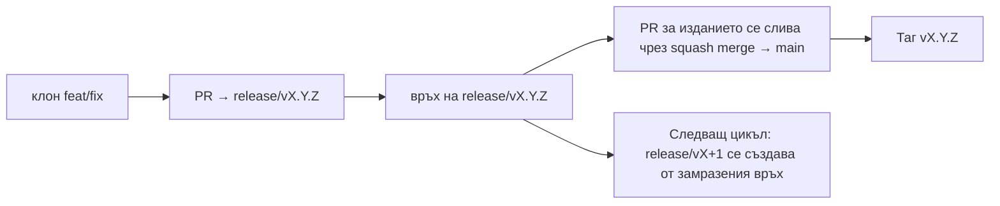

# Branching & Release Model (Български)

🌐 **Languages:** 🇺🇸 [English](../../../../ops/BRANCHING_MODEL.md) · 🇪🇹 [am](../../../am/docs/ops/BRANCHING_MODEL.md) · 🇸🇦 [ar](../../../ar/docs/ops/BRANCHING_MODEL.md) · 🇦🇿 [az](../../../az/docs/ops/BRANCHING_MODEL.md) · 🇧🇩 [bn](../../../bn/docs/ops/BRANCHING_MODEL.md) · 🇨🇿 [cs](../../../cs/docs/ops/BRANCHING_MODEL.md) · 🇩🇰 [da](../../../da/docs/ops/BRANCHING_MODEL.md) · 🇩🇪 [de](../../../de/docs/ops/BRANCHING_MODEL.md) · 🇬🇷 [el](../../../el/docs/ops/BRANCHING_MODEL.md) · 🇪🇸 [es](../../../es/docs/ops/BRANCHING_MODEL.md) · 🇪🇪 [et](../../../et/docs/ops/BRANCHING_MODEL.md) · 🇮🇷 [fa](../../../fa/docs/ops/BRANCHING_MODEL.md) · 🇫🇮 [fi](../../../fi/docs/ops/BRANCHING_MODEL.md) · 🇫🇷 [fr](../../../fr/docs/ops/BRANCHING_MODEL.md) · 🇮🇪 [ga](../../../ga/docs/ops/BRANCHING_MODEL.md) · 🇮🇳 [gu](../../../gu/docs/ops/BRANCHING_MODEL.md) · 🇳🇬 [ha](../../../ha/docs/ops/BRANCHING_MODEL.md) · 🇮🇱 [he](../../../he/docs/ops/BRANCHING_MODEL.md) · 🇮🇳 [hi](../../../hi/docs/ops/BRANCHING_MODEL.md) · 🇭🇷 [hr](../../../hr/docs/ops/BRANCHING_MODEL.md) · 🇭🇺 [hu](../../../hu/docs/ops/BRANCHING_MODEL.md) · 🇦🇲 [hy](../../../hy/docs/ops/BRANCHING_MODEL.md) · 🇮🇩 [id](../../../id/docs/ops/BRANCHING_MODEL.md) · 🇳🇬 [ig](../../../ig/docs/ops/BRANCHING_MODEL.md) · 🇮🇹 [it](../../../it/docs/ops/BRANCHING_MODEL.md) · 🇯🇵 [ja](../../../ja/docs/ops/BRANCHING_MODEL.md) · 🇬🇪 [ka](../../../ka/docs/ops/BRANCHING_MODEL.md) · 🇰🇭 [km](../../../km/docs/ops/BRANCHING_MODEL.md) · 🇮🇳 [kn](../../../kn/docs/ops/BRANCHING_MODEL.md) · 🇰🇷 [ko](../../../ko/docs/ops/BRANCHING_MODEL.md) · 🇱🇹 [lt](../../../lt/docs/ops/BRANCHING_MODEL.md) · 🇱🇻 [lv](../../../lv/docs/ops/BRANCHING_MODEL.md) · 🇮🇳 [ml](../../../ml/docs/ops/BRANCHING_MODEL.md) · 🇮🇳 [mr](../../../mr/docs/ops/BRANCHING_MODEL.md) · 🇲🇾 [ms](../../../ms/docs/ops/BRANCHING_MODEL.md) · 🇲🇹 [mt](../../../mt/docs/ops/BRANCHING_MODEL.md) · 🇲🇲 [my](../../../my/docs/ops/BRANCHING_MODEL.md) · 🇳🇵 [ne](../../../ne/docs/ops/BRANCHING_MODEL.md) · 🇳🇱 [nl](../../../nl/docs/ops/BRANCHING_MODEL.md) · 🇳🇴 [no](../../../no/docs/ops/BRANCHING_MODEL.md) · 🇮🇳 [or](../../../or/docs/ops/BRANCHING_MODEL.md) · 🇮🇳 [pa](../../../pa/docs/ops/BRANCHING_MODEL.md) · 🇵🇭 [phi](../../../phi/docs/ops/BRANCHING_MODEL.md) · 🇵🇱 [pl](../../../pl/docs/ops/BRANCHING_MODEL.md) · 🇵🇹 [pt](../../../pt/docs/ops/BRANCHING_MODEL.md) · 🇧🇷 [pt-BR](../../../pt-BR/docs/ops/BRANCHING_MODEL.md) · 🇷🇴 [ro](../../../ro/docs/ops/BRANCHING_MODEL.md) · 🇷🇺 [ru](../../../ru/docs/ops/BRANCHING_MODEL.md) · 🇱🇰 [si](../../../si/docs/ops/BRANCHING_MODEL.md) · 🇸🇰 [sk](../../../sk/docs/ops/BRANCHING_MODEL.md) · 🇸🇮 [sl](../../../sl/docs/ops/BRANCHING_MODEL.md) · 🇷🇸 [sr](../../../sr/docs/ops/BRANCHING_MODEL.md) · 🇸🇪 [sv](../../../sv/docs/ops/BRANCHING_MODEL.md) · 🇰🇪 [sw](../../../sw/docs/ops/BRANCHING_MODEL.md) · 🇮🇳 [ta](../../../ta/docs/ops/BRANCHING_MODEL.md) · 🇮🇳 [te](../../../te/docs/ops/BRANCHING_MODEL.md) · 🇹🇭 [th](../../../th/docs/ops/BRANCHING_MODEL.md) · 🇹🇷 [tr](../../../tr/docs/ops/BRANCHING_MODEL.md) · 🇺🇦 [uk-UA](../../../uk-UA/docs/ops/BRANCHING_MODEL.md) · 🇵🇰 [ur](../../../ur/docs/ops/BRANCHING_MODEL.md) · 🇺🇿 [uz](../../../uz/docs/ops/BRANCHING_MODEL.md) · 🇻🇳 [vi](../../../vi/docs/ops/BRANCHING_MODEL.md) · 🇳🇬 [yo](../../../yo/docs/ops/BRANCHING_MODEL.md) · 🇨🇳 [zh-CN](../../../zh-CN/docs/ops/BRANCHING_MODEL.md) · 🇹🇼 [zh-TW](../../../zh-TW/docs/ops/BRANCHING_MODEL.md)

---

OmniRoute използва модел за издания с **паралелни цикли**: специален клон `release/vX.Y.Z`
за активния цикъл, `main` за публикуваната линия и неизменяем таг
`vX.Y.Z` при публикуването на съответния цикъл. Нормално е комити да попадат както в `release/*`, _така и_ в
`main` — това не е грешка.

Подробностите за поддържащите проекта се намират в `CLAUDE.md` (Строго правило №21) и
[RELEASE_CHECKLIST.md](./RELEASE_CHECKLIST.md). Тази страница представлява публичното
обобщение за сътрудниците.

## Накратко

| Референция       | Роля                                                                                                             |
| ---------------- | ---------------------------------------------------------------------------------------------------------------- |
| `release/vX.Y.Z` | **Активен цикъл** — ежедневна разработка и сливане на PR-и за тази версия                                        |
| `main`           | **Публикувана линия** — получава цикъла чрез squash merge при публикуването на изданието                         |
| `vX.Y.Z` (таг)   | **Маркер за публикуване** — неизменяем указател към „публикуваното съдържание“, създаден в момента на издаването |



## Към кой клон трябва да е насочен моят PR?

**Насочете го към активния клон `release/vX.Y.Z` — не към `main`.**

1. Намерете отворения клон `release/v*` с най-висока версия (пример към момента на писане:
   `release/v3.8.49`).
2. Създайте клон от неговия връх (`git fetch` + checkout / rebase върху него).
3. Отворете PR с **base = съответния `release/vX.Y.Z`**.

`main` не е клонът за ежедневна интеграция. PR-ите, отворени към `main`,
обикновено трябва да бъдат пренасочени преди сливане.

## Замразяване на издание (паралелни цикли)

Когато се извършва съгласуване на дадено издание, се отваря маркерен issue с етикет `release-freeze`.
Това **не спира разработката**:

- Замразеният `release/vX.Y.Z` е под контрола на отговорника за съответното издание.
- `release/vX+1` за следващия цикъл се създава от замразения връх, за да могат сътрудниците да продължат
  да добавят промени.
- Отворените PR-и, които все още са насочени към замразения клон, трябва да бъдат **пренасочени** към
  активния клон `release/v*` с най-висока версия.

Проверете за активно замразяване, преди да приемете, че желаният от вас клон може да бъде сливан:

```bash
gh issue list --repo diegosouzapw/OmniRoute --label release-freeze --state open
```

Механизмът за сливане (етикет `queue` от собственика → Mergify) е документиран в
[MERGE_TRAIN.md](./MERGE_TRAIN.md).

## Защо има и клон, и таг?

| Артефакт         | Продължителност | Предназначение                                                                           |
| ---------------- | --------------- | ---------------------------------------------------------------------------------------- |
| `release/vX.Y.Z` | Текущ цикъл     | Събира прегледаните PR-и, поддържа успешно преминаващ CI и служи като базов клон за PR-и |
| Таг `vX.Y.Z`     | Завинаги        | Маркира точното съдържание, публикувано в npm / GitHub Releases                          |

Клонът е работилницата, а тагът е запечатаният пакет. След squash merge към
`main` следващият цикъл продължава в `release/vX+1`, без да изчаква завършването на PR-а
за предходното издание.

## Свързана документация

- [CONTRIBUTING.md](../../CONTRIBUTING.md) — настройка, тестове и контролен списък за PR
- [RELEASE_CHECKLIST.md](./RELEASE_CHECKLIST.md) — проверка преди публикуване
- [MERGE_TRAIN.md](./MERGE_TRAIN.md) — опашка за сливане и резервен механизъм за последователно сливане
- [RELEASE_GREEN.md](./RELEASE_GREEN.md) — поддържане на успешно преминаващ проверките връх на изданието
