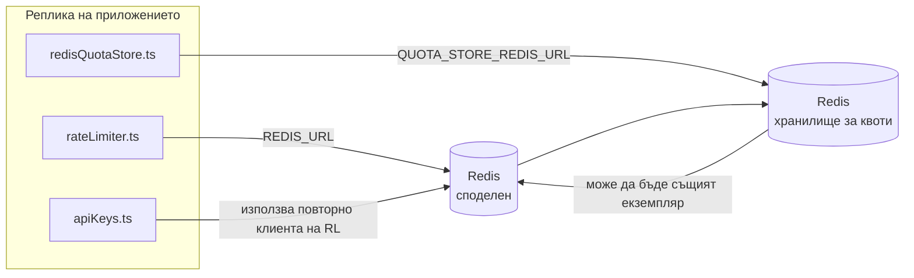

# Redis Production Configuration Guide (Български)

🌐 **Languages:** 🇺🇸 [English](../../../../ops/REDIS_PRODUCTION_CONFIG.md) · 🇪🇹 [am](../../../am/docs/ops/REDIS_PRODUCTION_CONFIG.md) · 🇸🇦 [ar](../../../ar/docs/ops/REDIS_PRODUCTION_CONFIG.md) · 🇦🇿 [az](../../../az/docs/ops/REDIS_PRODUCTION_CONFIG.md) · 🇧🇩 [bn](../../../bn/docs/ops/REDIS_PRODUCTION_CONFIG.md) · 🇨🇿 [cs](../../../cs/docs/ops/REDIS_PRODUCTION_CONFIG.md) · 🇩🇰 [da](../../../da/docs/ops/REDIS_PRODUCTION_CONFIG.md) · 🇩🇪 [de](../../../de/docs/ops/REDIS_PRODUCTION_CONFIG.md) · 🇬🇷 [el](../../../el/docs/ops/REDIS_PRODUCTION_CONFIG.md) · 🇪🇸 [es](../../../es/docs/ops/REDIS_PRODUCTION_CONFIG.md) · 🇪🇪 [et](../../../et/docs/ops/REDIS_PRODUCTION_CONFIG.md) · 🇮🇷 [fa](../../../fa/docs/ops/REDIS_PRODUCTION_CONFIG.md) · 🇫🇮 [fi](../../../fi/docs/ops/REDIS_PRODUCTION_CONFIG.md) · 🇫🇷 [fr](../../../fr/docs/ops/REDIS_PRODUCTION_CONFIG.md) · 🇮🇪 [ga](../../../ga/docs/ops/REDIS_PRODUCTION_CONFIG.md) · 🇮🇳 [gu](../../../gu/docs/ops/REDIS_PRODUCTION_CONFIG.md) · 🇳🇬 [ha](../../../ha/docs/ops/REDIS_PRODUCTION_CONFIG.md) · 🇮🇱 [he](../../../he/docs/ops/REDIS_PRODUCTION_CONFIG.md) · 🇮🇳 [hi](../../../hi/docs/ops/REDIS_PRODUCTION_CONFIG.md) · 🇭🇷 [hr](../../../hr/docs/ops/REDIS_PRODUCTION_CONFIG.md) · 🇭🇺 [hu](../../../hu/docs/ops/REDIS_PRODUCTION_CONFIG.md) · 🇦🇲 [hy](../../../hy/docs/ops/REDIS_PRODUCTION_CONFIG.md) · 🇮🇩 [id](../../../id/docs/ops/REDIS_PRODUCTION_CONFIG.md) · 🇳🇬 [ig](../../../ig/docs/ops/REDIS_PRODUCTION_CONFIG.md) · 🇮🇹 [it](../../../it/docs/ops/REDIS_PRODUCTION_CONFIG.md) · 🇯🇵 [ja](../../../ja/docs/ops/REDIS_PRODUCTION_CONFIG.md) · 🇬🇪 [ka](../../../ka/docs/ops/REDIS_PRODUCTION_CONFIG.md) · 🇰🇭 [km](../../../km/docs/ops/REDIS_PRODUCTION_CONFIG.md) · 🇮🇳 [kn](../../../kn/docs/ops/REDIS_PRODUCTION_CONFIG.md) · 🇰🇷 [ko](../../../ko/docs/ops/REDIS_PRODUCTION_CONFIG.md) · 🇱🇹 [lt](../../../lt/docs/ops/REDIS_PRODUCTION_CONFIG.md) · 🇱🇻 [lv](../../../lv/docs/ops/REDIS_PRODUCTION_CONFIG.md) · 🇮🇳 [ml](../../../ml/docs/ops/REDIS_PRODUCTION_CONFIG.md) · 🇮🇳 [mr](../../../mr/docs/ops/REDIS_PRODUCTION_CONFIG.md) · 🇲🇾 [ms](../../../ms/docs/ops/REDIS_PRODUCTION_CONFIG.md) · 🇲🇹 [mt](../../../mt/docs/ops/REDIS_PRODUCTION_CONFIG.md) · 🇲🇲 [my](../../../my/docs/ops/REDIS_PRODUCTION_CONFIG.md) · 🇳🇵 [ne](../../../ne/docs/ops/REDIS_PRODUCTION_CONFIG.md) · 🇳🇱 [nl](../../../nl/docs/ops/REDIS_PRODUCTION_CONFIG.md) · 🇳🇴 [no](../../../no/docs/ops/REDIS_PRODUCTION_CONFIG.md) · 🇮🇳 [or](../../../or/docs/ops/REDIS_PRODUCTION_CONFIG.md) · 🇮🇳 [pa](../../../pa/docs/ops/REDIS_PRODUCTION_CONFIG.md) · 🇵🇭 [phi](../../../phi/docs/ops/REDIS_PRODUCTION_CONFIG.md) · 🇵🇱 [pl](../../../pl/docs/ops/REDIS_PRODUCTION_CONFIG.md) · 🇵🇹 [pt](../../../pt/docs/ops/REDIS_PRODUCTION_CONFIG.md) · 🇧🇷 [pt-BR](../../../pt-BR/docs/ops/REDIS_PRODUCTION_CONFIG.md) · 🇷🇴 [ro](../../../ro/docs/ops/REDIS_PRODUCTION_CONFIG.md) · 🇷🇺 [ru](../../../ru/docs/ops/REDIS_PRODUCTION_CONFIG.md) · 🇱🇰 [si](../../../si/docs/ops/REDIS_PRODUCTION_CONFIG.md) · 🇸🇰 [sk](../../../sk/docs/ops/REDIS_PRODUCTION_CONFIG.md) · 🇸🇮 [sl](../../../sl/docs/ops/REDIS_PRODUCTION_CONFIG.md) · 🇷🇸 [sr](../../../sr/docs/ops/REDIS_PRODUCTION_CONFIG.md) · 🇸🇪 [sv](../../../sv/docs/ops/REDIS_PRODUCTION_CONFIG.md) · 🇰🇪 [sw](../../../sw/docs/ops/REDIS_PRODUCTION_CONFIG.md) · 🇮🇳 [ta](../../../ta/docs/ops/REDIS_PRODUCTION_CONFIG.md) · 🇮🇳 [te](../../../te/docs/ops/REDIS_PRODUCTION_CONFIG.md) · 🇹🇭 [th](../../../th/docs/ops/REDIS_PRODUCTION_CONFIG.md) · 🇹🇷 [tr](../../../tr/docs/ops/REDIS_PRODUCTION_CONFIG.md) · 🇺🇦 [uk-UA](../../../uk-UA/docs/ops/REDIS_PRODUCTION_CONFIG.md) · 🇵🇰 [ur](../../../ur/docs/ops/REDIS_PRODUCTION_CONFIG.md) · 🇺🇿 [uz](../../../uz/docs/ops/REDIS_PRODUCTION_CONFIG.md) · 🇻🇳 [vi](../../../vi/docs/ops/REDIS_PRODUCTION_CONFIG.md) · 🇳🇬 [yo](../../../yo/docs/ops/REDIS_PRODUCTION_CONFIG.md) · 🇨🇳 [zh-CN](../../../zh-CN/docs/ops/REDIS_PRODUCTION_CONFIG.md) · 🇹🇼 [zh-TW](../../../zh-TW/docs/ops/REDIS_PRODUCTION_CONFIG.md)

---

## Общ преглед

Redis е **незадължима, некритична зависимост** в OmniRoute — приложението продължава да работи с ограничена функционалност (резервни реализации в паметта), когато Redis не е наличен. В производствена среда настройването на Redis намалява латентността за четири различни типа натоварване:

| Натоварване                                      | Компонент                     | Фабрика за клиенти                                                          | Шаблон на ключовете                                                       |
| ------------------------------------------------ | ----------------------------- | --------------------------------------------------------------------------- | ------------------------------------------------------------------------- |
| Ограничаване на честотата                        | `rateLimiter.ts`              | `getRedisClient()` — отложено инициализиран единичен екземпляр на `ioredis` | `<prefix>rl:*` Lua-атомарни времеви прозорци за ограничаване на честотата |
| Кеш за удостоверяване                            | `apiKeys.ts`                  | Използва повторно клиента на `rateLimiter`                                  | `<prefix>auth:api_key:<sha256>` с TTL                                     |
| Хранилище за квоти                               | `redisQuotaStore.ts`          | Отделен единичен екземпляр `getRedisClient(url)`                            | `<prefix>quota:*`, конфигурируемо за всеки екземпляр                      |
| Прекъсвач на веригата за предварително загряване | `redisCircuitBreakerStore.ts` | Отделен клиент в `circuitBreakerFactory.ts`                                 | `<prefix>warmup:cb:<connectionId>`                                        |

Всички четири типа натоварване споделят един префикс на пространството от имена, така че OmniRoute да може да съществува съвместно с други приложения в един екземпляр на Redis (напр. `127.0.0.1:6379`). Вижте [Пространство от имена за ключовете](#key-namespacing).

---

## Текуща конфигурация (стойности по подразбиране в кода)

| Настройка                                     | Стойност                                                                                     | Местоположение                                                                        |
| --------------------------------------------- | -------------------------------------------------------------------------------------------- | ------------------------------------------------------------------------------------- |
| Променлива на средата `REDIS_URL`             | `redis://redis:6379` (compose), незадължителна                                               | `rateLimiter.ts:5`, `.env.example`                                                    |
| Променлива на средата `REDIS_KEY_PREFIX`      | `omniroute:` (по подразбиране)                                                               | `rateLimiter.ts`, `redisQuotaStore.ts`, `redisCircuitBreakerStore.ts`, `.env.example` |
| Променлива на средата `QUOTA_STORE_REDIS_URL` | отделна, може да се различава от `REDIS_URL`                                                 | `quota/storeFactory.ts`                                                               |
| `QUOTA_STORE_DRIVER`                          | `"sqlite"` (по подразбиране), `"redis"` по избор                                             | `quota/storeFactory.ts`                                                               |
| `maxRetriesPerRequest` на ioredis             | `3`                                                                                          | създаване на клиент в `rateLimiter.ts`                                                |
| `enableReadyCheck`                            | не е зададено (по подразбиране за ioredis: `true`)                                           | —                                                                                     |
| `lazyConnect`                                 | не е зададено (по подразбиране за ioredis: `false`)                                          | —                                                                                     |
| `retryStrategy`                               | не е зададено (по подразбиране за ioredis: базова стойност 200ms, експоненциално нарастване) | —                                                                                     |
| TLS / парола / индекс на БД                   | **не са конфигурирани**                                                                      | —                                                                                     |
| Sentinel / Cluster                            | **не са конфигурирани** — поддържа се само самостоятелен единичен възел                      | —                                                                                     |

---

## Пространство от имена за ключовете

OmniRoute споделя един екземпляр на Redis с всичко останало, което работи на хоста. Без пространство от имена ключове като `auth:api_key:<sha256>` или `rl:*` може да влязат в конфликт с ключове от други приложения, използващи същия Redis (този екземпляр изпълнява Redis на `127.0.0.1:6379` заедно с други услуги).

Задайте `REDIS_KEY_PREFIX` като непразен низ, за да добавите префикс към **всеки** ключ на OmniRoute:

```bash
# .env — всички ключове на OmniRoute стават omniroute:rl:*, omniroute:auth:*, omniroute:quota:*, omniroute:warmup:cb:*
REDIS_KEY_PREFIX=omniroute:
```

- **По подразбиране:** `omniroute:` (прилага се, когато `REDIS_KEY_PREFIX` не е зададен или е празен).
- **Прилага се към:** ограничителя на честотата + кеша за удостоверяване (споделен клиент `ioredis` чрез `keyPrefix`), хранилището за квоти (`KEY_PREFIX = "${REDIS_KEY_PREFIX}quota"`) и прекъсвача на веригата за предварително загряване (`KEY_PREFIX = "${REDIS_KEY_PREFIX}warmup:cb:"`).
- **Промяната на префикса**, когато в Redis вече съществуват ключове, оставя старите ключове неизползвани (те изтичат чрез TTL / LRU). Промяната е безопасна и не е необходима миграция. Единственото изключение е ключ на прекъсвача на веригата за предварително загряване за връзка, маркирана като забранена: той се съхранява без TTL, затова изведете остатъчните ключове с `redis-cli --scan --pattern '<old-prefix>warmup:cb:*'` и ги изтрийте.
- **`keyPrefix` на ioredis** автоматично добавя префикса при запис **и** го премахва при четене, така че кодът на приложението никога не вижда префикса.

---

## Препоръчителни настройки за продукционна среда

### 1. Опции за пула от връзки / клиента (конструкторът `Redis` на ioredis)

Текущият код създава един `new Redis(url)` без персонализирани опции. За продукционни внедрявания с множество реплики подайте фабрика за клиенти в кода или обвийте `getRedisClient()`:

```typescript
const redis = new Redis(REDIS_URL, {
  maxRetriesPerRequest: null, // без ограничение на повторните опити; нека retryStrategy решава
  enableReadyCheck: true, // проверка дали сървърът е готов, преди да приема заявки
  lazyConnect: true, // без свързване при създаване; изчакване на първата заявка
  retryStrategy: (times) => {
    if (times > 10) return null; // отказ след 10 опита → повторно свързване по-късно
    return Math.min(times * 200, 5000); // 200ms, 400ms, …, максимално 5s
  },
  enableAutoPipelining: true, // обединяване на паралелни команди в един TCP запис
  keepAlive: 10000, // TCP keep-alive на всеки 10s
});
```

**Основни компромиси:**

- `maxRetriesPerRequest: null` + `retryStrategy` — предпочитан вариант за продукционна среда, така че временните рестартирания на Redis да не водят веднага до неуспех на всяка заявка. Резервният механизъм в паметта в `checkRateLimit()` поема обработката при неуспех.
- `lazyConnect: true` — предотвратява зависимостта при стартиране Redis да работи, преди сървърът да започне да приема връзки.
- `enableAutoPipelining: true` — намалява броя на двупосочните обмени при паралелни проверки на ограниченията на честотата; полезно при >50 RPS през една връзка.

### 2. Конфигурация на Redis сървъра (`redis.conf`)

```
# Памет
maxmemory 80%                        # оставяне на място за кеша на страниците на ОС
maxmemory-policy allkeys-lru         # премахване на неактуални записи от кеша за удостоверяване при недостиг на памет

# Устойчиво съхранение (по избор — OmniRoute е устойчив на сривове и без него)
save 300 1                           # моментна снимка поне на всеки 5 мин, ако е променен ≥1 ключ
appendonly no                        # AOF не е необходим; данните могат да бъдат генерирани отново
appendfsync no                       # без допълнително натоварване от fsync (RDB е достатъчен)

# Мрежа
timeout 0                            # без прекъсване на неактивни връзки
tcp-keepalive 300                    # keep-alive на всеки 5 мин
tcp-backlog 511                      # опашка от връзки при пиково натоварване

# Производителност
hz 10                                # стойност по подразбиране; 100 при чувствителност към латентност
activedefrag yes                     # автоматична дефрагментация при фрагментация >10%
```

**Компромис при `maxmemory-policy allkeys-lru`:** Записите от кеша за удостоверяване може да бъдат премахнати при недостиг на памет. Това е безопасно — `setCachedApiKey` винаги попълва кеша отново при липса, а резервният механизъм със SQLite е авторитетният източник. Lua скриптът за ограничаване на честотата създава малки ключове, които по проект са краткотрайни.

### 3. Настройки на Docker Compose

Продукционната Compose конфигурация (`docker-compose.prod.yml`) използва `redis:8.6.2-alpine`. Добавете:

```yaml
redis:
  image: redis:8.6.2-alpine
  command:
    [
      "redis-server",
      "--maxmemory",
      "512mb",
      "--maxmemory-policy",
      "allkeys-lru",
      "--activedefrag",
      "yes",
      "--save",
      "300 1",
    ]
  healthcheck:
    test: ["CMD", "redis-cli", "ping"]
    interval: 10s
    timeout: 3s
    retries: 3
    start_period: 5s
```

### 4. Съображения при множество инстанции / мащабиране

**Един Redis за всички реплики** — Lua скриптът за ограничаване на честотата зависи от едно авторитетно пространство от ключове. Използването на множество Redis инстанции зад репликите би премахнало атомарността и би удвоило бюджета. Използвайте един Redis (или Redis Sentinel клъстер с превключване при отказ) за всички реплики на приложението.

**Брой връзки:** Всяка реплика на приложението отваря **2 TCP връзки** към Redis (клиент за ограничаване на честотата + клиент за хранилището на квоти). При 10 реплики → 20 връзки, което е значително под стандартния лимит от 10k връзки на една Redis инстанция.

### 5. Наблюдение

Предоставете следното чрез крайната точка за проверка на състоянието:

```typescript
// src/app/api/monitoring/health/route.ts вече извиква функциите на rateLimiter
// Добавете специфични за Redis проверки:
//   1. Латентност на PING чрез ioredis .ping()
//   2. Използване на паметта чрез INFO memory
//   3. Брой връзки чрез INFO clients
//   4. Процент попадения за maxmemory-policy (evicted_keys / keyspace_hits)
```

Ключови показатели за наблюдение:

- **Премахнати ключове / сек** — ако стойността постоянно е различна от нула, увеличете `maxmemory`
- **Блокирани клиенти** — стойност, различна от нула, предполага бавни Lua скриптове или висока конкуренция за ресурси
- **Отхвърлени връзки** — достигнат е лимитът на връзките; рядко при 20 връзки

---

## Архитектурна диаграма



---

## Препратки

| Файл                               | Предназначение                                                                                           |
| ---------------------------------- | -------------------------------------------------------------------------------------------------------- |
| `src/shared/utils/rateLimiter.ts`  | Основен Redis клиент, Lua скрипт за ограничаване на честотата на заявките и резервен механизъм в паметта |
| `src/lib/db/apiKeys.ts`            | Кеш за удостоверяване — резервно превключване от Redis към SQLite                                        |
| `src/lib/quota/redisQuotaStore.ts` | Отделен Redis клиент за незадължителното хранилище за квоти                                              |
| `src/lib/quota/storeFactory.ts`    | Превключва между драйверите за квоти `sqlite` и `redis`                                                  |
| `docker-compose.prod.yml`          | Redis контейнер за продукционна среда (образ `redis:8.6.2-alpine`)                                       |
| `.env.example`                     | Документация за променливите на средата за Redis                                                         |
| `src/app/api/local/redis/`         | API маршрути за оркестрация на контейнера за разработка                                                  |
| `bin/cli/commands/redis.mjs`       | CLI команди за оркестрация на контейнера за разработка                                                   |
