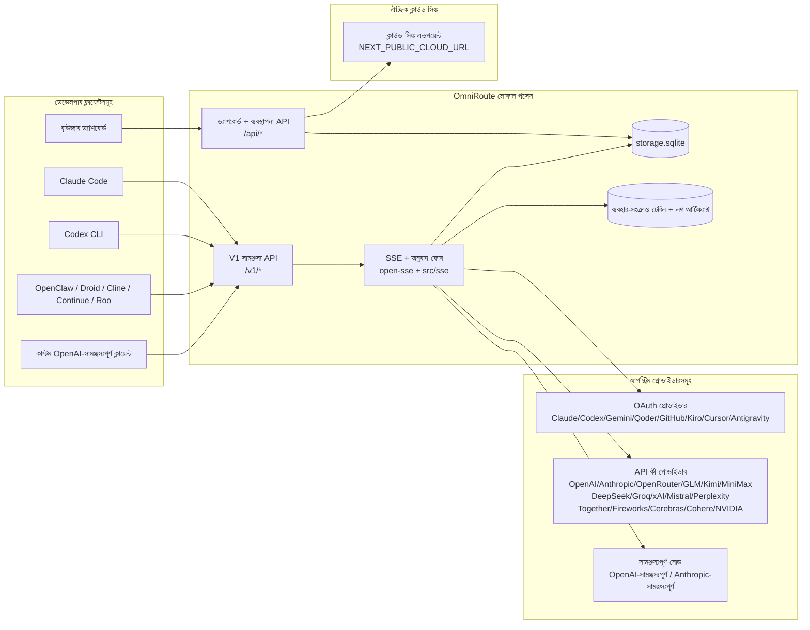
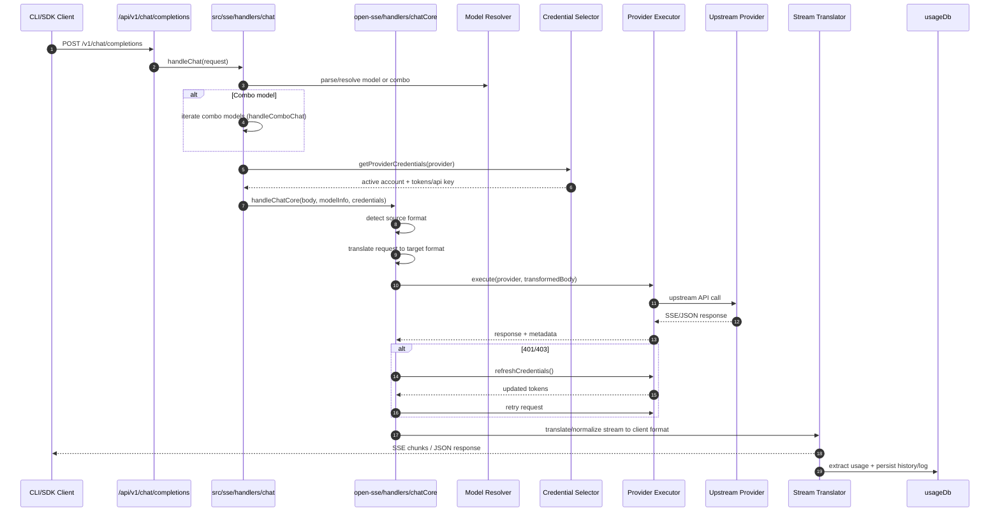
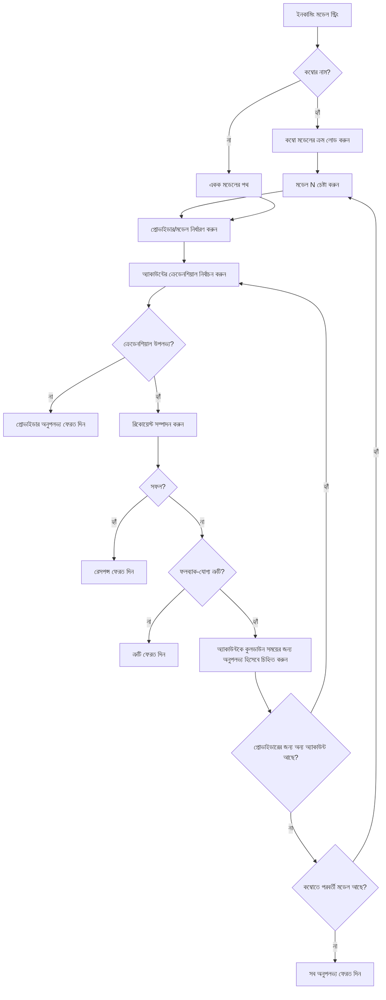
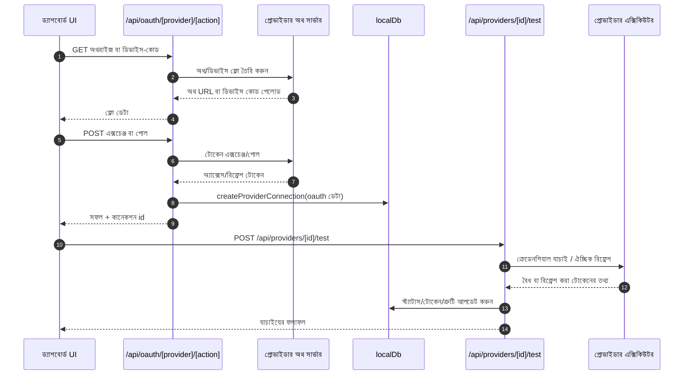
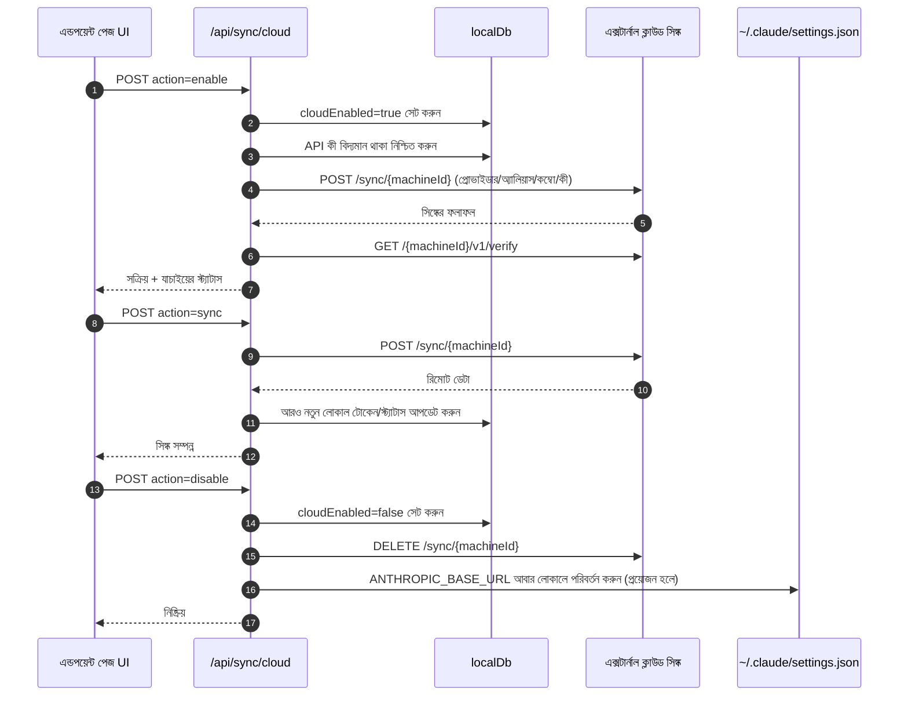
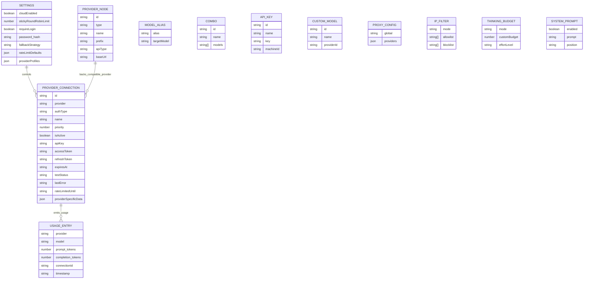
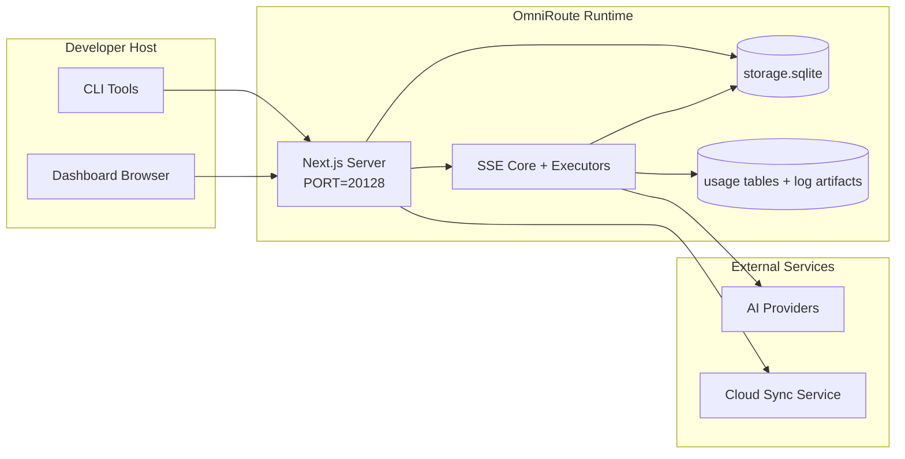

# OmniRoute Architecture (বাংলা)

🌐 **Languages:** 🇺🇸 [English](../../../../architecture/ARCHITECTURE.md) · 🇪🇹 [am](../../../am/docs/architecture/ARCHITECTURE.md) · 🇸🇦 [ar](../../../ar/docs/architecture/ARCHITECTURE.md) · 🇦🇿 [az](../../../az/docs/architecture/ARCHITECTURE.md) · 🇧🇬 [bg](../../../bg/docs/architecture/ARCHITECTURE.md) · 🇨🇿 [cs](../../../cs/docs/architecture/ARCHITECTURE.md) · 🇩🇰 [da](../../../da/docs/architecture/ARCHITECTURE.md) · 🇩🇪 [de](../../../de/docs/architecture/ARCHITECTURE.md) · 🇬🇷 [el](../../../el/docs/architecture/ARCHITECTURE.md) · 🇪🇸 [es](../../../es/docs/architecture/ARCHITECTURE.md) · 🇪🇪 [et](../../../et/docs/architecture/ARCHITECTURE.md) · 🇮🇷 [fa](../../../fa/docs/architecture/ARCHITECTURE.md) · 🇫🇮 [fi](../../../fi/docs/architecture/ARCHITECTURE.md) · 🇫🇷 [fr](../../../fr/docs/architecture/ARCHITECTURE.md) · 🇮🇪 [ga](../../../ga/docs/architecture/ARCHITECTURE.md) · 🇮🇳 [gu](../../../gu/docs/architecture/ARCHITECTURE.md) · 🇳🇬 [ha](../../../ha/docs/architecture/ARCHITECTURE.md) · 🇮🇱 [he](../../../he/docs/architecture/ARCHITECTURE.md) · 🇮🇳 [hi](../../../hi/docs/architecture/ARCHITECTURE.md) · 🇭🇷 [hr](../../../hr/docs/architecture/ARCHITECTURE.md) · 🇭🇺 [hu](../../../hu/docs/architecture/ARCHITECTURE.md) · 🇦🇲 [hy](../../../hy/docs/architecture/ARCHITECTURE.md) · 🇮🇩 [id](../../../id/docs/architecture/ARCHITECTURE.md) · 🇳🇬 [ig](../../../ig/docs/architecture/ARCHITECTURE.md) · 🇮🇹 [it](../../../it/docs/architecture/ARCHITECTURE.md) · 🇯🇵 [ja](../../../ja/docs/architecture/ARCHITECTURE.md) · 🇬🇪 [ka](../../../ka/docs/architecture/ARCHITECTURE.md) · 🇰🇭 [km](../../../km/docs/architecture/ARCHITECTURE.md) · 🇮🇳 [kn](../../../kn/docs/architecture/ARCHITECTURE.md) · 🇰🇷 [ko](../../../ko/docs/architecture/ARCHITECTURE.md) · 🇱🇹 [lt](../../../lt/docs/architecture/ARCHITECTURE.md) · 🇱🇻 [lv](../../../lv/docs/architecture/ARCHITECTURE.md) · 🇮🇳 [ml](../../../ml/docs/architecture/ARCHITECTURE.md) · 🇮🇳 [mr](../../../mr/docs/architecture/ARCHITECTURE.md) · 🇲🇾 [ms](../../../ms/docs/architecture/ARCHITECTURE.md) · 🇲🇹 [mt](../../../mt/docs/architecture/ARCHITECTURE.md) · 🇲🇲 [my](../../../my/docs/architecture/ARCHITECTURE.md) · 🇳🇵 [ne](../../../ne/docs/architecture/ARCHITECTURE.md) · 🇳🇱 [nl](../../../nl/docs/architecture/ARCHITECTURE.md) · 🇳🇴 [no](../../../no/docs/architecture/ARCHITECTURE.md) · 🇮🇳 [or](../../../or/docs/architecture/ARCHITECTURE.md) · 🇮🇳 [pa](../../../pa/docs/architecture/ARCHITECTURE.md) · 🇵🇭 [phi](../../../phi/docs/architecture/ARCHITECTURE.md) · 🇵🇱 [pl](../../../pl/docs/architecture/ARCHITECTURE.md) · 🇵🇹 [pt](../../../pt/docs/architecture/ARCHITECTURE.md) · 🇧🇷 [pt-BR](../../../pt-BR/docs/architecture/ARCHITECTURE.md) · 🇷🇴 [ro](../../../ro/docs/architecture/ARCHITECTURE.md) · 🇷🇺 [ru](../../../ru/docs/architecture/ARCHITECTURE.md) · 🇱🇰 [si](../../../si/docs/architecture/ARCHITECTURE.md) · 🇸🇰 [sk](../../../sk/docs/architecture/ARCHITECTURE.md) · 🇸🇮 [sl](../../../sl/docs/architecture/ARCHITECTURE.md) · 🇷🇸 [sr](../../../sr/docs/architecture/ARCHITECTURE.md) · 🇸🇪 [sv](../../../sv/docs/architecture/ARCHITECTURE.md) · 🇰🇪 [sw](../../../sw/docs/architecture/ARCHITECTURE.md) · 🇮🇳 [ta](../../../ta/docs/architecture/ARCHITECTURE.md) · 🇮🇳 [te](../../../te/docs/architecture/ARCHITECTURE.md) · 🇹🇭 [th](../../../th/docs/architecture/ARCHITECTURE.md) · 🇹🇷 [tr](../../../tr/docs/architecture/ARCHITECTURE.md) · 🇺🇦 [uk-UA](../../../uk-UA/docs/architecture/ARCHITECTURE.md) · 🇵🇰 [ur](../../../ur/docs/architecture/ARCHITECTURE.md) · 🇺🇿 [uz](../../../uz/docs/architecture/ARCHITECTURE.md) · 🇻🇳 [vi](../../../vi/docs/architecture/ARCHITECTURE.md) · 🇳🇬 [yo](../../../yo/docs/architecture/ARCHITECTURE.md) · 🇨🇳 [zh-CN](../../../zh-CN/docs/architecture/ARCHITECTURE.md) · 🇹🇼 [zh-TW](../../../zh-TW/docs/architecture/ARCHITECTURE.md)

---

🌐 **Languages:** 🇺🇸 [English](../../../../architecture/ARCHITECTURE.md) · 🇪🇹 [am](../../../am/docs/architecture/ARCHITECTURE.md) · 🇸🇦 [ar](../../../ar/docs/architecture/ARCHITECTURE.md) · 🇦🇿 [az](../../../az/docs/architecture/ARCHITECTURE.md) · 🇧🇬 [bg](../../../bg/docs/architecture/ARCHITECTURE.md) · 🇨🇿 [cs](../../../cs/docs/architecture/ARCHITECTURE.md) · 🇩🇰 [da](../../../da/docs/architecture/ARCHITECTURE.md) · 🇩🇪 [de](../../../de/docs/architecture/ARCHITECTURE.md) · 🇬🇷 [el](../../../el/docs/architecture/ARCHITECTURE.md) · 🇪🇸 [es](../../../es/docs/architecture/ARCHITECTURE.md) · 🇪🇪 [et](../../../et/docs/architecture/ARCHITECTURE.md) · 🇮🇷 [fa](../../../fa/docs/architecture/ARCHITECTURE.md) · 🇫🇮 [fi](../../../fi/docs/architecture/ARCHITECTURE.md) · 🇫🇷 [fr](../../../fr/docs/architecture/ARCHITECTURE.md) · 🇮🇪 [ga](../../../ga/docs/architecture/ARCHITECTURE.md) · 🇮🇳 [gu](../../../gu/docs/architecture/ARCHITECTURE.md) · 🇳🇬 [ha](../../../ha/docs/architecture/ARCHITECTURE.md) · 🇮🇱 [he](../../../he/docs/architecture/ARCHITECTURE.md) · 🇮🇳 [hi](../../../hi/docs/architecture/ARCHITECTURE.md) · 🇭🇷 [hr](../../../hr/docs/architecture/ARCHITECTURE.md) · 🇭🇺 [hu](../../../hu/docs/architecture/ARCHITECTURE.md) · 🇦🇲 [hy](../../../hy/docs/architecture/ARCHITECTURE.md) · 🇮🇩 [id](../../../id/docs/architecture/ARCHITECTURE.md) · 🇳🇬 [ig](../../../ig/docs/architecture/ARCHITECTURE.md) · 🇮🇹 [it](../../../it/docs/architecture/ARCHITECTURE.md) · 🇯🇵 [ja](../../../ja/docs/architecture/ARCHITECTURE.md) · 🇬🇪 [ka](../../../ka/docs/architecture/ARCHITECTURE.md) · 🇰🇭 [km](../../../km/docs/architecture/ARCHITECTURE.md) · 🇮🇳 [kn](../../../kn/docs/architecture/ARCHITECTURE.md) · 🇰🇷 [ko](../../../ko/docs/architecture/ARCHITECTURE.md) · 🇱🇹 [lt](../../../lt/docs/architecture/ARCHITECTURE.md) · 🇱🇻 [lv](../../../lv/docs/architecture/ARCHITECTURE.md) · 🇮🇳 [ml](../../../ml/docs/architecture/ARCHITECTURE.md) · 🇮🇳 [mr](../../../mr/docs/architecture/ARCHITECTURE.md) · 🇲🇾 [ms](../../../ms/docs/architecture/ARCHITECTURE.md) · 🇲🇹 [mt](../../../mt/docs/architecture/ARCHITECTURE.md) · 🇲🇲 [my](../../../my/docs/architecture/ARCHITECTURE.md) · 🇳🇵 [ne](../../../ne/docs/architecture/ARCHITECTURE.md) · 🇳🇱 [nl](../../../nl/docs/architecture/ARCHITECTURE.md) · 🇳🇴 [no](../../../no/docs/architecture/ARCHITECTURE.md) · 🇮🇳 [or](../../../or/docs/architecture/ARCHITECTURE.md) · 🇮🇳 [pa](../../../pa/docs/architecture/ARCHITECTURE.md) · 🇵🇭 [phi](../../../phi/docs/architecture/ARCHITECTURE.md) · 🇵🇱 [pl](../../../pl/docs/architecture/ARCHITECTURE.md) · 🇵🇹 [pt](../../../pt/docs/architecture/ARCHITECTURE.md) · 🇧🇷 [pt-BR](../../../pt-BR/docs/architecture/ARCHITECTURE.md) · 🇷🇴 [ro](../../../ro/docs/architecture/ARCHITECTURE.md) · 🇷🇺 [ru](../../../ru/docs/architecture/ARCHITECTURE.md) · 🇱🇰 [si](../../../si/docs/architecture/ARCHITECTURE.md) · 🇸🇰 [sk](../../../sk/docs/architecture/ARCHITECTURE.md) · 🇸🇮 [sl](../../../sl/docs/architecture/ARCHITECTURE.md) · 🇷🇸 [sr](../../../sr/docs/architecture/ARCHITECTURE.md) · 🇸🇪 [sv](../../../sv/docs/architecture/ARCHITECTURE.md) · 🇰🇪 [sw](../../../sw/docs/architecture/ARCHITECTURE.md) · 🇮🇳 [ta](../../../ta/docs/architecture/ARCHITECTURE.md) · 🇮🇳 [te](../../../te/docs/architecture/ARCHITECTURE.md) · 🇹🇭 [th](../../../th/docs/architecture/ARCHITECTURE.md) · 🇹🇷 [tr](../../../tr/docs/architecture/ARCHITECTURE.md) · 🇺🇦 [uk-UA](../../../uk-UA/docs/architecture/ARCHITECTURE.md) · 🇵🇰 [ur](../../../ur/docs/architecture/ARCHITECTURE.md) · 🇺🇿 [uz](../../../uz/docs/architecture/ARCHITECTURE.md) · 🇻🇳 [vi](../../../vi/docs/architecture/ARCHITECTURE.md) · 🇳🇬 [yo](../../../yo/docs/architecture/ARCHITECTURE.md) · 🇨🇳 [zh-CN](../../../zh-CN/docs/architecture/ARCHITECTURE.md) · 🇹🇼 [zh-TW](../../../zh-TW/docs/architecture/ARCHITECTURE.md)

_সর্বশেষ হালনাগাদ: 2026-06-28_

## নির্বাহী সারসংক্ষেপ

OmniRoute হলো Next.js-এর ওপর নির্মিত একটি স্থানীয় AI রাউটিং গেটওয়ে ও ড্যাশবোর্ড।
এটি একটি একক OpenAI-সামঞ্জস্যপূর্ণ এন্ডপয়েন্ট (`/v1/*`) প্রদান করে এবং অনুবাদ, ফলব্যাক, টোকেন রিফ্রেশ ও ব্যবহার ট্র্যাকিংসহ একাধিক আপস্ট্রিম প্রদানকারীর মধ্যে ট্র্যাফিক রাউট করে।

মূল সক্ষমতাসমূহ:

- CLI/টুলের জন্য OpenAI-সামঞ্জস্যপূর্ণ API সারফেস (355টি প্রদানকারী, 108টি এক্সিকিউটর)
- বিভিন্ন প্রদানকারী ফরম্যাটের মধ্যে অনুরোধ/প্রতিক্রিয়া অনুবাদ
- মডেল কম্বো ফলব্যাক (একাধিক মডেলের ক্রম)
- `compositeTiers` অনুযায়ী রানটাইম ক্রমসহ কাঠামোবদ্ধ কম্বো ধাপ (`provider + model + connection`)
- অ্যাকাউন্ট-স্তরের ফলব্যাক (প্রতি প্রদানকারীর জন্য একাধিক অ্যাকাউন্ট)
- প্রধান চ্যাট পাথে কোটা প্রিফ্লাইট ও কোটা-সচেতন P2C অ্যাকাউন্ট নির্বাচন
- OAuth + API-কী প্রদানকারী সংযোগ ব্যবস্থাপনা (22টি OAuth প্রদানকারী মডিউল)
- `/v1/embeddings`-এর মাধ্যমে এম্বেডিং তৈরি (18টি প্রদানকারী)
- `/v1/images/generations`-এর মাধ্যমে ছবি তৈরি (10টির বেশি প্রদানকারী, 20টির বেশি মডেল)
- `/v1/audio/transcriptions`-এর মাধ্যমে অডিও ট্রান্সক্রিপশন (18টি প্রদানকারী)
- `/v1/audio/speech`-এর মাধ্যমে টেক্সট-টু-স্পিচ (24টি বিল্ট-ইন প্রদানকারী)
- `/v1/videos/generations`-এর মাধ্যমে ভিডিও তৈরি (ComfyUI + SD WebUI)
- `/v1/music/generations`-এর মাধ্যমে সংগীত তৈরি (ComfyUI)
- `/v1/search`-এর মাধ্যমে ওয়েব অনুসন্ধান (20টি প্রদানকারী)
- `/v1/moderations`-এর মাধ্যমে মডারেশন
- `/v1/rerank`-এর মাধ্যমে পুনঃর্যাঙ্কিং
- রিজনিং মডেলের জন্য থিংক ট্যাগ পার্সিং (`<think>...</think>`)
- কঠোর OpenAI SDK সামঞ্জস্যের জন্য প্রতিক্রিয়া স্যানিটাইজেশন
- বিভিন্ন প্রদানকারীর মধ্যে সামঞ্জস্যের জন্য রোল স্বাভাবিকীকরণ (developer→system, system→user)
- কাঠামোবদ্ধ আউটপুট রূপান্তর (json_schema → Gemini responseSchema)
- প্রদানকারী, কী, অ্যালিয়াস, কম্বো, সেটিংস ও মূল্যতথ্যের স্থানীয় স্থায়ী সংরক্ষণ (122টি DB মডিউল)
- ব্যবহার/খরচ ট্র্যাকিং এবং অনুরোধ লগিং
- একাধিক ডিভাইস/স্টেট সিঙ্কের জন্য ঐচ্ছিক ক্লাউড সিঙ্ক
- API অ্যাক্সেস নিয়ন্ত্রণের জন্য IP অ্যালাউলিস্ট/ব্লকলিস্ট
- থিংকিং বাজেট ব্যবস্থাপনা (পাসথ্রু/স্বয়ংক্রিয়/কাস্টম/অভিযোজিত)
- গ্লোবাল সিস্টেম প্রম্পট ইনজেকশন
- সেশন ট্র্যাকিং ও ফিঙ্গারপ্রিন্টিং
- প্রদানকারী-নির্দিষ্ট প্রোফাইলসহ প্রতি-অ্যাকাউন্ট উন্নত রেট লিমিটিং
- প্রদানকারীর স্থিতিস্থাপকতার জন্য সার্কিট ব্রেকার প্যাটার্ন
- মিউটেক্স লকিংসহ অ্যান্টি-থান্ডারিং হার্ড সুরক্ষা
- স্বাক্ষর-ভিত্তিক অনুরোধ ডিডুপ্লিকেশন ক্যাশ
- ডোমেইন স্তর: খরচের নিয়ম, ফলব্যাক নীতি, লকআউট নীতি
- কনটেক্সট রিলে: অ্যাকাউন্ট রোটেশনের ধারাবাহিকতার জন্য সেশন হ্যান্ডঅফ সারসংক্ষেপ
- ডোমেইন স্টেটের স্থায়ী সংরক্ষণ (ফলব্যাক, বাজেট, লকআউট ও সার্কিট ব্রেকারের জন্য SQLite রাইট-থ্রু ক্যাশ)
- কেন্দ্রীভূত অনুরোধ মূল্যায়নের জন্য পলিসি ইঞ্জিন (লকআউট → বাজেট → ফলব্যাক)
- p50/p95/p99 ল্যাটেন্সি অ্যাগ্রিগেশনসহ অনুরোধ টেলিমেট্রি
- `combo_execution_key` / `combo_step_id`-এর মাধ্যমে কম্বো টার্গেট টেলিমেট্রি এবং ঐতিহাসিক কম্বো টার্গেটের স্বাস্থ্য
- এন্ড-টু-এন্ড ট্রেসিংয়ের জন্য কোরিলেশন ID (X-Request-Id)
- প্রতি API কীতে অপ্ট-আউট সুবিধাসহ কমপ্লায়েন্স অডিট লগিং
- LLM গুণমান নিশ্চয়তার জন্য ইভ্যাল ফ্রেমওয়ার্ক
- রিয়েল-টাইম প্রদানকারী সার্কিট ব্রেকার স্ট্যাটাসসহ স্বাস্থ্য ড্যাশবোর্ড
- 3টি ট্রান্সপোর্টসহ MCP Server (110টি টুল) (stdio/SSE/Streamable HTTP)
- দক্ষতা ও টাস্ক লাইফসাইকেলসহ A2A Server (JSON-RPC 2.0 + SSE)
- মেমরি সিস্টেম (নিষ্কাশন, ইনজেকশন, পুনরুদ্ধার, সারসংক্ষেপ)
- স্কিল সিস্টেম (রেজিস্ট্রি, এক্সিকিউটর, স্যান্ডবক্স, বিল্ট-ইন স্কিল)
- সার্টিফিকেট ব্যবস্থাপনা ও DNS হ্যান্ডলিংসহ MITM প্রক্সি
- প্রম্পট ইনজেকশন গার্ড মিডলওয়্যার
- Caveman, RTK, স্ট্যাকড পাইপলাইন, কম্প্রেশন কম্বো, ল্যাঙ্গুয়েজ প্যাক ও অ্যানালিটিক্সসহ প্রম্পট কম্প্রেশন পাইপলাইন
- ACP (Agent Communication Protocol) রেজিস্ট্রি
- মডিউলার OAuth প্রদানকারী (`src/lib/oauth/providers/`-এর অধীনে 22টি পৃথক মডিউল)
- আনইনস্টল/সম্পূর্ণ-আনইনস্টল স্ক্রিপ্ট
- OAuth পরিবেশ মেরামত অ্যাকশন
- OpenAI-সামঞ্জস্যপূর্ণ WS ক্লায়েন্টের জন্য WebSocket ব্রিজ (`/v1/ws`)
- সিঙ্ক টোকেন ব্যবস্থাপনা (ইস্যু/প্রত্যাহার, ETag-সংস্করণযুক্ত কনফিগ বান্ডল ডাউনলোড)
- প্রথম-শ্রেণির প্রদানকারী প্রিসেট হিসেবে GLM Thinking (`glmt`)
- হাইব্রিড টোকেন গণনা (অনুমানভিত্তিক ফলব্যাকসহ প্রদানকারী-পক্ষের `/messages/count_tokens`)
- মডেল অ্যালিয়াসের স্বয়ংক্রিয় সিডিং (স্টার্টআপে 30টির বেশি ক্রস-প্রক্সি ডায়ালেক্ট স্বাভাবিকীকরণ)
- SSRF গার্ড, ব্যক্তিগত URL ব্লকিং ও কনফিগারযোগ্য রিট্রাইসহ নিরাপদ আউটবাউন্ড ফেচ
- কনফিগারযোগ্য `requestRetry` ও `maxRetryIntervalSec`-সহ কুলডাউন-সচেতন চ্যাট রিট্রাই
- স্টার্টআপে Zod ব্যবহার করে রানটাইম পরিবেশ যাচাইকরণ
- পেজিনেশন, প্রদানকারী CRUD ইভেন্ট এবং SSRF-ব্লক করা যাচাইকরণ লগিংসহ কমপ্লায়েন্স অডিট v2

প্রধান রানটাইম মডেল:

- `src/app/api/*`-এর অধীন Next.js অ্যাপ রুটগুলো ড্যাশবোর্ড API এবং সামঞ্জস্য API—উভয়ই বাস্তবায়ন করে
- `src/sse/*` + `open-sse/*`-এ থাকা একটি শেয়ার্ড SSE/রাউটিং কোর প্রদানকারী এক্সিকিউশন, অনুবাদ, স্ট্রিমিং, ফলব্যাক ও ব্যবহার পরিচালনা করে

## রেফারেন্স ডায়াগ্রাম

v3.8.0 প্ল্যাটফর্মের প্রামাণ্য, সংস্করণ-নিয়ন্ত্রিত Mermaid সোর্সগুলো
[`docs/diagrams/`](../diagrams/README.md)-এ রয়েছে। ধারণা দেওয়ার জন্য নিচে দুটি পুনরুৎপাদন করা হয়েছে;
বাকিগুলো তাদের ডোমেইন-নির্দিষ্ট গাইড থেকে লিঙ্ক করা আছে।


> সোর্স: [diagrams/request-pipeline.mmd](../diagrams/request-pipeline.mmd)


> সোর্স: [diagrams/resilience-3layers.mmd](../diagrams/resilience-3layers.mmd) — আরও লিঙ্ক করা আছে
> [RESILIENCE_GUIDE.md](./RESILIENCE_GUIDE.md) এবং `CLAUDE.md`-এর সহনশীলতা রেফারেন্স থেকে।

## পরিধি ও সীমারেখা

### পরিধির অন্তর্ভুক্ত

- লোকাল গেটওয়ে রানটাইম
- ড্যাশবোর্ড ব্যবস্থাপনা API
- প্রোভাইডার প্রমাণীকরণ ও টোকেন রিফ্রেশ
- রিকোয়েস্ট রূপান্তর ও SSE স্ট্রিমিং
- লোকাল স্টেট + ব্যবহারসংক্রান্ত ডেটা সংরক্ষণ
- ঐচ্ছিক ক্লাউড সিঙ্ক অর্কেস্ট্রেশন

### পরিধির বাইরে

- `NEXT_PUBLIC_CLOUD_URL`-এর পেছনের ক্লাউড সার্ভিস বাস্তবায়ন
- লোকাল প্রসেসের বাইরের প্রোভাইডার SLA/কন্ট্রোল প্লেন
- এক্সটার্নাল CLI বাইনারিগুলো (Claude CLI, Codex CLI, ইত্যাদি)

## ড্যাশবোর্ডের বর্তমান পরিসর

`src/app/(dashboard)/dashboard/`-এর অধীন প্রধান পেজগুলো:

- `/dashboard` — দ্রুত শুরু + প্রোভাইডার ওভারভিউ
- `/dashboard/endpoint` — এন্ডপয়েন্ট প্রক্সি + MCP + A2A + API এন্ডপয়েন্ট ট্যাব
- `/dashboard/providers` — প্রোভাইডার সংযোগ ও ক্রেডেনশিয়াল
- `/dashboard/combos` — কম্বো কৌশল, টেমপ্লেট, ধাপভিত্তিক বিল্ডার, মডেল রাউটিং নিয়ম ও ম্যানুয়ালি সংরক্ষিত ক্রম
- `/dashboard/auto-combo` — Auto Combo Engine: স্কোরিং ওয়েট, মোড প্যাক, ভার্চুয়াল ফ্যাক্টরি প্রিসেট ও টেলিমেট্রি
- `/dashboard/costs` — খরচের সমষ্টিকরণ ও মূল্য-দৃশ্যমানতা
- `/dashboard/analytics` — ব্যবহার-বিশ্লেষণ, মূল্যায়ন ও কম্বো টার্গেটের স্বাস্থ্য
- `/dashboard/limits` — কোটা/রেট নিয়ন্ত্রণ
- `/dashboard/cli-tools` — CLI অনবোর্ডিং, রানটাইম শনাক্তকরণ ও কনফিগারেশন তৈরি
- `/dashboard/agents` — শনাক্ত করা ACP এজেন্ট + কাস্টম এজেন্ট নিবন্ধন
- `/dashboard/cloud-agents` — ক্লাউডে হোস্ট করা এজেন্ট টাস্ক (Codex Cloud, Devin, Jules) ও টাস্ক লাইফসাইকেল
- `/dashboard/skills` — A2A স্কিল রেজিস্ট্রি, স্যান্ডবক্স এক্সিকিউশন ও বিল্ট-ইন স্কিল ক্যাটালগ
- `/dashboard/memory` — স্থায়ী কথোপকথন মেমরি পরিদর্শন ও পুনরুদ্ধার
- `/dashboard/webhooks` — আউটবাউন্ড ওয়েবহুক সাবস্ক্রিপশন, সিক্রেট রোটেশন ও পুনঃচেষ্টার পরিসংখ্যান
- `/dashboard/batch` — ব্যাচ জব জমাদান ও অগ্রগতি
- `/dashboard/cache` — রিড-থ্রু ও রিজনিং ক্যাশের পরিসংখ্যান এবং ইভিকশন নিয়ন্ত্রণ
- `/dashboard/playground` — কনফিগার করা যেকোনো কম্বো/মডেলের বিপরীতে ইন্টার্যাক্টিভ চ্যাট প্লেগ্রাউন্ড
- `/dashboard/changelog` — অ্যাপের মধ্যকার চেঞ্জলগ ভিউয়ার (`CHANGELOG.md` রেন্ডার করে)
- `/dashboard/system` — রানটাইম ডায়াগনস্টিকস, সংস্করণ-তথ্য ও এনভায়রনমেন্ট যাচাইকরণ ইন্টারফেস
- `/dashboard/onboarding` — নতুন ইনস্টলেশনের জন্য প্রথমবারের সেটআপ উইজার্ড
- `/dashboard/media` — ছবি/ভিডিও/সংগীত প্লেগ্রাউন্ড
- `/dashboard/search-tools` — সার্চ প্রোভাইডার পরীক্ষা ও ইতিহাস
- `/dashboard/health` — আপটাইম, সার্কিট ব্রেকার, রেট লিমিট ও কোটা-মনিটর করা সেশন
- `/dashboard/logs` — রিকোয়েস্ট/প্রক্সি/অডিট/কনসোল লগ
- `/dashboard/settings` — সিস্টেম সেটিংস ট্যাব (সাধারণ, রাউটিং, কম্বোর ডিফল্ট ইত্যাদি)
- `/dashboard/context/caveman` — Caveman কম্প্রেশন নিয়ম, ল্যাঙ্গুয়েজ প্যাক, প্রিভিউ ও আউটপুট মোড
- `/dashboard/context/rtk` — RTK কমান্ড-আউটপুট ফিল্টার, প্রিভিউ ও রানটাইম নিরাপত্তা সেটিংস
- `/dashboard/context/combos` — রাউটিং কম্বোগুলোতে নির্ধারিত নামযুক্ত কম্প্রেশন পাইপলাইন
- `/dashboard/translator` — ট্রান্সলেটর পরিদর্শন ও রিকোয়েস্ট ফরম্যাট রূপান্তরের প্রিভিউ
- `/dashboard/audit` — পেজিনেশন ও কাঠামোবদ্ধ মেটাডেটাসহ কমপ্লায়েন্স অডিট লগ ব্রাউজার
- `/dashboard/usage` — `usage_history`-এর সঙ্গে সংযুক্ত প্রতি-রিকোয়েস্ট ব্যবহার ব্রাউজার
- `/dashboard/compression` — কম্প্রেশন বিশ্লেষণ, পরিসংখ্যান ও পাইপলাইন নির্ধারণ
- `/dashboard/api-manager` — API কী লাইফসাইকেল ও মডেল অনুমতি

## উচ্চ-স্তরের সিস্টেম প্রসঙ্গ



## মূল রানটাইম কম্পোনেন্টসমূহ

## 1) API এবং রাউটিং স্তর (Next.js অ্যাপ রুট)

প্রধান ডিরেক্টরিসমূহ:

- সামঞ্জস্য API-গুলোর জন্য `src/app/api/v1/*` এবং `src/app/api/v1beta/*`
- ব্যবস্থাপনা/কনফিগারেশন API-গুলোর জন্য `src/app/api/*`
- `next.config.mjs`-এর Next রিরাইটগুলো `/v1/*`-কে `/api/v1/*`-এ ম্যাপ করে

গুরুত্বপূর্ণ সামঞ্জস্য রুটসমূহ:

- `src/app/api/v1/chat/completions/route.ts`
- `src/app/api/v1/messages/route.ts`
- `src/app/api/v1/responses/route.ts`
- `src/app/api/v1/models/route.ts` — `custom: true`-সহ কাস্টম মডেল অন্তর্ভুক্ত করে
- `src/app/api/v1/embeddings/route.ts` — এম্বেডিং তৈরি (6টি প্রোভাইডার)
- `src/app/api/v1/images/generations/route.ts` — ছবি তৈরি (Antigravity/Nebius-সহ 4টির বেশি প্রোভাইডার)
- `src/app/api/v1/messages/count_tokens/route.ts`
- `src/app/api/v1/providers/[provider]/chat/completions/route.ts` — প্রতিটি প্রোভাইডারের জন্য স্বতন্ত্র চ্যাট
- `src/app/api/v1/providers/[provider]/embeddings/route.ts` — প্রতিটি প্রোভাইডারের জন্য স্বতন্ত্র এম্বেডিং
- `src/app/api/v1/providers/[provider]/images/generations/route.ts` — প্রতিটি প্রোভাইডারের জন্য স্বতন্ত্র ছবি
- `src/app/api/v1beta/models/route.ts`
- `src/app/api/v1beta/models/[...path]/route.ts`

ব্যবস্থাপনা ডোমেইনসমূহ:

- প্রমাণীকরণ/সেটিংস: `src/app/api/auth/*`, `src/app/api/settings/*`
- প্রোভাইডার/সংযোগ: `src/app/api/providers*`
- প্রোভাইডার নোড: `src/app/api/provider-nodes*`
- কাস্টম মডেল: `src/app/api/provider-models` (GET/POST/DELETE)
- মডেল ক্যাটালগ: `src/app/api/models/route.ts` (GET)
- প্রক্সি কনফিগারেশন: `src/app/api/settings/proxy` (GET/PUT/DELETE) + `src/app/api/settings/proxy/test` (POST)
- OAuth: `src/app/api/oauth/*`
- কী/উপনাম/কম্বো/মূল্য নির্ধারণ: `src/app/api/keys*`, `src/app/api/models/alias`, `src/app/api/combos*`, `src/app/api/pricing`
- ব্যবহার: `src/app/api/usage/*`
- সিঙ্ক/ক্লাউড: `src/app/api/sync/*`, `src/app/api/cloud/*`
- CLI টুলিং সহায়ক: `src/app/api/cli-tools/*`
- IP ফিল্টার: `src/app/api/settings/ip-filter` (GET/PUT)
- থিংকিং বাজেট: `src/app/api/settings/thinking-budget` (GET/PUT)
- সিস্টেম প্রম্পট: `src/app/api/settings/system-prompt` (GET/PUT)
- কম্প্রেশন: `src/app/api/settings/compression`, `src/app/api/compression/*`, এবং
  `src/app/api/context/*`
- সেশন: `src/app/api/sessions` (GET)
- রেট লিমিট: `src/app/api/rate-limits` (GET)
- স্থিতিস্থাপকতা: `src/app/api/resilience` (GET/PATCH) — রিকোয়েস্ট কিউ, সংযোগ কুলডাউন, প্রোভাইডার ব্রেকার, অপেক্ষা-পর্যন্ত-কুলডাউন কনফিগারেশন
- স্থিতিস্থাপকতা রিসেট: `src/app/api/resilience/reset` (POST) — প্রোভাইডার ব্রেকার রিসেট করে
- ক্যাশ পরিসংখ্যান: `src/app/api/cache/stats` (GET/DELETE)
- টেলিমেট্রি: `src/app/api/telemetry/summary` (GET)
- বাজেট: `src/app/api/usage/budget` (GET/POST)
- ফলব্যাক চেইন: `src/app/api/fallback/chains` (GET/POST/DELETE)
- কমপ্লায়েন্স অডিট: `src/app/api/compliance/audit-log` (GET, পেজিনেশন + কাঠামোবদ্ধ মেটাডেটাসহ)
- মূল্যায়ন: `src/app/api/evals` (GET/POST), `src/app/api/evals/[suiteId]` (GET)
- নীতিমালা: `src/app/api/policies` (GET/POST)
- সিঙ্ক টোকেন: `src/app/api/sync/tokens` (GET/POST), `src/app/api/sync/tokens/[id]` (GET/DELETE)
- কনফিগারেশন বান্ডল: `src/app/api/sync/bundle` (GET, সেটিংস/প্রোভাইডার/কম্বো/কী-এর ETag-সংস্করণযুক্ত স্ন্যাপশট)
- WebSocket: `src/app/api/v1/ws/route.ts` — OpenAI-সামঞ্জস্যপূর্ণ WS ক্লায়েন্টগুলোর জন্য Upgrade হ্যান্ডলার

## 2) SSE + অনুবাদ কোর

মূল প্রবাহের মডিউলসমূহ:

- এন্ট্রি: `src/sse/handlers/chat.ts`
- কোর অর্কেস্ট্রেশন: `open-sse/handlers/chatCore.ts`
- প্রোভাইডার এক্সিকিউশন অ্যাডাপ্টারসমূহ: `open-sse/executors/*`
- ফরম্যাট শনাক্তকরণ/প্রোভাইডার কনফিগারেশন: `open-sse/services/provider.ts`
- মডেল পার্স/রিজলভ: `src/sse/services/model.ts`, `open-sse/services/model.ts`
- অ্যাকাউন্ট ফলব্যাক লজিক: `open-sse/services/accountFallback.ts`
- অনুবাদ রেজিস্ট্রি: `open-sse/translator/index.ts`
- স্ট্রিম রূপান্তরসমূহ: `open-sse/utils/stream.ts`, `open-sse/utils/streamHandler.ts`
- ব্যবহার-সংক্রান্ত ডেটা নিষ্কাশন/স্বাভাবিকীকরণ: `open-sse/utils/usageTracking.ts`
- Think ট্যাগ পার্সার: `open-sse/utils/thinkTagParser.ts`
- এমবেডিং হ্যান্ডলার: `open-sse/handlers/embeddings.ts`
- এমবেডিং প্রোভাইডার রেজিস্ট্রি: `open-sse/config/embeddingRegistry.ts`
- ইমেজ জেনারেশন হ্যান্ডলার: `open-sse/handlers/imageGeneration.ts`
- ইমেজ প্রোভাইডার রেজিস্ট্রি: `open-sse/config/imageRegistry.ts`
- রেসপন্স স্যানিটাইজেশন: `open-sse/handlers/responseSanitizer.ts`
- রোল স্বাভাবিকীকরণ: `open-sse/services/roleNormalizer.ts`

সার্ভিসসমূহ (ব্যবসায়িক লজিক):

- অ্যাকাউন্ট নির্বাচন/স্কোরিং: `open-sse/services/accountSelector.ts`
- কনটেক্সট লাইফসাইকেল ব্যবস্থাপনা: `open-sse/services/contextManager.ts`
- IP ফিল্টার প্রয়োগ: `open-sse/services/ipFilter.ts`
- সেশন ট্র্যাকিং: `open-sse/services/sessionManager.ts`
- অনুরোধের ডিডুপ্লিকেশন: `open-sse/services/signatureCache.ts`
- সিস্টেম প্রম্পট ইনজেকশন: `open-sse/services/systemPrompt.ts`
- থিংকিং বাজেট ব্যবস্থাপনা: `open-sse/services/thinkingBudget.ts`
- ওয়াইল্ডকার্ড মডেল রাউটিং: `open-sse/services/wildcardRouter.ts`
- রেট লিমিট ব্যবস্থাপনা: `open-sse/services/rateLimitManager.ts`
- সার্কিট ব্রেকার: `src/shared/utils/circuitBreaker.ts`
- কনটেক্সট হ্যান্ডঅফ: `open-sse/services/contextHandoff.ts` — কনটেক্সট-রিলে কৌশলের জন্য হ্যান্ডঅফ সারসংক্ষেপ তৈরি ও ইনজেকশন
- কমপ্রেশন: `open-sse/services/compression/*` — প্রোভাইডার অনুবাদের আগে সক্রিয় কমপ্রেশন;
  এর মধ্যে Caveman নিয়ম, RTK ফিল্টার, স্ট্যাকড পাইপলাইন, কমপ্রেশন কম্বো, পরিসংখ্যান এবং যাচাইকরণ অন্তর্ভুক্ত
- Codex কোটা ফেচার: `open-sse/services/codexQuotaFetcher.ts` — কনটেক্সট-রিলে হ্যান্ডঅফের সিদ্ধান্তের জন্য Codex কোটা সংগ্রহ করে
- কুলডাউন-সচেতন রিট্রাই: `src/sse/services/cooldownAwareRetry.ts` — কনফিগারযোগ্য `requestRetry` / `maxRetryIntervalSec` সহ মডেল-প্রতি কুলডাউন রিট্রাই
- নিরাপদ আউটবাউন্ড ফেচ: `src/shared/network/safeOutboundFetch.ts` — SSRF সুরক্ষা, ব্যক্তিগত URL ব্লকিং, রিট্রাই এবং টাইমআউটসহ সুরক্ষিত প্রোভাইডার/মডেল ফেচ
- আউটবাউন্ড URL গার্ড: `src/shared/network/outboundUrlGuard.ts` — ব্যক্তিগত/localhost CIDR রেঞ্জের বিপরীতে প্রোভাইডার URL যাচাই করে
- প্রোভাইডার অনুরোধের ডিফল্টসমূহ: `open-sse/services/providerRequestDefaults.ts` — প্রোভাইডার-স্তরের `maxTokens`, `temperature`, `thinkingBudgetTokens` ডিফল্ট
- GLM প্রোভাইডার কনস্ট্যান্টসমূহ: `open-sse/config/glmProvider.ts` — শেয়ার করা GLM মডেল, কোটা URL, GLMT টাইমআউট/ডিফল্ট
- Antigravity আপস্ট্রিম: `open-sse/config/antigravityUpstream.ts` — বেস URL এবং ডিসকভারি পাথ কনস্ট্যান্ট
- Codex ক্লায়েন্ট কনস্ট্যান্টসমূহ: `open-sse/config/codexClient.ts` — সংস্করণযুক্ত ইউজার-এজেন্ট এবং ক্লায়েন্ট-ভার্সন মান
- মডেল অ্যালিয়াস সিড: `src/lib/modelAliasSeed.ts` — স্টার্টআপে 30+ ক্রস-প্রক্সি ডায়ালেক্ট অ্যালিয়াস সিড করে

ডোমেইন স্তরের মডিউলসমূহ:

- খরচের নিয়ম/বাজেট: `src/domain/costRules.ts`
- ফলব্যাক নীতি: `src/domain/fallbackPolicy.ts`
- কম্বো রিজলভার: `src/domain/comboResolver.ts`
- লকআউট নীতি: `src/domain/lockoutPolicy.ts`
- নীতি ইঞ্জিন: `src/domain/policyEngine.ts` — কেন্দ্রীভূত লকআউট → বাজেট → ফলব্যাক মূল্যায়ন
- এরর কোড ক্যাটালগ: `src/shared/constants/errorCodes.ts`
- অনুরোধ ID: `src/shared/utils/requestId.ts`
- ফেচ টাইমআউট: `src/shared/utils/fetchTimeout.ts`
- অনুরোধ টেলিমেট্রি: `src/shared/utils/requestTelemetry.ts`
- কমপ্লায়েন্স/অডিট: `src/lib/compliance/index.ts`
- ইভ্যাল রানার: `src/lib/evals/evalRunner.ts`
- ডোমেইন স্টেট পার্সিস্টেন্স: `src/lib/db/domainState.ts` — ফলব্যাক চেইন, বাজেট, খরচের ইতিহাস, লকআউট স্টেট এবং সার্কিট ব্রেকারের জন্য SQLite CRUD

OAuth প্রোভাইডার মডিউলসমূহ (`src/lib/oauth/providers/`-এর অধীনে 22টি পৃথক ফাইল):

- রেজিস্ট্রি ইনডেক্স: `src/lib/oauth/providers/index.ts`
- পৃথক প্রোভাইডারসমূহ: `agy.ts`, `antigravity.ts`, `claude.ts`, `cline.ts`, `codebuddy-cn.ts`, `codex.ts`, `cursor.ts`, `devin-desktop.ts`, `ghe-copilot.ts`, `github.ts`, `gitlab-duo.ts`, `grok-cli-oauth.ts`, `grok-cli.ts`, `kilocode.ts`, `kimi-coding.ts`, `kiro.ts`, `openference.ts`, `qoder.ts`, `trae.ts`, `xai-oauth.ts`, `zed-hosted.ts`, `zed.ts`
- পাতলা র্যাপার: `src/lib/oauth/providers.ts` — পৃথক মডিউলগুলো থেকে পুনরায় এক্সপোর্ট করে

## 5) এমবেডেড সার্ভিসসমূহ (v3.8.4)

OmniRoute স্থানীয়ভাবে চলমান AI টুল প্রসেস ইনস্টল, তত্ত্বাবধান এবং সেগুলোতে রাউট করতে পারে,
যেগুলোকে **এমবেডেড সার্ভিস** বলা হয়। পাঁচটি অন্তর্ভুক্ত রয়েছে: 9Router, CLIProxyAPI, Bifrost, Mux এবং Dario।

আর্কিটেকচার স্তরসমূহ:

- **UI** (`/dashboard/providers/services`) — লাইফসাইকেল নিয়ন্ত্রণ,
  লাইভ লগ স্ট্রিমিং, API কী ব্যবস্থাপনা এবং (9Router-এর ক্ষেত্রে) একটি অভ্যন্তরীণ রিভার্স প্রক্সির মাধ্যমে এমবেড করা নেটিভ UI-সহ দুই-ট্যাবের পৃষ্ঠা।
- **API** (`/api/services/{name}/*`) — 9Router-এর জন্য 11টি এন্ডপয়েন্ট, CLIProxyAPI-এর জন্য 10টি, Bifrost / Mux / Dario-এর প্রতিটির জন্য 8টি,
  সবগুলোই **LOCAL_ONLY** হিসেবে শ্রেণিবদ্ধ (কঠোর নিয়ম #17)। একটি শেয়ার করা `GET /api/services/[name]/logs`
  SSE এন্ডপয়েন্ট উভয় সার্ভিসকে সেবা দেয়।
- **সুপারভাইজার** (`src/lib/services/`) — জেনেরিক `ServiceSupervisor` ক্লাসটি
  `child_process.spawn`-কে র্যাপ করে, SSE লগ স্ট্রিমিংয়ের জন্য একটি 5 MB রিং বাফার, একটি স্বাস্থ্য
  যাচাই লুপ, একটি অ্যাটমিক অপারেশন লক এবং একটি SIGTERM→SIGKILL গ্রেসফুল শাটডাউন ধারণ করে।
  `bootstrap.ts` প্রসেস চালুর সময় কনফিগার করা সব সার্ভিস সংযুক্ত করে।
- **প্রোভাইডার/এক্সিকিউটর** (`open-sse/executors/ninerouter.ts`) — 9Router-কে
  একটি প্রকৃত প্রোভাইডার হিসেবে প্রকাশ করা হয়। মডেলগুলোর আগে `9router/{sub}/{model}` প্রিফিক্স যুক্ত করা হয় এবং 9Router-এর `/v1/models` এন্ডপয়েন্ট থেকে প্রতি 5 মিনিটে সিঙ্ক করা হয়।

বিস্তারিত আলোচনা: `docs/frameworks/EMBEDDED-SERVICES.md`

## প্রধান সাবসিস্টেমসমূহ (v3.8.0)

### A. অটো কম্বো ইঞ্জিন

অটো কম্বো কোনো স্থির কম্বো সংজ্ঞার ওপর নির্ভর না করে অনুরোধের সময় গতিশীলভাবে রাউটিং টার্গেটগুলোর স্কোর নির্ধারণ করে এবং সেগুলো বেছে নেয়। এটি `auto/*` মডেল প্রিফিক্স পরিবারকে চালিত করে।

- ইঞ্জিন এন্ট্রি: `open-sse/services/autoCombo/` (`autoComboEngine.ts`,
  `scoringEngine.ts`, `virtualFactory.ts`, `modePacks.ts`)
- রিজলভার: `src/domain/comboResolver.ts` (`auto/` প্রিফিক্সের স্বয়ংক্রিয় শনাক্তকরণ)
- ড্যাশবোর্ড: `/dashboard/auto-combo`
- টেলিমেট্রি: `auto_combo_decisions` SQLite টেবিল

মূল সক্ষমতাসমূহ:

- **19টি রাউটিং কৌশল** (অগ্রাধিকার, ওয়েটেড, ফিল-ফার্স্ট, রাউন্ড-রবিন, P2C, র্যান্ডম,
  সর্বনিম্ন-ব্যবহৃত, খরচ-অপ্টিমাইজড, রিসেট-সচেতন, রিসেট-উইন্ডো, হেডরুম, স্ট্রিক্ট-র্যান্ডম,
  **অটো**, lkgp, কনটেক্সট-অপ্টিমাইজড, কনটেক্সট-রিলে, **ফিউশন**, এবং একটি ফলব্যাক পাথ) —
  v3.8.0-এ অটো হলো প্রধান সংযোজন; `fusion` (প্যানেল ফ্যান-আউট + বিচারক সংশ্লেষণ,
  `open-sse/services/fusion.ts`) v3.8.36-এ নতুন।
- **16-ফ্যাক্টর স্কোরিং**: কোটা, স্বাস্থ্য, বিপরীত খরচ, বিপরীত ল্যাটেন্সি, কাজের উপযুক্ততা এবং
  আরও দশটি। ফ্যাক্টর ও সেগুলোর ডিফল্ট ওয়েটের প্রামাণ্য টেবিলটি
  [`docs/routing/AUTO-COMBO.md`](../routing/AUTO-COMBO.md)-এ রয়েছে — এখানে এটি পুনরায় উল্লেখ করলে
  অচল হয়ে যাওয়ার জন্য আরেকটি স্থান তৈরি হবে।
- **ভার্চুয়াল ফ্যাক্টরি** কোনো মিল থাকা নামযুক্ত কম্বো না থাকলে ক্ষণস্থায়ী কম্বো তৈরি করে,
  যেখানে সুস্থ সক্রিয় প্রোভাইডার সংযোগগুলো থেকে প্রার্থী নেওয়া হয়।
- **অটো প্রিফিক্সসমূহ**: `auto/coding`, `auto/cheap`, `auto/fast`, `auto/offline`,
  `auto/smart`, `auto/lkgp` — প্রতিটিই একটি টিউন করা ওয়েট প্রোফাইল দ্বারা সমর্থিত।
- **6টি মোড প্যাক**: `ship-fast`, `cost-saver`, `quality-first`, `offline-friendly`,
  `reliability-first` এবং `chaos-mode` — ড্যাশবোর্ড থেকে ব্যবহারযোগ্য পূর্বনির্ধারিত ওয়েট কনফিগারেশন।
  (উপরের `auto/*` প্রিফিক্সগুলোর সঙ্গে এগুলোকে গুলিয়ে ফেলবেন না, কারণ সেগুলো
  অনুরোধকালীন ভ্যারিয়েন্ট।)

অ্যালগরিদমের সম্পূর্ণ বিবরণের জন্য (ফ্যাক্টর ফর্মুলা, ওয়েট টিউনিং) দেখুন
[`docs/routing/AUTO-COMBO.md`](../routing/AUTO-COMBO.md)।

### B. ক্লাউড এজেন্টসমূহ

ক্লাউড এজেন্টস তৃতীয়-পক্ষের হোস্ট করা কোড-এজেন্ট প্ল্যাটফর্মগুলোকে (Codex Cloud, Devin,
Jules) একটি অভিন্ন DB-সমর্থিত টাস্ক লাইফসাইকেলের আড়ালে র্যাপ করে। সব টাস্ক তৈরি/পরিদর্শন
এন্ডপয়েন্টের জন্য ম্যানেজমেন্ট প্রমাণীকরণ আবশ্যক।

- মডিউল রুট: `src/lib/cloudAgent/` (`baseAgent.ts`, `registry.ts`, `api.ts`,
  `types.ts`, `db.ts`, এবং `agents/`-এর অধীনে প্রতি-এজেন্ট সাবডিরেক্টরি)
- প্রতি-এজেন্ট বাস্তবায়ন: `agents/codex/`, `agents/devin/`, `agents/jules/`
- পাবলিক এন্ডপয়েন্ট: `/api/v1/agents/tasks/*` (তালিকা/তৈরি/প্রাপ্তি/বাতিল)
- ম্যানেজমেন্ট এন্ডপয়েন্ট: `/api/cloud/*` (প্রভিশনিং, স্ট্যাটাস, ব্যাচ)
- ড্যাশবোর্ড: `/dashboard/cloud-agents`
- স্টোরেজ: `cloud_agent_tasks` টেবিল

প্রতি-এজেন্ট প্রভিশনিং এবং OAuth-এর সুনির্দিষ্ট তথ্যের জন্য দেখুন
[`docs/frameworks/CLOUD_AGENT.md`](../frameworks/CLOUD_AGENT.md)।

### C. গার্ডরেইলস

গার্ডরেইলস মডিউলটি একটি হট-রিলোডযোগ্য মিডলওয়্যার স্তর, যা PII, প্রম্পট ইনজেকশন এবং
অনিরাপদ ভিশন কনটেন্টের জন্য অনুরোধ ও প্রতিক্রিয়া পরীক্ষা করে। লঙ্ঘন ঘটলে একটি কাঠামোবদ্ধ
এরর কোডসহ HTTP **503** দিয়ে অনুরোধটি তাৎক্ষণিকভাবে সমাপ্ত করা হয়, ফলে ডাউনস্ট্রিম কলাররা
পুনরায় চেষ্টা করতে বা বিকল্প শাখায় যেতে পারে।

- মডিউল রুট: `src/lib/guardrails/` (`base.ts`, `registry.ts`, `piiMasker.ts`,
  `promptInjection.ts`, `visionBridge.ts`, `visionBridgeHelpers.ts`)
- হট রিলোড: রেজিস্ট্রি কনফিগারেশন পরিবর্তন পর্যবেক্ষণ করে এবং একই স্থানে চেইনটি পুনর্নির্মাণ করে
- সংযোগস্থল: চ্যাট হ্যান্ডলারের এন্ট্রি, ইমেজ জেনারেশন হ্যান্ডলার, রেসপন্স স্যানিটাইজার
- HTTP চুক্তি: লঙ্ঘনগুলো `error.code = "GUARDRAIL_VIOLATION"`-সহ `503` হিসেবে প্রকাশিত হয়

রুলসেট তৈরি এবং থ্রেশহোল্ড টিউনিংয়ের জন্য দেখুন
[`docs/security/GUARDRAILS.md`](../security/GUARDRAILS.md)।

### D. ডোমেইন স্তর

`src/domain/` নেমস্পেস নীতিগত সিদ্ধান্তগুলোকে কেন্দ্রীভূত করে, যাতে রুট হ্যান্ডলারগুলোকে
নিজেদের লকআউট/বাজেট/ফলব্যাক লজিক একত্র করতে না হয়।

- পলিসি ইঞ্জিন: `src/domain/policyEngine.ts` — কার্যকর করার পূর্ববর্তী
  মূল্যায়নের একক এন্ট্রি পয়েন্ট (লকআউট → বাজেট → ফলব্যাক ক্রম)
- খরচের নিয়ম: `src/domain/costRules.ts`
- ফলব্যাক নীতি: `src/domain/fallbackPolicy.ts`
- লকআউট নীতি: `src/domain/lockoutPolicy.ts`
- ট্যাগ-ভিত্তিক রাউটিং: `src/domain/tagRouter.ts`
- কম্বো রিজলভার: `src/domain/comboResolver.ts` — কম্বোর নাম, auto/\*
  প্রিফিক্স এবং ওয়াইল্ডকার্ড মডেল টার্গেটকে সুনির্দিষ্ট এক্সিকিউশন প্ল্যানে রিজলভ করে
- সংযোগ/মডেল নিয়ম সংযোজক: `src/domain/connectionModelRules.ts`
- মডেল প্রাপ্যতার স্ন্যাপশট: `src/domain/modelAvailability.ts`
- প্রোভাইডারের মেয়াদোত্তীর্ণতা ট্র্যাকিং: `src/domain/providerExpiration.ts`
- কোটা ক্যাশ: `src/domain/quotaCache.ts`
- অবনতি অবস্থা: `src/domain/degradation.ts`
- কনফিগারেশন অডিট: `src/domain/configAudit.ts`
- OmniRoute রেসপন্স মেটাডেটা বিল্ডার: `src/domain/omnirouteResponseMeta.ts`
- মূল্যায়ন সাবসিস্টেম: `src/domain/assessment/` — পর্যায়ক্রমিক মূল্যায়ন জব

### E. অনুমোদন পাইপলাইন

অথরাইজেশন পাইপলাইন প্রতিটি আগত অনুরোধকে শ্রেণিবদ্ধ করে এবং ডিসপ্যাচ করার আগে
উপযুক্ত পলিসি চেইন প্রয়োগ করে।

- পাইপলাইন এন্ট্রি: `src/server/authz/pipeline.ts`
- অনুরোধ শ্রেণিবিন্যাসকারী: `src/server/authz/classify.ts` — পাবলিক
  সামঞ্জস্যতা রুটগুলোকে ম্যানেজমেন্ট রুট থেকে পৃথক করে
- পাবলিক রুটের তালিকা: `src/shared/constants/publicApiRoutes.ts`
- পলিসিসমূহ: `src/server/authz/policies/` — সমন্বয়যোগ্য প্রেডিকেট
  (`requireApiKey`, `requireManagement`, `requireFreshAuth`, ইত্যাদি)
- হেডার ইউটিলিটি: `src/server/authz/headers.ts`
- অ্যাসারশন সহায়ক: `src/server/authz/assertAuth.ts`
- অনুরোধ কনটেক্সট: `src/server/authz/context.ts`

পাবলিক ও ম্যানেজমেন্ট রুটের মধ্যে একটি কঠোর সীমারেখা রয়েছে: agent/cooldown API এবং
provider মিউটেশনের জন্য ম্যানেজমেন্ট অথেন্টিকেশন আবশ্যক (অনুপস্থিত থাকলে HTTP 401)।

সম্পূর্ণ রুট শ্রেণিবিন্যাসের নিয়মাবলির জন্য দেখুন
[`docs/architecture/AUTHZ_GUIDE.md`](./AUTHZ_GUIDE.md)।

### F. ওয়ার্কফ্লো FSM এবং টাস্ক-সচেতন রাউটার

শনাক্ত করা ওয়ার্কফ্লো পর্যায় (পরিকল্পনা, সম্পাদন,
পর্যালোচনা) এবং ব্যাকগ্রাউন্ড-টাস্ক অ্যাফিনিটির ভিত্তিতে ট্রাফিক পরিচালনা করতে কম্বো নির্বাচনের ওপরে স্তরায়িত একটি ফাইনাইট-স্টেট-মেশিন-চালিত রাউটার।

- ওয়ার্কফ্লো FSM: `open-sse/services/workflowFSM.ts`
- টাস্ক-সচেতন রাউটার: `open-sse/services/taskAwareRouter.ts`
- ব্যাকগ্রাউন্ড টাস্ক শনাক্তকারী: `open-sse/services/backgroundTaskDetector.ts`
- ইনটেন্ট শ্রেণিবিন্যাসকারী: `open-sse/services/intentClassifier.ts`

FSM ট্রানজিশনগুলো Auto Combo-এর স্কোরিংয়ে প্রবেশ করে, ব্যাকগ্রাউন্ড/অটোমেশন টাস্কের
জন্য অপেক্ষাকৃত সাশ্রয়ী মডেল এবং ইন্টার্যাক্টিভ পরিকল্পনা/পর্যালোচনা টার্নের জন্য
আরও শক্তিশালী মডেলের প্রতি অগ্রাধিকার তৈরি করে।

### G. Provider-নির্দিষ্ট রেজিলিয়েন্স

বেশ কয়েকটি provider-এর সঙ্গে নিবেদিত রেজিলিয়েন্স ও স্টেলথ মডিউল সরবরাহ করা হয়, যেগুলো
গ্লোবাল সার্কিট ব্রেকার / কানেকশন কুলডাউন / মডেল লকআউট স্তরগুলোর সুবিধা ব্যবহার করে:

- Antigravity 429 ইঞ্জিন: `open-sse/services/antigravity429Engine.ts` (আইডেন্টিটি
  ঘুরিয়ে ব্যবহার করে, রেসপন্স হেডার পরিষ্কার করে এবং
  `antigravityCredits.ts`, `antigravityHeaderScrub.ts`, `antigravityHeaders.ts`,
  `antigravityIdentity.ts`, `antigravityVersion.ts`-এর মাধ্যমে ক্রেডিট/ভার্সন ট্র্যাকিং পরিচালনা করে)
- ModelScope কোটা পলিসি: `open-sse/services/modelscopePolicy.ts`
- Claude Code CCH (Compatibility Channel Handshake): `open-sse/services/claudeCodeCCH.ts`,
  সঙ্গে `claudeCodeCompatible.ts`, `claudeCodeConstraints.ts`, `claudeCodeExtraRemap.ts`,
  `claudeCodeToolRemapper.ts`
- Claude Code ফিঙ্গারপ্রিন্ট শেপিং: `open-sse/services/claudeCodeFingerprint.ts`
- Claude Code অবফাসকেশন: `open-sse/services/claudeCodeObfuscation.ts`

সম্পূর্ণ স্টেলথ প্লেবুক এবং পরিচালনাগত নির্দেশিকার জন্য দেখুন
`docs/security/STEALTH_GUIDE.md` (git; `/docs`-এ কম্পাইল করা হয়নি)।

### H. ওয়েবহুক, রিজনিং ক্যাশ, রিড ক্যাশ

- **ওয়েবহুক** — provider/account/task ইভেন্টের জন্য আউটবাউন্ড ডিসপ্যাচ।
  - ডিসপ্যাচার: `src/lib/webhookDispatcher.ts`
  - স্টোরেজ: `webhooks` SQLite টেবিল (`src/lib/db/webhooks.ts`-এর মাধ্যমে)
  - ড্যাশবোর্ড: `/dashboard/webhooks` (সাবস্ক্রিপশন, সিক্রেট, পুনঃচেষ্টার ইতিহাস)
  - ইভেন্ট ট্যাক্সোনমি ও পুনঃচেষ্টার সেমান্টিক্সের জন্য দেখুন [`docs/frameworks/WEBHOOKS.md`](../frameworks/WEBHOOKS.md)।
- **রিজনিং ক্যাশ** — যেসব provider থিংকিং টোকেন (Claude, GLMT, ইত্যাদি) নির্গত করে, তাদের জন্য পুনরায় চালানো যায় এমন রিজনিং ব্লক, যাতে পরপর টার্নগুলোতে পুনরায় চিন্তা করা এড়ানো যায়।
  - DB স্তর: `src/lib/db/reasoningCache.ts`
  - সার্ভিস স্তর: `open-sse/services/reasoningCache.ts`
  - রিপ্লে সেমান্টিক্সের জন্য দেখুন [`docs/routing/REASONING_REPLAY.md`](../routing/REASONING_REPLAY.md)।
- **রিড ক্যাশ** — সিগনেচার-ভিত্তিক স্বল্পস্থায়ী রেসপন্স ক্যাশ, যা ত্রুটিপূর্ণ আপস্ট্রিম SDK থেকে আসা অভিন্ন পুনঃচেষ্টাগুলোকে একত্র করতে ব্যবহৃত হয়।
  - DB স্তর: `src/lib/db/readCache.ts`
  - পরিসংখ্যান এন্ডপয়েন্ট: `GET /api/cache/stats`, ড্যাশবোর্ড: `/dashboard/cache`

## 3) পারসিস্টেন্স স্তর

প্রাথমিক স্টেট DB (SQLite):

- মূল অবকাঠামো: `src/lib/db/core.ts` (better-sqlite3, মাইগ্রেশন, WAL)
- DB অ্যাক্সেস: নির্দিষ্ট `src/lib/db/*` মডিউলগুলো সরাসরি ইমপোর্ট করুন (পুরোনো `localDb.ts` ব্যারেলটি অপসারণ করা হয়েছে)
- ফাইল: `${DATA_DIR}/storage.sqlite` (অথবা `$XDG_CONFIG_HOME/omniroute/storage.sqlite`, যদি সেট করা থাকে; অন্যথায় `~/.omniroute/storage.sqlite`)
- এন্টিটি (টেবিল + KV নেমস্পেস): providerConnections, providerNodes, modelAliases, combos, apiKeys, settings, pricing, **customModels**, **proxyConfig**, **ipFilter**, **thinkingBudget**, **systemPrompt**

ব্যবহারের তথ্যের পারসিস্টেন্স:

- ফ্যাসাড: `src/lib/usageDb.ts` (`src/lib/usage/*`-এ বিভাজিত মডিউলসমূহ)
- `storage.sqlite`-এর SQLite টেবিলসমূহ: `usage_history`, `call_logs`, `proxy_logs`
- সামঞ্জস্যতা/ডিবাগিংয়ের জন্য ঐচ্ছিক ফাইল আর্টিফ্যাক্টগুলো রাখা হয় (`${DATA_DIR}/log.txt`, `${DATA_DIR}/call_logs/`, `<repo>/logs/...`)
- লিগ্যাসি JSON ফাইল উপস্থিত থাকলে স্টার্টআপ মাইগ্রেশনের মাধ্যমে SQLite-এ মাইগ্রেট করা হয়

ডোমেইন স্টেট DB (SQLite):

- `src/lib/db/domainState.ts` — ডোমেইন স্টেটের জন্য CRUD অপারেশন
- টেবিলসমূহ (`src/lib/db/core.ts`-এ তৈরি): `domain_fallback_chains`, `domain_budgets`, `domain_cost_history`, `domain_lockout_state`, `domain_circuit_breakers`
- রাইট-থ্রু ক্যাশ প্যাটার্ন: রানটাইমে ইন-মেমরি Maps-ই কর্তৃত্বপূর্ণ; পরিবর্তনগুলো সিঙ্ক্রোনাসভাবে SQLite-এ লেখা হয়; কোল্ড স্টার্টে DB থেকে স্টেট পুনরুদ্ধার করা হয়

## 4) অথেন্টিকেশন + নিরাপত্তা সারফেস

- ড্যাশবোর্ড কুকি অথেন্টিকেশন: `src/proxy.ts`, `src/app/api/auth/login/route.ts`
- API কী তৈরি/যাচাইকরণ: `src/shared/utils/apiKey.ts`
- প্রোভাইডার সিক্রেটগুলো `providerConnections` এন্ট্রিতে সংরক্ষিত থাকে
- `open-sse/utils/proxyFetch.ts` (এনভায়রনমেন্ট ভেরিয়েবল) এবং `open-sse/utils/networkProxy.ts` (প্রতি-প্রোভাইডার বা গ্লোবালভাবে কনফিগারযোগ্য)-এর মাধ্যমে আউটবাউন্ড প্রক্সি সমর্থন
- SSRF / আউটবাউন্ড URL গার্ড: `src/shared/network/outboundUrlGuard.ts` — সব প্রোভাইডার কলের জন্য প্রাইভেট/লুপব্যাক/লিংক-লোকাল রেঞ্জ ব্লক করে
- রানটাইম এনভায়রনমেন্ট যাচাইকরণ: `src/lib/env/runtimeEnv.ts` — সব এনভায়রনমেন্ট ভেরিয়েবলের জন্য Zod স্কিমা, যা স্টার্টআপ ত্রুটি/সতর্কতা হিসেবে প্রকাশিত হয়
- সিঙ্ক টোকেন: `src/lib/db/syncTokens.ts` — কনফিগ বান্ডেল ডাউনলোড এন্ডপয়েন্টের জন্য স্কোপযুক্ত টোকেন; `sync_tokens` SQLite টেবিল দ্বারা সমর্থিত (মাইগ্রেশন `024_create_sync_tokens.sql`)
- WebSocket হ্যান্ডশেক অথেন্টিকেশন: `src/lib/ws/handshake.ts` — API কী বা সেশন কুকির মাধ্যমে WS আপগ্রেড রিকোয়েস্ট যাচাই করে

## 5) ক্লাউড সিঙ্ক

- শিডিউলার ইনিশিয়ালাইজেশন: `src/lib/initCloudSync.ts`, `src/shared/services/initializeCloudSync.ts`, `src/shared/services/modelSyncScheduler.ts`
- পর্যায়ক্রমিক টাস্ক: `src/shared/services/cloudSyncScheduler.ts`
- পর্যায়ক্রমিক টাস্ক: `src/shared/services/modelSyncScheduler.ts`
- কন্ট্রোল রুট: `src/app/api/sync/cloud/route.ts`

## রিকোয়েস্ট লাইফসাইকেল (`/v1/chat/completions`)



## কম্বো + অ্যাকাউন্ট ফলব্যাক প্রবাহ



ফলব্যাকের সিদ্ধান্তগুলো `open-sse/services/accountFallback.ts`-এ স্ট্যাটাস কোড ও ত্রুটি-বার্তার হিউরিস্টিকের মাধ্যমে নির্ধারিত হয়। কম্বো রাউটিং একটি অতিরিক্ত সুরক্ষা যোগ করে: আপস্ট্রিম কনটেন্ট-ব্লক এবং রোল-ভ্যালিডেশন ব্যর্থতার মতো প্রোভাইডার-স্কোপড 400 ত্রুটিকে মডেল-লোকাল ব্যর্থতা হিসেবে বিবেচনা করা হয়, যাতে পরবর্তী কম্বো টার্গেটগুলো তখনও চলতে পারে।

## OAuth অনবোর্ডিং এবং টোকেন রিফ্রেশ লাইফসাইকেল



লাইভ ট্রাফিক চলাকালীন রিফ্রেশ `open-sse/handlers/chatCore.ts`-এর ভেতরে এক্সিকিউটরের `refreshCredentials()`-এর মাধ্যমে সম্পাদিত হয়।

## ক্লাউড সিঙ্ক লাইফসাইকেল (সক্রিয়করণ / সিঙ্ক / নিষ্ক্রিয়করণ)



ক্লাউড সক্রিয় থাকলে `CloudSyncScheduler` পর্যায়ক্রমিক সিঙ্ক ট্রিগার করে।

## ডেটা মডেল এবং স্টোরেজ ম্যাপ



ফিজিক্যাল স্টোরেজ ফাইলসমূহ:

- প্রাথমিক রানটাইম DB: `${DATA_DIR}/storage.sqlite`
- অনুরোধের লগ লাইনসমূহ: `${DATA_DIR}/log.txt` (সামঞ্জস্যতা/ডিবাগ আর্টিফ্যাক্ট)
- কাঠামোবদ্ধ কল পেলোড আর্কাইভসমূহ: `${DATA_DIR}/call_logs/`
- ঐচ্ছিক অনুবাদক/অনুরোধ ডিবাগ সেশনসমূহ: `<repo>/logs/...`

## ডিপ্লয়মেন্ট টপোলজি



## মডিউল ম্যাপিং (সিদ্ধান্ত গ্রহণের জন্য গুরুত্বপূর্ণ)

### রুট এবং API মডিউলসমূহ

- `src/app/api/v1/*`, `src/app/api/v1beta/*`: সামঞ্জস্যতা API
- `src/app/api/v1/providers/[provider]/*`: প্রতিটি প্রোভাইডারের জন্য নিবেদিত রুট (চ্যাট, এম্বেডিং, ছবি)
- `src/app/api/providers*`: প্রোভাইডার CRUD, যাচাইকরণ এবং পরীক্ষা
- `src/app/api/provider-nodes*`: কাস্টম সামঞ্জস্যপূর্ণ নোড ব্যবস্থাপনা
- `src/app/api/provider-models`: কাস্টম মডেল ব্যবস্থাপনা (CRUD)
- `src/app/api/models/route.ts`: মডেল ক্যাটালগ API (অ্যালিয়াস + কাস্টম মডেল)
- `src/app/api/oauth/*`: OAuth/ডিভাইস-কোড প্রবাহ
- `src/app/api/keys*`: লোকাল API কী-এর জীবনচক্র
- `src/app/api/models/alias`: অ্যালিয়াস ব্যবস্থাপনা
- `src/app/api/combos*`: ফলব্যাক কম্বো ব্যবস্থাপনা
- `src/app/api/pricing`: খরচ গণনার জন্য মূল্য ওভাররাইড
- `src/app/api/settings/proxy`: প্রক্সি কনফিগারেশন (GET/PUT/DELETE)
- `src/app/api/settings/proxy/test`: আউটবাউন্ড প্রক্সি সংযোগ পরীক্ষা (POST)
- `src/app/api/usage/*`: ব্যবহার এবং লগ API
- `src/app/api/sync/*` + `src/app/api/cloud/*`: ক্লাউড সিঙ্ক এবং ক্লাউডমুখী সহায়কসমূহ
- `src/app/api/cli-tools/*`: লোকাল CLI কনফিগারেশন রাইটার/চেকার
- `src/app/api/settings/ip-filter`: IP অ্যালাউলিস্ট/ব্লকলিস্ট (GET/PUT)
- `src/app/api/settings/thinking-budget`: চিন্তন টোকেন বাজেট কনফিগারেশন (GET/PUT)
- `src/app/api/settings/system-prompt`: গ্লোবাল সিস্টেম প্রম্পট (GET/PUT)
- `src/app/api/settings/compression`: গ্লোবাল কম্প্রেশন সেটিংস (GET/PUT)
- `src/app/api/compression/*`: কম্প্রেশন প্রিভিউ, নিয়মের মেটাডেটা এবং ভাষা প্যাক
- `src/app/api/context/caveman/config`: Caveman সেটিংস অ্যালিয়াস (GET/PUT)
- `src/app/api/context/rtk/*`: RTK কনফিগারেশন, ফিল্টার ক্যাটালগ, পরীক্ষামূলক এন্ডপয়েন্ট এবং র-আউটপুট পুনরুদ্ধার
- `src/app/api/context/combos*`: কম্প্রেশন কম্বো CRUD এবং রাউটিং-কম্বো অ্যাসাইনমেন্ট
- `src/app/api/context/analytics`: কম্প্রেশন অ্যানালিটিক্স অ্যালিয়াস
- `src/app/api/sessions`: সক্রিয় সেশনের তালিকা (GET)
- `src/app/api/rate-limits`: প্রতিটি অ্যাকাউন্টের রেট লিমিটের অবস্থা (GET)
- `src/app/api/sync/tokens`: সিঙ্ক টোকেন CRUD (GET/POST)
- `src/app/api/sync/tokens/[id]`: সিঙ্ক টোকেন সংগ্রহ/মুছে ফেলা (GET/DELETE)
- `src/app/api/sync/bundle`: কনফিগারেশন বান্ডেল ডাউনলোড (GET, ETag ভার্সনিং)
- `src/app/api/v1/ws`: OpenAI-সামঞ্জস্যপূর্ণ WS ক্লায়েন্টের জন্য WebSocket আপগ্রেড হ্যান্ডলার

### রাউটিং এবং এক্সিকিউশন কোর

- `src/sse/handlers/chat.ts`: অনুরোধ পার্সিং, কম্বো পরিচালনা, অ্যাকাউন্ট নির্বাচনের লুপ
- `open-sse/handlers/chatCore.ts`: অনুবাদ, এক্সিকিউটর ডিসপ্যাচ, পুনঃচেষ্টা/রিফ্রেশ পরিচালনা, স্ট্রিম সেটআপ
- `open-sse/executors/*`: প্রোভাইডার-নির্দিষ্ট নেটওয়ার্ক এবং ফরম্যাট আচরণ

### অনুবাদ রেজিস্ট্রি এবং ফরম্যাট কনভার্টারসমূহ

- `open-sse/translator/index.ts`: ট্রান্সলেটর রেজিস্ট্রি ও অর্কেস্ট্রেশন
- রিকোয়েস্ট ট্রান্সলেটরসমূহ: `open-sse/translator/request/*` (৯টি মডিউল — `antigravity-to-openai`, `claude-to-gemini`, `claude-to-openai`, `gemini-to-openai`, `openai-responses`, `openai-to-claude`, `openai-to-cursor`, `openai-to-gemini`, `openai-to-kiro`)
- রেসপন্স ট্রান্সলেটরসমূহ: `open-sse/translator/response/*` (১১টি মডিউল — `claude-to-openai`, `cursor-to-openai`, `gemini-to-claude`, `gemini-to-openai`, `kiro-to-openai`, `openai-responses`, `openai-to-antigravity`, `openai-to-claude`, `openai-to-gemini`, `openai-to-gemini-sse`, `responsesToolItem`)
- সহায়কসমূহ: `open-sse/translator/helpers/*` (১২টি মডিউল — `claudeHelper`, `geminiHelper`, `geminiToolsSanitizer`, `jsonUtil`, `markdownBoundary`, `maxTokensHelper`, `openaiHelper`, `responsesApiHelper`, `schemaCoercion`, `strictSystemHoist`, `toolCallHelper`, `toolCallShim`)
- ফরম্যাট কনস্ট্যান্টসমূহ: `open-sse/translator/formats.ts`
- বুটস্ট্র্যাপ ও রেজিস্ট্রি: `open-sse/translator/bootstrap.ts`, `open-sse/translator/registry.ts`
- ইমেজ-ফরম্যাট সহায়কসমূহ: `open-sse/translator/image/`

### পারসিস্টেন্স

- `src/lib/db/*`: SQLite-এ স্থায়ী কনফিগারেশন/স্টেট ও ডোমেইন ডেটার সংরক্ষণ
- `src/lib/db/*`: নির্দিষ্ট মডিউলগুলো সরাসরি ইমপোর্ট করুন — কোনো ব্যারেল নেই (পুরোনো `localDb.ts` রি-এক্সপোর্ট স্তরটি সরিয়ে ফেলা হয়েছে)
- `src/lib/usageDb.ts`: SQLite টেবিলগুলোর ওপর ব্যবহার-ইতিহাস/কল লগের ফ্যাসাড

## প্রোভাইডার এক্সিকিউটর কভারেজ (স্ট্র্যাটেজি প্যাটার্ন)

প্রতিটি প্রোভাইডারের একটি বিশেষায়িত এক্সিকিউটর রয়েছে, যা `BaseExecutor` (`open-sse/executors/base.ts`-এ) এক্সটেন্ড করে। এটি URL তৈরি, হেডার নির্মাণ, এক্সপোনেনশিয়াল ব্যাকঅফসহ পুনঃচেষ্টা, ক্রেডেনশিয়াল রিফ্রেশ হুক এবং `execute()` অর্কেস্ট্রেশন মেথড প্রদান করে।

| এক্সিকিউটর                | প্রোভাইডার                                                                                                                                                     | বিশেষ ব্যবস্থাপনা                                                         |
| ------------------------- | -------------------------------------------------------------------------------------------------------------------------------------------------------------- | ------------------------------------------------------------------------- |
| `DefaultExecutor`         | OpenAI, Claude, Gemini, Qwen, OpenRouter, GLM, Kimi, MiniMax, DeepSeek, Groq, xAI, Mistral, Perplexity, Together, Fireworks, Cerebras, Cohere, NVIDIA, ইত্যাদি | প্রতিটি প্রোভাইডারের জন্য ডায়নামিক URL/হেডার কনফিগারেশন                  |
| `AntigravityExecutor`     | Google Antigravity                                                                                                                                             | কাস্টম প্রজেক্ট/সেশন ID, Retry-After পার্সিং, 429 অস্পষ্টীকরণ             |
| `AzureOpenAIExecutor`     | Azure OpenAI                                                                                                                                                   | ডিপ্লয়মেন্ট-ভিত্তিক রাউটিং, api-version কোয়েরি প্রয়োগ                  |
| `BlackboxWebExecutor`     | Blackbox AI (ওয়েব-মোড)                                                                                                                                        | TLS ফিঙ্গারপ্রিন্ট অনুকরণসহ ওয়েব-সেশন রিভার্স                            |
| `ClaudeIdentityExecutor`  | Claude.ai (CCH পাথ)                                                                                                                                            | কনস্ট্রেইন্ট + টুল-রিম্যাপ পাইপলাইন, ফিঙ্গারপ্রিন্ট শেপিং                 |
| `CliProxyApiExecutor`     | CLIProxyAPI-সামঞ্জস্যপূর্ণ প্রোভাইডার                                                                                                                          | কাস্টম অথ এবং প্রোটোকল হ্যান্ডলিং                                         |
| `CloudflareAiExecutor`    | Cloudflare Workers AI                                                                                                                                          | অ্যাকাউন্ট ID ইনজেকশন, Neurons-ভিত্তিক ব্যবহার ট্র্যাকিং                  |
| `CodexExecutor`           | OpenAI Codex                                                                                                                                                   | সিস্টেম নির্দেশনা ইনজেক্ট করে, রিজনিং এফোর্ট বাধ্যতামূলক করে              |
| `ChatGptWebCodexExecutor` | ChatGPT Web (Codex)                                                                                                                                            | থ্রেড/টার্ন পিনিংসহ ব্রাউজার-সেশন Responses API ব্রিজ                     |
| `CommandCodeExecutor`     | Command Code                                                                                                                                                   | OAuth + প্রতি-সেশনে হেডার রোটেশন                                          |
| `CursorExecutor`          | Cursor IDE                                                                                                                                                     | ConnectRPC প্রোটোকল, Protobuf এনকোডিং, চেকসামের মাধ্যমে রিকোয়েস্ট সাইনিং |
| `DevinCliExecutor`        | Devin CLI                                                                                                                                                      | ক্লাউড এজেন্ট মডিউলের মাধ্যমে Devin টাস্ক লাইফসাইকেল ব্রিজিং              |
| `GithubExecutor`          | GitHub Copilot                                                                                                                                                 | Copilot টোকেন রিফ্রেশ, VSCode-অনুকরণকারী হেডার                            |
| `GitlabExecutor`          | GitLab Duo                                                                                                                                                     | GitLab OAuth + প্রজেক্ট-স্কোপড রাউটিং                                     |
| `GlmExecutor`             | Z.AI GLM (`glmt` প্রিসেটসহ)                                                                                                                                    | থিংকিং-বাজেট সচেতন, GLMT প্রিসেট কনস্ট্যান্ট                              |
| `GrokWebExecutor`         | xAI Grok ওয়েব                                                                                                                                                 | ওয়েব-সেশন রিভার্স, মোড নির্বাচন (থিংক/স্ট্যান্ডার্ড)                     |
| `KieExecutor`             | KIE                                                                                                                                                            | রোটেটিং সেশন অ্যাঙ্করসহ কাস্টম টোকেন ইস্যু                                |
| `KiroExecutor`            | AWS CodeWhisperer/Kiro                                                                                                                                         | AWS EventStream বাইনারি ফরম্যাট → SSE রূপান্তর                            |
| `MuseSparkWebExecutor`    | Muse Spark (ওয়েব)                                                                                                                                             | ইমেজ-মেসেজ ব্রিজিংসহ ওয়েব-সেশন রিভার্স                                   |
| `NlpCloudExecutor`        | NLP Cloud                                                                                                                                                      | প্রোভাইডার-নির্দিষ্ট রিকোয়েস্ট বডি কাঠামো                                |
| `OpenCodeExecutor`        | OpenCode                                                                                                                                                       | AI SDK-সামঞ্জস্যপূর্ণ প্রোভাইডার সেটআপ                                    |
| `PerplexityWebExecutor`   | Perplexity ওয়েব                                                                                                                                               | চ্যাট অব্যাহত রাখার জন্য ওয়েব-সেশন রিভার্স                               |
| `PetalsExecutor`          | Petals ডিস্ট্রিবিউটেড ইনফারেন্স                                                                                                                                | বিকেন্দ্রীভূত সোয়ার্ম রাউটিং                                             |
| `PollinationsExecutor`    | Pollinations AI                                                                                                                                                | কোনো API কী প্রয়োজন নেই, রেট-লিমিটেড রিকোয়েস্ট                          |
| `QoderExecutor`           | Qoder AI                                                                                                                                                       | PAT এবং OAuth সমর্থন, মাল্টি-মডেল ফ্রি টিয়ার                             |
| `VertexExecutor`          | Google Vertex AI                                                                                                                                               | সার্ভিস অ্যাকাউন্ট অথ, অঞ্চল-ভিত্তিক এন্ডপয়েন্ট                          |
| `DevinDesktopExecutor`    | Devin Desktop                                                                                                                                                  | ইমপোর্ট করা API কী + Connect-protobuf চ্যাট স্ট্রিমিং                     |

অন্যান্য সব প্রোভাইডার (কাস্টম সামঞ্জস্যপূর্ণ নোডসহ) `DefaultExecutor` ব্যবহার করে।

## প্রোভাইডার সামঞ্জস্যতা ম্যাট্রিক্স

> **দ্রষ্টব্য:** নিচের ম্যাট্রিক্সটি OmniRoute v3.8.0-এ নিবন্ধিত 351টি প্রোভাইডারের একটি প্রতিনিধিত্বমূলক নমুনা।
> প্রামাণ্য ও নিয়মিতভাবে হালনাগাদকৃত তালিকার জন্য
> [`docs/reference/PROVIDER_REFERENCE.md`](../reference/PROVIDER_REFERENCE.md) (স্বয়ংক্রিয়ভাবে তৈরি) দেখুন, অথবা মূল
> তথ্যসূত্র `src/shared/constants/providers.ts` দেখুন (লোডের সময় Zod দ্বারা যাচাইকৃত)।

| প্রদানকারী          | ফরম্যাট          | প্রমাণীকরণ                  | স্ট্রিম          | নন-স্ট্রিম | টোকেন রিফ্রেশ | ব্যবহার API              |
| ------------------- | ---------------- | --------------------------- | ---------------- | ---------- | ------------- | ------------------------ |
| Claude              | claude           | API কী / OAuth              | ✅               | ✅         | ✅            | ⚠️ শুধু অ্যাডমিনদের জন্য |
| Gemini              | gemini           | API কী / OAuth              | ✅               | ✅         | ✅            | ⚠️ ক্লাউড কনসোল          |
| Antigravity         | antigravity      | OAuth                       | ✅               | ✅         | ✅            | ✅ সম্পূর্ণ কোটা API     |
| OpenAI              | openai           | API কী                      | ✅               | ✅         | ❌            | ❌                       |
| Codex               | openai-responses | OAuth                       | ✅ বাধ্যতামূলক   | ❌         | ✅            | ✅ রেট সীমা              |
| ChatGPT Web (Codex) | openai-responses | ব্রাউজার সেশন               | ✅ বাধ্যতামূলক   | ❌         | ❌            | ❌                       |
| GitHub Copilot      | openai           | OAuth + Copilot টোকেন       | ✅               | ✅         | ✅            | ✅ কোটার স্ন্যাপশট       |
| Cursor              | cursor           | কাস্টম চেকসাম               | ✅               | ✅         | ❌            | ❌                       |
| Kiro                | kiro             | AWS SSO OIDC                | ✅ (EventStream) | ❌         | ✅            | ✅ ব্যবহারের সীমা        |
| Qoder               | openai           | OAuth / PAT                 | ✅               | ✅         | ✅            | ⚠️ প্রতি অনুরোধে         |
| Kilo Code           | openai           | OAuth                       | ✅               | ✅         | ✅            | ❌                       |
| Cline               | openai           | OAuth                       | ✅               | ✅         | ✅            | ❌                       |
| Kimi Coding         | openai           | OAuth                       | ✅               | ✅         | ✅            | ❌                       |
| OpenRouter          | openai           | API কী                      | ✅               | ✅         | ❌            | ❌                       |
| GLM/Kimi/MiniMax    | claude           | API কী                      | ✅               | ✅         | ❌            | ❌                       |
| DeepSeek            | openai           | API কী                      | ✅               | ✅         | ❌            | ❌                       |
| Groq                | openai           | API কী                      | ✅               | ✅         | ❌            | ❌                       |
| xAI (Grok)          | openai           | API কী                      | ✅               | ✅         | ❌            | ❌                       |
| Mistral             | openai           | API কী                      | ✅               | ✅         | ❌            | ❌                       |
| Perplexity          | openai           | API কী                      | ✅               | ✅         | ❌            | ❌                       |
| Together AI         | openai           | API কী                      | ✅               | ✅         | ❌            | ❌                       |
| Fireworks AI        | openai           | API কী                      | ✅               | ✅         | ❌            | ❌                       |
| Cerebras            | openai           | API কী                      | ✅               | ✅         | ❌            | ❌                       |
| Cohere              | openai           | API কী                      | ✅               | ✅         | ❌            | ❌                       |
| NVIDIA NIM          | openai           | API কী                      | ✅               | ✅         | ❌            | ❌                       |
| Cloudflare AI       | openai           | API টোকেন + অ্যাকাউন্ট ID   | ✅               | ✅         | ❌            | ❌                       |
| Pollinations        | openai           | কিছুই নয় (কী প্রয়োজন নেই) | ✅               | ✅         | ❌            | ❌                       |
| Scaleway AI         | openai           | API কী                      | ✅               | ✅         | ❌            | ❌                       |
| LongCat             | openai           | API কী                      | ✅               | ✅         | ❌            | ❌                       |
| Ollama Cloud        | openai           | API কী (ঐচ্ছিক)             | ✅               | ✅         | ❌            | ❌                       |
| HuggingFace         | openai           | API কী                      | ✅               | ✅         | ❌            | ❌                       |
| Nebius              | openai           | API কী                      | ✅               | ✅         | ❌            | ❌                       |
| SiliconFlow         | openai           | API কী                      | ✅               | ✅         | ❌            | ❌                       |
| Hyperbolic          | openai           | API কী                      | ✅               | ✅         | ❌            | ❌                       |
| Vertex AI           | gemini           | সার্ভিস অ্যাকাউন্ট          | ✅               | ✅         | ✅            | ⚠️ ক্লাউড কনসোল          |
| Command Code        | openai           | OAuth                       | ✅               | ✅         | ✅            | ⚠️ প্রতি অনুরোধে         |
| Z.AI / GLM          | openai           | API কী / OAuth              | ✅               | ✅         | ❌            | ❌                       |
| GLMT (প্রিসেট)      | claude           | API কী                      | ✅               | ✅         | ❌            | ⚠️ প্রতি অনুরোধে         |
| Kimi Coding         | openai           | OAuth / API কী              | ✅               | ✅         | ✅            | ❌                       |
| KIE                 | openai           | API কী                      | ✅               | ✅         | ❌            | ❌                       |
| Devin Desktop       | openai           | ইম্পোর্ট করা API কী         | ✅ (Connect→SSE) | ✅         | ❌            | ⚠️ প্রতি অনুরোধে         |
| GitLab Duo          | openai           | OAuth (GitLab)              | ✅               | ✅         | ✅            | ❌                       |
| Devin CLI           | openai           | স্থানীয় CLI লগইন           | ✅               | ✅         | ❌            | ✅ টাস্ক API             |
| Codex Cloud         | openai-responses | OAuth                       | ✅               | ❌         | ✅            | ✅ রেট সীমা              |
| Jules               | openai           | OAuth                       | ✅               | ✅         | ✅            | ✅ টাস্ক API             |
| AgentRouter         | openai           | API কী                      | ✅               | ✅         | ❌            | ❌                       |
| Grok-Web            | openai           | সেশন কুকি                   | ✅               | ✅         | ❌            | ❌                       |
| Perplexity-Web      | openai           | সেশন কুকি                   | ✅               | ✅         | ❌            | ❌                       |
| BlackBox-Web        | openai           | সেশন কুকি + TLS             | ✅               | ✅         | ❌            | ❌                       |
| Muse-Spark-Web      | openai           | সেশন কুকি                   | ✅               | ✅         | ❌            | ❌                       |
| ModelScope          | openai           | API কী                      | ✅               | ✅         | ❌            | ⚠️ কোটা নীতি             |
| BazaarLink          | openai           | API কী                      | ✅               | ✅         | ❌            | ❌                       |
| Petals              | openai           | কিছুই নয়                   | ✅               | ✅         | ❌            | ❌                       |
| Qoder               | openai           | OAuth / PAT                 | ✅               | ✅         | ✅            | ⚠️ প্রতি অনুরোধে         |
| OpenCode (Go/Zen)   | openai           | OAuth                       | ✅               | ✅         | ✅            | ❌                       |
| CLIProxyAPI         | openai           | কাস্টম                      | ✅               | ✅         | ❌            | ❌                       |

## ফরম্যাট অনুবাদ কভারেজ

শনাক্ত করা সোর্স ফরম্যাটগুলোর মধ্যে রয়েছে:

- `openai`
- `openai-responses`
- `claude`
- `gemini`

টার্গেট ফরম্যাটগুলোর মধ্যে রয়েছে:

- OpenAI chat/Responses
- Claude
- Gemini/Antigravity এনভেলপ
- Kiro
- Cursor

অনুবাদে **OpenAI-কে হাব ফরম্যাট হিসেবে** ব্যবহার করা হয় — সব রূপান্তর মধ্যবর্তী ধাপ হিসেবে OpenAI-এর মধ্য দিয়ে যায়:

```
সোর্স ফরম্যাট → OpenAI (হাব) → টার্গেট ফরম্যাট
```

সোর্স পেলোডের গঠন এবং প্রোভাইডারের টার্গেট ফরম্যাটের ভিত্তিতে অনুবাদগুলো গতিশীলভাবে নির্বাচন করা হয়।

অনুবাদ পাইপলাইনের অতিরিক্ত প্রক্রিয়াকরণ স্তরসমূহ:

- **রেসপন্স স্যানিটাইজেশন** — কঠোর SDK সামঞ্জস্য নিশ্চিত করতে OpenAI-ফরম্যাটের রেসপন্স থেকে (স্ট্রিমিং এবং নন-স্ট্রিমিং উভয় ক্ষেত্রেই) অ-মানক ফিল্ড অপসারণ করে
- **রোল স্বাভাবিকীকরণ** — OpenAI-বহির্ভূত টার্গেটের জন্য `developer` → `system`-এ রূপান্তর করে; যেসব মডেল system রোল প্রত্যাখ্যান করে (GLM, ERNIE), সেগুলোর জন্য `system` → `user`-এ একীভূত করে
- **Think ট্যাগ এক্সট্র্যাকশন** — কনটেন্ট থেকে `<think>...</think>` ব্লক পার্স করে `reasoning_content` ফিল্ডে রাখে
- **স্ট্রাকচার্ড আউটপুট** — OpenAI `response_format.json_schema`-কে Gemini-এর `responseMimeType` + `responseSchema`-এ রূপান্তর করে

## সমর্থিত API এন্ডপয়েন্টসমূহ

| এন্ডপয়েন্ট                                        | ফরম্যাট              | হ্যান্ডলার                                                                          |
| -------------------------------------------------- | -------------------- | ----------------------------------------------------------------------------------- |
| `POST /v1/chat/completions`                        | OpenAI Chat          | `src/sse/handlers/chat.ts`                                                          |
| `POST /v1/messages`                                | Claude Messages      | একই হ্যান্ডলার (স্বয়ংক্রিয়ভাবে শনাক্ত)                                            |
| `POST /v1/responses`                               | OpenAI Responses     | `open-sse/handlers/responsesHandler.ts`                                             |
| `POST /v1/embeddings`                              | OpenAI Embeddings    | `open-sse/handlers/embeddings.ts`                                                   |
| `GET /v1/embeddings`                               | মডেল তালিকা          | API রুট                                                                             |
| `POST /v1/images/generations`                      | OpenAI Images        | `open-sse/handlers/imageGeneration.ts`                                              |
| `GET /v1/images/generations`                       | মডেল তালিকা          | API রুট                                                                             |
| `POST /v1/providers/{provider}/chat/completions`   | OpenAI Chat          | মডেল যাচাইকরণসহ প্রতিটি প্রোভাইডারের জন্য নিবেদিত                                   |
| `POST /v1/providers/{provider}/embeddings`         | OpenAI Embeddings    | মডেল যাচাইকরণসহ প্রতিটি প্রোভাইডারের জন্য নিবেদিত                                   |
| `POST /v1/providers/{provider}/images/generations` | OpenAI Images        | মডেল যাচাইকরণসহ প্রতিটি প্রোভাইডারের জন্য নিবেদিত                                   |
| `POST /v1/messages/count_tokens`                   | Claude টোকেন গণনা    | API রুট                                                                             |
| `GET /v1/models`                                   | OpenAI মডেল তালিকা   | API রুট (chat + embedding + image + কাস্টম মডেল)                                    |
| `GET /api/models/catalog`                          | ক্যাটালগ             | প্রোভাইডার + ধরন অনুসারে গ্রুপ করা সব মডেল                                          |
| `POST /v1beta/models/*:streamGenerateContent`      | Gemini নেটিভ         | API রুট                                                                             |
| `GET/PUT/DELETE /api/settings/proxy`               | প্রক্সি কনফিগারেশন   | নেটওয়ার্ক প্রক্সি কনফিগারেশন                                                       |
| `POST /api/settings/proxy/test`                    | প্রক্সি কানেক্টিভিটি | প্রক্সি স্বাস্থ্য/কানেক্টিভিটি পরীক্ষার এন্ডপয়েন্ট                                 |
| `GET/POST/DELETE /api/provider-models`             | প্রোভাইডার মডেল      | কাস্টম এবং পরিচালিত উপলভ্য মডেলগুলোর ভিত্তি হিসেবে ব্যবহৃত প্রোভাইডার মডেল মেটাডেটা |

## বাইপাস হ্যান্ডলার

বাইপাস হ্যান্ডলারটি (`open-sse/utils/bypassHandler.ts`) Claude CLI থেকে আসা পরিচিত "throwaway" অনুরোধ—ওয়ার্মআপ পিং, শিরোনাম নিষ্কাশন এবং টোকেন গণনা—আটকে দেয় এবং আপস্ট্রিম প্রোভাইডারের টোকেন ব্যবহার না করেই একটি **নকল প্রতিক্রিয়া** ফেরত দেয়। এটি কেবল তখনই ট্রিগার হয়, যখন `User-Agent`-এ `claude-cli` থাকে।

## অনুরোধ লগিং এবং আর্টিফ্যাক্ট

পুরোনো ফাইল-ভিত্তিক অনুরোধ লগারটি (`open-sse/utils/requestLogger.ts`) শুধু
লিগ্যাসি সামঞ্জস্যের জন্য রাখা হয়েছে। বর্তমান রানটাইম চুক্তিতে ব্যবহৃত হয়:

- `<repo>/logs/`-এর অধীনে লেখা অ্যাপ্লিকেশন ও অডিট লগের জন্য `APP_LOG_TO_FILE=true`
- `call_logs`-এ SQLite-ভিত্তিক কল লগ রেকর্ড
- কল লগ পাইপলাইন সক্রিয় থাকলে `${DATA_DIR}/call_logs/YYYY-MM-DD/...` আর্টিফ্যাক্ট

## ব্যর্থতার ধরন এবং সহনশীলতা

## 1) অ্যাকাউন্ট/প্রোভাইডারের উপলভ্যতা

- পুনরায় চেষ্টা করা যায় এমন আপস্ট্রিম ব্যর্থতায় সংযোগ কুলডাউন
- অনুরোধ ব্যর্থ করার আগে অ্যাকাউন্ট ফলব্যাক
- বর্তমান মডেল/প্রোভাইডার পাথের বিকল্প শেষ হয়ে গেলে কম্বো মডেল ফলব্যাক

## 2) টোকেনের মেয়াদ শেষ হওয়া

- রিফ্রেশযোগ্য প্রোভাইডারের জন্য প্রি-চেক এবং পুনঃচেষ্টাসহ রিফ্রেশ
- কোর পাথে রিফ্রেশের চেষ্টা করার পর 401/403-এর ক্ষেত্রে পুনঃচেষ্টা

## 3) স্ট্রিমের নিরাপত্তা

- সংযোগ বিচ্ছিন্নতা-সচেতন স্ট্রিম কন্ট্রোলার
- স্ট্রিমের শেষে ফ্লাশ এবং `[DONE]` হ্যান্ডলিংসহ অনুবাদ স্ট্রিম
- প্রোভাইডারের ব্যবহার-সংক্রান্ত মেটাডেটা অনুপস্থিত থাকলে ব্যবহার অনুমানের ফলব্যাক

## 4) ক্লাউড সিঙ্কের অবনতি

- সিঙ্ক ত্রুটি দৃশ্যমান করা হয়, তবে স্থানীয় রানটাইম চলতে থাকে
- শিডিউলারে পুনঃচেষ্টা-সক্ষম লজিক রয়েছে, তবে বর্তমানে পর্যায়ক্রমিক এক্সিকিউশন ডিফল্টভাবে একবার-চেষ্টার সিঙ্ক কল করে

## 5) ডেটার অখণ্ডতা

- স্টার্টআপে SQLite স্কিমা মাইগ্রেশন এবং স্বয়ংক্রিয় আপগ্রেড হুক
- লিগ্যাসি JSON → SQLite মাইগ্রেশনের সামঞ্জস্য পাথ

## 6) SSRF / আউটবাউন্ড URL গার্ড

- `src/shared/network/outboundUrlGuard.ts` প্রোভাইডার এক্সিকিউটরের কাছে পৌঁছানোর আগেই সব ব্যক্তিগত/লুপব্যাক/লিংক-লোকাল টার্গেট URL ব্লক করে
- প্রোভাইডার মডেল আবিষ্কার ও যাচাইকরণ রুটগুলো `src/shared/network/safeOutboundFetch.ts` ব্যবহার করে, যা প্রতিটি আউটবাউন্ড অনুরোধের আগে গার্ড প্রয়োগ করে
- গার্ড ত্রুটিগুলো HTTP 422 সহ `URL_GUARD_BLOCKED` হিসেবে প্রকাশিত হয় এবং `providerAudit.ts`-এর মাধ্যমে কমপ্লায়েন্স অডিট ট্রেইলে লগ করা হয়

## পর্যবেক্ষণযোগ্যতা এবং অপারেশনাল সংকেত

রানটাইম দৃশ্যমানতার উৎস:

- `src/sse/utils/logger.ts` থেকে কনসোল লগ
- SQLite-এ প্রতি-অনুরোধের ব্যবহার সমষ্টি (`usage_history`, `call_logs`, `proxy_logs`)
- `settings.detailed_logs_enabled=true` হলে SQLite-এ (`request_detail_logs`) চার-ধাপের বিস্তারিত পেলোড ক্যাপচার
- `log.txt`-এ টেক্সটভিত্তিক অনুরোধের স্থিতি লগ (ঐচ্ছিক/সামঞ্জস্য)
- `APP_LOG_TO_FILE=true` হলে `logs/`-এর অধীনে ঐচ্ছিক অ্যাপ্লিকেশন লগ ফাইল
- কল লগ পাইপলাইন সক্রিয় থাকলে `${DATA_DIR}/call_logs/`-এর অধীনে ঐচ্ছিক অনুরোধ আর্টিফ্যাক্ট
- UI ব্যবহারের জন্য ড্যাশবোর্ড ব্যবহার এন্ডপয়েন্ট (`/api/usage/*`)

বিস্তারিত অনুরোধ পেলোড ক্যাপচার প্রতিটি রাউটেড কলের জন্য সর্বোচ্চ চারটি JSON পেলোড ধাপ সংরক্ষণ করে:

- ক্লায়েন্ট থেকে পাওয়া অপরিবর্তিত অনুরোধ
- অনুবাদ করা অনুরোধ, যা প্রকৃতপক্ষে আপস্ট্রিমে পাঠানো হয়েছে
- JSON হিসেবে পুনর্গঠিত প্রোভাইডার প্রতিক্রিয়া; স্ট্রিম করা প্রতিক্রিয়াগুলোকে চূড়ান্ত সারাংশ ও স্ট্রিম মেটাডেটায় সংকুচিত করা হয়
- OmniRoute কর্তৃক ফেরত দেওয়া চূড়ান্ত ক্লায়েন্ট প্রতিক্রিয়া; স্ট্রিম করা প্রতিক্রিয়াগুলো একই সংকুচিত সারাংশ আকারে সংরক্ষণ করা হয়

## নিরাপত্তা-সংবেদনশীল সীমানা

- JWT সিক্রেট (`JWT_SECRET`) ড্যাশবোর্ড সেশন কুকির যাচাইকরণ/স্বাক্ষর সুরক্ষিত করে
- প্রাথমিক পাসওয়ার্ড বুটস্ট্র্যাপ (`INITIAL_PASSWORD`) প্রথমবারের প্রভিশনিংয়ের জন্য স্পষ্টভাবে কনফিগার করা উচিত
- API কী HMAC সিক্রেট (`API_KEY_SECRET`) উৎপন্ন স্থানীয় API কী ফরম্যাট সুরক্ষিত করে
- প্রোভাইডার সিক্রেটসমূহ (API কী/টোকেন) স্থানীয় DB-তে সংরক্ষিত থাকে এবং ফাইলসিস্টেম স্তরে সুরক্ষিত রাখা উচিত
- ক্লাউড সিঙ্ক এন্ডপয়েন্টগুলো API কী অথেন্টিকেশন + মেশিন আইডি সেমান্টিক্সের ওপর নির্ভর করে

## এনভায়রনমেন্ট ও রানটাইম ম্যাট্রিক্স

কোডে সক্রিয়ভাবে ব্যবহৃত এনভায়রনমেন্ট ভেরিয়েবলসমূহ:

- অ্যাপ/অথেন্টিকেশন: `JWT_SECRET`, `INITIAL_PASSWORD`
- স্টোরেজ: `DATA_DIR`
- ঐচ্ছিক স্টোরেজ বেস ওভাররাইড (`DATA_DIR` সেট না থাকলে Linux/macOS-এ): `XDG_CONFIG_HOME`
- নিরাপত্তা হ্যাশিং: `API_KEY_SECRET`, `MACHINE_ID_SALT`
- লগিং: `APP_LOG_TO_FILE`, `APP_LOG_RETENTION_DAYS`, `CALL_LOG_RETENTION_DAYS`
- সিঙ্ক/ক্লাউড URL নির্ধারণ: `NEXT_PUBLIC_BASE_URL`, `NEXT_PUBLIC_CLOUD_URL`
- আউটবাউন্ড প্রক্সি: `HTTP_PROXY`, `HTTPS_PROXY`, `ALL_PROXY`, `NO_PROXY` এবং লোয়ারকেস ভ্যারিয়েন্টসমূহ
- SOCKS5 ফিচার ফ্ল্যাগ: `ENABLE_SOCKS5_PROXY`, `NEXT_PUBLIC_ENABLE_SOCKS5_PROXY`
- প্ল্যাটফর্ম/রানটাইম সহায়ক (অ্যাপ-নির্দিষ্ট কনফিগ নয়): `APPDATA`, `NODE_ENV`, `PORT`, `HOSTNAME`

## পরিচিত আর্কিটেকচারাল নোট

1. `usageDb` এবং `localDb` লিগ্যাসি ফাইল মাইগ্রেশনসহ একই বেস ডিরেক্টরি নীতি (`DATA_DIR` -> `XDG_CONFIG_HOME/omniroute` -> `~/.omniroute`) ব্যবহার করে।
2. সেমান্টিক পার্থক্য এড়াতে `/api/v1/route.ts`, `/api/v1/models` (`src/app/api/v1/models/catalog.ts`) দ্বারা ব্যবহৃত একই সমন্বিত ক্যাটালগ বিল্ডারের কাছে কাজ অর্পণ করে।
3. সক্রিয় করা হলে রিকোয়েস্ট লগার সম্পূর্ণ হেডার/বডি লেখে; লগ ডিরেক্টরিকে সংবেদনশীল হিসেবে বিবেচনা করুন।
4. ক্লাউডের আচরণ সঠিক `NEXT_PUBLIC_BASE_URL` এবং ক্লাউড এন্ডপয়েন্টের নাগালযোগ্যতার ওপর নির্ভর করে।
5. `open-sse/` ডিরেক্টরিটি `@omniroute/open-sse` **npm workspace package** হিসেবে প্রকাশিত হয়। সোর্স কোড এটি `@omniroute/open-sse/...`-এর মাধ্যমে ইমপোর্ট করে (Next.js `transpilePackages` দ্বারা রিজলভ করা হয়)। সামঞ্জস্য বজায় রাখতে এই ডকুমেন্টের ফাইল পাথগুলোতে এখনও `open-sse/` ডিরেক্টরির নাম ব্যবহার করা হয়েছে।
6. ড্যাশবোর্ডের চার্টগুলো অভিগম্য, ইন্টারঅ্যাকটিভ অ্যানালিটিক্স ভিজ্যুয়ালাইজেশনের জন্য **Recharts** (SVG-ভিত্তিক) ব্যবহার করে (মডেল ব্যবহারের বার চার্ট, সাফল্যের হারসহ প্রোভাইডার ব্রেকডাউন টেবিল)।
7. E2E টেস্টগুলো **Playwright** (`tests/e2e/`) ব্যবহার করে এবং `npm run test:e2e`-এর মাধ্যমে চালানো হয়। ইউনিট টেস্টগুলো **Node.js test runner** (`tests/unit/`) ব্যবহার করে এবং `npm run test:unit`-এর মাধ্যমে চালানো হয়। `src/`-এর অধীনে থাকা সোর্স কোড **TypeScript** (`.ts`/`.tsx`); `open-sse/` ওয়ার্কস্পেসটি JavaScript (`.js`) হিসেবেই থাকে।
8. সেটিংস পেজটি ৭টি ট্যাবে সাজানো: General, Appearance, AI, Security, Routing, Resilience, Advanced। Resilience পেজটি কেবল রিকোয়েস্ট কিউ, কানেকশন কুলডাউন, প্রোভাইডার ব্রেকার এবং wait-for-cooldown আচরণ কনফিগার করে; লাইভ ব্রেকার রানটাইম স্টেট Health পেজে দেখানো হয়।
9. **Context Relay** স্ট্র্যাটেজি (`context-relay`) দুটি স্তরে বিভক্ত: হ্যান্ডঅফ তৈরি করা উচিত কি না তা `combo.ts` নির্ধারণ করে, আর অ্যাকাউন্ট রিজল্যুশনের পরে `chat.ts` হ্যান্ডঅফটি ইনজেক্ট করে। হ্যান্ডঅফ ডেটা `context_handoffs` SQLite টেবিলে থাকে। এই বিভাজনটি ইচ্ছাকৃত, কারণ প্রকৃত অ্যাকাউন্ট পরিবর্তিত হয়েছে কি না তা কেবল `chat.ts`-ই জানে।
10. **প্রক্সি প্রয়োগ** এখন বিস্তৃত: `tokenHealthCheck.ts` প্রতিটি কানেকশনের জন্য প্রক্সি রিজলভ করে, `/api/providers/validate` `runWithProxyContext` ব্যবহার করে এবং Node 22-এ ডিসপ্যাচার সামঞ্জস্য বজায় রাখতে `proxyFetch.ts` `undici.fetch()` ব্যবহার করে।
11. **Node.js রানটাইম নীতি শনাক্তকরণ**: `/api/settings/require-login` `nodeVersion` এবং `nodeCompatible` ফিল্ড ফেরত দেয়। রানটাইম সমর্থিত নিরাপদ Node.js লাইনগুলোর বাইরে হলে লগইন পেজ একটি সতর্কতামূলক ব্যানার দেখায়।

## অপারেশনাল যাচাইকরণ চেকলিস্ট

- সোর্স থেকে বিল্ড করুন: `npm run build`
- Docker ইমেজ বিল্ড করুন: `docker build -t omniroute .`
- সার্ভিস চালু করে যাচাই করুন:
- `GET /api/settings`
- `GET /api/v1/models`
- `PORT=20128` হলে CLI-এর লক্ষ্য বেস URL হওয়া উচিত `http://<host>:20128/v1`
