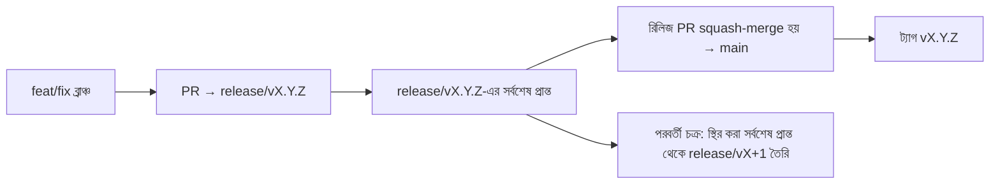

# Branching & Release Model (বাংলা)

🌐 **Languages:** 🇺🇸 [English](../../../../ops/BRANCHING_MODEL.md) · 🇪🇹 [am](../../../am/docs/ops/BRANCHING_MODEL.md) · 🇸🇦 [ar](../../../ar/docs/ops/BRANCHING_MODEL.md) · 🇦🇿 [az](../../../az/docs/ops/BRANCHING_MODEL.md) · 🇧🇬 [bg](../../../bg/docs/ops/BRANCHING_MODEL.md) · 🇨🇿 [cs](../../../cs/docs/ops/BRANCHING_MODEL.md) · 🇩🇰 [da](../../../da/docs/ops/BRANCHING_MODEL.md) · 🇩🇪 [de](../../../de/docs/ops/BRANCHING_MODEL.md) · 🇬🇷 [el](../../../el/docs/ops/BRANCHING_MODEL.md) · 🇪🇸 [es](../../../es/docs/ops/BRANCHING_MODEL.md) · 🇪🇪 [et](../../../et/docs/ops/BRANCHING_MODEL.md) · 🇮🇷 [fa](../../../fa/docs/ops/BRANCHING_MODEL.md) · 🇫🇮 [fi](../../../fi/docs/ops/BRANCHING_MODEL.md) · 🇫🇷 [fr](../../../fr/docs/ops/BRANCHING_MODEL.md) · 🇮🇪 [ga](../../../ga/docs/ops/BRANCHING_MODEL.md) · 🇮🇳 [gu](../../../gu/docs/ops/BRANCHING_MODEL.md) · 🇳🇬 [ha](../../../ha/docs/ops/BRANCHING_MODEL.md) · 🇮🇱 [he](../../../he/docs/ops/BRANCHING_MODEL.md) · 🇮🇳 [hi](../../../hi/docs/ops/BRANCHING_MODEL.md) · 🇭🇷 [hr](../../../hr/docs/ops/BRANCHING_MODEL.md) · 🇭🇺 [hu](../../../hu/docs/ops/BRANCHING_MODEL.md) · 🇦🇲 [hy](../../../hy/docs/ops/BRANCHING_MODEL.md) · 🇮🇩 [id](../../../id/docs/ops/BRANCHING_MODEL.md) · 🇳🇬 [ig](../../../ig/docs/ops/BRANCHING_MODEL.md) · 🇮🇹 [it](../../../it/docs/ops/BRANCHING_MODEL.md) · 🇯🇵 [ja](../../../ja/docs/ops/BRANCHING_MODEL.md) · 🇬🇪 [ka](../../../ka/docs/ops/BRANCHING_MODEL.md) · 🇰🇭 [km](../../../km/docs/ops/BRANCHING_MODEL.md) · 🇮🇳 [kn](../../../kn/docs/ops/BRANCHING_MODEL.md) · 🇰🇷 [ko](../../../ko/docs/ops/BRANCHING_MODEL.md) · 🇱🇹 [lt](../../../lt/docs/ops/BRANCHING_MODEL.md) · 🇱🇻 [lv](../../../lv/docs/ops/BRANCHING_MODEL.md) · 🇮🇳 [ml](../../../ml/docs/ops/BRANCHING_MODEL.md) · 🇮🇳 [mr](../../../mr/docs/ops/BRANCHING_MODEL.md) · 🇲🇾 [ms](../../../ms/docs/ops/BRANCHING_MODEL.md) · 🇲🇹 [mt](../../../mt/docs/ops/BRANCHING_MODEL.md) · 🇲🇲 [my](../../../my/docs/ops/BRANCHING_MODEL.md) · 🇳🇵 [ne](../../../ne/docs/ops/BRANCHING_MODEL.md) · 🇳🇱 [nl](../../../nl/docs/ops/BRANCHING_MODEL.md) · 🇳🇴 [no](../../../no/docs/ops/BRANCHING_MODEL.md) · 🇮🇳 [or](../../../or/docs/ops/BRANCHING_MODEL.md) · 🇮🇳 [pa](../../../pa/docs/ops/BRANCHING_MODEL.md) · 🇵🇭 [phi](../../../phi/docs/ops/BRANCHING_MODEL.md) · 🇵🇱 [pl](../../../pl/docs/ops/BRANCHING_MODEL.md) · 🇵🇹 [pt](../../../pt/docs/ops/BRANCHING_MODEL.md) · 🇧🇷 [pt-BR](../../../pt-BR/docs/ops/BRANCHING_MODEL.md) · 🇷🇴 [ro](../../../ro/docs/ops/BRANCHING_MODEL.md) · 🇷🇺 [ru](../../../ru/docs/ops/BRANCHING_MODEL.md) · 🇱🇰 [si](../../../si/docs/ops/BRANCHING_MODEL.md) · 🇸🇰 [sk](../../../sk/docs/ops/BRANCHING_MODEL.md) · 🇸🇮 [sl](../../../sl/docs/ops/BRANCHING_MODEL.md) · 🇷🇸 [sr](../../../sr/docs/ops/BRANCHING_MODEL.md) · 🇸🇪 [sv](../../../sv/docs/ops/BRANCHING_MODEL.md) · 🇰🇪 [sw](../../../sw/docs/ops/BRANCHING_MODEL.md) · 🇮🇳 [ta](../../../ta/docs/ops/BRANCHING_MODEL.md) · 🇮🇳 [te](../../../te/docs/ops/BRANCHING_MODEL.md) · 🇹🇭 [th](../../../th/docs/ops/BRANCHING_MODEL.md) · 🇹🇷 [tr](../../../tr/docs/ops/BRANCHING_MODEL.md) · 🇺🇦 [uk-UA](../../../uk-UA/docs/ops/BRANCHING_MODEL.md) · 🇵🇰 [ur](../../../ur/docs/ops/BRANCHING_MODEL.md) · 🇺🇿 [uz](../../../uz/docs/ops/BRANCHING_MODEL.md) · 🇻🇳 [vi](../../../vi/docs/ops/BRANCHING_MODEL.md) · 🇳🇬 [yo](../../../yo/docs/ops/BRANCHING_MODEL.md) · 🇨🇳 [zh-CN](../../../zh-CN/docs/ops/BRANCHING_MODEL.md) · 🇹🇼 [zh-TW](../../../zh-TW/docs/ops/BRANCHING_MODEL.md)

---

OmniRoute একটি **সমান্তরাল-চক্র** রিলিজ মডেল ব্যবহার করে: সক্রিয় চক্রের জন্য একটি নিবেদিত `release/vX.Y.Z`
ব্রাঞ্চ, প্রকাশিত লাইনের জন্য `main`, এবং সেই চক্র প্রকাশিত হলে একটি অপরিবর্তনীয়
`vX.Y.Z` ট্যাগ। `release/*` _এবং_ `main`—উভয় জায়গায় কমিট যুক্ত হতে দেখা প্রত্যাশিত — এটি কোনো বিভ্রান্তি নয়।

রক্ষণাবেক্ষণকারীদের জন্য বিস্তারিত তথ্য `CLAUDE.md` (কঠোর নিয়ম #21) এবং
[RELEASE_CHECKLIST.md](./RELEASE_CHECKLIST.md)-এ রয়েছে। এই পৃষ্ঠাটি কন্ট্রিবিউটরদের জন্য উন্মুক্ত
সারসংক্ষেপ।

## এক নজরে

| রেফারেন্স        | ভূমিকা                                                                                      |
| ---------------- | ------------------------------------------------------------------------------------------- |
| `release/vX.Y.Z` | **সক্রিয় চক্র** — সেই সংস্করণের দৈনন্দিন ডেভেলপমেন্ট এবং PR মার্জ                          |
| `main`           | **প্রকাশিত লাইন** — রিলিজ প্রকাশিত হলে squash-merge-এর মাধ্যমে চক্রটি গ্রহণ করে             |
| `vX.Y.Z` (ট্যাগ) | **প্রকাশ চিহ্নিতকারী** — রিলিজের সময় তৈরি হওয়া অপরিবর্তনীয় “যা প্রকাশিত হয়েছে” নির্দেশক |



## আমার PR-এর লক্ষ্য কোনটি হওয়া উচিত?

**সক্রিয় `release/vX.Y.Z` ব্রাঞ্চকে লক্ষ্য করুন — `main`-কে নয়।**

1. সর্বোচ্চ খোলা `release/v*` ব্রাঞ্চটি খুঁজুন (লেখার সময়কার উদাহরণ:
   `release/v3.8.49`)।
2. সেই সর্বশেষ প্রান্ত থেকে ব্রাঞ্চ তৈরি করুন (`git fetch` + checkout / তার ওপর rebase)।
3. **base = সেই `release/vX.Y.Z`** দিয়ে PR খুলুন।

`main` দৈনন্দিন ইন্টিগ্রেশন ব্রাঞ্চ নয়। `main`-এর বিপরীতে খোলা PR-গুলোর
সাধারণত মার্জ করার আগে লক্ষ্য পরিবর্তন করতে হয়।

## রিলিজ ফ্রিজ (সমান্তরাল চক্র)

কোনো রিলিজ সমন্বয় করার সময় `release-freeze` লেবেলযুক্ত একটি মার্কার ইস্যু
খোলা হয়। এটি **ডেভেলপমেন্ট বন্ধ করে না**:

- স্থির করা `release/vX.Y.Z` সেই প্রকাশের রিলিজ ক্যাপ্টেনের নিয়ন্ত্রণে থাকে।
- পরবর্তী চক্রের `release/vX+1` স্থির করা সর্বশেষ প্রান্ত থেকে তৈরি করা হয়, যাতে কন্ট্রিবিউটররা
  কাজ যুক্ত করা চালিয়ে যেতে পারেন।
- যেসব খোলা PR এখনও স্থির করা ব্রাঞ্চকে লক্ষ্য করে, সেগুলোকে **পুনরায় লক্ষ্য নির্ধারণ** করে
  সক্রিয় (সর্বোচ্চ) `release/v*` ব্রাঞ্চে নিতে হবে।

আপনার কাঙ্ক্ষিত ব্রাঞ্চটি মার্জযোগ্য ধরে নেওয়ার আগে কোনো খোলা ফ্রিজ আছে কি না পরীক্ষা করুন:

```bash
gh issue list --repo diegosouzapw/OmniRoute --label release-freeze --state open
```

মার্জের প্রক্রিয়া (মালিকের `queue` লেবেল → Mergify) সম্পর্কে
[MERGE_TRAIN.md](./MERGE_TRAIN.md)-এ নথিভুক্ত করা হয়েছে।

## ব্রাঞ্চ এবং ট্যাগ—দুটিই কেন?

| আর্টিফ্যাক্ট     | স্থায়িত্ব | উদ্দেশ্য                                                                |
| ---------------- | ---------- | ----------------------------------------------------------------------- |
| `release/vX.Y.Z` | চলমান চক্র | পর্যালোচিত PR সংগ্রহ করে, CI-কে সবুজ রাখে এবং PR-এর base হিসেবে কাজ করে |
| ট্যাগ `vX.Y.Z`   | চিরস্থায়ী | npm / GitHub Releases-এ প্রকাশিত সুনির্দিষ্ট বিটগুলো চিহ্নিত করে        |

ব্রাঞ্চটি হলো কর্মশালা; ট্যাগটি হলো সিল করা প্যাকেজ। `main`-এ squash-merge করার পর,
আগের রিলিজ PR শেষ হওয়ার অপেক্ষা না করেই পরবর্তী চক্র `release/vX+1`-এ চলতে থাকে।

## সম্পর্কিত নথি

- [CONTRIBUTING.md](../../CONTRIBUTING.md) — সেটআপ, পরীক্ষা, PR চেকলিস্ট
- [RELEASE_CHECKLIST.md](./RELEASE_CHECKLIST.md) — প্রকাশের আগের যাচাই
- [MERGE_TRAIN.md](./MERGE_TRAIN.md) — মার্জ কিউ এবং বিকল্প ট্রেন
- [RELEASE_GREEN.md](./RELEASE_GREEN.md) — রিলিজের সর্বশেষ প্রান্তকে সবুজ রাখা
