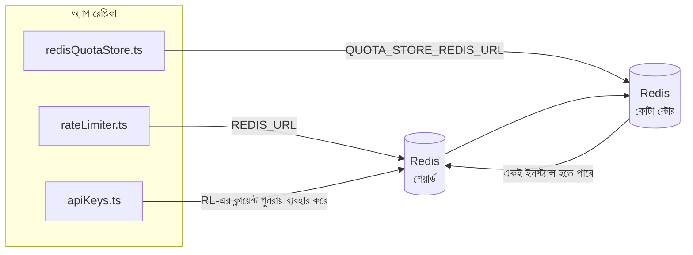

# Redis Production Configuration Guide (বাংলা)

🌐 **Languages:** 🇺🇸 [English](../../../../ops/REDIS_PRODUCTION_CONFIG.md) · 🇪🇹 [am](../../../am/docs/ops/REDIS_PRODUCTION_CONFIG.md) · 🇸🇦 [ar](../../../ar/docs/ops/REDIS_PRODUCTION_CONFIG.md) · 🇦🇿 [az](../../../az/docs/ops/REDIS_PRODUCTION_CONFIG.md) · 🇧🇬 [bg](../../../bg/docs/ops/REDIS_PRODUCTION_CONFIG.md) · 🇨🇿 [cs](../../../cs/docs/ops/REDIS_PRODUCTION_CONFIG.md) · 🇩🇰 [da](../../../da/docs/ops/REDIS_PRODUCTION_CONFIG.md) · 🇩🇪 [de](../../../de/docs/ops/REDIS_PRODUCTION_CONFIG.md) · 🇬🇷 [el](../../../el/docs/ops/REDIS_PRODUCTION_CONFIG.md) · 🇪🇸 [es](../../../es/docs/ops/REDIS_PRODUCTION_CONFIG.md) · 🇪🇪 [et](../../../et/docs/ops/REDIS_PRODUCTION_CONFIG.md) · 🇮🇷 [fa](../../../fa/docs/ops/REDIS_PRODUCTION_CONFIG.md) · 🇫🇮 [fi](../../../fi/docs/ops/REDIS_PRODUCTION_CONFIG.md) · 🇫🇷 [fr](../../../fr/docs/ops/REDIS_PRODUCTION_CONFIG.md) · 🇮🇪 [ga](../../../ga/docs/ops/REDIS_PRODUCTION_CONFIG.md) · 🇮🇳 [gu](../../../gu/docs/ops/REDIS_PRODUCTION_CONFIG.md) · 🇳🇬 [ha](../../../ha/docs/ops/REDIS_PRODUCTION_CONFIG.md) · 🇮🇱 [he](../../../he/docs/ops/REDIS_PRODUCTION_CONFIG.md) · 🇮🇳 [hi](../../../hi/docs/ops/REDIS_PRODUCTION_CONFIG.md) · 🇭🇷 [hr](../../../hr/docs/ops/REDIS_PRODUCTION_CONFIG.md) · 🇭🇺 [hu](../../../hu/docs/ops/REDIS_PRODUCTION_CONFIG.md) · 🇦🇲 [hy](../../../hy/docs/ops/REDIS_PRODUCTION_CONFIG.md) · 🇮🇩 [id](../../../id/docs/ops/REDIS_PRODUCTION_CONFIG.md) · 🇳🇬 [ig](../../../ig/docs/ops/REDIS_PRODUCTION_CONFIG.md) · 🇮🇹 [it](../../../it/docs/ops/REDIS_PRODUCTION_CONFIG.md) · 🇯🇵 [ja](../../../ja/docs/ops/REDIS_PRODUCTION_CONFIG.md) · 🇬🇪 [ka](../../../ka/docs/ops/REDIS_PRODUCTION_CONFIG.md) · 🇰🇭 [km](../../../km/docs/ops/REDIS_PRODUCTION_CONFIG.md) · 🇮🇳 [kn](../../../kn/docs/ops/REDIS_PRODUCTION_CONFIG.md) · 🇰🇷 [ko](../../../ko/docs/ops/REDIS_PRODUCTION_CONFIG.md) · 🇱🇹 [lt](../../../lt/docs/ops/REDIS_PRODUCTION_CONFIG.md) · 🇱🇻 [lv](../../../lv/docs/ops/REDIS_PRODUCTION_CONFIG.md) · 🇮🇳 [ml](../../../ml/docs/ops/REDIS_PRODUCTION_CONFIG.md) · 🇮🇳 [mr](../../../mr/docs/ops/REDIS_PRODUCTION_CONFIG.md) · 🇲🇾 [ms](../../../ms/docs/ops/REDIS_PRODUCTION_CONFIG.md) · 🇲🇹 [mt](../../../mt/docs/ops/REDIS_PRODUCTION_CONFIG.md) · 🇲🇲 [my](../../../my/docs/ops/REDIS_PRODUCTION_CONFIG.md) · 🇳🇵 [ne](../../../ne/docs/ops/REDIS_PRODUCTION_CONFIG.md) · 🇳🇱 [nl](../../../nl/docs/ops/REDIS_PRODUCTION_CONFIG.md) · 🇳🇴 [no](../../../no/docs/ops/REDIS_PRODUCTION_CONFIG.md) · 🇮🇳 [or](../../../or/docs/ops/REDIS_PRODUCTION_CONFIG.md) · 🇮🇳 [pa](../../../pa/docs/ops/REDIS_PRODUCTION_CONFIG.md) · 🇵🇭 [phi](../../../phi/docs/ops/REDIS_PRODUCTION_CONFIG.md) · 🇵🇱 [pl](../../../pl/docs/ops/REDIS_PRODUCTION_CONFIG.md) · 🇵🇹 [pt](../../../pt/docs/ops/REDIS_PRODUCTION_CONFIG.md) · 🇧🇷 [pt-BR](../../../pt-BR/docs/ops/REDIS_PRODUCTION_CONFIG.md) · 🇷🇴 [ro](../../../ro/docs/ops/REDIS_PRODUCTION_CONFIG.md) · 🇷🇺 [ru](../../../ru/docs/ops/REDIS_PRODUCTION_CONFIG.md) · 🇱🇰 [si](../../../si/docs/ops/REDIS_PRODUCTION_CONFIG.md) · 🇸🇰 [sk](../../../sk/docs/ops/REDIS_PRODUCTION_CONFIG.md) · 🇸🇮 [sl](../../../sl/docs/ops/REDIS_PRODUCTION_CONFIG.md) · 🇷🇸 [sr](../../../sr/docs/ops/REDIS_PRODUCTION_CONFIG.md) · 🇸🇪 [sv](../../../sv/docs/ops/REDIS_PRODUCTION_CONFIG.md) · 🇰🇪 [sw](../../../sw/docs/ops/REDIS_PRODUCTION_CONFIG.md) · 🇮🇳 [ta](../../../ta/docs/ops/REDIS_PRODUCTION_CONFIG.md) · 🇮🇳 [te](../../../te/docs/ops/REDIS_PRODUCTION_CONFIG.md) · 🇹🇭 [th](../../../th/docs/ops/REDIS_PRODUCTION_CONFIG.md) · 🇹🇷 [tr](../../../tr/docs/ops/REDIS_PRODUCTION_CONFIG.md) · 🇺🇦 [uk-UA](../../../uk-UA/docs/ops/REDIS_PRODUCTION_CONFIG.md) · 🇵🇰 [ur](../../../ur/docs/ops/REDIS_PRODUCTION_CONFIG.md) · 🇺🇿 [uz](../../../uz/docs/ops/REDIS_PRODUCTION_CONFIG.md) · 🇻🇳 [vi](../../../vi/docs/ops/REDIS_PRODUCTION_CONFIG.md) · 🇳🇬 [yo](../../../yo/docs/ops/REDIS_PRODUCTION_CONFIG.md) · 🇨🇳 [zh-CN](../../../zh-CN/docs/ops/REDIS_PRODUCTION_CONFIG.md) · 🇹🇼 [zh-TW](../../../zh-TW/docs/ops/REDIS_PRODUCTION_CONFIG.md)

---

## সারসংক্ষেপ

OmniRoute-এ Redis একটি **ঐচ্ছিক, সফট ডিপেন্ডেন্সি** — Redis অনুপলভ্য হলে অ্যাপ্লিকেশনটি স্বাভাবিকভাবে কার্যক্ষমতা কমিয়ে ইন-মেমরি
ফলব্যাক ব্যবহার করে। প্রোডাকশনে Redis টিউন করলে চারটি স্বতন্ত্র
ওয়ার্কলোডের লেটেন্সি কমে:

| ওয়ার্কলোড                | ড্রাইভার                      | ক্লায়েন্ট ফ্যাক্টরি                            | কী প্যাটার্ন                                               |
| ------------------------- | ----------------------------- | ----------------------------------------------- | ---------------------------------------------------------- |
| রেট লিমিটিং               | `rateLimiter.ts`              | `getRedisClient()` — লেজি `ioredis` সিঙ্গেলটন   | `<prefix>rl:*` Lua‑অ্যাটমিক রেট লিমিট উইন্ডো               |
| অথ ক্যাশ                  | `apiKeys.ts`                  | `rateLimiter`-এর ক্লায়েন্ট পুনরায় ব্যবহার করে | TTL-সহ `<prefix>auth:api_key:<sha256>`                     |
| কোটা স্টোর                | `redisQuotaStore.ts`          | পৃথক `getRedisClient(url)` সিঙ্গেলটন            | `<prefix>quota:*`, প্রতিটি ইনস্ট্যান্সের জন্য কনফিগারযোগ্য |
| ওয়ার্মআপ সার্কিট ব্রেকার | `redisCircuitBreakerStore.ts` | `circuitBreakerFactory.ts`-এ পৃথক ক্লায়েন্ট    | `<prefix>warmup:cb:<connectionId>`                         |

চারটি ওয়ার্কলোডই একই নেমস্পেস প্রিফিক্স ব্যবহার করে, যাতে OmniRoute একটি
একক Redis ইনস্ট্যান্সে (যেমন `127.0.0.1:6379`) অন্যান্য অ্যাপের সঙ্গে সহাবস্থান করতে পারে। [কী নেমস্পেসিং](#key-namespacing) দেখুন।

---

## বর্তমান কনফিগারেশন (কোডের ডিফল্ট)

| সেটিং                           | মান                                                      | অবস্থান                                                                               |
| ------------------------------- | -------------------------------------------------------- | ------------------------------------------------------------------------------------- |
| `REDIS_URL` env var             | `redis://redis:6379` (compose), ঐচ্ছিক                   | `rateLimiter.ts:5`, `.env.example`                                                    |
| `REDIS_KEY_PREFIX` env var      | `omniroute:` (ডিফল্ট)                                    | `rateLimiter.ts`, `redisQuotaStore.ts`, `redisCircuitBreakerStore.ts`, `.env.example` |
| `QUOTA_STORE_REDIS_URL` env var | পৃথক; `REDIS_URL` থেকে ভিন্ন হতে পারে                    | `quota/storeFactory.ts`                                                               |
| `QUOTA_STORE_DRIVER`            | `"sqlite"` (ডিফল্ট), `"redis"` ঐচ্ছিক                    | `quota/storeFactory.ts`                                                               |
| ioredis `maxRetriesPerRequest`  | `3`                                                      | `rateLimiter.ts` ক্লায়েন্ট তৈরি                                                      |
| `enableReadyCheck`              | সেট করা নেই (ioredis ডিফল্ট: `true`)                     | —                                                                                     |
| `lazyConnect`                   | সেট করা নেই (ioredis ডিফল্ট: `false`)                    | —                                                                                     |
| `retryStrategy`                 | সেট করা নেই (ioredis ডিফল্ট: 200ms বেস, এক্সপোনেনশিয়াল) | —                                                                                     |
| TLS / পাসওয়ার্ড / DB ইনডেক্স   | **কনফিগার করা নেই**                                      | —                                                                                     |
| Sentinel / Cluster              | **কনফিগার করা নেই** — শুধু স্বতন্ত্র সিঙ্গেল-নোড         | —                                                                                     |

---

## কী নেমস্পেসিং

হোস্টে চলমান অন্যান্য সবকিছুর সঙ্গে OmniRoute একটি Redis ইনস্ট্যান্স শেয়ার করে। নেমস্পেস ছাড়া,
`auth:api_key:<sha256>` বা `rl:*`-এর মতো কীগুলো একই Redis ব্যবহারকারী অন্যান্য অ্যাপ্লিকেশনের
কীর সঙ্গে সংঘর্ষে জড়াতে পারে (এই ইনস্ট্যান্সটি অন্যান্য সার্ভিসের পাশাপাশি `127.0.0.1:6379`-এ Redis চালায়)।

OmniRoute-এর **প্রতিটি** কীর শুরুতে প্রিফিক্স যোগ করতে `REDIS_KEY_PREFIX`-কে একটি খালি নয় এমন স্ট্রিংয়ে সেট করুন:

```bash
# .env — OmniRoute-এর সব কী হয়ে যাবে omniroute:rl:*, omniroute:auth:*, omniroute:quota:*, omniroute:warmup:cb:*
REDIS_KEY_PREFIX=omniroute:
```

- **ডিফল্ট:** `omniroute:` (`REDIS_KEY_PREFIX` সেট করা না থাকলে বা ফাঁকা থাকলে প্রয়োগ করা হয়)।
- **যেগুলোতে প্রয়োগ করা হয়:** রেট লিমিটার + অথ ক্যাশ (`keyPrefix`-এর মাধ্যমে শেয়ার করা `ioredis` ক্লায়েন্ট) এবং
  কোটা স্টোর (`KEY_PREFIX = "${REDIS_KEY_PREFIX}quota"`) ও ওয়ার্মআপ সার্কিট ব্রেকার
  (`KEY_PREFIX = "${REDIS_KEY_PREFIX}warmup:cb:"`)।
- Redis-এ কী আগে থেকেই থাকা অবস্থায় **প্রিফিক্স পরিবর্তন করলে** পুরোনো কীগুলো অনাথ হয়ে যায় (সেগুলোর মেয়াদ
  TTL / LRU-এর মাধ্যমে শেষ হয়)। পরিবর্তন করা নিরাপদ; কোনো মাইগ্রেশন প্রয়োজন নেই। একমাত্র ব্যতিক্রম হলো নিষিদ্ধ হিসেবে চিহ্নিত কোনো সংযোগের
  ওয়ার্মআপ সার্কিট-ব্রেকার কী: এটি TTL ছাড়াই সংরক্ষিত থাকে, তাই অবশিষ্ট কীগুলো
  `redis-cli --scan --pattern '<old-prefix>warmup:cb:*'` দিয়ে তালিকাভুক্ত করে মুছে ফেলুন।
- **ioredis `keyPrefix`** লেখার সময় স্বয়ংক্রিয়ভাবে প্রিফিক্স যোগ করে **এবং** পড়ার সময় সেটি বাদ দেয়,
  তাই অ্যাপ্লিকেশন কোড কখনোই প্রিফিক্সটি দেখতে পায় না।

---

## প্রস্তাবিত প্রোডাকশন টিউনিং

### 1. কানেকশন পুল / ক্লায়েন্ট অপশনসমূহ (ioredis `Redis` কনস্ট্রাক্টর)

বর্তমান কোডটি কোনো কাস্টম অপশন ছাড়াই একটি `new Redis(url)` তৈরি করে। প্রোডাকশনের
মাল্টি-রেপ্লিকা ডিপ্লয়মেন্টের জন্য কোডে একটি ক্লায়েন্ট ফ্যাক্টরি পাস করুন অথবা `getRedisClient()` র্যাপ করুন:

```typescript
const redis = new Redis(REDIS_URL, {
  maxRetriesPerRequest: null, // পুনঃচেষ্টার কোনো সীমা নেই; retryStrategy-কে সিদ্ধান্ত নিতে দিন
  enableReadyCheck: true, // কল গ্রহণের আগে সার্ভার প্রস্তুত কি না যাচাই করুন
  lazyConnect: true, // তৈরির সময় সংযোগ করবেন না; প্রথম কল পর্যন্ত অপেক্ষা করুন
  retryStrategy: (times) => {
    if (times > 10) return null; // 10 বার পুনঃচেষ্টার পর হাল ছাড়ুন → পরে পুনরায় সংযোগ করুন
    return Math.min(times * 200, 5000); // 200ms, 400ms, …, সর্বোচ্চ 5s
  },
  enableAutoPipelining: true, // সমসাময়িক কমান্ডগুলোকে একটি TCP রাইটে একত্রিত করুন
  keepAlive: 10000, // প্রতি 10s-এ TCP কিপ-অ্যালাইভ
});
```

**মূল সুবিধা-অসুবিধাসমূহ:**

- `maxRetriesPerRequest: null` + `retryStrategy` — প্রোডাকশনের জন্য এটি অগ্রাধিকারযোগ্য, যাতে সাময়িক
  Redis রিস্টার্টের কারণে প্রতিটি রিকোয়েস্ট তাৎক্ষণিকভাবে ব্যর্থ না হয়। `checkRateLimit()`-এর
  ইন-মেমরি ফলব্যাক ব্যর্থতার পথটি সামলে নেয়।
- `lazyConnect: true` — সার্ভার সংযোগ গ্রহণ শুরু করার আগে Redis চালু থাকার ওপর
  স্টার্টআপ নির্ভরতা এড়ায়।
- `enableAutoPipelining: true` — সমসাময়িক রেট-লিমিট পরীক্ষার রাউন্ড-ট্রিপ কমায়;
  একটি সংযোগে >50 RPS হলে উপকারী।

### 2. Redis সার্ভার কনফিগারেশন (`redis.conf`)

```
# মেমোরি
maxmemory 80%                        # OS পেজ ক্যাশের জন্য জায়গা রাখুন
maxmemory-policy allkeys-lru         # চাপের সময় পুরোনো auth ক্যাশ এন্ট্রি অপসারণ করুন

# পারসিস্টেন্স (ঐচ্ছিক — এটি ছাড়াও OmniRoute ক্র্যাশ-নিরাপদ)
save 300 1                           # ≥1টি কী পরিবর্তিত হলে অন্তত প্রতি 5 মিনিটে স্ন্যাপশট নিন
appendonly no                        # AOF প্রয়োজন নেই; ডেটা পুনরায় তৈরি করা যায়
appendfsync no                       # কোনো fsync ওভারহেড নেই (RDB যথেষ্ট)

# নেটওয়ার্কিং
timeout 0                            # নিষ্ক্রিয় সংযোগ বিচ্ছিন্ন করবেন না
tcp-keepalive 300                    # 5 মিনিটের কিপ-অ্যালাইভ
tcp-backlog 511                      # আকস্মিক লোডের জন্য কানেকশন ব্যাকলগ

# পারফরম্যান্স
hz 10                                # ডিফল্ট; লেটেন্সি-সংবেদনশীল ব্যবহারের জন্য 100
activedefrag yes                     # ফ্র্যাগমেন্টেশন >10% হলে স্বয়ংক্রিয়ভাবে ডিফ্র্যাগমেন্ট করুন
```

**`maxmemory-policy allkeys-lru`-এর সুবিধা-অসুবিধা:** মেমোরির চাপের সময় auth ক্যাশ এন্ট্রি
অপসারিত হতে পারে। এটি নিরাপদ — মিস হলে `setCachedApiKey` সবসময় পুনরায় ডেটা যোগ করে এবং
SQLite ফলব্যাকই চূড়ান্ত কর্তৃত্বপূর্ণ উৎস। রেট-লিমিটার Lua স্ক্রিপ্ট এমন ছোট কী তৈরি করে, যেগুলো
পরিকল্পিতভাবেই স্বল্পস্থায়ী।

### 3. Docker Compose সেটিংস

প্রোডাকশন compose (`docker-compose.prod.yml`) `redis:8.6.2-alpine` ব্যবহার করে। যোগ করুন:

```yaml
redis:
  image: redis:8.6.2-alpine
  command:
    [
      "redis-server",
      "--maxmemory",
      "512mb",
      "--maxmemory-policy",
      "allkeys-lru",
      "--activedefrag",
      "yes",
      "--save",
      "300 1",
    ]
  healthcheck:
    test: ["CMD", "redis-cli", "ping"]
    interval: 10s
    timeout: 3s
    retries: 3
    start_period: 5s
```

### 4. মাল্টি-ইনস্ট্যান্স / স্কেলিং বিবেচনা

**সব রেপ্লিকার জন্য একটি Redis** — রেট-লিমিটার Lua স্ক্রিপ্ট একটি একক
কর্তৃত্বপূর্ণ কী-স্পেসের ওপর নির্ভর করে। রেপ্লিকাগুলোর পেছনে একাধিক Redis ইনস্ট্যান্স ব্যবহার করলে
অ্যাটমিকতা নষ্ট হবে এবং বাজেট দ্বিগুণ হয়ে যাবে। সব অ্যাপ্লিকেশন রেপ্লিকার জন্য একটি Redis
(অথবা ফেইলওভারসহ Redis Sentinel ক্লাস্টার) ব্যবহার করুন।

**সংযোগের সংখ্যা:** প্রতিটি অ্যাপ্লিকেশন রেপ্লিকা Redis-এ **2টি TCP সংযোগ** খোলে
(রেট-লিমিটার ক্লায়েন্ট + কোটা স্টোর ক্লায়েন্ট)। 10টি রেপ্লিকা → 20টি সংযোগ, যা একটি
ডিফল্ট Redis ইনস্ট্যান্সের 10k সংযোগসীমার তুলনায় অনেক কম।

### 5. মনিটরিং

হেলথ-চেক এন্ডপয়েন্টের মাধ্যমে প্রকাশ করুন:

```typescript
// src/app/api/monitoring/health/route.ts ইতোমধ্যে rateLimiter ফাংশনগুলো কল করে
// Redis-নির্দিষ্ট পরীক্ষা যোগ করুন:
//   1. ioredis .ping() দিয়ে PING লেটেন্সি
//   2. INFO memory দিয়ে মেমোরি ব্যবহার
//   3. INFO clients দিয়ে সংযোগের সংখ্যা
//   4. maxmemory-policy-এর হিট রেট (evicted_keys / keyspace_hits)
```

নজরে রাখার মতো মূল মেট্রিক:

- **প্রতি সেকেন্ডে অপসারিত কী** — ধারাবাহিকভাবে শূন্যের বেশি হলে `maxmemory` বাড়ান
- **ব্লক হওয়া ক্লায়েন্ট** — শূন্যের বেশি হলে ধীর Lua স্ক্রিপ্ট বা উচ্চ কনটেনশন নির্দেশ করে
- **প্রত্যাখ্যাত সংযোগ** — সংযোগসীমা পূর্ণ হয়েছে; 20টি সংযোগে এমনটি বিরল

---

## আর্কিটেকচার ডায়াগ্রাম



---

## রেফারেন্স

| ফাইল                               | উদ্দেশ্য                                                             |
| ---------------------------------- | -------------------------------------------------------------------- |
| `src/shared/utils/rateLimiter.ts`  | প্রাথমিক Redis ক্লায়েন্ট, Lua রেট-লিমিট স্ক্রিপ্ট, ইন-মেমরি ফলব্যাক |
| `src/lib/db/apiKeys.ts`            | অথ ক্যাশ — Redis→SQLite ফলব্যাক                                      |
| `src/lib/quota/redisQuotaStore.ts` | ঐচ্ছিক কোটা স্টোরের জন্য পৃথক Redis ক্লায়েন্ট                       |
| `src/lib/quota/storeFactory.ts`    | `sqlite` এবং `redis` কোটা ড্রাইভারের মধ্যে পরিবর্তন করে              |
| `docker-compose.prod.yml`          | প্রোড Redis কনটেইনার (ইমেজ `redis:8.6.2-alpine`)                     |
| `.env.example`                     | Redis এনভায়রনমেন্ট ভেরিয়েবলের ডকুমেন্টেশন                          |
| `src/app/api/local/redis/`         | ডেভ কনটেইনার অর্কেস্ট্রেশনের জন্য API রুট                            |
| `bin/cli/commands/redis.mjs`       | ডেভ কনটেইনার অর্কেস্ট্রেশনের জন্য CLI কমান্ড                         |
