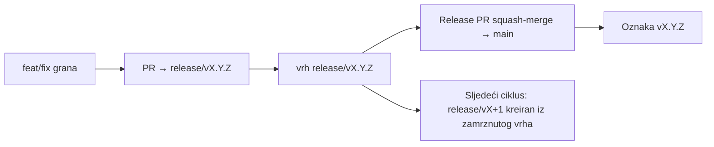

# Branching & Release Model (Bosanski)

🌐 **Languages:** 🇺🇸 [English](../../../../ops/BRANCHING_MODEL.md) · 🇪🇹 [am](../../../am/docs/ops/BRANCHING_MODEL.md) · 🇸🇦 [ar](../../../ar/docs/ops/BRANCHING_MODEL.md) · 🇦🇿 [az](../../../az/docs/ops/BRANCHING_MODEL.md) · 🇧🇬 [bg](../../../bg/docs/ops/BRANCHING_MODEL.md) · 🇧🇩 [bn](../../../bn/docs/ops/BRANCHING_MODEL.md) · 🇨🇿 [cs](../../../cs/docs/ops/BRANCHING_MODEL.md) · 🇩🇰 [da](../../../da/docs/ops/BRANCHING_MODEL.md) · 🇩🇪 [de](../../../de/docs/ops/BRANCHING_MODEL.md) · 🇬🇷 [el](../../../el/docs/ops/BRANCHING_MODEL.md) · 🇪🇸 [es](../../../es/docs/ops/BRANCHING_MODEL.md) · 🇪🇪 [et](../../../et/docs/ops/BRANCHING_MODEL.md) · 🇮🇷 [fa](../../../fa/docs/ops/BRANCHING_MODEL.md) · 🇫🇮 [fi](../../../fi/docs/ops/BRANCHING_MODEL.md) · 🇫🇷 [fr](../../../fr/docs/ops/BRANCHING_MODEL.md) · 🇮🇪 [ga](../../../ga/docs/ops/BRANCHING_MODEL.md) · 🇮🇳 [gu](../../../gu/docs/ops/BRANCHING_MODEL.md) · 🇳🇬 [ha](../../../ha/docs/ops/BRANCHING_MODEL.md) · 🇮🇱 [he](../../../he/docs/ops/BRANCHING_MODEL.md) · 🇮🇳 [hi](../../../hi/docs/ops/BRANCHING_MODEL.md) · 🇭🇷 [hr](../../../hr/docs/ops/BRANCHING_MODEL.md) · 🇭🇺 [hu](../../../hu/docs/ops/BRANCHING_MODEL.md) · 🇦🇲 [hy](../../../hy/docs/ops/BRANCHING_MODEL.md) · 🇮🇩 [id](../../../id/docs/ops/BRANCHING_MODEL.md) · 🇳🇬 [ig](../../../ig/docs/ops/BRANCHING_MODEL.md) · 🇮🇹 [it](../../../it/docs/ops/BRANCHING_MODEL.md) · 🇯🇵 [ja](../../../ja/docs/ops/BRANCHING_MODEL.md) · 🇬🇪 [ka](../../../ka/docs/ops/BRANCHING_MODEL.md) · 🇰🇭 [km](../../../km/docs/ops/BRANCHING_MODEL.md) · 🇮🇳 [kn](../../../kn/docs/ops/BRANCHING_MODEL.md) · 🇰🇷 [ko](../../../ko/docs/ops/BRANCHING_MODEL.md) · 🇱🇹 [lt](../../../lt/docs/ops/BRANCHING_MODEL.md) · 🇱🇻 [lv](../../../lv/docs/ops/BRANCHING_MODEL.md) · 🇮🇳 [ml](../../../ml/docs/ops/BRANCHING_MODEL.md) · 🇮🇳 [mr](../../../mr/docs/ops/BRANCHING_MODEL.md) · 🇲🇾 [ms](../../../ms/docs/ops/BRANCHING_MODEL.md) · 🇲🇹 [mt](../../../mt/docs/ops/BRANCHING_MODEL.md) · 🇲🇲 [my](../../../my/docs/ops/BRANCHING_MODEL.md) · 🇳🇵 [ne](../../../ne/docs/ops/BRANCHING_MODEL.md) · 🇳🇱 [nl](../../../nl/docs/ops/BRANCHING_MODEL.md) · 🇳🇴 [no](../../../no/docs/ops/BRANCHING_MODEL.md) · 🇮🇳 [or](../../../or/docs/ops/BRANCHING_MODEL.md) · 🇮🇳 [pa](../../../pa/docs/ops/BRANCHING_MODEL.md) · 🇵🇭 [phi](../../../phi/docs/ops/BRANCHING_MODEL.md) · 🇵🇱 [pl](../../../pl/docs/ops/BRANCHING_MODEL.md) · 🇵🇹 [pt](../../../pt/docs/ops/BRANCHING_MODEL.md) · 🇧🇷 [pt-BR](../../../pt-BR/docs/ops/BRANCHING_MODEL.md) · 🇷🇴 [ro](../../../ro/docs/ops/BRANCHING_MODEL.md) · 🇷🇺 [ru](../../../ru/docs/ops/BRANCHING_MODEL.md) · 🇱🇰 [si](../../../si/docs/ops/BRANCHING_MODEL.md) · 🇸🇰 [sk](../../../sk/docs/ops/BRANCHING_MODEL.md) · 🇸🇮 [sl](../../../sl/docs/ops/BRANCHING_MODEL.md) · 🇷🇸 [sr](../../../sr/docs/ops/BRANCHING_MODEL.md) · 🇸🇪 [sv](../../../sv/docs/ops/BRANCHING_MODEL.md) · 🇰🇪 [sw](../../../sw/docs/ops/BRANCHING_MODEL.md) · 🇮🇳 [ta](../../../ta/docs/ops/BRANCHING_MODEL.md) · 🇮🇳 [te](../../../te/docs/ops/BRANCHING_MODEL.md) · 🇹🇭 [th](../../../th/docs/ops/BRANCHING_MODEL.md) · 🇹🇷 [tr](../../../tr/docs/ops/BRANCHING_MODEL.md) · 🇺🇦 [uk-UA](../../../uk-UA/docs/ops/BRANCHING_MODEL.md) · 🇵🇰 [ur](../../../ur/docs/ops/BRANCHING_MODEL.md) · 🇺🇿 [uz](../../../uz/docs/ops/BRANCHING_MODEL.md) · 🇻🇳 [vi](../../../vi/docs/ops/BRANCHING_MODEL.md) · 🇳🇬 [yo](../../../yo/docs/ops/BRANCHING_MODEL.md) · 🇨🇳 [zh-CN](../../../zh-CN/docs/ops/BRANCHING_MODEL.md) · 🇹🇼 [zh-TW](../../../zh-TW/docs/ops/BRANCHING_MODEL.md)

---

# Model grananja i izdavanja

OmniRoute koristi model izdavanja sa **paralelnim ciklusima**: namjenska `release/vX.Y.Z` grana za aktivni ciklus, `main` za objavljenu liniju, i nepromjenjiva `vX.Y.Z` oznaka (tag) kada se taj ciklus isporuči. Vidjeti commit-e na `release/*` _i_ na `main` je očekivano — nije greška.

Detalji za održavatelje se nalaze u `CLAUDE.md` (Strogo pravilo #21) i [RELEASE_CHECKLIST.md](./RELEASE_CHECKLIST.md). Ova stranica je javni sažetak namijenjen saradnicima.

## Ukratko

| Ref               | Uloga                                                                                       |
| ----------------- | ------------------------------------------------------------------------------------------- |
| `release/vX.Y.Z`  | **Aktivni ciklus** — svakodnevni razvoj i spajanje PR-ova za tu verziju                     |
| `main`            | **Objavljena linija** — prima ciklus putem squash-merge-a kada se izdanje isporuči          |
| `vX.Y.Z` (oznaka) | **Oznaka isporuke** — nepromjenjivi pokazivač "šta je isporučeno" kreiran u vrijeme izdanja |



## Na koju granu treba da usmjerim svoj PR?

**Usmjerite svoj PR na aktivnu `release/vX.Y.Z` granu — ne na `main`.**

1. Pronađite najvišu otvorenu `release/v*` granu (primjer u trenutku pisanja: `release/v3.8.49`).
2. Kreirajte granu iz tog vrha (`git fetch` + checkout / rebase na njega).
3. Otvorite PR sa **bazom = tom `release/vX.Y.Z`**.

`main` nije grana za svakodnevnu integraciju. PR-ovi otvoreni prema `main` obično zahtijevaju promjenu ciljane grane prije spajanja.

## Zamrzavanje izdanja (paralelni ciklusi)

Kada se izdanje usklađuje, otvara se marker issue sa oznakom `release-freeze`. To **ne zaustavlja razvoj**:

- Zamrznuta `release/vX.Y.Z` pripada kapetanu izdanja za tu isporuku.
- Sljedeći ciklus `release/vX+1` se kreira iz zamrznutog vrha kako bi saradnici mogli nastaviti sa radom.
- Otvoreni PR-ovi koji i dalje ciljaju zamrznutu granu trebaju biti **preusmjereni** na aktivnu (najvišu) `release/v*` granu.

Provjerite da li postoji otvoreno zamrzavanje prije nego što pretpostavite da je grana koju želite spojiva:

```bash
gh issue list --repo diegosouzapw/OmniRoute --label release-freeze --state open
```

Mehanika spajanja (vlasnik `queue` oznaka → Mergify) je dokumentovana u [MERGE_TRAIN.md](./MERGE_TRAIN.md).

## Zašto i grana i oznaka (tag)?

| Artefakt         | Vijek trajanja | Svrha                                                              |
| ---------------- | -------------- | ------------------------------------------------------------------ |
| `release/vX.Y.Z` | Ciklus u toku  | Prikuplja pregledane PR-ove, ostaje CI-zelen, služi kao baza za PR |
| Oznaka `vX.Y.Z`  | Zauvijek       | Označava tačne bitove koji su isporučeni na npm / GitHub Releases  |

Grana je radionica; oznaka je zapečaćeni paket. Nakon squash-merge-a na `main`, sljedeći ciklus se nastavlja na `release/vX+1` bez čekanja da se prethodni PR izdanja završi.

## Povezana dokumentacija

- [CONTRIBUTING.md](../../CONTRIBUTING.md) — podešavanje, testovi, PR kontrolna lista
- [RELEASE_CHECKLIST.md](./RELEASE_CHECKLIST.md) — validacija prije isporuke
- [MERGE_TRAIN.md](./MERGE_TRAIN.md) — red za spajanje i rezervni voz
- [RELEASE_GREEN.md](./RELEASE_GREEN.md) — održavanje vrha izdanja zelenim
