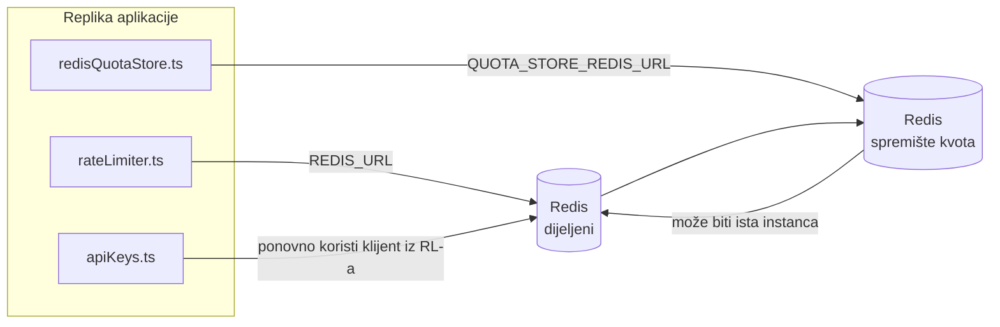

# Redis Production Configuration Guide (Bosanski)

🌐 **Languages:** 🇺🇸 [English](../../../../ops/REDIS_PRODUCTION_CONFIG.md) · 🇪🇹 [am](../../../am/docs/ops/REDIS_PRODUCTION_CONFIG.md) · 🇸🇦 [ar](../../../ar/docs/ops/REDIS_PRODUCTION_CONFIG.md) · 🇦🇿 [az](../../../az/docs/ops/REDIS_PRODUCTION_CONFIG.md) · 🇧🇬 [bg](../../../bg/docs/ops/REDIS_PRODUCTION_CONFIG.md) · 🇧🇩 [bn](../../../bn/docs/ops/REDIS_PRODUCTION_CONFIG.md) · 🇨🇿 [cs](../../../cs/docs/ops/REDIS_PRODUCTION_CONFIG.md) · 🇩🇰 [da](../../../da/docs/ops/REDIS_PRODUCTION_CONFIG.md) · 🇩🇪 [de](../../../de/docs/ops/REDIS_PRODUCTION_CONFIG.md) · 🇬🇷 [el](../../../el/docs/ops/REDIS_PRODUCTION_CONFIG.md) · 🇪🇸 [es](../../../es/docs/ops/REDIS_PRODUCTION_CONFIG.md) · 🇪🇪 [et](../../../et/docs/ops/REDIS_PRODUCTION_CONFIG.md) · 🇮🇷 [fa](../../../fa/docs/ops/REDIS_PRODUCTION_CONFIG.md) · 🇫🇮 [fi](../../../fi/docs/ops/REDIS_PRODUCTION_CONFIG.md) · 🇫🇷 [fr](../../../fr/docs/ops/REDIS_PRODUCTION_CONFIG.md) · 🇮🇪 [ga](../../../ga/docs/ops/REDIS_PRODUCTION_CONFIG.md) · 🇮🇳 [gu](../../../gu/docs/ops/REDIS_PRODUCTION_CONFIG.md) · 🇳🇬 [ha](../../../ha/docs/ops/REDIS_PRODUCTION_CONFIG.md) · 🇮🇱 [he](../../../he/docs/ops/REDIS_PRODUCTION_CONFIG.md) · 🇮🇳 [hi](../../../hi/docs/ops/REDIS_PRODUCTION_CONFIG.md) · 🇭🇷 [hr](../../../hr/docs/ops/REDIS_PRODUCTION_CONFIG.md) · 🇭🇺 [hu](../../../hu/docs/ops/REDIS_PRODUCTION_CONFIG.md) · 🇦🇲 [hy](../../../hy/docs/ops/REDIS_PRODUCTION_CONFIG.md) · 🇮🇩 [id](../../../id/docs/ops/REDIS_PRODUCTION_CONFIG.md) · 🇳🇬 [ig](../../../ig/docs/ops/REDIS_PRODUCTION_CONFIG.md) · 🇮🇹 [it](../../../it/docs/ops/REDIS_PRODUCTION_CONFIG.md) · 🇯🇵 [ja](../../../ja/docs/ops/REDIS_PRODUCTION_CONFIG.md) · 🇬🇪 [ka](../../../ka/docs/ops/REDIS_PRODUCTION_CONFIG.md) · 🇰🇭 [km](../../../km/docs/ops/REDIS_PRODUCTION_CONFIG.md) · 🇮🇳 [kn](../../../kn/docs/ops/REDIS_PRODUCTION_CONFIG.md) · 🇰🇷 [ko](../../../ko/docs/ops/REDIS_PRODUCTION_CONFIG.md) · 🇱🇹 [lt](../../../lt/docs/ops/REDIS_PRODUCTION_CONFIG.md) · 🇱🇻 [lv](../../../lv/docs/ops/REDIS_PRODUCTION_CONFIG.md) · 🇮🇳 [ml](../../../ml/docs/ops/REDIS_PRODUCTION_CONFIG.md) · 🇮🇳 [mr](../../../mr/docs/ops/REDIS_PRODUCTION_CONFIG.md) · 🇲🇾 [ms](../../../ms/docs/ops/REDIS_PRODUCTION_CONFIG.md) · 🇲🇹 [mt](../../../mt/docs/ops/REDIS_PRODUCTION_CONFIG.md) · 🇲🇲 [my](../../../my/docs/ops/REDIS_PRODUCTION_CONFIG.md) · 🇳🇵 [ne](../../../ne/docs/ops/REDIS_PRODUCTION_CONFIG.md) · 🇳🇱 [nl](../../../nl/docs/ops/REDIS_PRODUCTION_CONFIG.md) · 🇳🇴 [no](../../../no/docs/ops/REDIS_PRODUCTION_CONFIG.md) · 🇮🇳 [or](../../../or/docs/ops/REDIS_PRODUCTION_CONFIG.md) · 🇮🇳 [pa](../../../pa/docs/ops/REDIS_PRODUCTION_CONFIG.md) · 🇵🇭 [phi](../../../phi/docs/ops/REDIS_PRODUCTION_CONFIG.md) · 🇵🇱 [pl](../../../pl/docs/ops/REDIS_PRODUCTION_CONFIG.md) · 🇵🇹 [pt](../../../pt/docs/ops/REDIS_PRODUCTION_CONFIG.md) · 🇧🇷 [pt-BR](../../../pt-BR/docs/ops/REDIS_PRODUCTION_CONFIG.md) · 🇷🇴 [ro](../../../ro/docs/ops/REDIS_PRODUCTION_CONFIG.md) · 🇷🇺 [ru](../../../ru/docs/ops/REDIS_PRODUCTION_CONFIG.md) · 🇱🇰 [si](../../../si/docs/ops/REDIS_PRODUCTION_CONFIG.md) · 🇸🇰 [sk](../../../sk/docs/ops/REDIS_PRODUCTION_CONFIG.md) · 🇸🇮 [sl](../../../sl/docs/ops/REDIS_PRODUCTION_CONFIG.md) · 🇷🇸 [sr](../../../sr/docs/ops/REDIS_PRODUCTION_CONFIG.md) · 🇸🇪 [sv](../../../sv/docs/ops/REDIS_PRODUCTION_CONFIG.md) · 🇰🇪 [sw](../../../sw/docs/ops/REDIS_PRODUCTION_CONFIG.md) · 🇮🇳 [ta](../../../ta/docs/ops/REDIS_PRODUCTION_CONFIG.md) · 🇮🇳 [te](../../../te/docs/ops/REDIS_PRODUCTION_CONFIG.md) · 🇹🇭 [th](../../../th/docs/ops/REDIS_PRODUCTION_CONFIG.md) · 🇹🇷 [tr](../../../tr/docs/ops/REDIS_PRODUCTION_CONFIG.md) · 🇺🇦 [uk-UA](../../../uk-UA/docs/ops/REDIS_PRODUCTION_CONFIG.md) · 🇵🇰 [ur](../../../ur/docs/ops/REDIS_PRODUCTION_CONFIG.md) · 🇺🇿 [uz](../../../uz/docs/ops/REDIS_PRODUCTION_CONFIG.md) · 🇻🇳 [vi](../../../vi/docs/ops/REDIS_PRODUCTION_CONFIG.md) · 🇳🇬 [yo](../../../yo/docs/ops/REDIS_PRODUCTION_CONFIG.md) · 🇨🇳 [zh-CN](../../../zh-CN/docs/ops/REDIS_PRODUCTION_CONFIG.md) · 🇹🇼 [zh-TW](../../../zh-TW/docs/ops/REDIS_PRODUCTION_CONFIG.md)

---

## Pregled

Redis je **opcionalna, nekritična zavisnost** u OmniRouteu — aplikacija nastavlja raditi uz postepeno smanjenje funkcionalnosti (rezervni mehanizmi u memoriji) kada Redis nije dostupan. U produkciji, podešavanje Redisa smanjuje latenciju za četiri različita radna opterećenja:

| Radno opterećenje                      | Upravljački modul             | Fabrika klijenta                                                | Obrazac ključa                                        |
| -------------------------------------- | ----------------------------- | --------------------------------------------------------------- | ----------------------------------------------------- |
| Ograničavanje brzine                   | `rateLimiter.ts`              | `getRedisClient()` — lijeno inicijalizirani `ioredis` singleton | `<prefix>rl:*` Lua‑atomski prozori ograničenja brzine |
| Keš autentifikacije                    | `apiKeys.ts`                  | Ponovo koristi klijent iz `rateLimiter`                         | `<prefix>auth:api_key:<sha256>` s TTL-om              |
| Spremište kvota                        | `redisQuotaStore.ts`          | Zaseban `getRedisClient(url)` singleton                         | `<prefix>quota:*` podesivo po instanci                |
| Prekidač strujnog kola za zagrijavanje | `redisCircuitBreakerStore.ts` | Zaseban klijent u `circuitBreakerFactory.ts`                    | `<prefix>warmup:cb:<connectionId>`                    |

Sva četiri radna opterećenja dijele isti prefiks prostora imena kako bi OmniRoute mogao koegzistirati s drugim aplikacijama na jednoj Redis instanci (npr. `127.0.0.1:6379`). Pogledajte [Prostor imena ključeva](#prostor-imena-ključeva).

---

## Trenutna konfiguracija (zadane vrijednosti u kodu)

| Postavka                                    | Vrijednost                                                                     | Lokacija                                                                              |
| ------------------------------------------- | ------------------------------------------------------------------------------ | ------------------------------------------------------------------------------------- |
| Varijabla okruženja `REDIS_URL`             | `redis://redis:6379` (compose), opcionalno                                     | `rateLimiter.ts:5`, `.env.example`                                                    |
| Varijabla okruženja `REDIS_KEY_PREFIX`      | `omniroute:` (zadano)                                                          | `rateLimiter.ts`, `redisQuotaStore.ts`, `redisCircuitBreakerStore.ts`, `.env.example` |
| Varijabla okruženja `QUOTA_STORE_REDIS_URL` | zasebna, može se razlikovati od `REDIS_URL`                                    | `quota/storeFactory.ts`                                                               |
| `QUOTA_STORE_DRIVER`                        | `"sqlite"` (zadano), `"redis"` opcionalno                                      | `quota/storeFactory.ts`                                                               |
| ioredis `maxRetriesPerRequest`              | `3`                                                                            | kreiranje klijenta u `rateLimiter.ts`                                                 |
| `enableReadyCheck`                          | nije postavljeno (zadana vrijednost ioredisa: `true`)                          | —                                                                                     |
| `lazyConnect`                               | nije postavljeno (zadana vrijednost ioredisa: `false`)                         | —                                                                                     |
| `retryStrategy`                             | nije postavljeno (zadana vrijednost ioredisa: baza od 200 ms, eksponencijalno) | —                                                                                     |
| TLS / lozinka / indeks baze podataka        | **nije konfigurirano**                                                         | —                                                                                     |
| Sentinel / Cluster                          | **nije konfigurirano** — samo samostalni pojedinačni čvor                      | —                                                                                     |

---

## Prostor imena ključeva

OmniRoute dijeli Redis instancu sa svime ostalim što je pokrenuto na hostu. Bez prostora imena, ključevi poput `auth:api_key:<sha256>` ili `rl:*` mogli bi se sudariti s ključevima drugih aplikacija koje koriste isti Redis (ova instanca pokreće Redis na `127.0.0.1:6379` zajedno s drugim servisima).

Postavite `REDIS_KEY_PREFIX` na neprazan niz kako biste dodali prefiks **svakom** OmniRoute ključu:

```bash
# .env — svi OmniRoute ključevi postaju omniroute:rl:*, omniroute:auth:*, omniroute:quota:*, omniroute:warmup:cb:*
REDIS_KEY_PREFIX=omniroute:
```

- **Zadano:** `omniroute:` (primjenjuje se kada `REDIS_KEY_PREFIX` nije postavljen ili je prazan).
- **Primjenjuje se na:** ograničavač brzine + keš autentifikacije (dijeljeni `ioredis` klijent putem `keyPrefix`) i spremište kvota (`KEY_PREFIX = "${REDIS_KEY_PREFIX}quota"`) te prekidač strujnog kola za zagrijavanje (`KEY_PREFIX = "${REDIS_KEY_PREFIX}warmup:cb:"`).
- **Promjena prefiksa** kada ključevi već postoje u Redisu ostavlja stare ključeve bez poveznice (istječu putem TTL-a / LRU-a). Promjena je sigurna; migracija nije potrebna. Jedini izuzetak je ključ prekidača strujnog kola za zagrijavanje za vezu označenu kao zabranjenu: pohranjuje se bez TTL-a, pa navedite preostale ključeve pomoću `redis-cli --scan --pattern '<old-prefix>warmup:cb:*'` i izbrišite ih.
- **ioredis `keyPrefix`** automatski dodaje prefiks pri zapisivanju **i** uklanja ga pri čitanju, tako da aplikacijski kod nikada ne vidi prefiks.

---

## Preporučeno podešavanje za produkciju

### 1. Opcije skupa konekcija / klijenta (ioredis konstruktor `Redis`)

Trenutni kod kreira jedan `new Redis(url)` bez prilagođenih opcija. Za produkcijska
okruženja s više replika, proslijedite tvornicu klijenta u kodu ili omotajte `getRedisClient()`:

```typescript
const redis = new Redis(REDIS_URL, {
  maxRetriesPerRequest: null, // bez ograničenja pokušaja; neka retryStrategy odluči
  enableReadyCheck: true, // provjeri je li server spreman prije prihvatanja poziva
  lazyConnect: true, // ne povezuj se pri kreiranju; čekaj prvi poziv
  retryStrategy: (times) => {
    if (times > 10) return null; // odustani nakon 10 pokušaja → ponovo se poveži kasnije
    return Math.min(times * 200, 5000); // 200ms, 400ms, …, ograničenje od 5s
  },
  enableAutoPipelining: true, // objedini istovremene naredbe u jedno TCP zapisivanje
  keepAlive: 10000, // TCP keep-alive svakih 10s
});
```

**Ključni kompromisi:**

- `maxRetriesPerRequest: null` + `retryStrategy` — preporučeno za produkciju kako privremena
  ponovna pokretanja Redisa ne bi odmah uzrokovala neuspjeh svakog zahtjeva. Rezervni mehanizam
  u memoriji u funkciji `checkRateLimit()` preuzima obradu putanje neuspjeha.
- `lazyConnect: true` — izbjegava zavisnost pokretanja od dostupnosti Redisa prije nego što
  server počne prihvatati konekcije.
- `enableAutoPipelining: true` — smanjuje broj povratnih komunikacija za istovremene provjere
  ograničenja brzine; korisno pri >50 RPS na jednoj konekciji.

### 2. Konfiguracija Redis servera (`redis.conf`)

```
# Memorija
maxmemory 80%                        # ostavi prostor za keš stranica operativnog sistema
maxmemory-policy allkeys-lru         # ukloni zastarjele unose autentifikacijskog keša pod opterećenjem

# Trajnost podataka (opcionalno — OmniRoute je otporan na padove i bez nje)
save 300 1                           # napravi snimak najmanje svakih 5 min ako je promijenjen ≥1 ključ
appendonly no                        # AOF nije potreban; podaci se mogu ponovo generisati
appendfsync no                       # bez fsync opterećenja (RDB je dovoljan)

# Umrežavanje
timeout 0                            # bez prekidanja neaktivnih konekcija
tcp-keepalive 300                    # keep-alive od 5 min
tcp-backlog 511                      # red čekanja konekcija za iznenadna opterećenja

# Performanse
hz 10                                # zadana vrijednost; 100 za sisteme osjetljive na kašnjenje
activedefrag yes                     # automatski defragmentiraj kada je fragmentacija >10%
```

**Kompromis za `maxmemory-policy allkeys-lru`:** Unosi autentifikacijskog keša mogu biti uklonjeni
pod pritiskom na memoriju. To je sigurno — `setCachedApiKey` uvijek ponovo popunjava keš kada unos
nedostaje, a SQLite rezervni mehanizam je mjerodavan. Lua skripta za ograničavanje brzine kreira
male ključeve koji su dizajnirani da budu kratkotrajni.

### 3. Docker Compose postavke

Produkcijski compose (`docker-compose.prod.yml`) koristi `redis:8.6.2-alpine`. Dodajte:

```yaml
redis:
  image: redis:8.6.2-alpine
  command:
    [
      "redis-server",
      "--maxmemory",
      "512mb",
      "--maxmemory-policy",
      "allkeys-lru",
      "--activedefrag",
      "yes",
      "--save",
      "300 1",
    ]
  healthcheck:
    test: ["CMD", "redis-cli", "ping"]
    interval: 10s
    timeout: 3s
    retries: 3
    start_period: 5s
```

### 4. Razmatranja za više instanci / skaliranje

**Jedan Redis za sve replike** — Lua skripta za ograničavanje brzine zavisi od jednog
mjerodavnog prostora ključeva. Više Redis instanci iza replika dovelo bi do gubitka atomičnosti
i udvostručilo budžet. Koristite jedan Redis (ili Redis Sentinel klaster s prebacivanjem u slučaju
kvara) za sve replike aplikacije.

**Broj konekcija:** Svaka replika aplikacije otvara **2 TCP konekcije** prema Redisu
(klijent za ograničavanje brzine + klijent spremišta kvota). Pri 10 replika → 20 konekcija, što je
znatno ispod zadanog ograničenja Redis instance od 10k konekcija.

### 5. Nadzor

Izložite putem krajnje tačke za provjeru stanja:

```typescript
// src/app/api/monitoring/health/route.ts već poziva funkcije modula rateLimiter
// Dodajte provjere specifične za Redis:
//   1. PING kašnjenje putem ioredis .ping()
//   2. Upotreba memorije putem INFO memory
//   3. Broj konekcija putem INFO clients
//   4. Stopa pogodaka za maxmemory-policy (evicted_keys / keyspace_hits)
```

Ključne metrike koje treba pratiti:

- **Uklonjeni ključevi / sek** — ako je vrijednost stalno različita od nule, povećajte `maxmemory`
- **Blokirani klijenti** — vrijednost različita od nule ukazuje na spore Lua skripte ili visok nivo nadmetanja
- **Odbijene konekcije** — dostignuto je ograničenje konekcija; rijetko pri 20 konekcija

---

## Dijagram arhitekture



---

## Reference

| Datoteka                           | Svrha                                                                                     |
| ---------------------------------- | ----------------------------------------------------------------------------------------- |
| `src/shared/utils/rateLimiter.ts`  | Primarni Redis klijent, Lua skripta za ograničavanje brzine, rezervno rješenje u memoriji |
| `src/lib/db/apiKeys.ts`            | Keš autentifikacije — rezervni prelazak s Redisa na SQLite                                |
| `src/lib/quota/redisQuotaStore.ts` | Zaseban Redis klijent za opcionalno spremište kvota                                       |
| `src/lib/quota/storeFactory.ts`    | Prebacuje između upravljačkih programa za kvote `sqlite` i `redis`                        |
| `docker-compose.prod.yml`          | Produkcijski Redis kontejner (slika `redis:8.6.2-alpine`)                                 |
| `.env.example`                     | Dokumentacija varijabli okruženja za Redis                                                |
| `src/app/api/local/redis/`         | API rute za orkestraciju razvojnog kontejnera                                             |
| `bin/cli/commands/redis.mjs`       | CLI komande za orkestraciju razvojnog kontejnera                                          |
