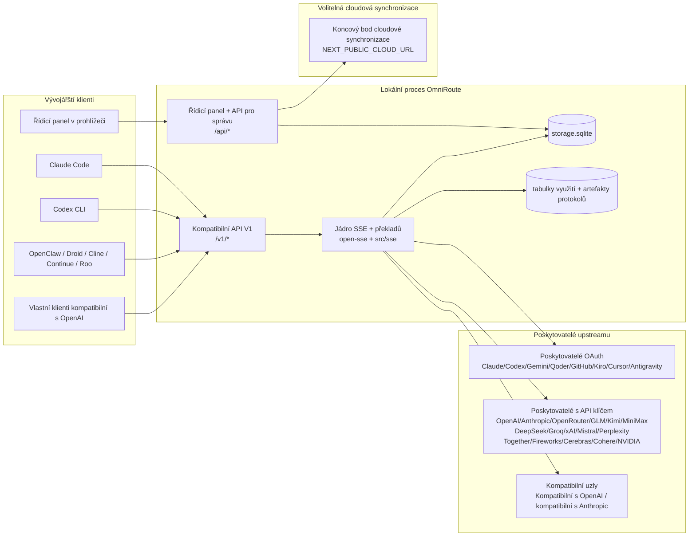
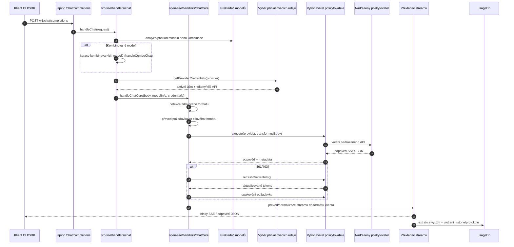
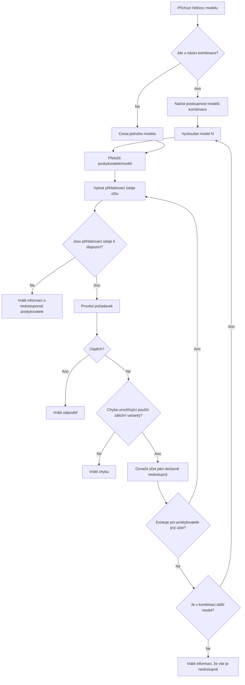
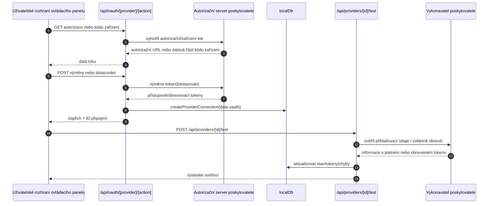
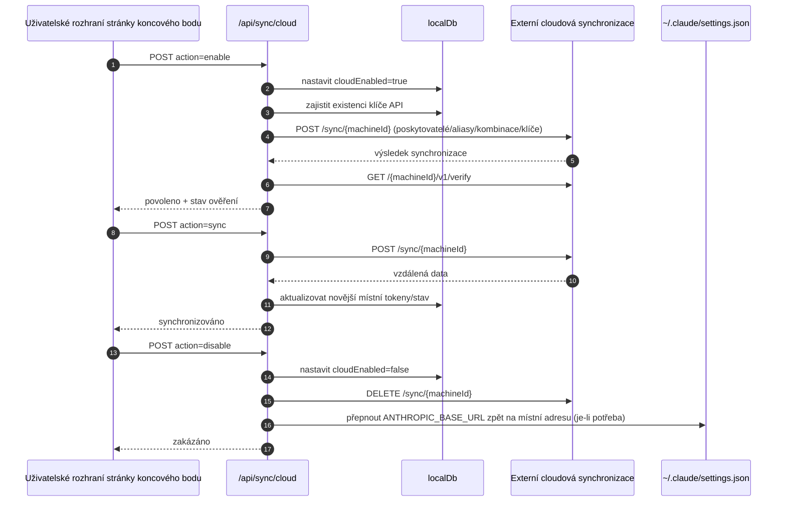
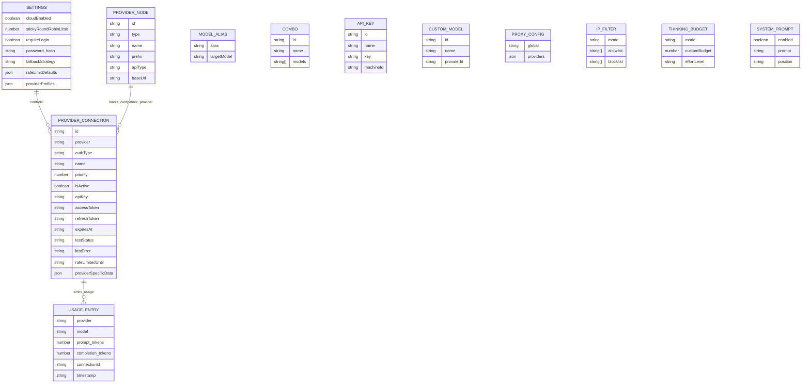
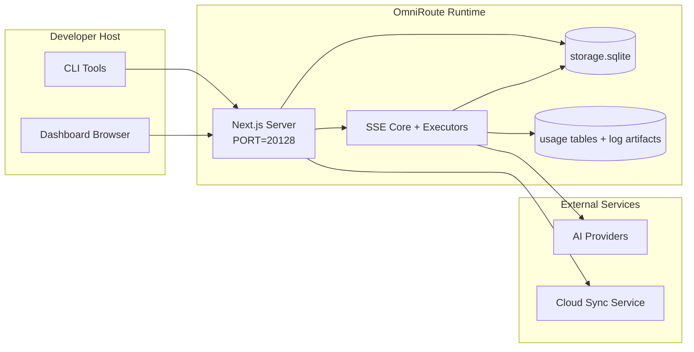

# OmniRoute Architecture (Čeština)

🌐 **Languages:** 🇺🇸 [English](../../../../architecture/ARCHITECTURE.md) · 🇪🇹 [am](../../../am/docs/architecture/ARCHITECTURE.md) · 🇸🇦 [ar](../../../ar/docs/architecture/ARCHITECTURE.md) · 🇦🇿 [az](../../../az/docs/architecture/ARCHITECTURE.md) · 🇧🇬 [bg](../../../bg/docs/architecture/ARCHITECTURE.md) · 🇧🇩 [bn](../../../bn/docs/architecture/ARCHITECTURE.md) · 🇧🇦 [bs](../../../bs/docs/architecture/ARCHITECTURE.md) · 🇩🇰 [da](../../../da/docs/architecture/ARCHITECTURE.md) · 🇩🇪 [de](../../../de/docs/architecture/ARCHITECTURE.md) · 🇬🇷 [el](../../../el/docs/architecture/ARCHITECTURE.md) · 🇪🇸 [es](../../../es/docs/architecture/ARCHITECTURE.md) · 🇪🇪 [et](../../../et/docs/architecture/ARCHITECTURE.md) · 🇮🇷 [fa](../../../fa/docs/architecture/ARCHITECTURE.md) · 🇫🇮 [fi](../../../fi/docs/architecture/ARCHITECTURE.md) · 🇫🇷 [fr](../../../fr/docs/architecture/ARCHITECTURE.md) · 🇮🇪 [ga](../../../ga/docs/architecture/ARCHITECTURE.md) · 🇮🇳 [gu](../../../gu/docs/architecture/ARCHITECTURE.md) · 🇳🇬 [ha](../../../ha/docs/architecture/ARCHITECTURE.md) · 🇮🇱 [he](../../../he/docs/architecture/ARCHITECTURE.md) · 🇮🇳 [hi](../../../hi/docs/architecture/ARCHITECTURE.md) · 🇭🇷 [hr](../../../hr/docs/architecture/ARCHITECTURE.md) · 🇭🇺 [hu](../../../hu/docs/architecture/ARCHITECTURE.md) · 🇦🇲 [hy](../../../hy/docs/architecture/ARCHITECTURE.md) · 🇮🇩 [id](../../../id/docs/architecture/ARCHITECTURE.md) · 🇳🇬 [ig](../../../ig/docs/architecture/ARCHITECTURE.md) · 🇮🇹 [it](../../../it/docs/architecture/ARCHITECTURE.md) · 🇯🇵 [ja](../../../ja/docs/architecture/ARCHITECTURE.md) · 🇬🇪 [ka](../../../ka/docs/architecture/ARCHITECTURE.md) · 🇰🇭 [km](../../../km/docs/architecture/ARCHITECTURE.md) · 🇮🇳 [kn](../../../kn/docs/architecture/ARCHITECTURE.md) · 🇰🇷 [ko](../../../ko/docs/architecture/ARCHITECTURE.md) · 🇱🇹 [lt](../../../lt/docs/architecture/ARCHITECTURE.md) · 🇱🇻 [lv](../../../lv/docs/architecture/ARCHITECTURE.md) · 🇮🇳 [ml](../../../ml/docs/architecture/ARCHITECTURE.md) · 🇮🇳 [mr](../../../mr/docs/architecture/ARCHITECTURE.md) · 🇲🇾 [ms](../../../ms/docs/architecture/ARCHITECTURE.md) · 🇲🇹 [mt](../../../mt/docs/architecture/ARCHITECTURE.md) · 🇲🇲 [my](../../../my/docs/architecture/ARCHITECTURE.md) · 🇳🇵 [ne](../../../ne/docs/architecture/ARCHITECTURE.md) · 🇳🇱 [nl](../../../nl/docs/architecture/ARCHITECTURE.md) · 🇳🇴 [no](../../../no/docs/architecture/ARCHITECTURE.md) · 🇮🇳 [or](../../../or/docs/architecture/ARCHITECTURE.md) · 🇮🇳 [pa](../../../pa/docs/architecture/ARCHITECTURE.md) · 🇵🇭 [phi](../../../phi/docs/architecture/ARCHITECTURE.md) · 🇵🇱 [pl](../../../pl/docs/architecture/ARCHITECTURE.md) · 🇵🇹 [pt](../../../pt/docs/architecture/ARCHITECTURE.md) · 🇧🇷 [pt-BR](../../../pt-BR/docs/architecture/ARCHITECTURE.md) · 🇷🇴 [ro](../../../ro/docs/architecture/ARCHITECTURE.md) · 🇷🇺 [ru](../../../ru/docs/architecture/ARCHITECTURE.md) · 🇱🇰 [si](../../../si/docs/architecture/ARCHITECTURE.md) · 🇸🇰 [sk](../../../sk/docs/architecture/ARCHITECTURE.md) · 🇸🇮 [sl](../../../sl/docs/architecture/ARCHITECTURE.md) · 🇷🇸 [sr](../../../sr/docs/architecture/ARCHITECTURE.md) · 🇸🇪 [sv](../../../sv/docs/architecture/ARCHITECTURE.md) · 🇰🇪 [sw](../../../sw/docs/architecture/ARCHITECTURE.md) · 🇮🇳 [ta](../../../ta/docs/architecture/ARCHITECTURE.md) · 🇮🇳 [te](../../../te/docs/architecture/ARCHITECTURE.md) · 🇹🇭 [th](../../../th/docs/architecture/ARCHITECTURE.md) · 🇹🇷 [tr](../../../tr/docs/architecture/ARCHITECTURE.md) · 🇺🇦 [uk-UA](../../../uk-UA/docs/architecture/ARCHITECTURE.md) · 🇵🇰 [ur](../../../ur/docs/architecture/ARCHITECTURE.md) · 🇺🇿 [uz](../../../uz/docs/architecture/ARCHITECTURE.md) · 🇻🇳 [vi](../../../vi/docs/architecture/ARCHITECTURE.md) · 🇳🇬 [yo](../../../yo/docs/architecture/ARCHITECTURE.md) · 🇨🇳 [zh-CN](../../../zh-CN/docs/architecture/ARCHITECTURE.md) · 🇹🇼 [zh-TW](../../../zh-TW/docs/architecture/ARCHITECTURE.md)

---

🌐 **Languages:** 🇺🇸 [English](../../../../architecture/ARCHITECTURE.md) · 🇪🇹 [am](../../../am/docs/architecture/ARCHITECTURE.md) · 🇸🇦 [ar](../../../ar/docs/architecture/ARCHITECTURE.md) · 🇦🇿 [az](../../../az/docs/architecture/ARCHITECTURE.md) · 🇧🇬 [bg](../../../bg/docs/architecture/ARCHITECTURE.md) · 🇧🇩 [bn](../../../bn/docs/architecture/ARCHITECTURE.md) · 🇧🇦 [bs](../../../bs/docs/architecture/ARCHITECTURE.md) · 🇩🇰 [da](../../../da/docs/architecture/ARCHITECTURE.md) · 🇩🇪 [de](../../../de/docs/architecture/ARCHITECTURE.md) · 🇬🇷 [el](../../../el/docs/architecture/ARCHITECTURE.md) · 🇪🇸 [es](../../../es/docs/architecture/ARCHITECTURE.md) · 🇪🇪 [et](../../../et/docs/architecture/ARCHITECTURE.md) · 🇮🇷 [fa](../../../fa/docs/architecture/ARCHITECTURE.md) · 🇫🇮 [fi](../../../fi/docs/architecture/ARCHITECTURE.md) · 🇫🇷 [fr](../../../fr/docs/architecture/ARCHITECTURE.md) · 🇮🇪 [ga](../../../ga/docs/architecture/ARCHITECTURE.md) · 🇮🇳 [gu](../../../gu/docs/architecture/ARCHITECTURE.md) · 🇳🇬 [ha](../../../ha/docs/architecture/ARCHITECTURE.md) · 🇮🇱 [he](../../../he/docs/architecture/ARCHITECTURE.md) · 🇮🇳 [hi](../../../hi/docs/architecture/ARCHITECTURE.md) · 🇭🇷 [hr](../../../hr/docs/architecture/ARCHITECTURE.md) · 🇭🇺 [hu](../../../hu/docs/architecture/ARCHITECTURE.md) · 🇦🇲 [hy](../../../hy/docs/architecture/ARCHITECTURE.md) · 🇮🇩 [id](../../../id/docs/architecture/ARCHITECTURE.md) · 🇳🇬 [ig](../../../ig/docs/architecture/ARCHITECTURE.md) · 🇮🇹 [it](../../../it/docs/architecture/ARCHITECTURE.md) · 🇯🇵 [ja](../../../ja/docs/architecture/ARCHITECTURE.md) · 🇬🇪 [ka](../../../ka/docs/architecture/ARCHITECTURE.md) · 🇰🇭 [km](../../../km/docs/architecture/ARCHITECTURE.md) · 🇮🇳 [kn](../../../kn/docs/architecture/ARCHITECTURE.md) · 🇰🇷 [ko](../../../ko/docs/architecture/ARCHITECTURE.md) · 🇱🇹 [lt](../../../lt/docs/architecture/ARCHITECTURE.md) · 🇱🇻 [lv](../../../lv/docs/architecture/ARCHITECTURE.md) · 🇮🇳 [ml](../../../ml/docs/architecture/ARCHITECTURE.md) · 🇮🇳 [mr](../../../mr/docs/architecture/ARCHITECTURE.md) · 🇲🇾 [ms](../../../ms/docs/architecture/ARCHITECTURE.md) · 🇲🇹 [mt](../../../mt/docs/architecture/ARCHITECTURE.md) · 🇲🇲 [my](../../../my/docs/architecture/ARCHITECTURE.md) · 🇳🇵 [ne](../../../ne/docs/architecture/ARCHITECTURE.md) · 🇳🇱 [nl](../../../nl/docs/architecture/ARCHITECTURE.md) · 🇳🇴 [no](../../../no/docs/architecture/ARCHITECTURE.md) · 🇮🇳 [or](../../../or/docs/architecture/ARCHITECTURE.md) · 🇮🇳 [pa](../../../pa/docs/architecture/ARCHITECTURE.md) · 🇵🇭 [phi](../../../phi/docs/architecture/ARCHITECTURE.md) · 🇵🇱 [pl](../../../pl/docs/architecture/ARCHITECTURE.md) · 🇵🇹 [pt](../../../pt/docs/architecture/ARCHITECTURE.md) · 🇧🇷 [pt-BR](../../../pt-BR/docs/architecture/ARCHITECTURE.md) · 🇷🇴 [ro](../../../ro/docs/architecture/ARCHITECTURE.md) · 🇷🇺 [ru](../../../ru/docs/architecture/ARCHITECTURE.md) · 🇱🇰 [si](../../../si/docs/architecture/ARCHITECTURE.md) · 🇸🇰 [sk](../../../sk/docs/architecture/ARCHITECTURE.md) · 🇸🇮 [sl](../../../sl/docs/architecture/ARCHITECTURE.md) · 🇷🇸 [sr](../../../sr/docs/architecture/ARCHITECTURE.md) · 🇸🇪 [sv](../../../sv/docs/architecture/ARCHITECTURE.md) · 🇰🇪 [sw](../../../sw/docs/architecture/ARCHITECTURE.md) · 🇮🇳 [ta](../../../ta/docs/architecture/ARCHITECTURE.md) · 🇮🇳 [te](../../../te/docs/architecture/ARCHITECTURE.md) · 🇹🇭 [th](../../../th/docs/architecture/ARCHITECTURE.md) · 🇹🇷 [tr](../../../tr/docs/architecture/ARCHITECTURE.md) · 🇺🇦 [uk-UA](../../../uk-UA/docs/architecture/ARCHITECTURE.md) · 🇵🇰 [ur](../../../ur/docs/architecture/ARCHITECTURE.md) · 🇺🇿 [uz](../../../uz/docs/architecture/ARCHITECTURE.md) · 🇻🇳 [vi](../../../vi/docs/architecture/ARCHITECTURE.md) · 🇳🇬 [yo](../../../yo/docs/architecture/ARCHITECTURE.md) · 🇨🇳 [zh-CN](../../../zh-CN/docs/architecture/ARCHITECTURE.md) · 🇹🇼 [zh-TW](../../../zh-TW/docs/architecture/ARCHITECTURE.md)

_Naposledy aktualizováno: 2026-06-28_

## Shrnutí pro vedení

OmniRoute je lokální směrovací brána a řídicí panel pro AI, vytvořené pomocí Next.js.
Poskytuje jeden koncový bod kompatibilní s OpenAI (`/v1/*`) a směruje provoz mezi více upstream poskytovateli s překladem, záložními variantami, obnovováním tokenů a sledováním využití.

Klíčové funkce:

- API rozhraní kompatibilní s OpenAI pro CLI/nástroje (355 poskytovatelů, 108 executorů)
- Překlad požadavků a odpovědí mezi formáty poskytovatelů
- Záložní varianty kombinací modelů (sekvence více modelů)
- Strukturované kroky kombinací (`provider + model + connection`) s pořadím za běhu podle `compositeTiers`
- Záložní varianty na úrovni účtů (více účtů na poskytovatele)
- Předběžná kontrola kvót a výběr účtu P2C s ohledem na kvóty v hlavní cestě chatu
- Správa připojení k poskytovatelům pomocí OAuth a API klíčů (22 modulů poskytovatelů OAuth)
- Generování embeddingů prostřednictvím `/v1/embeddings` (18 poskytovatelů)
- Generování obrázků prostřednictvím `/v1/images/generations` (10+ poskytovatelů, 20+ modelů)
- Přepis zvuku prostřednictvím `/v1/audio/transcriptions` (18 poskytovatelů)
- Převod textu na řeč prostřednictvím `/v1/audio/speech` (24 vestavěných poskytovatelů)
- Generování videa prostřednictvím `/v1/videos/generations` (ComfyUI + SD WebUI)
- Generování hudby prostřednictvím `/v1/music/generations` (ComfyUI)
- Vyhledávání na webu prostřednictvím `/v1/search` (20 poskytovatelů)
- Moderování prostřednictvím `/v1/moderations`
- Změna pořadí výsledků prostřednictvím `/v1/rerank`
- Zpracování značek pro uvažování (`<think>...</think>`) u modelů s logickým uvažováním
- Sanitizace odpovědí pro striktní kompatibilitu se sadou OpenAI SDK
- Normalizace rolí (developer→system, system→user) pro kompatibilitu mezi poskytovateli
- Převod strukturovaného výstupu (json_schema → Gemini responseSchema)
- Lokální perzistence poskytovatelů, klíčů, aliasů, kombinací, nastavení a cen (122 databázových modulů)
- Sledování využití a nákladů a protokolování požadavků
- Volitelná cloudová synchronizace pro synchronizaci mezi více zařízeními a synchronizaci stavu
- Seznam povolených/blokovaných IP adres pro řízení přístupu k API
- Správa rozpočtu pro uvažování (předání beze změny/automatický/vlastní/adaptivní)
- Globální vkládání systémového promptu
- Sledování relací a vytváření otisků
- Rozšířené omezování četnosti požadavků pro jednotlivé účty s profily specifickými pro poskytovatele
- Vzor jističe pro odolnost vůči výpadkům poskytovatelů
- Ochrana proti efektu lavinového náporu pomocí zamykání mutexem
- Deduplicační mezipaměť požadavků založená na signaturách
- Doménová vrstva: pravidla nákladů, zásady záložních variant, zásady uzamčení
- Context Relay: souhrny předání relací pro zachování kontinuity při střídání účtů
- Perzistence doménového stavu (průběžně zapisovaná mezipaměť SQLite pro záložní varianty, rozpočty, uzamčení a jističe)
- Modul zásad pro centralizované vyhodnocování požadavků (uzamčení → rozpočet → záložní varianta)
- Telemetrie požadavků s agregací latence p50/p95/p99
- Telemetrie cílů kombinací a historický stav cílů kombinací prostřednictvím `combo_execution_key` / `combo_step_id`
- ID korelace (X-Request-Id) pro komplexní trasování
- Auditní protokolování souladu s možností deaktivace pro jednotlivé API klíče
- Evaluační framework pro zajištění kvality LLM
- Řídicí panel stavu s aktuálním stavem jističů poskytovatelů
- Server MCP (110 nástrojů) se 3 transporty (stdio/SSE/Streamable HTTP)
- Server A2A (JSON-RPC 2.0 + SSE) s dovednostmi a životním cyklem úloh
- Paměťový systém (extrakce, vkládání, načítání, sumarizace)
- Systém dovedností (registr, executor, sandbox, vestavěné dovednosti)
- MITM proxy se správou certifikátů a zpracováním DNS
- Middleware chránící před vkládáním škodlivých promptů
- Pipeline komprese promptů s Caveman, RTK, skládanými pipelines, kompresními kombinacemi, jazykovými balíčky a analytikou
- Registr ACP (Agent Communication Protocol)
- Modulární poskytovatelé OAuth (22 samostatných modulů v `src/lib/oauth/providers/`)
- Skripty pro odinstalaci a úplnou odinstalaci
- Akce pro opravu prostředí OAuth
- Most WebSocket pro klienty WS kompatibilní s OpenAI (`/v1/ws`)
- Správa synchronizačních tokenů (vydávání/odvolávání, stahování konfiguračního balíčku s verzováním pomocí ETag)
- GLM Thinking (`glmt`) jako plnohodnotná předvolba poskytovatele
- Hybridní počítání tokenů (`/messages/count_tokens` na straně poskytovatele se záložním odhadem)
- Automatické předvyplnění aliasů modelů (30+ normalizací dialektů mezi proxy při spuštění)
- Bezpečné odchozí načítání s ochranou proti SSRF, blokováním privátních URL a konfigurovatelnými opakovanými pokusy
- Opakování požadavků chatu s ohledem na dobu čekání a konfigurovatelnými parametry `requestRetry` a `maxRetryIntervalSec`
- Ověření běhového prostředí pomocí Zod při spuštění
- Audit souladu v2 se stránkováním, událostmi CRUD poskytovatelů a protokolováním ověření zablokovaných kvůli SSRF

Primární běhový model:

- Trasy aplikace Next.js v `src/app/api/*` implementují jak API řídicího panelu, tak kompatibilní API
- Sdílené jádro SSE/směrování v `src/sse/*` + `open-sse/*` zajišťuje spouštění poskytovatelů, překlad, streamování, záložní varianty a využití

## Referenční diagramy

Kanonické, verzované zdrojové soubory Mermaid pro platformu v3.8.0 se nacházejí v
[`docs/diagrams/`](../diagrams/README.md). Dva z nich jsou pro orientaci uvedeny níže;
ostatní jsou odkazovány z příruček pro konkrétní oblasti.


> Zdroj: [diagrams/request-pipeline.mmd](../diagrams/request-pipeline.mmd)


> Zdroj: [diagrams/resilience-3layers.mmd](../diagrams/resilience-3layers.mmd) — odkazuje na něj také
> [RESILIENCE_GUIDE.md](./RESILIENCE_GUIDE.md) a referenční dokumentace k odolnosti v souboru `CLAUDE.md`.

## Rozsah a hranice

### Zahrnuto

- Lokální běhové prostředí brány
- Rozhraní API pro správu prostřednictvím řídicího panelu
- Ověřování u poskytovatelů a obnovování tokenů
- Překlad požadavků a streamování SSE
- Lokální stav a ukládání údajů o využití
- Volitelná orchestrace synchronizace s cloudem

### Nezahrnuto

- Implementace cloudové služby za `NEXT_PUBLIC_CLOUD_URL`
- SLA/řídicí vrstva poskytovatele mimo lokální proces
- Samotné externí binární soubory CLI (Claude CLI, Codex CLI atd.)

## Rozhraní řídicího panelu (aktuální)

Hlavní stránky v `src/app/(dashboard)/dashboard/`:

- `/dashboard` — rychlý start a přehled poskytovatelů
- `/dashboard/endpoint` — proxy koncových bodů a karty MCP, A2A a koncových bodů API
- `/dashboard/providers` — připojení k poskytovatelům a přihlašovací údaje
- `/dashboard/combos` — kombinované strategie, šablony, nástroj pro sestavení založený na krocích, pravidla směrování modelů a ručně uložené pořadí
- `/dashboard/auto-combo` — modul Auto Combo Engine: váhy hodnocení, balíčky režimů, předvolby virtuálních továren a telemetrie
- `/dashboard/costs` — agregace nákladů a přehled cen
- `/dashboard/analytics` — analýza využití, vyhodnocení a stav cílů kombinací
- `/dashboard/limits` — řízení kvót a rychlostních limitů
- `/dashboard/cli-tools` — úvodní nastavení CLI, detekce běhového prostředí a generování konfigurace
- `/dashboard/agents` — detekovaní agenti ACP a registrace vlastních agentů
- `/dashboard/cloud-agents` — úlohy agentů hostovaných v cloudu (Codex Cloud, Devin, Jules) a životní cyklus úloh
- `/dashboard/skills` — registr dovedností A2A, spouštění v sandboxu a katalog vestavěných dovedností
- `/dashboard/memory` — kontrola a načítání trvalé konverzační paměti
- `/dashboard/webhooks` — odběry odchozích webhooků, rotace tajných klíčů a statistiky opakovaných pokusů
- `/dashboard/batch` — odesílání dávkových úloh a sledování průběhu
- `/dashboard/cache` — statistiky mezipaměti pro průběžné čtení a uvažování a ovládací prvky vyprazdňování
- `/dashboard/playground` — interaktivní chatovací prostředí pro libovolnou nakonfigurovanou kombinaci či model
- `/dashboard/changelog` — prohlížeč přehledu změn v aplikaci (vykresluje `CHANGELOG.md`)
- `/dashboard/system` — diagnostika běhového prostředí, informace o verzi a rozhraní pro ověření prostředí
- `/dashboard/onboarding` — průvodce prvotním nastavením pro nové instalace
- `/dashboard/media` — prostředí pro práci s obrázky, videi a hudbou
- `/dashboard/search-tools` — testování poskytovatelů vyhledávání a historie
- `/dashboard/health` — doba provozu, jističe, rychlostní limity a relace sledované z hlediska kvót
- `/dashboard/logs` — protokoly požadavků, proxy, auditu a konzole
- `/dashboard/settings` — karty systémových nastavení (obecná nastavení, směrování, výchozí hodnoty kombinací atd.)
- `/dashboard/context/caveman` — pravidla komprese Caveman, jazykové balíčky, náhled a výstupní režim
- `/dashboard/context/rtk` — filtry výstupu příkazů RTK, náhled a nastavení bezpečnosti běhového prostředí
- `/dashboard/context/combos` — pojmenované kompresní kanály přiřazené ke směrovacím kombinacím
- `/dashboard/translator` — kontrola překladače a náhled převodu formátu požadavků
- `/dashboard/audit` — prohlížeč protokolu auditu souladu s předpisy se stránkováním a strukturovanými metadaty
- `/dashboard/usage` — prohlížeč využití jednotlivých požadavků propojený s `usage_history`
- `/dashboard/compression` — analýza a statistiky komprese a přiřazování kanálů
- `/dashboard/api-manager` — životní cyklus klíčů API a oprávnění modelů

## Kontext systému na vysoké úrovni



## Hlavní komponenty běhového prostředí

## 1) Vrstva API a směrování (trasy aplikace Next.js)

Hlavní adresáře:

- `src/app/api/v1/*` a `src/app/api/v1beta/*` pro kompatibilní API
- `src/app/api/*` pro API správy a konfigurace
- Přepisy Next v `next.config.mjs` mapují `/v1/*` na `/api/v1/*`

Důležité kompatibilní trasy:

- `src/app/api/v1/chat/completions/route.ts`
- `src/app/api/v1/messages/route.ts`
- `src/app/api/v1/responses/route.ts`
- `src/app/api/v1/models/route.ts` — zahrnuje vlastní modely s `custom: true`
- `src/app/api/v1/embeddings/route.ts` — generování embeddingů (6 poskytovatelů)
- `src/app/api/v1/images/generations/route.ts` — generování obrázků (4+ poskytovatelů včetně Antigravity/Nebius)
- `src/app/api/v1/messages/count_tokens/route.ts`
- `src/app/api/v1/providers/[provider]/chat/completions/route.ts` — vyhrazený chat pro jednotlivé poskytovatele
- `src/app/api/v1/providers/[provider]/embeddings/route.ts` — vyhrazené embeddingy pro jednotlivé poskytovatele
- `src/app/api/v1/providers/[provider]/images/generations/route.ts` — vyhrazené obrázky pro jednotlivé poskytovatele
- `src/app/api/v1beta/models/route.ts`
- `src/app/api/v1beta/models/[...path]/route.ts`

Oblasti správy:

- Ověřování/nastavení: `src/app/api/auth/*`, `src/app/api/settings/*`
- Poskytovatelé/připojení: `src/app/api/providers*`
- Uzly poskytovatelů: `src/app/api/provider-nodes*`
- Vlastní modely: `src/app/api/provider-models` (GET/POST/DELETE)
- Katalog modelů: `src/app/api/models/route.ts` (GET)
- Konfigurace proxy: `src/app/api/settings/proxy` (GET/PUT/DELETE) + `src/app/api/settings/proxy/test` (POST)
- OAuth: `src/app/api/oauth/*`
- Klíče/aliasy/kombinace/ceny: `src/app/api/keys*`, `src/app/api/models/alias`, `src/app/api/combos*`, `src/app/api/pricing`
- Využití: `src/app/api/usage/*`
- Synchronizace/cloud: `src/app/api/sync/*`, `src/app/api/cloud/*`
- Pomocné nástroje CLI: `src/app/api/cli-tools/*`
- Filtr IP adres: `src/app/api/settings/ip-filter` (GET/PUT)
- Rozpočet pro uvažování: `src/app/api/settings/thinking-budget` (GET/PUT)
- Systémová výzva: `src/app/api/settings/system-prompt` (GET/PUT)
- Komprese: `src/app/api/settings/compression`, `src/app/api/compression/*` a
  `src/app/api/context/*`
- Relace: `src/app/api/sessions` (GET)
- Omezení rychlosti: `src/app/api/rate-limits` (GET)
- Odolnost: `src/app/api/resilience` (GET/PATCH) — fronta požadavků, prodleva připojení, jistič poskytovatele, konfigurace čekání na ukončení prodlevy
- Resetování odolnosti: `src/app/api/resilience/reset` (POST) — resetování jističů poskytovatelů
- Statistiky mezipaměti: `src/app/api/cache/stats` (GET/DELETE)
- Telemetrie: `src/app/api/telemetry/summary` (GET)
- Rozpočet: `src/app/api/usage/budget` (GET/POST)
- Řetězce záložních variant: `src/app/api/fallback/chains` (GET/POST/DELETE)
- Audit souladu: `src/app/api/compliance/audit-log` (GET, se stránkováním + strukturovanými metadaty)
- Vyhodnocení: `src/app/api/evals` (GET/POST), `src/app/api/evals/[suiteId]` (GET)
- Zásady: `src/app/api/policies` (GET/POST)
- Synchronizační tokeny: `src/app/api/sync/tokens` (GET/POST), `src/app/api/sync/tokens/[id]` (GET/DELETE)
- Konfigurační balíček: `src/app/api/sync/bundle` (GET, snímek nastavení/poskytovatelů/kombinací/klíčů verzovaný pomocí ETag)
- WebSocket: `src/app/api/v1/ws/route.ts` — obslužná rutina upgradu pro klienty WS kompatibilní s OpenAI

## 2) SSE + jádro překladu

Hlavní moduly toku:

- Vstupní bod: `src/sse/handlers/chat.ts`
- Základní orchestrace: `open-sse/handlers/chatCore.ts`
- Adaptéry pro spouštění poskytovatelů: `open-sse/executors/*`
- Detekce formátu / konfigurace poskytovatele: `open-sse/services/provider.ts`
- Parsování / rozlišení modelu: `src/sse/services/model.ts`, `open-sse/services/model.ts`
- Logika záložního účtu: `open-sse/services/accountFallback.ts`
- Registr překladů: `open-sse/translator/index.ts`
- Transformace streamů: `open-sse/utils/stream.ts`, `open-sse/utils/streamHandler.ts`
- Extrakce / normalizace využití: `open-sse/utils/usageTracking.ts`
- Parser značek pro přemýšlení: `open-sse/utils/thinkTagParser.ts`
- Obsluha embeddingů: `open-sse/handlers/embeddings.ts`
- Registr poskytovatelů embeddingů: `open-sse/config/embeddingRegistry.ts`
- Obsluha generování obrázků: `open-sse/handlers/imageGeneration.ts`
- Registr poskytovatelů obrázků: `open-sse/config/imageRegistry.ts`
- Sanitizace odpovědí: `open-sse/handlers/responseSanitizer.ts`
- Normalizace rolí: `open-sse/services/roleNormalizer.ts`

Služby (obchodní logika):

- Výběr / hodnocení účtů: `open-sse/services/accountSelector.ts`
- Správa životního cyklu kontextu: `open-sse/services/contextManager.ts`
- Vynucování filtru IP adres: `open-sse/services/ipFilter.ts`
- Sledování relací: `open-sse/services/sessionManager.ts`
- Deduplikace požadavků: `open-sse/services/signatureCache.ts`
- Vkládání systémových promptů: `open-sse/services/systemPrompt.ts`
- Správa rozpočtu na přemýšlení: `open-sse/services/thinkingBudget.ts`
- Směrování modelů pomocí zástupných znaků: `open-sse/services/wildcardRouter.ts`
- Správa limitů četnosti požadavků: `open-sse/services/rateLimitManager.ts`
- Jistič: `src/shared/utils/circuitBreaker.ts`
- Předávání kontextu: `open-sse/services/contextHandoff.ts` — generování a vkládání souhrnu pro předávání kontextu ve strategii předávání kontextu
- Komprese: `open-sse/services/compression/*` — proaktivní komprese před překladem pro poskytovatele;
  zahrnuje pravidla Caveman, filtry RTK, zřetězené pipeline, kombinace komprese, statistiky a validaci
- Načítání kvóty Codex: `open-sse/services/codexQuotaFetcher.ts` — načítá kvótu Codex pro rozhodování o předávání kontextu
- Opakování zohledňující dobu blokování: `src/sse/services/cooldownAwareRetry.ts` — opakované pokusy pro jednotlivé modely s konfigurovatelnými hodnotami `requestRetry` / `maxRetryIntervalSec`
- Bezpečné odchozí načítání: `src/shared/network/safeOutboundFetch.ts` — chráněné načítání poskytovatele/modelu s ochranou proti SSRF, blokováním privátních URL, opakováním a časovým limitem
- Ochrana odchozích URL: `src/shared/network/outboundUrlGuard.ts` — ověřuje URL poskytovatelů vůči privátním rozsahům CIDR a rozsahům localhost
- Výchozí hodnoty požadavků poskytovatele: `open-sse/services/providerRequestDefaults.ts` — výchozí hodnoty `maxTokens`, `temperature`, `thinkingBudgetTokens` na úrovni poskytovatele
- Konstanty poskytovatele GLM: `open-sse/config/glmProvider.ts` — sdílené modely GLM, URL kvót, časový limit a výchozí hodnoty GLMT
- Nadřazená služba Antigravity: `open-sse/config/antigravityUpstream.ts` — základní URL a konstanty cest pro zjišťování
- Konstanty klienta Codex: `open-sse/config/codexClient.ts` — verzované hodnoty user-agent a verze klienta
- Počáteční aliasy modelů: `src/lib/modelAliasSeed.ts` — při spuštění vytvoří více než 30 aliasů dialektů napříč proxy

Moduly doménové vrstvy:

- Pravidla nákladů / rozpočty: `src/domain/costRules.ts`
- Zásady záložního postupu: `src/domain/fallbackPolicy.ts`
- Překladač kombinací: `src/domain/comboResolver.ts`
- Zásady blokování: `src/domain/lockoutPolicy.ts`
- Modul zásad: `src/domain/policyEngine.ts` — centralizované vyhodnocování v pořadí blokování → rozpočet → záložní postup
- Katalog chybových kódů: `src/shared/constants/errorCodes.ts`
- ID požadavku: `src/shared/utils/requestId.ts`
- Časový limit načítání: `src/shared/utils/fetchTimeout.ts`
- Telemetrie požadavků: `src/shared/utils/requestTelemetry.ts`
- Soulad s předpisy / audit: `src/lib/compliance/index.ts`
- Spouštěč vyhodnocení: `src/lib/evals/evalRunner.ts`
- Perzistence stavu domény: `src/lib/db/domainState.ts` — operace SQLite CRUD pro řetězce záložních postupů, rozpočty, historii nákladů, stav blokování a jističe

Moduly poskytovatelů OAuth (22 samostatných souborů v `src/lib/oauth/providers/`):

- Index registru: `src/lib/oauth/providers/index.ts`
- Jednotliví poskytovatelé: `agy.ts`, `antigravity.ts`, `claude.ts`, `cline.ts`, `codebuddy-cn.ts`, `codex.ts`, `cursor.ts`, `devin-desktop.ts`, `ghe-copilot.ts`, `github.ts`, `gitlab-duo.ts`, `grok-cli-oauth.ts`, `grok-cli.ts`, `kilocode.ts`, `kimi-coding.ts`, `kiro.ts`, `openference.ts`, `qoder.ts`, `trae.ts`, `xai-oauth.ts`, `zed-hosted.ts`, `zed.ts`
- Tenká obalová vrstva: `src/lib/oauth/providers.ts` — reexportuje z jednotlivých modulů

## 5) Vestavěné služby (v3.8.4)

OmniRoute dokáže instalovat, spravovat a směrovat požadavky na lokálně spuštěné procesy nástrojů AI
nazývané **vestavěné služby**. Dodává se jich pět: 9Router, CLIProxyAPI, Bifrost, Mux a Dario.

Vrstvy architektury:

- **Uživatelské rozhraní** (`/dashboard/providers/services`) — stránka se dvěma kartami, ovládacími prvky životního cyklu,
  živým streamováním protokolů, správou klíčů API a (pro 9Router) vestavěným nativním uživatelským rozhraním
  prostřednictvím interní reverzní proxy.
- **API** (`/api/services/{name}/*`) — 11 koncových bodů pro 9Router, 10 pro CLIProxyAPI, po 8 pro Bifrost / Mux / Dario,
  všechny klasifikované jako **LOCAL_ONLY** (pevné pravidlo č. 17). Sdílený koncový bod SSE `GET /api/services/[name]/logs`
  obsluhuje obě služby.
- **Supervizor** (`src/lib/services/`) — obecná třída `ServiceSupervisor` obaluje
  `child_process.spawn`, udržuje kruhovou vyrovnávací paměť o velikosti 5 MB pro streamování protokolů přes SSE, smyčku
  kontrol stavu, atomický zámek operací a korektní ukončení SIGTERM→SIGKILL.
  `bootstrap.ts` propojuje všechny nakonfigurované služby při spuštění procesu.
- **Poskytovatel/executor** (`open-sse/executors/ninerouter.ts`) — 9Router je zpřístupněn jako
  skutečný poskytovatel. Modely mají předponu `9router/{sub}/{model}` a každých 5 minut se synchronizují
  z koncového bodu `/v1/models` služby 9Router.

Podrobný rozbor: `docs/frameworks/EMBEDDED-SERVICES.md`

## Hlavní subsystémy (v3.8.0)

### A. Modul Auto Combo

Auto Combo dynamicky vyhodnocuje a vybírá cíle směrování v okamžiku požadavku namísto
spoléhání se na statickou definici kombinace. Zajišťuje fungování rodiny předpon modelů `auto/*`.

- Vstupní bod modulu: `open-sse/services/autoCombo/` (`autoComboEngine.ts`,
  `scoringEngine.ts`, `virtualFactory.ts`, `modePacks.ts`)
- Resolver: `src/domain/comboResolver.ts` (automatická detekce předpony `auto/`)
- Řídicí panel: `/dashboard/auto-combo`
- Telemetrie: tabulka SQLite `auto_combo_decisions`

Klíčové funkce:

- **19 strategií směrování** (prioritní, vážená, nejprve zaplnit, round-robin, P2C, náhodná,
  nejméně používaná, nákladově optimalizovaná, zohledňující reset, okno resetu, rezerva, striktně náhodná,
  **automatická**, lkgp, kontextově optimalizovaná, předávání kontextu, **fúze** a záložní cesta) —
  automatická strategie je hlavní novinkou ve v3.8.0; `fusion` (rozeslání panelu + syntéza hodnotitelem,
  `open-sse/services/fusion.ts`) je novinkou ve v3.8.36.
- **Vyhodnocování podle 16 faktorů**: kvóta, stav, převrácená hodnota nákladů, převrácená hodnota latence, vhodnost pro úlohu a
  deset dalších. Kanonická tabulka faktorů a jejich výchozích vah se nachází v
  [`docs/routing/AUTO-COMBO.md`](../routing/AUTO-COMBO.md) — její zopakování zde by
  vytvořilo druhé místo, kde by mohla zastarat.
- **Virtuální továrna** vytváří dočasné kombinace, pokud neexistuje žádná odpovídající pojmenovaná kombinace,
  přičemž kandidáty získává z aktivních a funkčních připojení poskytovatelů.
- **Automatické předpony**: `auto/coding`, `auto/cheap`, `auto/fast`, `auto/offline`,
  `auto/smart`, `auto/lkgp` — každá je založena na vyladěném profilu vah.
- **6 balíčků režimů**: `ship-fast`, `cost-saver`, `quality-first`, `offline-friendly`,
  `reliability-first` a `chaos-mode` — přednastavené konfigurace vah, které lze vyvolat z
  řídicího panelu. (Nezaměňujte s výše uvedenými předponami `auto/*`, které představují
  varianty používané v okamžiku požadavku.)

Úplné podrobnosti o algoritmu (vzorce faktorů, ladění vah) najdete v
[`docs/routing/AUTO-COMBO.md`](../routing/AUTO-COMBO.md).

### B. Cloudoví agenti

Cloud Agents sjednocuje hostované platformy agentů pro práci s kódem od třetích stran (Codex Cloud, Devin,
Jules) za jednotným životním cyklem úloh podporovaným databází. Všechny koncové body pro vytváření a kontrolu
úloh vyžadují ověření pro správu.

- Kořen modulu: `src/lib/cloudAgent/` (`baseAgent.ts`, `registry.ts`, `api.ts`,
  `types.ts`, `db.ts` a podadresáře jednotlivých agentů v `agents/`)
- Implementace jednotlivých agentů: `agents/codex/`, `agents/devin/`, `agents/jules/`
- Veřejné koncové body: `/api/v1/agents/tasks/*` (výpis/vytvoření/získání/zrušení)
- Koncové body pro správu: `/api/cloud/*` (zřizování, stav, dávkové operace)
- Řídicí panel: `/dashboard/cloud-agents`
- Úložiště: tabulka `cloud_agent_tasks`

Podrobnosti o zřizování jednotlivých agentů a specifikách OAuth najdete v
[`docs/frameworks/CLOUD_AGENT.md`](../frameworks/CLOUD_AGENT.md).

### C. Ochranná opatření

Modul ochranných opatření je vrstva middlewaru podporující opětovné načtení za běhu, která kontroluje požadavky
a odpovědi na osobní identifikační údaje, injektáž promptů a nebezpečný obrazový obsah. Porušení pravidel
okamžitě ukončí požadavek s HTTP **503** a strukturovaným kódem chyby, což
navazujícím volajícím umožňuje požadavek opakovat nebo zvolit jinou větev.

- Kořen modulu: `src/lib/guardrails/` (`base.ts`, `registry.ts`, `piiMasker.ts`,
  `promptInjection.ts`, `visionBridge.ts`, `visionBridgeHelpers.ts`)
- Opětovné načtení za běhu: registr sleduje změny konfigurace a za běhu znovu sestavuje řetězec
- Body zapojení: vstup obslužné rutiny chatu, obslužná rutina generování obrázků, sanitizér odpovědí
- Kontrakt HTTP: porušení se projeví jako `503` s `error.code = "GUARDRAIL_VIOLATION"`

Informace o tvorbě sad pravidel a ladění prahových hodnot najdete v
[`docs/security/GUARDRAILS.md`](../security/GUARDRAILS.md).

### D. Doménová vrstva

Jmenný prostor `src/domain/` centralizuje rozhodování o zásadách, takže obslužné rutiny tras nemusí
samy sestavovat logiku uzamčení/rozpočtu/záložního řešení.

- Modul zásad: `src/domain/policyEngine.ts` — jediný vstupní bod pro
  vyhodnocení před spuštěním (pořadí: uzamčení → rozpočet → záložní řešení)
- Pravidla nákladů: `src/domain/costRules.ts`
- Zásady záložního řešení: `src/domain/fallbackPolicy.ts`
- Zásady uzamčení: `src/domain/lockoutPolicy.ts`
- Směrování založené na značkách: `src/domain/tagRouter.ts`
- Resolver kombinací: `src/domain/comboResolver.ts` — převádí názvy kombinací, předpony auto/\*
  a cíle modelů se zástupnými znaky na konkrétní plány spuštění
- Propojování pravidel připojení/modelů: `src/domain/connectionModelRules.ts`
- Snímky dostupnosti modelů: `src/domain/modelAvailability.ts`
- Sledování vypršení platnosti poskytovatelů: `src/domain/providerExpiration.ts`
- Mezipaměť kvót: `src/domain/quotaCache.ts`
- Stav degradace: `src/domain/degradation.ts`
- Audit konfigurace: `src/domain/configAudit.ts`
- Generátor metadat odpovědí OmniRoute: `src/domain/omnirouteResponseMeta.ts`
- Subsystém hodnocení: `src/domain/assessment/` — úlohy pravidelného vyhodnocování

### E. Autorizační pipeline

Autorizační pipeline klasifikuje každý příchozí požadavek a před jeho
předáním aplikuje příslušný řetězec zásad.

- Vstupní bod pipeline: `src/server/authz/pipeline.ts`
- Klasifikátor požadavků: `src/server/authz/classify.ts` — rozlišuje veřejné
  trasy kompatibility od tras pro správu
- Seznam veřejných tras: `src/shared/constants/publicApiRoutes.ts`
- Zásady: `src/server/authz/policies/` — skládací predikáty
  (`requireApiKey`, `requireManagement`, `requireFreshAuth` atd.)
- Nástroje pro hlavičky: `src/server/authz/headers.ts`
- Pomocná funkce pro aserce: `src/server/authz/assertAuth.ts`
- Kontext požadavku: `src/server/authz/context.ts`

Veřejné trasy a trasy pro správu jsou striktně oddělené: API agenta/cooldownu a
změny poskytovatelů vyžadují ověření pro správu (HTTP 401, pokud chybí).

Úplná pravidla klasifikace tras naleznete v dokumentu
[`docs/architecture/AUTHZ_GUIDE.md`](./AUTHZ_GUIDE.md).

### F. FSM pracovního postupu a router zohledňující úlohy

Router řízený konečným stavovým automatem, který tvoří vrstvu nad výběrem kombinace
a směruje provoz podle zjištěné fáze pracovního postupu (plánování, provádění,
kontrola) a afinity k úlohám na pozadí.

- FSM pracovního postupu: `open-sse/services/workflowFSM.ts`
- Router zohledňující úlohy: `open-sse/services/taskAwareRouter.ts`
- Detektor úloh na pozadí: `open-sse/services/backgroundTaskDetector.ts`
- Klasifikátor záměru: `open-sse/services/intentClassifier.ts`

Přechody FSM vstupují do hodnocení Auto Combo, přičemž u úloh na
pozadí či automatizačních úloh upřednostňují levnější modely a u interaktivních
kroků plánování a kontroly výkonnější modely.

### G. Odolnost specifická pro jednotlivé poskytovatele

Několik poskytovatelů nabízí specializované moduly odolnosti a utajení, které
využívají globální vrstvy jističe, cooldownu připojení a uzamčení modelu:

- Antigravity 429 engine: `open-sse/services/antigravity429Engine.ts` (rotuje
  identitu, odstraňuje citlivé údaje z hlaviček odpovědí a prostřednictvím
  `antigravityCredits.ts`, `antigravityHeaderScrub.ts`, `antigravityHeaders.ts`,
  `antigravityIdentity.ts`, `antigravityVersion.ts` zajišťuje sledování kreditů a verzí)
- Zásady kvót ModelScope: `open-sse/services/modelscopePolicy.ts`
- Claude Code CCH (handshake kompatibilního kanálu): `open-sse/services/claudeCodeCCH.ts`,
  společně s `claudeCodeCompatible.ts`, `claudeCodeConstraints.ts`, `claudeCodeExtraRemap.ts`,
  `claudeCodeToolRemapper.ts`
- Tvarování otisku Claude Code: `open-sse/services/claudeCodeFingerprint.ts`
- Obfuskace Claude Code: `open-sse/services/claudeCodeObfuscation.ts`

Kompletní příručku k utajení a provozní pokyny naleznete v
`docs/security/STEALTH_GUIDE.md` (git; není zahrnuto do sestavení `/docs`).

### H. Webhooky, mezipaměť uvažování, mezipaměť čtení

- **Webhooky** — odchozí odesílání událostí poskytovatelů, účtů a úloh.
  - Dispečer: `src/lib/webhookDispatcher.ts`
  - Úložiště: tabulka SQLite `webhooks` (prostřednictvím `src/lib/db/webhooks.ts`)
  - Řídicí panel: `/dashboard/webhooks` (odběry, tajné klíče, historie opakovaných pokusů)
  - Taxonomii událostí a sémantiku opakovaných pokusů naleznete v dokumentu [`docs/frameworks/WEBHOOKS.md`](../frameworks/WEBHOOKS.md).
- **Mezipaměť uvažování** — opakovaně přehratelné bloky uvažování pro poskytovatele,
  kteří generují tokeny přemýšlení (Claude, GLMT atd.), aby po sobě jdoucí interakce
  nemusely uvažování opakovat.
  - Databázová vrstva: `src/lib/db/reasoningCache.ts`
  - Vrstva služeb: `open-sse/services/reasoningCache.ts`
  - Sémantiku přehrávání naleznete v dokumentu [`docs/routing/REASONING_REPLAY.md`](../routing/REASONING_REPLAY.md).
- **Mezipaměť čtení** — krátkodobá mezipaměť odpovědí, jejímž klíčem je signatura
  a která se používá ke sloučení identických opakovaných pokusů pocházejících z nefunkčních nadřazených SDK.
  - Databázová vrstva: `src/lib/db/readCache.ts`
  - Koncový bod statistik: `GET /api/cache/stats`, řídicí panel na `/dashboard/cache`

## 3) Vrstva perzistence

Primární stavová DB (SQLite):

- Základní infrastruktura: `src/lib/db/core.ts` (better-sqlite3, migrace, WAL)
- Přístup k DB: importujte přímo konkrétní moduly `src/lib/db/*` (původní sjednocující modul `localDb.ts` byl odstraněn)
- soubor: `${DATA_DIR}/storage.sqlite` (nebo `$XDG_CONFIG_HOME/omniroute/storage.sqlite`, pokud je nastaveno, jinak `~/.omniroute/storage.sqlite`)
- entity (tabulky + jmenné prostory KV): providerConnections, providerNodes, modelAliases, combos, apiKeys, settings, pricing, **customModels**, **proxyConfig**, **ipFilter**, **thinkingBudget**, **systemPrompt**

Perzistence využití:

- fasáda: `src/lib/usageDb.ts` (rozdělené moduly v `src/lib/usage/*`)
- Tabulky SQLite v `storage.sqlite`: `usage_history`, `call_logs`, `proxy_logs`
- volitelné souborové artefakty zůstávají kvůli kompatibilitě a ladění (`${DATA_DIR}/log.txt`, `${DATA_DIR}/call_logs/`, `<repo>/logs/...`)
- starší soubory JSON jsou při spuštění migrovány do SQLite, pokud existují

DB stavu domén (SQLite):

- `src/lib/db/domainState.ts` — operace CRUD pro stav domén
- Tabulky (vytvořené v `src/lib/db/core.ts`): `domain_fallback_chains`, `domain_budgets`, `domain_cost_history`, `domain_lockout_state`, `domain_circuit_breakers`
- Vzor mezipaměti s průběžným zápisem: mapy v paměti jsou za běhu autoritativní; změny se zapisují synchronně do SQLite; při studeném startu se stav obnoví z DB

## 4) Rozhraní pro ověřování a zabezpečení

- Ověřování řídicího panelu pomocí cookies: `src/proxy.ts`, `src/app/api/auth/login/route.ts`
- Generování/ověřování klíčů API: `src/shared/utils/apiKey.ts`
- Tajné údaje poskytovatelů jsou uloženy v záznamech `providerConnections`
- Podpora odchozího proxy prostřednictvím `open-sse/utils/proxyFetch.ts` (proměnné prostředí) a `open-sse/utils/networkProxy.ts` (konfigurovatelné pro jednotlivé poskytovatele nebo globálně)
- Ochrana proti SSRF / kontrola odchozích URL: `src/shared/network/outboundUrlGuard.ts` — blokuje privátní rozsahy, loopback a link-local rozsahy pro všechna volání poskytovatelů
- Ověřování běhového prostředí: `src/lib/env/runtimeEnv.ts` — schéma Zod pro všechny proměnné prostředí, jehož chyby a varování se zobrazují při spuštění
- Synchronizační tokeny: `src/lib/db/syncTokens.ts` — tokeny s omezeným rozsahem oprávnění pro koncové body stahování konfiguračních balíčků; ukládají se v tabulce SQLite `sync_tokens` (migrace `024_create_sync_tokens.sql`)
- Ověřování navázání spojení WebSocket: `src/lib/ws/handshake.ts` — ověřuje požadavky na upgrade WS pomocí klíče API nebo cookie relace

## 5) Synchronizace s cloudem

- Inicializace plánovače: `src/lib/initCloudSync.ts`, `src/shared/services/initializeCloudSync.ts`, `src/shared/services/modelSyncScheduler.ts`
- Pravidelná úloha: `src/shared/services/cloudSyncScheduler.ts`
- Pravidelná úloha: `src/shared/services/modelSyncScheduler.ts`
- Řídicí trasa: `src/app/api/sync/cloud/route.ts`

## Životní cyklus požadavku (`/v1/chat/completions`)



## Tok kombinace + záložních účtů



Rozhodování o použití záložní varianty řídí `open-sse/services/accountFallback.ts` pomocí stavových kódů a heuristik založených na chybových zprávách. Směrování kombinací přidává jednu další kontrolu: chyby 400 omezené na poskytovatele, například blokování obsahu nadřazenou službou a selhání ověření rolí, jsou považovány za selhání lokální pro daný model, takže lze stále spustit následující cíle kombinace.

## Životní cyklus úvodního nastavení OAuth a obnovení tokenů



Obnovení během živého provozu se provádí v `open-sse/handlers/chatCore.ts` prostřednictvím metody vykonavatele `refreshCredentials()`.

## Životní cyklus cloudové synchronizace (povolení / synchronizace / zakázání)



Pravidelnou synchronizaci spouští `CloudSyncScheduler`, když je cloud povolen.

## Datový model a mapa úložišť



Soubory fyzického úložiště:

- primární běhová databáze: `${DATA_DIR}/storage.sqlite`
- řádky protokolu požadavků: `${DATA_DIR}/log.txt` (artefakt pro kompatibilitu a ladění)
- archivy strukturovaných dat volání: `${DATA_DIR}/call_logs/`
- volitelné relace pro ladění překladače a požadavků: `<repo>/logs/...`

## Topologie nasazení



## Mapování modulů (zásadní pro rozhodování)

### Moduly tras a API

- `src/app/api/v1/*`, `src/app/api/v1beta/*`: API pro kompatibilitu
- `src/app/api/v1/providers/[provider]/*`: vyhrazené trasy pro jednotlivé poskytovatele (chat, vkládání, obrázky)
- `src/app/api/providers*`: CRUD poskytovatelů, ověřování a testování
- `src/app/api/provider-nodes*`: správa vlastních kompatibilních uzlů
- `src/app/api/provider-models`: správa vlastních modelů (CRUD)
- `src/app/api/models/route.ts`: API katalogu modelů (aliasy + vlastní modely)
- `src/app/api/oauth/*`: toky OAuth a kódu zařízení
- `src/app/api/keys*`: životní cyklus místních klíčů API
- `src/app/api/models/alias`: správa aliasů
- `src/app/api/combos*`: správa záložních kombinací
- `src/app/api/pricing`: přepsání cen pro výpočet nákladů
- `src/app/api/settings/proxy`: konfigurace proxy (GET/PUT/DELETE)
- `src/app/api/settings/proxy/test`: test odchozího připojení přes proxy (POST)
- `src/app/api/usage/*`: API pro využití a protokoly
- `src/app/api/sync/*` + `src/app/api/cloud/*`: cloudová synchronizace a pomocné funkce orientované na cloud
- `src/app/api/cli-tools/*`: místní nástroje pro zápis a kontrolu konfigurace CLI
- `src/app/api/settings/ip-filter`: seznam povolených/blokovaných IP adres (GET/PUT)
- `src/app/api/settings/thinking-budget`: konfigurace rozpočtu tokenů pro uvažování (GET/PUT)
- `src/app/api/settings/system-prompt`: globální systémová výzva (GET/PUT)
- `src/app/api/settings/compression`: globální nastavení komprese (GET/PUT)
- `src/app/api/compression/*`: náhled komprese, metadata pravidel a jazykové balíčky
- `src/app/api/context/caveman/config`: alias nastavení Caveman (GET/PUT)
- `src/app/api/context/rtk/*`: konfigurace RTK, katalog filtrů, testovací koncový bod a obnovení nezpracovaného výstupu
- `src/app/api/context/combos*`: CRUD kombinací komprese a přiřazení směrovacích kombinací
- `src/app/api/context/analytics`: alias analytiky komprese
- `src/app/api/sessions`: výpis aktivních relací (GET)
- `src/app/api/rate-limits`: stav omezení rychlosti pro jednotlivé účty (GET)
- `src/app/api/sync/tokens`: CRUD synchronizačních tokenů (GET/POST)
- `src/app/api/sync/tokens/[id]`: načtení/odstranění synchronizačního tokenu (GET/DELETE)
- `src/app/api/sync/bundle`: stažení konfiguračního balíčku (GET, verzování pomocí ETag)
- `src/app/api/v1/ws`: obslužná rutina upgradu WebSocket pro klienty WS kompatibilní s OpenAI

### Jádro směrování a provádění

- `src/sse/handlers/chat.ts`: analýza požadavku, zpracování kombinací a smyčka výběru účtu
- `open-sse/handlers/chatCore.ts`: překlad, předání vykonavateli, zpracování opakovaných pokusů/obnovení a nastavení streamu
- `open-sse/executors/*`: chování sítě a formátu specifické pro poskytovatele

### Registr překladů a převodníky formátů

- `open-sse/translator/index.ts`: registr překladačů a orchestrace
- Překladače požadavků: `open-sse/translator/request/*` (9 modulů — `antigravity-to-openai`, `claude-to-gemini`, `claude-to-openai`, `gemini-to-openai`, `openai-responses`, `openai-to-claude`, `openai-to-cursor`, `openai-to-gemini`, `openai-to-kiro`)
- Překladače odpovědí: `open-sse/translator/response/*` (11 modulů — `claude-to-openai`, `cursor-to-openai`, `gemini-to-claude`, `gemini-to-openai`, `kiro-to-openai`, `openai-responses`, `openai-to-antigravity`, `openai-to-claude`, `openai-to-gemini`, `openai-to-gemini-sse`, `responsesToolItem`)
- Pomocné moduly: `open-sse/translator/helpers/*` (12 modulů — `claudeHelper`, `geminiHelper`, `geminiToolsSanitizer`, `jsonUtil`, `markdownBoundary`, `maxTokensHelper`, `openaiHelper`, `responsesApiHelper`, `schemaCoercion`, `strictSystemHoist`, `toolCallHelper`, `toolCallShim`)
- Konstanty formátů: `open-sse/translator/formats.ts`
- Inicializace a registr: `open-sse/translator/bootstrap.ts`, `open-sse/translator/registry.ts`
- Pomocné moduly pro formáty obrázků: `open-sse/translator/image/`

### Perzistence

- `src/lib/db/*`: trvalá konfigurace/stav a perzistence doménových dat v SQLite
- `src/lib/db/*`: importujte konkrétní moduly přímo — bez souhrnného modulu (stará reexportní vrstva `localDb.ts` byla odstraněna)
- `src/lib/usageDb.ts`: fasáda pro historii využití/protokoly volání nad tabulkami SQLite

## Pokrytí exekutorů poskytovatelů (návrhový vzor Strategy)

Každý poskytovatel má specializovaný exekutor rozšiřující `BaseExecutor` (v `open-sse/executors/base.ts`), který zajišťuje sestavování URL, vytváření hlaviček, opakování pokusů s exponenciálním prodlužováním intervalů, hooky pro obnovení přihlašovacích údajů a orchestrační metodu `execute()`.

| Executor                  | Poskytovatel(é)                                                                                                                                            | Speciální zpracování                                                              |
| ------------------------- | ---------------------------------------------------------------------------------------------------------------------------------------------------------- | --------------------------------------------------------------------------------- |
| `DefaultExecutor`         | OpenAI, Claude, Gemini, Qwen, OpenRouter, GLM, Kimi, MiniMax, DeepSeek, Groq, xAI, Mistral, Perplexity, Together, Fireworks, Cerebras, Cohere, NVIDIA atd. | Dynamická konfigurace URL/hlaviček podle poskytovatele                            |
| `AntigravityExecutor`     | Google Antigravity                                                                                                                                         | Vlastní ID projektů/relací, zpracování Retry-After, maskování 429                 |
| `AzureOpenAIExecutor`     | Azure OpenAI                                                                                                                                               | Směrování podle nasazení, vynucení parametru dotazu api-version                   |
| `BlackboxWebExecutor`     | Blackbox AI (webový režim)                                                                                                                                 | Reverzní komunikace s webovou relací s emulací otisku TLS                         |
| `ClaudeIdentityExecutor`  | Claude.ai (cesta CCH)                                                                                                                                      | Kanály omezení a přemapování nástrojů, tvarování otisku                           |
| `CliProxyApiExecutor`     | Poskytovatelé kompatibilní s CLIProxyAPI                                                                                                                   | Vlastní zpracování ověřování a protokolu                                          |
| `CloudflareAiExecutor`    | Cloudflare Workers AI                                                                                                                                      | Vkládání ID účtu, sledování využití založené na Neurons                           |
| `CodexExecutor`           | OpenAI Codex                                                                                                                                               | Vkládá systémové instrukce, vynucuje míru úsilí při uvažování                     |
| `ChatGptWebCodexExecutor` | ChatGPT Web (Codex)                                                                                                                                        | Přemostění Responses API přes relaci prohlížeče s připnutím vlákna/tahu           |
| `CommandCodeExecutor`     | Command Code                                                                                                                                               | OAuth + rotace hlaviček pro jednotlivé relace                                     |
| `CursorExecutor`          | Cursor IDE                                                                                                                                                 | Protokol ConnectRPC, kódování Protobuf, podepisování požadavků kontrolním součtem |
| `DevinCliExecutor`        | Devin CLI                                                                                                                                                  | Přemostění životního cyklu úloh Devin prostřednictvím modulu cloudového agenta    |
| `GithubExecutor`          | GitHub Copilot                                                                                                                                             | Obnovení tokenu Copilot, hlavičky napodobující VSCode                             |
| `GitlabExecutor`          | GitLab Duo                                                                                                                                                 | GitLab OAuth + směrování v rozsahu projektu                                       |
| `GlmExecutor`             | Z.AI GLM (vč. předvolby `glmt`)                                                                                                                            | Zohlednění rozpočtu na uvažování, konstanty předvolby GLMT                        |
| `GrokWebExecutor`         | web xAI Grok                                                                                                                                               | Reverzní komunikace s webovou relací, výběr režimu (uvažování/standardní)         |
| `KieExecutor`             | KIE                                                                                                                                                        | Vlastní vydávání tokenů s rotujícími kotvami relací                               |
| `KiroExecutor`            | AWS CodeWhisperer/Kiro                                                                                                                                     | Binární formát AWS EventStream → převod na SSE                                    |
| `MuseSparkWebExecutor`    | Muse Spark (web)                                                                                                                                           | Reverzní komunikace s webovou relací s přemostěním obrazových zpráv               |
| `NlpCloudExecutor`        | NLP Cloud                                                                                                                                                  | Tvar těla požadavku specifický pro poskytovatele                                  |
| `OpenCodeExecutor`        | OpenCode                                                                                                                                                   | Nastavení poskytovatele kompatibilní s AI SDK                                     |
| `PerplexityWebExecutor`   | web Perplexity                                                                                                                                             | Reverzní komunikace s webovou relací pro pokračování chatu                        |
| `PetalsExecutor`          | Distribuovaná inference Petals                                                                                                                             | Směrování v decentralizovaném roji                                                |
| `PollinationsExecutor`    | Pollinations AI                                                                                                                                            | Není vyžadován klíč API, požadavky s omezenou frekvencí                           |
| `QoderExecutor`           | Qoder AI                                                                                                                                                   | Podpora PAT a OAuth, bezplatná úroveň s více modely                               |
| `VertexExecutor`          | Google Vertex AI                                                                                                                                           | Ověřování pomocí servisního účtu, koncové body podle regionu                      |
| `DevinDesktopExecutor`    | Devin Desktop                                                                                                                                              | Importovaný klíč API + streamování chatu přes Connect-protobuf                    |

Všichni ostatní poskytovatelé (včetně vlastních kompatibilních uzlů) používají `DefaultExecutor`.

## Matice kompatibility poskytovatelů

> **Poznámka:** Níže uvedená matice je reprezentativním vzorkem z 351 registrovaných poskytovatelů v
> OmniRoute v3.8.0. Úplný a průběžně aktualizovaný seznam naleznete v
> [`docs/reference/PROVIDER_REFERENCE.md`](../reference/PROVIDER_REFERENCE.md) (automaticky generováno) nebo ve zdroji
> pravdivých dat v `src/shared/constants/providers.ts` (ověřováno pomocí Zod při načtení).

| Poskytovatel        | Formát           | Ověřování                  | Streamování      | Bez streamování | Obnovení tokenu | API využití         |
| ------------------- | ---------------- | -------------------------- | ---------------- | --------------- | --------------- | ------------------- |
| Claude              | claude           | Klíč API / OAuth           | ✅               | ✅              | ✅              | ⚠️ Pouze správce    |
| Gemini              | gemini           | Klíč API / OAuth           | ✅               | ✅              | ✅              | ⚠️ Cloud Console    |
| Antigravity         | antigravity      | OAuth                      | ✅               | ✅              | ✅              | ✅ API úplné kvóty  |
| OpenAI              | openai           | Klíč API                   | ✅               | ✅              | ❌              | ❌                  |
| Codex               | openai-responses | OAuth                      | ✅ vynuceno      | ❌              | ✅              | ✅ Limity požadavků |
| ChatGPT Web (Codex) | openai-responses | Relace prohlížeče          | ✅ vynuceno      | ❌              | ❌              | ❌                  |
| GitHub Copilot      | openai           | OAuth + token Copilot      | ✅               | ✅              | ✅              | ✅ Snímky kvót      |
| Cursor              | cursor           | Vlastní kontrolní součet   | ✅               | ✅              | ❌              | ❌                  |
| Kiro                | kiro             | AWS SSO OIDC               | ✅ (EventStream) | ❌              | ✅              | ✅ Limity využití   |
| Qoder               | openai           | OAuth / PAT                | ✅               | ✅              | ✅              | ⚠️ Za požadavek     |
| Kilo Code           | openai           | OAuth                      | ✅               | ✅              | ✅              | ❌                  |
| Cline               | openai           | OAuth                      | ✅               | ✅              | ✅              | ❌                  |
| Kimi Coding         | openai           | OAuth                      | ✅               | ✅              | ✅              | ❌                  |
| OpenRouter          | openai           | Klíč API                   | ✅               | ✅              | ❌              | ❌                  |
| GLM/Kimi/MiniMax    | claude           | Klíč API                   | ✅               | ✅              | ❌              | ❌                  |
| DeepSeek            | openai           | Klíč API                   | ✅               | ✅              | ❌              | ❌                  |
| Groq                | openai           | Klíč API                   | ✅               | ✅              | ❌              | ❌                  |
| xAI (Grok)          | openai           | Klíč API                   | ✅               | ✅              | ❌              | ❌                  |
| Mistral             | openai           | Klíč API                   | ✅               | ✅              | ❌              | ❌                  |
| Perplexity          | openai           | Klíč API                   | ✅               | ✅              | ❌              | ❌                  |
| Together AI         | openai           | Klíč API                   | ✅               | ✅              | ❌              | ❌                  |
| Fireworks AI        | openai           | Klíč API                   | ✅               | ✅              | ❌              | ❌                  |
| Cerebras            | openai           | Klíč API                   | ✅               | ✅              | ❌              | ❌                  |
| Cohere              | openai           | Klíč API                   | ✅               | ✅              | ❌              | ❌                  |
| NVIDIA NIM          | openai           | Klíč API                   | ✅               | ✅              | ❌              | ❌                  |
| Cloudflare AI       | openai           | Token API + ID účtu        | ✅               | ✅              | ❌              | ❌                  |
| Pollinations        | openai           | Žádné (bez klíče)          | ✅               | ✅              | ❌              | ❌                  |
| Scaleway AI         | openai           | Klíč API                   | ✅               | ✅              | ❌              | ❌                  |
| LongCat             | openai           | Klíč API                   | ✅               | ✅              | ❌              | ❌                  |
| Ollama Cloud        | openai           | Klíč API (volitelný)       | ✅               | ✅              | ❌              | ❌                  |
| HuggingFace         | openai           | Klíč API                   | ✅               | ✅              | ❌              | ❌                  |
| Nebius              | openai           | Klíč API                   | ✅               | ✅              | ❌              | ❌                  |
| SiliconFlow         | openai           | Klíč API                   | ✅               | ✅              | ❌              | ❌                  |
| Hyperbolic          | openai           | Klíč API                   | ✅               | ✅              | ❌              | ❌                  |
| Vertex AI           | gemini           | Účet služby                | ✅               | ✅              | ✅              | ⚠️ Cloud Console    |
| Command Code        | openai           | OAuth                      | ✅               | ✅              | ✅              | ⚠️ Za požadavek     |
| Z.AI / GLM          | openai           | Klíč API / OAuth           | ✅               | ✅              | ❌              | ❌                  |
| GLMT (předvolba)    | claude           | Klíč API                   | ✅               | ✅              | ❌              | ⚠️ Za požadavek     |
| Kimi Coding         | openai           | OAuth / klíč API           | ✅               | ✅              | ✅              | ❌                  |
| KIE                 | openai           | Klíč API                   | ✅               | ✅              | ❌              | ❌                  |
| Devin Desktop       | openai           | Importovaný klíč API       | ✅ (Connect→SSE) | ✅              | ❌              | ⚠️ Za požadavek     |
| GitLab Duo          | openai           | OAuth (GitLab)             | ✅               | ✅              | ✅              | ❌                  |
| Devin CLI           | openai           | Místní přihlášení CLI      | ✅               | ✅              | ❌              | ✅ API úloh         |
| Codex Cloud         | openai-responses | OAuth                      | ✅               | ❌              | ✅              | ✅ Limity požadavků |
| Jules               | openai           | OAuth                      | ✅               | ✅              | ✅              | ✅ API úloh         |
| AgentRouter         | openai           | Klíč API                   | ✅               | ✅              | ❌              | ❌                  |
| Grok-Web            | openai           | Soubor cookie relace       | ✅               | ✅              | ❌              | ❌                  |
| Perplexity-Web      | openai           | Soubor cookie relace       | ✅               | ✅              | ❌              | ❌                  |
| BlackBox-Web        | openai           | Soubor cookie relace + TLS | ✅               | ✅              | ❌              | ❌                  |
| Muse-Spark-Web      | openai           | Soubor cookie relace       | ✅               | ✅              | ❌              | ❌                  |
| ModelScope          | openai           | Klíč API                   | ✅               | ✅              | ❌              | ⚠️ Zásady kvót      |
| BazaarLink          | openai           | Klíč API                   | ✅               | ✅              | ❌              | ❌                  |
| Petals              | openai           | Žádné                      | ✅               | ✅              | ❌              | ❌                  |
| Qoder               | openai           | OAuth / PAT                | ✅               | ✅              | ✅              | ⚠️ Za požadavek     |
| OpenCode (Go/Zen)   | openai           | OAuth                      | ✅               | ✅              | ✅              | ❌                  |
| CLIProxyAPI         | openai           | Vlastní                    | ✅               | ✅              | ❌              | ❌                  |

## Pokrytí převodu formátů

Detekované zdrojové formáty zahrnují:

- `openai`
- `openai-responses`
- `claude`
- `gemini`

Cílové formáty zahrnují:

- OpenAI chat/Responses
- Claude
- Gemini/Antigravity envelope
- Kiro
- Cursor

Převody používají **OpenAI jako centrální formát** — všechny převody probíhají přes OpenAI jako meziformát:

```
Zdrojový formát → OpenAI (centrální formát) → Cílový formát
```

Převody jsou vybírány dynamicky podle struktury zdrojového payloadu a cílového formátu poskytovatele.

Další vrstvy zpracování v procesu převodu:

- **Sanitizace odpovědí** — Odstraňuje nestandardní pole z odpovědí ve formátu OpenAI (streamovaných i nestreamovaných), aby byla zajištěna striktní kompatibilita se sadou SDK
- **Normalizace rolí** — Převádí `developer` → `system` pro cíle jiné než OpenAI; slučuje `system` → `user` pro modely, které odmítají systémovou roli (GLM, ERNIE)
- **Extrakce značek think** — Parsuje bloky `<think>...</think>` z obsahu do pole `reasoning_content`
- **Strukturovaný výstup** — Převádí OpenAI `response_format.json_schema` na Gemini `responseMimeType` + `responseSchema`

## Podporované koncové body API

| Koncový bod                                        | Formát               | Obslužná rutina                                                        |
| -------------------------------------------------- | -------------------- | ---------------------------------------------------------------------- |
| `POST /v1/chat/completions`                        | OpenAI Chat          | `src/sse/handlers/chat.ts`                                             |
| `POST /v1/messages`                                | Claude Messages      | Stejná obslužná rutina (automatická detekce)                           |
| `POST /v1/responses`                               | OpenAI Responses     | `open-sse/handlers/responsesHandler.ts`                                |
| `POST /v1/embeddings`                              | OpenAI Embeddings    | `open-sse/handlers/embeddings.ts`                                      |
| `GET /v1/embeddings`                               | Seznam modelů        | Trasa API                                                              |
| `POST /v1/images/generations`                      | OpenAI Images        | `open-sse/handlers/imageGeneration.ts`                                 |
| `GET /v1/images/generations`                       | Seznam modelů        | Trasa API                                                              |
| `POST /v1/providers/{provider}/chat/completions`   | OpenAI Chat          | Vyhrazený koncový bod pro každého poskytovatele s validací modelu      |
| `POST /v1/providers/{provider}/embeddings`         | OpenAI Embeddings    | Vyhrazený koncový bod pro každého poskytovatele s validací modelu      |
| `POST /v1/providers/{provider}/images/generations` | OpenAI Images        | Vyhrazený koncový bod pro každého poskytovatele s validací modelu      |
| `POST /v1/messages/count_tokens`                   | Počet tokenů Claude  | Trasa API                                                              |
| `GET /v1/models`                                   | Seznam modelů OpenAI | Trasa API (chatovací + embeddingové + obrazové + vlastní modely)       |
| `GET /api/models/catalog`                          | Katalog              | Všechny modely seskupené podle poskytovatele + typu                    |
| `POST /v1beta/models/*:streamGenerateContent`      | Nativní Gemini       | Trasa API                                                              |
| `GET/PUT/DELETE /api/settings/proxy`               | Konfigurace proxy    | Konfigurace síťové proxy                                               |
| `POST /api/settings/proxy/test`                    | Konektivita proxy    | Koncový bod pro test stavu/konektivity proxy                           |
| `GET/POST/DELETE /api/provider-models`             | Modely poskytovatelů | Metadata modelů poskytovatelů pro vlastní a spravované dostupné modely |

## Obsluha obcházení

Obsluha obcházení (`open-sse/utils/bypassHandler.ts`) zachytává známé „jednorázové“ požadavky z Claude CLI — inicializační pingy, extrakce názvů a počítání tokenů — a vrací **falešnou odpověď**, aniž by spotřebovávala tokeny nadřazeného poskytovatele. Aktivuje se pouze tehdy, když `User-Agent` obsahuje `claude-cli`.

## Protokolování požadavků a artefakty

Starší souborový protokolovač požadavků (`open-sse/utils/requestLogger.ts`) je zachován pouze kvůli
zpětné kompatibilitě. Aktuální běhový kontrakt používá:

- `APP_LOG_TO_FILE=true` pro aplikační a auditní protokoly zapisované do `<repo>/logs/`
- záznamy protokolu volání uložené v SQLite v tabulce `call_logs`
- artefakty v `${DATA_DIR}/call_logs/YYYY-MM-DD/...`, když je povolena pipeline protokolování volání

## Režimy selhání a odolnost

## 1) Dostupnost účtu/poskytovatele

- dočasné pozastavení připojení při opakovatelných selháních nadřazené služby
- přechod na záložní účet před odmítnutím požadavku
- přechod na záložní kombinaci modelu, když je aktuální cesta přes model/poskytovatele vyčerpána

## 2) Vypršení platnosti tokenu

- předběžná kontrola a obnovení s opakováním u poskytovatelů podporujících obnovení
- opakování po pokusu o obnovení při odpovědi 401/403 v hlavní cestě

## 3) Bezpečnost streamu

- řadič streamu zohledňující odpojení
- transformační stream s vyprázdněním na konci streamu a zpracováním `[DONE]`
- záložní odhad využití, když chybí metadata poskytovatele o využití

## 4) Omezená funkčnost cloudové synchronizace

- chyby synchronizace jsou hlášeny, ale místní běhové prostředí pokračuje
- plánovač obsahuje logiku podporující opakování, ale pravidelné spouštění ve výchozím nastavení aktuálně provádí synchronizaci pouze jednou

## 5) Integrita dat

- migrace schématu SQLite a mechanismy automatického upgradu při spuštění
- cesta kompatibility pro migraci ze staršího formátu JSON → SQLite

## 6) Ochrana před SSRF / odchozími URL

- `src/shared/network/outboundUrlGuard.ts` blokuje všechny soukromé, loopback a link-local cílové adresy URL dříve, než se dostanou k vykonavatelům poskytovatele
- trasy pro vyhledávání a ověřování modelů poskytovatelů používají `src/shared/network/safeOutboundFetch.ts`, který aplikuje ochranu před každým odchozím požadavkem
- chyby ochrany jsou hlášeny jako `URL_GUARD_BLOCKED` s HTTP 422 a zaznamenávány do auditní stopy souladu prostřednictvím `providerAudit.ts`

## Pozorovatelnost a provozní signály

Zdroje informací o běhovém prostředí:

- konzolové protokoly z `src/sse/utils/logger.ts`
- agregované údaje o využití pro jednotlivé požadavky v SQLite (`usage_history`, `call_logs`, `proxy_logs`)
- podrobné záznamy dat ve čtyřech fázích v SQLite (`request_detail_logs`), když je `settings.detailed_logs_enabled=true`
- textový protokol stavu požadavků v `log.txt` (volitelný/kompatibilní)
- volitelné soubory aplikačních protokolů v `logs/`, když je `APP_LOG_TO_FILE=true`
- volitelné artefakty požadavků v `${DATA_DIR}/call_logs/`, když je povolena pipeline protokolování volání
- endpointy využití pro řídicí panel (`/api/usage/*`) určené pro uživatelské rozhraní

Podrobný záznam dat požadavku ukládá až čtyři fáze dat ve formátu JSON pro každé směrované volání:

- nezpracovaný požadavek přijatý od klienta
- transformovaný požadavek skutečně odeslaný nadřazené službě
- odpověď poskytovatele rekonstruovaná jako JSON; streamované odpovědi jsou zhuštěny do závěrečného souhrnu spolu s metadaty streamu
- konečná odpověď klientovi vrácená službou OmniRoute; streamované odpovědi jsou uloženy ve stejné zhuštěné podobě souhrnu

## Hranice citlivé z hlediska zabezpečení

- Tajný klíč JWT (`JWT_SECRET`) zabezpečuje ověřování a podepisování relačních cookies řídicího panelu
- Počáteční heslo (`INITIAL_PASSWORD`) by mělo být explicitně nakonfigurováno pro prvotní zprovoznění
- Tajný klíč HMAC pro API klíče (`API_KEY_SECRET`) zabezpečuje formát generovaných lokálních API klíčů
- Tajné údaje poskytovatelů (API klíče/tokeny) jsou uloženy v lokální databázi a měly by být chráněny na úrovni souborového systému
- Koncové body cloudové synchronizace spoléhají na ověřování pomocí API klíče a sémantiku ID zařízení

## Matice prostředí a běhového prostředí

Proměnné prostředí aktivně používané kódem:

- Aplikace/ověřování: `JWT_SECRET`, `INITIAL_PASSWORD`
- Úložiště: `DATA_DIR`
- Volitelné přepsání základního umístění úložiště (Linux/macOS, když `DATA_DIR` není nastavena): `XDG_CONFIG_HOME`
- Bezpečnostní hashování: `API_KEY_SECRET`, `MACHINE_ID_SALT`
- Protokolování: `APP_LOG_TO_FILE`, `APP_LOG_RETENTION_DAYS`, `CALL_LOG_RETENTION_DAYS`
- Adresy URL synchronizace/cloudu: `NEXT_PUBLIC_BASE_URL`, `NEXT_PUBLIC_CLOUD_URL`
- Odchozí proxy: `HTTP_PROXY`, `HTTPS_PROXY`, `ALL_PROXY`, `NO_PROXY` a varianty s malými písmeny
- Příznaky funkcí SOCKS5: `ENABLE_SOCKS5_PROXY`, `NEXT_PUBLIC_ENABLE_SOCKS5_PROXY`
- Pomocné proměnné platformy/běhového prostředí (nejde o konfiguraci specifickou pro aplikaci): `APPDATA`, `NODE_ENV`, `PORT`, `HOSTNAME`

## Známé poznámky k architektuře

1. `usageDb` a `localDb` sdílejí stejné zásady pro základní adresář (`DATA_DIR` -> `XDG_CONFIG_HOME/omniroute` -> `~/.omniroute`) včetně migrace starších souborů.
2. `/api/v1/route.ts` deleguje na stejný jednotný nástroj pro sestavení katalogu, který používá `/api/v1/models` (`src/app/api/v1/models/catalog.ts`), aby se zabránilo sémantickým odchylkám.
3. Protokolovací nástroj požadavků při aktivaci zapisuje kompletní hlavičky i tělo; s adresářem protokolů zacházejte jako s citlivým.
4. Chování cloudu závisí na správné hodnotě `NEXT_PUBLIC_BASE_URL` a dostupnosti cloudového koncového bodu.
5. Adresář `open-sse/` je publikován jako **balíček pracovního prostoru npm `@omniroute/open-sse`**. Zdrojový kód jej importuje prostřednictvím `@omniroute/open-sse/...` (překládaného pomocí `transpilePackages` v Next.js). Cesty k souborům v tomto dokumentu nadále kvůli konzistenci používají název adresáře `open-sse/`.
6. Grafy v řídicím panelu používají **Recharts** (založené na SVG) pro přístupné interaktivní vizualizace analytických dat (sloupcové grafy využití modelů, tabulky rozdělení podle poskytovatelů s mírami úspěšnosti).
7. E2E testy používají **Playwright** (`tests/e2e/`) a spouštějí se pomocí `npm run test:e2e`. Jednotkové testy používají **testovací nástroj Node.js** (`tests/unit/`) a spouštějí se pomocí `npm run test:unit`. Zdrojový kód v `src/` je v jazyce **TypeScript** (`.ts`/`.tsx`); pracovní prostor `open-sse/` zůstává v jazyce JavaScript (`.js`).
8. Stránka nastavení je uspořádána do 7 karet: Obecné, Vzhled, AI, Zabezpečení, Směrování, Odolnost, Pokročilé. Stránka Odolnost konfiguruje pouze frontu požadavků, dobu zklidnění připojení, pojistku poskytovatele a chování při čekání na ukončení doby zklidnění; aktuální běhový stav pojistky se zobrazuje na stránce Stav.
9. Strategie **Context Relay** (`context-relay`) je rozdělena do dvou vrstev: `combo.ts` rozhoduje, zda má být vygenerováno předání, a `chat.ts` vloží předání po vyřešení účtu. Data předání jsou uložena v tabulce SQLite `context_handoffs`. Toto rozdělení je záměrné, protože pouze `chat.ts` ví, zda se skutečný účet změnil.
10. **Vynucování proxy** je nyní komplexní: `tokenHealthCheck.ts` určuje proxy pro každé připojení, `/api/providers/validate` používá `runWithProxyContext` a `proxyFetch.ts` používá `undici.fetch()`, aby byla zachována kompatibilita dispečeru v Node 22.
11. **Detekce zásad běhového prostředí Node.js**: `/api/settings/require-login` vrací pole `nodeVersion` a `nodeCompatible`. Přihlašovací stránka zobrazí varovný banner, pokud běhové prostředí nepatří mezi podporované bezpečné řady Node.js.

## Kontrolní seznam provozního ověření

- Sestavení ze zdrojového kódu: `npm run build`
- Sestavení Docker image: `docker build -t omniroute .`
- Spuštění služby a ověření:
- `GET /api/settings`
- `GET /api/v1/models`
- Základní cílová URL rozhraní CLI by měla být `http://<host>:20128/v1`, když `PORT=20128`
