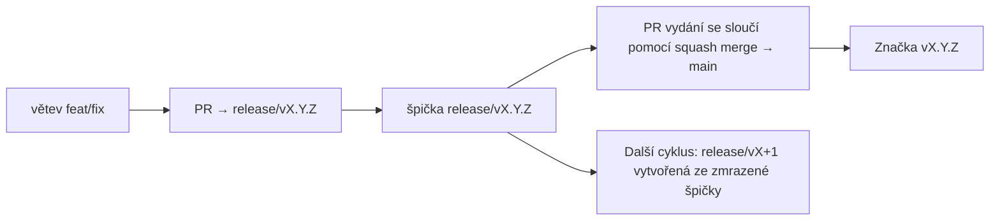

# Branching & Release Model (Čeština)

🌐 **Languages:** 🇺🇸 [English](../../../../ops/BRANCHING_MODEL.md) · 🇪🇹 [am](../../../am/docs/ops/BRANCHING_MODEL.md) · 🇸🇦 [ar](../../../ar/docs/ops/BRANCHING_MODEL.md) · 🇦🇿 [az](../../../az/docs/ops/BRANCHING_MODEL.md) · 🇧🇬 [bg](../../../bg/docs/ops/BRANCHING_MODEL.md) · 🇧🇩 [bn](../../../bn/docs/ops/BRANCHING_MODEL.md) · 🇩🇰 [da](../../../da/docs/ops/BRANCHING_MODEL.md) · 🇩🇪 [de](../../../de/docs/ops/BRANCHING_MODEL.md) · 🇬🇷 [el](../../../el/docs/ops/BRANCHING_MODEL.md) · 🇪🇸 [es](../../../es/docs/ops/BRANCHING_MODEL.md) · 🇪🇪 [et](../../../et/docs/ops/BRANCHING_MODEL.md) · 🇮🇷 [fa](../../../fa/docs/ops/BRANCHING_MODEL.md) · 🇫🇮 [fi](../../../fi/docs/ops/BRANCHING_MODEL.md) · 🇫🇷 [fr](../../../fr/docs/ops/BRANCHING_MODEL.md) · 🇮🇪 [ga](../../../ga/docs/ops/BRANCHING_MODEL.md) · 🇮🇳 [gu](../../../gu/docs/ops/BRANCHING_MODEL.md) · 🇳🇬 [ha](../../../ha/docs/ops/BRANCHING_MODEL.md) · 🇮🇱 [he](../../../he/docs/ops/BRANCHING_MODEL.md) · 🇮🇳 [hi](../../../hi/docs/ops/BRANCHING_MODEL.md) · 🇭🇷 [hr](../../../hr/docs/ops/BRANCHING_MODEL.md) · 🇭🇺 [hu](../../../hu/docs/ops/BRANCHING_MODEL.md) · 🇦🇲 [hy](../../../hy/docs/ops/BRANCHING_MODEL.md) · 🇮🇩 [id](../../../id/docs/ops/BRANCHING_MODEL.md) · 🇳🇬 [ig](../../../ig/docs/ops/BRANCHING_MODEL.md) · 🇮🇹 [it](../../../it/docs/ops/BRANCHING_MODEL.md) · 🇯🇵 [ja](../../../ja/docs/ops/BRANCHING_MODEL.md) · 🇬🇪 [ka](../../../ka/docs/ops/BRANCHING_MODEL.md) · 🇰🇭 [km](../../../km/docs/ops/BRANCHING_MODEL.md) · 🇮🇳 [kn](../../../kn/docs/ops/BRANCHING_MODEL.md) · 🇰🇷 [ko](../../../ko/docs/ops/BRANCHING_MODEL.md) · 🇱🇹 [lt](../../../lt/docs/ops/BRANCHING_MODEL.md) · 🇱🇻 [lv](../../../lv/docs/ops/BRANCHING_MODEL.md) · 🇮🇳 [ml](../../../ml/docs/ops/BRANCHING_MODEL.md) · 🇮🇳 [mr](../../../mr/docs/ops/BRANCHING_MODEL.md) · 🇲🇾 [ms](../../../ms/docs/ops/BRANCHING_MODEL.md) · 🇲🇹 [mt](../../../mt/docs/ops/BRANCHING_MODEL.md) · 🇲🇲 [my](../../../my/docs/ops/BRANCHING_MODEL.md) · 🇳🇵 [ne](../../../ne/docs/ops/BRANCHING_MODEL.md) · 🇳🇱 [nl](../../../nl/docs/ops/BRANCHING_MODEL.md) · 🇳🇴 [no](../../../no/docs/ops/BRANCHING_MODEL.md) · 🇮🇳 [or](../../../or/docs/ops/BRANCHING_MODEL.md) · 🇮🇳 [pa](../../../pa/docs/ops/BRANCHING_MODEL.md) · 🇵🇭 [phi](../../../phi/docs/ops/BRANCHING_MODEL.md) · 🇵🇱 [pl](../../../pl/docs/ops/BRANCHING_MODEL.md) · 🇵🇹 [pt](../../../pt/docs/ops/BRANCHING_MODEL.md) · 🇧🇷 [pt-BR](../../../pt-BR/docs/ops/BRANCHING_MODEL.md) · 🇷🇴 [ro](../../../ro/docs/ops/BRANCHING_MODEL.md) · 🇷🇺 [ru](../../../ru/docs/ops/BRANCHING_MODEL.md) · 🇱🇰 [si](../../../si/docs/ops/BRANCHING_MODEL.md) · 🇸🇰 [sk](../../../sk/docs/ops/BRANCHING_MODEL.md) · 🇸🇮 [sl](../../../sl/docs/ops/BRANCHING_MODEL.md) · 🇷🇸 [sr](../../../sr/docs/ops/BRANCHING_MODEL.md) · 🇸🇪 [sv](../../../sv/docs/ops/BRANCHING_MODEL.md) · 🇰🇪 [sw](../../../sw/docs/ops/BRANCHING_MODEL.md) · 🇮🇳 [ta](../../../ta/docs/ops/BRANCHING_MODEL.md) · 🇮🇳 [te](../../../te/docs/ops/BRANCHING_MODEL.md) · 🇹🇭 [th](../../../th/docs/ops/BRANCHING_MODEL.md) · 🇹🇷 [tr](../../../tr/docs/ops/BRANCHING_MODEL.md) · 🇺🇦 [uk-UA](../../../uk-UA/docs/ops/BRANCHING_MODEL.md) · 🇵🇰 [ur](../../../ur/docs/ops/BRANCHING_MODEL.md) · 🇺🇿 [uz](../../../uz/docs/ops/BRANCHING_MODEL.md) · 🇻🇳 [vi](../../../vi/docs/ops/BRANCHING_MODEL.md) · 🇳🇬 [yo](../../../yo/docs/ops/BRANCHING_MODEL.md) · 🇨🇳 [zh-CN](../../../zh-CN/docs/ops/BRANCHING_MODEL.md) · 🇹🇼 [zh-TW](../../../zh-TW/docs/ops/BRANCHING_MODEL.md)

---

OmniRoute používá model vydávání s **paralelními cykly**: vyhrazenou větev `release/vX.Y.Z`
pro aktivní cyklus, `main` pro publikovanou řadu a neměnnou značku
`vX.Y.Z`, jakmile je daný cyklus vydán. Je očekávané, že commity přibývají do `release/*` _i_ do
`main` — nejde o omyl.

Podrobnosti pro správce jsou uvedeny v `CLAUDE.md` (Pevné pravidlo č. 21) a
[RELEASE_CHECKLIST.md](./RELEASE_CHECKLIST.md). Tato stránka je veřejným
souhrnem určeným přispěvatelům.

## Stručný přehled

| Reference         | Role                                                                                 |
| ----------------- | ------------------------------------------------------------------------------------ |
| `release/vX.Y.Z`  | **Aktivní cyklus** — každodenní vývoj a slučování PR pro danou verzi                 |
| `main`            | **Publikovaná řada** — cyklus se do ní při vydání sloučí pomocí squash merge         |
| `vX.Y.Z` (značka) | **Označení vydání** — neměnný ukazatel na „to, co bylo vydáno“, vytvořený při vydání |



## Na kterou větev má můj PR cílit?

**Cilte na aktivní větev `release/vX.Y.Z` — nikoli na `main`.**

1. Najděte nejvyšší otevřenou větev `release/v*` (příklad v době psaní:
   `release/v3.8.49`).
2. Vytvořte větev z její špičky (`git fetch` + checkout / rebase na ni).
3. Otevřete PR s **base = daná `release/vX.Y.Z`**.

`main` není integrační větev pro každodenní práci. PR otevřené proti `main`
je obvykle nutné před sloučením přesměrovat.

## Zmrazení vydání (paralelní cykly)

Když probíhá finalizace vydání, otevře se označovací issue se štítkem `release-freeze`.
To **nezastavuje vývoj**:

- Zmrazená větev `release/vX.Y.Z` náleží vedoucímu daného vydání.
- Další cyklus `release/vX+1` se vytvoří ze zmrazené špičky, aby přispěvatelé mohli
  pokračovat ve slučování své práce.
- Otevřené PR, které stále cílí na zmrazenou větev, je třeba **přesměrovat** na
  aktivní (nejvyšší) větev `release/v*`.

Než budete předpokládat, že lze požadovanou větev slučovat, zkontrolujte, zda není aktivní zmrazení:

```bash
gh issue list --repo diegosouzapw/OmniRoute --label release-freeze --state open
```

Mechanismus slučování (štítek `queue` od vlastníka → Mergify) je zdokumentován v
[MERGE_TRAIN.md](./MERGE_TRAIN.md).

## Proč větev i značka?

| Artefakt         | Životnost          | Účel                                                                             |
| ---------------- | ------------------ | -------------------------------------------------------------------------------- |
| `release/vX.Y.Z` | Probíhající cyklus | Shromažďuje zkontrolované PR, udržuje CI v zeleném stavu a slouží jako základ PR |
| Značka `vX.Y.Z`  | Navždy             | Označuje přesný obsah vydaný na npm / GitHub Releases                            |

Větev je dílna; značka je zapečetěný balíček. Po sloučení do
`main` pomocí squash merge pokračuje další cyklus ve větvi `release/vX+1`, aniž by čekal na dokončení
PR předchozího vydání.

## Související dokumentace

- [CONTRIBUTING.md](../../CONTRIBUTING.md) — nastavení, testy, kontrolní seznam PR
- [RELEASE_CHECKLIST.md](./RELEASE_CHECKLIST.md) — ověření před vydáním
- [MERGE_TRAIN.md](./MERGE_TRAIN.md) — fronta slučování a záložní způsob slučování
- [RELEASE_GREEN.md](./RELEASE_GREEN.md) — udržování špičky vydání v zeleném stavu
