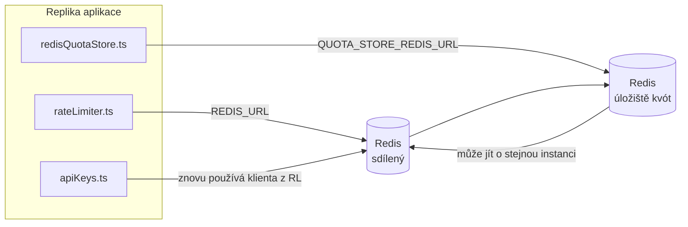

# Redis Production Configuration Guide (Čeština)

🌐 **Languages:** 🇺🇸 [English](../../../../ops/REDIS_PRODUCTION_CONFIG.md) · 🇪🇹 [am](../../../am/docs/ops/REDIS_PRODUCTION_CONFIG.md) · 🇸🇦 [ar](../../../ar/docs/ops/REDIS_PRODUCTION_CONFIG.md) · 🇦🇿 [az](../../../az/docs/ops/REDIS_PRODUCTION_CONFIG.md) · 🇧🇬 [bg](../../../bg/docs/ops/REDIS_PRODUCTION_CONFIG.md) · 🇧🇩 [bn](../../../bn/docs/ops/REDIS_PRODUCTION_CONFIG.md) · 🇧🇦 [bs](../../../bs/docs/ops/REDIS_PRODUCTION_CONFIG.md) · 🇩🇰 [da](../../../da/docs/ops/REDIS_PRODUCTION_CONFIG.md) · 🇩🇪 [de](../../../de/docs/ops/REDIS_PRODUCTION_CONFIG.md) · 🇬🇷 [el](../../../el/docs/ops/REDIS_PRODUCTION_CONFIG.md) · 🇪🇸 [es](../../../es/docs/ops/REDIS_PRODUCTION_CONFIG.md) · 🇪🇪 [et](../../../et/docs/ops/REDIS_PRODUCTION_CONFIG.md) · 🇮🇷 [fa](../../../fa/docs/ops/REDIS_PRODUCTION_CONFIG.md) · 🇫🇮 [fi](../../../fi/docs/ops/REDIS_PRODUCTION_CONFIG.md) · 🇫🇷 [fr](../../../fr/docs/ops/REDIS_PRODUCTION_CONFIG.md) · 🇮🇪 [ga](../../../ga/docs/ops/REDIS_PRODUCTION_CONFIG.md) · 🇮🇳 [gu](../../../gu/docs/ops/REDIS_PRODUCTION_CONFIG.md) · 🇳🇬 [ha](../../../ha/docs/ops/REDIS_PRODUCTION_CONFIG.md) · 🇮🇱 [he](../../../he/docs/ops/REDIS_PRODUCTION_CONFIG.md) · 🇮🇳 [hi](../../../hi/docs/ops/REDIS_PRODUCTION_CONFIG.md) · 🇭🇷 [hr](../../../hr/docs/ops/REDIS_PRODUCTION_CONFIG.md) · 🇭🇺 [hu](../../../hu/docs/ops/REDIS_PRODUCTION_CONFIG.md) · 🇦🇲 [hy](../../../hy/docs/ops/REDIS_PRODUCTION_CONFIG.md) · 🇮🇩 [id](../../../id/docs/ops/REDIS_PRODUCTION_CONFIG.md) · 🇳🇬 [ig](../../../ig/docs/ops/REDIS_PRODUCTION_CONFIG.md) · 🇮🇹 [it](../../../it/docs/ops/REDIS_PRODUCTION_CONFIG.md) · 🇯🇵 [ja](../../../ja/docs/ops/REDIS_PRODUCTION_CONFIG.md) · 🇬🇪 [ka](../../../ka/docs/ops/REDIS_PRODUCTION_CONFIG.md) · 🇰🇭 [km](../../../km/docs/ops/REDIS_PRODUCTION_CONFIG.md) · 🇮🇳 [kn](../../../kn/docs/ops/REDIS_PRODUCTION_CONFIG.md) · 🇰🇷 [ko](../../../ko/docs/ops/REDIS_PRODUCTION_CONFIG.md) · 🇱🇹 [lt](../../../lt/docs/ops/REDIS_PRODUCTION_CONFIG.md) · 🇱🇻 [lv](../../../lv/docs/ops/REDIS_PRODUCTION_CONFIG.md) · 🇮🇳 [ml](../../../ml/docs/ops/REDIS_PRODUCTION_CONFIG.md) · 🇮🇳 [mr](../../../mr/docs/ops/REDIS_PRODUCTION_CONFIG.md) · 🇲🇾 [ms](../../../ms/docs/ops/REDIS_PRODUCTION_CONFIG.md) · 🇲🇹 [mt](../../../mt/docs/ops/REDIS_PRODUCTION_CONFIG.md) · 🇲🇲 [my](../../../my/docs/ops/REDIS_PRODUCTION_CONFIG.md) · 🇳🇵 [ne](../../../ne/docs/ops/REDIS_PRODUCTION_CONFIG.md) · 🇳🇱 [nl](../../../nl/docs/ops/REDIS_PRODUCTION_CONFIG.md) · 🇳🇴 [no](../../../no/docs/ops/REDIS_PRODUCTION_CONFIG.md) · 🇮🇳 [or](../../../or/docs/ops/REDIS_PRODUCTION_CONFIG.md) · 🇮🇳 [pa](../../../pa/docs/ops/REDIS_PRODUCTION_CONFIG.md) · 🇵🇭 [phi](../../../phi/docs/ops/REDIS_PRODUCTION_CONFIG.md) · 🇵🇱 [pl](../../../pl/docs/ops/REDIS_PRODUCTION_CONFIG.md) · 🇵🇹 [pt](../../../pt/docs/ops/REDIS_PRODUCTION_CONFIG.md) · 🇧🇷 [pt-BR](../../../pt-BR/docs/ops/REDIS_PRODUCTION_CONFIG.md) · 🇷🇴 [ro](../../../ro/docs/ops/REDIS_PRODUCTION_CONFIG.md) · 🇷🇺 [ru](../../../ru/docs/ops/REDIS_PRODUCTION_CONFIG.md) · 🇱🇰 [si](../../../si/docs/ops/REDIS_PRODUCTION_CONFIG.md) · 🇸🇰 [sk](../../../sk/docs/ops/REDIS_PRODUCTION_CONFIG.md) · 🇸🇮 [sl](../../../sl/docs/ops/REDIS_PRODUCTION_CONFIG.md) · 🇷🇸 [sr](../../../sr/docs/ops/REDIS_PRODUCTION_CONFIG.md) · 🇸🇪 [sv](../../../sv/docs/ops/REDIS_PRODUCTION_CONFIG.md) · 🇰🇪 [sw](../../../sw/docs/ops/REDIS_PRODUCTION_CONFIG.md) · 🇮🇳 [ta](../../../ta/docs/ops/REDIS_PRODUCTION_CONFIG.md) · 🇮🇳 [te](../../../te/docs/ops/REDIS_PRODUCTION_CONFIG.md) · 🇹🇭 [th](../../../th/docs/ops/REDIS_PRODUCTION_CONFIG.md) · 🇹🇷 [tr](../../../tr/docs/ops/REDIS_PRODUCTION_CONFIG.md) · 🇺🇦 [uk-UA](../../../uk-UA/docs/ops/REDIS_PRODUCTION_CONFIG.md) · 🇵🇰 [ur](../../../ur/docs/ops/REDIS_PRODUCTION_CONFIG.md) · 🇺🇿 [uz](../../../uz/docs/ops/REDIS_PRODUCTION_CONFIG.md) · 🇻🇳 [vi](../../../vi/docs/ops/REDIS_PRODUCTION_CONFIG.md) · 🇳🇬 [yo](../../../yo/docs/ops/REDIS_PRODUCTION_CONFIG.md) · 🇨🇳 [zh-CN](../../../zh-CN/docs/ops/REDIS_PRODUCTION_CONFIG.md) · 🇹🇼 [zh-TW](../../../zh-TW/docs/ops/REDIS_PRODUCTION_CONFIG.md)

---

## Přehled

Redis je v OmniRoute **volitelná, měkká závislost** — pokud Redis není dostupný, aplikace se elegantně přepne na náhradní řešení v paměti. V produkčním prostředí snižuje vyladění Redis latenci u čtyř různých typů zátěže:

| Typ zátěže          | Ovladač                       | Továrna klienta                                              | Vzor klíče                                                          |
| ------------------- | ----------------------------- | ------------------------------------------------------------ | ------------------------------------------------------------------- |
| Omezení rychlosti   | `rateLimiter.ts`              | `getRedisClient()` — líně inicializovaný singleton `ioredis` | `<prefix>rl:*` atomická okna omezení rychlosti implementovaná v Lua |
| Mezipaměť ověřování | `apiKeys.ts`                  | Znovu používá klienta z `rateLimiter`                        | `<prefix>auth:api_key:<sha256>` s TTL                               |
| Úložiště kvót       | `redisQuotaStore.ts`          | Samostatný singleton `getRedisClient(url)`                   | `<prefix>quota:*` konfigurovatelné pro každou instanci              |
| Jistič zahřívání    | `redisCircuitBreakerStore.ts` | Samostatný klient v `circuitBreakerFactory.ts`               | `<prefix>warmup:cb:<connectionId>`                                  |

Všechny čtyři typy zátěže sdílejí jednu předponu jmenného prostoru, takže OmniRoute může na jedné instanci Redis (např. `127.0.0.1:6379`) koexistovat s dalšími aplikacemi. Viz [Jmenné prostory klíčů](#jmenné-prostory-klíčů).

---

## Aktuální konfigurace (výchozí hodnoty v kódu)

| Nastavení                                  | Hodnota                                                               | Kde                                                                                   |
| ------------------------------------------ | --------------------------------------------------------------------- | ------------------------------------------------------------------------------------- |
| Proměnná prostředí `REDIS_URL`             | `redis://redis:6379` (compose), volitelné                             | `rateLimiter.ts:5`, `.env.example`                                                    |
| Proměnná prostředí `REDIS_KEY_PREFIX`      | `omniroute:` (výchozí)                                                | `rateLimiter.ts`, `redisQuotaStore.ts`, `redisCircuitBreakerStore.ts`, `.env.example` |
| Proměnná prostředí `QUOTA_STORE_REDIS_URL` | samostatná, může se lišit od `REDIS_URL`                              | `quota/storeFactory.ts`                                                               |
| `QUOTA_STORE_DRIVER`                       | `"sqlite"` (výchozí), volitelně `"redis"`                             | `quota/storeFactory.ts`                                                               |
| `maxRetriesPerRequest` v ioredis           | `3`                                                                   | vytvoření klienta v `rateLimiter.ts`                                                  |
| `enableReadyCheck`                         | nenastaveno (výchozí hodnota ioredis: `true`)                         | —                                                                                     |
| `lazyConnect`                              | nenastaveno (výchozí hodnota ioredis: `false`)                        | —                                                                                     |
| `retryStrategy`                            | nenastaveno (výchozí nastavení ioredis: základ 200 ms, exponenciální) | —                                                                                     |
| TLS / heslo / index DB                     | **nenakonfigurováno**                                                 | —                                                                                     |
| Sentinel / Cluster                         | **nenakonfigurováno** — podporován je pouze samostatný uzel           | —                                                                                     |

---

## Jmenné prostory klíčů

OmniRoute sdílí instanci Redis se vším ostatním, co běží na daném hostiteli. Bez jmenného prostoru by mohlo dojít ke kolizi klíčů, jako jsou `auth:api_key:<sha256>` nebo `rl:*`, s klíči jiných aplikací používajících stejný Redis (tato instance provozuje Redis na `127.0.0.1:6379` společně s dalšími službami).

Nastavte `REDIS_KEY_PREFIX` na neprázdný řetězec, který bude přidán před **každý** klíč OmniRoute:

```bash
# .env — všechny klíče OmniRoute budou mít podobu omniroute:rl:*, omniroute:auth:*, omniroute:quota:*, omniroute:warmup:cb:*
REDIS_KEY_PREFIX=omniroute:
```

- **Výchozí hodnota:** `omniroute:` (použije se, pokud `REDIS_KEY_PREFIX` není nastaven nebo je prázdný).
- **Používá se pro:** omezovač rychlosti + mezipaměť ověřování (sdílený klient `ioredis` prostřednictvím `keyPrefix`), úložiště kvót (`KEY_PREFIX = "${REDIS_KEY_PREFIX}quota"`) a jistič zahřívání (`KEY_PREFIX = "${REDIS_KEY_PREFIX}warmup:cb:"`).
- **Změna předpony** v případě, že již v Redis existují klíče, způsobí osiření starých klíčů (jejich platnost vyprší prostřednictvím TTL / LRU). Změna je bezpečná; není nutná žádná migrace. Jedinou výjimkou je klíč jističe zahřívání pro připojení označené jako zakázané: ten se ukládá bez TTL, proto zbývající klíče vypište pomocí `redis-cli --scan --pattern '<old-prefix>warmup:cb:*'` a odstraňte je.
- **`keyPrefix` v ioredis** automaticky přidává předponu při zápisu **a** odstraňuje ji při čtení, takže kód aplikace tuto předponu nikdy nevidí.

---

## Doporučené nastavení pro produkční prostředí

### 1. Fond připojení / možnosti klienta (konstruktor `Redis` z ioredis)

Aktuální kód vytváří jedinou instanci `new Redis(url)` bez vlastních možností. Pro produkční
nasazení s více replikami předejte v kódu továrnu klientů nebo obalte `getRedisClient()`:

```typescript
const redis = new Redis(REDIS_URL, {
  maxRetriesPerRequest: null, // bez omezení počtu opakování; rozhoduje retryStrategy
  enableReadyCheck: true, // před přijetím volání ověří, že je server připraven
  lazyConnect: true, // nepřipojuje se při vytvoření; čeká na první volání
  retryStrategy: (times) => {
    if (times > 10) return null; // po 10 pokusech to vzdá → znovu se připojí později
    return Math.min(times * 200, 5000); // 200 ms, 400 ms, …, maximum 5 s
  },
  enableAutoPipelining: true, // sloučí souběžné příkazy do jednoho zápisu TCP
  keepAlive: 10000, // TCP keep-alive každých 10 s
});
```

**Klíčové kompromisy:**

- `maxRetriesPerRequest: null` + `retryStrategy` — preferované nastavení pro produkci, aby dočasné
  restarty Redis nezpůsobily okamžité selhání každého požadavku. Záložní mechanismus v paměti
  v `checkRateLimit()` zpracuje cestu při selhání.
- `lazyConnect: true` — zabraňuje tomu, aby spuštění serveru záviselo na dostupnosti Redis předtím,
  než server začne přijímat připojení.
- `enableAutoPipelining: true` — snižuje počet síťových cest při souběžných kontrolách omezení rychlosti;
  přínosné při více než 50 RPS na jednom připojení.

### 2. Konfigurace serveru Redis (`redis.conf`)

```
# Paměť
maxmemory 80%                        # ponechá prostor pro stránkovací mezipaměť OS
maxmemory-policy allkeys-lru         # při nedostatku paměti odstraní zastaralé položky ověřovací mezipaměti

# Perzistence (volitelné — OmniRoute je bezpečný při pádu i bez ní)
save 300 1                           # snímek alespoň každých 5 min, pokud se změnil ≥1 klíč
appendonly no                        # AOF není potřeba; data lze znovu vygenerovat
appendfsync no                       # žádná režie fsync (RDB je dostačující)

# Síť
timeout 0                            # žádné odpojování při nečinnosti
tcp-keepalive 300                    # keep-alive po 5 min
tcp-backlog 511                      # fronta připojení pro nárazovou zátěž

# Výkon
hz 10                                # výchozí hodnota; 100 pro provoz citlivý na latenci
activedefrag yes                     # automatická defragmentace při fragmentaci >10 %
```

**Kompromis u `maxmemory-policy allkeys-lru`:** Při nedostatku paměti mohou být položky
ověřovací mezipaměti odstraněny. Je to bezpečné — `setCachedApiKey` při nenalezení položky
mezipaměť vždy znovu naplní a záložní úložiště SQLite je autoritativní. Skript Lua omezovače
rychlosti vytváří malé klíče, které mají záměrně krátkou životnost.

### 3. Nastavení Docker Compose

Produkční konfigurace Compose (`docker-compose.prod.yml`) používá `redis:8.6.2-alpine`. Přidejte:

```yaml
redis:
  image: redis:8.6.2-alpine
  command:
    [
      "redis-server",
      "--maxmemory",
      "512mb",
      "--maxmemory-policy",
      "allkeys-lru",
      "--activedefrag",
      "yes",
      "--save",
      "300 1",
    ]
  healthcheck:
    test: ["CMD", "redis-cli", "ping"]
    interval: 10s
    timeout: 3s
    retries: 3
    start_period: 5s
```

### 4. Aspekty více instancí / škálování

**Jediný Redis pro všechny repliky** — skript Lua omezovače rychlosti závisí na jediném
autoritativním prostoru klíčů. Více instancí Redis pro jednotlivé repliky by vedlo ke ztrátě
atomicity a zdvojnásobení rozpočtu. Pro všechny repliky aplikace používejte jediný Redis
(nebo cluster Redis Sentinel s podporou převzetí služeb při selhání).

**Počet připojení:** Každá replika aplikace otevírá **2 připojení TCP** k Redis
(klient omezovače rychlosti + klient úložiště kvót). Při 10 replikách → 20 připojení, což je
hluboko pod výchozím limitem 10 tisíc připojení jedné instance Redis.

### 5. Monitorování

Zpřístupněte prostřednictvím koncového bodu kontroly stavu:

```typescript
// src/app/api/monitoring/health/route.ts již volá funkce rateLimiter
// Přidejte kontroly specifické pro Redis:
//   1. Latence PING prostřednictvím ioredis .ping()
//   2. Využití paměti prostřednictvím INFO memory
//   3. Počet připojení prostřednictvím INFO clients
//   4. Míra zásahů pro maxmemory-policy (evicted_keys / keyspace_hits)
```

Klíčové metriky ke sledování:

- **Odstraněné klíče / s** — pokud je hodnota trvale nenulová, zvyšte `maxmemory`
- **Blokovaní klienti** — nenulová hodnota značí pomalé skripty Lua nebo vysoký souběh
- **Odmítnutá připojení** — byl dosažen limit připojení; při 20 připojeních nepravděpodobné

---

## Diagram architektury



---

## Reference

| Soubor                             | Účel                                                                             |
| ---------------------------------- | -------------------------------------------------------------------------------- |
| `src/shared/utils/rateLimiter.ts`  | Primární klient Redis, skript Lua pro omezení rychlosti, záložní řešení v paměti |
| `src/lib/db/apiKeys.ts`            | Mezipaměť ověřování — přechod z Redis na SQLite                                  |
| `src/lib/quota/redisQuotaStore.ts` | Samostatný klient Redis pro volitelné úložiště kvót                              |
| `src/lib/quota/storeFactory.ts`    | Přepíná mezi ovladači kvót `sqlite` a `redis`                                    |
| `docker-compose.prod.yml`          | Produkční kontejner Redis (image `redis:8.6.2-alpine`)                           |
| `.env.example`                     | Dokumentace proměnných prostředí pro Redis                                       |
| `src/app/api/local/redis/`         | Trasy API pro orchestraci vývojového kontejneru                                  |
| `bin/cli/commands/redis.mjs`       | Příkazy CLI pro orchestraci vývojového kontejneru                                |
