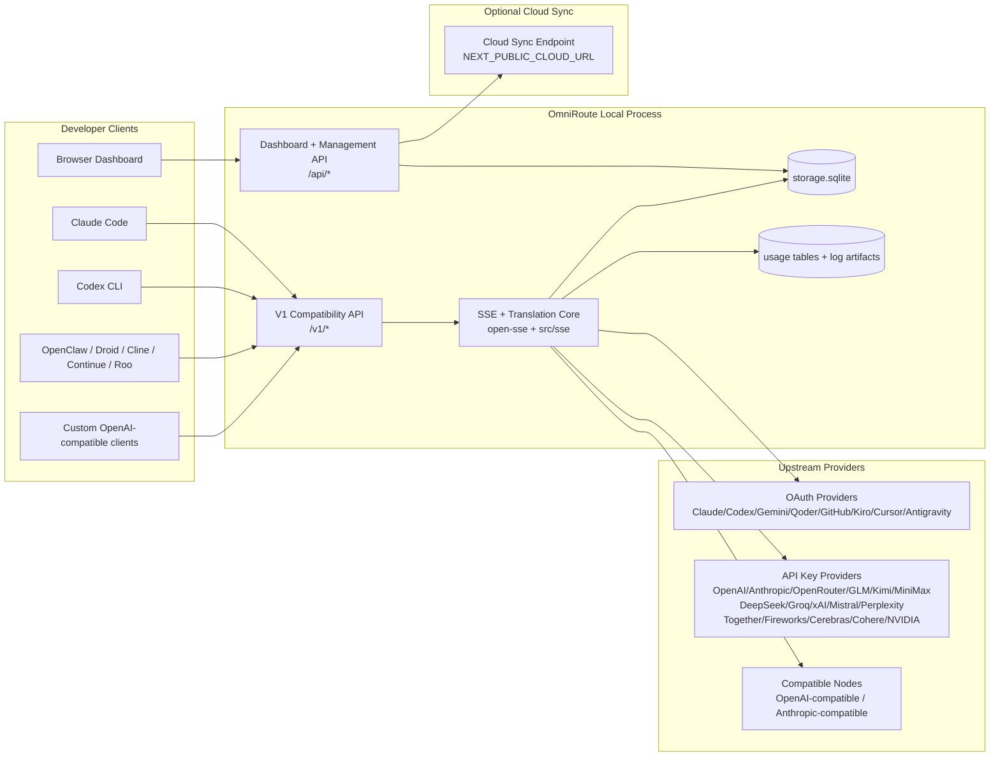
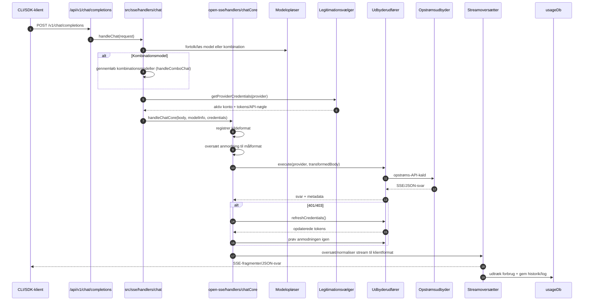
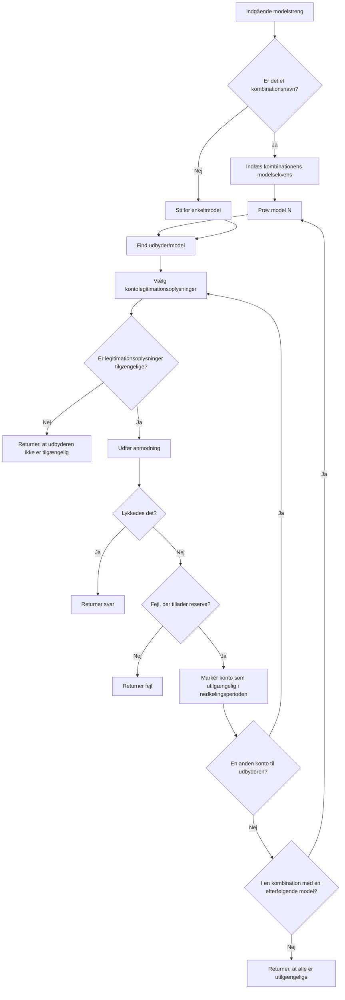
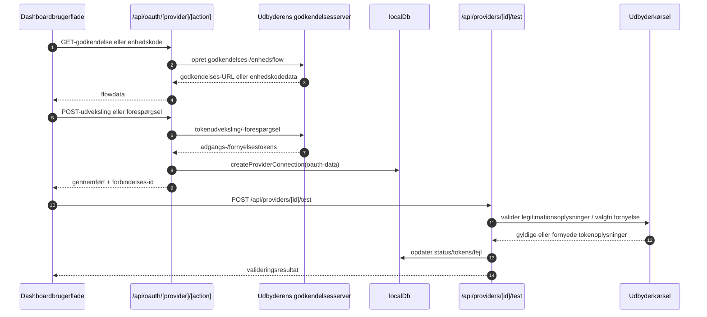
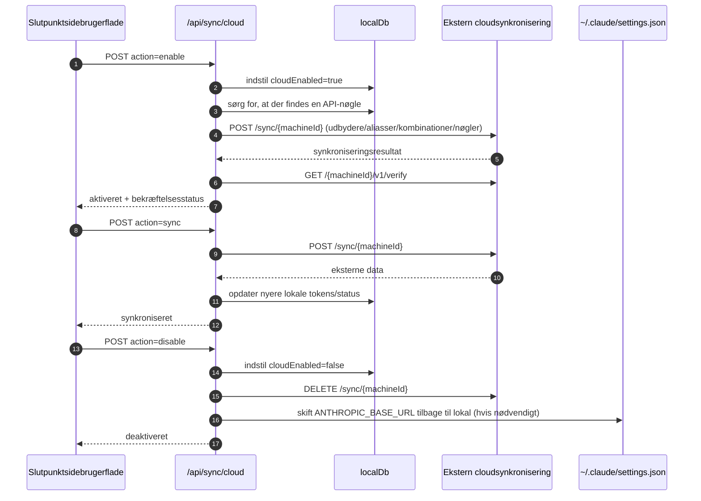
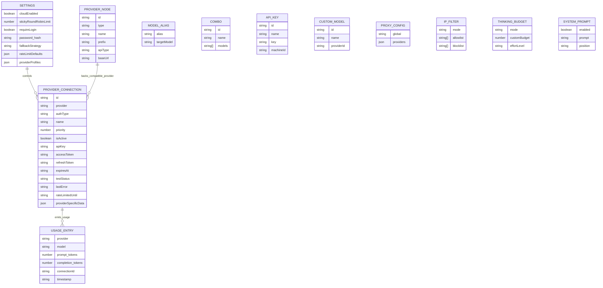
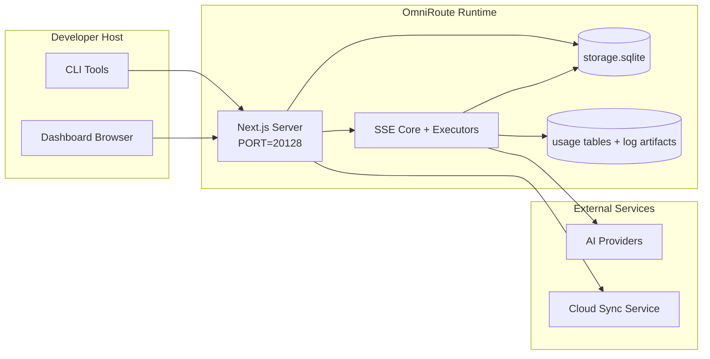

# OmniRoute Architecture (Dansk)

🌐 **Languages:** 🇺🇸 [English](../../../../architecture/ARCHITECTURE.md) · 🇪🇹 [am](../../../am/docs/architecture/ARCHITECTURE.md) · 🇸🇦 [ar](../../../ar/docs/architecture/ARCHITECTURE.md) · 🇦🇿 [az](../../../az/docs/architecture/ARCHITECTURE.md) · 🇧🇬 [bg](../../../bg/docs/architecture/ARCHITECTURE.md) · 🇧🇩 [bn](../../../bn/docs/architecture/ARCHITECTURE.md) · 🇧🇦 [bs](../../../bs/docs/architecture/ARCHITECTURE.md) · 🇨🇿 [cs](../../../cs/docs/architecture/ARCHITECTURE.md) · 🇩🇪 [de](../../../de/docs/architecture/ARCHITECTURE.md) · 🇬🇷 [el](../../../el/docs/architecture/ARCHITECTURE.md) · 🇪🇸 [es](../../../es/docs/architecture/ARCHITECTURE.md) · 🇪🇪 [et](../../../et/docs/architecture/ARCHITECTURE.md) · 🇮🇷 [fa](../../../fa/docs/architecture/ARCHITECTURE.md) · 🇫🇮 [fi](../../../fi/docs/architecture/ARCHITECTURE.md) · 🇫🇷 [fr](../../../fr/docs/architecture/ARCHITECTURE.md) · 🇮🇪 [ga](../../../ga/docs/architecture/ARCHITECTURE.md) · 🇮🇳 [gu](../../../gu/docs/architecture/ARCHITECTURE.md) · 🇳🇬 [ha](../../../ha/docs/architecture/ARCHITECTURE.md) · 🇮🇱 [he](../../../he/docs/architecture/ARCHITECTURE.md) · 🇮🇳 [hi](../../../hi/docs/architecture/ARCHITECTURE.md) · 🇭🇷 [hr](../../../hr/docs/architecture/ARCHITECTURE.md) · 🇭🇺 [hu](../../../hu/docs/architecture/ARCHITECTURE.md) · 🇦🇲 [hy](../../../hy/docs/architecture/ARCHITECTURE.md) · 🇮🇩 [id](../../../id/docs/architecture/ARCHITECTURE.md) · 🇳🇬 [ig](../../../ig/docs/architecture/ARCHITECTURE.md) · 🇮🇹 [it](../../../it/docs/architecture/ARCHITECTURE.md) · 🇯🇵 [ja](../../../ja/docs/architecture/ARCHITECTURE.md) · 🇬🇪 [ka](../../../ka/docs/architecture/ARCHITECTURE.md) · 🇰🇭 [km](../../../km/docs/architecture/ARCHITECTURE.md) · 🇮🇳 [kn](../../../kn/docs/architecture/ARCHITECTURE.md) · 🇰🇷 [ko](../../../ko/docs/architecture/ARCHITECTURE.md) · 🇱🇹 [lt](../../../lt/docs/architecture/ARCHITECTURE.md) · 🇱🇻 [lv](../../../lv/docs/architecture/ARCHITECTURE.md) · 🇮🇳 [ml](../../../ml/docs/architecture/ARCHITECTURE.md) · 🇮🇳 [mr](../../../mr/docs/architecture/ARCHITECTURE.md) · 🇲🇾 [ms](../../../ms/docs/architecture/ARCHITECTURE.md) · 🇲🇹 [mt](../../../mt/docs/architecture/ARCHITECTURE.md) · 🇲🇲 [my](../../../my/docs/architecture/ARCHITECTURE.md) · 🇳🇵 [ne](../../../ne/docs/architecture/ARCHITECTURE.md) · 🇳🇱 [nl](../../../nl/docs/architecture/ARCHITECTURE.md) · 🇳🇴 [no](../../../no/docs/architecture/ARCHITECTURE.md) · 🇮🇳 [or](../../../or/docs/architecture/ARCHITECTURE.md) · 🇮🇳 [pa](../../../pa/docs/architecture/ARCHITECTURE.md) · 🇵🇭 [phi](../../../phi/docs/architecture/ARCHITECTURE.md) · 🇵🇱 [pl](../../../pl/docs/architecture/ARCHITECTURE.md) · 🇵🇹 [pt](../../../pt/docs/architecture/ARCHITECTURE.md) · 🇧🇷 [pt-BR](../../../pt-BR/docs/architecture/ARCHITECTURE.md) · 🇷🇴 [ro](../../../ro/docs/architecture/ARCHITECTURE.md) · 🇷🇺 [ru](../../../ru/docs/architecture/ARCHITECTURE.md) · 🇱🇰 [si](../../../si/docs/architecture/ARCHITECTURE.md) · 🇸🇰 [sk](../../../sk/docs/architecture/ARCHITECTURE.md) · 🇸🇮 [sl](../../../sl/docs/architecture/ARCHITECTURE.md) · 🇷🇸 [sr](../../../sr/docs/architecture/ARCHITECTURE.md) · 🇸🇪 [sv](../../../sv/docs/architecture/ARCHITECTURE.md) · 🇰🇪 [sw](../../../sw/docs/architecture/ARCHITECTURE.md) · 🇮🇳 [ta](../../../ta/docs/architecture/ARCHITECTURE.md) · 🇮🇳 [te](../../../te/docs/architecture/ARCHITECTURE.md) · 🇹🇭 [th](../../../th/docs/architecture/ARCHITECTURE.md) · 🇹🇷 [tr](../../../tr/docs/architecture/ARCHITECTURE.md) · 🇺🇦 [uk-UA](../../../uk-UA/docs/architecture/ARCHITECTURE.md) · 🇵🇰 [ur](../../../ur/docs/architecture/ARCHITECTURE.md) · 🇺🇿 [uz](../../../uz/docs/architecture/ARCHITECTURE.md) · 🇻🇳 [vi](../../../vi/docs/architecture/ARCHITECTURE.md) · 🇳🇬 [yo](../../../yo/docs/architecture/ARCHITECTURE.md) · 🇨🇳 [zh-CN](../../../zh-CN/docs/architecture/ARCHITECTURE.md) · 🇹🇼 [zh-TW](../../../zh-TW/docs/architecture/ARCHITECTURE.md)

---

🌐 **Languages:** 🇺🇸 [English](../../../../architecture/ARCHITECTURE.md) · 🇪🇹 [am](../../../am/docs/architecture/ARCHITECTURE.md) · 🇸🇦 [ar](../../../ar/docs/architecture/ARCHITECTURE.md) · 🇦🇿 [az](../../../az/docs/architecture/ARCHITECTURE.md) · 🇧🇬 [bg](../../../bg/docs/architecture/ARCHITECTURE.md) · 🇧🇩 [bn](../../../bn/docs/architecture/ARCHITECTURE.md) · 🇧🇦 [bs](../../../bs/docs/architecture/ARCHITECTURE.md) · 🇨🇿 [cs](../../../cs/docs/architecture/ARCHITECTURE.md) · 🇩🇪 [de](../../../de/docs/architecture/ARCHITECTURE.md) · 🇬🇷 [el](../../../el/docs/architecture/ARCHITECTURE.md) · 🇪🇸 [es](../../../es/docs/architecture/ARCHITECTURE.md) · 🇪🇪 [et](../../../et/docs/architecture/ARCHITECTURE.md) · 🇮🇷 [fa](../../../fa/docs/architecture/ARCHITECTURE.md) · 🇫🇮 [fi](../../../fi/docs/architecture/ARCHITECTURE.md) · 🇫🇷 [fr](../../../fr/docs/architecture/ARCHITECTURE.md) · 🇮🇪 [ga](../../../ga/docs/architecture/ARCHITECTURE.md) · 🇮🇳 [gu](../../../gu/docs/architecture/ARCHITECTURE.md) · 🇳🇬 [ha](../../../ha/docs/architecture/ARCHITECTURE.md) · 🇮🇱 [he](../../../he/docs/architecture/ARCHITECTURE.md) · 🇮🇳 [hi](../../../hi/docs/architecture/ARCHITECTURE.md) · 🇭🇷 [hr](../../../hr/docs/architecture/ARCHITECTURE.md) · 🇭🇺 [hu](../../../hu/docs/architecture/ARCHITECTURE.md) · 🇦🇲 [hy](../../../hy/docs/architecture/ARCHITECTURE.md) · 🇮🇩 [id](../../../id/docs/architecture/ARCHITECTURE.md) · 🇳🇬 [ig](../../../ig/docs/architecture/ARCHITECTURE.md) · 🇮🇹 [it](../../../it/docs/architecture/ARCHITECTURE.md) · 🇯🇵 [ja](../../../ja/docs/architecture/ARCHITECTURE.md) · 🇬🇪 [ka](../../../ka/docs/architecture/ARCHITECTURE.md) · 🇰🇭 [km](../../../km/docs/architecture/ARCHITECTURE.md) · 🇮🇳 [kn](../../../kn/docs/architecture/ARCHITECTURE.md) · 🇰🇷 [ko](../../../ko/docs/architecture/ARCHITECTURE.md) · 🇱🇹 [lt](../../../lt/docs/architecture/ARCHITECTURE.md) · 🇱🇻 [lv](../../../lv/docs/architecture/ARCHITECTURE.md) · 🇮🇳 [ml](../../../ml/docs/architecture/ARCHITECTURE.md) · 🇮🇳 [mr](../../../mr/docs/architecture/ARCHITECTURE.md) · 🇲🇾 [ms](../../../ms/docs/architecture/ARCHITECTURE.md) · 🇲🇹 [mt](../../../mt/docs/architecture/ARCHITECTURE.md) · 🇲🇲 [my](../../../my/docs/architecture/ARCHITECTURE.md) · 🇳🇵 [ne](../../../ne/docs/architecture/ARCHITECTURE.md) · 🇳🇱 [nl](../../../nl/docs/architecture/ARCHITECTURE.md) · 🇳🇴 [no](../../../no/docs/architecture/ARCHITECTURE.md) · 🇮🇳 [or](../../../or/docs/architecture/ARCHITECTURE.md) · 🇮🇳 [pa](../../../pa/docs/architecture/ARCHITECTURE.md) · 🇵🇭 [phi](../../../phi/docs/architecture/ARCHITECTURE.md) · 🇵🇱 [pl](../../../pl/docs/architecture/ARCHITECTURE.md) · 🇵🇹 [pt](../../../pt/docs/architecture/ARCHITECTURE.md) · 🇧🇷 [pt-BR](../../../pt-BR/docs/architecture/ARCHITECTURE.md) · 🇷🇴 [ro](../../../ro/docs/architecture/ARCHITECTURE.md) · 🇷🇺 [ru](../../../ru/docs/architecture/ARCHITECTURE.md) · 🇱🇰 [si](../../../si/docs/architecture/ARCHITECTURE.md) · 🇸🇰 [sk](../../../sk/docs/architecture/ARCHITECTURE.md) · 🇸🇮 [sl](../../../sl/docs/architecture/ARCHITECTURE.md) · 🇷🇸 [sr](../../../sr/docs/architecture/ARCHITECTURE.md) · 🇸🇪 [sv](../../../sv/docs/architecture/ARCHITECTURE.md) · 🇰🇪 [sw](../../../sw/docs/architecture/ARCHITECTURE.md) · 🇮🇳 [ta](../../../ta/docs/architecture/ARCHITECTURE.md) · 🇮🇳 [te](../../../te/docs/architecture/ARCHITECTURE.md) · 🇹🇭 [th](../../../th/docs/architecture/ARCHITECTURE.md) · 🇹🇷 [tr](../../../tr/docs/architecture/ARCHITECTURE.md) · 🇺🇦 [uk-UA](../../../uk-UA/docs/architecture/ARCHITECTURE.md) · 🇵🇰 [ur](../../../ur/docs/architecture/ARCHITECTURE.md) · 🇺🇿 [uz](../../../uz/docs/architecture/ARCHITECTURE.md) · 🇻🇳 [vi](../../../vi/docs/architecture/ARCHITECTURE.md) · 🇳🇬 [yo](../../../yo/docs/architecture/ARCHITECTURE.md) · 🇨🇳 [zh-CN](../../../zh-CN/docs/architecture/ARCHITECTURE.md) · 🇹🇼 [zh-TW](../../../zh-TW/docs/architecture/ARCHITECTURE.md)

_Senest opdateret: 2026-06-28_

## Resumé

OmniRoute er en lokal AI-routinggateway og et dashboard bygget på Next.js.
Den tilbyder ét enkelt OpenAI-kompatibelt slutpunkt (`/v1/*`) og dirigerer trafik på tværs af flere upstream-udbydere med oversættelse, fallback, tokenfornyelse og brugsregistrering.

Kernefunktioner:

- OpenAI-kompatibel API-grænseflade til CLI/værktøjer (355 udbydere, 108 eksekveringskomponenter)
- Oversættelse af anmodninger/svar på tværs af udbyderformater
- Fallback for modelkombinationer (sekvens med flere modeller)
- Strukturerede kombinationstrin (`provider + model + connection`) med runtime-rækkefølge baseret på `compositeTiers`
- Fallback på kontoniveau (flere konti pr. udbyder)
- Forhåndskontrol af kvoter og kvotebevidst P2C-kontovalg i det primære chatforløb
- Administration af udbyderforbindelser via OAuth og API-nøgler (22 OAuth-udbydermoduler)
- Generering af embeddings via `/v1/embeddings` (18 udbydere)
- Billedgenerering via `/v1/images/generations` (10+ udbydere, 20+ modeller)
- Lydtransskription via `/v1/audio/transcriptions` (18 udbydere)
- Tekst-til-tale via `/v1/audio/speech` (24 indbyggede udbydere)
- Videogenerering via `/v1/videos/generations` (ComfyUI + SD WebUI)
- Musikgenerering via `/v1/music/generations` (ComfyUI)
- Websøgning via `/v1/search` (20 udbydere)
- Moderering via `/v1/moderations`
- Genrangering via `/v1/rerank`
- Fortolkning af tænkningstags (`<think>...</think>`) til ræsonneringsmodeller
- Sanitering af svar med henblik på streng kompatibilitet med OpenAI SDK
- Rollenormalisering (developer→system, system→user) med henblik på kompatibilitet på tværs af udbydere
- Konvertering af struktureret output (json_schema → Gemini responseSchema)
- Lokal lagring af udbydere, nøgler, aliasser, kombinationer, indstillinger og priser (122 DB-moduler)
- Sporing af brug/omkostninger og logning af anmodninger
- Valgfri cloudsynkronisering til synkronisering af flere enheder/tilstand
- IP-tilladelsesliste/blokeringsliste til adgangskontrol for API'et
- Administration af tænkningsbudget (passthrough/automatisk/brugerdefineret/adaptivt)
- Global injektion af systemprompt
- Sessionssporing og fingeraftryksgenerering
- Forbedret hastighedsbegrænsning pr. konto med udbyderspecifikke profiler
- Circuit breaker-mønster til robusthed over for udbyderfejl
- Beskyttelse mod thundering herd-problemer med mutex-låsning
- Signaturbaseret deduplikeringscache for anmodninger
- Domænelag: omkostningsregler, fallback-politik, lockout-politik
- Context Relay: oversigter over sessionsoverdragelse for kontinuitet ved kontorotation
- Lagring af domænetilstand (SQLite-write-through-cache til fallbacks, budgetter, lockouts og circuit breakers)
- Politikmotor til centraliseret evaluering af anmodninger (lockout → budget → fallback)
- Anmodningstelemetri med aggregering af p50/p95/p99-latenstid
- Telemetri for kombinationsmål og historisk tilstand for kombinationsmål via `combo_execution_key` / `combo_step_id`
- Korrelations-id (X-Request-Id) til end-to-end-sporing
- Logning af compliance-revision med mulighed for fravalg pr. API-nøgle
- Evalueringsframework til kvalitetssikring af LLM'er
- Tilstandsdashboard med realtidsstatus for udbydernes circuit breakers
- MCP-server (110 værktøjer) med 3 transportmekanismer (stdio/SSE/Streamable HTTP)
- A2A-server (JSON-RPC 2.0 + SSE) med færdigheder og opgavelivscyklus
- Hukommelsessystem (udtrækning, injektion, hentning, opsummering)
- Færdighedssystem (register, eksekveringskomponent, sandbox, indbyggede færdigheder)
- MITM-proxy med certifikatadministration og DNS-håndtering
- Middleware til beskyttelse mod promptinjektion
- Pipeline til promptkomprimering med Caveman, RTK, stablede pipelines, komprimeringskombinationer, sprogpakker og analyse
- ACP-register (Agent Communication Protocol)
- Modulære OAuth-udbydere (22 individuelle moduler under `src/lib/oauth/providers/`)
- Scripts til afinstallation/fuldstændig afinstallation
- Handling til reparation af OAuth-miljøet
- WebSocket-bro til OpenAI-kompatible WS-klienter (`/v1/ws`)
- Administration af synkroniseringstokens (udstedelse/tilbagekaldelse, download af ETag-versioneret konfigurationspakke)
- GLM Thinking (`glmt`) som førsteklasses udbyderforudindstilling
- Hybrid tokenoptælling (udbyderspecifik `/messages/count_tokens` med estimering som fallback)
- Automatisk oprettelse af modelaliasser (30+ normaliseringer på tværs af proxy-dialekter ved opstart)
- Sikker udgående hentning med SSRF-beskyttelse, blokering af private URL'er og konfigurerbare genforsøg
- Cooldown-bevidste genforsøg for chat med konfigurerbare `requestRetry` og `maxRetryIntervalSec`
- Validering af runtime-miljøet med Zod ved opstart
- Compliance-revision v2 med paginering, CRUD-hændelser for udbydere og valideringslogning af SSRF-blokeringer

Primær runtime-model:

- Next.js-app-ruter under `src/app/api/*` implementerer både dashboard-API'er og kompatibilitets-API'er
- En fælles SSE-/routingkerne i `src/sse/*` + `open-sse/*` håndterer udbydereksekvering, oversættelse, streaming, fallback og brug

## Referencediagrammer

Kanoniske, versionsstyrede Mermaid-kilder til v3.8.0-platformen findes i
[`docs/diagrams/`](../diagrams/README.md). To af dem er gengivet nedenfor som orientering;
resten er linket fra deres domænespecifikke vejledninger.


> Kilde: [diagrams/request-pipeline.mmd](../diagrams/request-pipeline.mmd)


> Kilde: [diagrams/resilience-3layers.mmd](../diagrams/resilience-3layers.mmd) — også linket fra
> [RESILIENCE_GUIDE.md](./RESILIENCE_GUIDE.md) og resiliensreferencen i `CLAUDE.md`.

## Omfang og afgrænsninger

### Omfattet

- Lokal gateway-runtime
- API'er til administration af dashboardet
- Udbydergodkendelse og opdatering af tokens
- Oversættelse af anmodninger og SSE-streaming
- Lokal tilstand og persistens af forbrug
- Valgfri orkestrering af cloudsynkronisering

### Ikke omfattet

- Implementering af cloudtjenesten bag `NEXT_PUBLIC_CLOUD_URL`
- Udbyderens SLA/kontrolplan uden for den lokale proces
- Selve de eksterne CLI-binærfiler (Claude CLI, Codex CLI osv.)

## Dashboardets grænseflade (aktuel)

Hovedsider under `src/app/(dashboard)/dashboard/`:

- `/dashboard` — hurtig start og oversigt over udbydere
- `/dashboard/endpoint` — endpoint-proxy samt faner til MCP, A2A og API-endpoints
- `/dashboard/providers` — udbyderforbindelser og legitimationsoplysninger
- `/dashboard/combos` — kombinationsstrategier, skabeloner, trinbaseret builder, regler for modelrouting og manuelt persisteret rækkefølge
- `/dashboard/auto-combo` — Auto Combo Engine: scoringsvægte, tilstandspakker, virtuelle fabriksforudindstillinger og telemetri
- `/dashboard/costs` — aggregering af omkostninger og synlighed af priser
- `/dashboard/analytics` — forbrugsanalyse, evalueringer og tilstand for kombinationsmål
- `/dashboard/limits` — kvote- og hastighedskontroller
- `/dashboard/cli-tools` — CLI-introduktion, runtime-registrering og generering af konfiguration
- `/dashboard/agents` — registrerede ACP-agenter og registrering af brugerdefinerede agenter
- `/dashboard/cloud-agents` — cloudhostede agentopgaver (Codex Cloud, Devin, Jules) og opgavernes livscyklus
- `/dashboard/skills` — A2A-kompetenceregister, sandbox-kørsel og indbygget kompetencekatalog
- `/dashboard/memory` — inspektion og hentning af vedvarende samtalehukommelse
- `/dashboard/webhooks` — udgående webhook-abonnementer, rotation af hemmeligheder og statistik over genforsøg
- `/dashboard/batch` — indsendelse af batchjob og status
- `/dashboard/cache` — statistik for read-through-cache og ræsonneringscache samt kontroller til rydning
- `/dashboard/playground` — interaktiv chatlegeplads med enhver konfigureret kombination/model
- `/dashboard/changelog` — changelog-visning i appen (renderer `CHANGELOG.md`)
- `/dashboard/system` — runtime-diagnosticering, versionsoplysninger og grænseflade til validering af miljøet
- `/dashboard/onboarding` — opsætningsguide til nye installationers første kørsel
- `/dashboard/media` — legeplads til billeder, video og musik
- `/dashboard/search-tools` — test af søgeudbydere og historik
- `/dashboard/health` — oppetid, circuit breakers, hastighedsgrænser og kvoteovervågede sessioner
- `/dashboard/logs` — anmodnings-, proxy-, revisions- og konsollogfiler
- `/dashboard/settings` — faner med systemindstillinger (generelt, routing, standardværdier for kombinationer osv.)
- `/dashboard/context/caveman` — Caveman-komprimeringsregler, sprogpakker, forhåndsvisning og outputtilstand
- `/dashboard/context/rtk` — RTK-filtre til kommandooutput, forhåndsvisning og sikkerhedsindstillinger for runtime
- `/dashboard/context/combos` — navngivne komprimeringspipelines, der er tildelt routingkombinationer
- `/dashboard/translator` — inspektion af oversætteren og forhåndsvisning af konvertering af anmodningsformater
- `/dashboard/audit` — browser til compliance-revisionslogfiler med paginering og strukturerede metadata
- `/dashboard/usage` — browser til forbrug pr. anmodning knyttet til `usage_history`
- `/dashboard/compression` — komprimeringsanalyse, statistik og tildeling af pipelines
- `/dashboard/api-manager` — API-nøglers livscyklus og modeltilladelser

## Systemkontekst på højt niveau



## Centrale runtime-komponenter

## 1) API- og routinglag (Next.js App Routes)

Primære mapper:

- `src/app/api/v1/*` og `src/app/api/v1beta/*` til kompatibilitets-API'er
- `src/app/api/*` til administrations- og konfigurations-API'er
- Next-omskrivninger i `next.config.mjs` knytter `/v1/*` til `/api/v1/*`

Vigtige kompatibilitetsruter:

- `src/app/api/v1/chat/completions/route.ts`
- `src/app/api/v1/messages/route.ts`
- `src/app/api/v1/responses/route.ts`
- `src/app/api/v1/models/route.ts` — inkluderer brugerdefinerede modeller med `custom: true`
- `src/app/api/v1/embeddings/route.ts` — generering af embeddings (6 udbydere)
- `src/app/api/v1/images/generations/route.ts` — billedgenerering (4+ udbydere, inkl. Antigravity/Nebius)
- `src/app/api/v1/messages/count_tokens/route.ts`
- `src/app/api/v1/providers/[provider]/chat/completions/route.ts` — dedikeret chat pr. udbyder
- `src/app/api/v1/providers/[provider]/embeddings/route.ts` — dedikerede embeddings pr. udbyder
- `src/app/api/v1/providers/[provider]/images/generations/route.ts` — dedikerede billeder pr. udbyder
- `src/app/api/v1beta/models/route.ts`
- `src/app/api/v1beta/models/[...path]/route.ts`

Administrationsområder:

- Godkendelse/indstillinger: `src/app/api/auth/*`, `src/app/api/settings/*`
- Udbydere/forbindelser: `src/app/api/providers*`
- Udbydernoder: `src/app/api/provider-nodes*`
- Brugerdefinerede modeller: `src/app/api/provider-models` (GET/POST/DELETE)
- Modelkatalog: `src/app/api/models/route.ts` (GET)
- Proxykonfiguration: `src/app/api/settings/proxy` (GET/PUT/DELETE) + `src/app/api/settings/proxy/test` (POST)
- OAuth: `src/app/api/oauth/*`
- Nøgler/aliasser/kombinationer/prissætning: `src/app/api/keys*`, `src/app/api/models/alias`, `src/app/api/combos*`, `src/app/api/pricing`
- Forbrug: `src/app/api/usage/*`
- Synkronisering/cloud: `src/app/api/sync/*`, `src/app/api/cloud/*`
- Hjælpefunktioner til CLI-værktøjer: `src/app/api/cli-tools/*`
- IP-filter: `src/app/api/settings/ip-filter` (GET/PUT)
- Tænkebudget: `src/app/api/settings/thinking-budget` (GET/PUT)
- Systemprompt: `src/app/api/settings/system-prompt` (GET/PUT)
- Komprimering: `src/app/api/settings/compression`, `src/app/api/compression/*` og
  `src/app/api/context/*`
- Sessioner: `src/app/api/sessions` (GET)
- Hastighedsgrænser: `src/app/api/rate-limits` (GET)
- Robusthed: `src/app/api/resilience` (GET/PATCH) — anmodningskø, nedkøling af forbindelser, afbryder for udbydere og konfiguration af ventetid ved nedkøling
- Nulstilling af robusthed: `src/app/api/resilience/reset` (POST) — nulstiller udbyderafbrydere
- Cachestatistik: `src/app/api/cache/stats` (GET/DELETE)
- Telemetri: `src/app/api/telemetry/summary` (GET)
- Budget: `src/app/api/usage/budget` (GET/POST)
- Fallback-kæder: `src/app/api/fallback/chains` (GET/POST/DELETE)
- Compliance-revision: `src/app/api/compliance/audit-log` (GET, med sideinddeling + strukturerede metadata)
- Evalueringer: `src/app/api/evals` (GET/POST), `src/app/api/evals/[suiteId]` (GET)
- Politikker: `src/app/api/policies` (GET/POST)
- Synkroniseringstokens: `src/app/api/sync/tokens` (GET/POST), `src/app/api/sync/tokens/[id]` (GET/DELETE)
- Konfigurationspakke: `src/app/api/sync/bundle` (GET, ETag-versioneret snapshot af indstillinger/udbydere/kombinationer/nøgler)
- WebSocket: `src/app/api/v1/ws/route.ts` — Upgrade-handler til OpenAI-kompatible WS-klienter

## 2) SSE + oversættelseskerne

Moduler i hovedflowet:

- Indgangspunkt: `src/sse/handlers/chat.ts`
- Kerneorkestrering: `open-sse/handlers/chatCore.ts`
- Adaptere til leverandørkørsel: `open-sse/executors/*`
- Formatregistrering/leverandørkonfiguration: `open-sse/services/provider.ts`
- Fortolkning/opløsning af model: `src/sse/services/model.ts`, `open-sse/services/model.ts`
- Logik for kontoreserveløsning: `open-sse/services/accountFallback.ts`
- Oversættelsesregister: `open-sse/translator/index.ts`
- Streamtransformationer: `open-sse/utils/stream.ts`, `open-sse/utils/streamHandler.ts`
- Udtrækning/normalisering af forbrug: `open-sse/utils/usageTracking.ts`
- Parser til think-tags: `open-sse/utils/thinkTagParser.ts`
- Handler til embeddings: `open-sse/handlers/embeddings.ts`
- Register over embedding-leverandører: `open-sse/config/embeddingRegistry.ts`
- Handler til billedgenerering: `open-sse/handlers/imageGeneration.ts`
- Register over billedleverandører: `open-sse/config/imageRegistry.ts`
- Rensning af svar: `open-sse/handlers/responseSanitizer.ts`
- Rollenormalisering: `open-sse/services/roleNormalizer.ts`

Tjenester (forretningslogik):

- Kontovalg/-scoring: `open-sse/services/accountSelector.ts`
- Administration af kontekstens livscyklus: `open-sse/services/contextManager.ts`
- Håndhævelse af IP-filter: `open-sse/services/ipFilter.ts`
- Sessionssporing: `open-sse/services/sessionManager.ts`
- Deduplikering af anmodninger: `open-sse/services/signatureCache.ts`
- Indsættelse af systemprompt: `open-sse/services/systemPrompt.ts`
- Administration af tænkningsbudget: `open-sse/services/thinkingBudget.ts`
- Modelrouting med jokertegn: `open-sse/services/wildcardRouter.ts`
- Administration af hastighedsbegrænsning: `open-sse/services/rateLimitManager.ts`
- Kredsløbsafbryder: `src/shared/utils/circuitBreaker.ts`
- Kontekstoverdragelse: `open-sse/services/contextHandoff.ts` — generering og indsættelse af overdragelsesresume til context-relay-strategien
- Komprimering: `open-sse/services/compression/*` — proaktiv komprimering før leverandøroversættelse;
  omfatter Caveman-regler, RTK-filtre, stablede pipelines, komprimeringskombinationer, statistik og validering
- Codex-kvotehenter: `open-sse/services/codexQuotaFetcher.ts` — henter Codex-kvote til beslutninger om context-relay-overdragelse
- Cooldown-bevidst genforsøg: `src/sse/services/cooldownAwareRetry.ts` — modelspecifikke genforsøg efter cooldown med konfigurerbare `requestRetry` / `maxRetryIntervalSec`
- Sikker udgående hentning: `src/shared/network/safeOutboundFetch.ts` — beskyttet hentning fra leverandør/model med SSRF-beskyttelse, blokering af private URL'er, genforsøg og timeout
- Beskyttelse af udgående URL'er: `src/shared/network/outboundUrlGuard.ts` — validerer leverandør-URL'er mod private CIDR-områder og localhost-CIDR-områder
- Standardværdier for leverandøranmodninger: `open-sse/services/providerRequestDefaults.ts` — standardværdier på leverandørniveau for `maxTokens`, `temperature`, `thinkingBudgetTokens`
- GLM-leverandørkonstanter: `open-sse/config/glmProvider.ts` — delte GLM-modeller, kvote-URL'er, GLMT-timeout/-standardværdier
- Antigravity-upstream: `open-sse/config/antigravityUpstream.ts` — konstanter for basis-URL og registreringssti
- Codex-klientkonstanter: `open-sse/config/codexClient.ts` — versionerede værdier for user-agent og klientversion
- Startdata til modelaliasser: `src/lib/modelAliasSeed.ts` — opretter 30+ aliasser på tværs af proxy-dialekter ved opstart

Domænelagsmoduler:

- Omkostningsregler/-budgetter: `src/domain/costRules.ts`
- Reservepolitik: `src/domain/fallbackPolicy.ts`
- Kombinationsopløser: `src/domain/comboResolver.ts`
- Lockout-politik: `src/domain/lockoutPolicy.ts`
- Politikmotor: `src/domain/policyEngine.ts` — centraliseret evaluering af lockout → budget → reserveløsning
- Katalog over fejlkoder: `src/shared/constants/errorCodes.ts`
- Anmodnings-id: `src/shared/utils/requestId.ts`
- Hentningstimeout: `src/shared/utils/fetchTimeout.ts`
- Anmodningstelemetri: `src/shared/utils/requestTelemetry.ts`
- Compliance/revision: `src/lib/compliance/index.ts`
- Eval-kørselsmodul: `src/lib/evals/evalRunner.ts`
- Lagring af domænetilstand: `src/lib/db/domainState.ts` — SQLite CRUD til reservekæder, budgetter, omkostningshistorik, lockout-tilstand og kredsløbsafbrydere

OAuth-leverandørmoduler (22 individuelle filer under `src/lib/oauth/providers/`):

- Registerindeks: `src/lib/oauth/providers/index.ts`
- Individuelle leverandører: `agy.ts`, `antigravity.ts`, `claude.ts`, `cline.ts`, `codebuddy-cn.ts`, `codex.ts`, `cursor.ts`, `devin-desktop.ts`, `ghe-copilot.ts`, `github.ts`, `gitlab-duo.ts`, `grok-cli-oauth.ts`, `grok-cli.ts`, `kilocode.ts`, `kimi-coding.ts`, `kiro.ts`, `openference.ts`, `qoder.ts`, `trae.ts`, `xai-oauth.ts`, `zed-hosted.ts`, `zed.ts`
- Tynd wrapper: `src/lib/oauth/providers.ts` — reeksporterer fra individuelle moduler

## 5) Integrerede tjenester (v3.8.4)

OmniRoute kan installere, overvåge og dirigere til lokalt kørende AI-værktøjsprocesser,
der kaldes **integrerede tjenester**. Der medfølger fem: 9Router, CLIProxyAPI, Bifrost, Mux og Dario.

Arkitekturlag:

- **Brugergrænseflade** (`/dashboard/providers/services`) — side med to faner, livscyklusstyring,
  direkte logstreaming, administration af API-nøgler og (for 9Router) en integreret indbygget brugergrænseflade via
  en intern reverse proxy.
- **API** (`/api/services/{name}/*`) — 11 endpoints for 9Router, 10 for CLIProxyAPI, 8 hver for Bifrost / Mux / Dario,
  alle klassificeret som **LOCAL_ONLY** (ufravigelig regel #17). Et fælles `GET /api/services/[name]/logs`
  SSE-endpoint betjener begge tjenester.
- **Supervisor** (`src/lib/services/`) — den generiske `ServiceSupervisor`-klasse indkapsler
  `child_process.spawn`, vedligeholder en ringbuffer på 5 MB til SSE-logstreaming, en løkke
  til sundhedstjek, en atomisk operationslås og en kontrolleret nedlukning med SIGTERM→SIGKILL.
  `bootstrap.ts` forbinder alle konfigurerede tjenester ved processtart.
- **Udbyder/executor** (`open-sse/executors/ninerouter.ts`) — 9Router eksponeres som
  en rigtig udbyder. Modeller får præfikset `9router/{sub}/{model}` og synkroniseres hvert 5. minut
  fra 9Routers `/v1/models`-endpoint.

Dybdegående dokumentation: `docs/frameworks/EMBEDDED-SERVICES.md`

## Vigtige undersystemer (v3.8.0)

### A. Auto Combo-motor

Auto Combo scorer og vælger dynamisk routingmål på anmodningstidspunktet i stedet for
at basere sig på en statisk kombinationsdefinition. Den driver familien af `auto/*`-modelpræfikser.

- Motorens indgangspunkt: `open-sse/services/autoCombo/` (`autoComboEngine.ts`,
  `scoringEngine.ts`, `virtualFactory.ts`, `modePacks.ts`)
- Resolver: `src/domain/comboResolver.ts` (automatisk registrering af `auto/`-præfikset)
- Dashboard: `/dashboard/auto-combo`
- Telemetri: SQLite-tabellen `auto_combo_decisions`

Vigtige funktioner:

- **19 routingstrategier** (prioritet, vægtet, udfyld-først, round-robin, P2C, tilfældig,
  mindst anvendt, omkostningsoptimeret, nulstillingsbevidst, nulstillingsvindue, kapacitetsreserve, strengt tilfældig,
  **auto**, lkgp, kontekstoptimeret, kontekst-relay, **fusion** samt en fallback-sti) —
  auto er den vigtigste tilføjelse i v3.8.0; `fusion` (panel-fan-out + dommersyntese,
  `open-sse/services/fusion.ts`) er ny i v3.8.36.
- **Scoring med 16 faktorer**: kvote, sundhed, omvendte omkostninger, omvendt latenstid, opgaveegnethed og
  ti yderligere. Den autoritative tabel over faktorer og deres standardvægte findes i
  [`docs/routing/AUTO-COMBO.md`](../routing/AUTO-COMBO.md) — en gentagelse her ville
  skabe endnu et sted, hvor den kan blive forældet.
- **Virtuel fabrik** materialiserer midlertidige kombinationer, når der ikke findes en matchende navngiven kombination,
  og henter kandidater fra sunde, aktive udbyderforbindelser.
- **Auto-præfikser**: `auto/coding`, `auto/cheap`, `auto/fast`, `auto/offline`,
  `auto/smart`, `auto/lkgp` — hvert understøttet af en finjusteret vægtprofil.
- **6 tilstandspakker**: `ship-fast`, `cost-saver`, `quality-first`, `offline-friendly`,
  `reliability-first` og `chaos-mode` — forudindstillede vægtkonfigurationer, der kan aktiveres fra
  dashboardet. (Må ikke forveksles med `auto/*`-præfikserne ovenfor, som er
  varianter på anmodningstidspunktet.)

Fuldstændige algoritmiske detaljer (faktorformler og vægtjustering) findes i
[`docs/routing/AUTO-COMBO.md`](../routing/AUTO-COMBO.md).

### B. Cloud-agenter

Cloud Agents indkapsler tredjepartsplatforme til hostede kodeagenter (Codex Cloud, Devin,
Jules) bag en ensartet, databaseunderstøttet opgavelivscyklus. Alle endpoints til oprettelse/inspektion
af opgaver kræver administrationsgodkendelse.

- Modulrod: `src/lib/cloudAgent/` (`baseAgent.ts`, `registry.ts`, `api.ts`,
  `types.ts`, `db.ts` samt undermapper for hver agent under `agents/`)
- Implementeringer for hver agent: `agents/codex/`, `agents/devin/`, `agents/jules/`
- Offentlige endpoints: `/api/v1/agents/tasks/*` (vis/opret/hent/annuller)
- Administrationsendpoints: `/api/cloud/*` (klargøring, status, batch)
- Dashboard: `/dashboard/cloud-agents`
- Lagring: tabellen `cloud_agent_tasks`

Oplysninger om klargøring og OAuth for hver agent findes i
[`docs/frameworks/CLOUD_AGENT.md`](../frameworks/CLOUD_AGENT.md).

### C. Sikkerhedsbarrierer

Sikkerhedsbarrieremodulet er et middlewarelag, der kan genindlæses løbende, og som kontrollerer anmodninger
og svar for personhenførbare oplysninger (PII), prompt-injektion og usikkert billedindhold. Overtrædelser
afbryder straks anmodningen med HTTP **503** samt en struktureret fejlkode, så
efterfølgende kaldere kan prøve igen eller vælge en anden gren.

- Modulrod: `src/lib/guardrails/` (`base.ts`, `registry.ts`, `piiMasker.ts`,
  `promptInjection.ts`, `visionBridge.ts`, `visionBridgeHelpers.ts`)
- Løbende genindlæsning: Registret overvåger konfigurationsændringer og genopbygger kæden på stedet
- Integrationspunkter: chat-handlerens indgangspunkt, handler til billedgenerering, svarrensning
- HTTP-kontrakt: Overtrædelser vises som `503` med `error.code = "GUARDRAIL_VIOLATION"`

Oplysninger om oprettelse af regelsæt og justering af tærskelværdier findes i
[`docs/security/GUARDRAILS.md`](../security/GUARDRAILS.md).

### D. Domænelag

Namespace'et `src/domain/` centraliserer politikbeslutninger, så route-handlere ikke
selv behøver at sammensætte logik for spærring/budget/fallback.

- Politikmotor: `src/domain/policyEngine.ts` — ét enkelt indgangspunkt til
  evaluering før udførelse (rækkefølge: spærring → budget → fallback)
- Omkostningsregler: `src/domain/costRules.ts`
- Fallback-politik: `src/domain/fallbackPolicy.ts`
- Spærringspolitik: `src/domain/lockoutPolicy.ts`
- Tagbaseret routing: `src/domain/tagRouter.ts`
- Kombinationsresolver: `src/domain/comboResolver.ts` — omsætter kombinationsnavne, auto/\*
  præfikser og modelmål med jokertegn til konkrete udførelsesplaner
- Sammenkobling af forbindelses-/modelregler: `src/domain/connectionModelRules.ts`
- Snapshots af modeltilgængelighed: `src/domain/modelAvailability.ts`
- Sporing af udbyderudløb: `src/domain/providerExpiration.ts`
- Kvotecache: `src/domain/quotaCache.ts`
- Degraderingstilstand: `src/domain/degradation.ts`
- Konfigurationsrevision: `src/domain/configAudit.ts`
- Generator til OmniRoute-svarmetadata: `src/domain/omnirouteResponseMeta.ts`
- Vurderingsundersystem: `src/domain/assessment/` — periodiske evalueringsjobs

### E. Godkendelsespipeline

Autorisationspipelinen klassificerer hver indgående anmodning og anvender den
relevante politikkæde før videresendelse.

- Pipelineindgangspunkt: `src/server/authz/pipeline.ts`
- Anmodningsklassificering: `src/server/authz/classify.ts` — skelner offentlige
  kompatibilitetsruter fra administrationsruter
- Oversigt over offentlige ruter: `src/shared/constants/publicApiRoutes.ts`
- Politikker: `src/server/authz/policies/` — komponerbare prædikater
  (`requireApiKey`, `requireManagement`, `requireFreshAuth` osv.)
- Header-værktøjer: `src/server/authz/headers.ts`
- Assertionshjælper: `src/server/authz/assertAuth.ts`
- Anmodningskontekst: `src/server/authz/context.ts`

Offentlige ruter og administrationsruter er strengt adskilt: agent-/cooldown-API'er og
providerændringer kræver administrationsgodkendelse (HTTP 401, hvis den mangler).

Se de fulde regler for ruteklassificering i
[`docs/architecture/AUTHZ_GUIDE.md`](./AUTHZ_GUIDE.md).

### F. Workflow-FSM og opgavebevidst router

En router drevet af en endelig tilstandsmaskine, placeret oven på kombinationsvalget for at dirigere
trafik baseret på det registrerede workflowstadie (planlægning, udførelse,
gennemgang) og tilknytning til baggrundsopgaver.

- Workflow-FSM: `open-sse/services/workflowFSM.ts`
- Opgavebevidst router: `open-sse/services/taskAwareRouter.ts`
- Detektor for baggrundsopgaver: `open-sse/services/backgroundTaskDetector.ts`
- Intentionsklassificering: `open-sse/services/intentClassifier.ts`

FSM-overgangene indgår i Auto Combos scoring og prioriterer billigere modeller
til baggrunds-/automatiseringsopgaver og stærkere modeller til interaktive
planlægnings-/gennemgangstrin.

### G. Providerspecifik robusthed

Flere providere leveres med dedikerede robustheds- og stealth-moduler, der bygger oven på
de globale lag til circuit breaker, forbindelses-cooldown og modelblokering:

- Antigravity 429-motor: `open-sse/services/antigravity429Engine.ts` (roterer
  identitet, renser responsheadere og styrer sporing af kreditter/versioner via
  `antigravityCredits.ts`, `antigravityHeaderScrub.ts`, `antigravityHeaders.ts`,
  `antigravityIdentity.ts`, `antigravityVersion.ts`)
- ModelScope-kvotepolitik: `open-sse/services/modelscopePolicy.ts`
- Claude Code CCH (Compatibility Channel Handshake): `open-sse/services/claudeCodeCCH.ts`,
  samt `claudeCodeCompatible.ts`, `claudeCodeConstraints.ts`, `claudeCodeExtraRemap.ts`,
  `claudeCodeToolRemapper.ts`
- Tilpasning af Claude Code-fingeraftryk: `open-sse/services/claudeCodeFingerprint.ts`
- Sløring af Claude Code: `open-sse/services/claudeCodeObfuscation.ts`

Se den komplette stealth-håndbog og driftsvejledning i
`docs/security/STEALTH_GUIDE.md` (git; kompileres ikke til `/docs`).

### H. Webhooks, ræsonneringscache, læsecache

- **Webhooks** — udgående levering af provider-/konto-/opgavehændelser.
  - Dispatcher: `src/lib/webhookDispatcher.ts`
  - Lagring: SQLite-tabellen `webhooks` (via `src/lib/db/webhooks.ts`)
  - Kontrolpanel: `/dashboard/webhooks` (abonnementer, hemmeligheder, historik over genforsøg)
  - Se [`docs/frameworks/WEBHOOKS.md`](../frameworks/WEBHOOKS.md) for hændelsestaksonomi og semantik for genforsøg.
- **Ræsonneringscache** — genafspillelige ræsonneringsblokke til providere, der udsender
  tænkningstokens (Claude, GLMT osv.), så efterfølgende trin kan undgå at ræsonnere på ny.
  - Databaselag: `src/lib/db/reasoningCache.ts`
  - Servicelag: `open-sse/services/reasoningCache.ts`
  - Se [`docs/routing/REASONING_REPLAY.md`](../routing/REASONING_REPLAY.md) for semantikken ved genafspilning.
- **Læsecache** — kortlivet responscache, der identificeres via en signatur og bruges til at
  samle identiske genforsøg fra defekte upstream-SDK'er.
  - Databaselag: `src/lib/db/readCache.ts`
  - Statistikendpoint: `GET /api/cache/stats`, kontrolpanel på `/dashboard/cache`

## 3) Persistenslag

Primær tilstandsdatabase (SQLite):

- Kerneinfrastruktur: `src/lib/db/core.ts` (better-sqlite3, migreringer, WAL)
- Databaseadgang: importér specifikke `src/lib/db/*`-moduler direkte (den gamle `localDb.ts`-samlefil er fjernet)
- fil: `${DATA_DIR}/storage.sqlite` (eller `$XDG_CONFIG_HOME/omniroute/storage.sqlite`, når den er angivet, ellers `~/.omniroute/storage.sqlite`)
- entiteter (tabeller + KV-navnerum): providerConnections, providerNodes, modelAliases, combos, apiKeys, settings, pricing, **customModels**, **proxyConfig**, **ipFilter**, **thinkingBudget**, **systemPrompt**

Persistens af forbrug:

- facade: `src/lib/usageDb.ts` (opdelte moduler i `src/lib/usage/*`)
- SQLite-tabeller i `storage.sqlite`: `usage_history`, `call_logs`, `proxy_logs`
- valgfrie filartefakter bevares af hensyn til kompatibilitet/fejlfinding (`${DATA_DIR}/log.txt`, `${DATA_DIR}/call_logs/`, `<repo>/logs/...`)
- ældre JSON-filer migreres til SQLite af opstartsmigreringer, når de findes

Domænetilstandsdatabase (SQLite):

- `src/lib/db/domainState.ts` — CRUD-operationer for domænetilstand
- Tabeller (oprettet i `src/lib/db/core.ts`): `domain_fallback_chains`, `domain_budgets`, `domain_cost_history`, `domain_lockout_state`, `domain_circuit_breakers`
- Write-through-cachemønster: Maps i hukommelsen er autoritative under kørsel; ændringer skrives synkront til SQLite; tilstanden gendannes fra databasen ved kold opstart

## 4) Godkendelses- og sikkerhedsflader

- Cookie-godkendelse til kontrolpanelet: `src/proxy.ts`, `src/app/api/auth/login/route.ts`
- Generering/verificering af API-nøgler: `src/shared/utils/apiKey.ts`
- Udbyderhemmeligheder gemmes i `providerConnections`-poster
- Understøttelse af udgående proxy via `open-sse/utils/proxyFetch.ts` (miljøvariabler) og `open-sse/utils/networkProxy.ts` (kan konfigureres pr. udbyder eller globalt)
- SSRF-/URL-beskyttelse for udgående trafik: `src/shared/network/outboundUrlGuard.ts` — blokerer private, loopback- og link-local-intervaller for alle udbyderkald
- Validering af kørselsmiljø: `src/lib/env/runtimeEnv.ts` — Zod-skema for alle miljøvariabler, der vises som opstartsfejl/-advarsler
- Synkroniseringstokens: `src/lib/db/syncTokens.ts` — tokens med afgrænset omfang til slutpunkter for download af konfigurationspakker; understøttet af SQLite-tabellen `sync_tokens` (migrering `024_create_sync_tokens.sql`)
- Godkendelse ved WebSocket-handshake: `src/lib/ws/handshake.ts` — validerer WS-opgraderingsanmodninger via API-nøgle eller sessionscookie

## 5) Cloudsynkronisering

- Initialisering af planlægger: `src/lib/initCloudSync.ts`, `src/shared/services/initializeCloudSync.ts`, `src/shared/services/modelSyncScheduler.ts`
- Periodisk opgave: `src/shared/services/cloudSyncScheduler.ts`
- Periodisk opgave: `src/shared/services/modelSyncScheduler.ts`
- Kontrolrute: `src/app/api/sync/cloud/route.ts`

## Anmodningens livscyklus (`/v1/chat/completions`)



## Kombinations- og kontoreserveflow



Reservebeslutninger styres af `open-sse/services/accountFallback.ts` ved hjælp af statuskoder og heuristik baseret på fejlmeddelelser. Kombinationsrouting tilføjer en ekstra kontrol: udbyderspecifikke 400-fejl, såsom blokering af indhold hos den overordnede tjeneste og fejl ved rollevalidering, behandles som lokale modelfejl, så senere kombinationsmål stadig kan køres.

## Livscyklus for OAuth-oprettelse og tokenfornyelse



Fornyelse under aktiv trafik udføres i `open-sse/handlers/chatCore.ts` via eksekveringsfunktionens `refreshCredentials()`.

## Livscyklus for synkronisering med cloudtjenesten (aktivér / synkroniser / deaktiver)



Periodisk synkronisering udløses af `CloudSyncScheduler`, når cloudtjenesten er aktiveret.

## Datamodel og lageroversigt



Fysiske lagerfiler:

- primær kørselsdatabase: `${DATA_DIR}/storage.sqlite`
- loglinjer for anmodninger: `${DATA_DIR}/log.txt` (kompatibilitets-/fejlfindingsartefakt)
- strukturerede arkiver med kaldedata: `${DATA_DIR}/call_logs/`
- valgfrie fejlfindingssessioner for oversætter/anmodninger: `<repo>/logs/...`

## Implementeringstopologi



## Modultilknytning (afgørende for beslutninger)

### Rute- og API-moduler

- `src/app/api/v1/*`, `src/app/api/v1beta/*`: kompatibilitets-API'er
- `src/app/api/v1/providers/[provider]/*`: dedikerede ruter pr. udbyder (chat, indlejringer, billeder)
- `src/app/api/providers*`: CRUD, validering og test af udbydere
- `src/app/api/provider-nodes*`: administration af brugerdefinerede kompatible noder
- `src/app/api/provider-models`: administration af brugerdefinerede modeller (CRUD)
- `src/app/api/models/route.ts`: API til modelkatalog (aliasser + brugerdefinerede modeller)
- `src/app/api/oauth/*`: OAuth-/enhedskodeflows
- `src/app/api/keys*`: livscyklus for lokale API-nøgler
- `src/app/api/models/alias`: administration af aliasser
- `src/app/api/combos*`: administration af fallback-kombinationer
- `src/app/api/pricing`: pristilsidesættelser til omkostningsberegning
- `src/app/api/settings/proxy`: proxykonfiguration (GET/PUT/DELETE)
- `src/app/api/settings/proxy/test`: forbindelsestest af udgående proxy (POST)
- `src/app/api/usage/*`: API'er til forbrug og logfiler
- `src/app/api/sync/*` + `src/app/api/cloud/*`: synkronisering med skyen og skyrelaterede hjælpefunktioner
- `src/app/api/cli-tools/*`: skrivning/kontrol af lokal CLI-konfiguration
- `src/app/api/settings/ip-filter`: IP-tilladelsesliste/blokeringsliste (GET/PUT)
- `src/app/api/settings/thinking-budget`: konfiguration af tokenbudget til tænkning (GET/PUT)
- `src/app/api/settings/system-prompt`: global systemprompt (GET/PUT)
- `src/app/api/settings/compression`: globale komprimeringsindstillinger (GET/PUT)
- `src/app/api/compression/*`: forhåndsvisning af komprimering, regelmetadata og sprogpakker
- `src/app/api/context/caveman/config`: alias for Caveman-indstillinger (GET/PUT)
- `src/app/api/context/rtk/*`: RTK-konfiguration, filterkatalog, testslutpunkt og gendannelse af råt output
- `src/app/api/context/combos*`: CRUD for komprimeringskombinationer og tildelinger af routingkombinationer
- `src/app/api/context/analytics`: alias for komprimeringsanalyse
- `src/app/api/sessions`: visning af aktive sessioner (GET)
- `src/app/api/rate-limits`: status for hastighedsgrænse pr. konto (GET)
- `src/app/api/sync/tokens`: CRUD for synkroniseringstokens (GET/POST)
- `src/app/api/sync/tokens/[id]`: hentning/sletning af synkroniseringstoken (GET/DELETE)
- `src/app/api/sync/bundle`: download af konfigurationspakke (GET, ETag-versionering)
- `src/app/api/v1/ws`: WebSocket-opgraderingshåndtering for OpenAI-kompatible WS-klienter

### Routing- og eksekveringskerne

- `src/sse/handlers/chat.ts`: fortolkning af anmodning, håndtering af kombinationer og løkke til valg af konto
- `open-sse/handlers/chatCore.ts`: oversættelse, videresendelse til eksekveringskomponent, håndtering af genforsøg/opdatering og opsætning af stream
- `open-sse/executors/*`: udbyderspecifik netværks- og formatadfærd

### Oversættelsesregister og formatkonvertere

- `open-sse/translator/index.ts`: oversætterregister og orkestrering
- Forespørgselsoversættere: `open-sse/translator/request/*` (9 moduler — `antigravity-to-openai`, `claude-to-gemini`, `claude-to-openai`, `gemini-to-openai`, `openai-responses`, `openai-to-claude`, `openai-to-cursor`, `openai-to-gemini`, `openai-to-kiro`)
- Svaroversættere: `open-sse/translator/response/*` (11 moduler — `claude-to-openai`, `cursor-to-openai`, `gemini-to-claude`, `gemini-to-openai`, `kiro-to-openai`, `openai-responses`, `openai-to-antigravity`, `openai-to-claude`, `openai-to-gemini`, `openai-to-gemini-sse`, `responsesToolItem`)
- Hjælpefunktioner: `open-sse/translator/helpers/*` (12 moduler — `claudeHelper`, `geminiHelper`, `geminiToolsSanitizer`, `jsonUtil`, `markdownBoundary`, `maxTokensHelper`, `openaiHelper`, `responsesApiHelper`, `schemaCoercion`, `strictSystemHoist`, `toolCallHelper`, `toolCallShim`)
- Formatkonstanter: `open-sse/translator/formats.ts`
- Bootstrap og register: `open-sse/translator/bootstrap.ts`, `open-sse/translator/registry.ts`
- Hjælpefunktioner til billedformater: `open-sse/translator/image/`

### Persistens

- `src/lib/db/*`: vedvarende konfiguration/tilstand og domænepersistens i SQLite
- `src/lib/db/*`: importér specifikke moduler direkte — ingen barrel-fil (det gamle reeksportlag `localDb.ts` blev fjernet)
- `src/lib/usageDb.ts`: facade til brugshistorik/kaldslogfiler oven på SQLite-tabeller

## Dækning af provider-executorer (Strategy-mønsteret)

Hver provider har en specialiseret executor, der udvider `BaseExecutor` (i `open-sse/executors/base.ts`), som leverer URL-opbygning, konstruktion af headers, genforsøg med eksponentiel backoff, hooks til opdatering af legitimationsoplysninger og orkestreringsmetoden `execute()`.

| Eksekutor                 | Udbyder(e)                                                                                                                                                 | Særlig håndtering                                                                         |
| ------------------------- | ---------------------------------------------------------------------------------------------------------------------------------------------------------- | ----------------------------------------------------------------------------------------- |
| `DefaultExecutor`         | OpenAI, Claude, Gemini, Qwen, OpenRouter, GLM, Kimi, MiniMax, DeepSeek, Groq, xAI, Mistral, Perplexity, Together, Fireworks, Cerebras, Cohere, NVIDIA osv. | Dynamisk URL-/headerkonfiguration pr. udbyder                                             |
| `AntigravityExecutor`     | Google Antigravity                                                                                                                                         | Brugerdefinerede projekt-/sessions-id'er, fortolkning af Retry-After, sløring af 429-fejl |
| `AzureOpenAIExecutor`     | Azure OpenAI                                                                                                                                               | Implementeringsbaseret routing, håndhævelse af api-version-forespørgselsparameter         |
| `BlackboxWebExecutor`     | Blackbox AI (webtilstand)                                                                                                                                  | Reverse engineering af websession med emulering af TLS-fingeraftryk                       |
| `ClaudeIdentityExecutor`  | Claude.ai (CCH-sti)                                                                                                                                        | Pipelines til begrænsninger og værktøjsomkodning, tilpasning af fingeraftryk              |
| `CliProxyApiExecutor`     | CLIProxyAPI-kompatible udbydere                                                                                                                            | Brugerdefineret godkendelse og protokolhåndtering                                         |
| `CloudflareAiExecutor`    | Cloudflare Workers AI                                                                                                                                      | Indsættelse af konto-id, Neurons-baseret forbrugssporing                                  |
| `CodexExecutor`           | OpenAI Codex                                                                                                                                               | Indsætter systeminstruktioner, gennemtvinger ræsonneringsniveau                           |
| `ChatGptWebCodexExecutor` | ChatGPT Web (Codex)                                                                                                                                        | Responses API-bro via browsersession med fastlåsning af tråd/tur                          |
| `CommandCodeExecutor`     | Command Code                                                                                                                                               | OAuth + headerrotation pr. session                                                        |
| `CursorExecutor`          | Cursor IDE                                                                                                                                                 | ConnectRPC-protokol, Protobuf-kodning, signering af forespørgsler via kontrolsum          |
| `DevinCliExecutor`        | Devin CLI                                                                                                                                                  | Brokobling af Devin-opgavers livscyklus via cloud agent-modul                             |
| `GithubExecutor`          | GitHub Copilot                                                                                                                                             | Opdatering af Copilot-token, headere, der efterligner VSCode                              |
| `GitlabExecutor`          | GitLab Duo                                                                                                                                                 | GitLab OAuth + projektafgrænset routing                                                   |
| `GlmExecutor`             | Z.AI GLM (inkl. forudindstillingen `glmt`)                                                                                                                 | Tager højde for ræsonneringsbudget, GLMT-forudindstillingskonstanter                      |
| `GrokWebExecutor`         | xAI Grok-web                                                                                                                                               | Reverse engineering af websession, valg af tilstand (tænk/standard)                       |
| `KieExecutor`             | KIE                                                                                                                                                        | Brugerdefineret tokenudstedelse med roterende sessionsankre                               |
| `KiroExecutor`            | AWS CodeWhisperer/Kiro                                                                                                                                     | Binært AWS EventStream-format → SSE-konvertering                                          |
| `MuseSparkWebExecutor`    | Muse Spark (web)                                                                                                                                           | Reverse engineering af websession med brokobling af billedbeskeder                        |
| `NlpCloudExecutor`        | NLP Cloud                                                                                                                                                  | Udbyderspecifik struktur for forespørgselsindhold                                         |
| `OpenCodeExecutor`        | OpenCode                                                                                                                                                   | AI SDK-kompatibel udbyderopsætning                                                        |
| `PerplexityWebExecutor`   | Perplexity-web                                                                                                                                             | Reverse engineering af websession til fortsættelse af chat                                |
| `PetalsExecutor`          | Petals-distribueret inferens                                                                                                                               | Decentraliseret swarm-routing                                                             |
| `PollinationsExecutor`    | Pollinations AI                                                                                                                                            | Ingen API-nøgle påkrævet, hastighedsbegrænsede forespørgsler                              |
| `QoderExecutor`           | Qoder AI                                                                                                                                                   | Understøttelse af PAT og OAuth, gratis niveau med flere modeller                          |
| `VertexExecutor`          | Google Vertex AI                                                                                                                                           | Tjenestekontogodkendelse, regionsbaserede endpoints                                       |
| `DevinDesktopExecutor`    | Devin Desktop                                                                                                                                              | Importeret API-nøgle + Connect-protobuf-chatstreaming                                     |

Alle andre udbydere (inklusive brugerdefinerede kompatible noder) bruger `DefaultExecutor`.

## Kompatibilitetsmatrix for udbydere

> **Bemærk:** Nedenstående matrix er et repræsentativt udvalg af de 351 registrerede udbydere i
> OmniRoute v3.8.0. Den autoritative og løbende opdaterede liste findes i
> [`docs/reference/PROVIDER_REFERENCE.md`](../reference/PROVIDER_REFERENCE.md) (automatisk genereret) eller i den autoritative
> kilde på `src/shared/constants/providers.ts` (Zod-valideret ved indlæsning).

| Udbyder                 | Format           | Godkendelse              | Streaming        | Uden streaming | Tokenfornyelse | Forbrugs-API         |
| ----------------------- | ---------------- | ------------------------ | ---------------- | -------------- | -------------- | -------------------- |
| Claude                  | claude           | API-nøgle / OAuth        | ✅               | ✅             | ✅             | ⚠️ Kun administrator |
| Gemini                  | gemini           | API-nøgle / OAuth        | ✅               | ✅             | ✅             | ⚠️ Cloud Console     |
| Antigravity             | antigravity      | OAuth                    | ✅               | ✅             | ✅             | ✅ Fuldt kvote-API   |
| OpenAI                  | openai           | API-nøgle                | ✅               | ✅             | ❌             | ❌                   |
| Codex                   | openai-responses | OAuth                    | ✅ tvunget       | ❌             | ✅             | ✅ Hastighedsgrænser |
| ChatGPT Web (Codex)     | openai-responses | Browsersession           | ✅ tvunget       | ❌             | ❌             | ❌                   |
| GitHub Copilot          | openai           | OAuth + Copilot-token    | ✅               | ✅             | ✅             | ✅ Kvotestatusser    |
| Cursor                  | cursor           | Brugerdefineret checksum | ✅               | ✅             | ❌             | ❌                   |
| Kiro                    | kiro             | AWS SSO OIDC             | ✅ (EventStream) | ❌             | ✅             | ✅ Forbrugsgrænser   |
| Qoder                   | openai           | OAuth / PAT              | ✅               | ✅             | ✅             | ⚠️ Pr. anmodning     |
| Kilo Code               | openai           | OAuth                    | ✅               | ✅             | ✅             | ❌                   |
| Cline                   | openai           | OAuth                    | ✅               | ✅             | ✅             | ❌                   |
| Kimi Coding             | openai           | OAuth                    | ✅               | ✅             | ✅             | ❌                   |
| OpenRouter              | openai           | API-nøgle                | ✅               | ✅             | ❌             | ❌                   |
| GLM/Kimi/MiniMax        | claude           | API-nøgle                | ✅               | ✅             | ❌             | ❌                   |
| DeepSeek                | openai           | API-nøgle                | ✅               | ✅             | ❌             | ❌                   |
| Groq                    | openai           | API-nøgle                | ✅               | ✅             | ❌             | ❌                   |
| xAI (Grok)              | openai           | API-nøgle                | ✅               | ✅             | ❌             | ❌                   |
| Mistral                 | openai           | API-nøgle                | ✅               | ✅             | ❌             | ❌                   |
| Perplexity              | openai           | API-nøgle                | ✅               | ✅             | ❌             | ❌                   |
| Together AI             | openai           | API-nøgle                | ✅               | ✅             | ❌             | ❌                   |
| Fireworks AI            | openai           | API-nøgle                | ✅               | ✅             | ❌             | ❌                   |
| Cerebras                | openai           | API-nøgle                | ✅               | ✅             | ❌             | ❌                   |
| Cohere                  | openai           | API-nøgle                | ✅               | ✅             | ❌             | ❌                   |
| NVIDIA NIM              | openai           | API-nøgle                | ✅               | ✅             | ❌             | ❌                   |
| Cloudflare AI           | openai           | API-token + konto-id     | ✅               | ✅             | ❌             | ❌                   |
| Pollinations            | openai           | Ingen (ingen nøgle)      | ✅               | ✅             | ❌             | ❌                   |
| Scaleway AI             | openai           | API-nøgle                | ✅               | ✅             | ❌             | ❌                   |
| LongCat                 | openai           | API-nøgle                | ✅               | ✅             | ❌             | ❌                   |
| Ollama Cloud            | openai           | API-nøgle (valgfri)      | ✅               | ✅             | ❌             | ❌                   |
| HuggingFace             | openai           | API-nøgle                | ✅               | ✅             | ❌             | ❌                   |
| Nebius                  | openai           | API-nøgle                | ✅               | ✅             | ❌             | ❌                   |
| SiliconFlow             | openai           | API-nøgle                | ✅               | ✅             | ❌             | ❌                   |
| Hyperbolic              | openai           | API-nøgle                | ✅               | ✅             | ❌             | ❌                   |
| Vertex AI               | gemini           | Tjenestekonto            | ✅               | ✅             | ✅             | ⚠️ Cloud Console     |
| Command Code            | openai           | OAuth                    | ✅               | ✅             | ✅             | ⚠️ Pr. anmodning     |
| Z.AI / GLM              | openai           | API-nøgle / OAuth        | ✅               | ✅             | ❌             | ❌                   |
| GLMT (forudindstilling) | claude           | API-nøgle                | ✅               | ✅             | ❌             | ⚠️ Pr. anmodning     |
| Kimi Coding             | openai           | OAuth / API-nøgle        | ✅               | ✅             | ✅             | ❌                   |
| KIE                     | openai           | API-nøgle                | ✅               | ✅             | ❌             | ❌                   |
| Devin Desktop           | openai           | Importeret API-nøgle     | ✅ (Connect→SSE) | ✅             | ❌             | ⚠️ Pr. anmodning     |
| GitLab Duo              | openai           | OAuth (GitLab)           | ✅               | ✅             | ✅             | ❌                   |
| Devin CLI               | openai           | Lokalt CLI-login         | ✅               | ✅             | ❌             | ✅ Opgave-API        |
| Codex Cloud             | openai-responses | OAuth                    | ✅               | ❌             | ✅             | ✅ Hastighedsgrænser |
| Jules                   | openai           | OAuth                    | ✅               | ✅             | ✅             | ✅ Opgave-API        |
| AgentRouter             | openai           | API-nøgle                | ✅               | ✅             | ❌             | ❌                   |
| Grok-Web                | openai           | Sessionscookie           | ✅               | ✅             | ❌             | ❌                   |
| Perplexity-Web          | openai           | Sessionscookie           | ✅               | ✅             | ❌             | ❌                   |
| BlackBox-Web            | openai           | Sessionscookie + TLS     | ✅               | ✅             | ❌             | ❌                   |
| Muse-Spark-Web          | openai           | Sessionscookie           | ✅               | ✅             | ❌             | ❌                   |
| ModelScope              | openai           | API-nøgle                | ✅               | ✅             | ❌             | ⚠️ Kvotepolitik      |
| BazaarLink              | openai           | API-nøgle                | ✅               | ✅             | ❌             | ❌                   |
| Petals                  | openai           | Ingen                    | ✅               | ✅             | ❌             | ❌                   |
| Qoder                   | openai           | OAuth / PAT              | ✅               | ✅             | ✅             | ⚠️ Pr. anmodning     |
| OpenCode (Go/Zen)       | openai           | OAuth                    | ✅               | ✅             | ✅             | ❌                   |
| CLIProxyAPI             | openai           | Brugerdefineret          | ✅               | ✅             | ❌             | ❌                   |

## Dækning af formatoversættelse

Registrerede kildeformater omfatter:

- `openai`
- `openai-responses`
- `claude`
- `gemini`

Målformater omfatter:

- OpenAI-chat/Responses
- Claude
- Gemini/Antigravity-konvolut
- Kiro
- Cursor

Oversættelser bruger **OpenAI som hubformat** — alle konverteringer går gennem OpenAI som mellemformat:

```
Kildeformat → OpenAI (hub) → Målformat
```

Oversættelser vælges dynamisk baseret på kilde-payloadens struktur og udbyderens målformat.

Yderligere behandlingslag i oversættelsespipelinen:

- **Svarsanitering** — Fjerner ikke-standardfelter fra svar i OpenAI-format (både streaming og ikke-streaming) for at sikre streng SDK-kompatibilitet
- **Rollenormalisering** — Konverterer `developer` → `system` for mål, der ikke er OpenAI; fletter `system` → `user` for modeller, der afviser systemrollen (GLM, ERNIE)
- **Udtrækning af think-tags** — Fortolker `<think>...</think>`-blokke fra indhold til feltet `reasoning_content`
- **Struktureret output** — Konverterer OpenAI `response_format.json_schema` til Geminis `responseMimeType` + `responseSchema`

## Understøttede API-endpoints

| Endpoint                                           | Format             | Handler                                                                                         |
| -------------------------------------------------- | ------------------ | ----------------------------------------------------------------------------------------------- |
| `POST /v1/chat/completions`                        | OpenAI Chat        | `src/sse/handlers/chat.ts`                                                                      |
| `POST /v1/messages`                                | Claude Messages    | Samme handler (registreres automatisk)                                                          |
| `POST /v1/responses`                               | OpenAI Responses   | `open-sse/handlers/responsesHandler.ts`                                                         |
| `POST /v1/embeddings`                              | OpenAI Embeddings  | `open-sse/handlers/embeddings.ts`                                                               |
| `GET /v1/embeddings`                               | Modelliste         | API-rute                                                                                        |
| `POST /v1/images/generations`                      | OpenAI Images      | `open-sse/handlers/imageGeneration.ts`                                                          |
| `GET /v1/images/generations`                       | Modelliste         | API-rute                                                                                        |
| `POST /v1/providers/{provider}/chat/completions`   | OpenAI Chat        | Dedikeret pr. udbyder med modelvalidering                                                       |
| `POST /v1/providers/{provider}/embeddings`         | OpenAI Embeddings  | Dedikeret pr. udbyder med modelvalidering                                                       |
| `POST /v1/providers/{provider}/images/generations` | OpenAI Images      | Dedikeret pr. udbyder med modelvalidering                                                       |
| `POST /v1/messages/count_tokens`                   | Claude-tokenantal  | API-rute                                                                                        |
| `GET /v1/models`                                   | OpenAI-modelliste  | API-rute (chat- + embedding- + billed- + brugerdefinerede modeller)                             |
| `GET /api/models/catalog`                          | Katalog            | Alle modeller grupperet efter udbyder + type                                                    |
| `POST /v1beta/models/*:streamGenerateContent`      | Oprindelig Gemini  | API-rute                                                                                        |
| `GET/PUT/DELETE /api/settings/proxy`               | Proxykonfiguration | Konfiguration af netværksproxy                                                                  |
| `POST /api/settings/proxy/test`                    | Proxyforbindelse   | Endpoint til test af proxyens tilstand/forbindelse                                              |
| `GET/POST/DELETE /api/provider-models`             | Udbydermodeller    | Udbydermodelmetadata, der understøtter brugerdefinerede og administrerede tilgængelige modeller |

## Bypass-handler

Bypass-handleren (`open-sse/utils/bypassHandler.ts`) opfanger kendte "engangsforespørgsler" fra Claude CLI — opvarmnings-pings, titeludtræk og tokenoptællinger — og returnerer et **simuleret svar** uden at forbruge tokens hos upstream-udbyderen. Dette udløses kun, når `User-Agent` indeholder `claude-cli`.

## Logning af forespørgsler og artefakter

Den ældre filbaserede forespørgselslogger (`open-sse/utils/requestLogger.ts`) bevares kun af hensyn til bagudkompatibilitet. Den aktuelle runtime-kontrakt anvender:

- `APP_LOG_TO_FILE=true` til applikations- og revisionslogfiler, der skrives under `<repo>/logs/`
- SQLite-baserede kaldslogposter i `call_logs`
- artefakter i `${DATA_DIR}/call_logs/YYYY-MM-DD/...`, når kaldslog-pipelinen er aktiveret

## Fejltilstande og robusthed

## 1) Konto-/udbydertilgængelighed

- nedkølingsperiode for forbindelser ved upstream-fejl, der kan forsøges igen
- skift til en reservekonto, før forespørgslen afvises
- fallback til en kombinationsmodel, når den aktuelle model-/udbydersti er udtømt

## 2) Tokenudløb

- forhåndskontrol og opdatering med gentagne forsøg for udbydere, der understøtter opdatering
- nyt forsøg efter et opdateringsforsøg ved 401/403 i kernestien

## 3) Streamsikkerhed

- stream-controller, der tager højde for afbrudte forbindelser
- oversættelsesstream med tømning ved streamens afslutning og håndtering af `[DONE]`
- fallback til estimering af forbrug, når udbyderens forbrugsmetadata mangler

## 4) Forringelse af cloudsynkronisering

- synkroniseringsfejl synliggøres, men den lokale runtime fortsætter
- planlæggeren har logik med understøttelse af gentagne forsøg, men periodisk kørsel foretager aktuelt som standard kun ét synkroniseringsforsøg

## 5) Dataintegritet

- SQLite-skemamigreringer og hooks til automatisk opgradering ved opstart
- kompatibilitetssti til migrering fra ældre JSON-format til SQLite

## 6) SSRF-/beskyttelse af udgående URL'er

- `src/shared/network/outboundUrlGuard.ts` blokerer alle private, loopback- og link-local-mål-URL'er, før de når udbydernes eksekveringskomponenter
- Ruter til registrering og validering af udbydermodeller anvender `src/shared/network/safeOutboundFetch.ts`, som aktiverer beskyttelsen før hver udgående forespørgsel
- Beskyttelsesfejl vises som `URL_GUARD_BLOCKED` med HTTP 422 og logges i revisionssporet for overholdelse via `providerAudit.ts`

## Observerbarhed og operationelle signaler

Kilder til indsigt i runtime:

- konsollogfiler fra `src/sse/utils/logger.ts`
- aggregerede forbrugsdata pr. forespørgsel i SQLite (`usage_history`, `call_logs`, `proxy_logs`)
- detaljerede payload-registreringer i fire faser i SQLite (`request_detail_logs`), når `settings.detailed_logs_enabled=true`
- tekstbaseret statuslog for forespørgsler i `log.txt` (valgfri/kompatibilitet)
- valgfrie applikationslogfiler under `logs/`, når `APP_LOG_TO_FILE=true`
- valgfrie forespørgselsartefakter under `${DATA_DIR}/call_logs/`, når kaldslog-pipelinen er aktiveret
- dashboard-slutpunkter for forbrug (`/api/usage/*`) til brug i brugergrænsefladen

Detaljeret registrering af forespørgsels-payloads gemmer op til fire JSON-payloadfaser pr. routet kald:

- den rå forespørgsel modtaget fra klienten
- den oversatte forespørgsel, der faktisk blev sendt upstream
- udbydersvaret rekonstrueret som JSON; streamede svar komprimeres til den endelige oversigt plus streammetadata
- det endelige klientsvar returneret af OmniRoute; streamede svar gemmes i samme kompakte oversigtsformat

## Sikkerhedsfølsomme grænser

- JWT-hemmeligheden (`JWT_SECRET`) sikrer verificering/signering af dashboardets sessionscookie
- Bootstrap af den oprindelige adgangskode (`INITIAL_PASSWORD`) bør konfigureres eksplicit ved klargøring under første kørsel
- HMAC-hemmeligheden til API-nøgler (`API_KEY_SECRET`) sikrer formatet for genererede lokale API-nøgler
- Udbyderhemmeligheder (API-nøgler/tokens) gemmes i den lokale database og bør beskyttes på filsystemniveau
- Endepunkter til cloudsynkronisering er afhængige af godkendelse med API-nøgle og maskin-id-semantik

## Miljø- og runtime-matrix

Miljøvariabler, der anvendes aktivt af koden:

- App/godkendelse: `JWT_SECRET`, `INITIAL_PASSWORD`
- Lager: `DATA_DIR`
- Valgfri tilsidesættelse af lagerets basismappe (Linux/macOS, når `DATA_DIR` ikke er angivet): `XDG_CONFIG_HOME`
- Sikkerhedshashing: `API_KEY_SECRET`, `MACHINE_ID_SALT`
- Logning: `APP_LOG_TO_FILE`, `APP_LOG_RETENTION_DAYS`, `CALL_LOG_RETENTION_DAYS`
- URL-konfiguration til synkronisering/cloud: `NEXT_PUBLIC_BASE_URL`, `NEXT_PUBLIC_CLOUD_URL`
- Udgående proxy: `HTTP_PROXY`, `HTTPS_PROXY`, `ALL_PROXY`, `NO_PROXY` og varianter med små bogstaver
- Funktionsflag for SOCKS5: `ENABLE_SOCKS5_PROXY`, `NEXT_PUBLIC_ENABLE_SOCKS5_PROXY`
- Platform-/runtime-hjælpere (ikke appspecifik konfiguration): `APPDATA`, `NODE_ENV`, `PORT`, `HOSTNAME`

## Kendte arkitekturnoter

1. `usageDb` og `localDb` deler den samme politik for basismappen (`DATA_DIR` -> `XDG_CONFIG_HOME/omniroute` -> `~/.omniroute`) med migrering af ældre filer.
2. `/api/v1/route.ts` delegerer til den samme samlede katalogbygger, som bruges af `/api/v1/models` (`src/app/api/v1/models/catalog.ts`), for at undgå semantisk afvigelse.
3. Anmodningsloggeren skriver komplette headers og body, når den er aktiveret; logmappen skal behandles som følsom.
4. Cloudfunktionaliteten afhænger af en korrekt `NEXT_PUBLIC_BASE_URL` og af, at cloudendepunktet kan nås.
5. Mappen `open-sse/` udgives som **npm workspace-pakken** `@omniroute/open-sse`. Kildekoden importerer den via `@omniroute/open-sse/...` (opløst af Next.js `transpilePackages`). Filstier i dette dokument bruger fortsat mappenavnet `open-sse/` af hensyn til konsistens.
6. Diagrammer i dashboardet bruger **Recharts** (SVG-baseret) til tilgængelige, interaktive analysevisualiseringer (søjlediagrammer over modelbrug og tabeller med udbyderfordeling og succesrater).
7. E2E-tests bruger **Playwright** (`tests/e2e/`) og køres via `npm run test:e2e`. Enhedstests bruger **Node.js test runner** (`tests/unit/`) og køres via `npm run test:unit`. Kildekoden under `src/` er **TypeScript** (`.ts`/`.tsx`); workspacet `open-sse/` forbliver JavaScript (`.js`).
8. Indstillingssiden er organiseret i 7 faner: Generelt, Udseende, AI, Sikkerhed, Routing, Robusthed, Avanceret. Siden Robusthed konfigurerer kun anmodningskø, nedkøling af forbindelser, udbyderafbryder og adfærd for venten på nedkøling; live-runtimetilstanden for afbryderen vises på siden Sundhed.
9. Strategien **Context Relay** (`context-relay`) er opdelt i to lag: `combo.ts` afgør, om en overdragelse skal genereres, og `chat.ts` indsætter overdragelsen efter kontoafklaring. Overdragelsesdata findes i SQLite-tabellen `context_handoffs`. Denne opdeling er tilsigtet, fordi kun `chat.ts` ved, om den faktiske konto er ændret.
10. **Håndhævelse af proxy** er nu omfattende: `tokenHealthCheck.ts` finder proxyen for hver forbindelse, `/api/providers/validate` bruger `runWithProxyContext`, og `proxyFetch.ts` bruger `undici.fetch()` for at bevare dispatcher-kompatibilitet på Node 22.
11. **Registrering af Node.js-runtimepolitik**: `/api/settings/require-login` returnerer felterne `nodeVersion` og `nodeCompatible`. Loginsiden viser et advarselsbanner, når runtimeversionen ligger uden for de understøttede sikre Node.js-linjer.

## Tjekliste til driftsverifikation

- Byg fra kildekoden: `npm run build`
- Byg Docker-image: `docker build -t omniroute .`
- Start tjenesten, og verificér:
- `GET /api/settings`
- `GET /api/v1/models`
- CLI-målets basis-URL skal være `http://<host>:20128/v1`, når `PORT=20128`
