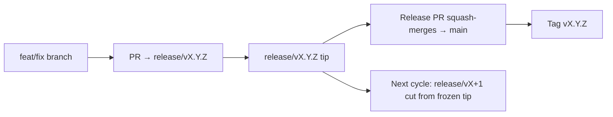

# Branching & Release Model (Dansk)

🌐 **Languages:** 🇺🇸 [English](../../../../ops/BRANCHING_MODEL.md) · 🇪🇹 [am](../../../am/docs/ops/BRANCHING_MODEL.md) · 🇸🇦 [ar](../../../ar/docs/ops/BRANCHING_MODEL.md) · 🇦🇿 [az](../../../az/docs/ops/BRANCHING_MODEL.md) · 🇧🇬 [bg](../../../bg/docs/ops/BRANCHING_MODEL.md) · 🇧🇩 [bn](../../../bn/docs/ops/BRANCHING_MODEL.md) · 🇨🇿 [cs](../../../cs/docs/ops/BRANCHING_MODEL.md) · 🇩🇪 [de](../../../de/docs/ops/BRANCHING_MODEL.md) · 🇬🇷 [el](../../../el/docs/ops/BRANCHING_MODEL.md) · 🇪🇸 [es](../../../es/docs/ops/BRANCHING_MODEL.md) · 🇪🇪 [et](../../../et/docs/ops/BRANCHING_MODEL.md) · 🇮🇷 [fa](../../../fa/docs/ops/BRANCHING_MODEL.md) · 🇫🇮 [fi](../../../fi/docs/ops/BRANCHING_MODEL.md) · 🇫🇷 [fr](../../../fr/docs/ops/BRANCHING_MODEL.md) · 🇮🇪 [ga](../../../ga/docs/ops/BRANCHING_MODEL.md) · 🇮🇳 [gu](../../../gu/docs/ops/BRANCHING_MODEL.md) · 🇳🇬 [ha](../../../ha/docs/ops/BRANCHING_MODEL.md) · 🇮🇱 [he](../../../he/docs/ops/BRANCHING_MODEL.md) · 🇮🇳 [hi](../../../hi/docs/ops/BRANCHING_MODEL.md) · 🇭🇷 [hr](../../../hr/docs/ops/BRANCHING_MODEL.md) · 🇭🇺 [hu](../../../hu/docs/ops/BRANCHING_MODEL.md) · 🇦🇲 [hy](../../../hy/docs/ops/BRANCHING_MODEL.md) · 🇮🇩 [id](../../../id/docs/ops/BRANCHING_MODEL.md) · 🇳🇬 [ig](../../../ig/docs/ops/BRANCHING_MODEL.md) · 🇮🇹 [it](../../../it/docs/ops/BRANCHING_MODEL.md) · 🇯🇵 [ja](../../../ja/docs/ops/BRANCHING_MODEL.md) · 🇬🇪 [ka](../../../ka/docs/ops/BRANCHING_MODEL.md) · 🇰🇭 [km](../../../km/docs/ops/BRANCHING_MODEL.md) · 🇮🇳 [kn](../../../kn/docs/ops/BRANCHING_MODEL.md) · 🇰🇷 [ko](../../../ko/docs/ops/BRANCHING_MODEL.md) · 🇱🇹 [lt](../../../lt/docs/ops/BRANCHING_MODEL.md) · 🇱🇻 [lv](../../../lv/docs/ops/BRANCHING_MODEL.md) · 🇮🇳 [ml](../../../ml/docs/ops/BRANCHING_MODEL.md) · 🇮🇳 [mr](../../../mr/docs/ops/BRANCHING_MODEL.md) · 🇲🇾 [ms](../../../ms/docs/ops/BRANCHING_MODEL.md) · 🇲🇹 [mt](../../../mt/docs/ops/BRANCHING_MODEL.md) · 🇲🇲 [my](../../../my/docs/ops/BRANCHING_MODEL.md) · 🇳🇵 [ne](../../../ne/docs/ops/BRANCHING_MODEL.md) · 🇳🇱 [nl](../../../nl/docs/ops/BRANCHING_MODEL.md) · 🇳🇴 [no](../../../no/docs/ops/BRANCHING_MODEL.md) · 🇮🇳 [or](../../../or/docs/ops/BRANCHING_MODEL.md) · 🇮🇳 [pa](../../../pa/docs/ops/BRANCHING_MODEL.md) · 🇵🇭 [phi](../../../phi/docs/ops/BRANCHING_MODEL.md) · 🇵🇱 [pl](../../../pl/docs/ops/BRANCHING_MODEL.md) · 🇵🇹 [pt](../../../pt/docs/ops/BRANCHING_MODEL.md) · 🇧🇷 [pt-BR](../../../pt-BR/docs/ops/BRANCHING_MODEL.md) · 🇷🇴 [ro](../../../ro/docs/ops/BRANCHING_MODEL.md) · 🇷🇺 [ru](../../../ru/docs/ops/BRANCHING_MODEL.md) · 🇱🇰 [si](../../../si/docs/ops/BRANCHING_MODEL.md) · 🇸🇰 [sk](../../../sk/docs/ops/BRANCHING_MODEL.md) · 🇸🇮 [sl](../../../sl/docs/ops/BRANCHING_MODEL.md) · 🇷🇸 [sr](../../../sr/docs/ops/BRANCHING_MODEL.md) · 🇸🇪 [sv](../../../sv/docs/ops/BRANCHING_MODEL.md) · 🇰🇪 [sw](../../../sw/docs/ops/BRANCHING_MODEL.md) · 🇮🇳 [ta](../../../ta/docs/ops/BRANCHING_MODEL.md) · 🇮🇳 [te](../../../te/docs/ops/BRANCHING_MODEL.md) · 🇹🇭 [th](../../../th/docs/ops/BRANCHING_MODEL.md) · 🇹🇷 [tr](../../../tr/docs/ops/BRANCHING_MODEL.md) · 🇺🇦 [uk-UA](../../../uk-UA/docs/ops/BRANCHING_MODEL.md) · 🇵🇰 [ur](../../../ur/docs/ops/BRANCHING_MODEL.md) · 🇺🇿 [uz](../../../uz/docs/ops/BRANCHING_MODEL.md) · 🇻🇳 [vi](../../../vi/docs/ops/BRANCHING_MODEL.md) · 🇳🇬 [yo](../../../yo/docs/ops/BRANCHING_MODEL.md) · 🇨🇳 [zh-CN](../../../zh-CN/docs/ops/BRANCHING_MODEL.md) · 🇹🇼 [zh-TW](../../../zh-TW/docs/ops/BRANCHING_MODEL.md)

---

OmniRoute bruger en **parallelcyklusbaseret** udgivelsesmodel: en dedikeret `release/vX.Y.Z`-gren
til den aktive cyklus, `main` til den udgivne linje og et uforanderligt
`vX.Y.Z`-tag, når cyklussen udgives. Det er forventeligt, at commits lander både på `release/*` _og_ på
`main` — det er ikke en fejl.

Detaljer for vedligeholdere findes i `CLAUDE.md` (ufravigelig regel nr. 21) og
[RELEASE_CHECKLIST.md](./RELEASE_CHECKLIST.md). Denne side er den offentlige
oversigt rettet mod bidragydere.

## Kort fortalt

| Reference        | Rolle                                                                                                        |
| ---------------- | ------------------------------------------------------------------------------------------------------------ |
| `release/vX.Y.Z` | **Aktiv cyklus** — daglig udvikling og sammenfletning af PR'er for den pågældende version                    |
| `main`           | **Udgivet linje** — modtager cyklussen via squash-sammenfletning, når udgivelsen offentliggøres              |
| `vX.Y.Z` (tag)   | **Udgivelsesmarkør** — uforanderlig reference til »det, der blev udgivet«, oprettet på udgivelsestidspunktet |



## Hvilken gren skal min PR målrettes mod?

**Målret den aktive `release/vX.Y.Z`-gren — ikke `main`.**

1. Find den højeste åbne `release/v*`-gren (eksempel i skrivende stund:
   `release/v3.8.49`).
2. Opret din gren fra dens spids (`git fetch` + checkout / rebase oven på den).
3. Åbn PR'en med **base = den pågældende `release/vX.Y.Z`**.

`main` er ikke integrationsgrenen til det daglige arbejde. PR'er, der åbnes mod `main`,
skal normalt målrettes mod en anden gren før sammenfletning.

## Udgivelsesfrysning (parallelle cyklusser)

Når en udgivelse afstemmes, åbnes en markørsag med etiketten `release-freeze`.
Det **stopper ikke udviklingen**:

- Den frosne `release/vX.Y.Z` tilhører den udgivelsesansvarlige for denne udgivelse.
- Den næste cyklus' `release/vX+1` oprettes fra den frosne spids, så bidragydere fortsat kan
  få deres arbejde sammenflettet.
- Åbne PR'er, der stadig er målrettet mod den frosne gren, skal **målrettes på ny** mod den
  aktive (højeste) `release/v*`-gren.

Kontrollér, om der er en åben frysning, før du antager, at den ønskede gren kan sammenflettes:

```bash
gh issue list --repo diegosouzapw/OmniRoute --label release-freeze --state open
```

Mekanismerne for sammenfletning (ejerens `queue`-etiket → Mergify) er dokumenteret i
[MERGE_TRAIN.md](./MERGE_TRAIN.md).

## Hvorfor både en gren og et tag?

| Artefakt         | Levetid             | Formål                                                                 |
| ---------------- | ------------------- | ---------------------------------------------------------------------- |
| `release/vX.Y.Z` | Igangværende cyklus | Samler gennemgåede PR'er, holder CI grønt og fungerer som PR-base      |
| Tagget `vX.Y.Z`  | For altid           | Markerer de nøjagtige dele, der blev udgivet til npm / GitHub Releases |

Grenen er værkstedet; tagget er den forseglede pakke. Efter squash-sammenfletning til
`main` fortsætter den næste cyklus på `release/vX+1` uden at vente på, at den foregående
udgivelses-PR bliver færdig.

## Relateret dokumentation

- [CONTRIBUTING.md](../../CONTRIBUTING.md) — opsætning, test, PR-tjekliste
- [RELEASE_CHECKLIST.md](./RELEASE_CHECKLIST.md) — validering før udgivelse
- [MERGE_TRAIN.md](./MERGE_TRAIN.md) — sammenfletningskø og alternativt sammenfletningstog
- [RELEASE_GREEN.md](./RELEASE_GREEN.md) — sådan holdes udgivelsesspidsen grøn
