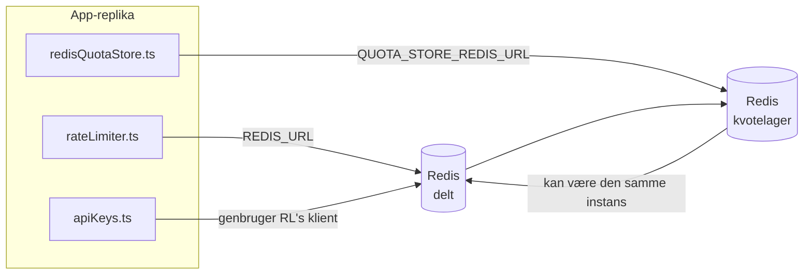

# Redis Production Configuration Guide (Dansk)

🌐 **Languages:** 🇺🇸 [English](../../../../ops/REDIS_PRODUCTION_CONFIG.md) · 🇪🇹 [am](../../../am/docs/ops/REDIS_PRODUCTION_CONFIG.md) · 🇸🇦 [ar](../../../ar/docs/ops/REDIS_PRODUCTION_CONFIG.md) · 🇦🇿 [az](../../../az/docs/ops/REDIS_PRODUCTION_CONFIG.md) · 🇧🇬 [bg](../../../bg/docs/ops/REDIS_PRODUCTION_CONFIG.md) · 🇧🇩 [bn](../../../bn/docs/ops/REDIS_PRODUCTION_CONFIG.md) · 🇧🇦 [bs](../../../bs/docs/ops/REDIS_PRODUCTION_CONFIG.md) · 🇨🇿 [cs](../../../cs/docs/ops/REDIS_PRODUCTION_CONFIG.md) · 🇩🇪 [de](../../../de/docs/ops/REDIS_PRODUCTION_CONFIG.md) · 🇬🇷 [el](../../../el/docs/ops/REDIS_PRODUCTION_CONFIG.md) · 🇪🇸 [es](../../../es/docs/ops/REDIS_PRODUCTION_CONFIG.md) · 🇪🇪 [et](../../../et/docs/ops/REDIS_PRODUCTION_CONFIG.md) · 🇮🇷 [fa](../../../fa/docs/ops/REDIS_PRODUCTION_CONFIG.md) · 🇫🇮 [fi](../../../fi/docs/ops/REDIS_PRODUCTION_CONFIG.md) · 🇫🇷 [fr](../../../fr/docs/ops/REDIS_PRODUCTION_CONFIG.md) · 🇮🇪 [ga](../../../ga/docs/ops/REDIS_PRODUCTION_CONFIG.md) · 🇮🇳 [gu](../../../gu/docs/ops/REDIS_PRODUCTION_CONFIG.md) · 🇳🇬 [ha](../../../ha/docs/ops/REDIS_PRODUCTION_CONFIG.md) · 🇮🇱 [he](../../../he/docs/ops/REDIS_PRODUCTION_CONFIG.md) · 🇮🇳 [hi](../../../hi/docs/ops/REDIS_PRODUCTION_CONFIG.md) · 🇭🇷 [hr](../../../hr/docs/ops/REDIS_PRODUCTION_CONFIG.md) · 🇭🇺 [hu](../../../hu/docs/ops/REDIS_PRODUCTION_CONFIG.md) · 🇦🇲 [hy](../../../hy/docs/ops/REDIS_PRODUCTION_CONFIG.md) · 🇮🇩 [id](../../../id/docs/ops/REDIS_PRODUCTION_CONFIG.md) · 🇳🇬 [ig](../../../ig/docs/ops/REDIS_PRODUCTION_CONFIG.md) · 🇮🇹 [it](../../../it/docs/ops/REDIS_PRODUCTION_CONFIG.md) · 🇯🇵 [ja](../../../ja/docs/ops/REDIS_PRODUCTION_CONFIG.md) · 🇬🇪 [ka](../../../ka/docs/ops/REDIS_PRODUCTION_CONFIG.md) · 🇰🇭 [km](../../../km/docs/ops/REDIS_PRODUCTION_CONFIG.md) · 🇮🇳 [kn](../../../kn/docs/ops/REDIS_PRODUCTION_CONFIG.md) · 🇰🇷 [ko](../../../ko/docs/ops/REDIS_PRODUCTION_CONFIG.md) · 🇱🇹 [lt](../../../lt/docs/ops/REDIS_PRODUCTION_CONFIG.md) · 🇱🇻 [lv](../../../lv/docs/ops/REDIS_PRODUCTION_CONFIG.md) · 🇮🇳 [ml](../../../ml/docs/ops/REDIS_PRODUCTION_CONFIG.md) · 🇮🇳 [mr](../../../mr/docs/ops/REDIS_PRODUCTION_CONFIG.md) · 🇲🇾 [ms](../../../ms/docs/ops/REDIS_PRODUCTION_CONFIG.md) · 🇲🇹 [mt](../../../mt/docs/ops/REDIS_PRODUCTION_CONFIG.md) · 🇲🇲 [my](../../../my/docs/ops/REDIS_PRODUCTION_CONFIG.md) · 🇳🇵 [ne](../../../ne/docs/ops/REDIS_PRODUCTION_CONFIG.md) · 🇳🇱 [nl](../../../nl/docs/ops/REDIS_PRODUCTION_CONFIG.md) · 🇳🇴 [no](../../../no/docs/ops/REDIS_PRODUCTION_CONFIG.md) · 🇮🇳 [or](../../../or/docs/ops/REDIS_PRODUCTION_CONFIG.md) · 🇮🇳 [pa](../../../pa/docs/ops/REDIS_PRODUCTION_CONFIG.md) · 🇵🇭 [phi](../../../phi/docs/ops/REDIS_PRODUCTION_CONFIG.md) · 🇵🇱 [pl](../../../pl/docs/ops/REDIS_PRODUCTION_CONFIG.md) · 🇵🇹 [pt](../../../pt/docs/ops/REDIS_PRODUCTION_CONFIG.md) · 🇧🇷 [pt-BR](../../../pt-BR/docs/ops/REDIS_PRODUCTION_CONFIG.md) · 🇷🇴 [ro](../../../ro/docs/ops/REDIS_PRODUCTION_CONFIG.md) · 🇷🇺 [ru](../../../ru/docs/ops/REDIS_PRODUCTION_CONFIG.md) · 🇱🇰 [si](../../../si/docs/ops/REDIS_PRODUCTION_CONFIG.md) · 🇸🇰 [sk](../../../sk/docs/ops/REDIS_PRODUCTION_CONFIG.md) · 🇸🇮 [sl](../../../sl/docs/ops/REDIS_PRODUCTION_CONFIG.md) · 🇷🇸 [sr](../../../sr/docs/ops/REDIS_PRODUCTION_CONFIG.md) · 🇸🇪 [sv](../../../sv/docs/ops/REDIS_PRODUCTION_CONFIG.md) · 🇰🇪 [sw](../../../sw/docs/ops/REDIS_PRODUCTION_CONFIG.md) · 🇮🇳 [ta](../../../ta/docs/ops/REDIS_PRODUCTION_CONFIG.md) · 🇮🇳 [te](../../../te/docs/ops/REDIS_PRODUCTION_CONFIG.md) · 🇹🇭 [th](../../../th/docs/ops/REDIS_PRODUCTION_CONFIG.md) · 🇹🇷 [tr](../../../tr/docs/ops/REDIS_PRODUCTION_CONFIG.md) · 🇺🇦 [uk-UA](../../../uk-UA/docs/ops/REDIS_PRODUCTION_CONFIG.md) · 🇵🇰 [ur](../../../ur/docs/ops/REDIS_PRODUCTION_CONFIG.md) · 🇺🇿 [uz](../../../uz/docs/ops/REDIS_PRODUCTION_CONFIG.md) · 🇻🇳 [vi](../../../vi/docs/ops/REDIS_PRODUCTION_CONFIG.md) · 🇳🇬 [yo](../../../yo/docs/ops/REDIS_PRODUCTION_CONFIG.md) · 🇨🇳 [zh-CN](../../../zh-CN/docs/ops/REDIS_PRODUCTION_CONFIG.md) · 🇹🇼 [zh-TW](../../../zh-TW/docs/ops/REDIS_PRODUCTION_CONFIG.md)

---

## Oversigt

Redis er en **valgfri, blød afhængighed** i OmniRoute — applikationen nedgraderer problemfrit til alternativer i hukommelsen, når Redis ikke er tilgængelig. I produktion reducerer finjustering af Redis latenstiden for fire forskellige arbejdsbelastninger:

| Arbejdsbelastning                | Driver                        | Klientfabrik                                   | Nøglemønster                                                  |
| -------------------------------- | ----------------------------- | ---------------------------------------------- | ------------------------------------------------------------- |
| Hastighedsbegrænsning            | `rateLimiter.ts`              | `getRedisClient()` — doven `ioredis`-singleton | `<prefix>rl:*` Lua-atomiske vinduer til hastighedsbegrænsning |
| Godkendelsescache                | `apiKeys.ts`                  | Genbruger klienten fra `rateLimiter`           | `<prefix>auth:api_key:<sha256>` med TTL                       |
| Kvote-lager                      | `redisQuotaStore.ts`          | Separat `getRedisClient(url)`-singleton        | `<prefix>quota:*`, konfigurerbar pr. instans                  |
| Kredsløbsafbryder til opvarmning | `redisCircuitBreakerStore.ts` | Separat klient i `circuitBreakerFactory.ts`    | `<prefix>warmup:cb:<connectionId>`                            |

Alle fire arbejdsbelastninger deler ét namespace-præfiks, så OmniRoute kan eksistere side om side med andre apps på en enkelt Redis-instans (f.eks. `127.0.0.1:6379`). Se [Namespace-opdeling af nøgler](#key-namespacing).

---

## Aktuel konfiguration (standardværdier i koden)

| Indstilling                            | Værdi                                                          | Placering                                                                             |
| -------------------------------------- | -------------------------------------------------------------- | ------------------------------------------------------------------------------------- |
| Miljøvariablen `REDIS_URL`             | `redis://redis:6379` (compose), valgfri                        | `rateLimiter.ts:5`, `.env.example`                                                    |
| Miljøvariablen `REDIS_KEY_PREFIX`      | `omniroute:` (standard)                                        | `rateLimiter.ts`, `redisQuotaStore.ts`, `redisCircuitBreakerStore.ts`, `.env.example` |
| Miljøvariablen `QUOTA_STORE_REDIS_URL` | separat, kan afvige fra `REDIS_URL`                            | `quota/storeFactory.ts`                                                               |
| `QUOTA_STORE_DRIVER`                   | `"sqlite"` (standard), `"redis"` valgfri                       | `quota/storeFactory.ts`                                                               |
| ioredis `maxRetriesPerRequest`         | `3`                                                            | klientoprettelse i `rateLimiter.ts`                                                   |
| `enableReadyCheck`                     | ikke angivet (ioredis-standard: `true`)                        | —                                                                                     |
| `lazyConnect`                          | ikke angivet (ioredis-standard: `false`)                       | —                                                                                     |
| `retryStrategy`                        | ikke angivet (ioredis-standard: basis på 200 ms, eksponentiel) | —                                                                                     |
| TLS / adgangskode / DB-indeks          | **ikke konfigureret**                                          | —                                                                                     |
| Sentinel / Cluster                     | **ikke konfigureret** — kun enkeltstående node                 | —                                                                                     |

---

## Namespace-opdeling af nøgler

OmniRoute deler en Redis-instans med alt andet, der kører på værten. Uden et namespace kan nøgler som `auth:api_key:<sha256>` eller `rl:*` kollidere med nøgler fra andre applikationer, der bruger den samme Redis (denne instans kører Redis på `127.0.0.1:6379` sammen med andre tjenester).

Indstil `REDIS_KEY_PREFIX` til en ikke-tom streng for at føje et præfiks til **alle** OmniRoute-nøgler:

```bash
# .env — alle OmniRoute-nøgler bliver omniroute:rl:*, omniroute:auth:*, omniroute:quota:*, omniroute:warmup:cb:*
REDIS_KEY_PREFIX=omniroute:
```

- **Standard:** `omniroute:` (anvendes, når `REDIS_KEY_PREFIX` ikke er angivet eller er tom).
- **Anvendes på:** hastighedsbegrænseren + godkendelsescachen (delt `ioredis`-klient via `keyPrefix`), kvote-lageret (`KEY_PREFIX = "${REDIS_KEY_PREFIX}quota"`) og kredsløbsafbryderen til opvarmning (`KEY_PREFIX = "${REDIS_KEY_PREFIX}warmup:cb:"`).
- **Ændring af præfikset**, når der allerede findes nøgler i Redis, efterlader de gamle nøgler uden tilknytning (de udløber via TTL / LRU). Det er sikkert at ændre præfikset; ingen migrering er nødvendig. Den eneste undtagelse er en nøgle til kredsløbsafbryderen for opvarmning for en forbindelse, der er markeret som forbudt: Den gemmes uden en TTL, så find efterladte nøgler med `redis-cli --scan --pattern '<old-prefix>warmup:cb:*'`, og slet dem.
- **ioredis `keyPrefix`** tilføjer automatisk præfikset ved skrivninger **og** fjerner det ved læsninger, så applikationskoden aldrig ser præfikset.

---

## Anbefalet produktionsoptimering

### 1. Indstillinger for forbindelsespulje/klient (ioredis-`Redis`-constructor)

Den nuværende kode opretter en enkelt `new Redis(url)` uden brugerdefinerede indstillinger. Til produktionsmiljøer med flere replikaer bør du angive en klientfactory i koden eller omslutte `getRedisClient()`:

```typescript
const redis = new Redis(REDIS_URL, {
  maxRetriesPerRequest: null, // ingen grænse for genforsøg; lad retryStrategy bestemme
  enableReadyCheck: true, // kontrollér, at serveren er klar, før kald accepteres
  lazyConnect: true, // opret ikke forbindelse ved konstruktion; vent på første kald
  retryStrategy: (times) => {
    if (times > 10) return null; // opgiv efter 10 genforsøg → opret forbindelse igen senere
    return Math.min(times * 200, 5000); // 200 ms, 400 ms, …, maks. 5 sek.
  },
  enableAutoPipelining: true, // saml samtidige kommandoer i én TCP-skrivning
  keepAlive: 10000, // TCP-keep-alive hvert 10. sek.
});
```

**Vigtige afvejninger:**

- `maxRetriesPerRequest: null` + `retryStrategy` — foretrækkes i produktion, så midlertidige
  Redis-genstarter ikke straks får alle anmodninger til at mislykkes. Reserveløsningen i hukommelsen i
  `checkRateLimit()` håndterer fejlscenariet.
- `lazyConnect: true` — undgår en opstartsafhængighed af, at Redis er tilgængelig, før serveren
  begynder at acceptere forbindelser.
- `enableAutoPipelining: true` — reducerer tur-retur-kald ved samtidige ratebegrænsningskontroller;
  fordelagtigt ved >50 RPS på en enkelt forbindelse.

### 2. Redis-serverkonfiguration (`redis.conf`)

```
# Hukommelse
maxmemory 80%                        # efterlad plads til operativsystemets sidecache
maxmemory-policy allkeys-lru         # fjern forældede poster fra godkendelsescachen under pres

# Persistens (valgfrit — OmniRoute er nedbrudssikker uden)
save 300 1                           # opret snapshot mindst hvert 5. minut, hvis ≥1 nøgle er ændret
appendonly no                        # AOF er ikke nødvendigt; data kan gendannes
appendfsync no                       # ingen fsync-overhead (RDB er tilstrækkeligt)

# Netværk
timeout 0                            # ingen afbrydelse ved inaktivitet
tcp-keepalive 300                    # keep-alive hvert 5. minut
tcp-backlog 511                      # forbindelseskø til spidsbelastninger

# Ydeevne
hz 10                                # standard; 100 til latensfølsomme miljøer
activedefrag yes                     # defragmentér automatisk, når fragmenteringen er >10 %
```

**Afvejning ved `maxmemory-policy allkeys-lru`:** Poster i godkendelsescachen kan blive fjernet under
hukommelsespres. Dette er sikkert — `setCachedApiKey` udfylder altid cachen igen ved et miss, og
SQLite-reserveløsningen er autoritativ. Ratebegrænserens Lua-script opretter små nøgler, der
bevidst har kort levetid.

### 3. Docker Compose-indstillinger

Produktions-compose-filen (`docker-compose.prod.yml`) bruger `redis:8.6.2-alpine`. Tilføj:

```yaml
redis:
  image: redis:8.6.2-alpine
  command:
    [
      "redis-server",
      "--maxmemory",
      "512mb",
      "--maxmemory-policy",
      "allkeys-lru",
      "--activedefrag",
      "yes",
      "--save",
      "300 1",
    ]
  healthcheck:
    test: ["CMD", "redis-cli", "ping"]
    interval: 10s
    timeout: 3s
    retries: 3
    start_period: 5s
```

### 4. Overvejelser om flere instanser/skalering

**Én Redis til alle replikaer** — ratebegrænserens Lua-script afhænger af ét
autoritativt nøglerum. Flere Redis-instanser bag replikaerne ville ophæve atomiciteten
og fordoble budgettet. Brug én Redis-instans (eller en Redis Sentinel-klynge med failover) til
alle applikationsreplikaer.

**Antal forbindelser:** Hver applikationsreplika åbner **2 TCP-forbindelser** til Redis
(ratebegrænserklient + kvotelagerklient). Ved 10 replikaer → 20 forbindelser, hvilket er
langt under en standard-Redis-instans' grænse på 10.000 forbindelser.

### 5. Overvågning

Eksponér via sundhedstjek-endpointet:

```typescript
// src/app/api/monitoring/health/route.ts kalder allerede rateLimiter-funktioner
// Tilføj Redis-specifikke kontroller:
//   1. PING-latens via ioredis .ping()
//   2. Hukommelsesforbrug via INFO memory
//   3. Antal forbindelser via INFO clients
//   4. Træfrate for maxmemory-policy (evicted_keys / keyspace_hits)
```

Vigtige målinger at overvåge:

- **Fjernede nøgler/sek.** — hvis værdien vedvarende er forskellig fra nul, skal `maxmemory` øges
- **Blokerede klienter** — en værdi forskellig fra nul indikerer langsomme Lua-scripts eller høj belastning
- **Afviste forbindelser** — forbindelsesgrænsen er nået; sjældent ved 20 forbindelser

---

## Arkitekturdiagram



---

## Referencer

| Fil                                | Formål                                                                                   |
| ---------------------------------- | ---------------------------------------------------------------------------------------- |
| `src/shared/utils/rateLimiter.ts`  | Primær Redis-klient, Lua-script til hastighedsbegrænsning, reservefunktion i hukommelsen |
| `src/lib/db/apiKeys.ts`            | Godkendelsescache — Redis→SQLite-reservefunktion                                         |
| `src/lib/quota/redisQuotaStore.ts` | Separat Redis-klient til valgfrit kvotelager                                             |
| `src/lib/quota/storeFactory.ts`    | Skifter mellem kvotedriverne `sqlite` og `redis`                                         |
| `docker-compose.prod.yml`          | Redis-container til produktion (image `redis:8.6.2-alpine`)                              |
| `.env.example`                     | Dokumentation til Redis-miljøvariabler                                                   |
| `src/app/api/local/redis/`         | API-ruter til orkestrering af udviklingscontainere                                       |
| `bin/cli/commands/redis.mjs`       | CLI-kommandoer til orkestrering af udviklingscontainere                                  |
