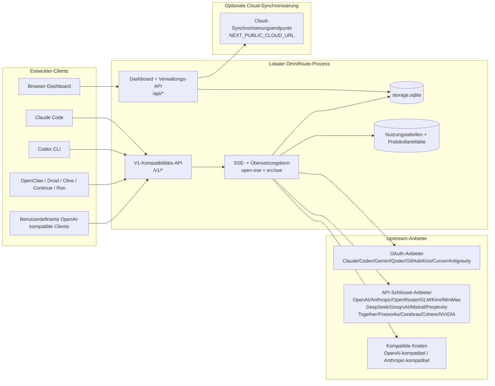
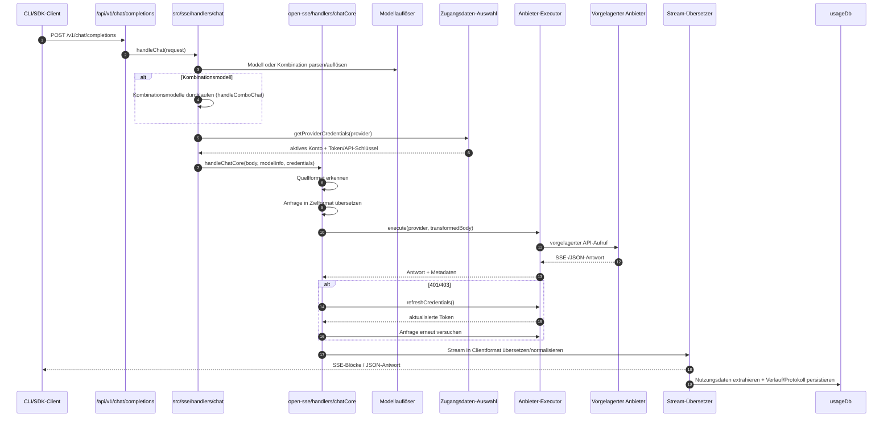
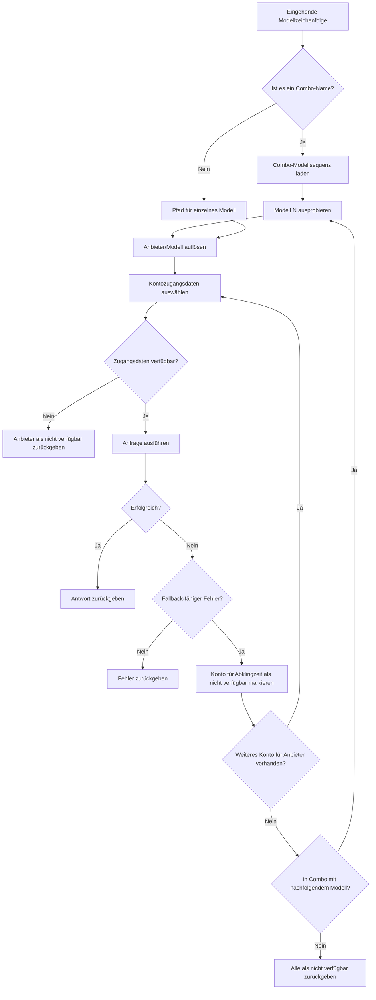
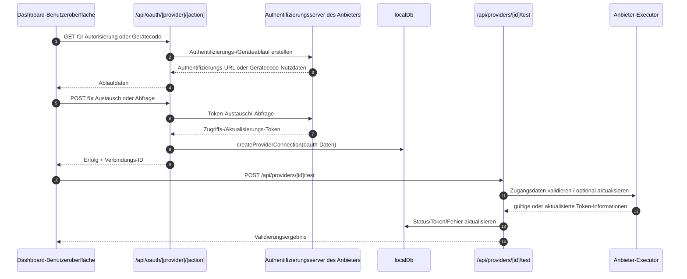
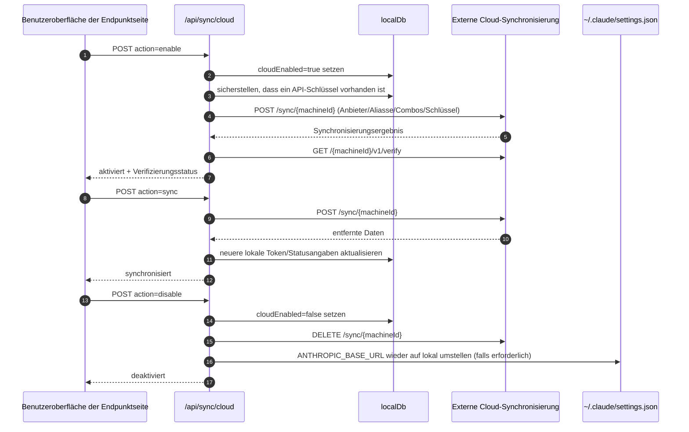
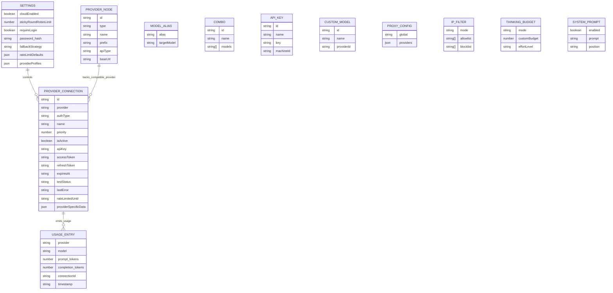
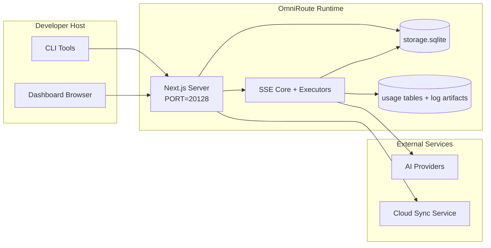

# OmniRoute Architecture (Deutsch)

🌐 **Languages:** 🇺🇸 [English](../../../../architecture/ARCHITECTURE.md) · 🇪🇹 [am](../../../am/docs/architecture/ARCHITECTURE.md) · 🇸🇦 [ar](../../../ar/docs/architecture/ARCHITECTURE.md) · 🇦🇿 [az](../../../az/docs/architecture/ARCHITECTURE.md) · 🇧🇬 [bg](../../../bg/docs/architecture/ARCHITECTURE.md) · 🇧🇩 [bn](../../../bn/docs/architecture/ARCHITECTURE.md) · 🇧🇦 [bs](../../../bs/docs/architecture/ARCHITECTURE.md) · 🇨🇿 [cs](../../../cs/docs/architecture/ARCHITECTURE.md) · 🇩🇰 [da](../../../da/docs/architecture/ARCHITECTURE.md) · 🇬🇷 [el](../../../el/docs/architecture/ARCHITECTURE.md) · 🇪🇸 [es](../../../es/docs/architecture/ARCHITECTURE.md) · 🇪🇪 [et](../../../et/docs/architecture/ARCHITECTURE.md) · 🇮🇷 [fa](../../../fa/docs/architecture/ARCHITECTURE.md) · 🇫🇮 [fi](../../../fi/docs/architecture/ARCHITECTURE.md) · 🇫🇷 [fr](../../../fr/docs/architecture/ARCHITECTURE.md) · 🇮🇪 [ga](../../../ga/docs/architecture/ARCHITECTURE.md) · 🇮🇳 [gu](../../../gu/docs/architecture/ARCHITECTURE.md) · 🇳🇬 [ha](../../../ha/docs/architecture/ARCHITECTURE.md) · 🇮🇱 [he](../../../he/docs/architecture/ARCHITECTURE.md) · 🇮🇳 [hi](../../../hi/docs/architecture/ARCHITECTURE.md) · 🇭🇷 [hr](../../../hr/docs/architecture/ARCHITECTURE.md) · 🇭🇺 [hu](../../../hu/docs/architecture/ARCHITECTURE.md) · 🇦🇲 [hy](../../../hy/docs/architecture/ARCHITECTURE.md) · 🇮🇩 [id](../../../id/docs/architecture/ARCHITECTURE.md) · 🇳🇬 [ig](../../../ig/docs/architecture/ARCHITECTURE.md) · 🇮🇹 [it](../../../it/docs/architecture/ARCHITECTURE.md) · 🇯🇵 [ja](../../../ja/docs/architecture/ARCHITECTURE.md) · 🇬🇪 [ka](../../../ka/docs/architecture/ARCHITECTURE.md) · 🇰🇭 [km](../../../km/docs/architecture/ARCHITECTURE.md) · 🇮🇳 [kn](../../../kn/docs/architecture/ARCHITECTURE.md) · 🇰🇷 [ko](../../../ko/docs/architecture/ARCHITECTURE.md) · 🇱🇹 [lt](../../../lt/docs/architecture/ARCHITECTURE.md) · 🇱🇻 [lv](../../../lv/docs/architecture/ARCHITECTURE.md) · 🇮🇳 [ml](../../../ml/docs/architecture/ARCHITECTURE.md) · 🇮🇳 [mr](../../../mr/docs/architecture/ARCHITECTURE.md) · 🇲🇾 [ms](../../../ms/docs/architecture/ARCHITECTURE.md) · 🇲🇹 [mt](../../../mt/docs/architecture/ARCHITECTURE.md) · 🇲🇲 [my](../../../my/docs/architecture/ARCHITECTURE.md) · 🇳🇵 [ne](../../../ne/docs/architecture/ARCHITECTURE.md) · 🇳🇱 [nl](../../../nl/docs/architecture/ARCHITECTURE.md) · 🇳🇴 [no](../../../no/docs/architecture/ARCHITECTURE.md) · 🇮🇳 [or](../../../or/docs/architecture/ARCHITECTURE.md) · 🇮🇳 [pa](../../../pa/docs/architecture/ARCHITECTURE.md) · 🇵🇭 [phi](../../../phi/docs/architecture/ARCHITECTURE.md) · 🇵🇱 [pl](../../../pl/docs/architecture/ARCHITECTURE.md) · 🇵🇹 [pt](../../../pt/docs/architecture/ARCHITECTURE.md) · 🇧🇷 [pt-BR](../../../pt-BR/docs/architecture/ARCHITECTURE.md) · 🇷🇴 [ro](../../../ro/docs/architecture/ARCHITECTURE.md) · 🇷🇺 [ru](../../../ru/docs/architecture/ARCHITECTURE.md) · 🇱🇰 [si](../../../si/docs/architecture/ARCHITECTURE.md) · 🇸🇰 [sk](../../../sk/docs/architecture/ARCHITECTURE.md) · 🇸🇮 [sl](../../../sl/docs/architecture/ARCHITECTURE.md) · 🇷🇸 [sr](../../../sr/docs/architecture/ARCHITECTURE.md) · 🇸🇪 [sv](../../../sv/docs/architecture/ARCHITECTURE.md) · 🇰🇪 [sw](../../../sw/docs/architecture/ARCHITECTURE.md) · 🇮🇳 [ta](../../../ta/docs/architecture/ARCHITECTURE.md) · 🇮🇳 [te](../../../te/docs/architecture/ARCHITECTURE.md) · 🇹🇭 [th](../../../th/docs/architecture/ARCHITECTURE.md) · 🇹🇷 [tr](../../../tr/docs/architecture/ARCHITECTURE.md) · 🇺🇦 [uk-UA](../../../uk-UA/docs/architecture/ARCHITECTURE.md) · 🇵🇰 [ur](../../../ur/docs/architecture/ARCHITECTURE.md) · 🇺🇿 [uz](../../../uz/docs/architecture/ARCHITECTURE.md) · 🇻🇳 [vi](../../../vi/docs/architecture/ARCHITECTURE.md) · 🇳🇬 [yo](../../../yo/docs/architecture/ARCHITECTURE.md) · 🇨🇳 [zh-CN](../../../zh-CN/docs/architecture/ARCHITECTURE.md) · 🇹🇼 [zh-TW](../../../zh-TW/docs/architecture/ARCHITECTURE.md)

---

🌐 **Languages:** 🇺🇸 [English](../../../../architecture/ARCHITECTURE.md) · 🇪🇹 [am](../../../am/docs/architecture/ARCHITECTURE.md) · 🇸🇦 [ar](../../../ar/docs/architecture/ARCHITECTURE.md) · 🇦🇿 [az](../../../az/docs/architecture/ARCHITECTURE.md) · 🇧🇬 [bg](../../../bg/docs/architecture/ARCHITECTURE.md) · 🇧🇩 [bn](../../../bn/docs/architecture/ARCHITECTURE.md) · 🇧🇦 [bs](../../../bs/docs/architecture/ARCHITECTURE.md) · 🇨🇿 [cs](../../../cs/docs/architecture/ARCHITECTURE.md) · 🇩🇰 [da](../../../da/docs/architecture/ARCHITECTURE.md) · 🇬🇷 [el](../../../el/docs/architecture/ARCHITECTURE.md) · 🇪🇸 [es](../../../es/docs/architecture/ARCHITECTURE.md) · 🇪🇪 [et](../../../et/docs/architecture/ARCHITECTURE.md) · 🇮🇷 [fa](../../../fa/docs/architecture/ARCHITECTURE.md) · 🇫🇮 [fi](../../../fi/docs/architecture/ARCHITECTURE.md) · 🇫🇷 [fr](../../../fr/docs/architecture/ARCHITECTURE.md) · 🇮🇪 [ga](../../../ga/docs/architecture/ARCHITECTURE.md) · 🇮🇳 [gu](../../../gu/docs/architecture/ARCHITECTURE.md) · 🇳🇬 [ha](../../../ha/docs/architecture/ARCHITECTURE.md) · 🇮🇱 [he](../../../he/docs/architecture/ARCHITECTURE.md) · 🇮🇳 [hi](../../../hi/docs/architecture/ARCHITECTURE.md) · 🇭🇷 [hr](../../../hr/docs/architecture/ARCHITECTURE.md) · 🇭🇺 [hu](../../../hu/docs/architecture/ARCHITECTURE.md) · 🇦🇲 [hy](../../../hy/docs/architecture/ARCHITECTURE.md) · 🇮🇩 [id](../../../id/docs/architecture/ARCHITECTURE.md) · 🇳🇬 [ig](../../../ig/docs/architecture/ARCHITECTURE.md) · 🇮🇹 [it](../../../it/docs/architecture/ARCHITECTURE.md) · 🇯🇵 [ja](../../../ja/docs/architecture/ARCHITECTURE.md) · 🇬🇪 [ka](../../../ka/docs/architecture/ARCHITECTURE.md) · 🇰🇭 [km](../../../km/docs/architecture/ARCHITECTURE.md) · 🇮🇳 [kn](../../../kn/docs/architecture/ARCHITECTURE.md) · 🇰🇷 [ko](../../../ko/docs/architecture/ARCHITECTURE.md) · 🇱🇹 [lt](../../../lt/docs/architecture/ARCHITECTURE.md) · 🇱🇻 [lv](../../../lv/docs/architecture/ARCHITECTURE.md) · 🇮🇳 [ml](../../../ml/docs/architecture/ARCHITECTURE.md) · 🇮🇳 [mr](../../../mr/docs/architecture/ARCHITECTURE.md) · 🇲🇾 [ms](../../../ms/docs/architecture/ARCHITECTURE.md) · 🇲🇹 [mt](../../../mt/docs/architecture/ARCHITECTURE.md) · 🇲🇲 [my](../../../my/docs/architecture/ARCHITECTURE.md) · 🇳🇵 [ne](../../../ne/docs/architecture/ARCHITECTURE.md) · 🇳🇱 [nl](../../../nl/docs/architecture/ARCHITECTURE.md) · 🇳🇴 [no](../../../no/docs/architecture/ARCHITECTURE.md) · 🇮🇳 [or](../../../or/docs/architecture/ARCHITECTURE.md) · 🇮🇳 [pa](../../../pa/docs/architecture/ARCHITECTURE.md) · 🇵🇭 [phi](../../../phi/docs/architecture/ARCHITECTURE.md) · 🇵🇱 [pl](../../../pl/docs/architecture/ARCHITECTURE.md) · 🇵🇹 [pt](../../../pt/docs/architecture/ARCHITECTURE.md) · 🇧🇷 [pt-BR](../../../pt-BR/docs/architecture/ARCHITECTURE.md) · 🇷🇴 [ro](../../../ro/docs/architecture/ARCHITECTURE.md) · 🇷🇺 [ru](../../../ru/docs/architecture/ARCHITECTURE.md) · 🇱🇰 [si](../../../si/docs/architecture/ARCHITECTURE.md) · 🇸🇰 [sk](../../../sk/docs/architecture/ARCHITECTURE.md) · 🇸🇮 [sl](../../../sl/docs/architecture/ARCHITECTURE.md) · 🇷🇸 [sr](../../../sr/docs/architecture/ARCHITECTURE.md) · 🇸🇪 [sv](../../../sv/docs/architecture/ARCHITECTURE.md) · 🇰🇪 [sw](../../../sw/docs/architecture/ARCHITECTURE.md) · 🇮🇳 [ta](../../../ta/docs/architecture/ARCHITECTURE.md) · 🇮🇳 [te](../../../te/docs/architecture/ARCHITECTURE.md) · 🇹🇭 [th](../../../th/docs/architecture/ARCHITECTURE.md) · 🇹🇷 [tr](../../../tr/docs/architecture/ARCHITECTURE.md) · 🇺🇦 [uk-UA](../../../uk-UA/docs/architecture/ARCHITECTURE.md) · 🇵🇰 [ur](../../../ur/docs/architecture/ARCHITECTURE.md) · 🇺🇿 [uz](../../../uz/docs/architecture/ARCHITECTURE.md) · 🇻🇳 [vi](../../../vi/docs/architecture/ARCHITECTURE.md) · 🇳🇬 [yo](../../../yo/docs/architecture/ARCHITECTURE.md) · 🇨🇳 [zh-CN](../../../zh-CN/docs/architecture/ARCHITECTURE.md) · 🇹🇼 [zh-TW](../../../zh-TW/docs/architecture/ARCHITECTURE.md)

_Zuletzt aktualisiert: 2026-06-28_

## Zusammenfassung

OmniRoute ist ein lokales KI-Routing-Gateway mit Dashboard, das auf Next.js basiert.
Es stellt einen einzelnen OpenAI-kompatiblen Endpunkt (`/v1/*`) bereit und leitet Anfragen mit Übersetzung, Fallback, Token-Aktualisierung und Nutzungsverfolgung an mehrere vorgelagerte Anbieter weiter.

Kernfunktionen:

- OpenAI-kompatible API-Oberfläche für CLI/Tools (355 Anbieter, 108 Executoren)
- Übersetzung von Anfragen und Antworten zwischen Anbieterformaten
- Modellkombinations-Fallback (Sequenz mehrerer Modelle)
- Strukturierte Kombinationsschritte (`provider + model + connection`) mit Laufzeitsortierung nach `compositeTiers`
- Fallback auf Kontoebene (mehrere Konten pro Anbieter)
- Vorabprüfung von Kontingenten und kontingentbewusste P2C-Kontoauswahl im primären Chat-Pfad
- Verwaltung von Anbieterverbindungen über OAuth und API-Schlüssel (22 OAuth-Anbietermodule)
- Generierung von Einbettungen über `/v1/embeddings` (18 Anbieter)
- Bildgenerierung über `/v1/images/generations` (mehr als 10 Anbieter, mehr als 20 Modelle)
- Audiotranskription über `/v1/audio/transcriptions` (18 Anbieter)
- Text-zu-Sprache über `/v1/audio/speech` (24 integrierte Anbieter)
- Videogenerierung über `/v1/videos/generations` (ComfyUI + SD WebUI)
- Musikgenerierung über `/v1/music/generations` (ComfyUI)
- Websuche über `/v1/search` (20 Anbieter)
- Moderation über `/v1/moderations`
- Neusortierung über `/v1/rerank`
- Analyse von Denk-Tags (`<think>...</think>`) für Schlussfolgerungsmodelle
- Bereinigung von Antworten für strikte Kompatibilität mit dem OpenAI SDK
- Rollennormalisierung (developer→system, system→user) für anbieterübergreifende Kompatibilität
- Konvertierung strukturierter Ausgaben (json_schema → Gemini responseSchema)
- Lokale Persistenz für Anbieter, Schlüssel, Aliasse, Kombinationen, Einstellungen und Preise (122 DB-Module)
- Nutzungs- und Kostenverfolgung sowie Anfrageprotokollierung
- Optionale Cloud-Synchronisierung für die geräteübergreifende Zustands- und Datensynchronisierung
- IP-Zulassungs- und Sperrliste für die API-Zugriffskontrolle
- Verwaltung des Denkbudgets (passthrough/auto/custom/adaptive)
- Globale Einbindung von System-Prompts
- Sitzungsverfolgung und Fingerprinting
- Erweiterte Ratenbegrenzung pro Konto mit anbieterspezifischen Profilen
- Circuit-Breaker-Muster für die Ausfallsicherheit von Anbietern
- Schutz vor dem Thundering-Herd-Problem durch Mutex-Sperren
- Signaturbasierter Cache zur Deduplizierung von Anfragen
- Domänenschicht: Kostenregeln, Fallback-Richtlinie, Sperrrichtlinie
- Context Relay: Sitzungsübergabe-Zusammenfassungen zur Wahrung der Kontinuität bei Kontowechseln
- Persistenz des Domänenzustands (SQLite-Write-Through-Cache für Fallbacks, Budgets, Sperren und Circuit Breaker)
- Richtlinien-Engine zur zentralisierten Auswertung von Anfragen (Sperre → Budget → Fallback)
- Anfragetelemetrie mit Aggregation der Latenzen p50/p95/p99
- Telemetrie für Kombinationsziele und historischer Zustand von Kombinationszielen über `combo_execution_key` / `combo_step_id`
- Korrelations-ID (X-Request-Id) für End-to-End-Tracing
- Compliance-Audit-Protokollierung mit Deaktivierungsoption pro API-Schlüssel
- Evaluierungsframework zur Qualitätssicherung von LLMs
- Zustands-Dashboard mit Echtzeitstatus der Circuit Breaker von Anbietern
- MCP-Server (110 Tools) mit 3 Transportarten (stdio/SSE/Streamable HTTP)
- A2A-Server (JSON-RPC 2.0 + SSE) mit Fähigkeiten und Aufgabenlebenszyklus
- Speichersystem (Extraktion, Einbindung, Abruf, Zusammenfassung)
- Fähigkeitensystem (Registry, Executor, Sandbox, integrierte Fähigkeiten)
- MITM-Proxy mit Zertifikatsverwaltung und DNS-Verarbeitung
- Middleware zum Schutz vor Prompt-Injection
- Pipeline zur Prompt-Komprimierung mit Caveman, RTK, gestapelten Pipelines, Komprimierungskombinationen, Sprachpaketen und Analysen
- ACP-Registry (Agent Communication Protocol)
- Modulare OAuth-Anbieter (22 einzelne Module unter `src/lib/oauth/providers/`)
- Skripte zur Deinstallation und vollständigen Deinstallation
- Aktion zur Reparatur der OAuth-Umgebung
- WebSocket-Bridge für OpenAI-kompatible WS-Clients (`/v1/ws`)
- Verwaltung von Synchronisierungstokens (Ausstellen/Widerrufen, Herunterladen von ETag-versionierten Konfigurationspaketen)
- GLM Thinking (`glmt`) als vollwertige Anbietervoreinstellung
- Hybride Token-Zählung (anbieterseitiges `/messages/count_tokens` mit ersatzweiser Schätzung)
- Automatische Initialisierung von Modellaliasen (mehr als 30 Normalisierungen proxyübergreifender Dialekte beim Start)
- Sicherer ausgehender Abruf mit SSRF-Schutz, Blockierung privater URLs und konfigurierbaren Wiederholungsversuchen
- Cooldown-aware Chat-Wiederholungen mit konfigurierbarem `requestRetry` und `maxRetryIntervalSec`
- Validierung der Laufzeitumgebung mit Zod beim Start
- Compliance-Audit v2 mit Paginierung, CRUD-Ereignissen für Anbieter und Protokollierung von durch SSRF blockierten Validierungen

Primäres Laufzeitmodell:

- Next.js-App-Routen unter `src/app/api/*` implementieren sowohl Dashboard-APIs als auch Kompatibilitäts-APIs
- Ein gemeinsam genutzter SSE-/Routing-Kern in `src/sse/*` + `open-sse/*` verarbeitet die Anbieterausführung, Übersetzung, das Streaming, Fallbacks und die Nutzung

## Referenzdiagramme

Kanonische, versionskontrollierte Mermaid-Quelldateien für die Plattform v3.8.0 befinden sich unter
[`docs/diagrams/`](../diagrams/README.md). Zwei davon sind zur Orientierung unten wiedergegeben;
die übrigen sind in den jeweiligen domänenspezifischen Leitfäden verlinkt.


> Quelle: [diagrams/request-pipeline.mmd](../diagrams/request-pipeline.mmd)


> Quelle: [diagrams/resilience-3layers.mmd](../diagrams/resilience-3layers.mmd) — ebenfalls verlinkt in
> [RESILIENCE_GUIDE.md](./RESILIENCE_GUIDE.md) und der Resilienzreferenz in `CLAUDE.md`.

## Umfang und Abgrenzung

### Im Umfang enthalten

- Lokale Gateway-Laufzeit
- Dashboard-Verwaltungs-APIs
- Provider-Authentifizierung und Token-Aktualisierung
- Anfrageübersetzung und SSE-Streaming
- Lokaler Zustand und persistente Nutzungsdaten
- Optionale Orchestrierung der Cloud-Synchronisierung

### Nicht im Umfang enthalten

- Implementierung des Cloud-Dienstes hinter `NEXT_PUBLIC_CLOUD_URL`
- Provider-SLA/-Steuerungsebene außerhalb des lokalen Prozesses
- Externe CLI-Binärdateien selbst (Claude CLI, Codex CLI usw.)

## Dashboard-Oberfläche (aktuell)

Hauptseiten unter `src/app/(dashboard)/dashboard/`:

- `/dashboard` — Schnellstart und Provider-Übersicht
- `/dashboard/endpoint` — Endpoint-Proxy sowie Registerkarten für MCP, A2A und API-Endpunkte
- `/dashboard/providers` — Provider-Verbindungen und Anmeldedaten
- `/dashboard/combos` — Combo-Strategien, Vorlagen, schrittbasierter Builder, Modell-Routing-Regeln und manuell gespeicherte Reihenfolge
- `/dashboard/auto-combo` — Auto Combo Engine: Bewertungsgewichtungen, Moduspakete, virtuelle Werksvorgaben und Telemetrie
- `/dashboard/costs` — Kostenaggregation und Preistransparenz
- `/dashboard/analytics` — Nutzungsanalysen, Auswertungen und Zustandsübersicht der Combo-Ziele
- `/dashboard/limits` — Kontingent- und Ratenbegrenzungen
- `/dashboard/cli-tools` — CLI-Einrichtung, Laufzeiterkennung und Konfigurationsgenerierung
- `/dashboard/agents` — erkannte ACP-Agenten und Registrierung benutzerdefinierter Agenten
- `/dashboard/cloud-agents` — Aufgaben cloudgehosteter Agenten (Codex Cloud, Devin, Jules) und Aufgabenlebenszyklus
- `/dashboard/skills` — A2A-Skill-Registry, Sandbox-Ausführung und integrierter Skill-Katalog
- `/dashboard/memory` — Inspektion und Abruf des persistenten Konversationsgedächtnisses
- `/dashboard/webhooks` — ausgehende Webhook-Abonnements, Rotation geheimer Schlüssel und Wiederholungsstatistiken
- `/dashboard/batch` — Übermittlung von Batch-Aufträgen und Fortschrittsanzeige
- `/dashboard/cache` — Statistiken zu Read-Through- und Reasoning-Caches sowie Steuerung der Cache-Bereinigung
- `/dashboard/playground` — interaktiver Chat-Playground für beliebige konfigurierte Combos/Modelle
- `/dashboard/changelog` — integrierte Änderungsprotokoll-Ansicht (rendert `CHANGELOG.md`)
- `/dashboard/system` — Laufzeitdiagnose, Versionsinformationen und Oberfläche zur Umgebungsvalidierung
- `/dashboard/onboarding` — Assistent zur Ersteinrichtung für neue Installationen
- `/dashboard/media` — Playground für Bilder, Videos und Musik
- `/dashboard/search-tools` — Tests von Such-Providern und Suchverlauf
- `/dashboard/health` — Verfügbarkeit, Leistungsschalter, Ratenbegrenzungen und kontingentüberwachte Sitzungen
- `/dashboard/logs` — Anfrage-, Proxy-, Audit- und Konsolenprotokolle
- `/dashboard/settings` — Registerkarten für Systemeinstellungen (allgemein, Routing, Combo-Standardwerte usw.)
- `/dashboard/context/caveman` — Caveman-Komprimierungsregeln, Sprachpakete, Vorschau und Ausgabemodus
- `/dashboard/context/rtk` — RTK-Filter für Befehlsausgaben, Vorschau und Einstellungen zur Laufzeitsicherheit
- `/dashboard/context/combos` — benannte Komprimierungs-Pipelines, die Routing-Combos zugewiesen sind
- `/dashboard/translator` — Translator-Inspektion und Vorschau der Anfrageformatkonvertierung
- `/dashboard/audit` — Browser für Compliance-Auditprotokolle mit Paginierung und strukturierten Metadaten
- `/dashboard/usage` — Browser für die Nutzung pro Anfrage, verknüpft mit `usage_history`
- `/dashboard/compression` — Komprimierungsanalysen, Statistiken und Pipeline-Zuweisung
- `/dashboard/api-manager` — Lebenszyklus von API-Schlüsseln und Modellberechtigungen

## Übergeordneter Systemkontext



## Zentrale Laufzeitkomponenten

## 1) API- und Routing-Schicht (Next.js-App-Routen)

Hauptverzeichnisse:

- `src/app/api/v1/*` und `src/app/api/v1beta/*` für Kompatibilitäts-APIs
- `src/app/api/*` für Verwaltungs-/Konfigurations-APIs
- Next-Umschreibungen in `next.config.mjs` ordnen `/v1/*` dem Pfad `/api/v1/*` zu

Wichtige Kompatibilitätsrouten:

- `src/app/api/v1/chat/completions/route.ts`
- `src/app/api/v1/messages/route.ts`
- `src/app/api/v1/responses/route.ts`
- `src/app/api/v1/models/route.ts` — umfasst benutzerdefinierte Modelle mit `custom: true`
- `src/app/api/v1/embeddings/route.ts` — Generierung von Embeddings (6 Anbieter)
- `src/app/api/v1/images/generations/route.ts` — Bildgenerierung (über 4 Anbieter, einschließlich Antigravity/Nebius)
- `src/app/api/v1/messages/count_tokens/route.ts`
- `src/app/api/v1/providers/[provider]/chat/completions/route.ts` — dedizierter Chat pro Anbieter
- `src/app/api/v1/providers/[provider]/embeddings/route.ts` — dedizierte Embeddings pro Anbieter
- `src/app/api/v1/providers/[provider]/images/generations/route.ts` — dedizierte Bilder pro Anbieter
- `src/app/api/v1beta/models/route.ts`
- `src/app/api/v1beta/models/[...path]/route.ts`

Verwaltungsbereiche:

- Authentifizierung/Einstellungen: `src/app/api/auth/*`, `src/app/api/settings/*`
- Anbieter/Verbindungen: `src/app/api/providers*`
- Anbieterknoten: `src/app/api/provider-nodes*`
- Benutzerdefinierte Modelle: `src/app/api/provider-models` (GET/POST/DELETE)
- Modellkatalog: `src/app/api/models/route.ts` (GET)
- Proxy-Konfiguration: `src/app/api/settings/proxy` (GET/PUT/DELETE) + `src/app/api/settings/proxy/test` (POST)
- OAuth: `src/app/api/oauth/*`
- Schlüssel/Aliasse/Kombinationen/Preise: `src/app/api/keys*`, `src/app/api/models/alias`, `src/app/api/combos*`, `src/app/api/pricing`
- Nutzung: `src/app/api/usage/*`
- Synchronisierung/Cloud: `src/app/api/sync/*`, `src/app/api/cloud/*`
- Hilfsfunktionen für CLI-Werkzeuge: `src/app/api/cli-tools/*`
- IP-Filter: `src/app/api/settings/ip-filter` (GET/PUT)
- Denkbudget: `src/app/api/settings/thinking-budget` (GET/PUT)
- System-Prompt: `src/app/api/settings/system-prompt` (GET/PUT)
- Komprimierung: `src/app/api/settings/compression`, `src/app/api/compression/*` und
  `src/app/api/context/*`
- Sitzungen: `src/app/api/sessions` (GET)
- Ratenbegrenzungen: `src/app/api/rate-limits` (GET)
- Ausfallsicherheit: `src/app/api/resilience` (GET/PATCH) — Konfiguration für Anfragewarteschlange, Verbindungsabkühlzeit, Anbieter-Schutzschalter und Warten auf Abkühlzeit
- Zurücksetzen der Ausfallsicherheit: `src/app/api/resilience/reset` (POST) — Anbieter-Schutzschalter zurücksetzen
- Cache-Statistiken: `src/app/api/cache/stats` (GET/DELETE)
- Telemetrie: `src/app/api/telemetry/summary` (GET)
- Budget: `src/app/api/usage/budget` (GET/POST)
- Fallback-Ketten: `src/app/api/fallback/chains` (GET/POST/DELETE)
- Compliance-Audit: `src/app/api/compliance/audit-log` (GET, mit Paginierung + strukturierten Metadaten)
- Evaluierungen: `src/app/api/evals` (GET/POST), `src/app/api/evals/[suiteId]` (GET)
- Richtlinien: `src/app/api/policies` (GET/POST)
- Synchronisierungstoken: `src/app/api/sync/tokens` (GET/POST), `src/app/api/sync/tokens/[id]` (GET/DELETE)
- Konfigurationspaket: `src/app/api/sync/bundle` (GET, ETag-versionierter Snapshot von Einstellungen/Anbietern/Kombinationen/Schlüsseln)
- WebSocket: `src/app/api/v1/ws/route.ts` — Upgrade-Handler für OpenAI-kompatible WS-Clients

## 2) SSE + Übersetzungskern

Module des Hauptablaufs:

- Einstiegspunkt: `src/sse/handlers/chat.ts`
- Kernorchestrierung: `open-sse/handlers/chatCore.ts`
- Adapter für die Provider-Ausführung: `open-sse/executors/*`
- Formaterkennung/Provider-Konfiguration: `open-sse/services/provider.ts`
- Modell-Parsing/-Auflösung: `src/sse/services/model.ts`, `open-sse/services/model.ts`
- Logik für Account-Fallbacks: `open-sse/services/accountFallback.ts`
- Übersetzungsregistrierung: `open-sse/translator/index.ts`
- Stream-Transformationen: `open-sse/utils/stream.ts`, `open-sse/utils/streamHandler.ts`
- Extraktion/Normalisierung der Nutzung: `open-sse/utils/usageTracking.ts`
- Parser für Think-Tags: `open-sse/utils/thinkTagParser.ts`
- Handler für Embeddings: `open-sse/handlers/embeddings.ts`
- Provider-Registrierung für Embeddings: `open-sse/config/embeddingRegistry.ts`
- Handler für die Bilderzeugung: `open-sse/handlers/imageGeneration.ts`
- Provider-Registrierung für Bilder: `open-sse/config/imageRegistry.ts`
- Bereinigung von Antworten: `open-sse/handlers/responseSanitizer.ts`
- Rollennormalisierung: `open-sse/services/roleNormalizer.ts`

Dienste (Geschäftslogik):

- Account-Auswahl/-Bewertung: `open-sse/services/accountSelector.ts`
- Verwaltung des Kontextlebenszyklus: `open-sse/services/contextManager.ts`
- Durchsetzung des IP-Filters: `open-sse/services/ipFilter.ts`
- Sitzungsverfolgung: `open-sse/services/sessionManager.ts`
- Deduplizierung von Anfragen: `open-sse/services/signatureCache.ts`
- Einfügen des System-Prompts: `open-sse/services/systemPrompt.ts`
- Verwaltung des Thinking-Budgets: `open-sse/services/thinkingBudget.ts`
- Wildcard-Modellrouting: `open-sse/services/wildcardRouter.ts`
- Verwaltung von Ratenbegrenzungen: `open-sse/services/rateLimitManager.ts`
- Sicherungsautomat: `src/shared/utils/circuitBreaker.ts`
- Kontextübergabe: `open-sse/services/contextHandoff.ts` — Generierung und Einfügung einer Übergabezusammenfassung für die Kontext-Relay-Strategie
- Komprimierung: `open-sse/services/compression/*` — proaktive Komprimierung vor der Provider-Übersetzung;
  umfasst Caveman-Regeln, RTK-Filter, gestapelte Pipelines, Komprimierungskombinationen, Statistiken und Validierung
- Abruf von Codex-Kontingenten: `open-sse/services/codexQuotaFetcher.ts` — ruft das Codex-Kontingent für Entscheidungen zur Kontext-Relay-Übergabe ab
- Cooldown-beachtende Wiederholungsversuche: `src/sse/services/cooldownAwareRetry.ts` — modellspezifische Wiederholungsversuche nach Cooldowns mit konfigurierbaren `requestRetry` / `maxRetryIntervalSec`
- Sicherer ausgehender Abruf: `src/shared/network/safeOutboundFetch.ts` — abgesicherter Provider-/Modellabruf mit SSRF-Schutz, Blockierung privater URLs, Wiederholungsversuchen und Zeitüberschreitung
- Schutz für ausgehende URLs: `src/shared/network/outboundUrlGuard.ts` — validiert Provider-URLs anhand privater/localhost-CIDR-Bereiche
- Standardwerte für Provider-Anfragen: `open-sse/services/providerRequestDefaults.ts` — providerspezifische Standardwerte für `maxTokens`, `temperature`, `thinkingBudgetTokens`
- GLM-Provider-Konstanten: `open-sse/config/glmProvider.ts` — gemeinsam genutzte GLM-Modelle, Kontingent-URLs, GLMT-Zeitüberschreitung/-Standardwerte
- Antigravity-Upstream: `open-sse/config/antigravityUpstream.ts` — Konstanten für Basis-URL und Ermittlungspfad
- Codex-Client-Konstanten: `open-sse/config/codexClient.ts` — versionierte Werte für User-Agent und Client-Version
- Ausgangsdaten für Modellaliase: `src/lib/modelAliasSeed.ts` — initialisiert beim Start mehr als 30 dialektübergreifende Proxy-Aliase

Module der Domänenschicht:

- Kostenregeln/-budgets: `src/domain/costRules.ts`
- Fallback-Richtlinie: `src/domain/fallbackPolicy.ts`
- Kombinationsauflösung: `src/domain/comboResolver.ts`
- Sperrrichtlinie: `src/domain/lockoutPolicy.ts`
- Richtlinien-Engine: `src/domain/policyEngine.ts` — zentralisierte Auswertung von Sperre → Budget → Fallback
- Katalog der Fehlercodes: `src/shared/constants/errorCodes.ts`
- Anfrage-ID: `src/shared/utils/requestId.ts`
- Abruf-Zeitüberschreitung: `src/shared/utils/fetchTimeout.ts`
- Anfragetelemetrie: `src/shared/utils/requestTelemetry.ts`
- Compliance/Audit: `src/lib/compliance/index.ts`
- Evaluierungsausführung: `src/lib/evals/evalRunner.ts`
- Persistierung des Domänenzustands: `src/lib/db/domainState.ts` — SQLite-CRUD für Fallback-Ketten, Budgets, Kostenverlauf, Sperrzustand und Sicherungsautomaten

OAuth-Provider-Module (22 einzelne Dateien unter `src/lib/oauth/providers/`):

- Registrierungsindex: `src/lib/oauth/providers/index.ts`
- Einzelne Provider: `agy.ts`, `antigravity.ts`, `claude.ts`, `cline.ts`, `codebuddy-cn.ts`, `codex.ts`, `cursor.ts`, `devin-desktop.ts`, `ghe-copilot.ts`, `github.ts`, `gitlab-duo.ts`, `grok-cli-oauth.ts`, `grok-cli.ts`, `kilocode.ts`, `kimi-coding.ts`, `kiro.ts`, `openference.ts`, `qoder.ts`, `trae.ts`, `xai-oauth.ts`, `zed-hosted.ts`, `zed.ts`
- Schlanker Wrapper: `src/lib/oauth/providers.ts` — re-exportiert aus den einzelnen Modulen

## 5) Eingebettete Dienste (v3.8.4)

OmniRoute kann lokal ausgeführte KI-Tool-Prozesse installieren, überwachen und Anfragen an sie weiterleiten. Diese werden als **eingebettete Dienste** bezeichnet. Fünf werden mitgeliefert: 9Router, CLIProxyAPI, Bifrost, Mux und Dario.

Architekturschichten:

- **UI** (`/dashboard/providers/services`) — Seite mit zwei Registerkarten, Lebenszyklussteuerung, Live-Log-Streaming, API-Schlüsselverwaltung und (für 9Router) eingebetteter nativer Benutzeroberfläche über einen internen Reverse-Proxy.
- **API** (`/api/services/{name}/*`) — 11 Endpunkte für 9Router, 10 für CLIProxyAPI sowie jeweils 8 für Bifrost / Mux / Dario, alle als **LOCAL_ONLY** klassifiziert (strikte Regel Nr. 17). Ein gemeinsam genutzter SSE-Endpunkt `GET /api/services/[name]/logs` bedient beide Dienste.
- **Supervisor** (`src/lib/services/`) — die generische Klasse `ServiceSupervisor` umschließt `child_process.spawn`, verwaltet einen 5-MB-Ringpuffer für das SSE-Log-Streaming, eine Schleife für Zustandsprüfungen, eine atomare Operationssperre und ein ordnungsgemäßes Herunterfahren mittels SIGTERM→SIGKILL. `bootstrap.ts` bindet beim Prozessstart alle konfigurierten Dienste ein.
- **Provider/Executor** (`open-sse/executors/ninerouter.ts`) — 9Router wird als echter Provider bereitgestellt. Modelle erhalten das Präfix `9router/{sub}/{model}` und werden alle 5 Minuten über den Endpunkt `/v1/models` von 9Router synchronisiert.

Ausführliche Beschreibung: `docs/frameworks/EMBEDDED-SERVICES.md`

## Wichtige Subsysteme (v3.8.0)

### A. Auto-Combo-Engine

Auto Combo bewertet und wählt Routing-Ziele dynamisch zum Zeitpunkt der Anfrage aus, anstatt sich auf eine statische Combo-Definition zu stützen. Sie bildet die Grundlage der Modellpräfix-Familie `auto/*`.

- Engine-Einstiegspunkt: `open-sse/services/autoCombo/` (`autoComboEngine.ts`, `scoringEngine.ts`, `virtualFactory.ts`, `modePacks.ts`)
- Resolver: `src/domain/comboResolver.ts` (automatische Erkennung des Präfixes `auto/`)
- Dashboard: `/dashboard/auto-combo`
- Telemetrie: SQLite-Tabelle `auto_combo_decisions`

Zentrale Funktionen:

- **19 Routing-Strategien** (Priorität, gewichtet, zuerst auffüllen, Round-Robin, P2C, zufällig, am wenigsten genutzt, kostenoptimiert, zurücksetzungsabhängig, Zurücksetzungsfenster, Reservekapazität, strikt zufällig, **automatisch**, lkgp, kontextoptimiert, Kontextweiterleitung, **Fusion** sowie ein Fallback-Pfad) — „automatisch“ ist die wichtigste Neuerung in v3.8.0; `fusion` (Panel-Fan-out + Synthese durch einen Judge, `open-sse/services/fusion.ts`) ist neu in v3.8.36.
- **Bewertung anhand von 16 Faktoren**: Kontingent, Zustand, inverse Kosten, inverse Latenz, Aufgabeneignung und zehn weitere. Die kanonische Tabelle der Faktoren und ihrer Standardgewichtungen befindet sich in [`docs/routing/AUTO-COMBO.md`](../routing/AUTO-COMBO.md) — sie hier erneut aufzuführen, würde eine zweite Stelle schaffen, an der sie veralten könnte.
- Die **virtuelle Factory** materialisiert kurzlebige Combos, wenn keine passende benannte Combo vorhanden ist, und bezieht Kandidaten aus fehlerfreien aktiven Provider-Verbindungen.
- **Auto-Präfixe**: `auto/coding`, `auto/cheap`, `auto/fast`, `auto/offline`, `auto/smart`, `auto/lkgp` — jedes basiert auf einem optimierten Gewichtungsprofil.
- **6 Moduspakete**: `ship-fast`, `cost-saver`, `quality-first`, `offline-friendly`, `reliability-first` und `chaos-mode` — voreingestellte Gewichtungskonfigurationen, die über das Dashboard aufgerufen werden können. (Nicht zu verwechseln mit den oben genannten `auto/*`-Präfixen, bei denen es sich um Varianten zur Anfragezeit handelt.)

Vollständige algorithmische Details (Faktorformeln, Feinabstimmung der Gewichtungen) finden Sie unter [`docs/routing/AUTO-COMBO.md`](../routing/AUTO-COMBO.md).

### B. Cloud-Agenten

Cloud Agents bündelt gehostete Code-Agent-Plattformen von Drittanbietern (Codex Cloud, Devin, Jules) hinter einem einheitlichen, datenbankgestützten Aufgabenlebenszyklus. Alle Endpunkte zum Erstellen und Prüfen von Aufgaben erfordern eine Management-Authentifizierung.

- Modulstamm: `src/lib/cloudAgent/` (`baseAgent.ts`, `registry.ts`, `api.ts`, `types.ts`, `db.ts` sowie agentenspezifische Unterverzeichnisse unter `agents/`)
- Agentenspezifische Implementierungen: `agents/codex/`, `agents/devin/`, `agents/jules/`
- Öffentliche Endpunkte: `/api/v1/agents/tasks/*` (auflisten/erstellen/abrufen/abbrechen)
- Management-Endpunkte: `/api/cloud/*` (Bereitstellung, Status, Stapelverarbeitung)
- Dashboard: `/dashboard/cloud-agents`
- Speicherung: Tabelle `cloud_agent_tasks`

Details zur agentenspezifischen Bereitstellung und zu OAuth finden Sie unter [`docs/frameworks/CLOUD_AGENT.md`](../frameworks/CLOUD_AGENT.md).

### C. Schutzmechanismen

Das Schutzmechanismen-Modul ist eine im laufenden Betrieb neu ladbare Middleware-Schicht, die Anfragen und Antworten auf personenbezogene Daten, Prompt-Injection und unsichere visuelle Inhalte prüft. Verstöße brechen die Anfrage mit HTTP **503** und einem strukturierten Fehlercode vorzeitig ab, sodass nachgelagerte Aufrufer die Anfrage wiederholen oder eine alternative Verzweigung wählen können.

- Modulstamm: `src/lib/guardrails/` (`base.ts`, `registry.ts`, `piiMasker.ts`, `promptInjection.ts`, `visionBridge.ts`, `visionBridgeHelpers.ts`)
- Neuladen im laufenden Betrieb: Die Registry überwacht Konfigurationsänderungen und erstellt die Kette direkt neu.
- Einbindungspunkte: Einstiegspunkt des Chat-Handlers, Handler für die Bilderzeugung, Antwortbereinigung
- HTTP-Vertrag: Verstöße werden als `503` mit `error.code = "GUARDRAIL_VIOLATION"` zurückgegeben.

Informationen zum Erstellen von Regelsätzen und zur Feinabstimmung von Schwellenwerten finden Sie unter [`docs/security/GUARDRAILS.md`](../security/GUARDRAILS.md).

### D. Domänenschicht

Der Namespace `src/domain/` zentralisiert Richtlinienentscheidungen, sodass Route-Handler die Logik für Sperren, Budgets und Fallbacks nicht selbst zusammensetzen müssen.

- Richtlinien-Engine: `src/domain/policyEngine.ts` — zentraler Einstiegspunkt für die Auswertung vor der Ausführung (Reihenfolge: Sperre → Budget → Fallback)
- Kostenregeln: `src/domain/costRules.ts`
- Fallback-Richtlinie: `src/domain/fallbackPolicy.ts`
- Sperrrichtlinie: `src/domain/lockoutPolicy.ts`
- Tag-basiertes Routing: `src/domain/tagRouter.ts`
- Combo-Resolver: `src/domain/comboResolver.ts` — löst Combo-Namen, auto/\*-Präfixe und Modellziele mit Platzhaltern in konkrete Ausführungspläne auf
- Verknüpfung von Verbindungs- und Modellregeln: `src/domain/connectionModelRules.ts`
- Snapshots der Modellverfügbarkeit: `src/domain/modelAvailability.ts`
- Nachverfolgung des Provider-Ablaufs: `src/domain/providerExpiration.ts`
- Kontingent-Cache: `src/domain/quotaCache.ts`
- Degradierungszustand: `src/domain/degradation.ts`
- Konfigurationsaudit: `src/domain/configAudit.ts`
- Builder für OmniRoute-Antwortmetadaten: `src/domain/omnirouteResponseMeta.ts`
- Bewertungssubsystem: `src/domain/assessment/` — regelmäßige Auswertungsaufträge

### E. Autorisierungspipeline

Die Autorisierungspipeline klassifiziert jede eingehende Anfrage und wendet vor der Weiterleitung die entsprechende Richtlinienkette an.

- Pipeline-Einstiegspunkt: `src/server/authz/pipeline.ts`
- Anfrageklassifikator: `src/server/authz/classify.ts` — unterscheidet öffentliche Kompatibilitätsrouten von Verwaltungsrouten
- Verzeichnis öffentlicher Routen: `src/shared/constants/publicApiRoutes.ts`
- Richtlinien: `src/server/authz/policies/` — kombinierbare Prädikate
  (`requireApiKey`, `requireManagement`, `requireFreshAuth` usw.)
- Header-Hilfsfunktionen: `src/server/authz/headers.ts`
- Assertion-Hilfsfunktion: `src/server/authz/assertAuth.ts`
- Anfragekontext: `src/server/authz/context.ts`

Öffentliche Routen und Verwaltungsrouten sind strikt voneinander abgegrenzt: Agent-/Cooldown-APIs und
Provider-Mutationen erfordern eine Verwaltungsauthentifizierung (HTTP 401, falls sie fehlt).

Die vollständigen Regeln zur Routenklassifizierung finden Sie unter
[`docs/architecture/AUTHZ_GUIDE.md`](./AUTHZ_GUIDE.md).

### F. Workflow-FSM und aufgabenorientierter Router

Ein durch einen endlichen Automaten gesteuerter Router, der oberhalb der Combo-Auswahl angesiedelt ist und
Datenverkehr basierend auf der erkannten Workflow-Phase (Planung, Ausführung,
Überprüfung) und der Affinität zu Hintergrundaufgaben weiterleitet.

- Workflow-FSM: `open-sse/services/workflowFSM.ts`
- Aufgabenorientierter Router: `open-sse/services/taskAwareRouter.ts`
- Erkennung von Hintergrundaufgaben: `open-sse/services/backgroundTaskDetector.ts`
- Absichtsklassifikator: `open-sse/services/intentClassifier.ts`

Die FSM-Übergänge fließen in die Bewertung von Auto Combo ein, wobei kostengünstigere Modelle
für Hintergrund-/Automatisierungsaufgaben und leistungsfähigere Modelle für interaktive
Planungs-/Überprüfungsdurchläufe bevorzugt werden.

### G. Providerspezifische Ausfallsicherheit

Mehrere Provider verfügen über dedizierte Ausfallsicherheits- und Tarnungsmodule, die auf
den globalen Schichten für Leistungsschalter, Verbindungs-Cooldown und Modellsperren aufbauen:

- Antigravity-429-Engine: `open-sse/services/antigravity429Engine.ts` (rotiert
  die Identität, bereinigt Antwort-Header und steuert die Nachverfolgung von Guthaben/Versionen über
  `antigravityCredits.ts`, `antigravityHeaderScrub.ts`, `antigravityHeaders.ts`,
  `antigravityIdentity.ts`, `antigravityVersion.ts`)
- ModelScope-Kontingentrichtlinie: `open-sse/services/modelscopePolicy.ts`
- Claude Code CCH (Kompatibilitätskanal-Handshake): `open-sse/services/claudeCodeCCH.ts`,
  sowie `claudeCodeCompatible.ts`, `claudeCodeConstraints.ts`, `claudeCodeExtraRemap.ts`,
  `claudeCodeToolRemapper.ts`
- Gestaltung des Claude-Code-Fingerabdrucks: `open-sse/services/claudeCodeFingerprint.ts`
- Claude-Code-Verschleierung: `open-sse/services/claudeCodeObfuscation.ts`

Das vollständige Tarnungs-Playbook und betriebliche Anleitungen finden Sie unter
`docs/security/STEALTH_GUIDE.md` (git; nicht in `/docs` kompiliert).

### H. Webhooks, Reasoning-Cache, Lese-Cache

- **Webhooks** — ausgehende Übermittlung von Provider-/Konto-/Aufgabenereignissen.
  - Dispatcher: `src/lib/webhookDispatcher.ts`
  - Speicherung: SQLite-Tabelle `webhooks` (über `src/lib/db/webhooks.ts`)
  - Dashboard: `/dashboard/webhooks` (Abonnements, Geheimnisse, Wiederholungsverlauf)
  - Ereignistaxonomie und Wiederholungssemantik finden Sie unter [`docs/frameworks/WEBHOOKS.md`](../frameworks/WEBHOOKS.md).
- **Reasoning-Cache** — wiederholbar abspielbare Reasoning-Blöcke für Provider, die
  Denk-Tokens ausgeben (Claude, GLMT usw.), sodass aufeinanderfolgende Durchläufe erneutes Nachdenken überspringen können.
  - DB-Schicht: `src/lib/db/reasoningCache.ts`
  - Dienstschicht: `open-sse/services/reasoningCache.ts`
  - Die Wiedergabesemantik finden Sie unter [`docs/routing/REASONING_REPLAY.md`](../routing/REASONING_REPLAY.md).
- **Lese-Cache** — kurzlebiger, nach Signatur indizierter Antwort-Cache, der verwendet wird, um
  identische Wiederholungsversuche fehlerhafter vorgelagerter SDKs zusammenzufassen.
  - DB-Schicht: `src/lib/db/readCache.ts`
  - Statistik-Endpunkt: `GET /api/cache/stats`, Dashboard unter `/dashboard/cache`

## 3) Persistenzschicht

Primäre Zustandsdatenbank (SQLite):

- Kerninfrastruktur: `src/lib/db/core.ts` (better-sqlite3, Migrationen, WAL)
- DB-Zugriff: spezifische `src/lib/db/*`-Module direkt importieren (das alte Barrel `localDb.ts` wurde entfernt)
- Datei: `${DATA_DIR}/storage.sqlite` (oder `$XDG_CONFIG_HOME/omniroute/storage.sqlite`, wenn gesetzt, andernfalls `~/.omniroute/storage.sqlite`)
- Entitäten (Tabellen + KV-Namensräume): providerConnections, providerNodes, modelAliases, combos, apiKeys, settings, pricing, **customModels**, **proxyConfig**, **ipFilter**, **thinkingBudget**, **systemPrompt**

Nutzungspersistenz:

- Fassade: `src/lib/usageDb.ts` (aufgeteilte Module in `src/lib/usage/*`)
- SQLite-Tabellen in `storage.sqlite`: `usage_history`, `call_logs`, `proxy_logs`
- Optionale Dateiartefakte bleiben aus Kompatibilitäts-/Debugging-Gründen erhalten (`${DATA_DIR}/log.txt`, `${DATA_DIR}/call_logs/`, `<repo>/logs/...`)
- Vorhandene ältere JSON-Dateien werden beim Start durch Migrationen nach SQLite migriert

Domänenzustandsdatenbank (SQLite):

- `src/lib/db/domainState.ts` — CRUD-Operationen für den Domänenzustand
- Tabellen (erstellt in `src/lib/db/core.ts`): `domain_fallback_chains`, `domain_budgets`, `domain_cost_history`, `domain_lockout_state`, `domain_circuit_breakers`
- Write-through-Cache-Muster: Im Arbeitsspeicher befindliche Maps sind zur Laufzeit maßgeblich; Änderungen werden synchron in SQLite geschrieben; bei einem Kaltstart wird der Zustand aus der DB wiederhergestellt

## 4) Authentifizierungs- und Sicherheitsoberflächen

- Dashboard-Cookie-Authentifizierung: `src/proxy.ts`, `src/app/api/auth/login/route.ts`
- Generierung/Überprüfung von API-Schlüsseln: `src/shared/utils/apiKey.ts`
- Anbieter-Zugangsdaten werden in `providerConnections`-Einträgen persistiert
- Unterstützung für ausgehende Proxys über `open-sse/utils/proxyFetch.ts` (Umgebungsvariablen) und `open-sse/utils/networkProxy.ts` (pro Anbieter oder global konfigurierbar)
- SSRF-/URL-Schutz für ausgehende Verbindungen: `src/shared/network/outboundUrlGuard.ts` — blockiert private, Loopback- und Link-Local-Adressbereiche für alle Anbieteraufrufe
- Validierung der Laufzeitumgebung: `src/lib/env/runtimeEnv.ts` — Zod-Schema für alle Umgebungsvariablen; Fehler und Warnungen werden beim Start ausgegeben
- Synchronisierungstoken: `src/lib/db/syncTokens.ts` — bereichsgebundene Token für Endpunkte zum Herunterladen von Konfigurationspaketen; basieren auf der SQLite-Tabelle `sync_tokens` (Migration `024_create_sync_tokens.sql`)
- Authentifizierung beim WebSocket-Handshake: `src/lib/ws/handshake.ts` — validiert WS-Upgrade-Anfragen mittels API-Schlüssel oder Sitzungscookie

## 5) Cloud-Synchronisierung

- Scheduler-Initialisierung: `src/lib/initCloudSync.ts`, `src/shared/services/initializeCloudSync.ts`, `src/shared/services/modelSyncScheduler.ts`
- Periodische Aufgabe: `src/shared/services/cloudSyncScheduler.ts`
- Periodische Aufgabe: `src/shared/services/modelSyncScheduler.ts`
- Steuerungsroute: `src/app/api/sync/cloud/route.ts`

## Anfragelebenszyklus (`/v1/chat/completions`)



## Ablauf für Combo- und Konto-Fallback



Fallback-Entscheidungen werden in `open-sse/services/accountFallback.ts` anhand von Statuscodes und Heuristiken für Fehlermeldungen getroffen. Das Combo-Routing fügt eine zusätzliche Schutzbedingung hinzu: Anbieterspezifische 400-Fehler, etwa durch vorgelagerte Inhaltsblockierung oder Fehler bei der Rollenvalidierung, werden als modellspezifische Fehler behandelt, sodass nachfolgende Combo-Ziele weiterhin ausgeführt werden können.

## Lebenszyklus von OAuth-Onboarding und Token-Aktualisierung



Die Aktualisierung während des Live-Datenverkehrs wird in `open-sse/handlers/chatCore.ts` über `refreshCredentials()` des Executors ausgeführt.

## Lebenszyklus der Cloud-Synchronisierung (Aktivieren / Synchronisieren / Deaktivieren)



Die regelmäßige Synchronisierung wird durch `CloudSyncScheduler` ausgelöst, wenn die Cloud aktiviert ist.

## Datenmodell und Speicherübersicht



Physische Speicherdateien:

- primäre Laufzeitdatenbank: `${DATA_DIR}/storage.sqlite`
- Anforderungsprotokollzeilen: `${DATA_DIR}/log.txt` (Kompatibilitäts-/Debug-Artefakt)
- Archive strukturierter Aufrufnutzdaten: `${DATA_DIR}/call_logs/`
- optionale Debug-Sitzungen für Übersetzer/Anforderungen: `<repo>/logs/...`

## Bereitstellungstopologie



## Modulzuordnung (entscheidungsrelevant)

### Routen- und API-Module

- `src/app/api/v1/*`, `src/app/api/v1beta/*`: Kompatibilitäts-APIs
- `src/app/api/v1/providers/[provider]/*`: dedizierte anbieterspezifische Routen (Chat, Einbettungen, Bilder)
- `src/app/api/providers*`: CRUD, Validierung und Tests für Anbieter
- `src/app/api/provider-nodes*`: Verwaltung benutzerdefinierter kompatibler Knoten
- `src/app/api/provider-models`: Verwaltung benutzerdefinierter Modelle (CRUD)
- `src/app/api/models/route.ts`: Modellkatalog-API (Aliase + benutzerdefinierte Modelle)
- `src/app/api/oauth/*`: OAuth-/Gerätecode-Abläufe
- `src/app/api/keys*`: Lebenszyklus lokaler API-Schlüssel
- `src/app/api/models/alias`: Aliasverwaltung
- `src/app/api/combos*`: Verwaltung von Fallback-Kombinationen
- `src/app/api/pricing`: Preisüberschreibungen für die Kostenberechnung
- `src/app/api/settings/proxy`: Proxy-Konfiguration (GET/PUT/DELETE)
- `src/app/api/settings/proxy/test`: Verbindungstest für ausgehende Proxys (POST)
- `src/app/api/usage/*`: Nutzungs- und Protokoll-APIs
- `src/app/api/sync/*` + `src/app/api/cloud/*`: Cloud-Synchronisierung und cloudbezogene Hilfsfunktionen
- `src/app/api/cli-tools/*`: lokale Schreiber/Prüfer für CLI-Konfigurationen
- `src/app/api/settings/ip-filter`: IP-Zulassungs-/Sperrliste (GET/PUT)
- `src/app/api/settings/thinking-budget`: Konfiguration des Budgets für Thinking-Tokens (GET/PUT)
- `src/app/api/settings/system-prompt`: globale Systemanweisung (GET/PUT)
- `src/app/api/settings/compression`: globale Komprimierungseinstellungen (GET/PUT)
- `src/app/api/compression/*`: Komprimierungsvorschau, Regelmetadaten und Sprachpakete
- `src/app/api/context/caveman/config`: Alias für Caveman-Einstellungen (GET/PUT)
- `src/app/api/context/rtk/*`: RTK-Konfiguration, Filterkatalog, Testendpunkt und Wiederherstellung der Rohausgabe
- `src/app/api/context/combos*`: CRUD für Komprimierungskombinationen und Zuweisungen von Routing-Kombinationen
- `src/app/api/context/analytics`: Alias für Komprimierungsanalysen
- `src/app/api/sessions`: Auflistung aktiver Sitzungen (GET)
- `src/app/api/rate-limits`: Status der Ratenbegrenzung pro Konto (GET)
- `src/app/api/sync/tokens`: CRUD für Synchronisierungstoken (GET/POST)
- `src/app/api/sync/tokens/[id]`: Synchronisierungstoken abrufen/löschen (GET/DELETE)
- `src/app/api/sync/bundle`: Herunterladen des Konfigurationspakets (GET, ETag-Versionierung)
- `src/app/api/v1/ws`: WebSocket-Upgrade-Handler für OpenAI-kompatible WS-Clients

### Routing- und Ausführungskern

- `src/sse/handlers/chat.ts`: Anforderungsparsing, Kombinationsverarbeitung, Schleife zur Kontoauswahl
- `open-sse/handlers/chatCore.ts`: Übersetzung, Executor-Dispatch, Wiederholungs-/Aktualisierungsverarbeitung, Stream-Einrichtung
- `open-sse/executors/*`: anbieterspezifisches Netzwerk- und Formatverhalten

### Übersetzungsregister und Formatkonverter

- `open-sse/translator/index.ts`: Übersetzer-Registry und Orchestrierung
- Anfrageübersetzer: `open-sse/translator/request/*` (9 Module — `antigravity-to-openai`, `claude-to-gemini`, `claude-to-openai`, `gemini-to-openai`, `openai-responses`, `openai-to-claude`, `openai-to-cursor`, `openai-to-gemini`, `openai-to-kiro`)
- Antwortübersetzer: `open-sse/translator/response/*` (11 Module — `claude-to-openai`, `cursor-to-openai`, `gemini-to-claude`, `gemini-to-openai`, `kiro-to-openai`, `openai-responses`, `openai-to-antigravity`, `openai-to-claude`, `openai-to-gemini`, `openai-to-gemini-sse`, `responsesToolItem`)
- Hilfsmodule: `open-sse/translator/helpers/*` (12 Module — `claudeHelper`, `geminiHelper`, `geminiToolsSanitizer`, `jsonUtil`, `markdownBoundary`, `maxTokensHelper`, `openaiHelper`, `responsesApiHelper`, `schemaCoercion`, `strictSystemHoist`, `toolCallHelper`, `toolCallShim`)
- Formatkonstanten: `open-sse/translator/formats.ts`
- Bootstrap und Registry: `open-sse/translator/bootstrap.ts`, `open-sse/translator/registry.ts`
- Hilfsmodule für Bildformate: `open-sse/translator/image/`

### Persistenz

- `src/lib/db/*`: persistente Konfiguration/Zustände und Domänenpersistenz auf SQLite
- `src/lib/db/*`: spezifische Module direkt importieren — kein Barrel (die alte Re-Export-Schicht `localDb.ts` wurde entfernt)
- `src/lib/usageDb.ts`: Fassade für Nutzungsverlauf/Aufrufprotokolle auf Basis von SQLite-Tabellen

## Abdeckung der Provider-Executors (Strategiemuster)

Jeder Provider verfügt über einen spezialisierten Executor, der `BaseExecutor` (in `open-sse/executors/base.ts`) erweitert. Dieser stellt die URL-Erstellung, die Header-Erstellung, Wiederholungsversuche mit exponentiellem Backoff, Hooks zur Aktualisierung von Zugangsdaten und die Orchestrierungsmethode `execute()` bereit.

| Executor                  | Anbieter                                                                                                                                                   | Besondere Handhabung                                                                 |
| ------------------------- | ---------------------------------------------------------------------------------------------------------------------------------------------------------- | ------------------------------------------------------------------------------------ |
| `DefaultExecutor`         | OpenAI, Claude, Gemini, Qwen, OpenRouter, GLM, Kimi, MiniMax, DeepSeek, Groq, xAI, Mistral, Perplexity, Together, Fireworks, Cerebras, Cohere, NVIDIA usw. | Dynamische URL-/Header-Konfiguration je Anbieter                                     |
| `AntigravityExecutor`     | Google Antigravity                                                                                                                                         | Benutzerdefinierte Projekt-/Sitzungs-IDs, Retry-After-Auswertung, 429-Verschleierung |
| `AzureOpenAIExecutor`     | Azure OpenAI                                                                                                                                               | Bereitstellungsbasiertes Routing, Erzwingung der api-version-Abfrage                 |
| `BlackboxWebExecutor`     | Blackbox AI (Webmodus)                                                                                                                                     | Umkehrung der Websitzung mit Emulation des TLS-Fingerabdrucks                        |
| `ClaudeIdentityExecutor`  | Claude.ai (CCH-Pfad)                                                                                                                                       | Pipelines für Einschränkungen und Tool-Neuzuordnung, Fingerabdruck-Anpassung         |
| `CliProxyApiExecutor`     | CLIProxyAPI-kompatible Anbieter                                                                                                                            | Benutzerdefinierte Authentifizierungs- und Protokollverarbeitung                     |
| `CloudflareAiExecutor`    | Cloudflare Workers AI                                                                                                                                      | Einbindung der Konto-ID, Neurons-basierte Nutzungsverfolgung                         |
| `CodexExecutor`           | OpenAI Codex                                                                                                                                               | Fügt Systemanweisungen ein, erzwingt den Reasoning-Aufwand                           |
| `ChatGptWebCodexExecutor` | ChatGPT Web (Codex)                                                                                                                                        | Responses-API-Brücke für Browsersitzungen mit Thread-/Turn-Bindung                   |
| `CommandCodeExecutor`     | Command Code                                                                                                                                               | OAuth + sitzungsbezogene Header-Rotation                                             |
| `CursorExecutor`          | Cursor IDE                                                                                                                                                 | ConnectRPC-Protokoll, Protobuf-Codierung, Anfragesignierung mittels Prüfsumme        |
| `DevinCliExecutor`        | Devin CLI                                                                                                                                                  | Überbrückung des Devin-Aufgabenlebenszyklus über das Cloud-Agent-Modul               |
| `GithubExecutor`          | GitHub Copilot                                                                                                                                             | Copilot-Token-Aktualisierung, VSCode-nachahmende Header                              |
| `GitlabExecutor`          | GitLab Duo                                                                                                                                                 | GitLab OAuth + projektbezogenes Routing                                              |
| `GlmExecutor`             | Z.AI GLM (einschl. `glmt`-Voreinstellung)                                                                                                                  | Berücksichtigung des Thinking-Budgets, Konstanten der GLMT-Voreinstellung            |
| `GrokWebExecutor`         | xAI Grok Web                                                                                                                                               | Umkehrung der Websitzung, Modusauswahl (Denken/Standard)                             |
| `KieExecutor`             | KIE                                                                                                                                                        | Benutzerdefinierte Token-Ausgabe mit rotierenden Sitzungsankern                      |
| `KiroExecutor`            | AWS CodeWhisperer/Kiro                                                                                                                                     | Binärformat von AWS EventStream → SSE-Konvertierung                                  |
| `MuseSparkWebExecutor`    | Muse Spark (Web)                                                                                                                                           | Umkehrung der Websitzung mit Überbrückung von Bildnachrichten                        |
| `NlpCloudExecutor`        | NLP Cloud                                                                                                                                                  | Anbieterspezifische Struktur des Anfragekörpers                                      |
| `OpenCodeExecutor`        | OpenCode                                                                                                                                                   | AI-SDK-kompatible Anbieterkonfiguration                                              |
| `PerplexityWebExecutor`   | Perplexity Web                                                                                                                                             | Umkehrung der Websitzung zur Fortsetzung von Chats                                   |
| `PetalsExecutor`          | Verteilte Inferenz mit Petals                                                                                                                              | Dezentrales Schwarm-Routing                                                          |
| `PollinationsExecutor`    | Pollinations AI                                                                                                                                            | Kein API-Schlüssel erforderlich, ratenbegrenzte Anfragen                             |
| `QoderExecutor`           | Qoder AI                                                                                                                                                   | PAT- und OAuth-Unterstützung, kostenlose Stufe mit mehreren Modellen                 |
| `VertexExecutor`          | Google Vertex AI                                                                                                                                           | Dienstkontoauthentifizierung, regionsbasierte Endpunkte                              |
| `DevinDesktopExecutor`    | Devin Desktop                                                                                                                                              | Importierter API-Schlüssel + Connect-Protobuf-Chatstreaming                          |

Alle anderen Anbieter (einschließlich benutzerdefinierter kompatibler Nodes) verwenden den `DefaultExecutor`.

## Anbieterkompatibilitätsmatrix

> **Hinweis:** Die folgende Matrix stellt eine repräsentative Auswahl der 351 registrierten Anbieter in
> OmniRoute v3.8.0 dar. Die maßgebliche und kontinuierlich aktualisierte Liste finden Sie unter
> [`docs/reference/PROVIDER_REFERENCE.md`](../reference/PROVIDER_REFERENCE.md) (automatisch generiert) oder in der
> maßgeblichen Quelle unter `src/shared/constants/providers.ts` (beim Laden durch Zod validiert).

| Anbieter              | Format           | Authentifizierung            | Streaming        | Ohne Streaming | Token-Aktualisierung | Nutzungs-API                   |
| --------------------- | ---------------- | ---------------------------- | ---------------- | -------------- | -------------------- | ------------------------------ |
| Claude                | claude           | API-Schlüssel / OAuth        | ✅               | ✅             | ✅                   | ⚠️ Nur für Admins              |
| Gemini                | gemini           | API-Schlüssel / OAuth        | ✅               | ✅             | ✅                   | ⚠️ Cloud Console               |
| Antigravity           | antigravity      | OAuth                        | ✅               | ✅             | ✅                   | ✅ Vollständige Kontingent-API |
| OpenAI                | openai           | API-Schlüssel                | ✅               | ✅             | ❌                   | ❌                             |
| Codex                 | openai-responses | OAuth                        | ✅ erzwungen     | ❌             | ✅                   | ✅ Ratenlimits                 |
| ChatGPT Web (Codex)   | openai-responses | Browsersitzung               | ✅ erzwungen     | ❌             | ❌                   | ❌                             |
| GitHub Copilot        | openai           | OAuth + Copilot-Token        | ✅               | ✅             | ✅                   | ✅ Kontingent-Snapshots        |
| Cursor                | cursor           | Benutzerdefinierte Prüfsumme | ✅               | ✅             | ❌                   | ❌                             |
| Kiro                  | kiro             | AWS SSO OIDC                 | ✅ (EventStream) | ❌             | ✅                   | ✅ Nutzungslimits              |
| Qoder                 | openai           | OAuth / PAT                  | ✅               | ✅             | ✅                   | ⚠️ Pro Anfrage                 |
| Kilo Code             | openai           | OAuth                        | ✅               | ✅             | ✅                   | ❌                             |
| Cline                 | openai           | OAuth                        | ✅               | ✅             | ✅                   | ❌                             |
| Kimi Coding           | openai           | OAuth                        | ✅               | ✅             | ✅                   | ❌                             |
| OpenRouter            | openai           | API-Schlüssel                | ✅               | ✅             | ❌                   | ❌                             |
| GLM/Kimi/MiniMax      | claude           | API-Schlüssel                | ✅               | ✅             | ❌                   | ❌                             |
| DeepSeek              | openai           | API-Schlüssel                | ✅               | ✅             | ❌                   | ❌                             |
| Groq                  | openai           | API-Schlüssel                | ✅               | ✅             | ❌                   | ❌                             |
| xAI (Grok)            | openai           | API-Schlüssel                | ✅               | ✅             | ❌                   | ❌                             |
| Mistral               | openai           | API-Schlüssel                | ✅               | ✅             | ❌                   | ❌                             |
| Perplexity            | openai           | API-Schlüssel                | ✅               | ✅             | ❌                   | ❌                             |
| Together AI           | openai           | API-Schlüssel                | ✅               | ✅             | ❌                   | ❌                             |
| Fireworks AI          | openai           | API-Schlüssel                | ✅               | ✅             | ❌                   | ❌                             |
| Cerebras              | openai           | API-Schlüssel                | ✅               | ✅             | ❌                   | ❌                             |
| Cohere                | openai           | API-Schlüssel                | ✅               | ✅             | ❌                   | ❌                             |
| NVIDIA NIM            | openai           | API-Schlüssel                | ✅               | ✅             | ❌                   | ❌                             |
| Cloudflare AI         | openai           | API-Token + Konto-ID         | ✅               | ✅             | ❌                   | ❌                             |
| Pollinations          | openai           | Keine (kein Schlüssel)       | ✅               | ✅             | ❌                   | ❌                             |
| Scaleway AI           | openai           | API-Schlüssel                | ✅               | ✅             | ❌                   | ❌                             |
| LongCat               | openai           | API-Schlüssel                | ✅               | ✅             | ❌                   | ❌                             |
| Ollama Cloud          | openai           | API-Schlüssel (optional)     | ✅               | ✅             | ❌                   | ❌                             |
| HuggingFace           | openai           | API-Schlüssel                | ✅               | ✅             | ❌                   | ❌                             |
| Nebius                | openai           | API-Schlüssel                | ✅               | ✅             | ❌                   | ❌                             |
| SiliconFlow           | openai           | API-Schlüssel                | ✅               | ✅             | ❌                   | ❌                             |
| Hyperbolic            | openai           | API-Schlüssel                | ✅               | ✅             | ❌                   | ❌                             |
| Vertex AI             | gemini           | Dienstkonto                  | ✅               | ✅             | ✅                   | ⚠️ Cloud Console               |
| Command Code          | openai           | OAuth                        | ✅               | ✅             | ✅                   | ⚠️ Pro Anfrage                 |
| Z.AI / GLM            | openai           | API-Schlüssel / OAuth        | ✅               | ✅             | ❌                   | ❌                             |
| GLMT (Voreinstellung) | claude           | API-Schlüssel                | ✅               | ✅             | ❌                   | ⚠️ Pro Anfrage                 |
| Kimi Coding           | openai           | OAuth / API-Schlüssel        | ✅               | ✅             | ✅                   | ❌                             |
| KIE                   | openai           | API-Schlüssel                | ✅               | ✅             | ❌                   | ❌                             |
| Devin Desktop         | openai           | Importierter API-Schlüssel   | ✅ (Connect→SSE) | ✅             | ❌                   | ⚠️ Pro Anfrage                 |
| GitLab Duo            | openai           | OAuth (GitLab)               | ✅               | ✅             | ✅                   | ❌                             |
| Devin CLI             | openai           | Lokale CLI-Anmeldung         | ✅               | ✅             | ❌                   | ✅ Aufgaben-API                |
| Codex Cloud           | openai-responses | OAuth                        | ✅               | ❌             | ✅                   | ✅ Ratenlimits                 |
| Jules                 | openai           | OAuth                        | ✅               | ✅             | ✅                   | ✅ Aufgaben-API                |
| AgentRouter           | openai           | API-Schlüssel                | ✅               | ✅             | ❌                   | ❌                             |
| Grok-Web              | openai           | Sitzungscookie               | ✅               | ✅             | ❌                   | ❌                             |
| Perplexity-Web        | openai           | Sitzungscookie               | ✅               | ✅             | ❌                   | ❌                             |
| BlackBox-Web          | openai           | Sitzungscookie + TLS         | ✅               | ✅             | ❌                   | ❌                             |
| Muse-Spark-Web        | openai           | Sitzungscookie               | ✅               | ✅             | ❌                   | ❌                             |
| ModelScope            | openai           | API-Schlüssel                | ✅               | ✅             | ❌                   | ⚠️ Kontingentrichtlinie        |
| BazaarLink            | openai           | API-Schlüssel                | ✅               | ✅             | ❌                   | ❌                             |
| Petals                | openai           | Keine                        | ✅               | ✅             | ❌                   | ❌                             |
| Qoder                 | openai           | OAuth / PAT                  | ✅               | ✅             | ✅                   | ⚠️ Pro Anfrage                 |
| OpenCode (Go/Zen)     | openai           | OAuth                        | ✅               | ✅             | ✅                   | ❌                             |
| CLIProxyAPI           | openai           | Benutzerdefiniert            | ✅               | ✅             | ❌                   | ❌                             |

## Abdeckung der Formatübersetzung

Zu den erkannten Quellformaten gehören:

- `openai`
- `openai-responses`
- `claude`
- `gemini`

Zu den Zielformaten gehören:

- OpenAI Chat/Responses
- Claude
- Gemini/Antigravity-Umschlag
- Kiro
- Cursor

Die Übersetzungen verwenden **OpenAI als Hub-Format** — alle Konvertierungen durchlaufen OpenAI als Zwischenformat:

```
Quellformat → OpenAI (Hub) → Zielformat
```

Die Übersetzungen werden dynamisch anhand der Struktur der Quell-Payload und des Zielformats des Anbieters ausgewählt.

Zusätzliche Verarbeitungsschichten in der Übersetzungspipeline:

- **Antwortbereinigung** — Entfernt nicht standardmäßige Felder aus Antworten im OpenAI-Format (sowohl Streaming als auch Nicht-Streaming), um die strikte SDK-Konformität sicherzustellen
- **Rollennormalisierung** — Konvertiert `developer` → `system` für Nicht-OpenAI-Ziele; führt `system` → `user` für Modelle zusammen, die die Systemrolle ablehnen (GLM, ERNIE)
- **Extraktion von Think-Tags** — Analysiert `<think>...</think>`-Blöcke aus dem Inhalt und überführt sie in das Feld `reasoning_content`
- **Strukturierte Ausgabe** — Konvertiert OpenAI `response_format.json_schema` in Geminis `responseMimeType` + `responseSchema`

## Unterstützte API-Endpunkte

| Endpunkt                                           | Format                | Handler                                                                           |
| -------------------------------------------------- | --------------------- | --------------------------------------------------------------------------------- |
| `POST /v1/chat/completions`                        | OpenAI Chat           | `src/sse/handlers/chat.ts`                                                        |
| `POST /v1/messages`                                | Claude Messages       | Derselbe Handler (automatisch erkannt)                                            |
| `POST /v1/responses`                               | OpenAI Responses      | `open-sse/handlers/responsesHandler.ts`                                           |
| `POST /v1/embeddings`                              | OpenAI Embeddings     | `open-sse/handlers/embeddings.ts`                                                 |
| `GET /v1/embeddings`                               | Modellauflistung      | API-Route                                                                         |
| `POST /v1/images/generations`                      | OpenAI Images         | `open-sse/handlers/imageGeneration.ts`                                            |
| `GET /v1/images/generations`                       | Modellauflistung      | API-Route                                                                         |
| `POST /v1/providers/{provider}/chat/completions`   | OpenAI Chat           | Dediziert pro Anbieter mit Modellvalidierung                                      |
| `POST /v1/providers/{provider}/embeddings`         | OpenAI Embeddings     | Dediziert pro Anbieter mit Modellvalidierung                                      |
| `POST /v1/providers/{provider}/images/generations` | OpenAI Images         | Dediziert pro Anbieter mit Modellvalidierung                                      |
| `POST /v1/messages/count_tokens`                   | Claude-Tokenzählung   | API-Route                                                                         |
| `GET /v1/models`                                   | OpenAI-Modellliste    | API-Route (Chat-, Embedding-, Bild- und benutzerdefinierte Modelle)               |
| `GET /api/models/catalog`                          | Katalog               | Alle Modelle, gruppiert nach Anbieter + Typ                                       |
| `POST /v1beta/models/*:streamGenerateContent`      | Natives Gemini-Format | API-Route                                                                         |
| `GET/PUT/DELETE /api/settings/proxy`               | Proxy-Konfiguration   | Netzwerk-Proxy-Konfiguration                                                      |
| `POST /api/settings/proxy/test`                    | Proxy-Konnektivität   | Endpunkt zum Testen des Proxy-Status und der Konnektivität                        |
| `GET/POST/DELETE /api/provider-models`             | Anbietermodelle       | Anbietermodell-Metadaten für benutzerdefinierte und verwaltete verfügbare Modelle |

## Bypass-Handler

Der Bypass-Handler (`open-sse/utils/bypassHandler.ts`) fängt bekannte „Wegwerf“-Anfragen der Claude CLI ab — Warm-up-Pings, Titelextraktionen und Token-Zählungen — und gibt eine **vorgetäuschte Antwort** zurück, ohne Tokens des Upstream-Anbieters zu verbrauchen. Dies wird nur ausgelöst, wenn `User-Agent` den Wert `claude-cli` enthält.

## Anfrageprotokollierung und Artefakte

Der ältere dateibasierte Anfrage-Logger (`open-sse/utils/requestLogger.ts`) wird nur aus Gründen der Abwärtskompatibilität beibehalten. Der aktuelle Laufzeitvertrag verwendet:

- `APP_LOG_TO_FILE=true` für Anwendungs- und Audit-Protokolle, die unter `<repo>/logs/` geschrieben werden
- SQLite-basierte Aufrufprotokolleinträge in `call_logs`
- Artefakte unter `${DATA_DIR}/call_logs/YYYY-MM-DD/...`, wenn die Aufrufprotokoll-Pipeline aktiviert ist

## Fehlermodi und Resilienz

## 1) Konto-/Anbieterverfügbarkeit

- Verbindungs-Cooldown bei wiederholbaren Upstream-Fehlern
- Konto-Fallback, bevor die Anfrage fehlschlägt
- Kombinationsmodell-Fallback, wenn der aktuelle Modell-/Anbieterpfad ausgeschöpft ist

## 2) Token-Ablauf

- Vorabprüfung und Aktualisierung mit Wiederholungsversuchen für Anbieter, die eine Aktualisierung unterstützen
- Wiederholungsversuch nach einem Aktualisierungsversuch bei 401/403 im Kernpfad

## 3) Stream-Sicherheit

- trennungsbewusster Stream-Controller
- Übersetzungsstream mit Leerung am Stream-Ende und Verarbeitung von `[DONE]`
- Fallback zur Nutzungsschätzung, wenn Metadaten zur Nutzung beim Anbieter fehlen

## 4) Beeinträchtigung der Cloud-Synchronisierung

- Synchronisierungsfehler werden gemeldet, die lokale Laufzeit wird jedoch fortgesetzt
- Der Scheduler verfügt über eine wiederholungsfähige Logik, die periodische Ausführung ruft jedoch standardmäßig eine Synchronisierung mit nur einem Versuch auf

## 5) Datenintegrität

- SQLite-Schemamigrationen und Hooks für automatische Upgrades beim Start
- Kompatibilitätspfad für die Migration von Legacy-JSON zu SQLite

## 6) SSRF-/Schutzmechanismus für ausgehende URLs

- `src/shared/network/outboundUrlGuard.ts` blockiert alle privaten, Loopback- und Link-Local-Ziel-URLs, bevor sie die Anbieter-Executors erreichen
- Routen zur Erkennung und Validierung von Anbietermodellen verwenden `src/shared/network/safeOutboundFetch.ts`, das den Schutzmechanismus vor jeder ausgehenden Anfrage anwendet
- Fehler des Schutzmechanismus werden als `URL_GUARD_BLOCKED` mit HTTP 422 ausgegeben und über `providerAudit.ts` im Compliance-Audit-Trail protokolliert

## Observability und Betriebssignale

Quellen für die Laufzeittransparenz:

- Konsolenprotokolle aus `src/sse/utils/logger.ts`
- Nutzungsaggregate pro Anfrage in SQLite (`usage_history`, `call_logs`, `proxy_logs`)
- detaillierte vierstufige Nutzdatenaufzeichnungen in SQLite (`request_detail_logs`), wenn `settings.detailed_logs_enabled=true`
- textuelles Anfragestatusprotokoll in `log.txt` (optional/Kompatibilität)
- optionale Anwendungsprotokolldateien unter `logs/`, wenn `APP_LOG_TO_FILE=true`
- optionale Anfrageartefakte unter `${DATA_DIR}/call_logs/`, wenn die Aufrufprotokoll-Pipeline aktiviert ist
- Dashboard-Nutzungsendpunkte (`/api/usage/*`) zur Verwendung durch die Benutzeroberfläche

Die detaillierte Erfassung von Anfragenutzdaten speichert bis zu vier JSON-Nutzdatenstufen pro weitergeleitetem Aufruf:

- die vom Client empfangene Rohanfrage
- die übersetzte Anfrage, die tatsächlich an den Upstream gesendet wurde
- die als JSON rekonstruierte Anbieterantwort; gestreamte Antworten werden auf die abschließende Zusammenfassung und die Stream-Metadaten komprimiert
- die endgültige Client-Antwort, die von OmniRoute zurückgegeben wird; gestreamte Antworten werden in derselben komprimierten Zusammenfassungsform gespeichert

## Sicherheitskritische Grenzen

- Das JWT-Geheimnis (`JWT_SECRET`) sichert die Verifizierung/Signierung des Dashboard-Sitzungscookies ab
- Das initiale Passwort-Bootstrapping (`INITIAL_PASSWORD`) sollte für die Bereitstellung beim ersten Start explizit konfiguriert werden
- Das HMAC-Geheimnis für API-Schlüssel (`API_KEY_SECRET`) sichert das Format generierter lokaler API-Schlüssel ab
- Anbieter-Geheimnisse (API-Schlüssel/Token) werden in der lokalen DB gespeichert und sollten auf Dateisystemebene geschützt werden
- Cloud-Synchronisierungsendpunkte basieren auf API-Schlüssel-Authentifizierung und Rechner-ID-Semantik

## Umgebungs- und Laufzeitmatrix

Vom Code aktiv verwendete Umgebungsvariablen:

- App/Authentifizierung: `JWT_SECRET`, `INITIAL_PASSWORD`
- Speicher: `DATA_DIR`
- Optionale Überschreibung des Speicher-Basisverzeichnisses (Linux/macOS, wenn `DATA_DIR` nicht gesetzt ist): `XDG_CONFIG_HOME`
- Sicherheits-Hashing: `API_KEY_SECRET`, `MACHINE_ID_SALT`
- Protokollierung: `APP_LOG_TO_FILE`, `APP_LOG_RETENTION_DAYS`, `CALL_LOG_RETENTION_DAYS`
- Synchronisierungs-/Cloud-URLs: `NEXT_PUBLIC_BASE_URL`, `NEXT_PUBLIC_CLOUD_URL`
- Ausgehender Proxy: `HTTP_PROXY`, `HTTPS_PROXY`, `ALL_PROXY`, `NO_PROXY` und Varianten in Kleinbuchstaben
- SOCKS5-Funktionsschalter: `ENABLE_SOCKS5_PROXY`, `NEXT_PUBLIC_ENABLE_SOCKS5_PROXY`
- Plattform-/Laufzeit-Hilfsvariablen (keine App-spezifische Konfiguration): `APPDATA`, `NODE_ENV`, `PORT`, `HOSTNAME`

## Bekannte Architekturhinweise

1. `usageDb` und `localDb` verwenden dieselbe Richtlinie für das Basisverzeichnis (`DATA_DIR` -> `XDG_CONFIG_HOME/omniroute` -> `~/.omniroute`) mit Migration älterer Dateien.
2. `/api/v1/route.ts` delegiert an denselben einheitlichen Katalog-Builder, der von `/api/v1/models` (`src/app/api/v1/models/catalog.ts`) verwendet wird, um semantische Abweichungen zu vermeiden.
3. Der Anfrage-Logger schreibt bei Aktivierung vollständige Header und den vollständigen Body; behandeln Sie das Protokollverzeichnis als vertraulich.
4. Das Cloud-Verhalten hängt von einem korrekten `NEXT_PUBLIC_BASE_URL` und der Erreichbarkeit des Cloud-Endpunkts ab.
5. Das Verzeichnis `open-sse/` wird als **npm-Workspace-Paket** `@omniroute/open-sse` veröffentlicht. Der Quellcode importiert es über `@omniroute/open-sse/...` (aufgelöst durch Next.js `transpilePackages`). Dateipfade in diesem Dokument verwenden aus Konsistenzgründen weiterhin den Verzeichnisnamen `open-sse/`.
6. Diagramme im Dashboard verwenden **Recharts** (SVG-basiert) für barrierefreie, interaktive Analysevisualisierungen (Balkendiagramme zur Modellnutzung, Tabellen zur Anbieteraufschlüsselung mit Erfolgsraten).
7. E2E-Tests verwenden **Playwright** (`tests/e2e/`) und werden über `npm run test:e2e` ausgeführt. Unit-Tests verwenden den **Node.js-Test-Runner** (`tests/unit/`) und werden über `npm run test:unit` ausgeführt. Der Quellcode unter `src/` ist **TypeScript** (`.ts`/`.tsx`); der Workspace `open-sse/` bleibt JavaScript (`.js`).
8. Die Einstellungsseite ist in 7 Registerkarten unterteilt: Allgemein, Darstellung, KI, Sicherheit, Routing, Resilienz, Erweitert. Auf der Resilienzseite werden nur die Anfragewarteschlange, die Verbindungsabkühlzeit, der Anbieter-Schutzschalter und das Verhalten beim Warten auf die Abkühlzeit konfiguriert; der aktuelle Laufzeitstatus des Schutzschalters wird auf der Systemstatusseite angezeigt.
9. Die Strategie **Context Relay** (`context-relay`) ist auf zwei Ebenen aufgeteilt: `combo.ts` entscheidet, ob eine Übergabe erzeugt werden soll, `chat.ts` fügt die Übergabe nach der Kontoauflösung ein. Übergabedaten befinden sich in der SQLite-Tabelle `context_handoffs`. Diese Aufteilung ist beabsichtigt, da nur `chat.ts` weiß, ob sich das tatsächlich verwendete Konto geändert hat.
10. Die **Proxy-Durchsetzung** ist jetzt umfassend: `tokenHealthCheck.ts` löst den Proxy pro Verbindung auf, `/api/providers/validate` verwendet `runWithProxyContext`, und `proxyFetch.ts` verwendet `undici.fetch()`, um die Dispatcher-Kompatibilität unter Node 22 zu gewährleisten.
11. **Erkennung der Node.js-Laufzeitrichtlinie**: `/api/settings/require-login` gibt die Felder `nodeVersion` und `nodeCompatible` zurück. Die Anmeldeseite zeigt ein Warnbanner an, wenn die Laufzeit außerhalb der unterstützten sicheren Node.js-Versionslinien liegt.

## Checkliste zur Betriebsverifizierung

- Aus dem Quellcode erstellen: `npm run build`
- Docker-Image erstellen: `docker build -t omniroute .`
- Dienst starten und Folgendes überprüfen:
- `GET /api/settings`
- `GET /api/v1/models`
- Die Basis-URL des CLI-Ziels sollte `http://<host>:20128/v1` lauten, wenn `PORT=20128` gesetzt ist
