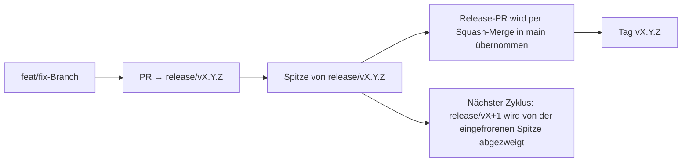

# Branching & Release Model (Deutsch)

🌐 **Languages:** 🇺🇸 [English](../../../../ops/BRANCHING_MODEL.md) · 🇪🇹 [am](../../../am/docs/ops/BRANCHING_MODEL.md) · 🇸🇦 [ar](../../../ar/docs/ops/BRANCHING_MODEL.md) · 🇦🇿 [az](../../../az/docs/ops/BRANCHING_MODEL.md) · 🇧🇬 [bg](../../../bg/docs/ops/BRANCHING_MODEL.md) · 🇧🇩 [bn](../../../bn/docs/ops/BRANCHING_MODEL.md) · 🇧🇦 [bs](../../../bs/docs/ops/BRANCHING_MODEL.md) · 🇨🇿 [cs](../../../cs/docs/ops/BRANCHING_MODEL.md) · 🇩🇰 [da](../../../da/docs/ops/BRANCHING_MODEL.md) · 🇬🇷 [el](../../../el/docs/ops/BRANCHING_MODEL.md) · 🇪🇸 [es](../../../es/docs/ops/BRANCHING_MODEL.md) · 🇪🇪 [et](../../../et/docs/ops/BRANCHING_MODEL.md) · 🇮🇷 [fa](../../../fa/docs/ops/BRANCHING_MODEL.md) · 🇫🇮 [fi](../../../fi/docs/ops/BRANCHING_MODEL.md) · 🇫🇷 [fr](../../../fr/docs/ops/BRANCHING_MODEL.md) · 🇮🇪 [ga](../../../ga/docs/ops/BRANCHING_MODEL.md) · 🇮🇳 [gu](../../../gu/docs/ops/BRANCHING_MODEL.md) · 🇳🇬 [ha](../../../ha/docs/ops/BRANCHING_MODEL.md) · 🇮🇱 [he](../../../he/docs/ops/BRANCHING_MODEL.md) · 🇮🇳 [hi](../../../hi/docs/ops/BRANCHING_MODEL.md) · 🇭🇷 [hr](../../../hr/docs/ops/BRANCHING_MODEL.md) · 🇭🇺 [hu](../../../hu/docs/ops/BRANCHING_MODEL.md) · 🇦🇲 [hy](../../../hy/docs/ops/BRANCHING_MODEL.md) · 🇮🇩 [id](../../../id/docs/ops/BRANCHING_MODEL.md) · 🇳🇬 [ig](../../../ig/docs/ops/BRANCHING_MODEL.md) · 🇮🇹 [it](../../../it/docs/ops/BRANCHING_MODEL.md) · 🇯🇵 [ja](../../../ja/docs/ops/BRANCHING_MODEL.md) · 🇬🇪 [ka](../../../ka/docs/ops/BRANCHING_MODEL.md) · 🇰🇭 [km](../../../km/docs/ops/BRANCHING_MODEL.md) · 🇮🇳 [kn](../../../kn/docs/ops/BRANCHING_MODEL.md) · 🇰🇷 [ko](../../../ko/docs/ops/BRANCHING_MODEL.md) · 🇱🇹 [lt](../../../lt/docs/ops/BRANCHING_MODEL.md) · 🇱🇻 [lv](../../../lv/docs/ops/BRANCHING_MODEL.md) · 🇮🇳 [ml](../../../ml/docs/ops/BRANCHING_MODEL.md) · 🇮🇳 [mr](../../../mr/docs/ops/BRANCHING_MODEL.md) · 🇲🇾 [ms](../../../ms/docs/ops/BRANCHING_MODEL.md) · 🇲🇹 [mt](../../../mt/docs/ops/BRANCHING_MODEL.md) · 🇲🇲 [my](../../../my/docs/ops/BRANCHING_MODEL.md) · 🇳🇵 [ne](../../../ne/docs/ops/BRANCHING_MODEL.md) · 🇳🇱 [nl](../../../nl/docs/ops/BRANCHING_MODEL.md) · 🇳🇴 [no](../../../no/docs/ops/BRANCHING_MODEL.md) · 🇮🇳 [or](../../../or/docs/ops/BRANCHING_MODEL.md) · 🇮🇳 [pa](../../../pa/docs/ops/BRANCHING_MODEL.md) · 🇵🇭 [phi](../../../phi/docs/ops/BRANCHING_MODEL.md) · 🇵🇱 [pl](../../../pl/docs/ops/BRANCHING_MODEL.md) · 🇵🇹 [pt](../../../pt/docs/ops/BRANCHING_MODEL.md) · 🇧🇷 [pt-BR](../../../pt-BR/docs/ops/BRANCHING_MODEL.md) · 🇷🇴 [ro](../../../ro/docs/ops/BRANCHING_MODEL.md) · 🇷🇺 [ru](../../../ru/docs/ops/BRANCHING_MODEL.md) · 🇱🇰 [si](../../../si/docs/ops/BRANCHING_MODEL.md) · 🇸🇰 [sk](../../../sk/docs/ops/BRANCHING_MODEL.md) · 🇸🇮 [sl](../../../sl/docs/ops/BRANCHING_MODEL.md) · 🇷🇸 [sr](../../../sr/docs/ops/BRANCHING_MODEL.md) · 🇸🇪 [sv](../../../sv/docs/ops/BRANCHING_MODEL.md) · 🇰🇪 [sw](../../../sw/docs/ops/BRANCHING_MODEL.md) · 🇮🇳 [ta](../../../ta/docs/ops/BRANCHING_MODEL.md) · 🇮🇳 [te](../../../te/docs/ops/BRANCHING_MODEL.md) · 🇹🇭 [th](../../../th/docs/ops/BRANCHING_MODEL.md) · 🇹🇷 [tr](../../../tr/docs/ops/BRANCHING_MODEL.md) · 🇺🇦 [uk-UA](../../../uk-UA/docs/ops/BRANCHING_MODEL.md) · 🇵🇰 [ur](../../../ur/docs/ops/BRANCHING_MODEL.md) · 🇺🇿 [uz](../../../uz/docs/ops/BRANCHING_MODEL.md) · 🇻🇳 [vi](../../../vi/docs/ops/BRANCHING_MODEL.md) · 🇳🇬 [yo](../../../yo/docs/ops/BRANCHING_MODEL.md) · 🇨🇳 [zh-CN](../../../zh-CN/docs/ops/BRANCHING_MODEL.md) · 🇹🇼 [zh-TW](../../../zh-TW/docs/ops/BRANCHING_MODEL.md)

---

OmniRoute verwendet ein **Parallelzyklus**-Release-Modell: einen dedizierten Branch `release/vX.Y.Z`
für den aktiven Zyklus, `main` für die veröffentlichte Linie und ein unveränderliches
`vX.Y.Z`-Tag, sobald dieser Zyklus veröffentlicht wird. Dass Commits sowohl auf `release/*` _als auch_ auf
`main` landen, ist zu erwarten — es handelt sich nicht um eine Verwechslung.

Details für Maintainer befinden sich in `CLAUDE.md` (Feste Regel Nr. 21) und
[RELEASE_CHECKLIST.md](./RELEASE_CHECKLIST.md). Diese Seite ist die öffentliche,
an Mitwirkende gerichtete Zusammenfassung.

## Auf einen Blick

| Ref              | Rolle                                                                                                                                  |
| ---------------- | -------------------------------------------------------------------------------------------------------------------------------------- |
| `release/vX.Y.Z` | **Aktiver Zyklus** — tägliche Entwicklung und PR-Merges für diese Version                                                              |
| `main`           | **Veröffentlichte Linie** — übernimmt den Zyklus per Squash-Merge, wenn das Release veröffentlicht wird                                |
| `vX.Y.Z` (Tag)   | **Veröffentlichungsmarkierung** — unveränderlicher Verweis darauf, „was veröffentlicht wurde“, der zum Release-Zeitpunkt erstellt wird |



## Auf welchen Branch sollte mein PR abzielen?

**Wähle den aktiven Branch `release/vX.Y.Z` als Ziel — nicht `main`.**

1. Ermittle den höchsten offenen Branch `release/v*` (Beispiel zum Zeitpunkt der Erstellung:
   `release/v3.8.49`).
2. Erstelle deinen Branch von dessen Spitze aus (`git fetch` + Checkout/Rebase darauf).
3. Öffne den PR mit **base = diesem `release/vX.Y.Z`**.

`main` ist nicht der Integrations-Branch für die tägliche Entwicklung. PRs, die gegen `main`
geöffnet werden, müssen vor dem Merge normalerweise auf einen anderen Ziel-Branch umgestellt werden.

## Release-Freeze (parallele Zyklen)

Wenn ein Release abgeglichen wird, wird ein Markierungs-Issue mit dem Label `release-freeze`
geöffnet. Das **hält die Entwicklung nicht auf**:

- Der eingefrorene Branch `release/vX.Y.Z` gehört für dieses Release dem Release-Captain.
- Der nächste Zyklus `release/vX+1` wird von der eingefrorenen Spitze abgezweigt, damit Mitwirkende ihre
  Arbeit weiterhin einbringen können.
- Offene PRs, die weiterhin auf den eingefrorenen Branch abzielen, sollten auf den
  aktiven (höchsten) Branch `release/v*` **umgestellt** werden.

Prüfe, ob ein offener Freeze besteht, bevor du davon ausgehst, dass der gewünschte Branch zusammengeführt werden kann:

```bash
gh issue list --repo diegosouzapw/OmniRoute --label release-freeze --state open
```

Die Merge-Mechanik (`queue`-Label des Owners → Mergify) ist in
[MERGE_TRAIN.md](./MERGE_TRAIN.md) dokumentiert.

## Warum sowohl ein Branch als auch ein Tag?

| Artefakt         | Lebensdauer      | Zweck                                                                        |
| ---------------- | ---------------- | ---------------------------------------------------------------------------- |
| `release/vX.Y.Z` | Laufender Zyklus | Sammelt geprüfte PRs, bleibt in CI fehlerfrei und dient als PR-Basis         |
| Tag `vX.Y.Z`     | Dauerhaft        | Markiert den exakten Stand, der auf npm/GitHub Releases veröffentlicht wurde |

Der Branch ist die Werkstatt, das Tag ist das versiegelte Paket. Nach dem Squash-Merge in
`main` wird der nächste Zyklus auf `release/vX+1` fortgesetzt, ohne auf den Abschluss des vorherigen
Release-PRs zu warten.

## Verwandte Dokumentation

- [CONTRIBUTING.md](../../CONTRIBUTING.md) — Einrichtung, Tests, PR-Checkliste
- [RELEASE_CHECKLIST.md](./RELEASE_CHECKLIST.md) — Validierung vor der Veröffentlichung
- [MERGE_TRAIN.md](./MERGE_TRAIN.md) — Merge-Warteschlange und Ausweichverfahren
- [RELEASE_GREEN.md](./RELEASE_GREEN.md) — die Release-Spitze fehlerfrei halten
