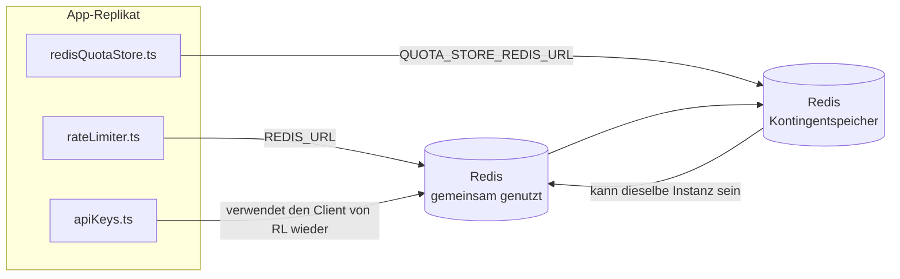

# Redis Production Configuration Guide (Deutsch)

🌐 **Languages:** 🇺🇸 [English](../../../../ops/REDIS_PRODUCTION_CONFIG.md) · 🇪🇹 [am](../../../am/docs/ops/REDIS_PRODUCTION_CONFIG.md) · 🇸🇦 [ar](../../../ar/docs/ops/REDIS_PRODUCTION_CONFIG.md) · 🇦🇿 [az](../../../az/docs/ops/REDIS_PRODUCTION_CONFIG.md) · 🇧🇬 [bg](../../../bg/docs/ops/REDIS_PRODUCTION_CONFIG.md) · 🇧🇩 [bn](../../../bn/docs/ops/REDIS_PRODUCTION_CONFIG.md) · 🇧🇦 [bs](../../../bs/docs/ops/REDIS_PRODUCTION_CONFIG.md) · 🇨🇿 [cs](../../../cs/docs/ops/REDIS_PRODUCTION_CONFIG.md) · 🇩🇰 [da](../../../da/docs/ops/REDIS_PRODUCTION_CONFIG.md) · 🇬🇷 [el](../../../el/docs/ops/REDIS_PRODUCTION_CONFIG.md) · 🇪🇸 [es](../../../es/docs/ops/REDIS_PRODUCTION_CONFIG.md) · 🇪🇪 [et](../../../et/docs/ops/REDIS_PRODUCTION_CONFIG.md) · 🇮🇷 [fa](../../../fa/docs/ops/REDIS_PRODUCTION_CONFIG.md) · 🇫🇮 [fi](../../../fi/docs/ops/REDIS_PRODUCTION_CONFIG.md) · 🇫🇷 [fr](../../../fr/docs/ops/REDIS_PRODUCTION_CONFIG.md) · 🇮🇪 [ga](../../../ga/docs/ops/REDIS_PRODUCTION_CONFIG.md) · 🇮🇳 [gu](../../../gu/docs/ops/REDIS_PRODUCTION_CONFIG.md) · 🇳🇬 [ha](../../../ha/docs/ops/REDIS_PRODUCTION_CONFIG.md) · 🇮🇱 [he](../../../he/docs/ops/REDIS_PRODUCTION_CONFIG.md) · 🇮🇳 [hi](../../../hi/docs/ops/REDIS_PRODUCTION_CONFIG.md) · 🇭🇷 [hr](../../../hr/docs/ops/REDIS_PRODUCTION_CONFIG.md) · 🇭🇺 [hu](../../../hu/docs/ops/REDIS_PRODUCTION_CONFIG.md) · 🇦🇲 [hy](../../../hy/docs/ops/REDIS_PRODUCTION_CONFIG.md) · 🇮🇩 [id](../../../id/docs/ops/REDIS_PRODUCTION_CONFIG.md) · 🇳🇬 [ig](../../../ig/docs/ops/REDIS_PRODUCTION_CONFIG.md) · 🇮🇹 [it](../../../it/docs/ops/REDIS_PRODUCTION_CONFIG.md) · 🇯🇵 [ja](../../../ja/docs/ops/REDIS_PRODUCTION_CONFIG.md) · 🇬🇪 [ka](../../../ka/docs/ops/REDIS_PRODUCTION_CONFIG.md) · 🇰🇭 [km](../../../km/docs/ops/REDIS_PRODUCTION_CONFIG.md) · 🇮🇳 [kn](../../../kn/docs/ops/REDIS_PRODUCTION_CONFIG.md) · 🇰🇷 [ko](../../../ko/docs/ops/REDIS_PRODUCTION_CONFIG.md) · 🇱🇹 [lt](../../../lt/docs/ops/REDIS_PRODUCTION_CONFIG.md) · 🇱🇻 [lv](../../../lv/docs/ops/REDIS_PRODUCTION_CONFIG.md) · 🇮🇳 [ml](../../../ml/docs/ops/REDIS_PRODUCTION_CONFIG.md) · 🇮🇳 [mr](../../../mr/docs/ops/REDIS_PRODUCTION_CONFIG.md) · 🇲🇾 [ms](../../../ms/docs/ops/REDIS_PRODUCTION_CONFIG.md) · 🇲🇹 [mt](../../../mt/docs/ops/REDIS_PRODUCTION_CONFIG.md) · 🇲🇲 [my](../../../my/docs/ops/REDIS_PRODUCTION_CONFIG.md) · 🇳🇵 [ne](../../../ne/docs/ops/REDIS_PRODUCTION_CONFIG.md) · 🇳🇱 [nl](../../../nl/docs/ops/REDIS_PRODUCTION_CONFIG.md) · 🇳🇴 [no](../../../no/docs/ops/REDIS_PRODUCTION_CONFIG.md) · 🇮🇳 [or](../../../or/docs/ops/REDIS_PRODUCTION_CONFIG.md) · 🇮🇳 [pa](../../../pa/docs/ops/REDIS_PRODUCTION_CONFIG.md) · 🇵🇭 [phi](../../../phi/docs/ops/REDIS_PRODUCTION_CONFIG.md) · 🇵🇱 [pl](../../../pl/docs/ops/REDIS_PRODUCTION_CONFIG.md) · 🇵🇹 [pt](../../../pt/docs/ops/REDIS_PRODUCTION_CONFIG.md) · 🇧🇷 [pt-BR](../../../pt-BR/docs/ops/REDIS_PRODUCTION_CONFIG.md) · 🇷🇴 [ro](../../../ro/docs/ops/REDIS_PRODUCTION_CONFIG.md) · 🇷🇺 [ru](../../../ru/docs/ops/REDIS_PRODUCTION_CONFIG.md) · 🇱🇰 [si](../../../si/docs/ops/REDIS_PRODUCTION_CONFIG.md) · 🇸🇰 [sk](../../../sk/docs/ops/REDIS_PRODUCTION_CONFIG.md) · 🇸🇮 [sl](../../../sl/docs/ops/REDIS_PRODUCTION_CONFIG.md) · 🇷🇸 [sr](../../../sr/docs/ops/REDIS_PRODUCTION_CONFIG.md) · 🇸🇪 [sv](../../../sv/docs/ops/REDIS_PRODUCTION_CONFIG.md) · 🇰🇪 [sw](../../../sw/docs/ops/REDIS_PRODUCTION_CONFIG.md) · 🇮🇳 [ta](../../../ta/docs/ops/REDIS_PRODUCTION_CONFIG.md) · 🇮🇳 [te](../../../te/docs/ops/REDIS_PRODUCTION_CONFIG.md) · 🇹🇭 [th](../../../th/docs/ops/REDIS_PRODUCTION_CONFIG.md) · 🇹🇷 [tr](../../../tr/docs/ops/REDIS_PRODUCTION_CONFIG.md) · 🇺🇦 [uk-UA](../../../uk-UA/docs/ops/REDIS_PRODUCTION_CONFIG.md) · 🇵🇰 [ur](../../../ur/docs/ops/REDIS_PRODUCTION_CONFIG.md) · 🇺🇿 [uz](../../../uz/docs/ops/REDIS_PRODUCTION_CONFIG.md) · 🇻🇳 [vi](../../../vi/docs/ops/REDIS_PRODUCTION_CONFIG.md) · 🇳🇬 [yo](../../../yo/docs/ops/REDIS_PRODUCTION_CONFIG.md) · 🇨🇳 [zh-CN](../../../zh-CN/docs/ops/REDIS_PRODUCTION_CONFIG.md) · 🇹🇼 [zh-TW](../../../zh-TW/docs/ops/REDIS_PRODUCTION_CONFIG.md)

---

## Übersicht

Redis ist eine **optionale, nicht zwingende Abhängigkeit** in OmniRoute — die Anwendung arbeitet bei nicht verfügbarem Redis mit eingeschränkter Funktionalität weiter (In-Memory-
Fallbacks). In Produktionsumgebungen reduziert die Optimierung von Redis die Latenz für vier unterschiedliche
Workloads:

| Workload                          | Treiber                       | Client-Factory                                                     | Schlüsselmuster                                                |
| --------------------------------- | ----------------------------- | ------------------------------------------------------------------ | -------------------------------------------------------------- |
| Ratenbegrenzung                   | `rateLimiter.ts`              | `getRedisClient()` — verzögert initialisiertes `ioredis`-Singleton | `<prefix>rl:*` Lua-atomare Zeitfenster für die Ratenbegrenzung |
| Authentifizierungs-Cache          | `apiKeys.ts`                  | Verwendet den Client von `rateLimiter` erneut                      | `<prefix>auth:api_key:<sha256>` mit TTL                        |
| Kontingentspeicher                | `redisQuotaStore.ts`          | Separates `getRedisClient(url)`-Singleton                          | `<prefix>quota:*` pro Instanz konfigurierbar                   |
| Circuit Breaker für das Aufwärmen | `redisCircuitBreakerStore.ts` | Separater Client in `circuitBreakerFactory.ts`                     | `<prefix>warmup:cb:<connectionId>`                             |

Alle vier Workloads verwenden dasselbe Namespace-Präfix, damit OmniRoute zusammen mit anderen Anwendungen auf einer
einzelnen Redis-Instanz betrieben werden kann (z. B. `127.0.0.1:6379`). Siehe [Schlüssel-Namespaces](#key-namespacing).

---

## Aktuelle Konfiguration (Code-Standardwerte)

| Einstellung                               | Wert                                                                   | Fundstelle                                                                            |
| ----------------------------------------- | ---------------------------------------------------------------------- | ------------------------------------------------------------------------------------- |
| Umgebungsvariable `REDIS_URL`             | `redis://redis:6379` (Compose), optional                               | `rateLimiter.ts:5`, `.env.example`                                                    |
| Umgebungsvariable `REDIS_KEY_PREFIX`      | `omniroute:` (Standardwert)                                            | `rateLimiter.ts`, `redisQuotaStore.ts`, `redisCircuitBreakerStore.ts`, `.env.example` |
| Umgebungsvariable `QUOTA_STORE_REDIS_URL` | separat, kann von `REDIS_URL` abweichen                                | `quota/storeFactory.ts`                                                               |
| `QUOTA_STORE_DRIVER`                      | `"sqlite"` (Standardwert), `"redis"` optional                          | `quota/storeFactory.ts`                                                               |
| ioredis `maxRetriesPerRequest`            | `3`                                                                    | Client-Erstellung in `rateLimiter.ts`                                                 |
| `enableReadyCheck`                        | nicht festgelegt (ioredis-Standardwert: `true`)                        | —                                                                                     |
| `lazyConnect`                             | nicht festgelegt (ioredis-Standardwert: `false`)                       | —                                                                                     |
| `retryStrategy`                           | nicht festgelegt (ioredis-Standardwert: 200ms Basiswert, exponentiell) | —                                                                                     |
| TLS / Passwort / DB-Index                 | **nicht konfiguriert**                                                 | —                                                                                     |
| Sentinel / Cluster                        | **nicht konfiguriert** — nur eigenständiger Einzelknoten               | —                                                                                     |

---

## Schlüssel-Namespaces

OmniRoute verwendet eine Redis-Instanz gemeinsam mit allen anderen Anwendungen, die auf dem Host ausgeführt werden. Ohne einen Namespace
könnten Schlüssel wie `auth:api_key:<sha256>` oder `rl:*` mit Schlüsseln anderer Anwendungen kollidieren,
die dasselbe Redis verwenden (diese Instanz führt Redis auf `127.0.0.1:6379` zusammen mit anderen Diensten aus).

Setzen Sie `REDIS_KEY_PREFIX` auf eine nicht leere Zeichenfolge, um **jedem** OmniRoute-Schlüssel ein Präfix voranzustellen:

```bash
# .env — alle OmniRoute-Schlüssel werden zu omniroute:rl:*, omniroute:auth:*, omniroute:quota:*, omniroute:warmup:cb:*
REDIS_KEY_PREFIX=omniroute:
```

- **Standardwert:** `omniroute:` (wird angewendet, wenn `REDIS_KEY_PREFIX` nicht gesetzt oder leer ist).
- **Angewendet auf:** Ratenbegrenzer + Authentifizierungs-Cache (gemeinsam genutzter `ioredis`-Client über `keyPrefix`), den
  Kontingentspeicher (`KEY_PREFIX = "${REDIS_KEY_PREFIX}quota"`) und den Circuit Breaker für das Aufwärmen
  (`KEY_PREFIX = "${REDIS_KEY_PREFIX}warmup:cb:"`).
- **Eine Änderung des Präfixes**, während bereits Schlüssel in Redis vorhanden sind, lässt die alten Schlüssel verwaist zurück (sie laufen
  über TTL / LRU ab). Eine Änderung ist sicher; es ist keine Migration erforderlich. Die einzige Ausnahme ist ein Warmup-
  Circuit-Breaker-Schlüssel für eine als unzulässig markierte Verbindung: Er wird ohne TTL dauerhaft gespeichert. Listen Sie daher
  verbliebene Schlüssel mit `redis-cli --scan --pattern '<old-prefix>warmup:cb:*'` auf und löschen Sie sie.
- **ioredis `keyPrefix`** stellt das Präfix bei Schreibvorgängen automatisch voran **und** entfernt es bei Lesevorgängen,
  sodass der Anwendungscode das Präfix nie sieht.

---

## Empfohlene Optimierung für den Produktivbetrieb

### 1. Verbindungspool-/Client-Optionen (ioredis-Konstruktor `Redis`)

Der aktuelle Code erstellt ein einzelnes `new Redis(url)` ohne benutzerdefinierte Optionen. Übergeben Sie für produktive Bereitstellungen mit mehreren Replikaten eine Client-Factory im Code oder kapseln Sie `getRedisClient()`:

```typescript
const redis = new Redis(REDIS_URL, {
  maxRetriesPerRequest: null, // kein Wiederholungslimit; retryStrategy entscheidet
  enableReadyCheck: true, // prüfen, ob der Server bereit ist, bevor Aufrufe akzeptiert werden
  lazyConnect: true, // nicht bei der Konstruktion verbinden; auf den ersten Aufruf warten
  retryStrategy: (times) => {
    if (times > 10) return null; // nach 10 Versuchen aufgeben → später erneut verbinden
    return Math.min(times * 200, 5000); // 200ms, 400ms, …, maximal 5s
  },
  enableAutoPipelining: true, // gleichzeitige Befehle in einem TCP-Schreibvorgang zusammenfassen
  keepAlive: 10000, // TCP-Keep-Alive alle 10s
});
```

**Wichtige Abwägungen:**

- `maxRetriesPerRequest: null` + `retryStrategy` — für den Produktivbetrieb bevorzugt, damit vorübergehende Redis-Neustarts nicht sofort jede Anfrage fehlschlagen lassen. Der In-Memory-Fallback in `checkRateLimit()` fängt den Fehlerpfad ab.
- `lazyConnect: true` — verhindert, dass der Serverstart davon abhängt, dass Redis bereits verfügbar ist, bevor der Server Verbindungen annimmt.
- `enableAutoPipelining: true` — reduziert Roundtrips bei gleichzeitigen Ratenbegrenzungsprüfungen; vorteilhaft bei >50 RPS über eine einzelne Verbindung.

### 2. Redis-Serverkonfiguration (`redis.conf`)

```
# Arbeitsspeicher
maxmemory 80%                        # Platz für den Seiten-Cache des Betriebssystems lassen
maxmemory-policy allkeys-lru         # veraltete Auth-Cache-Einträge bei Speicherdruck entfernen

# Persistenz (optional — OmniRoute ist auch ohne sie absturzsicher)
save 300 1                           # mindestens alle 5 Minuten einen Snapshot erstellen, wenn sich ≥1 Schlüssel geändert hat
appendonly no                        # AOF nicht erforderlich; Daten können neu erzeugt werden
appendfsync no                       # kein fsync-Mehraufwand (RDB ist ausreichend)

# Netzwerk
timeout 0                            # keine Trennung bei Inaktivität
tcp-keepalive 300                    # Keep-Alive von 5 Minuten
tcp-backlog 511                      # Verbindungswarteschlange für Lastspitzen

# Leistung
hz 10                                # Standardwert; 100 für latenzkritische Anwendungen
activedefrag yes                     # automatische Defragmentierung bei einer Fragmentierung von >10 %
```

**Abwägung bei `maxmemory-policy allkeys-lru`:** Auth-Cache-Einträge können bei Speicherdruck entfernt werden. Dies ist unproblematisch — `setCachedApiKey` füllt den Cache bei einem Fehltreffer stets erneut, und der SQLite-Fallback ist maßgeblich. Das Lua-Skript des Ratenbegrenzers erstellt kleine Schlüssel, die bewusst kurzlebig sind.

### 3. Docker-Compose-Einstellungen

Die produktive Compose-Datei (`docker-compose.prod.yml`) verwendet `redis:8.6.2-alpine`. Fügen Sie Folgendes hinzu:

```yaml
redis:
  image: redis:8.6.2-alpine
  command:
    [
      "redis-server",
      "--maxmemory",
      "512mb",
      "--maxmemory-policy",
      "allkeys-lru",
      "--activedefrag",
      "yes",
      "--save",
      "300 1",
    ]
  healthcheck:
    test: ["CMD", "redis-cli", "ping"]
    interval: 10s
    timeout: 3s
    retries: 3
    start_period: 5s
```

### 4. Überlegungen zu mehreren Instanzen und zur Skalierung

**Ein einzelner Redis-Server für alle Replikate** — das Lua-Skript des Ratenbegrenzers ist auf einen einzigen maßgeblichen Schlüsselraum angewiesen. Mehrere Redis-Instanzen hinter den Replikaten würden die Atomarität aufheben und das Budget verdoppeln. Verwenden Sie für alle Anwendungsreplikate einen einzelnen Redis-Server (oder einen Redis-Sentinel-Cluster mit Failover).

**Anzahl der Verbindungen:** Jedes Anwendungsreplikat öffnet **2 TCP-Verbindungen** zu Redis (Client des Ratenbegrenzers + Client des Kontingentspeichers). Bei 10 Replikaten → 20 Verbindungen, deutlich innerhalb des standardmäßigen Verbindungslimits einer Redis-Instanz von 10.000 Verbindungen.

### 5. Überwachung

Über den Health-Check-Endpunkt bereitstellen:

```typescript
// src/app/api/monitoring/health/route.ts ruft bereits Funktionen des Ratenbegrenzers auf
// Redis-spezifische Prüfungen hinzufügen:
//   1. PING-Latenz über ioredis .ping()
//   2. Speichernutzung über INFO memory
//   3. Anzahl der Verbindungen über INFO clients
//   4. Trefferrate für maxmemory-policy (evicted_keys / keyspace_hits)
```

Wichtige zu überwachende Metriken:

- **Entfernte Schlüssel/Sek.** — wenn der Wert dauerhaft ungleich null ist, `maxmemory` erhöhen
- **Blockierte Clients** — ein Wert ungleich null deutet auf langsame Lua-Skripte oder hohe Konkurrenz hin
- **Abgelehnte Verbindungen** — das Verbindungslimit wurde erreicht; bei 20 Verbindungen selten

---

## Architekturdiagramm



---

## Referenzen

| Datei                              | Zweck                                                                     |
| ---------------------------------- | ------------------------------------------------------------------------- |
| `src/shared/utils/rateLimiter.ts`  | Primärer Redis-Client, Lua-Skript zur Ratenbegrenzung, In-Memory-Fallback |
| `src/lib/db/apiKeys.ts`            | Authentifizierungs-Cache — Redis→SQLite-Fallback                          |
| `src/lib/quota/redisQuotaStore.ts` | Separater Redis-Client für den optionalen Kontingentspeicher              |
| `src/lib/quota/storeFactory.ts`    | Wechselt zwischen den Kontingenttreibern `sqlite` und `redis`             |
| `docker-compose.prod.yml`          | Redis-Container für die Produktion (Image `redis:8.6.2-alpine`)           |
| `.env.example`                     | Dokumentation der Redis-Umgebungsvariablen                                |
| `src/app/api/local/redis/`         | API-Routen zur Orchestrierung des Entwicklungscontainers                  |
| `bin/cli/commands/redis.mjs`       | CLI-Befehle zur Orchestrierung des Entwicklungscontainers                 |
