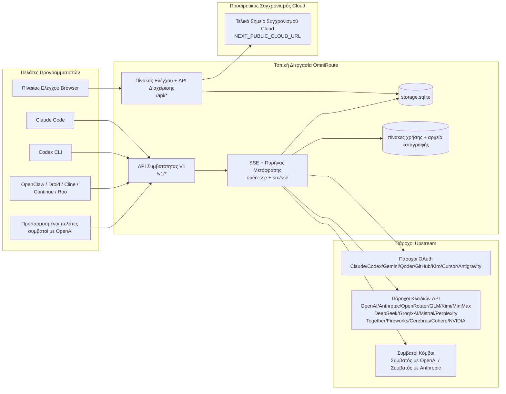
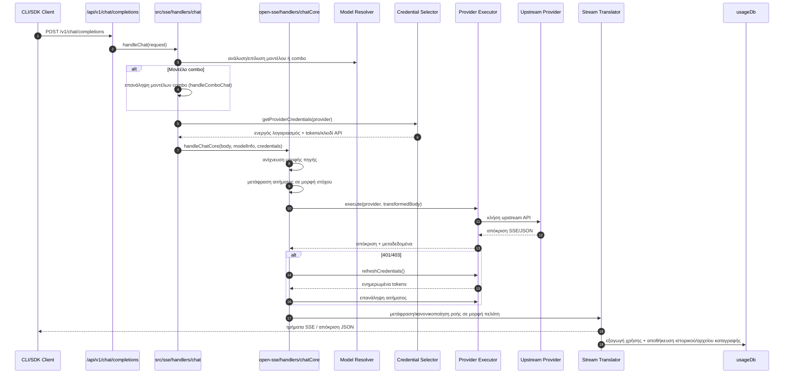
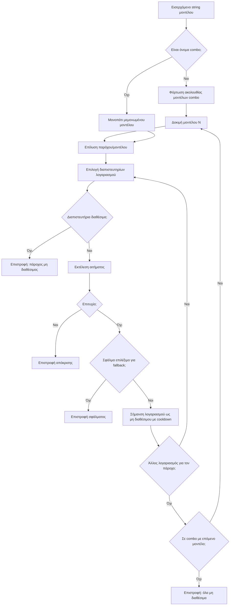
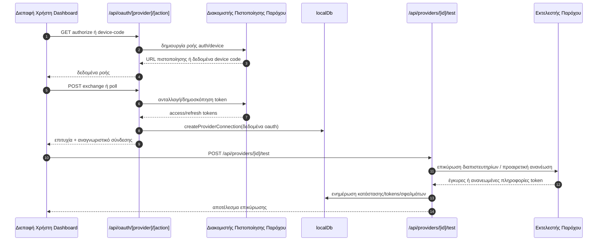
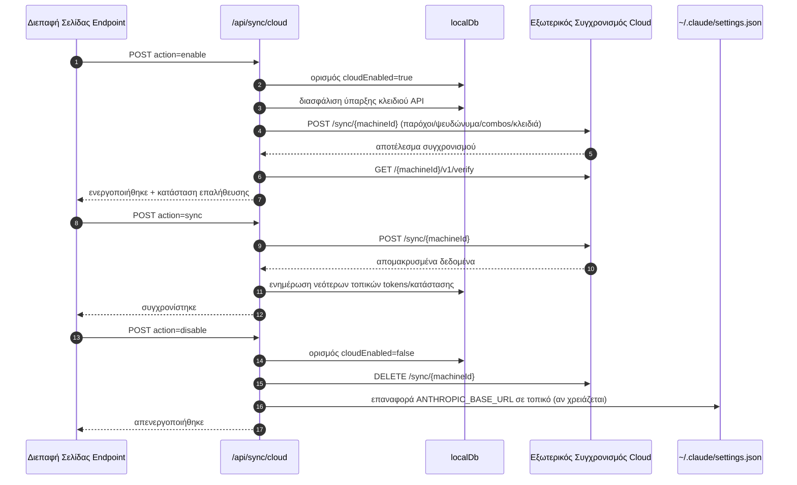
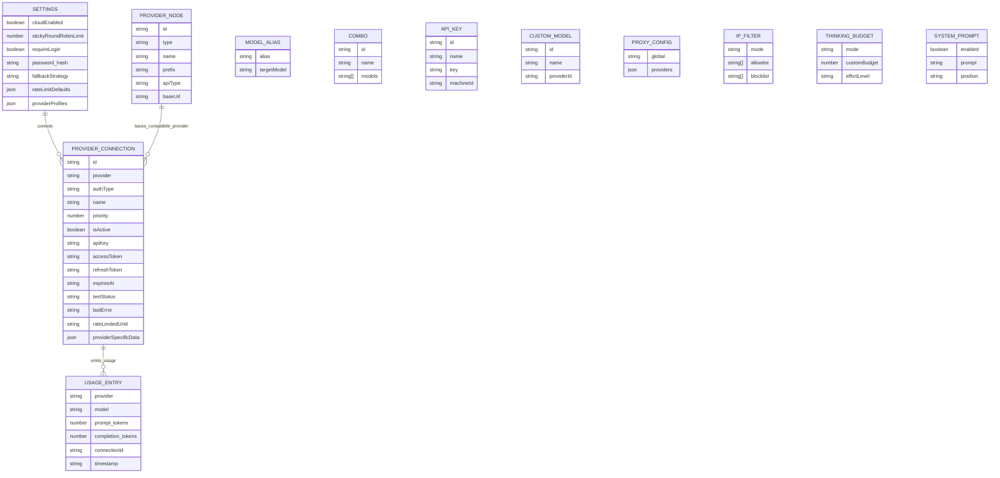
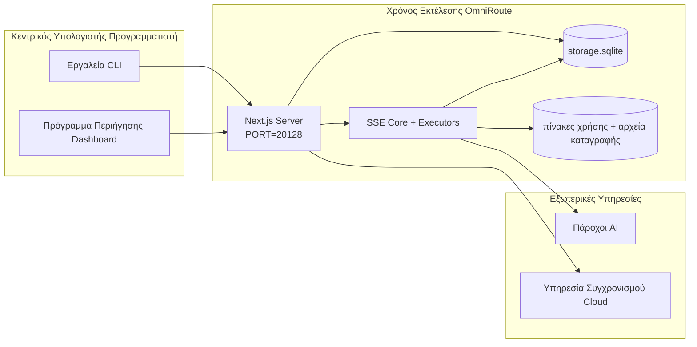

# ARCHITECTURE (Ελληνικά)

🌐 **Languages:** 🇺🇸 [English](../../../../architecture/ARCHITECTURE.md) · 🇸🇦 [ar](../../../ar/docs/architecture/ARCHITECTURE.md) · 🇦🇿 [az](../../../az/docs/architecture/ARCHITECTURE.md) · 🇧🇬 [bg](../../../bg/docs/architecture/ARCHITECTURE.md) · 🇧🇩 [bn](../../../bn/docs/architecture/ARCHITECTURE.md) · 🇨🇿 [cs](../../../cs/docs/architecture/ARCHITECTURE.md) · 🇩🇰 [da](../../../da/docs/architecture/ARCHITECTURE.md) · 🇩🇪 [de](../../../de/docs/architecture/ARCHITECTURE.md) · 🇪🇸 [es](../../../es/docs/architecture/ARCHITECTURE.md) · 🇪🇪 [et](../../../et/docs/architecture/ARCHITECTURE.md) · 🇮🇷 [fa](../../../fa/docs/architecture/ARCHITECTURE.md) · 🇫🇮 [fi](../../../fi/docs/architecture/ARCHITECTURE.md) · 🇫🇷 [fr](../../../fr/docs/architecture/ARCHITECTURE.md) · 🇮🇪 [ga](../../../ga/docs/architecture/ARCHITECTURE.md) · 🇮🇳 [gu](../../../gu/docs/architecture/ARCHITECTURE.md) · 🇮🇱 [he](../../../he/docs/architecture/ARCHITECTURE.md) · 🇮🇳 [hi](../../../hi/docs/architecture/ARCHITECTURE.md) · 🇭🇷 [hr](../../../hr/docs/architecture/ARCHITECTURE.md) · 🇭🇺 [hu](../../../hu/docs/architecture/ARCHITECTURE.md) · 🇮🇩 [id](../../../id/docs/architecture/ARCHITECTURE.md) · 🇮🇹 [it](../../../it/docs/architecture/ARCHITECTURE.md) · 🇯🇵 [ja](../../../ja/docs/architecture/ARCHITECTURE.md) · 🇰🇷 [ko](../../../ko/docs/architecture/ARCHITECTURE.md) · 🇱🇹 [lt](../../../lt/docs/architecture/ARCHITECTURE.md) · 🇱🇻 [lv](../../../lv/docs/architecture/ARCHITECTURE.md) · 🇮🇳 [mr](../../../mr/docs/architecture/ARCHITECTURE.md) · 🇲🇾 [ms](../../../ms/docs/architecture/ARCHITECTURE.md) · 🇲🇹 [mt](../../../mt/docs/architecture/ARCHITECTURE.md) · 🇳🇱 [nl](../../../nl/docs/architecture/ARCHITECTURE.md) · 🇳🇴 [no](../../../no/docs/architecture/ARCHITECTURE.md) · 🇵🇭 [phi](../../../phi/docs/architecture/ARCHITECTURE.md) · 🇵🇱 [pl](../../../pl/docs/architecture/ARCHITECTURE.md) · 🇵🇹 [pt](../../../pt/docs/architecture/ARCHITECTURE.md) · 🇧🇷 [pt-BR](../../../pt-BR/docs/architecture/ARCHITECTURE.md) · 🇷🇴 [ro](../../../ro/docs/architecture/ARCHITECTURE.md) · 🇷🇺 [ru](../../../ru/docs/architecture/ARCHITECTURE.md) · 🇸🇰 [sk](../../../sk/docs/architecture/ARCHITECTURE.md) · 🇸🇮 [sl](../../../sl/docs/architecture/ARCHITECTURE.md) · 🇷🇸 [sr](../../../sr/docs/architecture/ARCHITECTURE.md) · 🇸🇪 [sv](../../../sv/docs/architecture/ARCHITECTURE.md) · 🇰🇪 [sw](../../../sw/docs/architecture/ARCHITECTURE.md) · 🇮🇳 [ta](../../../ta/docs/architecture/ARCHITECTURE.md) · 🇮🇳 [te](../../../te/docs/architecture/ARCHITECTURE.md) · 🇹🇭 [th](../../../th/docs/architecture/ARCHITECTURE.md) · 🇹🇷 [tr](../../../tr/docs/architecture/ARCHITECTURE.md) · 🇺🇦 [uk-UA](../../../uk-UA/docs/architecture/ARCHITECTURE.md) · 🇵🇰 [ur](../../../ur/docs/architecture/ARCHITECTURE.md) · 🇻🇳 [vi](../../../vi/docs/architecture/ARCHITECTURE.md) · 🇨🇳 [zh-CN](../../../zh-CN/docs/architecture/ARCHITECTURE.md) · 🇹🇼 [zh-TW](../../../zh-TW/docs/architecture/ARCHITECTURE.md)

---

---

title: "OmniRoute Architecture"
version: 3.8.40
lastUpdated: 2026-06-28
---

# Αρχιτεκτονική OmniRoute

🌐 **Languages:** 🇺🇸 [English](../../../../architecture/ARCHITECTURE.md) · 🇸🇦 [ar](../../../ar/docs/architecture/ARCHITECTURE.md) · 🇦🇿 [az](../../../az/docs/architecture/ARCHITECTURE.md) · 🇧🇬 [bg](../../../bg/docs/architecture/ARCHITECTURE.md) · 🇧🇩 [bn](../../../bn/docs/architecture/ARCHITECTURE.md) · 🇨🇿 [cs](../../../cs/docs/architecture/ARCHITECTURE.md) · 🇩🇰 [da](../../../da/docs/architecture/ARCHITECTURE.md) · 🇩🇪 [de](../../../de/docs/architecture/ARCHITECTURE.md) · 🇪🇸 [es](../../../es/docs/architecture/ARCHITECTURE.md) · 🇪🇪 [et](../../../et/docs/architecture/ARCHITECTURE.md) · 🇮🇷 [fa](../../../fa/docs/architecture/ARCHITECTURE.md) · 🇫🇮 [fi](../../../fi/docs/architecture/ARCHITECTURE.md) · 🇫🇷 [fr](../../../fr/docs/architecture/ARCHITECTURE.md) · 🇮🇪 [ga](../../../ga/docs/architecture/ARCHITECTURE.md) · 🇮🇳 [gu](../../../gu/docs/architecture/ARCHITECTURE.md) · 🇮🇱 [he](../../../he/docs/architecture/ARCHITECTURE.md) · 🇮🇳 [hi](../../../hi/docs/architecture/ARCHITECTURE.md) · 🇭🇷 [hr](../../../hr/docs/architecture/ARCHITECTURE.md) · 🇭🇺 [hu](../../../hu/docs/architecture/ARCHITECTURE.md) · 🇮🇩 [id](../../../id/docs/architecture/ARCHITECTURE.md) · 🇮🇹 [it](../../../it/docs/architecture/ARCHITECTURE.md) · 🇯🇵 [ja](../../../ja/docs/architecture/ARCHITECTURE.md) · 🇰🇷 [ko](../../../ko/docs/architecture/ARCHITECTURE.md) · 🇱🇹 [lt](../../../lt/docs/architecture/ARCHITECTURE.md) · 🇱🇻 [lv](../../../lv/docs/architecture/ARCHITECTURE.md) · 🇮🇳 [mr](../../../mr/docs/architecture/ARCHITECTURE.md) · 🇲🇾 [ms](../../../ms/docs/architecture/ARCHITECTURE.md) · 🇲🇹 [mt](../../../mt/docs/architecture/ARCHITECTURE.md) · 🇳🇱 [nl](../../../nl/docs/architecture/ARCHITECTURE.md) · 🇳🇴 [no](../../../no/docs/architecture/ARCHITECTURE.md) · 🇵🇭 [phi](../../../phi/docs/architecture/ARCHITECTURE.md) · 🇵🇱 [pl](../../../pl/docs/architecture/ARCHITECTURE.md) · 🇵🇹 [pt](../../../pt/docs/architecture/ARCHITECTURE.md) · 🇧🇷 [pt-BR](../../../pt-BR/docs/architecture/ARCHITECTURE.md) · 🇷🇴 [ro](../../../ro/docs/architecture/ARCHITECTURE.md) · 🇷🇺 [ru](../../../ru/docs/architecture/ARCHITECTURE.md) · 🇸🇰 [sk](../../../sk/docs/architecture/ARCHITECTURE.md) · 🇸🇮 [sl](../../../sl/docs/architecture/ARCHITECTURE.md) · 🇷🇸 [sr](../../../sr/docs/architecture/ARCHITECTURE.md) · 🇸🇪 [sv](../../../sv/docs/architecture/ARCHITECTURE.md) · 🇰🇪 [sw](../../../sw/docs/architecture/ARCHITECTURE.md) · 🇮🇳 [ta](../../../ta/docs/architecture/ARCHITECTURE.md) · 🇮🇳 [te](../../../te/docs/architecture/ARCHITECTURE.md) · 🇹🇭 [th](../../../th/docs/architecture/ARCHITECTURE.md) · 🇹🇷 [tr](../../../tr/docs/architecture/ARCHITECTURE.md) · 🇺🇦 [uk-UA](../../../uk-UA/docs/architecture/ARCHITECTURE.md) · 🇵🇰 [ur](../../../ur/docs/architecture/ARCHITECTURE.md) · 🇻🇳 [vi](../../../vi/docs/architecture/ARCHITECTURE.md) · 🇨🇳 [zh-CN](../../../zh-CN/docs/architecture/ARCHITECTURE.md) · 🇹🇼 [zh-TW](../../../zh-TW/docs/architecture/ARCHITECTURE.md)

_Τελευταία ενημέρωση: 2026-06-28_

## Σύνοψη Εκτελεστικής Επισκόπησης

Το OmniRoute είναι μια τοπική πύλη δρομολόγησης AI και ταμπλό ελέγχου βασισμένο στο Next.js.
Παρέχει ένα ενιαίο τελικό σημείο συμβατό με OpenAI (`/v1/*`) και δρομολογεί κίνηση μεταξύ πολλαπλών upstream παρόχων με μετάφραση, εναλλακτική δρομολόγηση, ανανέωση token και παρακολούθηση χρήσης.

Βασικές δυνατότητες:

- Επιφάνεια API συμβατή με OpenAI για CLI/εργαλεία (355 πάροχοι, 108 εκτελεστές)
- Μετάφραση αιτήματος/απόκρισης μεταξύ μορφών παρόχων
- Εναλλακτική δρομολόγηση συνδυασμού μοντέλων (ακολουθία πολλαπλών μοντέλων)
- Δομημένα βήματα συνδυασμού (`provider + model + connection`) με ταξινόμηση χρόνου εκτέλεσης βάσει `compositeTiers`
- Εναλλακτική δρομολόγηση σε επίπεδο λογαριασμού (πολλαπλοί λογαριασμοί ανά πάροχο)
- Προέλεγχος ορίου χρήσης και επιλογή λογαριασμού P2C με ενημερότητα ορίου στην κύρια διαδρομή συνομιλίας
- Διαχείριση σύνδεσης παρόχων μέσω OAuth και κλειδιού API (22 μονάδες παρόχων OAuth)
- Δημιουργία ενσωματώσεων μέσω `/v1/embeddings` (18 πάροχοι)
- Δημιουργία εικόνων μέσω `/v1/images/generations` (10+ πάροχοι, 20+ μοντέλα)
- Μεταγραφή ήχου μέσω `/v1/audio/transcriptions` (18 πάροχοι)
- Μετατροπή κειμένου σε ομιλία μέσω `/v1/audio/speech` (24 ενσωματωμένοι πάροχοι)
- Δημιουργία βίντεο μέσω `/v1/videos/generations` (ComfyUI + SD WebUI)
- Δημιουργία μουσικής μέσω `/v1/music/generations` (ComfyUI)
- Αναζήτηση ιστού μέσω `/v1/search` (20 πάροχοι)
- Εποπτεία περιεχομένου μέσω `/v1/moderations`
- Επαναταξινόμηση μέσω `/v1/rerank`
- Ανάλυση ετικετών σκέψης (`<think>...</think>`) για μοντέλα συλλογισμού
- Εξυγίανση απόκρισης για αυστηρή συμβατότητα με το OpenAI SDK
- Κανονικοποίηση ρόλων (developer→system, system→user) για διαλειτουργικότητα μεταξύ παρόχων
- Μετατροπή δομημένης εξόδου (json_schema → Gemini responseSchema)
- Τοπική αποθήκευση για παρόχους, κλειδιά, ψευδώνυμα, συνδυασμούς, ρυθμίσεις, τιμολόγηση (122 μονάδες DB)
- Παρακολούθηση χρήσης/κόστους και καταγραφή αιτημάτων
- Προαιρετικός συγχρονισμός cloud για συγχρονισμό κατάστασης μεταξύ πολλαπλών συσκευών
- Λίστα αδειοδοτημένων/αποκλεισμένων IP για έλεγχο πρόσβασης API
- Διαχείριση προϋπολογισμού σκέψης (passthrough/auto/custom/adaptive)
- Καθολική έγχυση προτροπής συστήματος
- Παρακολούθηση συνεδρίας και δακτυλοσκόπηση
- Προηγμένος περιορισμός ρυθμού ανά λογαριασμό με προφίλ ανά πάροχο
- Μοτίβο διακόπτη κυκλώματος για ανθεκτικότητα παρόχου
- Προστασία από φαινόμενο thundering herd με κλείδωμα mutex
- Κρυφή μνήμη αποκλεισμού διπλότυπων αιτημάτων βάσει υπογραφής
- Επίπεδο τομέα: κανόνες κόστους, πολιτική εναλλακτικής δρομολόγησης, πολιτική αποκλεισμού
- Context Relay: περιλήψεις παράδοσης συνεδρίας για συνέχεια εναλλαγής λογαριασμών
- Επιμονή κατάστασης τομέα (κρυφή μνήμη εγγραφής SQLite για εναλλακτικές δρομολογήσεις, προϋπολογισμούς, αποκλεισμούς, διακόπτες κυκλώματος)
- Μηχανή πολιτικής για κεντρική αξιολόγηση αιτημάτων (αποκλεισμός → προϋπολογισμός → εναλλακτική δρομολόγηση)
- Τηλεμετρία αιτημάτων με συγκέντρωση καθυστέρησης p50/p95/p99
- Τηλεμετρία στόχου συνδυασμού και ιστορική υγεία στόχου συνδυασμού μέσω `combo_execution_key` / `combo_step_id`
- Αναγνωριστικό συσχέτισης (X-Request-Id) για ιχνηλάτηση από άκρο σε άκρο
- Καταγραφή ελέγχου συμμόρφωσης με δυνατότητα εξαίρεσης ανά κλειδί API
- Πλαίσιο αξιολόγησης για διασφάλιση ποιότητας LLM
- Ταμπλό ελέγχου υγείας με κατάσταση διακόπτη κυκλώματος παρόχου σε πραγματικό χρόνο
- MCP Server (110 εργαλεία) με 3 μεταφορές (stdio/SSE/Streamable HTTP)
- A2A Server (JSON-RPC 2.0 + SSE) με δεξιότητες και κύκλο ζωής εργασιών
- Σύστημα μνήμης (εξαγωγή, έγχυση, ανάκτηση, περίληψη)
- Σύστημα δεξιοτήτων (μητρώο, εκτελεστής, sandbox, ενσωματωμένες δεξιότητες)
- Μεσολαβητής MITM με διαχείριση πιστοποιητικών και χειρισμό DNS
- Middleware φύλαξης έναντι έγχυσης προτροπών
- Αγωγός συμπίεσης προτροπών με Caveman, RTK, στοιβαγμένους αγωγούς, συνδυασμούς συμπίεσης, γλωσσικά πακέτα και αναλυτικά στοιχεία
- Μητρώο ACP (Πρωτόκολλο Επικοινωνίας Πρακτόρων)
- Αρθρωτοί πάροχοι OAuth (22 μεμονωμένες μονάδες στο `src/lib/oauth/providers/`)
- Σενάρια απεγκατάστασης/πλήρους απεγκατάστασης
- Ενέργεια επισκευής περιβάλλοντος OAuth
- Γέφυρα WebSocket για πελάτες WS συμβατούς με OpenAI (`/v1/ws`)
- Διαχείριση token συγχρονισμού (έκδοση/ανάκληση, λήψη πακέτου ρύθμισης με έκδοση ETag)
- Ενσωματωμένη προεπιλογή παρόχου GLM Thinking (`glmt`)
- Υβριδική μέτρηση token (πλευρά παρόχου `/messages/count_tokens` με εναλλακτική εκτίμηση)
- Αυτόματη σπορά ψευδωνύμων μοντέλων (30+ κανονικοποιήσεις διαλέκτου cross-proxy κατά την εκκίνηση)
- Ασφαλής εξερχόμενη ανάκτηση με φύλαξη SSRF, αποκλεισμό ιδιωτικών URL και διαμορφώσιμες επαναλήψεις
- Επαναλήψεις συνομιλίας με ενημερότητα περιόδου ψύξης με διαμορφώσιμα `requestRetry` και `maxRetryIntervalSec`
- Επικύρωση περιβάλλοντος χρόνου εκτέλεσης με Zod κατά την εκκίνηση
- Ελέγχος συμμόρφωσης v2 με σελιδοποίηση, συμβάντα CRUD παρόχου και καταγραφή επικύρωσης αποκλεισμένη από SSRF

Κύριο μοντέλο χρόνου εκτέλεσης:

- Οι διαδρομές εφαρμογής Next.js στο `src/app/api/*` υλοποιούν τόσο API ταμπλό ελέγχου όσο και API συμβατότητας
- Ένας κοινόχρηστος πυρήνας SSE/δρομολόγησης στο `src/sse/*` + `open-sse/*` διαχειρίζεται την εκτέλεση παρόχου, τη μετάφραση, τη ροή, την εναλλακτική δρομολόγηση και τη χρήση

## Διαγράμματα Αναφοράς

Οι κανονικές, εκδοχοελεγχόμενες πηγές Mermaid για την πλατφόρμα v3.8.0 βρίσκονται στο
[`docs/diagrams/`](../diagrams/README.md). Δύο αναπαράγονται παρακάτω για προσανατολισμό·
τα υπόλοιπα συνδέονται από τους αντίστοιχους οδηγούς ανά τομέα.


> Πηγή: [diagrams/request-pipeline.mmd](../diagrams/request-pipeline.mmd)


> Πηγή: [diagrams/resilience-3layers.mmd](../diagrams/resilience-3layers.mmd) — συνδέεται επίσης από το
> [RESILIENCE_GUIDE.md](./RESILIENCE_GUIDE.md) και την αναφορά ανθεκτικότητας του `CLAUDE.md`.

## Εύρος και Όρια

### Εντός Εύρους

- Τοπικό runtime gateway
- API διαχείρισης Dashboard
- Έλεγχος ταυτότητας παρόχου και ανανέωση token
- Μετάφραση αιτημάτων και ροή SSE
- Τοπική κατάσταση και επιμονή χρήσης
- Προαιρετική ενορχήστρωση συγχρονισμού cloud

### Εκτός Εύρους

- Υλοποίηση υπηρεσίας cloud πίσω από το `NEXT_PUBLIC_CLOUD_URL`
- SLA παρόχου/control plane εκτός τοπικής διεργασίας
- Τα ίδια τα εξωτερικά δυαδικά CLI (Claude CLI, Codex CLI, κ.λπ.)

## Επιφάνεια Dashboard (Τρέχουσα)

Κύριες σελίδες στο `src/app/(dashboard)/dashboard/`:

- `/dashboard` — γρήγορη εκκίνηση + επισκόπηση παρόχου
- `/dashboard/endpoint` — καρτέλες endpoint proxy + MCP + A2A + API endpoint
- `/dashboard/providers` — συνδέσεις παρόχων και διαπιστευτήρια
- `/dashboard/combos` — στρατηγικές combo, πρότυπα, builder βάσει βημάτων, κανόνες δρομολόγησης μοντέλου, μη αυτόματη επίμονη διάταξη
- `/dashboard/auto-combo` — Auto Combo Engine: βάρη βαθμολόγησης, πακέτα λειτουργίας, προεπιλογές εικονικού εργοστασίου, τηλεμετρία
- `/dashboard/costs` — συνάθροιση κόστους και ορατότητα τιμολόγησης
- `/dashboard/analytics` — αναλυτικά χρήσης, αξιολογήσεις, υγεία στόχου combo
- `/dashboard/limits` — έλεγχοι ποσόστωσης/ρυθμού
- `/dashboard/cli-tools` — εισαγωγή CLI, ανίχνευση runtime, δημιουργία ρυθμίσεων
- `/dashboard/agents` — ανιχνευμένοι ACP agents + εγγραφή προσαρμοσμένου agent
- `/dashboard/cloud-agents` — εργασίες agent φιλοξενούμενες στο cloud (Codex Cloud, Devin, Jules) και κύκλος ζωής εργασίας
- `/dashboard/skills` — μητρώο A2A skill, εκτέλεση σε sandbox, ενσωματωμένος κατάλογος skill
- `/dashboard/memory` — επισκόπηση και ανάκτηση επίμονης συνομιλιακής μνήμης
- `/dashboard/webhooks` — εξερχόμενες συνδρομές webhook, εναλλαγή secret, στατιστικά επανάληψης
- `/dashboard/batch` — υποβολή μαζικής εργασίας και πρόοδος
- `/dashboard/cache` — στατιστικά read-through και cache συλλογισμού, έλεγχοι εκκαθάρισης
- `/dashboard/playground` — διαδραστικό playground συνομιλίας έναντι οποιουδήποτε διαμορφωμένου combo/μοντέλου
- `/dashboard/changelog` — πρόγραμμα προβολής changelog εντός εφαρμογής (αποδίδει το `CHANGELOG.md`)
- `/dashboard/system` — διαγνωστικά runtime, πληροφορίες έκδοσης, επιφάνεια επαλήθευσης περιβάλλοντος
- `/dashboard/onboarding` — οδηγός πρώτης εγκατάστασης για νέες εγκαταστάσεις
- `/dashboard/media` — playground εικόνας/βίντεο/μουσικής
- `/dashboard/search-tools` — δοκιμή παρόχου αναζήτησης και ιστορικό
- `/dashboard/health` — uptime, circuit breakers, όρια ρυθμού, συνεδρίες με παρακολούθηση ποσόστωσης
- `/dashboard/logs` — αρχεία καταγραφής αιτημάτων/proxy/ελέγχου/κονσόλας
- `/dashboard/settings` — καρτέλες ρυθμίσεων συστήματος (γενικές, δρομολόγηση, προεπιλογές combo, κ.λπ.)
- `/dashboard/context/caveman` — κανόνες συμπίεσης Caveman, πακέτα γλώσσας, προεπισκόπηση και λειτουργία εξόδου
- `/dashboard/context/rtk` — φίλτρα εξόδου εντολών RTK, προεπισκόπηση και ρυθμίσεις ασφαλείας runtime
- `/dashboard/context/combos` — ονομαστικές αγωγοί συμπίεσης αντιστοιχισμένοι σε combo δρομολόγησης
- `/dashboard/translator` — επισκόπηση μεταφραστή και προεπισκόπηση μετατροπής μορφής αιτήματος
- `/dashboard/audit` — πρόγραμμα περιήγησης αρχείου καταγραφής ελέγχου συμμόρφωσης με σελιδοποίηση και δομημένα μεταδεδομένα
- `/dashboard/usage` — πρόγραμμα περιήγησης χρήσης ανά αίτημα συνδεδεμένο στο `usage_history`
- `/dashboard/compression` — αναλυτικά συμπίεσης, στατιστικά και ανάθεση αγωγού
- `/dashboard/api-manager` — κύκλος ζωής κλειδιού API και δικαιώματα μοντέλου

## Πλαίσιο Συστήματος Υψηλού Επιπέδου



## Βασικά Στοιχεία Χρόνου Εκτέλεσης

## 1) Στρώμα API και Δρομολόγησης (Διαδρομές Εφαρμογής Next.js)

Κύριοι κατάλογοι:

- `src/app/api/v1/*` και `src/app/api/v1beta/*` για APIs συμβατότητας
- `src/app/api/*` για APIs διαχείρισης/ρύθμισης παραμέτρων
- Επανεγγραφές Next στο `next.config.mjs` αντιστοιχίζουν το `/v1/*` στο `/api/v1/*`

Σημαντικές διαδρομές συμβατότητας:

- `src/app/api/v1/chat/completions/route.ts`
- `src/app/api/v1/messages/route.ts`
- `src/app/api/v1/responses/route.ts`
- `src/app/api/v1/models/route.ts` — περιλαμβάνει προσαρμοσμένα μοντέλα με `custom: true`
- `src/app/api/v1/embeddings/route.ts` — δημιουργία ενσωματώσεων (6 πάροχοι)
- `src/app/api/v1/images/generations/route.ts` — δημιουργία εικόνων (4+ πάροχοι συμπεριλαμβανομένων Antigravity/Nebius)
- `src/app/api/v1/messages/count_tokens/route.ts`
- `src/app/api/v1/providers/[provider]/chat/completions/route.ts` — αποκλειστική συνομιλία ανά πάροχο
- `src/app/api/v1/providers/[provider]/embeddings/route.ts` — αποκλειστικές ενσωματώσεις ανά πάροχο
- `src/app/api/v1/providers/[provider]/images/generations/route.ts` — αποκλειστική δημιουργία εικόνων ανά πάροχο
- `src/app/api/v1beta/models/route.ts`
- `src/app/api/v1beta/models/[...path]/route.ts`

Τομείς διαχείρισης:

- Πιστοποίηση/ρυθμίσεις: `src/app/api/auth/*`, `src/app/api/settings/*`
- Πάροχοι/συνδέσεις: `src/app/api/providers*`
- Κόμβοι παρόχων: `src/app/api/provider-nodes*`
- Προσαρμοσμένα μοντέλα: `src/app/api/provider-models` (GET/POST/DELETE)
- Κατάλογος μοντέλων: `src/app/api/models/route.ts` (GET)
- Ρύθμιση παραμέτρων διακομιστή μεσολάβησης: `src/app/api/settings/proxy` (GET/PUT/DELETE) + `src/app/api/settings/proxy/test` (POST)
- OAuth: `src/app/api/oauth/*`
- Κλειδιά/ψευδώνυμα/συνδυασμοί/τιμολόγηση: `src/app/api/keys*`, `src/app/api/models/alias`, `src/app/api/combos*`, `src/app/api/pricing`
- Χρήση: `src/app/api/usage/*`
- Συγχρονισμός/cloud: `src/app/api/sync/*`, `src/app/api/cloud/*`
- Βοηθητικά εργαλεία CLI: `src/app/api/cli-tools/*`
- Φίλτρο IP: `src/app/api/settings/ip-filter` (GET/PUT)
- Προϋπολογισμός σκέψης: `src/app/api/settings/thinking-budget` (GET/PUT)
- Προτροπή συστήματος: `src/app/api/settings/system-prompt` (GET/PUT)
- Συμπίεση: `src/app/api/settings/compression`, `src/app/api/compression/*`, και
  `src/app/api/context/*`
- Συνεδρίες: `src/app/api/sessions` (GET)
- Όρια ρυθμού: `src/app/api/rate-limits` (GET)
- Ανθεκτικότητα: `src/app/api/resilience` (GET/PATCH) — ουρά αιτημάτων, cooldown σύνδεσης, διακόπτης παρόχου, ρύθμιση αναμονής για cooldown
- Επαναφορά ανθεκτικότητας: `src/app/api/resilience/reset` (POST) — επαναφορά διακοπτών παρόχου
- Στατιστικά cache: `src/app/api/cache/stats` (GET/DELETE)
- Τηλεμετρία: `src/app/api/telemetry/summary` (GET)
- Προϋπολογισμός: `src/app/api/usage/budget` (GET/POST)
- Αλυσίδες εφεδρικής υποστήριξης: `src/app/api/fallback/chains` (GET/POST/DELETE)
- Ελεγκτικό αρχείο συμμόρφωσης: `src/app/api/compliance/audit-log` (GET, με σελιδοποίηση + δομημένα μεταδεδομένα)
- Αξιολογήσεις: `src/app/api/evals` (GET/POST), `src/app/api/evals/[suiteId]` (GET)
- Πολιτικές: `src/app/api/policies` (GET/POST)
- Διακριτικά συγχρονισμού: `src/app/api/sync/tokens` (GET/POST), `src/app/api/sync/tokens/[id]` (GET/DELETE)
- Πακέτο ρυθμίσεων: `src/app/api/sync/bundle` (GET, στιγμιότυπο ρυθμίσεων/παρόχων/συνδυασμών/κλειδιών με έκδοση ETag)
- WebSocket: `src/app/api/v1/ws/route.ts` — Χειριστής Αναβάθμισης για πελάτες WS συμβατούς με OpenAI

## 2) SSE + Πυρήνας Μετάφρασης

Κύρια modules ροής:

- Είσοδος: `src/sse/handlers/chat.ts`
- Κεντρική ενορχήστρωση: `open-sse/handlers/chatCore.ts`
- Προσαρμογείς εκτέλεσης παρόχου: `open-sse/executors/*`
- Ανίχνευση μορφής/διαμόρφωση παρόχου: `open-sse/services/provider.ts`
- Ανάλυση/επίλυση μοντέλου: `src/sse/services/model.ts`, `open-sse/services/model.ts`
- Λογική εναλλακτικού λογαριασμού: `open-sse/services/accountFallback.ts`
- Μητρώο μετάφρασης: `open-sse/translator/index.ts`
- Μετασχηματισμοί ροής: `open-sse/utils/stream.ts`, `open-sse/utils/streamHandler.ts`
- Εξαγωγή/κανονικοποίηση χρήσης: `open-sse/utils/usageTracking.ts`
- Αναλυτής ετικέτας think: `open-sse/utils/thinkTagParser.ts`
- Χειριστής ενσωμάτωσης: `open-sse/handlers/embeddings.ts`
- Μητρώο παρόχων ενσωμάτωσης: `open-sse/config/embeddingRegistry.ts`
- Χειριστής δημιουργίας εικόνων: `open-sse/handlers/imageGeneration.ts`
- Μητρώο παρόχων εικόνων: `open-sse/config/imageRegistry.ts`
- Εξυγίανση απόκρισης: `open-sse/handlers/responseSanitizer.ts`
- Κανονικοποίηση ρόλων: `open-sse/services/roleNormalizer.ts`

Υπηρεσίες (επιχειρηματική λογική):

- Επιλογή/βαθμολόγηση λογαριασμού: `open-sse/services/accountSelector.ts`
- Διαχείριση κύκλου ζωής πλαισίου: `open-sse/services/contextManager.ts`
- Επιβολή φίλτρου IP: `open-sse/services/ipFilter.ts`
- Παρακολούθηση συνεδρίας: `open-sse/services/sessionManager.ts`
- Αποπαραλληλισμός αιτημάτων: `open-sse/services/signatureCache.ts`
- Έγχυση προτροπής συστήματος: `open-sse/services/systemPrompt.ts`
- Διαχείριση προϋπολογισμού σκέψης: `open-sse/services/thinkingBudget.ts`
- Δρομολόγηση μοντέλου με wildcard: `open-sse/services/wildcardRouter.ts`
- Διαχείριση ορίου ρυθμού: `open-sse/services/rateLimitManager.ts`
- Διακόπτης κυκλώματος: `src/shared/utils/circuitBreaker.ts`
- Παράδοση πλαισίου: `open-sse/services/contextHandoff.ts` — δημιουργία και έγχυση περίληψης παράδοσης για τη στρατηγική context-relay
- Συμπίεση: `open-sse/services/compression/*` — προληπτική συμπίεση πριν από τη μετάφραση παρόχου·
  περιλαμβάνει κανόνες Caveman, φίλτρα RTK, σωρευμένες αγωγούς, συνδυασμούς συμπίεσης, στατιστικά και επικύρωση
- Λήπτης ποσοστώσεων Codex: `open-sse/services/codexQuotaFetcher.ts` — ανακτά την ποσόστωση Codex για αποφάσεις παράδοσης context-relay
- Επανάληψη με γνώση αναμονής: `src/sse/services/cooldownAwareRetry.ts` — επαναλήψεις αναμονής ανά μοντέλο με ρυθμιζόμενα `requestRetry` / `maxRetryIntervalSec`
- Ασφαλής εξερχόμενη ανάκτηση: `src/shared/network/safeOutboundFetch.ts` — φρουρούμενη ανάκτηση παρόχου/μοντέλου με προστασία SSRF, αποκλεισμό ιδιωτικών URL, επανάληψη και χρονικό όριο
- Φύλακας εξερχόμενων URL: `src/shared/network/outboundUrlGuard.ts` — επικυρώνει URL παρόχων έναντι ιδιωτικών/localhost εύρους CIDR
- Προεπιλογές αιτήματος παρόχου: `open-sse/services/providerRequestDefaults.ts` — προεπιλογές `maxTokens`, `temperature`, `thinkingBudgetTokens` σε επίπεδο παρόχου
- Σταθερές παρόχου GLM: `open-sse/config/glmProvider.ts` — κοινά μοντέλα GLM, URL ποσοστώσεων, χρονικά όρια/προεπιλογές GLMT
- Upstream Antigravity: `open-sse/config/antigravityUpstream.ts` — σταθερές βασικού URL και διαδρομής ανακάλυψης
- Σταθερές πελάτη Codex: `open-sse/config/codexClient.ts` — εκδοχοποιημένες τιμές user-agent και client-version
- Σπόρος ψευδωνύμων μοντέλου: `src/lib/modelAliasSeed.ts` — σπέρνει 30+ ψευδώνυμα διαλέκτου cross-proxy κατά την εκκίνηση

Modules επιπέδου domain:

- Κανόνες κόστους/προϋπολογισμοί: `src/domain/costRules.ts`
- Πολιτική εναλλακτικής: `src/domain/fallbackPolicy.ts`
- Επιλυτής συνδυασμών: `src/domain/comboResolver.ts`
- Πολιτική αποκλεισμού: `src/domain/lockoutPolicy.ts`
- Μηχανή πολιτικών: `src/domain/policyEngine.ts` — κεντρικοποιημένη αξιολόγηση αποκλεισμού → προϋπολογισμού → εναλλακτικής
- Κατάλογος κωδικών σφάλματος: `src/shared/constants/errorCodes.ts`
- Αναγνωριστικό αιτήματος: `src/shared/utils/requestId.ts`
- Χρονικό όριο ανάκτησης: `src/shared/utils/fetchTimeout.ts`
- Τηλεμετρία αιτήματος: `src/shared/utils/requestTelemetry.ts`
- Συμμόρφωση/έλεγχος: `src/lib/compliance/index.ts`
- Εκτελεστής αξιολόγησης: `src/lib/evals/evalRunner.ts`
- Μόνιμη αποθήκευση κατάστασης domain: `src/lib/db/domainState.ts` — SQLite CRUD για αλυσίδες εναλλακτικών, προϋπολογισμούς, ιστορικό κόστους, κατάσταση αποκλεισμού, διακόπτες κυκλώματος

Modules παρόχων OAuth (22 μεμονωμένα αρχεία στον κατάλογο `src/lib/oauth/providers/`):

- Ευρετήριο μητρώου: `src/lib/oauth/providers/index.ts`
- Μεμονωμένοι πάροχοι: `agy.ts`, `antigravity.ts`, `claude.ts`, `cline.ts`, `codebuddy-cn.ts`, `codex.ts`, `cursor.ts`, `devin-desktop.ts`, `ghe-copilot.ts`, `github.ts`, `gitlab-duo.ts`, `grok-cli-oauth.ts`, `grok-cli.ts`, `kilocode.ts`, `kimi-coding.ts`, `kiro.ts`, `openference.ts`, `qoder.ts`, `trae.ts`, `xai-oauth.ts`, `zed-hosted.ts`, `zed.ts`
- Λεπτός περιτυλιγμένος: `src/lib/oauth/providers.ts` — επανεξάγει από μεμονωμένα modules

## 5) Ενσωματωμένες Υπηρεσίες (v3.8.4)

Το OmniRoute μπορεί να εγκαθιστά, να εποπτεύει και να δρομολογεί αιτήματα προς τοπικά εκτελούμενες διεργασίες εργαλείων ΑΙ
που ονομάζονται **ενσωματωμένες υπηρεσίες**. Παρέχονται πέντε: 9Router, CLIProxyAPI, Bifrost, Mux και Dario.

Επίπεδα αρχιτεκτονικής:

- **UI** (`/dashboard/providers/services`) — σελίδα με δύο καρτέλες που περιλαμβάνει χειριστήρια κύκλου ζωής,
  ζωντανή ροή αρχείων καταγραφής, διαχείριση κλειδιών API, και (για το 9Router) ενσωματωμένο εγγενές UI μέσω
  εσωτερικού αντίστροφου διακομιστή μεσολάβησης.
- **API** (`/api/services/{name}/*`) — 11 endpoints για το 9Router, 10 για το CLIProxyAPI, 8 για καθένα από τα Bifrost / Mux / Dario,
  όλα ταξινομημένα ως **LOCAL_ONLY** (αυστηρός κανόνας #17). Ένα κοινό SSE endpoint `GET /api/services/[name]/logs`
  εξυπηρετεί αμφότερες τις υπηρεσίες.
- **Supervisor** (`src/lib/services/`) — η γενική κλάση `ServiceSupervisor` τυλίγει
  το `child_process.spawn`, διατηρεί ένα κυκλικό buffer 5 MB για ροή αρχείων καταγραφής SSE, έναν βρόχο
  ελέγχου υγείας, ένα κλείδωμα ατομικών λειτουργιών, και ομαλή τερματισμό μέσω SIGTERM→SIGKILL.
  Το `bootstrap.ts` συνδέει όλες τις ρυθμισμένες υπηρεσίες κατά την εκκίνηση της διεργασίας.
- **Provider/executor** (`open-sse/executors/ninerouter.ts`) — το 9Router εκτίθεται ως
  πραγματικός πάροχος. Τα μοντέλα έχουν πρόθεμα `9router/{sub}/{model}` και συγχρονίζονται κάθε 5 λεπτά
  από το endpoint `/v1/models` του 9Router.

Αναλυτική τεκμηρίωση: `docs/frameworks/EMBEDDED-SERVICES.md`

## Κύρια Υποσυστήματα (v3.8.0)

### Α. Μηχανή Auto Combo

Το Auto Combo βαθμολογεί και επιλέγει δυναμικά στόχους δρομολόγησης κατά τον χρόνο αιτήματος, αντί να
βασίζεται σε στατικό ορισμό combo. Τροφοδοτεί την οικογένεια προθεμάτων μοντέλων `auto/*`.

- Σημείο εισόδου μηχανής: `open-sse/services/autoCombo/` (`autoComboEngine.ts`,
  `scoringEngine.ts`, `virtualFactory.ts`, `modePacks.ts`)
- Resolver: `src/domain/comboResolver.ts` (αυτόματη ανίχνευση προθέματος `auto/`)
- Dashboard: `/dashboard/auto-combo`
- Τηλεμετρία: πίνακας SQLite `auto_combo_decisions`

Βασικές δυνατότητες:

- **19 στρατηγικές δρομολόγησης** (priority, weighted, fill-first, round-robin, P2C, random,
  least-used, cost-optimized, reset-aware, reset-window, headroom, strict-random,
  **auto**, lkgp, context-optimized, context-relay, **fusion**, συν ένα μονοπάτι εναλλακτικής δρομολόγησης) —
  το auto είναι η κύρια προσθήκη στο v3.8.0· το `fusion` (fan-out πίνακα + σύνθεση κριτή,
  `open-sse/services/fusion.ts`) είναι νέο στο v3.8.36.
- **Βαθμολόγηση 16 παραγόντων**: quota, health, inverse cost, inverse latency, task fit και
  δέκα ακόμη. Ο κανονικός πίνακας παραγόντων και των προεπιλεγμένων βαρών τους βρίσκεται στο
  [`docs/routing/AUTO-COMBO.md`](../routing/AUTO-COMBO.md) — η επανάληψή του εδώ θα δημιουργούσε ένα δεύτερο σημείο που θα μπορούσε να παλιώσει.
- **Εικονικό εργοστάσιο** υλοποιεί εφήμερα combos όταν δεν υπάρχει αντίστοιχο combo με ονομασία,
  αντλώντας υποψηφίους από υγιείς ενεργές συνδέσεις παρόχων.
- **Προθέματα Auto**: `auto/coding`, `auto/cheap`, `auto/fast`, `auto/offline`,
  `auto/smart`, `auto/lkgp` — καθένα υποστηρίζεται από ρυθμισμένο προφίλ βαρών.
- **6 mode packs**: `ship-fast`, `cost-saver`, `quality-first`, `offline-friendly`,
  `reliability-first` και `chaos-mode` — προκαθορισμένες διαμορφώσεις βαρών που μπορούν να κληθούν από
  το dashboard. (Να μην συγχέονται με τα παραπάνω προθέματα `auto/*`, τα οποία αποτελούν παραλλαγές κατά τον χρόνο αιτήματος.)

Για πλήρη αλγοριθμική λεπτομέρεια (τύποι παραγόντων, ρύθμιση βαρών), δείτε το
[`docs/routing/AUTO-COMBO.md`](../routing/AUTO-COMBO.md).

### Β. Cloud Agents

Το Cloud Agents τυλίγει τρίτες φιλοξενούμενες πλατφόρμες agents κώδικα (Codex Cloud, Devin,
Jules) πίσω από έναν ομοιόμορφο κύκλο ζωής εργασιών υποστηριζόμενο από βάση δεδομένων. Όλα τα endpoints δημιουργίας/επιθεώρησης
εργασιών απαιτούν αυθεντικοποίηση διαχείρισης.

- Ρίζα ενότητας: `src/lib/cloudAgent/` (`baseAgent.ts`, `registry.ts`, `api.ts`,
  `types.ts`, `db.ts`, συν ανά-agent υποκατάλογοι στο `agents/`)
- Υλοποιήσεις ανά agent: `agents/codex/`, `agents/devin/`, `agents/jules/`
- Δημόσια endpoints: `/api/v1/agents/tasks/*` (list/create/get/cancel)
- Endpoints διαχείρισης: `/api/cloud/*` (provisioning, status, batch)
- Dashboard: `/dashboard/cloud-agents`
- Αποθήκευση: πίνακας `cloud_agent_tasks`

Για provisioning ανά agent και λεπτομέρειες OAuth, δείτε το
[`docs/frameworks/CLOUD_AGENT.md`](../frameworks/CLOUD_AGENT.md).

### Γ. Guardrails

Η ενότητα guardrails είναι ένα middleware επίπεδο με δυνατότητα hot-reload που επιθεωρεί αιτήματα
και αποκρίσεις για PII, prompt injection και μη ασφαλές περιεχόμενο όρασης. Οι παραβιάσεις
διακόπτουν το αίτημα με HTTP **503** συν έναν δομημένο κωδικό σφάλματος, επιτρέποντας
στους κατάντη καλούντες να επαναλάβουν ή να διακλαδιστούν.

- Ρίζα ενότητας: `src/lib/guardrails/` (`base.ts`, `registry.ts`, `piiMasker.ts`,
  `promptInjection.ts`, `visionBridge.ts`, `visionBridgeHelpers.ts`)
- Hot reload: το registry παρακολουθεί αλλαγές στη ρύθμιση παραμέτρων και ανακατασκευάζει την αλυσίδα επί τόπου
- Σημεία σύνδεσης: είσοδος χειριστή chat, χειριστής δημιουργίας εικόνων, απολυμαντήρας αποκρίσεων
- Συμβόλαιο HTTP: οι παραβιάσεις εμφανίζονται ως `503` με `error.code = "GUARDRAIL_VIOLATION"`

Για σύνταξη κανονισμών και ρύθμιση κατωφλίων, δείτε το
[`docs/security/GUARDRAILS.md`](../security/GUARDRAILS.md).

### Δ. Domain Layer

Ο χώρος ονομάτων `src/domain/` κεντρώνει τις αποφάσεις πολιτικής ώστε οι χειριστές διαδρομών να μην
χρειάζεται να συναρμολογούν οι ίδιοι τη λογική lockout/budget/fallback.

- Μηχανή πολιτικής: `src/domain/policyEngine.ts` — ενιαίο σημείο εισόδου για
  αξιολόγηση πριν την εκτέλεση (σειρά: lockout → budget → fallback)
- Κανόνες κόστους: `src/domain/costRules.ts`
- Πολιτική εναλλακτικής δρομολόγησης: `src/domain/fallbackPolicy.ts`
- Πολιτική lockout: `src/domain/lockoutPolicy.ts`
- Δρομολόγηση βάσει ετικετών: `src/domain/tagRouter.ts`
- Resolver combo: `src/domain/comboResolver.ts` — επιλύει ονόματα combo, προθέματα
  `auto/*` και στόχους μοντέλων με μπαλαντέρ σε συγκεκριμένα σχέδια εκτέλεσης
- Ενωτής κανόνων σύνδεσης/μοντέλου: `src/domain/connectionModelRules.ts`
- Στιγμιότυπα διαθεσιμότητας μοντέλων: `src/domain/modelAvailability.ts`
- Παρακολούθηση λήξης παρόχου: `src/domain/providerExpiration.ts`
- Cache quota: `src/domain/quotaCache.ts`
- Κατάσταση υποβάθμισης: `src/domain/degradation.ts`
- Έλεγχος ρύθμισης παραμέτρων: `src/domain/configAudit.ts`
- Δόμηση μεταδεδομένων απόκρισης OmniRoute: `src/domain/omnirouteResponseMeta.ts`
- Υποσύστημα αξιολόγησης: `src/domain/assessment/` — περιοδικές εργασίες αξιολόγησης

### Ε. Αγωγός Εξουσιοδότησης

Ο αγωγός εξουσιοδότησης ταξινομεί κάθε εισερχόμενο αίτημα και εφαρμόζει την
κατάλληλη αλυσίδα πολιτικής πριν την αποστολή.

- Σημείο εισόδου αγωγού: `src/server/authz/pipeline.ts`
- Ταξινομητής αιτημάτων: `src/server/authz/classify.ts` — διακρίνει δημόσιες
  διαδρομές συμβατότητας από διαδρομές διαχείρισης
- Κατάλογος δημόσιων διαδρομών: `src/shared/constants/publicApiRoutes.ts`
- Πολιτικές: `src/server/authz/policies/` — συνθέσιμα κατηγορήματα
  (`requireApiKey`, `requireManagement`, `requireFreshAuth`, κ.λπ.)
- Βοηθητικά headers: `src/server/authz/headers.ts`
- Βοηθός επαλήθευσης: `src/server/authz/assertAuth.ts`
- Πλαίσιο αιτήματος: `src/server/authz/context.ts`

Οι δημόσιες διαδρομές έναντι διαδρομών διαχείρισης αποτελούν αυστηρό όριο: τα APIs agent/cooldown και
οι μεταλλάξεις παρόχων απαιτούν αυθεντικοποίηση διαχείρισης (HTTP 401 αν απουσιάζει).

Για τους πλήρεις κανόνες ταξινόμησης διαδρομών, δείτε το
[`docs/architecture/AUTHZ_GUIDE.md`](./AUTHZ_GUIDE.md).

### ΣΤ. Workflow FSM και Δρομολογητής με Επίγνωση Εργασιών

Ένας δρομολογητής βασισμένος σε μηχανή πεπερασμένων καταστάσεων (FSM) τοποθετημένος πάνω από την επιλογή combo
για την κατεύθυνση κίνησης βάσει του ανιχνευμένου σταδίου ροής εργασίας (planning, execution,
review) και της συγγένειας με εργασίες παρασκηνίου.

- Workflow FSM: `open-sse/services/workflowFSM.ts`
- Δρομολογητής με επίγνωση εργασιών: `open-sse/services/taskAwareRouter.ts`
- Ανιχνευτής εργασιών παρασκηνίου: `open-sse/services/backgroundTaskDetector.ts`
- Ταξινομητής πρόθεσης: `open-sse/services/intentClassifier.ts`

Οι μεταβάσεις FSM τροφοδοτούνται στη βαθμολόγηση του Auto Combo, με προτίμηση σε φθηνότερα μοντέλα
για εργασίες παρασκηνίου/αυτοματισμού και σε ισχυρότερα μοντέλα για διαδραστικές
στροφές planning/review.

### Ζ. Ανθεκτικότητα Ειδικά ανά Πάροχο

Αρκετοί πάροχοι διαθέτουν αποκλειστικές ενότητες ανθεκτικότητας και απόκρυψης που επικάθονται
στα παγκόσμια επίπεδα circuit breaker / connection cooldown / model lockout:

- Μηχανή Antigravity 429: `open-sse/services/antigravity429Engine.ts` (εναλλάσσει
  ταυτότητα, καθαρίζει headers απόκρισης, οδηγεί παρακολούθηση credits/εκδόσεων μέσω
  `antigravityCredits.ts`, `antigravityHeaderScrub.ts`, `antigravityHeaders.ts`,
  `antigravityIdentity.ts`, `antigravityVersion.ts`)
- Πολιτική quota ModelScope: `open-sse/services/modelscopePolicy.ts`
- Claude Code CCH (Compatibility Channel Handshake): `open-sse/services/claudeCodeCCH.ts`,
  συν `claudeCodeCompatible.ts`, `claudeCodeConstraints.ts`, `claudeCodeExtraRemap.ts`,
  `claudeCodeToolRemapper.ts`
- Διαμόρφωση αποτυπώματος Claude Code: `open-sse/services/claudeCodeFingerprint.ts`
- Συσκότιση Claude Code: `open-sse/services/claudeCodeObfuscation.ts`

Για το πλήρες εγχειρίδιο απόκρυψης και επιχειρησιακές οδηγίες, δείτε το
[`docs/security/STEALTH_GUIDE.md`](../security/STEALTH_GUIDE.md).

### Η. Webhooks, Reasoning Cache, Read Cache

- **Webhooks** — εξερχόμενη αποστολή για συμβάντα παρόχου/λογαριασμού/εργασίας.
  - Αποστολέας: `src/lib/webhookDispatcher.ts`
  - Αποθήκευση: πίνακας SQLite `webhooks` (μέσω `src/lib/db/webhooks.ts`)
  - Dashboard: `/dashboard/webhooks` (συνδρομές, μυστικά, ιστορικό επανάληψης)
  - Για ταξινομία συμβάντων και σημασιολογία επανάληψης, δείτε το [`docs/frameworks/WEBHOOKS.md`](../frameworks/WEBHOOKS.md).
- **Reasoning Cache** — επαναδιαδραματίσιμα blocks συλλογισμού για παρόχους που εκπέμπουν
  tokens σκέψης (Claude, GLMT, κ.λπ.) ώστε διαδοχικές στροφές να παρακάμπτουν την επανασκέψη.
  - Επίπεδο DB: `src/lib/db/reasoningCache.ts`
  - Επίπεδο υπηρεσίας: `open-sse/services/reasoningCache.ts`
  - Για σημασιολογία αναπαραγωγής, δείτε το [`docs/routing/REASONING_REPLAY.md`](../routing/REASONING_REPLAY.md).
- **Read Cache** — βραχύβια cache αποκρίσεων με κλειδί βάσει υπογραφής, που χρησιμοποιείται για
  τη συμπύκνωση πανομοιότυπων επαναλήψεων από ελαττωματικά upstream SDKs.
  - Επίπεδο DB: `src/lib/db/readCache.ts`
  - Endpoint στατιστικών: `GET /api/cache/stats`, dashboard στο `/dashboard/cache`

## 3) Επίπεδο Επιμονής (Persistence Layer)

Κύρια βάση δεδομένων κατάστασης (SQLite):

- Βασική υποδομή: `src/lib/db/core.ts` (better-sqlite3, migrations, WAL)
- Πρόσβαση στη ΒΔ: εισαγωγή συγκεκριμένων modules `src/lib/db/*` απευθείας (το παλιό barrel `localDb.ts` αφαιρέθηκε)
- Αρχείο: `${DATA_DIR}/storage.sqlite` (ή `$XDG_CONFIG_HOME/omniroute/storage.sqlite` όταν έχει οριστεί, διαφορετικά `~/.omniroute/storage.sqlite`)
- Οντότητες (πίνακες + χώροι ονομάτων KV): providerConnections, providerNodes, modelAliases, combos, apiKeys, settings, pricing, **customModels**, **proxyConfig**, **ipFilter**, **thinkingBudget**, **systemPrompt**

Επιμονή χρήσης:

- Πρόσοψη (facade): `src/lib/usageDb.ts` (αποσυντεθειμένα modules στο `src/lib/usage/*`)
- Πίνακες SQLite στο `storage.sqlite`: `usage_history`, `call_logs`, `proxy_logs`
- Προαιρετικά artifacts αρχείων παραμένουν για συμβατότητα/αποσφαλμάτωση (`${DATA_DIR}/log.txt`, `${DATA_DIR}/call_logs/`, `<repo>/logs/...`)
- Τα παλαιά αρχεία JSON μεταφέρονται στη SQLite μέσω migrations εκκίνησης όταν υπάρχουν

Βάση δεδομένων κατάστασης τομέα (SQLite):

- `src/lib/db/domainState.ts` — Λειτουργίες CRUD για την κατάσταση τομέα
- Πίνακες (δημιουργούνται στο `src/lib/db/core.ts`): `domain_fallback_chains`, `domain_budgets`, `domain_cost_history`, `domain_lockout_state`, `domain_circuit_breakers`
- Μοτίβο write-through cache: τα in-memory Maps είναι αυθεντικά κατά τη διάρκεια εκτέλεσης· οι μεταλλάξεις εγγράφονται συγχρονισμένα στη SQLite· η κατάσταση αποκαθίσταται από τη ΒΔ σε ψυχρή εκκίνηση

## 4) Επιφάνειες Αυθεντικοποίησης + Ασφάλειας

- Αυθεντικοποίηση cookie του dashboard: `src/proxy.ts`, `src/app/api/auth/login/route.ts`
- Δημιουργία/επαλήθευση κλειδιών API: `src/shared/utils/apiKey.ts`
- Τα μυστικά του παρόχου αποθηκεύονται στις εγγραφές `providerConnections`
- Υποστήριξη εξερχόμενου proxy μέσω `open-sse/utils/proxyFetch.ts` (μεταβλητές περιβάλλοντος) και `open-sse/utils/networkProxy.ts` (ρυθμιζόμενο ανά πάροχο ή καθολικά)
- Φύλακας SSRF / εξερχόμενων URL: `src/shared/network/outboundUrlGuard.ts` — αποκλείει ιδιωτικές/loopback/link-local περιοχές για όλες τις κλήσεις παρόχων
- Επικύρωση περιβάλλοντος χρόνου εκτέλεσης: `src/lib/env/runtimeEnv.ts` — σχήμα Zod για όλες τις μεταβλητές περιβάλλοντος, εμφανίζεται ως σφάλματα/προειδοποιήσεις εκκίνησης
- Tokens συγχρονισμού: `src/lib/db/syncTokens.ts` — εξειδικευμένα tokens για endpoints λήψης δέσμης ρυθμίσεων· υποστηρίζονται από τον πίνακα SQLite `sync_tokens` (migration `024_create_sync_tokens.sql`)
- Αυθεντικοποίηση χειραψίας WebSocket: `src/lib/ws/handshake.ts` — επικυρώνει αιτήματα αναβάθμισης WS μέσω κλειδιού API ή cookie συνόδου

## 5) Συγχρονισμός Cloud

- Αρχικοποίηση χρονοπρογραμματιστή: `src/lib/initCloudSync.ts`, `src/shared/services/initializeCloudSync.ts`, `src/shared/services/modelSyncScheduler.ts`
- Περιοδική εργασία: `src/shared/services/cloudSyncScheduler.ts`
- Περιοδική εργασία: `src/shared/services/modelSyncScheduler.ts`
- Διαδρομή ελέγχου: `src/app/api/sync/cloud/route.ts`

## Κύκλος Ζωής Αιτήματος (`/v1/chat/completions`)



## Ροή Combo + Εναλλακτικού Λογαριασμού (Fallback)



Οι αποφάσεις fallback οδηγούνται από το `open-sse/services/accountFallback.ts` χρησιμοποιώντας κωδικούς κατάστασης και ευρετικές μεθόδους μηνυμάτων σφάλματος. Η δρομολόγηση combo προσθέτει έναν επιπλέον έλεγχο: τα σφάλματα 400 με εύρος παρόχου, όπως αποκλεισμός περιεχομένου upstream και αποτυχίες επικύρωσης ρόλου, αντιμετωπίζονται ως αποτυχίες τοπικές στο μοντέλο, έτσι ώστε μεταγενέστεροι στόχοι combo να μπορούν ακόμα να εκτελεστούν.

## Κύκλος Ζωής Ενσωμάτωσης OAuth και Ανανέωσης Token



Η ανανέωση κατά τη διάρκεια ζωντανής κίνησης εκτελείται μέσα στο `open-sse/handlers/chatCore.ts` μέσω του `refreshCredentials()` του εκτελεστή.

## Κύκλος Ζωής Συγχρονισμού Cloud (Ενεργοποίηση / Συγχρονισμός / Απενεργοποίηση)



Ο περιοδικός συγχρονισμός ενεργοποιείται από τον `CloudSyncScheduler` όταν το cloud είναι ενεργοποιημένο.

## Μοντέλο Δεδομένων και Χάρτης Αποθήκευσης



Φυσικά αρχεία αποθήκευσης:

- κύρια βάση δεδομένων χρόνου εκτέλεσης: `${DATA_DIR}/storage.sqlite`
- γραμμές καταγραφής αιτημάτων: `${DATA_DIR}/log.txt` (αρχείο συμβατότητας/αποσφαλμάτωσης)
- αρχεία δομημένων ωφέλιμων φορτίων κλήσεων: `${DATA_DIR}/call_logs/`
- προαιρετικές περίοδοι αποσφαλμάτωσης μεταφραστή/αιτήματος: `<repo>/logs/...`

## Τοπολογία Ανάπτυξης



## Αντιστοίχιση Ενοτήτων (Κρίσιμη για Αποφάσεις)

### Ενότητες Δρομολόγησης και API

- `src/app/api/v1/*`, `src/app/api/v1beta/*`: API συμβατότητας
- `src/app/api/v1/providers/[provider]/*`: αποκλειστικές διαδρομές ανά πάροχο (chat, embeddings, images)
- `src/app/api/providers*`: CRUD παρόχων, επικύρωση, έλεγχος
- `src/app/api/provider-nodes*`: διαχείριση προσαρμοσμένων συμβατών κόμβων
- `src/app/api/provider-models`: διαχείριση προσαρμοσμένων μοντέλων (CRUD)
- `src/app/api/models/route.ts`: API καταλόγου μοντέλων (ψευδώνυμα + προσαρμοσμένα μοντέλα)
- `src/app/api/oauth/*`: ροές OAuth/device-code
- `src/app/api/keys*`: κύκλος ζωής τοπικού κλειδιού API
- `src/app/api/models/alias`: διαχείριση ψευδωνύμων
- `src/app/api/combos*`: διαχείριση combo εναλλακτικής στρατηγικής
- `src/app/api/pricing`: παρακάμψεις τιμολόγησης για υπολογισμό κόστους
- `src/app/api/settings/proxy`: ρύθμιση παραμέτρων proxy (GET/PUT/DELETE)
- `src/app/api/settings/proxy/test`: έλεγχος συνδεσιμότητας εξερχόμενου proxy (POST)
- `src/app/api/usage/*`: API χρήσης και καταγραφών
- `src/app/api/sync/*` + `src/app/api/cloud/*`: συγχρονισμός cloud και βοηθητικά στοιχεία cloud
- `src/app/api/cli-tools/*`: εγγραφείς/ελεγκτές ρυθμίσεων τοπικού CLI
- `src/app/api/settings/ip-filter`: λίστα επιτρεπόμενων/αποκλεισμένων IP (GET/PUT)
- `src/app/api/settings/thinking-budget`: ρύθμιση παραμέτρων προϋπολογισμού thinking token (GET/PUT)
- `src/app/api/settings/system-prompt`: καθολική system prompt (GET/PUT)
- `src/app/api/settings/compression`: καθολικές ρυθμίσεις συμπίεσης (GET/PUT)
- `src/app/api/compression/*`: προεπισκόπηση συμπίεσης, μεταδεδομένα κανόνων και γλωσσικά πακέτα
- `src/app/api/context/caveman/config`: ψευδώνυμο ρυθμίσεων Caveman (GET/PUT)
- `src/app/api/context/rtk/*`: ρύθμιση RTK, κατάλογος φίλτρων, τελικό σημείο ελέγχου και ανάκτηση ακατέργαστης εξόδου
- `src/app/api/context/combos*`: CRUD combo συμπίεσης και αναθέσεις combo δρομολόγησης
- `src/app/api/context/analytics`: ψευδώνυμο αναλυτικών συμπίεσης
- `src/app/api/sessions`: καταγραφή ενεργών περιόδων σύνδεσης (GET)
- `src/app/api/rate-limits`: κατάσταση ορίου ρυθμού ανά λογαριασμό (GET)
- `src/app/api/sync/tokens`: CRUD διακριτικών συγχρονισμού (GET/POST)
- `src/app/api/sync/tokens/[id]`: λήψη/διαγραφή διακριτικού συγχρονισμού (GET/DELETE)
- `src/app/api/sync/bundle`: λήψη δέσμης ρυθμίσεων (GET, ETag versioning)
- `src/app/api/v1/ws`: χειριστής αναβάθμισης WebSocket για συμβατούς με OpenAI WS πελάτες

### Πυρήνας Δρομολόγησης και Εκτέλεσης

- `src/sse/handlers/chat.ts`: ανάλυση αιτήματος, διαχείριση combo, βρόχος επιλογής λογαριασμού
- `open-sse/handlers/chatCore.ts`: μετάφραση, αποστολή executor, διαχείριση επανάληψης/ανανέωσης, ρύθμιση ροής
- `open-sse/executors/*`: συμπεριφορά δικτύου και μορφοποίησης ανά πάροχο

### Μητρώο Μετάφρασης και Μετατροπείς Μορφής

- `open-sse/translator/index.ts`: μητρώο μεταφραστών και ενορχήστρωση
- Μεταφραστές αιτημάτων: `open-sse/translator/request/*` (9 ενότητες — `antigravity-to-openai`, `claude-to-gemini`, `claude-to-openai`, `gemini-to-openai`, `openai-responses`, `openai-to-claude`, `openai-to-cursor`, `openai-to-gemini`, `openai-to-kiro`)
- Μεταφραστές απαντήσεων: `open-sse/translator/response/*` (11 ενότητες — `claude-to-openai`, `cursor-to-openai`, `gemini-to-claude`, `gemini-to-openai`, `kiro-to-openai`, `openai-responses`, `openai-to-antigravity`, `openai-to-claude`, `openai-to-gemini`, `openai-to-gemini-sse`, `responsesToolItem`)
- Βοηθητικά στοιχεία: `open-sse/translator/helpers/*` (12 ενότητες — `claudeHelper`, `geminiHelper`, `geminiToolsSanitizer`, `jsonUtil`, `markdownBoundary`, `maxTokensHelper`, `openaiHelper`, `responsesApiHelper`, `schemaCoercion`, `strictSystemHoist`, `toolCallHelper`, `toolCallShim`)
- Σταθερές μορφής: `open-sse/translator/formats.ts`
- Εκκίνηση και μητρώο: `open-sse/translator/bootstrap.ts`, `open-sse/translator/registry.ts`
- Βοηθητικά στοιχεία μορφής εικόνας: `open-sse/translator/image/`

### Διατήρηση Δεδομένων

- `src/lib/db/*`: διατήρηση ρυθμίσεων/κατάστασης και τομέα σε SQLite
- `src/lib/db/*`: απευθείας εισαγωγή συγκεκριμένων ενοτήτων — χωρίς barrel (το παλιό επίπεδο επανεξαγωγής `localDb.ts` αφαιρέθηκε)
- `src/lib/usageDb.ts`: πρόσοψη ιστορικού χρήσης/καταγραφών κλήσεων πάνω από πίνακες SQLite

## Κάλυψη Εκτελεστών Παρόχου (Μοτίβο Στρατηγικής)

Κάθε πάροχος διαθέτει έναν εξειδικευμένο εκτελεστή που επεκτείνει τον `BaseExecutor` (στο `open-sse/executors/base.ts`), ο οποίος παρέχει κατασκευή URL, κατασκευή κεφαλίδων, επανάληψη με εκθετική υποχώρηση, άγκιστρα ανανέωσης διαπιστευτηρίων και τη μέθοδο ενορχήστρωσης `execute()`.

| Εκτελεστής                | Πάροχος/Πάροχοι                                                                                                                                              | Ειδικός Χειρισμός                                                                         |
| ------------------------- | ------------------------------------------------------------------------------------------------------------------------------------------------------------ | ----------------------------------------------------------------------------------------- |
| `DefaultExecutor`         | OpenAI, Claude, Gemini, Qwen, OpenRouter, GLM, Kimi, MiniMax, DeepSeek, Groq, xAI, Mistral, Perplexity, Together, Fireworks, Cerebras, Cohere, NVIDIA, κ.λπ. | Δυναμική διαμόρφωση URL/κεφαλίδων ανά πάροχο                                              |
| `AntigravityExecutor`     | Google Antigravity                                                                                                                                           | Προσαρμοσμένα ID έργου/συνεδρίας, ανάλυση Retry-After, συγκάλυψη 429                      |
| `AzureOpenAIExecutor`     | Azure OpenAI                                                                                                                                                 | Δρομολόγηση βάσει ανάπτυξης, επιβολή ερωτήματος api-version                               |
| `BlackboxWebExecutor`     | Blackbox AI (web-mode)                                                                                                                                       | Αντίστροφη web-συνεδρίας με εξομοίωση αποτυπώματος TLS                                    |
| `ClaudeIdentityExecutor`  | Claude.ai (διαδρομή CCH)                                                                                                                                     | Αγωγοί περιορισμού + αναχαρτογράφησης εργαλείων, διαμόρφωση αποτυπώματος                  |
| `CliProxyApiExecutor`     | Πάροχοι συμβατοί με CLIProxyAPI                                                                                                                              | Προσαρμοσμένος χειρισμός ταυτοποίησης και πρωτοκόλλου                                     |
| `CloudflareAiExecutor`    | Cloudflare Workers AI                                                                                                                                        | Έγχυση ID λογαριασμού, παρακολούθηση χρήσης βάσει Neurons                                 |
| `CodexExecutor`           | OpenAI Codex                                                                                                                                                 | Εγχέει οδηγίες συστήματος, επιβάλλει προσπάθεια συλλογισμού                               |
| `ChatGptWebCodexExecutor` | ChatGPT Web (Codex)                                                                                                                                          | Γέφυρα Responses API συνεδρίας προγράμματος περιήγησης με καρφίτσωμα νήματος/στροφής      |
| `CommandCodeExecutor`     | Command Code                                                                                                                                                 | OAuth + εναλλαγή κεφαλίδων ανά συνεδρία                                                   |
| `CursorExecutor`          | Cursor IDE                                                                                                                                                   | Πρωτόκολλο ConnectRPC, κωδικοποίηση Protobuf, υπογραφή αιτήματος μέσω αθροίσματος ελέγχου |
| `DevinCliExecutor`        | Devin CLI                                                                                                                                                    | Γεφύρωση κύκλου ζωής εργασίας Devin μέσω ενότητας πράκτορα νέφους                         |
| `GithubExecutor`          | GitHub Copilot                                                                                                                                               | Ανανέωση token Copilot, κεφαλίδες που μιμούνται το VSCode                                 |
| `GitlabExecutor`          | GitLab Duo                                                                                                                                                   | GitLab OAuth + δρομολόγηση βάσει έργου                                                    |
| `GlmExecutor`             | Z.AI GLM (συμπεριλ. προεπιλογής `glmt`)                                                                                                                      | Αντίληψη προϋπολογισμού σκέψης, σταθερές προεπιλογής GLMT                                 |
| `GrokWebExecutor`         | xAI Grok web                                                                                                                                                 | Αντίστροφη web-συνεδρίας, επιλογή λειτουργίας (think/standard)                            |
| `KieExecutor`             | KIE                                                                                                                                                          | Προσαρμοσμένη έκδοση token με εναλλασσόμενες άγκυρες συνεδρίας                            |
| `KiroExecutor`            | AWS CodeWhisperer/Kiro                                                                                                                                       | Μετατροπή δυαδικής μορφής AWS EventStream → SSE                                           |
| `MuseSparkWebExecutor`    | Muse Spark (web)                                                                                                                                             | Αντίστροφη web-συνεδρίας με γεφύρωση μηνυμάτων εικόνας                                    |
| `NlpCloudExecutor`        | NLP Cloud                                                                                                                                                    | Σχήμα σώματος αιτήματος ειδικό για τον πάροχο                                             |
| `OpenCodeExecutor`        | OpenCode                                                                                                                                                     | Ρύθμιση παρόχου συμβατή με AI SDK                                                         |
| `PerplexityWebExecutor`   | Perplexity web                                                                                                                                               | Αντίστροφη web-συνεδρίας για συνέχιση συνομιλίας                                          |
| `PetalsExecutor`          | Petals distributed inference                                                                                                                                 | Αποκεντρωμένη δρομολόγηση σμήνους                                                         |
| `PollinationsExecutor`    | Pollinations AI                                                                                                                                              | Δεν απαιτείται κλειδί API, αιτήματα με περιορισμό ρυθμού                                  |
| `QoderExecutor`           | Qoder AI                                                                                                                                                     | Υποστήριξη PAT και OAuth, δωρεάν βαθμίδα πολλαπλών μοντέλων                               |
| `VertexExecutor`          | Google Vertex AI                                                                                                                                             | Ταυτοποίηση λογαριασμού υπηρεσίας, τελικά σημεία βάσει περιοχής                           |
| `DevinDesktopExecutor`    | Devin Desktop                                                                                                                                                | Εισαγόμενο κλειδί API + ροή συνομιλίας Connect-protobuf                                   |

Όλοι οι υπόλοιποι πάροχοι (συμπεριλαμβανομένων των προσαρμοσμένων συμβατών κόμβων) χρησιμοποιούν τον `DefaultExecutor`.

## Πίνακας Συμβατότητας Παρόχων

> **Σημείωση:** Ο παρακάτω πίνακας αποτελεί αντιπροσωπευτικό δείγμα από τους 351 καταχωρημένους παρόχους στο
> OmniRoute v3.8.0. Για την κανονική και συνεχώς ενημερωμένη λίστα, ανατρέξτε στο
> [`docs/reference/PROVIDER_REFERENCE.md`](../reference/PROVIDER_REFERENCE.md) (αυτόματα παραγόμενο) ή στην πηγή αλήθειας
> στο `src/shared/constants/providers.ts` (επαληθευμένο με Zod κατά τη φόρτωση).

| Πάροχος             | Μορφή            | Πιστοποίηση                       | Ροή              | Χωρίς Ροή | Ανανέωση Token | API Χρήσης                 |
| ------------------- | ---------------- | --------------------------------- | ---------------- | --------- | -------------- | -------------------------- |
| Claude              | claude           | API Key / OAuth                   | ✅               | ✅        | ✅             | ⚠️ Μόνο διαχειριστές       |
| Gemini              | gemini           | API Key / OAuth                   | ✅               | ✅        | ✅             | ⚠️ Cloud Console           |
| Antigravity         | antigravity      | OAuth                             | ✅               | ✅        | ✅             | ✅ Πλήρες API ποσοστώσεων  |
| OpenAI              | openai           | API Key                           | ✅               | ✅        | ❌             | ❌                         |
| Codex               | openai-responses | OAuth                             | ✅ υποχρεωτικά   | ❌        | ✅             | ✅ Όρια ρυθμού             |
| ChatGPT Web (Codex) | openai-responses | Περίοδος λειτουργίας browser      | ✅ υποχρεωτικά   | ❌        | ❌             | ❌                         |
| GitHub Copilot      | openai           | OAuth + Copilot Token             | ✅               | ✅        | ✅             | ✅ Στιγμιότυπα ποσοστώσεων |
| Cursor              | cursor           | Προσαρμοσμένο checksum            | ✅               | ✅        | ❌             | ❌                         |
| Kiro                | kiro             | AWS SSO OIDC                      | ✅ (EventStream) | ❌        | ✅             | ✅ Όρια χρήσης             |
| Qoder               | openai           | OAuth / PAT                       | ✅               | ✅        | ✅             | ⚠️ Ανά αίτημα              |
| Kilo Code           | openai           | OAuth                             | ✅               | ✅        | ✅             | ❌                         |
| Cline               | openai           | OAuth                             | ✅               | ✅        | ✅             | ❌                         |
| Kimi Coding         | openai           | OAuth                             | ✅               | ✅        | ✅             | ❌                         |
| OpenRouter          | openai           | API Key                           | ✅               | ✅        | ❌             | ❌                         |
| GLM/Kimi/MiniMax    | claude           | API Key                           | ✅               | ✅        | ❌             | ❌                         |
| DeepSeek            | openai           | API Key                           | ✅               | ✅        | ❌             | ❌                         |
| Groq                | openai           | API Key                           | ✅               | ✅        | ❌             | ❌                         |
| xAI (Grok)          | openai           | API Key                           | ✅               | ✅        | ❌             | ❌                         |
| Mistral             | openai           | API Key                           | ✅               | ✅        | ❌             | ❌                         |
| Perplexity          | openai           | API Key                           | ✅               | ✅        | ❌             | ❌                         |
| Together AI         | openai           | API Key                           | ✅               | ✅        | ❌             | ❌                         |
| Fireworks AI        | openai           | API Key                           | ✅               | ✅        | ❌             | ❌                         |
| Cerebras            | openai           | API Key                           | ✅               | ✅        | ❌             | ❌                         |
| Cohere              | openai           | API Key                           | ✅               | ✅        | ❌             | ❌                         |
| NVIDIA NIM          | openai           | API Key                           | ✅               | ✅        | ❌             | ❌                         |
| Cloudflare AI       | openai           | API Token + Acct ID               | ✅               | ✅        | ❌             | ❌                         |
| Pollinations        | openai           | Καμία (χωρίς κλειδί)              | ✅               | ✅        | ❌             | ❌                         |
| Scaleway AI         | openai           | API Key                           | ✅               | ✅        | ❌             | ❌                         |
| LongCat             | openai           | API Key                           | ✅               | ✅        | ❌             | ❌                         |
| Ollama Cloud        | openai           | API Key (προαιρετικό)             | ✅               | ✅        | ❌             | ❌                         |
| HuggingFace         | openai           | API Key                           | ✅               | ✅        | ❌             | ❌                         |
| Nebius              | openai           | API Key                           | ✅               | ✅        | ❌             | ❌                         |
| SiliconFlow         | openai           | API Key                           | ✅               | ✅        | ❌             | ❌                         |
| Hyperbolic          | openai           | API Key                           | ✅               | ✅        | ❌             | ❌                         |
| Vertex AI           | gemini           | Λογαριασμός υπηρεσίας             | ✅               | ✅        | ✅             | ⚠️ Cloud Console           |
| Command Code        | openai           | OAuth                             | ✅               | ✅        | ✅             | ⚠️ Ανά αίτημα              |
| Z.AI / GLM          | openai           | API Key / OAuth                   | ✅               | ✅        | ❌             | ❌                         |
| GLMT (preset)       | claude           | API Key                           | ✅               | ✅        | ❌             | ⚠️ Ανά αίτημα              |
| Kimi Coding         | openai           | OAuth / API Key                   | ✅               | ✅        | ✅             | ❌                         |
| KIE                 | openai           | API Key                           | ✅               | ✅        | ❌             | ❌                         |
| Devin Desktop       | openai           | Εισαγόμενο API key                | ✅ (Connect→SSE) | ✅        | ❌             | ⚠️ Ανά αίτημα              |
| GitLab Duo          | openai           | OAuth (GitLab)                    | ✅               | ✅        | ✅             | ❌                         |
| Devin CLI           | openai           | Τοπική σύνδεση CLI                | ✅               | ✅        | ❌             | ✅ Task API                |
| Codex Cloud         | openai-responses | OAuth                             | ✅               | ❌        | ✅             | ✅ Όρια ρυθμού             |
| Jules               | openai           | OAuth                             | ✅               | ✅        | ✅             | ✅ Task API                |
| AgentRouter         | openai           | API Key                           | ✅               | ✅        | ❌             | ❌                         |
| Grok-Web            | openai           | Cookie περιόδου λειτουργίας       | ✅               | ✅        | ❌             | ❌                         |
| Perplexity-Web      | openai           | Cookie περιόδου λειτουργίας       | ✅               | ✅        | ❌             | ❌                         |
| BlackBox-Web        | openai           | Cookie περιόδου λειτουργίας + TLS | ✅               | ✅        | ❌             | ❌                         |
| Muse-Spark-Web      | openai           | Cookie περιόδου λειτουργίας       | ✅               | ✅        | ❌             | ❌                         |
| ModelScope          | openai           | API Key                           | ✅               | ✅        | ❌             | ⚠️ Πολιτική ποσοστώσεων    |
| BazaarLink          | openai           | API Key                           | ✅               | ✅        | ❌             | ❌                         |
| Petals              | openai           | Καμία                             | ✅               | ✅        | ❌             | ❌                         |
| Qoder               | openai           | OAuth / PAT                       | ✅               | ✅        | ✅             | ⚠️ Ανά αίτημα              |
| OpenCode (Go/Zen)   | openai           | OAuth                             | ✅               | ✅        | ✅             | ❌                         |
| CLIProxyAPI         | openai           | Προσαρμοσμένη                     | ✅               | ✅        | ❌             | ❌                         |

## Κάλυψη Μετάφρασης Μορφότυπων

Οι εντοπισμένες μορφότυποι πηγής περιλαμβάνουν:

- `openai`
- `openai-responses`
- `claude`
- `gemini`

Οι μορφότυποι στόχοι περιλαμβάνουν:

- OpenAI chat/Responses
- Claude
- Gemini/Antigravity envelope
- Kiro
- Cursor

Οι μεταφράσεις χρησιμοποιούν **το OpenAI ως μορφότυπο-κόμβο** — όλες οι μετατροπές διέρχονται από το OpenAI ως ενδιάμεσο:

```
Source Format → OpenAI (hub) → Target Format
```

Οι μεταφράσεις επιλέγονται δυναμικά με βάση το σχήμα του φορτίου πηγής και τον μορφότυπο του παρόχου στόχου.

Πρόσθετα επίπεδα επεξεργασίας στην αγωγό μετάφρασης:

- **Εξυγίανση απόκρισης** — Αφαιρεί μη τυπικά πεδία από αποκρίσεις μορφότυπου OpenAI (τόσο ροής όσο και μη ροής) για να διασφαλίσει αυστηρή συμμόρφωση με το SDK
- **Κανονικοποίηση ρόλων** — Μετατρέπει το `developer` → `system` για μη-OpenAI στόχους· συγχωνεύει `system` → `user` για μοντέλα που απορρίπτουν τον ρόλο system (GLM, ERNIE)
- **Εξαγωγή ετικέτας σκέψης** — Αναλύει τα μπλοκ `<think>...</think>` από το περιεχόμενο στο πεδίο `reasoning_content`
- **Δομημένη έξοδος** — Μετατρέπει το `response_format.json_schema` του OpenAI στα `responseMimeType` + `responseSchema` του Gemini

## Υποστηριζόμενα Τελικά Σημεία API

| Τελικό Σημείο                                      | Μορφότυπος                  | Χειριστής                                                                                         |
| -------------------------------------------------- | --------------------------- | ------------------------------------------------------------------------------------------------- |
| `POST /v1/chat/completions`                        | OpenAI Chat                 | `src/sse/handlers/chat.ts`                                                                        |
| `POST /v1/messages`                                | Claude Messages             | Ίδιος χειριστής (αυτόματη ανίχνευση)                                                              |
| `POST /v1/responses`                               | OpenAI Responses            | `open-sse/handlers/responsesHandler.ts`                                                           |
| `POST /v1/embeddings`                              | OpenAI Embeddings           | `open-sse/handlers/embeddings.ts`                                                                 |
| `GET /v1/embeddings`                               | Καταχώριση μοντέλων         | Διαδρομή API                                                                                      |
| `POST /v1/images/generations`                      | OpenAI Images               | `open-sse/handlers/imageGeneration.ts`                                                            |
| `GET /v1/images/generations`                       | Καταχώριση μοντέλων         | Διαδρομή API                                                                                      |
| `POST /v1/providers/{provider}/chat/completions`   | OpenAI Chat                 | Αφιερωμένο ανά πάροχο με επικύρωση μοντέλου                                                       |
| `POST /v1/providers/{provider}/embeddings`         | OpenAI Embeddings           | Αφιερωμένο ανά πάροχο με επικύρωση μοντέλου                                                       |
| `POST /v1/providers/{provider}/images/generations` | OpenAI Images               | Αφιερωμένο ανά πάροχο με επικύρωση μοντέλου                                                       |
| `POST /v1/messages/count_tokens`                   | Claude Token Count          | Διαδρομή API                                                                                      |
| `GET /v1/models`                                   | Λίστα μοντέλων OpenAI       | Διαδρομή API (chat + embedding + image + προσαρμοσμένα μοντέλα)                                   |
| `GET /api/models/catalog`                          | Κατάλογος                   | Όλα τα μοντέλα ομαδοποιημένα ανά πάροχο + τύπο                                                    |
| `POST /v1beta/models/*:streamGenerateContent`      | Gemini native               | Διαδρομή API                                                                                      |
| `GET/PUT/DELETE /api/settings/proxy`               | Διαμόρφωση Διαμεσολαβητή    | Διαμόρφωση διαμεσολαβητή δικτύου                                                                  |
| `POST /api/settings/proxy/test`                    | Συνδεσιμότητα Διαμεσολαβητή | Τελικό σημείο ελέγχου υγείας/συνδεσιμότητας διαμεσολαβητή                                         |
| `GET/POST/DELETE /api/provider-models`             | Μοντέλα Παρόχου             | Μεταδεδομένα μοντέλων παρόχου που υποστηρίζουν προσαρμοσμένα και διαχειριζόμενα διαθέσιμα μοντέλα |

## Χειριστής Παράκαμψης

Ο χειριστής παράκαμψης (`open-sse/utils/bypassHandler.ts`) υποκλέπτει γνωστά «εφήμερα» αιτήματα από το Claude CLI — ping θέρμανσης, εξαγωγές τίτλων και μετρήσεις token — και επιστρέφει μια **πλαστή απόκριση** χωρίς να καταναλώνει token του upstream παρόχου. Ενεργοποιείται μόνο όταν το `User-Agent` περιέχει `claude-cli`.

## Καταγραφή Αιτημάτων και Αντικείμενα

Ο παλαιότερος καταγραφέας αιτημάτων βάσει αρχείων (`open-sse/utils/requestLogger.ts`) διατηρείται μόνο για λόγους συμβατότητας με παλαιότερες εκδόσεις. Το τρέχον συμβόλαιο χρόνου εκτέλεσης χρησιμοποιεί:

- `APP_LOG_TO_FILE=true` για αρχεία καταγραφής εφαρμογής και ελέγχου που αποθηκεύονται στον κατάλογο `<repo>/logs/`
- Εγγραφές αρχείου καταγραφής κλήσεων με υποστήριξη SQLite στο `call_logs`
- Αντικείμενα `${DATA_DIR}/call_logs/YYYY-MM-DD/...` όταν η αγωγός καταγραφής κλήσεων είναι ενεργοποιημένη

## Τρόποι Αποτυχίας και Ανθεκτικότητα

## 1) Διαθεσιμότητα Λογαριασμού/Παρόχου

- περίοδος αναμονής σύνδεσης σε επαναλαμβανόμενες αποτυχίες upstream
- εναλλαγή λογαριασμού πριν από την αποτυχία αιτήματος
- εναλλαγή μοντέλου συνδυασμού όταν εξαντλείται η τρέχουσα διαδρομή μοντέλου/παρόχου

## 2) Λήξη Token

- προέλεγχος και ανανέωση με επανάληψη για παρόχους που υποστηρίζουν ανανέωση
- επανάληψη 401/403 μετά από απόπειρα ανανέωσης στην κεντρική διαδρομή

## 3) Ασφάλεια Ροής

- ελεγκτής ροής με επίγνωση αποσύνδεσης
- ροή μετάφρασης με έκπλυση τέλους ροής και διαχείριση `[DONE]`
- εναλλακτική εκτίμηση χρήσης όταν λείπουν τα μεταδεδομένα χρήσης του παρόχου

## 4) Υποβάθμιση Συγχρονισμού Cloud

- τα σφάλματα συγχρονισμού εμφανίζονται αλλά ο τοπικός χρόνος εκτέλεσης συνεχίζεται
- ο χρονοδιακόπτης διαθέτει λογική επανάληψης, αλλά η περιοδική εκτέλεση καλεί από προεπιλογή συγχρονισμό μίας απόπειρας

## 5) Ακεραιότητα Δεδομένων

- μεταναστεύσεις σχήματος SQLite και άγκιστρα αυτόματης αναβάθμισης κατά την εκκίνηση
- διαδρομή συμβατότητας μετανάστευσης από JSON → SQLite

## 6) Φύλακας SSRF / Εξερχόμενων URL

- Το `src/shared/network/outboundUrlGuard.ts` αποκλείει όλες τις ιδιωτικές/loopback/link-local διευθύνσεις-στόχους πριν φτάσουν στους εκτελεστές παρόχων
- Οι διαδρομές ανακάλυψης και επικύρωσης μοντέλων παρόχου χρησιμοποιούν το `src/shared/network/safeOutboundFetch.ts`, το οποίο εφαρμόζει τον φύλακα πριν από κάθε εξερχόμενο αίτημα
- Τα σφάλματα φύλακα εμφανίζονται ως `URL_GUARD_BLOCKED` με HTTP 422 και καταγράφονται στο αρχείο ελέγχου συμμόρφωσης μέσω του `providerAudit.ts`

## Παρατηρησιμότητα και Λειτουργικά Σήματα

Πηγές ορατότητας χρόνου εκτέλεσης:

- αρχεία καταγραφής κονσόλας από το `src/sse/utils/logger.ts`
- συγκεντρωτικά στοιχεία χρήσης ανά αίτημα στο SQLite (`usage_history`, `call_logs`, `proxy_logs`)
- λεπτομερείς καταγραφές ωφέλιμου φορτίου τεσσάρων σταδίων στο SQLite (`request_detail_logs`) όταν `settings.detailed_logs_enabled=true`
- αρχείο κειμενικής κατάστασης αιτημάτων στο `log.txt` (προαιρετικό/συμβατότητα)
- προαιρετικά αρχεία καταγραφής εφαρμογής στον κατάλογο `logs/` όταν `APP_LOG_TO_FILE=true`
- προαιρετικά αντικείμενα αιτημάτων στον κατάλογο `${DATA_DIR}/call_logs/` όταν η αγωγός καταγραφής κλήσεων είναι ενεργοποιημένη
- τελικά σημεία χρήσης πίνακα ελέγχου (`/api/usage/*`) για κατανάλωση από το UI

Η λεπτομερής καταγραφή ωφέλιμου φορτίου αιτήματος αποθηκεύει έως τέσσερα στάδια JSON ωφέλιμου φορτίου ανά δρομολογημένη κλήση:

- ακατέργαστο αίτημα που λαμβάνεται από τον πελάτη
- μεταφρασμένο αίτημα που αποστέλλεται πραγματικά upstream
- απόκριση παρόχου που ανακατασκευάζεται ως JSON· οι ροϊκές αποκρίσεις συμπυκνώνονται στην τελική σύνοψη μαζί με τα μεταδεδομένα ροής
- τελική απόκριση πελάτη που επιστρέφεται από το OmniRoute· οι ροϊκές αποκρίσεις αποθηκεύονται στην ίδια συμπυκνωμένη μορφή σύνοψης

## Όρια Ευαίσθητα σε Θέματα Ασφαλείας

- Το μυστικό JWT (`JWT_SECRET`) ασφαλίζει την επαλήθευση/υπογραφή cookie συνεδρίας του dashboard
- Ο αρχικός κωδικός πρόσβασης bootstrap (`INITIAL_PASSWORD`) θα πρέπει να διαμορφώνεται ρητά για την παροχή κατά την πρώτη εκτέλεση
- Το μυστικό HMAC του κλειδιού API (`API_KEY_SECRET`) ασφαλίζει τη μορφή του τοπικού κλειδιού API που παράγεται
- Τα μυστικά παρόχων (κλειδιά API/tokens) αποθηκεύονται στην τοπική βάση δεδομένων και θα πρέπει να προστατεύονται σε επίπεδο συστήματος αρχείων
- Τα endpoints συγχρονισμού cloud βασίζονται σε πιστοποίηση μέσω κλειδιού API και σημασιολογία αναγνωριστικού μηχανήματος

## Πίνακας Περιβάλλοντος και Χρόνου Εκτέλεσης

Μεταβλητές περιβάλλοντος που χρησιμοποιούνται ενεργά από τον κώδικα:

- Εφαρμογή/πιστοποίηση: `JWT_SECRET`, `INITIAL_PASSWORD`
- Αποθήκευση: `DATA_DIR`
- Προαιρετική βασική παράκαμψη αποθήκευσης (Linux/macOS όταν το `DATA_DIR` δεν έχει οριστεί): `XDG_CONFIG_HOME`
- Κατακερματισμός ασφαλείας: `API_KEY_SECRET`, `MACHINE_ID_SALT`
- Καταγραφή: `APP_LOG_TO_FILE`, `APP_LOG_RETENTION_DAYS`, `CALL_LOG_RETENTION_DAYS`
- URL συγχρονισμού/cloud: `NEXT_PUBLIC_BASE_URL`, `NEXT_PUBLIC_CLOUD_URL`
- Εξερχόμενος διακομιστής μεσολάβησης: `HTTP_PROXY`, `HTTPS_PROXY`, `ALL_PROXY`, `NO_PROXY` και παραλλαγές με πεζά γράμματα
- Σημαίες χαρακτηριστικών SOCKS5: `ENABLE_SOCKS5_PROXY`, `NEXT_PUBLIC_ENABLE_SOCKS5_PROXY`
- Βοηθητικά στοιχεία πλατφόρμας/χρόνου εκτέλεσης (όχι ρύθμιση παραμέτρων ειδική για εφαρμογή): `APPDATA`, `NODE_ENV`, `PORT`, `HOSTNAME`

## Γνωστές Αρχιτεκτονικές Σημειώσεις

1. Τα `usageDb` και `localDb` μοιράζονται την ίδια πολιτική βασικού καταλόγου (`DATA_DIR` -> `XDG_CONFIG_HOME/omniroute` -> `~/.omniroute`) με μεταφορά αρχαίων αρχείων.
2. Το `/api/v1/route.ts` μεταβιβάζει στον ίδιο ενοποιημένο κατασκευαστή καταλόγου που χρησιμοποιείται από το `/api/v1/models` (`src/app/api/v1/models/catalog.ts`) για να αποφευχθεί σημασιολογική απόκλιση.
3. Ο καταγραφέας αιτημάτων γράφει πλήρεις επικεφαλίδες/σώμα όταν είναι ενεργοποιημένος· αντιμετωπίστε τον κατάλογο καταγραφής ως ευαίσθητο.
4. Η συμπεριφορά cloud εξαρτάται από τη σωστή ρύθμιση `NEXT_PUBLIC_BASE_URL` και την προσβασιμότητα του endpoint cloud.
5. Ο κατάλογος `open-sse/` δημοσιεύεται ως **πακέτο χώρου εργασίας npm** `@omniroute/open-sse`. Ο πηγαίος κώδικας τον εισάγει μέσω `@omniroute/open-sse/...` (επιλύεται από το `transpilePackages` του Next.js). Τα μονοπάτια αρχείων σε αυτό το έγγραφο εξακολουθούν να χρησιμοποιούν το όνομα καταλόγου `open-sse/` για συνέπεια.
6. Τα γραφήματα στο dashboard χρησιμοποιούν **Recharts** (βασισμένα σε SVG) για προσβάσιμες, διαδραστικές οπτικοποιήσεις αναλυτικών στοιχείων (γραφήματα ράβδων χρήσης μοντέλων, πίνακες ανάλυσης παρόχων με ποσοστά επιτυχίας).
7. Οι δοκιμές E2E χρησιμοποιούν **Playwright** (`tests/e2e/`), εκτελούνται μέσω `npm run test:e2e`. Οι δοκιμές μονάδας χρησιμοποιούν **Node.js test runner** (`tests/unit/`), εκτελούνται μέσω `npm run test:unit`. Ο πηγαίος κώδικας στο `src/` είναι **TypeScript** (`.ts`/`.tsx`)· ο χώρος εργασίας `open-sse/` παραμένει JavaScript (`.js`).
8. Η σελίδα Ρυθμίσεων είναι οργανωμένη σε 7 καρτέλες: Γενικά, Εμφάνιση, AI, Ασφάλεια, Δρομολόγηση, Ανθεκτικότητα, Για προχωρημένους. Η σελίδα Ανθεκτικότητας διαμορφώνει μόνο την ουρά αιτημάτων, την ψύξη σύνδεσης, τον διακόπτη παρόχου και τη συμπεριφορά αναμονής για ψύξη· η κατάσταση χρόνου εκτέλεσης του ζωντανού διακόπτη εμφανίζεται στη σελίδα Υγείας.
9. Η στρατηγική **Context Relay** (`context-relay`) χωρίζεται σε δύο επίπεδα: το `combo.ts` αποφασίζει αν πρέπει να παραχθεί handoff, το `chat.ts` εισάγει το handoff μετά την επίλυση λογαριασμού. Τα δεδομένα handoff βρίσκονται στον πίνακα SQLite `context_handoffs`. Αυτή η διάσπαση είναι σκόπιμη επειδή μόνο το `chat.ts` γνωρίζει αν ο πραγματικός λογαριασμός άλλαξε.
10. **Η εφαρμογή διακομιστή μεσολάβησης** είναι πλέον ολοκληρωμένη: το `tokenHealthCheck.ts` επιλύει τον διακομιστή μεσολάβησης ανά σύνδεση, το `/api/providers/validate` χρησιμοποιεί `runWithProxyContext`, και το `proxyFetch.ts` χρησιμοποιεί `undici.fetch()` για διατήρηση συμβατότητας dispatcher στο Node 22.
11. **Ανίχνευση πολιτικής χρόνου εκτέλεσης Node.js**: Το `/api/settings/require-login` επιστρέφει τα πεδία `nodeVersion` και `nodeCompatible`. Η σελίδα σύνδεσης εμφανίζει ένα προειδοποιητικό banner όταν ο χρόνος εκτέλεσης βρίσκεται εκτός των υποστηριζόμενων ασφαλών γραμμών Node.js.

## Λίστα Ελέγχου Επιχειρησιακής Επαλήθευσης

- Δημιουργία από πηγαίο κώδικα: `npm run build`
- Δημιουργία εικόνας Docker: `docker build -t omniroute .`
- Εκκίνηση υπηρεσίας και επαλήθευση:
- `GET /api/settings`
- `GET /api/v1/models`
- Η βασική URL στόχου CLI πρέπει να είναι `http://<host>:20128/v1` όταν `PORT=20128`
