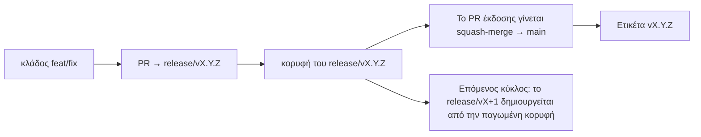

# Branching & Release Model (Ελληνικά)

🌐 **Languages:** 🇺🇸 [English](../../../../ops/BRANCHING_MODEL.md) · 🇪🇹 [am](../../../am/docs/ops/BRANCHING_MODEL.md) · 🇸🇦 [ar](../../../ar/docs/ops/BRANCHING_MODEL.md) · 🇦🇿 [az](../../../az/docs/ops/BRANCHING_MODEL.md) · 🇧🇬 [bg](../../../bg/docs/ops/BRANCHING_MODEL.md) · 🇧🇩 [bn](../../../bn/docs/ops/BRANCHING_MODEL.md) · 🇨🇿 [cs](../../../cs/docs/ops/BRANCHING_MODEL.md) · 🇩🇰 [da](../../../da/docs/ops/BRANCHING_MODEL.md) · 🇩🇪 [de](../../../de/docs/ops/BRANCHING_MODEL.md) · 🇪🇸 [es](../../../es/docs/ops/BRANCHING_MODEL.md) · 🇪🇪 [et](../../../et/docs/ops/BRANCHING_MODEL.md) · 🇮🇷 [fa](../../../fa/docs/ops/BRANCHING_MODEL.md) · 🇫🇮 [fi](../../../fi/docs/ops/BRANCHING_MODEL.md) · 🇫🇷 [fr](../../../fr/docs/ops/BRANCHING_MODEL.md) · 🇮🇪 [ga](../../../ga/docs/ops/BRANCHING_MODEL.md) · 🇮🇳 [gu](../../../gu/docs/ops/BRANCHING_MODEL.md) · 🇳🇬 [ha](../../../ha/docs/ops/BRANCHING_MODEL.md) · 🇮🇱 [he](../../../he/docs/ops/BRANCHING_MODEL.md) · 🇮🇳 [hi](../../../hi/docs/ops/BRANCHING_MODEL.md) · 🇭🇷 [hr](../../../hr/docs/ops/BRANCHING_MODEL.md) · 🇭🇺 [hu](../../../hu/docs/ops/BRANCHING_MODEL.md) · 🇦🇲 [hy](../../../hy/docs/ops/BRANCHING_MODEL.md) · 🇮🇩 [id](../../../id/docs/ops/BRANCHING_MODEL.md) · 🇳🇬 [ig](../../../ig/docs/ops/BRANCHING_MODEL.md) · 🇮🇹 [it](../../../it/docs/ops/BRANCHING_MODEL.md) · 🇯🇵 [ja](../../../ja/docs/ops/BRANCHING_MODEL.md) · 🇬🇪 [ka](../../../ka/docs/ops/BRANCHING_MODEL.md) · 🇰🇭 [km](../../../km/docs/ops/BRANCHING_MODEL.md) · 🇮🇳 [kn](../../../kn/docs/ops/BRANCHING_MODEL.md) · 🇰🇷 [ko](../../../ko/docs/ops/BRANCHING_MODEL.md) · 🇱🇹 [lt](../../../lt/docs/ops/BRANCHING_MODEL.md) · 🇱🇻 [lv](../../../lv/docs/ops/BRANCHING_MODEL.md) · 🇮🇳 [ml](../../../ml/docs/ops/BRANCHING_MODEL.md) · 🇮🇳 [mr](../../../mr/docs/ops/BRANCHING_MODEL.md) · 🇲🇾 [ms](../../../ms/docs/ops/BRANCHING_MODEL.md) · 🇲🇹 [mt](../../../mt/docs/ops/BRANCHING_MODEL.md) · 🇲🇲 [my](../../../my/docs/ops/BRANCHING_MODEL.md) · 🇳🇵 [ne](../../../ne/docs/ops/BRANCHING_MODEL.md) · 🇳🇱 [nl](../../../nl/docs/ops/BRANCHING_MODEL.md) · 🇳🇴 [no](../../../no/docs/ops/BRANCHING_MODEL.md) · 🇮🇳 [or](../../../or/docs/ops/BRANCHING_MODEL.md) · 🇮🇳 [pa](../../../pa/docs/ops/BRANCHING_MODEL.md) · 🇵🇭 [phi](../../../phi/docs/ops/BRANCHING_MODEL.md) · 🇵🇱 [pl](../../../pl/docs/ops/BRANCHING_MODEL.md) · 🇵🇹 [pt](../../../pt/docs/ops/BRANCHING_MODEL.md) · 🇧🇷 [pt-BR](../../../pt-BR/docs/ops/BRANCHING_MODEL.md) · 🇷🇴 [ro](../../../ro/docs/ops/BRANCHING_MODEL.md) · 🇷🇺 [ru](../../../ru/docs/ops/BRANCHING_MODEL.md) · 🇱🇰 [si](../../../si/docs/ops/BRANCHING_MODEL.md) · 🇸🇰 [sk](../../../sk/docs/ops/BRANCHING_MODEL.md) · 🇸🇮 [sl](../../../sl/docs/ops/BRANCHING_MODEL.md) · 🇷🇸 [sr](../../../sr/docs/ops/BRANCHING_MODEL.md) · 🇸🇪 [sv](../../../sv/docs/ops/BRANCHING_MODEL.md) · 🇰🇪 [sw](../../../sw/docs/ops/BRANCHING_MODEL.md) · 🇮🇳 [ta](../../../ta/docs/ops/BRANCHING_MODEL.md) · 🇮🇳 [te](../../../te/docs/ops/BRANCHING_MODEL.md) · 🇹🇭 [th](../../../th/docs/ops/BRANCHING_MODEL.md) · 🇹🇷 [tr](../../../tr/docs/ops/BRANCHING_MODEL.md) · 🇺🇦 [uk-UA](../../../uk-UA/docs/ops/BRANCHING_MODEL.md) · 🇵🇰 [ur](../../../ur/docs/ops/BRANCHING_MODEL.md) · 🇺🇿 [uz](../../../uz/docs/ops/BRANCHING_MODEL.md) · 🇻🇳 [vi](../../../vi/docs/ops/BRANCHING_MODEL.md) · 🇳🇬 [yo](../../../yo/docs/ops/BRANCHING_MODEL.md) · 🇨🇳 [zh-CN](../../../zh-CN/docs/ops/BRANCHING_MODEL.md) · 🇹🇼 [zh-TW](../../../zh-TW/docs/ops/BRANCHING_MODEL.md)

---

Το OmniRoute χρησιμοποιεί ένα μοντέλο εκδόσεων **παράλληλων κύκλων**: έναν αποκλειστικό κλάδο `release/vX.Y.Z`
για τον ενεργό κύκλο, το `main` για τη δημοσιευμένη γραμμή και μια αμετάβλητη
ετικέτα `vX.Y.Z` όταν κυκλοφορεί η έκδοση αυτού του κύκλου. Είναι αναμενόμενο να βλέπετε commits να καταλήγουν στο `release/*` _και_ στο
`main` — δεν πρόκειται για μπέρδεμα.

Οι λεπτομέρειες για τους συντηρητές βρίσκονται στο `CLAUDE.md` (Αυστηρός Κανόνας #21) και στο
[RELEASE_CHECKLIST.md](./RELEASE_CHECKLIST.md). Αυτή η σελίδα αποτελεί τη δημόσια
σύνοψη για τους συνεισφέροντες.

## Με μια ματιά

| Ref                | Ρόλος                                                                                                          |
| ------------------ | -------------------------------------------------------------------------------------------------------------- |
| `release/vX.Y.Z`   | **Ενεργός κύκλος** — καθημερινή ανάπτυξη και συγχωνεύσεις PR για αυτήν την έκδοση                              |
| `main`             | **Δημοσιευμένη γραμμή** — λαμβάνει τον κύκλο μέσω squash-merge όταν κυκλοφορεί η έκδοση                        |
| `vX.Y.Z` (ετικέτα) | **Δείκτης κυκλοφορίας** — αμετάβλητος δείκτης του «τι κυκλοφόρησε», ο οποίος δημιουργείται κατά την κυκλοφορία |



## Ποιον κλάδο πρέπει να στοχεύει το PR μου;

**Στοχεύστε τον ενεργό κλάδο `release/vX.Y.Z` — όχι το `main`.**

1. Βρείτε τον υψηλότερο ανοιχτό κλάδο `release/v*` (παράδειγμα κατά τη στιγμή της σύνταξης:
   `release/v3.8.49`).
2. Δημιουργήστε κλάδο από την κορυφή του (`git fetch` + checkout / rebase πάνω σε αυτόν).
3. Ανοίξτε το PR με **base = αυτό το `release/vX.Y.Z`**.

Το `main` δεν είναι ο κλάδος καθημερινής ενσωμάτωσης. Τα PR που ανοίγονται με στόχο το `main`
συνήθως χρειάζεται να αλλάξουν στόχο πριν από τη συγχώνευση.

## Πάγωμα έκδοσης (παράλληλοι κύκλοι)

Όταν γίνεται η ενοποίηση μιας έκδοσης, ανοίγει ένα ζήτημα-δείκτης με την ετικέτα `release-freeze`.
Αυτό **δεν σταματά την ανάπτυξη**:

- Το παγωμένο `release/vX.Y.Z` ανήκει στον υπεύθυνο έκδοσης για τη συγκεκριμένη κυκλοφορία.
- Ο επόμενος κύκλος `release/vX+1` δημιουργείται από την παγωμένη κορυφή, ώστε οι συνεισφέροντες να συνεχίσουν
  να ενσωματώνουν εργασίες.
- Τα ανοιχτά PR που εξακολουθούν να στοχεύουν τον παγωμένο κλάδο πρέπει να **αλλάξουν στόχο** στον
  ενεργό (υψηλότερο) κλάδο `release/v*`.

Ελέγξτε αν υπάρχει ενεργό πάγωμα προτού θεωρήσετε ότι ο κλάδος που θέλετε μπορεί να δεχτεί συγχωνεύσεις:

```bash
gh issue list --repo diegosouzapw/OmniRoute --label release-freeze --state open
```

Οι μηχανισμοί συγχώνευσης (ετικέτα `queue` από τον ιδιοκτήτη → Mergify) τεκμηριώνονται στο
[MERGE_TRAIN.md](./MERGE_TRAIN.md).

## Γιατί και κλάδος και ετικέτα;

| Τεχνούργημα      | Διάρκεια ζωής     | Σκοπός                                                                          |
| ---------------- | ----------------- | ------------------------------------------------------------------------------- |
| `release/vX.Y.Z` | Κύκλος σε εξέλιξη | Συγκεντρώνει ελεγμένα PR, παραμένει πράσινος στο CI και αποτελεί τη βάση των PR |
| Ετικέτα `vX.Y.Z` | Για πάντα         | Επισημαίνει τα ακριβή bits που κυκλοφόρησαν στο npm / GitHub Releases           |

Ο κλάδος είναι το εργαστήριο· η ετικέτα είναι το σφραγισμένο πακέτο. Μετά το squash-merge στο
`main`, ο επόμενος κύκλος συνεχίζεται στο `release/vX+1` χωρίς να περιμένει να ολοκληρωθεί το PR της προηγούμενης
έκδοσης.

## Σχετική τεκμηρίωση

- [CONTRIBUTING.md](../../CONTRIBUTING.md) — ρύθμιση, δοκιμές, λίστα ελέγχου PR
- [RELEASE_CHECKLIST.md](./RELEASE_CHECKLIST.md) — επικύρωση πριν από την κυκλοφορία
- [MERGE_TRAIN.md](./MERGE_TRAIN.md) — ουρά συγχώνευσης και εφεδρική ακολουθία συγχωνεύσεων
- [RELEASE_GREEN.md](./RELEASE_GREEN.md) — διατήρηση της κορυφής της έκδοσης σε πράσινη κατάσταση
