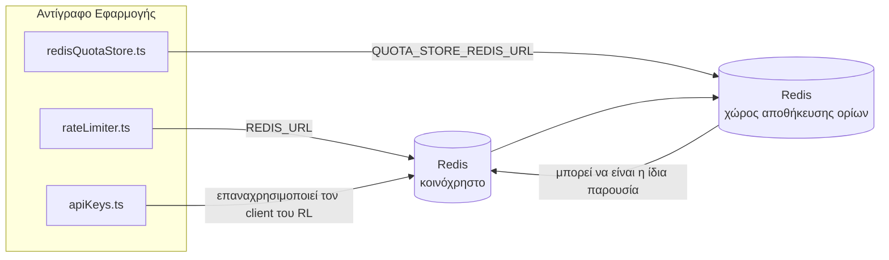

# Redis Production Configuration Guide (Ελληνικά)

🌐 **Languages:** 🇺🇸 [English](../../../../ops/REDIS_PRODUCTION_CONFIG.md) · 🇪🇹 [am](../../../am/docs/ops/REDIS_PRODUCTION_CONFIG.md) · 🇸🇦 [ar](../../../ar/docs/ops/REDIS_PRODUCTION_CONFIG.md) · 🇦🇿 [az](../../../az/docs/ops/REDIS_PRODUCTION_CONFIG.md) · 🇧🇬 [bg](../../../bg/docs/ops/REDIS_PRODUCTION_CONFIG.md) · 🇧🇩 [bn](../../../bn/docs/ops/REDIS_PRODUCTION_CONFIG.md) · 🇨🇿 [cs](../../../cs/docs/ops/REDIS_PRODUCTION_CONFIG.md) · 🇩🇰 [da](../../../da/docs/ops/REDIS_PRODUCTION_CONFIG.md) · 🇩🇪 [de](../../../de/docs/ops/REDIS_PRODUCTION_CONFIG.md) · 🇪🇸 [es](../../../es/docs/ops/REDIS_PRODUCTION_CONFIG.md) · 🇪🇪 [et](../../../et/docs/ops/REDIS_PRODUCTION_CONFIG.md) · 🇮🇷 [fa](../../../fa/docs/ops/REDIS_PRODUCTION_CONFIG.md) · 🇫🇮 [fi](../../../fi/docs/ops/REDIS_PRODUCTION_CONFIG.md) · 🇫🇷 [fr](../../../fr/docs/ops/REDIS_PRODUCTION_CONFIG.md) · 🇮🇪 [ga](../../../ga/docs/ops/REDIS_PRODUCTION_CONFIG.md) · 🇮🇳 [gu](../../../gu/docs/ops/REDIS_PRODUCTION_CONFIG.md) · 🇳🇬 [ha](../../../ha/docs/ops/REDIS_PRODUCTION_CONFIG.md) · 🇮🇱 [he](../../../he/docs/ops/REDIS_PRODUCTION_CONFIG.md) · 🇮🇳 [hi](../../../hi/docs/ops/REDIS_PRODUCTION_CONFIG.md) · 🇭🇷 [hr](../../../hr/docs/ops/REDIS_PRODUCTION_CONFIG.md) · 🇭🇺 [hu](../../../hu/docs/ops/REDIS_PRODUCTION_CONFIG.md) · 🇦🇲 [hy](../../../hy/docs/ops/REDIS_PRODUCTION_CONFIG.md) · 🇮🇩 [id](../../../id/docs/ops/REDIS_PRODUCTION_CONFIG.md) · 🇳🇬 [ig](../../../ig/docs/ops/REDIS_PRODUCTION_CONFIG.md) · 🇮🇹 [it](../../../it/docs/ops/REDIS_PRODUCTION_CONFIG.md) · 🇯🇵 [ja](../../../ja/docs/ops/REDIS_PRODUCTION_CONFIG.md) · 🇬🇪 [ka](../../../ka/docs/ops/REDIS_PRODUCTION_CONFIG.md) · 🇰🇭 [km](../../../km/docs/ops/REDIS_PRODUCTION_CONFIG.md) · 🇮🇳 [kn](../../../kn/docs/ops/REDIS_PRODUCTION_CONFIG.md) · 🇰🇷 [ko](../../../ko/docs/ops/REDIS_PRODUCTION_CONFIG.md) · 🇱🇹 [lt](../../../lt/docs/ops/REDIS_PRODUCTION_CONFIG.md) · 🇱🇻 [lv](../../../lv/docs/ops/REDIS_PRODUCTION_CONFIG.md) · 🇮🇳 [ml](../../../ml/docs/ops/REDIS_PRODUCTION_CONFIG.md) · 🇮🇳 [mr](../../../mr/docs/ops/REDIS_PRODUCTION_CONFIG.md) · 🇲🇾 [ms](../../../ms/docs/ops/REDIS_PRODUCTION_CONFIG.md) · 🇲🇹 [mt](../../../mt/docs/ops/REDIS_PRODUCTION_CONFIG.md) · 🇲🇲 [my](../../../my/docs/ops/REDIS_PRODUCTION_CONFIG.md) · 🇳🇵 [ne](../../../ne/docs/ops/REDIS_PRODUCTION_CONFIG.md) · 🇳🇱 [nl](../../../nl/docs/ops/REDIS_PRODUCTION_CONFIG.md) · 🇳🇴 [no](../../../no/docs/ops/REDIS_PRODUCTION_CONFIG.md) · 🇮🇳 [or](../../../or/docs/ops/REDIS_PRODUCTION_CONFIG.md) · 🇮🇳 [pa](../../../pa/docs/ops/REDIS_PRODUCTION_CONFIG.md) · 🇵🇭 [phi](../../../phi/docs/ops/REDIS_PRODUCTION_CONFIG.md) · 🇵🇱 [pl](../../../pl/docs/ops/REDIS_PRODUCTION_CONFIG.md) · 🇵🇹 [pt](../../../pt/docs/ops/REDIS_PRODUCTION_CONFIG.md) · 🇧🇷 [pt-BR](../../../pt-BR/docs/ops/REDIS_PRODUCTION_CONFIG.md) · 🇷🇴 [ro](../../../ro/docs/ops/REDIS_PRODUCTION_CONFIG.md) · 🇷🇺 [ru](../../../ru/docs/ops/REDIS_PRODUCTION_CONFIG.md) · 🇱🇰 [si](../../../si/docs/ops/REDIS_PRODUCTION_CONFIG.md) · 🇸🇰 [sk](../../../sk/docs/ops/REDIS_PRODUCTION_CONFIG.md) · 🇸🇮 [sl](../../../sl/docs/ops/REDIS_PRODUCTION_CONFIG.md) · 🇷🇸 [sr](../../../sr/docs/ops/REDIS_PRODUCTION_CONFIG.md) · 🇸🇪 [sv](../../../sv/docs/ops/REDIS_PRODUCTION_CONFIG.md) · 🇰🇪 [sw](../../../sw/docs/ops/REDIS_PRODUCTION_CONFIG.md) · 🇮🇳 [ta](../../../ta/docs/ops/REDIS_PRODUCTION_CONFIG.md) · 🇮🇳 [te](../../../te/docs/ops/REDIS_PRODUCTION_CONFIG.md) · 🇹🇭 [th](../../../th/docs/ops/REDIS_PRODUCTION_CONFIG.md) · 🇹🇷 [tr](../../../tr/docs/ops/REDIS_PRODUCTION_CONFIG.md) · 🇺🇦 [uk-UA](../../../uk-UA/docs/ops/REDIS_PRODUCTION_CONFIG.md) · 🇵🇰 [ur](../../../ur/docs/ops/REDIS_PRODUCTION_CONFIG.md) · 🇺🇿 [uz](../../../uz/docs/ops/REDIS_PRODUCTION_CONFIG.md) · 🇻🇳 [vi](../../../vi/docs/ops/REDIS_PRODUCTION_CONFIG.md) · 🇳🇬 [yo](../../../yo/docs/ops/REDIS_PRODUCTION_CONFIG.md) · 🇨🇳 [zh-CN](../../../zh-CN/docs/ops/REDIS_PRODUCTION_CONFIG.md) · 🇹🇼 [zh-TW](../../../zh-TW/docs/ops/REDIS_PRODUCTION_CONFIG.md)

---

## Επισκόπηση

Το Redis είναι μια **προαιρετική, μη δεσμευτική εξάρτηση** στο OmniRoute — όταν το Redis δεν είναι διαθέσιμο, η εφαρμογή υποβαθμίζει ομαλά τη λειτουργία της (με εναλλακτικές λύσεις στη μνήμη). Στην παραγωγή, η ρύθμιση του Redis μειώνει την καθυστέρηση για τέσσερις διακριτούς φόρτους εργασίας:

| Φόρτος εργασίας              | Πρόγραμμα οδήγησης            | Εργοστάσιο client                                               | Μοτίβο κλειδιού                                              |
| ---------------------------- | ----------------------------- | --------------------------------------------------------------- | ------------------------------------------------------------ |
| Περιορισμός ρυθμού           | `rateLimiter.ts`              | `getRedisClient()` — singleton `ioredis` με οκνηρή αρχικοποίηση | Παράθυρα περιορισμού ρυθμού `<prefix>rl:*`, ατομικά μέσω Lua |
| Cache αυθεντικοποίησης       | `apiKeys.ts`                  | Επαναχρησιμοποιεί τον client του `rateLimiter`                  | `<prefix>auth:api_key:<sha256>` με TTL                       |
| Χώρος αποθήκευσης quota      | `redisQuotaStore.ts`          | Ξεχωριστό singleton `getRedisClient(url)`                       | `<prefix>quota:*`, παραμετροποιήσιμο ανά instance            |
| Circuit breaker προθέρμανσης | `redisCircuitBreakerStore.ts` | Ξεχωριστός client στο `circuitBreakerFactory.ts`                | `<prefix>warmup:cb:<connectionId>`                           |

Και οι τέσσερις φόρτοι εργασίας χρησιμοποιούν από κοινού ένα πρόθεμα namespace, ώστε το OmniRoute να μπορεί να συνυπάρχει με άλλες εφαρμογές σε ένα μόνο instance του Redis (π.χ. `127.0.0.1:6379`). Ανατρέξτε στην ενότητα [Ονοματοδοσία κλειδιών με namespace](#key-namespacing).

---

## Τρέχουσα διαμόρφωση (προεπιλογές κώδικα)

| Ρύθμιση                                         | Τιμή                                                               | Τοποθεσία                                                                             |
| ----------------------------------------------- | ------------------------------------------------------------------ | ------------------------------------------------------------------------------------- |
| Μεταβλητή περιβάλλοντος `REDIS_URL`             | `redis://redis:6379` (compose), προαιρετική                        | `rateLimiter.ts:5`, `.env.example`                                                    |
| Μεταβλητή περιβάλλοντος `REDIS_KEY_PREFIX`      | `omniroute:` (προεπιλογή)                                          | `rateLimiter.ts`, `redisQuotaStore.ts`, `redisCircuitBreakerStore.ts`, `.env.example` |
| Μεταβλητή περιβάλλοντος `QUOTA_STORE_REDIS_URL` | ξεχωριστή, μπορεί να διαφέρει από τη `REDIS_URL`                   | `quota/storeFactory.ts`                                                               |
| `QUOTA_STORE_DRIVER`                            | `"sqlite"` (προεπιλογή), προαιρετικά `"redis"`                     | `quota/storeFactory.ts`                                                               |
| `maxRetriesPerRequest` του ioredis              | `3`                                                                | δημιουργία client στο `rateLimiter.ts`                                                |
| `enableReadyCheck`                              | δεν έχει οριστεί (προεπιλογή ioredis: `true`)                      | —                                                                                     |
| `lazyConnect`                                   | δεν έχει οριστεί (προεπιλογή ioredis: `false`)                     | —                                                                                     |
| `retryStrategy`                                 | δεν έχει οριστεί (προεπιλογή ioredis: βάση 200ms, εκθετική αύξηση) | —                                                                                     |
| TLS / κωδικός πρόσβασης / δείκτης DB            | **δεν έχουν διαμορφωθεί**                                          | —                                                                                     |
| Sentinel / Cluster                              | **δεν έχουν διαμορφωθεί** — μόνο αυτόνομος μεμονωμένος κόμβος      | —                                                                                     |

---

## Ονοματοδοσία κλειδιών με namespace

Το OmniRoute χρησιμοποιεί από κοινού ένα instance του Redis με οτιδήποτε άλλο εκτελείται στον host. Χωρίς namespace, κλειδιά όπως τα `auth:api_key:<sha256>` ή `rl:*` θα μπορούσαν να συγκρουστούν με κλειδιά άλλων εφαρμογών που χρησιμοποιούν το ίδιο Redis (αυτό το instance εκτελεί το Redis στη διεύθυνση `127.0.0.1:6379` μαζί με άλλες υπηρεσίες).

Ορίστε το `REDIS_KEY_PREFIX` σε μια μη κενή συμβολοσειρά, ώστε να προστεθεί πρόθεμα σε **κάθε** κλειδί του OmniRoute:

```bash
# .env — όλα τα κλειδιά του OmniRoute γίνονται omniroute:rl:*, omniroute:auth:*, omniroute:quota:*, omniroute:warmup:cb:*
REDIS_KEY_PREFIX=omniroute:
```

- **Προεπιλογή:** `omniroute:` (εφαρμόζεται όταν το `REDIS_KEY_PREFIX` δεν έχει οριστεί ή είναι κενό).
- **Εφαρμόζεται σε:** περιοριστή ρυθμού + cache αυθεντικοποίησης (κοινόχρηστος client `ioredis` μέσω του `keyPrefix`), καθώς και στον χώρο αποθήκευσης quota (`KEY_PREFIX = "${REDIS_KEY_PREFIX}quota"`) και στο circuit breaker προθέρμανσης (`KEY_PREFIX = "${REDIS_KEY_PREFIX}warmup:cb:"`).
- **Η αλλαγή του προθέματος**, όταν υπάρχουν ήδη κλειδιά στο Redis, αφήνει ορφανά τα παλιά κλειδιά (λήγουν μέσω TTL / LRU). Η αλλαγή είναι ασφαλής και δεν απαιτείται μετεγκατάσταση. Η μόνη εξαίρεση είναι ένα κλειδί του circuit breaker προθέρμανσης για μια σύνδεση που έχει επισημανθεί ως απαγορευμένη: διατηρείται χωρίς TTL, επομένως εμφανίστε τα εναπομείναντα κλειδιά με `redis-cli --scan --pattern '<old-prefix>warmup:cb:*'` και διαγράψτε τα.
- Το **`keyPrefix` του ioredis** προσθέτει αυτόματα το πρόθεμα κατά τις εγγραφές **και** το αφαιρεί κατά τις αναγνώσεις, επομένως ο κώδικας της εφαρμογής δεν βλέπει ποτέ το πρόθεμα.

---

## Συνιστώμενες ρυθμίσεις παραγωγής

### 1. Επιλογές pool συνδέσεων / client (constructor `Redis` του ioredis)

Ο τρέχων κώδικας δημιουργεί ένα μόνο `new Redis(url)` χωρίς προσαρμοσμένες επιλογές. Για deployments παραγωγής με πολλαπλά replicas, περάστε ένα client factory στον κώδικα ή δημιουργήστε ένα wrapper για το `getRedisClient()`:

```typescript
const redis = new Redis(REDIS_URL, {
  maxRetriesPerRequest: null, // χωρίς όριο επαναλήψεων· αφήστε το retryStrategy να αποφασίσει
  enableReadyCheck: true, // επαλήθευση ότι ο server είναι έτοιμος πριν αποδεχτεί κλήσεις
  lazyConnect: true, // μη συνδέεστε κατά τη δημιουργία· περιμένετε την πρώτη κλήση
  retryStrategy: (times) => {
    if (times > 10) return null; // εγκατάλειψη μετά από 10 επαναλήψεις → επανασύνδεση αργότερα
    return Math.min(times * 200, 5000); // 200ms, 400ms, …, μέγιστο όριο 5s
  },
  enableAutoPipelining: true, // συνένωση ταυτόχρονων εντολών σε μία εγγραφή TCP
  keepAlive: 10000, // TCP keep‑alive κάθε 10s
});
```

**Βασικοί συμβιβασμοί:**

- `maxRetriesPerRequest: null` + `retryStrategy` — προτιμάται για την παραγωγή, ώστε οι παροδικές
  επανεκκινήσεις του Redis να μην αποτυγχάνουν αμέσως κάθε αίτημα. Το fallback στη μνήμη στο
  `checkRateLimit()` απορροφά τη διαδρομή αποτυχίας.
- `lazyConnect: true` — αποφεύγει την εξάρτηση εκκίνησης από το αν το Redis είναι διαθέσιμο πριν ο server
  αρχίσει να αποδέχεται συνδέσεις.
- `enableAutoPipelining: true` — μειώνει τις διαδρομές μετ’ επιστροφής για ταυτόχρονους ελέγχους ορίου ρυθμού·
  επωφελές σε >50 RPS σε μία μόνο σύνδεση.

### 2. Διαμόρφωση του Redis Server (`redis.conf`)

```
# Μνήμη
maxmemory 80%                        # αφήστε χώρο για την cache σελίδων του OS
maxmemory-policy allkeys-lru         # απομάκρυνση παλιών εγγραφών της auth cache υπό πίεση

# Μόνιμη αποθήκευση (προαιρετική — το OmniRoute είναι ασφαλές σε περίπτωση κατάρρευσης χωρίς αυτή)
save 300 1                           # snapshot τουλάχιστον κάθε 5 λεπτά, εάν άλλαξε ≥1 key
appendonly no                        # το AOF δεν χρειάζεται· τα δεδομένα μπορούν να αναδημιουργηθούν
appendfsync no                       # χωρίς επιβάρυνση fsync (το RDB είναι επαρκές)

# Δικτύωση
timeout 0                            # χωρίς αποσύνδεση λόγω αδράνειας
tcp-keepalive 300                    # keep‑alive 5 λεπτών
tcp-backlog 511                      # ουρά συνδέσεων για απότομο φόρτο

# Απόδοση
hz 10                                # προεπιλογή· 100 για περιπτώσεις ευαίσθητες στην καθυστέρηση
activedefrag yes                     # αυτόματη ανασυγκρότηση όταν ο κατακερματισμός είναι >10%
```

**Συμβιβασμός για το `maxmemory-policy allkeys-lru`:** Οι εγγραφές της auth cache μπορεί να απομακρυνθούν υπό
πίεση μνήμης. Αυτό είναι ασφαλές — το `setCachedApiKey` ανατροφοδοτεί πάντα την cache σε περίπτωση αστοχίας εύρεσης και το
fallback στο SQLite είναι η έγκυρη πηγή. Το Lua script του rate limiter δημιουργεί μικρά keys που έχουν
σύντομη διάρκεια ζωής εκ σχεδιασμού.

### 3. Ρυθμίσεις Docker Compose

Το compose παραγωγής (`docker-compose.prod.yml`) χρησιμοποιεί `redis:8.6.2-alpine`. Προσθέστε:

```yaml
redis:
  image: redis:8.6.2-alpine
  command:
    [
      "redis-server",
      "--maxmemory",
      "512mb",
      "--maxmemory-policy",
      "allkeys-lru",
      "--activedefrag",
      "yes",
      "--save",
      "300 1",
    ]
  healthcheck:
    test: ["CMD", "redis-cli", "ping"]
    interval: 10s
    timeout: 3s
    retries: 3
    start_period: 5s
```

### 4. Ζητήματα πολλαπλών instances / κλιμάκωσης

**Ένα Redis για όλα τα replicas** — το Lua script του rate limiter εξαρτάται από έναν ενιαίο
έγκυρο χώρο keys. Πολλαπλά instances Redis πίσω από replicas θα έχαναν την ατομικότητα
και θα διπλασίαζαν το διαθέσιμο όριο. Χρησιμοποιήστε ένα μόνο Redis (ή ένα cluster Redis Sentinel με failover) για
όλα τα replicas της εφαρμογής.

**Πλήθος συνδέσεων:** Κάθε replica της εφαρμογής ανοίγει **2 συνδέσεις TCP** προς το Redis
(client του rate limiter + client του quota store). Με 10 replicas → 20 συνδέσεις, αριθμός
πολύ χαμηλότερος από το προεπιλεγμένο όριο των 10k συνδέσεων ενός instance Redis.

### 5. Παρακολούθηση

Εκθέστε μέσω endpoint ελέγχου υγείας:

```typescript
// Το src/app/api/monitoring/health/route.ts καλεί ήδη συναρτήσεις του rateLimiter
// Προσθέστε ελέγχους ειδικά για το Redis:
//   1. Καθυστέρηση PING μέσω του ioredis .ping()
//   2. Χρήση μνήμης μέσω INFO memory
//   3. Πλήθος συνδέσεων μέσω INFO clients
//   4. Ποσοστό επιτυχιών για το maxmemory-policy (evicted_keys / keyspace_hits)
```

Βασικές μετρικές προς παρακολούθηση:

- **Keys που απομακρύνονται / δευτερόλεπτο** — εάν η τιμή παραμένει συστηματικά μη μηδενική, αυξήστε το `maxmemory`
- **Μπλοκαρισμένοι clients** — μια μη μηδενική τιμή υποδηλώνει αργά Lua scripts ή υψηλό ανταγωνισμό
- **Απορριφθείσες συνδέσεις** — το όριο συνδέσεων έχει εξαντληθεί· σπάνιο με 20 συνδέσεις

---

## Διάγραμμα Αρχιτεκτονικής



---

## Αναφορές

| Αρχείο                             | Σκοπός                                                                         |
| ---------------------------------- | ------------------------------------------------------------------------------ |
| `src/shared/utils/rateLimiter.ts`  | Κύριος client Redis, Lua script περιορισμού ρυθμού, εναλλακτική λύση στη μνήμη |
| `src/lib/db/apiKeys.ts`            | Cache ελέγχου ταυτότητας — εναλλακτική μετάβαση από Redis σε SQLite            |
| `src/lib/quota/redisQuotaStore.ts` | Ξεχωριστός client Redis για τον προαιρετικό χώρο αποθήκευσης ορίων             |
| `src/lib/quota/storeFactory.ts`    | Εναλλάσσει μεταξύ των drivers ορίων `sqlite` και `redis`                       |
| `docker-compose.prod.yml`          | Container Redis για το περιβάλλον παραγωγής (image `redis:8.6.2-alpine`)       |
| `.env.example`                     | Τεκμηρίωση μεταβλητών περιβάλλοντος Redis                                      |
| `src/app/api/local/redis/`         | Διαδρομές API για την ενορχήστρωση του container ανάπτυξης                     |
| `bin/cli/commands/redis.mjs`       | Εντολές CLI για την ενορχήστρωση του container ανάπτυξης                       |
