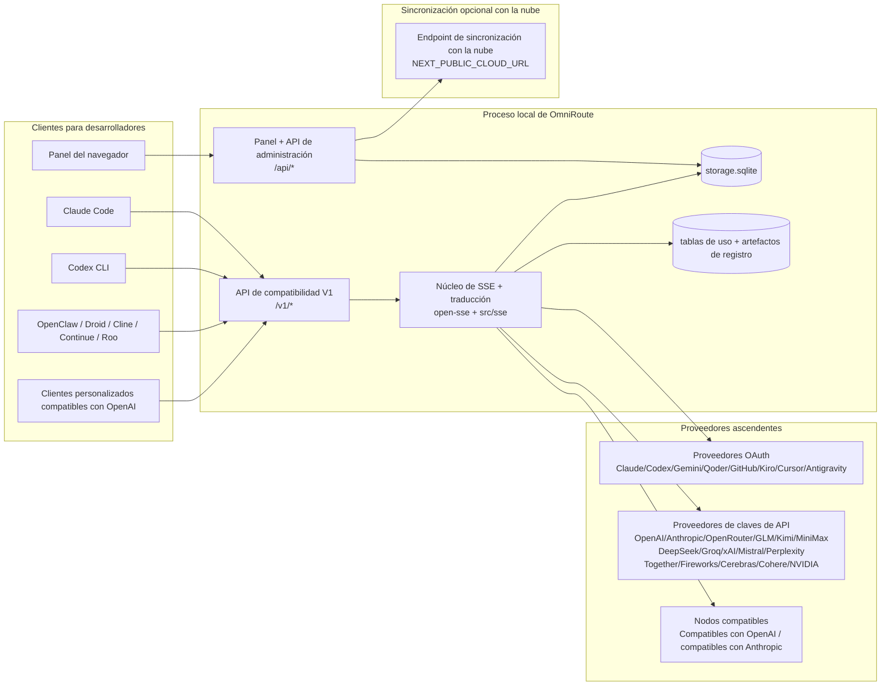
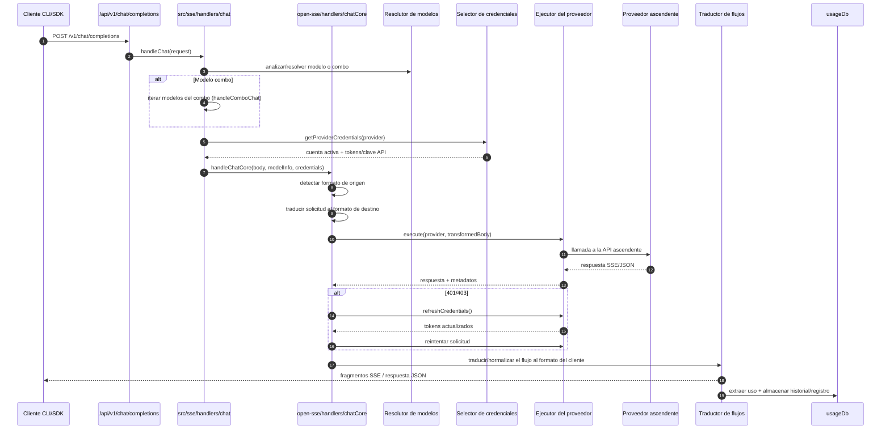
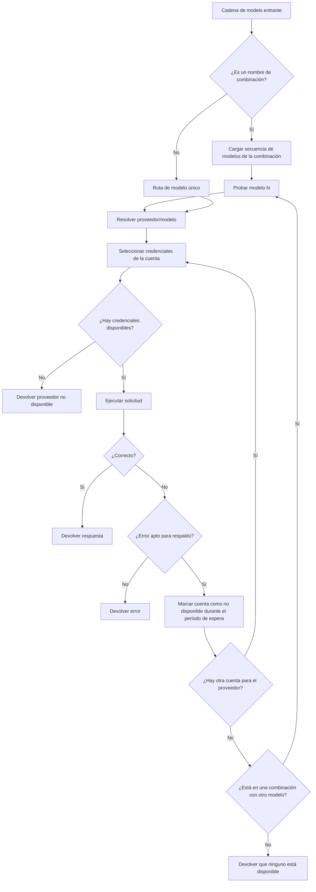
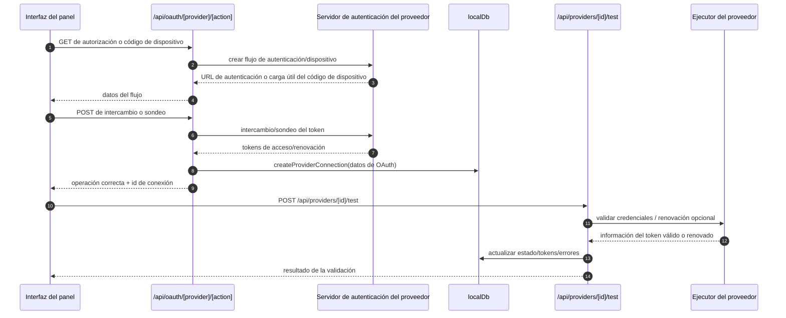
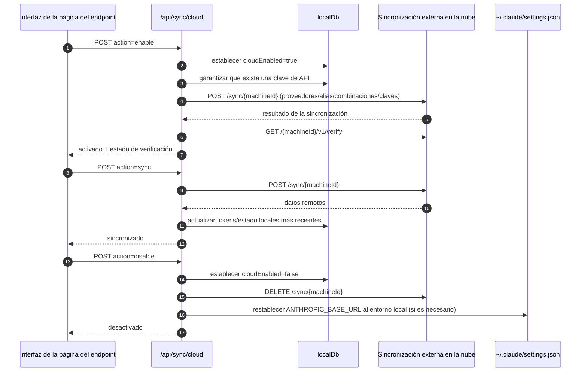
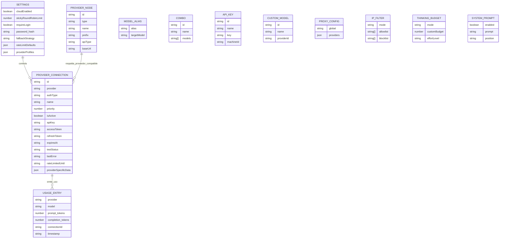
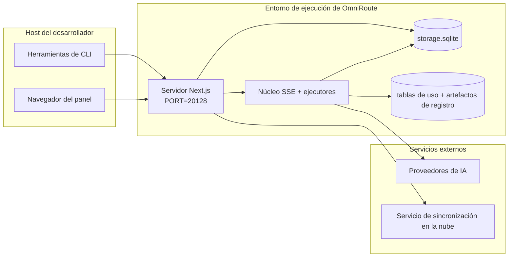

# OmniRoute Architecture (Español)

🌐 **Languages:** 🇺🇸 [English](../../../../architecture/ARCHITECTURE.md) · 🇪🇹 [am](../../../am/docs/architecture/ARCHITECTURE.md) · 🇸🇦 [ar](../../../ar/docs/architecture/ARCHITECTURE.md) · 🇦🇿 [az](../../../az/docs/architecture/ARCHITECTURE.md) · 🇧🇬 [bg](../../../bg/docs/architecture/ARCHITECTURE.md) · 🇧🇩 [bn](../../../bn/docs/architecture/ARCHITECTURE.md) · 🇨🇿 [cs](../../../cs/docs/architecture/ARCHITECTURE.md) · 🇩🇰 [da](../../../da/docs/architecture/ARCHITECTURE.md) · 🇩🇪 [de](../../../de/docs/architecture/ARCHITECTURE.md) · 🇬🇷 [el](../../../el/docs/architecture/ARCHITECTURE.md) · 🇪🇪 [et](../../../et/docs/architecture/ARCHITECTURE.md) · 🇮🇷 [fa](../../../fa/docs/architecture/ARCHITECTURE.md) · 🇫🇮 [fi](../../../fi/docs/architecture/ARCHITECTURE.md) · 🇫🇷 [fr](../../../fr/docs/architecture/ARCHITECTURE.md) · 🇮🇪 [ga](../../../ga/docs/architecture/ARCHITECTURE.md) · 🇮🇳 [gu](../../../gu/docs/architecture/ARCHITECTURE.md) · 🇳🇬 [ha](../../../ha/docs/architecture/ARCHITECTURE.md) · 🇮🇱 [he](../../../he/docs/architecture/ARCHITECTURE.md) · 🇮🇳 [hi](../../../hi/docs/architecture/ARCHITECTURE.md) · 🇭🇷 [hr](../../../hr/docs/architecture/ARCHITECTURE.md) · 🇭🇺 [hu](../../../hu/docs/architecture/ARCHITECTURE.md) · 🇦🇲 [hy](../../../hy/docs/architecture/ARCHITECTURE.md) · 🇮🇩 [id](../../../id/docs/architecture/ARCHITECTURE.md) · 🇳🇬 [ig](../../../ig/docs/architecture/ARCHITECTURE.md) · 🇮🇹 [it](../../../it/docs/architecture/ARCHITECTURE.md) · 🇯🇵 [ja](../../../ja/docs/architecture/ARCHITECTURE.md) · 🇬🇪 [ka](../../../ka/docs/architecture/ARCHITECTURE.md) · 🇰🇭 [km](../../../km/docs/architecture/ARCHITECTURE.md) · 🇮🇳 [kn](../../../kn/docs/architecture/ARCHITECTURE.md) · 🇰🇷 [ko](../../../ko/docs/architecture/ARCHITECTURE.md) · 🇱🇹 [lt](../../../lt/docs/architecture/ARCHITECTURE.md) · 🇱🇻 [lv](../../../lv/docs/architecture/ARCHITECTURE.md) · 🇮🇳 [ml](../../../ml/docs/architecture/ARCHITECTURE.md) · 🇮🇳 [mr](../../../mr/docs/architecture/ARCHITECTURE.md) · 🇲🇾 [ms](../../../ms/docs/architecture/ARCHITECTURE.md) · 🇲🇹 [mt](../../../mt/docs/architecture/ARCHITECTURE.md) · 🇲🇲 [my](../../../my/docs/architecture/ARCHITECTURE.md) · 🇳🇵 [ne](../../../ne/docs/architecture/ARCHITECTURE.md) · 🇳🇱 [nl](../../../nl/docs/architecture/ARCHITECTURE.md) · 🇳🇴 [no](../../../no/docs/architecture/ARCHITECTURE.md) · 🇮🇳 [or](../../../or/docs/architecture/ARCHITECTURE.md) · 🇮🇳 [pa](../../../pa/docs/architecture/ARCHITECTURE.md) · 🇵🇭 [phi](../../../phi/docs/architecture/ARCHITECTURE.md) · 🇵🇱 [pl](../../../pl/docs/architecture/ARCHITECTURE.md) · 🇵🇹 [pt](../../../pt/docs/architecture/ARCHITECTURE.md) · 🇧🇷 [pt-BR](../../../pt-BR/docs/architecture/ARCHITECTURE.md) · 🇷🇴 [ro](../../../ro/docs/architecture/ARCHITECTURE.md) · 🇷🇺 [ru](../../../ru/docs/architecture/ARCHITECTURE.md) · 🇱🇰 [si](../../../si/docs/architecture/ARCHITECTURE.md) · 🇸🇰 [sk](../../../sk/docs/architecture/ARCHITECTURE.md) · 🇸🇮 [sl](../../../sl/docs/architecture/ARCHITECTURE.md) · 🇷🇸 [sr](../../../sr/docs/architecture/ARCHITECTURE.md) · 🇸🇪 [sv](../../../sv/docs/architecture/ARCHITECTURE.md) · 🇰🇪 [sw](../../../sw/docs/architecture/ARCHITECTURE.md) · 🇮🇳 [ta](../../../ta/docs/architecture/ARCHITECTURE.md) · 🇮🇳 [te](../../../te/docs/architecture/ARCHITECTURE.md) · 🇹🇭 [th](../../../th/docs/architecture/ARCHITECTURE.md) · 🇹🇷 [tr](../../../tr/docs/architecture/ARCHITECTURE.md) · 🇺🇦 [uk-UA](../../../uk-UA/docs/architecture/ARCHITECTURE.md) · 🇵🇰 [ur](../../../ur/docs/architecture/ARCHITECTURE.md) · 🇺🇿 [uz](../../../uz/docs/architecture/ARCHITECTURE.md) · 🇻🇳 [vi](../../../vi/docs/architecture/ARCHITECTURE.md) · 🇳🇬 [yo](../../../yo/docs/architecture/ARCHITECTURE.md) · 🇨🇳 [zh-CN](../../../zh-CN/docs/architecture/ARCHITECTURE.md) · 🇹🇼 [zh-TW](../../../zh-TW/docs/architecture/ARCHITECTURE.md)

---

🌐 **Languages:** 🇺🇸 [English](../../../../architecture/ARCHITECTURE.md) · 🇪🇹 [am](../../../am/docs/architecture/ARCHITECTURE.md) · 🇸🇦 [ar](../../../ar/docs/architecture/ARCHITECTURE.md) · 🇦🇿 [az](../../../az/docs/architecture/ARCHITECTURE.md) · 🇧🇬 [bg](../../../bg/docs/architecture/ARCHITECTURE.md) · 🇧🇩 [bn](../../../bn/docs/architecture/ARCHITECTURE.md) · 🇨🇿 [cs](../../../cs/docs/architecture/ARCHITECTURE.md) · 🇩🇰 [da](../../../da/docs/architecture/ARCHITECTURE.md) · 🇩🇪 [de](../../../de/docs/architecture/ARCHITECTURE.md) · 🇬🇷 [el](../../../el/docs/architecture/ARCHITECTURE.md) · 🇪🇪 [et](../../../et/docs/architecture/ARCHITECTURE.md) · 🇮🇷 [fa](../../../fa/docs/architecture/ARCHITECTURE.md) · 🇫🇮 [fi](../../../fi/docs/architecture/ARCHITECTURE.md) · 🇫🇷 [fr](../../../fr/docs/architecture/ARCHITECTURE.md) · 🇮🇪 [ga](../../../ga/docs/architecture/ARCHITECTURE.md) · 🇮🇳 [gu](../../../gu/docs/architecture/ARCHITECTURE.md) · 🇳🇬 [ha](../../../ha/docs/architecture/ARCHITECTURE.md) · 🇮🇱 [he](../../../he/docs/architecture/ARCHITECTURE.md) · 🇮🇳 [hi](../../../hi/docs/architecture/ARCHITECTURE.md) · 🇭🇷 [hr](../../../hr/docs/architecture/ARCHITECTURE.md) · 🇭🇺 [hu](../../../hu/docs/architecture/ARCHITECTURE.md) · 🇦🇲 [hy](../../../hy/docs/architecture/ARCHITECTURE.md) · 🇮🇩 [id](../../../id/docs/architecture/ARCHITECTURE.md) · 🇳🇬 [ig](../../../ig/docs/architecture/ARCHITECTURE.md) · 🇮🇹 [it](../../../it/docs/architecture/ARCHITECTURE.md) · 🇯🇵 [ja](../../../ja/docs/architecture/ARCHITECTURE.md) · 🇬🇪 [ka](../../../ka/docs/architecture/ARCHITECTURE.md) · 🇰🇭 [km](../../../km/docs/architecture/ARCHITECTURE.md) · 🇮🇳 [kn](../../../kn/docs/architecture/ARCHITECTURE.md) · 🇰🇷 [ko](../../../ko/docs/architecture/ARCHITECTURE.md) · 🇱🇹 [lt](../../../lt/docs/architecture/ARCHITECTURE.md) · 🇱🇻 [lv](../../../lv/docs/architecture/ARCHITECTURE.md) · 🇮🇳 [ml](../../../ml/docs/architecture/ARCHITECTURE.md) · 🇮🇳 [mr](../../../mr/docs/architecture/ARCHITECTURE.md) · 🇲🇾 [ms](../../../ms/docs/architecture/ARCHITECTURE.md) · 🇲🇹 [mt](../../../mt/docs/architecture/ARCHITECTURE.md) · 🇲🇲 [my](../../../my/docs/architecture/ARCHITECTURE.md) · 🇳🇵 [ne](../../../ne/docs/architecture/ARCHITECTURE.md) · 🇳🇱 [nl](../../../nl/docs/architecture/ARCHITECTURE.md) · 🇳🇴 [no](../../../no/docs/architecture/ARCHITECTURE.md) · 🇮🇳 [or](../../../or/docs/architecture/ARCHITECTURE.md) · 🇮🇳 [pa](../../../pa/docs/architecture/ARCHITECTURE.md) · 🇵🇭 [phi](../../../phi/docs/architecture/ARCHITECTURE.md) · 🇵🇱 [pl](../../../pl/docs/architecture/ARCHITECTURE.md) · 🇵🇹 [pt](../../../pt/docs/architecture/ARCHITECTURE.md) · 🇧🇷 [pt-BR](../../../pt-BR/docs/architecture/ARCHITECTURE.md) · 🇷🇴 [ro](../../../ro/docs/architecture/ARCHITECTURE.md) · 🇷🇺 [ru](../../../ru/docs/architecture/ARCHITECTURE.md) · 🇱🇰 [si](../../../si/docs/architecture/ARCHITECTURE.md) · 🇸🇰 [sk](../../../sk/docs/architecture/ARCHITECTURE.md) · 🇸🇮 [sl](../../../sl/docs/architecture/ARCHITECTURE.md) · 🇷🇸 [sr](../../../sr/docs/architecture/ARCHITECTURE.md) · 🇸🇪 [sv](../../../sv/docs/architecture/ARCHITECTURE.md) · 🇰🇪 [sw](../../../sw/docs/architecture/ARCHITECTURE.md) · 🇮🇳 [ta](../../../ta/docs/architecture/ARCHITECTURE.md) · 🇮🇳 [te](../../../te/docs/architecture/ARCHITECTURE.md) · 🇹🇭 [th](../../../th/docs/architecture/ARCHITECTURE.md) · 🇹🇷 [tr](../../../tr/docs/architecture/ARCHITECTURE.md) · 🇺🇦 [uk-UA](../../../uk-UA/docs/architecture/ARCHITECTURE.md) · 🇵🇰 [ur](../../../ur/docs/architecture/ARCHITECTURE.md) · 🇺🇿 [uz](../../../uz/docs/architecture/ARCHITECTURE.md) · 🇻🇳 [vi](../../../vi/docs/architecture/ARCHITECTURE.md) · 🇳🇬 [yo](../../../yo/docs/architecture/ARCHITECTURE.md) · 🇨🇳 [zh-CN](../../../zh-CN/docs/architecture/ARCHITECTURE.md) · 🇹🇼 [zh-TW](../../../zh-TW/docs/architecture/ARCHITECTURE.md)

_Última actualización: 2026-06-28_

## Resumen ejecutivo

OmniRoute es una puerta de enlace local de enrutamiento de IA y un panel de control desarrollados sobre Next.js.
Proporciona un único endpoint compatible con OpenAI (`/v1/*`) y enruta el tráfico entre varios proveedores upstream con traducción, fallback, renovación de tokens y seguimiento del uso.

Capacidades principales:

- Superficie de API compatible con OpenAI para CLI/herramientas (355 proveedores, 108 ejecutores)
- Traducción de solicitudes/respuestas entre formatos de proveedores
- Fallback mediante combinaciones de modelos (secuencia de varios modelos)
- Pasos de combinación estructurados (`provider + model + connection`) con ordenación en tiempo de ejecución mediante `compositeTiers`
- Fallback a nivel de cuenta (varias cuentas por proveedor)
- Comprobación previa de cuota y selección de cuentas P2C consciente de la cuota en la ruta principal de chat
- Gestión de conexiones de proveedores mediante OAuth + claves de API (22 módulos de proveedores OAuth)
- Generación de embeddings mediante `/v1/embeddings` (18 proveedores)
- Generación de imágenes mediante `/v1/images/generations` (más de 10 proveedores, más de 20 modelos)
- Transcripción de audio mediante `/v1/audio/transcriptions` (18 proveedores)
- Conversión de texto a voz mediante `/v1/audio/speech` (24 proveedores integrados)
- Generación de vídeo mediante `/v1/videos/generations` (ComfyUI + SD WebUI)
- Generación de música mediante `/v1/music/generations` (ComfyUI)
- Búsqueda web mediante `/v1/search` (20 proveedores)
- Moderaciones mediante `/v1/moderations`
- Reordenación mediante `/v1/rerank`
- Análisis de etiquetas de pensamiento (`<think>...</think>`) para modelos de razonamiento
- Saneamiento de respuestas para una compatibilidad estricta con el SDK de OpenAI
- Normalización de roles (developer→system, system→user) para compatibilidad entre proveedores
- Conversión de salidas estructuradas (json_schema → Gemini responseSchema)
- Persistencia local de proveedores, claves, alias, combinaciones, configuración y precios (122 módulos de base de datos)
- Seguimiento del uso/coste y registro de solicitudes
- Sincronización opcional en la nube para sincronizar el estado entre varios dispositivos
- Lista de permitidos/bloqueados por IP para el control de acceso a la API
- Gestión del presupuesto de pensamiento (transferencia directa/automático/personalizado/adaptativo)
- Inyección global del prompt del sistema
- Seguimiento y generación de huellas digitales de sesiones
- Limitación de tasa mejorada por cuenta con perfiles específicos del proveedor
- Patrón de circuit breaker para la resiliencia de los proveedores
- Protección contra estampidas de solicitudes mediante bloqueo mutex
- Caché de deduplicación de solicitudes basada en firmas
- Capa de dominio: reglas de costes, política de fallback y política de bloqueo
- Context Relay: resúmenes de traspaso de sesión para mantener la continuidad al rotar cuentas
- Persistencia del estado del dominio (caché de escritura directa en SQLite para fallbacks, presupuestos, bloqueos y circuit breakers)
- Motor de políticas para la evaluación centralizada de solicitudes (bloqueo → presupuesto → fallback)
- Telemetría de solicitudes con agregación de latencia p50/p95/p99
- Telemetría de objetivos de combinación e historial de estado de los objetivos mediante `combo_execution_key` / `combo_step_id`
- ID de correlación (X-Request-Id) para el seguimiento de extremo a extremo
- Registro de auditoría de cumplimiento con opción de exclusión por clave de API
- Framework de evaluación para el aseguramiento de la calidad de los LLM
- Panel de estado con información en tiempo real sobre los circuit breakers de los proveedores
- Servidor MCP (110 herramientas) con 3 transportes (stdio/SSE/Streamable HTTP)
- Servidor A2A (JSON-RPC 2.0 + SSE) con capacidades y ciclo de vida de tareas
- Sistema de memoria (extracción, inyección, recuperación y resumen)
- Sistema de capacidades (registro, ejecutor, sandbox y capacidades integradas)
- Proxy MITM con gestión de certificados y DNS
- Middleware de protección contra inyección de prompts
- Pipeline de compresión de prompts con Caveman, RTK, pipelines apilados, combinaciones de compresión, paquetes de idiomas y analítica
- Registro ACP (Agent Communication Protocol)
- Proveedores OAuth modulares (22 módulos individuales en `src/lib/oauth/providers/`)
- Scripts de desinstalación/desinstalación completa
- Acción de reparación del entorno OAuth
- Puente WebSocket para clientes WS compatibles con OpenAI (`/v1/ws`)
- Gestión de tokens de sincronización (emisión/revocación y descarga del paquete de configuración versionado mediante ETag)
- GLM Thinking (`glmt`) como preajuste de proveedor de primera clase
- Conteo híbrido de tokens (`/messages/count_tokens` del proveedor con estimación como fallback)
- Inicialización automática de alias de modelos (más de 30 normalizaciones entre dialectos de proxies al iniciar)
- Solicitudes salientes seguras con protección SSRF, bloqueo de URL privadas y reintentos configurables
- Reintentos de chat conscientes del periodo de espera con `requestRetry` y `maxRetryIntervalSec` configurables
- Validación del entorno de ejecución con Zod al iniciar
- Auditoría de cumplimiento v2 con paginación, eventos CRUD de proveedores y registro de validaciones bloqueadas por SSRF

Modelo principal de ejecución:

- Las rutas de la aplicación Next.js en `src/app/api/*` implementan tanto las API del panel de control como las API de compatibilidad
- Un núcleo compartido de SSE/enrutamiento en `src/sse/*` + `open-sse/*` gestiona la ejecución de proveedores, la traducción, el streaming, el fallback y el uso

## Diagramas de referencia

Las fuentes Mermaid canónicas y controladas por versiones para la plataforma v3.8.0 se encuentran en
[`docs/diagrams/`](../diagrams/README.md). A continuación se reproducen dos para facilitar la orientación;
el resto está enlazado desde sus guías específicas de dominio.


> Fuente: [diagrams/request-pipeline.mmd](../diagrams/request-pipeline.mmd)


> Fuente: [diagrams/resilience-3layers.mmd](../diagrams/resilience-3layers.mmd) — también enlazado desde
> [RESILIENCE_GUIDE.md](./RESILIENCE_GUIDE.md) y la referencia de resiliencia de `CLAUDE.md`.

## Alcance y límites

### Incluido en el alcance

- Entorno de ejecución de la puerta de enlace local
- APIs de administración del panel
- Autenticación de proveedores y renovación de tokens
- Traducción de solicitudes y transmisión SSE
- Estado local + persistencia de uso
- Orquestación opcional de la sincronización con la nube

### Fuera del alcance

- Implementación del servicio en la nube detrás de `NEXT_PUBLIC_CLOUD_URL`
- SLA/plano de control del proveedor fuera del proceso local
- Los propios binarios de CLI externos (Claude CLI, Codex CLI, etc.)

## Superficie del panel (actual)

Páginas principales en `src/app/(dashboard)/dashboard/`:

- `/dashboard` — inicio rápido + descripción general de proveedores
- `/dashboard/endpoint` — proxy de endpoints + MCP + A2A + pestañas de endpoints de API
- `/dashboard/providers` — conexiones y credenciales de proveedores
- `/dashboard/combos` — estrategias de combinación, plantillas, constructor basado en pasos, reglas de enrutamiento de modelos y orden manual persistente
- `/dashboard/auto-combo` — Motor de combinación automática: ponderaciones de puntuación, paquetes de modos, ajustes preestablecidos de fábricas virtuales, telemetría
- `/dashboard/costs` — agregación de costes y visibilidad de precios
- `/dashboard/analytics` — análisis de uso, evaluaciones, estado de los objetivos de combinación
- `/dashboard/limits` — controles de cuota/tasa
- `/dashboard/cli-tools` — incorporación de CLI, detección del entorno de ejecución, generación de configuración
- `/dashboard/agents` — agentes ACP detectados + registro de agentes personalizados
- `/dashboard/cloud-agents` — tareas de agentes alojados en la nube (Codex Cloud, Devin, Jules) y ciclo de vida de las tareas
- `/dashboard/skills` — registro de habilidades A2A, ejecución en entorno aislado, catálogo de habilidades integradas
- `/dashboard/memory` — inspección y recuperación de memoria conversacional persistente
- `/dashboard/webhooks` — suscripciones a webhooks salientes, rotación de secretos, estadísticas de reintentos
- `/dashboard/batch` — envío de trabajos por lotes y progreso
- `/dashboard/cache` — estadísticas de caché de lectura directa y razonamiento, controles de desalojo
- `/dashboard/playground` — entorno interactivo de chat con cualquier combinación/modelo configurado
- `/dashboard/changelog` — visor del registro de cambios en la aplicación (renderiza `CHANGELOG.md`)
- `/dashboard/system` — diagnósticos del entorno de ejecución, información de versión, superficie de validación del entorno
- `/dashboard/onboarding` — asistente de configuración inicial para instalaciones nuevas
- `/dashboard/media` — entorno de pruebas de imágenes/vídeos/música
- `/dashboard/search-tools` — pruebas de proveedores de búsqueda e historial
- `/dashboard/health` — tiempo de actividad, disyuntores, límites de tasa, sesiones con cuota supervisada
- `/dashboard/logs` — registros de solicitudes/proxy/auditoría/consola
- `/dashboard/settings` — pestañas de configuración del sistema (general, enrutamiento, valores predeterminados de combinaciones, etc.)
- `/dashboard/context/caveman` — reglas de compresión Caveman, paquetes de idiomas, vista previa y modo de salida
- `/dashboard/context/rtk` — filtros de salida de comandos RTK, vista previa y configuración de seguridad del entorno de ejecución
- `/dashboard/context/combos` — canalizaciones de compresión con nombre asignadas a combinaciones de enrutamiento
- `/dashboard/translator` — inspección del traductor y vista previa de la conversión del formato de las solicitudes
- `/dashboard/audit` — navegador de registros de auditoría de cumplimiento con paginación y metadatos estructurados
- `/dashboard/usage` — navegador de uso por solicitud vinculado a `usage_history`
- `/dashboard/compression` — análisis de compresión, estadísticas y asignación de canalizaciones
- `/dashboard/api-manager` — ciclo de vida de las claves de API y permisos de modelos

## Contexto general del sistema



## Componentes principales del entorno de ejecución

## 1) Capa de API y enrutamiento (rutas de la aplicación Next.js)

Directorios principales:

- `src/app/api/v1/*` y `src/app/api/v1beta/*` para las API de compatibilidad
- `src/app/api/*` para las API de administración/configuración
- Las reescrituras de Next en `next.config.mjs` asignan `/v1/*` a `/api/v1/*`

Rutas de compatibilidad importantes:

- `src/app/api/v1/chat/completions/route.ts`
- `src/app/api/v1/messages/route.ts`
- `src/app/api/v1/responses/route.ts`
- `src/app/api/v1/models/route.ts` — incluye modelos personalizados con `custom: true`
- `src/app/api/v1/embeddings/route.ts` — generación de embeddings (6 proveedores)
- `src/app/api/v1/images/generations/route.ts` — generación de imágenes (más de 4 proveedores, incluidos Antigravity/Nebius)
- `src/app/api/v1/messages/count_tokens/route.ts`
- `src/app/api/v1/providers/[provider]/chat/completions/route.ts` — chat dedicado por proveedor
- `src/app/api/v1/providers/[provider]/embeddings/route.ts` — embeddings dedicados por proveedor
- `src/app/api/v1/providers/[provider]/images/generations/route.ts` — imágenes dedicadas por proveedor
- `src/app/api/v1beta/models/route.ts`
- `src/app/api/v1beta/models/[...path]/route.ts`

Dominios de administración:

- Autenticación/configuración: `src/app/api/auth/*`, `src/app/api/settings/*`
- Proveedores/conexiones: `src/app/api/providers*`
- Nodos de proveedores: `src/app/api/provider-nodes*`
- Modelos personalizados: `src/app/api/provider-models` (GET/POST/DELETE)
- Catálogo de modelos: `src/app/api/models/route.ts` (GET)
- Configuración del proxy: `src/app/api/settings/proxy` (GET/PUT/DELETE) + `src/app/api/settings/proxy/test` (POST)
- OAuth: `src/app/api/oauth/*`
- Claves/alias/combinaciones/precios: `src/app/api/keys*`, `src/app/api/models/alias`, `src/app/api/combos*`, `src/app/api/pricing`
- Uso: `src/app/api/usage/*`
- Sincronización/nube: `src/app/api/sync/*`, `src/app/api/cloud/*`
- Utilidades de herramientas de CLI: `src/app/api/cli-tools/*`
- Filtro de IP: `src/app/api/settings/ip-filter` (GET/PUT)
- Presupuesto de razonamiento: `src/app/api/settings/thinking-budget` (GET/PUT)
- Prompt del sistema: `src/app/api/settings/system-prompt` (GET/PUT)
- Compresión: `src/app/api/settings/compression`, `src/app/api/compression/*` y
  `src/app/api/context/*`
- Sesiones: `src/app/api/sessions` (GET)
- Límites de tasa: `src/app/api/rate-limits` (GET)
- Resiliencia: `src/app/api/resilience` (GET/PATCH) — configuración de cola de solicitudes, tiempo de espera de conexión, disyuntor del proveedor y espera durante el tiempo de espera
- Restablecimiento de resiliencia: `src/app/api/resilience/reset` (POST) — restablece los disyuntores de los proveedores
- Estadísticas de caché: `src/app/api/cache/stats` (GET/DELETE)
- Telemetría: `src/app/api/telemetry/summary` (GET)
- Presupuesto: `src/app/api/usage/budget` (GET/POST)
- Cadenas de respaldo: `src/app/api/fallback/chains` (GET/POST/DELETE)
- Auditoría de cumplimiento: `src/app/api/compliance/audit-log` (GET, con paginación + metadatos estructurados)
- Evaluaciones: `src/app/api/evals` (GET/POST), `src/app/api/evals/[suiteId]` (GET)
- Políticas: `src/app/api/policies` (GET/POST)
- Tokens de sincronización: `src/app/api/sync/tokens` (GET/POST), `src/app/api/sync/tokens/[id]` (GET/DELETE)
- Paquete de configuración: `src/app/api/sync/bundle` (GET, instantánea de configuración/proveedores/combinaciones/claves versionada mediante ETag)
- WebSocket: `src/app/api/v1/ws/route.ts` — controlador de actualización para clientes WS compatibles con OpenAI

## 2) SSE + núcleo de traducción

Módulos del flujo principal:

- Entrada: `src/sse/handlers/chat.ts`
- Orquestación principal: `open-sse/handlers/chatCore.ts`
- Adaptadores de ejecución de proveedores: `open-sse/executors/*`
- Detección de formato/configuración de proveedores: `open-sse/services/provider.ts`
- Análisis/resolución de modelos: `src/sse/services/model.ts`, `open-sse/services/model.ts`
- Lógica de respaldo de cuentas: `open-sse/services/accountFallback.ts`
- Registro de traducción: `open-sse/translator/index.ts`
- Transformaciones de flujo: `open-sse/utils/stream.ts`, `open-sse/utils/streamHandler.ts`
- Extracción/normalización de uso: `open-sse/utils/usageTracking.ts`
- Analizador de etiquetas de pensamiento: `open-sse/utils/thinkTagParser.ts`
- Gestor de incrustaciones: `open-sse/handlers/embeddings.ts`
- Registro de proveedores de incrustaciones: `open-sse/config/embeddingRegistry.ts`
- Gestor de generación de imágenes: `open-sse/handlers/imageGeneration.ts`
- Registro de proveedores de imágenes: `open-sse/config/imageRegistry.ts`
- Saneamiento de respuestas: `open-sse/handlers/responseSanitizer.ts`
- Normalización de roles: `open-sse/services/roleNormalizer.ts`

Servicios (lógica de negocio):

- Selección/puntuación de cuentas: `open-sse/services/accountSelector.ts`
- Gestión del ciclo de vida del contexto: `open-sse/services/contextManager.ts`
- Aplicación del filtro de IP: `open-sse/services/ipFilter.ts`
- Seguimiento de sesiones: `open-sse/services/sessionManager.ts`
- Desduplicación de solicitudes: `open-sse/services/signatureCache.ts`
- Inyección del prompt del sistema: `open-sse/services/systemPrompt.ts`
- Gestión del presupuesto de pensamiento: `open-sse/services/thinkingBudget.ts`
- Enrutamiento de modelos mediante comodines: `open-sse/services/wildcardRouter.ts`
- Gestión de límites de frecuencia: `open-sse/services/rateLimitManager.ts`
- Disyuntor: `src/shared/utils/circuitBreaker.ts`
- Transferencia de contexto: `open-sse/services/contextHandoff.ts` — generación e inyección de resúmenes de transferencia para la estrategia de retransmisión de contexto
- Compresión: `open-sse/services/compression/*` — compresión proactiva antes de la traducción del proveedor;
  incluye reglas Caveman, filtros RTK, canalizaciones apiladas, combinaciones de compresión, estadísticas y validación
- Obtenedor de cuota de Codex: `open-sse/services/codexQuotaFetcher.ts` — obtiene la cuota de Codex para tomar decisiones de transferencia en la retransmisión de contexto
- Reintentos con reconocimiento del período de espera: `src/sse/services/cooldownAwareRetry.ts` — reintentos por modelo durante el período de espera con `requestRetry` / `maxRetryIntervalSec` configurables
- Solicitudes de salida seguras: `src/shared/network/safeOutboundFetch.ts` — solicitud protegida a proveedores/modelos con protección contra SSRF, bloqueo de URL privadas, reintentos y tiempo de espera
- Protección de URL de salida: `src/shared/network/outboundUrlGuard.ts` — valida las URL de proveedores frente a rangos CIDR privados/de localhost
- Valores predeterminados de solicitudes a proveedores: `open-sse/services/providerRequestDefaults.ts` — valores predeterminados de `maxTokens`, `temperature` y `thinkingBudgetTokens` a nivel de proveedor
- Constantes del proveedor GLM: `open-sse/config/glmProvider.ts` — modelos GLM compartidos, URL de cuotas, tiempo de espera y valores predeterminados de GLMT
- Servicio ascendente de Antigravity: `open-sse/config/antigravityUpstream.ts` — constantes de la URL base y de la ruta de descubrimiento
- Constantes del cliente Codex: `open-sse/config/codexClient.ts` — valores versionados del agente de usuario y de la versión del cliente
- Datos iniciales de alias de modelos: `src/lib/modelAliasSeed.ts` — inicializa más de 30 alias de dialectos entre proxies al arrancar

Módulos de la capa de dominio:

- Reglas de costes/presupuestos: `src/domain/costRules.ts`
- Política de respaldo: `src/domain/fallbackPolicy.ts`
- Resolución de combinaciones: `src/domain/comboResolver.ts`
- Política de bloqueo: `src/domain/lockoutPolicy.ts`
- Motor de políticas: `src/domain/policyEngine.ts` — evaluación centralizada de bloqueo → presupuesto → respaldo
- Catálogo de códigos de error: `src/shared/constants/errorCodes.ts`
- ID de solicitud: `src/shared/utils/requestId.ts`
- Tiempo de espera de solicitudes: `src/shared/utils/fetchTimeout.ts`
- Telemetría de solicitudes: `src/shared/utils/requestTelemetry.ts`
- Cumplimiento/auditoría: `src/lib/compliance/index.ts`
- Ejecutor de evaluaciones: `src/lib/evals/evalRunner.ts`
- Persistencia del estado del dominio: `src/lib/db/domainState.ts` — operaciones CRUD de SQLite para cadenas de respaldo, presupuestos, historial de costes, estado de bloqueo y disyuntores

Módulos de proveedores OAuth (22 archivos individuales en `src/lib/oauth/providers/`):

- Índice del registro: `src/lib/oauth/providers/index.ts`
- Proveedores individuales: `agy.ts`, `antigravity.ts`, `claude.ts`, `cline.ts`, `codebuddy-cn.ts`, `codex.ts`, `cursor.ts`, `devin-desktop.ts`, `ghe-copilot.ts`, `github.ts`, `gitlab-duo.ts`, `grok-cli-oauth.ts`, `grok-cli.ts`, `kilocode.ts`, `kimi-coding.ts`, `kiro.ts`, `openference.ts`, `qoder.ts`, `trae.ts`, `xai-oauth.ts`, `zed-hosted.ts`, `zed.ts`
- Envoltorio ligero: `src/lib/oauth/providers.ts` — reexporta desde los módulos individuales

## 5) Servicios integrados (v3.8.4)

OmniRoute puede instalar, supervisar y enrutar hacia procesos de herramientas de IA ejecutados localmente
denominados **servicios integrados**. Se incluyen cinco: 9Router, CLIProxyAPI, Bifrost, Mux y Dario.

Capas de la arquitectura:

- **IU** (`/dashboard/providers/services`) — página con dos pestañas que incluye controles del ciclo de vida,
  transmisión de registros en directo, gestión de claves de API y, para 9Router, una IU nativa integrada mediante
  un proxy inverso interno.
- **API** (`/api/services/{name}/*`) — 11 endpoints para 9Router, 10 para CLIProxyAPI y 8 para cada uno de Bifrost / Mux / Dario,
  todos clasificados como **LOCAL_ONLY** (regla estricta n.º 17). Un endpoint SSE compartido `GET /api/services/[name]/logs`
  proporciona servicio a ambos servicios.
- **Supervisor** (`src/lib/services/`) — la clase genérica `ServiceSupervisor` encapsula
  `child_process.spawn`, mantiene un búfer circular de 5 MB para transmitir registros mediante SSE, un bucle
  de sondeo de estado, un bloqueo de operaciones atómico y un apagado ordenado SIGTERM→SIGKILL.
  `bootstrap.ts` conecta todos los servicios configurados al iniciar el proceso.
- **Proveedor/ejecutor** (`open-sse/executors/ninerouter.ts`) — 9Router se expone como
  un proveedor real. Los modelos llevan el prefijo `9router/{sub}/{model}` y se sincronizan cada 5 min
  desde el endpoint `/v1/models` de 9Router.

Análisis detallado: `docs/frameworks/EMBEDDED-SERVICES.md`

## Subsistemas principales (v3.8.0)

### A. Motor Auto Combo

Auto Combo puntúa y selecciona dinámicamente los destinos de enrutamiento en el momento de la solicitud, en lugar de
depender de una definición estática de combo. Es el motor de la familia de prefijos de modelo `auto/*`.

- Punto de entrada del motor: `open-sse/services/autoCombo/` (`autoComboEngine.ts`,
  `scoringEngine.ts`, `virtualFactory.ts`, `modePacks.ts`)
- Resolutor: `src/domain/comboResolver.ts` (detección automática del prefijo `auto/`)
- Panel: `/dashboard/auto-combo`
- Telemetría: tabla SQLite `auto_combo_decisions`

Capacidades principales:

- **19 estrategias de enrutamiento** (prioridad, ponderada, llenar primero, turno rotativo, P2C, aleatoria,
  menor uso, optimizada por coste, consciente del reinicio, ventana de reinicio, margen disponible, aleatoria estricta,
  **auto**, lkgp, optimizada por contexto, retransmisión de contexto, **fusión**, además de una ruta alternativa) —
  auto es la principal incorporación de v3.8.0; `fusion` (distribución en abanico a un panel + síntesis por un juez,
  `open-sse/services/fusion.ts`) es nueva en v3.8.36.
- **Puntuación de 16 factores**: cuota, estado, coste inverso, latencia inversa, adecuación a la tarea y
  diez más. La tabla canónica de factores y sus ponderaciones predeterminadas se encuentra en
  [`docs/routing/AUTO-COMBO.md`](../routing/AUTO-COMBO.md); repetirla aquí
  crearía un segundo lugar en el que podría quedar obsoleta.
- **Fábrica virtual** que materializa combos efímeros cuando no existe ningún combo con nombre coincidente,
  obteniendo candidatos de conexiones de proveedores activas y en buen estado.
- **Prefijos automáticos**: `auto/coding`, `auto/cheap`, `auto/fast`, `auto/offline`,
  `auto/smart`, `auto/lkgp` — cada uno respaldado por un perfil de ponderación ajustado.
- **6 paquetes de modo**: `ship-fast`, `cost-saver`, `quality-first`, `offline-friendly`,
  `reliability-first` y `chaos-mode` — configuraciones predefinidas de ponderaciones que pueden invocarse desde
  el panel. (No deben confundirse con los prefijos `auto/*` anteriores, que son
  variantes aplicadas en el momento de la solicitud).

Para consultar todos los detalles del algoritmo (fórmulas de los factores y ajuste de ponderaciones), véase
[`docs/routing/AUTO-COMBO.md`](../routing/AUTO-COMBO.md).

### B. Agentes en la nube

Cloud Agents encapsula plataformas de agentes de código alojadas por terceros (Codex Cloud, Devin,
Jules) detrás de un ciclo de vida uniforme de tareas respaldado por una base de datos. Todos los endpoints de creación/inspección
de tareas requieren autenticación de administración.

- Raíz del módulo: `src/lib/cloudAgent/` (`baseAgent.ts`, `registry.ts`, `api.ts`,
  `types.ts`, `db.ts`, además de subdirectorios específicos de cada agente dentro de `agents/`)
- Implementaciones por agente: `agents/codex/`, `agents/devin/`, `agents/jules/`
- Endpoints públicos: `/api/v1/agents/tasks/*` (listar/crear/obtener/cancelar)
- Endpoints de administración: `/api/cloud/*` (aprovisionamiento, estado, lotes)
- Panel: `/dashboard/cloud-agents`
- Almacenamiento: tabla `cloud_agent_tasks`

Para obtener información específica sobre el aprovisionamiento y OAuth de cada agente, véase
[`docs/frameworks/CLOUD_AGENT.md`](../frameworks/CLOUD_AGENT.md).

### C. Barreras de protección

El módulo de barreras de protección es una capa de middleware recargable en caliente que inspecciona solicitudes
y respuestas en busca de PII, inyección de prompts y contenido visual no seguro. Las infracciones
interrumpen la solicitud con HTTP **503** y un código de error estructurado, lo que permite
a los consumidores posteriores volver a intentarlo o bifurcar el flujo.

- Raíz del módulo: `src/lib/guardrails/` (`base.ts`, `registry.ts`, `piiMasker.ts`,
  `promptInjection.ts`, `visionBridge.ts`, `visionBridgeHelpers.ts`)
- Recarga en caliente: el registro vigila los cambios de configuración y reconstruye la cadena en el mismo lugar
- Puntos de integración: entrada del controlador de chat, controlador de generación de imágenes, saneador de respuestas
- Contrato HTTP: las infracciones se presentan como `503` con `error.code = "GUARDRAIL_VIOLATION"`

Para obtener información sobre la creación de conjuntos de reglas y el ajuste de umbrales, véase
[`docs/security/GUARDRAILS.md`](../security/GUARDRAILS.md).

### D. Capa de dominio

El espacio de nombres `src/domain/` centraliza las decisiones de políticas para que los controladores de rutas no
tengan que ensamblar por sí mismos la lógica de bloqueo/presupuesto/ruta alternativa.

- Motor de políticas: `src/domain/policyEngine.ts` — punto de entrada único para
  la evaluación previa a la ejecución (orden: bloqueo → presupuesto → ruta alternativa)
- Reglas de costes: `src/domain/costRules.ts`
- Política de rutas alternativas: `src/domain/fallbackPolicy.ts`
- Política de bloqueo: `src/domain/lockoutPolicy.ts`
- Enrutamiento basado en etiquetas: `src/domain/tagRouter.ts`
- Resolutor de combos: `src/domain/comboResolver.ts` — resuelve nombres de combos, prefijos auto/\*
  y destinos de modelos con comodines en planes de ejecución concretos
- Asociador de reglas de conexión/modelo: `src/domain/connectionModelRules.ts`
- Instantáneas de disponibilidad de modelos: `src/domain/modelAvailability.ts`
- Seguimiento de caducidad de proveedores: `src/domain/providerExpiration.ts`
- Caché de cuotas: `src/domain/quotaCache.ts`
- Estado de degradación: `src/domain/degradation.ts`
- Auditoría de configuración: `src/domain/configAudit.ts`
- Generador de metadatos de respuesta de OmniRoute: `src/domain/omnirouteResponseMeta.ts`
- Subsistema de evaluación: `src/domain/assessment/` — trabajos de evaluación periódicos

### E. Canalización de autorización

La canalización de autorización clasifica cada solicitud entrante y aplica la
cadena de políticas adecuada antes de despacharla.

- Entrada de la canalización: `src/server/authz/pipeline.ts`
- Clasificador de solicitudes: `src/server/authz/classify.ts` — distingue las rutas públicas
  de compatibilidad de las rutas de administración
- Inventario de rutas públicas: `src/shared/constants/publicApiRoutes.ts`
- Políticas: `src/server/authz/policies/` — predicados componibles
  (`requireApiKey`, `requireManagement`, `requireFreshAuth`, etc.)
- Utilidades de cabeceras: `src/server/authz/headers.ts`
- Función auxiliar de aserción: `src/server/authz/assertAuth.ts`
- Contexto de la solicitud: `src/server/authz/context.ts`

Las rutas públicas y las de administración están estrictamente separadas: las API
de agentes/tiempos de espera y las mutaciones de proveedores requieren autenticación
de administración (HTTP 401 si no está presente).

Para consultar las reglas completas de clasificación de rutas, consulta
[`docs/architecture/AUTHZ_GUIDE.md`](./AUTHZ_GUIDE.md).

### F. FSM de flujo de trabajo y enrutador con conocimiento de tareas

Un enrutador basado en una máquina de estados finitos, dispuesto sobre la selección
de combinaciones para dirigir el tráfico en función de la etapa detectada del flujo
de trabajo (planificación, ejecución, revisión) y de la afinidad con tareas en segundo plano.

- FSM de flujo de trabajo: `open-sse/services/workflowFSM.ts`
- Enrutador con conocimiento de tareas: `open-sse/services/taskAwareRouter.ts`
- Detector de tareas en segundo plano: `open-sse/services/backgroundTaskDetector.ts`
- Clasificador de intenciones: `open-sse/services/intentClassifier.ts`

Las transiciones de la FSM alimentan la puntuación de Auto Combo, favoreciendo modelos
más económicos para tareas en segundo plano o de automatización y modelos más potentes
para los turnos interactivos de planificación y revisión.

### G. Resiliencia específica de cada proveedor

Varios proveedores incluyen módulos específicos de resiliencia y ocultación que se
apoyan en las capas globales de disyuntor, tiempo de espera de conexión y bloqueo de modelos:

- Motor 429 de Antigravity: `open-sse/services/antigravity429Engine.ts` (rota
  la identidad, depura las cabeceras de respuesta y controla el seguimiento de créditos/versiones mediante
  `antigravityCredits.ts`, `antigravityHeaderScrub.ts`, `antigravityHeaders.ts`,
  `antigravityIdentity.ts`, `antigravityVersion.ts`)
- Política de cuotas de ModelScope: `open-sse/services/modelscopePolicy.ts`
- CCH de Claude Code (protocolo de enlace del canal de compatibilidad): `open-sse/services/claudeCodeCCH.ts`,
  además de `claudeCodeCompatible.ts`, `claudeCodeConstraints.ts`, `claudeCodeExtraRemap.ts`,
  `claudeCodeToolRemapper.ts`
- Modelado de huella digital de Claude Code: `open-sse/services/claudeCodeFingerprint.ts`
- Ofuscación de Claude Code: `open-sse/services/claudeCodeObfuscation.ts`

Para consultar el manual completo de ocultación y las directrices operativas, consulta
`docs/security/STEALTH_GUIDE.md` (git; no se compila en `/docs`).

### H. Webhooks, caché de razonamiento y caché de lectura

- **Webhooks** — envío saliente de eventos de proveedores/cuentas/tareas.
  - Despachador: `src/lib/webhookDispatcher.ts`
  - Almacenamiento: tabla SQLite `webhooks` (mediante `src/lib/db/webhooks.ts`)
  - Panel de control: `/dashboard/webhooks` (suscripciones, secretos, historial de reintentos)
  - Para consultar la taxonomía de eventos y la semántica de los reintentos, consulta [`docs/frameworks/WEBHOOKS.md`](../frameworks/WEBHOOKS.md).
- **Caché de razonamiento** — bloques de razonamiento reproducibles para proveedores que emiten
  tokens de pensamiento (Claude, GLMT, etc.), de modo que los turnos consecutivos puedan omitir repetir el razonamiento.
  - Capa de base de datos: `src/lib/db/reasoningCache.ts`
  - Capa de servicio: `open-sse/services/reasoningCache.ts`
  - Para consultar la semántica de reproducción, consulta [`docs/routing/REASONING_REPLAY.md`](../routing/REASONING_REPLAY.md).
- **Caché de lectura** — caché de respuestas de corta duración indexada por firma y utilizada para
  agrupar reintentos idénticos de SDK ascendentes defectuosos.
  - Capa de base de datos: `src/lib/db/readCache.ts`
  - Endpoint de estadísticas: `GET /api/cache/stats`, panel de control en `/dashboard/cache`

## 3) Capa de persistencia

Base de datos principal de estado (SQLite):

- Infraestructura principal: `src/lib/db/core.ts` (better-sqlite3, migraciones, WAL)
- Acceso a la base de datos: importar directamente módulos específicos de `src/lib/db/*` (el antiguo módulo de barril `localDb.ts` fue eliminado)
- archivo: `${DATA_DIR}/storage.sqlite` (o `$XDG_CONFIG_HOME/omniroute/storage.sqlite` cuando esté definido; de lo contrario, `~/.omniroute/storage.sqlite`)
- entidades (tablas + espacios de nombres KV): providerConnections, providerNodes, modelAliases, combos, apiKeys, settings, pricing, **customModels**, **proxyConfig**, **ipFilter**, **thinkingBudget**, **systemPrompt**

Persistencia del uso:

- fachada: `src/lib/usageDb.ts` (módulos descompuestos en `src/lib/usage/*`)
- Tablas SQLite en `storage.sqlite`: `usage_history`, `call_logs`, `proxy_logs`
- los artefactos de archivos opcionales se conservan por compatibilidad/depuración (`${DATA_DIR}/log.txt`, `${DATA_DIR}/call_logs/`, `<repo>/logs/...`)
- los archivos JSON heredados se migran a SQLite mediante las migraciones de inicio cuando están presentes

Base de datos de estado del dominio (SQLite):

- `src/lib/db/domainState.ts` — operaciones CRUD para el estado del dominio
- Tablas (creadas en `src/lib/db/core.ts`): `domain_fallback_chains`, `domain_budgets`, `domain_cost_history`, `domain_lockout_state`, `domain_circuit_breakers`
- Patrón de caché de escritura inmediata: los Maps en memoria son la fuente autoritativa durante la ejecución; las mutaciones se escriben de forma síncrona en SQLite; el estado se restaura desde la base de datos tras un arranque en frío

## 4) Superficies de autenticación y seguridad

- Autenticación del panel mediante cookies: `src/proxy.ts`, `src/app/api/auth/login/route.ts`
- Generación/verificación de claves API: `src/shared/utils/apiKey.ts`
- Secretos de proveedores almacenados en entradas de `providerConnections`
- Compatibilidad con proxy de salida mediante `open-sse/utils/proxyFetch.ts` (variables de entorno) y `open-sse/utils/networkProxy.ts` (configurable por proveedor o globalmente)
- Protección contra SSRF / URL de salida: `src/shared/network/outboundUrlGuard.ts` — bloquea rangos privados, de bucle invertido y de enlace local para todas las llamadas a proveedores
- Validación del entorno en tiempo de ejecución: `src/lib/env/runtimeEnv.ts` — esquema Zod para todas las variables de entorno, mostrado como errores/advertencias de inicio
- Tokens de sincronización: `src/lib/db/syncTokens.ts` — tokens con ámbito para los endpoints de descarga de paquetes de configuración; respaldados por la tabla SQLite `sync_tokens` (migración `024_create_sync_tokens.sql`)
- Autenticación del protocolo de enlace WebSocket: `src/lib/ws/handshake.ts` — valida las solicitudes de actualización de WS mediante una clave API o una cookie de sesión

## 5) Sincronización con la nube

- Inicialización del programador: `src/lib/initCloudSync.ts`, `src/shared/services/initializeCloudSync.ts`, `src/shared/services/modelSyncScheduler.ts`
- Tarea periódica: `src/shared/services/cloudSyncScheduler.ts`
- Tarea periódica: `src/shared/services/modelSyncScheduler.ts`
- Ruta de control: `src/app/api/sync/cloud/route.ts`

## Ciclo de vida de la solicitud (`/v1/chat/completions`)



## Flujo de combinación + respaldo de cuenta



Las decisiones de respaldo se controlan mediante `open-sse/services/accountFallback.ts`, usando códigos de estado y heurísticas basadas en mensajes de error. El enrutamiento de combinaciones añade una protección adicional: los errores 400 específicos del proveedor, como los fallos de bloqueo de contenido y de validación de roles del servicio ascendente, se tratan como fallos locales del modelo para que los siguientes destinos de la combinación puedan seguir ejecutándose.

## Ciclo de incorporación mediante OAuth y renovación de tokens



La renovación durante el tráfico en vivo se ejecuta dentro de `open-sse/handlers/chatCore.ts` mediante `refreshCredentials()` del ejecutor.

## Ciclo de sincronización en la nube (Activar / Sincronizar / Desactivar)



`CloudSyncScheduler` activa la sincronización periódica cuando la nube está habilitada.

## Modelo de datos y mapa de almacenamiento



Archivos de almacenamiento físico:

- base de datos principal en tiempo de ejecución: `${DATA_DIR}/storage.sqlite`
- líneas del registro de solicitudes: `${DATA_DIR}/log.txt` (artefacto de compatibilidad/depuración)
- archivos de cargas útiles estructuradas de llamadas: `${DATA_DIR}/call_logs/`
- sesiones opcionales de depuración del traductor/solicitudes: `<repo>/logs/...`

## Topología de despliegue



## Mapeo de módulos (crítico para la toma de decisiones)

### Módulos de rutas y API

- `src/app/api/v1/*`, `src/app/api/v1beta/*`: API de compatibilidad
- `src/app/api/v1/providers/[provider]/*`: rutas dedicadas por proveedor (chat, embeddings, imágenes)
- `src/app/api/providers*`: CRUD, validación y pruebas de proveedores
- `src/app/api/provider-nodes*`: gestión de nodos compatibles personalizados
- `src/app/api/provider-models`: gestión de modelos personalizados (CRUD)
- `src/app/api/models/route.ts`: API del catálogo de modelos (alias + modelos personalizados)
- `src/app/api/oauth/*`: flujos de OAuth/código de dispositivo
- `src/app/api/keys*`: ciclo de vida de las claves de API locales
- `src/app/api/models/alias`: gestión de alias
- `src/app/api/combos*`: gestión de combinaciones de respaldo
- `src/app/api/pricing`: anulaciones de precios para el cálculo de costes
- `src/app/api/settings/proxy`: configuración del proxy (GET/PUT/DELETE)
- `src/app/api/settings/proxy/test`: prueba de conectividad saliente del proxy (POST)
- `src/app/api/usage/*`: API de uso y registros
- `src/app/api/sync/*` + `src/app/api/cloud/*`: sincronización en la nube y utilidades orientadas a la nube
- `src/app/api/cli-tools/*`: escritores/verificadores de configuración de la CLI local
- `src/app/api/settings/ip-filter`: lista de permitidos/bloqueados de IP (GET/PUT)
- `src/app/api/settings/thinking-budget`: configuración del presupuesto de tokens de razonamiento (GET/PUT)
- `src/app/api/settings/system-prompt`: prompt global del sistema (GET/PUT)
- `src/app/api/settings/compression`: configuración global de compresión (GET/PUT)
- `src/app/api/compression/*`: vista previa de la compresión, metadatos de reglas y paquetes de idiomas
- `src/app/api/context/caveman/config`: alias de configuración de Caveman (GET/PUT)
- `src/app/api/context/rtk/*`: configuración de RTK, catálogo de filtros, endpoint de prueba y recuperación de salida sin procesar
- `src/app/api/context/combos*`: CRUD de combinaciones de compresión y asignaciones de combinaciones de enrutamiento
- `src/app/api/context/analytics`: alias de análisis de compresión
- `src/app/api/sessions`: listado de sesiones activas (GET)
- `src/app/api/rate-limits`: estado del límite de solicitudes por cuenta (GET)
- `src/app/api/sync/tokens`: CRUD de tokens de sincronización (GET/POST)
- `src/app/api/sync/tokens/[id]`: obtención/eliminación de tokens de sincronización (GET/DELETE)
- `src/app/api/sync/bundle`: descarga del paquete de configuración (GET, control de versiones mediante ETag)
- `src/app/api/v1/ws`: controlador de actualización de WebSocket para clientes WS compatibles con OpenAI

### Núcleo de enrutamiento y ejecución

- `src/sse/handlers/chat.ts`: análisis de solicitudes, gestión de combinaciones y bucle de selección de cuentas
- `open-sse/handlers/chatCore.ts`: traducción, envío al ejecutor, gestión de reintentos/actualización y configuración del flujo
- `open-sse/executors/*`: comportamiento de red y formato específico del proveedor

### Registro de traducción y convertidores de formato

- `open-sse/translator/index.ts`: registro y orquestación de traductores
- Traductores de solicitudes: `open-sse/translator/request/*` (9 módulos — `antigravity-to-openai`, `claude-to-gemini`, `claude-to-openai`, `gemini-to-openai`, `openai-responses`, `openai-to-claude`, `openai-to-cursor`, `openai-to-gemini`, `openai-to-kiro`)
- Traductores de respuestas: `open-sse/translator/response/*` (11 módulos — `claude-to-openai`, `cursor-to-openai`, `gemini-to-claude`, `gemini-to-openai`, `kiro-to-openai`, `openai-responses`, `openai-to-antigravity`, `openai-to-claude`, `openai-to-gemini`, `openai-to-gemini-sse`, `responsesToolItem`)
- Utilidades auxiliares: `open-sse/translator/helpers/*` (12 módulos — `claudeHelper`, `geminiHelper`, `geminiToolsSanitizer`, `jsonUtil`, `markdownBoundary`, `maxTokensHelper`, `openaiHelper`, `responsesApiHelper`, `schemaCoercion`, `strictSystemHoist`, `toolCallHelper`, `toolCallShim`)
- Constantes de formato: `open-sse/translator/formats.ts`
- Inicialización y registro: `open-sse/translator/bootstrap.ts`, `open-sse/translator/registry.ts`
- Utilidades auxiliares para formatos de imagen: `open-sse/translator/image/`

### Persistencia

- `src/lib/db/*`: configuración/estado persistentes y persistencia del dominio en SQLite
- `src/lib/db/*`: importar módulos específicos directamente, sin archivo índice (se eliminó la antigua capa de reexportación `localDb.ts`)
- `src/lib/usageDb.ts`: fachada para el historial de uso y los registros de llamadas sobre las tablas de SQLite

## Cobertura de ejecutores de proveedores (patrón Strategy)

Cada proveedor tiene un ejecutor especializado que extiende `BaseExecutor` (en `open-sse/executors/base.ts`), el cual proporciona la construcción de URLs, la creación de encabezados, reintentos con espera exponencial, hooks de renovación de credenciales y el método de orquestación `execute()`.

| Ejecutor                  | Proveedor(es)                                                                                                                                               | Tratamiento especial                                                                            |
| ------------------------- | ----------------------------------------------------------------------------------------------------------------------------------------------------------- | ----------------------------------------------------------------------------------------------- |
| `DefaultExecutor`         | OpenAI, Claude, Gemini, Qwen, OpenRouter, GLM, Kimi, MiniMax, DeepSeek, Groq, xAI, Mistral, Perplexity, Together, Fireworks, Cerebras, Cohere, NVIDIA, etc. | Configuración dinámica de URL/encabezados según el proveedor                                    |
| `AntigravityExecutor`     | Google Antigravity                                                                                                                                          | IDs de proyecto/sesión personalizados, análisis de Retry-After, ofuscación de errores 429       |
| `AzureOpenAIExecutor`     | Azure OpenAI                                                                                                                                                | Enrutamiento basado en implementaciones, aplicación obligatoria de la consulta api-version      |
| `BlackboxWebExecutor`     | Blackbox AI (modo web)                                                                                                                                      | Ingeniería inversa de sesiones web con emulación de huella TLS                                  |
| `ClaudeIdentityExecutor`  | Claude.ai (ruta CCH)                                                                                                                                        | Procesos de restricciones y reasignación de herramientas, adaptación de huellas                 |
| `CliProxyApiExecutor`     | Proveedores compatibles con CLIProxyAPI                                                                                                                     | Autenticación y gestión de protocolos personalizadas                                            |
| `CloudflareAiExecutor`    | Cloudflare Workers AI                                                                                                                                       | Inyección del ID de cuenta, seguimiento del uso basado en Neurons                               |
| `CodexExecutor`           | OpenAI Codex                                                                                                                                                | Inyecta instrucciones del sistema y fuerza el nivel de razonamiento                             |
| `ChatGptWebCodexExecutor` | ChatGPT Web (Codex)                                                                                                                                         | Puente de la API Responses mediante sesión del navegador con fijación de hilos/turnos           |
| `CommandCodeExecutor`     | Command Code                                                                                                                                                | OAuth y rotación de encabezados por sesión                                                      |
| `CursorExecutor`          | Cursor IDE                                                                                                                                                  | Protocolo ConnectRPC, codificación Protobuf, firma de solicitudes mediante suma de comprobación |
| `DevinCliExecutor`        | Devin CLI                                                                                                                                                   | Puente del ciclo de vida de tareas de Devin mediante el módulo de agente en la nube             |
| `GithubExecutor`          | GitHub Copilot                                                                                                                                              | Renovación del token de Copilot, encabezados que imitan a VSCode                                |
| `GitlabExecutor`          | GitLab Duo                                                                                                                                                  | OAuth de GitLab y enrutamiento limitado al proyecto                                             |
| `GlmExecutor`             | Z.AI GLM (incluido el preajuste `glmt`)                                                                                                                     | Gestión del presupuesto de razonamiento, constantes del preajuste GLMT                          |
| `GrokWebExecutor`         | Web de xAI Grok                                                                                                                                             | Ingeniería inversa de sesiones web, selección de modo (razonamiento/estándar)                   |
| `KieExecutor`             | KIE                                                                                                                                                         | Emisión de tokens personalizada con anclajes de sesión rotativos                                |
| `KiroExecutor`            | AWS CodeWhisperer/Kiro                                                                                                                                      | Conversión del formato binario AWS EventStream → SSE                                            |
| `MuseSparkWebExecutor`    | Muse Spark (web)                                                                                                                                            | Ingeniería inversa de sesiones web con puente de mensajes de imagen                             |
| `NlpCloudExecutor`        | NLP Cloud                                                                                                                                                   | Estructura del cuerpo de la solicitud específica del proveedor                                  |
| `OpenCodeExecutor`        | OpenCode                                                                                                                                                    | Configuración de proveedor compatible con AI SDK                                                |
| `PerplexityWebExecutor`   | Web de Perplexity                                                                                                                                           | Ingeniería inversa de sesiones web para continuar chats                                         |
| `PetalsExecutor`          | Inferencia distribuida de Petals                                                                                                                            | Enrutamiento descentralizado por enjambre                                                       |
| `PollinationsExecutor`    | Pollinations AI                                                                                                                                             | No requiere clave de API; solicitudes con limitación de frecuencia                              |
| `QoderExecutor`           | Qoder AI                                                                                                                                                    | Compatibilidad con PAT y OAuth, nivel gratuito con múltiples modelos                            |
| `VertexExecutor`          | Google Vertex AI                                                                                                                                            | Autenticación mediante cuenta de servicio, endpoints basados en regiones                        |
| `DevinDesktopExecutor`    | Devin Desktop                                                                                                                                               | Clave de API importada y transmisión de chat mediante Connect-protobuf                          |

Todos los demás proveedores (incluidos los nodos compatibles personalizados) usan `DefaultExecutor`.

## Matriz de compatibilidad de proveedores

> **Nota:** La matriz que aparece a continuación es una muestra representativa de los 351 proveedores registrados en
> OmniRoute v3.8.0. Para consultar la lista canónica y actualizada continuamente, consulte
> [`docs/reference/PROVIDER_REFERENCE.md`](../reference/PROVIDER_REFERENCE.md) (generada automáticamente) o la fuente de
> referencia en `src/shared/constants/providers.ts` (validada por Zod durante la carga).

| Proveedor           | Formato          | Autenticación                 | Streaming        | Sin streaming | Renovación de token | API de uso               |
| ------------------- | ---------------- | ----------------------------- | ---------------- | ------------- | ------------------- | ------------------------ |
| Claude              | claude           | Clave de API / OAuth          | ✅               | ✅            | ✅                  | ⚠️ Solo administradores  |
| Gemini              | gemini           | Clave de API / OAuth          | ✅               | ✅            | ✅                  | ⚠️ Consola de Cloud      |
| Antigravity         | antigravity      | OAuth                         | ✅               | ✅            | ✅                  | ✅ API de cuota completa |
| OpenAI              | openai           | Clave de API                  | ✅               | ✅            | ❌                  | ❌                       |
| Codex               | openai-responses | OAuth                         | ✅ obligatorio   | ❌            | ✅                  | ✅ Límites de uso        |
| ChatGPT Web (Codex) | openai-responses | Sesión del navegador          | ✅ obligatorio   | ❌            | ❌                  | ❌                       |
| GitHub Copilot      | openai           | OAuth + token de Copilot      | ✅               | ✅            | ✅                  | ✅ Resúmenes de cuota    |
| Cursor              | cursor           | Suma de comprobación propia   | ✅               | ✅            | ❌                  | ❌                       |
| Kiro                | kiro             | AWS SSO OIDC                  | ✅ (EventStream) | ❌            | ✅                  | ✅ Límites de uso        |
| Qoder               | openai           | OAuth / PAT                   | ✅               | ✅            | ✅                  | ⚠️ Por solicitud         |
| Kilo Code           | openai           | OAuth                         | ✅               | ✅            | ✅                  | ❌                       |
| Cline               | openai           | OAuth                         | ✅               | ✅            | ✅                  | ❌                       |
| Kimi Coding         | openai           | OAuth                         | ✅               | ✅            | ✅                  | ❌                       |
| OpenRouter          | openai           | Clave de API                  | ✅               | ✅            | ❌                  | ❌                       |
| GLM/Kimi/MiniMax    | claude           | Clave de API                  | ✅               | ✅            | ❌                  | ❌                       |
| DeepSeek            | openai           | Clave de API                  | ✅               | ✅            | ❌                  | ❌                       |
| Groq                | openai           | Clave de API                  | ✅               | ✅            | ❌                  | ❌                       |
| xAI (Grok)          | openai           | Clave de API                  | ✅               | ✅            | ❌                  | ❌                       |
| Mistral             | openai           | Clave de API                  | ✅               | ✅            | ❌                  | ❌                       |
| Perplexity          | openai           | Clave de API                  | ✅               | ✅            | ❌                  | ❌                       |
| Together AI         | openai           | Clave de API                  | ✅               | ✅            | ❌                  | ❌                       |
| Fireworks AI        | openai           | Clave de API                  | ✅               | ✅            | ❌                  | ❌                       |
| Cerebras            | openai           | Clave de API                  | ✅               | ✅            | ❌                  | ❌                       |
| Cohere              | openai           | Clave de API                  | ✅               | ✅            | ❌                  | ❌                       |
| NVIDIA NIM          | openai           | Clave de API                  | ✅               | ✅            | ❌                  | ❌                       |
| Cloudflare AI       | openai           | Token de API + ID de cuenta   | ✅               | ✅            | ❌                  | ❌                       |
| Pollinations        | openai           | Ninguna (sin clave)           | ✅               | ✅            | ❌                  | ❌                       |
| Scaleway AI         | openai           | Clave de API                  | ✅               | ✅            | ❌                  | ❌                       |
| LongCat             | openai           | Clave de API                  | ✅               | ✅            | ❌                  | ❌                       |
| Ollama Cloud        | openai           | Clave de API (opcional)       | ✅               | ✅            | ❌                  | ❌                       |
| HuggingFace         | openai           | Clave de API                  | ✅               | ✅            | ❌                  | ❌                       |
| Nebius              | openai           | Clave de API                  | ✅               | ✅            | ❌                  | ❌                       |
| SiliconFlow         | openai           | Clave de API                  | ✅               | ✅            | ❌                  | ❌                       |
| Hyperbolic          | openai           | Clave de API                  | ✅               | ✅            | ❌                  | ❌                       |
| Vertex AI           | gemini           | Cuenta de servicio            | ✅               | ✅            | ✅                  | ⚠️ Consola de Cloud      |
| Command Code        | openai           | OAuth                         | ✅               | ✅            | ✅                  | ⚠️ Por solicitud         |
| Z.AI / GLM          | openai           | Clave de API / OAuth          | ✅               | ✅            | ❌                  | ❌                       |
| GLMT (preajuste)    | claude           | Clave de API                  | ✅               | ✅            | ❌                  | ⚠️ Por solicitud         |
| Kimi Coding         | openai           | OAuth / clave de API          | ✅               | ✅            | ✅                  | ❌                       |
| KIE                 | openai           | Clave de API                  | ✅               | ✅            | ❌                  | ❌                       |
| Devin Desktop       | openai           | Clave de API importada        | ✅ (Connect→SSE) | ✅            | ❌                  | ⚠️ Por solicitud         |
| GitLab Duo          | openai           | OAuth (GitLab)                | ✅               | ✅            | ✅                  | ❌                       |
| Devin CLI           | openai           | Inicio de sesión local de CLI | ✅               | ✅            | ❌                  | ✅ API de tareas         |
| Codex Cloud         | openai-responses | OAuth                         | ✅               | ❌            | ✅                  | ✅ Límites de uso        |
| Jules               | openai           | OAuth                         | ✅               | ✅            | ✅                  | ✅ API de tareas         |
| AgentRouter         | openai           | Clave de API                  | ✅               | ✅            | ❌                  | ❌                       |
| Grok-Web            | openai           | Cookie de sesión              | ✅               | ✅            | ❌                  | ❌                       |
| Perplexity-Web      | openai           | Cookie de sesión              | ✅               | ✅            | ❌                  | ❌                       |
| BlackBox-Web        | openai           | Cookie de sesión + TLS        | ✅               | ✅            | ❌                  | ❌                       |
| Muse-Spark-Web      | openai           | Cookie de sesión              | ✅               | ✅            | ❌                  | ❌                       |
| ModelScope          | openai           | Clave de API                  | ✅               | ✅            | ❌                  | ⚠️ Política de cuota     |
| BazaarLink          | openai           | Clave de API                  | ✅               | ✅            | ❌                  | ❌                       |
| Petals              | openai           | Ninguna                       | ✅               | ✅            | ❌                  | ❌                       |
| Qoder               | openai           | OAuth / PAT                   | ✅               | ✅            | ✅                  | ⚠️ Por solicitud         |
| OpenCode (Go/Zen)   | openai           | OAuth                         | ✅               | ✅            | ✅                  | ❌                       |
| CLIProxyAPI         | openai           | Personalizada                 | ✅               | ✅            | ❌                  | ❌                       |

## Cobertura de traducción de formatos

Los formatos de origen detectados incluyen:

- `openai`
- `openai-responses`
- `claude`
- `gemini`

Los formatos de destino incluyen:

- Chat/Responses de OpenAI
- Claude
- Sobre de Gemini/Antigravity
- Kiro
- Cursor

Las traducciones utilizan **OpenAI como formato central**; todas las conversiones pasan por OpenAI como formato intermedio:

```
Formato de origen → OpenAI (central) → Formato de destino
```

Las traducciones se seleccionan dinámicamente según la estructura de la carga útil de origen y el formato de destino del proveedor.

Capas de procesamiento adicionales en la canalización de traducción:

- **Saneamiento de respuestas** — Elimina los campos no estándar de las respuestas con formato OpenAI (tanto en streaming como sin streaming) para garantizar el cumplimiento estricto del SDK
- **Normalización de roles** — Convierte `developer` → `system` para destinos que no sean OpenAI; fusiona `system` → `user` para modelos que rechazan el rol de sistema (GLM, ERNIE)
- **Extracción de etiquetas de pensamiento** — Analiza los bloques `<think>...</think>` del contenido y los extrae al campo `reasoning_content`
- **Salida estructurada** — Convierte `response_format.json_schema` de OpenAI en `responseMimeType` + `responseSchema` de Gemini

## Endpoints de API compatibles

| Endpoint                                           | Formato                      | Manejador                                                                                               |
| -------------------------------------------------- | ---------------------------- | ------------------------------------------------------------------------------------------------------- |
| `POST /v1/chat/completions`                        | Chat de OpenAI               | `src/sse/handlers/chat.ts`                                                                              |
| `POST /v1/messages`                                | Mensajes de Claude           | Mismo manejador (detección automática)                                                                  |
| `POST /v1/responses`                               | Responses de OpenAI          | `open-sse/handlers/responsesHandler.ts`                                                                 |
| `POST /v1/embeddings`                              | Embeddings de OpenAI         | `open-sse/handlers/embeddings.ts`                                                                       |
| `GET /v1/embeddings`                               | Listado de modelos           | Ruta de API                                                                                             |
| `POST /v1/images/generations`                      | Imágenes de OpenAI           | `open-sse/handlers/imageGeneration.ts`                                                                  |
| `GET /v1/images/generations`                       | Listado de modelos           | Ruta de API                                                                                             |
| `POST /v1/providers/{provider}/chat/completions`   | Chat de OpenAI               | Endpoint dedicado por proveedor con validación de modelos                                               |
| `POST /v1/providers/{provider}/embeddings`         | Embeddings de OpenAI         | Endpoint dedicado por proveedor con validación de modelos                                               |
| `POST /v1/providers/{provider}/images/generations` | Imágenes de OpenAI           | Endpoint dedicado por proveedor con validación de modelos                                               |
| `POST /v1/messages/count_tokens`                   | Recuento de tokens de Claude | Ruta de API                                                                                             |
| `GET /v1/models`                                   | Lista de modelos de OpenAI   | Ruta de API (modelos de chat + embeddings + imágenes + personalizados)                                  |
| `GET /api/models/catalog`                          | Catálogo                     | Todos los modelos agrupados por proveedor + tipo                                                        |
| `POST /v1beta/models/*:streamGenerateContent`      | Gemini nativo                | Ruta de API                                                                                             |
| `GET/PUT/DELETE /api/settings/proxy`               | Configuración de proxy       | Configuración del proxy de red                                                                          |
| `POST /api/settings/proxy/test`                    | Conectividad del proxy       | Endpoint de prueba del estado y la conectividad del proxy                                               |
| `GET/POST/DELETE /api/provider-models`             | Modelos del proveedor        | Metadatos de modelos del proveedor que respaldan los modelos disponibles personalizados y administrados |

## Controlador de omisión

El controlador de omisión (`open-sse/utils/bypassHandler.ts`) intercepta solicitudes conocidas «desechables» de Claude CLI —pings de calentamiento, extracciones de títulos y recuentos de tokens— y devuelve una **respuesta simulada** sin consumir tokens del proveedor ascendente. Esto se activa únicamente cuando `User-Agent` contiene `claude-cli`.

## Registro de solicitudes y artefactos

El antiguo registrador de solicitudes basado en archivos (`open-sse/utils/requestLogger.ts`) se conserva únicamente por
compatibilidad con sistemas heredados. El contrato de ejecución actual utiliza:

- `APP_LOG_TO_FILE=true` para los registros de la aplicación y de auditoría escritos en `<repo>/logs/`
- Registros de llamadas respaldados por SQLite en `call_logs`
- Artefactos en `${DATA_DIR}/call_logs/YYYY-MM-DD/...` cuando la canalización de registros de llamadas está habilitada

## Modos de fallo y resiliencia

## 1) Disponibilidad de cuentas/proveedores

- período de espera de la conexión tras fallos reintentables del proveedor ascendente
- conmutación a otra cuenta antes de que falle la solicitud
- conmutación a un modelo combinado cuando se agota la ruta del modelo/proveedor actual

## 2) Caducidad de tokens

- comprobación previa y renovación con reintento para proveedores que admiten renovación
- reintento tras un intento de renovación ante respuestas 401/403 en la ruta principal

## 3) Seguridad del flujo

- controlador de flujo que detecta desconexiones
- flujo de traducción con vaciado al final del flujo y gestión de `[DONE]`
- estimación de uso alternativa cuando faltan los metadatos de uso del proveedor

## 4) Degradación de la sincronización en la nube

- los errores de sincronización se notifican, pero la ejecución local continúa
- el programador incluye lógica con capacidad de reintento, pero actualmente la ejecución periódica invoca de forma predeterminada una sincronización de un solo intento

## 5) Integridad de los datos

- migraciones del esquema de SQLite y mecanismos de actualización automática durante el inicio
- ruta de compatibilidad para la migración de JSON heredado → SQLite

## 6) Protección contra SSRF / URLs salientes

- `src/shared/network/outboundUrlGuard.ts` bloquea todas las URLs de destino privadas, de bucle invertido o de enlace local antes de que lleguen a los ejecutores de los proveedores
- Las rutas de descubrimiento y validación de modelos de proveedores utilizan `src/shared/network/safeOutboundFetch.ts`, que aplica la protección antes de cada solicitud saliente
- Los errores de protección se notifican como `URL_GUARD_BLOCKED` con HTTP 422 y se registran en la traza de auditoría de cumplimiento mediante `providerAudit.ts`

## Observabilidad y señales operativas

Fuentes de visibilidad de la ejecución:

- registros de consola de `src/sse/utils/logger.ts`
- agregados de uso por solicitud en SQLite (`usage_history`, `call_logs`, `proxy_logs`)
- capturas detalladas de las cargas útiles en cuatro etapas en SQLite (`request_detail_logs`) cuando `settings.detailed_logs_enabled=true`
- registro textual del estado de las solicitudes en `log.txt` (opcional/compatibilidad)
- archivos opcionales de registro de la aplicación en `logs/` cuando `APP_LOG_TO_FILE=true`
- artefactos opcionales de las solicitudes en `${DATA_DIR}/call_logs/` cuando la canalización de registros de llamadas está habilitada
- endpoints de uso del panel (`/api/usage/*`) para el consumo por parte de la interfaz de usuario

La captura detallada de las cargas útiles de las solicitudes almacena hasta cuatro etapas de cargas útiles JSON por cada llamada enrutada:

- solicitud sin procesar recibida del cliente
- solicitud traducida enviada realmente al proveedor ascendente
- respuesta del proveedor reconstruida como JSON; las respuestas transmitidas por flujo se condensan en el resumen final junto con los metadatos del flujo
- respuesta final del cliente devuelta por OmniRoute; las respuestas transmitidas por flujo se almacenan en el mismo formato de resumen compacto

## Límites sensibles para la seguridad

- El secreto JWT (`JWT_SECRET`) protege la verificación y firma de la cookie de sesión del panel
- La contraseña inicial de arranque (`INITIAL_PASSWORD`) debe configurarse explícitamente para el aprovisionamiento durante la primera ejecución
- El secreto HMAC de la clave de API (`API_KEY_SECRET`) protege el formato de las claves de API locales generadas
- Los secretos de los proveedores (claves de API/tokens) se almacenan en la base de datos local y deben protegerse a nivel del sistema de archivos
- Los endpoints de sincronización con la nube dependen de la autenticación mediante clave de API y de la semántica del identificador de máquina

## Matriz de entorno y tiempo de ejecución

Variables de entorno utilizadas activamente por el código:

- Aplicación/autenticación: `JWT_SECRET`, `INITIAL_PASSWORD`
- Almacenamiento: `DATA_DIR`
- Sobrescritura opcional de la ubicación base de almacenamiento (Linux/macOS cuando `DATA_DIR` no está definida): `XDG_CONFIG_HOME`
- Hashing de seguridad: `API_KEY_SECRET`, `MACHINE_ID_SALT`
- Registro: `APP_LOG_TO_FILE`, `APP_LOG_RETENTION_DAYS`, `CALL_LOG_RETENTION_DAYS`
- URLs de sincronización/nube: `NEXT_PUBLIC_BASE_URL`, `NEXT_PUBLIC_CLOUD_URL`
- Proxy de salida: `HTTP_PROXY`, `HTTPS_PROXY`, `ALL_PROXY`, `NO_PROXY` y variantes en minúsculas
- Indicadores de funcionalidad SOCKS5: `ENABLE_SOCKS5_PROXY`, `NEXT_PUBLIC_ENABLE_SOCKS5_PROXY`
- Utilidades de plataforma/tiempo de ejecución (no son configuración específica de la aplicación): `APPDATA`, `NODE_ENV`, `PORT`, `HOSTNAME`

## Notas arquitectónicas conocidas

1. `usageDb` y `localDb` comparten la misma política de directorio base (`DATA_DIR` -> `XDG_CONFIG_HOME/omniroute` -> `~/.omniroute`), con migración de archivos heredados.
2. `/api/v1/route.ts` delega en el mismo generador de catálogo unificado utilizado por `/api/v1/models` (`src/app/api/v1/models/catalog.ts`) para evitar divergencias semánticas.
3. Cuando está habilitado, el registrador de solicitudes escribe las cabeceras y el cuerpo completos; el directorio de registros debe considerarse sensible.
4. El comportamiento en la nube depende de que `NEXT_PUBLIC_BASE_URL` sea correcta y de la accesibilidad del endpoint de la nube.
5. El directorio `open-sse/` se publica como el **paquete del espacio de trabajo npm** `@omniroute/open-sse`. El código fuente lo importa mediante `@omniroute/open-sse/...` (resuelto por `transpilePackages` de Next.js). Las rutas de archivo de este documento siguen utilizando el nombre de directorio `open-sse/` por coherencia.
6. Los gráficos del panel utilizan **Recharts** (basado en SVG) para ofrecer visualizaciones analíticas accesibles e interactivas (gráficos de barras de uso de modelos y tablas de desglose por proveedor con tasas de éxito).
7. Las pruebas E2E utilizan **Playwright** (`tests/e2e/`) y se ejecutan mediante `npm run test:e2e`. Las pruebas unitarias utilizan el **ejecutor de pruebas de Node.js** (`tests/unit/`) y se ejecutan mediante `npm run test:unit`. El código fuente de `src/` es **TypeScript** (`.ts`/`.tsx`); el espacio de trabajo `open-sse/` permanece en JavaScript (`.js`).
8. La página de configuración está organizada en 7 pestañas: General, Apariencia, IA, Seguridad, Enrutamiento, Resiliencia y Avanzado. La página de Resiliencia solo configura la cola de solicitudes, el tiempo de espera de las conexiones, el disyuntor de proveedores y el comportamiento de espera durante el tiempo de espera; el estado del disyuntor en tiempo de ejecución se muestra en la página de Estado.
9. La estrategia **Context Relay** (`context-relay`) se divide en dos capas: `combo.ts` decide si debe generarse una transferencia de contexto y `chat.ts` la inyecta después de resolver la cuenta. Los datos de transferencia se almacenan en la tabla SQLite `context_handoffs`. Esta separación es intencional porque solo `chat.ts` sabe si la cuenta real ha cambiado.
10. La **aplicación obligatoria del proxy** ahora es integral: `tokenHealthCheck.ts` resuelve el proxy por conexión, `/api/providers/validate` utiliza `runWithProxyContext` y `proxyFetch.ts` utiliza `undici.fetch()` para mantener la compatibilidad con el dispatcher en Node 22.
11. **Detección de la política del tiempo de ejecución de Node.js**: `/api/settings/require-login` devuelve los campos `nodeVersion` y `nodeCompatible`. La página de inicio de sesión muestra un banner de advertencia cuando el tiempo de ejecución queda fuera de las líneas seguras compatibles de Node.js.

## Lista de verificación operativa

- Compilar desde el código fuente: `npm run build`
- Crear la imagen de Docker: `docker build -t omniroute .`
- Iniciar el servicio y verificar:
- `GET /api/settings`
- `GET /api/v1/models`
- La URL base de destino de la CLI debe ser `http://<host>:20128/v1` cuando `PORT=20128`
