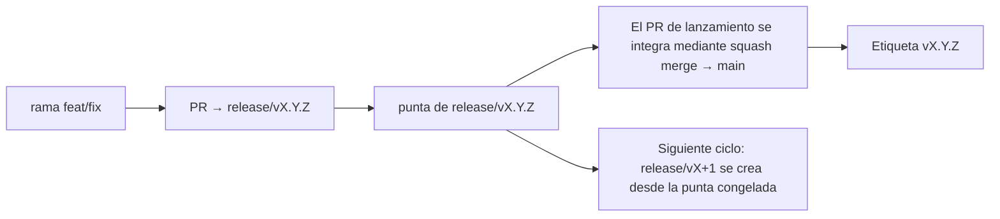

# Branching & Release Model (Español)

🌐 **Languages:** 🇺🇸 [English](../../../../ops/BRANCHING_MODEL.md) · 🇪🇹 [am](../../../am/docs/ops/BRANCHING_MODEL.md) · 🇸🇦 [ar](../../../ar/docs/ops/BRANCHING_MODEL.md) · 🇦🇿 [az](../../../az/docs/ops/BRANCHING_MODEL.md) · 🇧🇬 [bg](../../../bg/docs/ops/BRANCHING_MODEL.md) · 🇧🇩 [bn](../../../bn/docs/ops/BRANCHING_MODEL.md) · 🇨🇿 [cs](../../../cs/docs/ops/BRANCHING_MODEL.md) · 🇩🇰 [da](../../../da/docs/ops/BRANCHING_MODEL.md) · 🇩🇪 [de](../../../de/docs/ops/BRANCHING_MODEL.md) · 🇬🇷 [el](../../../el/docs/ops/BRANCHING_MODEL.md) · 🇪🇪 [et](../../../et/docs/ops/BRANCHING_MODEL.md) · 🇮🇷 [fa](../../../fa/docs/ops/BRANCHING_MODEL.md) · 🇫🇮 [fi](../../../fi/docs/ops/BRANCHING_MODEL.md) · 🇫🇷 [fr](../../../fr/docs/ops/BRANCHING_MODEL.md) · 🇮🇪 [ga](../../../ga/docs/ops/BRANCHING_MODEL.md) · 🇮🇳 [gu](../../../gu/docs/ops/BRANCHING_MODEL.md) · 🇳🇬 [ha](../../../ha/docs/ops/BRANCHING_MODEL.md) · 🇮🇱 [he](../../../he/docs/ops/BRANCHING_MODEL.md) · 🇮🇳 [hi](../../../hi/docs/ops/BRANCHING_MODEL.md) · 🇭🇷 [hr](../../../hr/docs/ops/BRANCHING_MODEL.md) · 🇭🇺 [hu](../../../hu/docs/ops/BRANCHING_MODEL.md) · 🇦🇲 [hy](../../../hy/docs/ops/BRANCHING_MODEL.md) · 🇮🇩 [id](../../../id/docs/ops/BRANCHING_MODEL.md) · 🇳🇬 [ig](../../../ig/docs/ops/BRANCHING_MODEL.md) · 🇮🇹 [it](../../../it/docs/ops/BRANCHING_MODEL.md) · 🇯🇵 [ja](../../../ja/docs/ops/BRANCHING_MODEL.md) · 🇬🇪 [ka](../../../ka/docs/ops/BRANCHING_MODEL.md) · 🇰🇭 [km](../../../km/docs/ops/BRANCHING_MODEL.md) · 🇮🇳 [kn](../../../kn/docs/ops/BRANCHING_MODEL.md) · 🇰🇷 [ko](../../../ko/docs/ops/BRANCHING_MODEL.md) · 🇱🇹 [lt](../../../lt/docs/ops/BRANCHING_MODEL.md) · 🇱🇻 [lv](../../../lv/docs/ops/BRANCHING_MODEL.md) · 🇮🇳 [ml](../../../ml/docs/ops/BRANCHING_MODEL.md) · 🇮🇳 [mr](../../../mr/docs/ops/BRANCHING_MODEL.md) · 🇲🇾 [ms](../../../ms/docs/ops/BRANCHING_MODEL.md) · 🇲🇹 [mt](../../../mt/docs/ops/BRANCHING_MODEL.md) · 🇲🇲 [my](../../../my/docs/ops/BRANCHING_MODEL.md) · 🇳🇵 [ne](../../../ne/docs/ops/BRANCHING_MODEL.md) · 🇳🇱 [nl](../../../nl/docs/ops/BRANCHING_MODEL.md) · 🇳🇴 [no](../../../no/docs/ops/BRANCHING_MODEL.md) · 🇮🇳 [or](../../../or/docs/ops/BRANCHING_MODEL.md) · 🇮🇳 [pa](../../../pa/docs/ops/BRANCHING_MODEL.md) · 🇵🇭 [phi](../../../phi/docs/ops/BRANCHING_MODEL.md) · 🇵🇱 [pl](../../../pl/docs/ops/BRANCHING_MODEL.md) · 🇵🇹 [pt](../../../pt/docs/ops/BRANCHING_MODEL.md) · 🇧🇷 [pt-BR](../../../pt-BR/docs/ops/BRANCHING_MODEL.md) · 🇷🇴 [ro](../../../ro/docs/ops/BRANCHING_MODEL.md) · 🇷🇺 [ru](../../../ru/docs/ops/BRANCHING_MODEL.md) · 🇱🇰 [si](../../../si/docs/ops/BRANCHING_MODEL.md) · 🇸🇰 [sk](../../../sk/docs/ops/BRANCHING_MODEL.md) · 🇸🇮 [sl](../../../sl/docs/ops/BRANCHING_MODEL.md) · 🇷🇸 [sr](../../../sr/docs/ops/BRANCHING_MODEL.md) · 🇸🇪 [sv](../../../sv/docs/ops/BRANCHING_MODEL.md) · 🇰🇪 [sw](../../../sw/docs/ops/BRANCHING_MODEL.md) · 🇮🇳 [ta](../../../ta/docs/ops/BRANCHING_MODEL.md) · 🇮🇳 [te](../../../te/docs/ops/BRANCHING_MODEL.md) · 🇹🇭 [th](../../../th/docs/ops/BRANCHING_MODEL.md) · 🇹🇷 [tr](../../../tr/docs/ops/BRANCHING_MODEL.md) · 🇺🇦 [uk-UA](../../../uk-UA/docs/ops/BRANCHING_MODEL.md) · 🇵🇰 [ur](../../../ur/docs/ops/BRANCHING_MODEL.md) · 🇺🇿 [uz](../../../uz/docs/ops/BRANCHING_MODEL.md) · 🇻🇳 [vi](../../../vi/docs/ops/BRANCHING_MODEL.md) · 🇳🇬 [yo](../../../yo/docs/ops/BRANCHING_MODEL.md) · 🇨🇳 [zh-CN](../../../zh-CN/docs/ops/BRANCHING_MODEL.md) · 🇹🇼 [zh-TW](../../../zh-TW/docs/ops/BRANCHING_MODEL.md)

---

OmniRoute utiliza un modelo de lanzamientos de **ciclos paralelos**: una rama
dedicada `release/vX.Y.Z` para el ciclo activo, `main` para la línea publicada y
una etiqueta inmutable `vX.Y.Z` cuando se publica ese ciclo. Es normal ver que los
commits lleguen tanto a `release/*` _como_ a `main`; no se trata de una confusión.

Los detalles para los mantenedores se encuentran en `CLAUDE.md` (Regla estricta
n.º 21) y [RELEASE_CHECKLIST.md](./RELEASE_CHECKLIST.md). Esta página es el
resumen público dirigido a los colaboradores.

## De un vistazo

| Ref                 | Función                                                                                                         |
| ------------------- | --------------------------------------------------------------------------------------------------------------- |
| `release/vX.Y.Z`    | **Ciclo activo** — desarrollo diario e integración de PR para esa versión                                       |
| `main`              | **Línea publicada** — recibe el ciclo mediante squash merge cuando se publica la versión                        |
| `vX.Y.Z` (etiqueta) | **Marcador de publicación** — referencia inmutable de «lo que se publicó», creada en el momento del lanzamiento |



## ¿A qué rama debe dirigirse mi PR?

**Dirige el PR a la rama activa `release/vX.Y.Z`, no a `main`.**

1. Busca la rama `release/v*` abierta con la versión más alta (ejemplo en el
   momento de redactar este documento: `release/v3.8.49`).
2. Crea tu rama desde esa punta (`git fetch` + checkout / rebase sobre ella).
3. Abre el PR con **base = esa rama `release/vX.Y.Z`**.

`main` no es la rama de integración diaria. Por lo general, los PR abiertos
contra `main` deben redirigirse antes de integrarlos.

## Congelación de lanzamiento (ciclos paralelos)

Cuando se está conciliando un lanzamiento, se abre una incidencia marcadora con
la etiqueta `release-freeze`. Esto **no detiene el desarrollo**:

- La rama congelada `release/vX.Y.Z` queda a cargo del responsable de ese
  lanzamiento.
- El siguiente ciclo, `release/vX+1`, se crea desde la punta congelada para que
  los colaboradores puedan seguir integrando trabajo.
- Los PR abiertos que aún apunten a la rama congelada deben **redirigirse** a la
  rama `release/v*` activa (la de versión más alta).

Comprueba si hay una congelación abierta antes de asumir que la rama que deseas
se puede integrar:

```bash
gh issue list --repo diegosouzapw/OmniRoute --label release-freeze --state open
```

Los mecanismos de integración (etiqueta `queue` del propietario → Mergify) están
documentados en [MERGE_TRAIN.md](./MERGE_TRAIN.md).

## ¿Por qué se usan tanto una rama como una etiqueta?

| Artefacto         | Duración       | Propósito                                                                      |
| ----------------- | -------------- | ------------------------------------------------------------------------------ |
| `release/vX.Y.Z`  | Ciclo en curso | Recopila los PR revisados, mantiene la CI en verde y sirve como base de los PR |
| Etiqueta `vX.Y.Z` | Para siempre   | Marca el contenido exacto que se publicó en npm / GitHub Releases              |

La rama es el taller; la etiqueta es el paquete sellado. Después del squash merge
en `main`, el siguiente ciclo continúa en `release/vX+1` sin esperar a que
finalice el PR del lanzamiento anterior.

## Documentación relacionada

- [CONTRIBUTING.md](../../CONTRIBUTING.md) — configuración, pruebas y lista de
  comprobación de PR
- [RELEASE_CHECKLIST.md](./RELEASE_CHECKLIST.md) — validación previa al
  lanzamiento
- [MERGE_TRAIN.md](./MERGE_TRAIN.md) — cola de integración y tren alternativo
- [RELEASE_GREEN.md](./RELEASE_GREEN.md) — cómo mantener en verde la punta de la
  rama de lanzamiento
