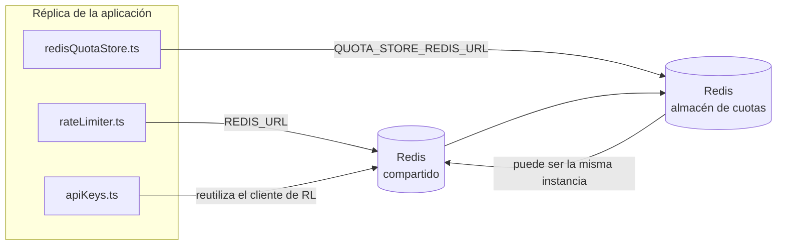

# Redis Production Configuration Guide (Español)

🌐 **Languages:** 🇺🇸 [English](../../../../ops/REDIS_PRODUCTION_CONFIG.md) · 🇪🇹 [am](../../../am/docs/ops/REDIS_PRODUCTION_CONFIG.md) · 🇸🇦 [ar](../../../ar/docs/ops/REDIS_PRODUCTION_CONFIG.md) · 🇦🇿 [az](../../../az/docs/ops/REDIS_PRODUCTION_CONFIG.md) · 🇧🇬 [bg](../../../bg/docs/ops/REDIS_PRODUCTION_CONFIG.md) · 🇧🇩 [bn](../../../bn/docs/ops/REDIS_PRODUCTION_CONFIG.md) · 🇨🇿 [cs](../../../cs/docs/ops/REDIS_PRODUCTION_CONFIG.md) · 🇩🇰 [da](../../../da/docs/ops/REDIS_PRODUCTION_CONFIG.md) · 🇩🇪 [de](../../../de/docs/ops/REDIS_PRODUCTION_CONFIG.md) · 🇬🇷 [el](../../../el/docs/ops/REDIS_PRODUCTION_CONFIG.md) · 🇪🇪 [et](../../../et/docs/ops/REDIS_PRODUCTION_CONFIG.md) · 🇮🇷 [fa](../../../fa/docs/ops/REDIS_PRODUCTION_CONFIG.md) · 🇫🇮 [fi](../../../fi/docs/ops/REDIS_PRODUCTION_CONFIG.md) · 🇫🇷 [fr](../../../fr/docs/ops/REDIS_PRODUCTION_CONFIG.md) · 🇮🇪 [ga](../../../ga/docs/ops/REDIS_PRODUCTION_CONFIG.md) · 🇮🇳 [gu](../../../gu/docs/ops/REDIS_PRODUCTION_CONFIG.md) · 🇳🇬 [ha](../../../ha/docs/ops/REDIS_PRODUCTION_CONFIG.md) · 🇮🇱 [he](../../../he/docs/ops/REDIS_PRODUCTION_CONFIG.md) · 🇮🇳 [hi](../../../hi/docs/ops/REDIS_PRODUCTION_CONFIG.md) · 🇭🇷 [hr](../../../hr/docs/ops/REDIS_PRODUCTION_CONFIG.md) · 🇭🇺 [hu](../../../hu/docs/ops/REDIS_PRODUCTION_CONFIG.md) · 🇦🇲 [hy](../../../hy/docs/ops/REDIS_PRODUCTION_CONFIG.md) · 🇮🇩 [id](../../../id/docs/ops/REDIS_PRODUCTION_CONFIG.md) · 🇳🇬 [ig](../../../ig/docs/ops/REDIS_PRODUCTION_CONFIG.md) · 🇮🇹 [it](../../../it/docs/ops/REDIS_PRODUCTION_CONFIG.md) · 🇯🇵 [ja](../../../ja/docs/ops/REDIS_PRODUCTION_CONFIG.md) · 🇬🇪 [ka](../../../ka/docs/ops/REDIS_PRODUCTION_CONFIG.md) · 🇰🇭 [km](../../../km/docs/ops/REDIS_PRODUCTION_CONFIG.md) · 🇮🇳 [kn](../../../kn/docs/ops/REDIS_PRODUCTION_CONFIG.md) · 🇰🇷 [ko](../../../ko/docs/ops/REDIS_PRODUCTION_CONFIG.md) · 🇱🇹 [lt](../../../lt/docs/ops/REDIS_PRODUCTION_CONFIG.md) · 🇱🇻 [lv](../../../lv/docs/ops/REDIS_PRODUCTION_CONFIG.md) · 🇮🇳 [ml](../../../ml/docs/ops/REDIS_PRODUCTION_CONFIG.md) · 🇮🇳 [mr](../../../mr/docs/ops/REDIS_PRODUCTION_CONFIG.md) · 🇲🇾 [ms](../../../ms/docs/ops/REDIS_PRODUCTION_CONFIG.md) · 🇲🇹 [mt](../../../mt/docs/ops/REDIS_PRODUCTION_CONFIG.md) · 🇲🇲 [my](../../../my/docs/ops/REDIS_PRODUCTION_CONFIG.md) · 🇳🇵 [ne](../../../ne/docs/ops/REDIS_PRODUCTION_CONFIG.md) · 🇳🇱 [nl](../../../nl/docs/ops/REDIS_PRODUCTION_CONFIG.md) · 🇳🇴 [no](../../../no/docs/ops/REDIS_PRODUCTION_CONFIG.md) · 🇮🇳 [or](../../../or/docs/ops/REDIS_PRODUCTION_CONFIG.md) · 🇮🇳 [pa](../../../pa/docs/ops/REDIS_PRODUCTION_CONFIG.md) · 🇵🇭 [phi](../../../phi/docs/ops/REDIS_PRODUCTION_CONFIG.md) · 🇵🇱 [pl](../../../pl/docs/ops/REDIS_PRODUCTION_CONFIG.md) · 🇵🇹 [pt](../../../pt/docs/ops/REDIS_PRODUCTION_CONFIG.md) · 🇧🇷 [pt-BR](../../../pt-BR/docs/ops/REDIS_PRODUCTION_CONFIG.md) · 🇷🇴 [ro](../../../ro/docs/ops/REDIS_PRODUCTION_CONFIG.md) · 🇷🇺 [ru](../../../ru/docs/ops/REDIS_PRODUCTION_CONFIG.md) · 🇱🇰 [si](../../../si/docs/ops/REDIS_PRODUCTION_CONFIG.md) · 🇸🇰 [sk](../../../sk/docs/ops/REDIS_PRODUCTION_CONFIG.md) · 🇸🇮 [sl](../../../sl/docs/ops/REDIS_PRODUCTION_CONFIG.md) · 🇷🇸 [sr](../../../sr/docs/ops/REDIS_PRODUCTION_CONFIG.md) · 🇸🇪 [sv](../../../sv/docs/ops/REDIS_PRODUCTION_CONFIG.md) · 🇰🇪 [sw](../../../sw/docs/ops/REDIS_PRODUCTION_CONFIG.md) · 🇮🇳 [ta](../../../ta/docs/ops/REDIS_PRODUCTION_CONFIG.md) · 🇮🇳 [te](../../../te/docs/ops/REDIS_PRODUCTION_CONFIG.md) · 🇹🇭 [th](../../../th/docs/ops/REDIS_PRODUCTION_CONFIG.md) · 🇹🇷 [tr](../../../tr/docs/ops/REDIS_PRODUCTION_CONFIG.md) · 🇺🇦 [uk-UA](../../../uk-UA/docs/ops/REDIS_PRODUCTION_CONFIG.md) · 🇵🇰 [ur](../../../ur/docs/ops/REDIS_PRODUCTION_CONFIG.md) · 🇺🇿 [uz](../../../uz/docs/ops/REDIS_PRODUCTION_CONFIG.md) · 🇻🇳 [vi](../../../vi/docs/ops/REDIS_PRODUCTION_CONFIG.md) · 🇳🇬 [yo](../../../yo/docs/ops/REDIS_PRODUCTION_CONFIG.md) · 🇨🇳 [zh-CN](../../../zh-CN/docs/ops/REDIS_PRODUCTION_CONFIG.md) · 🇹🇼 [zh-TW](../../../zh-TW/docs/ops/REDIS_PRODUCTION_CONFIG.md)

---

## Descripción general

Redis es una **dependencia opcional y no crítica** en OmniRoute: la aplicación reduce sus funcionalidades de forma controlada (usando
alternativas en memoria) cuando Redis no está disponible. En producción, ajustar Redis reduce la latencia de cuatro cargas de
trabajo distintas:

| Carga de trabajo           | Controlador                   | Fábrica de clientes                                         | Patrón de claves                                                              |
| -------------------------- | ----------------------------- | ----------------------------------------------------------- | ----------------------------------------------------------------------------- |
| Limitación de frecuencia   | `rateLimiter.ts`              | Singleton diferido de `ioredis` mediante `getRedisClient()` | Ventanas de limitación de frecuencia atómicas mediante Lua con `<prefix>rl:*` |
| Caché de autenticación     | `apiKeys.ts`                  | Reutiliza el cliente de `rateLimiter`                       | `<prefix>auth:api_key:<sha256>` con TTL                                       |
| Almacén de cuotas          | `redisQuotaStore.ts`          | Singleton independiente mediante `getRedisClient(url)`      | `<prefix>quota:*` configurable por instancia                                  |
| Disyuntor de calentamiento | `redisCircuitBreakerStore.ts` | Cliente independiente en `circuitBreakerFactory.ts`         | `<prefix>warmup:cb:<connectionId>`                                            |

Las cuatro cargas de trabajo comparten un único prefijo de espacio de nombres para que OmniRoute pueda coexistir con otras aplicaciones en una
sola instancia de Redis (p. ej., `127.0.0.1:6379`). Consulte [Espacios de nombres de claves](#key-namespacing).

---

## Configuración actual (valores predeterminados del código)

| Configuración                               | Valor                                                                         | Ubicación                                                                             |
| ------------------------------------------- | ----------------------------------------------------------------------------- | ------------------------------------------------------------------------------------- |
| Variable de entorno `REDIS_URL`             | `redis://redis:6379` (compose), opcional                                      | `rateLimiter.ts:5`, `.env.example`                                                    |
| Variable de entorno `REDIS_KEY_PREFIX`      | `omniroute:` (predeterminado)                                                 | `rateLimiter.ts`, `redisQuotaStore.ts`, `redisCircuitBreakerStore.ts`, `.env.example` |
| Variable de entorno `QUOTA_STORE_REDIS_URL` | independiente, puede diferir de `REDIS_URL`                                   | `quota/storeFactory.ts`                                                               |
| `QUOTA_STORE_DRIVER`                        | `"sqlite"` (predeterminado), `"redis"` opcional                               | `quota/storeFactory.ts`                                                               |
| `maxRetriesPerRequest` de ioredis           | `3`                                                                           | creación del cliente en `rateLimiter.ts`                                              |
| `enableReadyCheck`                          | no establecido (valor predeterminado de ioredis: `true`)                      | —                                                                                     |
| `lazyConnect`                               | no establecido (valor predeterminado de ioredis: `false`)                     | —                                                                                     |
| `retryStrategy`                             | no establecido (valor predeterminado de ioredis: base de 200 ms, exponencial) | —                                                                                     |
| TLS / contraseña / índice de base de datos  | **no configurados**                                                           | —                                                                                     |
| Sentinel / Cluster                          | **no configurados** — solo nodo único independiente                           | —                                                                                     |

---

## Espacios de nombres de claves

OmniRoute comparte una instancia de Redis con cualquier otro servicio que se ejecute en el host. Sin un espacio de nombres,
claves como `auth:api_key:<sha256>` o `rl:*` podrían entrar en conflicto con claves de otras aplicaciones
que utilicen el mismo Redis (esta instancia ejecuta Redis en `127.0.0.1:6379` junto con otros servicios).

Establezca `REDIS_KEY_PREFIX` en una cadena no vacía para anteponer un prefijo a **todas** las claves de OmniRoute:

```bash
# .env — todas las claves de OmniRoute pasan a ser omniroute:rl:*, omniroute:auth:*, omniroute:quota:*, omniroute:warmup:cb:*
REDIS_KEY_PREFIX=omniroute:
```

- **Valor predeterminado:** `omniroute:` (se aplica cuando `REDIS_KEY_PREFIX` no está establecido o está vacío).
- **Se aplica a:** el limitador de frecuencia y la caché de autenticación (cliente `ioredis` compartido mediante `keyPrefix`), el
  almacén de cuotas (`KEY_PREFIX = "${REDIS_KEY_PREFIX}quota"`) y el disyuntor de calentamiento
  (`KEY_PREFIX = "${REDIS_KEY_PREFIX}warmup:cb:"`).
- **Cambiar el prefijo** cuando ya existen claves en Redis deja huérfanas las claves antiguas (estas caducan
  mediante TTL / LRU). Es seguro cambiarlo; no se necesita ninguna migración. La única excepción es una clave del
  disyuntor de calentamiento para una conexión marcada como prohibida: se conserva sin TTL, por lo que debe
  enumerar los restos con `redis-cli --scan --pattern '<old-prefix>warmup:cb:*'` y eliminarlos.
- **`keyPrefix` de ioredis** antepone automáticamente el prefijo durante las escrituras **y** lo elimina durante las lecturas,
  por lo que el código de la aplicación nunca ve el prefijo.

---

## Ajustes recomendados para producción

### 1. Opciones del pool de conexiones / cliente (constructor `Redis` de ioredis)

El código actual crea una única instancia `new Redis(url)` sin opciones personalizadas. Para despliegues de producción con múltiples réplicas, pase una fábrica de clientes en el código o encapsule `getRedisClient()`:

```typescript
const redis = new Redis(REDIS_URL, {
  maxRetriesPerRequest: null, // sin límite de reintentos; dejar que retryStrategy decida
  enableReadyCheck: true, // verificar que el servidor esté listo antes de aceptar llamadas
  lazyConnect: true, // no conectarse durante la construcción; esperar a la primera llamada
  retryStrategy: (times) => {
    if (times > 10) return null; // abandonar después de 10 reintentos → reconectarse más tarde
    return Math.min(times * 200, 5000); // 200 ms, 400 ms, …, límite de 5 s
  },
  enableAutoPipelining: true, // agrupar comandos simultáneos en una sola escritura TCP
  keepAlive: 10000, // keep-alive TCP cada 10 s
});
```

**Principales ventajas y desventajas:**

- `maxRetriesPerRequest: null` + `retryStrategy` — opción recomendada para producción, de modo que los reinicios transitorios de Redis no hagan que todas las solicitudes fallen inmediatamente. El mecanismo alternativo en memoria de `checkRateLimit()` absorbe la ruta de fallo.
- `lazyConnect: true` — evita que el arranque dependa de que Redis esté disponible antes de que el servidor comience a aceptar conexiones.
- `enableAutoPipelining: true` — reduce los viajes de ida y vuelta para las comprobaciones simultáneas de límites de frecuencia; resulta beneficioso con >50 RPS en una sola conexión.

### 2. Configuración del servidor Redis (`redis.conf`)

```
# Memoria
maxmemory 80%                        # dejar espacio para la caché de páginas del SO
maxmemory-policy allkeys-lru         # expulsar entradas obsoletas de la caché de autenticación bajo presión

# Persistencia (opcional — OmniRoute es seguro ante fallos sin ella)
save 300 1                           # crear una instantánea al menos cada 5 min si cambió ≥1 clave
appendonly no                        # AOF no es necesario; los datos se pueden regenerar
appendfsync no                       # sin sobrecarga de fsync (RDB es suficiente)

# Red
timeout 0                            # no desconectar por inactividad
tcp-keepalive 300                    # keep-alive de 5 min
tcp-backlog 511                      # cola de conexiones para cargas con ráfagas

# Rendimiento
hz 10                                # valor predeterminado; 100 para cargas sensibles a la latencia
activedefrag yes                     # desfragmentar automáticamente cuando la fragmentación sea >10%
```

**Implicaciones de `maxmemory-policy allkeys-lru`:** Las entradas de la caché de autenticación pueden expulsarse cuando haya presión de memoria. Esto es seguro: `setCachedApiKey` siempre vuelve a rellenar la caché cuando no encuentra una entrada, y el mecanismo alternativo de SQLite es la fuente autoritativa. El script Lua del limitador de frecuencia crea claves pequeñas y de corta duración por diseño.

### 3. Configuración de Docker Compose

La configuración de producción (`docker-compose.prod.yml`) utiliza `redis:8.6.2-alpine`. Añada:

```yaml
redis:
  image: redis:8.6.2-alpine
  command:
    [
      "redis-server",
      "--maxmemory",
      "512mb",
      "--maxmemory-policy",
      "allkeys-lru",
      "--activedefrag",
      "yes",
      "--save",
      "300 1",
    ]
  healthcheck:
    test: ["CMD", "redis-cli", "ping"]
    interval: 10s
    timeout: 3s
    retries: 3
    start_period: 5s
```

### 4. Consideraciones sobre múltiples instancias / escalado

**Un único Redis para todas las réplicas** — el script Lua del limitador de frecuencia depende de un único espacio de claves autoritativo. El uso de múltiples instancias de Redis detrás de las réplicas haría que se perdiera la atomicidad y duplicaría el presupuesto. Utilice un único Redis (o un clúster de Redis Sentinel con conmutación por error) para todas las réplicas de la aplicación.

**Número de conexiones:** Cada réplica de la aplicación abre **2 conexiones TCP** a Redis (cliente del limitador de frecuencia + cliente del almacén de cuotas). Con 10 réplicas → 20 conexiones, muy por debajo del límite predeterminado de 10 000 conexiones de una instancia de Redis.

### 5. Monitorización

Exponga lo siguiente mediante el endpoint de comprobación de estado:

```typescript
// src/app/api/monitoring/health/route.ts ya llama a funciones de rateLimiter
// Añadir comprobaciones específicas de Redis:
//   1. Latencia de PING mediante .ping() de ioredis
//   2. Uso de memoria mediante INFO memory
//   3. Número de conexiones mediante INFO clients
//   4. Tasa de aciertos de maxmemory-policy (evicted_keys / keyspace_hits)
```

Métricas clave que deben vigilarse:

- **Claves expulsadas/s** — si el valor permanece distinto de cero, aumente `maxmemory`
- **Clientes bloqueados** — un valor distinto de cero indica scripts Lua lentos o una contención elevada
- **Conexiones rechazadas** — se ha alcanzado el límite de conexiones; poco probable con 20 conexiones

---

## Diagrama de arquitectura



---

## Referencias

| Archivo                            | Propósito                                                                                    |
| ---------------------------------- | -------------------------------------------------------------------------------------------- |
| `src/shared/utils/rateLimiter.ts`  | Cliente principal de Redis, script Lua de limitación de solicitudes y alternativa en memoria |
| `src/lib/db/apiKeys.ts`            | Caché de autenticación — Redis→SQLite como alternativa                                       |
| `src/lib/quota/redisQuotaStore.ts` | Cliente de Redis independiente para el almacén de cuotas opcional                            |
| `src/lib/quota/storeFactory.ts`    | Alterna entre los controladores de cuotas `sqlite` y `redis`                                 |
| `docker-compose.prod.yml`          | Contenedor de Redis de producción (imagen `redis:8.6.2-alpine`)                              |
| `.env.example`                     | Documentación de las variables de entorno de Redis                                           |
| `src/app/api/local/redis/`         | Rutas de API para la orquestación de contenedores de desarrollo                              |
| `bin/cli/commands/redis.mjs`       | Comandos de CLI para la orquestación de contenedores de desarrollo                           |
