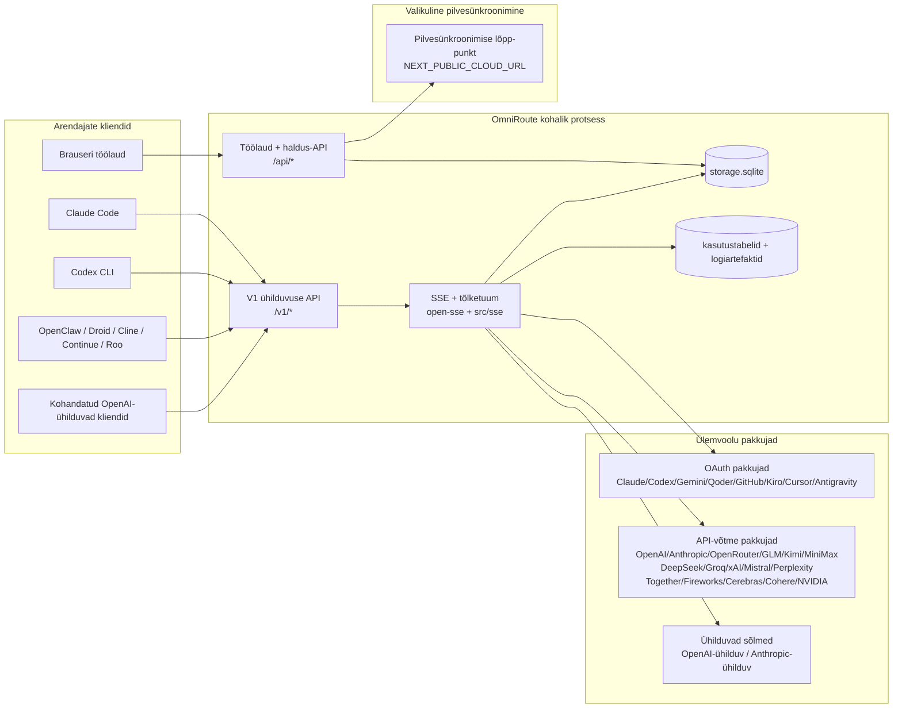
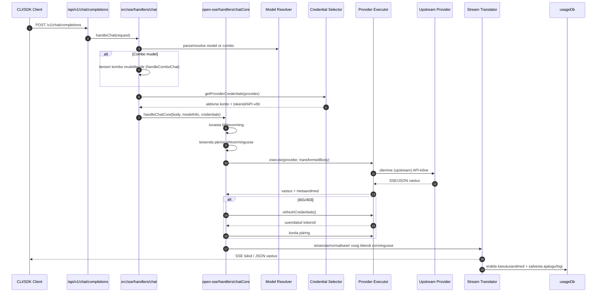
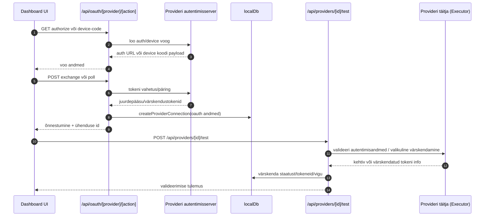
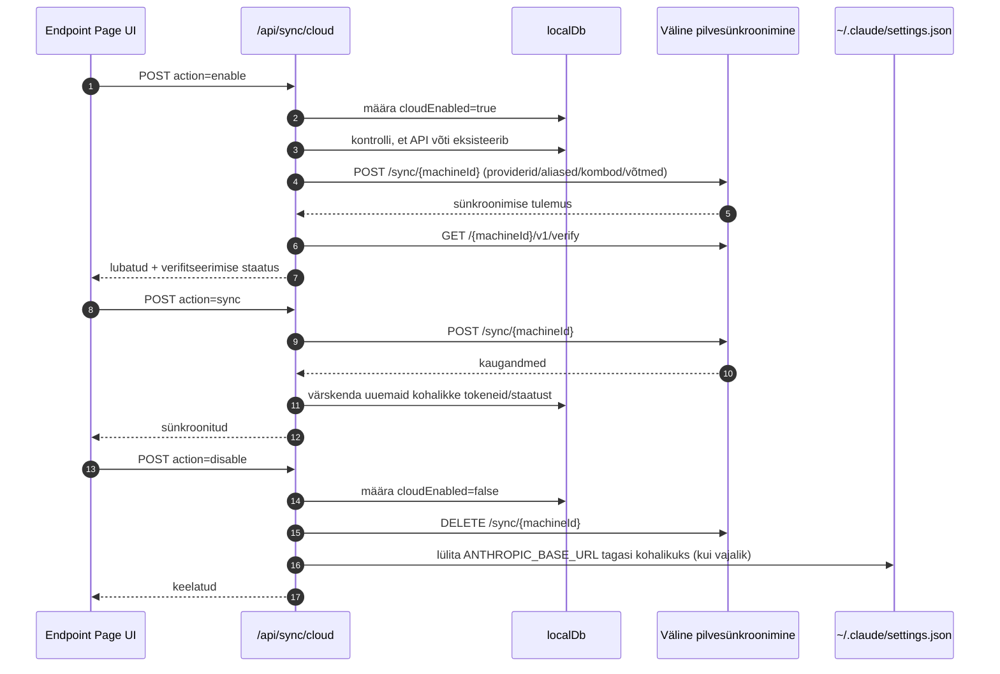
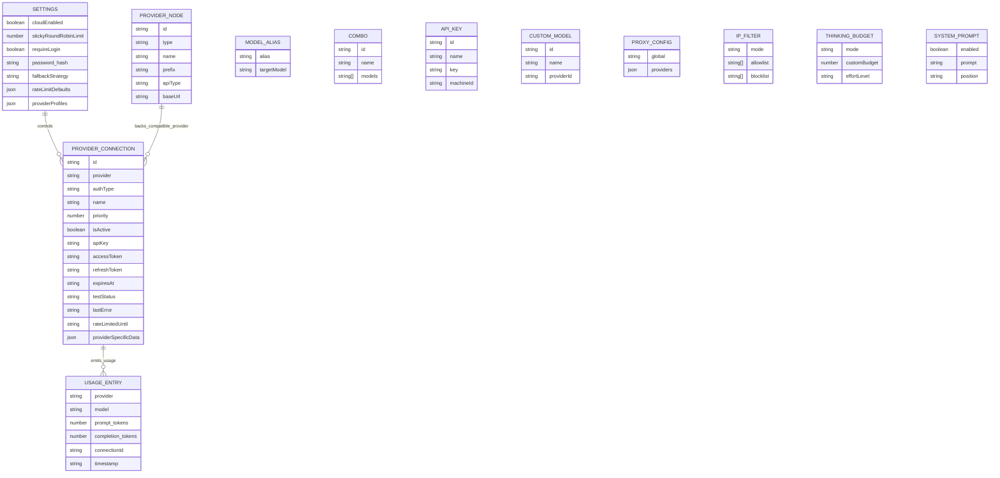
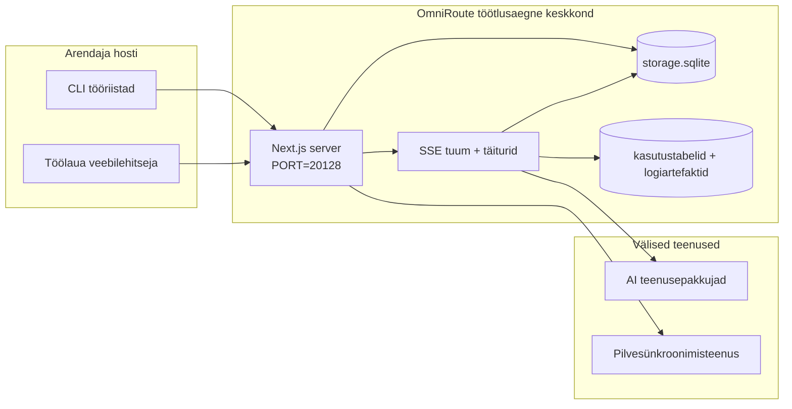

# ARCHITECTURE (Eesti)

🌐 **Languages:** 🇺🇸 [English](../../../../architecture/ARCHITECTURE.md) · 🇸🇦 [ar](../../../ar/docs/architecture/ARCHITECTURE.md) · 🇦🇿 [az](../../../az/docs/architecture/ARCHITECTURE.md) · 🇧🇬 [bg](../../../bg/docs/architecture/ARCHITECTURE.md) · 🇧🇩 [bn](../../../bn/docs/architecture/ARCHITECTURE.md) · 🇨🇿 [cs](../../../cs/docs/architecture/ARCHITECTURE.md) · 🇩🇰 [da](../../../da/docs/architecture/ARCHITECTURE.md) · 🇩🇪 [de](../../../de/docs/architecture/ARCHITECTURE.md) · 🇬🇷 [el](../../../el/docs/architecture/ARCHITECTURE.md) · 🇪🇸 [es](../../../es/docs/architecture/ARCHITECTURE.md) · 🇮🇷 [fa](../../../fa/docs/architecture/ARCHITECTURE.md) · 🇫🇮 [fi](../../../fi/docs/architecture/ARCHITECTURE.md) · 🇫🇷 [fr](../../../fr/docs/architecture/ARCHITECTURE.md) · 🇮🇪 [ga](../../../ga/docs/architecture/ARCHITECTURE.md) · 🇮🇳 [gu](../../../gu/docs/architecture/ARCHITECTURE.md) · 🇮🇱 [he](../../../he/docs/architecture/ARCHITECTURE.md) · 🇮🇳 [hi](../../../hi/docs/architecture/ARCHITECTURE.md) · 🇭🇷 [hr](../../../hr/docs/architecture/ARCHITECTURE.md) · 🇭🇺 [hu](../../../hu/docs/architecture/ARCHITECTURE.md) · 🇮🇩 [id](../../../id/docs/architecture/ARCHITECTURE.md) · 🇮🇹 [it](../../../it/docs/architecture/ARCHITECTURE.md) · 🇯🇵 [ja](../../../ja/docs/architecture/ARCHITECTURE.md) · 🇰🇷 [ko](../../../ko/docs/architecture/ARCHITECTURE.md) · 🇱🇹 [lt](../../../lt/docs/architecture/ARCHITECTURE.md) · 🇱🇻 [lv](../../../lv/docs/architecture/ARCHITECTURE.md) · 🇮🇳 [mr](../../../mr/docs/architecture/ARCHITECTURE.md) · 🇲🇾 [ms](../../../ms/docs/architecture/ARCHITECTURE.md) · 🇲🇹 [mt](../../../mt/docs/architecture/ARCHITECTURE.md) · 🇳🇱 [nl](../../../nl/docs/architecture/ARCHITECTURE.md) · 🇳🇴 [no](../../../no/docs/architecture/ARCHITECTURE.md) · 🇵🇭 [phi](../../../phi/docs/architecture/ARCHITECTURE.md) · 🇵🇱 [pl](../../../pl/docs/architecture/ARCHITECTURE.md) · 🇵🇹 [pt](../../../pt/docs/architecture/ARCHITECTURE.md) · 🇧🇷 [pt-BR](../../../pt-BR/docs/architecture/ARCHITECTURE.md) · 🇷🇴 [ro](../../../ro/docs/architecture/ARCHITECTURE.md) · 🇷🇺 [ru](../../../ru/docs/architecture/ARCHITECTURE.md) · 🇸🇰 [sk](../../../sk/docs/architecture/ARCHITECTURE.md) · 🇸🇮 [sl](../../../sl/docs/architecture/ARCHITECTURE.md) · 🇷🇸 [sr](../../../sr/docs/architecture/ARCHITECTURE.md) · 🇸🇪 [sv](../../../sv/docs/architecture/ARCHITECTURE.md) · 🇰🇪 [sw](../../../sw/docs/architecture/ARCHITECTURE.md) · 🇮🇳 [ta](../../../ta/docs/architecture/ARCHITECTURE.md) · 🇮🇳 [te](../../../te/docs/architecture/ARCHITECTURE.md) · 🇹🇭 [th](../../../th/docs/architecture/ARCHITECTURE.md) · 🇹🇷 [tr](../../../tr/docs/architecture/ARCHITECTURE.md) · 🇺🇦 [uk-UA](../../../uk-UA/docs/architecture/ARCHITECTURE.md) · 🇵🇰 [ur](../../../ur/docs/architecture/ARCHITECTURE.md) · 🇻🇳 [vi](../../../vi/docs/architecture/ARCHITECTURE.md) · 🇨🇳 [zh-CN](../../../zh-CN/docs/architecture/ARCHITECTURE.md) · 🇹🇼 [zh-TW](../../../zh-TW/docs/architecture/ARCHITECTURE.md)

---

# OmniRoute Arhitektuur

🌐 **Languages:** 🇺🇸 [English](../../../../architecture/ARCHITECTURE.md) · 🇸🇦 [ar](../../../ar/docs/architecture/ARCHITECTURE.md) · 🇦🇿 [az](../../../az/docs/architecture/ARCHITECTURE.md) · 🇧🇬 [bg](../../../bg/docs/architecture/ARCHITECTURE.md) · 🇧🇩 [bn](../../../bn/docs/architecture/ARCHITECTURE.md) · 🇨🇿 [cs](../../../cs/docs/architecture/ARCHITECTURE.md) · 🇩🇰 [da](../../../da/docs/architecture/ARCHITECTURE.md) · 🇩🇪 [de](../../../de/docs/architecture/ARCHITECTURE.md) · 🇬🇷 [el](../../../el/docs/architecture/ARCHITECTURE.md) · 🇪🇸 [es](../../../es/docs/architecture/ARCHITECTURE.md) · 🇮🇷 [fa](../../../fa/docs/architecture/ARCHITECTURE.md) · 🇫🇮 [fi](../../../fi/docs/architecture/ARCHITECTURE.md) · 🇫🇷 [fr](../../../fr/docs/architecture/ARCHITECTURE.md) · 🇮🇪 [ga](../../../ga/docs/architecture/ARCHITECTURE.md) · 🇮🇳 [gu](../../../gu/docs/architecture/ARCHITECTURE.md) · 🇮🇱 [he](../../../he/docs/architecture/ARCHITECTURE.md) · 🇮🇳 [hi](../../../hi/docs/architecture/ARCHITECTURE.md) · 🇭🇷 [hr](../../../hr/docs/architecture/ARCHITECTURE.md) · 🇭🇺 [hu](../../../hu/docs/architecture/ARCHITECTURE.md) · 🇮🇩 [id](../../../id/docs/architecture/ARCHITECTURE.md) · 🇮🇹 [it](../../../it/docs/architecture/ARCHITECTURE.md) · 🇯🇵 [ja](../../../ja/docs/architecture/ARCHITECTURE.md) · 🇰🇷 [ko](../../../ko/docs/architecture/ARCHITECTURE.md) · 🇱🇹 [lt](../../../lt/docs/architecture/ARCHITECTURE.md) · 🇱🇻 [lv](../../../lv/docs/architecture/ARCHITECTURE.md) · 🇮🇳 [mr](../../../mr/docs/architecture/ARCHITECTURE.md) · 🇲🇾 [ms](../../../ms/docs/architecture/ARCHITECTURE.md) · 🇲🇹 [mt](../../../mt/docs/architecture/ARCHITECTURE.md) · 🇳🇱 [nl](../../../nl/docs/architecture/ARCHITECTURE.md) · 🇳🇴 [no](../../../no/docs/architecture/ARCHITECTURE.md) · 🇵🇭 [phi](../../../phi/docs/architecture/ARCHITECTURE.md) · 🇵🇱 [pl](../../../pl/docs/architecture/ARCHITECTURE.md) · 🇵🇹 [pt](../../../pt/docs/architecture/ARCHITECTURE.md) · 🇧🇷 [pt-BR](../../../pt-BR/docs/architecture/ARCHITECTURE.md) · 🇷🇴 [ro](../../../ro/docs/architecture/ARCHITECTURE.md) · 🇷🇺 [ru](../../../ru/docs/architecture/ARCHITECTURE.md) · 🇸🇰 [sk](../../../sk/docs/architecture/ARCHITECTURE.md) · 🇸🇮 [sl](../../../sl/docs/architecture/ARCHITECTURE.md) · 🇷🇸 [sr](../../../sr/docs/architecture/ARCHITECTURE.md) · 🇸🇪 [sv](../../../sv/docs/architecture/ARCHITECTURE.md) · 🇰🇪 [sw](../../../sw/docs/architecture/ARCHITECTURE.md) · 🇮🇳 [ta](../../../ta/docs/architecture/ARCHITECTURE.md) · 🇮🇳 [te](../../../te/docs/architecture/ARCHITECTURE.md) · 🇹🇭 [th](../../../th/docs/architecture/ARCHITECTURE.md) · 🇹🇷 [tr](../../../tr/docs/architecture/ARCHITECTURE.md) · 🇺🇦 [uk-UA](../../../uk-UA/docs/architecture/ARCHITECTURE.md) · 🇵🇰 [ur](../../../ur/docs/architecture/ARCHITECTURE.md) · 🇻🇳 [vi](../../../vi/docs/architecture/ARCHITECTURE.md) · 🇨🇳 [zh-CN](../../../zh-CN/docs/architecture/ARCHITECTURE.md) · 🇹🇼 [zh-TW](../../../zh-TW/docs/architecture/ARCHITECTURE.md)

_Viimati uuendatud: 2026-06-28_

## Kokkuvõte

OmniRoute on kohalik AI ruuteri lüüs ja töölaud, mis on ehitatud Next.js baasil.
See pakub ühte OpenAI-ga ühilduvat lõpp-punkti (`/v1/*`) ja suunab liikluse mitmete ülemvoolu teenusepakkujate vahel, tegeledes tõlkimise, tõrketaluvuse, tokenite värskendamise ja kasutuse jälgimisega.

Peamised võimalused:

- OpenAI-ga ühilduv API pind CLI/tööriistadele (355 teenusepakkujat, 108 täiturit)
- Päringute/vastuste tõlkimine erinevate teenusepakkujate vormingute vahel
- Mudelikombinatsioonide tõrketaluvus (mitme mudeli jada)
- Struktureeritud kombosammud (`provider + model + connection`) koos jooksva järjestamisega `compositeTiers` järgi
- Konto tasemel tõrketaluvus (mitu kontot teenusepakkuja kohta)
- Kvoodi eelkontroll ja kvoodist teadlik P2C konto valik peamises vestlusteel
- OAuth + API-võtme teenusepakkuja ühenduse haldus (22 OAuth teenusepakkuja moodulit)
- Manuste (embeddings) genereerimine `/v1/embeddings` kaudu (18 teenusepakkujat)
- Pildi genereerimine `/v1/images/generations` kaudu (10+ teenusepakkujat, 20+ mudelit)
- Audio transkriptsioon `/v1/audio/transcriptions` kaudu (18 teenusepakkujat)
- Tekst-kõneks `/v1/audio/speech` kaudu (24 sisseehitatud teenusepakkujat)
- Video genereerimine `/v1/videos/generations` kaudu (ComfyUI + SD WebUI)
- Muusika genereerimine `/v1/music/generations` kaudu (ComfyUI)
- Veebiotsing `/v1/search` kaudu (20 teenusepakkujat)
- Modereerimine `/v1/moderations` kaudu
- Reranking `/v1/rerank` kaudu
- Mõttesildi (``) parsimine arutlusmudelite jaoks
- Vastuse sanitiseerimine range OpenAI SDK ühilduvuse tagamiseks
- Rolli normaliseerimine (developer→system, system→user) teenusepakkujate ülese ühilduvuse jaoks
- Struktureeritud väljundi teisendus (json_schema → Gemini responseSchema)
- Kohalik püsivus teenusepakkujate, võtmete, aliaste, kombode, sätete ja hinnastuse jaoks (122 andmebaasimoodulit)
- Kasutuse/kulu jälgimine ja päringute logimine
- Valikuline pilvesünkroonimine mitme seadme/oleku sünkroonimiseks
- IP lubatud/keelatud loendid API juurdepääsu kontrolliks
- Mõtlemiseelarve haldus (edastamine/automaatne/kohandatud/adaptiivne)
- Globaalse süsteemipäise (system prompt) sisestamine
- Seansi jälgimine ja sõrmejälgede tuvastamine
- Konto-põhine täiustatud kiiruse piiramine teenusepakkuja-spetsiifiliste profiilidega
- Katkestuslüliti (circuit breaker) muster teenusepakkuja vastupidavuse tagamiseks
- Kaitse "kohtukarja" efekti (thundering herd) vastu mutex lukustusega
- Signatuuripõhine päringute deduplikatsiooni vahemälu
- Domeenikiht: kulureeglid, tõrketaluvuse poliitika, lukustuspoliitika
- Context Relay: seansi üleandmise kokkuvõtted konto rotatsiooni järjepidevuse jaoks
- Domeeni oleku püsivus (SQLite läbikirjutusvahemälu tõrketaluvuse, eelarvete, lukustuste, katkestuslülitite jaoks)
- Poliitikamootor tsentraliseeritud päringute hindamiseks (lukustus → eelarve → tõrketaluvus)
- Päringute telemeetria p50/p95/p99 latentsuse agregeerimisega
- Kombo sihtmärgi telemeetria ja ajaloolise kombo sihtmärgi tervis `combo_execution_key` / `combo_step_id` kaudu
- Korrelatsiooni ID (X-Request-Id) otsast-lõpuni jälgimiseks
- Vastavusauditi logimine koos opt-out valikuga API võtme kaupa
- Hindamisraamistik (eval framework) LLM kvaliteedi tagamiseks
- Terviseülevaate töölaud reaalajas teenusepakkuja katkestuslüliti olekuga
- MCP server (110 tööriista) 3 transpordiga (stdio/SSE/Streamable HTTP)
- A2A server (JSON-RPC 2.0 + SSE) oskuste ja ülesannete elutsükliga
- Mälusüsteem (eraldamine, sisestamine, otsimine, kokkuvõtete tegemine)
- Oskuste süsteem (register, täitur, liivakast, sisseehitatud oskused)
- MITM proxy sertifikaadihalduse ja DNS käsitlemisega
- Prompt-süsti kaitse vahevara
- Prompti tihendamise torustik koos Caveman, RTK, kihiliste torustike, tihendamiskombode, keelepakettide ja analüütikaga
- ACP (Agent Communication Protocol) register
- Modulaarsed OAuth teenusepakkujad (22 eraldi moodulit kataloogis `src/lib/oauth/providers/`)
- Desinstalli/täieliku desinstalli skriptid
- OAuth keskkonna parandustoiming
- WebSocket sild OpenAI-ga ühilduvatele WS klientidele (`/v1/ws`)
- Sünkroonimistokeni haldus (väljastamine/tühistamine, ETag-versioonitud konfiguratsioonipaketi allalaadimine)
- GLM Thinking (`glmt`) esmaklassiline teenusepakkuja eelseadistus
- Hübriidne tokenite loendamine (teenusepakkuja-poolne `/messages/count_tokens` koos hinnangulise varulahendusega)
- Mudelite aliaste automaatne eelseadistamine (30+ ristproxy dialekti normaliseerimist käivitamisel)
- Turvaline väljuv päring SSRF kaitsega, privaatsete URL-ide blokeerimisega ja konfigureeritava korduskatsega
- Jahtumisajast (cooldown) teadlikud vestluse korduskatsed konfigureeritava `requestRetry` ja `maxRetryIntervalSec` abil
- Käitusaja keskkonna valideerimine Zod-iga käivitamisel
- Vastavusauditi v2 lehitamise, teenusepakkuja CRUD sündmuste ja SSRF-blokeeritud valideerimise logimisega

Peamine käitusmudel:

- Next.js rakenduse teed kataloogis `src/app/api/*` rakendavad nii töölaua API-sid kui ka ühilduvuse API-sid
- Jagatud SSE/ruutimise tuum kataloogides `src/sse/*` + `open-sse/*` haldab teenusepakkuja täitmist, tõlkimist, voogesitust, tõrketaluvust ja kasutust

## Viitediagrammid

Kanoonilised, versioonihaldusega Mermaid lähtekoodid v3.8.0 platvormi jaoks asuvad
kaustas [`docs/diagrams/`](../diagrams/README.md). Allpool on toodud kaks näidet suunamiseks;
ülejäänud on lingitud vastavatest valdkonnaspetsiifilistest juhenditest.


> Allikas: [diagrams/request-pipeline.mmd](../diagrams/request-pipeline.mmd)

> Allikas: [diagrams/resilience-3layers.mmd](../diagrams/resilience-3layers.mmd) — samuti lingitud
> juhendist [RESILIENCE_GUIDE.md](./RESILIENCE_GUIDE.md) ja `CLAUDE.md` vastupidavuse viitest.

## Ulatus ja piirid

### Kuulub ulatusse

- Kohalik gateway käitusaeg (runtime)
- Töölaua (dashboard) haldus-API-d
- Teenusepakkuja autentimine ja tokeni värskendamine
- Päringute teisendamine ja SSE voogedastus
- Kohalik olek + kasutuse säilitamine
- Valikuline pilvesünkroonimise orkestreerimine

### Ei kuulu ulatusse

- Pilveteenuse implementatsioon `NEXT_PUBLIC_CLOUD_URL` taga
- Teenusepakkuja SLA/juhtimistasand väljaspool kohalikku protsessi
- Välised CLI binaarfailid (Claude CLI, Codex CLI, jne)

## Töölaua pinnapealne ülevaade (praegune)

Peamised lehed kausta `src/app/(dashboard)/dashboard/` alt:

- `/dashboard` — kiirstart + teenusepakkujate ülevaade
- `/dashboard/endpoint` — lõpp-punkti proxy + MCP + A2A + API lõpp-punkti sakid
- `/dashboard/providers` — teenusepakkuja ühendused ja mandaadid
- `/dashboard/combos` — kombo strateegiad, mallid, sammupõhine koostaja, mudeli suunamisreeglid, käsitsi säilitatud järjestus
- `/dashboard/auto-combo` — Auto Combo mootor: skoorimiskaalud, režiimipakid, virtuaalse tootmise eelseaded, telemeetria
- `/dashboard/costs` — kulude koondamine ja hinnastuse nähtavus
- `/dashboard/analytics` — kasutusanalüütika, hindamised, kombo sihtmärkide tervis
- `/dashboard/limits` — kvoodi/kiirusepiirangute kontroll
- `/dashboard/cli-tools` — CLI kasutuselevõtt, käitusaja tuvastamine, konfiguratsiooni genereerimine
- `/dashboard/agents` — tuvastatud ACP agendid + kohandatud agendi registreerimine
- `/dashboard/cloud-agents` — pilves majutatud agendi ülesanded (Codex Cloud, Devin, Jules) ja ülesande eluring
- `/dashboard/skills` — A2A oskuste registreerimine, sandbox täitmine, sisseehitatud oskuste katalog
- `/dashboard/memory` — püsiva vestlusmälu ülevaatus ja pärimine
- `/dashboard/webhooks` — väljuvad veebihaagi (webhook) tellimused, saladuste rotatsioon, uuestisaatmise statistika
- `/dashboard/batch` — partii tööde esitamine ja edenemine
- `/dashboard/cache` — läbilugemise ja põhjendamise puhvri (cache) statistika, eemaldamise kontrollid
- `/dashboard/playground` — interaktiivne vestluse mänguväljak vastu suvalise seadistatud kombo/mudeli
- `/dashboard/changelog` — rakendusesisene muudatuste logi vaatur (renderdab `CHANGELOG.md`)
- `/dashboard/system` — käitusaja diagnostika, versiooniinfo, keskkonna valideerimise pind
- `/dashboard/onboarding` — esmakordse käivituse seadistusviisard uute paigalduste jaoks
- `/dashboard/media` — pildi/video/muusika mänguväljak
- `/dashboard/search-tools` — otsingu teenusepakkuja testimine ja ajalugu
- `/dashboard/health` — töövalmisolek (uptime), kaitseahelad, kiirusepiirangud, kvoodiga jälgitud seansid
- `/dashboard/logs` — päringute/proxy/audit/konsooli logid
- `/dashboard/settings` — süsteemi seadete sakid (üldine, suunamine, kombo vaikeväärtused jne)
- `/dashboard/context/caveman` — Caveman'i tihendamise reeglid, keelepakid, eelvaade ja väljundrežiim
- `/dashboard/context/rtk` — RTK käsu väljundi filtrid, eelvaade ja käitusaja turvaseaded
- `/dashboard/context/combos` — nimega tihendamise torustikud, mis on omistatud suunamiskombodele
- `/dashboard/translator` — tõlkija ülevaatus ja päringuvormingu teisendamise eelvaade
- `/dashboard/audit` — vastavuse auditilogi sirvija koos leheküljestamise ja struktureeritud metaandmetega
- `/dashboard/usage` — üksikpäringute kasutuse sirvija, seotud `usage_history`-ga
- `/dashboard/compression` — tihendamise analüütika, statistika ja torustiku omistamine
- `/dashboard/api-manager` — API võtme eluring ja mudeliõigused

## Kõrgetasemeline süsteemikontekst



## Peamised käitusaja komponendid

## 1) API ja ruutimiskiht (Next.js App Routes)

Peamised kataloogid:

- `src/app/api/v1/*` ja `src/app/api/v1beta/*` ühilduvus-API-de jaoks
- `src/app/api/*` haldus-/konfiguratsiooni-API-de jaoks
- Next'i ümbersuunamised failis `next.config.mjs`, mis kaardistavad `/v1/*` teele `/api/v1/*`

Olulised ühilduvusruutid:

- `src/app/api/v1/chat/completions/route.ts`
- `src/app/api/v1/messages/route.ts`
- `src/app/api/v1/responses/route.ts`
- `src/app/api/v1/models/route.ts` — sisaldab kohandatud mudeleid koos `custom: true`
- `src/app/api/v1/embeddings/route.ts` — manuste (embeddings) genereerimine (6 pakkujat)
- `src/app/api/v1/images/generations/route.ts` — pildigenereerimine (4+ pakkujat, sh Antigravity/Nebius)
- `src/app/api/v1/messages/count_tokens/route.ts`
- `src/app/api/v1/providers/[provider]/chat/completions/route.ts` — pakkuja-spetsiifiline vestlus
- `src/app/api/v1/providers/[provider]/embeddings/route.ts` — pakkuja-spetsiifilised manused
- `src/app/api/v1/providers/[provider]/images/generations/route.ts` — pakkuja-spetsiifilised pildid
- `src/app/api/v1beta/models/route.ts`
- `src/app/api/v1beta/models/[...path]/route.ts`

Haldusdomeenid:

- Autentimine/seaded: `src/app/api/auth/*`, `src/app/api/settings/*`
- Pakkujad/ühendused: `src/app/api/providers*`
- Pakkuja sõlmed: `src/app/api/provider-nodes*`
- Kohandatud mudelid: `src/app/api/provider-models` (GET/POST/DELETE)
- Mudelikataloog: `src/app/api/models/route.ts` (GET)
- Puhverserveri (proxy) konfiguratsioon: `src/app/api/settings/proxy` (GET/PUT/DELETE) + `src/app/api/settings/proxy/test` (POST)
- OAuth: `src/app/api/oauth/*`
- Võtmed/aliased/kombod/hinnastamine: `src/app/api/keys*`, `src/app/api/models/alias`, `src/app/api/combos*`, `src/app/api/pricing`
- Kasutus: `src/app/api/usage/*`
- Sünkroonimine/pilv: `src/app/api/sync/*`, `src/app/api/cloud/*`
- CLI tööriistade abistajad: `src/app/api/cli-tools/*`
- IP-filter: `src/app/api/settings/ip-filter` (GET/PUT)
- Mõtlemiseelarve: `src/app/api/settings/thinking-budget` (GET/PUT)
- Süsteemipromt: `src/app/api/settings/system-prompt` (GET/PUT)
- Tihendamine: `src/app/api/settings/compression`, `src/app/api/compression/*`, ja
  `src/app/api/context/*`
- Sessioonid: `src/app/api/sessions` (GET)
- Kiirusepiirangud: `src/app/api/rate-limits` (GET)
- Vastupidavus: `src/app/api/resilience` (GET/PATCH) — päringute järjekord, ühenduse jahutusaeg, pakkuja katkestaja (breaker), jahutusaja ootekonfiguratsioon
- Vastupidavuse taastamine: `src/app/api/resilience/reset` (POST) — pakkuja katkestajate lähtestamine
- Vahemälu statistika: `src/app/api/cache/stats` (GET/DELETE)
- Telemeetria: `src/app/api/telemetry/summary` (GET)
- Eelarve: `src/app/api/usage/budget` (GET/POST)
- Varuahelad (fallback chains): `src/app/api/fallback/chains` (GET/POST/DELETE)
- Vastavuse auditeerimine: `src/app/api/compliance/audit-log` (GET, koos lehestamise ja struktureeritud metaandmetega)
- Hindamised (evals): `src/app/api/evals` (GET/POST), `src/app/api/evals/[suiteId]` (GET)
- Poliitikad: `src/app/api/policies` (GET/POST)
- Sünkroonimise märgid (tokens): `src/app/api/sync/tokens` (GET/POST), `src/app/api/sync/tokens/[id]` (GET/DELETE)
- Konfiguratsioonipakett: `src/app/api/sync/bundle` (GET, ETag-versiooniga seadete/pakkujate/kombode/võtmete hetktõmmis)
- WebSocket: `src/app/api/v1/ws/route.ts` — uuenduskäsitleja (Upgrade handler) OpenAI-ühilduvatele WS klientidele

## 2) SSE + tõlkimise tuum

Peamised vookontrolli moodulid:

- Sisendpunkt: `src/sse/handlers/chat.ts`
- Tuumorkestreerimine: `open-sse/handlers/chatCore.ts`
- Teenusepakkuja täitmise adapterid: `open-sse/executors/*`
- Vormingu tuvastamine/teenusepakkuja seadistus: `open-sse/services/provider.ts`
- Mudeli parsimine/lahendamine: `src/sse/services/model.ts`, `open-sse/services/model.ts`
- Konto varulahenduse loogika: `open-sse/services/accountFallback.ts`
- Tõlkeregister: `open-sse/translator/index.ts`
- Voo teisendused: `open-sse/utils/stream.ts`, `open-sse/utils/streamHandler.ts`
- Kasutusandmete eraldamine/normaliseerimine: `open-sse/utils/usageTracking.ts`
- Mõttesildi parser: `open-sse/utils/thinkTagParser.ts`
- Manustamise (embedding) käsitleja: `open-sse/handlers/embeddings.ts`
- Manustamise teenusepakkuja register: `open-sse/config/embeddingRegistry.ts`
- Pildigeneratsiooni käsitleja: `open-sse/handlers/imageGeneration.ts`
- Pildi teenusepakkuja register: `open-sse/config/imageRegistry.ts`
- Vastuse puhastamine: `open-sse/handlers/responseSanitizer.ts`
- Rolli normaliseerimine: `open-sse/services/roleNormalizer.ts`

Teenused (äriloogika):

- Konto valimine/hindamine: `open-sse/services/accountSelector.ts`
- Konteksti eluea haldus: `open-sse/services/contextManager.ts`
- IP-filtri jõustamine: `open-sse/services/ipFilter.ts`
- Seansi jälgimine: `open-sse/services/sessionManager.ts`
- Päringute dubleerimise vältimine: `open-sse/services/signatureCache.ts`
- Süsteemipäise sisestamine: `open-sse/services/systemPrompt.ts`
- Mõtlemise eelarve haldus: `open-sse/services/thinkingBudget.ts`
- Metamärgiga mudeli suunamine: `open-sse/services/wildcardRouter.ts`
- Piirmäära haldus: `open-sse/services/rateLimitManager.ts`
- Rikkekaitse (circuit breaker): `src/shared/utils/circuitBreaker.ts`
- Konteksti üleandmine: `open-sse/services/contextHandoff.ts` — üleandmise kokkuvõtte genereerimine ja sisestamine konteksti edastamise (context-relay) strateegia jaoks
- Tihendamine: `open-sse/services/compression/*` — proaktiivne tihendamine enne teenusepakkuja tõlget;
  sisaldab Caveman reegleid, RTK filtreid, virnastatud torustikke, tihenduskombinatsioone, statistikat ja valideerimist
- Codex kvoodi hankija: `open-sse/services/codexQuotaFetcher.ts` — hangib Codexi kvoodi konteksti edastamise (context-relay) üleandmise otsuste jaoks
- Jahtumisajaga arvestav uuestiproovimine: `src/sse/services/cooldownAwareRetry.ts` — mudelipõhised jahtumisaja uuestiproovimised koos seadistatavate `requestRetry` / `maxRetryIntervalSec` parameetritega
- Turvaline väljuv päring: `src/shared/network/safeOutboundFetch.ts` — kaitstud teenusepakkuja/mudeli päring koos SSRF-kaitsega, privaat-URL-ide blokeerimisega, uuestiproovimisega ja ajapiiranguga
- Väljuva URL-i kaitse: `src/shared/network/outboundUrlGuard.ts` — valideerib teenusepakkuja URL-id privaat-/localhost-CIDR vahemike suhtes
- Teenusepakkuja päringu vaikeväärtused: `open-sse/services/providerRequestDefaults.ts` — teenusepakkuja tasemel `maxTokens`, `temperature`, `thinkingBudgetTokens` vaikeväärtused
- GLM teenusepakkuja konstandid: `open-sse/config/glmProvider.ts` — jagatud GLM mudelid, kvoodi URL-id, GLMT ajapiirangu/vaikeväärtused
- Antigravity ülemvoog: `open-sse/config/antigravityUpstream.ts` — baas-URL ja avastamistee konstandid
- Codexi kliendi konstandid: `open-sse/config/codexClient.ts` — versioonitud kasutajaagendi ja kliendiversiooni väärtused
- Mudeli aliaste algseemne: `src/lib/modelAliasSeed.ts` — külvab käivitamisel 30+ risttalitluslikku (cross-proxy) dialekti aliast

Domeenikihi moodulid:

- Kulureeglid/eelarved: `src/domain/costRules.ts`
- Varulahenduse (fallback) poliitika: `src/domain/fallbackPolicy.ts`
- Kombinatsioonide lahendaja: `src/domain/comboResolver.ts`
- Lukustamispoliitika: `src/domain/lockoutPolicy.ts`
- Poliitikamootor: `src/domain/policyEngine.ts` — tsentraliseeritud lukustamine → eelarve → varulahenduse hindamine
- Veakoodide katalog: `src/shared/constants/errorCodes.ts`
- Päringu ID: `src/shared/utils/requestId.ts`
- Päringu ajapiirang: `src/shared/utils/fetchTimeout.ts`
- Päringu telemeetria: `src/shared/utils/requestTelemetry.ts`
- Vastavus/audit: `src/lib/compliance/index.ts`
- Hindamiste käivitaja: `src/lib/evals/evalRunner.ts`
- Domeeni oleku säilitamine: `src/lib/db/domainState.ts` — SQLite CRUD toimingud varulahenduse ahelate, eelarvete, kuluajaloo, lukustamisoleku ja rikkekaitsete jaoks

OAuth teenusepakkuja moodulid (22 üksikfaili kataloogis `src/lib/oauth/providers/`):

- Registri indeks: `src/lib/oauth/providers/index.ts`
- Üksikud teenusepakkujad: `agy.ts`, `antigravity.ts`, `claude.ts`, `cline.ts`, `codebuddy-cn.ts`, `codex.ts`, `cursor.ts`, `devin-desktop.ts`, `ghe-copilot.ts`, `github.ts`, `gitlab-duo.ts`, `grok-cli-oauth.ts`, `grok-cli.ts`, `kilocode.ts`, `kimi-coding.ts`, `kiro.ts`, `openference.ts`, `qoder.ts`, `trae.ts`, `xai-oauth.ts`, `zed-hosted.ts`, `zed.ts`
- Kerge ümbriskiht: `src/lib/oauth/providers.ts` — reeksportib üksikutest moodulitest

## 5) Manustatud teenused (v3.8.4)

OmniRoute saab paigaldada, jälgida ja marsruutida kohalikult töötavatesse AI tööriistade protsessidesse, mida nimetatakse **manustatud teenusteks** (embedded services). Tarnitakse viit: 9Router, CLIProxyAPI, Bifrost, Mux ja Dario.

Arhitektuuri kihid:

- **UI** (`/dashboard/providers/services`) — kahe vahekaardiga leht elutsükli juhtelementidega,
  live logivooga, API võtmete haldusega ja (9Routeri jaoks) manustatud native UI-ga läbi
  sisemise pöördproksi (reverse proxy).
- **API** (`/api/services/{name}/*`) — 11 lõpp-punkti 9Routerile, 10 CLIProxyAPI-le, 8 igale Bifrost / Mux / Dario jaoks,
  kõik klassifitseeritud kui **LOCAL_ONLY** (kõva reegel #17). Jagatud `GET /api/services/[name]/logs`
  SSE lõpp-punkt teenindab mõlemat teenust.
- **Superviisor** (`src/lib/services/`) — üldine `ServiceSupervisor` klass mähib
  `child_process.spawn`-i, hoiab 5 MB ringpuhvrit SSE logivoo jaoks, tervisekontrolli
  tsüklit, atomaarset toimingulukku ja SIGTERM→SIGKILL sujuvat väljalülitust.
  `bootstrap.ts` seob kõik konfigureeritud teenused protsessi käivitumisel.
- **Provider/täitur** (`open-sse/executors/ninerouter.ts`) — 9Router on eksponeeritud
  päris teenusepakkujana. Mudelitel on eesliide `9router/{sub}/{model}` ja need sünkroonitakse
  iga 5 min tagant 9Routeri `/v1/models` lõpp-punktist.

Süvaanalüüs: `docs/frameworks/EMBEDDED-SERVICES.md`

## Peamised allsüsteemid (v3.8.0)

### A. Auto Combo mootor

Auto Combo hindab dünaamiliselt ja valib marsruutimise sihtmärke päringu ajal, mitte
tuginedes staatilisele combo definitsioonile. See toidab `auto/*` mudelite eesliite perekonda.

- Mootori sisenemispunkt: `open-sse/services/autoCombo/` (`autoComboEngine.ts`,
  `scoringEngine.ts`, `virtualFactory.ts`, `modePacks.ts`)
- Lahendaja: `src/domain/comboResolver.ts` (`auto/` eesliite automaatne tuvastamine)
- Töölaud (Dashboard): `/dashboard/auto-combo`
- Telemeetria: `auto_combo_decisions` SQLite tabel

Peamised võimalused:

- **19 marsruutimisstrateegiat** (priority, weighted, fill-first, round-robin, P2C, random,
  least-used, cost-optimized, reset-aware, reset-window, headroom, strict-random,
  **auto**, lkgp, context-optimized, context-relay, **fusion**, pluss tagavaratee) —
  auto on v3.8.0 pealkirjastatud lisandus; `fusion` (paneeli hargnemine + kohtuniku sünteesimine,
  `open-sse/services/fusion.ts`) on uus versioonis v3.8.36.
- **16-teguriline hindamine**: kvoot, tervis, pöördkulu, pöördlatentsus, ülesande sobivus ja
  kümme teist. Tegurite ja nende vaikimisi kaalude kanooniline tabel asub
  [`docs/routing/AUTO-COMBO.md`](../routing/AUTO-COMBO.md) — selle kordamine siin
  annaks talle teise koha vananemiseks.
- **Virtuaalne vabrik** materialiseerib efemeerseid combosid, kui vastavat nimelist comboed
  ei eksisteeri, hankides kandidaadid tervete aktiivsete teenusepakkuja ühenduste hulgast.
- **Auto eesliited**: `auto/coding`, `auto/cheap`, `auto/fast`, `auto/offline`,
  `auto/smart`, `auto/lkgp` — igaüks on toestatud häälestatud kaaluprofiiliga.
- **6 režiimipakki**: `ship-fast`, `cost-saver`, `quality-first`, `offline-friendly`,
  `reliability-first` ja `chaos-mode` — eelseadistatud kaalukonfiguratsioonid, mida saab
  töölaualt (dashboard) käivitada. (Ei tule segi ajada ülalmainitud `auto/*` eesliidetega,
  mis on päringuaja variandid.)

Täieliku algoritmilise detaili jaoks (tegurite valemid, kaalude häälestamine), vaata
[`docs/routing/AUTO-COMBO.md`](../routing/AUTO-COMBO.md).

### B. Pilveagendid (Cloud Agents)

Cloud Agents mähib kolmandate osapoolte majutatud kood-agenti platvormid (Codex Cloud, Devin,
Jules) ühtse andmebaasipõhise ülesande elutsükli taha. Kõik ülesande loomise/kontrollimise
lõpp-punktid vajavad haldusautentimist.

- Mooduli juur: `src/lib/cloudAgent/` (`baseAgent.ts`, `registry.ts`, `api.ts`,
  `types.ts`, `db.ts`, pluss agendipõhised alamkataloogid `agents/` alla)
- Agendipõhised implementatsioonid: `agents/codex/`, `agents/devin/`, `agents/jules/`
- Avalikud lõpp-punktid: `/api/v1/agents/tasks/*` (list/create/get/cancel)
- Halduslõpp-punktid: `/api/cloud/*` (provisioneerimine, olek, partii)
- Töölaud (Dashboard): `/dashboard/cloud-agents`
- Salvestus: `cloud_agent_tasks` tabel

Agendipõhise provisioneerimise ja OAuth spetsiifika jaoks, vaata
[`docs/frameworks/CLOUD_AGENT.md`](../frameworks/CLOUD_AGENT.md).

### C. Turvapiirded (Guardrails)

Turvapiirete moodul on kuumtaaslaetav vahekihi (middleware) kiht, mis kontrollib päringuid
ja vastuseid PII, viipainjektsiooni (prompt injection) ja ohtliku visuaalse sisu suhtes.
Rikkumised lühistavad päringu HTTP koodiga **503** pluss struktureeritud veakoodiga, võimaldades
allavoolu kutsujatel korrata või hargnema.

- Mooduli juur: `src/lib/guardrails/` (`base.ts`, `registry.ts`, `piiMasker.ts`,
  `promptInjection.ts`, `visionBridge.ts`, `visionBridgeHelpers.ts`)
- Kuumtaaslaadimine: registry jälgib konfiguratsiooni muutusi ja ehitab ahela otse ümber
- Sisselülituspunktid: vestluse käitleja sisenemispunkt, pildigeneraatori käitleja, vastuse desinfitseerija
- HTTP lepe: rikkumised kuvatakse kui `503` koos `error.code = "GUARDRAIL_VIOLATION"`

Reeglistiku koostamiseks ja piirmäärade häälestamiseks, vaata
[`docs/security/GUARDRAILS.md`](../security/GUARDRAILS.md).

### D. Domeenikiht

`src/domain/` nimeruum tsentraliseerib poliitikaotsused, et marsruudikäitlejad
ei peaks lockout/eelarve/tagavara loogikat ise kokku panema.

- Poliitikamootor: `src/domain/policyEngine.ts` — üks sisenemispunkt
  eelnevaks täitmise hindamiseks (lockout → eelarve → tagavara järjestus)
- Kulureeglid: `src/domain/costRules.ts`
- Tagavarapoliitika: `src/domain/fallbackPolicy.ts`
- Lockout poliitika: `src/domain/lockoutPolicy.ts`
- Märgipõhine marsruutimine: `src/domain/tagRouter.ts`
- Combo lahendaja: `src/domain/comboResolver.ts` — lahendab combo nimed, auto/\*
  eesliited ja metamärgi (wildcard) mudeli sihtmärgid konkreetseteks täitmisplaanideks
- Ühenduse/mudelireeglite liitja: `src/domain/connectionModelRules.ts`
- Mudelite saadavuse hetktõmmised: `src/domain/modelAvailability.ts`
- Teenusepakkuja aegumise jälgimine: `src/domain/providerExpiration.ts`
- Kvoodivahemälu: `src/domain/quotaCache.ts`
- Degradatsiooni olek: `src/domain/degradation.ts`
- Konfiguratsiooni audit: `src/domain/configAudit.ts`
- OmniRoute vastuse metaandmete ehitaja: `src/domain/omnirouteResponseMeta.ts`
- Hindamise allsüsteem: `src/domain/assessment/` — perioodilised hindamistööd

### E. Autoriseerimise torujuhe

Autoriseerimise torujuhe klassifitseerib igat sisenevat päringut ja rakendab
enne edastamist sobiva poliitikaahela.

- Torujuhtme sisenemispunkt: `src/server/authz/pipeline.ts`
- Päringu klassifitseerija: `src/server/authz/classify.ts` — eristab avalikud
  ühilduvusmarsruudid haldusmarsruutidest
- Avalike marsruutide loend: `src/shared/constants/publicApiRoutes.ts`
- Poliitikad: `src/server/authz/policies/` — kombineeritavad predikaadid
  (`requireApiKey`, `requireManagement`, `requireFreshAuth` jne)
- Päise utiliidid: `src/server/authz/headers.ts`
- Väite abifunktsioon: `src/server/authz/assertAuth.ts`
- Päringu kontekst: `src/server/authz/context.ts`

Avalikud vs halduslikud marsruudid on kõva piir: agendi/jahtumisaja (cooldown) API-d ja
teenusepakkuja mutatsioonid vajavad haldusautentimist (HTTP 401, kui puudub).

Täieliku marsruudi klassifikatsiooni reeglite jaoks, vaata
[`docs/architecture/AUTHZ_GUIDE.md`](./AUTHZ_GUIDE.md).

### F. Töövoo FSM ja ülesandeteadlik marsruuter

Lõplike olekute masinaga (finite-state-machine) juhitud marsruuter, mis on
kihistatud combo valiku peale, et suunata liiklust tuvastatud töövoo etapi
(planeerimine, täitmine, ülevaatamine) ja taustülesande sobivuse põhjal.

- Töövoo FSM: `open-sse/services/workflowFSM.ts`
- Ülesandeteadlik marsruuter: `open-sse/services/taskAwareRouter.ts`
- Taustülesande detektor: `open-sse/services/backgroundTaskDetector.ts`
- Kavatsuse klassifitseerija: `open-sse/services/intentClassifier.ts`

FSM üleminekud toidavad Auto Combo hindamist, kaldudes odavamate mudelite poole
taust-/automatiseerimisülesannete jaoks ja tugevamate mudelite poole interaktiivsete
planeerimis-/ülevaatuskordade jaoks.

### G. Teenusepakkujaspetsiifiline vastupidavus

Mitmed teenusepakkujad tarnivad pühendatud vastupidavuse ja varjatuse (stealth) mooduleid,
mis toetuvad globaalsele lülitusahela / ühenduse jahtumisaja / mudeli lockout kihtidele:

- Antigravity 429 mootor: `open-sse/services/antigravity429Engine.ts` (rotereerib
  identiteeti, puhastab vastuse päised, juhib krediitide/versiooni jälgimist läbi
  `antigravityCredits.ts`, `antigravityHeaderScrub.ts`, `antigravityHeaders.ts`,
  `antigravityIdentity.ts`, `antigravityVersion.ts`)
- ModelScope kvoodipoliitika: `open-sse/services/modelscopePolicy.ts`
- Claude Code CCH (Compatibility Channel Handshake): `open-sse/services/claudeCodeCCH.ts`,
  pluss `claudeCodeCompatible.ts`, `claudeCodeConstraints.ts`, `claudeCodeExtraRemap.ts`,
  `claudeCodeToolRemapper.ts`
- Claude Code sõrmejälje kujundamine: `open-sse/services/claudeCodeFingerprint.ts`
- Claude Code hägustamine (obfuscation): `open-sse/services/claudeCodeObfuscation.ts`

Täieliku varjatuse (stealth) mänguplaani ja operatiivsete juhiste jaoks, vaata
[`docs/security/STEALTH_GUIDE.md`](../security/STEALTH_GUIDE.md).

### H. Veebihaagised (Webhooks), arutlusvahemälu, lugemisvahemälu

- **Veebihaagised (Webhooks)** — väljuv dispetšeerimine teenusepakkuja/konto/ülesande
  sündmuste jaoks.
  - Dispetšer: `src/lib/webhookDispatcher.ts`
  - Salvestus: `webhooks` SQLite tabel (läbi `src/lib/db/webhooks.ts`)
  - Töölaud (Dashboard): `/dashboard/webhooks` (tellimused, saladused, korduskatsete ajalugu)
  - Sündmuste taksonoomia ja korduskatsete semantika jaoks, vaata [`docs/frameworks/WEBHOOKS.md`](../frameworks/WEBHOOKS.md).
- **Arutlusvahemälu (Reasoning Cache)** — taasesitatavad arutlusplokid teenusepakkujatele,
  mis väljastavad mõttemärke (thinking tokens) (Claude, GLMT jne), et järjestikused
  vooru käigud saaksid vahele jätta korduva mõtlemise.
  - Andmebaasi kiht: `src/lib/db/reasoningCache.ts`
  - Teenusekiht: `open-sse/services/reasoningCache.ts`
  - Taasesitamise semantika jaoks, vaata [`docs/routing/REASONING_REPLAY.md`](../routing/REASONING_REPLAY.md).
- **Lugemisvahemälu (Read Cache)** — allkirja alusel indekseeritud lühiealine vastuse
  vahemälu, mida kasutatakse identsete korduskatsete kokkusurumiseks katkistelt
  ülemvoolu SDK-delt.
  - Andmebaasi kiht: `src/lib/db/readCache.ts`
  - Statistika lõpp-punkt: `GET /api/cache/stats`, töölaud (dashboard) aadressil `/dashboard/cache`

## 3) Püsivuskihi (Persistence Layer)

Peamine olekuandmebaas (SQLite):

- Põhitaristu: `src/lib/db/core.ts` (better-sqlite3, migratsioonid, WAL)
- Andmebaasi kasutus: impordi konkreetsed `src/lib/db/*` moodulid otse (vana `localDb.ts` koondmoodul on eemaldatud)
- fail: `${DATA_DIR}/storage.sqlite` (või `$XDG_CONFIG_HOME/omniroute/storage.sqlite`, kui see on määratud, vastasel juhul `~/.omniroute/storage.sqlite`)
- olemid (tabelid + KV nimeruumid): providerConnections, providerNodes, modelAliases, combos, apiKeys, settings, pricing, **customModels**, **proxyConfig**, **ipFilter**, **thinkingBudget**, **systemPrompt**

Kasutuse (usage) püsivus:

- fassaad: `src/lib/usageDb.ts` (lahtivõetud moodulid `src/lib/usage/*`)
- SQLite tabelid failis `storage.sqlite`: `usage_history`, `call_logs`, `proxy_logs`
- valikulised failipõhised artefaktid säilivad ühilduvuse/silumise huvides (`${DATA_DIR}/log.txt`, `${DATA_DIR}/call_logs/`, `<repo>/logs/...`)
- vanad JSON-failid migreeritakse SQLite'i käivitusmigratsioonide käigus, kui need eksisteerivad

Domeenioleku andmebaas (SQLite):

- `src/lib/db/domainState.ts` — domeenioleku CRUD-operatsioonid
- Tabelid (loodud failis `src/lib/db/core.ts`): `domain_fallback_chains`, `domain_budgets`, `domain_cost_history`, `domain_lockout_state`, `domain_circuit_breakers`
- Läbikirjutava vahemälu (write-through cache) muster: mällu paigutatud Map-id on käitusajal autoriteetsed; muudatused kirjutatakse sünkroonselt SQLite'i; olek taastatakse andmebaasist külmkäivitusel

## 4) Autentimise ja turvalisuse pinnad

- Töölaua küpsisepõhine autentimine: `src/proxy.ts`, `src/app/api/auth/login/route.ts`
- API-võtme genereerimine/kontrollimine: `src/shared/utils/apiKey.ts`
- Pakkuja saladused salvestatakse `providerConnections` kirjetesse
- Väljuva liikluse proksitugi läbi `open-sse/utils/proxyFetch.ts` (keskkonnamuutujad) ja `open-sse/utils/networkProxy.ts` (konfigureeritav pakkuja kaupa või globaalselt)
- SSRF / väljuva URL-i kaitse: `src/shared/network/outboundUrlGuard.ts` — blokeerib privaatsed/loopback/link-local vahemikud kõikide pakkuja kõnede puhul
- Käitusaja keskkonnamuutujate valideerimine: `src/lib/env/runtimeEnv.ts` — Zod-skeem kõigi keskkonnamuutujate jaoks, mis kuvatakse käivituse vigade/hoiatustena
- Sünkroonimistoetused (sync tokens): `src/lib/db/syncTokens.ts` — piiratud ulatusega toetused konfiguratsioonipaketi allalaadimise lõpp-punktide jaoks; toetatud `sync_tokens` SQLite tabeliga (migratsioon `024_create_sync_tokens.sql`)
- WebSocketi käepigistuse (handshake) autentimine: `src/lib/ws/handshake.ts` — valideerib WS-i uuenduspäringuid API-võtme või seansiküpsise abil

## 5) Pilvesünkroonimine

- Ajastaja lähtestamine: `src/lib/initCloudSync.ts`, `src/shared/services/initializeCloudSync.ts`, `src/shared/services/modelSyncScheduler.ts`
- Perioodiline ülesanne: `src/shared/services/cloudSyncScheduler.ts`
- Perioodiline ülesanne: `src/shared/services/modelSyncScheduler.ts`
- Juhtimise marsruut: `src/app/api/sync/cloud/route.ts`

## Päringu elutsükkel (`/v1/chat/completions`)



## Kombo + konto varusüsteemi (fallback) voog

```mermaid
flowchart TD
    A[Sisenev mudeli string] --> B{Kas kombo nimi?}
    B -- Jah --> C[Laadi kombo mudelite jada]
    B -- Ei --> D[Ühe mudeli tee]

    C --> E[Proovi mudelit N]
    E --> F[Lahenda provider/mudel]
    D --> F

    F --> G[Vali konto autentimisandmed]
    G --> H{Autentimisandmed olemas?}
    H -- Ei --> I[Tagasta provider ei ole saadaval]
    H -- Jah --> J[Käivita päring]

    J --> K{Õnnestus?}
    K -- Jah --> L[Tagasta vastus]
    K -- Ei --> M{Varusüsteemi (fallback) sobiv viga?}

    M -- Ei --> N[Tagasta viga]
    M -- Jah --> O[Märgi konto ajutiselt mittesaadavaks (cooldown)]
    O --> P{Kas providerile on veel kontosid?}
    P -- Jah --> G
    P -- Ei --> Q{Kombos on järgmine mudel?}
    Q -- Jah --> E
    Q -- Ei --> R[Tagasta kõik mittesaadavaks]
```

Varusüsteemi (fallback) otsuseid juhib `open-sse/services/accountFallback.ts`, kasutades staatuskoode ja veateate heuristikat. Kombo ruutimine lisab veel ühe kaitsemehhanismi: provideri-spetsiifilised 400 vead, näiteks upstream sisu blokeerimise ja rolli kehtivuse kontrolli vead, käsitletakse mudeli-lokaalsete vigadena, et hilisemad kombo sihtmärgid saaksid siiski töötada.

## OAuth kasutuselevõtu ja tokeni värskendamise elutsükkel



Värskendamine reaalajas liikluse ajal toimub `open-sse/handlers/chatCore.ts` sees täitja (executor) funktsiooni `refreshCredentials()` kaudu.

## Pilvesünkroonimise elutsükkel (lubamine / sünkroonimine / keelamine)



Perioodiline sünkroonimine käivitatakse `CloudSyncScheduler` poolt, kui pilv on lubatud.

## Andmemudel ja säilituskaardistus



Füüsilised säilitusfailid:

- peamine töötlusaegne andmebaas: `${DATA_DIR}/storage.sqlite`
- päringute logiread: `${DATA_DIR}/log.txt` (ühilduvuse/silumise artefakt)
- struktureeritud kõnepäringute salvestised: `${DATA_DIR}/call_logs/`
- valikulised tõlkija/päringute silumissessioonid: `<repo>/logs/...`

## Juurutuse topoloogia



## Moodulite kaardistus (otsuste tegemisel kriitiline)

### Marsruudi- ja API-moodulid

- `src/app/api/v1/*`, `src/app/api/v1beta/*`: ühilduvuse API-d
- `src/app/api/v1/providers/[provider]/*`: teenusepakkuja-spetsiifilised eraldi marsruudid (vestlus, manustused, pildid)
- `src/app/api/providers*`: teenusepakkujate CRUD, valideerimine, testimine
- `src/app/api/provider-nodes*`: kohandatud ühilduvate sõlmede haldus
- `src/app/api/provider-models`: kohandatud mudelite haldus (CRUD)
- `src/app/api/models/route.ts`: mudelikataloogi API (aliased + kohandatud mudelid)
- `src/app/api/oauth/*`: OAuth/seadme-koodi vood
- `src/app/api/keys*`: kohaliku API-võtme elutsükkel
- `src/app/api/models/alias`: aliaste haldus
- `src/app/api/combos*`: varusammastike (fallback combo) haldus
- `src/app/api/pricing`: hinnastuse ülekirjutused kulude arvutamiseks
- `src/app/api/settings/proxy`: puhverserveri konfiguratsioon (GET/PUT/DELETE)
- `src/app/api/settings/proxy/test`: väljuva puhverserveri ühenduvuse test (POST)
- `src/app/api/usage/*`: kasutuse ja logide API-d
- `src/app/api/sync/*` + `src/app/api/cloud/*`: pilvesünkroonimine ja pilvele suunatud abifunktsioonid
- `src/app/api/cli-tools/*`: kohalikud CLI konfiguratsioonikirjutajad/kontrollijad
- `src/app/api/settings/ip-filter`: IP lubatud/keelatud loend (GET/PUT)
- `src/app/api/settings/thinking-budget`: mõtlemistokenite eelarve konfiguratsioon (GET/PUT)
- `src/app/api/settings/system-prompt`: globaalne süsteemipäring (GET/PUT)
- `src/app/api/settings/compression`: globaalsed tihendusseaded (GET/PUT)
- `src/app/api/compression/*`: tihenduse eelvaade, reeglite metaandmed ja keelepaketid
- `src/app/api/context/caveman/config`: Caveman'i seadete alias (GET/PUT)
- `src/app/api/context/rtk/*`: RTK konfiguratsioon, filtrikataloog, testimispunkt ja toorväljundi taastamine
- `src/app/api/context/combos*`: tihenduskombode CRUD ja marsruutimiskombode määramised
- `src/app/api/context/analytics`: tihendusanalüütika alias
- `src/app/api/sessions`: aktiivsete sessioonide loend (GET)
- `src/app/api/rate-limits`: konto-põhine piirmäära staatus (GET)
- `src/app/api/sync/tokens`: sünkroonimistoken CRUD (GET/POST)
- `src/app/api/sync/tokens/[id]`: sünkroonimistokeni pärimine/kustutamine (GET/DELETE)
- `src/app/api/sync/bundle`: konfiguratsioonipaketi allalaadimine (GET, ETag versioonihaldus)
- `src/app/api/v1/ws`: WebSocket ühenduse ülesehitamise haldur OpenAI-ühilduvatele WS klientidele

### Marsruutimise ja täitmise tuum

- `src/sse/handlers/chat.ts`: päringu parsimine, kombo käsitlus, konto valiku tsükkel
- `open-sse/handlers/chatCore.ts`: tõlkimine, täituri väljakutsumine, kordusürituse/värskendamise käsitlus, voo seadistus
- `open-sse/executors/*`: teenusepakkuja-spetsiifiline võrgu- ja vorminguline käitumine

### Tõlkeregistrid ja vormindusmuundurid

- `open-sse/translator/index.ts`: tõlkijaregister ja orkestreerimine
- Päringutõlkijad: `open-sse/translator/request/*` (9 moodulit — `antigravity-to-openai`, `claude-to-gemini`, `claude-to-openai`, `gemini-to-openai`, `openai-responses`, `openai-to-claude`, `openai-to-cursor`, `openai-to-gemini`, `openai-to-kiro`)
- Vastustõlkijad: `open-sse/translator/response/*` (11 moodulit — `claude-to-openai`, `cursor-to-openai`, `gemini-to-claude`, `gemini-to-openai`, `kiro-to-openai`, `openai-responses`, `openai-to-antigravity`, `openai-to-claude`, `openai-to-gemini`, `openai-to-gemini-sse`, `responsesToolItem`)
- Abifunktsioonid: `open-sse/translator/helpers/*` (12 moodulit — `claudeHelper`, `geminiHelper`, `geminiToolsSanitizer`, `jsonUtil`, `markdownBoundary`, `maxTokensHelper`, `openaiHelper`, `responsesApiHelper`, `schemaCoercion`, `strictSystemHoist`, `toolCallHelper`, `toolCallShim`)
- Vormingu konstandid: `open-sse/translator/formats.ts`
- Käivitus ja register: `open-sse/translator/bootstrap.ts`, `open-sse/translator/registry.ts`
- Pildivormingu abifunktsioonid: `open-sse/translator/image/`

### Püsivus

- `src/lib/db/*`: püsiv konfiguratsioon/olek ja domeeni püsivus SQLite peal
- `src/lib/db/*`: importige konkreetseid mooduleid otse — koondfaili ei ole (vana `localDb.ts` uuestieksportimise kihi eemaldati)
- `src/lib/usageDb.ts`: kasutusajaloo/kõnede logide liides SQLite tabelite peal

## Pakkuja täitmismootorite (Executor) katvus (Strateegia muster)

Igal pakkujal on spetsialiseeritud täitmismootor, mis laiendab klassi `BaseExecutor` (failis `open-sse/executors/base.ts`), mis pakub URL-i koostamist, päiste koostamist, korduskatseid eksponentsiaalse tagasilangusega, mandaatide värskendamise konkse (hooks) ja `execute()` orkestreerimismeetodit.

| Executor                  | Pakkuja(d)                                                                                                                                                  | Erikäsitlus                                                                               |
| ------------------------- | ----------------------------------------------------------------------------------------------------------------------------------------------------------- | ----------------------------------------------------------------------------------------- |
| `DefaultExecutor`         | OpenAI, Claude, Gemini, Qwen, OpenRouter, GLM, Kimi, MiniMax, DeepSeek, Groq, xAI, Mistral, Perplexity, Together, Fireworks, Cerebras, Cohere, NVIDIA, jne. | Dünaamiline URL/päiste konfiguratsioon vastavalt pakkujale                                |
| `AntigravityExecutor`     | Google Antigravity                                                                                                                                          | Kohandatud projekti/seansi ID-d, Retry-After parsimine, 429 hägustamine                   |
| `AzureOpenAIExecutor`     | Azure OpenAI                                                                                                                                                | Juurutuse (deployment) põhine ruutimine, api-version päringuparameetri jõustamine         |
| `BlackboxWebExecutor`     | Blackbox AI (veebirežiim)                                                                                                                                   | Veebiseansi pöördlahendus TLS jäljendi emuleerimisega                                     |
| `ClaudeIdentityExecutor`  | Claude.ai (CCH tee)                                                                                                                                         | Piirangute + tööriistade ümbermääramise (tool-remap) torustikud, jäljendi kujundamine     |
| `CliProxyApiExecutor`     | CLIProxyAPI-ühilduvad pakkujad                                                                                                                              | Kohandatud autentimise ja protokolli käsitlus                                             |
| `CloudflareAiExecutor`    | Cloudflare Workers AI                                                                                                                                       | Konto ID süstimine, Neuronite (Neurons) põhine kasutuse jälgimine                         |
| `CodexExecutor`           | OpenAI Codex                                                                                                                                                | Süstib süsteemseid juhiseid, sunnib arutlustaseme (reasoning effort)                      |
| `ChatGptWebCodexExecutor` | ChatGPT Web (Codex)                                                                                                                                         | Brauseriseansi Responses API sild lõime/käigu kinnistamisega                              |
| `CommandCodeExecutor`     | Command Code                                                                                                                                                | OAuth + seansipõhine päiste rotatsioon                                                    |
| `CursorExecutor`          | Cursor IDE                                                                                                                                                  | ConnectRPC protokoll, Protobuf kodeerimine, päringute allkirjastamine kontrollsumma kaudu |
| `DevinCliExecutor`        | Devin CLI                                                                                                                                                   | Devin'i ülesande elutsükli sidumine pilveagendi mooduli kaudu                             |
| `GithubExecutor`          | GitHub Copilot                                                                                                                                              | Copilot'i tokeni värskendamine, VSCode'i jäljendavad päised                               |
| `GitlabExecutor`          | GitLab Duo                                                                                                                                                  | GitLab OAuth + projekti ulatuses ruutimine                                                |
| `GlmExecutor`             | Z.AI GLM (kaasa arvatud `glmt` eelseadistus)                                                                                                                | Mõtlemiseelarve (thinking-budget) teadlikkus, GLMT eelseadistuse konstandid               |
| `GrokWebExecutor`         | xAI Grok veeb                                                                                                                                               | Veebiseansi pöördlahendus, režiimi valik (mõtlemine/standard)                             |
| `KieExecutor`             | KIE                                                                                                                                                         | Kohandatud tokeni väljastamine roteeruvate seansi ankrutega                               |
| `KiroExecutor`            | AWS CodeWhisperer/Kiro                                                                                                                                      | AWS EventStream'i binaarvormingu → SSE teisendus                                          |
| `MuseSparkWebExecutor`    | Muse Spark (veeb)                                                                                                                                           | Veebiseansi pöördlahendus pildisõnumite sidumisega                                        |
| `NlpCloudExecutor`        | NLP Cloud                                                                                                                                                   | Pakkujaspetsiifiline päringukeha kuju                                                     |
| `OpenCodeExecutor`        | OpenCode                                                                                                                                                    | AI SDK-ga ühilduva pakkuja seadistus                                                      |
| `PerplexityWebExecutor`   | Perplexity veeb                                                                                                                                             | Veebiseansi pöördlahendus vestluse jätkamiseks                                            |
| `PetalsExecutor`          | Petals hajutatud järelduse (inference) mootor                                                                                                               | Detsentraliseeritud pesa (swarm) ruutimine                                                |
| `PollinationsExecutor`    | Pollinations AI                                                                                                                                             | API-võtit ei vajata, kiiruspiiratud (rate-limited) päringud                               |
| `QoderExecutor`           | Qoder AI                                                                                                                                                    | PAT ja OAuth tugi, mitme mudeli tasuta tase                                               |
| `VertexExecutor`          | Google Vertex AI                                                                                                                                            | Teenusekonto autentimine, regioonipõhised lõpp-punktid                                    |
| `DevinDesktopExecutor`    | Devin Desktop                                                                                                                                               | Imporditud API-võti + Connect-protobufi vestluse voogesitus                               |

Kõik muud pakkujad (kaasa arvatud kohandatud ühilduvad sõlmed) kasutavad `DefaultExecutor`-it.

## Pakkujate ühilduvusmaatriks

> **Märkus:** Allolev maatriks on esinduslik valik 351 registreeritud pakkujast
> OmniRoute v3.8.0-s. Kanoonilise ja pidevalt värskendatava loendi leiate
> failist [`docs/reference/PROVIDER_REFERENCE.md`](../reference/PROVIDER_REFERENCE.md) (automaatselt genereeritud) või usaldusväärikast allikast
> `src/shared/constants/providers.ts` (valideeritud Zod-iga laadimisel).

| Pakkuja             | Vorming          | Autentimine               | Voogesitus       | Ilma voota | Tokeni uuendamine | Kasutuse API                  |
| ------------------- | ---------------- | ------------------------- | ---------------- | ---------- | ----------------- | ----------------------------- |
| Claude              | claude           | API Key / OAuth           | ✅               | ✅         | ✅                | ⚠️ Ainult administraatoritele |
| Gemini              | gemini           | API Key / OAuth           | ✅               | ✅         | ✅                | ⚠️ Cloud Console              |
| Antigravity         | antigravity      | OAuth                     | ✅               | ✅         | ✅                | ✅ Täielik kvoodi API         |
| OpenAI              | openai           | API Key                   | ✅               | ✅         | ❌                | ❌                            |
| Codex               | openai-responses | OAuth                     | ✅ sundvoog      | ❌         | ✅                | ✅ Piirmäärad                 |
| ChatGPT Web (Codex) | openai-responses | Brauseri seanss           | ✅ sundvoog      | ❌         | ❌                | ❌                            |
| GitHub Copilot      | openai           | OAuth + Copilot Token     | ✅               | ✅         | ✅                | ✅ Kvoodi ülevaated           |
| Cursor              | cursor           | Kohandatud kontrollsumma  | ✅               | ✅         | ❌                | ❌                            |
| Kiro                | kiro             | AWS SSO OIDC              | ✅ (EventStream) | ❌         | ✅                | ✅ Kasutuspiirid              |
| Qoder               | openai           | OAuth / PAT               | ✅               | ✅         | ✅                | ⚠️ Päringu kohta              |
| Kilo Code           | openai           | OAuth                     | ✅               | ✅         | ✅                | ❌                            |
| Cline               | openai           | OAuth                     | ✅               | ✅         | ✅                | ❌                            |
| Kimi Coding         | openai           | OAuth                     | ✅               | ✅         | ✅                | ❌                            |
| OpenRouter          | openai           | API Key                   | ✅               | ✅         | ❌                | ❌                            |
| GLM/Kimi/MiniMax    | claude           | API Key                   | ✅               | ✅         | ❌                | ❌                            |
| DeepSeek            | openai           | API Key                   | ✅               | ✅         | ❌                | ❌                            |
| Groq                | openai           | API Key                   | ✅               | ✅         | ❌                | ❌                            |
| xAI (Grok)          | openai           | API Key                   | ✅               | ✅         | ❌                | ❌                            |
| Mistral             | openai           | API Key                   | ✅               | ✅         | ❌                | ❌                            |
| Perplexity          | openai           | API Key                   | ✅               | ✅         | ❌                | ❌                            |
| Together AI         | openai           | API Key                   | ✅               | ✅         | ❌                | ❌                            |
| Fireworks AI        | openai           | API Key                   | ✅               | ✅         | ❌                | ❌                            |
| Cerebras            | openai           | API Key                   | ✅               | ✅         | ❌                | ❌                            |
| Cohere              | openai           | API Key                   | ✅               | ✅         | ❌                | ❌                            |
| NVIDIA NIM          | openai           | API Key                   | ✅               | ✅         | ❌                | ❌                            |
| Cloudflare AI       | openai           | API Token + Konto ID      | ✅               | ✅         | ❌                | ❌                            |
| Pollinations        | openai           | Puudub (võtit ei vaja)    | ✅               | ✅         | ❌                | ❌                            |
| Scaleway AI         | openai           | API Key                   | ✅               | ✅         | ❌                | ❌                            |
| LongCat             | openai           | API Key                   | ✅               | ✅         | ❌                | ❌                            |
| Ollama Cloud        | openai           | API Key (valikuline)      | ✅               | ✅         | ❌                | ❌                            |
| HuggingFace         | openai           | API Key                   | ✅               | ✅         | ❌                | ❌                            |
| Nebius              | openai           | API Key                   | ✅               | ✅         | ❌                | ❌                            |
| SiliconFlow         | openai           | API Key                   | ✅               | ✅         | ❌                | ❌                            |
| Hyperbolic          | openai           | API Key                   | ✅               | ✅         | ❌                | ❌                            |
| Vertex AI           | gemini           | Teenusekonto              | ✅               | ✅         | ✅                | ⚠️ Cloud Console              |
| Command Code        | openai           | OAuth                     | ✅               | ✅         | ✅                | ⚠️ Päringu kohta              |
| Z.AI / GLM          | openai           | API Key / OAuth           | ✅               | ✅         | ❌                | ❌                            |
| GLMT (eelseade)     | claude           | API Key                   | ✅               | ✅         | ❌                | ⚠️ Päringu kohta              |
| Kimi Coding         | openai           | OAuth / API Key           | ✅               | ✅         | ✅                | ❌                            |
| KIE                 | openai           | API Key                   | ✅               | ✅         | ❌                | ❌                            |
| Devin Desktop       | openai           | Imporditud API võti       | ✅ (Connect→SSE) | ✅         | ❌                | ⚠️ Päringu kohta              |
| GitLab Duo          | openai           | OAuth (GitLab)            | ✅               | ✅         | ✅                | ❌                            |
| Devin CLI           | openai           | Kohalik CLI sisselogimine | ✅               | ✅         | ❌                | ✅ Ülesannete API             |
| Codex Cloud         | openai-responses | OAuth                     | ✅               | ❌         | ✅                | ✅ Piirmäärad                 |
| Jules               | openai           | OAuth                     | ✅               | ✅         | ✅                | ✅ Ülesannete API             |
| AgentRouter         | openai           | API Key                   | ✅               | ✅         | ❌                | ❌                            |
| Grok-Web            | openai           | Seansi küpsis             | ✅               | ✅         | ❌                | ❌                            |
| Perplexity-Web      | openai           | Seansi küpsis             | ✅               | ✅         | ❌                | ❌                            |
| BlackBox-Web        | openai           | Seansi küpsis + TLS       | ✅               | ✅         | ❌                | ❌                            |
| Muse-Spark-Web      | openai           | Seansi küpsis             | ✅               | ✅         | ❌                | ❌                            |
| ModelScope          | openai           | API Key                   | ✅               | ✅         | ❌                | ⚠️ Kvoodipoliitika            |
| BazaarLink          | openai           | API Key                   | ✅               | ✅         | ❌                | ❌                            |
| Petals              | openai           | Puudub                    | ✅               | ✅         | ❌                | ❌                            |
| Qoder               | openai           | OAuth / PAT               | ✅               | ✅         | ✅                | ⚠️ Päringu kohta              |
| OpenCode (Go/Zen)   | openai           | OAuth                     | ✅               | ✅         | ✅                | ❌                            |
| CLIProxyAPI         | openai           | Kohandatud                | ✅               | ✅         | ❌                | ❌                            |

## Vormingu teisendamise kaetus

Tuvastatud lähtevormingud sisaldavad:

- `openai`
- `openai-responses`
- `claude`
- `gemini`

Sihtvormingud sisaldavad:

- OpenAI chat/Responses
- Claude
- Gemini/Antigravity envelope
- Kiro
- Cursor

Teisendused kasutavad **OpenAI-t keskse vormingina (hub format)** — kõik teisendused toimuvad läbi OpenAI vahepealse vorminguna:

```
Lähtevorming → OpenAI (hub) → Sihtvorming
```

Teisendused valitakse dünaamiliselt lähtekasuliku andmemahu kuju ja teenusepakkuja sihtvormingu alusel.

Teisenduspipeline'i täiendavad töötlusetapid:

- **Vastuse puhastamine (sanitization)** — Eemaldab OpenAI-vormingus vastustest (nii voogesituse kui mitte-voogesituse korral) mittestandardsed väljad, tagamaks range SDK-le vastavuse
- **Rolli normaliseerimine** — Teisendab `developer` → `system` mitte-OpenAI sihtvormingute jaoks; ühendab `system` → `user` mudelite jaoks, mis lükkavad system-rolli tagasi (GLM, ERNIE)
- **Think-tag'ide eraldamine** — Analüüsib `` blokid sisust ja eraldab need `reasoning_content` väljale
- **Struktureeritud väljund** — Teisendab OpenAI `response_format.json_schema` Gemini `responseMimeType` + `responseSchema` vormingusse

## Toetatud API lõpp-punktid

| Lõpp-punkt                                         | Vorming                | Handler                                                                                          |
| -------------------------------------------------- | ---------------------- | ------------------------------------------------------------------------------------------------ |
| `POST /v1/chat/completions`                        | OpenAI Chat            | `src/sse/handlers/chat.ts`                                                                       |
| `POST /v1/messages`                                | Claude Messages        | Sama handler (automaatselt tuvastatud)                                                           |
| `POST /v1/responses`                               | OpenAI Responses       | `open-sse/handlers/responsesHandler.ts`                                                          |
| `POST /v1/embeddings`                              | OpenAI Embeddings      | `open-sse/handlers/embeddings.ts`                                                                |
| `GET /v1/embeddings`                               | Mudelite loend         | API tee                                                                                          |
| `POST /v1/images/generations`                      | OpenAI Images          | `open-sse/handlers/imageGeneration.ts`                                                           |
| `GET /v1/images/generations`                       | Mudelite loend         | API tee                                                                                          |
| `POST /v1/providers/{provider}/chat/completions`   | OpenAI Chat            | Teenusepakkuja-põhine dedikeeritud lahendus mudeli valideerimisega                               |
| `POST /v1/providers/{provider}/embeddings`         | OpenAI Embeddings      | Teenusepakkuja-põhine dedikeeritud lahendus mudeli valideerimisega                               |
| `POST /v1/providers/{provider}/images/generations` | OpenAI Images          | Teenusepakkuja-põhine dedikeeritud lahendus mudeli valideerimisega                               |
| `POST /v1/messages/count_tokens`                   | Claude Token Count     | API tee                                                                                          |
| `GET /v1/models`                                   | OpenAI mudelite loend  | API tee (chat + embedding + image + kohandatud mudelid)                                          |
| `GET /api/models/catalog`                          | Katalog                | Kõik mudelid grupeerituna teenusepakkuja ja tüübi järgi                                          |
| `POST /v1beta/models/*:streamGenerateContent`      | Gemini native          | API tee                                                                                          |
| `GET/PUT/DELETE /api/settings/proxy`               | Proxy seaded           | Võrgu proxy konfiguratsioon                                                                      |
| `POST /api/settings/proxy/test`                    | Proxy ühenduvus        | Proxy tervise/ühenduvuse testimise lõpp-punkt                                                    |
| `GET/POST/DELETE /api/provider-models`             | Teenusepakkuja mudelid | Teenusepakkuja mudelite metaandmed, mis toetavad kohandatud ja hallatavaid saadaolevaid mudeleid |

## Bypass Handler

Bypass handler (`open-sse/utils/bypassHandler.ts`) püüab kinni teadaolevad "ühekordsed" päringud Claude CLI-lt — soojenduse pingid, pealkirjade eraldamised ja tokenite loendused — ning tagastab **võltsvastuse**, kulutamata seejuures upstream-pakkuja tokeneid. See rakendub ainult juhul, kui `User-Agent` sisaldab `claude-cli`.

## Päringute logimine ja artefaktid

Vanem failipõhine päringulogija (`open-sse/utils/requestLogger.ts`) on säilitatud
üksnes tagasiühilduvuse tarbeks. Praegune käitusaja leping kasutab:

- `APP_LOG_TO_FILE=true` rakenduse- ja auditilogide jaoks, mis kirjutatakse kausta `<repo>/logs/`
- SQLite-põhiseid kõnelogi kirjeid tabelis `call_logs`
- `${DATA_DIR}/call_logs/YYYY-MM-DD/...` artefakte, kui kõnelogi torustik on sisse lülitatud

## Rikke stsenaariumid ja vastupidavus

## 1) Konto/pakkuja saadavus

- ühenduse jahtumisaeg (cooldown) korduskatsele alluvate upstream-rikete puhul
- kontole ülemineku varulahendus enne päringu ebaõnnestumist
- kombineeritud mudeli varulahendus, kui praegune mudeli/pakkuja tee on ammendatud

## 2) Tokeni kehtivusaja lõppemine

- eelkontroll ja värskendamine korduskatsega taastuvate pakkujate jaoks
- 401/403 korduskatse pärast värskenduskatset põhirajal

## 3) Voo turvalisus

- katkestustundlik voo kontroller
- tõlkevoog voo lõpu tühjendamise ja `[DONE]` käsitlemisega
- kasutuse hindamise varulahendus, kui pakkuja kasutusmetaandmed puuduvad

## 4) Pilvesünkroniseerimise halvenemine

- sünkroniseerimisvead tuuakse esile, kuid kohalik käitusaeg jätkab tööd
- ajastajal on korduskatse võimekusega loogika, kuid perioodiline käivitamine kutsub praegu vaikimisi välja ühekordse katsega sünkroniseerimise

## 5) Andmete terviklus

- SQLite skeemi migratsioonid ja automaatse uuendamise hoogud käivitamisel
- vana JSON → SQLite migratsiooni ühilduvustee

## 6) SSRF / väljuva URL-i kaitse

- `src/shared/network/outboundUrlGuard.ts` blokeerib kõik privaatsed/loopback/link-local sihtmärk-URL-id enne, kui need jõuavad pakkuja täitjatesse
- Pakkuja mudeli avastamise ja valideerimise rajad kasutavad `src/shared/network/safeOutboundFetch.ts`, mis rakendab kaitset enne igat väljuvat päringut
- Kaitse vead ilmuvad kui `URL_GUARD_BLOCKED` koos HTTP 422 staatusega ning logitakse vastavuse auditi rajale `providerAudit.ts` kaudu

## Vaadeldavus ja operatiivsed signaalid

Käitusaja nähtavuse allikad:

- konsoolilogid failist `src/sse/utils/logger.ts`
- päringupõhised kasutuse koondandmed SQLite-s (`usage_history`, `call_logs`, `proxy_logs`)
- neljaastmelised detailsed andmekoormuse (payload) jäädvustused SQLite-s (`request_detail_logs`), kui `settings.detailed_logs_enabled=true`
- tekstiline päringuoleku logi failis `log.txt` (valikuline/ühilduvus)
- valikulised rakenduslogi failid kaustas `logs/`, kui `APP_LOG_TO_FILE=true`
- valikulised päringuartefaktid kaustas `${DATA_DIR}/call_logs/`, kui kõnelogi torustik on sisse lülitatud
- armatuurlaua (dashboard) kasutusliidesed (`/api/usage/*`) UI tarbimiseks

Detailne päringu andmekoormuse jäädvustus salvestab kuni neli JSON-andmekoormuse etappi ruuditud kõne kohta:

- kliendilt saadud töötlemata päring
- tõlgitud päring, mis tegelikult upstream-i saadeti
- pakkuja vastus, taastatud JSON-ina; voogesitatud vastused pakitakse kokku lõppkokkuvõtteks pluss voo metaandmed
- OmniRoute'i tagastatud lõplik kliendivastus; voogesitatud vastused salvestatakse samal kokkupakitud kokkuvõtte kujul

## Turvatundlikud piirid

- JWT saladus (`JWT_SECRET`) tagab töölaua seansi küpsise kontrollimise/allkirjastamise turvalisuse
- Esmase parooli algseadistus (`INITIAL_PASSWORD`) tuleks esmakäivituse jaoks selgesõnaliselt konfigureerida
- API-võtme HMAC saladus (`API_KEY_SECRET`) tagab genereeritud kohaliku API-võtme formaadi turvalisuse
- Teenusepakkuja saladused (API-võtmed/tokenid) salvestatakse kohalikku andmebaasi ja need tuleks failisüsteemi tasemel kaitsta
- Pilvesünkroonimise lõpp-punktid põhinevad API-võtme autentimisel + masina ID semantikal

## Keskkonna ja käitusaja maatriks

Koodis aktiivselt kasutatavad keskkonnamuutujad:

- Rakendus/autentimine: `JWT_SECRET`, `INITIAL_PASSWORD`
- Salvestus: `DATA_DIR`
- Valikuline salvestuse baasi ülekirjutus (Linux/macOS, kui `DATA_DIR` on määramata): `XDG_CONFIG_HOME`
- Turva räsimine: `API_KEY_SECRET`, `MACHINE_ID_SALT`
- Logimine: `APP_LOG_TO_FILE`, `APP_LOG_RETENTION_DAYS`, `CALL_LOG_RETENTION_DAYS`
- Sünkroonimise/pilve URL-id: `NEXT_PUBLIC_BASE_URL`, `NEXT_PUBLIC_CLOUD_URL`
- Väljuv puhverserver: `HTTP_PROXY`, `HTTPS_PROXY`, `ALL_PROXY`, `NO_PROXY` ja väiketäht-variandid
- SOCKS5 funktsioonilipud: `ENABLE_SOCKS5_PROXY`, `NEXT_PUBLIC_ENABLE_SOCKS5_PROXY`
- Platvormi/käitusaja abistajad (ei ole rakendusepõhine konfiguratsioon): `APPDATA`, `NODE_ENV`, `PORT`, `HOSTNAME`

## Tuntud arhitektuurilised märkused

1. `usageDb` ja `localDb` jagavad sama baaskataloogi põhimõtet (`DATA_DIR` -> `XDG_CONFIG_HOME/omniroute` -> `~/.omniroute`) koos pärandfailide migratsiooniga.
2. `/api/v1/route.ts` delegeerib samale ühtsele kataloogiehitajale, mida kasutab `/api/v1/models` (`src/app/api/v1/models/catalog.ts`), et vältida semantilist lahknevust.
3. Päringulogija kirjutab kui lubatud, täielikud päised/kehad; käsitle logikataloogi kui tundlikku.
4. Pilve käitumine sõltub õigest `NEXT_PUBLIC_BASE_URL` väärtusest ja pilve lõpp-punkti kättesaadavusest.
5. Kataloog `open-sse/` avaldatakse **npm workspace paketina** `@omniroute/open-sse`. Lähtekood impordib seda kaudu `@omniroute/open-sse/...` (lahendatakse Next.js `transpilePackages` abil). Selle dokumendi failiteed kasutavad järjepidevuse huvides jätkuvalt kataloogi nime `open-sse/`.
6. Töölaua diagrammid kasutavad **Recharts**'i (SVG-põhine) juurdepääsetavate, interaktiivsete analüütikavisualisatsioonide jaoks (mudeli kasutuse tulpdiagrammid, teenusepakkujate jaotuse tabelid õnnestumismääradega).
7. E2E testid kasutavad **Playwright**'it (`tests/e2e/`), käivitatakse käsuga `npm run test:e2e`. Ühiktestid kasutavad **Node.js test runner**'it (`tests/unit/`), käivitatakse käsuga `npm run test:unit`. Lähtekood kataloogis `src/` on **TypeScript** (`.ts`/`.tsx`); `open-sse/` workspace jääb JavaScript'iks (`.js`).
8. Seadete leht on jaotatud 7 vahelehele: General, Appearance, AI, Security, Routing, Resilience, Advanced. Resilience leht konfigureerib ainult päringujärjekorra, ühenduse jahtumisaja, teenusepakkuja katkestaja (breaker) ja jahtumisaja-ootamise käitumise; katkestaja käituse hetkeseisu näidatakse Health lehel.
9. **Context Relay** strateegia (`context-relay`) on jaotatud kahe kihi vahel: `combo.ts` otsustab, kas üleandmine (handoff) tuleks genereerida, `chat.ts` süstib üleandmise pärast konto lahendamist. Üleandmisandmed elavad `context_handoffs` SQLite tabelis. See jaotus on tahtlik, sest ainult `chat.ts` teab, kas tegelik konto muutus.
10. **Puhverserveri jõustamine** on nüüd põhjalik: `tokenHealthCheck.ts` lahendab puhverserveri ühenduse põhiselt, `/api/providers/validate` kasutab `runWithProxyContext`, ja `proxyFetch.ts` kasutab `undici.fetch()`, et säilitada dispetšeri ühilduvus Node 22-l.
11. **Node.js käitusaja poliitika tuvastamine**: `/api/settings/require-login` tagastab väljad `nodeVersion` ja `nodeCompatible`. Sisselogimislehel kuvatakse hoiatusriba, kui käitusaeg jääb väljapoole toetatud turvaliste Node.js liinide vahemikku.

## Toimimise kontrollnimekiri

- Ehita lähtekoodist: `npm run build`
- Ehita Docker'i pilt: `docker build -t omniroute .`
- Käivita teenus ja kontrolli:
- `GET /api/settings`
- `GET /api/v1/models`
- CLI sihtmärgi baas-URL peaks olema `http://<host>:20128/v1`, kui `PORT=20128`
