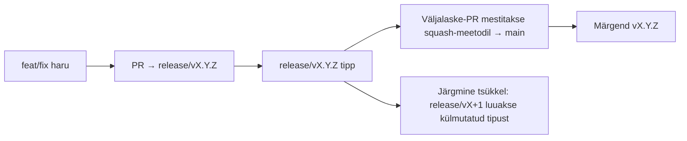

# Branching & Release Model (Eesti)

🌐 **Languages:** 🇺🇸 [English](../../../../ops/BRANCHING_MODEL.md) · 🇪🇹 [am](../../../am/docs/ops/BRANCHING_MODEL.md) · 🇸🇦 [ar](../../../ar/docs/ops/BRANCHING_MODEL.md) · 🇦🇿 [az](../../../az/docs/ops/BRANCHING_MODEL.md) · 🇧🇬 [bg](../../../bg/docs/ops/BRANCHING_MODEL.md) · 🇧🇩 [bn](../../../bn/docs/ops/BRANCHING_MODEL.md) · 🇧🇦 [bs](../../../bs/docs/ops/BRANCHING_MODEL.md) · 🇨🇿 [cs](../../../cs/docs/ops/BRANCHING_MODEL.md) · 🇩🇰 [da](../../../da/docs/ops/BRANCHING_MODEL.md) · 🇩🇪 [de](../../../de/docs/ops/BRANCHING_MODEL.md) · 🇬🇷 [el](../../../el/docs/ops/BRANCHING_MODEL.md) · 🇪🇸 [es](../../../es/docs/ops/BRANCHING_MODEL.md) · 🇮🇷 [fa](../../../fa/docs/ops/BRANCHING_MODEL.md) · 🇫🇮 [fi](../../../fi/docs/ops/BRANCHING_MODEL.md) · 🇫🇷 [fr](../../../fr/docs/ops/BRANCHING_MODEL.md) · 🇮🇪 [ga](../../../ga/docs/ops/BRANCHING_MODEL.md) · 🇮🇳 [gu](../../../gu/docs/ops/BRANCHING_MODEL.md) · 🇳🇬 [ha](../../../ha/docs/ops/BRANCHING_MODEL.md) · 🇮🇱 [he](../../../he/docs/ops/BRANCHING_MODEL.md) · 🇮🇳 [hi](../../../hi/docs/ops/BRANCHING_MODEL.md) · 🇭🇷 [hr](../../../hr/docs/ops/BRANCHING_MODEL.md) · 🇭🇺 [hu](../../../hu/docs/ops/BRANCHING_MODEL.md) · 🇦🇲 [hy](../../../hy/docs/ops/BRANCHING_MODEL.md) · 🇮🇩 [id](../../../id/docs/ops/BRANCHING_MODEL.md) · 🇳🇬 [ig](../../../ig/docs/ops/BRANCHING_MODEL.md) · 🇮🇹 [it](../../../it/docs/ops/BRANCHING_MODEL.md) · 🇯🇵 [ja](../../../ja/docs/ops/BRANCHING_MODEL.md) · 🇬🇪 [ka](../../../ka/docs/ops/BRANCHING_MODEL.md) · 🇰🇭 [km](../../../km/docs/ops/BRANCHING_MODEL.md) · 🇮🇳 [kn](../../../kn/docs/ops/BRANCHING_MODEL.md) · 🇰🇷 [ko](../../../ko/docs/ops/BRANCHING_MODEL.md) · 🇱🇹 [lt](../../../lt/docs/ops/BRANCHING_MODEL.md) · 🇱🇻 [lv](../../../lv/docs/ops/BRANCHING_MODEL.md) · 🇮🇳 [ml](../../../ml/docs/ops/BRANCHING_MODEL.md) · 🇮🇳 [mr](../../../mr/docs/ops/BRANCHING_MODEL.md) · 🇲🇾 [ms](../../../ms/docs/ops/BRANCHING_MODEL.md) · 🇲🇹 [mt](../../../mt/docs/ops/BRANCHING_MODEL.md) · 🇲🇲 [my](../../../my/docs/ops/BRANCHING_MODEL.md) · 🇳🇵 [ne](../../../ne/docs/ops/BRANCHING_MODEL.md) · 🇳🇱 [nl](../../../nl/docs/ops/BRANCHING_MODEL.md) · 🇳🇴 [no](../../../no/docs/ops/BRANCHING_MODEL.md) · 🇮🇳 [or](../../../or/docs/ops/BRANCHING_MODEL.md) · 🇮🇳 [pa](../../../pa/docs/ops/BRANCHING_MODEL.md) · 🇵🇭 [phi](../../../phi/docs/ops/BRANCHING_MODEL.md) · 🇵🇱 [pl](../../../pl/docs/ops/BRANCHING_MODEL.md) · 🇵🇹 [pt](../../../pt/docs/ops/BRANCHING_MODEL.md) · 🇧🇷 [pt-BR](../../../pt-BR/docs/ops/BRANCHING_MODEL.md) · 🇷🇴 [ro](../../../ro/docs/ops/BRANCHING_MODEL.md) · 🇷🇺 [ru](../../../ru/docs/ops/BRANCHING_MODEL.md) · 🇱🇰 [si](../../../si/docs/ops/BRANCHING_MODEL.md) · 🇸🇰 [sk](../../../sk/docs/ops/BRANCHING_MODEL.md) · 🇸🇮 [sl](../../../sl/docs/ops/BRANCHING_MODEL.md) · 🇷🇸 [sr](../../../sr/docs/ops/BRANCHING_MODEL.md) · 🇸🇪 [sv](../../../sv/docs/ops/BRANCHING_MODEL.md) · 🇰🇪 [sw](../../../sw/docs/ops/BRANCHING_MODEL.md) · 🇮🇳 [ta](../../../ta/docs/ops/BRANCHING_MODEL.md) · 🇮🇳 [te](../../../te/docs/ops/BRANCHING_MODEL.md) · 🇹🇭 [th](../../../th/docs/ops/BRANCHING_MODEL.md) · 🇹🇷 [tr](../../../tr/docs/ops/BRANCHING_MODEL.md) · 🇺🇦 [uk-UA](../../../uk-UA/docs/ops/BRANCHING_MODEL.md) · 🇵🇰 [ur](../../../ur/docs/ops/BRANCHING_MODEL.md) · 🇺🇿 [uz](../../../uz/docs/ops/BRANCHING_MODEL.md) · 🇻🇳 [vi](../../../vi/docs/ops/BRANCHING_MODEL.md) · 🇳🇬 [yo](../../../yo/docs/ops/BRANCHING_MODEL.md) · 🇨🇳 [zh-CN](../../../zh-CN/docs/ops/BRANCHING_MODEL.md) · 🇹🇼 [zh-TW](../../../zh-TW/docs/ops/BRANCHING_MODEL.md)

---

OmniRoute kasutab **paralleeltsükli** väljalaskemudelit: aktiivse tsükli jaoks on eraldi haru `release/vX.Y.Z`, avaldatud versioonirea jaoks `main` ning tsükli väljalaskmisel muutumatu märgend `vX.Y.Z`. On ootuspärane, et commit'id jõuavad nii harudesse `release/*` _kui ka_ harusse `main` — see ei ole eksitus.

Haldajatele mõeldud üksikasjad asuvad failis `CLAUDE.md` (range reegel nr 21) ja dokumendis [RELEASE_CHECKLIST.md](./RELEASE_CHECKLIST.md). See leht on avalik kaastöötajatele mõeldud kokkuvõte.

## Lühidalt

| Viide              | Roll                                                                                          |
| ------------------ | --------------------------------------------------------------------------------------------- |
| `release/vX.Y.Z`   | **Aktiivne tsükkel** — selle versiooni igapäevane arendus ja PR-ide mestimine                 |
| `main`             | **Avaldatud versioonirida** — saab tsükli squash-mestimise kaudu, kui versioon välja lastakse |
| `vX.Y.Z` (märgend) | **Väljalaskemärgis** — muutumatu viit väljalaskmise hetkel avaldatud sisule                   |



## Millisele harule peaks mu PR olema suunatud?

**Suunake PR aktiivsele harule `release/vX.Y.Z`, mitte harule `main`.**

1. Leidke suurima versiooniga avatud haru `release/v*` (näide kirjutamise ajal:
   `release/v3.8.49`).
2. Looge oma haru selle tipust (`git fetch` + väljavõtmine / sellele rebase'imine).
3. Avage PR, mille **baasharu = vastav `release/vX.Y.Z`**.

`main` ei ole igapäevane integratsiooniharu. Haru `main` vastu avatud PR-id tuleb tavaliselt enne mestimist ümber suunata.

## Väljalaske külmutamine (paralleelsed tsüklid)

Väljalaske kooskõlastamise ajal avatakse märgendiga `release-freeze` tähistatud probleem. See **ei peata arendust**:

- Külmutatud `release/vX.Y.Z` kuulub selle väljalaske eest vastutavale isikule.
- Järgmise tsükli `release/vX+1` luuakse külmutatud tipust, et kaastöötajad saaksid tööde lisamist jätkata.
- Avatud PR-id, mis on endiselt suunatud külmutatud harule, tuleb **ümber suunata** aktiivsele (suurima versiooniga) harule `release/v*`.

Enne soovitud haru mestitavaks pidamist kontrollige, kas mõni külmutamine on aktiivne:

```bash
gh issue list --repo diegosouzapw/OmniRoute --label release-freeze --state open
```

Mestimise mehhanism (omaniku märgend `queue` → Mergify) on dokumenteeritud failis [MERGE_TRAIN.md](./MERGE_TRAIN.md).

## Miks on vaja nii haru kui ka märgendit?

| Artefakt         | Kestus              | Eesmärk                                                                     |
| ---------------- | ------------------- | --------------------------------------------------------------------------- |
| `release/vX.Y.Z` | Pooleliolev tsükkel | Kogub üle vaadatud PR-e, püsib CI-testides rohelisena ja on PR-ide baasharu |
| Märgend `vX.Y.Z` | Igavesti            | Tähistab täpselt npm-i / GitHub Releasesi kaudu avaldatud sisu              |

Haru on töökoda, märgend aga suletud pakend. Pärast squash-mestimist harusse `main` jätkub järgmine tsükkel harus `release/vX+1`, ilma et peaks ootama eelmise väljalaske-PR-i lõpetamist.

## Seotud dokumendid

- [CONTRIBUTING.md](../../CONTRIBUTING.md) — seadistamine, testid, PR-i kontrollnimekiri
- [RELEASE_CHECKLIST.md](./RELEASE_CHECKLIST.md) — väljalaske-eelne valideerimine
- [MERGE_TRAIN.md](./MERGE_TRAIN.md) — mestimisjärjekord ja varumeetod
- [RELEASE_GREEN.md](./RELEASE_GREEN.md) — väljalaske tipu töökorras hoidmine
