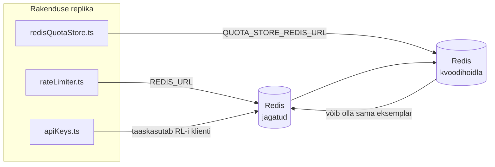

# Redis Production Configuration Guide (Eesti)

🌐 **Languages:** 🇺🇸 [English](../../../../ops/REDIS_PRODUCTION_CONFIG.md) · 🇪🇹 [am](../../../am/docs/ops/REDIS_PRODUCTION_CONFIG.md) · 🇸🇦 [ar](../../../ar/docs/ops/REDIS_PRODUCTION_CONFIG.md) · 🇦🇿 [az](../../../az/docs/ops/REDIS_PRODUCTION_CONFIG.md) · 🇧🇬 [bg](../../../bg/docs/ops/REDIS_PRODUCTION_CONFIG.md) · 🇧🇩 [bn](../../../bn/docs/ops/REDIS_PRODUCTION_CONFIG.md) · 🇨🇿 [cs](../../../cs/docs/ops/REDIS_PRODUCTION_CONFIG.md) · 🇩🇰 [da](../../../da/docs/ops/REDIS_PRODUCTION_CONFIG.md) · 🇩🇪 [de](../../../de/docs/ops/REDIS_PRODUCTION_CONFIG.md) · 🇬🇷 [el](../../../el/docs/ops/REDIS_PRODUCTION_CONFIG.md) · 🇪🇸 [es](../../../es/docs/ops/REDIS_PRODUCTION_CONFIG.md) · 🇮🇷 [fa](../../../fa/docs/ops/REDIS_PRODUCTION_CONFIG.md) · 🇫🇮 [fi](../../../fi/docs/ops/REDIS_PRODUCTION_CONFIG.md) · 🇫🇷 [fr](../../../fr/docs/ops/REDIS_PRODUCTION_CONFIG.md) · 🇮🇪 [ga](../../../ga/docs/ops/REDIS_PRODUCTION_CONFIG.md) · 🇮🇳 [gu](../../../gu/docs/ops/REDIS_PRODUCTION_CONFIG.md) · 🇳🇬 [ha](../../../ha/docs/ops/REDIS_PRODUCTION_CONFIG.md) · 🇮🇱 [he](../../../he/docs/ops/REDIS_PRODUCTION_CONFIG.md) · 🇮🇳 [hi](../../../hi/docs/ops/REDIS_PRODUCTION_CONFIG.md) · 🇭🇷 [hr](../../../hr/docs/ops/REDIS_PRODUCTION_CONFIG.md) · 🇭🇺 [hu](../../../hu/docs/ops/REDIS_PRODUCTION_CONFIG.md) · 🇦🇲 [hy](../../../hy/docs/ops/REDIS_PRODUCTION_CONFIG.md) · 🇮🇩 [id](../../../id/docs/ops/REDIS_PRODUCTION_CONFIG.md) · 🇳🇬 [ig](../../../ig/docs/ops/REDIS_PRODUCTION_CONFIG.md) · 🇮🇹 [it](../../../it/docs/ops/REDIS_PRODUCTION_CONFIG.md) · 🇯🇵 [ja](../../../ja/docs/ops/REDIS_PRODUCTION_CONFIG.md) · 🇬🇪 [ka](../../../ka/docs/ops/REDIS_PRODUCTION_CONFIG.md) · 🇰🇭 [km](../../../km/docs/ops/REDIS_PRODUCTION_CONFIG.md) · 🇮🇳 [kn](../../../kn/docs/ops/REDIS_PRODUCTION_CONFIG.md) · 🇰🇷 [ko](../../../ko/docs/ops/REDIS_PRODUCTION_CONFIG.md) · 🇱🇹 [lt](../../../lt/docs/ops/REDIS_PRODUCTION_CONFIG.md) · 🇱🇻 [lv](../../../lv/docs/ops/REDIS_PRODUCTION_CONFIG.md) · 🇮🇳 [ml](../../../ml/docs/ops/REDIS_PRODUCTION_CONFIG.md) · 🇮🇳 [mr](../../../mr/docs/ops/REDIS_PRODUCTION_CONFIG.md) · 🇲🇾 [ms](../../../ms/docs/ops/REDIS_PRODUCTION_CONFIG.md) · 🇲🇹 [mt](../../../mt/docs/ops/REDIS_PRODUCTION_CONFIG.md) · 🇲🇲 [my](../../../my/docs/ops/REDIS_PRODUCTION_CONFIG.md) · 🇳🇵 [ne](../../../ne/docs/ops/REDIS_PRODUCTION_CONFIG.md) · 🇳🇱 [nl](../../../nl/docs/ops/REDIS_PRODUCTION_CONFIG.md) · 🇳🇴 [no](../../../no/docs/ops/REDIS_PRODUCTION_CONFIG.md) · 🇮🇳 [or](../../../or/docs/ops/REDIS_PRODUCTION_CONFIG.md) · 🇮🇳 [pa](../../../pa/docs/ops/REDIS_PRODUCTION_CONFIG.md) · 🇵🇭 [phi](../../../phi/docs/ops/REDIS_PRODUCTION_CONFIG.md) · 🇵🇱 [pl](../../../pl/docs/ops/REDIS_PRODUCTION_CONFIG.md) · 🇵🇹 [pt](../../../pt/docs/ops/REDIS_PRODUCTION_CONFIG.md) · 🇧🇷 [pt-BR](../../../pt-BR/docs/ops/REDIS_PRODUCTION_CONFIG.md) · 🇷🇴 [ro](../../../ro/docs/ops/REDIS_PRODUCTION_CONFIG.md) · 🇷🇺 [ru](../../../ru/docs/ops/REDIS_PRODUCTION_CONFIG.md) · 🇱🇰 [si](../../../si/docs/ops/REDIS_PRODUCTION_CONFIG.md) · 🇸🇰 [sk](../../../sk/docs/ops/REDIS_PRODUCTION_CONFIG.md) · 🇸🇮 [sl](../../../sl/docs/ops/REDIS_PRODUCTION_CONFIG.md) · 🇷🇸 [sr](../../../sr/docs/ops/REDIS_PRODUCTION_CONFIG.md) · 🇸🇪 [sv](../../../sv/docs/ops/REDIS_PRODUCTION_CONFIG.md) · 🇰🇪 [sw](../../../sw/docs/ops/REDIS_PRODUCTION_CONFIG.md) · 🇮🇳 [ta](../../../ta/docs/ops/REDIS_PRODUCTION_CONFIG.md) · 🇮🇳 [te](../../../te/docs/ops/REDIS_PRODUCTION_CONFIG.md) · 🇹🇭 [th](../../../th/docs/ops/REDIS_PRODUCTION_CONFIG.md) · 🇹🇷 [tr](../../../tr/docs/ops/REDIS_PRODUCTION_CONFIG.md) · 🇺🇦 [uk-UA](../../../uk-UA/docs/ops/REDIS_PRODUCTION_CONFIG.md) · 🇵🇰 [ur](../../../ur/docs/ops/REDIS_PRODUCTION_CONFIG.md) · 🇺🇿 [uz](../../../uz/docs/ops/REDIS_PRODUCTION_CONFIG.md) · 🇻🇳 [vi](../../../vi/docs/ops/REDIS_PRODUCTION_CONFIG.md) · 🇳🇬 [yo](../../../yo/docs/ops/REDIS_PRODUCTION_CONFIG.md) · 🇨🇳 [zh-CN](../../../zh-CN/docs/ops/REDIS_PRODUCTION_CONFIG.md) · 🇹🇼 [zh-TW](../../../zh-TW/docs/ops/REDIS_PRODUCTION_CONFIG.md)

---

## Ülevaade

Redis on OmniRoute'i **valikuline, nõrk sõltuvus** — rakendus jätkab Redise kättesaamatuse korral sujuvalt tööd (kasutades mälupõhiseid
varulahendusi). Tootmiskeskkonnas vähendab Redise häälestamine latentsust nelja erineva
töökoormuse puhul:

| Töökoormus                 | Draiver                       | Kliendi tehas                                                  | Võtmemuster                                                      |
| -------------------------- | ----------------------------- | -------------------------------------------------------------- | ---------------------------------------------------------------- |
| Päringusageduse piiramine  | `rateLimiter.ts`              | `getRedisClient()` — laisalt loodav `ioredis`-e üksikeksemplar | `<prefix>rl:*` Lua abil atomaarse päringusageduse piirangu aknad |
| Autentimisvahemälu         | `apiKeys.ts`                  | Kasutab uuesti `rateLimiter`-i klienti                         | `<prefix>auth:api_key:<sha256>` koos TTL-iga                     |
| Kvoodihoidla               | `redisQuotaStore.ts`          | Eraldi `getRedisClient(url)`-i üksikeksemplar                  | `<prefix>quota:*`, seadistatav eksemplaripõhiselt                |
| Eelsoojenduse kaitselüliti | `redisCircuitBreakerStore.ts` | Eraldi klient failis `circuitBreakerFactory.ts`                | `<prefix>warmup:cb:<connectionId>`                               |

Kõik neli töökoormust jagavad üht nimeruumi prefiksit, et OmniRoute saaks ühes
Redise eksemplaris teiste rakendustega koos eksisteerida (nt `127.0.0.1:6379`). Vaadake jaotist [Võtmete nimeruum](#key-namespacing).

---

## Praegune konfiguratsioon (koodi vaikeväärtused)

| Seadistus                                | Väärtus                                                                  | Asukoht                                                                               |
| ---------------------------------------- | ------------------------------------------------------------------------ | ------------------------------------------------------------------------------------- |
| Keskkonnamuutuja `REDIS_URL`             | `redis://redis:6379` (compose), valikuline                               | `rateLimiter.ts:5`, `.env.example`                                                    |
| Keskkonnamuutuja `REDIS_KEY_PREFIX`      | `omniroute:` (vaikimisi)                                                 | `rateLimiter.ts`, `redisQuotaStore.ts`, `redisCircuitBreakerStore.ts`, `.env.example` |
| Keskkonnamuutuja `QUOTA_STORE_REDIS_URL` | eraldiseisev, võib erineda muutujast `REDIS_URL`                         | `quota/storeFactory.ts`                                                               |
| `QUOTA_STORE_DRIVER`                     | `"sqlite"` (vaikimisi), `"redis"` valikuline                             | `quota/storeFactory.ts`                                                               |
| ioredis-e `maxRetriesPerRequest`         | `3`                                                                      | kliendi loomine failis `rateLimiter.ts`                                               |
| `enableReadyCheck`                       | määramata (ioredis-e vaikeväärtus: `true`)                               | —                                                                                     |
| `lazyConnect`                            | määramata (ioredis-e vaikeväärtus: `false`)                              | —                                                                                     |
| `retryStrategy`                          | määramata (ioredis-e vaikeväärtus: 200 ms baasväärtus, eksponentsiaalne) | —                                                                                     |
| TLS / parool / andmebaasi indeks         | **seadistamata**                                                         | —                                                                                     |
| Sentinel / Cluster                       | **seadistamata** — toetatud on ainult autonoomne üksiksõlm               | —                                                                                     |

---

## Võtmete nimeruum

OmniRoute jagab Redise eksemplari kõige muuga, mis hostis töötab. Ilma nimeruumita
võivad võtmed, nagu `auth:api_key:<sha256>` või `rl:*`, sattuda konflikti teiste rakenduste võtmetega,
mis kasutavad sama Redist (see eksemplar käitab Redist aadressil `127.0.0.1:6379` koos teiste teenustega).

Määrake `REDIS_KEY_PREFIX` mittetühjaks stringiks, et lisada prefiks **igale** OmniRoute'i võtmele:

```bash
# .env — kõik OmniRoute'i võtmed muutuvad kujule omniroute:rl:*, omniroute:auth:*, omniroute:quota:*, omniroute:warmup:cb:*
REDIS_KEY_PREFIX=omniroute:
```

- **Vaikeväärtus:** `omniroute:` (rakendatakse, kui `REDIS_KEY_PREFIX` on määramata või tühi).
- **Rakendatakse järgmistele:** päringusageduse piiraja + autentimisvahemälu (jagatud `ioredis`-e klient `keyPrefix`-i kaudu),
  kvoodihoidla (`KEY_PREFIX = "${REDIS_KEY_PREFIX}quota"`) ja eelsoojenduse kaitselüliti
  (`KEY_PREFIX = "${REDIS_KEY_PREFIX}warmup:cb:"`).
- **Prefiksi muutmine** ajal, mil võtmed on Redises juba olemas, muudab vanad võtmed orvuks (need aeguvad
  TTL-i / LRU kaudu). Muutmine on ohutu; migreerimist pole vaja. Ainsaks erandiks on keelatuks
  märgitud ühenduse eelsoojenduse kaitselüliti võti: see säilitatakse ilma TTL-ita, seega
  loetlege jäägid käsuga `redis-cli --scan --pattern '<old-prefix>warmup:cb:*'` ja kustutage need.
- **ioredis-e `keyPrefix`** lisab prefiksi kirjutamisel automaatselt ette **ja** eemaldab selle lugemisel,
  mistõttu rakenduse kood prefiksit kunagi ei näe.

---

## Soovitatav tootmiskeskkonna häälestus

### 1. Ühendusekogumi / kliendi valikud (ioredise `Redis`-konstruktor)

Praegune kood loob ühe `new Redis(url)`-i ilma kohandatud valikuteta. Tootmiskeskkonna
mitme replikatsiooniga juurutuste puhul edastage koodis klienditehas või mähkige `getRedisClient()`:

```typescript
const redis = new Redis(REDIS_URL, {
  maxRetriesPerRequest: null, // korduskatsete piirang puudub; las retryStrategy otsustab
  enableReadyCheck: true, // kontrolli enne päringute vastuvõtmist, kas server on valmis
  lazyConnect: true, // ära loo ühendust konstrueerimisel; oota esimest päringut
  retryStrategy: (times) => {
    if (times > 10) return null; // loobu pärast 10 korduskatset → loo ühendus hiljem uuesti
    return Math.min(times * 200, 5000); // 200 ms, 400 ms, …, ülempiir 5 s
  },
  enableAutoPipelining: true, // koonda samaaegsed käsud üheks TCP-kirjutuseks
  keepAlive: 10000, // TCP keep-alive iga 10 s järel
});
```

**Peamised kompromissid:**

- `maxRetriesPerRequest: null` + `retryStrategy` — tootmiskeskkonnas eelistatud, et ajutised
  Redise taaskäivitused ei nurjaks kohe kõiki päringuid. Mälusisene varulahendus funktsioonis
  `checkRateLimit()` võtab tõrketee üle.
- `lazyConnect: true` — väldib käivitamisel sõltuvust sellest, et Redis peab töötama enne, kui server
  hakkab ühendusi vastu võtma.
- `enableAutoPipelining: true` — vähendab samaaegsete kiiruspiirangu kontrollide edasi-tagasi päringuid;
  kasulik ühe ühenduse korral koormusel >50 RPS.

### 2. Redise serveri konfiguratsioon (`redis.conf`)

```
# Mälu
maxmemory 80%                        # jäta ruumi operatsioonisüsteemi leheküljevahemälule
maxmemory-policy allkeys-lru         # eemalda koormuse all aegunud autentimisvahemälu kirjed

# Püsimälu (valikuline — OmniRoute on ka ilma selleta krahhikindel)
save 300 1                           # loo tõmmis vähemalt iga 5 minuti järel, kui ≥1 võti muutus
appendonly no                        # AOF pole vajalik; andmed on taastoodetavad
appendfsync no                       # fsync-lisakulu puudub (RDB on piisav)

# Võrk
timeout 0                            # jõudeolevate ühenduste katkestamine puudub
tcp-keepalive 300                    # 5 min keep-alive
tcp-backlog 511                      # ühenduste järjekord hüppelise koormuse jaoks

# Jõudlus
hz 10                                # vaikeväärtus; viiteaja suhtes tundlikul juhul 100
activedefrag yes                     # defragmendi automaatselt, kui killustatus on >10%
```

**Kompromiss valiku `maxmemory-policy allkeys-lru` puhul:** autentimisvahemälu kirjed võidakse
mälusurve korral eemaldada. See on ohutu — `setCachedApiKey` asustab vahemälu puudumisel selle alati uuesti
ning SQLite'i varulahendus on autoriteetne. Kiiruspiiraja Lua-skript loob väikseid võtmeid, mis on
oma olemuselt lühiajalised.

### 3. Docker Compose'i sätted

Tootmiskeskkonna Compose (`docker-compose.prod.yml`) kasutab kujutist `redis:8.6.2-alpine`. Lisage:

```yaml
redis:
  image: redis:8.6.2-alpine
  command:
    [
      "redis-server",
      "--maxmemory",
      "512mb",
      "--maxmemory-policy",
      "allkeys-lru",
      "--activedefrag",
      "yes",
      "--save",
      "300 1",
    ]
  healthcheck:
    test: ["CMD", "redis-cli", "ping"]
    interval: 10s
    timeout: 3s
    retries: 3
    start_period: 5s
```

### 4. Mitme eksemplari / skaleerimise kaalutlused

**Üks Redis kõigile replikatsioonidele** — kiiruspiiraja Lua-skript sõltub ühest
autoriteetsest võtmeruumist. Replikatsioonide taga olevad mitu Redise eksemplari kaotaksid atomaarsuse
ja kahekordistaksid limiidi. Kasutage kõigi rakenduse replikatsioonide jaoks üht Redist (või tõrkesiirdega
Redis Sentineli klastrit).

**Ühenduste arv:** iga rakenduse replikatsioon avab Redisega **2 TCP-ühendust**
(kiiruspiiraja klient + kvoodihoidla klient). 10 replikatsiooni korral → 20 ühendust, mis jääb
Redise vaikeeksemplari 10 000 ühenduse ülempiirist tublisti allapoole.

### 5. Seire

Avaldage seisundikontrolli lõpp-punkti kaudu:

```typescript
// src/app/api/monitoring/health/route.ts kutsub juba kiiruspiiraja funktsioone
// Lisa Redise-põhised kontrollid:
//   1. PING-i viiteaeg ioredise .ping() kaudu
//   2. Mälukasutus INFO memory kaudu
//   3. Ühenduste arv INFO clients kaudu
//   4. maxmemory-policy tabamusmäär (evicted_keys / keyspace_hits)
```

Peamised jälgitavad mõõdikud:

- **Eemaldatud võtmeid sekundis** — kui väärtus püsib nullist suurem, suurendage `maxmemory`
- **Blokeeritud kliendid** — nullist suurem väärtus viitab aeglastele Lua-skriptidele või suurele konkurentsile
- **Tagasilükatud ühendused** — ühenduste piirang on saavutatud; 20 ühenduse puhul haruldane

---

## Arhitektuuriskeem



---

## Viited

| Fail                               | Otstarve                                                                            |
| ---------------------------------- | ----------------------------------------------------------------------------------- |
| `src/shared/utils/rateLimiter.ts`  | Peamine Redise klient, Lua päringusageduse piiramise skript, mälupõhine varuvariant |
| `src/lib/db/apiKeys.ts`            | Autentimisvahemälu — Redis→SQLite varuvariant                                       |
| `src/lib/quota/redisQuotaStore.ts` | Eraldi Redise klient valikulise kvoodihoidla jaoks                                  |
| `src/lib/quota/storeFactory.ts`    | Vahetab kvoodidraivereid `sqlite` ja `redis`                                        |
| `docker-compose.prod.yml`          | Tootmiskeskkonna Redise konteiner (tõmmis `redis:8.6.2-alpine`)                     |
| `.env.example`                     | Redise keskkonnamuutujate dokumentatsioon                                           |
| `src/app/api/local/redis/`         | API marsruudid arenduskeskkonna konteineri orkestreerimiseks                        |
| `bin/cli/commands/redis.mjs`       | CLI käsud arenduskeskkonna konteineri orkestreerimiseks                             |
