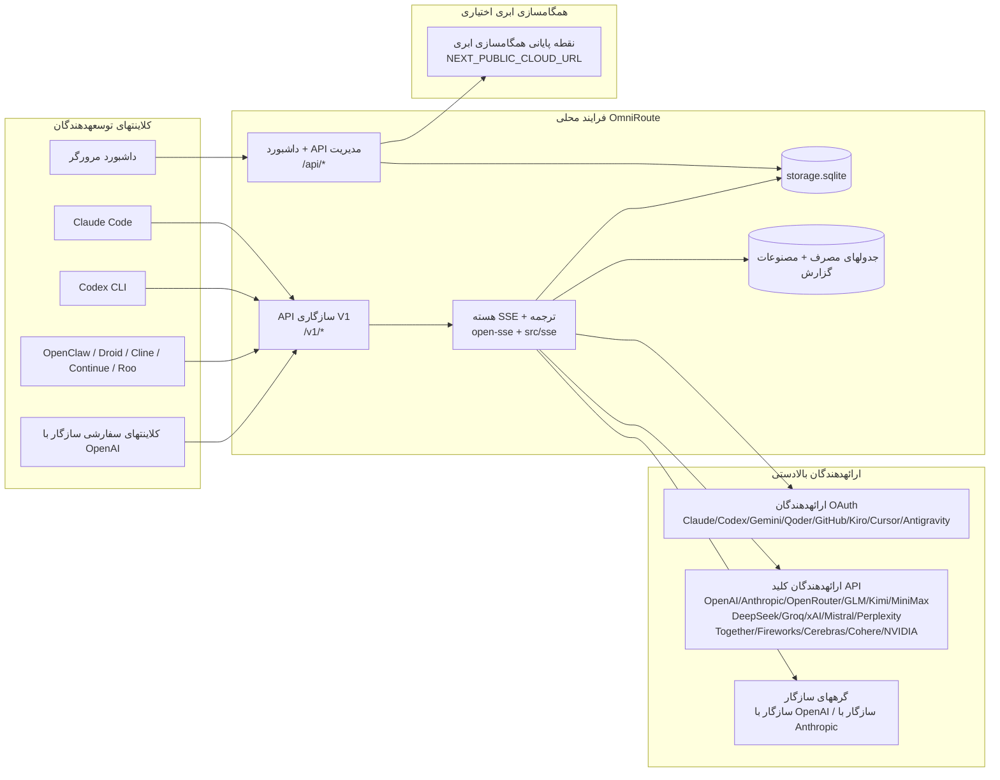
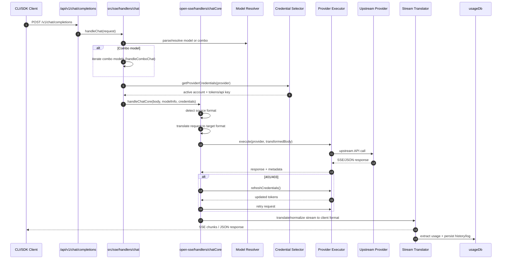
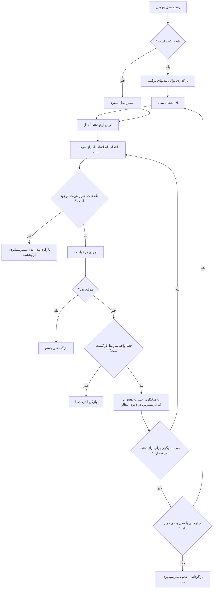
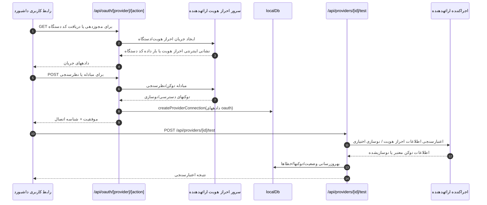
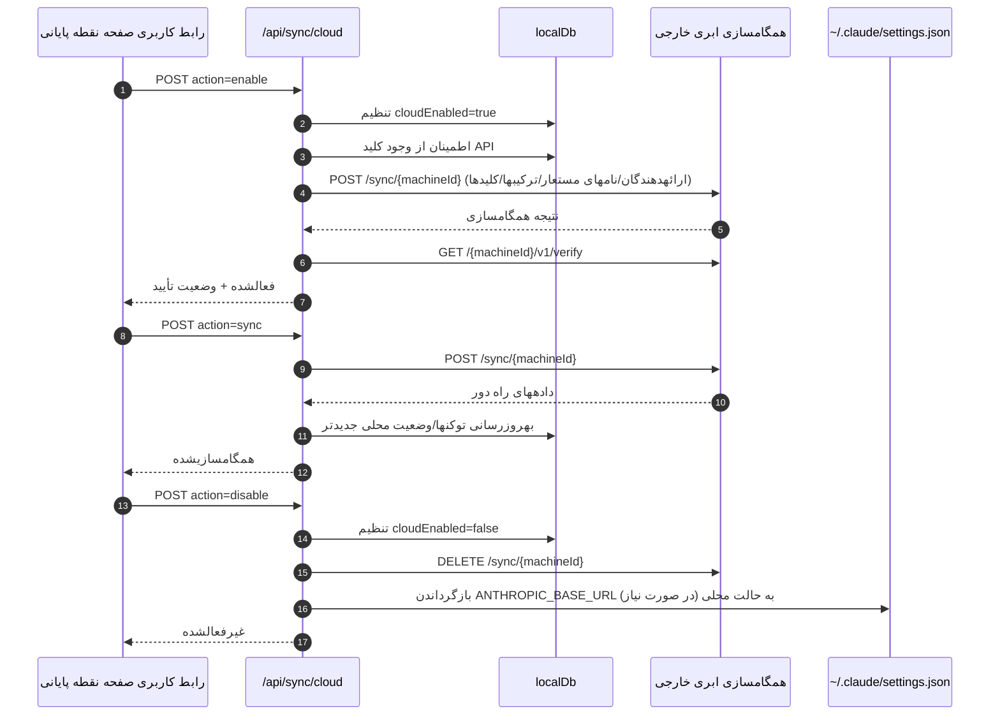
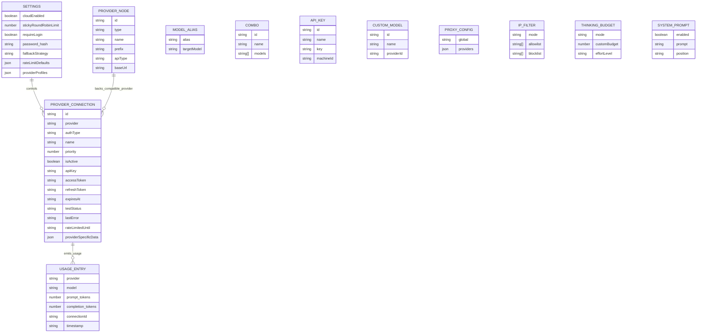
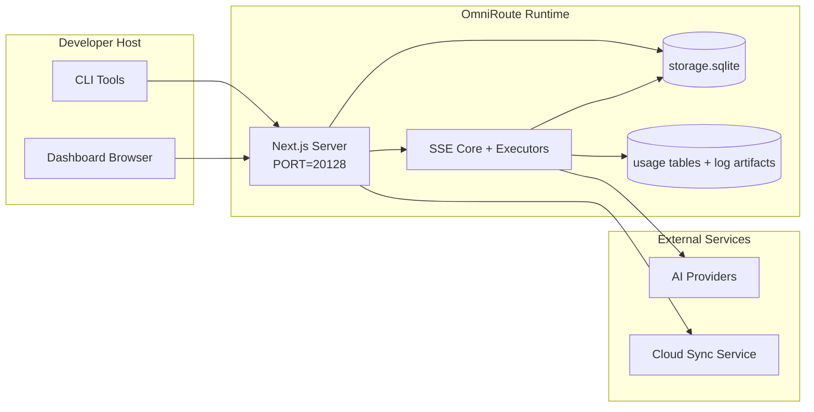

# OmniRoute Architecture (فارسی)

🌐 **Languages:** 🇺🇸 [English](../../../../architecture/ARCHITECTURE.md) · 🇪🇹 [am](../../../am/docs/architecture/ARCHITECTURE.md) · 🇸🇦 [ar](../../../ar/docs/architecture/ARCHITECTURE.md) · 🇦🇿 [az](../../../az/docs/architecture/ARCHITECTURE.md) · 🇧🇬 [bg](../../../bg/docs/architecture/ARCHITECTURE.md) · 🇧🇩 [bn](../../../bn/docs/architecture/ARCHITECTURE.md) · 🇧🇦 [bs](../../../bs/docs/architecture/ARCHITECTURE.md) · 🇨🇿 [cs](../../../cs/docs/architecture/ARCHITECTURE.md) · 🇩🇰 [da](../../../da/docs/architecture/ARCHITECTURE.md) · 🇩🇪 [de](../../../de/docs/architecture/ARCHITECTURE.md) · 🇬🇷 [el](../../../el/docs/architecture/ARCHITECTURE.md) · 🇪🇸 [es](../../../es/docs/architecture/ARCHITECTURE.md) · 🇪🇪 [et](../../../et/docs/architecture/ARCHITECTURE.md) · 🇫🇮 [fi](../../../fi/docs/architecture/ARCHITECTURE.md) · 🇫🇷 [fr](../../../fr/docs/architecture/ARCHITECTURE.md) · 🇮🇪 [ga](../../../ga/docs/architecture/ARCHITECTURE.md) · 🇮🇳 [gu](../../../gu/docs/architecture/ARCHITECTURE.md) · 🇳🇬 [ha](../../../ha/docs/architecture/ARCHITECTURE.md) · 🇮🇱 [he](../../../he/docs/architecture/ARCHITECTURE.md) · 🇮🇳 [hi](../../../hi/docs/architecture/ARCHITECTURE.md) · 🇭🇷 [hr](../../../hr/docs/architecture/ARCHITECTURE.md) · 🇭🇺 [hu](../../../hu/docs/architecture/ARCHITECTURE.md) · 🇦🇲 [hy](../../../hy/docs/architecture/ARCHITECTURE.md) · 🇮🇩 [id](../../../id/docs/architecture/ARCHITECTURE.md) · 🇳🇬 [ig](../../../ig/docs/architecture/ARCHITECTURE.md) · 🇮🇹 [it](../../../it/docs/architecture/ARCHITECTURE.md) · 🇯🇵 [ja](../../../ja/docs/architecture/ARCHITECTURE.md) · 🇬🇪 [ka](../../../ka/docs/architecture/ARCHITECTURE.md) · 🇰🇭 [km](../../../km/docs/architecture/ARCHITECTURE.md) · 🇮🇳 [kn](../../../kn/docs/architecture/ARCHITECTURE.md) · 🇰🇷 [ko](../../../ko/docs/architecture/ARCHITECTURE.md) · 🇱🇹 [lt](../../../lt/docs/architecture/ARCHITECTURE.md) · 🇱🇻 [lv](../../../lv/docs/architecture/ARCHITECTURE.md) · 🇮🇳 [ml](../../../ml/docs/architecture/ARCHITECTURE.md) · 🇮🇳 [mr](../../../mr/docs/architecture/ARCHITECTURE.md) · 🇲🇾 [ms](../../../ms/docs/architecture/ARCHITECTURE.md) · 🇲🇹 [mt](../../../mt/docs/architecture/ARCHITECTURE.md) · 🇲🇲 [my](../../../my/docs/architecture/ARCHITECTURE.md) · 🇳🇵 [ne](../../../ne/docs/architecture/ARCHITECTURE.md) · 🇳🇱 [nl](../../../nl/docs/architecture/ARCHITECTURE.md) · 🇳🇴 [no](../../../no/docs/architecture/ARCHITECTURE.md) · 🇮🇳 [or](../../../or/docs/architecture/ARCHITECTURE.md) · 🇮🇳 [pa](../../../pa/docs/architecture/ARCHITECTURE.md) · 🇵🇭 [phi](../../../phi/docs/architecture/ARCHITECTURE.md) · 🇵🇱 [pl](../../../pl/docs/architecture/ARCHITECTURE.md) · 🇵🇹 [pt](../../../pt/docs/architecture/ARCHITECTURE.md) · 🇧🇷 [pt-BR](../../../pt-BR/docs/architecture/ARCHITECTURE.md) · 🇷🇴 [ro](../../../ro/docs/architecture/ARCHITECTURE.md) · 🇷🇺 [ru](../../../ru/docs/architecture/ARCHITECTURE.md) · 🇱🇰 [si](../../../si/docs/architecture/ARCHITECTURE.md) · 🇸🇰 [sk](../../../sk/docs/architecture/ARCHITECTURE.md) · 🇸🇮 [sl](../../../sl/docs/architecture/ARCHITECTURE.md) · 🇷🇸 [sr](../../../sr/docs/architecture/ARCHITECTURE.md) · 🇸🇪 [sv](../../../sv/docs/architecture/ARCHITECTURE.md) · 🇰🇪 [sw](../../../sw/docs/architecture/ARCHITECTURE.md) · 🇮🇳 [ta](../../../ta/docs/architecture/ARCHITECTURE.md) · 🇮🇳 [te](../../../te/docs/architecture/ARCHITECTURE.md) · 🇹🇭 [th](../../../th/docs/architecture/ARCHITECTURE.md) · 🇹🇷 [tr](../../../tr/docs/architecture/ARCHITECTURE.md) · 🇺🇦 [uk-UA](../../../uk-UA/docs/architecture/ARCHITECTURE.md) · 🇵🇰 [ur](../../../ur/docs/architecture/ARCHITECTURE.md) · 🇺🇿 [uz](../../../uz/docs/architecture/ARCHITECTURE.md) · 🇻🇳 [vi](../../../vi/docs/architecture/ARCHITECTURE.md) · 🇳🇬 [yo](../../../yo/docs/architecture/ARCHITECTURE.md) · 🇨🇳 [zh-CN](../../../zh-CN/docs/architecture/ARCHITECTURE.md) · 🇹🇼 [zh-TW](../../../zh-TW/docs/architecture/ARCHITECTURE.md)

---

🌐 **Languages:** 🇺🇸 [English](../../../../architecture/ARCHITECTURE.md) · 🇪🇹 [am](../../../am/docs/architecture/ARCHITECTURE.md) · 🇸🇦 [ar](../../../ar/docs/architecture/ARCHITECTURE.md) · 🇦🇿 [az](../../../az/docs/architecture/ARCHITECTURE.md) · 🇧🇬 [bg](../../../bg/docs/architecture/ARCHITECTURE.md) · 🇧🇩 [bn](../../../bn/docs/architecture/ARCHITECTURE.md) · 🇧🇦 [bs](../../../bs/docs/architecture/ARCHITECTURE.md) · 🇨🇿 [cs](../../../cs/docs/architecture/ARCHITECTURE.md) · 🇩🇰 [da](../../../da/docs/architecture/ARCHITECTURE.md) · 🇩🇪 [de](../../../de/docs/architecture/ARCHITECTURE.md) · 🇬🇷 [el](../../../el/docs/architecture/ARCHITECTURE.md) · 🇪🇸 [es](../../../es/docs/architecture/ARCHITECTURE.md) · 🇪🇪 [et](../../../et/docs/architecture/ARCHITECTURE.md) · 🇫🇮 [fi](../../../fi/docs/architecture/ARCHITECTURE.md) · 🇫🇷 [fr](../../../fr/docs/architecture/ARCHITECTURE.md) · 🇮🇪 [ga](../../../ga/docs/architecture/ARCHITECTURE.md) · 🇮🇳 [gu](../../../gu/docs/architecture/ARCHITECTURE.md) · 🇳🇬 [ha](../../../ha/docs/architecture/ARCHITECTURE.md) · 🇮🇱 [he](../../../he/docs/architecture/ARCHITECTURE.md) · 🇮🇳 [hi](../../../hi/docs/architecture/ARCHITECTURE.md) · 🇭🇷 [hr](../../../hr/docs/architecture/ARCHITECTURE.md) · 🇭🇺 [hu](../../../hu/docs/architecture/ARCHITECTURE.md) · 🇦🇲 [hy](../../../hy/docs/architecture/ARCHITECTURE.md) · 🇮🇩 [id](../../../id/docs/architecture/ARCHITECTURE.md) · 🇳🇬 [ig](../../../ig/docs/architecture/ARCHITECTURE.md) · 🇮🇹 [it](../../../it/docs/architecture/ARCHITECTURE.md) · 🇯🇵 [ja](../../../ja/docs/architecture/ARCHITECTURE.md) · 🇬🇪 [ka](../../../ka/docs/architecture/ARCHITECTURE.md) · 🇰🇭 [km](../../../km/docs/architecture/ARCHITECTURE.md) · 🇮🇳 [kn](../../../kn/docs/architecture/ARCHITECTURE.md) · 🇰🇷 [ko](../../../ko/docs/architecture/ARCHITECTURE.md) · 🇱🇹 [lt](../../../lt/docs/architecture/ARCHITECTURE.md) · 🇱🇻 [lv](../../../lv/docs/architecture/ARCHITECTURE.md) · 🇮🇳 [ml](../../../ml/docs/architecture/ARCHITECTURE.md) · 🇮🇳 [mr](../../../mr/docs/architecture/ARCHITECTURE.md) · 🇲🇾 [ms](../../../ms/docs/architecture/ARCHITECTURE.md) · 🇲🇹 [mt](../../../mt/docs/architecture/ARCHITECTURE.md) · 🇲🇲 [my](../../../my/docs/architecture/ARCHITECTURE.md) · 🇳🇵 [ne](../../../ne/docs/architecture/ARCHITECTURE.md) · 🇳🇱 [nl](../../../nl/docs/architecture/ARCHITECTURE.md) · 🇳🇴 [no](../../../no/docs/architecture/ARCHITECTURE.md) · 🇮🇳 [or](../../../or/docs/architecture/ARCHITECTURE.md) · 🇮🇳 [pa](../../../pa/docs/architecture/ARCHITECTURE.md) · 🇵🇭 [phi](../../../phi/docs/architecture/ARCHITECTURE.md) · 🇵🇱 [pl](../../../pl/docs/architecture/ARCHITECTURE.md) · 🇵🇹 [pt](../../../pt/docs/architecture/ARCHITECTURE.md) · 🇧🇷 [pt-BR](../../../pt-BR/docs/architecture/ARCHITECTURE.md) · 🇷🇴 [ro](../../../ro/docs/architecture/ARCHITECTURE.md) · 🇷🇺 [ru](../../../ru/docs/architecture/ARCHITECTURE.md) · 🇱🇰 [si](../../../si/docs/architecture/ARCHITECTURE.md) · 🇸🇰 [sk](../../../sk/docs/architecture/ARCHITECTURE.md) · 🇸🇮 [sl](../../../sl/docs/architecture/ARCHITECTURE.md) · 🇷🇸 [sr](../../../sr/docs/architecture/ARCHITECTURE.md) · 🇸🇪 [sv](../../../sv/docs/architecture/ARCHITECTURE.md) · 🇰🇪 [sw](../../../sw/docs/architecture/ARCHITECTURE.md) · 🇮🇳 [ta](../../../ta/docs/architecture/ARCHITECTURE.md) · 🇮🇳 [te](../../../te/docs/architecture/ARCHITECTURE.md) · 🇹🇭 [th](../../../th/docs/architecture/ARCHITECTURE.md) · 🇹🇷 [tr](../../../tr/docs/architecture/ARCHITECTURE.md) · 🇺🇦 [uk-UA](../../../uk-UA/docs/architecture/ARCHITECTURE.md) · 🇵🇰 [ur](../../../ur/docs/architecture/ARCHITECTURE.md) · 🇺🇿 [uz](../../../uz/docs/architecture/ARCHITECTURE.md) · 🇻🇳 [vi](../../../vi/docs/architecture/ARCHITECTURE.md) · 🇳🇬 [yo](../../../yo/docs/architecture/ARCHITECTURE.md) · 🇨🇳 [zh-CN](../../../zh-CN/docs/architecture/ARCHITECTURE.md) · 🇹🇼 [zh-TW](../../../zh-TW/docs/architecture/ARCHITECTURE.md)

_آخرین بهروزرسانی: 2026-06-28_

## خلاصه اجرایی

OmniRoute یک درگاه مسیریابی هوش مصنوعی محلی و داشبورد مبتنی بر Next.js است.
این سامانه یک نقطه پایانی سازگار با OpenAI (`/v1/*`) ارائه میدهد و ترافیک را با قابلیتهای تبدیل، جایگزینی، نوسازی توکن و ردیابی مصرف، میان چندین ارائهدهنده بالادستی مسیریابی میکند.

قابلیتهای اصلی:

- سطح API سازگار با OpenAI برای CLI/ابزارها (355 ارائهدهنده، 108 اجراکننده)
- تبدیل درخواست/پاسخ میان قالبهای ارائهدهندگان
- جایگزینی ترکیب مدلها (دنبالهای از چند مدل)
- گامهای ساختاریافته ترکیب (`provider + model + connection`) با ترتیبدهی زمان اجرا بر اساس `compositeTiers`
- جایگزینی در سطح حساب (چند حساب برای هر ارائهدهنده)
- بررسی اولیه سهمیه و انتخاب حساب P2C آگاه از سهمیه در مسیر اصلی چت
- مدیریت اتصال به ارائهدهندگان از طریق OAuth و کلید API (22 ماژول ارائهدهنده OAuth)
- تولید embedding از طریق `/v1/embeddings` (18 ارائهدهنده)
- تولید تصویر از طریق `/v1/images/generations` (بیش از 10 ارائهدهنده، بیش از 20 مدل)
- رونویسی صوت از طریق `/v1/audio/transcriptions` (18 ارائهدهنده)
- تبدیل متن به گفتار از طریق `/v1/audio/speech` (24 ارائهدهنده داخلی)
- تولید ویدئو از طریق `/v1/videos/generations` (ComfyUI + SD WebUI)
- تولید موسیقی از طریق `/v1/music/generations` (ComfyUI)
- جستوجوی وب از طریق `/v1/search` (20 ارائهدهنده)
- تعدیل محتوا از طریق `/v1/moderations`
- رتبهبندی مجدد از طریق `/v1/rerank`
- تجزیه برچسب تفکر (`<think>...</think>`) برای مدلهای استدلالی
- پاکسازی پاسخ برای سازگاری دقیق با SDK مربوط به OpenAI
- نرمالسازی نقشها (developer→system، system→user) برای سازگاری میان ارائهدهندگان
- تبدیل خروجی ساختاریافته (json_schema → Gemini responseSchema)
- ماندگاری محلی برای ارائهدهندگان، کلیدها، نامهای مستعار، ترکیبها، تنظیمات و قیمتگذاری (122 ماژول DB)
- ردیابی مصرف/هزینه و ثبت درخواستها
- همگامسازی ابری اختیاری برای همگامسازی وضعیت میان چند دستگاه
- فهرست مجاز/مسدود IP برای کنترل دسترسی به API
- مدیریت بودجه تفکر (عبور مستقیم/خودکار/سفارشی/تطبیقی)
- تزریق سراسری پرامپت سیستمی
- ردیابی نشست و انگشتنگاری
- محدودسازی نرخ پیشرفته برای هر حساب، با پروفایلهای مختص هر ارائهدهنده
- الگوی قطعکننده مدار برای تابآوری ارائهدهنده
- محافظت در برابر ازدحام ناگهانی با قفلگذاری mutex
- کش حذف درخواستهای تکراری مبتنی بر امضا
- لایه دامنه: قواعد هزینه، سیاست جایگزینی، سیاست قفلکردن
- Context Relay: خلاصههای تحویل نشست برای حفظ تداوم هنگام چرخش حسابها
- ماندگاری وضعیت دامنه (کش نوشتن همزمان SQLite برای جایگزینیها، بودجهها، قفلها و قطعکنندههای مدار)
- موتور سیاستگذاری برای ارزیابی متمرکز درخواستها (قفلکردن → بودجه → جایگزینی)
- تلهمتری درخواست با تجمیع تأخیر p50/p95/p99
- تلهمتری مقصد ترکیب و سلامت تاریخی مقصدهای ترکیب از طریق `combo_execution_key` / `combo_step_id`
- شناسه همبستگی (X-Request-Id) برای ردیابی سرتاسری
- ثبت ممیزی انطباق با امکان انصراف برای هر کلید API
- چارچوب ارزیابی برای تضمین کیفیت LLM
- داشبورد سلامت با وضعیت بلادرنگ قطعکننده مدار ارائهدهندگان
- MCP Server (110 ابزار) با 3 روش انتقال (stdio/SSE/Streamable HTTP)
- A2A Server (JSON-RPC 2.0 + SSE) با مهارتها و چرخه عمر وظایف
- سامانه حافظه (استخراج، تزریق، بازیابی، خلاصهسازی)
- سامانه مهارتها (رجیستری، اجراکننده، محیط ایزوله، مهارتهای داخلی)
- پراکسی MITM با مدیریت گواهی و پردازش DNS
- میانافزار محافظ در برابر تزریق پرامپت
- خط لوله فشردهسازی پرامپت با Caveman، RTK، خط لولههای پشتهای، ترکیبهای فشردهسازی، بستههای زبانی و تحلیلها
- رجیستری ACP (Agent Communication Protocol)
- ارائهدهندگان ماژولار OAuth (22 ماژول مجزا در `src/lib/oauth/providers/`)
- اسکریپتهای حذف نصب/حذف نصب کامل
- عملیات ترمیم محیط OAuth
- پل WebSocket برای کلاینتهای WS سازگار با OpenAI (`/v1/ws`)
- مدیریت توکن همگامسازی (صدور/لغو، دانلود بسته پیکربندی نسخهبندیشده با ETag)
- پیشتنظیم ارائهدهنده درجهیک GLM Thinking (`glmt`)
- شمارش ترکیبی توکن (استفاده از `/messages/count_tokens` سمت ارائهدهنده با برآورد بهعنوان جایگزین)
- مقداردهی اولیه خودکار نامهای مستعار مدل (بیش از 30 نرمالسازی گویش میانپراکسی هنگام راهاندازی)
- واکشی خروجی ایمن با محافظ SSRF، مسدودسازی URLهای خصوصی و تلاش مجدد قابل پیکربندی
- تلاشهای مجدد چت آگاه از دوره انتظار، با `requestRetry` و `maxRetryIntervalSec` قابل پیکربندی
- اعتبارسنجی محیط زمان اجرا با Zod هنگام راهاندازی
- ممیزی انطباق v2 با صفحهبندی، رویدادهای CRUD ارائهدهنده و ثبت اعتبارسنجی مسدودشده توسط SSRF

مدل اصلی زمان اجرا:

- مسیرهای برنامه Next.js در `src/app/api/*` هم APIهای داشبورد و هم APIهای سازگاری را پیادهسازی میکنند
- هسته مشترک SSE/مسیریابی در `src/sse/*` + `open-sse/*` اجرای ارائهدهنده، تبدیل، استریم، جایگزینی و مصرف را مدیریت میکند

## نمودارهای مرجع

منابع متعارف و تحت کنترل نسخه Mermaid برای پلتفرم v3.8.0 در
[`docs/diagrams/`](../diagrams/README.md) قرار دارند. دو مورد از آنها برای آشنایی در ادامه بازتولید شدهاند؛
سایر موارد از راهنماهای مختص دامنهٔ خود پیوند داده شدهاند.


> منبع: [diagrams/request-pipeline.mmd](../diagrams/request-pipeline.mmd)


> منبع: [diagrams/resilience-3layers.mmd](../diagrams/resilience-3layers.mmd) — همچنین از
> [RESILIENCE_GUIDE.md](./RESILIENCE_GUIDE.md) و مرجع تابآوری `CLAUDE.md` پیوند داده شده است.

## دامنه و مرزها

### در محدوده

- زمان اجرای دروازهٔ محلی
- APIهای مدیریت داشبورد
- احراز هویت ارائهدهنده و نوسازی توکن
- ترجمهٔ درخواست و پخش جریانی SSE
- وضعیت محلی + ماندگارسازی مصرف
- هماهنگسازی اختیاری همگامسازی ابری

### خارج از محدوده

- پیادهسازی سرویس ابری در پشت `NEXT_PUBLIC_CLOUD_URL`
- SLA/صفحهٔ کنترل ارائهدهنده در خارج از فرایند محلی
- خود فایلهای اجرایی CLI خارجی (Claude CLI، Codex CLI و غیره)

## بخشهای داشبورد (فعلی)

صفحههای اصلی در مسیر `src/app/(dashboard)/dashboard/`:

- `/dashboard` — شروع سریع + نمای کلی ارائهدهندگان
- `/dashboard/endpoint` — پراکسی نقطهٔ پایانی + زبانههای MCP‏ + A2A‏ + نقطهٔ پایانی API
- `/dashboard/providers` — اتصالها و اعتبارنامههای ارائهدهندگان
- `/dashboard/combos` — راهبردهای ترکیبی، قالبها، سازندهٔ گاممحور، قوانین مسیریابی مدل و ترتیب دستی ماندگار
- `/dashboard/auto-combo` — موتور ترکیب خودکار: وزنهای امتیازدهی، بستههای حالت، پیشتنظیمهای کارخانهٔ مجازی و تلهمتری
- `/dashboard/costs` — تجمیع هزینهها و مشاهدهپذیری قیمتگذاری
- `/dashboard/analytics` — تحلیل مصرف، ارزیابیها و سلامت مقصدهای ترکیبی
- `/dashboard/limits` — کنترلهای سهمیه/نرخ
- `/dashboard/cli-tools` — راهاندازی CLI، تشخیص زمان اجرا و تولید پیکربندی
- `/dashboard/agents` — عاملهای ACP شناساییشده + ثبت عامل سفارشی
- `/dashboard/cloud-agents` — وظایف عاملهای میزبانیشده در ابر (Codex Cloud، Devin، Jules) و چرخهٔ عمر وظایف
- `/dashboard/skills` — رجیستری مهارتهای A2A، اجرای سندباکس و کاتالوگ مهارتهای داخلی
- `/dashboard/memory` — بازرسی و بازیابی حافظهٔ مکالمهای ماندگار
- `/dashboard/webhooks` — اشتراکهای وبهوک خروجی، چرخش کلید محرمانه و آمار تلاش مجدد
- `/dashboard/batch` — ارسال کارهای دستهای و پیشرفت آنها
- `/dashboard/cache` — آمار کش خواندنگذر و استدلال، کنترلهای تخلیه
- `/dashboard/playground` — محیط آزمایشی گفتوگوی تعاملی با هر ترکیب/مدل پیکربندیشده
- `/dashboard/changelog` — نمایشگر تغییرات درونبرنامهای (`CHANGELOG.md` را رندر میکند)
- `/dashboard/system` — عیبیابی زمان اجرا، اطلاعات نسخه و بخش اعتبارسنجی محیط
- `/dashboard/onboarding` — راهنمای گامبهگام راهاندازی اولیه برای نصبهای جدید
- `/dashboard/media` — محیط آزمایشی تصویر/ویدئو/موسیقی
- `/dashboard/search-tools` — آزمایش ارائهدهندگان جستوجو و تاریخچه
- `/dashboard/health` — زمان فعالیت، مدارشکنها، محدودیتهای نرخ و نشستهای تحت نظارت سهمیه
- `/dashboard/logs` — گزارشهای درخواست/پراکسی/ممیزی/کنسول
- `/dashboard/settings` — زبانههای تنظیمات سیستم (عمومی، مسیریابی، پیشفرضهای ترکیب و غیره)
- `/dashboard/context/caveman` — قوانین فشردهسازی Caveman، بستههای زبانی، پیشنمایش و حالت خروجی
- `/dashboard/context/rtk` — فیلترهای خروجی فرمان RTK، پیشنمایش و تنظیمات ایمنی زمان اجرا
- `/dashboard/context/combos` — خطوط لولهٔ فشردهسازی نامگذاریشده که به ترکیبهای مسیریابی اختصاص یافتهاند
- `/dashboard/translator` — بازرسی مترجم و پیشنمایش تبدیل قالب درخواست
- `/dashboard/audit` — مرورگر گزارش ممیزی انطباق با صفحهبندی و فرادادهٔ ساختیافته
- `/dashboard/usage` — مرورگر مصرف بهازای هر درخواست، متصل به `usage_history`
- `/dashboard/compression` — تحلیلها و آمار فشردهسازی و تخصیص خط لوله
- `/dashboard/api-manager` — چرخهٔ عمر کلید API و مجوزهای مدل

## نمای کلی سطحبالای سیستم



## مؤلفههای اصلی زمان اجرا

## 1) لایه API و مسیریابی (مسیرهای برنامه Next.js)

دایرکتوریهای اصلی:

- `src/app/api/v1/*` و `src/app/api/v1beta/*` برای APIهای سازگاری
- `src/app/api/*` برای APIهای مدیریت/پیکربندی
- بازنویسیهای Next در `next.config.mjs`، مسیر `/v1/*` را به `/api/v1/*` نگاشت میکنند

مسیرهای مهم سازگاری:

- `src/app/api/v1/chat/completions/route.ts`
- `src/app/api/v1/messages/route.ts`
- `src/app/api/v1/responses/route.ts`
- `src/app/api/v1/models/route.ts` — شامل مدلهای سفارشی با `custom: true`
- `src/app/api/v1/embeddings/route.ts` — تولید embedding (۶ ارائهدهنده)
- `src/app/api/v1/images/generations/route.ts` — تولید تصویر (بیش از ۴ ارائهدهنده، از جمله Antigravity/Nebius)
- `src/app/api/v1/messages/count_tokens/route.ts`
- `src/app/api/v1/providers/[provider]/chat/completions/route.ts` — گفتوگوی اختصاصی برای هر ارائهدهنده
- `src/app/api/v1/providers/[provider]/embeddings/route.ts` — embeddingهای اختصاصی برای هر ارائهدهنده
- `src/app/api/v1/providers/[provider]/images/generations/route.ts` — تصاویر اختصاصی برای هر ارائهدهنده
- `src/app/api/v1beta/models/route.ts`
- `src/app/api/v1beta/models/[...path]/route.ts`

حوزههای مدیریتی:

- احراز هویت/تنظیمات: `src/app/api/auth/*`، `src/app/api/settings/*`
- ارائهدهندگان/اتصالها: `src/app/api/providers*`
- گرههای ارائهدهنده: `src/app/api/provider-nodes*`
- مدلهای سفارشی: `src/app/api/provider-models` (GET/POST/DELETE)
- کاتالوگ مدلها: `src/app/api/models/route.ts` (GET)
- پیکربندی پروکسی: `src/app/api/settings/proxy` (GET/PUT/DELETE) + `src/app/api/settings/proxy/test` (POST)
- OAuth: `src/app/api/oauth/*`
- کلیدها/نامهای مستعار/ترکیبها/قیمتگذاری: `src/app/api/keys*`، `src/app/api/models/alias`، `src/app/api/combos*`، `src/app/api/pricing`
- مصرف: `src/app/api/usage/*`
- همگامسازی/ابر: `src/app/api/sync/*`، `src/app/api/cloud/*`
- ابزارهای کمکی CLI: `src/app/api/cli-tools/*`
- فیلتر IP: `src/app/api/settings/ip-filter` (GET/PUT)
- بودجه تفکر: `src/app/api/settings/thinking-budget` (GET/PUT)
- پرامپت سیستم: `src/app/api/settings/system-prompt` (GET/PUT)
- فشردهسازی: `src/app/api/settings/compression`، `src/app/api/compression/*`، و
  `src/app/api/context/*`
- نشستها: `src/app/api/sessions` (GET)
- محدودیتهای نرخ: `src/app/api/rate-limits` (GET)
- تابآوری: `src/app/api/resilience` (GET/PATCH) — صف درخواست، دوره انتظار اتصال، قطعکننده ارائهدهنده و پیکربندی انتظار برای پایان دوره انتظار
- بازنشانی تابآوری: `src/app/api/resilience/reset` (POST) — بازنشانی قطعکنندههای ارائهدهندگان
- آمار حافظه نهان: `src/app/api/cache/stats` (GET/DELETE)
- تلهمتری: `src/app/api/telemetry/summary` (GET)
- بودجه: `src/app/api/usage/budget` (GET/POST)
- زنجیرههای جایگزین: `src/app/api/fallback/chains` (GET/POST/DELETE)
- ممیزی انطباق: `src/app/api/compliance/audit-log` (GET، همراه با صفحهبندی + فراداده ساختیافته)
- ارزیابیها: `src/app/api/evals` (GET/POST)، `src/app/api/evals/[suiteId]` (GET)
- سیاستها: `src/app/api/policies` (GET/POST)
- توکنهای همگامسازی: `src/app/api/sync/tokens` (GET/POST)، `src/app/api/sync/tokens/[id]` (GET/DELETE)
- بسته پیکربندی: `src/app/api/sync/bundle` (GET، اسنپشات نسخهبندیشده با ETag از تنظیمات/ارائهدهندگان/ترکیبها/کلیدها)
- WebSocket: `src/app/api/v1/ws/route.ts` — کنترلکننده Upgrade برای کلاینتهای WS سازگار با OpenAI

## 2) SSE + هسته ترجمه

ماژولهای جریان اصلی:

- نقطه ورود: `src/sse/handlers/chat.ts`
- هماهنگسازی هسته: `open-sse/handlers/chatCore.ts`
- آداپتورهای اجرای ارائهدهنده: `open-sse/executors/*`
- تشخیص قالب/پیکربندی ارائهدهنده: `open-sse/services/provider.ts`
- تجزیه/تفکیک مدل: `src/sse/services/model.ts`، `open-sse/services/model.ts`
- منطق جایگزینی حساب: `open-sse/services/accountFallback.ts`
- رجیستری ترجمه: `open-sse/translator/index.ts`
- تبدیلهای جریان: `open-sse/utils/stream.ts`، `open-sse/utils/streamHandler.ts`
- استخراج/نرمالسازی میزان استفاده: `open-sse/utils/usageTracking.ts`
- تجزیهکننده تگ Think: `open-sse/utils/thinkTagParser.ts`
- کنترلکننده تعبیهسازی: `open-sse/handlers/embeddings.ts`
- رجیستری ارائهدهندگان تعبیهسازی: `open-sse/config/embeddingRegistry.ts`
- کنترلکننده تولید تصویر: `open-sse/handlers/imageGeneration.ts`
- رجیستری ارائهدهندگان تصویر: `open-sse/config/imageRegistry.ts`
- پاکسازی پاسخ: `open-sse/handlers/responseSanitizer.ts`
- نرمالسازی نقش: `open-sse/services/roleNormalizer.ts`

سرویسها (منطق کسبوکار):

- انتخاب/امتیازدهی حساب: `open-sse/services/accountSelector.ts`
- مدیریت چرخه حیات زمینه: `open-sse/services/contextManager.ts`
- اعمال فیلتر IP: `open-sse/services/ipFilter.ts`
- ردیابی نشست: `open-sse/services/sessionManager.ts`
- حذف درخواستهای تکراری: `open-sse/services/signatureCache.ts`
- تزریق پرامپت سیستم: `open-sse/services/systemPrompt.ts`
- مدیریت بودجه تفکر: `open-sse/services/thinkingBudget.ts`
- مسیریابی مدل با نویسه عام: `open-sse/services/wildcardRouter.ts`
- مدیریت محدودیت نرخ: `open-sse/services/rateLimitManager.ts`
- قطعکننده مدار: `src/shared/utils/circuitBreaker.ts`
- تحویل زمینه: `open-sse/services/contextHandoff.ts` — تولید و تزریق خلاصه تحویل برای راهبرد انتقال زمینه
- فشردهسازی: `open-sse/services/compression/*` — فشردهسازی پیشگیرانه پیش از ترجمه ارائهدهنده؛
  شامل قواعد Caveman، فیلترهای RTK، خطلولههای انباشته، ترکیبهای فشردهسازی، آمار و اعتبارسنجی
- واکشیکننده سهمیه Codex: `open-sse/services/codexQuotaFetcher.ts` — سهمیه Codex را برای تصمیمگیریهای تحویل در انتقال زمینه واکشی میکند
- تلاش مجدد آگاه از زمان انتظار: `src/sse/services/cooldownAwareRetry.ts` — تلاشهای مجدد زمانانتظار بهازای هر مدل با `requestRetry` / `maxRetryIntervalSec` قابلپیکربندی
- واکشی خروجی امن: `src/shared/network/safeOutboundFetch.ts` — واکشی محافظتشده ارائهدهنده/مدل با محافظ SSRF، مسدودسازی URL خصوصی، تلاش مجدد و مهلت زمانی
- محافظ URL خروجی: `src/shared/network/outboundUrlGuard.ts` — URLهای ارائهدهنده را در برابر محدودههای CIDR خصوصی/localhost اعتبارسنجی میکند
- مقادیر پیشفرض درخواست ارائهدهنده: `open-sse/services/providerRequestDefaults.ts` — مقادیر پیشفرض `maxTokens`، `temperature` و `thinkingBudgetTokens` در سطح ارائهدهنده
- ثابتهای ارائهدهنده GLM: `open-sse/config/glmProvider.ts` — مدلهای مشترک GLM، URLهای سهمیه و مهلت زمانی/مقادیر پیشفرض GLMT
- بالادستی Antigravity: `open-sse/config/antigravityUpstream.ts` — URL پایه و ثابتهای مسیر کشف
- ثابتهای کلاینت Codex: `open-sse/config/codexClient.ts` — مقادیر نسخهبندیشده عامل کاربر و نسخه کلاینت
- مقداردهی اولیه نام مستعار مدل: `src/lib/modelAliasSeed.ts` — بیش از 30 نام مستعار میانپراکسی را هنگام راهاندازی مقداردهی اولیه میکند

ماژولهای لایه دامنه:

- قواعد هزینه/بودجهها: `src/domain/costRules.ts`
- سیاست جایگزینی: `src/domain/fallbackPolicy.ts`
- حلکننده ترکیب: `src/domain/comboResolver.ts`
- سیاست قفلکردن: `src/domain/lockoutPolicy.ts`
- موتور سیاست: `src/domain/policyEngine.ts` — ارزیابی متمرکز قفلکردن ← بودجه ← جایگزینی
- فهرست کدهای خطا: `src/shared/constants/errorCodes.ts`
- شناسه درخواست: `src/shared/utils/requestId.ts`
- مهلت زمانی واکشی: `src/shared/utils/fetchTimeout.ts`
- تلهمتری درخواست: `src/shared/utils/requestTelemetry.ts`
- انطباق/ممیزی: `src/lib/compliance/index.ts`
- اجراکننده ارزیابی: `src/lib/evals/evalRunner.ts`
- ماندگارسازی وضعیت دامنه: `src/lib/db/domainState.ts` — عملیات CRUD در SQLite برای زنجیرههای جایگزینی، بودجهها، تاریخچه هزینه، وضعیت قفلکردن و قطعکنندههای مدار

ماژولهای ارائهدهنده OAuth (22 فایل مجزا در `src/lib/oauth/providers/`):

- ایندکس رجیستری: `src/lib/oauth/providers/index.ts`
- ارائهدهندگان مجزا: `agy.ts`، `antigravity.ts`، `claude.ts`، `cline.ts`، `codebuddy-cn.ts`، `codex.ts`، `cursor.ts`، `devin-desktop.ts`، `ghe-copilot.ts`، `github.ts`، `gitlab-duo.ts`، `grok-cli-oauth.ts`، `grok-cli.ts`، `kilocode.ts`، `kimi-coding.ts`، `kiro.ts`، `openference.ts`، `qoder.ts`، `trae.ts`، `xai-oauth.ts`، `zed-hosted.ts`، `zed.ts`
- پوششدهنده سبک: `src/lib/oauth/providers.ts` — صادرات مجدد از ماژولهای مجزا

## 5) سرویسهای تعبیهشده (v3.8.4)

OmniRoute میتواند فرایندهای ابزار هوش مصنوعیِ در حال اجرا بهصورت محلی را که
**سرویسهای تعبیهشده** نامیده میشوند، نصب و نظارت کند و درخواستها را به آنها مسیریابی کند. پنج سرویس ارائه شدهاند: 9Router، CLIProxyAPI، Bifrost، Mux و Dario.

لایههای معماری:

- **رابط کاربری** (`/dashboard/providers/services`) — صفحهای با دو زبانه شامل کنترلهای چرخهٔ عمر،
  پخش زندهٔ گزارشها، مدیریت کلید API و (برای 9Router) رابط کاربری بومی تعبیهشده از طریق
  یک پراکسی معکوس داخلی.
- **API** (`/api/services/{name}/*`) — 11 نقطهٔ پایانی برای 9Router، 10 مورد برای CLIProxyAPI و برای هر یک از Bifrost / Mux / Dario تعداد 8 مورد،
  که همگی در دستهٔ **LOCAL_ONLY** قرار میگیرند (قانون قطعی #17). یک نقطهٔ پایانی مشترک SSE با نشانی `GET /api/services/[name]/logs`
  به هر دو سرویس خدمترسانی میکند.
- **ناظر** (`src/lib/services/`) — کلاس عمومی `ServiceSupervisor`
  تابع `child_process.spawn` را پوشش میدهد، یک بافر حلقوی 5 MB برای پخش جریانی گزارشهای SSE، یک حلقهٔ
  بررسی سلامت، یک قفل عملیات اتمی و خاموشسازی تدریجی SIGTERM→SIGKILL را نگهداری میکند.
  فایل `bootstrap.ts` همهٔ سرویسهای پیکربندیشده را هنگام شروع فرایند متصل میکند.
- **ارائهدهنده/اجراکننده** (`open-sse/executors/ninerouter.ts`) — 9Router بهعنوان
  یک ارائهدهندهٔ واقعی در دسترس قرار میگیرد. مدلها با `9router/{sub}/{model}` پیشوندگذاری میشوند و هر 5 دقیقه
  از نقطهٔ پایانی `/v1/models` در 9Router همگامسازی میشوند.

بررسی عمیق: `docs/frameworks/EMBEDDED-SERVICES.md`

## زیرسامانههای اصلی (v3.8.0)

### A. موتور Auto Combo

Auto Combo بهجای تکیه بر یک تعریف ترکیبی ایستا، اهداف مسیریابی را هنگام درخواست
بهصورت پویا امتیازدهی و انتخاب میکند. این موتور خانوادهٔ پیشوند مدل `auto/*` را پشتیبانی میکند.

- ورودی موتور: `open-sse/services/autoCombo/` (`autoComboEngine.ts`,
  `scoringEngine.ts`, `virtualFactory.ts`, `modePacks.ts`)
- حلکننده: `src/domain/comboResolver.ts` (تشخیص خودکار پیشوند `auto/`)
- داشبورد: `/dashboard/auto-combo`
- تلهمتری: جدول SQLite با نام `auto_combo_decisions`

قابلیتهای کلیدی:

- **19 راهبرد مسیریابی** (اولویت، وزندار، ابتدا پُرکردن، نوبتگردشی، P2C، تصادفی،
  کماستفادهترین، بهینهشده از نظر هزینه، آگاه از بازنشانی، پنجرهٔ بازنشانی، ظرفیت آزاد، تصادفی سختگیرانه،
  **خودکار**، lkgp، بهینهشده برای زمینه، رلهٔ زمینه، **همجوشی**، بهعلاوه یک مسیر جایگزین) —
  حالت خودکار افزودهٔ شاخص در v3.8.0 است؛ `fusion` (ارسال همزمان به پنل + ترکیب توسط داور،
  `open-sse/services/fusion.ts`) در v3.8.36 جدید است.
- **امتیازدهی 16عاملی**: سهمیه، سلامت، معکوس هزینه، معکوس تأخیر، تناسب با وظیفه و
  ده عامل دیگر. جدول مرجع عوامل و وزنهای پیشفرض آنها در
  [`docs/routing/AUTO-COMBO.md`](../routing/AUTO-COMBO.md) قرار دارد — بازگویی آن در اینجا
  محل دومی ایجاد میکند که ممکن است اطلاعاتش منسوخ شود.
- **کارخانهٔ مجازی** هنگامی که هیچ ترکیب نامگذاریشدهٔ منطبقی وجود نداشته باشد،
  ترکیبهای موقتی ایجاد میکند و نامزدها را از اتصالهای سالم و فعال ارائهدهندگان میگیرد.
- **پیشوندهای خودکار**: `auto/coding`، `auto/cheap`، `auto/fast`، `auto/offline`،
  `auto/smart`، `auto/lkgp` — هر یک توسط یک پروفایل وزن تنظیمشده پشتیبانی میشوند.
- **6 بستهٔ حالت**: `ship-fast`، `cost-saver`، `quality-first`، `offline-friendly`،
  `reliability-first` و `chaos-mode` — پیکربندیهای وزن ازپیشتنظیمشدهای که از
  داشبورد قابل فراخوانی هستند. (این موارد را نباید با پیشوندهای `auto/*` در بالا اشتباه گرفت که
  گونههای زمان درخواست هستند.)

برای جزئیات کامل الگوریتمی (فرمول عوامل و تنظیم وزنها)، به
[`docs/routing/AUTO-COMBO.md`](../routing/AUTO-COMBO.md) مراجعه کنید.

### B. عاملهای ابری

Cloud Agents پلتفرمهای میزبانیشدهٔ عامل کدنویسیِ شخص ثالث (Codex Cloud، Devin،
Jules) را پشت یک چرخهٔ عمر یکنواخت و مبتنی بر پایگاه داده برای وظایف قرار میدهد. همهٔ نقاط پایانی ایجاد/بازرسی
وظایف به احراز هویت مدیریتی نیاز دارند.

- ریشهٔ ماژول: `src/lib/cloudAgent/` (`baseAgent.ts`، `registry.ts`، `api.ts`،
  `types.ts`، `db.ts`، بهعلاوهٔ زیرشاخههای مختص هر عامل در `agents/`)
- پیادهسازیهای مختص هر عامل: `agents/codex/`، `agents/devin/`، `agents/jules/`
- نقاط پایانی عمومی: `/api/v1/agents/tasks/*` (فهرستکردن/ایجاد/دریافت/لغو)
- نقاط پایانی مدیریتی: `/api/cloud/*` (تأمین، وضعیت، پردازش دستهای)
- داشبورد: `/dashboard/cloud-agents`
- فضای ذخیرهسازی: جدول `cloud_agent_tasks`

برای جزئیات تأمین و OAuth مختص هر عامل، به
[`docs/frameworks/CLOUD_AGENT.md`](../frameworks/CLOUD_AGENT.md) مراجعه کنید.

### C. محافظها

ماژول محافظها یک لایهٔ میانافزار با قابلیت بارگذاری مجدد آنی است که درخواستها
و پاسخها را از نظر اطلاعات شناسایی شخصی (PII)، تزریق پرامپت و محتوای تصویری ناامن بررسی میکند. تخلفها
درخواست را با HTTP **503** بههمراه یک کد خطای ساختاریافته فوراً متوقف میکنند و به
فراخوانهای پاییندستی اجازه میدهند دوباره تلاش کنند یا مسیر دیگری را در پیش بگیرند.

- ریشهٔ ماژول: `src/lib/guardrails/` (`base.ts`، `registry.ts`، `piiMasker.ts`،
  `promptInjection.ts`، `visionBridge.ts`، `visionBridgeHelpers.ts`)
- بارگذاری مجدد آنی: رجیستری تغییرات پیکربندی را زیر نظر میگیرد و زنجیره را درجا بازسازی میکند
- نقاط اتصال: ورودی کنترلکنندهٔ گفتوگو، کنترلکنندهٔ تولید تصویر، پاکساز پاسخ
- قرارداد HTTP: تخلفها بهصورت `503` همراه با `error.code = "GUARDRAIL_VIOLATION"` ظاهر میشوند

برای نگارش مجموعهقواعد و تنظیم آستانهها، به
[`docs/security/GUARDRAILS.md`](../security/GUARDRAILS.md) مراجعه کنید.

### D. لایهٔ دامنه

فضای نام `src/domain/` تصمیمهای سیاستی را متمرکز میکند تا کنترلکنندههای مسیر مجبور نباشند
منطق قفلکردن/بودجه/مسیر جایگزین را خودشان سرهمبندی کنند.

- موتور سیاست: `src/domain/policyEngine.ts` — نقطهٔ ورود واحد برای
  ارزیابی پیش از اجرا (ترتیب قفلکردن ← بودجه ← مسیر جایگزین)
- قواعد هزینه: `src/domain/costRules.ts`
- سیاست مسیر جایگزین: `src/domain/fallbackPolicy.ts`
- سیاست قفلکردن: `src/domain/lockoutPolicy.ts`
- مسیریابی مبتنی بر برچسب: `src/domain/tagRouter.ts`
- حلکنندهٔ ترکیب: `src/domain/comboResolver.ts` — نامهای ترکیب، پیشوندهای auto/\*
  و اهداف مدل دارای نویسهٔ عام را به برنامههای اجرایی مشخص تبدیل میکند
- پیونددهندهٔ قواعد اتصال/مدل: `src/domain/connectionModelRules.ts`
- عکسهای فوری از دسترسپذیری مدل: `src/domain/modelAvailability.ts`
- ردیابی انقضای ارائهدهنده: `src/domain/providerExpiration.ts`
- کش سهمیه: `src/domain/quotaCache.ts`
- وضعیت افت عملکرد: `src/domain/degradation.ts`
- ممیزی پیکربندی: `src/domain/configAudit.ts`
- سازندهٔ فرادادهٔ پاسخ OmniRoute: `src/domain/omnirouteResponseMeta.ts`
- زیرسامانهٔ ارزیابی: `src/domain/assessment/` — کارهای ارزیابی دورهای

### E. خط لولهٔ مجوزدهی

کلاس خط لولهٔ مجوزدهی، هر درخواست ورودی را طبقهبندی میکند و پیش از ارسال، زنجیرهٔ سیاست مناسب را اعمال میکند.

- نقطهٔ ورود خط لوله: `src/server/authz/pipeline.ts`
- طبقهبند درخواست: `src/server/authz/classify.ts` — مسیرهای عمومی سازگاری را از مسیرهای مدیریتی متمایز میکند
- فهرست مسیرهای عمومی: `src/shared/constants/publicApiRoutes.ts`
- سیاستها: `src/server/authz/policies/` — گزارههای قابلترکیب
  (`requireApiKey`، `requireManagement`، `requireFreshAuth` و غیره)
- ابزارهای کمکی هدر: `src/server/authz/headers.ts`
- ابزار کمکی بررسی: `src/server/authz/assertAuth.ts`
- زمینهٔ درخواست: `src/server/authz/context.ts`

مسیرهای عمومی و مدیریتی مرزی قطعی دارند: APIهای عامل/دورهٔ انتظار و
تغییرات ارائهدهنده به احراز هویت مدیریتی نیاز دارند (در صورت فقدان، HTTP 401).

برای مشاهدهٔ قوانین کامل طبقهبندی مسیر، به
[`docs/architecture/AUTHZ_GUIDE.md`](./AUTHZ_GUIDE.md) مراجعه کنید.

### F. ماشین حالت متناهی گردش کار و مسیریاب آگاه از وظیفه

مسیریابی مبتنی بر ماشین حالت متناهی که در لایهای بالاتر از انتخاب ترکیب قرار دارد تا
ترافیک را بر اساس مرحلهٔ تشخیصدادهشدهٔ گردش کار (برنامهریزی، اجرا،
بازبینی) و وابستگی به وظیفهٔ پسزمینه هدایت کند.

- ماشین حالت متناهی گردش کار: `open-sse/services/workflowFSM.ts`
- مسیریاب آگاه از وظیفه: `open-sse/services/taskAwareRouter.ts`
- تشخیصدهندهٔ وظیفهٔ پسزمینه: `open-sse/services/backgroundTaskDetector.ts`
- طبقهبند قصد: `open-sse/services/intentClassifier.ts`

گذارهای ماشین حالت متناهی در امتیازدهی Auto Combo وارد میشوند و برای وظایف
پسزمینه/خودکارسازی به مدلهای ارزانتر و برای نوبتهای تعاملی برنامهریزی/بازبینی
به مدلهای قدرتمندتر گرایش ایجاد میکنند.

### G. تابآوری اختصاصی ارائهدهنده

چندین ارائهدهنده همراه با ماژولهای اختصاصی تابآوری و پنهانکاری عرضه میشوند که بر
لایههای سراسری قطعکنندهٔ مدار / دورهٔ انتظار اتصال / قفل مدل سوار میشوند:

- موتور 429 مربوط به Antigravity: `open-sse/services/antigravity429Engine.ts` (هویت را
  بهصورت چرخشی تغییر میدهد، هدرهای پاسخ را پاکسازی میکند و ردیابی اعتبار/نسخه را از طریق
  `antigravityCredits.ts`، `antigravityHeaderScrub.ts`، `antigravityHeaders.ts`،
  `antigravityIdentity.ts`، `antigravityVersion.ts` هدایت میکند)
- سیاست سهمیهٔ ModelScope: `open-sse/services/modelscopePolicy.ts`
- CCH مربوط به Claude Code (دستدهی کانال سازگاری): `open-sse/services/claudeCodeCCH.ts`،
  بههمراه `claudeCodeCompatible.ts`، `claudeCodeConstraints.ts`، `claudeCodeExtraRemap.ts`،
  `claudeCodeToolRemapper.ts`
- شکلدهی اثر انگشت Claude Code: `open-sse/services/claudeCodeFingerprint.ts`
- مبهمسازی Claude Code: `open-sse/services/claudeCodeObfuscation.ts`

برای راهنمای کامل پنهانکاری و دستورالعملهای عملیاتی، به
`docs/security/STEALTH_GUIDE.md` مراجعه کنید (git؛ در `/docs` کامپایل نمیشود).

### H. وبهوکها، کش استدلال، کش خواندن

- **وبهوکها** — ارسال خروجی برای رویدادهای ارائهدهنده/حساب/وظیفه.
  - ارسالکننده: `src/lib/webhookDispatcher.ts`
  - ذخیرهسازی: جدول SQLite با نام `webhooks` (از طریق `src/lib/db/webhooks.ts`)
  - داشبورد: `/dashboard/webhooks` (اشتراکها، اسرار، تاریخچهٔ تلاش مجدد)
  - برای ردهبندی رویدادها و معناشناسی تلاش مجدد، به [`docs/frameworks/WEBHOOKS.md`](../frameworks/WEBHOOKS.md) مراجعه کنید.
- **کش استدلال** — بلوکهای استدلال قابلبازپخش برای ارائهدهندگانی که
  توکنهای تفکر تولید میکنند (Claude، GLMT و غیره)، تا نوبتهای متوالی بتوانند از تفکر مجدد صرفنظر کنند.
  - لایهٔ پایگاه داده: `src/lib/db/reasoningCache.ts`
  - لایهٔ سرویس: `open-sse/services/reasoningCache.ts`
  - برای معناشناسی بازپخش، به [`docs/routing/REASONING_REPLAY.md`](../routing/REASONING_REPLAY.md) مراجعه کنید.
- **کش خواندن** — کش کوتاهمدت پاسخ که بر اساس امضا کلیدگذاری میشود و برای
  ادغام تلاشهای مجدد یکسان از SDKهای بالادستی معیوب به کار میرود.
  - لایهٔ پایگاه داده: `src/lib/db/readCache.ts`
  - نقطهٔ پایانی آمار: `GET /api/cache/stats`، داشبورد در `/dashboard/cache`

## 3) لایهٔ ماندگاری

پایگاه دادهٔ اصلی وضعیت (SQLite):

- زیرساخت اصلی: `src/lib/db/core.ts` (better-sqlite3، مهاجرتها، WAL)
- دسترسی به پایگاه داده: ماژولهای مشخص `src/lib/db/*` را مستقیماً import کنید (فایل تجمیعی قدیمی `localDb.ts` حذف شده است)
- فایل: `${DATA_DIR}/storage.sqlite` (یا در صورت تنظیم بودن، `$XDG_CONFIG_HOME/omniroute/storage.sqlite`؛ در غیر این صورت `~/.omniroute/storage.sqlite`)
- موجودیتها (جدولها + فضاهای نام KV): providerConnections، providerNodes، modelAliases، combos، apiKeys، settings، pricing، **customModels**، **proxyConfig**، **ipFilter**، **thinkingBudget**، **systemPrompt**

ماندگاری دادههای مصرف:

- نما: `src/lib/usageDb.ts` (ماژولهای تجزیهشده در `src/lib/usage/*`)
- جدولهای SQLite در `storage.sqlite`: `usage_history`، `call_logs`، `proxy_logs`
- مصنوعات فایلی اختیاری برای سازگاری/اشکالزدایی باقی میمانند (`${DATA_DIR}/log.txt`، `${DATA_DIR}/call_logs/`، `<repo>/logs/...`)
- فایلهای JSON قدیمی، در صورت وجود، هنگام راهاندازی توسط مهاجرتها به SQLite منتقل میشوند

پایگاه دادهٔ وضعیت دامنه (SQLite):

- `src/lib/db/domainState.ts` — عملیات CRUD برای وضعیت دامنه
- جدولها (ایجادشده در `src/lib/db/core.ts`): `domain_fallback_chains`، `domain_budgets`، `domain_cost_history`، `domain_lockout_state`، `domain_circuit_breakers`
- الگوی کش با نوشتن همزمان: Mapهای درونحافظهای در زمان اجرا مرجع اصلی هستند؛ تغییرات بهصورت همزمان در SQLite نوشته میشوند؛ وضعیت هنگام شروع سرد از پایگاه داده بازیابی میشود

## 4) سطوح احراز هویت + امنیت

- احراز هویت داشبورد با کوکی: `src/proxy.ts`، `src/app/api/auth/login/route.ts`
- تولید/اعتبارسنجی کلید API: `src/shared/utils/apiKey.ts`
- اسرار ارائهدهنده در ورودیهای `providerConnections` نگهداری میشوند
- پشتیبانی از پروکسی خروجی از طریق `open-sse/utils/proxyFetch.ts` (متغیرهای محیطی) و `open-sse/utils/networkProxy.ts` (قابل پیکربندی بهازای هر ارائهدهنده یا بهصورت سراسری)
- محافظ SSRF / نشانی اینترنتی خروجی: `src/shared/network/outboundUrlGuard.ts` — محدودههای خصوصی/loopback/link-local را برای همهٔ فراخوانیهای ارائهدهندگان مسدود میکند
- اعتبارسنجی محیط زمان اجرا: `src/lib/env/runtimeEnv.ts` — طرحوارهٔ Zod برای همهٔ متغیرهای محیطی که بهصورت خطاها/هشدارهای راهاندازی نمایش داده میشوند
- توکنهای همگامسازی: `src/lib/db/syncTokens.ts` — توکنهای دارای دامنه برای نقاط پایانی دانلود بستهٔ پیکربندی؛ با پشتیبانی جدول SQLite به نام `sync_tokens` (مهاجرت `024_create_sync_tokens.sql`)
- احراز هویت دستدهی WebSocket: `src/lib/ws/handshake.ts` — درخواستهای ارتقای WS را از طریق کلید API یا کوکی نشست اعتبارسنجی میکند

## 5) همگامسازی ابری

- مقداردهی اولیهٔ زمانبند: `src/lib/initCloudSync.ts`، `src/shared/services/initializeCloudSync.ts`، `src/shared/services/modelSyncScheduler.ts`
- وظیفهٔ دورهای: `src/shared/services/cloudSyncScheduler.ts`
- وظیفهٔ دورهای: `src/shared/services/modelSyncScheduler.ts`
- مسیر کنترل: `src/app/api/sync/cloud/route.ts`

## چرخهٔ حیات درخواست (`/v1/chat/completions`)



## جریان ترکیبی + بازگشت به حساب جایگزین



تصمیمهای بازگشت بر اساس کدهای وضعیت و روشهای ابتکاری بررسی پیام خطا در `open-sse/services/accountFallback.ts` اتخاذ میشوند. مسیریابی ترکیبی یک محافظ اضافی اضافه میکند: خطاهای 400 محدود به ارائهدهنده، مانند مسدودشدن محتوا در بالادست و شکستهای اعتبارسنجی نقش، بهعنوان شکستهای محلی مدل در نظر گرفته میشوند تا اهداف بعدی ترکیب همچنان بتوانند اجرا شوند.

## چرخه ورود اولیه OAuth و نوسازی توکن



نوسازی در زمان ترافیک زنده، درون `open-sse/handlers/chatCore.ts` و از طریق `refreshCredentials()` اجراکننده انجام میشود.

## چرخه همگامسازی ابری (فعالسازی / همگامسازی / غیرفعالسازی)



وقتی قابلیت ابری فعال باشد، همگامسازی دورهای توسط `CloudSyncScheduler` راهاندازی میشود.

## مدل داده و نگاشت ذخیرهسازی



فایلهای ذخیرهسازی فیزیکی:

- پایگاه داده اصلی زمان اجرا: `${DATA_DIR}/storage.sqlite`
- خطوط گزارش درخواستها: `${DATA_DIR}/log.txt` (مصنوع سازگاری/اشکالزدایی)
- آرشیوهای ساختیافته محتوای فراخوانیها: `${DATA_DIR}/call_logs/`
- نشستهای اختیاری اشکالزدایی مترجم/درخواست: `<repo>/logs/...`

## توپولوژی استقرار



## نگاشت ماژولها (حیاتی برای تصمیمگیری)

### ماژولهای مسیر و API

- `src/app/api/v1/*`، `src/app/api/v1beta/*`: APIهای سازگاری
- `src/app/api/v1/providers/[provider]/*`: مسیرهای اختصاصی هر ارائهدهنده (گفتوگو، تعبیهها، تصاویر)
- `src/app/api/providers*`: عملیات CRUD، اعتبارسنجی و آزمایش ارائهدهنده
- `src/app/api/provider-nodes*`: مدیریت گرههای سازگار سفارشی
- `src/app/api/provider-models`: مدیریت مدل سفارشی (CRUD)
- `src/app/api/models/route.ts`: API کاتالوگ مدل (نامهای مستعار + مدلهای سفارشی)
- `src/app/api/oauth/*`: جریانهای OAuth/کد دستگاه
- `src/app/api/keys*`: چرخه عمر کلید API محلی
- `src/app/api/models/alias`: مدیریت نامهای مستعار
- `src/app/api/combos*`: مدیریت ترکیبهای بازگشتی
- `src/app/api/pricing`: بازنویسی قیمتها برای محاسبه هزینه
- `src/app/api/settings/proxy`: پیکربندی پروکسی (GET/PUT/DELETE)
- `src/app/api/settings/proxy/test`: آزمایش اتصال خروجی پروکسی (POST)
- `src/app/api/usage/*`: APIهای مصرف و گزارشها
- `src/app/api/sync/*` + `src/app/api/cloud/*`: همگامسازی ابری و ابزارهای کمکی سمت ابر
- `src/app/api/cli-tools/*`: نویسندهها/بررسیکنندههای پیکربندی CLI محلی
- `src/app/api/settings/ip-filter`: فهرست مجاز/مسدود IP (GET/PUT)
- `src/app/api/settings/thinking-budget`: پیکربندی بودجه توکنهای استدلال (GET/PUT)
- `src/app/api/settings/system-prompt`: پرامپت سیستمی سراسری (GET/PUT)
- `src/app/api/settings/compression`: تنظیمات فشردهسازی سراسری (GET/PUT)
- `src/app/api/compression/*`: پیشنمایش فشردهسازی، فراداده قواعد و بستههای زبانی
- `src/app/api/context/caveman/config`: نام مستعار تنظیمات Caveman (GET/PUT)
- `src/app/api/context/rtk/*`: پیکربندی RTK، کاتالوگ فیلترها، نقطه پایانی آزمایش و بازیابی خروجی خام
- `src/app/api/context/combos*`: عملیات CRUD ترکیبهای فشردهسازی و تخصیص ترکیبهای مسیریابی
- `src/app/api/context/analytics`: نام مستعار تحلیلهای فشردهسازی
- `src/app/api/sessions`: فهرست نشستهای فعال (GET)
- `src/app/api/rate-limits`: وضعیت محدودیت نرخ برای هر حساب (GET)
- `src/app/api/sync/tokens`: عملیات CRUD توکن همگامسازی (GET/POST)
- `src/app/api/sync/tokens/[id]`: دریافت/حذف توکن همگامسازی (GET/DELETE)
- `src/app/api/sync/bundle`: بارگیری بسته پیکربندی (GET، نسخهبندی ETag)
- `src/app/api/v1/ws`: کنترلکننده ارتقای WebSocket برای کلاینتهای WS سازگار با OpenAI

### هسته مسیریابی و اجرا

- `src/sse/handlers/chat.ts`: تجزیه درخواست، مدیریت ترکیبها، حلقه انتخاب حساب
- `open-sse/handlers/chatCore.ts`: ترجمه، ارسال به اجراکننده، مدیریت تلاش مجدد/نوسازی، راهاندازی جریان
- `open-sse/executors/*`: رفتار شبکه و قالب مختص هر ارائهدهنده

### رجیستری ترجمه و مبدلهای قالب

- `open-sse/translator/index.ts`: رجیستری مترجمها و هماهنگسازی
- مترجمهای درخواست: `open-sse/translator/request/*` (۹ ماژول — `antigravity-to-openai`، `claude-to-gemini`، `claude-to-openai`، `gemini-to-openai`، `openai-responses`، `openai-to-claude`، `openai-to-cursor`، `openai-to-gemini`، `openai-to-kiro`)
- مترجمهای پاسخ: `open-sse/translator/response/*` (۱۱ ماژول — `claude-to-openai`، `cursor-to-openai`، `gemini-to-claude`، `gemini-to-openai`، `kiro-to-openai`، `openai-responses`، `openai-to-antigravity`، `openai-to-claude`، `openai-to-gemini`، `openai-to-gemini-sse`، `responsesToolItem`)
- توابع کمکی: `open-sse/translator/helpers/*` (۱۲ ماژول — `claudeHelper`، `geminiHelper`، `geminiToolsSanitizer`، `jsonUtil`، `markdownBoundary`، `maxTokensHelper`، `openaiHelper`، `responsesApiHelper`، `schemaCoercion`، `strictSystemHoist`، `toolCallHelper`، `toolCallShim`)
- ثابتهای قالب: `open-sse/translator/formats.ts`
- راهاندازی اولیه و رجیستری: `open-sse/translator/bootstrap.ts`، `open-sse/translator/registry.ts`
- توابع کمکی قالب تصویر: `open-sse/translator/image/`

### ماندگاری

- `src/lib/db/*`: پیکربندی/وضعیت ماندگار و ماندگاری دامنه روی SQLite
- `src/lib/db/*`: ماژولهای مشخص را مستقیماً وارد کنید — بدون barrel (لایه قدیمی بازصادرکننده `localDb.ts` حذف شده است)
- `src/lib/usageDb.ts`: نمای تاریخچه استفاده/گزارش فراخوانیها روی جداول SQLite

## پوشش اجراکنندهٔ ارائهدهنده (الگوی Strategy)

هر ارائهدهنده یک اجراکنندهٔ تخصصی دارد که `BaseExecutor` (در `open-sse/executors/base.ts`) را گسترش میدهد؛ این کلاس ساخت URL، ایجاد هدرها، تلاش مجدد با تأخیر تصاعدی، هوکهای نوسازی اطلاعات احراز هویت و متد هماهنگسازی `execute()` را فراهم میکند.

| اجراکننده                 | ارائهدهنده(ها)                                                                                                                                               | مدیریت ویژه                                                    |
| ------------------------- | ------------------------------------------------------------------------------------------------------------------------------------------------------------ | -------------------------------------------------------------- |
| `DefaultExecutor`         | OpenAI، Claude، Gemini، Qwen، OpenRouter، GLM، Kimi، MiniMax، DeepSeek، Groq، xAI، Mistral، Perplexity، Together، Fireworks، Cerebras، Cohere، NVIDIA و غیره | پیکربندی پویای URL/هدر برای هر ارائهدهنده                      |
| `AntigravityExecutor`     | Google Antigravity                                                                                                                                           | شناسههای سفارشی پروژه/نشست، تجزیهٔ Retry-After، مبهمسازی 429   |
| `AzureOpenAIExecutor`     | Azure OpenAI                                                                                                                                                 | مسیریابی مبتنی بر استقرار، اعمال اجباری کوئری api-version      |
| `BlackboxWebExecutor`     | Blackbox AI (حالت وب)                                                                                                                                        | مهندسی معکوس نشست وب با شبیهسازی اثرانگشت TLS                  |
| `ClaudeIdentityExecutor`  | Claude.ai (مسیر CCH)                                                                                                                                         | خطوط لولهٔ محدودیت و نگاشت مجدد ابزار، شکلدهی اثرانگشت         |
| `CliProxyApiExecutor`     | ارائهدهندگان سازگار با CLIProxyAPI                                                                                                                           | احراز هویت و مدیریت پروتکل سفارشی                              |
| `CloudflareAiExecutor`    | Cloudflare Workers AI                                                                                                                                        | تزریق شناسهٔ حساب، ردیابی مصرف مبتنی بر Neurons                |
| `CodexExecutor`           | OpenAI Codex                                                                                                                                                 | تزریق دستورالعملهای سیستمی، اجبار میزان تلاش استدلالی          |
| `ChatGptWebCodexExecutor` | ChatGPT Web (Codex)                                                                                                                                          | پل Responses API مبتنی بر نشست مرورگر با سنجاقکردن رشته/نوبت   |
| `CommandCodeExecutor`     | Command Code                                                                                                                                                 | OAuth و چرخش هدر در هر نشست                                    |
| `CursorExecutor`          | Cursor IDE                                                                                                                                                   | پروتکل ConnectRPC، کدگذاری Protobuf، امضای درخواست با checksum |
| `DevinCliExecutor`        | Devin CLI                                                                                                                                                    | پلزنی چرخهٔ عمر وظیفهٔ Devin از طریق ماژول عامل ابری           |
| `GithubExecutor`          | GitHub Copilot                                                                                                                                               | نوسازی توکن Copilot، هدرهای مشابهساز VSCode                    |
| `GitlabExecutor`          | GitLab Duo                                                                                                                                                   | GitLab OAuth و مسیریابی محدود به پروژه                         |
| `GlmExecutor`             | Z.AI GLM (شامل پیشتنظیم `glmt`)                                                                                                                              | آگاه از بودجهٔ تفکر، ثابتهای پیشتنظیم GLMT                     |
| `GrokWebExecutor`         | وب xAI Grok                                                                                                                                                  | مهندسی معکوس نشست وب، انتخاب حالت (تفکر/استاندارد)             |
| `KieExecutor`             | KIE                                                                                                                                                          | صدور توکن سفارشی با لنگرهای نشست چرخشی                         |
| `KiroExecutor`            | AWS CodeWhisperer/Kiro                                                                                                                                       | تبدیل قالب دودویی AWS EventStream به SSE                       |
| `MuseSparkWebExecutor`    | Muse Spark (وب)                                                                                                                                              | مهندسی معکوس نشست وب با پلزنی پیامهای تصویری                   |
| `NlpCloudExecutor`        | NLP Cloud                                                                                                                                                    | ساختار بدنهٔ درخواست مختص ارائهدهنده                           |
| `OpenCodeExecutor`        | OpenCode                                                                                                                                                     | راهاندازی ارائهدهندهٔ سازگار با AI SDK                         |
| `PerplexityWebExecutor`   | وب Perplexity                                                                                                                                                | مهندسی معکوس نشست وب برای ادامهٔ گفتگو                         |
| `PetalsExecutor`          | استنتاج توزیعشدهٔ Petals                                                                                                                                     | مسیریابی ازدحام غیرمتمرکز                                      |
| `PollinationsExecutor`    | Pollinations AI                                                                                                                                              | بدون نیاز به کلید API، درخواستهای دارای محدودیت نرخ            |
| `QoderExecutor`           | Qoder AI                                                                                                                                                     | پشتیبانی از PAT و OAuth، سطح رایگان چندمدلی                    |
| `VertexExecutor`          | Google Vertex AI                                                                                                                                             | احراز هویت حساب سرویس، نقاط پایانی مبتنی بر منطقه              |
| `DevinDesktopExecutor`    | Devin Desktop                                                                                                                                                | کلید API واردشده و استریم گفتگوی Connect-protobuf              |

تمام ارائهدهندگان دیگر (از جمله گرههای سازگار سفارشی) از `DefaultExecutor` استفاده میکنند.

## ماتریس سازگاری ارائهدهندگان

> **توجه:** ماتریس زیر نمونهای نماینده از 351 ارائهدهنده ثبتشده در
> OmniRoute v3.8.0 است. برای مشاهده فهرست مرجع و همواره بهروز، به
> [`docs/reference/PROVIDER_REFERENCE.md`](../reference/PROVIDER_REFERENCE.md) (تولیدشده بهصورت خودکار) یا منبع
> اصلی در `src/shared/constants/providers.ts` (اعتبارسنجیشده با Zod هنگام بارگذاری) مراجعه کنید.

| ارائهدهنده           | قالب             | احراز هویت            | استریم           | غیراستریم | نوسازی توکن | API مصرف                  |
| -------------------- | ---------------- | --------------------- | ---------------- | --------- | ----------- | ------------------------- |
| Claude               | claude           | کلید API / OAuth      | ✅               | ✅        | ✅          | ⚠️ فقط مدیران             |
| Gemini               | gemini           | کلید API / OAuth      | ✅               | ✅        | ✅          | ⚠️ کنسول ابری             |
| Antigravity          | antigravity      | OAuth                 | ✅               | ✅        | ✅          | ✅ API کامل سهمیه         |
| OpenAI               | openai           | کلید API              | ✅               | ✅        | ❌          | ❌                        |
| Codex                | openai-responses | OAuth                 | ✅ اجباری        | ❌        | ✅          | ✅ محدودیتهای نرخ درخواست |
| ChatGPT Web (Codex)  | openai-responses | نشست مرورگر           | ✅ اجباری        | ❌        | ❌          | ❌                        |
| GitHub Copilot       | openai           | OAuth + توکن Copilot  | ✅               | ✅        | ✅          | ✅ تصاویر لحظهای سهمیه    |
| Cursor               | cursor           | چکسام سفارشی          | ✅               | ✅        | ❌          | ❌                        |
| Kiro                 | kiro             | AWS SSO OIDC          | ✅ (EventStream) | ❌        | ✅          | ✅ محدودیتهای مصرف        |
| Qoder                | openai           | OAuth / PAT           | ✅               | ✅        | ✅          | ⚠️ بهازای هر درخواست      |
| Kilo Code            | openai           | OAuth                 | ✅               | ✅        | ✅          | ❌                        |
| Cline                | openai           | OAuth                 | ✅               | ✅        | ✅          | ❌                        |
| Kimi Coding          | openai           | OAuth                 | ✅               | ✅        | ✅          | ❌                        |
| OpenRouter           | openai           | کلید API              | ✅               | ✅        | ❌          | ❌                        |
| GLM/Kimi/MiniMax     | claude           | کلید API              | ✅               | ✅        | ❌          | ❌                        |
| DeepSeek             | openai           | کلید API              | ✅               | ✅        | ❌          | ❌                        |
| Groq                 | openai           | کلید API              | ✅               | ✅        | ❌          | ❌                        |
| xAI (Grok)           | openai           | کلید API              | ✅               | ✅        | ❌          | ❌                        |
| Mistral              | openai           | کلید API              | ✅               | ✅        | ❌          | ❌                        |
| Perplexity           | openai           | کلید API              | ✅               | ✅        | ❌          | ❌                        |
| Together AI          | openai           | کلید API              | ✅               | ✅        | ❌          | ❌                        |
| Fireworks AI         | openai           | کلید API              | ✅               | ✅        | ❌          | ❌                        |
| Cerebras             | openai           | کلید API              | ✅               | ✅        | ❌          | ❌                        |
| Cohere               | openai           | کلید API              | ✅               | ✅        | ❌          | ❌                        |
| NVIDIA NIM           | openai           | کلید API              | ✅               | ✅        | ❌          | ❌                        |
| Cloudflare AI        | openai           | توکن API + شناسه حساب | ✅               | ✅        | ❌          | ❌                        |
| Pollinations         | openai           | هیچکدام (بدون کلید)   | ✅               | ✅        | ❌          | ❌                        |
| Scaleway AI          | openai           | کلید API              | ✅               | ✅        | ❌          | ❌                        |
| LongCat              | openai           | کلید API              | ✅               | ✅        | ❌          | ❌                        |
| Ollama Cloud         | openai           | کلید API (اختیاری)    | ✅               | ✅        | ❌          | ❌                        |
| HuggingFace          | openai           | کلید API              | ✅               | ✅        | ❌          | ❌                        |
| Nebius               | openai           | کلید API              | ✅               | ✅        | ❌          | ❌                        |
| SiliconFlow          | openai           | کلید API              | ✅               | ✅        | ❌          | ❌                        |
| Hyperbolic           | openai           | کلید API              | ✅               | ✅        | ❌          | ❌                        |
| Vertex AI            | gemini           | حساب سرویس            | ✅               | ✅        | ✅          | ⚠️ کنسول ابری             |
| Command Code         | openai           | OAuth                 | ✅               | ✅        | ✅          | ⚠️ بهازای هر درخواست      |
| Z.AI / GLM           | openai           | کلید API / OAuth      | ✅               | ✅        | ❌          | ❌                        |
| GLMT (ازپیشتنظیمشده) | claude           | کلید API              | ✅               | ✅        | ❌          | ⚠️ بهازای هر درخواست      |
| Kimi Coding          | openai           | OAuth / کلید API      | ✅               | ✅        | ✅          | ❌                        |
| KIE                  | openai           | کلید API              | ✅               | ✅        | ❌          | ❌                        |
| Devin Desktop        | openai           | کلید API واردشده      | ✅ (Connect→SSE) | ✅        | ❌          | ⚠️ بهازای هر درخواست      |
| GitLab Duo           | openai           | OAuth (GitLab)        | ✅               | ✅        | ✅          | ❌                        |
| Devin CLI            | openai           | ورود محلی CLI         | ✅               | ✅        | ❌          | ✅ API وظیفه              |
| Codex Cloud          | openai-responses | OAuth                 | ✅               | ❌        | ✅          | ✅ محدودیتهای نرخ درخواست |
| Jules                | openai           | OAuth                 | ✅               | ✅        | ✅          | ✅ API وظیفه              |
| AgentRouter          | openai           | کلید API              | ✅               | ✅        | ❌          | ❌                        |
| Grok-Web             | openai           | کوکی نشست             | ✅               | ✅        | ❌          | ❌                        |
| Perplexity-Web       | openai           | کوکی نشست             | ✅               | ✅        | ❌          | ❌                        |
| BlackBox-Web         | openai           | کوکی نشست + TLS       | ✅               | ✅        | ❌          | ❌                        |
| Muse-Spark-Web       | openai           | کوکی نشست             | ✅               | ✅        | ❌          | ❌                        |
| ModelScope           | openai           | کلید API              | ✅               | ✅        | ❌          | ⚠️ سیاست سهمیه            |
| BazaarLink           | openai           | کلید API              | ✅               | ✅        | ❌          | ❌                        |
| Petals               | openai           | هیچکدام               | ✅               | ✅        | ❌          | ❌                        |
| Qoder                | openai           | OAuth / PAT           | ✅               | ✅        | ✅          | ⚠️ بهازای هر درخواست      |
| OpenCode (Go/Zen)    | openai           | OAuth                 | ✅               | ✅        | ✅          | ❌                        |
| CLIProxyAPI          | openai           | سفارشی                | ✅               | ✅        | ❌          | ❌                        |

## پوشش ترجمهٔ قالبها

قالبهای مبدأ شناساییشده عبارتاند از:

- `openai`
- `openai-responses`
- `claude`
- `gemini`

قالبهای مقصد عبارتاند از:

- چت/Responses از OpenAI
- Claude
- پوشش Gemini/Antigravity
- Kiro
- Cursor

ترجمهها از **OpenAI بهعنوان قالب مرکزی** استفاده میکنند — همهٔ تبدیلها با استفاده از OpenAI بهعنوان قالب واسط انجام میشوند:

```
قالب مبدأ → OpenAI (مرکزی) → قالب مقصد
```

ترجمهها بهصورت پویا و براساس ساختار payload مبدأ و قالب مقصد ارائهدهنده انتخاب میشوند.

لایههای پردازشی اضافی در خط لولهٔ ترجمه:

- **پاکسازی پاسخ** — فیلدهای غیراستاندارد را از پاسخهای دارای قالب OpenAI (چه جریانی و چه غیرجریانی) حذف میکند تا سازگاری کامل با SDK تضمین شود
- **عادیسازی نقش** — برای مقصدهای غیر OpenAI، `developer` را به `system` تبدیل میکند؛ برای مدلهایی که نقش system را نمیپذیرند (GLM، ERNIE)، `system` را با `user` ادغام میکند
- **استخراج تگ think** — بلوکهای `<think>...</think>` را از محتوا تجزیه کرده و در فیلد `reasoning_content` قرار میدهد
- **خروجی ساختیافته** — `response_format.json_schema` در OpenAI را به `responseMimeType` + `responseSchema` در Gemini تبدیل میکند

## نقاط پایانی API پشتیبانیشده

| نقطهٔ پایانی                                       | قالب                 | کنترلکننده                                                              |
| -------------------------------------------------- | -------------------- | ----------------------------------------------------------------------- |
| `POST /v1/chat/completions`                        | چت OpenAI            | `src/sse/handlers/chat.ts`                                              |
| `POST /v1/messages`                                | پیامهای Claude       | همان کنترلکننده (شناسایی خودکار)                                        |
| `POST /v1/responses`                               | Responses از OpenAI  | `open-sse/handlers/responsesHandler.ts`                                 |
| `POST /v1/embeddings`                              | Embeddings از OpenAI | `open-sse/handlers/embeddings.ts`                                       |
| `GET /v1/embeddings`                               | فهرست مدلها          | مسیر API                                                                |
| `POST /v1/images/generations`                      | تصاویر OpenAI        | `open-sse/handlers/imageGeneration.ts`                                  |
| `GET /v1/images/generations`                       | فهرست مدلها          | مسیر API                                                                |
| `POST /v1/providers/{provider}/chat/completions`   | چت OpenAI            | مختص هر ارائهدهنده همراه با اعتبارسنجی مدل                              |
| `POST /v1/providers/{provider}/embeddings`         | Embeddings از OpenAI | مختص هر ارائهدهنده همراه با اعتبارسنجی مدل                              |
| `POST /v1/providers/{provider}/images/generations` | تصاویر OpenAI        | مختص هر ارائهدهنده همراه با اعتبارسنجی مدل                              |
| `POST /v1/messages/count_tokens`                   | شمارش توکن Claude    | مسیر API                                                                |
| `GET /v1/models`                                   | فهرست مدلهای OpenAI  | مسیر API (مدلهای چت + embedding + تصویر + سفارشی)                       |
| `GET /api/models/catalog`                          | کاتالوگ              | همهٔ مدلها، گروهبندیشده براساس ارائهدهنده + نوع                         |
| `POST /v1beta/models/*:streamGenerateContent`      | Gemini بومی          | مسیر API                                                                |
| `GET/PUT/DELETE /api/settings/proxy`               | پیکربندی پروکسی      | پیکربندی پروکسی شبکه                                                    |
| `POST /api/settings/proxy/test`                    | اتصال پروکسی         | نقطهٔ پایانی آزمون سلامت/اتصال پروکسی                                   |
| `GET/POST/DELETE /api/provider-models`             | مدلهای ارائهدهنده    | فرادادهٔ مدل ارائهدهنده که زیربنای مدلهای سفارشی و مدیریتشدهٔ موجود است |

## کنترلکنندهٔ دور زدن

کنترلکنندهٔ دور زدن (`open-sse/utils/bypassHandler.ts`) درخواستهای شناختهشدهٔ «یکبارمصرف» از Claude CLI — پینگهای آمادهسازی، استخراج عنوان و شمارش توکنها — را رهگیری میکند و بدون مصرف توکنهای ارائهدهندهٔ بالادستی، یک **پاسخ ساختگی** برمیگرداند. این سازوکار فقط زمانی فعال میشود که `User-Agent` شامل `claude-cli` باشد.

## ثبت درخواستها و آرتیفکتها

ثبتکنندهٔ قدیمی درخواست مبتنی بر فایل (`open-sse/utils/requestLogger.ts`) فقط برای
سازگاری با نسخههای قدیمی حفظ شده است. قرارداد فعلی زمان اجرا از موارد زیر استفاده میکند:

- `APP_LOG_TO_FILE=true` برای گزارشهای برنامه و ممیزی که در `<repo>/logs/` نوشته میشوند
- رکوردهای گزارش فراخوانی مبتنی بر SQLite در `call_logs`
- آرتیفکتهای `${DATA_DIR}/call_logs/YYYY-MM-DD/...` هنگامی که خط لولهٔ گزارش فراخوانی فعال است

## حالتهای خرابی و تابآوری

## 1) دسترسپذیری حساب/ارائهدهنده

- دورهٔ انتظار اتصال در خطاهای قابلتلاشمجدد بالادستی
- استفاده از حساب جایگزین پیش از ناموفق اعلام کردن درخواست
- استفاده از مدل ترکیبی جایگزین هنگامی که مسیر مدل/ارائهدهندهٔ فعلی به بنبست میرسد

## 2) انقضای توکن

- بررسی اولیه و تازهسازی همراه با تلاش مجدد برای ارائهدهندگان دارای قابلیت تازهسازی
- تلاش مجدد برای خطاهای 401/403 پس از تلاش برای تازهسازی در مسیر اصلی

## 3) ایمنی جریان

- کنترلکنندهٔ جریان آگاه از قطع اتصال
- جریان ترجمه با تخلیه در پایان جریان و مدیریت `[DONE]`
- برآورد جایگزین مصرف هنگامی که فرادادهٔ مصرف ارائهدهنده موجود نیست

## 4) افت عملکرد همگامسازی ابری

- خطاهای همگامسازی نمایش داده میشوند، اما زمان اجرای محلی به کار خود ادامه میدهد
- زمانبند دارای منطق با قابلیت تلاش مجدد است، اما اجرای دورهای در حال حاضر بهطور پیشفرض همگامسازی تکتلاشی را فراخوانی میکند

## 5) یکپارچگی دادهها

- مهاجرتهای طرحوارهٔ SQLite و قلابهای ارتقای خودکار هنگام راهاندازی
- مسیر سازگاری مهاجرت از JSON قدیمی به SQLite

## 6) محافظ SSRF / نشانی وب خروجی

- `src/shared/network/outboundUrlGuard.ts` تمام نشانیهای وب مقصد خصوصی/بازگشتی/پیوند-محلی را پیش از رسیدن به اجراکنندههای ارائهدهنده مسدود میکند
- مسیرهای کشف و اعتبارسنجی مدل ارائهدهنده از `src/shared/network/safeOutboundFetch.ts` استفاده میکنند که پیش از هر درخواست خروجی، محافظ را اعمال میکند
- خطاهای محافظ بهصورت `URL_GUARD_BLOCKED` همراه با HTTP 422 نمایش داده میشوند و از طریق `providerAudit.ts` در سابقهٔ ممیزی انطباق ثبت میشوند

## مشاهدهپذیری و سیگنالهای عملیاتی

منابع مشاهدهپذیری زمان اجرا:

- گزارشهای کنسول از `src/sse/utils/logger.ts`
- تجمیعهای مصرف برای هر درخواست در SQLite (`usage_history`، `call_logs`، `proxy_logs`)
- ثبت دقیق محتوای داده در چهار مرحله در SQLite (`request_detail_logs`) هنگامی که `settings.detailed_logs_enabled=true`
- گزارش متنی وضعیت درخواست در `log.txt` (اختیاری/سازگاری)
- فایلهای گزارش اختیاری برنامه در `logs/` هنگامی که `APP_LOG_TO_FILE=true`
- آرتیفکتهای اختیاری درخواست در `${DATA_DIR}/call_logs/` هنگامی که خط لولهٔ گزارش فراخوانی فعال است
- نقاط پایانی مصرف داشبورد (`/api/usage/*`) برای استفاده در رابط کاربری

ثبت دقیق محتوای درخواست، حداکثر چهار مرحله از محتوای JSON را برای هر فراخوانی مسیریابیشده ذخیره میکند:

- درخواست خام دریافتشده از کلاینت
- درخواست ترجمهشدهای که واقعاً به بالادست ارسال شده است
- پاسخ ارائهدهنده که بهصورت JSON بازسازی شده است؛ پاسخهای جریانی به خلاصهٔ نهایی بههمراه فرادادهٔ جریان فشرده میشوند
- پاسخ نهایی کلاینت که توسط OmniRoute بازگردانده شده است؛ پاسخهای جریانی در همان قالب خلاصهٔ فشرده ذخیره میشوند

## مرزهای حساس امنیتی

- راز JWT (`JWT_SECRET`) امنیت تأیید/امضای کوکی نشست داشبورد را تأمین میکند
- راهاندازی اولیه رمز عبور (`INITIAL_PASSWORD`) باید برای تأمین اولیه در نخستین اجرا بهطور صریح پیکربندی شود
- راز HMAC کلید API (`API_KEY_SECRET`) امنیت قالب کلید API محلی تولیدشده را تأمین میکند
- رازهای ارائهدهندگان (کلیدها/توکنهای API) در پایگاه داده محلی ذخیره میشوند و باید در سطح سیستم فایل محافظت شوند
- نقاط پایانی همگامسازی ابری به احراز هویت با کلید API و معناشناسی شناسه ماشین متکی هستند

## ماتریس محیط و زمان اجرا

متغیرهای محیطی که بهطور فعال توسط کد استفاده میشوند:

- برنامه/احراز هویت: `JWT_SECRET`، `INITIAL_PASSWORD`
- ذخیرهسازی: `DATA_DIR`
- بازنویسی اختیاری مسیر پایه ذخیرهسازی (در Linux/macOS هنگامی که `DATA_DIR` تنظیم نشده است): `XDG_CONFIG_HOME`
- هشسازی امنیتی: `API_KEY_SECRET`، `MACHINE_ID_SALT`
- ثبت گزارش: `APP_LOG_TO_FILE`، `APP_LOG_RETENTION_DAYS`، `CALL_LOG_RETENTION_DAYS`
- آدرسدهی همگامسازی/ابر: `NEXT_PUBLIC_BASE_URL`، `NEXT_PUBLIC_CLOUD_URL`
- پراکسی خروجی: `HTTP_PROXY`، `HTTPS_PROXY`، `ALL_PROXY`، `NO_PROXY` و گونههای با حروف کوچک
- پرچمهای قابلیت SOCKS5: `ENABLE_SOCKS5_PROXY`، `NEXT_PUBLIC_ENABLE_SOCKS5_PROXY`
- ابزارهای کمکی پلتفرم/زمان اجرا (نه پیکربندی اختصاصی برنامه): `APPDATA`، `NODE_ENV`، `PORT`، `HOSTNAME`

## نکات معماری شناختهشده

1. `usageDb` و `localDb` از خطمشی یکسانی برای دایرکتوری پایه (`DATA_DIR` -> `XDG_CONFIG_HOME/omniroute` -> `~/.omniroute`) همراه با مهاجرت فایلهای قدیمی استفاده میکنند.
2. `/api/v1/route.ts` برای جلوگیری از واگرایی معنایی، کار را به همان سازنده کاتالوگ یکپارچهای واگذار میکند که توسط `/api/v1/models` (`src/app/api/v1/models/catalog.ts`) استفاده میشود.
3. ثبتکننده درخواست، در صورت فعال بودن، تمام هدرها/بدنه را ثبت میکند؛ دایرکتوری گزارشها را حساس در نظر بگیرید.
4. رفتار ابری به صحت `NEXT_PUBLIC_BASE_URL` و دسترسپذیری نقطه پایانی ابری وابسته است.
5. دایرکتوری `open-sse/` بهعنوان **بسته فضای کاری npm** با نام `@omniroute/open-sse` منتشر میشود. کد منبع آن را از طریق `@omniroute/open-sse/...` وارد میکند (که توسط `transpilePackages` در Next.js تفکیک میشود). برای حفظ سازگاری، مسیرهای فایل در این سند همچنان از نام دایرکتوری `open-sse/` استفاده میکنند.
6. نمودارهای داشبورد برای بصریسازیهای تحلیلی دسترسپذیر و تعاملی (نمودارهای میلهای استفاده از مدل و جدولهای تفکیک ارائهدهندگان همراه با نرخ موفقیت) از **Recharts** (مبتنی بر SVG) استفاده میکنند.
7. آزمونهای E2E از **Playwright** (`tests/e2e/`) استفاده میکنند و از طریق `npm run test:e2e` اجرا میشوند. آزمونهای واحد از **اجراکننده آزمون Node.js** (`tests/unit/`) استفاده میکنند و از طریق `npm run test:unit` اجرا میشوند. کد منبع زیر `src/` از **TypeScript** (`.ts`/`.tsx`) استفاده میکند؛ فضای کاری `open-sse/` همچنان JavaScript (`.js`) باقی میماند.
8. صفحه تنظیمات در 7 زبانه سازماندهی شده است: عمومی، ظاهر، هوش مصنوعی، امنیت، مسیریابی، تابآوری و پیشرفته. صفحه تابآوری فقط صف درخواست، دوره توقف اتصال، قطعکننده ارائهدهنده و رفتار انتظار برای پایان دوره توقف را پیکربندی میکند؛ وضعیت زنده زمان اجرای قطعکننده در صفحه سلامت نمایش داده میشود.
9. راهبرد **رله زمینه** (`context-relay`) میان دو لایه تقسیم شده است: `combo.ts` تصمیم میگیرد که آیا باید تحویل ایجاد شود یا خیر، و `chat.ts` پس از تعیین حساب، تحویل را تزریق میکند. دادههای تحویل در جدول SQLite با نام `context_handoffs` قرار دارند. این جداسازی عمدی است، زیرا فقط `chat.ts` میداند که آیا حساب واقعی تغییر کرده است یا خیر.
10. **اعمال پراکسی** اکنون جامع است: `tokenHealthCheck.ts` پراکسی را برای هر اتصال تعیین میکند، `/api/providers/validate` از `runWithProxyContext` استفاده میکند و `proxyFetch.ts` برای حفظ سازگاری توزیعکننده در Node 22 از `undici.fetch()` استفاده میکند.
11. **تشخیص خطمشی زمان اجرای Node.js**: `/api/settings/require-login` فیلدهای `nodeVersion` و `nodeCompatible` را بازمیگرداند. هنگامی که زمان اجرا خارج از خطوط امن و پشتیبانیشده Node.js باشد، صفحه ورود یک نوار هشدار نمایش میدهد.

## چکلیست تأیید عملیاتی

- ساخت از کد منبع: `npm run build`
- ساخت ایمیج Docker: `docker build -t omniroute .`
- سرویس را راهاندازی و موارد زیر را تأیید کنید:
- `GET /api/settings`
- `GET /api/v1/models`
- وقتی `PORT=20128` است، URL پایهٔ مقصد CLI باید `http://<host>:20128/v1` باشد
