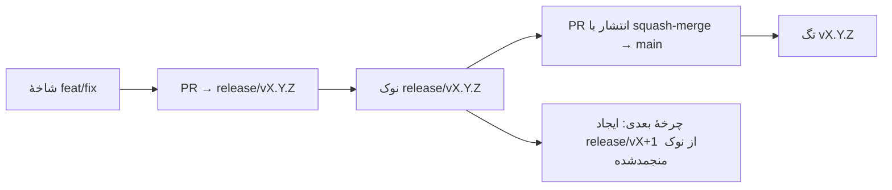

# Branching & Release Model (فارسی)

🌐 **Languages:** 🇺🇸 [English](../../../../ops/BRANCHING_MODEL.md) · 🇪🇹 [am](../../../am/docs/ops/BRANCHING_MODEL.md) · 🇸🇦 [ar](../../../ar/docs/ops/BRANCHING_MODEL.md) · 🇦🇿 [az](../../../az/docs/ops/BRANCHING_MODEL.md) · 🇧🇬 [bg](../../../bg/docs/ops/BRANCHING_MODEL.md) · 🇧🇩 [bn](../../../bn/docs/ops/BRANCHING_MODEL.md) · 🇨🇿 [cs](../../../cs/docs/ops/BRANCHING_MODEL.md) · 🇩🇰 [da](../../../da/docs/ops/BRANCHING_MODEL.md) · 🇩🇪 [de](../../../de/docs/ops/BRANCHING_MODEL.md) · 🇬🇷 [el](../../../el/docs/ops/BRANCHING_MODEL.md) · 🇪🇸 [es](../../../es/docs/ops/BRANCHING_MODEL.md) · 🇪🇪 [et](../../../et/docs/ops/BRANCHING_MODEL.md) · 🇫🇮 [fi](../../../fi/docs/ops/BRANCHING_MODEL.md) · 🇫🇷 [fr](../../../fr/docs/ops/BRANCHING_MODEL.md) · 🇮🇪 [ga](../../../ga/docs/ops/BRANCHING_MODEL.md) · 🇮🇳 [gu](../../../gu/docs/ops/BRANCHING_MODEL.md) · 🇳🇬 [ha](../../../ha/docs/ops/BRANCHING_MODEL.md) · 🇮🇱 [he](../../../he/docs/ops/BRANCHING_MODEL.md) · 🇮🇳 [hi](../../../hi/docs/ops/BRANCHING_MODEL.md) · 🇭🇷 [hr](../../../hr/docs/ops/BRANCHING_MODEL.md) · 🇭🇺 [hu](../../../hu/docs/ops/BRANCHING_MODEL.md) · 🇦🇲 [hy](../../../hy/docs/ops/BRANCHING_MODEL.md) · 🇮🇩 [id](../../../id/docs/ops/BRANCHING_MODEL.md) · 🇳🇬 [ig](../../../ig/docs/ops/BRANCHING_MODEL.md) · 🇮🇹 [it](../../../it/docs/ops/BRANCHING_MODEL.md) · 🇯🇵 [ja](../../../ja/docs/ops/BRANCHING_MODEL.md) · 🇬🇪 [ka](../../../ka/docs/ops/BRANCHING_MODEL.md) · 🇰🇭 [km](../../../km/docs/ops/BRANCHING_MODEL.md) · 🇮🇳 [kn](../../../kn/docs/ops/BRANCHING_MODEL.md) · 🇰🇷 [ko](../../../ko/docs/ops/BRANCHING_MODEL.md) · 🇱🇹 [lt](../../../lt/docs/ops/BRANCHING_MODEL.md) · 🇱🇻 [lv](../../../lv/docs/ops/BRANCHING_MODEL.md) · 🇮🇳 [ml](../../../ml/docs/ops/BRANCHING_MODEL.md) · 🇮🇳 [mr](../../../mr/docs/ops/BRANCHING_MODEL.md) · 🇲🇾 [ms](../../../ms/docs/ops/BRANCHING_MODEL.md) · 🇲🇹 [mt](../../../mt/docs/ops/BRANCHING_MODEL.md) · 🇲🇲 [my](../../../my/docs/ops/BRANCHING_MODEL.md) · 🇳🇵 [ne](../../../ne/docs/ops/BRANCHING_MODEL.md) · 🇳🇱 [nl](../../../nl/docs/ops/BRANCHING_MODEL.md) · 🇳🇴 [no](../../../no/docs/ops/BRANCHING_MODEL.md) · 🇮🇳 [or](../../../or/docs/ops/BRANCHING_MODEL.md) · 🇮🇳 [pa](../../../pa/docs/ops/BRANCHING_MODEL.md) · 🇵🇭 [phi](../../../phi/docs/ops/BRANCHING_MODEL.md) · 🇵🇱 [pl](../../../pl/docs/ops/BRANCHING_MODEL.md) · 🇵🇹 [pt](../../../pt/docs/ops/BRANCHING_MODEL.md) · 🇧🇷 [pt-BR](../../../pt-BR/docs/ops/BRANCHING_MODEL.md) · 🇷🇴 [ro](../../../ro/docs/ops/BRANCHING_MODEL.md) · 🇷🇺 [ru](../../../ru/docs/ops/BRANCHING_MODEL.md) · 🇱🇰 [si](../../../si/docs/ops/BRANCHING_MODEL.md) · 🇸🇰 [sk](../../../sk/docs/ops/BRANCHING_MODEL.md) · 🇸🇮 [sl](../../../sl/docs/ops/BRANCHING_MODEL.md) · 🇷🇸 [sr](../../../sr/docs/ops/BRANCHING_MODEL.md) · 🇸🇪 [sv](../../../sv/docs/ops/BRANCHING_MODEL.md) · 🇰🇪 [sw](../../../sw/docs/ops/BRANCHING_MODEL.md) · 🇮🇳 [ta](../../../ta/docs/ops/BRANCHING_MODEL.md) · 🇮🇳 [te](../../../te/docs/ops/BRANCHING_MODEL.md) · 🇹🇭 [th](../../../th/docs/ops/BRANCHING_MODEL.md) · 🇹🇷 [tr](../../../tr/docs/ops/BRANCHING_MODEL.md) · 🇺🇦 [uk-UA](../../../uk-UA/docs/ops/BRANCHING_MODEL.md) · 🇵🇰 [ur](../../../ur/docs/ops/BRANCHING_MODEL.md) · 🇺🇿 [uz](../../../uz/docs/ops/BRANCHING_MODEL.md) · 🇻🇳 [vi](../../../vi/docs/ops/BRANCHING_MODEL.md) · 🇳🇬 [yo](../../../yo/docs/ops/BRANCHING_MODEL.md) · 🇨🇳 [zh-CN](../../../zh-CN/docs/ops/BRANCHING_MODEL.md) · 🇹🇼 [zh-TW](../../../zh-TW/docs/ops/BRANCHING_MODEL.md)

---

OmniRoute از مدل انتشار **چرخههای موازی** استفاده میکند: یک شاخهٔ اختصاصی `release/vX.Y.Z`
برای چرخهٔ فعال، `main` برای خط منتشرشده و یک تگ تغییرناپذیر
`vX.Y.Z` هنگام انتشار آن چرخه. مشاهدهٔ ثبت شدن کامیتها هم در `release/*` _و_ هم در
`main` طبیعی است — این موضوع ناشی از اشتباه نیست.

جزئیات ویژهٔ نگهدارندگان در `CLAUDE.md` (قانون سختگیرانهٔ شمارهٔ ۲۱) و
[RELEASE_CHECKLIST.md](./RELEASE_CHECKLIST.md) آمده است. این صفحه خلاصهای عمومی
برای مشارکتکنندگان است.

## مرور کلی

| مرجع             | نقش                                                                                          |
| ---------------- | -------------------------------------------------------------------------------------------- |
| `release/vX.Y.Z` | **چرخهٔ فعال** — توسعهٔ روزمره و ادغام PRها برای آن نسخه                                     |
| `main`           | **خط منتشرشده** — هنگام انتشار، چرخه را از طریق squash-merge دریافت میکند                    |
| `vX.Y.Z` (تگ)    | **نشانگر انتشار** — اشارهگری تغییرناپذیر به «آنچه منتشر شده است» که هنگام انتشار ایجاد میشود |



## PR من باید کدام شاخه را هدف قرار دهد؟

**شاخهٔ فعال `release/vX.Y.Z` را هدف قرار دهید — نه `main` را.**

1. بالاترین شاخهٔ باز `release/v*` را پیدا کنید (نمونه در زمان نگارش:
   `release/v3.8.49`).
2. شاخهٔ خود را از نوک آن ایجاد کنید (`git fetch` و سپس checkout یا rebase روی آن).
3. PR را با **base = همان `release/vX.Y.Z`** باز کنید.

`main` شاخهٔ یکپارچهسازی روزمره نیست. PRهایی که به مقصد `main`
باز میشوند، معمولاً پیش از ادغام باید به شاخهٔ دیگری هدایت شوند.

## توقف موقت انتشار (چرخههای موازی)

هنگامی که یک انتشار در حال تطبیق نهایی است، یک issue نشانگر با برچسب `release-freeze`
باز میشود. این کار **توسعه را متوقف نمیکند**:

- شاخهٔ منجمدشدهٔ `release/vX.Y.Z` برای آن انتشار در اختیار مسئول انتشار است.
- چرخهٔ بعدی، یعنی `release/vX+1`، از نوک منجمدشده ایجاد میشود تا مشارکتکنندگان بتوانند
  به ثبت تغییرات خود ادامه دهند.
- PRهای بازی که همچنان شاخهٔ منجمدشده را هدف قرار دادهاند، باید به شاخهٔ فعال
  `release/v*` (بالاترین نسخه) **هدایت مجدد** شوند.

پیش از اینکه فرض کنید شاخهٔ موردنظر شما قابل ادغام است، وجود توقف موقت باز را بررسی کنید:

```bash
gh issue list --repo diegosouzapw/OmniRoute --label release-freeze --state open
```

سازوکار ادغام (برچسب `queue` توسط مالک → Mergify) در
[MERGE_TRAIN.md](./MERGE_TRAIN.md) مستند شده است.

## چرا هم شاخه و هم تگ؟

| مصنوع            | طول عمر            | هدف                                                                                 |
| ---------------- | ------------------ | ----------------------------------------------------------------------------------- |
| `release/vX.Y.Z` | چرخهٔ در حال انجام | PRهای بازبینیشده را جمعآوری میکند، وضعیت سبز CI را حفظ میکند و شاخهٔ پایهٔ PRها است |
| تگ `vX.Y.Z`      | همیشگی             | بیتهای دقیقی را که در npm / GitHub Releases منتشر شدهاند، مشخص میکند                |

شاخه کارگاه است؛ تگ بستهٔ مهرومومشده. پس از squash-merge در
`main`، چرخهٔ بعدی روی `release/vX+1` ادامه پیدا میکند، بدون اینکه منتظر تکمیل
PR انتشار قبلی بماند.

## مستندات مرتبط

- [CONTRIBUTING.md](../../CONTRIBUTING.md) — راهاندازی، آزمونها و چکلیست PR
- [RELEASE_CHECKLIST.md](./RELEASE_CHECKLIST.md) — اعتبارسنجی پیش از انتشار
- [MERGE_TRAIN.md](./MERGE_TRAIN.md) — صف ادغام و قطار جایگزین
- [RELEASE_GREEN.md](./RELEASE_GREEN.md) — سبز نگهداشتن نوک شاخهٔ انتشار
