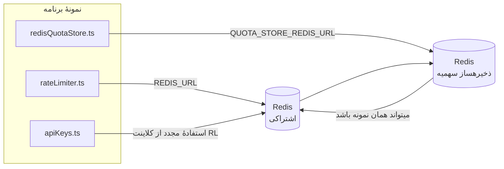

# Redis Production Configuration Guide (فارسی)

🌐 **Languages:** 🇺🇸 [English](../../../../ops/REDIS_PRODUCTION_CONFIG.md) · 🇪🇹 [am](../../../am/docs/ops/REDIS_PRODUCTION_CONFIG.md) · 🇸🇦 [ar](../../../ar/docs/ops/REDIS_PRODUCTION_CONFIG.md) · 🇦🇿 [az](../../../az/docs/ops/REDIS_PRODUCTION_CONFIG.md) · 🇧🇬 [bg](../../../bg/docs/ops/REDIS_PRODUCTION_CONFIG.md) · 🇧🇩 [bn](../../../bn/docs/ops/REDIS_PRODUCTION_CONFIG.md) · 🇨🇿 [cs](../../../cs/docs/ops/REDIS_PRODUCTION_CONFIG.md) · 🇩🇰 [da](../../../da/docs/ops/REDIS_PRODUCTION_CONFIG.md) · 🇩🇪 [de](../../../de/docs/ops/REDIS_PRODUCTION_CONFIG.md) · 🇬🇷 [el](../../../el/docs/ops/REDIS_PRODUCTION_CONFIG.md) · 🇪🇸 [es](../../../es/docs/ops/REDIS_PRODUCTION_CONFIG.md) · 🇪🇪 [et](../../../et/docs/ops/REDIS_PRODUCTION_CONFIG.md) · 🇫🇮 [fi](../../../fi/docs/ops/REDIS_PRODUCTION_CONFIG.md) · 🇫🇷 [fr](../../../fr/docs/ops/REDIS_PRODUCTION_CONFIG.md) · 🇮🇪 [ga](../../../ga/docs/ops/REDIS_PRODUCTION_CONFIG.md) · 🇮🇳 [gu](../../../gu/docs/ops/REDIS_PRODUCTION_CONFIG.md) · 🇳🇬 [ha](../../../ha/docs/ops/REDIS_PRODUCTION_CONFIG.md) · 🇮🇱 [he](../../../he/docs/ops/REDIS_PRODUCTION_CONFIG.md) · 🇮🇳 [hi](../../../hi/docs/ops/REDIS_PRODUCTION_CONFIG.md) · 🇭🇷 [hr](../../../hr/docs/ops/REDIS_PRODUCTION_CONFIG.md) · 🇭🇺 [hu](../../../hu/docs/ops/REDIS_PRODUCTION_CONFIG.md) · 🇦🇲 [hy](../../../hy/docs/ops/REDIS_PRODUCTION_CONFIG.md) · 🇮🇩 [id](../../../id/docs/ops/REDIS_PRODUCTION_CONFIG.md) · 🇳🇬 [ig](../../../ig/docs/ops/REDIS_PRODUCTION_CONFIG.md) · 🇮🇹 [it](../../../it/docs/ops/REDIS_PRODUCTION_CONFIG.md) · 🇯🇵 [ja](../../../ja/docs/ops/REDIS_PRODUCTION_CONFIG.md) · 🇬🇪 [ka](../../../ka/docs/ops/REDIS_PRODUCTION_CONFIG.md) · 🇰🇭 [km](../../../km/docs/ops/REDIS_PRODUCTION_CONFIG.md) · 🇮🇳 [kn](../../../kn/docs/ops/REDIS_PRODUCTION_CONFIG.md) · 🇰🇷 [ko](../../../ko/docs/ops/REDIS_PRODUCTION_CONFIG.md) · 🇱🇹 [lt](../../../lt/docs/ops/REDIS_PRODUCTION_CONFIG.md) · 🇱🇻 [lv](../../../lv/docs/ops/REDIS_PRODUCTION_CONFIG.md) · 🇮🇳 [ml](../../../ml/docs/ops/REDIS_PRODUCTION_CONFIG.md) · 🇮🇳 [mr](../../../mr/docs/ops/REDIS_PRODUCTION_CONFIG.md) · 🇲🇾 [ms](../../../ms/docs/ops/REDIS_PRODUCTION_CONFIG.md) · 🇲🇹 [mt](../../../mt/docs/ops/REDIS_PRODUCTION_CONFIG.md) · 🇲🇲 [my](../../../my/docs/ops/REDIS_PRODUCTION_CONFIG.md) · 🇳🇵 [ne](../../../ne/docs/ops/REDIS_PRODUCTION_CONFIG.md) · 🇳🇱 [nl](../../../nl/docs/ops/REDIS_PRODUCTION_CONFIG.md) · 🇳🇴 [no](../../../no/docs/ops/REDIS_PRODUCTION_CONFIG.md) · 🇮🇳 [or](../../../or/docs/ops/REDIS_PRODUCTION_CONFIG.md) · 🇮🇳 [pa](../../../pa/docs/ops/REDIS_PRODUCTION_CONFIG.md) · 🇵🇭 [phi](../../../phi/docs/ops/REDIS_PRODUCTION_CONFIG.md) · 🇵🇱 [pl](../../../pl/docs/ops/REDIS_PRODUCTION_CONFIG.md) · 🇵🇹 [pt](../../../pt/docs/ops/REDIS_PRODUCTION_CONFIG.md) · 🇧🇷 [pt-BR](../../../pt-BR/docs/ops/REDIS_PRODUCTION_CONFIG.md) · 🇷🇴 [ro](../../../ro/docs/ops/REDIS_PRODUCTION_CONFIG.md) · 🇷🇺 [ru](../../../ru/docs/ops/REDIS_PRODUCTION_CONFIG.md) · 🇱🇰 [si](../../../si/docs/ops/REDIS_PRODUCTION_CONFIG.md) · 🇸🇰 [sk](../../../sk/docs/ops/REDIS_PRODUCTION_CONFIG.md) · 🇸🇮 [sl](../../../sl/docs/ops/REDIS_PRODUCTION_CONFIG.md) · 🇷🇸 [sr](../../../sr/docs/ops/REDIS_PRODUCTION_CONFIG.md) · 🇸🇪 [sv](../../../sv/docs/ops/REDIS_PRODUCTION_CONFIG.md) · 🇰🇪 [sw](../../../sw/docs/ops/REDIS_PRODUCTION_CONFIG.md) · 🇮🇳 [ta](../../../ta/docs/ops/REDIS_PRODUCTION_CONFIG.md) · 🇮🇳 [te](../../../te/docs/ops/REDIS_PRODUCTION_CONFIG.md) · 🇹🇭 [th](../../../th/docs/ops/REDIS_PRODUCTION_CONFIG.md) · 🇹🇷 [tr](../../../tr/docs/ops/REDIS_PRODUCTION_CONFIG.md) · 🇺🇦 [uk-UA](../../../uk-UA/docs/ops/REDIS_PRODUCTION_CONFIG.md) · 🇵🇰 [ur](../../../ur/docs/ops/REDIS_PRODUCTION_CONFIG.md) · 🇺🇿 [uz](../../../uz/docs/ops/REDIS_PRODUCTION_CONFIG.md) · 🇻🇳 [vi](../../../vi/docs/ops/REDIS_PRODUCTION_CONFIG.md) · 🇳🇬 [yo](../../../yo/docs/ops/REDIS_PRODUCTION_CONFIG.md) · 🇨🇳 [zh-CN](../../../zh-CN/docs/ops/REDIS_PRODUCTION_CONFIG.md) · 🇹🇼 [zh-TW](../../../zh-TW/docs/ops/REDIS_PRODUCTION_CONFIG.md)

---

## نمای کلی

Redis در OmniRoute یک **وابستگی اختیاری و غیرضروری** است — هنگامی که Redis در دسترس نباشد، برنامه بهصورت کنترلشده از گزینههای جایگزین درونحافظهای استفاده میکند. در محیط عملیاتی، تنظیم بهینه Redis تأخیر چهار بار کاری مجزا را کاهش میدهد:

| بار کاری              | راهانداز                      | کارخانه کلاینت                              | الگوی کلید                                                        |
| --------------------- | ----------------------------- | ------------------------------------------- | ----------------------------------------------------------------- |
| محدودسازی نرخ         | `rateLimiter.ts`              | `getRedisClient()` — تکنمونه تنبل `ioredis` | پنجرههای محدودسازی نرخ اتمیک مبتنی بر Lua با الگوی `<prefix>rl:*` |
| کش احراز هویت         | `apiKeys.ts`                  | استفاده مجدد از کلاینت `rateLimiter`        | `<prefix>auth:api_key:<sha256>` همراه با TTL                      |
| ذخیرهساز سهمیه        | `redisQuotaStore.ts`          | تکنمونه مجزای `getRedisClient(url)`         | `<prefix>quota:*` قابل پیکربندی برای هر نمونه                     |
| قطعکننده مدار گرمسازی | `redisCircuitBreakerStore.ts` | کلاینت مجزا در `circuitBreakerFactory.ts`   | `<prefix>warmup:cb:<connectionId>`                                |

هر چهار بار کاری از یک پیشوند فضای نام مشترک استفاده میکنند تا OmniRoute بتواند در کنار برنامههای دیگر روی یک نمونه Redis واحد (برای مثال `127.0.0.1:6379`) فعالیت کند. به [فضای نام کلیدها](#key-namespacing) مراجعه کنید.

---

## پیکربندی فعلی (مقادیر پیشفرض کد)

| تنظیم                               | مقدار                                              | محل                                                                                   |
| ----------------------------------- | -------------------------------------------------- | ------------------------------------------------------------------------------------- |
| متغیر محیطی `REDIS_URL`             | `redis://redis:6379` (در compose)، اختیاری         | `rateLimiter.ts:5`، `.env.example`                                                    |
| متغیر محیطی `REDIS_KEY_PREFIX`      | `omniroute:` (پیشفرض)                              | `rateLimiter.ts`، `redisQuotaStore.ts`، `redisCircuitBreakerStore.ts`، `.env.example` |
| متغیر محیطی `QUOTA_STORE_REDIS_URL` | مجزا و میتواند با `REDIS_URL` متفاوت باشد          | `quota/storeFactory.ts`                                                               |
| `QUOTA_STORE_DRIVER`                | `"sqlite"` (پیشفرض)، `"redis"` اختیاری             | `quota/storeFactory.ts`                                                               |
| `maxRetriesPerRequest` در ioredis   | `3`                                                | ایجاد کلاینت در `rateLimiter.ts`                                                      |
| `enableReadyCheck`                  | تنظیم نشده است (پیشفرض ioredis: `true`)            | —                                                                                     |
| `lazyConnect`                       | تنظیم نشده است (پیشفرض ioredis: `false`)           | —                                                                                     |
| `retryStrategy`                     | تنظیم نشده است (پیشفرض ioredis: پایه 200ms، نمایی) | —                                                                                     |
| TLS / گذرواژه / نمایه پایگاه داده   | **پیکربندی نشده است**                              | —                                                                                     |
| Sentinel / Cluster                  | **پیکربندی نشده است** — فقط تکگره مستقل            | —                                                                                     |

---

## فضای نام کلیدها

OmniRoute یک نمونه Redis را با هر سرویس دیگری که روی میزبان اجرا میشود به اشتراک میگذارد. بدون فضای نام، کلیدهایی مانند `auth:api_key:<sha256>` یا `rl:*` ممکن است با کلیدهای برنامههای دیگری که از همان Redis استفاده میکنند تداخل داشته باشند (این نمونه Redis در کنار سرویسهای دیگر روی `127.0.0.1:6379` اجرا میشود).

`REDIS_KEY_PREFIX` را روی یک رشته غیرخالی تنظیم کنید تا به ابتدای **تمام** کلیدهای OmniRoute افزوده شود:

```bash
# .env — همه کلیدهای OmniRoute به omniroute:rl:*، omniroute:auth:*، omniroute:quota:* و omniroute:warmup:cb:* تبدیل میشوند
REDIS_KEY_PREFIX=omniroute:
```

- **پیشفرض:** `omniroute:` (هنگامی اعمال میشود که `REDIS_KEY_PREFIX` تنظیم نشده یا خالی باشد).
- **اعمالشده به:** محدودکننده نرخ + کش احراز هویت (کلاینت مشترک `ioredis` از طریق `keyPrefix`)، ذخیرهساز سهمیه (`KEY_PREFIX = "${REDIS_KEY_PREFIX}quota"`) و قطعکننده مدار گرمسازی (`KEY_PREFIX = "${REDIS_KEY_PREFIX}warmup:cb:"`).
- **تغییر پیشوند** در حالی که کلیدها از قبل در Redis وجود دارند، کلیدهای قدیمی را بدون مرجع باقی میگذارد (آنها از طریق TTL / LRU منقضی میشوند). تغییر آن ایمن است و به مهاجرت نیازی ندارد. تنها استثنا، کلید قطعکننده مدار گرمسازی برای اتصالی است که ممنوع علامتگذاری شده است: این کلید بدون TTL ماندگار میشود؛ بنابراین موارد باقیمانده را با `redis-cli --scan --pattern '<old-prefix>warmup:cb:*'` فهرست و سپس حذف کنید.
- **`keyPrefix` در ioredis** بهصورت خودکار هنگام نوشتن، پیشوند را اضافه میکند **و** هنگام خواندن آن را حذف میکند؛ بنابراین کد برنامه هرگز پیشوند را مشاهده نمیکند.

---

## تنظیمات پیشنهادی برای محیط عملیاتی

### 1. گزینههای Connection Pool / Client (سازنده `Redis` در ioredis)

کد فعلی یک نمونه `new Redis(url)` را بدون هیچ گزینه سفارشی ایجاد میکند. برای استقرارهای عملیاتی
چندنمونهای، یک client factory در کد ارسال کنید یا `getRedisClient()` را پوشش دهید:

```typescript
const redis = new Redis(REDIS_URL, {
  maxRetriesPerRequest: null, // بدون محدودیت تلاش مجدد؛ تصمیمگیری را به retryStrategy بسپارید
  enableReadyCheck: true, // پیش از پذیرش فراخوانیها، آمادهبودن سرور را بررسی کنید
  lazyConnect: true, // هنگام ساخت متصل نشوید؛ تا نخستین فراخوانی منتظر بمانید
  retryStrategy: (times) => {
    if (times > 10) return null; // پس از 10 تلاش منصرف شوید ← بعداً دوباره متصل شوید
    return Math.min(times * 200, 5000); // 200ms، 400ms، …، با سقف 5s
  },
  enableAutoPipelining: true, // فرمانهای همزمان را در یک نوشتن TCP ادغام کنید
  keepAlive: 10000, // ارسال keep-alive در TCP هر 10s
});
```

**موازنههای کلیدی:**

- `maxRetriesPerRequest: null` + `retryStrategy` — برای محیط عملیاتی ترجیح داده میشود تا راهاندازیهای
  مجدد و موقت Redis باعث شکست فوری تمام درخواستها نشوند. جایگزین درونحافظهای در
  `checkRateLimit()` مسیر شکست را پوشش میدهد.
- `lazyConnect: true` — از ایجاد وابستگی هنگام راهاندازی به در دسترسبودن Redis پیش از شروع
  پذیرش اتصالها توسط سرور جلوگیری میکند.
- `enableAutoPipelining: true` — رفتوبرگشتهای شبکه را برای بررسیهای همزمان محدودیت نرخ کاهش میدهد؛
  در بیش از 50 RPS روی یک اتصال سودمند است.

### 2. پیکربندی سرور Redis (`redis.conf`)

```
# حافظه
maxmemory 80%                        # برای page cache سیستمعامل فضا باقی بگذارید
maxmemory-policy allkeys-lru         # در شرایط فشار حافظه، ورودیهای قدیمی کش احراز هویت را حذف کنید

# ماندگاری (اختیاری — OmniRoute بدون آن نیز در برابر خرابی ایمن است)
save 300 1                           # اگر حداقل 1 کلید تغییر کرده است، دستکم هر 5 دقیقه snapshot بگیرید
appendonly no                        # نیازی به AOF نیست؛ دادهها قابل بازتولید هستند
appendfsync no                       # بدون سربار fsync؛ RDB کافی است

# شبکه
timeout 0                            # اتصالهای بیکار را قطع نکنید
tcp-keepalive 300                    # keep-alive هر 5 دقیقه
tcp-backlog 511                      # صف انتظار اتصال برای بارهای ناگهانی

# کارایی
hz 10                                # مقدار پیشفرض؛ برای موارد حساس به تأخیر از 100 استفاده کنید
activedefrag yes                     # در صورت بیشترشدن fragmentation از 10٪، بهطور خودکار یکپارچهسازی کنید
```

**موازنه مربوط به `maxmemory-policy allkeys-lru`:** ممکن است ورودیهای کش احراز هویت در شرایط
فشار حافظه حذف شوند. این کار ایمن است — `setCachedApiKey` همیشه در صورت نبود داده، آن را دوباره پر میکند و
جایگزین SQLite منبع معتبر است. اسکریپت Lua محدودکننده نرخ، کلیدهای کوچکی ایجاد میکند که
طبق طراحی عمر کوتاهی دارند.

### 3. تنظیمات Docker Compose

پیکربندی compose محیط عملیاتی (`docker-compose.prod.yml`) از `redis:8.6.2-alpine` استفاده میکند. موارد زیر را اضافه کنید:

```yaml
redis:
  image: redis:8.6.2-alpine
  command:
    [
      "redis-server",
      "--maxmemory",
      "512mb",
      "--maxmemory-policy",
      "allkeys-lru",
      "--activedefrag",
      "yes",
      "--save",
      "300 1",
    ]
  healthcheck:
    test: ["CMD", "redis-cli", "ping"]
    interval: 10s
    timeout: 3s
    retries: 3
    start_period: 5s
```

### 4. ملاحظات چندنمونهای / مقیاسپذیری

**یک Redis برای تمام replicaها** — اسکریپت Lua محدودکننده نرخ به یک فضای کلید
معتبر و واحد وابسته است. استفاده از چند نمونه Redis پشت replicaها باعث ازدسترفتن خاصیت اتمی
و دوبرابرشدن بودجه میشود. برای تمام replicaهای برنامه از یک Redis واحد (یا کلاستر Redis Sentinel با failover)
استفاده کنید.

**تعداد اتصالها:** هر replica برنامه، **2 اتصال TCP** به Redis باز میکند
(client محدودکننده نرخ + client ذخیرهساز سهمیه). با 10 replica ← 20 اتصال ایجاد میشود که
بسیار کمتر از سقف پیشفرض 10k اتصال در هر نمونه Redis است.

### 5. پایش

موارد زیر را از طریق endpoint بررسی سلامت ارائه کنید:

```typescript
// فایل src/app/api/monitoring/health/route.ts از قبل توابع rateLimiter را فراخوانی میکند
// بررسیهای مختص Redis را اضافه کنید:
//   1. تأخیر PING از طریق ioredis .ping()
//   2. میزان مصرف حافظه از طریق INFO memory
//   3. تعداد اتصالها از طریق INFO clients
//   4. نرخ برخورد برای maxmemory-policy با استفاده از (evicted_keys / keyspace_hits)
```

معیارهای کلیدی برای پایش:

- **کلیدهای حذفشده / ثانیه** — اگر بهطور مداوم غیرصفر است، `maxmemory` را افزایش دهید
- **clientهای مسدودشده** — مقدار غیرصفر نشاندهنده کندبودن اسکریپتهای Lua یا رقابت شدید است
- **اتصالهای ردشده** — محدودیت اتصال پر شده است؛ با 20 اتصال بهندرت رخ میدهد

---

## نمودار معماری



---

## منابع

| فایل                               | هدف                                                                             |
| ---------------------------------- | ------------------------------------------------------------------------------- |
| `src/shared/utils/rateLimiter.ts`  | کلاینت اصلی Redis، اسکریپت Lua برای محدودسازی نرخ و سازوکار جایگزین درونحافظهای |
| `src/lib/db/apiKeys.ts`            | کش احراز هویت — سازوکار جایگزین Redis→SQLite                                    |
| `src/lib/quota/redisQuotaStore.ts` | کلاینت مجزای Redis برای ذخیرهساز اختیاری سهمیه                                  |
| `src/lib/quota/storeFactory.ts`    | جابهجایی بین درایورهای سهمیهٔ `sqlite` و `redis`                                |
| `docker-compose.prod.yml`          | کانتینر Redis محیط تولید (ایمیج `redis:8.6.2-alpine`)                           |
| `.env.example`                     | مستندات متغیرهای محیطی Redis                                                    |
| `src/app/api/local/redis/`         | مسیرهای API برای هماهنگسازی کانتینر محیط توسعه                                  |
| `bin/cli/commands/redis.mjs`       | فرمانهای CLI برای هماهنگسازی کانتینر محیط توسعه                                 |
