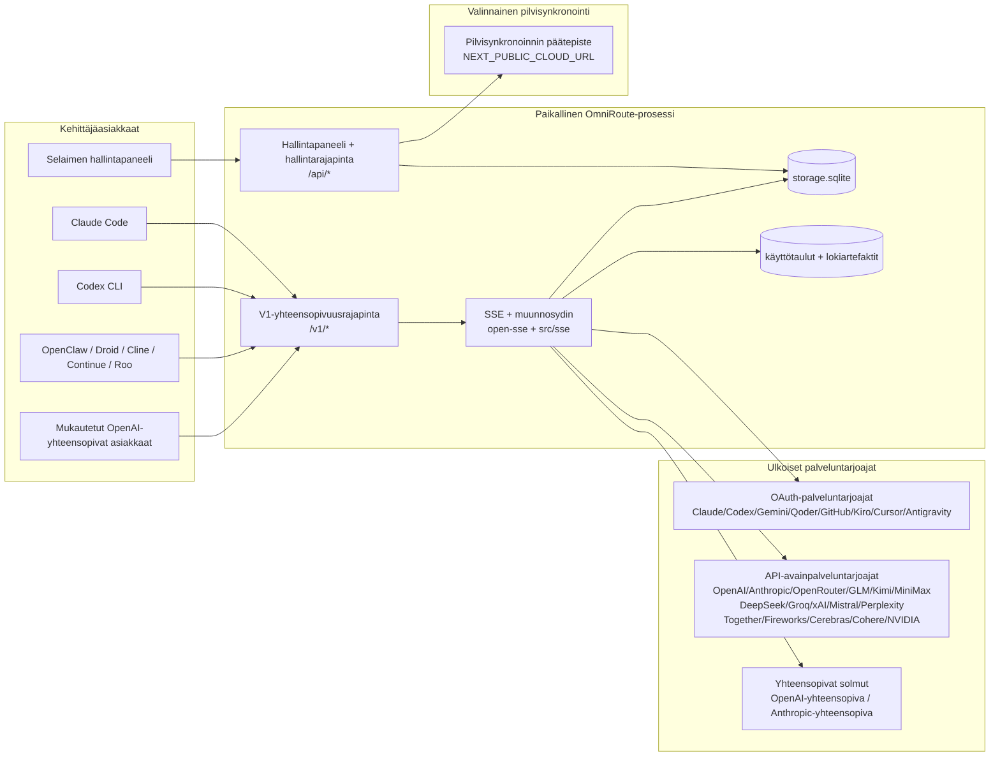
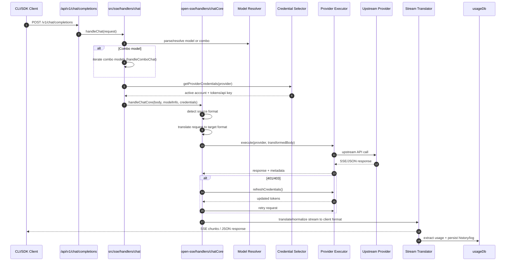
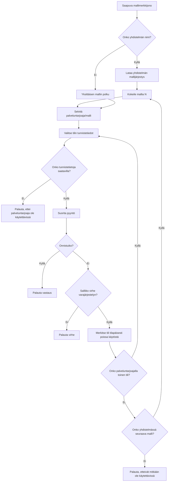
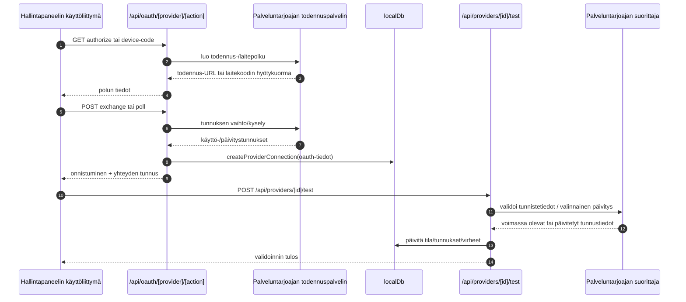
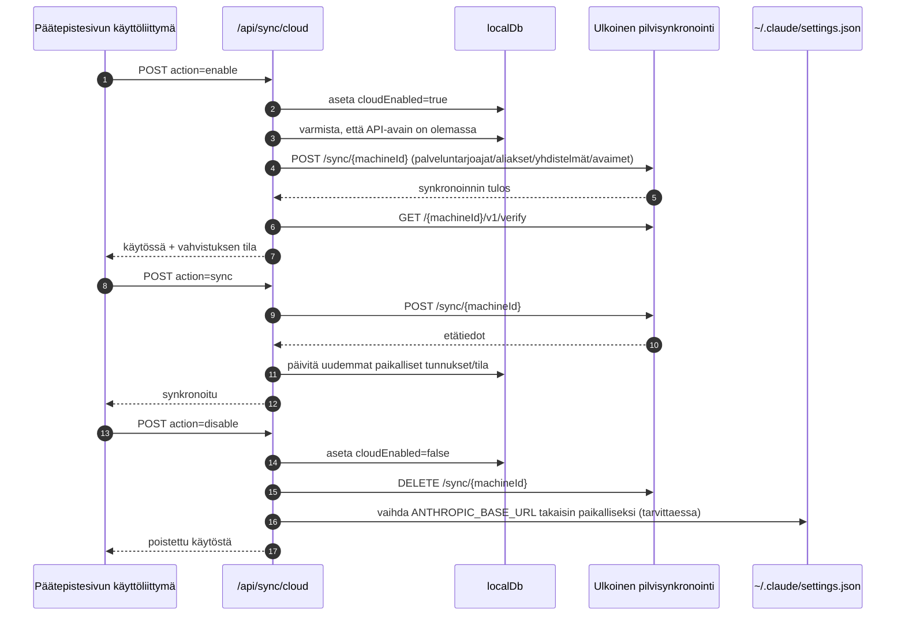
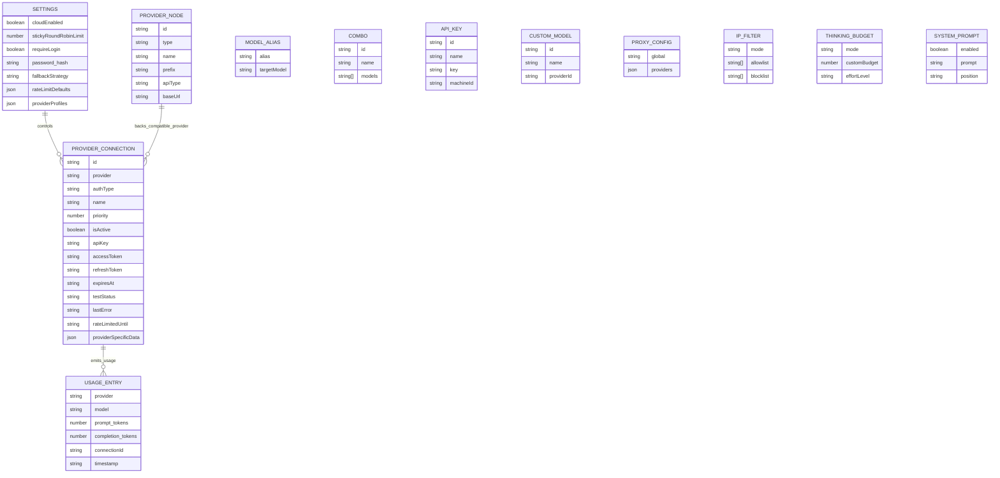
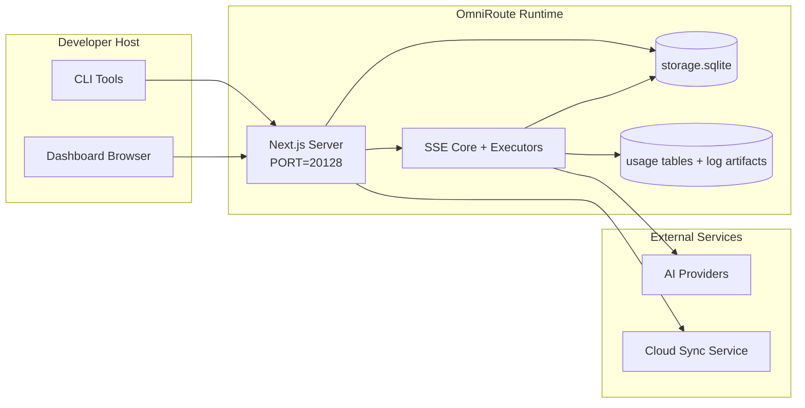

# OmniRoute Architecture (Suomi)

🌐 **Languages:** 🇺🇸 [English](../../../../architecture/ARCHITECTURE.md) · 🇪🇹 [am](../../../am/docs/architecture/ARCHITECTURE.md) · 🇸🇦 [ar](../../../ar/docs/architecture/ARCHITECTURE.md) · 🇦🇿 [az](../../../az/docs/architecture/ARCHITECTURE.md) · 🇧🇬 [bg](../../../bg/docs/architecture/ARCHITECTURE.md) · 🇧🇩 [bn](../../../bn/docs/architecture/ARCHITECTURE.md) · 🇧🇦 [bs](../../../bs/docs/architecture/ARCHITECTURE.md) · 🇨🇿 [cs](../../../cs/docs/architecture/ARCHITECTURE.md) · 🇩🇰 [da](../../../da/docs/architecture/ARCHITECTURE.md) · 🇩🇪 [de](../../../de/docs/architecture/ARCHITECTURE.md) · 🇬🇷 [el](../../../el/docs/architecture/ARCHITECTURE.md) · 🇪🇸 [es](../../../es/docs/architecture/ARCHITECTURE.md) · 🇪🇪 [et](../../../et/docs/architecture/ARCHITECTURE.md) · 🇮🇷 [fa](../../../fa/docs/architecture/ARCHITECTURE.md) · 🇫🇷 [fr](../../../fr/docs/architecture/ARCHITECTURE.md) · 🇮🇪 [ga](../../../ga/docs/architecture/ARCHITECTURE.md) · 🇮🇳 [gu](../../../gu/docs/architecture/ARCHITECTURE.md) · 🇳🇬 [ha](../../../ha/docs/architecture/ARCHITECTURE.md) · 🇮🇱 [he](../../../he/docs/architecture/ARCHITECTURE.md) · 🇮🇳 [hi](../../../hi/docs/architecture/ARCHITECTURE.md) · 🇭🇷 [hr](../../../hr/docs/architecture/ARCHITECTURE.md) · 🇭🇺 [hu](../../../hu/docs/architecture/ARCHITECTURE.md) · 🇦🇲 [hy](../../../hy/docs/architecture/ARCHITECTURE.md) · 🇮🇩 [id](../../../id/docs/architecture/ARCHITECTURE.md) · 🇳🇬 [ig](../../../ig/docs/architecture/ARCHITECTURE.md) · 🇮🇹 [it](../../../it/docs/architecture/ARCHITECTURE.md) · 🇯🇵 [ja](../../../ja/docs/architecture/ARCHITECTURE.md) · 🇬🇪 [ka](../../../ka/docs/architecture/ARCHITECTURE.md) · 🇰🇭 [km](../../../km/docs/architecture/ARCHITECTURE.md) · 🇮🇳 [kn](../../../kn/docs/architecture/ARCHITECTURE.md) · 🇰🇷 [ko](../../../ko/docs/architecture/ARCHITECTURE.md) · 🇱🇹 [lt](../../../lt/docs/architecture/ARCHITECTURE.md) · 🇱🇻 [lv](../../../lv/docs/architecture/ARCHITECTURE.md) · 🇮🇳 [ml](../../../ml/docs/architecture/ARCHITECTURE.md) · 🇮🇳 [mr](../../../mr/docs/architecture/ARCHITECTURE.md) · 🇲🇾 [ms](../../../ms/docs/architecture/ARCHITECTURE.md) · 🇲🇹 [mt](../../../mt/docs/architecture/ARCHITECTURE.md) · 🇲🇲 [my](../../../my/docs/architecture/ARCHITECTURE.md) · 🇳🇵 [ne](../../../ne/docs/architecture/ARCHITECTURE.md) · 🇳🇱 [nl](../../../nl/docs/architecture/ARCHITECTURE.md) · 🇳🇴 [no](../../../no/docs/architecture/ARCHITECTURE.md) · 🇮🇳 [or](../../../or/docs/architecture/ARCHITECTURE.md) · 🇮🇳 [pa](../../../pa/docs/architecture/ARCHITECTURE.md) · 🇵🇭 [phi](../../../phi/docs/architecture/ARCHITECTURE.md) · 🇵🇱 [pl](../../../pl/docs/architecture/ARCHITECTURE.md) · 🇵🇹 [pt](../../../pt/docs/architecture/ARCHITECTURE.md) · 🇧🇷 [pt-BR](../../../pt-BR/docs/architecture/ARCHITECTURE.md) · 🇷🇴 [ro](../../../ro/docs/architecture/ARCHITECTURE.md) · 🇷🇺 [ru](../../../ru/docs/architecture/ARCHITECTURE.md) · 🇱🇰 [si](../../../si/docs/architecture/ARCHITECTURE.md) · 🇸🇰 [sk](../../../sk/docs/architecture/ARCHITECTURE.md) · 🇸🇮 [sl](../../../sl/docs/architecture/ARCHITECTURE.md) · 🇷🇸 [sr](../../../sr/docs/architecture/ARCHITECTURE.md) · 🇸🇪 [sv](../../../sv/docs/architecture/ARCHITECTURE.md) · 🇰🇪 [sw](../../../sw/docs/architecture/ARCHITECTURE.md) · 🇮🇳 [ta](../../../ta/docs/architecture/ARCHITECTURE.md) · 🇮🇳 [te](../../../te/docs/architecture/ARCHITECTURE.md) · 🇹🇭 [th](../../../th/docs/architecture/ARCHITECTURE.md) · 🇹🇷 [tr](../../../tr/docs/architecture/ARCHITECTURE.md) · 🇺🇦 [uk-UA](../../../uk-UA/docs/architecture/ARCHITECTURE.md) · 🇵🇰 [ur](../../../ur/docs/architecture/ARCHITECTURE.md) · 🇺🇿 [uz](../../../uz/docs/architecture/ARCHITECTURE.md) · 🇻🇳 [vi](../../../vi/docs/architecture/ARCHITECTURE.md) · 🇳🇬 [yo](../../../yo/docs/architecture/ARCHITECTURE.md) · 🇨🇳 [zh-CN](../../../zh-CN/docs/architecture/ARCHITECTURE.md) · 🇹🇼 [zh-TW](../../../zh-TW/docs/architecture/ARCHITECTURE.md)

---

🌐 **Languages:** 🇺🇸 [English](../../../../architecture/ARCHITECTURE.md) · 🇪🇹 [am](../../../am/docs/architecture/ARCHITECTURE.md) · 🇸🇦 [ar](../../../ar/docs/architecture/ARCHITECTURE.md) · 🇦🇿 [az](../../../az/docs/architecture/ARCHITECTURE.md) · 🇧🇬 [bg](../../../bg/docs/architecture/ARCHITECTURE.md) · 🇧🇩 [bn](../../../bn/docs/architecture/ARCHITECTURE.md) · 🇧🇦 [bs](../../../bs/docs/architecture/ARCHITECTURE.md) · 🇨🇿 [cs](../../../cs/docs/architecture/ARCHITECTURE.md) · 🇩🇰 [da](../../../da/docs/architecture/ARCHITECTURE.md) · 🇩🇪 [de](../../../de/docs/architecture/ARCHITECTURE.md) · 🇬🇷 [el](../../../el/docs/architecture/ARCHITECTURE.md) · 🇪🇸 [es](../../../es/docs/architecture/ARCHITECTURE.md) · 🇪🇪 [et](../../../et/docs/architecture/ARCHITECTURE.md) · 🇮🇷 [fa](../../../fa/docs/architecture/ARCHITECTURE.md) · 🇫🇷 [fr](../../../fr/docs/architecture/ARCHITECTURE.md) · 🇮🇪 [ga](../../../ga/docs/architecture/ARCHITECTURE.md) · 🇮🇳 [gu](../../../gu/docs/architecture/ARCHITECTURE.md) · 🇳🇬 [ha](../../../ha/docs/architecture/ARCHITECTURE.md) · 🇮🇱 [he](../../../he/docs/architecture/ARCHITECTURE.md) · 🇮🇳 [hi](../../../hi/docs/architecture/ARCHITECTURE.md) · 🇭🇷 [hr](../../../hr/docs/architecture/ARCHITECTURE.md) · 🇭🇺 [hu](../../../hu/docs/architecture/ARCHITECTURE.md) · 🇦🇲 [hy](../../../hy/docs/architecture/ARCHITECTURE.md) · 🇮🇩 [id](../../../id/docs/architecture/ARCHITECTURE.md) · 🇳🇬 [ig](../../../ig/docs/architecture/ARCHITECTURE.md) · 🇮🇹 [it](../../../it/docs/architecture/ARCHITECTURE.md) · 🇯🇵 [ja](../../../ja/docs/architecture/ARCHITECTURE.md) · 🇬🇪 [ka](../../../ka/docs/architecture/ARCHITECTURE.md) · 🇰🇭 [km](../../../km/docs/architecture/ARCHITECTURE.md) · 🇮🇳 [kn](../../../kn/docs/architecture/ARCHITECTURE.md) · 🇰🇷 [ko](../../../ko/docs/architecture/ARCHITECTURE.md) · 🇱🇹 [lt](../../../lt/docs/architecture/ARCHITECTURE.md) · 🇱🇻 [lv](../../../lv/docs/architecture/ARCHITECTURE.md) · 🇮🇳 [ml](../../../ml/docs/architecture/ARCHITECTURE.md) · 🇮🇳 [mr](../../../mr/docs/architecture/ARCHITECTURE.md) · 🇲🇾 [ms](../../../ms/docs/architecture/ARCHITECTURE.md) · 🇲🇹 [mt](../../../mt/docs/architecture/ARCHITECTURE.md) · 🇲🇲 [my](../../../my/docs/architecture/ARCHITECTURE.md) · 🇳🇵 [ne](../../../ne/docs/architecture/ARCHITECTURE.md) · 🇳🇱 [nl](../../../nl/docs/architecture/ARCHITECTURE.md) · 🇳🇴 [no](../../../no/docs/architecture/ARCHITECTURE.md) · 🇮🇳 [or](../../../or/docs/architecture/ARCHITECTURE.md) · 🇮🇳 [pa](../../../pa/docs/architecture/ARCHITECTURE.md) · 🇵🇭 [phi](../../../phi/docs/architecture/ARCHITECTURE.md) · 🇵🇱 [pl](../../../pl/docs/architecture/ARCHITECTURE.md) · 🇵🇹 [pt](../../../pt/docs/architecture/ARCHITECTURE.md) · 🇧🇷 [pt-BR](../../../pt-BR/docs/architecture/ARCHITECTURE.md) · 🇷🇴 [ro](../../../ro/docs/architecture/ARCHITECTURE.md) · 🇷🇺 [ru](../../../ru/docs/architecture/ARCHITECTURE.md) · 🇱🇰 [si](../../../si/docs/architecture/ARCHITECTURE.md) · 🇸🇰 [sk](../../../sk/docs/architecture/ARCHITECTURE.md) · 🇸🇮 [sl](../../../sl/docs/architecture/ARCHITECTURE.md) · 🇷🇸 [sr](../../../sr/docs/architecture/ARCHITECTURE.md) · 🇸🇪 [sv](../../../sv/docs/architecture/ARCHITECTURE.md) · 🇰🇪 [sw](../../../sw/docs/architecture/ARCHITECTURE.md) · 🇮🇳 [ta](../../../ta/docs/architecture/ARCHITECTURE.md) · 🇮🇳 [te](../../../te/docs/architecture/ARCHITECTURE.md) · 🇹🇭 [th](../../../th/docs/architecture/ARCHITECTURE.md) · 🇹🇷 [tr](../../../tr/docs/architecture/ARCHITECTURE.md) · 🇺🇦 [uk-UA](../../../uk-UA/docs/architecture/ARCHITECTURE.md) · 🇵🇰 [ur](../../../ur/docs/architecture/ARCHITECTURE.md) · 🇺🇿 [uz](../../../uz/docs/architecture/ARCHITECTURE.md) · 🇻🇳 [vi](../../../vi/docs/architecture/ARCHITECTURE.md) · 🇳🇬 [yo](../../../yo/docs/architecture/ARCHITECTURE.md) · 🇨🇳 [zh-CN](../../../zh-CN/docs/architecture/ARCHITECTURE.md) · 🇹🇼 [zh-TW](../../../zh-TW/docs/architecture/ARCHITECTURE.md)

_Päivitetty viimeksi: 2026-06-28_

## Yhteenveto

OmniRoute on Next.js:n päälle rakennettu paikallinen tekoälyliikenteen reititysyhdyskäytävä ja hallintapaneeli.
Se tarjoaa yhden OpenAI-yhteensopivan päätepisteen (`/v1/*`) ja reitittää liikenteen useille taustapalveluntarjoajille hyödyntäen muunnoksia, varareititystä, tunnisteiden päivitystä ja käytön seurantaa.

Keskeiset ominaisuudet:

- OpenAI-yhteensopiva API-pinta komentorivityökaluille ja muille työkaluille (355 palveluntarjoajaa, 108 suorittajaa)
- Pyyntöjen ja vastausten muuntaminen palveluntarjoajien eri muotojen välillä
- Malliyhdistelmien varareititys (usean mallin sarja)
- Rakenteiset yhdistelmävaiheet (`provider + model + connection`) ja niiden ajonaikainen järjestäminen `compositeTiers`-arvon perusteella
- Tilitason varareititys (useita tilejä palveluntarjoajaa kohden)
- Kiintiön ennakkotarkistus ja kiintiöt huomioiva P2C-tilinvalinta pääasiallisessa keskustelupolussa
- OAuth- ja API-avaimiin perustuva palveluntarjoajayhteyksien hallinta (22 OAuth-palveluntarjoajamoduulia)
- Upotusten luonti `/v1/embeddings`-päätepisteen kautta (18 palveluntarjoajaa)
- Kuvien luonti `/v1/images/generations`-päätepisteen kautta (yli 10 palveluntarjoajaa, yli 20 mallia)
- Äänen litterointi `/v1/audio/transcriptions`-päätepisteen kautta (18 palveluntarjoajaa)
- Tekstistä puheeksi -muunnos `/v1/audio/speech`-päätepisteen kautta (24 sisäänrakennettua palveluntarjoajaa)
- Videoiden luonti `/v1/videos/generations`-päätepisteen kautta (ComfyUI + SD WebUI)
- Musiikin luonti `/v1/music/generations`-päätepisteen kautta (ComfyUI)
- Verkkohaku `/v1/search`-päätepisteen kautta (20 palveluntarjoajaa)
- Sisällön moderointi `/v1/moderations`-päätepisteen kautta
- Uudelleenjärjestäminen `/v1/rerank`-päätepisteen kautta
- Ajattelutunnisteiden jäsennys (`<think>...</think>`) päättelymalleille
- Vastausten puhdistus tiukkaa OpenAI SDK -yhteensopivuutta varten
- Roolien normalisointi (developer→system, system→user) palveluntarjoajien välisen yhteensopivuuden varmistamiseksi
- Rakenteisen tulosteen muuntaminen (json_schema → Gemini responseSchema)
- Palveluntarjoajien, avainten, aliasten, yhdistelmien, asetusten ja hinnoittelun paikallinen pysyväistallennus (122 tietokantamoduulia)
- Käytön ja kustannusten seuranta sekä pyyntöjen lokitus
- Valinnainen pilvisynkronointi useiden laitteiden ja tilan synkronointia varten
- IP-osoitteiden sallittujen ja estettyjen luettelot API-käytön hallintaan
- Ajattelubudjetin hallinta (läpivienti/automaattinen/mukautettu/mukautuva)
- Globaalin järjestelmäkehotteen lisääminen
- Istuntojen seuranta ja sormenjälkien luonti
- Tilikohtainen tehostettu nopeusrajoitus palveluntarjoajakohtaisilla profiileilla
- Katkaisijamalli palveluntarjoajien häiriönsietokyvyn parantamiseksi
- Samanaikaisten pyyntöryöppyjen esto mutex-lukituksella
- Allekirjoitukseen perustuva pyyntöjen duplikaattien poistovälimuisti
- Toimialuekerros: kustannussäännöt, varareitityskäytäntö ja lukituskäytäntö
- Context Relay: istuntojen siirtoyhteenvedot jatkuvuuden säilyttämiseksi tiliä vaihdettaessa
- Toimialueen tilan pysyväistallennus (SQLite-läpikirjoitusvälimuisti varareitityksille, budjeteille, lukituksille ja katkaisijoille)
- Käytäntömoottori pyyntöjen keskitettyyn arviointiin (lukitus → budjetti → varareititys)
- Pyyntötelemetria p50/p95/p99-viiveiden aggregoinnilla
- Yhdistelmäkohteiden telemetria ja historiallinen terveystila tunnisteiden `combo_execution_key` / `combo_step_id` avulla
- Korrelaatiotunnus (X-Request-Id) päästä päähän -jäljitystä varten
- Vaatimustenmukaisuuden auditointilokitus API-avainkohtaisella käytöstäpoistolla
- Arviointikehys LLM-laadunvarmistusta varten
- Terveystilan hallintapaneeli palveluntarjoajien katkaisijoiden reaaliaikaisella tilalla
- MCP Server (110 työkalua), jossa on 3 siirtotapaa (stdio/SSE/Streamable HTTP)
- A2A Server (JSON-RPC 2.0 + SSE), joka sisältää taidot ja tehtävien elinkaaren
- Muistijärjestelmä (poiminta, lisääminen, haku, yhteenvetojen luonti)
- Taitojärjestelmä (rekisteri, suorittaja, hiekkalaatikko, sisäänrakennetut taidot)
- MITM-välityspalvelin varmenteiden hallinnalla ja DNS-käsittelyllä
- Kehotesyötteiden manipuloinnilta suojaava väliohjelmisto
- Kehotteiden pakkausputki, joka sisältää Cavemanin, RTK:n, pinotut putket, pakkausyhdistelmät, kielipaketit ja analytiikan
- ACP (Agent Communication Protocol) -rekisteri
- Modulaariset OAuth-palveluntarjoajat (22 erillistä moduulia hakemistossa `src/lib/oauth/providers/`)
- Asennuksen poisto- ja täydellisen asennuksen poiston komentosarjat
- OAuth-ympäristön korjaustoiminto
- WebSocket-silta OpenAI-yhteensopiville WS-asiakkaille (`/v1/ws`)
- Synkronointitunnisteiden hallinta (myöntäminen/peruminen, ETag-versioidun määrityspaketin lataus)
- GLM Thinking (`glmt`) ensiluokkaisena palveluntarjoajan esiasetuksena
- Hybriditunnisteiden laskenta (palveluntarjoajan `/messages/count_tokens` ja varamenetelmänä estimointi)
- Mallialiasten automaattinen alustus (yli 30 välityspalvelinmurteiden välistä normalisointia käynnistyksen yhteydessä)
- Turvallinen lähtevä nouto SSRF-suojauksella, yksityisten URL-osoitteiden estolla ja määritettävillä uudelleenyrityksillä
- Jäähtymisajan huomioivat keskustelun uudelleenyritykset määritettävillä `requestRetry`- ja `maxRetryIntervalSec`-arvoilla
- Ajoympäristön validointi Zodilla käynnistyksen yhteydessä
- Vaatimustenmukaisuuden auditointi v2 sivutuksella, palveluntarjoajien CRUD-tapahtumilla ja SSRF-estojen validointilokituksella

Ensisijainen ajonaikainen malli:

- Hakemiston `src/app/api/*` Next.js-sovellusreitit toteuttavat sekä hallintapaneelin API:t että yhteensopivuus-API:t
- Hakemistojen `src/sse/*` ja `open-sse/*` jaettu SSE- ja reititysydin käsittelee palveluntarjoajien suorituksen, muunnokset, suoratoiston, varareitityksen ja käytön seurannan

## Viitekaaviot

v3.8.0-alustan kanoniset, versionhallinnassa olevat Mermaid-lähteet sijaitsevat hakemistossa
[`docs/diagrams/`](../diagrams/README.md). Niistä kaksi on esitetty alla yleiskuvan saamiseksi;
muihin on linkit niiden aihekohtaisissa oppaissa.


> Lähde: [diagrams/request-pipeline.mmd](../diagrams/request-pipeline.mmd)


> Lähde: [diagrams/resilience-3layers.mmd](../diagrams/resilience-3layers.mmd) — linkitetty myös
> oppaasta [RESILIENCE_GUIDE.md](./RESILIENCE_GUIDE.md) ja `CLAUDE.md`-tiedoston vikasietoisuutta käsittelevästä viitteestä.

## Laajuus ja rajaukset

### Sisältyy laajuuteen

- Paikallisen yhdyskäytävän suoritusympäristö
- Hallintapaneelin hallintasovellusliittymät
- Palveluntarjoajien todennus ja tunnisteiden päivitys
- Pyyntöjen muuntaminen ja SSE-suoratoisto
- Paikallinen tila ja käyttötietojen pysyvä tallennus
- Valinnainen pilvisynkronoinnin orkestrointi

### Ei sisälly laajuuteen

- Muuttujan `NEXT_PUBLIC_CLOUD_URL` takana olevan pilvipalvelun toteutus
- Paikallisen prosessin ulkopuolinen palveluntarjoajan SLA-/hallintataso
- Itse ulkoiset CLI-binäärit (Claude CLI, Codex CLI jne.)

## Hallintapaneelin näkymät (nykyiset)

Pääsivut hakemistossa `src/app/(dashboard)/dashboard/`:

- `/dashboard` — pika-aloitus ja palveluntarjoajien yleiskatsaus
- `/dashboard/endpoint` — päätepistevälityspalvelin sekä MCP-, A2A- ja API-päätepistevälilehdet
- `/dashboard/providers` — palveluntarjoajien yhteydet ja tunnistetiedot
- `/dashboard/combos` — yhdistelmästrategiat, mallit, vaihekohtainen rakennustyökalu, mallien reitityssäännöt ja manuaalisesti tallennettu järjestys
- `/dashboard/auto-combo` — Auto Combo Engine: pisteytyspainot, tilapaketit, virtuaalisten tehtaiden esiasetukset ja telemetria
- `/dashboard/costs` — kustannusten koonti ja hinnoittelun näkyvyys
- `/dashboard/analytics` — käyttöanalytiikka, arvioinnit ja yhdistelmäkohteiden kunto
- `/dashboard/limits` — kiintiö- ja nopeusrajoitukset
- `/dashboard/cli-tools` — CLI-käyttöönotto, suoritusympäristön tunnistus ja määritysten luonti
- `/dashboard/agents` — tunnistetut ACP-agentit ja mukautettujen agenttien rekisteröinti
- `/dashboard/cloud-agents` — pilvipalvelussa isännöidyt agenttitehtävät (Codex Cloud, Devin, Jules) ja tehtävien elinkaari
- `/dashboard/skills` — A2A-taitorekisteri, hiekkalaatikkosuoritus ja sisäänrakennettujen taitojen luettelo
- `/dashboard/memory` — pysyvän keskustelumuistin tarkastelu ja haku
- `/dashboard/webhooks` — lähtevien webhook-kutsujen tilaukset, salaisuuksien kierrätys ja uudelleenyritystilastot
- `/dashboard/batch` — eräajojen lähetys ja edistyminen
- `/dashboard/cache` — läpilukevan välimuistin ja päättelyvälimuistin tilastot sekä poistamistoiminnot
- `/dashboard/playground` — vuorovaikutteinen keskustelukokeiluympäristö mille tahansa määritetylle yhdistelmälle tai mallille
- `/dashboard/changelog` — sovelluksen sisäinen muutoslokin katseluohjelma (hahmontaa tiedoston `CHANGELOG.md`)
- `/dashboard/system` — suoritusympäristön diagnostiikka, versiotiedot ja ympäristön validointinäkymä
- `/dashboard/onboarding` — ensimmäisen käyttökerran ohjattu määritys uusille asennuksille
- `/dashboard/media` — kuvien, videoiden ja musiikin kokeiluympäristö
- `/dashboard/search-tools` — hakupalveluntarjoajien testaus ja historia
- `/dashboard/health` — käytettävyysaika, virtapiirin katkaisijat, nopeusrajoitukset ja kiintiövalvotut istunnot
- `/dashboard/logs` — pyyntö-, välityspalvelin-, tarkastus- ja konsolilokit
- `/dashboard/settings` — järjestelmäasetusten välilehdet (yleiset, reititys, yhdistelmien oletukset jne.)
- `/dashboard/context/caveman` — Caveman-pakkaussäännöt, kielipaketit, esikatselu ja tulostila
- `/dashboard/context/rtk` — RTK-komentotulosteiden suodattimet, esikatselu ja suoritusympäristön turvallisuusasetukset
- `/dashboard/context/combos` — reititysyhdistelmille määritetyt nimetyt pakkausputket
- `/dashboard/translator` — muuntimen tarkastelu ja pyyntömuodon muunnoksen esikatselu
- `/dashboard/audit` — vaatimustenmukaisuuden tarkastuslokin selain, jossa on sivutus ja jäsennellyt metatiedot
- `/dashboard/usage` — `usage_history`-tietoihin yhdistetty pyyntökohtainen käyttötietoselain
- `/dashboard/compression` — pakkauksen analytiikka, tilastot ja putkien määritys
- `/dashboard/api-manager` — API-avainten elinkaaren ja mallien käyttöoikeuksien hallinta

## Järjestelmän yleiskuva



## Ajonaikaisen ydinjärjestelmän osat

## 1) API- ja reitityskerros (Next.js-sovellusreitit)

Päähakemistot:

- `src/app/api/v1/*` ja `src/app/api/v1beta/*` yhteensopivuusrajapinnoille
- `src/app/api/*` hallinta- ja määritysrajapinnoille
- Tiedoston `next.config.mjs` Next-uudelleenkirjoitukset yhdistävät polun `/v1/*` polkuun `/api/v1/*`

Tärkeät yhteensopivuusreitit:

- `src/app/api/v1/chat/completions/route.ts`
- `src/app/api/v1/messages/route.ts`
- `src/app/api/v1/responses/route.ts`
- `src/app/api/v1/models/route.ts` — sisältää mukautetut mallit, joilla on `custom: true`
- `src/app/api/v1/embeddings/route.ts` — upotusten luonti (6 palveluntarjoajaa)
- `src/app/api/v1/images/generations/route.ts` — kuvien luonti (vähintään 4 palveluntarjoajaa, mukaan lukien Antigravity/Nebius)
- `src/app/api/v1/messages/count_tokens/route.ts`
- `src/app/api/v1/providers/[provider]/chat/completions/route.ts` — palveluntarjoajakohtainen keskustelu
- `src/app/api/v1/providers/[provider]/embeddings/route.ts` — palveluntarjoajakohtaiset upotukset
- `src/app/api/v1/providers/[provider]/images/generations/route.ts` — palveluntarjoajakohtaiset kuvat
- `src/app/api/v1beta/models/route.ts`
- `src/app/api/v1beta/models/[...path]/route.ts`

Hallinta-alueet:

- Todennus/asetukset: `src/app/api/auth/*`, `src/app/api/settings/*`
- Palveluntarjoajat/yhteydet: `src/app/api/providers*`
- Palveluntarjoajasolmut: `src/app/api/provider-nodes*`
- Mukautetut mallit: `src/app/api/provider-models` (GET/POST/DELETE)
- Malliluettelo: `src/app/api/models/route.ts` (GET)
- Välityspalvelimen määritys: `src/app/api/settings/proxy` (GET/PUT/DELETE) + `src/app/api/settings/proxy/test` (POST)
- OAuth: `src/app/api/oauth/*`
- Avaimet/aliakset/yhdistelmät/hinnoittelu: `src/app/api/keys*`, `src/app/api/models/alias`, `src/app/api/combos*`, `src/app/api/pricing`
- Käyttö: `src/app/api/usage/*`
- Synkronointi/pilvi: `src/app/api/sync/*`, `src/app/api/cloud/*`
- CLI-työkalujen apuohjelmat: `src/app/api/cli-tools/*`
- IP-suodatin: `src/app/api/settings/ip-filter` (GET/PUT)
- Päättelybudjetti: `src/app/api/settings/thinking-budget` (GET/PUT)
- Järjestelmäkehote: `src/app/api/settings/system-prompt` (GET/PUT)
- Pakkaus: `src/app/api/settings/compression`, `src/app/api/compression/*` ja
  `src/app/api/context/*`
- Istunnot: `src/app/api/sessions` (GET)
- Nopeusrajoitukset: `src/app/api/rate-limits` (GET)
- Häiriönsietokyky: `src/app/api/resilience` (GET/PATCH) — pyyntöjono, yhteyden jäähdytysaika, palveluntarjoajan katkaisija ja jäähdytysajan odotuksen määritys
- Häiriönsietokyvyn nollaus: `src/app/api/resilience/reset` (POST) — nollaa palveluntarjoajien katkaisijat
- Välimuistitilastot: `src/app/api/cache/stats` (GET/DELETE)
- Telemetria: `src/app/api/telemetry/summary` (GET)
- Budjetti: `src/app/api/usage/budget` (GET/POST)
- Varaketjut: `src/app/api/fallback/chains` (GET/POST/DELETE)
- Vaatimustenmukaisuuden tarkastus: `src/app/api/compliance/audit-log` (GET, sivutuksella + rakenteisilla metatiedoilla)
- Arvioinnit: `src/app/api/evals` (GET/POST), `src/app/api/evals/[suiteId]` (GET)
- Käytännöt: `src/app/api/policies` (GET/POST)
- Synkronointitunnukset: `src/app/api/sync/tokens` (GET/POST), `src/app/api/sync/tokens/[id]` (GET/DELETE)
- Määrityspaketti: `src/app/api/sync/bundle` (GET, ETag-versioitu tilannevedos asetuksista, palveluntarjoajista, yhdistelmistä ja avaimista)
- WebSocket: `src/app/api/v1/ws/route.ts` — Upgrade-käsittelijä OpenAI-yhteensopiville WS-asiakkaille

## 2) SSE + käännösydin

Pääprosessin moduulit:

- Aloituspiste: `src/sse/handlers/chat.ts`
- Ydinkoordinointi: `open-sse/handlers/chatCore.ts`
- Palveluntarjoajien suoritusadapterit: `open-sse/executors/*`
- Muodon tunnistus / palveluntarjoajan määritykset: `open-sse/services/provider.ts`
- Mallin jäsennys/ratkaisu: `src/sse/services/model.ts`, `open-sse/services/model.ts`
- Tilin varajärjestelylogiikka: `open-sse/services/accountFallback.ts`
- Käännösrekisteri: `open-sse/translator/index.ts`
- Virtamuunnokset: `open-sse/utils/stream.ts`, `open-sse/utils/streamHandler.ts`
- Käyttötietojen poiminta/normalisointi: `open-sse/utils/usageTracking.ts`
- Ajattelutunnisteen jäsennin: `open-sse/utils/thinkTagParser.ts`
- Upotusten käsittelijä: `open-sse/handlers/embeddings.ts`
- Upotuspalveluntarjoajien rekisteri: `open-sse/config/embeddingRegistry.ts`
- Kuvien generoinnin käsittelijä: `open-sse/handlers/imageGeneration.ts`
- Kuvapalveluntarjoajien rekisteri: `open-sse/config/imageRegistry.ts`
- Vastausten puhdistus: `open-sse/handlers/responseSanitizer.ts`
- Roolien normalisointi: `open-sse/services/roleNormalizer.ts`

Palvelut (liiketoimintalogiikka):

- Tilien valinta/pisteytys: `open-sse/services/accountSelector.ts`
- Kontekstin elinkaaren hallinta: `open-sse/services/contextManager.ts`
- IP-suodattimen käytäntöönpano: `open-sse/services/ipFilter.ts`
- Istuntojen seuranta: `open-sse/services/sessionManager.ts`
- Pyyntöjen duplikaattien poisto: `open-sse/services/signatureCache.ts`
- Järjestelmäkehotteen lisääminen: `open-sse/services/systemPrompt.ts`
- Ajattelubudjetin hallinta: `open-sse/services/thinkingBudget.ts`
- Jokerimerkkimallien reititys: `open-sse/services/wildcardRouter.ts`
- Kutsurajoitusten hallinta: `open-sse/services/rateLimitManager.ts`
- Katkaisija: `src/shared/utils/circuitBreaker.ts`
- Kontekstin siirto: `open-sse/services/contextHandoff.ts` — siirtoyhteenvetojen generointi ja lisääminen context-relay-strategiaa varten
- Pakkaus: `open-sse/services/compression/*` — ennakoiva pakkaus ennen palveluntarjoajalle tehtävää käännöstä;
  sisältää Caveman-säännöt, RTK-suodattimet, pinotut käsittelyketjut, pakkausyhdistelmät, tilastot ja validoinnin
- Codex-kiintiön noutaja: `open-sse/services/codexQuotaFetcher.ts` — noutaa Codex-kiintiön context-relay-siirtopäätöksiä varten
- Jäähtymisajan huomioiva uudelleenyritys: `src/sse/services/cooldownAwareRetry.ts` — mallikohtaiset jäähtymisajan uudelleenyritykset määritettävillä `requestRetry`- / `maxRetryIntervalSec`-asetuksilla
- Turvallinen lähtevä nouto: `src/shared/network/safeOutboundFetch.ts` — suojattu palveluntarjoaja-/mallinouto SSRF-suojauksella, yksityisten URL-osoitteiden estolla, uudelleenyrityksillä ja aikakatkaisulla
- Lähtevien URL-osoitteiden suojaus: `src/shared/network/outboundUrlGuard.ts` — validoi palveluntarjoajien URL-osoitteet yksityisten ja localhost-CIDR-alueiden perusteella
- Palveluntarjoajapyyntöjen oletusarvot: `open-sse/services/providerRequestDefaults.ts` — palveluntarjoajakohtaiset `maxTokens`-, `temperature`- ja `thinkingBudgetTokens`-oletusarvot
- GLM-palveluntarjoajan vakiot: `open-sse/config/glmProvider.ts` — jaetut GLM-mallit, kiintiöiden URL-osoitteet sekä GLMT-aikakatkaisu/oletusarvot
- Antigravity-ylävirta: `open-sse/config/antigravityUpstream.ts` — perus-URL-osoitteen ja löytämispolun vakiot
- Codex-asiakasohjelman vakiot: `open-sse/config/codexClient.ts` — versioidut user-agent- ja asiakasohjelmaversion arvot
- Mallialiasten alustustiedot: `src/lib/modelAliasSeed.ts` — alustaa käynnistyksen yhteydessä yli 30 välityspalvelindialektien välistä aliasta

Toimialakerroksen moduulit:

- Kustannussäännöt/budjetit: `src/domain/costRules.ts`
- Varajärjestelykäytäntö: `src/domain/fallbackPolicy.ts`
- Yhdistelmien ratkaisija: `src/domain/comboResolver.ts`
- Lukituskäytäntö: `src/domain/lockoutPolicy.ts`
- Käytäntömoottori: `src/domain/policyEngine.ts` — keskitetty lukituksen → budjetin → varajärjestelyn arviointi
- Virhekoodiluettelo: `src/shared/constants/errorCodes.ts`
- Pyynnön tunniste: `src/shared/utils/requestId.ts`
- Noudon aikakatkaisu: `src/shared/utils/fetchTimeout.ts`
- Pyyntötelemetria: `src/shared/utils/requestTelemetry.ts`
- Vaatimustenmukaisuus/auditointi: `src/lib/compliance/index.ts`
- Arviointien suorittaja: `src/lib/evals/evalRunner.ts`
- Toimialan tilan pysyvä tallennus: `src/lib/db/domainState.ts` — SQLite CRUD varajärjestelyketjuille, budjeteille, kustannushistorialle, lukitustilalle ja katkaisijoille

OAuth-palveluntarjoajamoduulit (22 erillistä tiedostoa hakemistossa `src/lib/oauth/providers/`):

- Rekisterin indeksi: `src/lib/oauth/providers/index.ts`
- Yksittäiset palveluntarjoajat: `agy.ts`, `antigravity.ts`, `claude.ts`, `cline.ts`, `codebuddy-cn.ts`, `codex.ts`, `cursor.ts`, `devin-desktop.ts`, `ghe-copilot.ts`, `github.ts`, `gitlab-duo.ts`, `grok-cli-oauth.ts`, `grok-cli.ts`, `kilocode.ts`, `kimi-coding.ts`, `kiro.ts`, `openference.ts`, `qoder.ts`, `trae.ts`, `xai-oauth.ts`, `zed-hosted.ts`, `zed.ts`
- Ohut kääre: `src/lib/oauth/providers.ts` — vie yksittäisten moduulien viennit uudelleen

## 5) Upotetut palvelut (v3.8.4)

OmniRoute voi asentaa ja valvoa paikallisesti suoritettavia tekoälytyökaluprosesseja sekä reitittää niihin.
Näitä prosesseja kutsutaan **upotetuiksi palveluiksi**. Mukana toimitetaan viisi palvelua: 9Router, CLIProxyAPI, Bifrost, Mux ja Dario.

Arkkitehtuurikerrokset:

- **Käyttöliittymä** (`/dashboard/providers/services`) — kaksivälilehtinen sivu, jossa on elinkaaren hallintatoiminnot,
  reaaliaikainen lokien suoratoisto, API-avainten hallinta ja (9Routerin tapauksessa) upotettu natiivi käyttöliittymä
  sisäisen käänteisen välityspalvelimen kautta.
- **API** (`/api/services/{name}/*`) — 11 päätepistettä 9Routerille, 10 CLIProxyAPI:lle ja 8 kullekin palveluista Bifrost / Mux / Dario;
  kaikki on luokiteltu **LOCAL_ONLY**-luokkaan (ehdoton sääntö #17). Jaettu `GET /api/services/[name]/logs`
  SSE-päätepiste palvelee molempia palveluita.
- **Valvoja** (`src/lib/services/`) — yleiskäyttöinen `ServiceSupervisor`-luokka käärii
  `child_process.spawn`-toiminnon, ylläpitää 5 Mt:n rengaspuskuria SSE-lokien suoratoistoa varten sekä sisältää
  kuntotarkistussilmukan, atomisen toimintolukon ja hallitun SIGTERM→SIGKILL-sammutuksen.
  `bootstrap.ts` kytkee kaikki määritetyt palvelut prosessin käynnistyessä.
- **Palveluntarjoaja/suorittaja** (`open-sse/executors/ninerouter.ts`) — 9Router tarjotaan
  varsinaisena palveluntarjoajana. Mallien etuliite on `9router/{sub}/{model}`, ja ne synkronoidaan 5 minuutin välein
  9Routerin `/v1/models`-päätepisteestä.

Syvällisempi kuvaus: `docs/frameworks/EMBEDDED-SERVICES.md`

## Tärkeimmät alijärjestelmät (v3.8.0)

### A. Auto Combo -moottori

Auto Combo pisteyttää ja valitsee reitityskohteet dynaamisesti pyyntöhetkellä sen sijaan,
että se tukeutuisi staattiseen yhdistelmämäärittelyyn. Se toteuttaa `auto/*`-mallietuliiteperheen.

- Moottorin aloituspiste: `open-sse/services/autoCombo/` (`autoComboEngine.ts`,
  `scoringEngine.ts`, `virtualFactory.ts`, `modePacks.ts`)
- Ratkaisija: `src/domain/comboResolver.ts` (`auto/`-etuliitteen automaattinen tunnistus)
- Hallintapaneeli: `/dashboard/auto-combo`
- Telemetria: SQLite-taulu `auto_combo_decisions`

Keskeiset ominaisuudet:

- **19 reititysstrategiaa** (prioriteetti, painotettu, täytä ensin, vuorottelu, P2C, satunnainen,
  vähiten käytetty, kustannusoptimoitu, nollauksen huomioiva, nollausikkuna, liikkumavara, tiukasti satunnainen,
  **auto**, lkgp, kontekstioptimoitu, kontekstinvälitys, **fusion** sekä varapolku) —
  auto on version v3.8.0 merkittävin lisäys; `fusion` (rinnakkainen paneelikäsittely + arvioijan tekemä synteesi,
  `open-sse/services/fusion.ts`) on uusi versiossa v3.8.36.
- **16 tekijän pisteytys**: kiintiö, kunto, käänteinen kustannus, käänteinen viive, tehtävään sopivuus ja
  kymmenen muuta. Tekijöiden ja niiden oletuspainojen ensisijainen taulukko sijaitsee tiedostossa
  [`docs/routing/AUTO-COMBO.md`](../routing/AUTO-COMBO.md) — sen toistaminen tässä loisi toisen paikan,
  jossa tiedot voisivat vanhentua.
- **Virtuaalitehdas** muodostaa lyhytikäisiä yhdistelmiä, kun vastaavaa nimettyä yhdistelmää
  ei ole, ja hakee ehdokkaat kunnossa olevista aktiivisista palveluntarjoajayhteyksistä.
- **Automaattiset etuliitteet**: `auto/coding`, `auto/cheap`, `auto/fast`, `auto/offline`,
  `auto/smart`, `auto/lkgp` — jokaisen taustalla on viritetty painoprofiili.
- **6 tilapakettia**: `ship-fast`, `cost-saver`, `quality-first`, `offline-friendly`,
  `reliability-first` ja `chaos-mode` — hallintapaneelista käytettävissä olevia painoasetusten esimäärityksiä.
  (Näitä ei pidä sekoittaa yllä oleviin `auto/*`-etuliitteisiin, jotka ovat pyyntöhetkellä valittavia variantteja.)

Täydelliset algoritmiset tiedot (tekijöiden kaavat ja painojen viritys) ovat tiedostossa
[`docs/routing/AUTO-COMBO.md`](../routing/AUTO-COMBO.md).

### B. Pilviagentit

Pilviagentit käärivät kolmansien osapuolten ylläpitämät koodiagenttialustat (Codex Cloud, Devin,
Jules) yhtenäisen, tietokantaan perustuvan tehtävien elinkaaren taakse. Kaikki tehtävien luonti- ja tarkastuspäätepisteet
edellyttävät hallintatason todennusta.

- Moduulin juuri: `src/lib/cloudAgent/` (`baseAgent.ts`, `registry.ts`, `api.ts`,
  `types.ts`, `db.ts` sekä agenttikohtaiset alihakemistot hakemistossa `agents/`)
- Agenttikohtaiset toteutukset: `agents/codex/`, `agents/devin/`, `agents/jules/`
- Julkiset päätepisteet: `/api/v1/agents/tasks/*` (luettelointi/luonti/haku/peruutus)
- Hallintapäätepisteet: `/api/cloud/*` (käyttöönotto, tila, eräkäsittely)
- Hallintapaneeli: `/dashboard/cloud-agents`
- Tallennus: `cloud_agent_tasks`-taulu

Agenttikohtaiset käyttöönotto- ja OAuth-tiedot ovat tiedostossa
[`docs/frameworks/CLOUD_AGENT.md`](../frameworks/CLOUD_AGENT.md).

### C. Suojaukset

Suojausmoduuli on ilman uudelleenkäynnistystä ladattava väliohjelmistokerros, joka tarkastaa pyynnöt
ja vastaukset henkilötietojen, kehotesyötteiden manipuloinnin ja vaarallisen kuvasisällön varalta. Rikkomukset
keskeyttävät pyynnön HTTP **503** -vastauksella ja rakenteisella virhekoodilla, jolloin
alavirran kutsujat voivat yrittää uudelleen tai valita vaihtoehtoisen haaran.

- Moduulin juuri: `src/lib/guardrails/` (`base.ts`, `registry.ts`, `piiMasker.ts`,
  `promptInjection.ts`, `visionBridge.ts`, `visionBridgeHelpers.ts`)
- Lataaminen ilman uudelleenkäynnistystä: rekisteri tarkkailee määritysten muutoksia ja rakentaa ketjun uudelleen paikallaan
- Kytkentäpisteet: keskustelukäsittelijän aloitus, kuvien luontikäsittelijä, vastausten puhdistaja
- HTTP-sopimus: rikkomukset näkyvät `503`-vastauksena, jossa `error.code = "GUARDRAIL_VIOLATION"`

Sääntöjoukkojen laatimista ja kynnysarvojen viritystä koskevat tiedot ovat tiedostossa
[`docs/security/GUARDRAILS.md`](../security/GUARDRAILS.md).

### D. Toimialuekerros

`src/domain/`-nimiavaruus keskittää käytäntöpäätökset, jotta reittikäsittelijöiden ei
tarvitse koostaa lukitus-, budjetti- ja varalogiikkaa itse.

- Käytäntömoottori: `src/domain/policyEngine.ts` — yksi aloituspiste
  suoritusta edeltävälle arvioinnille (lukitus → budjetti → varapolkujärjestys)
- Kustannussäännöt: `src/domain/costRules.ts`
- Varakäytäntö: `src/domain/fallbackPolicy.ts`
- Lukituskäytäntö: `src/domain/lockoutPolicy.ts`
- Tunnistepohjainen reititys: `src/domain/tagRouter.ts`
- Yhdistelmäratkaisija: `src/domain/comboResolver.ts` — ratkaisee yhdistelmien nimet, auto/\*
  -etuliitteet ja yleismerkilliset mallikohteet konkreettisiksi suoritussuunnitelmiksi
- Yhteys- ja mallisääntöjen yhdistäjä: `src/domain/connectionModelRules.ts`
- Mallien saatavuuden tilannevedokset: `src/domain/modelAvailability.ts`
- Palveluntarjoajien vanhenemisen seuranta: `src/domain/providerExpiration.ts`
- Kiintiövälimuisti: `src/domain/quotaCache.ts`
- Heikentymistila: `src/domain/degradation.ts`
- Määritysten auditointi: `src/domain/configAudit.ts`
- OmniRoute-vastauksen metatietojen muodostin: `src/domain/omnirouteResponseMeta.ts`
- Arviointialijärjestelmä: `src/domain/assessment/` — säännölliset arviointityöt

### E. Valtuutusputki

Valtuutusputki luokittelee jokaisen saapuvan pyynnön ja soveltaa siihen
asianmukaista käytäntöketjua ennen välitystä.

- Putken aloituspiste: `src/server/authz/pipeline.ts`
- Pyyntöluokittelija: `src/server/authz/classify.ts` — erottaa julkiset
  yhteensopivuusreitit hallintareiteistä
- Julkisten reittien luettelo: `src/shared/constants/publicApiRoutes.ts`
- Käytännöt: `src/server/authz/policies/` — yhdisteltävät predikaatit
  (`requireApiKey`, `requireManagement`, `requireFreshAuth` jne.)
- Otsakeapuohjelmat: `src/server/authz/headers.ts`
- Varmistusapuohjelma: `src/server/authz/assertAuth.ts`
- Pyyntökonteksti: `src/server/authz/context.ts`

Julkisten reittien ja hallintareittien välinen raja on ehdoton: agentti- ja
jäähdytysrajapinnat sekä palveluntarjoajien muutokset edellyttävät hallintatason
todennusta (HTTP 401, jos se puuttuu).

Täydelliset reittien luokittelusäännöt ovat tiedostossa
[`docs/architecture/AUTHZ_GUIDE.md`](./AUTHZ_GUIDE.md).

### F. Työnkulun FSM ja tehtävät huomioiva reititin

Yhdistelmävalinnan yläpuolella toimiva äärelliseen tilakoneeseen perustuva
reititin, joka ohjaa liikennettä havaitun työnkulun vaiheen (suunnittelu,
suoritus, tarkistus) ja taustatehtäväsidonnaisuuden perusteella.

- Työnkulun FSM: `open-sse/services/workflowFSM.ts`
- Tehtävät huomioiva reititin: `open-sse/services/taskAwareRouter.ts`
- Taustatehtävien tunnistin: `open-sse/services/backgroundTaskDetector.ts`
- Aikomusluokittelija: `open-sse/services/intentClassifier.ts`

FSM:n tilasiirtymät vaikuttavat Auto Combon pisteytykseen painottaen edullisempia
malleja tausta- ja automaatiotehtävissä sekä tehokkaampia malleja
vuorovaikutteisissa suunnittelu- ja tarkistusvaiheissa.

### G. Palveluntarjoajakohtainen häiriönsietokyky

Useilla palveluntarjoajilla on omat häiriönsieto- ja häivekomponenttinsa, jotka
hyödyntävät yleisiä katkaisija-, yhteyden jäähdytys- ja mallin lukituskerroksia:

- Antigravity 429 -moottori: `open-sse/services/antigravity429Engine.ts` (kierrättää
  identiteettiä, puhdistaa vastausotsakkeet sekä hallinnoi krediittien ja version
  seurantaa moduulien `antigravityCredits.ts`, `antigravityHeaderScrub.ts`,
  `antigravityHeaders.ts`, `antigravityIdentity.ts` ja `antigravityVersion.ts`
  avulla)
- ModelScopen kiintiökäytäntö: `open-sse/services/modelscopePolicy.ts`
- Claude Code CCH (yhteensopivuuskanavan kättely): `open-sse/services/claudeCodeCCH.ts`,
  sekä `claudeCodeCompatible.ts`, `claudeCodeConstraints.ts`, `claudeCodeExtraRemap.ts`,
  `claudeCodeToolRemapper.ts`
- Claude Code -sormenjäljen muotoilu: `open-sse/services/claudeCodeFingerprint.ts`
- Claude Code -obfuskointi: `open-sse/services/claudeCodeObfuscation.ts`

Täydellinen häivetoimintojen ohjekirja ja käyttöohjeet ovat tiedostossa
`docs/security/STEALTH_GUIDE.md` (gitissä; sitä ei käännetä osaksi `/docs`-hakemistoa).

### H. Webhookit, päättelyvälimuisti ja lukuvälimuisti

- **Webhookit** — lähtevä välitys palveluntarjoaja-, tili- ja tehtävätapahtumille.
  - Välittäjä: `src/lib/webhookDispatcher.ts`
  - Tallennus: SQLiten `webhooks`-taulu (`src/lib/db/webhooks.ts`-tiedoston kautta)
  - Hallintapaneeli: `/dashboard/webhooks` (tilaukset, salaisuudet, uudelleenyrityshistoria)
  - Tapahtumien luokittelu ja uudelleenyritysten semantiikka on kuvattu tiedostossa [`docs/frameworks/WEBHOOKS.md`](../frameworks/WEBHOOKS.md).
- **Päättelyvälimuisti** — uudelleentoistettavat päättelylohkot ajattelutunnisteita
  tuottaville palveluntarjoajille (Claude, GLMT jne.), jotta peräkkäisillä
  vuoroilla ei tarvitse tehdä päättelyä uudelleen.
  - Tietokantakerros: `src/lib/db/reasoningCache.ts`
  - Palvelukerros: `open-sse/services/reasoningCache.ts`
  - Uudelleentoiston semantiikka on kuvattu tiedostossa [`docs/routing/REASONING_REPLAY.md`](../routing/REASONING_REPLAY.md).
- **Lukuvälimuisti** — allekirjoitukseen perustuva lyhytikäinen vastausvälimuisti,
  jota käytetään viallisilta ylävirran SDK:ilta tulevien identtisten
  uudelleenyritysten yhdistämiseen.
  - Tietokantakerros: `src/lib/db/readCache.ts`
  - Tilastopäätepiste: `GET /api/cache/stats`, hallintapaneeli osoitteessa `/dashboard/cache`

## 3) Persistenssikerros

Ensisijainen tilatietokanta (SQLite):

- Ydininfrastruktuuri: `src/lib/db/core.ts` (better-sqlite3, migraatiot, WAL)
- Tietokannan käyttö: tuo yksittäiset `src/lib/db/*`-moduulit suoraan (vanha `localDb.ts`-koontimoduuli poistettiin)
- Tiedosto: `${DATA_DIR}/storage.sqlite` (tai `$XDG_CONFIG_HOME/omniroute/storage.sqlite`, kun se on määritetty; muussa tapauksessa `~/.omniroute/storage.sqlite`)
- Entiteetit (taulut + KV-nimiavaruudet): providerConnections, providerNodes, modelAliases, combos, apiKeys, settings, pricing, **customModels**, **proxyConfig**, **ipFilter**, **thinkingBudget**, **systemPrompt**

Käyttötietojen persistenssi:

- Julkisivu: `src/lib/usageDb.ts` (osiin jaetut moduulit hakemistossa `src/lib/usage/*`)
- SQLite-taulut tiedostossa `storage.sqlite`: `usage_history`, `call_logs`, `proxy_logs`
- Valinnaiset tiedostoartefaktit säilyvät yhteensopivuutta ja virheenkorjausta varten (`${DATA_DIR}/log.txt`, `${DATA_DIR}/call_logs/`, `<repo>/logs/...`)
- Vanhat JSON-tiedostot siirretään SQLiteen käynnistyksen yhteydessä suoritettavilla migraatioilla, jos niitä löytyy

Toimialueen tilatietokanta (SQLite):

- `src/lib/db/domainState.ts` — CRUD-toiminnot toimialueen tilalle
- Taulut (luodaan tiedostossa `src/lib/db/core.ts`): `domain_fallback_chains`, `domain_budgets`, `domain_cost_history`, `domain_lockout_state`, `domain_circuit_breakers`
- Läpikirjoittava välimuistimalli: muistissa olevat Maps-rakenteet ovat ajonaikaisesti määrääviä; muutokset kirjoitetaan synkronisesti SQLiteen; tila palautetaan tietokannasta kylmäkäynnistyksen yhteydessä

## 4) Todennus- ja tietoturvarajapinnat

- Hallintapaneelin evästetodennus: `src/proxy.ts`, `src/app/api/auth/login/route.ts`
- API-avainten luonti ja varmennus: `src/shared/utils/apiKey.ts`
- Palveluntarjoajien salaisuudet tallennetaan `providerConnections`-merkintöihin
- Lähtevän liikenteen välityspalvelintuki tiedostojen `open-sse/utils/proxyFetch.ts` (ympäristömuuttujat) ja `open-sse/utils/networkProxy.ts` (määritettävissä palveluntarjoajakohtaisesti tai globaalisti) kautta
- SSRF- ja lähtevien URL-osoitteiden suojaus: `src/shared/network/outboundUrlGuard.ts` — estää yksityiset, loopback- ja link-local-osoitealueet kaikissa palveluntarjoajakutsuissa
- Ajonaikainen ympäristön validointi: `src/lib/env/runtimeEnv.ts` — kaikkien ympäristömuuttujien Zod-skeema, jonka virheet ja varoitukset näytetään käynnistyksen yhteydessä
- Synkronointitunnukset: `src/lib/db/syncTokens.ts` — rajatut tunnukset määrityspakettien latauspäätepisteille; taustalla on SQLiten `sync_tokens`-taulu (migraatio `024_create_sync_tokens.sql`)
- WebSocket-kättelyn todennus: `src/lib/ws/handshake.ts` — validoi WS-päivityspyynnöt API-avaimen tai istuntoevästeen avulla

## 5) Pilvisynkronointi

- Ajastimen alustus: `src/lib/initCloudSync.ts`, `src/shared/services/initializeCloudSync.ts`, `src/shared/services/modelSyncScheduler.ts`
- Säännöllinen tehtävä: `src/shared/services/cloudSyncScheduler.ts`
- Säännöllinen tehtävä: `src/shared/services/modelSyncScheduler.ts`
- Hallintareitti: `src/app/api/sync/cloud/route.ts`

## Pyynnön elinkaari (`/v1/chat/completions`)



## Yhdistelmä- ja tilivarauspolku



Varajärjestelypäätökset tehdään tiedostossa `open-sse/services/accountFallback.ts` tilakoodien ja virheviestiheuristiikan perusteella. Yhdistelmäreititys lisää yhden ylimääräisen tarkistuksen: palveluntarjoajakohtaiset 400-virheet, kuten ylävirran sisällön estämisestä ja roolien validoinnista aiheutuvat virheet, käsitellään mallikohtaisina virheinä, jotta yhdistelmän myöhemmät kohteet voidaan edelleen suorittaa.

## OAuth-käyttöönoton ja tunnuksen päivityksen elinkaari



Päivitys suoritetaan reaaliaikaisen liikenteen aikana tiedostossa `open-sse/handlers/chatCore.ts` suorittajan `refreshCredentials()`-toiminnolla.

## Pilvisynkronoinnin elinkaari (käyttöönotto / synkronointi / käytöstäpoisto)



`CloudSyncScheduler` käynnistää säännöllisen synkronoinnin, kun pilvi on käytössä.

## Tietomalli ja tallennuskartta



Fyysiset tallennustiedostot:

- ensisijainen ajonaikainen tietokanta: `${DATA_DIR}/storage.sqlite`
- pyyntölokin rivit: `${DATA_DIR}/log.txt` (yhteensopivuus-/virheenkorjausartefakti)
- rakenteisten kutsuhyötykuormien arkistot: `${DATA_DIR}/call_logs/`
- valinnaiset muuntimen/pyyntöjen virheenkorjausistunnot: `<repo>/logs/...`

## Käyttöönoton topologia



## Moduulikartoitus (päätöksenteon kannalta olennainen)

### Reitti- ja API-moduulit

- `src/app/api/v1/*`, `src/app/api/v1beta/*`: yhteensopivuus-API:t
- `src/app/api/v1/providers/[provider]/*`: erilliset palveluntarjoajakohtaiset reitit (keskustelu, upotukset, kuvat)
- `src/app/api/providers*`: palveluntarjoajien CRUD-toiminnot, validointi ja testaus
- `src/app/api/provider-nodes*`: mukautettujen yhteensopivien solmujen hallinta
- `src/app/api/provider-models`: mukautettujen mallien hallinta (CRUD)
- `src/app/api/models/route.ts`: malliluettelon API (aliakset + mukautetut mallit)
- `src/app/api/oauth/*`: OAuth-/laitekoodityönkulut
- `src/app/api/keys*`: paikallisten API-avainten elinkaari
- `src/app/api/models/alias`: aliasten hallinta
- `src/app/api/combos*`: varayhdistelmien hallinta
- `src/app/api/pricing`: kustannuslaskennan hinnoitteluohitukset
- `src/app/api/settings/proxy`: välityspalvelimen määritys (GET/PUT/DELETE)
- `src/app/api/settings/proxy/test`: lähtevän välityspalvelinyhteyden testi (POST)
- `src/app/api/usage/*`: käyttö- ja loki-API:t
- `src/app/api/sync/*` + `src/app/api/cloud/*`: pilvisynkronointi ja pilveen liittyvät aputoiminnot
- `src/app/api/cli-tools/*`: paikalliset CLI-määritysten kirjoittimet/tarkistimet
- `src/app/api/settings/ip-filter`: IP-osoitteiden sallittujen/estettyjen luettelo (GET/PUT)
- `src/app/api/settings/thinking-budget`: päättelytokenien budjettimääritys (GET/PUT)
- `src/app/api/settings/system-prompt`: yleinen järjestelmäkehote (GET/PUT)
- `src/app/api/settings/compression`: yleiset pakkausasetukset (GET/PUT)
- `src/app/api/compression/*`: pakkauksen esikatselu, sääntöjen metatiedot ja kielipaketit
- `src/app/api/context/caveman/config`: Caveman-asetusten alias (GET/PUT)
- `src/app/api/context/rtk/*`: RTK-määritys, suodatinluettelo, testipäätepiste ja raakatuotoksen palautus
- `src/app/api/context/combos*`: pakkausyhdistelmien CRUD-toiminnot ja reititysyhdistelmien määritykset
- `src/app/api/context/analytics`: pakkausanalytiikan alias
- `src/app/api/sessions`: aktiivisten istuntojen luettelo (GET)
- `src/app/api/rate-limits`: tilikohtainen nopeusrajoituksen tila (GET)
- `src/app/api/sync/tokens`: synkronointitokenien CRUD-toiminnot (GET/POST)
- `src/app/api/sync/tokens/[id]`: synkronointitokenin noutaminen/poistaminen (GET/DELETE)
- `src/app/api/sync/bundle`: määrityspaketin lataus (GET, ETag-versiointi)
- `src/app/api/v1/ws`: WebSocket-päivityksen käsittelijä OpenAI-yhteensopiville WS-asiakkaille

### Reititys- ja suoritusydin

- `src/sse/handlers/chat.ts`: pyynnön jäsennys, yhdistelmien käsittely ja tilinvalintasilmukka
- `open-sse/handlers/chatCore.ts`: muunnos, suorittimen välitys, uudelleenyritysten/päivitysten käsittely ja virran alustus
- `open-sse/executors/*`: palveluntarjoajakohtainen verkko- ja muotokäyttäytyminen

### Muunnosrekisteri ja muotomuuntimet

- `open-sse/translator/index.ts`: kääntäjärekisteri ja orkestrointi
- Pyyntökääntäjät: `open-sse/translator/request/*` (9 moduulia — `antigravity-to-openai`, `claude-to-gemini`, `claude-to-openai`, `gemini-to-openai`, `openai-responses`, `openai-to-claude`, `openai-to-cursor`, `openai-to-gemini`, `openai-to-kiro`)
- Vastauskääntäjät: `open-sse/translator/response/*` (11 moduulia — `claude-to-openai`, `cursor-to-openai`, `gemini-to-claude`, `gemini-to-openai`, `kiro-to-openai`, `openai-responses`, `openai-to-antigravity`, `openai-to-claude`, `openai-to-gemini`, `openai-to-gemini-sse`, `responsesToolItem`)
- Apumoduulit: `open-sse/translator/helpers/*` (12 moduulia — `claudeHelper`, `geminiHelper`, `geminiToolsSanitizer`, `jsonUtil`, `markdownBoundary`, `maxTokensHelper`, `openaiHelper`, `responsesApiHelper`, `schemaCoercion`, `strictSystemHoist`, `toolCallHelper`, `toolCallShim`)
- Muotovakiot: `open-sse/translator/formats.ts`
- Alustus ja rekisteri: `open-sse/translator/bootstrap.ts`, `open-sse/translator/registry.ts`
- Kuvamuotojen apumoduulit: `open-sse/translator/image/`

### Pysyväistallennus

- `src/lib/db/*`: pysyvät määritykset/tila ja toimialueen tietojen tallennus SQLiteen
- `src/lib/db/*`: tuo yksittäiset moduulit suoraan — ei barrel-vientiä (vanha `localDb.ts`-uudelleenvientikerros poistettiin)
- `src/lib/usageDb.ts`: käyttöhistorian ja kutsulokien rajapinta SQLite-taulujen päällä

## Palvelun tarjoajan suorittimen kattavuus (strategiamalli)

Jokaisella palvelun tarjoajalla on `BaseExecutor`-luokkaa laajentava erikoistunut suoritin (`open-sse/executors/base.ts`-tiedostossa). Se tarjoaa URL-osoitteiden muodostamisen, otsakkeiden rakentamisen, eksponentiaalista viivettä käyttävät uudelleenyritykset, tunnistetietojen päivityskoukut ja `execute()`-orkestrointimenetelmän.

| Suorittaja                | Palveluntarjoaja(t)                                                                                                                                        | Erityiskäsittely                                                                   |
| ------------------------- | ---------------------------------------------------------------------------------------------------------------------------------------------------------- | ---------------------------------------------------------------------------------- |
| `DefaultExecutor`         | OpenAI, Claude, Gemini, Qwen, OpenRouter, GLM, Kimi, MiniMax, DeepSeek, Groq, xAI, Mistral, Perplexity, Together, Fireworks, Cerebras, Cohere, NVIDIA jne. | Dynaaminen URL-/otsakemääritys palveluntarjoajakohtaisesti                         |
| `AntigravityExecutor`     | Google Antigravity                                                                                                                                         | Mukautetut projekti-/istuntotunnukset, Retry-After-jäsennys, 429-häivytys          |
| `AzureOpenAIExecutor`     | Azure OpenAI                                                                                                                                               | Käyttöönottoon perustuva reititys, api-version-kyselyparametrin pakotus            |
| `BlackboxWebExecutor`     | Blackbox AI (verkkotila)                                                                                                                                   | Verkkoistunnon käänteismallinnus TLS-sormenjäljen emuloinnilla                     |
| `ClaudeIdentityExecutor`  | Claude.ai (CCH-polku)                                                                                                                                      | Rajoite- ja työkalujen uudelleenkartoitusputket, sormenjäljen muokkaus             |
| `CliProxyApiExecutor`     | CLIProxyAPI-yhteensopivat palveluntarjoajat                                                                                                                | Mukautettu todennus ja protokollankäsittely                                        |
| `CloudflareAiExecutor`    | Cloudflare Workers AI                                                                                                                                      | Tilitunnuksen lisäys, Neurons-pohjainen käytön seuranta                            |
| `CodexExecutor`           | OpenAI Codex                                                                                                                                               | Lisää järjestelmäohjeet ja pakottaa päättelypanoksen                               |
| `ChatGptWebCodexExecutor` | ChatGPT Web (Codex)                                                                                                                                        | Selainistunnon Responses API -silta säikeen ja vuoron kiinnityksellä               |
| `CommandCodeExecutor`     | Command Code                                                                                                                                               | OAuth ja istuntokohtainen otsakkeiden kierrätys                                    |
| `CursorExecutor`          | Cursor IDE                                                                                                                                                 | ConnectRPC-protokolla, Protobuf-koodaus, pyyntöjen allekirjoitus tarkistussummalla |
| `DevinCliExecutor`        | Devin CLI                                                                                                                                                  | Devin-tehtävien elinkaaren välitys pilviagenttimoduulin kautta                     |
| `GithubExecutor`          | GitHub Copilot                                                                                                                                             | Copilot-tunnisteen päivitys, VSCodea jäljittelevät otsakkeet                       |
| `GitlabExecutor`          | GitLab Duo                                                                                                                                                 | GitLab OAuth ja projektikohtainen reititys                                         |
| `GlmExecutor`             | Z.AI GLM (mukaan lukien `glmt`-esiasetus)                                                                                                                  | Päättelybudjetin huomioiva, GLMT-esiasetuksen vakiot                               |
| `GrokWebExecutor`         | xAI Grok -verkkoversio                                                                                                                                     | Verkkoistunnon käänteismallinnus, tilan valinta (päättely/vakio)                   |
| `KieExecutor`             | KIE                                                                                                                                                        | Mukautettu tunnisteiden myöntäminen vaihtuvilla istuntoankkureilla                 |
| `KiroExecutor`            | AWS CodeWhisperer/Kiro                                                                                                                                     | AWS EventStream -binäärimuoto → SSE-muunnos                                        |
| `MuseSparkWebExecutor`    | Muse Spark (verkko)                                                                                                                                        | Verkkoistunnon käänteismallinnus kuvaviestien välityksellä                         |
| `NlpCloudExecutor`        | NLP Cloud                                                                                                                                                  | Palveluntarjoajakohtainen pyyntörungon rakenne                                     |
| `OpenCodeExecutor`        | OpenCode                                                                                                                                                   | AI SDK -yhteensopiva palveluntarjoajan määritys                                    |
| `PerplexityWebExecutor`   | Perplexity-verkkoversio                                                                                                                                    | Verkkoistunnon käänteismallinnus keskustelun jatkamista varten                     |
| `PetalsExecutor`          | Petalsin hajautettu päättely                                                                                                                               | Hajautetun parven reititys                                                         |
| `PollinationsExecutor`    | Pollinations AI                                                                                                                                            | API-avainta ei vaadita, nopeusrajoitetut pyynnöt                                   |
| `QoderExecutor`           | Qoder AI                                                                                                                                                   | PAT- ja OAuth-tuki, usean mallin maksuton taso                                     |
| `VertexExecutor`          | Google Vertex AI                                                                                                                                           | Palvelutilitodennus, aluekohtaiset päätepisteet                                    |
| `DevinDesktopExecutor`    | Devin Desktop                                                                                                                                              | Tuotu API-avain ja Connect-protobuf-keskustelun suoratoisto                        |

Kaikki muut palveluntarjoajat (mukaan lukien mukautetut yhteensopivat solmut) käyttävät `DefaultExecutor`-suorittajaa.

## Palveluntarjoajien yhteensopivuusmatriisi

> **Huomautus:** Alla oleva matriisi on edustava otos OmniRoute v3.8.0:n 351 rekisteröidystä palveluntarjoajasta.
> Kanoninen ja jatkuvasti päivitettävä luettelo on saatavilla
> [`docs/reference/PROVIDER_REFERENCE.md`](../reference/PROVIDER_REFERENCE.md)-tiedostossa (luodaan automaattisesti) tai ensisijaisesta
> lähteestä `src/shared/constants/providers.ts` (Zod-validoidaan ladattaessa).

| Palveluntarjoaja    | Muoto            | Todennus                      | Suoratoisto      | Ei-suoratoisto | Tunnuksen päivitys | Käyttörajapinta                |
| ------------------- | ---------------- | ----------------------------- | ---------------- | -------------- | ------------------ | ------------------------------ |
| Claude              | claude           | API-avain / OAuth             | ✅               | ✅             | ✅                 | ⚠️ Vain järjestelmänvalvojille |
| Gemini              | gemini           | API-avain / OAuth             | ✅               | ✅             | ✅                 | ⚠️ Cloud Console               |
| Antigravity         | antigravity      | OAuth                         | ✅               | ✅             | ✅                 | ✅ Täysi kiintiörajapinta      |
| OpenAI              | openai           | API-avain                     | ✅               | ✅             | ❌                 | ❌                             |
| Codex               | openai-responses | OAuth                         | ✅ pakotettu     | ❌             | ✅                 | ✅ Nopeusrajoitukset           |
| ChatGPT Web (Codex) | openai-responses | Selainistunto                 | ✅ pakotettu     | ❌             | ❌                 | ❌                             |
| GitHub Copilot      | openai           | OAuth + Copilot-tunnus        | ✅               | ✅             | ✅                 | ✅ Kiintiön tilannekuvat       |
| Cursor              | cursor           | Mukautettu tarkistussumma     | ✅               | ✅             | ❌                 | ❌                             |
| Kiro                | kiro             | AWS SSO OIDC                  | ✅ (EventStream) | ❌             | ✅                 | ✅ Käyttörajat                 |
| Qoder               | openai           | OAuth / PAT                   | ✅               | ✅             | ✅                 | ⚠️ Pyyntökohtainen             |
| Kilo Code           | openai           | OAuth                         | ✅               | ✅             | ✅                 | ❌                             |
| Cline               | openai           | OAuth                         | ✅               | ✅             | ✅                 | ❌                             |
| Kimi Coding         | openai           | OAuth                         | ✅               | ✅             | ✅                 | ❌                             |
| OpenRouter          | openai           | API-avain                     | ✅               | ✅             | ❌                 | ❌                             |
| GLM/Kimi/MiniMax    | claude           | API-avain                     | ✅               | ✅             | ❌                 | ❌                             |
| DeepSeek            | openai           | API-avain                     | ✅               | ✅             | ❌                 | ❌                             |
| Groq                | openai           | API-avain                     | ✅               | ✅             | ❌                 | ❌                             |
| xAI (Grok)          | openai           | API-avain                     | ✅               | ✅             | ❌                 | ❌                             |
| Mistral             | openai           | API-avain                     | ✅               | ✅             | ❌                 | ❌                             |
| Perplexity          | openai           | API-avain                     | ✅               | ✅             | ❌                 | ❌                             |
| Together AI         | openai           | API-avain                     | ✅               | ✅             | ❌                 | ❌                             |
| Fireworks AI        | openai           | API-avain                     | ✅               | ✅             | ❌                 | ❌                             |
| Cerebras            | openai           | API-avain                     | ✅               | ✅             | ❌                 | ❌                             |
| Cohere              | openai           | API-avain                     | ✅               | ✅             | ❌                 | ❌                             |
| NVIDIA NIM          | openai           | API-avain                     | ✅               | ✅             | ❌                 | ❌                             |
| Cloudflare AI       | openai           | API-tunnus + tilin tunnus     | ✅               | ✅             | ❌                 | ❌                             |
| Pollinations        | openai           | Ei mitään (ei avainta)        | ✅               | ✅             | ❌                 | ❌                             |
| Scaleway AI         | openai           | API-avain                     | ✅               | ✅             | ❌                 | ❌                             |
| LongCat             | openai           | API-avain                     | ✅               | ✅             | ❌                 | ❌                             |
| Ollama Cloud        | openai           | API-avain (valinnainen)       | ✅               | ✅             | ❌                 | ❌                             |
| HuggingFace         | openai           | API-avain                     | ✅               | ✅             | ❌                 | ❌                             |
| Nebius              | openai           | API-avain                     | ✅               | ✅             | ❌                 | ❌                             |
| SiliconFlow         | openai           | API-avain                     | ✅               | ✅             | ❌                 | ❌                             |
| Hyperbolic          | openai           | API-avain                     | ✅               | ✅             | ❌                 | ❌                             |
| Vertex AI           | gemini           | Palvelutili                   | ✅               | ✅             | ✅                 | ⚠️ Cloud Console               |
| Command Code        | openai           | OAuth                         | ✅               | ✅             | ✅                 | ⚠️ Pyyntökohtainen             |
| Z.AI / GLM          | openai           | API-avain / OAuth             | ✅               | ✅             | ❌                 | ❌                             |
| GLMT (esiasetus)    | claude           | API-avain                     | ✅               | ✅             | ❌                 | ⚠️ Pyyntökohtainen             |
| Kimi Coding         | openai           | OAuth / API-avain             | ✅               | ✅             | ✅                 | ❌                             |
| KIE                 | openai           | API-avain                     | ✅               | ✅             | ❌                 | ❌                             |
| Devin Desktop       | openai           | Tuotu API-avain               | ✅ (Connect→SSE) | ✅             | ❌                 | ⚠️ Pyyntökohtainen             |
| GitLab Duo          | openai           | OAuth (GitLab)                | ✅               | ✅             | ✅                 | ❌                             |
| Devin CLI           | openai           | Paikallinen CLI-kirjautuminen | ✅               | ✅             | ❌                 | ✅ Tehtävärajapinta            |
| Codex Cloud         | openai-responses | OAuth                         | ✅               | ❌             | ✅                 | ✅ Nopeusrajoitukset           |
| Jules               | openai           | OAuth                         | ✅               | ✅             | ✅                 | ✅ Tehtävärajapinta            |
| AgentRouter         | openai           | API-avain                     | ✅               | ✅             | ❌                 | ❌                             |
| Grok-Web            | openai           | Istuntoeväste                 | ✅               | ✅             | ❌                 | ❌                             |
| Perplexity-Web      | openai           | Istuntoeväste                 | ✅               | ✅             | ❌                 | ❌                             |
| BlackBox-Web        | openai           | Istuntoeväste + TLS           | ✅               | ✅             | ❌                 | ❌                             |
| Muse-Spark-Web      | openai           | Istuntoeväste                 | ✅               | ✅             | ❌                 | ❌                             |
| ModelScope          | openai           | API-avain                     | ✅               | ✅             | ❌                 | ⚠️ Kiintiökäytäntö             |
| BazaarLink          | openai           | API-avain                     | ✅               | ✅             | ❌                 | ❌                             |
| Petals              | openai           | Ei mitään                     | ✅               | ✅             | ❌                 | ❌                             |
| Qoder               | openai           | OAuth / PAT                   | ✅               | ✅             | ✅                 | ⚠️ Pyyntökohtainen             |
| OpenCode (Go/Zen)   | openai           | OAuth                         | ✅               | ✅             | ✅                 | ❌                             |
| CLIProxyAPI         | openai           | Mukautettu                    | ✅               | ✅             | ❌                 | ❌                             |

## Muunnosmuotojen kattavuus

Tunnistettuihin lähdemuotoihin kuuluvat:

- `openai`
- `openai-responses`
- `claude`
- `gemini`

Kohdemuotoihin kuuluvat:

- OpenAI-keskustelu/Responses
- Claude
- Gemini/Antigravity-kuori
- Kiro
- Cursor

Muunnokset käyttävät **OpenAI:ta keskusmuotona** — kaikki muunnokset kulkevat OpenAI:n kautta välivaiheena:

```
Lähdemuoto → OpenAI (keskusmuoto) → Kohdemuoto
```

Muunnokset valitaan dynaamisesti lähdehyötykuorman rakenteen ja palveluntarjoajan kohdemuodon perusteella.

Muunnosputken lisäkäsittelykerrokset:

- **Vastauksen puhdistus** — Poistaa OpenAI-muotoisista vastauksista epästandardit kentät (sekä suoratoistettavista että muista vastauksista) varmistaakseen tiukan SDK-yhteensopivuuden
- **Roolien normalisointi** — Muuntaa roolin `developer` → `system` muille kuin OpenAI-kohteille; yhdistää roolin `system` → `user` malleissa, jotka eivät hyväksy järjestelmäroolia (GLM, ERNIE)
- **Ajattelutunnisteiden poiminta** — Jäsentää sisällön `<think>...</think>`-lohkot `reasoning_content`-kenttään
- **Rakenteinen tuloste** — Muuntaa OpenAI:n `response_format.json_schema`-määrityksen Geminin `responseMimeType`- ja `responseSchema`-määrityksiksi

## Tuetut API-päätepisteet

| Päätepiste                                         | Muoto                    | Käsittelijä                                                                                                   |
| -------------------------------------------------- | ------------------------ | ------------------------------------------------------------------------------------------------------------- |
| `POST /v1/chat/completions`                        | OpenAI-keskustelu        | `src/sse/handlers/chat.ts`                                                                                    |
| `POST /v1/messages`                                | Claude-viestit           | Sama käsittelijä (tunnistetaan automaattisesti)                                                               |
| `POST /v1/responses`                               | OpenAI Responses         | `open-sse/handlers/responsesHandler.ts`                                                                       |
| `POST /v1/embeddings`                              | OpenAI-upotukset         | `open-sse/handlers/embeddings.ts`                                                                             |
| `GET /v1/embeddings`                               | Mallien luettelo         | API-reitti                                                                                                    |
| `POST /v1/images/generations`                      | OpenAI-kuvat             | `open-sse/handlers/imageGeneration.ts`                                                                        |
| `GET /v1/images/generations`                       | Mallien luettelo         | API-reitti                                                                                                    |
| `POST /v1/providers/{provider}/chat/completions`   | OpenAI-keskustelu        | Palveluntarjoajakohtainen päätepiste mallin validoinnilla                                                     |
| `POST /v1/providers/{provider}/embeddings`         | OpenAI-upotukset         | Palveluntarjoajakohtainen päätepiste mallin validoinnilla                                                     |
| `POST /v1/providers/{provider}/images/generations` | OpenAI-kuvat             | Palveluntarjoajakohtainen päätepiste mallin validoinnilla                                                     |
| `POST /v1/messages/count_tokens`                   | Claude-tokenien määrä    | API-reitti                                                                                                    |
| `GET /v1/models`                                   | OpenAI-mallien luettelo  | API-reitti (keskustelu-, upotus-, kuva- ja mukautetut mallit)                                                 |
| `GET /api/models/catalog`                          | Luettelo                 | Kaikki mallit ryhmiteltyinä palveluntarjoajan ja tyypin mukaan                                                |
| `POST /v1beta/models/*:streamGenerateContent`      | Natiivi Gemini           | API-reitti                                                                                                    |
| `GET/PUT/DELETE /api/settings/proxy`               | Välityspalvelinasetukset | Verkon välityspalvelimen määritykset                                                                          |
| `POST /api/settings/proxy/test`                    | Välityspalvelinyhteys    | Välityspalvelimen kunnon ja yhteyden testauspäätepiste                                                        |
| `GET/POST/DELETE /api/provider-models`             | Palveluntarjoajan mallit | Mukautettujen ja hallittujen saatavilla olevien mallien taustalla olevat palveluntarjoajan mallien metatiedot |

## Ohituskäsittelijä

Ohituskäsittelijä (`open-sse/utils/bypassHandler.ts`) sieppaa Claude CLI:n tunnetut ”kertakäyttöiset” pyynnöt — lämmittelypingit, otsikoiden poiminnat ja tokenien laskennat — ja palauttaa **väärennetyn vastauksen** kuluttamatta ylemmän tason palveluntarjoajan tokeneita. Tämä aktivoituu vain, kun `User-Agent` sisältää arvon `claude-cli`.

## Pyyntölokitus ja artefaktit

Vanhempi tiedostopohjainen pyyntölokittaja (`open-sse/utils/requestLogger.ts`) säilytetään vain
taaksepäin yhteensopivuutta varten. Nykyinen ajonaikainen sopimus käyttää seuraavia:

- `APP_LOG_TO_FILE=true` sovellus- ja auditointilokeille, jotka kirjoitetaan hakemistoon `<repo>/logs/`
- SQLite-pohjaiset kutsulokitietueet taulussa `call_logs`
- `${DATA_DIR}/call_logs/YYYY-MM-DD/...`-artefaktit, kun kutsulokiputki on käytössä

## Vikatilat ja vikasietoisuus

## 1) Tilin/palveluntarjoajan saatavuus

- yhteyden jäähdytys uudelleen yritettävien ylemmän tason virheiden yhteydessä
- varatilin käyttö ennen pyynnön hylkäämistä
- yhdistelmämallin varavaihtoehto, kun nykyisen mallin/palveluntarjoajan polun vaihtoehdot on käytetty loppuun

## 2) Tokenin vanheneminen

- ennakkotarkistus ja päivitys uudelleenyrityksellä päivitettävissä oleville palveluntarjoajille
- uusi yritys 401/403-virheen jälkeen päivitysyrityksen jälkeen ydinkäsittelypolussa

## 3) Suoratoiston turvallisuus

- yhteyden katkeamisen huomioiva suoratoisto-ohjain
- käännössuoratoisto, jossa käsitellään suoratoiston päättymisen tyhjennys ja `[DONE]`
- käytön arviointi varamenetelmänä, kun palveluntarjoajan käytön metatiedot puuttuvat

## 4) Pilvisynkronoinnin heikentyminen

- synkronointivirheet tuodaan näkyviin, mutta paikallinen suoritus jatkuu
- ajastimessa on uudelleenyrityksiä tukeva logiikka, mutta ajoittainen suoritus kutsuu tällä hetkellä oletusarvoisesti vain yhden yrityksen synkronointia

## 5) Tietojen eheys

- SQLite-skeeman migraatiot ja automaattisen päivityksen kytkennät käynnistyksen yhteydessä
- vanhan JSON → SQLite -migraation yhteensopivuuspolku

## 6) SSRF / lähtevien URL-osoitteiden suojaus

- `src/shared/network/outboundUrlGuard.ts` estää kaikki yksityiset, loopback- ja link-local-kohde-URL-osoitteet ennen kuin ne saavuttavat palveluntarjoajien suorittimet
- palveluntarjoajien mallien etsintä- ja validointireitit käyttävät tiedostoa `src/shared/network/safeOutboundFetch.ts`, joka suorittaa suojauksen ennen jokaista lähtevää pyyntöä
- suojausvirheet näytetään virheenä `URL_GUARD_BLOCKED` ja HTTP-tilakoodilla 422 sekä kirjataan vaatimustenmukaisuuden auditointijälkeen `providerAudit.ts`-tiedoston kautta

## Havainnoitavuus ja operatiiviset signaalit

Ajonaikaisen näkyvyyden lähteet:

- konsolilokit tiedostosta `src/sse/utils/logger.ts`
- pyyntökohtaiset käytön koosteet SQLitessä (`usage_history`, `call_logs`, `proxy_logs`)
- nelivaiheiset yksityiskohtaiset hyötykuvatallenteet SQLitessä (`request_detail_logs`), kun `settings.detailed_logs_enabled=true`
- tekstimuotoinen pyynnön tilaloki tiedostossa `log.txt` (valinnainen/yhteensopivuus)
- valinnaiset sovelluslokitiedostot hakemistossa `logs/`, kun `APP_LOG_TO_FILE=true`
- valinnaiset pyyntöartefaktit hakemistossa `${DATA_DIR}/call_logs/`, kun kutsulokiputki on käytössä
- koontinäytön käyttörajapinnat (`/api/usage/*`) käyttöliittymän käyttöön

Yksityiskohtainen pyyntöjen hyötykuvien tallennus säilyttää enintään neljä JSON-hyötykuvavaihetta reititettyä kutsua kohden:

- asiakkaalta vastaanotettu raakamuotoinen pyyntö
- käännetty pyyntö, joka tosiasiallisesti lähetettiin ylemmälle tasolle
- JSON-muotoon rekonstruoitu palveluntarjoajan vastaus; suoratoistetut vastaukset tiivistetään lopulliseksi yhteenvedoksi ja suoratoiston metatiedoiksi
- OmniRouten palauttama lopullinen asiakasvastaus; suoratoistetut vastaukset tallennetaan samassa tiivistetyssä yhteenvetomuodossa

## Tietoturvakriittiset rajapinnat

- JWT-salaisuus (`JWT_SECRET`) suojaa hallintapaneelin istuntoevästeiden tarkistuksen ja allekirjoituksen
- Alkuperäinen salasana (`INITIAL_PASSWORD`) tulee määrittää eksplisiittisesti ensimmäisen käynnistyksen alustusta varten
- API-avaimen HMAC-salaisuus (`API_KEY_SECRET`) suojaa luotujen paikallisten API-avainten muodon
- Palveluntarjoajien salaisuudet (API-avaimet/tunnukset) tallennetaan paikalliseen tietokantaan, ja ne tulee suojata tiedostojärjestelmätasolla
- Pilvisynkronoinnin päätepisteet perustuvat API-avainautentikointiin ja konetunnuksen semantiikkaan

## Ympäristö- ja ajonaikamatriisi

Koodin aktiivisesti käyttämät ympäristömuuttujat:

- Sovellus/autentikointi: `JWT_SECRET`, `INITIAL_PASSWORD`
- Tallennus: `DATA_DIR`
- Valinnainen tallennuksen perussijainnin ohitus (Linux/macOS, kun `DATA_DIR` ei ole asetettu): `XDG_CONFIG_HOME`
- Tietoturvahajautus: `API_KEY_SECRET`, `MACHINE_ID_SALT`
- Lokitus: `APP_LOG_TO_FILE`, `APP_LOG_RETENTION_DAYS`, `CALL_LOG_RETENTION_DAYS`
- Synkronoinnin/pilven URL-osoitteet: `NEXT_PUBLIC_BASE_URL`, `NEXT_PUBLIC_CLOUD_URL`
- Lähtevän liikenteen välityspalvelin: `HTTP_PROXY`, `HTTPS_PROXY`, `ALL_PROXY`, `NO_PROXY` ja pienillä kirjaimilla kirjoitetut variantit
- SOCKS5-ominaisuusliput: `ENABLE_SOCKS5_PROXY`, `NEXT_PUBLIC_ENABLE_SOCKS5_PROXY`
- Alusta-/ajonaikaiset apumuuttujat (eivät sovelluskohtaisia asetuksia): `APPDATA`, `NODE_ENV`, `PORT`, `HOSTNAME`

## Tunnetut arkkitehtuuria koskevat huomiot

1. `usageDb` ja `localDb` käyttävät samaa perushakemistokäytäntöä (`DATA_DIR` -> `XDG_CONFIG_HOME/omniroute` -> `~/.omniroute`) sekä vanhojen tiedostojen siirtoa.
2. `/api/v1/route.ts` delegoi samalle yhtenäiselle luettelon muodostimelle, jota `/api/v1/models` käyttää (`src/app/api/v1/models/catalog.ts`), semanttisten erojen välttämiseksi.
3. Pyyntölokittaja kirjoittaa kaikki otsakkeet ja koko rungon, kun se on käytössä; käsittele lokihakemistoa arkaluonteisena.
4. Pilvitoiminta riippuu `NEXT_PUBLIC_BASE_URL`-muuttujan oikeasta arvosta ja pilvipäätepisteen saavutettavuudesta.
5. `open-sse/`-hakemisto julkaistaan `@omniroute/open-sse`-**npm-työtilapakettina**. Lähdekoodi tuo sen polulla `@omniroute/open-sse/...` (Next.jsin `transpilePackages` ratkaisee sen). Tämän asiakirjan tiedostopoluissa käytetään edelleen johdonmukaisuuden vuoksi hakemiston nimeä `open-sse/`.
6. Hallintapaneelin kaaviot käyttävät **Recharts**-kirjastoa (SVG-pohjainen) saavutettaviin ja vuorovaikutteisiin analytiikan visualisointeihin (mallien käytön pylväskaaviot, palveluntarjoajakohtaiset taulukot onnistumisasteineen).
7. E2E-testit käyttävät **Playwright**-työkalua (`tests/e2e/`), ja ne suoritetaan komennolla `npm run test:e2e`. Yksikkötestit käyttävät **Node.jsin testiajuria** (`tests/unit/`), ja ne suoritetaan komennolla `npm run test:unit`. Hakemiston `src/` lähdekoodi on **TypeScriptiä** (`.ts`/`.tsx`); `open-sse/`-työtila säilyy JavaScriptinä (`.js`).
8. Asetussivu on jaettu seitsemään välilehteen: Yleiset, Ulkoasu, Tekoäly, Tietoturva, Reititys, Vikasietoisuus ja Lisäasetukset. Vikasietoisuus-sivulla määritetään vain pyyntöjono, yhteyden jäähdytysaika, palveluntarjoajan katkaisija ja jäähdytysajan odotuskäyttäytyminen; katkaisijan reaaliaikainen ajonaikainen tila näkyy Terveys-sivulla.
9. **Context Relay** -strategia (`context-relay`) on jaettu kahteen tasoon: `combo.ts` päättää, tuleeko siirto luoda, ja `chat.ts` lisää siirron tilin ratkaisemisen jälkeen. Siirtotiedot sijaitsevat SQLiten `context_handoffs`-taulussa. Jako on tarkoituksellinen, koska vain `chat.ts` tietää, vaihtuiko tosiasiallisesti käytetty tili.
10. **Välityspalvelimen pakotus** on nyt kattava: `tokenHealthCheck.ts` ratkaisee välityspalvelimen yhteyskohtaisesti, `/api/providers/validate` käyttää `runWithProxyContext`-toimintoa, ja `proxyFetch.ts` käyttää `undici.fetch()`-toimintoa säilyttääkseen lähettäjän yhteensopivuuden Node 22:ssa.
11. **Node.js-ajonaikakäytännön tunnistus**: `/api/settings/require-login` palauttaa `nodeVersion`- ja `nodeCompatible`-kentät. Kirjautumissivu näyttää varoituspalkin, kun ajonaikaympäristö ei kuulu tuettuihin turvallisiin Node.js-versiosarjoihin.

## Toiminnan tarkistuksen tarkistuslista

- Koosta lähdekoodista: `npm run build`
- Koosta Docker-kuva: `docker build -t omniroute .`
- Käynnistä palvelu ja tarkista:
- `GET /api/settings`
- `GET /api/v1/models`
- CLI-kohteen perus-URL-osoitteen tulee olla `http://<host>:20128/v1`, kun `PORT=20128`
