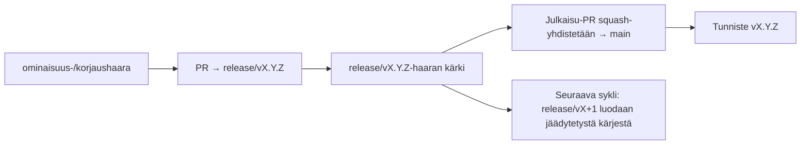

# Branching & Release Model (Suomi)

🌐 **Languages:** 🇺🇸 [English](../../../../ops/BRANCHING_MODEL.md) · 🇪🇹 [am](../../../am/docs/ops/BRANCHING_MODEL.md) · 🇸🇦 [ar](../../../ar/docs/ops/BRANCHING_MODEL.md) · 🇦🇿 [az](../../../az/docs/ops/BRANCHING_MODEL.md) · 🇧🇬 [bg](../../../bg/docs/ops/BRANCHING_MODEL.md) · 🇧🇩 [bn](../../../bn/docs/ops/BRANCHING_MODEL.md) · 🇨🇿 [cs](../../../cs/docs/ops/BRANCHING_MODEL.md) · 🇩🇰 [da](../../../da/docs/ops/BRANCHING_MODEL.md) · 🇩🇪 [de](../../../de/docs/ops/BRANCHING_MODEL.md) · 🇬🇷 [el](../../../el/docs/ops/BRANCHING_MODEL.md) · 🇪🇸 [es](../../../es/docs/ops/BRANCHING_MODEL.md) · 🇪🇪 [et](../../../et/docs/ops/BRANCHING_MODEL.md) · 🇮🇷 [fa](../../../fa/docs/ops/BRANCHING_MODEL.md) · 🇫🇷 [fr](../../../fr/docs/ops/BRANCHING_MODEL.md) · 🇮🇪 [ga](../../../ga/docs/ops/BRANCHING_MODEL.md) · 🇮🇳 [gu](../../../gu/docs/ops/BRANCHING_MODEL.md) · 🇳🇬 [ha](../../../ha/docs/ops/BRANCHING_MODEL.md) · 🇮🇱 [he](../../../he/docs/ops/BRANCHING_MODEL.md) · 🇮🇳 [hi](../../../hi/docs/ops/BRANCHING_MODEL.md) · 🇭🇷 [hr](../../../hr/docs/ops/BRANCHING_MODEL.md) · 🇭🇺 [hu](../../../hu/docs/ops/BRANCHING_MODEL.md) · 🇦🇲 [hy](../../../hy/docs/ops/BRANCHING_MODEL.md) · 🇮🇩 [id](../../../id/docs/ops/BRANCHING_MODEL.md) · 🇳🇬 [ig](../../../ig/docs/ops/BRANCHING_MODEL.md) · 🇮🇹 [it](../../../it/docs/ops/BRANCHING_MODEL.md) · 🇯🇵 [ja](../../../ja/docs/ops/BRANCHING_MODEL.md) · 🇬🇪 [ka](../../../ka/docs/ops/BRANCHING_MODEL.md) · 🇰🇭 [km](../../../km/docs/ops/BRANCHING_MODEL.md) · 🇮🇳 [kn](../../../kn/docs/ops/BRANCHING_MODEL.md) · 🇰🇷 [ko](../../../ko/docs/ops/BRANCHING_MODEL.md) · 🇱🇹 [lt](../../../lt/docs/ops/BRANCHING_MODEL.md) · 🇱🇻 [lv](../../../lv/docs/ops/BRANCHING_MODEL.md) · 🇮🇳 [ml](../../../ml/docs/ops/BRANCHING_MODEL.md) · 🇮🇳 [mr](../../../mr/docs/ops/BRANCHING_MODEL.md) · 🇲🇾 [ms](../../../ms/docs/ops/BRANCHING_MODEL.md) · 🇲🇹 [mt](../../../mt/docs/ops/BRANCHING_MODEL.md) · 🇲🇲 [my](../../../my/docs/ops/BRANCHING_MODEL.md) · 🇳🇵 [ne](../../../ne/docs/ops/BRANCHING_MODEL.md) · 🇳🇱 [nl](../../../nl/docs/ops/BRANCHING_MODEL.md) · 🇳🇴 [no](../../../no/docs/ops/BRANCHING_MODEL.md) · 🇮🇳 [or](../../../or/docs/ops/BRANCHING_MODEL.md) · 🇮🇳 [pa](../../../pa/docs/ops/BRANCHING_MODEL.md) · 🇵🇭 [phi](../../../phi/docs/ops/BRANCHING_MODEL.md) · 🇵🇱 [pl](../../../pl/docs/ops/BRANCHING_MODEL.md) · 🇵🇹 [pt](../../../pt/docs/ops/BRANCHING_MODEL.md) · 🇧🇷 [pt-BR](../../../pt-BR/docs/ops/BRANCHING_MODEL.md) · 🇷🇴 [ro](../../../ro/docs/ops/BRANCHING_MODEL.md) · 🇷🇺 [ru](../../../ru/docs/ops/BRANCHING_MODEL.md) · 🇱🇰 [si](../../../si/docs/ops/BRANCHING_MODEL.md) · 🇸🇰 [sk](../../../sk/docs/ops/BRANCHING_MODEL.md) · 🇸🇮 [sl](../../../sl/docs/ops/BRANCHING_MODEL.md) · 🇷🇸 [sr](../../../sr/docs/ops/BRANCHING_MODEL.md) · 🇸🇪 [sv](../../../sv/docs/ops/BRANCHING_MODEL.md) · 🇰🇪 [sw](../../../sw/docs/ops/BRANCHING_MODEL.md) · 🇮🇳 [ta](../../../ta/docs/ops/BRANCHING_MODEL.md) · 🇮🇳 [te](../../../te/docs/ops/BRANCHING_MODEL.md) · 🇹🇭 [th](../../../th/docs/ops/BRANCHING_MODEL.md) · 🇹🇷 [tr](../../../tr/docs/ops/BRANCHING_MODEL.md) · 🇺🇦 [uk-UA](../../../uk-UA/docs/ops/BRANCHING_MODEL.md) · 🇵🇰 [ur](../../../ur/docs/ops/BRANCHING_MODEL.md) · 🇺🇿 [uz](../../../uz/docs/ops/BRANCHING_MODEL.md) · 🇻🇳 [vi](../../../vi/docs/ops/BRANCHING_MODEL.md) · 🇳🇬 [yo](../../../yo/docs/ops/BRANCHING_MODEL.md) · 🇨🇳 [zh-CN](../../../zh-CN/docs/ops/BRANCHING_MODEL.md) · 🇹🇼 [zh-TW](../../../zh-TW/docs/ops/BRANCHING_MODEL.md)

---

OmniRoute käyttää **rinnakkaisten julkaisusyklien** mallia: aktiiviselle syklille on oma `release/vX.Y.Z`-haara, `main` sisältää julkaistun linjan, ja syklin julkaisuhetkellä luodaan muuttumaton `vX.Y.Z`-tunniste. On odotettua, että committeja päätyy sekä `release/*`-haaroihin _että_ `main`-haaraan — kyse ei ole sekaannuksesta.

Ylläpitäjille tarkoitetut yksityiskohdat ovat tiedostoissa `CLAUDE.md` (ehdoton sääntö #21) ja
[RELEASE_CHECKLIST.md](./RELEASE_CHECKLIST.md). Tämä sivu on julkinen,
kontribuoijille suunnattu yhteenveto.

## Yhdellä silmäyksellä

| Viite               | Rooli                                                                                         |
| ------------------- | --------------------------------------------------------------------------------------------- |
| `release/vX.Y.Z`    | **Aktiivinen sykli** — kyseisen version päivittäinen kehitys ja PR:ien yhdistäminen           |
| `main`              | **Julkaistu linja** — vastaanottaa syklin squash-yhdistämisellä, kun julkaisu toimitetaan     |
| `vX.Y.Z` (tunniste) | **Julkaisumerkki** — muuttumaton osoitin julkaistuun sisältöön, joka luodaan julkaisuhetkellä |



## Mihin haaraan PR:ni tulisi kohdistaa?

**Kohdista aktiiviseen `release/vX.Y.Z`-haaraan — älä `main`-haaraan.**

1. Etsi suurimman versionumeron omaava avoin `release/v*`-haara (esimerkki kirjoitushetkellä:
   `release/v3.8.49`).
2. Luo haarasi sen kärjestä (`git fetch` + checkout / rebase sen päälle).
3. Avaa PR siten, että **base = kyseinen `release/vX.Y.Z`**.

`main` ei ole päivittäinen integraatiohaara. `main`-haaraan kohdistetut PR:t
on yleensä kohdistettava uudelleen ennen yhdistämistä.

## Julkaisujäädytys (rinnakkaiset syklit)

Kun julkaisua sovitetaan yhteen, avataan `release-freeze`-merkinnällä varustettu
merkintäissue. Tämä **ei pysäytä kehitystä**:

- Jäädytetty `release/vX.Y.Z` kuuluu kyseisen julkaisun julkaisuvastaavalle.
- Seuraavan syklin `release/vX+1` luodaan jäädytetystä kärjestä, jotta kontribuoijat voivat jatkaa
  työnsä yhdistämistä.
- Avoimet PR:t, jotka edelleen kohdistuvat jäädytettyyn haaraan, tulee **kohdistaa uudelleen**
  aktiiviseen (suurimman versionumeron omaavaan) `release/v*`-haaraan.

Tarkista avoin jäädytys ennen kuin oletat haluamasi haaran olevan yhdistettävissä:

```bash
gh issue list --repo diegosouzapw/OmniRoute --label release-freeze --state open
```

Yhdistämismekaniikka (omistajan `queue`-merkintä → Mergify) on dokumentoitu tiedostossa
[MERGE_TRAIN.md](./MERGE_TRAIN.md).

## Miksi tarvitaan sekä haara että tunniste?

| Artefakti         | Elinkaari             | Tarkoitus                                                                            |
| ----------------- | --------------------- | ------------------------------------------------------------------------------------ |
| `release/vX.Y.Z`  | Käynnissä oleva sykli | Kerää katselmoidut PR:t, pidetään CI:n osalta vihreänä ja toimii PR:ien kohdehaarana |
| Tunniste `vX.Y.Z` | Ikuinen               | Merkitsee täsmälleen npm:ään / GitHub Releasesiin julkaistun sisällön                |

Haara on työpaja; tunniste on sinetöity paketti. `main`-haaraan tehdyn squash-yhdistämisen jälkeen
seuraava sykli jatkuu `release/vX+1`-haarassa odottamatta edellisen
julkaisu-PR:n valmistumista.

## Aiheeseen liittyvät dokumentit

- [CONTRIBUTING.md](../../CONTRIBUTING.md) — käyttöönotto, testit, PR-tarkistuslista
- [RELEASE_CHECKLIST.md](./RELEASE_CHECKLIST.md) — julkaisua edeltävä validointi
- [MERGE_TRAIN.md](./MERGE_TRAIN.md) — yhdistämisjono ja varajärjestelynä toimiva yhdistämisjuna
- [RELEASE_GREEN.md](./RELEASE_GREEN.md) — julkaisukärjen pitäminen vihreänä
