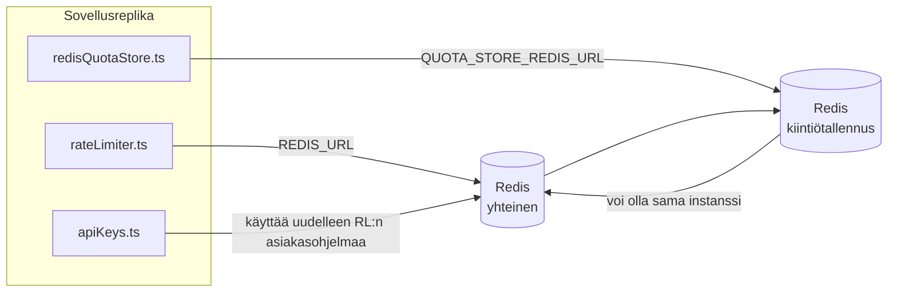

# Redis Production Configuration Guide (Suomi)

🌐 **Languages:** 🇺🇸 [English](../../../../ops/REDIS_PRODUCTION_CONFIG.md) · 🇪🇹 [am](../../../am/docs/ops/REDIS_PRODUCTION_CONFIG.md) · 🇸🇦 [ar](../../../ar/docs/ops/REDIS_PRODUCTION_CONFIG.md) · 🇦🇿 [az](../../../az/docs/ops/REDIS_PRODUCTION_CONFIG.md) · 🇧🇬 [bg](../../../bg/docs/ops/REDIS_PRODUCTION_CONFIG.md) · 🇧🇩 [bn](../../../bn/docs/ops/REDIS_PRODUCTION_CONFIG.md) · 🇨🇿 [cs](../../../cs/docs/ops/REDIS_PRODUCTION_CONFIG.md) · 🇩🇰 [da](../../../da/docs/ops/REDIS_PRODUCTION_CONFIG.md) · 🇩🇪 [de](../../../de/docs/ops/REDIS_PRODUCTION_CONFIG.md) · 🇬🇷 [el](../../../el/docs/ops/REDIS_PRODUCTION_CONFIG.md) · 🇪🇸 [es](../../../es/docs/ops/REDIS_PRODUCTION_CONFIG.md) · 🇪🇪 [et](../../../et/docs/ops/REDIS_PRODUCTION_CONFIG.md) · 🇮🇷 [fa](../../../fa/docs/ops/REDIS_PRODUCTION_CONFIG.md) · 🇫🇷 [fr](../../../fr/docs/ops/REDIS_PRODUCTION_CONFIG.md) · 🇮🇪 [ga](../../../ga/docs/ops/REDIS_PRODUCTION_CONFIG.md) · 🇮🇳 [gu](../../../gu/docs/ops/REDIS_PRODUCTION_CONFIG.md) · 🇳🇬 [ha](../../../ha/docs/ops/REDIS_PRODUCTION_CONFIG.md) · 🇮🇱 [he](../../../he/docs/ops/REDIS_PRODUCTION_CONFIG.md) · 🇮🇳 [hi](../../../hi/docs/ops/REDIS_PRODUCTION_CONFIG.md) · 🇭🇷 [hr](../../../hr/docs/ops/REDIS_PRODUCTION_CONFIG.md) · 🇭🇺 [hu](../../../hu/docs/ops/REDIS_PRODUCTION_CONFIG.md) · 🇦🇲 [hy](../../../hy/docs/ops/REDIS_PRODUCTION_CONFIG.md) · 🇮🇩 [id](../../../id/docs/ops/REDIS_PRODUCTION_CONFIG.md) · 🇳🇬 [ig](../../../ig/docs/ops/REDIS_PRODUCTION_CONFIG.md) · 🇮🇹 [it](../../../it/docs/ops/REDIS_PRODUCTION_CONFIG.md) · 🇯🇵 [ja](../../../ja/docs/ops/REDIS_PRODUCTION_CONFIG.md) · 🇬🇪 [ka](../../../ka/docs/ops/REDIS_PRODUCTION_CONFIG.md) · 🇰🇭 [km](../../../km/docs/ops/REDIS_PRODUCTION_CONFIG.md) · 🇮🇳 [kn](../../../kn/docs/ops/REDIS_PRODUCTION_CONFIG.md) · 🇰🇷 [ko](../../../ko/docs/ops/REDIS_PRODUCTION_CONFIG.md) · 🇱🇹 [lt](../../../lt/docs/ops/REDIS_PRODUCTION_CONFIG.md) · 🇱🇻 [lv](../../../lv/docs/ops/REDIS_PRODUCTION_CONFIG.md) · 🇮🇳 [ml](../../../ml/docs/ops/REDIS_PRODUCTION_CONFIG.md) · 🇮🇳 [mr](../../../mr/docs/ops/REDIS_PRODUCTION_CONFIG.md) · 🇲🇾 [ms](../../../ms/docs/ops/REDIS_PRODUCTION_CONFIG.md) · 🇲🇹 [mt](../../../mt/docs/ops/REDIS_PRODUCTION_CONFIG.md) · 🇲🇲 [my](../../../my/docs/ops/REDIS_PRODUCTION_CONFIG.md) · 🇳🇵 [ne](../../../ne/docs/ops/REDIS_PRODUCTION_CONFIG.md) · 🇳🇱 [nl](../../../nl/docs/ops/REDIS_PRODUCTION_CONFIG.md) · 🇳🇴 [no](../../../no/docs/ops/REDIS_PRODUCTION_CONFIG.md) · 🇮🇳 [or](../../../or/docs/ops/REDIS_PRODUCTION_CONFIG.md) · 🇮🇳 [pa](../../../pa/docs/ops/REDIS_PRODUCTION_CONFIG.md) · 🇵🇭 [phi](../../../phi/docs/ops/REDIS_PRODUCTION_CONFIG.md) · 🇵🇱 [pl](../../../pl/docs/ops/REDIS_PRODUCTION_CONFIG.md) · 🇵🇹 [pt](../../../pt/docs/ops/REDIS_PRODUCTION_CONFIG.md) · 🇧🇷 [pt-BR](../../../pt-BR/docs/ops/REDIS_PRODUCTION_CONFIG.md) · 🇷🇴 [ro](../../../ro/docs/ops/REDIS_PRODUCTION_CONFIG.md) · 🇷🇺 [ru](../../../ru/docs/ops/REDIS_PRODUCTION_CONFIG.md) · 🇱🇰 [si](../../../si/docs/ops/REDIS_PRODUCTION_CONFIG.md) · 🇸🇰 [sk](../../../sk/docs/ops/REDIS_PRODUCTION_CONFIG.md) · 🇸🇮 [sl](../../../sl/docs/ops/REDIS_PRODUCTION_CONFIG.md) · 🇷🇸 [sr](../../../sr/docs/ops/REDIS_PRODUCTION_CONFIG.md) · 🇸🇪 [sv](../../../sv/docs/ops/REDIS_PRODUCTION_CONFIG.md) · 🇰🇪 [sw](../../../sw/docs/ops/REDIS_PRODUCTION_CONFIG.md) · 🇮🇳 [ta](../../../ta/docs/ops/REDIS_PRODUCTION_CONFIG.md) · 🇮🇳 [te](../../../te/docs/ops/REDIS_PRODUCTION_CONFIG.md) · 🇹🇭 [th](../../../th/docs/ops/REDIS_PRODUCTION_CONFIG.md) · 🇹🇷 [tr](../../../tr/docs/ops/REDIS_PRODUCTION_CONFIG.md) · 🇺🇦 [uk-UA](../../../uk-UA/docs/ops/REDIS_PRODUCTION_CONFIG.md) · 🇵🇰 [ur](../../../ur/docs/ops/REDIS_PRODUCTION_CONFIG.md) · 🇺🇿 [uz](../../../uz/docs/ops/REDIS_PRODUCTION_CONFIG.md) · 🇻🇳 [vi](../../../vi/docs/ops/REDIS_PRODUCTION_CONFIG.md) · 🇳🇬 [yo](../../../yo/docs/ops/REDIS_PRODUCTION_CONFIG.md) · 🇨🇳 [zh-CN](../../../zh-CN/docs/ops/REDIS_PRODUCTION_CONFIG.md) · 🇹🇼 [zh-TW](../../../zh-TW/docs/ops/REDIS_PRODUCTION_CONFIG.md)

---

## Yleiskatsaus

Redis on OmniRoutessa **valinnainen, pehmeä riippuvuus** — sovellus jatkaa toimintaansa hallitusti
(käyttäen muistipohjaisia vararatkaisuja), kun Redis ei ole käytettävissä. Tuotannossa Redisin
virittäminen vähentää viivettä neljässä erillisessä työkuormassa:

| Työkuorma               | Ajuri                         | Asiakastehdas                                                  | Avainmalli                                                 |
| ----------------------- | ----------------------------- | -------------------------------------------------------------- | ---------------------------------------------------------- |
| Pyyntönopeuden rajoitus | `rateLimiter.ts`              | `getRedisClient()` — laiskasti alustettava `ioredis`-singleton | `<prefix>rl:*` Lua-atomiset pyyntönopeuden rajoitusikkunat |
| Todennusvälimuisti      | `apiKeys.ts`                  | Käyttää uudelleen `rateLimiter`-moduulin asiakasta             | `<prefix>auth:api_key:<sha256>` TTL-arvolla                |
| Kiintiötallennus        | `redisQuotaStore.ts`          | Erillinen `getRedisClient(url)`-singleton                      | `<prefix>quota:*`, määritettävissä instanssikohtaisesti    |
| Lämmityksen katkaisija  | `redisCircuitBreakerStore.ts` | Erillinen asiakas tiedostossa `circuitBreakerFactory.ts`       | `<prefix>warmup:cb:<connectionId>`                         |

Kaikki neljä työkuormaa käyttävät samaa nimiavaruuden etuliitettä, jotta OmniRoute voi toimia
samassa Redis-instanssissa muiden sovellusten kanssa (esim. `127.0.0.1:6379`). Katso
[Avainnimien nimiavaruudet](#key-namespacing).

---

## Nykyinen määritys (koodin oletusarvot)

| Asetus                                    | Arvo                                                                 | Sijainti                                                                              |
| ----------------------------------------- | -------------------------------------------------------------------- | ------------------------------------------------------------------------------------- |
| `REDIS_URL`-ympäristömuuttuja             | `redis://redis:6379` (compose), valinnainen                          | `rateLimiter.ts:5`, `.env.example`                                                    |
| `REDIS_KEY_PREFIX`-ympäristömuuttuja      | `omniroute:` (oletus)                                                | `rateLimiter.ts`, `redisQuotaStore.ts`, `redisCircuitBreakerStore.ts`, `.env.example` |
| `QUOTA_STORE_REDIS_URL`-ympäristömuuttuja | erillinen, voi poiketa muuttujasta `REDIS_URL`                       | `quota/storeFactory.ts`                                                               |
| `QUOTA_STORE_DRIVER`                      | `"sqlite"` (oletus), `"redis"` valinnainen                           | `quota/storeFactory.ts`                                                               |
| ioredis-asetus `maxRetriesPerRequest`     | `3`                                                                  | asiakkaan luonti tiedostossa `rateLimiter.ts`                                         |
| `enableReadyCheck`                        | ei asetettu (ioredis-oletus: `true`)                                 | —                                                                                     |
| `lazyConnect`                             | ei asetettu (ioredis-oletus: `false`)                                | —                                                                                     |
| `retryStrategy`                           | ei asetettu (ioredis-oletus: 200 ms:n perusviive, eksponentiaalinen) | —                                                                                     |
| TLS / salasana / tietokantaindeksi        | **ei määritetty**                                                    | —                                                                                     |
| Sentinel / Cluster                        | **ei määritetty** — vain itsenäinen yhden solmun kokoonpano          | —                                                                                     |

---

## Avainnimien nimiavaruudet

OmniRoute jakaa Redis-instanssin muiden samalla palvelimella suoritettavien palveluiden kanssa.
Ilman nimiavaruutta avaimet, kuten `auth:api_key:<sha256>` tai `rl:*`, voivat törmätä muiden
samaa Redis-instanssia käyttävien sovellusten avaimiin (tässä instanssissa Redis toimii osoitteessa
`127.0.0.1:6379` muiden palveluiden rinnalla).

Aseta `REDIS_KEY_PREFIX` tyhjästä poikkeavaksi merkkijonoksi, jotta **jokaisen** OmniRoute-avaimen
eteen lisätään etuliite:

```bash
# .env — kaikista OmniRoute-avaimista tulee omniroute:rl:*, omniroute:auth:*, omniroute:quota:*, omniroute:warmup:cb:*
REDIS_KEY_PREFIX=omniroute:
```

- **Oletus:** `omniroute:` (käytetään, kun `REDIS_KEY_PREFIX` on määrittämättä tai tyhjä).
- **Käyttökohteet:** pyyntönopeuden rajoitin + todennusvälimuisti (jaettu `ioredis`-asiakas
  `keyPrefix`-asetuksen kautta), kiintiötallennus (`KEY_PREFIX = "${REDIS_KEY_PREFIX}quota"`) ja
  lämmityksen katkaisija (`KEY_PREFIX = "${REDIS_KEY_PREFIX}warmup:cb:"`).
- **Etuliitteen muuttaminen**, kun Redisissä on jo avaimia, jättää vanhat avaimet orvoiksi (ne
  vanhenevat TTL:n / LRU:n kautta). Muutos on turvallinen eikä siirtoa tarvita. Ainoa poikkeus on
  kielletyksi merkityn yhteyden lämmityksen katkaisija-avain: se tallennetaan ilman TTL-arvoa, joten
  listaa jäljelle jääneet avaimet komennolla `redis-cli --scan --pattern '<old-prefix>warmup:cb:*'`
  ja poista ne.
- **ioredis-asetus `keyPrefix`** lisää etuliitteen automaattisesti kirjoitettaessa **ja** poistaa sen
  luettaessa, joten sovelluskoodi ei koskaan näe etuliitettä.

---

## Suositeltu tuotantoympäristön optimointi

### 1. Yhteyspoolin / asiakkaan asetukset (ioredis-`Redis`-konstruktori)

Nykyinen koodi luo yhden `new Redis(url)` -instanssin ilman mukautettuja asetuksia. Tuotantoympäristön
usean replikan käyttöönotossa välitä asiakastehdas koodissa tai kääri `getRedisClient()`:

```typescript
const redis = new Redis(REDIS_URL, {
  maxRetriesPerRequest: null, // ei uudelleenyritysten rajaa; anna retryStrategy-funktion päättää
  enableReadyCheck: true, // varmista palvelimen valmius ennen kutsujen hyväksymistä
  lazyConnect: true, // älä muodosta yhteyttä luonnin yhteydessä; odota ensimmäistä kutsua
  retryStrategy: (times) => {
    if (times > 10) return null; // luovuta 10 uudelleenyrityksen jälkeen → muodosta yhteys myöhemmin uudelleen
    return Math.min(times * 200, 5000); // 200 ms, 400 ms, …, enintään 5 s
  },
  enableAutoPipelining: true, // yhdistä samanaikaiset komennot yhdeksi TCP-kirjoitukseksi
  keepAlive: 10000, // TCP:n keep-alive 10 s:n välein
});
```

**Keskeiset kompromissit:**

- `maxRetriesPerRequest: null` + `retryStrategy` — suositeltava tuotantoympäristössä, jotta tilapäiset
  Redis-uudelleenkäynnistykset eivät aiheuta välittömästi jokaisen pyynnön epäonnistumista. Muistinsisäinen varajärjestelmä
  `checkRateLimit()`-funktiossa käsittelee virhepolun.
- `lazyConnect: true` — estää sen, että käynnistys riippuisi Redisin käytettävyydestä ennen kuin palvelin
  alkaa hyväksyä yhteyksiä.
- `enableAutoPipelining: true` — vähentää edestakaisia verkkokierroksia samanaikaisissa nopeusrajoituksen tarkistuksissa;
  hyödyllinen, kun yhdellä yhteydellä käsitellään yli 50 pyyntöä sekunnissa.

### 2. Redis-palvelimen määritykset (`redis.conf`)

```
# Muisti
maxmemory 80%                        # jätä tilaa käyttöjärjestelmän sivuvälimuistille
maxmemory-policy allkeys-lru         # poista vanhentuneita todennusvälimuistin merkintöjä kuormituksen kasvaessa

# Pysyvyys (valinnainen — OmniRoute on vikasietoinen ilman sitä)
save 300 1                           # luo tilannevedos vähintään 5 minuutin välein, jos ≥1 avain on muuttunut
appendonly no                        # AOF:ää ei tarvita; tiedot voidaan luoda uudelleen
appendfsync no                       # ei fsync-yleiskustannusta (RDB riittää)

# Verkko
timeout 0                            # ei käyttämättömän yhteyden katkaisua
tcp-keepalive 300                    # 5 minuutin keep-alive
tcp-backlog 511                      # yhteysjono kuormituspiikkejä varten

# Suorituskyky
hz 10                                # oletus; 100 viiveherkkiin käyttötapauksiin
activedefrag yes                     # eheytä automaattisesti, kun pirstoutuminen on >10 %
```

**Asetuksen `maxmemory-policy allkeys-lru` kompromissi:** Todennusvälimuistin merkintöjä voidaan poistaa
muistipaineen aikana. Tämä on turvallista — `setCachedApiKey` täyttää välimuistin aina uudelleen hutihaun jälkeen, ja
SQLite-varajärjestelmä on määräävä tietolähde. Nopeusrajoittimen Lua-komentosarja luo pieniä avaimia, jotka ovat
tarkoituksellisesti lyhytikäisiä.

### 3. Docker Compose -asetukset

Tuotantoympäristön compose-tiedosto (`docker-compose.prod.yml`) käyttää näköistiedostoa `redis:8.6.2-alpine`. Lisää:

```yaml
redis:
  image: redis:8.6.2-alpine
  command:
    [
      "redis-server",
      "--maxmemory",
      "512mb",
      "--maxmemory-policy",
      "allkeys-lru",
      "--activedefrag",
      "yes",
      "--save",
      "300 1",
    ]
  healthcheck:
    test: ["CMD", "redis-cli", "ping"]
    interval: 10s
    timeout: 3s
    retries: 3
    start_period: 5s
```

### 4. Usean instanssin käyttöön / skaalaukseen liittyvät näkökohdat

**Yksi Redis kaikille replikoille** — nopeusrajoittimen Lua-komentosarja riippuu yhdestä
määräävästä avainavaruudesta. Useiden Redis-instanssien käyttäminen replikoiden taustalla poistaisi atomisuuden
ja kaksinkertaistaisi kiintiön. Käytä yhtä Redisiä (tai vikasietoista Redis Sentinel -klusteria)
kaikille sovellusreplikoille.

**Yhteyksien määrä:** Jokainen sovellusreplika avaa **2 TCP-yhteyttä** Redisiin
(nopeusrajoittimen asiakas + kiintiötallennuksen asiakas). 10 replikalla → 20 yhteyttä, mikä on
selvästi Redis-oletusinstanssin 10 000 yhteyden enimmäismäärän sisällä.

### 5. Valvonta

Tarjoa seuraavat tiedot kuntotarkistuksen päätepisteen kautta:

```typescript
// src/app/api/monitoring/health/route.ts kutsuu jo rateLimiter-funktioita
// Lisää Redis-kohtaiset tarkistukset:
//   1. PING-viive ioredis-kirjaston .ping()-kutsulla
//   2. Muistinkäyttö komennolla INFO memory
//   3. Yhteyksien määrä komennolla INFO clients
//   4. maxmemory-policy-asetuksen osumaprosentti (evicted_keys / keyspace_hits)
```

Seurattavat keskeiset mittarit:

- **Poistetut avaimet / s** — jos arvo on jatkuvasti muu kuin nolla, kasvata `maxmemory`-arvoa
- **Estetyt asiakkaat** — nollasta poikkeava arvo viittaa hitaisiin Lua-komentosarjoihin tai suureen kilpailuun
- **Hylätyt yhteydet** — yhteysraja saavutettu; harvinaista 20 yhteydellä

---

## Arkkitehtuurikaavio



---

## Viitteet

| Tiedosto                           | Tarkoitus                                                                                       |
| ---------------------------------- | ----------------------------------------------------------------------------------------------- |
| `src/shared/utils/rateLimiter.ts`  | Ensisijainen Redis-asiakasohjelma, Lua-nopeusrajoitusskripti ja muistinsisäinen varajärjestelmä |
| `src/lib/db/apiKeys.ts`            | Todennusvälimuisti — Redis→SQLite-varajärjestelmä                                               |
| `src/lib/quota/redisQuotaStore.ts` | Erillinen Redis-asiakasohjelma valinnaista kiintiötallennusta varten                            |
| `src/lib/quota/storeFactory.ts`    | Vaihtaa `sqlite`- ja `redis`-kiintiöajureiden välillä                                           |
| `docker-compose.prod.yml`          | Tuotannon Redis-säilö (image `redis:8.6.2-alpine`)                                              |
| `.env.example`                     | Redis-ympäristömuuttujien dokumentaatio                                                         |
| `src/app/api/local/redis/`         | API-reitit kehityssäilön orkestrointiin                                                         |
| `bin/cli/commands/redis.mjs`       | CLI-komennot kehityssäilön orkestrointiin                                                       |
