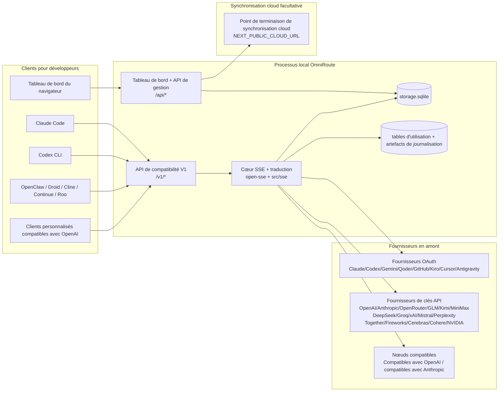
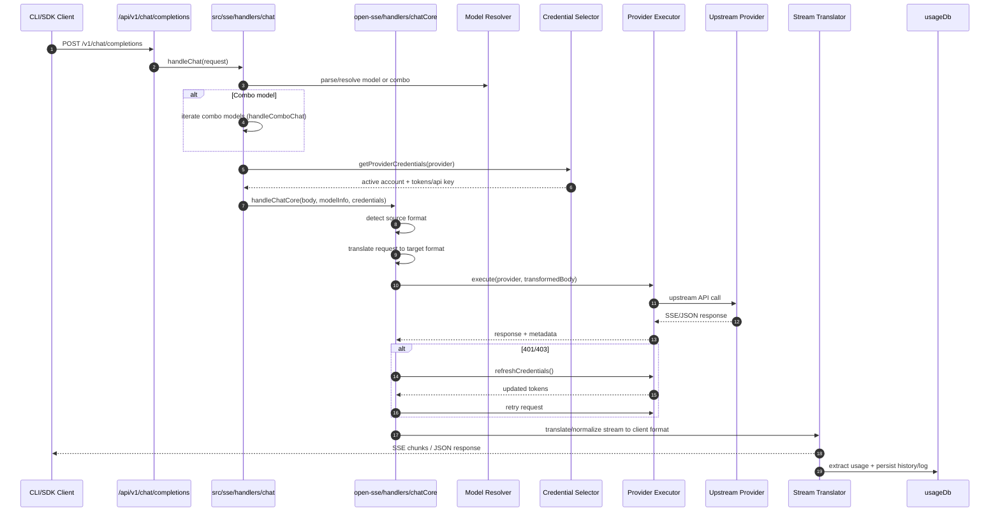
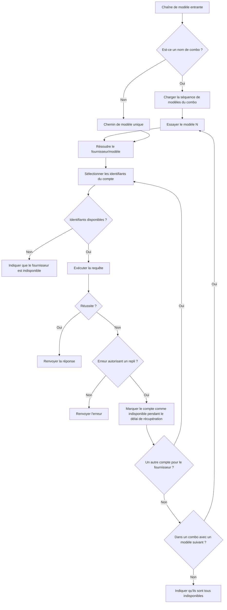
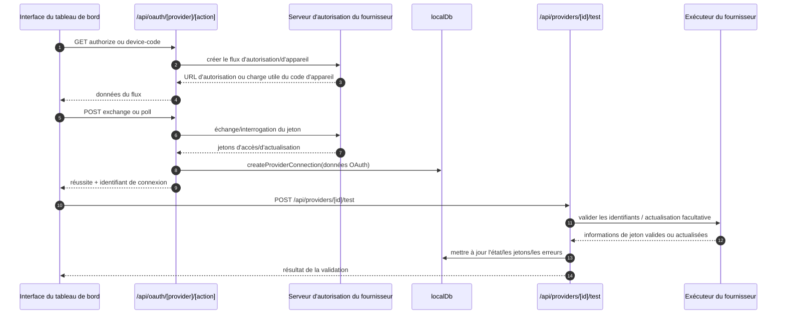
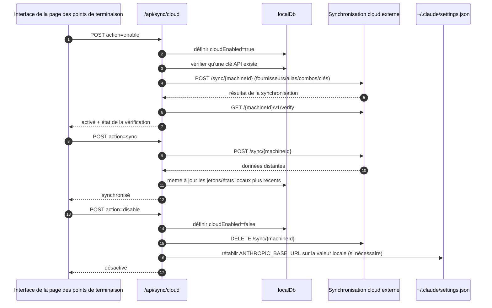
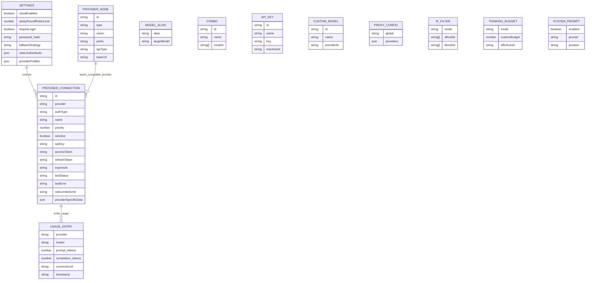
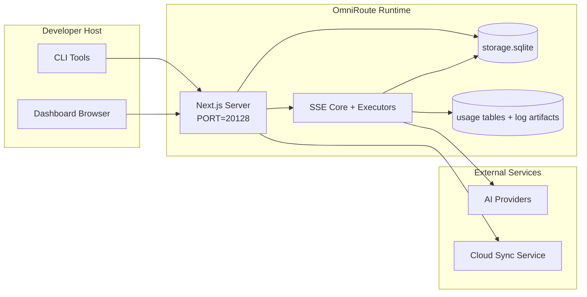

# OmniRoute Architecture (Français)

🌐 **Languages:** 🇺🇸 [English](../../../../architecture/ARCHITECTURE.md) · 🇪🇹 [am](../../../am/docs/architecture/ARCHITECTURE.md) · 🇸🇦 [ar](../../../ar/docs/architecture/ARCHITECTURE.md) · 🇦🇿 [az](../../../az/docs/architecture/ARCHITECTURE.md) · 🇧🇬 [bg](../../../bg/docs/architecture/ARCHITECTURE.md) · 🇧🇩 [bn](../../../bn/docs/architecture/ARCHITECTURE.md) · 🇨🇿 [cs](../../../cs/docs/architecture/ARCHITECTURE.md) · 🇩🇰 [da](../../../da/docs/architecture/ARCHITECTURE.md) · 🇩🇪 [de](../../../de/docs/architecture/ARCHITECTURE.md) · 🇬🇷 [el](../../../el/docs/architecture/ARCHITECTURE.md) · 🇪🇸 [es](../../../es/docs/architecture/ARCHITECTURE.md) · 🇪🇪 [et](../../../et/docs/architecture/ARCHITECTURE.md) · 🇮🇷 [fa](../../../fa/docs/architecture/ARCHITECTURE.md) · 🇫🇮 [fi](../../../fi/docs/architecture/ARCHITECTURE.md) · 🇮🇪 [ga](../../../ga/docs/architecture/ARCHITECTURE.md) · 🇮🇳 [gu](../../../gu/docs/architecture/ARCHITECTURE.md) · 🇳🇬 [ha](../../../ha/docs/architecture/ARCHITECTURE.md) · 🇮🇱 [he](../../../he/docs/architecture/ARCHITECTURE.md) · 🇮🇳 [hi](../../../hi/docs/architecture/ARCHITECTURE.md) · 🇭🇷 [hr](../../../hr/docs/architecture/ARCHITECTURE.md) · 🇭🇺 [hu](../../../hu/docs/architecture/ARCHITECTURE.md) · 🇦🇲 [hy](../../../hy/docs/architecture/ARCHITECTURE.md) · 🇮🇩 [id](../../../id/docs/architecture/ARCHITECTURE.md) · 🇳🇬 [ig](../../../ig/docs/architecture/ARCHITECTURE.md) · 🇮🇹 [it](../../../it/docs/architecture/ARCHITECTURE.md) · 🇯🇵 [ja](../../../ja/docs/architecture/ARCHITECTURE.md) · 🇬🇪 [ka](../../../ka/docs/architecture/ARCHITECTURE.md) · 🇰🇭 [km](../../../km/docs/architecture/ARCHITECTURE.md) · 🇮🇳 [kn](../../../kn/docs/architecture/ARCHITECTURE.md) · 🇰🇷 [ko](../../../ko/docs/architecture/ARCHITECTURE.md) · 🇱🇹 [lt](../../../lt/docs/architecture/ARCHITECTURE.md) · 🇱🇻 [lv](../../../lv/docs/architecture/ARCHITECTURE.md) · 🇮🇳 [ml](../../../ml/docs/architecture/ARCHITECTURE.md) · 🇮🇳 [mr](../../../mr/docs/architecture/ARCHITECTURE.md) · 🇲🇾 [ms](../../../ms/docs/architecture/ARCHITECTURE.md) · 🇲🇹 [mt](../../../mt/docs/architecture/ARCHITECTURE.md) · 🇲🇲 [my](../../../my/docs/architecture/ARCHITECTURE.md) · 🇳🇵 [ne](../../../ne/docs/architecture/ARCHITECTURE.md) · 🇳🇱 [nl](../../../nl/docs/architecture/ARCHITECTURE.md) · 🇳🇴 [no](../../../no/docs/architecture/ARCHITECTURE.md) · 🇮🇳 [or](../../../or/docs/architecture/ARCHITECTURE.md) · 🇮🇳 [pa](../../../pa/docs/architecture/ARCHITECTURE.md) · 🇵🇭 [phi](../../../phi/docs/architecture/ARCHITECTURE.md) · 🇵🇱 [pl](../../../pl/docs/architecture/ARCHITECTURE.md) · 🇵🇹 [pt](../../../pt/docs/architecture/ARCHITECTURE.md) · 🇧🇷 [pt-BR](../../../pt-BR/docs/architecture/ARCHITECTURE.md) · 🇷🇴 [ro](../../../ro/docs/architecture/ARCHITECTURE.md) · 🇷🇺 [ru](../../../ru/docs/architecture/ARCHITECTURE.md) · 🇱🇰 [si](../../../si/docs/architecture/ARCHITECTURE.md) · 🇸🇰 [sk](../../../sk/docs/architecture/ARCHITECTURE.md) · 🇸🇮 [sl](../../../sl/docs/architecture/ARCHITECTURE.md) · 🇷🇸 [sr](../../../sr/docs/architecture/ARCHITECTURE.md) · 🇸🇪 [sv](../../../sv/docs/architecture/ARCHITECTURE.md) · 🇰🇪 [sw](../../../sw/docs/architecture/ARCHITECTURE.md) · 🇮🇳 [ta](../../../ta/docs/architecture/ARCHITECTURE.md) · 🇮🇳 [te](../../../te/docs/architecture/ARCHITECTURE.md) · 🇹🇭 [th](../../../th/docs/architecture/ARCHITECTURE.md) · 🇹🇷 [tr](../../../tr/docs/architecture/ARCHITECTURE.md) · 🇺🇦 [uk-UA](../../../uk-UA/docs/architecture/ARCHITECTURE.md) · 🇵🇰 [ur](../../../ur/docs/architecture/ARCHITECTURE.md) · 🇺🇿 [uz](../../../uz/docs/architecture/ARCHITECTURE.md) · 🇻🇳 [vi](../../../vi/docs/architecture/ARCHITECTURE.md) · 🇳🇬 [yo](../../../yo/docs/architecture/ARCHITECTURE.md) · 🇨🇳 [zh-CN](../../../zh-CN/docs/architecture/ARCHITECTURE.md) · 🇹🇼 [zh-TW](../../../zh-TW/docs/architecture/ARCHITECTURE.md)

---

🌐 **Languages:** 🇺🇸 [English](../../../../architecture/ARCHITECTURE.md) · 🇪🇹 [am](../../../am/docs/architecture/ARCHITECTURE.md) · 🇸🇦 [ar](../../../ar/docs/architecture/ARCHITECTURE.md) · 🇦🇿 [az](../../../az/docs/architecture/ARCHITECTURE.md) · 🇧🇬 [bg](../../../bg/docs/architecture/ARCHITECTURE.md) · 🇧🇩 [bn](../../../bn/docs/architecture/ARCHITECTURE.md) · 🇨🇿 [cs](../../../cs/docs/architecture/ARCHITECTURE.md) · 🇩🇰 [da](../../../da/docs/architecture/ARCHITECTURE.md) · 🇩🇪 [de](../../../de/docs/architecture/ARCHITECTURE.md) · 🇬🇷 [el](../../../el/docs/architecture/ARCHITECTURE.md) · 🇪🇸 [es](../../../es/docs/architecture/ARCHITECTURE.md) · 🇪🇪 [et](../../../et/docs/architecture/ARCHITECTURE.md) · 🇮🇷 [fa](../../../fa/docs/architecture/ARCHITECTURE.md) · 🇫🇮 [fi](../../../fi/docs/architecture/ARCHITECTURE.md) · 🇮🇪 [ga](../../../ga/docs/architecture/ARCHITECTURE.md) · 🇮🇳 [gu](../../../gu/docs/architecture/ARCHITECTURE.md) · 🇳🇬 [ha](../../../ha/docs/architecture/ARCHITECTURE.md) · 🇮🇱 [he](../../../he/docs/architecture/ARCHITECTURE.md) · 🇮🇳 [hi](../../../hi/docs/architecture/ARCHITECTURE.md) · 🇭🇷 [hr](../../../hr/docs/architecture/ARCHITECTURE.md) · 🇭🇺 [hu](../../../hu/docs/architecture/ARCHITECTURE.md) · 🇦🇲 [hy](../../../hy/docs/architecture/ARCHITECTURE.md) · 🇮🇩 [id](../../../id/docs/architecture/ARCHITECTURE.md) · 🇳🇬 [ig](../../../ig/docs/architecture/ARCHITECTURE.md) · 🇮🇹 [it](../../../it/docs/architecture/ARCHITECTURE.md) · 🇯🇵 [ja](../../../ja/docs/architecture/ARCHITECTURE.md) · 🇬🇪 [ka](../../../ka/docs/architecture/ARCHITECTURE.md) · 🇰🇭 [km](../../../km/docs/architecture/ARCHITECTURE.md) · 🇮🇳 [kn](../../../kn/docs/architecture/ARCHITECTURE.md) · 🇰🇷 [ko](../../../ko/docs/architecture/ARCHITECTURE.md) · 🇱🇹 [lt](../../../lt/docs/architecture/ARCHITECTURE.md) · 🇱🇻 [lv](../../../lv/docs/architecture/ARCHITECTURE.md) · 🇮🇳 [ml](../../../ml/docs/architecture/ARCHITECTURE.md) · 🇮🇳 [mr](../../../mr/docs/architecture/ARCHITECTURE.md) · 🇲🇾 [ms](../../../ms/docs/architecture/ARCHITECTURE.md) · 🇲🇹 [mt](../../../mt/docs/architecture/ARCHITECTURE.md) · 🇲🇲 [my](../../../my/docs/architecture/ARCHITECTURE.md) · 🇳🇵 [ne](../../../ne/docs/architecture/ARCHITECTURE.md) · 🇳🇱 [nl](../../../nl/docs/architecture/ARCHITECTURE.md) · 🇳🇴 [no](../../../no/docs/architecture/ARCHITECTURE.md) · 🇮🇳 [or](../../../or/docs/architecture/ARCHITECTURE.md) · 🇮🇳 [pa](../../../pa/docs/architecture/ARCHITECTURE.md) · 🇵🇭 [phi](../../../phi/docs/architecture/ARCHITECTURE.md) · 🇵🇱 [pl](../../../pl/docs/architecture/ARCHITECTURE.md) · 🇵🇹 [pt](../../../pt/docs/architecture/ARCHITECTURE.md) · 🇧🇷 [pt-BR](../../../pt-BR/docs/architecture/ARCHITECTURE.md) · 🇷🇴 [ro](../../../ro/docs/architecture/ARCHITECTURE.md) · 🇷🇺 [ru](../../../ru/docs/architecture/ARCHITECTURE.md) · 🇱🇰 [si](../../../si/docs/architecture/ARCHITECTURE.md) · 🇸🇰 [sk](../../../sk/docs/architecture/ARCHITECTURE.md) · 🇸🇮 [sl](../../../sl/docs/architecture/ARCHITECTURE.md) · 🇷🇸 [sr](../../../sr/docs/architecture/ARCHITECTURE.md) · 🇸🇪 [sv](../../../sv/docs/architecture/ARCHITECTURE.md) · 🇰🇪 [sw](../../../sw/docs/architecture/ARCHITECTURE.md) · 🇮🇳 [ta](../../../ta/docs/architecture/ARCHITECTURE.md) · 🇮🇳 [te](../../../te/docs/architecture/ARCHITECTURE.md) · 🇹🇭 [th](../../../th/docs/architecture/ARCHITECTURE.md) · 🇹🇷 [tr](../../../tr/docs/architecture/ARCHITECTURE.md) · 🇺🇦 [uk-UA](../../../uk-UA/docs/architecture/ARCHITECTURE.md) · 🇵🇰 [ur](../../../ur/docs/architecture/ARCHITECTURE.md) · 🇺🇿 [uz](../../../uz/docs/architecture/ARCHITECTURE.md) · 🇻🇳 [vi](../../../vi/docs/architecture/ARCHITECTURE.md) · 🇳🇬 [yo](../../../yo/docs/architecture/ARCHITECTURE.md) · 🇨🇳 [zh-CN](../../../zh-CN/docs/architecture/ARCHITECTURE.md) · 🇹🇼 [zh-TW](../../../zh-TW/docs/architecture/ARCHITECTURE.md)

_Dernière mise à jour : 2026-06-28_

## Résumé exécutif

OmniRoute est une passerelle locale de routage d’IA avec tableau de bord, développée avec Next.js.
Elle fournit un point de terminaison unique compatible avec OpenAI (`/v1/*`) et achemine le trafic vers plusieurs fournisseurs en amont, avec traduction, repli, actualisation des jetons et suivi de l’utilisation.

Fonctionnalités principales :

- Surface d’API compatible avec OpenAI pour les CLI/outils (355 fournisseurs, 108 exécuteurs)
- Traduction des requêtes/réponses entre les formats des fournisseurs
- Repli par combinaison de modèles (séquence multimodèle)
- Étapes de combinaison structurées (`provider + model + connection`) avec ordonnancement à l’exécution selon `compositeTiers`
- Repli au niveau des comptes (plusieurs comptes par fournisseur)
- Vérification préalable des quotas et sélection de compte P2C tenant compte des quotas dans le flux de discussion principal
- Gestion des connexions aux fournisseurs par OAuth et clé API (22 modules de fournisseurs OAuth)
- Génération d’embeddings via `/v1/embeddings` (18 fournisseurs)
- Génération d’images via `/v1/images/generations` (plus de 10 fournisseurs, plus de 20 modèles)
- Transcription audio via `/v1/audio/transcriptions` (18 fournisseurs)
- Synthèse vocale via `/v1/audio/speech` (24 fournisseurs intégrés)
- Génération de vidéos via `/v1/videos/generations` (ComfyUI + SD WebUI)
- Génération de musique via `/v1/music/generations` (ComfyUI)
- Recherche Web via `/v1/search` (20 fournisseurs)
- Modération via `/v1/moderations`
- Reclassement via `/v1/rerank`
- Analyse des balises de réflexion (`<think>...</think>`) pour les modèles de raisonnement
- Assainissement des réponses pour une compatibilité stricte avec le SDK OpenAI
- Normalisation des rôles (developer→system, system→user) pour assurer la compatibilité entre fournisseurs
- Conversion des sorties structurées (json_schema → Gemini responseSchema)
- Persistance locale des fournisseurs, clés, alias, combinaisons, paramètres et tarifs (122 modules de base de données)
- Suivi de l’utilisation et des coûts, ainsi que journalisation des requêtes
- Synchronisation cloud facultative pour synchroniser l’état entre plusieurs appareils
- Liste d’autorisation/liste de blocage d’adresses IP pour le contrôle d’accès à l’API
- Gestion du budget de réflexion (transmission directe/automatique/personnalisée/adaptative)
- Injection globale d’invite système
- Suivi et empreinte des sessions
- Limitation de débit avancée par compte avec des profils propres aux fournisseurs
- Modèle de disjoncteur pour la résilience des fournisseurs
- Protection contre les afflux simultanés grâce au verrouillage par mutex
- Cache de déduplication des requêtes basé sur les signatures
- Couche de domaine : règles de coût, politique de repli, politique de verrouillage
- Relais de contexte : résumés de transfert de session pour assurer la continuité lors de la rotation des comptes
- Persistance de l’état du domaine (cache SQLite avec écriture immédiate pour les replis, budgets, verrouillages et disjoncteurs)
- Moteur de politiques pour l’évaluation centralisée des requêtes (verrouillage → budget → repli)
- Télémétrie des requêtes avec agrégation des latences p50/p95/p99
- Télémétrie des cibles de combinaison et historique de leur état via `combo_execution_key` / `combo_step_id`
- Identifiant de corrélation (X-Request-Id) pour le traçage de bout en bout
- Journalisation d’audit de conformité avec désactivation possible par clé API
- Cadre d’évaluation pour l’assurance qualité des LLM
- Tableau de bord d’état avec statut en temps réel des disjoncteurs des fournisseurs
- Serveur MCP (110 outils) avec 3 transports (stdio/SSE/HTTP Streamable)
- Serveur A2A (JSON-RPC 2.0 + SSE) avec compétences et cycle de vie des tâches
- Système de mémoire (extraction, injection, récupération, synthèse)
- Système de compétences (registre, exécuteur, bac à sable, compétences intégrées)
- Proxy MITM avec gestion des certificats et du DNS
- Middleware de protection contre l’injection d’invites
- Pipeline de compression d’invites avec Caveman, RTK, pipelines empilés, combinaisons de compression, packs linguistiques et analyses
- Registre ACP (Agent Communication Protocol)
- Fournisseurs OAuth modulaires (22 modules individuels sous `src/lib/oauth/providers/`)
- Scripts de désinstallation/désinstallation complète
- Action de réparation de l’environnement OAuth
- Passerelle WebSocket pour les clients WS compatibles avec OpenAI (`/v1/ws`)
- Gestion des jetons de synchronisation (émission/révocation, téléchargement d’un lot de configuration versionné par ETag)
- Préréglage de fournisseur de premier ordre GLM Thinking (`glmt`)
- Comptage hybride des jetons (`/messages/count_tokens` côté fournisseur avec estimation de secours)
- Initialisation automatique des alias de modèles (plus de 30 normalisations de dialectes interproxys au démarrage)
- Récupération sortante sécurisée avec protection SSRF, blocage des URL privées et nouvelles tentatives configurables
- Nouvelles tentatives de discussion tenant compte du délai de récupération, avec `requestRetry` et `maxRetryIntervalSec` configurables
- Validation de l’environnement d’exécution avec Zod au démarrage
- Audit de conformité v2 avec pagination, événements CRUD des fournisseurs et journalisation des validations bloquées par la protection SSRF

Modèle d’exécution principal :

- Les routes d’application Next.js sous `src/app/api/*` implémentent à la fois les API du tableau de bord et les API de compatibilité
- Un cœur partagé de SSE/routage dans `src/sse/*` + `open-sse/*` gère l’exécution des fournisseurs, la traduction, la diffusion en continu, le repli et l’utilisation

## Diagrammes de référence

Les sources Mermaid canoniques et versionnées de la plateforme v3.8.0 se trouvent dans
[`docs/diagrams/`](../diagrams/README.md). Deux d’entre elles sont reproduites ci-dessous à titre de repère ;
les autres sont accessibles depuis les guides propres à leur domaine.


> Source : [diagrams/request-pipeline.mmd](../diagrams/request-pipeline.mmd)


> Source : [diagrams/resilience-3layers.mmd](../diagrams/resilience-3layers.mmd) — également référencée depuis
> [RESILIENCE_GUIDE.md](./RESILIENCE_GUIDE.md) et la référence sur la résilience de `CLAUDE.md`.

## Périmètre et limites

### Inclus dans le périmètre

- Environnement d’exécution de la passerelle locale
- API de gestion du tableau de bord
- Authentification auprès des fournisseurs et actualisation des jetons
- Traduction des requêtes et diffusion en continu via SSE
- État local et persistance de l’utilisation
- Orchestration facultative de la synchronisation avec le cloud

### Hors périmètre

- Implémentation du service cloud derrière `NEXT_PUBLIC_CLOUD_URL`
- SLA/plan de contrôle du fournisseur en dehors du processus local
- Binaires CLI externes eux-mêmes (Claude CLI, Codex CLI, etc.)

## Interface du tableau de bord (actuelle)

Pages principales sous `src/app/(dashboard)/dashboard/` :

- `/dashboard` — démarrage rapide et vue d’ensemble des fournisseurs
- `/dashboard/endpoint` — onglets du proxy de point de terminaison, MCP, A2A et des points de terminaison d’API
- `/dashboard/providers` — connexions et identifiants des fournisseurs
- `/dashboard/combos` — stratégies de combinaisons, modèles, générateur par étapes, règles de routage des modèles, ordre manuel persistant
- `/dashboard/auto-combo` — moteur de combinaisons automatiques : pondérations des scores, packs de modes, préréglages d’usines virtuelles, télémétrie
- `/dashboard/costs` — agrégation des coûts et visibilité sur la tarification
- `/dashboard/analytics` — analyse de l’utilisation, évaluations, état des cibles de combinaisons
- `/dashboard/limits` — contrôles des quotas et des débits
- `/dashboard/cli-tools` — prise en main de la CLI, détection de l’environnement d’exécution, génération de la configuration
- `/dashboard/agents` — agents ACP détectés et enregistrement d’agents personnalisés
- `/dashboard/cloud-agents` — tâches des agents hébergés dans le cloud (Codex Cloud, Devin, Jules) et cycle de vie des tâches
- `/dashboard/skills` — registre des compétences A2A, exécution en bac à sable, catalogue de compétences intégrées
- `/dashboard/memory` — inspection et récupération de la mémoire conversationnelle persistante
- `/dashboard/webhooks` — abonnements aux webhooks sortants, rotation des secrets, statistiques de nouvelles tentatives
- `/dashboard/batch` — soumission de tâches par lots et progression
- `/dashboard/cache` — statistiques du cache avec lecture au travers et du cache de raisonnement, contrôles d’éviction
- `/dashboard/playground` — espace de test conversationnel interactif utilisant n’importe quelle combinaison ou n’importe quel modèle configuré
- `/dashboard/changelog` — visionneuse du journal des modifications intégrée à l’application (affiche `CHANGELOG.md`)
- `/dashboard/system` — diagnostics de l’environnement d’exécution, informations de version, interface de validation de l’environnement
- `/dashboard/onboarding` — assistant de configuration initiale pour les nouvelles installations
- `/dashboard/media` — espace de test pour les images, les vidéos et la musique
- `/dashboard/search-tools` — test des fournisseurs de recherche et historique
- `/dashboard/health` — disponibilité, disjoncteurs, limites de débit, sessions avec surveillance des quotas
- `/dashboard/logs` — journaux des requêtes, du proxy, d’audit et de la console
- `/dashboard/settings` — onglets des paramètres système (généraux, routage, valeurs par défaut des combinaisons, etc.)
- `/dashboard/context/caveman` — règles de compression Caveman, packs linguistiques, aperçu et mode de sortie
- `/dashboard/context/rtk` — filtres RTK de sortie des commandes, aperçu et paramètres de sécurité de l’environnement d’exécution
- `/dashboard/context/combos` — pipelines de compression nommés affectés aux combinaisons de routage
- `/dashboard/translator` — inspection du traducteur et aperçu de la conversion du format des requêtes
- `/dashboard/audit` — navigateur du journal d’audit de conformité avec pagination et métadonnées structurées
- `/dashboard/usage` — navigateur de l’utilisation par requête lié à `usage_history`
- `/dashboard/compression` — analyse de la compression, statistiques et affectation des pipelines
- `/dashboard/api-manager` — cycle de vie des clés d’API et autorisations des modèles

## Contexte système de haut niveau



## Composants principaux d'exécution

## 1) Couche d'API et de routage (routes d'application Next.js)

Répertoires principaux :

- `src/app/api/v1/*` et `src/app/api/v1beta/*` pour les API de compatibilité
- `src/app/api/*` pour les API de gestion/configuration
- Les réécritures Next dans `next.config.mjs` associent `/v1/*` à `/api/v1/*`

Routes de compatibilité importantes :

- `src/app/api/v1/chat/completions/route.ts`
- `src/app/api/v1/messages/route.ts`
- `src/app/api/v1/responses/route.ts`
- `src/app/api/v1/models/route.ts` — inclut les modèles personnalisés avec `custom: true`
- `src/app/api/v1/embeddings/route.ts` — génération d'embeddings (6 fournisseurs)
- `src/app/api/v1/images/generations/route.ts` — génération d'images (plus de 4 fournisseurs, dont Antigravity/Nebius)
- `src/app/api/v1/messages/count_tokens/route.ts`
- `src/app/api/v1/providers/[provider]/chat/completions/route.ts` — chat dédié par fournisseur
- `src/app/api/v1/providers/[provider]/embeddings/route.ts` — embeddings dédiés par fournisseur
- `src/app/api/v1/providers/[provider]/images/generations/route.ts` — images dédiées par fournisseur
- `src/app/api/v1beta/models/route.ts`
- `src/app/api/v1beta/models/[...path]/route.ts`

Domaines de gestion :

- Authentification/paramètres : `src/app/api/auth/*`, `src/app/api/settings/*`
- Fournisseurs/connexions : `src/app/api/providers*`
- Nœuds de fournisseurs : `src/app/api/provider-nodes*`
- Modèles personnalisés : `src/app/api/provider-models` (GET/POST/DELETE)
- Catalogue de modèles : `src/app/api/models/route.ts` (GET)
- Configuration du proxy : `src/app/api/settings/proxy` (GET/PUT/DELETE) + `src/app/api/settings/proxy/test` (POST)
- OAuth : `src/app/api/oauth/*`
- Clés/alias/combinaisons/tarification : `src/app/api/keys*`, `src/app/api/models/alias`, `src/app/api/combos*`, `src/app/api/pricing`
- Utilisation : `src/app/api/usage/*`
- Synchronisation/cloud : `src/app/api/sync/*`, `src/app/api/cloud/*`
- Outils d'assistance CLI : `src/app/api/cli-tools/*`
- Filtre IP : `src/app/api/settings/ip-filter` (GET/PUT)
- Budget de réflexion : `src/app/api/settings/thinking-budget` (GET/PUT)
- Invite système : `src/app/api/settings/system-prompt` (GET/PUT)
- Compression : `src/app/api/settings/compression`, `src/app/api/compression/*` et
  `src/app/api/context/*`
- Sessions : `src/app/api/sessions` (GET)
- Limites de débit : `src/app/api/rate-limits` (GET)
- Résilience : `src/app/api/resilience` (GET/PATCH) — file d'attente des requêtes, délai de récupération des connexions, disjoncteur des fournisseurs, configuration de l'attente du délai de récupération
- Réinitialisation de la résilience : `src/app/api/resilience/reset` (POST) — réinitialise les disjoncteurs des fournisseurs
- Statistiques du cache : `src/app/api/cache/stats` (GET/DELETE)
- Télémétrie : `src/app/api/telemetry/summary` (GET)
- Budget : `src/app/api/usage/budget` (GET/POST)
- Chaînes de repli : `src/app/api/fallback/chains` (GET/POST/DELETE)
- Audit de conformité : `src/app/api/compliance/audit-log` (GET, avec pagination + métadonnées structurées)
- Évaluations : `src/app/api/evals` (GET/POST), `src/app/api/evals/[suiteId]` (GET)
- Politiques : `src/app/api/policies` (GET/POST)
- Jetons de synchronisation : `src/app/api/sync/tokens` (GET/POST), `src/app/api/sync/tokens/[id]` (GET/DELETE)
- Lot de configuration : `src/app/api/sync/bundle` (GET, instantané des paramètres/fournisseurs/combinaisons/clés versionné par ETag)
- WebSocket : `src/app/api/v1/ws/route.ts` — gestionnaire de mise à niveau pour les clients WS compatibles avec OpenAI

## 2) SSE + cœur de traduction

Modules du flux principal :

- Point d’entrée : `src/sse/handlers/chat.ts`
- Orchestration principale : `open-sse/handlers/chatCore.ts`
- Adaptateurs d’exécution des fournisseurs : `open-sse/executors/*`
- Détection du format/configuration des fournisseurs : `open-sse/services/provider.ts`
- Analyse/résolution des modèles : `src/sse/services/model.ts`, `open-sse/services/model.ts`
- Logique de repli des comptes : `open-sse/services/accountFallback.ts`
- Registre de traduction : `open-sse/translator/index.ts`
- Transformations des flux : `open-sse/utils/stream.ts`, `open-sse/utils/streamHandler.ts`
- Extraction/normalisation de l’utilisation : `open-sse/utils/usageTracking.ts`
- Analyseur de balises de réflexion : `open-sse/utils/thinkTagParser.ts`
- Gestionnaire d’embeddings : `open-sse/handlers/embeddings.ts`
- Registre des fournisseurs d’embeddings : `open-sse/config/embeddingRegistry.ts`
- Gestionnaire de génération d’images : `open-sse/handlers/imageGeneration.ts`
- Registre des fournisseurs d’images : `open-sse/config/imageRegistry.ts`
- Assainissement des réponses : `open-sse/handlers/responseSanitizer.ts`
- Normalisation des rôles : `open-sse/services/roleNormalizer.ts`

Services (logique métier) :

- Sélection/notation des comptes : `open-sse/services/accountSelector.ts`
- Gestion du cycle de vie du contexte : `open-sse/services/contextManager.ts`
- Application du filtrage IP : `open-sse/services/ipFilter.ts`
- Suivi des sessions : `open-sse/services/sessionManager.ts`
- Déduplication des requêtes : `open-sse/services/signatureCache.ts`
- Injection de l’invite système : `open-sse/services/systemPrompt.ts`
- Gestion du budget de réflexion : `open-sse/services/thinkingBudget.ts`
- Routage des modèles avec caractères génériques : `open-sse/services/wildcardRouter.ts`
- Gestion des limites de débit : `open-sse/services/rateLimitManager.ts`
- Disjoncteur : `src/shared/utils/circuitBreaker.ts`
- Transfert de contexte : `open-sse/services/contextHandoff.ts` — génération et injection d’un résumé de transfert pour la stratégie de relais de contexte
- Compression : `open-sse/services/compression/*` — compression proactive avant la traduction destinée au fournisseur ;
  inclut les règles Caveman, les filtres RTK, les pipelines empilés, les combinaisons de compression, les statistiques et la validation
- Récupérateur de quota Codex : `open-sse/services/codexQuotaFetcher.ts` — récupère le quota Codex pour les décisions de transfert par relais de contexte
- Nouvelle tentative tenant compte du délai de récupération : `src/sse/services/cooldownAwareRetry.ts` — nouvelles tentatives par modèle avec délai de récupération et paramètres configurables `requestRetry` / `maxRetryIntervalSec`
- Récupération sortante sécurisée : `src/shared/network/safeOutboundFetch.ts` — récupération protégée des fournisseurs/modèles avec protection SSRF, blocage des URL privées, nouvelles tentatives et délai d’expiration
- Protection des URL sortantes : `src/shared/network/outboundUrlGuard.ts` — valide les URL des fournisseurs par rapport aux plages CIDR privées/localhost
- Valeurs par défaut des requêtes aux fournisseurs : `open-sse/services/providerRequestDefaults.ts` — valeurs par défaut de niveau fournisseur pour `maxTokens`, `temperature`, `thinkingBudgetTokens`
- Constantes du fournisseur GLM : `open-sse/config/glmProvider.ts` — modèles GLM, URL de quota et délai d’expiration/valeurs par défaut GLMT partagés
- Service en amont Antigravity : `open-sse/config/antigravityUpstream.ts` — constantes de l’URL de base et du chemin de découverte
- Constantes du client Codex : `open-sse/config/codexClient.ts` — valeurs versionnées de l’agent utilisateur et de la version du client
- Initialisation des alias de modèles : `src/lib/modelAliasSeed.ts` — initialise plus de 30 alias de dialectes interproxys au démarrage

Modules de la couche domaine :

- Règles de coût/budgets : `src/domain/costRules.ts`
- Politique de repli : `src/domain/fallbackPolicy.ts`
- Résolveur de combinaisons : `src/domain/comboResolver.ts`
- Politique de verrouillage : `src/domain/lockoutPolicy.ts`
- Moteur de politiques : `src/domain/policyEngine.ts` — évaluation centralisée verrouillage → budget → repli
- Catalogue des codes d’erreur : `src/shared/constants/errorCodes.ts`
- Identifiant de requête : `src/shared/utils/requestId.ts`
- Délai d’expiration de la récupération : `src/shared/utils/fetchTimeout.ts`
- Télémétrie des requêtes : `src/shared/utils/requestTelemetry.ts`
- Conformité/audit : `src/lib/compliance/index.ts`
- Exécuteur d’évaluations : `src/lib/evals/evalRunner.ts`
- Persistance de l’état du domaine : `src/lib/db/domainState.ts` — opérations CRUD SQLite pour les chaînes de repli, les budgets, l’historique des coûts, l’état de verrouillage et les disjoncteurs

Modules des fournisseurs OAuth (22 fichiers individuels sous `src/lib/oauth/providers/`) :

- Index du registre : `src/lib/oauth/providers/index.ts`
- Fournisseurs individuels : `agy.ts`, `antigravity.ts`, `claude.ts`, `cline.ts`, `codebuddy-cn.ts`, `codex.ts`, `cursor.ts`, `devin-desktop.ts`, `ghe-copilot.ts`, `github.ts`, `gitlab-duo.ts`, `grok-cli-oauth.ts`, `grok-cli.ts`, `kilocode.ts`, `kimi-coding.ts`, `kiro.ts`, `openference.ts`, `qoder.ts`, `trae.ts`, `xai-oauth.ts`, `zed-hosted.ts`, `zed.ts`
- Enveloppe légère : `src/lib/oauth/providers.ts` — réexporte depuis les modules individuels

## 5) Services intégrés (v3.8.4)

OmniRoute peut installer, superviser et acheminer les requêtes vers des processus locaux d’outils d’IA
appelés **services intégrés**. Cinq sont fournis : 9Router, CLIProxyAPI, Bifrost, Mux et Dario.

Couches de l’architecture :

- **Interface utilisateur** (`/dashboard/providers/services`) — page à deux onglets avec des contrôles du cycle de vie,
  la diffusion des journaux en temps réel, la gestion des clés API et, pour 9Router, une interface utilisateur native intégrée via
  un proxy inverse interne.
- **API** (`/api/services/{name}/*`) — 11 points de terminaison pour 9Router, 10 pour CLIProxyAPI, 8 chacun pour Bifrost / Mux / Dario,
  tous classés **LOCAL_ONLY** (règle stricte nº 17). Un point de terminaison SSE partagé `GET /api/services/[name]/logs`
  dessert les deux services.
- **Superviseur** (`src/lib/services/`) — la classe générique `ServiceSupervisor` encapsule
  `child_process.spawn`, maintient un tampon circulaire de 5 Mo pour la diffusion SSE des journaux, une boucle
  de vérification de l’état de santé, un verrou d’opération atomique et un arrêt progressif SIGTERM→SIGKILL.
  `bootstrap.ts` initialise tous les services configurés au démarrage du processus.
- **Fournisseur/exécuteur** (`open-sse/executors/ninerouter.ts`) — 9Router est exposé comme
  un véritable fournisseur. Les modèles sont préfixés par `9router/{sub}/{model}` et synchronisés toutes les 5 min
  depuis le point de terminaison `/v1/models` de 9Router.

Présentation détaillée : `docs/frameworks/EMBEDDED-SERVICES.md`

## Sous-systèmes principaux (v3.8.0)

### A. Moteur Auto Combo

Auto Combo évalue et sélectionne dynamiquement les cibles de routage au moment de la requête, plutôt que
de s’appuyer sur une définition de combo statique. Il alimente la famille de préfixes de modèles `auto/*`.

- Point d’entrée du moteur : `open-sse/services/autoCombo/` (`autoComboEngine.ts`,
  `scoringEngine.ts`, `virtualFactory.ts`, `modePacks.ts`)
- Résolveur : `src/domain/comboResolver.ts` (détection automatique du préfixe `auto/`)
- Tableau de bord : `/dashboard/auto-combo`
- Télémétrie : table SQLite `auto_combo_decisions`

Fonctionnalités clés :

- **19 stratégies de routage** (priorité, pondération, remplissage prioritaire, tourniquet, P2C, aléatoire,
  moins utilisé, optimisation des coûts, prise en compte de la réinitialisation, fenêtre de réinitialisation, marge disponible, aléatoire strict,
  **auto**, lkgp, optimisation du contexte, relais de contexte, **fusion**, plus un chemin de repli) —
  auto est l’ajout phare de v3.8.0 ; `fusion` (distribution en éventail vers un panel + synthèse par un juge,
  `open-sse/services/fusion.ts`) est nouveau dans v3.8.36.
- **Évaluation à 16 facteurs** : quota, état de santé, coût inverse, latence inverse, adéquation à la tâche et
  dix autres. Le tableau de référence des facteurs et de leurs pondérations par défaut se trouve dans
  [`docs/routing/AUTO-COMBO.md`](../routing/AUTO-COMBO.md) — le reproduire ici créerait
  un deuxième emplacement susceptible de devenir obsolète.
- **Fabrique virtuelle** matérialisant des combos éphémères lorsqu’aucun combo nommé correspondant
  n’existe, en sélectionnant des candidats parmi les connexions actives et saines des fournisseurs.
- **Préfixes automatiques** : `auto/coding`, `auto/cheap`, `auto/fast`, `auto/offline`,
  `auto/smart`, `auto/lkgp` — chacun reposant sur un profil de pondération ajusté.
- **6 packs de modes** : `ship-fast`, `cost-saver`, `quality-first`, `offline-friendly`,
  `reliability-first` et `chaos-mode` — configurations de pondération prédéfinies, utilisables depuis
  le tableau de bord. (À ne pas confondre avec les préfixes `auto/*` ci-dessus, qui sont
  des variantes appliquées au moment de la requête.)

Pour tous les détails algorithmiques (formules des facteurs, ajustement des pondérations), consultez
[`docs/routing/AUTO-COMBO.md`](../routing/AUTO-COMBO.md).

### B. Agents cloud

Cloud Agents encapsule des plateformes tierces hébergées d’agents de code (Codex Cloud, Devin,
Jules) derrière un cycle de vie uniforme des tâches, adossé à une base de données. Tous les points de terminaison de création et de consultation
des tâches nécessitent une authentification de gestion.

- Racine du module : `src/lib/cloudAgent/` (`baseAgent.ts`, `registry.ts`, `api.ts`,
  `types.ts`, `db.ts`, ainsi que des sous-répertoires propres à chaque agent sous `agents/`)
- Implémentations propres à chaque agent : `agents/codex/`, `agents/devin/`, `agents/jules/`
- Points de terminaison publics : `/api/v1/agents/tasks/*` (lister/créer/obtenir/annuler)
- Points de terminaison de gestion : `/api/cloud/*` (provisionnement, état, traitement par lots)
- Tableau de bord : `/dashboard/cloud-agents`
- Stockage : table `cloud_agent_tasks`

Pour les détails du provisionnement et d’OAuth propres à chaque agent, consultez
[`docs/frameworks/CLOUD_AGENT.md`](../frameworks/CLOUD_AGENT.md).

### C. Garde-fous

Le module de garde-fous est une couche de middleware rechargeable à chaud qui inspecte les requêtes
et les réponses à la recherche de données personnelles, d’injections de prompt et de contenu visuel dangereux. Les violations
interrompent immédiatement la requête avec le code HTTP **503** accompagné d’un code d’erreur structuré, permettant
aux appelants en aval de réessayer ou de suivre une autre branche.

- Racine du module : `src/lib/guardrails/` (`base.ts`, `registry.ts`, `piiMasker.ts`,
  `promptInjection.ts`, `visionBridge.ts`, `visionBridgeHelpers.ts`)
- Rechargement à chaud : le registre surveille les modifications de configuration et reconstruit la chaîne sur place
- Points d’intégration : entrée du gestionnaire de discussion, gestionnaire de génération d’images, assainisseur de réponses
- Contrat HTTP : les violations sont signalées par `503` avec `error.code = "GUARDRAIL_VIOLATION"`

Pour la création des ensembles de règles et l’ajustement des seuils, consultez
[`docs/security/GUARDRAILS.md`](../security/GUARDRAILS.md).

### D. Couche de domaine

L’espace de noms `src/domain/` centralise les décisions de politique afin que les gestionnaires de routes n’aient pas
à assembler eux-mêmes la logique de verrouillage, de budget et de repli.

- Moteur de politiques : `src/domain/policyEngine.ts` — point d’entrée unique pour
  l’évaluation préalable à l’exécution (ordre : verrouillage → budget → repli)
- Règles de coût : `src/domain/costRules.ts`
- Politique de repli : `src/domain/fallbackPolicy.ts`
- Politique de verrouillage : `src/domain/lockoutPolicy.ts`
- Routage basé sur les balises : `src/domain/tagRouter.ts`
- Résolveur de combos : `src/domain/comboResolver.ts` — résout les noms de combos, les préfixes auto/\*
  et les cibles de modèles avec caractères génériques en plans d’exécution concrets
- Jointure des règles de connexion et de modèle : `src/domain/connectionModelRules.ts`
- Instantanés de disponibilité des modèles : `src/domain/modelAvailability.ts`
- Suivi de l’expiration des fournisseurs : `src/domain/providerExpiration.ts`
- Cache des quotas : `src/domain/quotaCache.ts`
- État de dégradation : `src/domain/degradation.ts`
- Audit de configuration : `src/domain/configAudit.ts`
- Générateur de métadonnées de réponse OmniRoute : `src/domain/omnirouteResponseMeta.ts`
- Sous-système d’évaluation : `src/domain/assessment/` — tâches d’évaluation périodiques

### E. Pipeline d’autorisation

Le pipeline d’autorisation classe chaque requête entrante et applique la chaîne
de politiques appropriée avant de la transmettre.

- Point d’entrée du pipeline : `src/server/authz/pipeline.ts`
- Classificateur de requêtes : `src/server/authz/classify.ts` — distingue les routes
  publiques de compatibilité des routes de gestion
- Inventaire des routes publiques : `src/shared/constants/publicApiRoutes.ts`
- Politiques : `src/server/authz/policies/` — prédicats composables
  (`requireApiKey`, `requireManagement`, `requireFreshAuth`, etc.)
- Utilitaires d’en-têtes : `src/server/authz/headers.ts`
- Assistant d’assertion : `src/server/authz/assertAuth.ts`
- Contexte de requête : `src/server/authz/context.ts`

Les routes publiques et les routes de gestion sont strictement séparées : les API
d’agent/de délai de récupération et les mutations de fournisseurs nécessitent une
authentification de gestion (HTTP 401 si elle est absente).

Pour consulter l’intégralité des règles de classification des routes, voir
[`docs/architecture/AUTHZ_GUIDE.md`](./AUTHZ_GUIDE.md).

### F. Machine à états finis du workflow et routeur tenant compte des tâches

Un routeur piloté par une machine à états finis, superposé à la sélection des
combinaisons, dirige le trafic en fonction de l’étape détectée du workflow
(planification, exécution, révision) et de l’affinité avec les tâches en arrière-plan.

- Machine à états finis du workflow : `open-sse/services/workflowFSM.ts`
- Routeur tenant compte des tâches : `open-sse/services/taskAwareRouter.ts`
- Détecteur de tâches en arrière-plan : `open-sse/services/backgroundTaskDetector.ts`
- Classificateur d’intention : `open-sse/services/intentClassifier.ts`

Les transitions de la machine à états finis alimentent le calcul du score d’Auto Combo,
en privilégiant les modèles moins coûteux pour les tâches d’arrière-plan/d’automatisation
et les modèles plus performants pour les tours interactifs de planification/révision.

### G. Résilience propre aux fournisseurs

Plusieurs fournisseurs proposent des modules dédiés de résilience et de furtivité qui
s’appuient sur les couches globales de coupe-circuit, de délai de récupération des
connexions et de verrouillage des modèles :

- Moteur Antigravity 429 : `open-sse/services/antigravity429Engine.ts` (effectue une
  rotation de l’identité, nettoie les en-têtes de réponse et pilote le suivi des crédits/versions via
  `antigravityCredits.ts`, `antigravityHeaderScrub.ts`, `antigravityHeaders.ts`,
  `antigravityIdentity.ts`, `antigravityVersion.ts`)
- Politique de quota ModelScope : `open-sse/services/modelscopePolicy.ts`
- CCH (Compatibility Channel Handshake) de Claude Code : `open-sse/services/claudeCodeCCH.ts`,
  ainsi que `claudeCodeCompatible.ts`, `claudeCodeConstraints.ts`, `claudeCodeExtraRemap.ts`,
  `claudeCodeToolRemapper.ts`
- Mise en forme de l’empreinte Claude Code : `open-sse/services/claudeCodeFingerprint.ts`
- Obfuscation de Claude Code : `open-sse/services/claudeCodeObfuscation.ts`

Pour consulter le guide complet sur la furtivité et les recommandations opérationnelles,
voir `docs/security/STEALTH_GUIDE.md` (git ; non compilé dans `/docs`).

### H. Webhooks, cache de raisonnement et cache de lecture

- **Webhooks** — envoi sortant des événements de fournisseur/compte/tâche.
  - Répartiteur : `src/lib/webhookDispatcher.ts`
  - Stockage : table SQLite `webhooks` (via `src/lib/db/webhooks.ts`)
  - Tableau de bord : `/dashboard/webhooks` (abonnements, secrets, historique des nouvelles tentatives)
  - Pour la taxonomie des événements et la sémantique des nouvelles tentatives, voir [`docs/frameworks/WEBHOOKS.md`](../frameworks/WEBHOOKS.md).
- **Cache de raisonnement** — blocs de raisonnement rejouables pour les fournisseurs qui émettent
  des jetons de réflexion (Claude, GLMT, etc.), afin que les tours consécutifs puissent éviter de recommencer le raisonnement.
  - Couche de base de données : `src/lib/db/reasoningCache.ts`
  - Couche de service : `open-sse/services/reasoningCache.ts`
  - Pour la sémantique de la relecture, voir [`docs/routing/REASONING_REPLAY.md`](../routing/REASONING_REPLAY.md).
- **Cache de lecture** — cache de réponses à courte durée de vie, indexé par signature et utilisé pour
  regrouper les nouvelles tentatives identiques provenant de SDK en amont défectueux.
  - Couche de base de données : `src/lib/db/readCache.ts`
  - Point de terminaison des statistiques : `GET /api/cache/stats`, tableau de bord à l’adresse `/dashboard/cache`

## 3) Couche de persistance

Base de données d’état principale (SQLite) :

- Infrastructure principale : `src/lib/db/core.ts` (better-sqlite3, migrations, WAL)
- Accès à la base de données : importez directement les modules `src/lib/db/*` spécifiques (l’ancien module d’agrégation `localDb.ts` a été supprimé)
- Fichier : `${DATA_DIR}/storage.sqlite` (ou `$XDG_CONFIG_HOME/omniroute/storage.sqlite` si défini, sinon `~/.omniroute/storage.sqlite`)
- Entités (tables + espaces de noms KV) : providerConnections, providerNodes, modelAliases, combos, apiKeys, settings, pricing, **customModels**, **proxyConfig**, **ipFilter**, **thinkingBudget**, **systemPrompt**

Persistance de l’utilisation :

- Façade : `src/lib/usageDb.ts` (modules décomposés dans `src/lib/usage/*`)
- Tables SQLite dans `storage.sqlite` : `usage_history`, `call_logs`, `proxy_logs`
- Les artefacts de fichiers facultatifs sont conservés à des fins de compatibilité et de débogage (`${DATA_DIR}/log.txt`, `${DATA_DIR}/call_logs/`, `<repo>/logs/...`)
- Les anciens fichiers JSON sont migrés vers SQLite par les migrations de démarrage lorsqu’ils sont présents

Base de données d’état des domaines (SQLite) :

- `src/lib/db/domainState.ts` — opérations CRUD pour l’état des domaines
- Tables (créées dans `src/lib/db/core.ts`) : `domain_fallback_chains`, `domain_budgets`, `domain_cost_history`, `domain_lockout_state`, `domain_circuit_breakers`
- Modèle de cache avec écriture immédiate : les Maps en mémoire font autorité pendant l’exécution ; les mutations sont écrites de manière synchrone dans SQLite ; l’état est restauré depuis la base de données lors d’un démarrage à froid

## 4) Surfaces d’authentification et de sécurité

- Authentification du tableau de bord par cookie : `src/proxy.ts`, `src/app/api/auth/login/route.ts`
- Génération/vérification des clés API : `src/shared/utils/apiKey.ts`
- Secrets des fournisseurs conservés dans les entrées `providerConnections`
- Prise en charge des proxys sortants via `open-sse/utils/proxyFetch.ts` (variables d’environnement) et `open-sse/utils/networkProxy.ts` (configurable par fournisseur ou globalement)
- Protection SSRF / des URL sortantes : `src/shared/network/outboundUrlGuard.ts` — bloque les plages privées, de bouclage et link-local pour tous les appels aux fournisseurs
- Validation de l’environnement à l’exécution : `src/lib/env/runtimeEnv.ts` — schéma Zod pour toutes les variables d’environnement, avec affichage des erreurs/avertissements au démarrage
- Jetons de synchronisation : `src/lib/db/syncTokens.ts` — jetons à portée limitée pour les points de terminaison de téléchargement des ensembles de configuration ; stockés dans la table SQLite `sync_tokens` (migration `024_create_sync_tokens.sql`)
- Authentification lors de la négociation WebSocket : `src/lib/ws/handshake.ts` — valide les requêtes de mise à niveau WS au moyen d’une clé API ou d’un cookie de session

## 5) Synchronisation cloud

- Initialisation du planificateur : `src/lib/initCloudSync.ts`, `src/shared/services/initializeCloudSync.ts`, `src/shared/services/modelSyncScheduler.ts`
- Tâche périodique : `src/shared/services/cloudSyncScheduler.ts`
- Tâche périodique : `src/shared/services/modelSyncScheduler.ts`
- Route de contrôle : `src/app/api/sync/cloud/route.ts`

## Cycle de vie d’une requête (`/v1/chat/completions`)



## Flux de repli des combos et des comptes



Les décisions de repli sont pilotées par `open-sse/services/accountFallback.ts` à l'aide des codes d'état et d'heuristiques fondées sur les messages d'erreur. Le routage des combos ajoute une protection supplémentaire : les erreurs 400 limitées au fournisseur, telles que les échecs de blocage de contenu en amont et de validation des rôles, sont traitées comme des échecs propres au modèle afin que les cibles suivantes du combo puissent toujours être exécutées.

## Cycle de vie de l'intégration OAuth et de l'actualisation des jetons



L'actualisation pendant le trafic réel est exécutée dans `open-sse/handlers/chatCore.ts` via la méthode `refreshCredentials()` de l'exécuteur.

## Cycle de vie de la synchronisation cloud (Activation / Synchronisation / Désactivation)



La synchronisation périodique est déclenchée par `CloudSyncScheduler` lorsque le cloud est activé.

## Modèle de données et cartographie du stockage



Fichiers de stockage physiques :

- base de données d’exécution principale : `${DATA_DIR}/storage.sqlite`
- lignes du journal des requêtes : `${DATA_DIR}/log.txt` (artefact de compatibilité/débogage)
- archives structurées des charges utiles d’appel : `${DATA_DIR}/call_logs/`
- sessions facultatives de débogage du traducteur/des requêtes : `<repo>/logs/...`

## Topologie de déploiement



## Cartographie des modules (critique pour la prise de décision)

### Modules de routage et d’API

- `src/app/api/v1/*`, `src/app/api/v1beta/*` : API de compatibilité
- `src/app/api/v1/providers/[provider]/*` : routes dédiées à chaque fournisseur (chat, embeddings, images)
- `src/app/api/providers*` : opérations CRUD, validation et tests des fournisseurs
- `src/app/api/provider-nodes*` : gestion des nœuds compatibles personnalisés
- `src/app/api/provider-models` : gestion des modèles personnalisés (CRUD)
- `src/app/api/models/route.ts` : API du catalogue de modèles (alias + modèles personnalisés)
- `src/app/api/oauth/*` : flux OAuth/par code d’appareil
- `src/app/api/keys*` : cycle de vie des clés API locales
- `src/app/api/models/alias` : gestion des alias
- `src/app/api/combos*` : gestion des combinaisons de repli
- `src/app/api/pricing` : remplacements tarifaires pour le calcul des coûts
- `src/app/api/settings/proxy` : configuration du proxy (GET/PUT/DELETE)
- `src/app/api/settings/proxy/test` : test de connectivité sortante du proxy (POST)
- `src/app/api/usage/*` : API d’utilisation et de journaux
- `src/app/api/sync/*` + `src/app/api/cloud/*` : synchronisation avec le cloud et utilitaires orientés cloud
- `src/app/api/cli-tools/*` : outils locaux d’écriture/de vérification de la configuration CLI
- `src/app/api/settings/ip-filter` : listes d’autorisation/de blocage des adresses IP (GET/PUT)
- `src/app/api/settings/thinking-budget` : configuration du budget de jetons de réflexion (GET/PUT)
- `src/app/api/settings/system-prompt` : invite système globale (GET/PUT)
- `src/app/api/settings/compression` : paramètres globaux de compression (GET/PUT)
- `src/app/api/compression/*` : aperçu de la compression, métadonnées des règles et packs linguistiques
- `src/app/api/context/caveman/config` : alias des paramètres Caveman (GET/PUT)
- `src/app/api/context/rtk/*` : configuration RTK, catalogue de filtres, point de terminaison de test et récupération de la sortie brute
- `src/app/api/context/combos*` : opérations CRUD sur les combinaisons de compression et affectations des combinaisons de routage
- `src/app/api/context/analytics` : alias des analyses de compression
- `src/app/api/sessions` : liste des sessions actives (GET)
- `src/app/api/rate-limits` : état des limites de débit par compte (GET)
- `src/app/api/sync/tokens` : opérations CRUD sur les jetons de synchronisation (GET/POST)
- `src/app/api/sync/tokens/[id]` : récupération/suppression d’un jeton de synchronisation (GET/DELETE)
- `src/app/api/sync/bundle` : téléchargement d’un paquet de configuration (GET, gestion des versions par ETag)
- `src/app/api/v1/ws` : gestionnaire de mise à niveau WebSocket pour les clients WS compatibles avec OpenAI

### Cœur du routage et de l’exécution

- `src/sse/handlers/chat.ts` : analyse des requêtes, gestion des combinaisons, boucle de sélection des comptes
- `open-sse/handlers/chatCore.ts` : traduction, répartition vers les exécuteurs, gestion des nouvelles tentatives/actualisations, configuration du flux
- `open-sse/executors/*` : comportement réseau et de format propre à chaque fournisseur

### Registre de traduction et convertisseurs de formats

- `open-sse/translator/index.ts` : registre et orchestration des traducteurs
- Traducteurs de requêtes : `open-sse/translator/request/*` (9 modules — `antigravity-to-openai`, `claude-to-gemini`, `claude-to-openai`, `gemini-to-openai`, `openai-responses`, `openai-to-claude`, `openai-to-cursor`, `openai-to-gemini`, `openai-to-kiro`)
- Traducteurs de réponses : `open-sse/translator/response/*` (11 modules — `claude-to-openai`, `cursor-to-openai`, `gemini-to-claude`, `gemini-to-openai`, `kiro-to-openai`, `openai-responses`, `openai-to-antigravity`, `openai-to-claude`, `openai-to-gemini`, `openai-to-gemini-sse`, `responsesToolItem`)
- Utilitaires : `open-sse/translator/helpers/*` (12 modules — `claudeHelper`, `geminiHelper`, `geminiToolsSanitizer`, `jsonUtil`, `markdownBoundary`, `maxTokensHelper`, `openaiHelper`, `responsesApiHelper`, `schemaCoercion`, `strictSystemHoist`, `toolCallHelper`, `toolCallShim`)
- Constantes de format : `open-sse/translator/formats.ts`
- Amorçage et registre : `open-sse/translator/bootstrap.ts`, `open-sse/translator/registry.ts`
- Utilitaires de format d’image : `open-sse/translator/image/`

### Persistance

- `src/lib/db/*` : configuration/état persistants et persistance du domaine dans SQLite
- `src/lib/db/*` : importer directement les modules spécifiques — aucun fichier d’agrégation (l’ancienne couche de réexportation `localDb.ts` a été supprimée)
- `src/lib/usageDb.ts` : façade pour l’historique d’utilisation et les journaux d’appels reposant sur les tables SQLite

## Couverture des exécuteurs de fournisseurs (patron de stratégie)

Chaque fournisseur dispose d’un exécuteur spécialisé qui étend `BaseExecutor` (dans `open-sse/executors/base.ts`), lequel fournit la construction des URL, la création des en-têtes, les nouvelles tentatives avec un délai exponentiel, des hooks d’actualisation des identifiants et la méthode d’orchestration `execute()`.

| Exécuteur                 | Fournisseur(s)                                                                                                                                              | Traitement spécial                                                                                        |
| ------------------------- | ----------------------------------------------------------------------------------------------------------------------------------------------------------- | --------------------------------------------------------------------------------------------------------- |
| `DefaultExecutor`         | OpenAI, Claude, Gemini, Qwen, OpenRouter, GLM, Kimi, MiniMax, DeepSeek, Groq, xAI, Mistral, Perplexity, Together, Fireworks, Cerebras, Cohere, NVIDIA, etc. | Configuration dynamique de l’URL et des en-têtes selon le fournisseur                                     |
| `AntigravityExecutor`     | Google Antigravity                                                                                                                                          | ID de projet/session personnalisés, analyse de Retry-After, masquage des 429                              |
| `AzureOpenAIExecutor`     | Azure OpenAI                                                                                                                                                | Routage basé sur le déploiement, application du paramètre api-version                                     |
| `BlackboxWebExecutor`     | Blackbox AI (mode web)                                                                                                                                      | Rétro-ingénierie de session web avec émulation d’empreinte TLS                                            |
| `ClaudeIdentityExecutor`  | Claude.ai (chemin CCH)                                                                                                                                      | Pipelines de contraintes et de remappage des outils, façonnage de l’empreinte                             |
| `CliProxyApiExecutor`     | Fournisseurs compatibles avec CLIProxyAPI                                                                                                                   | Authentification et gestion du protocole personnalisées                                                   |
| `CloudflareAiExecutor`    | Cloudflare Workers AI                                                                                                                                       | Injection de l’ID de compte, suivi de l’utilisation basé sur Neurons                                      |
| `CodexExecutor`           | OpenAI Codex                                                                                                                                                | Injecte des instructions système, impose l’effort de raisonnement                                         |
| `ChatGptWebCodexExecutor` | ChatGPT Web (Codex)                                                                                                                                         | Passerelle vers l’API Responses basée sur une session de navigateur, avec épinglage des fils et des tours |
| `CommandCodeExecutor`     | Command Code                                                                                                                                                | OAuth et rotation des en-têtes par session                                                                |
| `CursorExecutor`          | Cursor IDE                                                                                                                                                  | Protocole ConnectRPC, encodage Protobuf, signature des requêtes par somme de contrôle                     |
| `DevinCliExecutor`        | Devin CLI                                                                                                                                                   | Liaison du cycle de vie des tâches Devin via le module d’agent cloud                                      |
| `GithubExecutor`          | GitHub Copilot                                                                                                                                              | Actualisation du jeton Copilot, en-têtes imitant VSCode                                                   |
| `GitlabExecutor`          | GitLab Duo                                                                                                                                                  | OAuth GitLab et routage limité au projet                                                                  |
| `GlmExecutor`             | Z.AI GLM (y compris le préréglage `glmt`)                                                                                                                   | Prise en compte du budget de réflexion, constantes du préréglage GLMT                                     |
| `GrokWebExecutor`         | xAI Grok web                                                                                                                                                | Rétro-ingénierie de session web, sélection du mode (réflexion/standard)                                   |
| `KieExecutor`             | KIE                                                                                                                                                         | Émission de jetons personnalisés avec ancres de session tournantes                                        |
| `KiroExecutor`            | AWS CodeWhisperer/Kiro                                                                                                                                      | Conversion du format binaire AWS EventStream → SSE                                                        |
| `MuseSparkWebExecutor`    | Muse Spark (web)                                                                                                                                            | Rétro-ingénierie de session web avec passerelle pour les messages image                                   |
| `NlpCloudExecutor`        | NLP Cloud                                                                                                                                                   | Structure du corps de requête propre au fournisseur                                                       |
| `OpenCodeExecutor`        | OpenCode                                                                                                                                                    | Configuration d’un fournisseur compatible avec AI SDK                                                     |
| `PerplexityWebExecutor`   | Perplexity web                                                                                                                                              | Rétro-ingénierie de session web pour poursuivre la conversation                                           |
| `PetalsExecutor`          | Inférence distribuée Petals                                                                                                                                 | Routage décentralisé en essaim                                                                            |
| `PollinationsExecutor`    | Pollinations AI                                                                                                                                             | Aucune clé API requise, requêtes soumises à une limite de débit                                           |
| `QoderExecutor`           | Qoder AI                                                                                                                                                    | Prise en charge de PAT et d’OAuth, offre gratuite multimodèle                                             |
| `VertexExecutor`          | Google Vertex AI                                                                                                                                            | Authentification par compte de service, points de terminaison régionaux                                   |
| `DevinDesktopExecutor`    | Devin Desktop                                                                                                                                               | Clé API importée et diffusion du chat via Connect-protobuf                                                |

Tous les autres fournisseurs (y compris les nœuds compatibles personnalisés) utilisent le `DefaultExecutor`.

## Matrice de compatibilité des fournisseurs

> **Remarque :** La matrice ci-dessous est un échantillon représentatif des 351 fournisseurs enregistrés dans
> OmniRoute v3.8.0. Pour consulter la liste de référence mise à jour en continu, reportez-vous à
> [`docs/reference/PROVIDER_REFERENCE.md`](../reference/PROVIDER_REFERENCE.md) (générée automatiquement) ou à la source de
> vérité située dans `src/shared/constants/providers.ts` (validée par Zod lors du chargement).

| Fournisseur         | Format           | Authentification                | Streaming        | Sans streaming | Actualisation du jeton | API d’utilisation        |
| ------------------- | ---------------- | ------------------------------- | ---------------- | -------------- | ---------------------- | ------------------------ |
| Claude              | claude           | Clé API / OAuth                 | ✅               | ✅             | ✅                     | ⚠️ Admin uniquement      |
| Gemini              | gemini           | Clé API / OAuth                 | ✅               | ✅             | ✅                     | ⚠️ Console Cloud         |
| Antigravity         | antigravity      | OAuth                           | ✅               | ✅             | ✅                     | ✅ API de quota complet  |
| OpenAI              | openai           | Clé API                         | ✅               | ✅             | ❌                     | ❌                       |
| Codex               | openai-responses | OAuth                           | ✅ forcé         | ❌             | ✅                     | ✅ Limites de débit      |
| ChatGPT Web (Codex) | openai-responses | Session de navigateur           | ✅ forcé         | ❌             | ❌                     | ❌                       |
| GitHub Copilot      | openai           | OAuth + jeton Copilot           | ✅               | ✅             | ✅                     | ✅ Instantanés de quota  |
| Cursor              | cursor           | Somme de contrôle personnalisée | ✅               | ✅             | ❌                     | ❌                       |
| Kiro                | kiro             | AWS SSO OIDC                    | ✅ (EventStream) | ❌             | ✅                     | ✅ Limites d’utilisation |
| Qoder               | openai           | OAuth / PAT                     | ✅               | ✅             | ✅                     | ⚠️ Par requête           |
| Kilo Code           | openai           | OAuth                           | ✅               | ✅             | ✅                     | ❌                       |
| Cline               | openai           | OAuth                           | ✅               | ✅             | ✅                     | ❌                       |
| Kimi Coding         | openai           | OAuth                           | ✅               | ✅             | ✅                     | ❌                       |
| OpenRouter          | openai           | Clé API                         | ✅               | ✅             | ❌                     | ❌                       |
| GLM/Kimi/MiniMax    | claude           | Clé API                         | ✅               | ✅             | ❌                     | ❌                       |
| DeepSeek            | openai           | Clé API                         | ✅               | ✅             | ❌                     | ❌                       |
| Groq                | openai           | Clé API                         | ✅               | ✅             | ❌                     | ❌                       |
| xAI (Grok)          | openai           | Clé API                         | ✅               | ✅             | ❌                     | ❌                       |
| Mistral             | openai           | Clé API                         | ✅               | ✅             | ❌                     | ❌                       |
| Perplexity          | openai           | Clé API                         | ✅               | ✅             | ❌                     | ❌                       |
| Together AI         | openai           | Clé API                         | ✅               | ✅             | ❌                     | ❌                       |
| Fireworks AI        | openai           | Clé API                         | ✅               | ✅             | ❌                     | ❌                       |
| Cerebras            | openai           | Clé API                         | ✅               | ✅             | ❌                     | ❌                       |
| Cohere              | openai           | Clé API                         | ✅               | ✅             | ❌                     | ❌                       |
| NVIDIA NIM          | openai           | Clé API                         | ✅               | ✅             | ❌                     | ❌                       |
| Cloudflare AI       | openai           | Jeton API + ID de compte        | ✅               | ✅             | ❌                     | ❌                       |
| Pollinations        | openai           | Aucun (sans clé)                | ✅               | ✅             | ❌                     | ❌                       |
| Scaleway AI         | openai           | Clé API                         | ✅               | ✅             | ❌                     | ❌                       |
| LongCat             | openai           | Clé API                         | ✅               | ✅             | ❌                     | ❌                       |
| Ollama Cloud        | openai           | Clé API (facultative)           | ✅               | ✅             | ❌                     | ❌                       |
| HuggingFace         | openai           | Clé API                         | ✅               | ✅             | ❌                     | ❌                       |
| Nebius              | openai           | Clé API                         | ✅               | ✅             | ❌                     | ❌                       |
| SiliconFlow         | openai           | Clé API                         | ✅               | ✅             | ❌                     | ❌                       |
| Hyperbolic          | openai           | Clé API                         | ✅               | ✅             | ❌                     | ❌                       |
| Vertex AI           | gemini           | Compte de service               | ✅               | ✅             | ✅                     | ⚠️ Console Cloud         |
| Command Code        | openai           | OAuth                           | ✅               | ✅             | ✅                     | ⚠️ Par requête           |
| Z.AI / GLM          | openai           | Clé API / OAuth                 | ✅               | ✅             | ❌                     | ❌                       |
| GLMT (préréglage)   | claude           | Clé API                         | ✅               | ✅             | ❌                     | ⚠️ Par requête           |
| Kimi Coding         | openai           | OAuth / clé API                 | ✅               | ✅             | ✅                     | ❌                       |
| KIE                 | openai           | Clé API                         | ✅               | ✅             | ❌                     | ❌                       |
| Devin Desktop       | openai           | Clé API importée                | ✅ (Connect→SSE) | ✅             | ❌                     | ⚠️ Par requête           |
| GitLab Duo          | openai           | OAuth (GitLab)                  | ✅               | ✅             | ✅                     | ❌                       |
| Devin CLI           | openai           | Connexion CLI locale            | ✅               | ✅             | ❌                     | ✅ API de tâches         |
| Codex Cloud         | openai-responses | OAuth                           | ✅               | ❌             | ✅                     | ✅ Limites de débit      |
| Jules               | openai           | OAuth                           | ✅               | ✅             | ✅                     | ✅ API de tâches         |
| AgentRouter         | openai           | Clé API                         | ✅               | ✅             | ❌                     | ❌                       |
| Grok-Web            | openai           | Cookie de session               | ✅               | ✅             | ❌                     | ❌                       |
| Perplexity-Web      | openai           | Cookie de session               | ✅               | ✅             | ❌                     | ❌                       |
| BlackBox-Web        | openai           | Cookie de session + TLS         | ✅               | ✅             | ❌                     | ❌                       |
| Muse-Spark-Web      | openai           | Cookie de session               | ✅               | ✅             | ❌                     | ❌                       |
| ModelScope          | openai           | Clé API                         | ✅               | ✅             | ❌                     | ⚠️ Politique de quota    |
| BazaarLink          | openai           | Clé API                         | ✅               | ✅             | ❌                     | ❌                       |
| Petals              | openai           | Aucun                           | ✅               | ✅             | ❌                     | ❌                       |
| Qoder               | openai           | OAuth / PAT                     | ✅               | ✅             | ✅                     | ⚠️ Par requête           |
| OpenCode (Go/Zen)   | openai           | OAuth                           | ✅               | ✅             | ✅                     | ❌                       |
| CLIProxyAPI         | openai           | Personnalisée                   | ✅               | ✅             | ❌                     | ❌                       |

## Couverture de la traduction des formats

Les formats sources détectés incluent :

- `openai`
- `openai-responses`
- `claude`
- `gemini`

Les formats cibles incluent :

- Chat/Responses OpenAI
- Claude
- Enveloppe Gemini/Antigravity
- Kiro
- Cursor

Les traductions utilisent **OpenAI comme format pivot** — toutes les conversions passent par OpenAI comme intermédiaire :

```
Format source → OpenAI (pivot) → Format cible
```

Les traductions sont sélectionnées dynamiquement en fonction de la structure de la charge utile source et du format cible du fournisseur.

Couches de traitement supplémentaires dans le pipeline de traduction :

- **Assainissement des réponses** — Supprime les champs non standard des réponses au format OpenAI (en streaming et hors streaming) afin de garantir une conformité stricte avec le SDK
- **Normalisation des rôles** — Convertit `developer` → `system` pour les cibles autres qu’OpenAI ; fusionne `system` → `user` pour les modèles qui refusent le rôle système (GLM, ERNIE)
- **Extraction des balises de réflexion** — Analyse les blocs `<think>...</think>` du contenu et les place dans le champ `reasoning_content`
- **Sortie structurée** — Convertit `response_format.json_schema` d’OpenAI en `responseMimeType` + `responseSchema` de Gemini

## Points de terminaison d’API pris en charge

| Point de terminaison                               | Format                     | Gestionnaire                                                                                          |
| -------------------------------------------------- | -------------------------- | ----------------------------------------------------------------------------------------------------- |
| `POST /v1/chat/completions`                        | Chat OpenAI                | `src/sse/handlers/chat.ts`                                                                            |
| `POST /v1/messages`                                | Messages Claude            | Même gestionnaire (détection automatique)                                                             |
| `POST /v1/responses`                               | Responses OpenAI           | `open-sse/handlers/responsesHandler.ts`                                                               |
| `POST /v1/embeddings`                              | Embeddings OpenAI          | `open-sse/handlers/embeddings.ts`                                                                     |
| `GET /v1/embeddings`                               | Liste des modèles          | Route d’API                                                                                           |
| `POST /v1/images/generations`                      | Images OpenAI              | `open-sse/handlers/imageGeneration.ts`                                                                |
| `GET /v1/images/generations`                       | Liste des modèles          | Route d’API                                                                                           |
| `POST /v1/providers/{provider}/chat/completions`   | Chat OpenAI                | Point de terminaison dédié par fournisseur avec validation du modèle                                  |
| `POST /v1/providers/{provider}/embeddings`         | Embeddings OpenAI          | Point de terminaison dédié par fournisseur avec validation du modèle                                  |
| `POST /v1/providers/{provider}/images/generations` | Images OpenAI              | Point de terminaison dédié par fournisseur avec validation du modèle                                  |
| `POST /v1/messages/count_tokens`                   | Comptage des jetons Claude | Route d’API                                                                                           |
| `GET /v1/models`                                   | Liste des modèles OpenAI   | Route d’API (modèles de chat, d’embedding, d’image et personnalisés)                                  |
| `GET /api/models/catalog`                          | Catalogue                  | Tous les modèles regroupés par fournisseur et par type                                                |
| `POST /v1beta/models/*:streamGenerateContent`      | Gemini natif               | Route d’API                                                                                           |
| `GET/PUT/DELETE /api/settings/proxy`               | Configuration du proxy     | Configuration du proxy réseau                                                                         |
| `POST /api/settings/proxy/test`                    | Connectivité du proxy      | Point de terminaison de test de l’état et de la connectivité du proxy                                 |
| `GET/POST/DELETE /api/provider-models`             | Modèles des fournisseurs   | Métadonnées des modèles des fournisseurs sous-jacentes aux modèles disponibles personnalisés et gérés |

## Gestionnaire de contournement

Le gestionnaire de contournement (`open-sse/utils/bypassHandler.ts`) intercepte les requêtes « jetables » connues provenant de Claude CLI — requêtes de préchauffage, extractions de titres et comptages de jetons — et renvoie une **fausse réponse** sans consommer de jetons du fournisseur en amont. Ce mécanisme est déclenché uniquement lorsque `User-Agent` contient `claude-cli`.

## Journalisation des requêtes et artefacts

L’ancien journaliseur de requêtes basé sur des fichiers (`open-sse/utils/requestLogger.ts`) est conservé uniquement à des fins de compatibilité avec les anciennes versions. Le contrat d’exécution actuel utilise :

- `APP_LOG_TO_FILE=true` pour les journaux d’application et d’audit écrits sous `<repo>/logs/`
- des enregistrements de journaux d’appels adossés à SQLite dans `call_logs`
- des artefacts `${DATA_DIR}/call_logs/YYYY-MM-DD/...` lorsque le pipeline de journalisation des appels est activé

## Modes de défaillance et résilience

## 1) Disponibilité des comptes/fournisseurs

- temporisation de la connexion en cas d’échecs réessayables du service en amont
- repli sur un autre compte avant de faire échouer la requête
- repli sur un modèle combiné lorsque le chemin actuel du modèle/fournisseur est épuisé

## 2) Expiration des jetons

- vérification préalable et actualisation avec nouvelle tentative pour les fournisseurs prenant en charge l’actualisation
- nouvelle tentative après une actualisation en cas de réponse 401/403 dans le chemin principal

## 3) Sécurité des flux

- contrôleur de flux tenant compte des déconnexions
- flux de traduction avec vidage en fin de flux et gestion de `[DONE]`
- estimation de secours de l’utilisation lorsque les métadonnées d’utilisation du fournisseur sont absentes

## 4) Dégradation de la synchronisation cloud

- les erreurs de synchronisation sont signalées, mais l’exécution locale se poursuit
- le planificateur dispose d’une logique autorisant les nouvelles tentatives, mais l’exécution périodique appelle actuellement, par défaut, une synchronisation à tentative unique

## 5) Intégrité des données

- migrations du schéma SQLite et mécanismes de mise à niveau automatique au démarrage
- chemin de compatibilité pour la migration de l’ancien format JSON vers SQLite

## 6) Protection contre les SSRF et contrôle des URL sortantes

- `src/shared/network/outboundUrlGuard.ts` bloque toutes les URL cibles privées, de bouclage ou locales au lien avant qu’elles n’atteignent les exécuteurs des fournisseurs
- les routes de découverte et de validation des modèles des fournisseurs utilisent `src/shared/network/safeOutboundFetch.ts`, qui applique le contrôle avant chaque requête sortante
- les erreurs du contrôle sont signalées sous la forme `URL_GUARD_BLOCKED` avec le code HTTP 422 et sont consignées dans la piste d’audit de conformité via `providerAudit.ts`

## Observabilité et signaux opérationnels

Sources de visibilité sur l’exécution :

- journaux de console provenant de `src/sse/utils/logger.ts`
- agrégats d’utilisation par requête dans SQLite (`usage_history`, `call_logs`, `proxy_logs`)
- captures détaillées des charges utiles en quatre étapes dans SQLite (`request_detail_logs`) lorsque `settings.detailed_logs_enabled=true`
- journal textuel de l’état des requêtes dans `log.txt` (facultatif/compatibilité)
- fichiers journaux d’application facultatifs sous `logs/` lorsque `APP_LOG_TO_FILE=true`
- artefacts de requêtes facultatifs sous `${DATA_DIR}/call_logs/` lorsque le pipeline de journalisation des appels est activé
- points de terminaison d’utilisation du tableau de bord (`/api/usage/*`) destinés à l’interface utilisateur

La capture détaillée des charges utiles des requêtes stocke jusqu’à quatre étapes de charge utile JSON par appel routé :

- requête brute reçue du client
- requête traduite effectivement envoyée en amont
- réponse du fournisseur reconstruite au format JSON ; les réponses diffusées en continu sont compactées pour ne conserver que le récapitulatif final et les métadonnées du flux
- réponse client finale renvoyée par OmniRoute ; les réponses diffusées en continu sont stockées sous la même forme de récapitulatif compacté

## Limites sensibles à la sécurité

- Le secret JWT (`JWT_SECRET`) sécurise la vérification et la signature du cookie de session du tableau de bord
- Le mot de passe d’amorçage initial (`INITIAL_PASSWORD`) doit être explicitement configuré pour le provisionnement lors du premier démarrage
- Le secret HMAC de la clé API (`API_KEY_SECRET`) sécurise le format des clés API locales générées
- Les secrets des fournisseurs (clés API/jetons) sont conservés dans la base de données locale et doivent être protégés au niveau du système de fichiers
- Les points de terminaison de synchronisation cloud reposent sur l’authentification par clé API et la sémantique de l’identifiant de machine

## Matrice des environnements et des environnements d’exécution

Variables d’environnement activement utilisées par le code :

- Application/authentification : `JWT_SECRET`, `INITIAL_PASSWORD`
- Stockage : `DATA_DIR`
- Remplacement facultatif du répertoire de stockage de base (Linux/macOS lorsque `DATA_DIR` n’est pas défini) : `XDG_CONFIG_HOME`
- Hachage de sécurité : `API_KEY_SECRET`, `MACHINE_ID_SALT`
- Journalisation : `APP_LOG_TO_FILE`, `APP_LOG_RETENTION_DAYS`, `CALL_LOG_RETENTION_DAYS`
- URL de synchronisation/cloud : `NEXT_PUBLIC_BASE_URL`, `NEXT_PUBLIC_CLOUD_URL`
- Proxy sortant : `HTTP_PROXY`, `HTTPS_PROXY`, `ALL_PROXY`, `NO_PROXY` et leurs variantes en minuscules
- Indicateurs de fonctionnalité SOCKS5 : `ENABLE_SOCKS5_PROXY`, `NEXT_PUBLIC_ENABLE_SOCKS5_PROXY`
- Utilitaires de plateforme/d’environnement d’exécution (pas une configuration propre à l’application) : `APPDATA`, `NODE_ENV`, `PORT`, `HOSTNAME`

## Notes architecturales connues

1. `usageDb` et `localDb` partagent la même politique de répertoire de base (`DATA_DIR` -> `XDG_CONFIG_HOME/omniroute` -> `~/.omniroute`) avec migration des anciens fichiers.
2. `/api/v1/route.ts` délègue au même générateur de catalogue unifié que celui utilisé par `/api/v1/models` (`src/app/api/v1/models/catalog.ts`) afin d’éviter toute divergence sémantique.
3. Lorsqu’il est activé, le journaliseur de requêtes écrit l’intégralité des en-têtes et du corps ; considérez le répertoire des journaux comme sensible.
4. Le comportement du cloud dépend de la configuration correcte de `NEXT_PUBLIC_BASE_URL` et de l’accessibilité du point de terminaison cloud.
5. Le répertoire `open-sse/` est publié en tant que **package d’espace de travail npm** `@omniroute/open-sse`. Le code source l’importe via `@omniroute/open-sse/...` (résolu par `transpilePackages` de Next.js). Les chemins de fichiers de ce document continuent d’utiliser le nom de répertoire `open-sse/` par souci de cohérence.
6. Les graphiques du tableau de bord utilisent **Recharts** (basé sur SVG) pour fournir des visualisations analytiques accessibles et interactives (histogrammes d’utilisation des modèles, tableaux de répartition par fournisseur avec taux de réussite).
7. Les tests E2E utilisent **Playwright** (`tests/e2e/`) et sont exécutés via `npm run test:e2e`. Les tests unitaires utilisent le **moteur de test de Node.js** (`tests/unit/`) et sont exécutés via `npm run test:unit`. Le code source sous `src/` est en **TypeScript** (`.ts`/`.tsx`) ; l’espace de travail `open-sse/` reste en JavaScript (`.js`).
8. La page des paramètres est organisée en 7 onglets : Général, Apparence, IA, Sécurité, Routage, Résilience, Avancé. La page Résilience configure uniquement la file d’attente des requêtes, le délai de récupération des connexions, le disjoncteur des fournisseurs et le comportement d’attente du délai de récupération ; l’état d’exécution en direct des disjoncteurs est affiché sur la page Santé.
9. La stratégie **Context Relay** (`context-relay`) est répartie sur deux couches : `combo.ts` détermine si un transfert doit être généré, tandis que `chat.ts` injecte le transfert après la résolution du compte. Les données de transfert résident dans la table SQLite `context_handoffs`. Cette séparation est intentionnelle, car seul `chat.ts` sait si le compte réellement utilisé a changé.
10. **L’application du proxy** est désormais complète : `tokenHealthCheck.ts` résout le proxy pour chaque connexion, `/api/providers/validate` utilise `runWithProxyContext`, et `proxyFetch.ts` utilise `undici.fetch()` afin de maintenir la compatibilité du répartiteur avec Node 22.
11. **Détection de la politique d’environnement d’exécution Node.js** : `/api/settings/require-login` renvoie les champs `nodeVersion` et `nodeCompatible`. La page de connexion affiche une bannière d’avertissement lorsque l’environnement d’exécution se trouve en dehors des versions sécurisées prises en charge de Node.js.

## Liste de vérification opérationnelle

- Compiler à partir des sources : `npm run build`
- Construire l’image Docker : `docker build -t omniroute .`
- Démarrer le service et vérifier :
- `GET /api/settings`
- `GET /api/v1/models`
- L’URL de base cible de la CLI doit être `http://<host>:20128/v1` lorsque `PORT=20128`
