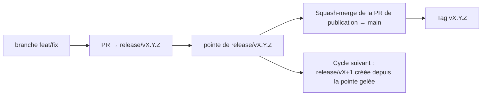

# Branching & Release Model (Français)

🌐 **Languages:** 🇺🇸 [English](../../../../ops/BRANCHING_MODEL.md) · 🇪🇹 [am](../../../am/docs/ops/BRANCHING_MODEL.md) · 🇸🇦 [ar](../../../ar/docs/ops/BRANCHING_MODEL.md) · 🇦🇿 [az](../../../az/docs/ops/BRANCHING_MODEL.md) · 🇧🇬 [bg](../../../bg/docs/ops/BRANCHING_MODEL.md) · 🇧🇩 [bn](../../../bn/docs/ops/BRANCHING_MODEL.md) · 🇨🇿 [cs](../../../cs/docs/ops/BRANCHING_MODEL.md) · 🇩🇰 [da](../../../da/docs/ops/BRANCHING_MODEL.md) · 🇩🇪 [de](../../../de/docs/ops/BRANCHING_MODEL.md) · 🇬🇷 [el](../../../el/docs/ops/BRANCHING_MODEL.md) · 🇪🇸 [es](../../../es/docs/ops/BRANCHING_MODEL.md) · 🇪🇪 [et](../../../et/docs/ops/BRANCHING_MODEL.md) · 🇮🇷 [fa](../../../fa/docs/ops/BRANCHING_MODEL.md) · 🇫🇮 [fi](../../../fi/docs/ops/BRANCHING_MODEL.md) · 🇮🇪 [ga](../../../ga/docs/ops/BRANCHING_MODEL.md) · 🇮🇳 [gu](../../../gu/docs/ops/BRANCHING_MODEL.md) · 🇳🇬 [ha](../../../ha/docs/ops/BRANCHING_MODEL.md) · 🇮🇱 [he](../../../he/docs/ops/BRANCHING_MODEL.md) · 🇮🇳 [hi](../../../hi/docs/ops/BRANCHING_MODEL.md) · 🇭🇷 [hr](../../../hr/docs/ops/BRANCHING_MODEL.md) · 🇭🇺 [hu](../../../hu/docs/ops/BRANCHING_MODEL.md) · 🇦🇲 [hy](../../../hy/docs/ops/BRANCHING_MODEL.md) · 🇮🇩 [id](../../../id/docs/ops/BRANCHING_MODEL.md) · 🇳🇬 [ig](../../../ig/docs/ops/BRANCHING_MODEL.md) · 🇮🇹 [it](../../../it/docs/ops/BRANCHING_MODEL.md) · 🇯🇵 [ja](../../../ja/docs/ops/BRANCHING_MODEL.md) · 🇬🇪 [ka](../../../ka/docs/ops/BRANCHING_MODEL.md) · 🇰🇭 [km](../../../km/docs/ops/BRANCHING_MODEL.md) · 🇮🇳 [kn](../../../kn/docs/ops/BRANCHING_MODEL.md) · 🇰🇷 [ko](../../../ko/docs/ops/BRANCHING_MODEL.md) · 🇱🇹 [lt](../../../lt/docs/ops/BRANCHING_MODEL.md) · 🇱🇻 [lv](../../../lv/docs/ops/BRANCHING_MODEL.md) · 🇮🇳 [ml](../../../ml/docs/ops/BRANCHING_MODEL.md) · 🇮🇳 [mr](../../../mr/docs/ops/BRANCHING_MODEL.md) · 🇲🇾 [ms](../../../ms/docs/ops/BRANCHING_MODEL.md) · 🇲🇹 [mt](../../../mt/docs/ops/BRANCHING_MODEL.md) · 🇲🇲 [my](../../../my/docs/ops/BRANCHING_MODEL.md) · 🇳🇵 [ne](../../../ne/docs/ops/BRANCHING_MODEL.md) · 🇳🇱 [nl](../../../nl/docs/ops/BRANCHING_MODEL.md) · 🇳🇴 [no](../../../no/docs/ops/BRANCHING_MODEL.md) · 🇮🇳 [or](../../../or/docs/ops/BRANCHING_MODEL.md) · 🇮🇳 [pa](../../../pa/docs/ops/BRANCHING_MODEL.md) · 🇵🇭 [phi](../../../phi/docs/ops/BRANCHING_MODEL.md) · 🇵🇱 [pl](../../../pl/docs/ops/BRANCHING_MODEL.md) · 🇵🇹 [pt](../../../pt/docs/ops/BRANCHING_MODEL.md) · 🇧🇷 [pt-BR](../../../pt-BR/docs/ops/BRANCHING_MODEL.md) · 🇷🇴 [ro](../../../ro/docs/ops/BRANCHING_MODEL.md) · 🇷🇺 [ru](../../../ru/docs/ops/BRANCHING_MODEL.md) · 🇱🇰 [si](../../../si/docs/ops/BRANCHING_MODEL.md) · 🇸🇰 [sk](../../../sk/docs/ops/BRANCHING_MODEL.md) · 🇸🇮 [sl](../../../sl/docs/ops/BRANCHING_MODEL.md) · 🇷🇸 [sr](../../../sr/docs/ops/BRANCHING_MODEL.md) · 🇸🇪 [sv](../../../sv/docs/ops/BRANCHING_MODEL.md) · 🇰🇪 [sw](../../../sw/docs/ops/BRANCHING_MODEL.md) · 🇮🇳 [ta](../../../ta/docs/ops/BRANCHING_MODEL.md) · 🇮🇳 [te](../../../te/docs/ops/BRANCHING_MODEL.md) · 🇹🇭 [th](../../../th/docs/ops/BRANCHING_MODEL.md) · 🇹🇷 [tr](../../../tr/docs/ops/BRANCHING_MODEL.md) · 🇺🇦 [uk-UA](../../../uk-UA/docs/ops/BRANCHING_MODEL.md) · 🇵🇰 [ur](../../../ur/docs/ops/BRANCHING_MODEL.md) · 🇺🇿 [uz](../../../uz/docs/ops/BRANCHING_MODEL.md) · 🇻🇳 [vi](../../../vi/docs/ops/BRANCHING_MODEL.md) · 🇳🇬 [yo](../../../yo/docs/ops/BRANCHING_MODEL.md) · 🇨🇳 [zh-CN](../../../zh-CN/docs/ops/BRANCHING_MODEL.md) · 🇹🇼 [zh-TW](../../../zh-TW/docs/ops/BRANCHING_MODEL.md)

---

OmniRoute utilise un modèle de publication en **cycles parallèles** : une branche dédiée `release/vX.Y.Z`
pour le cycle actif, `main` pour la lignée publiée et un tag immuable
`vX.Y.Z` lorsque ce cycle est publié. Il est normal de voir des commits arriver à la fois sur `release/*` _et_ sur
`main` — ce n’est pas une erreur.

Les détails destinés aux mainteneurs figurent dans `CLAUDE.md` (règle stricte nº 21) et
[RELEASE_CHECKLIST.md](./RELEASE_CHECKLIST.md). Cette page en présente le résumé public
destiné aux contributeurs.

## En bref

| Référence        | Rôle                                                                                                                |
| ---------------- | ------------------------------------------------------------------------------------------------------------------- |
| `release/vX.Y.Z` | **Cycle actif** — développement quotidien et fusion des PR pour cette version                                       |
| `main`           | **Lignée publiée** — reçoit le cycle via un squash-merge lors de la publication                                     |
| `vX.Y.Z` (tag)   | **Marqueur de publication** — pointeur immuable indiquant « ce qui a été publié », créé au moment de la publication |



## Quelle branche ma PR doit-elle cibler ?

**Ciblez la branche `release/vX.Y.Z` active — et non `main`.**

1. Repérez la branche `release/v*` ouverte ayant la version la plus élevée (exemple au moment de la rédaction :
   `release/v3.8.49`).
2. Créez votre branche depuis sa pointe (`git fetch` + checkout / rebase sur celle-ci).
3. Ouvrez la PR avec **base = cette branche `release/vX.Y.Z`**.

`main` n’est pas la branche d’intégration quotidienne. Les PR ouvertes vers `main`
doivent généralement être redirigées avant leur fusion.

## Gel de publication (cycles parallèles)

Lorsqu’une publication est en cours de rapprochement, une issue servant de marqueur et portant le label `release-freeze` est
ouverte. Cela **n’interrompt pas le développement** :

- La branche `release/vX.Y.Z` gelée est sous la responsabilité du responsable de cette publication.
- La branche `release/vX+1` du cycle suivant est créée depuis la pointe gelée afin que les contributeurs puissent continuer
  à intégrer leurs travaux.
- Les PR ouvertes qui ciblent encore la branche gelée doivent être **redirigées** vers la branche
  `release/v*` active (celle ayant la version la plus élevée).

Vérifiez s’il existe un gel en cours avant de supposer que la branche souhaitée accepte les fusions :

```bash
gh issue list --repo diegosouzapw/OmniRoute --label release-freeze --state open
```

Les mécanismes de fusion (label `queue` du propriétaire → Mergify) sont documentés dans
[MERGE_TRAIN.md](./MERGE_TRAIN.md).

## Pourquoi une branche et un tag ?

| Artefact         | Durée de vie   | Objectif                                                                    |
| ---------------- | -------------- | --------------------------------------------------------------------------- |
| `release/vX.Y.Z` | Cycle en cours | Regroupe les PR approuvées, reste au vert dans la CI et sert de base aux PR |
| Tag `vX.Y.Z`     | Permanent      | Marque exactement les éléments publiés sur npm / GitHub Releases            |

La branche est l’atelier ; le tag est le paquet scellé. Après le squash-merge dans
`main`, le cycle suivant se poursuit sur `release/vX+1` sans attendre la fin de la PR de
publication précédente.

## Documentation connexe

- [CONTRIBUTING.md](../../CONTRIBUTING.md) — configuration, tests, liste de contrôle des PR
- [RELEASE_CHECKLIST.md](./RELEASE_CHECKLIST.md) — validation avant publication
- [MERGE_TRAIN.md](./MERGE_TRAIN.md) — file d’attente de fusion et train de secours
- [RELEASE_GREEN.md](./RELEASE_GREEN.md) — maintien au vert de la pointe de la branche de publication
