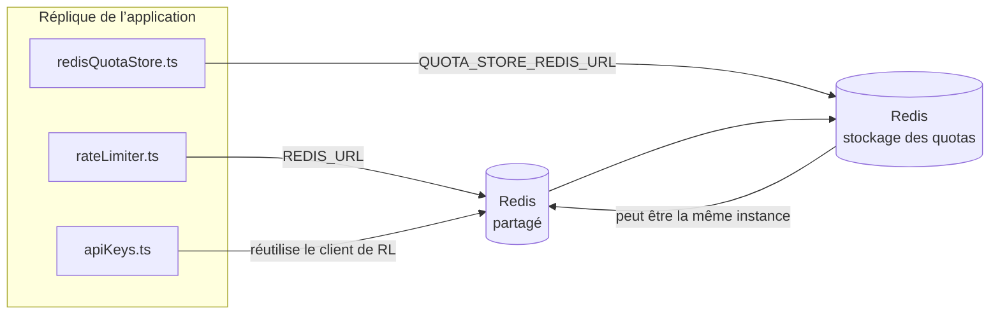

# Redis Production Configuration Guide (Français)

🌐 **Languages:** 🇺🇸 [English](../../../../ops/REDIS_PRODUCTION_CONFIG.md) · 🇪🇹 [am](../../../am/docs/ops/REDIS_PRODUCTION_CONFIG.md) · 🇸🇦 [ar](../../../ar/docs/ops/REDIS_PRODUCTION_CONFIG.md) · 🇦🇿 [az](../../../az/docs/ops/REDIS_PRODUCTION_CONFIG.md) · 🇧🇬 [bg](../../../bg/docs/ops/REDIS_PRODUCTION_CONFIG.md) · 🇧🇩 [bn](../../../bn/docs/ops/REDIS_PRODUCTION_CONFIG.md) · 🇨🇿 [cs](../../../cs/docs/ops/REDIS_PRODUCTION_CONFIG.md) · 🇩🇰 [da](../../../da/docs/ops/REDIS_PRODUCTION_CONFIG.md) · 🇩🇪 [de](../../../de/docs/ops/REDIS_PRODUCTION_CONFIG.md) · 🇬🇷 [el](../../../el/docs/ops/REDIS_PRODUCTION_CONFIG.md) · 🇪🇸 [es](../../../es/docs/ops/REDIS_PRODUCTION_CONFIG.md) · 🇪🇪 [et](../../../et/docs/ops/REDIS_PRODUCTION_CONFIG.md) · 🇮🇷 [fa](../../../fa/docs/ops/REDIS_PRODUCTION_CONFIG.md) · 🇫🇮 [fi](../../../fi/docs/ops/REDIS_PRODUCTION_CONFIG.md) · 🇮🇪 [ga](../../../ga/docs/ops/REDIS_PRODUCTION_CONFIG.md) · 🇮🇳 [gu](../../../gu/docs/ops/REDIS_PRODUCTION_CONFIG.md) · 🇳🇬 [ha](../../../ha/docs/ops/REDIS_PRODUCTION_CONFIG.md) · 🇮🇱 [he](../../../he/docs/ops/REDIS_PRODUCTION_CONFIG.md) · 🇮🇳 [hi](../../../hi/docs/ops/REDIS_PRODUCTION_CONFIG.md) · 🇭🇷 [hr](../../../hr/docs/ops/REDIS_PRODUCTION_CONFIG.md) · 🇭🇺 [hu](../../../hu/docs/ops/REDIS_PRODUCTION_CONFIG.md) · 🇦🇲 [hy](../../../hy/docs/ops/REDIS_PRODUCTION_CONFIG.md) · 🇮🇩 [id](../../../id/docs/ops/REDIS_PRODUCTION_CONFIG.md) · 🇳🇬 [ig](../../../ig/docs/ops/REDIS_PRODUCTION_CONFIG.md) · 🇮🇹 [it](../../../it/docs/ops/REDIS_PRODUCTION_CONFIG.md) · 🇯🇵 [ja](../../../ja/docs/ops/REDIS_PRODUCTION_CONFIG.md) · 🇬🇪 [ka](../../../ka/docs/ops/REDIS_PRODUCTION_CONFIG.md) · 🇰🇭 [km](../../../km/docs/ops/REDIS_PRODUCTION_CONFIG.md) · 🇮🇳 [kn](../../../kn/docs/ops/REDIS_PRODUCTION_CONFIG.md) · 🇰🇷 [ko](../../../ko/docs/ops/REDIS_PRODUCTION_CONFIG.md) · 🇱🇹 [lt](../../../lt/docs/ops/REDIS_PRODUCTION_CONFIG.md) · 🇱🇻 [lv](../../../lv/docs/ops/REDIS_PRODUCTION_CONFIG.md) · 🇮🇳 [ml](../../../ml/docs/ops/REDIS_PRODUCTION_CONFIG.md) · 🇮🇳 [mr](../../../mr/docs/ops/REDIS_PRODUCTION_CONFIG.md) · 🇲🇾 [ms](../../../ms/docs/ops/REDIS_PRODUCTION_CONFIG.md) · 🇲🇹 [mt](../../../mt/docs/ops/REDIS_PRODUCTION_CONFIG.md) · 🇲🇲 [my](../../../my/docs/ops/REDIS_PRODUCTION_CONFIG.md) · 🇳🇵 [ne](../../../ne/docs/ops/REDIS_PRODUCTION_CONFIG.md) · 🇳🇱 [nl](../../../nl/docs/ops/REDIS_PRODUCTION_CONFIG.md) · 🇳🇴 [no](../../../no/docs/ops/REDIS_PRODUCTION_CONFIG.md) · 🇮🇳 [or](../../../or/docs/ops/REDIS_PRODUCTION_CONFIG.md) · 🇮🇳 [pa](../../../pa/docs/ops/REDIS_PRODUCTION_CONFIG.md) · 🇵🇭 [phi](../../../phi/docs/ops/REDIS_PRODUCTION_CONFIG.md) · 🇵🇱 [pl](../../../pl/docs/ops/REDIS_PRODUCTION_CONFIG.md) · 🇵🇹 [pt](../../../pt/docs/ops/REDIS_PRODUCTION_CONFIG.md) · 🇧🇷 [pt-BR](../../../pt-BR/docs/ops/REDIS_PRODUCTION_CONFIG.md) · 🇷🇴 [ro](../../../ro/docs/ops/REDIS_PRODUCTION_CONFIG.md) · 🇷🇺 [ru](../../../ru/docs/ops/REDIS_PRODUCTION_CONFIG.md) · 🇱🇰 [si](../../../si/docs/ops/REDIS_PRODUCTION_CONFIG.md) · 🇸🇰 [sk](../../../sk/docs/ops/REDIS_PRODUCTION_CONFIG.md) · 🇸🇮 [sl](../../../sl/docs/ops/REDIS_PRODUCTION_CONFIG.md) · 🇷🇸 [sr](../../../sr/docs/ops/REDIS_PRODUCTION_CONFIG.md) · 🇸🇪 [sv](../../../sv/docs/ops/REDIS_PRODUCTION_CONFIG.md) · 🇰🇪 [sw](../../../sw/docs/ops/REDIS_PRODUCTION_CONFIG.md) · 🇮🇳 [ta](../../../ta/docs/ops/REDIS_PRODUCTION_CONFIG.md) · 🇮🇳 [te](../../../te/docs/ops/REDIS_PRODUCTION_CONFIG.md) · 🇹🇭 [th](../../../th/docs/ops/REDIS_PRODUCTION_CONFIG.md) · 🇹🇷 [tr](../../../tr/docs/ops/REDIS_PRODUCTION_CONFIG.md) · 🇺🇦 [uk-UA](../../../uk-UA/docs/ops/REDIS_PRODUCTION_CONFIG.md) · 🇵🇰 [ur](../../../ur/docs/ops/REDIS_PRODUCTION_CONFIG.md) · 🇺🇿 [uz](../../../uz/docs/ops/REDIS_PRODUCTION_CONFIG.md) · 🇻🇳 [vi](../../../vi/docs/ops/REDIS_PRODUCTION_CONFIG.md) · 🇳🇬 [yo](../../../yo/docs/ops/REDIS_PRODUCTION_CONFIG.md) · 🇨🇳 [zh-CN](../../../zh-CN/docs/ops/REDIS_PRODUCTION_CONFIG.md) · 🇹🇼 [zh-TW](../../../zh-TW/docs/ops/REDIS_PRODUCTION_CONFIG.md)

---

## Vue d’ensemble

Redis est une **dépendance facultative et non bloquante** dans OmniRoute — l’application fonctionne en mode dégradé
avec des solutions de repli en mémoire lorsque Redis est indisponible. En production, l’optimisation de Redis réduit la latence pour quatre charges de travail
distinctes :

| Charge de travail           | Pilote                        | Fabrique de clients                                | Modèle de clé                                                   |
| --------------------------- | ----------------------------- | -------------------------------------------------- | --------------------------------------------------------------- |
| Limitation de débit         | `rateLimiter.ts`              | Singleton `ioredis` différé via `getRedisClient()` | Fenêtres de limitation de débit atomiques en Lua `<prefix>rl:*` |
| Cache d’authentification    | `apiKeys.ts`                  | Réutilise le client de `rateLimiter`               | `<prefix>auth:api_key:<sha256>` avec TTL                        |
| Stockage des quotas         | `redisQuotaStore.ts`          | Singleton `getRedisClient(url)` distinct           | `<prefix>quota:*` configurable par instance                     |
| Disjoncteur de préchauffage | `redisCircuitBreakerStore.ts` | Client distinct dans `circuitBreakerFactory.ts`    | `<prefix>warmup:cb:<connectionId>`                              |

Les quatre charges de travail partagent un même préfixe d’espace de noms afin qu’OmniRoute puisse coexister avec d’autres applications sur une
même instance Redis (par exemple `127.0.0.1:6379`). Consultez [Espace de noms des clés](#key-namespacing).

---

## Configuration actuelle (valeurs par défaut du code)

| Paramètre                                        | Valeur                                                                              | Emplacement                                                                           |
| ------------------------------------------------ | ----------------------------------------------------------------------------------- | ------------------------------------------------------------------------------------- |
| Variable d’environnement `REDIS_URL`             | `redis://redis:6379` (compose), facultative                                         | `rateLimiter.ts:5`, `.env.example`                                                    |
| Variable d’environnement `REDIS_KEY_PREFIX`      | `omniroute:` (valeur par défaut)                                                    | `rateLimiter.ts`, `redisQuotaStore.ts`, `redisCircuitBreakerStore.ts`, `.env.example` |
| Variable d’environnement `QUOTA_STORE_REDIS_URL` | distincte, peut différer de `REDIS_URL`                                             | `quota/storeFactory.ts`                                                               |
| `QUOTA_STORE_DRIVER`                             | `"sqlite"` (valeur par défaut), `"redis"` facultatif                                | `quota/storeFactory.ts`                                                               |
| `maxRetriesPerRequest` d’ioredis                 | `3`                                                                                 | création du client dans `rateLimiter.ts`                                              |
| `enableReadyCheck`                               | non défini (valeur par défaut d’ioredis : `true`)                                   | —                                                                                     |
| `lazyConnect`                                    | non défini (valeur par défaut d’ioredis : `false`)                                  | —                                                                                     |
| `retryStrategy`                                  | non défini (valeur par défaut d’ioredis : base de 200 ms, croissance exponentielle) | —                                                                                     |
| TLS / mot de passe / index de base de données    | **non configurés**                                                                  | —                                                                                     |
| Sentinel / Cluster                               | **non configurés** — nœud unique autonome uniquement                                | —                                                                                     |

---

## Espace de noms des clés

OmniRoute partage une instance Redis avec les autres éléments exécutés sur l’hôte. Sans espace de noms,
des clés telles que `auth:api_key:<sha256>` ou `rl:*` pourraient entrer en collision avec celles d’autres applications
utilisant le même Redis (cette instance exécute Redis sur `127.0.0.1:6379` aux côtés d’autres services).

Définissez `REDIS_KEY_PREFIX` sur une chaîne non vide afin de préfixer **chaque** clé OmniRoute :

```bash
# .env — toutes les clés OmniRoute deviennent omniroute:rl:*, omniroute:auth:*, omniroute:quota:*, omniroute:warmup:cb:*
REDIS_KEY_PREFIX=omniroute:
```

- **Valeur par défaut :** `omniroute:` (appliquée lorsque `REDIS_KEY_PREFIX` n’est pas défini ou est vide).
- **S’applique à :** la limitation de débit et le cache d’authentification (client `ioredis` partagé via `keyPrefix`), ainsi qu’au
  stockage des quotas (`KEY_PREFIX = "${REDIS_KEY_PREFIX}quota"`) et au disjoncteur de préchauffage
  (`KEY_PREFIX = "${REDIS_KEY_PREFIX}warmup:cb:"`).
- **La modification du préfixe** lorsque des clés existent déjà dans Redis rend les anciennes clés orphelines (elles expirent
  via leur TTL / la politique LRU). Cette modification est sans risque ; aucune migration n’est nécessaire. La seule exception concerne une clé de
  disjoncteur de préchauffage associée à une connexion marquée comme interdite : elle est conservée sans TTL. Répertoriez donc
  les clés restantes avec `redis-cli --scan --pattern '<old-prefix>warmup:cb:*'`, puis supprimez-les.
- Le **`keyPrefix` d’ioredis** ajoute automatiquement le préfixe lors des écritures **et** le retire lors des lectures,
  de sorte que le code de l’application ne voit jamais le préfixe.

---

## Réglages recommandés pour la production

### 1. Pool de connexions / Options du client (constructeur `Redis` d’ioredis)

Le code actuel crée une seule instance `new Redis(url)` sans options personnalisées. Pour les déploiements de production
à plusieurs réplicas, transmettez une fabrique de clients dans le code ou encapsulez `getRedisClient()` :

```typescript
const redis = new Redis(REDIS_URL, {
  maxRetriesPerRequest: null, // aucune limite de tentatives ; laisser retryStrategy décider
  enableReadyCheck: true, // vérifier que le serveur est prêt avant d’accepter les appels
  lazyConnect: true, // ne pas se connecter lors de la construction ; attendre le premier appel
  retryStrategy: (times) => {
    if (times > 10) return null; // abandonner après 10 tentatives → se reconnecter plus tard
    return Math.min(times * 200, 5000); // 200 ms, 400 ms, …, plafond de 5 s
  },
  enableAutoPipelining: true, // regrouper les commandes simultanées en une seule écriture TCP
  keepAlive: 10000, // maintien de connexion TCP toutes les 10 s
});
```

**Principaux compromis :**

- `maxRetriesPerRequest: null` + `retryStrategy` — recommandés en production afin que les
  redémarrages temporaires de Redis ne fassent pas immédiatement échouer chaque requête. Le mécanisme de repli en mémoire de
  `checkRateLimit()` absorbe le chemin d’échec.
- `lazyConnect: true` — évite que le démarrage dépende de la disponibilité de Redis avant que le serveur
  commence à accepter des connexions.
- `enableAutoPipelining: true` — réduit les allers-retours pour les vérifications simultanées de limitation de débit ;
  avantageux au-delà de 50 requêtes par seconde sur une seule connexion.

### 2. Configuration du serveur Redis (`redis.conf`)

```
# Mémoire
maxmemory 80%                        # laisser de la place pour le cache de pages du système d’exploitation
maxmemory-policy allkeys-lru         # évincer les entrées obsolètes du cache d’authentification sous pression

# Persistance (facultative — OmniRoute résiste aux pannes sans elle)
save 300 1                           # créer un instantané au moins toutes les 5 min si ≥1 clé a changé
appendonly no                        # AOF inutile ; les données peuvent être régénérées
appendfsync no                       # aucune surcharge liée à fsync (RDB est suffisant)

# Réseau
timeout 0                            # aucune déconnexion en cas d’inactivité
tcp-keepalive 300                    # maintien de connexion toutes les 5 min
tcp-backlog 511                      # file d’attente des connexions pour les pics de charge

# Performances
hz 10                                # valeur par défaut ; 100 pour les usages sensibles à la latence
activedefrag yes                     # défragmentation automatique lorsque la fragmentation dépasse 10 %
```

**Compromis concernant `maxmemory-policy allkeys-lru` :** les entrées du cache d’authentification peuvent être évincées en cas de
pression sur la mémoire. Cela ne présente aucun risque — `setCachedApiKey` remplit toujours à nouveau le cache en cas d’absence, et le
mécanisme de repli SQLite fait autorité. Le script Lua du limiteur de débit crée de petites clés qui sont
de courte durée par conception.

### 3. Paramètres de Docker Compose

La configuration Compose de production (`docker-compose.prod.yml`) utilise `redis:8.6.2-alpine`. Ajoutez :

```yaml
redis:
  image: redis:8.6.2-alpine
  command:
    [
      "redis-server",
      "--maxmemory",
      "512mb",
      "--maxmemory-policy",
      "allkeys-lru",
      "--activedefrag",
      "yes",
      "--save",
      "300 1",
    ]
  healthcheck:
    test: ["CMD", "redis-cli", "ping"]
    interval: 10s
    timeout: 3s
    retries: 3
    start_period: 5s
```

### 4. Considérations relatives aux instances multiples / à la mise à l’échelle

**Une seule instance Redis pour tous les réplicas** — le script Lua du limiteur de débit dépend d’un espace de clés
unique faisant autorité. Plusieurs instances Redis derrière les réplicas feraient perdre l’atomicité
et doubleraient le quota. Utilisez une seule instance Redis (ou un cluster Redis Sentinel avec basculement) pour
tous les réplicas de l’application.

**Nombre de connexions :** chaque réplica de l’application ouvre **2 connexions TCP** à Redis
(client du limiteur de débit + client du magasin de quotas). Avec 10 réplicas → 20 connexions, ce qui reste
largement inférieur à la limite par défaut de 10 000 connexions d’une instance Redis.

### 5. Supervision

Exposez les éléments suivants via le point de terminaison de vérification de l’état :

```typescript
// src/app/api/monitoring/health/route.ts appelle déjà les fonctions de rateLimiter
// Ajouter des vérifications propres à Redis :
//   1. Latence de PING via ioredis .ping()
//   2. Utilisation de la mémoire via INFO memory
//   3. Nombre de connexions via INFO clients
//   4. Taux de succès de maxmemory-policy (evicted_keys / keyspace_hits)
```

Métriques clés à surveiller :

- **Clés évincées / s** — si cette valeur reste constamment différente de zéro, augmentez `maxmemory`
- **Clients bloqués** — une valeur différente de zéro suggère des scripts Lua lents ou une forte contention
- **Connexions rejetées** — la limite de connexions a été atteinte ; situation rare avec 20 connexions

---

## Diagramme d’architecture



---

## Références

| Fichier                            | Objectif                                                                                |
| ---------------------------------- | --------------------------------------------------------------------------------------- |
| `src/shared/utils/rateLimiter.ts`  | Client Redis principal, script Lua de limitation du débit, solution de repli en mémoire |
| `src/lib/db/apiKeys.ts`            | Cache d’authentification — solution de repli Redis→SQLite                               |
| `src/lib/quota/redisQuotaStore.ts` | Client Redis distinct pour le stockage facultatif des quotas                            |
| `src/lib/quota/storeFactory.ts`    | Bascule entre les pilotes de quotas `sqlite` et `redis`                                 |
| `docker-compose.prod.yml`          | Conteneur Redis de production (image `redis:8.6.2-alpine`)                              |
| `.env.example`                     | Documentation des variables d’environnement Redis                                       |
| `src/app/api/local/redis/`         | Routes d’API pour l’orchestration du conteneur de développement                         |
| `bin/cli/commands/redis.mjs`       | Commandes CLI pour l’orchestration du conteneur de développement                        |
