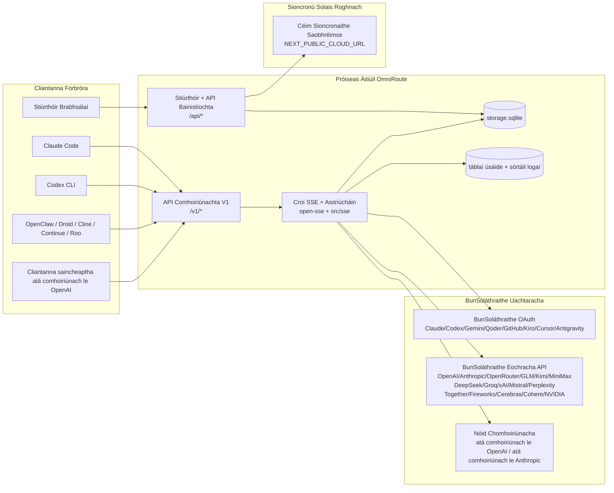
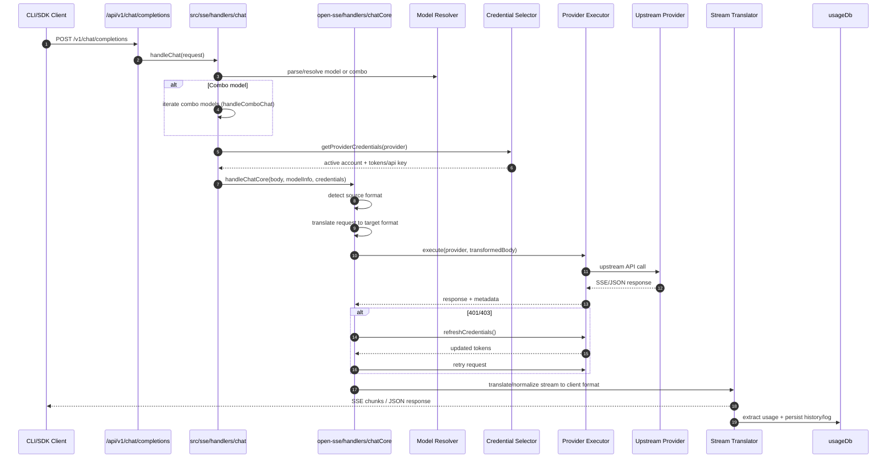
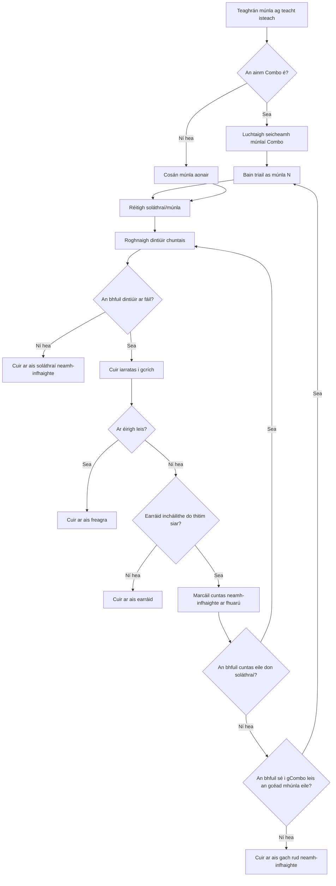
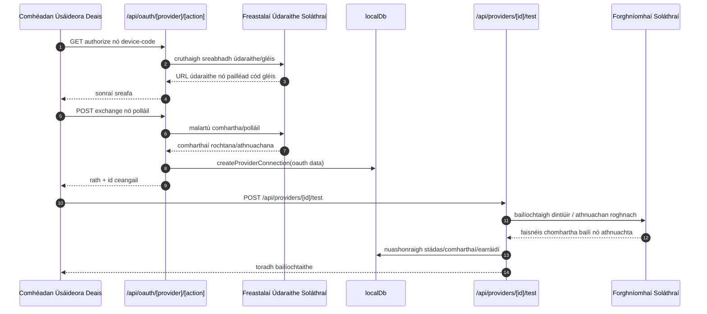
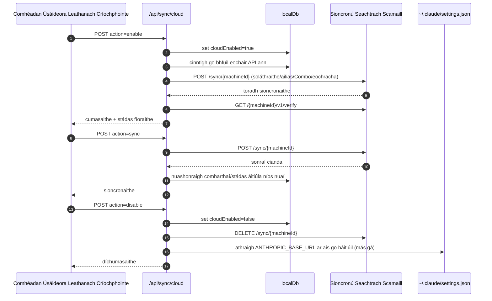
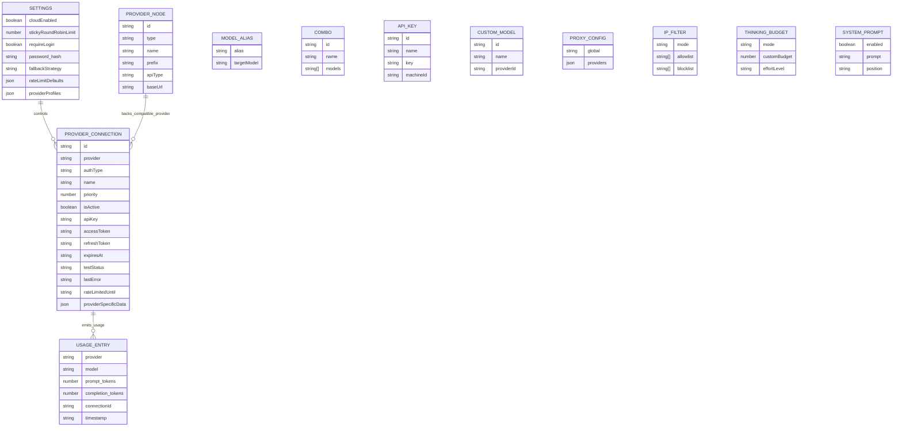
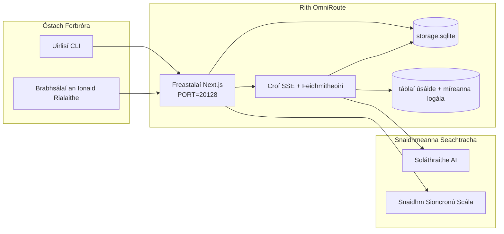

# ARCHITECTURE (Gaeilge)

🌐 **Languages:** 🇺🇸 [English](../../../../architecture/ARCHITECTURE.md) · 🇸🇦 [ar](../../../ar/docs/architecture/ARCHITECTURE.md) · 🇦🇿 [az](../../../az/docs/architecture/ARCHITECTURE.md) · 🇧🇬 [bg](../../../bg/docs/architecture/ARCHITECTURE.md) · 🇧🇩 [bn](../../../bn/docs/architecture/ARCHITECTURE.md) · 🇨🇿 [cs](../../../cs/docs/architecture/ARCHITECTURE.md) · 🇩🇰 [da](../../../da/docs/architecture/ARCHITECTURE.md) · 🇩🇪 [de](../../../de/docs/architecture/ARCHITECTURE.md) · 🇬🇷 [el](../../../el/docs/architecture/ARCHITECTURE.md) · 🇪🇸 [es](../../../es/docs/architecture/ARCHITECTURE.md) · 🇪🇪 [et](../../../et/docs/architecture/ARCHITECTURE.md) · 🇮🇷 [fa](../../../fa/docs/architecture/ARCHITECTURE.md) · 🇫🇮 [fi](../../../fi/docs/architecture/ARCHITECTURE.md) · 🇫🇷 [fr](../../../fr/docs/architecture/ARCHITECTURE.md) · 🇮🇳 [gu](../../../gu/docs/architecture/ARCHITECTURE.md) · 🇮🇱 [he](../../../he/docs/architecture/ARCHITECTURE.md) · 🇮🇳 [hi](../../../hi/docs/architecture/ARCHITECTURE.md) · 🇭🇷 [hr](../../../hr/docs/architecture/ARCHITECTURE.md) · 🇭🇺 [hu](../../../hu/docs/architecture/ARCHITECTURE.md) · 🇮🇩 [id](../../../id/docs/architecture/ARCHITECTURE.md) · 🇮🇹 [it](../../../it/docs/architecture/ARCHITECTURE.md) · 🇯🇵 [ja](../../../ja/docs/architecture/ARCHITECTURE.md) · 🇰🇷 [ko](../../../ko/docs/architecture/ARCHITECTURE.md) · 🇱🇹 [lt](../../../lt/docs/architecture/ARCHITECTURE.md) · 🇱🇻 [lv](../../../lv/docs/architecture/ARCHITECTURE.md) · 🇮🇳 [mr](../../../mr/docs/architecture/ARCHITECTURE.md) · 🇲🇾 [ms](../../../ms/docs/architecture/ARCHITECTURE.md) · 🇲🇹 [mt](../../../mt/docs/architecture/ARCHITECTURE.md) · 🇳🇱 [nl](../../../nl/docs/architecture/ARCHITECTURE.md) · 🇳🇴 [no](../../../no/docs/architecture/ARCHITECTURE.md) · 🇵🇭 [phi](../../../phi/docs/architecture/ARCHITECTURE.md) · 🇵🇱 [pl](../../../pl/docs/architecture/ARCHITECTURE.md) · 🇵🇹 [pt](../../../pt/docs/architecture/ARCHITECTURE.md) · 🇧🇷 [pt-BR](../../../pt-BR/docs/architecture/ARCHITECTURE.md) · 🇷🇴 [ro](../../../ro/docs/architecture/ARCHITECTURE.md) · 🇷🇺 [ru](../../../ru/docs/architecture/ARCHITECTURE.md) · 🇸🇰 [sk](../../../sk/docs/architecture/ARCHITECTURE.md) · 🇸🇮 [sl](../../../sl/docs/architecture/ARCHITECTURE.md) · 🇷🇸 [sr](../../../sr/docs/architecture/ARCHITECTURE.md) · 🇸🇪 [sv](../../../sv/docs/architecture/ARCHITECTURE.md) · 🇰🇪 [sw](../../../sw/docs/architecture/ARCHITECTURE.md) · 🇮🇳 [ta](../../../ta/docs/architecture/ARCHITECTURE.md) · 🇮🇳 [te](../../../te/docs/architecture/ARCHITECTURE.md) · 🇹🇭 [th](../../../th/docs/architecture/ARCHITECTURE.md) · 🇹🇷 [tr](../../../tr/docs/architecture/ARCHITECTURE.md) · 🇺🇦 [uk-UA](../../../uk-UA/docs/architecture/ARCHITECTURE.md) · 🇵🇰 [ur](../../../ur/docs/architecture/ARCHITECTURE.md) · 🇻🇳 [vi](../../../vi/docs/architecture/ARCHITECTURE.md) · 🇨🇳 [zh-CN](../../../zh-CN/docs/architecture/ARCHITECTURE.md) · 🇹🇼 [zh-TW](../../../zh-TW/docs/architecture/ARCHITECTURE.md)

---

---

title: "Ingearchtúra OmniRoute"
version: 3.8.40
lastUpdated: 2026-06-28
---

# Ingearchtúra OmniRoute

🌐 **Languages:** 🇺🇸 [English](../../../../architecture/ARCHITECTURE.md) · 🇸🇦 [ar](../../../ar/docs/architecture/ARCHITECTURE.md) · 🇦🇿 [az](../../../az/docs/architecture/ARCHITECTURE.md) · 🇧🇬 [bg](../../../bg/docs/architecture/ARCHITECTURE.md) · 🇧🇩 [bn](../../../bn/docs/architecture/ARCHITECTURE.md) · 🇨🇿 [cs](../../../cs/docs/architecture/ARCHITECTURE.md) · 🇩🇰 [da](../../../da/docs/architecture/ARCHITECTURE.md) · 🇩🇪 [de](../../../de/docs/architecture/ARCHITECTURE.md) · 🇬🇷 [el](../../../el/docs/architecture/ARCHITECTURE.md) · 🇪🇸 [es](../../../es/docs/architecture/ARCHITECTURE.md) · 🇪🇪 [et](../../../et/docs/architecture/ARCHITECTURE.md) · 🇮🇷 [fa](../../../fa/docs/architecture/ARCHITECTURE.md) · 🇫🇮 [fi](../../../fi/docs/architecture/ARCHITECTURE.md) · 🇫🇷 [fr](../../../fr/docs/architecture/ARCHITECTURE.md) · 🇮🇳 [gu](../../../gu/docs/architecture/ARCHITECTURE.md) · 🇮🇱 [he](../../../he/docs/architecture/ARCHITECTURE.md) · 🇮🇳 [hi](../../../hi/docs/architecture/ARCHITECTURE.md) · 🇭🇷 [hr](../../../hr/docs/architecture/ARCHITECTURE.md) · 🇭🇺 [hu](../../../hu/docs/architecture/ARCHITECTURE.md) · 🇮🇩 [id](../../../id/docs/architecture/ARCHITECTURE.md) · 🇮🇹 [it](../../../it/docs/architecture/ARCHITECTURE.md) · 🇯🇵 [ja](../../../ja/docs/architecture/ARCHITECTURE.md) · 🇰🇷 [ko](../../../ko/docs/architecture/ARCHITECTURE.md) · 🇱🇹 [lt](../../../lt/docs/architecture/ARCHITECTURE.md) · 🇱🇻 [lv](../../../lv/docs/architecture/ARCHITECTURE.md) · 🇮🇳 [mr](../../../mr/docs/architecture/ARCHITECTURE.md) · 🇲🇾 [ms](../../../ms/docs/architecture/ARCHITECTURE.md) · 🇲🇹 [mt](../../../mt/docs/architecture/ARCHITECTURE.md) · 🇳🇱 [nl](../../../nl/docs/architecture/ARCHITECTURE.md) · 🇳🇴 [no](../../../no/docs/architecture/ARCHITECTURE.md) · 🇵🇭 [phi](../../../phi/docs/architecture/ARCHITECTURE.md) · 🇵🇱 [pl](../../../pl/docs/architecture/ARCHITECTURE.md) · 🇵🇹 [pt](../../../pt/docs/architecture/ARCHITECTURE.md) · 🇧🇷 [pt-BR](../../../pt-BR/docs/architecture/ARCHITECTURE.md) · 🇷🇴 [ro](../../../ro/docs/architecture/ARCHITECTURE.md) · 🇷🇺 [ru](../../../ru/docs/architecture/ARCHITECTURE.md) · 🇸🇰 [sk](../../../sk/docs/architecture/ARCHITECTURE.md) · 🇸🇮 [sl](../../../sl/docs/architecture/ARCHITECTURE.md) · 🇷🇸 [sr](../../../sr/docs/architecture/ARCHITECTURE.md) · 🇸🇪 [sv](../../../sv/docs/architecture/ARCHITECTURE.md) · 🇰🇪 [sw](../../../sw/docs/architecture/ARCHITECTURE.md) · 🇮🇳 [ta](../../../ta/docs/architecture/ARCHITECTURE.md) · 🇮🇳 [te](../../../te/docs/architecture/ARCHITECTURE.md) · 🇹🇭 [th](../../../th/docs/architecture/ARCHITECTURE.md) · 🇹🇷 [tr](../../../tr/docs/architecture/ARCHITECTURE.md) · 🇺🇦 [uk-UA](../../../uk-UA/docs/architecture/ARCHITECTURE.md) · 🇵🇰 [ur](../../../ur/docs/architecture/ARCHITECTURE.md) · 🇻🇳 [vi](../../../vi/docs/architecture/ARCHITECTURE.md) · 🇨🇳 [zh-CN](../../../zh-CN/docs/architecture/ARCHITECTURE.md) · 🇹🇼 [zh-TW](../../../zh-TW/docs/architecture/ARCHITECTURE.md)

_Nuashonraithe ar an 2026-06-28_

## Achoimre Feidhmiúcháina

Is é OmniRoute nascaire agus deais ríomhaireachta AI áitiúil atá tógtha ar Next.js.
Soláthraíonn sé amháin deireadh pointe comhoiriúnach le OpenAI (`/v1/*`) agus seolann sé tráchtaireacht ar fud iliomad soláthraithe barrlíne le haistriú, athchóiriú, athnua comhartha, agus rianú úsáide.

Bunrialtanais:

- Dromchla API comhoiriúnach le OpenAI do CLIs/uirlisí (355 soláthraí, 108 rithoirí)
- Aistriú iarratais/freagraí tríd an bhformáid soláthraithe éagsúla
- Athchóiriú comhaimseartha samhlacha (seicheamh ilsamhlacha)
- Céimeanna combo struchtúrtha (`soláthraí + samhail + ceangal`) le formáid ordaithe ag `compositeTiers`
- Athchóiriú ag leibhéal cuntais (ilchuntais in aghaidh an tSoláthraí)
- Ráthaíocht roimh thús oibre agus roghnú cuntais P2C feasach ar ráthaíocht sa phríomhshlí comhrá
- Bainistíocht ceangail soláthraithe OAuth + eochair API (22 modúl soláthraithe OAuth)
- Giniúint leabaithe trí `/v1/embeddings` (18 soláthraí)
- Giniúint íomhá trí `/v1/images/generations` (10+ soláthraí, 20+ samhail)
- Trascríobiú fuaime trí `/v1/audio/transcriptions` (18 soláthraí)
- Téacs-go-guth trí `/v1/audio/speech` (24 soláthraí ionsuite)
- Giniúint físeáin trí `/v1/videos/generations` (ComfyUI + SD WebUI)
- Giniúint ceoil trí `/v1/music/generations` (ComfyUI)
- Tuardas gréasáin trí `/v1/search` (20 soláthraí)
- Meidreoidigh trí `/v1/moderations`
- Athranging trí `/v1/rerank`
- Parsáil clibe smaointe (`...</think>`) do samhlacha réasúnaíochta
- Slánú freagraí le haghaidh comhoiriúnachta stric le SDK OpenAI
- Gnáthamh róil (forbróir→córas, córas→úsáideoir) le haghaidh comhoiriúnachta tras-soláthraithe
- Tiontú aschuir struchtúrtha (json_schema → freagraSchema Gemini)
- Péireáil áitiúil do sholáthraithe, eochracha, ainmneacha malartacha, comhaimseartha, socruithe, praghsanna (122 modúl DB)
- Rianú úsáid/ioncaim agus logáil iarratais
- Comhshó scamall roghnach le haghaidh ilghearradh/stáit comhshó
- liosta ceadanna/blocáil IP le haghaidh rialaithe rochtana API
- Bainistíocht buiséid smaointe (trasghabháil/uathoibríoch/saincheaptha/coigeartaithe)
- instealladh praghsála córais domhanda
- Rianú seisiún agus méarchlón
- rátáil feabhsaithe in aghaidh an chuntais le próifílí sainiúla do sholáthraithe
- patrún briseadóir sliseanna le haghaidh athléimneacht soláthraithe
- cosaint toirneach lapadóirí le glasáil mutex
- taisce díshórtála iarratais bunaithe ar shíniú
- ciseal réimse: rialacha costais, polasaí athchóiriú, polasaí fáil
- Athsheoladh Comhthéacs: achoimrí seisiúin le haghaidh leanúnachta rothála cuntais
- Péireáil stáit réimse (taifead SQLite write-tríd an taisce le haghaidh athchóiritheanna, buiséid, dúnadh, briseadóirí sliseanna)
- innill polasaí le haghaidh meastóireachta iarratais láraithe (dúnadh → buiséad → athchóiriú)
- teileiméadra iarratais le haonlaíriú pá moill p50/p95/p99
- teileiméadra spriocanna comhaimseartha agus sláinte spriocanna comhaimseartha stairiúil trí `combo_execution_key` / `combo_step_id`
- aitheantas comhghaoile (X-Request-Id) le haghaidh rianú ó deireadh go deireadh
- scrúdú comhlíonadh le logáil agus é roghnach in aghaidh an eochair API
- creat luachmheasúnachta le haghaidh dearbhúcháin cháilíochta LLM
- deais sláinte le stádas reatha briseadóirí sliseanna soláthraithe
- Freastalaí MCP (110 uirlisí) le 3 iompróidh (stdio/SSE/Streamable HTTP)
- Freastalaí A2A (JSON-RPC 2.0 + SSE) le scileanna agus saolré tasc
- córas cuimhne (eastóscadh, instealladh, aisghníomhú, achoimriú)
- córas scileanna (clárlann, rithoirí, ionsaí, scileanna ionsuite)
- seachfhreastalaí MITM le bainistíocht deimhnithe agus láimhseáil DNS
- cosantóir instealladh praghsála idirmheánach
- píblíne comhbhrúite praghsála le Caveman, RTK, píblíní staca, comhaimseartha comhbhrúite, pacáistí teanga, agus anailísíocht
- clárlann ACP (Prótacal Cumarsáide gníomhaire)
- soláthraithe OAuth modúlach (22 modúl faoina bhfuil `src/lib/oauth/providers/`)
- scripteanna díshuiteála/díshuiteála iomlán
- gníomh deisiúcháin timpeallachta OAuth
- droichead WebSocket le haghaidh cliantanna WS comhoiriúnach le OpenAI (`/v1/ws`)
- bainistíocht comharthaí sioncrónaithe (eisiúint/tarraing, pacáiste cumraíochta ETag-leagan ag íoslódáil)
- réamhshocrú soláthraithe den chéad scoth GLM Thinking (`glmt`)
- comhaireamh comharthaí hibrideach (soláthraí-bhunaithe `/messages/count_tokens` le taifeadh measúnachta)
- síolú uathoibríoch ainmneacha malartacha samhlacha (30+ gnáthamhiú canúna tras-sheachfhreastalaí ag tosú)
- fetch sábháilte amach le cosaint SSRF, blocáil URL príobháideach, agus atreisiú cumraithe
- atreisiú comhrá feasach ar fhuarú le `requestRetry` agus `maxRetryIntervalSec` cumraithe
- fíorú timpeallachta rithim ag tosú le Zod
- scrúdú comhlíonadh v2 le leathanach, Events CRUD soláthraithe, agus logáil fíorúcháin SSRF-bhlocáilte

Múnla rithim príomhúil:

- ruteanna apps Next.js faoin bhfillteán `src/app/api/*` a chomhlíonann APIanna deais agus APIanna comhoiriúnachta
- croí SSE/ródú comhroinnte i `src/sse/*` + `open-sse/*` a láimhseálann rith soláthraí, aistriú, sruthú, athchóiriú, agus úsáid

## Léaráidí Tagartha

Tá foinsí Mermaid canónacha, faoi rialú leaganacha, d’ardán v3.8.0 lonnaithe in
[`docs/diagrams/`](../diagrams/README.md). Tá dhá cheann athghinte thíos le haghaidh treoshuímh;
tá an chuid eile nasctha óna dtreoracha fearainn-shonracha.


> Foinse: [diagrams/request-pipeline.mmd](../diagrams/request-pipeline.mmd)


> Foinse: [diagrams/resilience-3layers.mmd](../diagrams/resilience-3layers.mmd) — nasctha freisin ó
> [RESILIENCE_GUIDE.md](./RESILIENCE_GUIDE.md) agus tagairt athléimneachta `CLAUDE.md`.

## Raon Feidhme agus Teorainneacha

### I Raon Feidhme

- Rith-am geataí áitiúil
- APIanna bainistíochta deais
- Fíordheimhniú soláthróra agus athnuachan comhartha
- Aistriúchán iarratais agus sruthú SSE
- Stát áitiúil + marthanacht úsáide
- Comhordú sioncronaithe scamall roghnach

### As Raon Feidhme

- Cur i bhfeidhm seirbhíse scamall taobh thiar de `NEXT_PUBLIC_CLOUD_URL`
- SLA soláthróra/plána rialaithe lasmuigh de phróiseas áitiúil
- Na dénártha CLI seachtracha iad féin (Claude CLI, Codex CLI, srl.)

## Dromchla Deais (Reatha)

Príomhleathanaigh faoi `src/app/(dashboard)/dashboard/`:

- `/dashboard` — tosaithe tapa + forléargas soláthróra
- `/dashboard/endpoint` — seachfhreastalaí críochphointe + cluaisíní críochphointe MCP + A2A + API
- `/dashboard/providers` — naisc soláthróra agus dintiúir
- `/dashboard/combos` — straitéisí combo, teimpléid, tógálaí céim-bhunaithe, rialacha ródaithe samhla, ordú láimhe marthanach
- `/dashboard/auto-combo` — Inneall Combo Uathoibríoch: meáchain scórála, pacáistí mód, réamhshocruithe monarchan fhíorúla, teileiméadracht
- `/dashboard/costs` — comhiomlánú costas agus infheictheacht praghsála
- `/dashboard/analytics` — anailísíocht úsáide, meastóireachtaí, sláinte sprioc combo
- `/dashboard/limits` — rialuithe cuóta/ ráta
- `/dashboard/cli-tools` — ardbhord CLI, braite rith-ama, giniúint cumraíochta
- `/dashboard/agents` — gníomhairí ACP braite + clárú gníomhairí saincheaptha
- `/dashboard/cloud-agents` — tascanna gníomhairí óstáilte sa scamall (Codex Cloud, Devin, Jules) agus saolré tasc
- `/dashboard/skills` — clár scileanna A2A, forghníomhú sandbox, catalóg scileanna ionsuite
- `/dashboard/memory` — iniúchadh agus aisghabháil cuimhne comhrá mharthanaigh
- `/dashboard/webhooks` — síntiúis sheachfhreastalaí amach, rothlú rúnda, staitisticí athiarratais
- `/dashboard/batch` — aighneacht post bhaisc agus dul chun cinn
- `/dashboard/cache` — staitisticí taisce léitheoireachta agus réasúnaíochta, rialuithe díshealbhaithe
- `/dashboard/playground` — clós súgartha comhrá idirghníomhach i gcoinne aon chomhcheangal/samhail chumraithe
- `/dashboard/changelog` — féachaint ar athruithe san aip (athghineann sé `CHANGELOG.md`)
- `/dashboard/system` — diagnóisic rith-ama, faisnéis leagain, dromchla bailíochtaithe timpeallachta
- `/dashboard/onboarding` — draoi socraithe céad-rithe do shuiteálacha nua
- `/dashboard/media` — clós súgartha íomhá/físeáin/ceoil
- `/dashboard/search-tools` — tástáil soláthróra cuardaigh agus stair
- `/dashboard/health` — uaschaitheamh, bristeoirí ciorcaid, teorainneacha ráta, seisiúin faoi mhonatóireacht chuóta
- `/dashboard/logs` — logaí iarratais/seachfhreastalaí/iniúchta/consóil
- `/dashboard/settings` — cluaisíní socruithe córais (ginearálta, ródú, réamhshocruithe combo, srl.)
- `/dashboard/context/caveman` — rialacha comhbhrú Caveman, pacáistí teanga, réamhamharc, agus mód aschuir
- `/dashboard/context/rtk` — scagairí aschuir ordaithe RTK, réamhamharc, agus socruithe sábháilteachta rith-ama
- `/dashboard/context/combos` — píblínte comhbhrú ainmnithe sannta do chomhcheangail ródaithe
- `/dashboard/translator` — iniúchadh aistritheora agus réamhamharc tiontaithe formáid iarratais
- `/dashboard/audit` — brabhsálaí loga iniúchta comhlíonta le huimhriú leathanach agus meiteashonraí struchtúrtha
- `/dashboard/usage` — brabhsálaí úsáide in aghaidh an iarratais ceangailte le `usage_history`
- `/dashboard/compression` — anailísíocht chomhbhrú, staitisticí, agus sannta píblíne
- `/dashboard/api-manager` — saolré eochrach API agus ceadanna samhla

## Comhthéacs Ard-Leibhéal an Chórais



## Comhpháirteanna Rith Príomhúla

## 1) Ciseal API agus Ródaithe (Bithreanna Next.js App)

Príomhchomhaidireacht:

- `src/app/api/v1/*` agus `src/app/api/v1beta/*` do chomhritheanna comhoiriúnachta
- `src/app/api/*` do chomhritheanna bainistíochta/chumraíochta
- Athscríobhann Next.js i `next.config.mjs` `/v1/*` go `/api/v1/*`

Bithreanna comhoiriúnachta tábhachtacha:

- `src/app/api/v1/chat/completions/route.ts`
- `src/app/api/v1/messages/route.ts`
- `src/app/api/v1/responses/route.ts`
- `src/app/api/v1/models/route.ts` — áirítear múnlaí saincheaptha le `custom: true`
- `src/app/api/v1/embeddings/route.ts` — giniúint leabaithe (6 soláthróirí)
- `src/app/api/v1/images/generations/route.ts` — giniúint íomhánna (4+ soláthróirí lena n-áirítear Antigravity/Nebius)
- `src/app/api/v1/messages/count_tokens/route.ts`
- `src/app/api/v1/providers/[provider]/chat/completions/route.ts` — comhrá speisialta de réir soláthraí
- `src/app/api/v1/providers/[provider]/embeddings/route.ts` — leabaithe speisialta de réir soláthraí
- `src/app/api/v1/providers/[provider]/images/generations/route.ts` — íomhánna speisialta de réir soláthraí
- `src/app/api/v1beta/models/route.ts`
- `src/app/api/v1beta/models/[...path]/route.ts`

Lasmuigh de réir réimse bainistíochta:

- Údarú/cumraíocht: `src/app/api/auth/*`, `src/app/api/settings/*`
- Soláthraithe/naisc: `src/app/api/providers*`
- Nóid soláthraí: `src/app/api/provider-nodes*`
- Múnlaí saincheaptha: `src/app/api/provider-models` (GET/POST/DELETE)
- Catalóg múnlaí: `src/app/api/models/route.ts` (GET)
- Cumraíocht seachadóra: `src/app/api/settings/proxy` (GET/PUT/DELETE) + `src/app/api/settings/proxy/test` (POST)
- OAuth: `src/app/api/oauth/*`
- Eochracha/ailiasaí/praghsáil: `src/app/api/keys*`, `src/app/api/models/alias`, `src/app/api/combos*`, `src/app/api/pricing`
- Úsáid: `src/app/api/usage/*`
- Sioncronú/saobhréimse: `src/app/api/sync/*`, `src/app/api/cloud/*`
- Cúntóirí uirlisí CLI: `src/app/api/cli-tools/*`
- Scagaire IP: `src/app/api/settings/ip-filter` (GET/PUT)
- buiséad smaoineamh: `src/app/api/settings/thinking-budget` (GET/PUT)
- Prompt córais: `src/app/api/settings/system-prompt` (GET/PUT)
- Comhbhrú: `src/app/api/settings/compression`, `src/app/api/computation/*`, agus
  `src/app/api/context/*`
- Seisiúin: `src/app/api/sessions` (GET)
- Teorainneacha ráta: `src/app/api/rate-limits` (GET)
- Atógáil: `src/app/api/resilience` (GET/PATCH) — líne iarratas, fuarú ceangail, briseadh soláthraí, cumraíocht feithimh ar fhuarú
- Athshocrú atógála: `src/app/api/resilience/reset` (POST) — athshocrú briseadh soláthraí
- Staitisticí taisce: `src/app/api/cache/stats` (GET/DELETE)
- Teilimeadracht: `src/app/api/telemetry/summary` (GET)
- Buiséad: `src/app/api/usage/budget` (GET/POST)
- Slabhraí taisciplín: `src/app/api/fallback/chains` (GET/POST/DELETE)
- Iniúchadh comhlíontachta: `src/app/api/compliance/audit-log` (GET, le paginated + metadata struchtúrtha)
- Meastóireachtaí: `src/app/api/evals` (GET/POST), `src/app/api/evals/[suiteId]` (GET)
- Polasaithe: `src/app/api/policies` (GET/POST)
- Comharthaí sioncronaithe: `src/app/api/sync/tokens` (GET/POST), `src/app/api/sync/tokens/[id]` (GET/DELETE)
- Pacáiste cumraíochta: `src/app/api/sync/bundle` (GET, grianghraf samhaltach le ETag-versioned de shocrúcháin/soláthraithe/compaí/eochracha)
- WebSocket: `src/app/api/v1/ws/route.ts` — láimhseálaí uasghrádú do chliantanna WS atá comhoiriúnach le OpenAI

## 2) Croílár SSE + Aistriúcháin

Modúil phríomhshrutha:

- Iontráil: `src/sse/handlers/chat.ts`
- Comhordú croí: `open-sse/handlers/chatCore.ts`
- Cuibheoirí forghníomhaithe soláthróra: `open-sse/executors/*`
- Brath formáide/cumraíocht sholáthróra: `open-sse/services/provider.ts`
- Parsáil/réiteach samhla: `src/sse/services/model.ts`, `open-sse/services/model.ts`
- Loighic aisíocaíochta cuntais: `open-sse/services/accountFallback.ts`
- Clár aistriúcháin: `open-sse/translator/index.ts`
- Claochluithe srutha: `open-sse/utils/stream.ts`, `open-sse/utils/streamHandler.ts`
- Eastóscadh/gnáthú úsáide: `open-sse/utils/usageTracking.ts`
- Parsálaí chlib smaoinimh: `open-sse/utils/thinkTagParser.ts`
- Láimhseálaí leabaithe: `open-sse/handlers/embeddings.ts`
- Clár soláthróirí leabaithe: `open-sse/config/embeddingRegistry.ts`
- Láimhseálaí giniúna íomhánna: `open-sse/handlers/imageGeneration.ts`
- Clár soláthróirí íomhánna: `open-sse/config/imageRegistry.ts`
- Sláintíocht freagraí: `open-sse/handlers/responseSanitizer.ts`
- Gnáthú ról: `open-sse/services/roleNormalizer.ts`

Seirbhísí (loighic ghnó):

- Roghnú/scóráil cuntais: `open-sse/services/accountSelector.ts`
- Bainistíocht shaolré chomhthéacs: `open-sse/services/contextManager.ts`
- Forfheidhmiú scagaire IP: `open-sse/services/ipFilter.ts`
- Rianú seisiún: `open-sse/services/sessionManager.ts`
- Dí-ghrúpáil iarratas: `open-sse/services/signatureCache.ts`
- Instealladh leide sistéim: `open-sse/services/systemPrompt.ts`
- Bainistíocht bhuiséid smaoinimh: `open-sse/services/thinkingBudget.ts`
- Ródú samhla aischéimnitheach: `open-sse/services/wildcardRouter.ts`
- Bainistíocht teorainn ráta: `open-sse/services/rateLimitManager.ts`
- Briscoir ciorcaid: `src/shared/utils/circuitBreaker.ts`
- Aistriú comhthéacs: `open-sse/services/contextHandoff.ts` — giniúint agus instealladh achoimre aistrithe don straitéis sealaíochta comhthéacs
- Comhbhrú: `open-sse/services/compression/*` — comhbhrú réamhghníomhach roimh aistriúchán soláthróra;
  áirítear rialacha Caveman, scagairí RTK, píblínte cruachta, teaglamaí comhbhrú, staitisticí, agus bailíochtú
- Aisghabhálaí cuóta Codex: `open-sse/services/codexQuotaFetcher.ts` — aisghabhann cuóta Codex do chinntí aistrithe sealaíochta comhthéacs
- Aisghlao feasach ar fhuarú: `src/sse/services/cooldownAwareRetry.ts` — aisghlaonna fuaraithe in aghaidh an tsamhail le `requestRetry` / `maxRetryIntervalSec` inchoigeartaithe
- Aisghabháil sheachtrach shábháilte: `src/shared/network/safeOutboundFetch.ts` — aisghabháil sholáthróra/shamhla chosanta le garda SSRF, blocáil URL príobháideach, aisghlao, agus teorainn ama
- Garda URL amach: `src/shared/network/outboundUrlGuard.ts` — bailíochtaíonn URLanna soláthróra i gcoinne raonta CIDR príobháideacha/áitiúla
- Réamhshocruithe iarratais sholáthróra: `open-sse/services/providerRequestDefaults.ts` — réamhshocruithe leibhéal soláthróra `maxTokens`, `temperature`, `thinkingBudgetTokens`
- Tairisigh sholáthróra GLM: `open-sse/config/glmProvider.ts` — samhlacha GLM roinnte, URLanna cuóta, réamhshocruithe GLMT/timeout
- Uas-sruth Antigravity: `open-sse/config/antigravityUpstream.ts` — tairisigh URL bonn agus cosán fionnachtana
- Tairisigh chliaint Codex: `open-sse/config/codexClient.ts` — luachanna gníomhaire úsáideora agus cliaint leaganaithe
- Síol ailias samhla: `src/lib/modelAliasSeed.ts` — síolann 30+ ailias chanúint tras-seachfhreastalaí ag tosú

Modúil chiseal fearainn:

- Rialacha/costais: `src/domain/costRules.ts`
- Polasaí aisíocaíochta: `src/domain/fallbackPolicy.ts`
- Réiteoir teaglama: `src/domain/comboResolver.ts`
- Polasaí glasála: `src/domain/lockoutPolicy.ts`
- Inneall polasaí: `src/domain/policyEngine.ts` — meastóireacht lárnaithe glasáil → buiséad → aisíocaíocht
- Catalóg chóid earráide: `src/shared/constants/errorCodes.ts`
- ID iarratais: `src/shared/utils/requestId.ts`
- Teorainn ama aisghabhála: `src/shared/utils/fetchTimeout.ts`
- Teileiméadracht iarratais: `src/shared/utils/requestTelemetry.ts`
- Comhlíonadh/iniúchadh: `src/lib/compliance/index.ts`
- Rithim meastóireachta: `src/lib/evals/evalRunner.ts`
- Marthanacht stáit fearainn: `src/lib/db/domainState.ts` — CRUD SQLite do shlabhraí aisíocaíochta, buiséid, stair chostais, staid ghlaisála, briscoirí ciorcaid

Modúil sholáthróirí OAuth (22 chomhad aonair faoi `src/lib/oauth/providers/`):

- Innéacs cláir: `src/lib/oauth/providers/index.ts`
- Soláthróirí aonair: `agy.ts`, `antigravity.ts`, `claude.ts`, `cline.ts`, `codebuddy-cn.ts`, `codex.ts`, `cursor.ts`, `devin-desktop.ts`, `ghe-copilot.ts`, `github.ts`, `gitlab-duo.ts`, `grok-cli-oauth.ts`, `grok-cli.ts`, `kilocode.ts`, `kimi-coding.ts`, `kiro.ts`, `openference.ts`, `qoder.ts`, `trae.ts`, `xai-oauth.ts`, `zed-hosted.ts`, `zed.ts`
- Fillteán tanaí: `src/lib/oauth/providers.ts` — ath-onnmhairíonn ó mhodúil aonair

## 5) Seirbhísí Leabaithe (v3.8.4)

Is féidir le OmniRoute próisis uirlisí AI atá ag rith go háitiúil a shuiteáil, a mhaoirsiú, agus a ródú chucu, ar a dtugtar **seirbhísí leabaithe**. Seoltar cúig cinn: 9Router, CLIProxyAPI, Bifrost, Mux agus Dario.

Sraitheanna ailtireachta:

- **UI** (`/dashboard/providers/services`) — leathanach dhá-chluaisín le rialuithe saolré,
  sruthú logaí beo, bainistíocht eochracha API, agus (do 9Router) UI dúchais leabaithe trí
  sheachfhreastalaí inmheánach droim ar ais.
- **API** (`/api/services/{name}/*`) — 11 chríochphointe do 9Router, 10 do CLIProxyAPI, 8 an ceann do Bifrost / Mux / Dario,
  iad go léir aicmithe **LOCAL_ONLY** (riail chrua #17). Críochphointe comhroinnte `GET /api/services/[name]/logs`
  SSE a fhreastalaíonn ar an dá sheirbhís.
- **Maoirseoir** (`src/lib/services/`) — rang ginearálta `ServiceSupervisor` a chuimsíonn
  `child_process.spawn`, a choinníonn maolán fáinne 5 MB le haghaidh sruthú logaí SSE, lúb
  taiscéalaíochta sláinte, glas oibríochta adamhaigh, agus múchadh cineálta SIGTERM→SIGKILL.
  Nascann `bootstrap.ts` gach seirbhís chumraithe ag tús an phróisis.
- **Soláthraí/forghníomhaí** (`open-sse/executors/ninerouter.ts`) — tá 9Router nochtaithe mar
  sholáthraí fíor. Tá samhlacha réamhshocraithe `9router/{sub}/{model}` agus iad sioncronaithe gach 5 nóiméad
  ó chríochphointe `/v1/models` de chuid 9Router.

Léargas domhain: `docs/frameworks/EMBEDDED-SERVICES.md`

## Fochórais Mhóra (v3.8.0)

### A. Inneall Combo Uathoibríoch

Scóráileann agus roghnaíonn Auto Combo spriocanna ródaithe go dinimiciúil ag am iarratais, seachas
a bheith ag brath ar shainmhíniú combo statach. Cumhachtaíonn sé an teaghlach réimír mhúnla `auto/*`.

- Iontráil inneall: `open-sse/services/autoCombo/` (`autoComboEngine.ts`,
  `scoringEngine.ts`, `virtualFactory.ts`, `modePacks.ts`)
- Réiteoir: `src/domain/comboResolver.ts` (braite uathoibríoch réimír `auto/`)
- Deais: `/dashboard/auto-combo`
- Teileiméadracht: tábla SQLite `auto_combo_decisions`

Príomhchumais:

- **19 straitéis ródaithe** (tosaíocht, meáite, líon-isteach-ar dtús, babhta-fáinne, P2C, randamach,
  is-lú-úsáid, costas-uasmhéadaithe, athshocrú-fheasach, fuinneog-athshocraithe, ceannlíne, randamach-dian,
  **auto**, lkgp, comhthéacs-uasmhéadaithe, comhthéacs-sealaíochta, **comhleá**, móide cosán cúltaca) —
  is é auto an breisiú ceannscríbhneachta in v3.8.0; tá `fusion` (fan-amach painéil + sintéis bhreithimh,
  `open-sse/services/fusion.ts`) nua in v3.8.36.
- **Scóráil 16-fhachtóir**: cuóta, sláinte, costas inbhéartach, latency inbhéartach, oiriúnacht tasc agus
  deich gcinn eile. Tá an tábla canónach fachtóirí agus a meáchain réamhshocraithe i
  [`docs/routing/AUTO-COMBO.md`](../routing/AUTO-COMBO.md) — dá n-athrá anseo é bheadh
  dara háit ann le bheith as dáta.
- **Monarcha fíorúil** a chruthaíonn combos neamhbhuan nuair nach bhfuil aon combo ainmnithe meaitseála ann,
  ag fáil iarrthóirí ó naisc sholáthraithe ghníomhacha shláintiúla.
- **Réimíreanna auto**: `auto/coding`, `auto/cheap`, `auto/fast`, `auto/offline`,
  `auto/smart`, `auto/lkgp` — gach ceann le próifíl meáchain tiúnta.
- **6 phacáiste mód**: `ship-fast`, `cost-saver`, `quality-first`, `offline-friendly`,
  `reliability-first` agus `chaos-mode` — cumraíochtaí meáchain réamhshocraithe is féidir a ghlaoch ón
  deais. (Ná bíodh mearbhall orthu leis na réimíreanna `auto/*` thuas, ar
  leaganacha ag am iarratais iad.)

Le haghaidh sonraí iomlána algartamacha (foirmlí fachtóirí, tiúnadh meáchain), féach
[`docs/routing/AUTO-COMBO.md`](../routing/AUTO-COMBO.md).

### B. Gníomhairí Scamall

Cuimsíonn Cloud Agents ardáin ghníomhairí cóid tríú páirtí óstáilte (Codex Cloud, Devin,
Jules) taobh thiar de shaolré tasc aonfhoirmeach atá bunaithe ar DB. Éilíonn gach críochphointe
cruthaithe/iniúchta tascanna fíordheimhniú bainistíochta.

- Fréamh mhodúil: `src/lib/cloudAgent/` (`baseAgent.ts`, `registry.ts`, `api.ts`,
  `types.ts`, `db.ts`, móide fofhreolairí in aghaidh an ghníomhaire faoi `agents/`)
- Cur i bhfeidhm in aghaidh an ghníomhaire: `agents/codex/`, `agents/devin/`, `agents/jules/`
- Críochphointí poiblí: `/api/v1/agents/tasks/*` (liosta/cruthaigh/faigh/cealaigh)
- Críochphointí bainistíochta: `/api/cloud/*` (soláthar, stádas, baisce)
- Deais: `/dashboard/cloud-agents`
- Stóráil: tábla `cloud_agent_tasks`

Le haghaidh sonraí soláthair agus OAuth in aghaidh an ghníomhaire, féach
[`docs/frameworks/CLOUD_AGENT.md`](../frameworks/CLOUD_AGENT.md).

### C. Ráillí Cosanta

Is sraith lár-earraí é an modúl ráillí cosanta is féidir a athlódáil go te, a scrúdaíonn iarratais
agus freagraí le haghaidh PII, instealladh pras, agus ábhar fís neamhshábháilte. Sáraithe
gearrchiorcaíonn an t-iarratas le HTTP **503** móide cód earráide struchtúrtha, rud a cheadaíonn
do ghlaoiteoirí iartheachtacha triail a bhaint as arís nó brainse a dhéanamh.

- Fréamh mhodúil: `src/lib/guardrails/` (`base.ts`, `registry.ts`, `piiMasker.ts`,
  `promptInjection.ts`, `visionBridge.ts`, `visionBridgeHelpers.ts`)
- Athlódáil te: féachann an clárlann ar athruithe cumraíochta agus atógann sé an slabhra in áit
- Pointí sreangaithe: iontráil láimhseálaí comhrá, láimhseáil giniúna íomhá, sláintitheoir freagraí
- Conradh HTTP: tagann sáruithe chun cinn mar `503` le `error.code = "GUARDRAIL_VIOLATION"`

Le haghaidh údarú sraithe rialacha agus tiúnadh tairsí, féach
[`docs/security/GUARDRAILS.md`](../security/GUARDRAILS.md).

### D. Sraith Fearainn

Lárnaíonn an spásainm `src/domain/` cinntí beartais ionas nach gá do láimhseálaithe bealaí
loighic glasála/buiséid/chúltaca a chur le chéile iad féin.

- Inneall beartais: `src/domain/policyEngine.ts` — pointe iontrála aonair le haghaidh
  meastóireacht réamh-fhorghníomhaithe (ordú glasála → buiséid → cúltaca)
- Rialacha costais: `src/domain/costRules.ts`
- Beartas cúltaca: `src/domain/fallbackPolicy.ts`
- Beartas glasála: `src/domain/lockoutPolicy.ts`
- Ródú bunaithe ar chlib: `src/domain/tagRouter.ts`
- Réiteoir combo: `src/domain/comboResolver.ts` — réitíonn sé ainmneacha combo, réimíreanna auto/\*,
  agus spriocanna múnla fiáine go pleananna forghníomhaithe nithiúla
- Ceangail rialacha naisc/mhúnla: `src/domain/connectionModelRules.ts`
- Scáthghrianghraif infhaighteachta múnla: `src/domain/modelAvailability.ts`
- Rianú éaga soláthraí: `src/domain/providerExpiration.ts`
- Taisce cuóta: `src/domain/quotaCache.ts`
- Staid dhíghrádaithe: `src/domain/degradation.ts`
- Iniúchadh cumraíochta: `src/domain/configAudit.ts`
- Tógálaí meiteashonraí freagra OmniRoute: `src/domain/omnirouteResponseMeta.ts`
- Fochóras measúnaithe: `src/domain/assessment/` — poist mheastóireachta thréimhsiúla

### E. Píblíne Údaraithe

Aicmíonn an phíblíne údaraithe gach iarratas atá ag teacht isteach agus cuireann sí an
slabhra beartais chuí i bhfeidhm roimh sheoladh.

- Iontráil píblíne: `src/server/authz/pipeline.ts`
- Aicmitheoir iarratais: `src/server/authz/classify.ts` — déanann sé idirdhealú idir bealaí
  comhoiriúnachta poiblí agus bealaí bainistíochta
- Fardal bealaí poiblí: `src/shared/constants/publicApiRoutes.ts`
- Beartais: `src/server/authz/policies/` — réamhfhocail inchumtha
  (`requireApiKey`, `requireManagement`, `requireFreshAuth`, etc.)
- Fóntais cheanntásca: `src/server/authz/headers.ts`
- Cúntóir dearbhaithe: `src/server/authz/assertAuth.ts`
- Comhthéacs iarratais: `src/server/authz/context.ts`

Is teorainn chrua iad bealaí poiblí vs bainistíochta: éilíonn APIanna gníomhaire/fuaraithe agus
athruithe soláthraí údarú bainistíochta (HTTP 401 mura bhfuil sé ann).

Le haghaidh rialacha iomlána aicmithe bealaí, féach
[`docs/architecture/AUTHZ_GUIDE.md`](./AUTHZ_GUIDE.md).

### F. FSM Sreabhadh Oibre agus Ródóir Tasc-Fheasach

Ródóir tiomáinte ag meaisín stáit chríochnaigh (FSM) atá leagtha os cionn roghnú combo chun
trácht a threorú bunaithe ar chéim sreabhadh oibre a braitheadh (pleanáil, forghníomhú,
athbhreithniú) agus cleamhnas tasc cúlra.

- FSM sreabhadh oibre: `open-sse/services/workflowFSM.ts`
- Ródóir tasc-fheasach: `open-sse/services/taskAwareRouter.ts`
- Braiteoir tasc cúlra: `open-sse/services/backgroundTaskDetector.ts`
- Aicmitheoir intinne: `open-sse/services/intentClassifier.ts`

Cothaíonn aistrithe FSM isteach i scóráil Auto Combo, ag claonadh i dtreo samhlacha níos saoire
le haghaidh tascanna cúlra/uathoibrithe agus i dtreo samhlacha níos láidre le haghaidh
casanna idirghníomhacha pleanála/athbhreithnithe.

### G. Athléimneacht Soláthraí-Shonrach

Seolann roinnt soláthraithe modúil athléimneachta agus ceilteachais tiomnaithe a thacaíonn le
sraitheanna domhanda bristeora ciorcaid / fuaraithe naisc / glasála múnla:

- Inneall 429 Antigravity: `open-sse/services/antigravity429Engine.ts` (rothaíonn sé
  céannacht, scriosann sé ceanntásca freagraí, tiomáineann sé rianú creidmheasanna/leaganacha trí
  `antigravityCredits.ts`, `antigravityHeaderScrub.ts`, `antigravityHeaders.ts`,
  `antigravityIdentity.ts`, `antigravityVersion.ts`)
- Beartas cuóta ModelScope: `open-sse/services/modelscopePolicy.ts`
- Claude Code CCH (Comhordú Cainéal Comhoiriúnachta): `open-sse/services/claudeCodeCCH.ts`,
  móide `claudeCodeCompatible.ts`, `claudeCodeConstraints.ts`, `claudeCodeExtraRemap.ts`,
  `claudeCodeToolRemapper.ts`
- Múnlú méarloirg Claude Code: `open-sse/services/claudeCodeFingerprint.ts`
- Doiléiriú Claude Code: `open-sse/services/claudeCodeObfuscation.ts`

Le haghaidh an lámhleabhair iomláin ceilteachais agus treoir oibríochtúil, féach
[`docs/security/STEALTH_GUIDE.md`](../security/STEALTH_GUIDE.md).

### H. Gréasáin, Taisce Réasúnaíochta, Taisce Léitheoireachta

- **Gréasáin** — seoladh amach le haghaidh imeachtaí soláthraí/cuntais/thasc.
  - Seoltóir: `src/lib/webhookDispatcher.ts`
  - Stóráil: tábla SQLite `webhooks` (trí `src/lib/db/webhooks.ts`)
  - Deais: `/dashboard/webhooks` (síntiúis, rúin, stair athiarratais)
  - Le haghaidh tacsanomaíocht imeachtaí agus séimeantaic athiarratais, féach [`docs/frameworks/WEBHOOKS.md`](../frameworks/WEBHOOKS.md).
- **Taisce Réasúnaíochta** — bloic réasúnaíochta in-athsheinte do sholáthraithe a astaíonn
  comharthaí smaointeoireachta (Claude, GLMT, etc.) ionas gur féidir le casadh as a chéile scipeáil ar ath-smaoineamh.
  - Sraith DB: `src/lib/db/reasoningCache.ts`
  - Sraith seirbhíse: `open-sse/services/reasoningCache.ts`
  - Le haghaidh séimeantaic athsheinte, féach [`docs/routing/REASONING_REPLAY.md`](../routing/REASONING_REPLAY.md).
- **Taisce Léitheoireachta** — taisce freagraí gearrshaolach eochraithe ag síniú agus a úsáidtear chun
  athiarratais chomhionanna a chomhbhrú ó SDKanna briste iartheachtacha.
  - Sraith DB: `src/lib/db/readCache.ts`
  - Críochphointe staitisticí: `GET /api/cache/stats`, deais ag `/dashboard/cache`

## 3) Ciseal Leanúnachais

Príomh-DB stáit (SQLite):

- Bonneagar lárnach: `src/lib/db/core.ts` (better-sqlite3, imircigh, WAL)
- Rochtain ar DB: iompórtáil modúil shonracha `src/lib/db/*` go díreach (baineadh an sean-bharaille `localDb.ts`)
- comhad: `${DATA_DIR}/storage.sqlite` (nó `$XDG_CONFIG_HOME/omniroute/storage.sqlite` nuair atá sé socraithe, nó `~/.omniroute/storage.sqlite`)
- eintitis (táblaí + ainmspásanna KV): providerConnections, providerNodes, modelAliases, combos, apiKeys, settings, pricing, **customModels**, **proxyConfig**, **ipFilter**, **thinkingBudget**, **systemPrompt**

Leanúnachas úsáide:

- éadan: `src/lib/usageDb.ts` (modúil dhíchumtha i `src/lib/usage/*`)
- Táblaí SQLite i `storage.sqlite`: `usage_history`, `call_logs`, `proxy_logs`
- fanann comhaid roghnacha mar iarsmaí le haghaidh comhoiriúnachta/dífhabhtaithe (`${DATA_DIR}/log.txt`, `${DATA_DIR}/call_logs/`, `<repo>/logs/...`)
- aistrítear comhaid JSON seanré go SQLite trí imircigh ag an tosaithe nuair atá siad i láthair

DB stáit fearainn (SQLite):

- `src/lib/db/domainState.ts` — oibríochtaí CRUD do staid an fhearainn
- Táblaí (cruthaithe i `src/lib/db/core.ts`): `domain_fallback_chains`, `domain_budgets`, `domain_cost_history`, `domain_lockout_state`, `domain_circuit_breakers`
- Patrún taisce scríobh-trí: tá Mapaí i gcuimhne údarásach ag an am rite; scríobhtar mutáin go sioncrónach chuig SQLite; athchóirítear an staid ón DB ar thosú fuar

## 4) Údarú + Dromchlaí Slándála

- Údarú fianán an deais: `src/proxy.ts`, `src/app/api/auth/login/route.ts`
- Giniúint/fíorú eochracha API: `src/shared/utils/apiKey.ts`
- Rúin soláthróra a stóráiltear in iontrálacha `providerConnections`
- Tacaíocht proxy amach trí `open-sse/utils/proxyFetch.ts` (athróga timpeallachta) agus `open-sse/utils/networkProxy.ts` (in-chumraithe de réir soláthróra nó domhanda)
- Garda SSRF / URL amach: `src/shared/network/outboundUrlGuard.ts` — cuireann sé bac ar raonta príobháideacha/loopback/link-local do gach glao soláthróra
- Bailíochtú env ag an am rite: `src/lib/env/runtimeEnv.ts` — scéimre Zod do gach athróg timpeallachta, curtha i láthair mar earráidí/rabhaidh ag an tosaithe
- Comharthaí sioncronaithe: `src/lib/db/syncTokens.ts` — comharthaí scóipeáilte d'fhoircinn íoslódála bundail cumraíochta; tacaíonn tábla SQLite `sync_tokens` leo (imirce `024_create_sync_tokens.sql`)
- Údarú handshake WebSocket: `src/lib/ws/handshake.ts` — déanann sé bailíochtú ar iarratais uasghrádaithe WS trí eochair API nó fianán seisiúin

## 5) Sioncronú Scamaill

- Túsú sceidealóra: `src/lib/initCloudSync.ts`, `src/shared/services/initializeCloudSync.ts`, `src/shared/services/modelSyncScheduler.ts`
- Tasc tréimhsiúil: `src/shared/services/cloudSyncScheduler.ts`
- Tasc tréimhsiúil: `src/shared/services/modelSyncScheduler.ts`
- Ród rialaithe: `src/app/api/sync/cloud/route.ts`

## Saolré iarratais (`/v1/chat/completions`)



## Combo + Sreabhadh Titim Siar Cuntais



Tá cinntí titim siar á dtiomáint ag `open-sse/services/accountFallback.ts` ag úsáid cóid stádais agus heoristicí teachtaireachtaí earráide. Cuireann ródú Combo garda breise amháin leis: déileáiltear le 400anna scóipe soláthraí, ar nós teipeanna bloc-ábhair agus bailíochtaithe róil ón uasteorainn, mar theipeanna áitiúla mhúnla ionas gur féidir le spriocanna Combo níos déanaí rith fós.

## Saolré OAuth ar Bord agus Athnuachan Comhartha



Déantar athnuachan le linn tráchta bheo laistigh de `open-sse/handlers/chatCore.ts` trí fhorghníomhaí `refreshCredentials()`.

## Saolré Sioncronaithe Scamaill (Cumasaigh / Sioncronaigh / Díchumasaigh)



Is é `CloudSyncScheduler` a spreagann sioncronú tréimhsiúil nuair a bhíonn an scamall cumasaithe.

## Múnla Sonraí agus Léarscáil Stórais



Comhaid stórais fhisiciúla:

- bunachar sonraí rith príomhúil: `${DATA_DIR}/storage.sqlite`
- línte logála iarratais: `${DATA_DIR}/log.txt` (mír comhoiriúnachta/debug)
- cartlannacha boscaí glaonna struchtúrtha: `${DATA_DIR}/call_logs/`
- seisiúin déantafabhróra/iarratais roghnach: `<repo>/logs/...`

## Topalachta Imscaradh



## Léarscáil Mhoideal (Ríthábhachtach don Chinnteoireacht)

### Modúil Ródanna agus API

- `src/app/api/v1/*`, `src/app/api/v1beta/*`: APIanna comhoiriúnachta
- `src/app/api/v1/providers/[provider]/*`: ródanna tiomnaithe soláthraí ar leith (comhrá, leabharthacha, grianghraif)
- `src/app/api/providers*`: CRUD soláthraí, bailíochtú, tástáil
- `src/app/api/provider-nodes*`: bainistíocht nóid chomhoiriúnacha saincheaptha
- `src/app/api/provider-models`: bainistíocht múnlaí saincheaptha (CRUD)
- `src/app/api/models/route.ts`: API catalóg múnlaí (ailiasanna + múnlaí saincheaptha)
- `src/app/api/oauth/*`: sreafaí gléas-cód OAuth
- `src/app/api/keys*`: saolré eochracha API áitiúla
- `src/app/api/models/alias`: bainistíocht ailiasanna
- `src/app/api/combos*`: bainistíocht meascán tarrthála
- `src/app/api/pricing`: rátaí praghsála ar chothabháil costais
- `src/app/api/settings/proxy`: cumraíocht seachthreoracha (GET/PUT/DELETE)
- `src/app/api/settings/proxy/test**: tástáil nascacht seachthreorach amach (POST)
- `src/app/api/usage/***: APIanna úsáide agus logaí
- `src/app/api/sync/*` + `src/app/api/cloud/*`: sioncronú scála agus cúntóirí scála
- `src/app/api/cli-tools/***: scríbhneoirí/seiceálaithe cumraíochta CLI áitiúla
- `src/app/api/settings/ip-filter**: ceadliosta/éistliosta IP (GET/PUT)
- `src/app/api/settings/thinking-budget**: cumraíocht buiséad comharthaí smaointeoireachta (GET/PUT)
- `src/app/api/settings/system-prompt**: prontaimb sistéim domhanda (GET/PUT)
- `src/app/api/settings/compression**: socruithe comhbhrúite domhanda (GET/PUT)
- `src/app/api/compression/***: réamhamharc comhbhrúite, meiteashonraí rialacha, agus pacáistí teanga
- `src/app/api/context/caveman/config**: ailias socruithe Caveman (GET/PUT)
- `src/app/api/context/rtk/***: cumraíocht RTK, catalóg scagtha, críochphointe tástála, agus aisghabháil aschur amh
- `src/app/api/context/combos*/**: CRUD meascáin comhbhrúite agus sanntacha meascán ródála
- `src/app/api/context/analytics**: ailias anailísíochta comhbhrúite
- `src/app/api/sessions*: liostú seisiúin gníomhacha (GET)
- `src/app/api/rate-limits*: stádas teorainn ráta in aghaidh an chuntais (GET)
- `src/app/api/sync/tokens: CRUD comharthaí sioncronú (GET/POST)
- `src/app/api/sync/tokens/[id]: faigh/bain comharthaí sioncronú (GET/DELETE)
- `src/app/api/sync/bundle: íoslódáil pacáiste cumraíochta (GET, leagan ETag)
- `src/app/api/v1/ws**: láimhseálaí uasghrádú WebSocket do chliaint WS comhoiriúnach le OpenAI

### Croí Ródála agus Feidhmithe

- `src/spe/handlers/chat.ts*: parsáil iarratais, láimhseáil meascáin, lúb roghnúcháin chuntais
- `open-sse/handlers/chatCore.ts*: aistriúchán, eadránaíocht feidhmitheora, láimhseáil athriú/athnua, socrú srutha
- `open-sse/executors/***: iompraíocht shonraíoch soláthraí agus formáid

### Clárlann Aistriúcháin agus Tiontairí Formáide

- `open-sse/translator/index.ts*: clárlann agus coimeádánúchán aistritheora
- Aistritheoirí iarratais: `open-sse/translator/request/*` (9 mhodúl — `antigravity-to-openai`, `claude-to-gemini`, `claude-to-openai`, `gemini-to-openai`, `openai-responses`, `openai-to-claude`, `openai-to-cursor`, `openai-to-gemini`, `openai-to-kiro`)
- Aistritheoirí freagra: `open-sse/translator/response/*` (11 mhodúl — `claude-to-openai`, `cursor-to-openai`, `gemini-to-claude`, `gemini-to-openai`, `kiro-to-openai`, `openai-responses`, `openai-to-antigravity`, `openai-to-claude`, `openai-to-gemini`, `openai-to-gemini-sse`, `responsesToolItem`)
- Cúntóirí: `open-sse/translator/helpers/*` (12 mhodúl — `claudeHelper`, `geminiHelper`, `geminiToolsSanitizer`, `jsonUtil`, `markdownBoundary`, `maxTokensHelper`, `openaiHelper`, `responsesApiHelper`, `schemaCoercion`, `strictSystemHoist`, `toolCallHelper`, `toolCallShim`)
- Tairisíreachtaí formáide: `open-sse/translator/formats.ts`
- Tús-shocrú agus clárlann: `open-sse/translator/bootstrap.ts`, `open-sse/translator/registry.ts`
- Cúntóirí formáide grianghraif: `open-sse/translator/image/`

### Neartmhaireacht

- `src/lib/db/***: cumraíocht/stádas neartmhaire agus neartmhaire réimse ar SQLite
- `src/lib/db/***: iomportáil modúlanna ar leith go díreach — gan baraille (bhí an sean-chiseal ath-easpórtála `localDb.ts` bainte)
- `src/lib/usageDb.ts*: comhéadan stair úsáide/logaí glaonna ar bharr táblaí SQLite

## Clúdach an Rithí Oibre Soláthraí (Deartha Strategaí)

Tá gach soláthraí ag baint úsáide as rithí oibre sainiúil a shíneann `BaseExecutor` (i `open-sse/executors/base.ts`), a sholáthraíóidh tógáil URL, tógáil ceannteidil, atreorú le hais dhromchla eisimeireacht, crochtaí athnuachan creidiúnaithe, agus an modh curadháin `execute()`.

| Rithí Oibre               | Soláthraí(í)                                                                                                                                                | Próiseáil Sainiúil                                                   |
| ------------------------- | ----------------------------------------------------------------------------------------------------------------------------------------------------------- | -------------------------------------------------------------------- |
| `DefaultExecutor`         | OpenAI, Claude, Gemini, Qwen, OpenRouter, GLM, Kimi, MiniMax, DeepSeek, Groq, xAI, Mistral, Perplexity, Together, Fireworks, Cerebras, Cohere, NVIDIA, srl. | Cumraíocht URL/ceannteidil dhinimiciúil in aghaidh an tSoláthraí     |
| `AntigravityExecutor`     | Google Antigravity                                                                                                                                          | IDanna tionscadail/seisiún sainiúla, parsáil Retry-After, ceilte 429 |
| `AzureOpenAIExecutor`     | Azure OpenAI                                                                                                                                                | Ródáil bunaithe ar imscaradh, forfheidhmiú iarratais api-version     |
| `BlackboxWebExecutor`     | Blackbox AI (mód-gréasáin)                                                                                                                                  | Aiseolas seisiúin ghréasáin le hiomhagáil marcóirí TLS               |
| `ClaudeIdentityExecutor`  | Claude.ai (cosán CCH)                                                                                                                                       | Píobáiní srianta + athamharcála uirlisí, cruthú marcóirí             |
| `CliProxyApiExecutor`     | Soláthraíí comhoiriúnacha CLIProxyAPI                                                                                                                       | Próiseáil údaraithe agus phrótacail sainiúla                         |
| `CloudflareAiExecutor`    | Cloudliste Workers AI                                                                                                                                       | insteáiladh aitheantas cuntais, rianú úsáide bunaithe ar Neurons     |
| `CodexExecutor`           | OpenAI Codex                                                                                                                                                | Insíonn treoracha an chórais, éilíonn iarracht réasúna               |
| `ChatGptWebCodexExecutor` | ChatGPT Gréasáin (Codex)                                                                                                                                    | Droichead Freagraí seisiúin bhrabhsálaí le piocadh snáithe/tuirlingt |
| `CommandCodeExecutor`     | Command Code                                                                                                                                                | OAuth + rothadh ceannteidil in aghaidh an tseisiúin                  |
| `CursorExecutor`          | Cursor IDE                                                                                                                                                  | Prótacal ConnectRPC, urlabhra Protobuf, síníadh iarratais trí suime  |
| `DevinCliExecutor`        | Devin CLI                                                                                                                                                   | Tarrtháil timthriall tascanna Devin trí mhodúil ghníomhaire scamall  |
| `GithubExecutor`          | GitHub Copilot                                                                                                                                              | Athnuachan comhartha Copilot, ceannteidil aithris VSCode             |
| `GitlabExecutor`          | GitLab Duo                                                                                                                                                  | OAuth GitLab + ródáil scóipe tionscadail                             |
| `GlmExecutor`             | Z.AI GLM (lena n-áirítear réamhshocrú `glmt`)                                                                                                               | A dhéanamh ar bhuiséad smaoinimh, tairiscintí sainiúla GLMT          |
| `GrokWebExecutor`         | xAI Grok gréasáin                                                                                                                                           | Aiseolas seisiúin ghréasáin, roghnú mód (smaoinimh/gnáth)            |
| `KieExecutor`             | KIE                                                                                                                                                         | Eisiúint comhartha sainiúil le ailt seisiúin Rothaíochta             |
| `KiroExecutor`            | AWS CodeWhisperer/Kiro                                                                                                                                      | Formáid dhénártha AWS EventBoard → clárú SSE                         |
| `MuseSparkWebExecutor`    | Muse Spark (gréasáin)                                                                                                                                       | Aiseolas seisiúin ghréasáin le droichead teachtaireachtaí íomhá      |
| `NlpCloudExecutor`        | NLP Cloud                                                                                                                                                   | Cruth coirp iarratais ar son an tSoláthraí                           |
| `OpenCodeExecutor`        | OpenCode                                                                                                                                                    | Suíomh soláthraí comhoiriúnach AI SDK                                |
| `PerplexityWebExecutor`   | Perplexity gréasáin                                                                                                                                         | Aiseolas seisiúin ghréasáin le haghaidh leanúint comhrá              |
| `PetalsExecutor`          | Inferred cumarsáidte Petals                                                                                                                                 | Ródáil shoilse dílseálaithe                                          |
| `PollinationsExecutor`    | Pollinations AI                                                                                                                                             | Níl eochair API ag teastáil, iarratais teoranta rátaí                |
| `QoderExecutor`           | Qoder AI                                                                                                                                                    | Tacaíocht PAT agus OAuth, leibhéal saor il-mhúnla                    |
| `VertexExecutor`          | Google Vertex AI                                                                                                                                            | Údarú cuntas seirbhíse, críochfoirt bunaithe ar réigiún              |
| `DevinDesktopExecutor`    | Devin Desktop                                                                                                                                               | Eochair API iompórtála + sruthú comhrá ceangail-protobuf             |

Baineann soláthraíí eile (lena n-áirítear nóid comhoiriúnacha sainiúla) leis an `DefaultExecutor`.

## Maitrís Comhoibriúcháin Soláthraithe

> **Nóta:** Tá an maitrís thíos ina sampla ionadaíoch de na 351 soláthraí cláraithe i
> OmniRoute v3.8.0. Le haghaidh an liosta bunaithe agus atá ag nuashonrú i gcónaí, féach ar
> [`docs/reference/PROVIDER_REFERENCE.md`](../reference/PROVIDER_REFERENCE.md) (ghintear go huathoibríoch) nó an fhoinse
> fíor ag `src/shared/constants/providers.ts` (deimhnithe ag Zod ag am lódála).

| Soláthraí           | Formáid          | Údarú                    | Sruth            | Neamh-Sruth | Athnuachan Tokainn | API Úsáide                 |
| ------------------- | ---------------- | ------------------------ | ---------------- | ----------- | ------------------ | -------------------------- |
| Claude              | claude           | Eochair API / OAuth      | ✅               | ✅          | ✅                 | ⚠️ Riarthóir amháin        |
| Gemini              | gemini           | Eochair API / OAuth      | ✅               | ✅          | ✅                 | ⚠️ Consól Cloud            |
| Antigravity         | antigravity      | OAuth                    | ✅               | ✅          | ✅                 | ✅ API Cuóta iomlán        |
| OpenAI              | openai           | Eochair API              | ✅               | ✅          | ❌                 | ❌                         |
| Codex               | openai-responses | OAuth                    | ✅ faoi mhóid    | ❌          | ✅                 | ✅ Teorainneacha ráta      |
| ChatGPT Web (Codex) | openai-responses | Seisiún Brabhsálaí       | ✅ faoi mhóid    | ❌          | ❌                 | ❌                         |
| GitHub Copilot      | openai           | OAuth + Copilot Token    | ✅               | ✅          | ✅                 | ✅ Greim scáileáin cuóta   |
| Cursor              | cursor           | Seic-shúm saincheaptha   | ✅               | ✅          | ❌                 | ❌                         |
| Kiro                | kiro             | AWS SSO OIDC             | ✅ (EventStream) | ❌          | ✅                 | ✅ Teorainneacha úsáide    |
| Qoder               | openai           | OAuth / PAT              | ✅               | ✅          | ✅                 | ⚠️ In aghaidh an iarratais |
| Kilo Code           | openai           | OAuth                    | ✅               | ✅          | ✅                 | ❌                         |
| Cline               | openai           | OAuth                    | ✅               | ✅          | ✅                 | ❌                         |
| Kimi Coding         | openai           | OAuth                    | ✅               | ✅          | ✅                 | ❌                         |
| OpenRouter          | openai           | Eochair API              | ✅               | ✅          | ❌                 | ❌                         |
| GLM/Kimi/MiniMax    | claude           | Eochair API              | ✅               | ✅          | ❌                 | ❌                         |
| DeepSeek            | openai           | Eochair API              | ✅               | ✅          | ❌                 | ❌                         |
| Groq                | openai           | Eochair API              | ✅               | ✅          | ❌                 | ❌                         |
| xAI (Grok)          | openai           | Eochair API              | ✅               | ✅          | ❌                 | ❌                         |
| Mistral             | openai           | Eochair API              | ✅               | ✅          | ❌                 | ❌                         |
| Perplexity          | openai           | Eochair API              | ✅               | ✅          | ❌                 | ❌                         |
| Together AI         | openai           | Eochair API              | ✅               | ✅          | ❌                 | ❌                         |
| Fireworks AI        | openai           | Eochair API              | ✅               | ✅          | ❌                 | ❌                         |
| Cerebras            | openai           | Eochair API              | ✅               | ✅          | ❌                 | ❌                         |
| Cohere              | openai           | Eochair API              | ✅               | ✅          | ❌                 | ❌                         |
| NVIDIA NIM          | openai           | Eochair API              | ✅               | ✅          | ❌                 | ❌                         |
| Cloudflare AI       | openai           | Comhartha API + ID Cunta | ✅               | ✅          | ❌                 | ❌                         |
| Pollinations        | openai           | Níl (gan eochair)        | ✅               | ✅          | ❌                 | ❌                         |
| Scaleway AI         | openai           | Eochair API              | ✅               | ✅          | ❌                 | ❌                         |
| LongCat             | openai           | Eochair API              | ✅               | ✅          | ❌                 | ❌                         |
| Ollama Cloud        | openai           | Eochair API (roghnach)   | ✅               | ✅          | ❌                 | ❌                         |
| HuggingFace         | openai           | Eochair API              | ✅               | ✅          | ❌                 | ❌                         |
| Nebius              | openai           | Eochair API              | ✅               | ✅          | ❌                 | ❌                         |
| SiliconFlow         | openai           | Eochair API              | ✅               | ✅          | ❌                 | ❌                         |
| Hyperbolic          | openai           | Eochair API              | ✅               | ✅          | ❌                 | ❌                         |
| Vertex AI           | gemini           | Cuntas Seirbhíse         | ✅               | ✅          | ✅                 | ⚠️ Consól Cloud            |
| Command Code        | openai           | OAuth                    | ✅               | ✅          | ✅                 | ⚠️ In aghaidh an iarratais |
| Z.AI / GLM          | openai           | Eochair API / OAuth      | ✅               | ✅          | ❌                 | ❌                         |
| GLMT (réamhshocrú)  | claude           | Eochair API              | ✅               | ✅          | ❌                 | ⚠️ In aghaidh an iarratais |
| Kimi Coding         | openai           | OAuth / Eochair API      | ✅               | ✅          | ✅                 | ❌                         |
| KIE                 | openai           | Eochair API              | ✅               | ✅          | ❌                 | ❌                         |
| Devin Desktop       | openai           | Eochair API ionmhalta    | ✅ (Taisc→SSE)   | ✅          | ❌                 | ⚠️ In aghaidh an iarratais |
| GitLab Duo          | openai           | OAuth (GitLab)           | ✅               | ✅          | ✅                 | ❌                         |
| Devin CLI           | openai           | Logáil CLI áitiúil       | ✅               | ✅          | ❌                 | ✅ API Tascanna            |
| Codex Cloud         | openai-responses | OAuth                    | ✅               | ❌          | ✅                 | ✅ Teorainneacha ráta      |
| Jules               | openai           | OAuth                    | ✅               | ✅          | ✅                 | ✅ API Tascanna            |
| AgentRouter         | openai           | Eochair API              | ✅               | ✅          | ❌                 | ❌                         |
| Grok-Web            | openai           | Cookie seisiúin          | ✅               | ✅          | ❌                 | ❌                         |
| Perplexity-Web      | openai           | Cookie seisiúin          | ✅               | ✅          | ❌                 | ❌                         |
| BlackBox-Web        | openai           | Cookie seisiúin + TLS    | ✅               | ✅          | ❌                 | ❌                         |
| Muse-Spark-Web      | openai           | Cookie seisiúin          | ✅               | ✅          | ❌                 | ❌                         |
| ModelScope          | openai           | Eochair API              | ✅               | ✅          | ❌                 | ⚠️ Polasaí cuóta           |
| BazaarLink          | openai           | Eochair API              | ✅               | ✅          | ❌                 | ❌                         |
| Petals              | openai           | Níl                      | ✅               | ✅          | ❌                 | ❌                         |
| Qoder               | openai           | OAuth / PAT              | ✅               | ✅          | ✅                 | ⚠️ In aghaidh an iarratais |
| OpenCode (Go/Zen)   | openai           | OAuth                    | ✅               | ✅          | ✅                 | ❌                         |
| CLIProxyAPI         | openai           | Saincheaptha             | ✅               | ✅          | ❌                 | ❌                         |

## Clúdach Formáid Aistriúcháin

Áirítear san fhoirmhíocht foinse teachta:

- `openai`
- `openai-responses`
- `claude`
- `gemini`

Áirítear san fhoirmhíocht sprice:

- Comhrá/ freagraí OpenAI
- Claude
- Clúdach Gemini/Antigravity
- Kiro
- Cursor

Úsáidtear **OpenAI mar an fhormhíocht lárnach** san aistriúchán — téann gach comhshó tríd an OpenAI mar idirmheánach:

```
Foinse Formáid → OpenAI (lárnach) → Foinse Formáid
```

Roghnaítear na haistriúcháin go dinimiciúil bunaithe ar cruth an phacáiste foinse agus formáid an soláthraítaigh sprioc.

Próiseáil bhreise sna sraitheanna aistriúcháin:

- **Sláintiú freagra** — Baineann réimsí neamhchaighdeánacha ó fhreagraí formáide OpenAI (sruth agus neamhshruth) chun comhlíonadhLOS a chinntiú
- **Normalú róil** — Cumraítear `developer` → `system` do spriocanna neamh-OpenAI; comhtháthaítear `system` → `user` do mhúnlaí a dhiúltaíonn an ról córais (GLM, ERNIE)
- **Baintear amach clibeanna Think** — Parsáiltear blúirí `...</think>` as an tsubhstaigh i réimse `reasoning_content`
- **Aschur struchtúrtha** — Cumraítear `response_format.json_schema` OpenAI go dtí `responseMimeType` + `responseSchema` Gemini

## Deireanna API Tacaíochta

| Deireadh                                           | Formáid                       | Láimhseálaí                                                                   |
| -------------------------------------------------- | ----------------------------- | ----------------------------------------------------------------------------- |
| `POST /v1/chat/completions`                        | Comhrá OpenAI                 | `src/sse/handlers/chat.ts`                                                    |
| `POST /v1/messages`                                | Teachtaireachtaí Claude       | An láimhseálaí céanna (go huathoibríoch aitheanta)                            |
| `POST /v1/responses`                               | Freagraí OpenAI               | `open-sse/handlers/responsesHandler.ts`                                       |
| `POST /v1/embeddings`                              | Leabú OpenAI                  | `open-sse/handlers/embeddings.ts`                                             |
| `GET /v1/embeddings`                               | Liostáil múnlaí               | API route                                                                     |
| `POST /v1/images/generations`                      | Íomhánna OpenAI               | `open-sse/handlers/imageGeneration.ts`                                        |
| `GET /v1/images/generations`                       | Liostáil múnlaí               | API route                                                                     |
| `POST /v1/providers/{provider}/chat/completions`   | Comhrá OpenAI                 | Speisialaithe de réir soláthraí le bailíocht múnla                            |
| `POST /v1/providers/{provider}/embeddings`         | Leabú OpenAI                  | Speisialaithe de réir soláthraí le bailíocht múnla                            |
| `POST /v1/providers/{provider}/images/generations` | Íomhánna OpenAI               | Speisialaithe de réir soláthraí le bailíocht múnla                            |
| `POST /v1/messages/count_tokens`                   | Comhaireamh comharthaí Claude | API route                                                                     |
| `GET /v1/models`                                   | Liosta múnlaí OpenAI          | API route (comhrá + leabú + íomhá + múnlaí saincheaptha)                      |
| `GET /api/models/catalog`                          | Catalóg                       | Gach múnla grúpáilte de réir soláthraí + cineál                               |
| `POST /v1beta/models/*:streamGenerateContent`      | native Gemini                 | API route                                                                     |
| `GET/PUT/DELETE /api/settings/proxy`               | Cumraíocht seachmhara         | Cumraíocht seachmhara líonra                                                  |
| `POST /api/settings/proxy/test`                    | Inniúlacht seachmhara         | Deireadh tástála sláinte/inniúlachta seachmhara                               |
| `GET/POST/DELETE /api/provider-models`             | Múnlaí Soláthraí              | Meitashonraí múnlaí soláthraí ag tacú le múnlaí saincheaptha agus bainistithe |

## Seicheamh Téacsurtha

Cuireann an seicheamh téacsurtha (`open-sse/utils/bypassHandler.ts`) isteach ar iarratais "aisdhéanta" aitheanta ó Claude CLI — pingeacha teasa, díbhóilíteacha teidil, agus cuntais teidil — agus tugann sé **freagra bréagach** ar ais gan comharthaí soláthraí na bunlíne a chailladh. Seoltar é seo nuair a bhfuil `User-Agent` ag comhshóir `claude-cli`.

## Logáil Iarratais agus Artailí

Coinnítear an logálaí iarratais bunaithe ar chomhad níos sine (`open-sse/utils/requestLogger.ts`) ach amháin le haghaidh comhoiriúnacht oidhreachta. Úsáidtear conradh reatha rith-seimhsí:

- `APP_LOG_TO_FILE=true` le haghaidh loganna iarratais agus iniúchta scríofa faoi `<repo>/logs/`
- Taifeadacha logála glaonna bunaithe SQLite i `call_logs`
- Artailí `${DATA_DIR}/call_logs/YYYY-MM-DD/...` nuair a bhíonn an píobáin logála glaonna cumasaithe

## Móid teipthe agus Sheasmhacht

## 1) Infhaighteacht Chuntais/Soláthraí

- fuaraithe ceangail ar theipeanna upstríme is ath-inniúil
- titim siar cuntas roimh theip iarratais
- titim siar samhail comhoibríoch nuair a bhíonn cosán samhail/soláthraí reatha críochnaithe

## 2) Imghabhaíocht Teidil

- seiceáil réamh-théacs agus athnuachan le hathchóiriú le haghaidh soláthraithe in-athnuachana
- 401/403 athchóiriú i ndiaidh iarracht athnuachan i bpríomh-chosán

## 3) Sábháilteacht Srutha

- rialtóir srutha atá ar an eolas faoi dhícheangal
- sruth aistriúcháin le fliuchadh deiridh-srutha agus láimhseáil `[DONE]`
- meastóireacht úsáide titim siar nuair a bhíonn meiteashonraí úsáide soláthraí in easnamh

## 4) Luascadh Sioncrónaithe Scamaigh

- taispeántar earráidí sioncronaithe ach leanann rith-seimhsí logánta ar aghaidh
- tá loighic athchóirithe ag an sceidealóir, ach déanann rith-seimhsí tréimhsithe go réamhshocraithe sioncronú iarrachta amháin a ghairm

## 6) Tomhsabhailta / Garda URL As-líne

- `src/shared/network/outboundUrlGuard.ts` coinníonn gach URL sprice príobháideach/aslán/link-áitiúil sula sroicheann siad feidhmeannaigh soláthraí
- Úsáideann bealaí aimsithe agus fíoraithe samhail soláthraí `src/shared/network/safeOutboundFetch.ts` a chuireann an garda i bhfeidhm roimh gach iarratas as-líne
- Tá earráidí garda le feiceáil mar `URL_GUARD_BLOCKED` le HTTP 422 agus logáiltear iad i gcosán iniúchta comhréireachta trí `providerAudit.ts`

## Inbhraiteacht agus Comharthaí Oibríochta

Foinsí infheictheachta rith-seimhsí:

- loganna consól ó `src/sse/utils/logger.ts`
- graim úsáide in-athraithe ag iarratas i SQLite (`usage_history`, `call_logs`, `proxy_logs`)
- ceithre chéim glacadh iomlán úsáide sonraí mionsonraithe i SQLite (`request_detail_logs`) nuair a bhíonn `settings.detailed_logs_enabled=true`
- logáil stádais iarratais téacsúil i `log.txt` (roghnach/comhoiriúnach)
- comhaid logála iarratais roghnach faoi `logs/` nuair a bhíonn `APP_LOG_TO_FILE=true`
- artailí iarratais roghnach faoi `${DATA_DIR}/call_logs/` nuair a bhíonn an píobáin logála glaonna cumasaithe
- pointí rochtana úsáide deasc-oibrithe (`/api/usage/*`) le haghaidh tomhaltais an Chomhéadain

Stóráiltear glacadh iomlán úsáide sonraí iarratais mionsonraithe suas le ceithre chéim JSON iarratas gach glao treoraithe:

- iarratas amh a fuarthas ón chliaint
- iarratas aistrithe a seoladh i ndáiríre suas
- freagra soláthraí athchóirithe mar JSON; compactáiltear freagraí srutha go dtí an achoimre deiridh chomh maith le meiteashonraí srutha
- freagra deiridh chliaint a thugann OmniRoute ar ais; stóráiltear freagraí srutha san fhoirm achoimre chomhchruinnúcháin chéanna

## Teorainneacha Íogaireachta Slándála

- Séalaithe JWT (`JWT_SECRET`) a shábhálann fíorú/síniú fianáin seisiúin an deais
- Príomhfhocal roghchlair tosaigh (`INITIAL_PASSWORD`) ba cheart a chumrú go sainráite le haghaidh soláthair tosaigh
- Rún HMAC eochair API (`API_KEY_SECRET`) a shábhálann formáid eochair API áitiúil ghintear
- Rúin soláthraithe (eochracha/ticéid API) a stóráiltear i mbun sonraí áitiúil agus ba cheart iad a chosaint ar an leibhéal comhad
- Criosanna comhtháthaithe scáileáin ag brath ar údarú eochair API + ciall aitheantais meaisín

## Maitrís Timpeallachta agus Rithama

Athróga timpeallachta atá in úsáid gníomhach ag an gcód:

- App/údarú: `JWT_SECRET`, `INITIAL_PASSWORD`
- Stóráil: `DATA_DIR`
- Forfhógra stóráil roghnach (Linux/macOS nuair nach bhfuil `DATA_DIR` socraithe): `XDG_CONFIG_HOME`
- Salún slándála: `API_KEY_SECRET`, `MACHINE_ID_SALT`
- Logáil: `APP_LOG_TO_FILE`, `APP_LOG_RETENTION_DAYS`, `CALL_LOG_RETENTION_DAYS`
- URLáil comhtháthaithe/scáileáin: `NEXT_PUBLIC_BASE_URL`, `NEXT_PUBLIC_CLOUD_URL`
- Seachthreoir as líne: `HTTP_PROXY`, `HTTPS_PROXY`, `ALL_PROXY`, `NO_PROXY` agus leaganacha cás-íoch
- Bratacha gné SOCKS5: `ENABLE_SOCKS5_PROXY`, `NEXT_PUBLIC_ENABLE_SOCKS5_PROXY`
- Cúnóirí ardán/rithama (ní cumrú app sainiúil): `APPDATA`, `NODE_ENV`, `PORT`, `HOSTNAME`

## Nótaí Airgeadaíochta Aitheanta

1. Tá `usageDb` agus `localDb` ag roinnt an pholasaí comhad bonn céanna (`DATA_DIR` -> `XDG_CONFIG_HOME/omniroute` -> `~/.omniroute`) le maoiniú comhad sean-nós.
2. Díleáigh `/api/v1/route.ts` chuig an tógálaí catalóige aonfhoirmeach a úsáidtear ag `/api/v1/models` (`src/app/api/v1/models/catalog.ts`) chun sruthántacht shéimeantach a sheachaint.
3. An logálaí iarratais scríobhann ceanntaca/coirp iomlán nuair atá sé cumasaithe; déan an fillteán logála a phéacadh mar íogaireacht.
4. Braitheann iompar scáileáin ar `NEXT_PUBLIC_BASE_URL` ceart agus ar bhaintniúlacht críochphointí scáileáin.
5. Foilsítear an chomhadlann `open-sse/` mar an pacáiste **spás oibre npm** `@omniroute/open-sse`. Forbraítear cód foinse tríd `@omniroute/open-sse/...` (réitithe ag `transpilePackages` Next.js). Úsáideann cosáin chomhaid sa cháipéis seo fós an t-ainm comhadlann `open-sse/` le haghaidh comhsheasmhachta.
6. Úsáideann na cairteacha sa deais **Recharts** (bonn SVG) le haghaidh taispeántais anailís inrochtana idirghníomhacha (chairteacha bá barr úsáide, táblaí briseadh síos soláthraí le rátaí rathúlachta).
7. Úsáideann tástálacha E2E **Playwright** (`tests/e2e/`), rite trí `npm run test:e2e`. Úsáideann tástálacha aonáin **tiomnóir tástála Node.js** (`tests/unit/`), rite trí `npm run test:unit`. Tá cód foinse faoi `src/` i **TypeScript** (`.ts`/`.tsx`); fanann an spás oibre `open-sse/` i JavaScript (`.js`).
8. Eagraítear an leathanach socruithe i 7 gcluaisín: Ginearálta, Cuma, AI, Slándála, Ródáil, Athléimneacht, Ardchéime. Ní chumraíonn an leathanach Athléimneacht ach qeue iarratais, fuarú ceangail, briseoir soláthraí, agus iompar fuaraithe; taispeántar stát rithama beo an bhriseora ar an leathanach Sláinte.
9. Deiltar an straitéis **Atráil Comhthéacs** (`context-relay`) thar dhá chiseal: cinneann `combo.ts` an bhfuil aistarraingt le giniúint, déanann `chat.ts` an aistarraingt a insteartadh tar éis réiteach cuntais. Tá sonraí na haintarraingte i dtábla SQLite `context_handoffs`. Tá an scaradh seo intinnmhar mar ní thugann ach `chat.ts` le fios an ndeachaigh an cuntas i bhfeidhm i ndáiríre.
10. Tá **forfheidhmiú seachthreora** anois cuimsitheach: réitíonn `tokenHealthCheck.ts` seachthreoir in aghaidh an cheangail, úsáideann `/api/providers/validate` `runWithProxyContext`, agus úsáideann `proxyFetch.ts` `undici.fetch()` chun comhoiriúnacht tiolacóra a choinneáil ar Node 22.
11. **Braiththóir polasaí rithama Node.js**: filleann `/api/settings/require-login` réimsí `nodeVersion` agus `nodeCompatible`. Léiríonn an leathanach logála isteach mbann rabhaidh nuair a thiteann an rithama lasmuigh de na línte Node.js slándála tacaíochta.

## Seicliosta Fíorú Oibriúcháin

- Tógáil ó fhoinse: `npm run build`
- Tógáil íomhá Docker: `docker build -t omniroute .`
- Tosú seirbhíse agus fíorú:
- `GET /api/settings`
- `GET /api/v1/models`
- Ba cheart go mbeadh URL bonnlíne CLI mar `http://<host>:20128/v1` nuair a bhíonn `PORT=20128`
