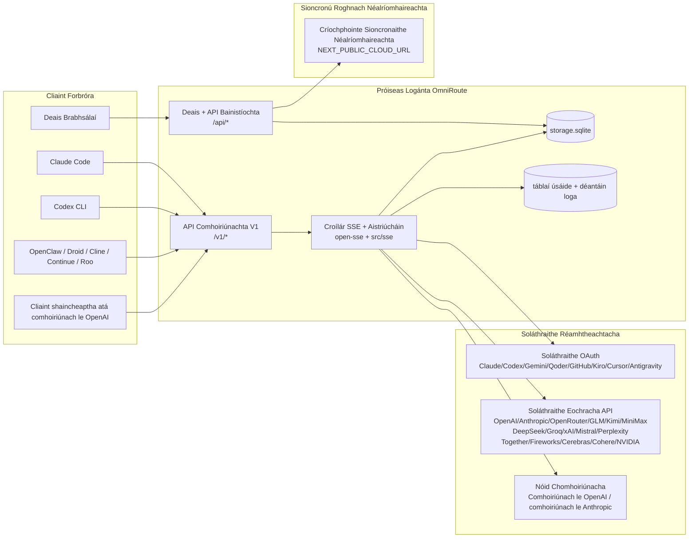
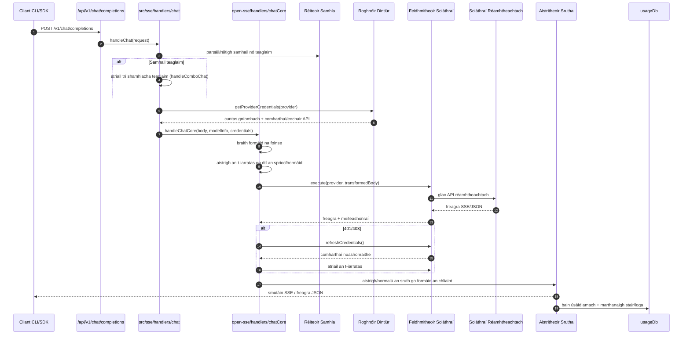
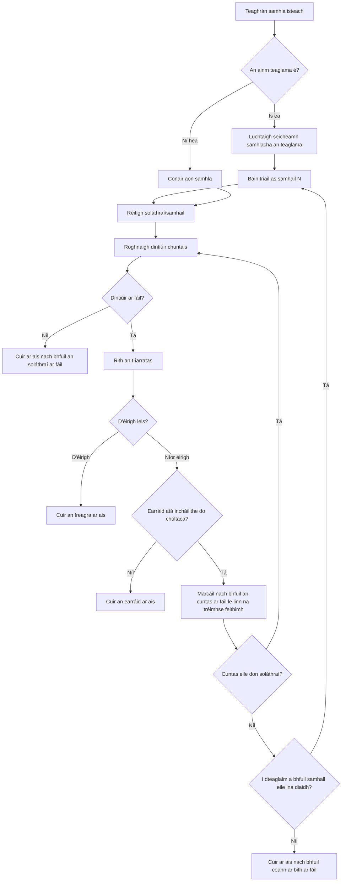
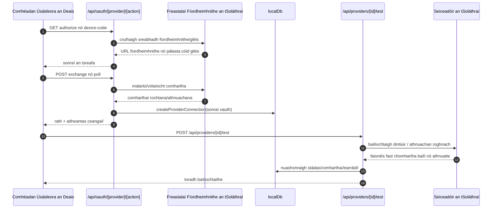
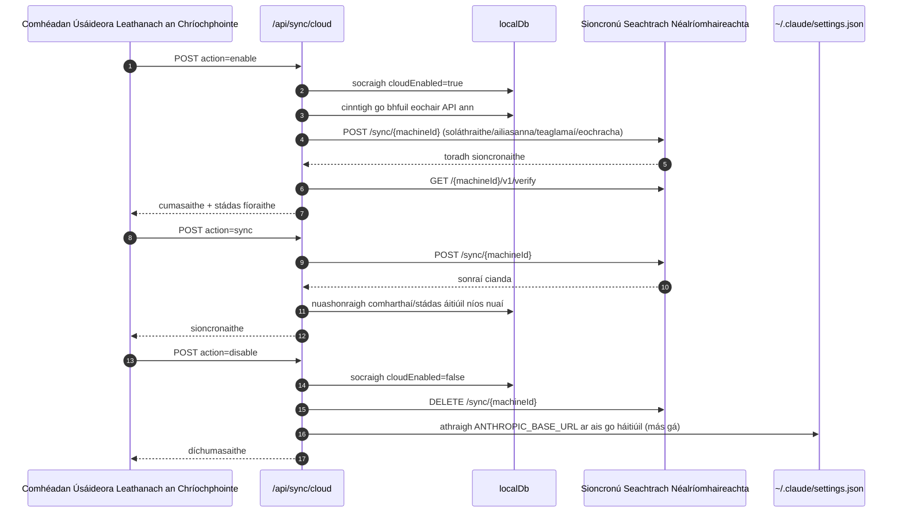
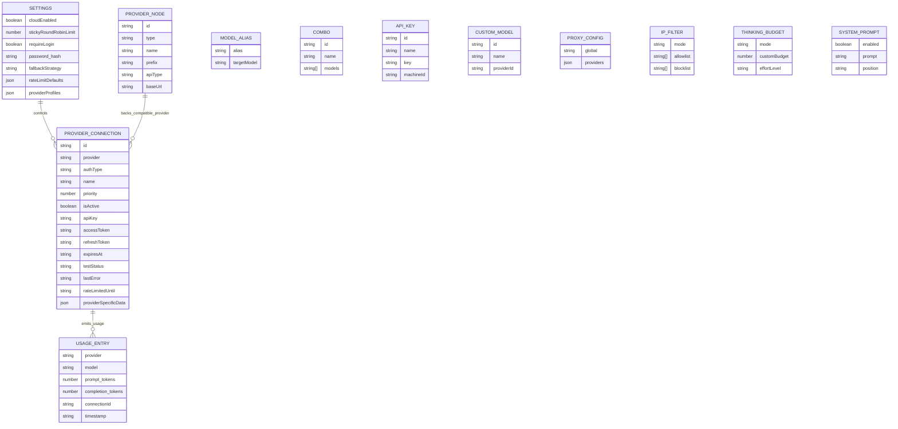
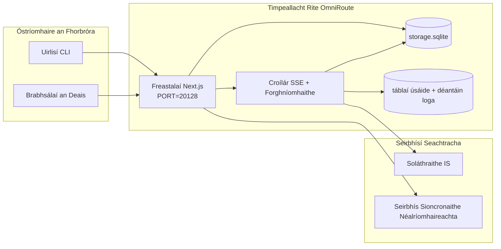

# OmniRoute Architecture (Gaeilge)

🌐 **Languages:** 🇺🇸 [English](../../../../architecture/ARCHITECTURE.md) · 🇪🇹 [am](../../../am/docs/architecture/ARCHITECTURE.md) · 🇸🇦 [ar](../../../ar/docs/architecture/ARCHITECTURE.md) · 🇦🇿 [az](../../../az/docs/architecture/ARCHITECTURE.md) · 🇧🇬 [bg](../../../bg/docs/architecture/ARCHITECTURE.md) · 🇧🇩 [bn](../../../bn/docs/architecture/ARCHITECTURE.md) · 🇧🇦 [bs](../../../bs/docs/architecture/ARCHITECTURE.md) · 🇨🇿 [cs](../../../cs/docs/architecture/ARCHITECTURE.md) · 🇩🇰 [da](../../../da/docs/architecture/ARCHITECTURE.md) · 🇩🇪 [de](../../../de/docs/architecture/ARCHITECTURE.md) · 🇬🇷 [el](../../../el/docs/architecture/ARCHITECTURE.md) · 🇪🇸 [es](../../../es/docs/architecture/ARCHITECTURE.md) · 🇪🇪 [et](../../../et/docs/architecture/ARCHITECTURE.md) · 🇮🇷 [fa](../../../fa/docs/architecture/ARCHITECTURE.md) · 🇫🇮 [fi](../../../fi/docs/architecture/ARCHITECTURE.md) · 🇫🇷 [fr](../../../fr/docs/architecture/ARCHITECTURE.md) · 🇮🇳 [gu](../../../gu/docs/architecture/ARCHITECTURE.md) · 🇳🇬 [ha](../../../ha/docs/architecture/ARCHITECTURE.md) · 🇮🇱 [he](../../../he/docs/architecture/ARCHITECTURE.md) · 🇮🇳 [hi](../../../hi/docs/architecture/ARCHITECTURE.md) · 🇭🇷 [hr](../../../hr/docs/architecture/ARCHITECTURE.md) · 🇭🇺 [hu](../../../hu/docs/architecture/ARCHITECTURE.md) · 🇦🇲 [hy](../../../hy/docs/architecture/ARCHITECTURE.md) · 🇮🇩 [id](../../../id/docs/architecture/ARCHITECTURE.md) · 🇳🇬 [ig](../../../ig/docs/architecture/ARCHITECTURE.md) · 🇮🇹 [it](../../../it/docs/architecture/ARCHITECTURE.md) · 🇯🇵 [ja](../../../ja/docs/architecture/ARCHITECTURE.md) · 🇬🇪 [ka](../../../ka/docs/architecture/ARCHITECTURE.md) · 🇰🇭 [km](../../../km/docs/architecture/ARCHITECTURE.md) · 🇮🇳 [kn](../../../kn/docs/architecture/ARCHITECTURE.md) · 🇰🇷 [ko](../../../ko/docs/architecture/ARCHITECTURE.md) · 🇱🇹 [lt](../../../lt/docs/architecture/ARCHITECTURE.md) · 🇱🇻 [lv](../../../lv/docs/architecture/ARCHITECTURE.md) · 🇮🇳 [ml](../../../ml/docs/architecture/ARCHITECTURE.md) · 🇮🇳 [mr](../../../mr/docs/architecture/ARCHITECTURE.md) · 🇲🇾 [ms](../../../ms/docs/architecture/ARCHITECTURE.md) · 🇲🇹 [mt](../../../mt/docs/architecture/ARCHITECTURE.md) · 🇲🇲 [my](../../../my/docs/architecture/ARCHITECTURE.md) · 🇳🇵 [ne](../../../ne/docs/architecture/ARCHITECTURE.md) · 🇳🇱 [nl](../../../nl/docs/architecture/ARCHITECTURE.md) · 🇳🇴 [no](../../../no/docs/architecture/ARCHITECTURE.md) · 🇮🇳 [or](../../../or/docs/architecture/ARCHITECTURE.md) · 🇮🇳 [pa](../../../pa/docs/architecture/ARCHITECTURE.md) · 🇵🇭 [phi](../../../phi/docs/architecture/ARCHITECTURE.md) · 🇵🇱 [pl](../../../pl/docs/architecture/ARCHITECTURE.md) · 🇵🇹 [pt](../../../pt/docs/architecture/ARCHITECTURE.md) · 🇧🇷 [pt-BR](../../../pt-BR/docs/architecture/ARCHITECTURE.md) · 🇷🇴 [ro](../../../ro/docs/architecture/ARCHITECTURE.md) · 🇷🇺 [ru](../../../ru/docs/architecture/ARCHITECTURE.md) · 🇱🇰 [si](../../../si/docs/architecture/ARCHITECTURE.md) · 🇸🇰 [sk](../../../sk/docs/architecture/ARCHITECTURE.md) · 🇸🇮 [sl](../../../sl/docs/architecture/ARCHITECTURE.md) · 🇷🇸 [sr](../../../sr/docs/architecture/ARCHITECTURE.md) · 🇸🇪 [sv](../../../sv/docs/architecture/ARCHITECTURE.md) · 🇰🇪 [sw](../../../sw/docs/architecture/ARCHITECTURE.md) · 🇮🇳 [ta](../../../ta/docs/architecture/ARCHITECTURE.md) · 🇮🇳 [te](../../../te/docs/architecture/ARCHITECTURE.md) · 🇹🇭 [th](../../../th/docs/architecture/ARCHITECTURE.md) · 🇹🇷 [tr](../../../tr/docs/architecture/ARCHITECTURE.md) · 🇺🇦 [uk-UA](../../../uk-UA/docs/architecture/ARCHITECTURE.md) · 🇵🇰 [ur](../../../ur/docs/architecture/ARCHITECTURE.md) · 🇺🇿 [uz](../../../uz/docs/architecture/ARCHITECTURE.md) · 🇻🇳 [vi](../../../vi/docs/architecture/ARCHITECTURE.md) · 🇳🇬 [yo](../../../yo/docs/architecture/ARCHITECTURE.md) · 🇨🇳 [zh-CN](../../../zh-CN/docs/architecture/ARCHITECTURE.md) · 🇹🇼 [zh-TW](../../../zh-TW/docs/architecture/ARCHITECTURE.md)

---

🌐 **Languages:** 🇺🇸 [English](../../../../architecture/ARCHITECTURE.md) · 🇪🇹 [am](../../../am/docs/architecture/ARCHITECTURE.md) · 🇸🇦 [ar](../../../ar/docs/architecture/ARCHITECTURE.md) · 🇦🇿 [az](../../../az/docs/architecture/ARCHITECTURE.md) · 🇧🇬 [bg](../../../bg/docs/architecture/ARCHITECTURE.md) · 🇧🇩 [bn](../../../bn/docs/architecture/ARCHITECTURE.md) · 🇧🇦 [bs](../../../bs/docs/architecture/ARCHITECTURE.md) · 🇨🇿 [cs](../../../cs/docs/architecture/ARCHITECTURE.md) · 🇩🇰 [da](../../../da/docs/architecture/ARCHITECTURE.md) · 🇩🇪 [de](../../../de/docs/architecture/ARCHITECTURE.md) · 🇬🇷 [el](../../../el/docs/architecture/ARCHITECTURE.md) · 🇪🇸 [es](../../../es/docs/architecture/ARCHITECTURE.md) · 🇪🇪 [et](../../../et/docs/architecture/ARCHITECTURE.md) · 🇮🇷 [fa](../../../fa/docs/architecture/ARCHITECTURE.md) · 🇫🇮 [fi](../../../fi/docs/architecture/ARCHITECTURE.md) · 🇫🇷 [fr](../../../fr/docs/architecture/ARCHITECTURE.md) · 🇮🇳 [gu](../../../gu/docs/architecture/ARCHITECTURE.md) · 🇳🇬 [ha](../../../ha/docs/architecture/ARCHITECTURE.md) · 🇮🇱 [he](../../../he/docs/architecture/ARCHITECTURE.md) · 🇮🇳 [hi](../../../hi/docs/architecture/ARCHITECTURE.md) · 🇭🇷 [hr](../../../hr/docs/architecture/ARCHITECTURE.md) · 🇭🇺 [hu](../../../hu/docs/architecture/ARCHITECTURE.md) · 🇦🇲 [hy](../../../hy/docs/architecture/ARCHITECTURE.md) · 🇮🇩 [id](../../../id/docs/architecture/ARCHITECTURE.md) · 🇳🇬 [ig](../../../ig/docs/architecture/ARCHITECTURE.md) · 🇮🇹 [it](../../../it/docs/architecture/ARCHITECTURE.md) · 🇯🇵 [ja](../../../ja/docs/architecture/ARCHITECTURE.md) · 🇬🇪 [ka](../../../ka/docs/architecture/ARCHITECTURE.md) · 🇰🇭 [km](../../../km/docs/architecture/ARCHITECTURE.md) · 🇮🇳 [kn](../../../kn/docs/architecture/ARCHITECTURE.md) · 🇰🇷 [ko](../../../ko/docs/architecture/ARCHITECTURE.md) · 🇱🇹 [lt](../../../lt/docs/architecture/ARCHITECTURE.md) · 🇱🇻 [lv](../../../lv/docs/architecture/ARCHITECTURE.md) · 🇮🇳 [ml](../../../ml/docs/architecture/ARCHITECTURE.md) · 🇮🇳 [mr](../../../mr/docs/architecture/ARCHITECTURE.md) · 🇲🇾 [ms](../../../ms/docs/architecture/ARCHITECTURE.md) · 🇲🇹 [mt](../../../mt/docs/architecture/ARCHITECTURE.md) · 🇲🇲 [my](../../../my/docs/architecture/ARCHITECTURE.md) · 🇳🇵 [ne](../../../ne/docs/architecture/ARCHITECTURE.md) · 🇳🇱 [nl](../../../nl/docs/architecture/ARCHITECTURE.md) · 🇳🇴 [no](../../../no/docs/architecture/ARCHITECTURE.md) · 🇮🇳 [or](../../../or/docs/architecture/ARCHITECTURE.md) · 🇮🇳 [pa](../../../pa/docs/architecture/ARCHITECTURE.md) · 🇵🇭 [phi](../../../phi/docs/architecture/ARCHITECTURE.md) · 🇵🇱 [pl](../../../pl/docs/architecture/ARCHITECTURE.md) · 🇵🇹 [pt](../../../pt/docs/architecture/ARCHITECTURE.md) · 🇧🇷 [pt-BR](../../../pt-BR/docs/architecture/ARCHITECTURE.md) · 🇷🇴 [ro](../../../ro/docs/architecture/ARCHITECTURE.md) · 🇷🇺 [ru](../../../ru/docs/architecture/ARCHITECTURE.md) · 🇱🇰 [si](../../../si/docs/architecture/ARCHITECTURE.md) · 🇸🇰 [sk](../../../sk/docs/architecture/ARCHITECTURE.md) · 🇸🇮 [sl](../../../sl/docs/architecture/ARCHITECTURE.md) · 🇷🇸 [sr](../../../sr/docs/architecture/ARCHITECTURE.md) · 🇸🇪 [sv](../../../sv/docs/architecture/ARCHITECTURE.md) · 🇰🇪 [sw](../../../sw/docs/architecture/ARCHITECTURE.md) · 🇮🇳 [ta](../../../ta/docs/architecture/ARCHITECTURE.md) · 🇮🇳 [te](../../../te/docs/architecture/ARCHITECTURE.md) · 🇹🇭 [th](../../../th/docs/architecture/ARCHITECTURE.md) · 🇹🇷 [tr](../../../tr/docs/architecture/ARCHITECTURE.md) · 🇺🇦 [uk-UA](../../../uk-UA/docs/architecture/ARCHITECTURE.md) · 🇵🇰 [ur](../../../ur/docs/architecture/ARCHITECTURE.md) · 🇺🇿 [uz](../../../uz/docs/architecture/ARCHITECTURE.md) · 🇻🇳 [vi](../../../vi/docs/architecture/ARCHITECTURE.md) · 🇳🇬 [yo](../../../yo/docs/architecture/ARCHITECTURE.md) · 🇨🇳 [zh-CN](../../../zh-CN/docs/architecture/ARCHITECTURE.md) · 🇹🇼 [zh-TW](../../../zh-TW/docs/architecture/ARCHITECTURE.md)

_Nuashonraithe an uair dheireanach: 2026-06-28_

## Achoimre Feidhmiúcháin

Is geata ródaithe IS áitiúil agus deais é OmniRoute atá tógtha ar Next.js.
Soláthraíonn sé críochphointe aonair atá comhoiriúnach le OpenAI (`/v1/*`) agus ródaíonn sé trácht thar roinnt soláthraithe réamhtheachtacha, le haistriúchán, cúltaca, athnuachan comharthaí agus rianú úsáide.

Príomhchumais:

- Dromchla API atá comhoiriúnach le OpenAI le haghaidh CLI/uirlisí (355 soláthraí, 108 seiceadóir)
- Aistriú iarrataí/freagraí idir formáidí soláthraithe
- Cúltaca teaglama samhlacha (seicheamh ilsamhla)
- Céimeanna struchtúrtha teaglama (`provider + model + connection`) le hordú ag am rite de réir `compositeTiers`
- Cúltaca ar leibhéal an chuntais (ilchuntais in aghaidh an tsoláthraí)
- Réamhsheiceáil cuóta agus roghnú cuntais P2C atá feasach ar chuóta i bpríomhchonair an chomhrá
- Bainistiú nasc soláthraithe trí OAuth + eochair API (22 modúl soláthraí OAuth)
- Giniúint leabaithe trí `/v1/embeddings` (18 soláthraí)
- Giniúint íomhánna trí `/v1/images/generations` (10+ soláthraí, 20+ samhail)
- Tras-scríobh fuaime trí `/v1/audio/transcriptions` (18 soláthraí)
- Téacs-go-hurlabhra trí `/v1/audio/speech` (24 soláthraí ionsuite)
- Giniúint físeáin trí `/v1/videos/generations` (ComfyUI + SD WebUI)
- Giniúint ceoil trí `/v1/music/generations` (ComfyUI)
- Cuardach gréasáin trí `/v1/search` (20 soláthraí)
- Modhnóireacht trí `/v1/moderations`
- Athrangú trí `/v1/rerank`
- Parsáil clibeanna machnaimh (`<think>...</think>`) le haghaidh samhlacha réasúnaithe
- Sláintiú freagraí ar mhaithe le comhoiriúnacht dhocht le OpenAI SDK
- Normalú ról (developer→system, system→user) ar mhaithe le comhoiriúnacht idir soláthraithe
- Tiontú aschuir struchtúrtha (json_schema → Gemini responseSchema)
- Marthanacht áitiúil do sholáthraithe, eochracha, ailiasanna, teaglamaí, socruithe agus praghsáil (122 modúl DB)
- Rianú úsáide/costais agus logáil iarrataí
- Sioncronú néil roghnach le haghaidh sioncronú ilghléas/stáit
- Liosta ceada/liosta coiscthe IP le haghaidh rialú rochtana API
- Bainistiú buiséid machnaimh (pasáil tríd/uathoibríoch/saincheaptha/oiriúnaitheach)
- Instealladh leid chórais dhomhanda
- Rianú seisiún agus méarlorgú
- Teorannú ráta feabhsaithe in aghaidh an chuntais le próifílí a bhaineann go sonrach le soláthraithe
- Patrún scoradáin chiorcaid ar mhaithe le hathléimneacht soláthraithe
- Cosaint ar thréad toirní le glasáil mutex
- Taisce dí-dhúblála iarrataí atá bunaithe ar shíniú
- Sraith fearainn: rialacha costais, beartas cúltaca, beartas frithdhúnadh
- Athsheachadadh Comhthéacs: achoimrí aistrithe seisiúin chun leanúnachas a choinneáil le linn rothlú cuntas
- Marthanacht staide fearainn (taisce scríofa-tríd SQLite le haghaidh cúltacaí, buiséad, frithdhúnadh agus scoradán ciorcaid)
- Inneall beartais le haghaidh meastóireacht láraithe iarrataí (frithdhúnadh → buiséad → cúltaca)
- Teiliméadracht iarrataí le comhiomlánú aga folaigh p50/p95/p99
- Teiliméadracht sprice teaglama agus sláinte stairiúil sprice teaglama trí `combo_execution_key` / `combo_step_id`
- Aitheantas comhghaolúcháin (X-Request-Id) le haghaidh rianú ó cheann ceann
- Logáil iniúchta comhlíontachta le rogha díliostála in aghaidh na heochrach API
- Creat meastóireachta le haghaidh dearbhú cáilíochta LLM
- Deais sláinte le stádas fíor-ama scoradáin chiorcaid soláthraithe
- Freastalaí MCP (110 uirlis) le 3 mhodh iompair (stdio/SSE/Streamable HTTP)
- Freastalaí A2A (JSON-RPC 2.0 + SSE) le scileanna agus saolré tascanna
- Córas cuimhne (eastóscadh, instealladh, aisghabháil, achoimriú)
- Córas scileanna (clárlann, seiceadóir, bosca gainimh, scileanna ionsuite)
- Seachfhreastalaí MITM le bainistiú teastas agus láimhseáil DNS
- Lár-earraí cosanta ar instealladh leid
- Píblíne comhbhrúite leid le Caveman, RTK, píblínte cruachta, teaglamaí comhbhrúite, pacáistí teanga agus anailísíocht
- Clárlann ACP (Agent Communication Protocol)
- Soláthraithe modúlacha OAuth (22 modúl aonair faoi `src/lib/oauth/providers/`)
- Scripteanna díshuiteála/díshuiteála iomláine
- Gníomh deisiúcháin timpeallachta OAuth
- Droichead WebSocket do chliaint WS atá comhoiriúnach le OpenAI (`/v1/ws`)
- Bainistiú comharthaí sioncronaithe (eisiúint/cúlghairm, íoslódáil cuachta cumraíochta le leaganú ETag)
- GLM Thinking (`glmt`) mar réamhshocrú soláthraí den chéad scoth
- Comhaireamh hibrideach comharthaí (`/messages/count_tokens` ar thaobh an tsoláthraí le cúltaca meastacháin)
- Réamhshíolú uathoibríoch ailiasanna samhlacha (30+ normalú canúna tras-seachfhreastalaí ag am tosaithe)
- Aisghabháil shábháilte amach le cosaint SSRF, blocáil URL príobháideach agus atriail inchumraithe
- Atrialacha comhrá atá feasach ar thréimhse mharbhánta le `requestRetry` agus `maxRetryIntervalSec` inchumraithe
- Bailíochtú timpeallachta rite le Zod ag am tosaithe
- Iniúchadh comhlíontachta v2 le huimhriú leathanach, teagmhais CRUD soláthraithe agus logáil bailíochtaithe arna blocáil ag SSRF

Príomhmhúnla rite:

- Cuireann bealaí feidhmchláir Next.js faoi `src/app/api/*` APIanna deaise agus APIanna comhoiriúnachta araon i bhfeidhm
- Láimhseálann croílár comhroinnte SSE/ródaithe in `src/sse/*` + `open-sse/*` cur i gcrích soláthraithe, aistriú, sruthú, cúltaca agus úsáid

## Léaráidí Tagartha

Tá foinsí canónacha Mermaid faoi rialú leaganacha don ardán v3.8.0 le fáil in
[`docs/diagrams/`](../diagrams/README.md). Tá dhá cheann díobh atáirgthe thíos mar threoir;
tá na cinn eile nasctha óna dtreoracha sainiúla fearainn.


> Foinse: [diagrams/request-pipeline.mmd](../diagrams/request-pipeline.mmd)


> Foinse: [diagrams/resilience-3layers.mmd](../diagrams/resilience-3layers.mmd) — nasctha freisin ó
> [RESILIENCE_GUIDE.md](./RESILIENCE_GUIDE.md) agus ó thagairt athléimneachta `CLAUDE.md`.

## Raon Feidhme agus Teorainneacha

### Laistigh den Raon Feidhme

- Am rite an gheata áitiúil
- APIanna bainistíochta an phainéil
- Fíordheimhniú soláthraí agus athnuachan ceadchomharthaí
- Aistriú iarratas agus sruthú SSE
- Staid áitiúil + buanseasmhacht sonraí úsáide
- Ordanú roghnach sioncronaithe néil

### Lasmuigh den Raon Feidhme

- Cur chun feidhme na seirbhíse néil taobh thiar de `NEXT_PUBLIC_CLOUD_URL`
- SLA/eitleán rialaithe an tsoláthraí lasmuigh den phróiseas áitiúil
- Na dénártha seachtracha CLI féin (Claude CLI, Codex CLI, etc.)

## Dromchla an Phainéil (Reatha)

Na príomhleathanaigh faoi `src/app/(dashboard)/dashboard/`:

- `/dashboard` — tús tapa + forbhreathnú ar sholáthraithe
- `/dashboard/endpoint` — seachfhreastalaí críochphointe + MCP + A2A + cluaisíní críochphointe API
- `/dashboard/providers` — naisc agus dintiúir soláthraithe
- `/dashboard/combos` — straitéisí teaglama, teimpléid, tógálaí céimbhunaithe, rialacha ródaithe samhlacha, ord buanaithe de láimh
- `/dashboard/auto-combo` — Inneall Uath-Theaglama: ualuithe scórála, pacáistí móid, réamhshocruithe monarchan fíorúla, teiliméadracht
- `/dashboard/costs` — comhiomlánú costas agus infheictheacht praghsála
- `/dashboard/analytics` — anailísíocht úsáide, meastóireachtaí, sláinte spriocanna teaglama
- `/dashboard/limits` — rialuithe cuóta/ráta
- `/dashboard/cli-tools` — ionduchtú CLI, brath ama rite, giniúint cumraíochta
- `/dashboard/agents` — gníomhairí ACP braite + clárú gníomhairí saincheaptha
- `/dashboard/cloud-agents` — tascanna gníomhairí néalóstáilte (Codex Cloud, Devin, Jules) agus saolré tascanna
- `/dashboard/skills` — clárlann scileanna A2A, rith i mbosca gainimh, catalóg scileanna ionsuite
- `/dashboard/memory` — iniúchadh agus aisghabháil cuimhne comhrá marthanaí
- `/dashboard/webhooks` — síntiúis webhook amach, rothlú rún, staitisticí atrialacha
- `/dashboard/batch` — cur isteach baiscphost agus dul chun cinn
- `/dashboard/cache` — staitisticí taisce léite tríd agus taisce réasúnaíochta, rialuithe díshealbhaithe
- `/dashboard/playground` — clós súgartha comhrá idirghníomhach in aghaidh aon teaglama/samhla cumraithe
- `/dashboard/changelog` — amharcán loga athruithe laistigh den aip (rindreálann sé `CHANGELOG.md`)
- `/dashboard/system` — diagnóisic ama rite, faisnéis leagain, dromchla bailíochtaithe timpeallachta
- `/dashboard/onboarding` — treoraí socraithe céadrite le haghaidh suiteálacha nua
- `/dashboard/media` — clós súgartha íomhánna/físeáin/ceoil
- `/dashboard/search-tools` — tástáil soláthraithe cuardaigh agus stair
- `/dashboard/health` — aga fónaimh, scoradáin chiorcaid, teorainneacha ráta, seisiúin faoi mhonatóireacht cuóta
- `/dashboard/logs` — logaí iarratais/seachfhreastalaí/iniúchta/consóil
- `/dashboard/settings` — cluaisíní socruithe córais (ginearálta, ródú, réamhshocruithe teaglama, etc.)
- `/dashboard/context/caveman` — rialacha comhbhrúite Caveman, pacáistí teanga, réamhamharc, agus mód aschuir
- `/dashboard/context/rtk` — scagairí aschuir orduithe RTK, réamhamharc, agus socruithe sábháilteachta ama rite
- `/dashboard/context/combos` — píblínte comhbhrúite ainmnithe a shanntar do theaglamaí ródaithe
- `/dashboard/translator` — iniúchadh aistritheora agus réamhamharc ar thiontú formáide iarratais
- `/dashboard/audit` — brabhsálaí loga iniúchta comhlíontachta le huimhriú leathanach agus meiteashonraí struchtúrtha
- `/dashboard/usage` — brabhsálaí úsáide de réir iarratais atá ceangailte le `usage_history`
- `/dashboard/compression` — anailísíocht comhbhrúite, staitisticí, agus sannadh píblínte
- `/dashboard/api-manager` — saolré eochracha API agus ceadanna samhlacha

## Comhthéacs Ardleibhéil an Chórais



## Croí-Chomhpháirteanna Am-Rite

## 1) Sraith API agus Ródaithe (Bealaí Aipe Next.js)

Príomh-eolairí:

- `src/app/api/v1/*` agus `src/app/api/v1beta/*` le haghaidh APIanna comhoiriúnachta
- `src/app/api/*` le haghaidh APIanna bainistíochta/cumraíochta
- Mapálann athscríobhacha Next in `next.config.mjs` `/v1/*` chuig `/api/v1/*`

Bealaí tábhachtacha comhoiriúnachta:

- `src/app/api/v1/chat/completions/route.ts`
- `src/app/api/v1/messages/route.ts`
- `src/app/api/v1/responses/route.ts`
- `src/app/api/v1/models/route.ts` — áirítear samhlacha saincheaptha le `custom: true`
- `src/app/api/v1/embeddings/route.ts` — giniúint leabuithe (6 sholáthraí)
- `src/app/api/v1/images/generations/route.ts` — giniúint íomhánna (4+ soláthraí, Antigravity/Nebius san áireamh)
- `src/app/api/v1/messages/count_tokens/route.ts`
- `src/app/api/v1/providers/[provider]/chat/completions/route.ts` — comhrá tiomnaithe de réir soláthraí
- `src/app/api/v1/providers/[provider]/embeddings/route.ts` — leabuithe tiomnaithe de réir soláthraí
- `src/app/api/v1/providers/[provider]/images/generations/route.ts` — íomhánna tiomnaithe de réir soláthraí
- `src/app/api/v1beta/models/route.ts`
- `src/app/api/v1beta/models/[...path]/route.ts`

Fearainn bhainistíochta:

- Fíordheimhniú/socruithe: `src/app/api/auth/*`, `src/app/api/settings/*`
- Soláthraithe/naisc: `src/app/api/providers*`
- Nóid soláthraithe: `src/app/api/provider-nodes*`
- Samhlacha saincheaptha: `src/app/api/provider-models` (GET/POST/DELETE)
- Catalóg samhlacha: `src/app/api/models/route.ts` (GET)
- Cumraíocht seachfhreastalaí: `src/app/api/settings/proxy` (GET/PUT/DELETE) + `src/app/api/settings/proxy/test` (POST)
- OAuth: `src/app/api/oauth/*`
- Eochracha/ailiasanna/teaglamaí/praghsáil: `src/app/api/keys*`, `src/app/api/models/alias`, `src/app/api/combos*`, `src/app/api/pricing`
- Úsáid: `src/app/api/usage/*`
- Sioncronú/néalríomhaireacht: `src/app/api/sync/*`, `src/app/api/cloud/*`
- Cúntóirí uirlisí CLI: `src/app/api/cli-tools/*`
- Scagaire IP: `src/app/api/settings/ip-filter` (GET/PUT)
- Buiséad smaointeoireachta: `src/app/api/settings/thinking-budget` (GET/PUT)
- Leid chórais: `src/app/api/settings/system-prompt` (GET/PUT)
- Comhbhrú: `src/app/api/settings/compression`, `src/app/api/compression/*`, agus
  `src/app/api/context/*`
- Seisiúin: `src/app/api/sessions` (GET)
- Teorainneacha ráta: `src/app/api/rate-limits` (GET)
- Athléimneacht: `src/app/api/resilience` (GET/PATCH) — scuaine iarratas, tréimhse shuaimhnithe naisc, scoradán soláthraí, cumraíocht feithimh ar thréimhse shuaimhnithe
- Athshocrú athléimneachta: `src/app/api/resilience/reset` (POST) — athshocraigh scoradáin soláthraithe
- Staitisticí taisce: `src/app/api/cache/stats` (GET/DELETE)
- Teiliméadracht: `src/app/api/telemetry/summary` (GET)
- Buiséad: `src/app/api/usage/budget` (GET/POST)
- Slabhraí cúltaca: `src/app/api/fallback/chains` (GET/POST/DELETE)
- Iniúchadh comhlíontachta: `src/app/api/compliance/audit-log` (GET, le huimhriú leathanach + meiteashonraí struchtúrtha)
- Meastóireachtaí: `src/app/api/evals` (GET/POST), `src/app/api/evals/[suiteId]` (GET)
- Beartais: `src/app/api/policies` (GET/POST)
- Comharthaí sioncronaithe: `src/app/api/sync/tokens` (GET/POST), `src/app/api/sync/tokens/[id]` (GET/DELETE)
- Beart cumraíochta: `src/app/api/sync/bundle` (GET, seat den leagan arna shainaithint le ETag de shocruithe/soláthraithe/teaglamaí/eochracha)
- WebSocket: `src/app/api/v1/ws/route.ts` — láimhseálaí Upgrade do chliaint WS atá comhoiriúnach le OpenAI

## 2) SSE + Croílár Aistriúcháin

Príomh-mhodúil an tsreafa:

- Pointe iontrála: `src/sse/handlers/chat.ts`
- Croí-cheolfhoireann: `open-sse/handlers/chatCore.ts`
- Cuibheoirí rite soláthraithe: `open-sse/executors/*`
- Brath formáide/cumraíocht soláthraí: `open-sse/services/provider.ts`
- Parsáil/réiteach samhla: `src/sse/services/model.ts`, `open-sse/services/model.ts`
- Loighic chúltaca cuntais: `open-sse/services/accountFallback.ts`
- Clárlann aistriúcháin: `open-sse/translator/index.ts`
- Claochluithe srutha: `open-sse/utils/stream.ts`, `open-sse/utils/streamHandler.ts`
- Aistarraingt/normalú úsáide: `open-sse/utils/usageTracking.ts`
- Parsálaí clibe smaointeoireachta: `open-sse/utils/thinkTagParser.ts`
- Láimhseálaí leabaithe: `open-sse/handlers/embeddings.ts`
- Clárlann soláthraithe leabaithe: `open-sse/config/embeddingRegistry.ts`
- Láimhseálaí giniúna íomhánna: `open-sse/handlers/imageGeneration.ts`
- Clárlann soláthraithe íomhánna: `open-sse/config/imageRegistry.ts`
- Sláintiú freagartha: `open-sse/handlers/responseSanitizer.ts`
- Normalú ról: `open-sse/services/roleNormalizer.ts`

Seirbhísí (loighic ghnó):

- Roghnú/scóráil cuntas: `open-sse/services/accountSelector.ts`
- Bainistiú shaolré an chomhthéacs: `open-sse/services/contextManager.ts`
- Forfheidhmiú scagaire IP: `open-sse/services/ipFilter.ts`
- Rianú seisiún: `open-sse/services/sessionManager.ts`
- Dí-dhúbailt iarratas: `open-sse/services/signatureCache.ts`
- Instealladh leid chórais: `open-sse/services/systemPrompt.ts`
- Bainistiú bhuiséad smaointeoireachta: `open-sse/services/thinkingBudget.ts`
- Ródú samhlacha saoróige: `open-sse/services/wildcardRouter.ts`
- Bainistiú teorann ráta: `open-sse/services/rateLimitManager.ts`
- Scoradán ciorcaid: `src/shared/utils/circuitBreaker.ts`
- Aistriú comhthéacs: `open-sse/services/contextHandoff.ts` — achoimre aistrithe a ghiniúint agus a instealladh don straitéis athsheachadta comhthéacs
- Comhbhrú: `open-sse/services/compression/*` — comhbhrú réamhghníomhach roimh aistriú an tsoláthraí;
  áirítear rialacha Caveman, scagairí RTK, píblínte cruachta, teaglamaí comhbhrúcháin, staitisticí agus bailíochtú
- Aisghabhálaí cuóta Codex: `open-sse/services/codexQuotaFetcher.ts` — aisghabhann sé cuóta Codex le haghaidh cinntí aistrithe athsheachadta comhthéacs
- Atriail atá feasach ar an tréimhse mharbhánta: `src/sse/services/cooldownAwareRetry.ts` — atrialacha tréimhse marbhánta in aghaidh na samhla le `requestRetry` / `maxRetryIntervalSec` inchumraithe
- Aisghabháil shábháilte amach: `src/shared/network/safeOutboundFetch.ts` — aisghabháil chosanta soláthraí/samhla le cosaint SSRF, blocáil URLanna príobháideacha, atriail agus teorainn ama
- Garda URL amach: `src/shared/network/outboundUrlGuard.ts` — bailíochtaíonn sé URLanna soláthraithe i gcoinne raonta CIDR príobháideacha/localhost
- Réamhshocruithe iarratais soláthraí: `open-sse/services/providerRequestDefaults.ts` — réamhshocruithe `maxTokens`, `temperature`, `thinkingBudgetTokens` ar leibhéal an tsoláthraí
- Tairisigh sholáthraí GLM: `open-sse/config/glmProvider.ts` — samhlacha comhroinnte GLM, URLanna cuóta, teorainn ama/réamhshocruithe GLMT
- Réamhtheagmhas Antigravity: `open-sse/config/antigravityUpstream.ts` — bun-URL agus tairisigh chonair aimsithe
- Tairisigh chliaint Codex: `open-sse/config/codexClient.ts` — luachanna gníomhaire úsáideora agus leagan cliaint a bhfuil leagan sonraithe acu
- Síol ailias samhla: `src/lib/modelAliasSeed.ts` — síolaíonn sé breis agus 30 ailias canúna tras-seachfhreastalaí ag am tosaithe

Modúil shraith an fhearainn:

- Rialacha costais/buiséid: `src/domain/costRules.ts`
- Beartas cúltaca: `src/domain/fallbackPolicy.ts`
- Réiteoir teaglamaí: `src/domain/comboResolver.ts`
- Beartas frithdhúnadh: `src/domain/lockoutPolicy.ts`
- Inneall beartais: `src/domain/policyEngine.ts` — meastóireacht láraithe frithdhúnadh → buiséad → cúltaca
- Catalóg cód earráide: `src/shared/constants/errorCodes.ts`
- Aitheantas iarratais: `src/shared/utils/requestId.ts`
- Teorainn ama aisghabhála: `src/shared/utils/fetchTimeout.ts`
- Teiliméadracht iarratais: `src/shared/utils/requestTelemetry.ts`
- Comhlíonadh/iniúchadh: `src/lib/compliance/index.ts`
- Riteoir meastóireachta: `src/lib/evals/evalRunner.ts`
- Marthanacht staid an fhearainn: `src/lib/db/domainState.ts` — SQLite CRUD le haghaidh slabhraí cúltaca, buiséad, stair costais, staid frithdhúnadh agus scoradáin chiorcaid

Modúil soláthraithe OAuth (22 chomhad aonair faoi `src/lib/oauth/providers/`):

- Innéacs clárlainne: `src/lib/oauth/providers/index.ts`
- Soláthraithe aonair: `agy.ts`, `antigravity.ts`, `claude.ts`, `cline.ts`, `codebuddy-cn.ts`, `codex.ts`, `cursor.ts`, `devin-desktop.ts`, `ghe-copilot.ts`, `github.ts`, `gitlab-duo.ts`, `grok-cli-oauth.ts`, `grok-cli.ts`, `kilocode.ts`, `kimi-coding.ts`, `kiro.ts`, `openference.ts`, `qoder.ts`, `trae.ts`, `xai-oauth.ts`, `zed-hosted.ts`, `zed.ts`
- Cumhdach tanaí: `src/lib/oauth/providers.ts` — athonnmhairíonn sé ó na modúil aonair

## 5) Seirbhísí Leabaithe (v3.8.4)

Is féidir le OmniRoute próisis uirlisí AI atá ag rith go háitiúil, ar a dtugtar
**seirbhísí leabaithe**, a shuiteáil, a mhaoirsiú agus iarratais a ródú chucu. Cuirtear cúig cinn ar fáil: 9Router, CLIProxyAPI, Bifrost, Mux agus Dario.

Sraitheanna ailtireachta:

- **Comhéadan úsáideora** (`/dashboard/providers/services`) — leathanach dhá chluaisín le rialuithe saolré,
  sruthú beo logaí, bainistíocht eochracha API, agus (i gcás 9Router) comhéadan úsáideora dúchasach leabaithe trí
  sheachfhreastalaí inmheánach droim ar ais.
- **API** (`/api/services/{name}/*`) — 11 chríochphointe do 9Router, 10 do CLIProxyAPI, 8 gcinn an ceann do Bifrost / Mux / Dario,
  agus iad uile aicmithe mar **LOCAL_ONLY** (riail dhocht #17). Freastalaíonn críochphointe comhroinnte SSE `GET /api/services/[name]/logs`
  ar an dá sheirbhís.
- **Maoirseoir** (`src/lib/services/`) — fillteann an rang cineálach `ServiceSupervisor`
  `child_process.spawn`, coinníonn sé maolán fáinneach 5 MB le haghaidh sruthú logaí SSE, lúb
  taiscéalaíochta sláinte, glas oibríochta adamhach, agus múchadh mín SIGTERM→SIGKILL.
  Ceanglaíonn `bootstrap.ts` gach seirbhís chumraithe le chéile ag tús an phróisis.
- **Soláthraí/seiceadóir** (`open-sse/executors/ninerouter.ts`) — nochtar 9Router mar
  fhíorsholáthraí. Cuirtear an réimír `9router/{sub}/{model}` le samhlacha agus sioncronaítear iad gach 5 nóiméad
  ó chríochphointe `/v1/models` 9Router.

Mionléargas: `docs/frameworks/EMBEDDED-SERVICES.md`

## Príomh-Fhochórais (v3.8.0)

### A. Inneall Auto Combo

Scórálann agus roghnaíonn Auto Combo spriocanna ródaithe go dinimiciúil tráth an iarratais, seachas
a bheith ag brath ar shainmhíniú statach teaglama. Cumhachtaíonn sé teaghlach réimíreacha samhlacha `auto/*`.

- Pointe iontrála an innill: `open-sse/services/autoCombo/` (`autoComboEngine.ts`,
  `scoringEngine.ts`, `virtualFactory.ts`, `modePacks.ts`)
- Réiteoir: `src/domain/comboResolver.ts` (uathbhraiteadh na réimíre `auto/`)
- Deais: `/dashboard/auto-combo`
- Teiliméadracht: tábla SQLite `auto_combo_decisions`

Príomhchumais:

- **19 straitéis ródaithe** (tosaíocht, ualaithe, líonadh ar dtús, spideog bhabhta, P2C, randamach,
  is lú úsáide, optamaithe ó thaobh costais de, feasach ar athshocrú, fuinneog athshocraithe, spás breise, dianrandamach,
  **auto**, lkgp, optamaithe don chomhthéacs, athsheoladh comhthéacs, **fusion**, chomh maith le conair chúltaca) —
  is é auto an príomhbhreisiú in v3.8.0; tá `fusion` (scaipeadh chuig painéal + sintéis ó bhreitheamh,
  `open-sse/services/fusion.ts`) nua in v3.8.36.
- **Scóráil 16 fhachtóir**: cuóta, sláinte, costas inbhéartach, aga folaigh inbhéartach, oiriúnacht don tasc agus
  deich gcinn eile. Tá tábla canónach na bhfachtóirí agus a meáchain réamhshocraithe le fáil in
  [`docs/routing/AUTO-COMBO.md`](../routing/AUTO-COMBO.md) — dá n-athluafaí anseo é,
  bheadh an dara háit ann ina bhféadfadh sé dul as dáta.
- **Monarcha fhíorúil** a chruthaíonn teaglamaí sealadacha nuair nach bhfuil aon teaglama ainmnithe comhoiriúnach
  ann, agus iarrthóirí á bhfáil aici ó naisc shláintiúla ghníomhacha soláthraithe.
- **Réimíreanna uathoibríocha**: `auto/coding`, `auto/cheap`, `auto/fast`, `auto/offline`,
  `auto/smart`, `auto/lkgp` — próifíl mheáchain mhionchoigeartaithe mar bhonn le gach ceann acu.
- **6 phaca móid**: `ship-fast`, `cost-saver`, `quality-first`, `offline-friendly`,
  `reliability-first` agus `chaos-mode` — cumraíochtaí réamhshocraithe meáchain is féidir a ghlaoch ón
  deais. (Ná measc iad seo leis na réimíreanna `auto/*` thuas, ar malairtí iad
  a úsáidtear tráth an iarratais.)

Le haghaidh sonraí iomlána algartamacha (foirmlí fachtóirí, mionchoigeartú meáchain), féach
[`docs/routing/AUTO-COMBO.md`](../routing/AUTO-COMBO.md).

### B. Gníomhairí Néalríomhaireachta

Cuireann Cloud Agents ardáin óstáilte tríú páirtí do ghníomhairí códála (Codex Cloud, Devin,
Jules) taobh thiar de shaolré aonfhoirmeach tascanna a bhfuil bunachar sonraí mar thaca aici. Teastaíonn fíordheimhniú bainistíochta
ó gach críochphointe a chruthaíonn nó a iniúchann tascanna.

- Fréamh an mhodúil: `src/lib/cloudAgent/` (`baseAgent.ts`, `registry.ts`, `api.ts`,
  `types.ts`, `db.ts`, chomh maith le fochomhadlanna do gach gníomhaire faoi `agents/`)
- Cur chun feidhme de réir gníomhaire: `agents/codex/`, `agents/devin/`, `agents/jules/`
- Críochphointí poiblí: `/api/v1/agents/tasks/*` (liostú/cruthú/fáil/cealú)
- Críochphointí bainistíochta: `/api/cloud/*` (soláthar, stádas, baisc)
- Deais: `/dashboard/cloud-agents`
- Stóras: tábla `cloud_agent_tasks`

Le haghaidh sonraí faoi sholáthar agus OAuth de réir gníomhaire, féach
[`docs/frameworks/CLOUD_AGENT.md`](../frameworks/CLOUD_AGENT.md).

### C. Ráillí Cosanta

Is sraith mheánearraí in-athluchtaithe gan stad é modúl na ráillí cosanta, a scrúdaíonn iarratais
agus freagraí chun PII, instealladh leide agus ábhar amhairc neamhshábháilte a bhrath. I gcás sáruithe,
gearrtar an t-iarratas go gairid le HTTP **503** mar aon le cód earráide struchtúrtha, rud a ligeann
do ghlaoiteoirí iartheachtacha triail eile a bhaint as nó brainse eile a roghnú.

- Fréamh an mhodúil: `src/lib/guardrails/` (`base.ts`, `registry.ts`, `piiMasker.ts`,
  `promptInjection.ts`, `visionBridge.ts`, `visionBridgeHelpers.ts`)
- Athluchtú gan stad: déanann an chlárlann faire ar athruithe cumraíochta agus atógann sí an slabhra ina áit
- Pointí nasctha: iontráil láimhseálaí comhrá, láimhseálaí giniúna íomhánna, sláintitheoir freagraí
- Conradh HTTP: tagann sáruithe chun cinn mar `503` le `error.code = "GUARDRAIL_VIOLATION"`

Le haghaidh rialacha a chumadh agus tairseacha a mhionchoigeartú, féach
[`docs/security/GUARDRAILS.md`](../security/GUARDRAILS.md).

### D. Sraith Fearainn

Láraíonn an t-ainmspás `src/domain/` cinntí beartais ionas nach gá do láimhseálaithe bealaí
loighic frithdhúnadh/buiséid/chúltaca a chur le chéile iad féin.

- Inneall beartais: `src/domain/policyEngine.ts` — pointe iontrála aonair le haghaidh
  meastóireachta réamhfheidhmithe (frithdhúnadh → buiséad → ord cúltaca)
- Rialacha costais: `src/domain/costRules.ts`
- Beartas cúltaca: `src/domain/fallbackPolicy.ts`
- Beartas frithdhúnadh: `src/domain/lockoutPolicy.ts`
- Ródú bunaithe ar chlibeanna: `src/domain/tagRouter.ts`
- Réiteoir teaglama: `src/domain/comboResolver.ts` — réitíonn sé ainmneacha teaglamaí, réimíreanna auto/\*,
  agus spriocanna samhlacha saoróige ina bpleananna nithiúla feidhmithe
- Nascóir rialacha naisc/samhla: `src/domain/connectionModelRules.ts`
- Seatanna d'infhaighteacht samhlacha: `src/domain/modelAvailability.ts`
- Rianú éagtha soláthraithe: `src/domain/providerExpiration.ts`
- Taisce cuóta: `src/domain/quotaCache.ts`
- Staid díghrádaithe: `src/domain/degradation.ts`
- Iniúchadh cumraíochta: `src/domain/configAudit.ts`
- Tógálaí meiteashonraí freagraí OmniRoute: `src/domain/omnirouteResponseMeta.ts`
- Fochóras measúnaithe: `src/domain/assessment/` — jabanna meastóireachta tréimhsiúla

### E. Píblíne Údaraithe

Aicmíonn an phíblíne údaraithe gach iarratas isteach agus cuireann sí an
slabhra beartais cuí i bhfeidhm sula seoltar ar aghaidh é.

- Iontráil na píblíne: `src/server/authz/pipeline.ts`
- Aicmitheoir iarratas: `src/server/authz/classify.ts` — déanann sé idirdhealú idir bealaí poiblí
  comhoiriúnachta agus bealaí bainistíochta
- Fardal na mbealaí poiblí: `src/shared/constants/publicApiRoutes.ts`
- Beartais: `src/server/authz/policies/` — preideacáidí inchumtha
  (`requireApiKey`, `requireManagement`, `requireFreshAuth`, etc.)
- Fóntais ceanntásca: `src/server/authz/headers.ts`
- Cúntóir dearbhaithe: `src/server/authz/assertAuth.ts`
- Comhthéacs iarratais: `src/server/authz/context.ts`

Is teorainn dhocht í an teorainn idir bealaí poiblí agus bealaí bainistíochta: teastaíonn fíordheimhniú bainistíochta ó APIanna
gníomhaire/tréimhse shuaimhnithe agus ó athruithe soláthraí (HTTP 401 má tá sé ar iarraidh).

Le haghaidh rialacha iomlána aicmithe na mbealaí, féach
[`docs/architecture/AUTHZ_GUIDE.md`](./AUTHZ_GUIDE.md).

### F. Meaisín Staide Críochta Sreafa Oibre agus Ródaire atá Feasach ar Thascanna

Ródaire faoi stiúir meaisín staide críochta, atá cisealta os cionn roghnú teaglama, chun
trácht a stiúradh bunaithe ar chéim braite an tsreafa oibre (pleanáil, cur i gcrích,
athbhreithniú) agus ar chleamhnas le tascanna cúlra.

- Meaisín staide críochta an tsreafa oibre: `open-sse/services/workflowFSM.ts`
- Ródaire atá feasach ar thascanna: `open-sse/services/taskAwareRouter.ts`
- Brathadóir tascanna cúlra: `open-sse/services/backgroundTaskDetector.ts`
- Aicmitheoir intinne: `open-sse/services/intentClassifier.ts`

Cuirtear aistrithe an mheaisín staide críochta san áireamh i scóráil Auto Combo, rud a chlaonann i dtreo samhlacha níos saoire
le haghaidh tascanna cúlra/uathoibrithe agus i dtreo samhlacha níos cumhachtaí le haghaidh
babhtaí idirghníomhacha pleanála/athbhreithnithe.

### G. Athléimneacht a Bhaineann go Sonrach le Soláthraithe

Tagann roinnt soláthraithe le modúil thiomnaithe athléimneachta agus ceilteachta a bhaineann leas as
na sraitheanna domhanda scoradáin chiorcaid / tréimhse shuaimhnithe naisc / frithdhúnadh samhla:

- Inneall Antigravity 429: `open-sse/services/antigravity429Engine.ts` (rothlaíonn sé
  aitheantas, glanann sé ceanntásca freagartha, agus rialaíonn sé rianú creidmheasanna/leaganacha trí
  `antigravityCredits.ts`, `antigravityHeaderScrub.ts`, `antigravityHeaders.ts`,
  `antigravityIdentity.ts`, `antigravityVersion.ts`)
- Beartas cuóta ModelScope: `open-sse/services/modelscopePolicy.ts`
- CCH Claude Code (Croitheadh Láimhe Cainéil Comhoiriúnachta): `open-sse/services/claudeCodeCCH.ts`,
  chomh maith le `claudeCodeCompatible.ts`, `claudeCodeConstraints.ts`, `claudeCodeExtraRemap.ts`,
  `claudeCodeToolRemapper.ts`
- Múnlú méarloirg Claude Code: `open-sse/services/claudeCodeFingerprint.ts`
- Doiléiriú Claude Code: `open-sse/services/claudeCodeObfuscation.ts`

Le haghaidh an lámhleabhair iomláin ceilteachta agus treorach oibríochtúla, féach
`docs/security/STEALTH_GUIDE.md` (git; ní thiomsaítear é isteach in `/docs`).

### H. Crúcaí Gréasáin, Taisce Réasúnaíochta, Taisce Léite

- **Crúcaí Gréasáin** — seoladh amach le haghaidh imeachtaí soláthraí/cuntais/taisce.
  - Seoltóir: `src/lib/webhookDispatcher.ts`
  - Stóráil: tábla SQLite `webhooks` (trí `src/lib/db/webhooks.ts`)
  - Painéal: `/dashboard/webhooks` (síntiúis, rúin, stair atrialacha)
  - Le haghaidh thacsanomaíocht na n-imeachtaí agus shéimeantaic na n-atrialacha, féach [`docs/frameworks/WEBHOOKS.md`](../frameworks/WEBHOOKS.md).
- **Taisce Réasúnaíochta** — bloic réasúnaíochta in-athsheinnte do sholáthraithe a astaíonn
  comharthaí smaointeoireachta (Claude, GLMT, etc.) ionas gur féidir le babhtaí comhleanúnacha athmhachnamh a sheachaint.
  - Sraith DB: `src/lib/db/reasoningCache.ts`
  - Sraith seirbhíse: `open-sse/services/reasoningCache.ts`
  - Le haghaidh shéimeantaic na hathsheanma, féach [`docs/routing/REASONING_REPLAY.md`](../routing/REASONING_REPLAY.md).
- **Taisce Léite** — taisce freagartha gearrshaolach a bhfuil síniú mar eochair air agus a úsáidtear chun
  atrialacha comhionanna ó SDKanna réamhtheachtacha lochtacha a chomhdhlúthú.
  - Sraith DB: `src/lib/db/readCache.ts`
  - Críochphointe staitisticí: `GET /api/cache/stats`, painéal ag `/dashboard/cache`

## 3) Ciseal Marthanachta

Príomhbhunachar sonraí staide (SQLite):

- Croí-bhonneagar: `src/lib/db/core.ts` (better-sqlite3, ascnaimh, WAL)
- Rochtain ar an mbunachar sonraí: iompórtáil modúil shonracha `src/lib/db/*` go díreach (baineadh an sean-bharaille `localDb.ts`)
- comhad: `${DATA_DIR}/storage.sqlite` (nó `$XDG_CONFIG_HOME/omniroute/storage.sqlite` nuair atá sé socraithe, nó `~/.omniroute/storage.sqlite` murach sin)
- eintitis (táblaí + ainmspásanna KV): providerConnections, providerNodes, modelAliases, combos, apiKeys, settings, pricing, **customModels**, **proxyConfig**, **ipFilter**, **thinkingBudget**, **systemPrompt**

Marthanacht úsáide:

- éadan: `src/lib/usageDb.ts` (modúil dhíchumtha in `src/lib/usage/*`)
- Táblaí SQLite in `storage.sqlite`: `usage_history`, `call_logs`, `proxy_logs`
- fanann déantáin roghnacha comhaid ar mhaithe le comhoiriúnacht/dífhabhtú (`${DATA_DIR}/log.txt`, `${DATA_DIR}/call_logs/`, `<repo>/logs/...`)
- aistríonn ascnaimh tosaithe comhaid oidhreachta JSON go SQLite nuair atá siad ann

Bunachar Sonraí Staide Fearainn (SQLite):

- `src/lib/db/domainState.ts` — oibríochtaí CRUD do staid fearainn
- Táblaí (cruthaithe in `src/lib/db/core.ts`): `domain_fallback_chains`, `domain_budgets`, `domain_cost_history`, `domain_lockout_state`, `domain_circuit_breakers`
- Patrún taisce scríofa tríd: is iad Maps sa chuimhne an fhoinse údarásach ag am rite; scríobhtar athruithe go sioncrónach chuig SQLite; athchóirítear an staid ón mbunachar sonraí ar thosú fuar

## 4) Dromchlaí Fíordheimhnithe + Slándála

- Fíordheimhniú painéil trí fhianán: `src/proxy.ts`, `src/app/api/auth/login/route.ts`
- Giniúint/fíorú eochracha API: `src/shared/utils/apiKey.ts`
- Rúin soláthraithe a mharthanaítear in iontrálacha `providerConnections`
- Tacaíocht do sheachfhreastalaí amach trí `open-sse/utils/proxyFetch.ts` (athróga timpeallachta) agus `open-sse/utils/networkProxy.ts` (inchumraithe de réir soláthraí nó go domhanda)
- Garda SSRF / URL amach: `src/shared/network/outboundUrlGuard.ts` — blocálann sé raonta príobháideacha/aislúbtha/nasc-áitiúla do gach glao soláthraí
- Bailíochtú timpeallachta ag am rite: `src/lib/env/runtimeEnv.ts` — scéimre Zod do gach athróg timpeallachta, a léirítear mar earráidí/rabhaidh tosaithe
- Comharthaí sioncronaithe: `src/lib/db/syncTokens.ts` — comharthaí scópáilte do chríochphointí íoslódála beart cumraíochta; tacaítear leo leis an tábla SQLite `sync_tokens` (ascnamh `024_create_sync_tokens.sql`)
- Fíordheimhniú cumarsáide tosaigh WebSocket: `src/lib/ws/handshake.ts` — bailíochtaíonn sé iarrataí uasghrádaithe WS trí eochair API nó fianán seisiúin

## 5) Sioncronú Néalríomhaireachta

- Túsú sceidealóra: `src/lib/initCloudSync.ts`, `src/shared/services/initializeCloudSync.ts`, `src/shared/services/modelSyncScheduler.ts`
- Tasc tréimhsiúil: `src/shared/services/cloudSyncScheduler.ts`
- Tasc tréimhsiúil: `src/shared/services/modelSyncScheduler.ts`
- Bealach rialaithe: `src/app/api/sync/cloud/route.ts`

## Saolré Iarratais (`/v1/chat/completions`)



## Sreabhadh Teaglama + Cúltaca Cuntais



Is é `open-sse/services/accountFallback.ts` a stiúrann cinntí cúltaca, agus úsáideann sé cóid stádais agus heorastaca teachtaireachtaí earráide. Cuireann ródú teaglama cosaint bhreise amháin leis: caitear le 400anna atá teoranta do sholáthraí, amhail teipeanna blocála inneachair réamhtheagmhasaigh agus bailíochtaithe róil, mar theipeanna áitiúla don tsamhail ionas gur féidir spriocanna níos déanaí sa teaglaim a rith fós.

## Saolré Ionduchtaithe OAuth agus Athnuachana Comharthaí



Déantar athnuachan le linn tráchta bheo laistigh de `open-sse/handlers/chatCore.ts` trí `refreshCredentials()` an tseiceadóra.

## Saolré Sioncronaithe Néalríomhaireachta (Cumasaigh / Sioncronaigh / Díchumasaigh)



Spreagann `CloudSyncScheduler` sioncronú tréimhsiúil nuair atá an néal cumasaithe.

## Samhail Sonraí agus Léarscáil Stórála



Comhaid stórála fisiciúla:

- príomhbhunachar sonraí ama rite: `${DATA_DIR}/storage.sqlite`
- línte loga iarrataí: `${DATA_DIR}/log.txt` (déantán comhoiriúnachta/dífhabhtaithe)
- cartlanna struchtúrtha de phálastaí glaonna: `${DATA_DIR}/call_logs/`
- seisiúin roghnacha dífhabhtaithe aistritheora/iarratais: `<repo>/logs/...`

## Toipeolaíocht Imscartha



## Mapáil Modúl (Ríthábhachtach don Chinnteoireacht)

### Modúil Bealaigh agus API

- `src/app/api/v1/*`, `src/app/api/v1beta/*`: APIanna comhoiriúnachta
- `src/app/api/v1/providers/[provider]/*`: bealaí tiomnaithe de réir soláthraí (comhrá, leabuithe, íomhánna)
- `src/app/api/providers*`: CRUD soláthraithe, bailíochtú, tástáil
- `src/app/api/provider-nodes*`: bainistiú nód saincheaptha comhoiriúnach
- `src/app/api/provider-models`: bainistiú samhlacha saincheaptha (CRUD)
- `src/app/api/models/route.ts`: API catalóige samhlacha (ailiasanna + samhlacha saincheaptha)
- `src/app/api/oauth/*`: sreabha OAuth/cóid ghléis
- `src/app/api/keys*`: saolré eochracha API áitiúla
- `src/app/api/models/alias`: bainistiú ailiasanna
- `src/app/api/combos*`: bainistiú teaglamaí cúltaca
- `src/app/api/pricing`: sáruithe praghsála le haghaidh ríomh costas
- `src/app/api/settings/proxy`: cumraíocht seachfhreastalaí (GET/PUT/DELETE)
- `src/app/api/settings/proxy/test`: tástáil nascachta seachfhreastalaí amach (POST)
- `src/app/api/usage/*`: APIanna úsáide agus logaí
- `src/app/api/sync/*` + `src/app/api/cloud/*`: sioncronú néalríomhaireachta agus cúntóirí don néal
- `src/app/api/cli-tools/*`: scríbhneoirí/seiceálaithe cumraíochta CLI áitiúla
- `src/app/api/settings/ip-filter`: liosta ceadaithe/liosta coiscthe IP (GET/PUT)
- `src/app/api/settings/thinking-budget`: cumraíocht bhuiséad comharthaí smaointeoireachta (GET/PUT)
- `src/app/api/settings/system-prompt`: leid chórais dhomhanda (GET/PUT)
- `src/app/api/settings/compression`: socruithe comhbhrúite domhanda (GET/PUT)
- `src/app/api/compression/*`: réamhamharc comhbhrúite, meiteashonraí rialacha, agus pacáistí teanga
- `src/app/api/context/caveman/config`: ailias do shocruithe Caveman (GET/PUT)
- `src/app/api/context/rtk/*`: cumraíocht RTK, catalóg scagairí, críochphointe tástála, agus aisghabháil aschuir amh
- `src/app/api/context/combos*`: CRUD teaglamaí comhbhrúite agus sannacháin teaglamaí ródaithe
- `src/app/api/context/analytics`: ailias anailísíochta comhbhrúite
- `src/app/api/sessions`: liostú seisiún gníomhach (GET)
- `src/app/api/rate-limits`: stádas teorann ráta de réir cuntais (GET)
- `src/app/api/sync/tokens`: CRUD comharthaí sioncronaithe (GET/POST)
- `src/app/api/sync/tokens/[id]`: comhartha sioncronaithe a fháil/a scriosadh (GET/DELETE)
- `src/app/api/sync/bundle`: íoslódáil burla cumraíochta (GET, leaganú ETag)
- `src/app/api/v1/ws`: láimhseálaí uasghrádaithe WebSocket do chliaint WS atá comhoiriúnach le OpenAI

### Croílár Ródaithe agus Forghníomhaithe

- `src/sse/handlers/chat.ts`: parsáil iarratais, láimhseáil teaglamaí, lúb roghnúcháin cuntais
- `open-sse/handlers/chatCore.ts`: aistriúchán, seoladh chuig forghníomhaithe, láimhseáil atrialach/athnuachana, socrú srutha
- `open-sse/executors/*`: iompar líonra agus formáide a bhaineann go sonrach le soláthraí

### Clárlann Aistriúcháin agus Tiontairí Formáide

- `open-sse/translator/index.ts`: clárlann agus comhordú na n-aistritheoirí
- Aistritheoirí iarratais: `open-sse/translator/request/*` (9 modúl — `antigravity-to-openai`, `claude-to-gemini`, `claude-to-openai`, `gemini-to-openai`, `openai-responses`, `openai-to-claude`, `openai-to-cursor`, `openai-to-gemini`, `openai-to-kiro`)
- Aistritheoirí freagartha: `open-sse/translator/response/*` (11 mhodúl — `claude-to-openai`, `cursor-to-openai`, `gemini-to-claude`, `gemini-to-openai`, `kiro-to-openai`, `openai-responses`, `openai-to-antigravity`, `openai-to-claude`, `openai-to-gemini`, `openai-to-gemini-sse`, `responsesToolItem`)
- Feidhmeanna cúntóra: `open-sse/translator/helpers/*` (12 mhodúl — `claudeHelper`, `geminiHelper`, `geminiToolsSanitizer`, `jsonUtil`, `markdownBoundary`, `maxTokensHelper`, `openaiHelper`, `responsesApiHelper`, `schemaCoercion`, `strictSystemHoist`, `toolCallHelper`, `toolCallShim`)
- Tairisigh formáide: `open-sse/translator/formats.ts`
- Tosú agus clárlann: `open-sse/translator/bootstrap.ts`, `open-sse/translator/registry.ts`
- Feidhmeanna cúntóra d’fhormáidí íomhá: `open-sse/translator/image/`

### Marthanacht

- `src/lib/db/*`: cumraíocht/staid mharthanach agus marthanacht fearainn ar SQLite
- `src/lib/db/*`: iompórtáil modúil shonracha go díreach — gan aon bharaille (baineadh an tseanchiseal athonnmhairithe `localDb.ts`)
- `src/lib/usageDb.ts`: comhéadain le stair úsáide/logaí glaonna anuas ar tháblaí SQLite

## Clúdach Fheidhmitheoirí na Soláthraithe (Patrún Straitéise)

Tá feidhmitheoir speisialaithe ag gach soláthraí a shíneann `BaseExecutor` (in `open-sse/executors/base.ts`), lena soláthraítear tógáil URLanna, cumadh ceanntásca, atriail le cúlú easpónantúil, crúcaí athnuachana dintiúr, agus an modh comhordaithe `execute()`.

| Forghníomhaitheoir        | Soláthraí                                                                                                                                                   | Láimhseáil Speisialta                                                                  |
| ------------------------- | ----------------------------------------------------------------------------------------------------------------------------------------------------------- | -------------------------------------------------------------------------------------- |
| `DefaultExecutor`         | OpenAI, Claude, Gemini, Qwen, OpenRouter, GLM, Kimi, MiniMax, DeepSeek, Groq, xAI, Mistral, Perplexity, Together, Fireworks, Cerebras, Cohere, NVIDIA, etc. | Cumraíocht dhinimiciúil URL/ceanntáisc de réir soláthraí                               |
| `AntigravityExecutor`     | Google Antigravity                                                                                                                                          | Aitheantais saincheaptha tionscadail/seisiúin, parsáil Retry-After, doiléiriú 429      |
| `AzureOpenAIExecutor`     | Azure OpenAI                                                                                                                                                | Ródú bunaithe ar imscaradh, forfheidhmiú iarratas api-version                          |
| `BlackboxWebExecutor`     | Blackbox AI (mód gréasáin)                                                                                                                                  | Cúl-innealtóireacht seisiúin gréasáin le haithris méarloirg TLS                        |
| `ClaudeIdentityExecutor`  | Claude.ai (cosán CCH)                                                                                                                                       | Píblínte srianta + athmhapála uirlisí, múnlú méarloirg                                 |
| `CliProxyApiExecutor`     | Soláthraithe atá comhoiriúnach le CLIProxyAPI                                                                                                               | Láimhseáil saincheaptha fíordheimhnithe agus prótacail                                 |
| `CloudflareAiExecutor`    | Cloudflare Workers AI                                                                                                                                       | Instealladh aitheantais cuntais, rianú úsáide bunaithe ar Neurons                      |
| `CodexExecutor`           | OpenAI Codex                                                                                                                                                | Insteallann sé treoracha córais, cuireann sé leibhéal iarrachta réasúnaithe i bhfeidhm |
| `ChatGptWebCodexExecutor` | ChatGPT Web (Codex)                                                                                                                                         | Droichead Responses API seisiúin brabhsálaí le snáithe/cas a fheannadh                 |
| `CommandCodeExecutor`     | Command Code                                                                                                                                                | OAuth + rothlú ceanntásca de réir seisiúin                                             |
| `CursorExecutor`          | Cursor IDE                                                                                                                                                  | Prótacal ConnectRPC, ionchódú Protobuf, síniú iarratais trí shuim sheiceála            |
| `DevinCliExecutor`        | Devin CLI                                                                                                                                                   | Droicheadú shaolré thasc Devin trí mhodúl néalghníomhaire                              |
| `GithubExecutor`          | GitHub Copilot                                                                                                                                              | Athnuachan chomhartha Copilot, ceanntásca a dhéanann aithris ar VSCode                 |
| `GitlabExecutor`          | GitLab Duo                                                                                                                                                  | GitLab OAuth + ródú ar scóip tionscadail                                               |
| `GlmExecutor`             | Z.AI GLM (réamhshocrú `glmt` san áireamh)                                                                                                                   | Feasach ar bhuiséad smaointeoireachta, tairisigh réamhshocraithe GLMT                  |
| `GrokWebExecutor`         | Gréasán xAI Grok                                                                                                                                            | Cúl-innealtóireacht seisiúin gréasáin, roghnú móid (smaoineamh/caighdeánach)           |
| `KieExecutor`             | KIE                                                                                                                                                         | Eisiúint saincheaptha comharthaí le hancairí rothlacha seisiúin                        |
| `KiroExecutor`            | AWS CodeWhisperer/Kiro                                                                                                                                      | Formáid dhénártha AWS EventStream → tiontú SSE                                         |
| `MuseSparkWebExecutor`    | Muse Spark (gréasán)                                                                                                                                        | Cúl-innealtóireacht seisiúin gréasáin le droicheadú teachtaireachtaí íomhá             |
| `NlpCloudExecutor`        | NLP Cloud                                                                                                                                                   | Cruth choirp iarratais a bhaineann go sonrach leis an soláthraí                        |
| `OpenCodeExecutor`        | OpenCode                                                                                                                                                    | Socrú soláthraí atá comhoiriúnach le AI SDK                                            |
| `PerplexityWebExecutor`   | Gréasán Perplexity                                                                                                                                          | Cúl-innealtóireacht seisiúin gréasáin chun comhrá a leanúint                           |
| `PetalsExecutor`          | Tátal dáilte Petals                                                                                                                                         | Ródú díláraithe saithí                                                                 |
| `PollinationsExecutor`    | Pollinations AI                                                                                                                                             | Níl eochair API de dhíth, iarratais faoi theorainn ráta                                |
| `QoderExecutor`           | Qoder AI                                                                                                                                                    | Tacaíocht PAT agus OAuth, sraith saor in aisce ilmhúnla                                |
| `VertexExecutor`          | Google Vertex AI                                                                                                                                            | Fíordheimhniú cuntais seirbhíse, críochphointí bunaithe ar réigiúin                    |
| `DevinDesktopExecutor`    | Devin Desktop                                                                                                                                               | Eochair API iompórtáilte + sruthú comhrá Connect-protobuf                              |

Úsáideann gach soláthraí eile (lena n-áirítear nóid chomhoiriúnacha saincheaptha) an `DefaultExecutor`.

## Maitrís Comhoiriúnachta Soláthraithe

> **Nóta:** Is sampla ionadaíoch í an mhaitrís thíos de na 351 soláthraí cláraithe in
> OmniRoute v3.8.0. Chun an liosta údarásach a nuashonraítear go leanúnach a fháil, féach ar
> [`docs/reference/PROVIDER_REFERENCE.md`](../reference/PROVIDER_REFERENCE.md) (uathghinte) nó ar fhoinse na
> fírinne ag `src/shared/constants/providers.ts` (bailíochtaithe ag Zod tráth luchtaithe).

| Soláthraí           | Formáid          | Fíordheimhniú                      | Sruth            | Gan Sruth | Athnuachan Teagartha | API Úsáide                 |
| ------------------- | ---------------- | ---------------------------------- | ---------------- | --------- | -------------------- | -------------------------- |
| Claude              | claude           | Eochair API / OAuth                | ✅               | ✅        | ✅                   | ⚠️ Riarthóir amháin        |
| Gemini              | gemini           | Eochair API / OAuth                | ✅               | ✅        | ✅                   | ⚠️ Cloud Console           |
| Antigravity         | antigravity      | OAuth                              | ✅               | ✅        | ✅                   | ✅ API cuóta iomláin       |
| OpenAI              | openai           | Eochair API                        | ✅               | ✅        | ❌                   | ❌                         |
| Codex               | openai-responses | OAuth                              | ✅ éigeantach    | ❌        | ✅                   | ✅ Teorainneacha ráta      |
| ChatGPT Web (Codex) | openai-responses | Seisiún brabhsálaí                 | ✅ éigeantach    | ❌        | ❌                   | ❌                         |
| GitHub Copilot      | openai           | OAuth + Teagartha Copilot          | ✅               | ✅        | ✅                   | ✅ Gabhálacha cuóta        |
| Cursor              | cursor           | Suim sheiceála shaincheaptha       | ✅               | ✅        | ❌                   | ❌                         |
| Kiro                | kiro             | AWS SSO OIDC                       | ✅ (EventStream) | ❌        | ✅                   | ✅ Teorainneacha úsáide    |
| Qoder               | openai           | OAuth / PAT                        | ✅               | ✅        | ✅                   | ⚠️ In aghaidh an iarratais |
| Kilo Code           | openai           | OAuth                              | ✅               | ✅        | ✅                   | ❌                         |
| Cline               | openai           | OAuth                              | ✅               | ✅        | ✅                   | ❌                         |
| Kimi Coding         | openai           | OAuth                              | ✅               | ✅        | ✅                   | ❌                         |
| OpenRouter          | openai           | Eochair API                        | ✅               | ✅        | ❌                   | ❌                         |
| GLM/Kimi/MiniMax    | claude           | Eochair API                        | ✅               | ✅        | ❌                   | ❌                         |
| DeepSeek            | openai           | Eochair API                        | ✅               | ✅        | ❌                   | ❌                         |
| Groq                | openai           | Eochair API                        | ✅               | ✅        | ❌                   | ❌                         |
| xAI (Grok)          | openai           | Eochair API                        | ✅               | ✅        | ❌                   | ❌                         |
| Mistral             | openai           | Eochair API                        | ✅               | ✅        | ❌                   | ❌                         |
| Perplexity          | openai           | Eochair API                        | ✅               | ✅        | ❌                   | ❌                         |
| Together AI         | openai           | Eochair API                        | ✅               | ✅        | ❌                   | ❌                         |
| Fireworks AI        | openai           | Eochair API                        | ✅               | ✅        | ❌                   | ❌                         |
| Cerebras            | openai           | Eochair API                        | ✅               | ✅        | ❌                   | ❌                         |
| Cohere              | openai           | Eochair API                        | ✅               | ✅        | ❌                   | ❌                         |
| NVIDIA NIM          | openai           | Eochair API                        | ✅               | ✅        | ❌                   | ❌                         |
| Cloudflare AI       | openai           | Teagartha API + Aitheantas Cuntais | ✅               | ✅        | ❌                   | ❌                         |
| Pollinations        | openai           | Ceann ar bith (gan eochair)        | ✅               | ✅        | ❌                   | ❌                         |
| Scaleway AI         | openai           | Eochair API                        | ✅               | ✅        | ❌                   | ❌                         |
| LongCat             | openai           | Eochair API                        | ✅               | ✅        | ❌                   | ❌                         |
| Ollama Cloud        | openai           | Eochair API (roghnach)             | ✅               | ✅        | ❌                   | ❌                         |
| HuggingFace         | openai           | Eochair API                        | ✅               | ✅        | ❌                   | ❌                         |
| Nebius              | openai           | Eochair API                        | ✅               | ✅        | ❌                   | ❌                         |
| SiliconFlow         | openai           | Eochair API                        | ✅               | ✅        | ❌                   | ❌                         |
| Hyperbolic          | openai           | Eochair API                        | ✅               | ✅        | ❌                   | ❌                         |
| Vertex AI           | gemini           | Cuntas Seirbhíse                   | ✅               | ✅        | ✅                   | ⚠️ Cloud Console           |
| Command Code        | openai           | OAuth                              | ✅               | ✅        | ✅                   | ⚠️ In aghaidh an iarratais |
| Z.AI / GLM          | openai           | Eochair API / OAuth                | ✅               | ✅        | ❌                   | ❌                         |
| GLMT (réamhshocrú)  | claude           | Eochair API                        | ✅               | ✅        | ❌                   | ⚠️ In aghaidh an iarratais |
| Kimi Coding         | openai           | OAuth / Eochair API                | ✅               | ✅        | ✅                   | ❌                         |
| KIE                 | openai           | Eochair API                        | ✅               | ✅        | ❌                   | ❌                         |
| Devin Desktop       | openai           | Eochair API iompórtáilte           | ✅ (Ceangal→SSE) | ✅        | ❌                   | ⚠️ In aghaidh an iarratais |
| GitLab Duo          | openai           | OAuth (GitLab)                     | ✅               | ✅        | ✅                   | ❌                         |
| Devin CLI           | openai           | Logáil isteach áitiúil CLI         | ✅               | ✅        | ❌                   | ✅ API Tascanna            |
| Codex Cloud         | openai-responses | OAuth                              | ✅               | ❌        | ✅                   | ✅ Teorainneacha ráta      |
| Jules               | openai           | OAuth                              | ✅               | ✅        | ✅                   | ✅ API Tascanna            |
| AgentRouter         | openai           | Eochair API                        | ✅               | ✅        | ❌                   | ❌                         |
| Grok-Web            | openai           | Fianán seisiúin                    | ✅               | ✅        | ❌                   | ❌                         |
| Perplexity-Web      | openai           | Fianán seisiúin                    | ✅               | ✅        | ❌                   | ❌                         |
| BlackBox-Web        | openai           | Fianán seisiúin + TLS              | ✅               | ✅        | ❌                   | ❌                         |
| Muse-Spark-Web      | openai           | Fianán seisiúin                    | ✅               | ✅        | ❌                   | ❌                         |
| ModelScope          | openai           | Eochair API                        | ✅               | ✅        | ❌                   | ⚠️ Beartas cuóta           |
| BazaarLink          | openai           | Eochair API                        | ✅               | ✅        | ❌                   | ❌                         |
| Petals              | openai           | Ceann ar bith                      | ✅               | ✅        | ❌                   | ❌                         |
| Qoder               | openai           | OAuth / PAT                        | ✅               | ✅        | ✅                   | ⚠️ In aghaidh an iarratais |
| OpenCode (Go/Zen)   | openai           | OAuth                              | ✅               | ✅        | ✅                   | ❌                         |
| CLIProxyAPI         | openai           | Saincheaptha                       | ✅               | ✅        | ❌                   | ❌                         |

## Clúdach Aistriúcháin Formáidí

Áirítear iad seo a leanas ar na formáidí foinse braite:

- `openai`
- `openai-responses`
- `claude`
- `gemini`

Áirítear iad seo a leanas ar na spriocfhormáidí:

- Comhrá/Freagraí OpenAI
- Claude
- Imchlúdach Gemini/Antigravity
- Kiro
- Cursor

Úsáideann aistriúcháin **OpenAI mar an fhormáid mhoil** — téann gach tiontú trí OpenAI mar fhormáid idirmheánach:

```
Source Format → OpenAI (hub) → Target Format
```

Roghnaítear aistriúcháin go dinimiciúil bunaithe ar chruth phálasta na foinse agus ar spriocfhormáid an tsoláthraí.

Sraitheanna próiseála breise sa phíblíne aistriúcháin:

- **Sláintiú freagraí** — Baintear réimsí neamhchaighdeánacha ó fhreagraí i bhformáid OpenAI (idir shruthaithe agus neamhshruthaithe) chun comhlíontacht dhocht SDK a chinntiú
- **Normalú ról** — Tiontaítear `developer` → `system` do spriocanna nach spriocanna OpenAI iad; cumascann sé `system` → `user` do shamhlacha a dhiúltaíonn don ról córais (GLM, ERNIE)
- **Eastóscadh clibeanna smaointeoireachta** — Parsálann sé bloic `<think>...</think>` ón ábhar isteach sa réimse `reasoning_content`
- **Aschur struchtúrtha** — Tiontaítear `response_format.json_schema` OpenAI go `responseMimeType` + `responseSchema` Gemini

## Críochphointí API a dTacaítear Leo

| Críochphointe                                      | Formáid                       | Láimhseálaí                                                                                          |
| -------------------------------------------------- | ----------------------------- | ---------------------------------------------------------------------------------------------------- |
| `POST /v1/chat/completions`                        | Comhrá OpenAI                 | `src/sse/handlers/chat.ts`                                                                           |
| `POST /v1/messages`                                | Teachtaireachtaí Claude       | An láimhseálaí céanna (braite go huathoibríoch)                                                      |
| `POST /v1/responses`                               | Freagraí OpenAI               | `open-sse/handlers/responsesHandler.ts`                                                              |
| `POST /v1/embeddings`                              | Leabuithe OpenAI              | `open-sse/handlers/embeddings.ts`                                                                    |
| `GET /v1/embeddings`                               | Liostú samhlacha              | Bealach API                                                                                          |
| `POST /v1/images/generations`                      | Íomhánna OpenAI               | `open-sse/handlers/imageGeneration.ts`                                                               |
| `GET /v1/images/generations`                       | Liostú samhlacha              | Bealach API                                                                                          |
| `POST /v1/providers/{provider}/chat/completions`   | Comhrá OpenAI                 | Tiomnaithe do gach soláthraí agus bailíochtú samhla san áireamh                                      |
| `POST /v1/providers/{provider}/embeddings`         | Leabuithe OpenAI              | Tiomnaithe do gach soláthraí agus bailíochtú samhla san áireamh                                      |
| `POST /v1/providers/{provider}/images/generations` | Íomhánna OpenAI               | Tiomnaithe do gach soláthraí agus bailíochtú samhla san áireamh                                      |
| `POST /v1/messages/count_tokens`                   | Comhaireamh Comharthaí Claude | Bealach API                                                                                          |
| `GET /v1/models`                                   | Liosta Samhlacha OpenAI       | Bealach API (comhrá + leabú + íomhá + samhlacha saincheaptha)                                        |
| `GET /api/models/catalog`                          | Catalóg                       | Gach samhail grúpáilte de réir soláthraí + cineáil                                                   |
| `POST /v1beta/models/*:streamGenerateContent`      | Gemini dúchasach              | Bealach API                                                                                          |
| `GET/PUT/DELETE /api/settings/proxy`               | Cumraíocht Seachfhreastalaí   | Cumraíocht seachfhreastalaí líonra                                                                   |
| `POST /api/settings/proxy/test`                    | Nascacht Seachfhreastalaí     | Críochphointe tástála sláinte/nascachta an tseachfhreastalaí                                         |
| `GET/POST/DELETE /api/provider-models`             | Samhlacha Soláthraí           | Meiteashonraí samhlacha soláthraí a thacaíonn le samhlacha saincheaptha agus bainistithe atá ar fáil |

## Láimhseálaí Seachbhóthair

Idircheapann an láimhseálaí seachbhóthair (`open-sse/utils/bypassHandler.ts`) iarratais aitheanta “indiúscartha” ó Claude CLI — pingeacha réamhthéimh, eastóscadh teideal, agus comhaireamh comharthaí — agus seolann sé **freagairt bhréige** ar ais gan comharthaí an tsoláthraí réamhtheachtach a ídiú. Ní thionscnaítear é seo ach amháin nuair a bhíonn `claude-cli` in `User-Agent`.

## Logáil Iarratas agus Déantáin

Coinnítear an logálaí iarratas comhadbhunaithe níos sine (`open-sse/utils/requestLogger.ts`) ar mhaithe le
comhoiriúnacht leagáide amháin. Úsáideann an conradh reatha ama rite:

- `APP_LOG_TO_FILE=true` le haghaidh logaí feidhmchláir agus iniúchta a scríobhtar faoi `<repo>/logs/`
- taifid loga glaonna a bhfuil SQLite mar bhonn acu in `call_logs`
- déantáin `${DATA_DIR}/call_logs/YYYY-MM-DD/...` nuair atá píblíne loga na nglaonna cumasaithe

## Móid Teipe agus Athléimneacht

## 1) Infhaighteacht Cuntais/Soláthraí

- tréimhse mharbhántachta naisc i gcás teipeanna réamhtheachtacha ar féidir iad a atriail
- dul ar iontaoibh cuntais mhalartaigh sula dteipeann ar an iarratas
- dul ar iontaoibh samhla teaglaim nuair atá conair reatha na samhla/an tsoláthraí ídithe

## 2) Dul in Éag Comharthaí

- réamhsheiceáil agus athnuachan le hatriail i gcás soláthraithe in-athnuaite
- atriail 401/403 tar éis iarracht athnuachana sa chroíchonair

## 3) Sábháilteacht Srutha

- rialaitheoir srutha atá feasach ar dhícheangal
- sruth aistriúcháin le folmhú ag deireadh an tsrutha agus láimhseáil `[DONE]`
- dul ar iontaoibh meastacháin úsáide nuair atá meiteashonraí úsáide an tsoláthraí ar iarraidh

## 4) Díghrádú Sioncronaithe Néalríomhaireachta

- cuirtear earráidí sioncronaithe in iúl ach leanann an t-am rite áitiúil ar aghaidh
- tá loighic sa sceidealóir a thacaíonn le hatriail, ach glaonn rith tréimhsiúil sioncronú aon iarrachta de réir réamhshocraithe faoi láthair

## 5) Sláine Sonraí

- ascnaimh scéimre SQLite agus crúcaí uathuasghrádaithe ag an am tosaithe
- conair chomhoiriúnachta ascnaimh ó JSON leagáide → SQLite

## 6) Garda SSRF / URL Amach

- cuireann `src/shared/network/outboundUrlGuard.ts` bac ar gach sprioc-URL príobháideach/aischasta/nasc-áitiúil sula sroicheann siad seiceadóirí soláthraí
- úsáideann bealaí aimsithe agus bailíochtaithe samhlacha soláthraí `src/shared/network/safeOutboundFetch.ts`, a chuireann an garda i bhfeidhm roimh gach iarratas amach
- taispeántar earráidí garda mar `URL_GUARD_BLOCKED` le HTTP 422 agus logáiltear iad sa rian iniúchta comhlíontachta trí `providerAudit.ts`

## Inbhraiteacht agus Comharthaí Oibríochtúla

Foinsí infheictheachta ama rite:

- logaí consóil ó `src/sse/utils/logger.ts`
- comhiomláin úsáide de réir iarratais in SQLite (`usage_history`, `call_logs`, `proxy_logs`)
- gabhálacha mionsonraithe pálasta ceithre chéim in SQLite (`request_detail_logs`) nuair atá `settings.detailed_logs_enabled=true`
- loga téacsúil ar stádas iarratas in `log.txt` (roghnach/comhoiriúnachta)
- comhaid roghnacha loga feidhmchláir faoi `logs/` nuair atá `APP_LOG_TO_FILE=true`
- déantáin roghnacha iarratais faoi `${DATA_DIR}/call_logs/` nuair atá píblíne loga na nglaonna cumasaithe
- críochphointí úsáide an deais (`/api/usage/*`) lena n-úsáid sa chomhéadan úsáideora

Stórálann gabháil mhionsonraithe pálasta iarratais suas le ceithre chéim pálasta JSON in aghaidh gach glao ródaithe:

- an t-iarratas amh a fuarthas ón gcliant
- an t-iarratas aistrithe a seoladh réamhtheachtach i ndáiríre
- freagairt an tsoláthraí athchruthaithe mar JSON; déantar freagairtí sruthaithe a dhlúthú go dtí an achoimre deiridh móide meiteashonraí srutha
- an fhreagairt deiridh cliaint a sheol OmniRoute ar ais; stóráiltear freagairtí sruthaithe san fhoirm achoimre dhlúth chéanna

## Teorainneacha atá Íogair ó thaobh Slándála de

- Cosnaíonn rún JWT (`JWT_SECRET`) fíorú/síniú fianán seisiúin an deais
- Ba cheart bunstáitsiú an fhocail faire thosaigh (`INITIAL_PASSWORD`) a chumrú go sainráite le haghaidh soláthar na chéad rite
- Cosnaíonn rún HMAC na heochrach API (`API_KEY_SECRET`) formáid na n-eochracha API áitiúla a ghintear
- Coinnítear rúin soláthraithe (eochracha API/comharthaí) sa bhunachar sonraí áitiúil agus ba cheart iad a chosaint ar leibhéal an chórais comhad
- Braitheann críochphointí sioncronaithe néil ar fhíordheimhniú le heochair API + séimeantaic aitheantais an mheaisín

## Maitrís Timpeallachta agus Am Rite

Athróga timpeallachta a úsáideann an cód go gníomhach:

- Aip/fíordheimhniú: `JWT_SECRET`, `INITIAL_PASSWORD`
- Stóráil: `DATA_DIR`
- Sárú roghnach ar bhonn na stórála (Linux/macOS nuair nach bhfuil `DATA_DIR` socraithe): `XDG_CONFIG_HOME`
- Haiseáil slándála: `API_KEY_SECRET`, `MACHINE_ID_SALT`
- Logáil: `APP_LOG_TO_FILE`, `APP_LOG_RETENTION_DAYS`, `CALL_LOG_RETENTION_DAYS`
- URLanna sioncronaithe/néil: `NEXT_PUBLIC_BASE_URL`, `NEXT_PUBLIC_CLOUD_URL`
- Seachfhreastalaí amach: `HTTP_PROXY`, `HTTPS_PROXY`, `ALL_PROXY`, `NO_PROXY` agus leaganacha i gcás íochtair
- Bratacha gné SOCKS5: `ENABLE_SOCKS5_PROXY`, `NEXT_PUBLIC_ENABLE_SOCKS5_PROXY`
- Cúntóirí ardáin/am rite (ní cumraíocht a bhaineann go sonrach leis an aip): `APPDATA`, `NODE_ENV`, `PORT`, `HOSTNAME`

## Nótaí Ailtireachta atá ar Eolas

1. Comhroinneann `usageDb` agus `localDb` an polasaí céanna don bhunchomhadlann (`DATA_DIR` -> `XDG_CONFIG_HOME/omniroute` -> `~/.omniroute`) agus comhaid oidhreachta á n-aistriú.
2. Tarmligeann `/api/v1/route.ts` chuig an tógálaí catalóige aontaithe céanna a úsáideann `/api/v1/models` (`src/app/api/v1/models/catalog.ts`) chun easaontas séimeantach a sheachaint.
3. Scríobhann logálaí na n-iarratas na ceanntásca/an corp ina n-iomláine nuair atá sé cumasaithe; caith leis an gcomhadlann logaí mar áit íogair.
4. Braitheann iompar néil ar `NEXT_PUBLIC_BASE_URL` ceart agus ar inrochtaineacht chríochphointe an néil.
5. Foilsítear an chomhadlann `open-sse/` mar **phacáiste spáis oibre npm** `@omniroute/open-sse`. Iompórtálann an cód foinse í trí `@omniroute/open-sse/...` (arna réiteach ag `transpilePackages` Next.js). Úsáideann conairí comhaid sa doiciméad seo ainm na comhadlainne `open-sse/` fós ar mhaithe le comhsheasmhacht.
6. Úsáideann cairteacha sa deais **Recharts** (bunaithe ar SVG) le haghaidh léirshamhluithe anailísíochta inrochtana, idirghníomhacha (barrachairteacha úsáide samhlacha, táblaí miondealaithe soláthraithe le rátaí ratha).
7. Úsáideann tástálacha E2E **Playwright** (`tests/e2e/`), agus ritear iad trí `npm run test:e2e`. Úsáideann tástálacha aonaid **reathaí tástála Node.js** (`tests/unit/`), agus ritear iad trí `npm run test:unit`. Is **TypeScript** (`.ts`/`.tsx`) é an cód foinse faoi `src/`; fanann spás oibre `open-sse/` mar JavaScript (`.js`).
8. Tá leathanach na socruithe eagraithe ina 7 gcluaisín: Ginearálta, Cuma, IS, Slándáil, Ródú, Athléimneacht, Ardroghanna. Ní chumraíonn an leathanach Athléimneachta ach scuaine na n-iarratas, tréimhse shuaimhnithe na gceangal, scoradán an tsoláthraí, agus iompar feithimh don tréimhse shuaimhnithe; taispeántar staid bheo am rite an scoradáin ar an leathanach Sláinte.
9. Tá straitéis **Athsheachadadh Comhthéacs** (`context-relay`) roinnte thar dhá shraith: cinneann `combo.ts` ar cheart aistriú a ghiniúint, agus insteallann `chat.ts` an t-aistriú tar éis réiteach an chuntais. Tá sonraí aistrithe i dtábla SQLite `context_handoffs`. Tá an deighilt seo d'aon ghnó mar ní bhíonn a fhios ach ag `chat.ts` ar athraigh an cuntas iarbhír.
10. Tá **forfheidhmiú seachfhreastalaí** cuimsitheach anois: réitíonn `tokenHealthCheck.ts` an seachfhreastalaí do gach ceangal, úsáideann `/api/providers/validate` `runWithProxyContext`, agus úsáideann `proxyFetch.ts` `undici.fetch()` chun comhoiriúnacht seoltóra a choinneáil ar Node 22.
11. **Brath polasaí am rite Node.js**: filleann `/api/settings/require-login` réimsí `nodeVersion` agus `nodeCompatible`. Rindreálann an leathanach logála isteach meirge rabhaidh nuair atá an t-am rite lasmuigh de na línte slána Node.js a dtacaítear leo.

## Seicliosta Fíoraithe Oibríochtúil

- Tóg ón gcód foinseach: `npm run build`
- Tóg íomhá Docker: `docker build -t omniroute .`
- Tosaigh an tseirbhís agus fíoraigh:
- `GET /api/settings`
- `GET /api/v1/models`
- Ba cheart gurb é `http://<host>:20128/v1` bun-URL sprice an CLI nuair atá `PORT=20128`
