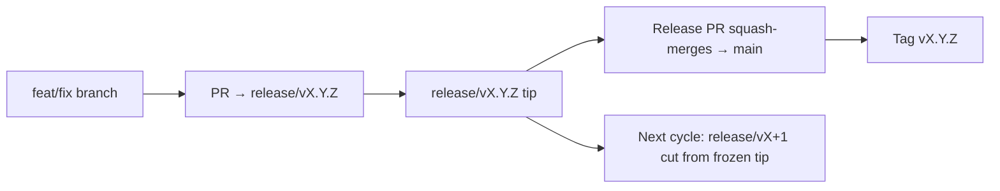

# Branching & Release Model (Gaeilge)

🌐 **Languages:** 🇺🇸 [English](../../../../ops/BRANCHING_MODEL.md) · 🇪🇹 [am](../../../am/docs/ops/BRANCHING_MODEL.md) · 🇸🇦 [ar](../../../ar/docs/ops/BRANCHING_MODEL.md) · 🇦🇿 [az](../../../az/docs/ops/BRANCHING_MODEL.md) · 🇧🇬 [bg](../../../bg/docs/ops/BRANCHING_MODEL.md) · 🇧🇩 [bn](../../../bn/docs/ops/BRANCHING_MODEL.md) · 🇧🇦 [bs](../../../bs/docs/ops/BRANCHING_MODEL.md) · 🇨🇿 [cs](../../../cs/docs/ops/BRANCHING_MODEL.md) · 🇩🇰 [da](../../../da/docs/ops/BRANCHING_MODEL.md) · 🇩🇪 [de](../../../de/docs/ops/BRANCHING_MODEL.md) · 🇬🇷 [el](../../../el/docs/ops/BRANCHING_MODEL.md) · 🇪🇸 [es](../../../es/docs/ops/BRANCHING_MODEL.md) · 🇪🇪 [et](../../../et/docs/ops/BRANCHING_MODEL.md) · 🇮🇷 [fa](../../../fa/docs/ops/BRANCHING_MODEL.md) · 🇫🇮 [fi](../../../fi/docs/ops/BRANCHING_MODEL.md) · 🇫🇷 [fr](../../../fr/docs/ops/BRANCHING_MODEL.md) · 🇮🇳 [gu](../../../gu/docs/ops/BRANCHING_MODEL.md) · 🇳🇬 [ha](../../../ha/docs/ops/BRANCHING_MODEL.md) · 🇮🇱 [he](../../../he/docs/ops/BRANCHING_MODEL.md) · 🇮🇳 [hi](../../../hi/docs/ops/BRANCHING_MODEL.md) · 🇭🇷 [hr](../../../hr/docs/ops/BRANCHING_MODEL.md) · 🇭🇺 [hu](../../../hu/docs/ops/BRANCHING_MODEL.md) · 🇦🇲 [hy](../../../hy/docs/ops/BRANCHING_MODEL.md) · 🇮🇩 [id](../../../id/docs/ops/BRANCHING_MODEL.md) · 🇳🇬 [ig](../../../ig/docs/ops/BRANCHING_MODEL.md) · 🇮🇹 [it](../../../it/docs/ops/BRANCHING_MODEL.md) · 🇯🇵 [ja](../../../ja/docs/ops/BRANCHING_MODEL.md) · 🇬🇪 [ka](../../../ka/docs/ops/BRANCHING_MODEL.md) · 🇰🇭 [km](../../../km/docs/ops/BRANCHING_MODEL.md) · 🇮🇳 [kn](../../../kn/docs/ops/BRANCHING_MODEL.md) · 🇰🇷 [ko](../../../ko/docs/ops/BRANCHING_MODEL.md) · 🇱🇹 [lt](../../../lt/docs/ops/BRANCHING_MODEL.md) · 🇱🇻 [lv](../../../lv/docs/ops/BRANCHING_MODEL.md) · 🇮🇳 [ml](../../../ml/docs/ops/BRANCHING_MODEL.md) · 🇮🇳 [mr](../../../mr/docs/ops/BRANCHING_MODEL.md) · 🇲🇾 [ms](../../../ms/docs/ops/BRANCHING_MODEL.md) · 🇲🇹 [mt](../../../mt/docs/ops/BRANCHING_MODEL.md) · 🇲🇲 [my](../../../my/docs/ops/BRANCHING_MODEL.md) · 🇳🇵 [ne](../../../ne/docs/ops/BRANCHING_MODEL.md) · 🇳🇱 [nl](../../../nl/docs/ops/BRANCHING_MODEL.md) · 🇳🇴 [no](../../../no/docs/ops/BRANCHING_MODEL.md) · 🇮🇳 [or](../../../or/docs/ops/BRANCHING_MODEL.md) · 🇮🇳 [pa](../../../pa/docs/ops/BRANCHING_MODEL.md) · 🇵🇭 [phi](../../../phi/docs/ops/BRANCHING_MODEL.md) · 🇵🇱 [pl](../../../pl/docs/ops/BRANCHING_MODEL.md) · 🇵🇹 [pt](../../../pt/docs/ops/BRANCHING_MODEL.md) · 🇧🇷 [pt-BR](../../../pt-BR/docs/ops/BRANCHING_MODEL.md) · 🇷🇴 [ro](../../../ro/docs/ops/BRANCHING_MODEL.md) · 🇷🇺 [ru](../../../ru/docs/ops/BRANCHING_MODEL.md) · 🇱🇰 [si](../../../si/docs/ops/BRANCHING_MODEL.md) · 🇸🇰 [sk](../../../sk/docs/ops/BRANCHING_MODEL.md) · 🇸🇮 [sl](../../../sl/docs/ops/BRANCHING_MODEL.md) · 🇷🇸 [sr](../../../sr/docs/ops/BRANCHING_MODEL.md) · 🇸🇪 [sv](../../../sv/docs/ops/BRANCHING_MODEL.md) · 🇰🇪 [sw](../../../sw/docs/ops/BRANCHING_MODEL.md) · 🇮🇳 [ta](../../../ta/docs/ops/BRANCHING_MODEL.md) · 🇮🇳 [te](../../../te/docs/ops/BRANCHING_MODEL.md) · 🇹🇭 [th](../../../th/docs/ops/BRANCHING_MODEL.md) · 🇹🇷 [tr](../../../tr/docs/ops/BRANCHING_MODEL.md) · 🇺🇦 [uk-UA](../../../uk-UA/docs/ops/BRANCHING_MODEL.md) · 🇵🇰 [ur](../../../ur/docs/ops/BRANCHING_MODEL.md) · 🇺🇿 [uz](../../../uz/docs/ops/BRANCHING_MODEL.md) · 🇻🇳 [vi](../../../vi/docs/ops/BRANCHING_MODEL.md) · 🇳🇬 [yo](../../../yo/docs/ops/BRANCHING_MODEL.md) · 🇨🇳 [zh-CN](../../../zh-CN/docs/ops/BRANCHING_MODEL.md) · 🇹🇼 [zh-TW](../../../zh-TW/docs/ops/BRANCHING_MODEL.md)

---

Úsáideann OmniRoute samhail eisiúna **timthrialla chomhthreomhair**: brainse tiomnaithe `release/vX.Y.Z`
don timthriall gníomhach, `main` don líne fhoilsithe, agus clib dho-athraithe
`vX.Y.Z` nuair a eisítear an timthriall sin. Is gnách gealltanais a fheiceáil ag teacht i dtír ar `release/*` _agus_ ar
`main` — ní mearbhall é sin.

Tá sonraí do chothabhálaithe in `CLAUDE.md` (Riail Dhocht #21) agus in
[RELEASE_CHECKLIST.md](./RELEASE_CHECKLIST.md). Is achoimre phoiblí í an leathanach seo
atá dírithe ar rannchuiditheoirí.

## Sracfhéachaint

| Tagairt          | Ról                                                                                               |
| ---------------- | ------------------------------------------------------------------------------------------------- |
| `release/vX.Y.Z` | **Timthriall gníomhach** — forbairt laethúil agus cumaisc PR don leagan sin                       |
| `main`           | **Líne fhoilsithe** — faigheann sí an timthriall trí chumasc scuaise nuair a eisítear an leagan   |
| `vX.Y.Z` (clib)  | **Marcóir eisiúna** — pointeoir do-athraithe “an méid a eisíodh” a chruthaítear tráth na heisiúna |



## Cén brainse ar cheart do mo PR díriú air?

**Dírigh ar an mbrainse gníomhach `release/vX.Y.Z` — ní ar `main`.**

1. Aimsigh an brainse oscailte `release/v*` is airde (sampla tráth na scríbhneoireachta:
   `release/v3.8.49`).
2. Cruthaigh brainse ón mbarr sin (`git fetch` + checkout / rebase air).
3. Oscail an PR agus **base = an `release/vX.Y.Z` sin**.

Ní hé `main` an brainse comhtháthaithe laethúil. De ghnáth, ní mór PRanna a osclaítear in aghaidh `main`
a athdhíriú roimh chumasc.

## Reo eisiúna (timthriallta comhthreomhara)

Nuair a bhíonn eisiúint á réiteach, osclaítear saincheist mharcála ar a bhfuil an lipéad `release-freeze`.
**Ní chuireann sé sin stop leis an bhforbairt**:

- Is leis an gcaptaen eisiúna don eisiúint sin an `release/vX.Y.Z` reoite.
- Cruthaítear `release/vX+1` an chéad timthrialla eile ón mbarr reoite ionas gur féidir le rannchuiditheoirí leanúint orthu
  ag tabhairt oibre i dtír.
- Ba cheart PRanna oscailte atá fós dírithe ar an mbrainse reoite a **athdhíriú** ar an
  mbrainse gníomhach (is airde) `release/v*`.

Seiceáil an bhfuil reo oscailte ann sula nglacann tú leis gur féidir an brainse atá uait a chumasc:

```bash
gh issue list --repo diegosouzapw/OmniRoute --label release-freeze --state open
```

Tá na meicnicí cumaisc (lipéad `queue` an úinéara → Mergify) doiciméadaithe in
[MERGE_TRAIN.md](./MERGE_TRAIN.md).

## Cén fáth a bhfuil brainse agus clib araon ann?

| Déantán          | Saolré                | Cuspóir                                                                                       |
| ---------------- | --------------------- | --------------------------------------------------------------------------------------------- |
| `release/vX.Y.Z` | Timthriall idir lámha | Bailíonn sé PRanna athbhreithnithe, fanann sé glas ó thaobh CI de, agus is é bonn na PRanna é |
| Clib `vX.Y.Z`    | Go deo                | Marcálann sí na giotáin bheachta a eisíodh chuig npm / GitHub Releases                        |

Is é an brainse an cheardlann; is í an chlib an pacáiste séalaithe. Tar éis cumasc scuaise isteach i
`main`, leanann an chéad timthriall eile ar `release/vX+1` gan fanacht go gcríochnóidh PR na heisiúna
roimhe sin.

## Doiciméid ghaolmhara

- [CONTRIBUTING.md](../../CONTRIBUTING.md) — socrú, tástálacha, seicliosta PR
- [RELEASE_CHECKLIST.md](./RELEASE_CHECKLIST.md) — bailíochtú réamh-eisiúna
- [MERGE_TRAIN.md](./MERGE_TRAIN.md) — scuaine cumaisc agus traein chúltaca
- [RELEASE_GREEN.md](./RELEASE_GREEN.md) — barr na heisiúna a choinneáil glas
