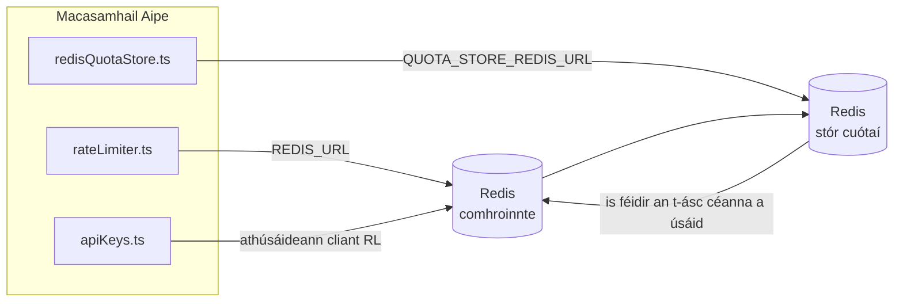

# Redis Production Configuration Guide (Gaeilge)

🌐 **Languages:** 🇺🇸 [English](../../../../ops/REDIS_PRODUCTION_CONFIG.md) · 🇪🇹 [am](../../../am/docs/ops/REDIS_PRODUCTION_CONFIG.md) · 🇸🇦 [ar](../../../ar/docs/ops/REDIS_PRODUCTION_CONFIG.md) · 🇦🇿 [az](../../../az/docs/ops/REDIS_PRODUCTION_CONFIG.md) · 🇧🇬 [bg](../../../bg/docs/ops/REDIS_PRODUCTION_CONFIG.md) · 🇧🇩 [bn](../../../bn/docs/ops/REDIS_PRODUCTION_CONFIG.md) · 🇨🇿 [cs](../../../cs/docs/ops/REDIS_PRODUCTION_CONFIG.md) · 🇩🇰 [da](../../../da/docs/ops/REDIS_PRODUCTION_CONFIG.md) · 🇩🇪 [de](../../../de/docs/ops/REDIS_PRODUCTION_CONFIG.md) · 🇬🇷 [el](../../../el/docs/ops/REDIS_PRODUCTION_CONFIG.md) · 🇪🇸 [es](../../../es/docs/ops/REDIS_PRODUCTION_CONFIG.md) · 🇪🇪 [et](../../../et/docs/ops/REDIS_PRODUCTION_CONFIG.md) · 🇮🇷 [fa](../../../fa/docs/ops/REDIS_PRODUCTION_CONFIG.md) · 🇫🇮 [fi](../../../fi/docs/ops/REDIS_PRODUCTION_CONFIG.md) · 🇫🇷 [fr](../../../fr/docs/ops/REDIS_PRODUCTION_CONFIG.md) · 🇮🇳 [gu](../../../gu/docs/ops/REDIS_PRODUCTION_CONFIG.md) · 🇳🇬 [ha](../../../ha/docs/ops/REDIS_PRODUCTION_CONFIG.md) · 🇮🇱 [he](../../../he/docs/ops/REDIS_PRODUCTION_CONFIG.md) · 🇮🇳 [hi](../../../hi/docs/ops/REDIS_PRODUCTION_CONFIG.md) · 🇭🇷 [hr](../../../hr/docs/ops/REDIS_PRODUCTION_CONFIG.md) · 🇭🇺 [hu](../../../hu/docs/ops/REDIS_PRODUCTION_CONFIG.md) · 🇦🇲 [hy](../../../hy/docs/ops/REDIS_PRODUCTION_CONFIG.md) · 🇮🇩 [id](../../../id/docs/ops/REDIS_PRODUCTION_CONFIG.md) · 🇳🇬 [ig](../../../ig/docs/ops/REDIS_PRODUCTION_CONFIG.md) · 🇮🇹 [it](../../../it/docs/ops/REDIS_PRODUCTION_CONFIG.md) · 🇯🇵 [ja](../../../ja/docs/ops/REDIS_PRODUCTION_CONFIG.md) · 🇬🇪 [ka](../../../ka/docs/ops/REDIS_PRODUCTION_CONFIG.md) · 🇰🇭 [km](../../../km/docs/ops/REDIS_PRODUCTION_CONFIG.md) · 🇮🇳 [kn](../../../kn/docs/ops/REDIS_PRODUCTION_CONFIG.md) · 🇰🇷 [ko](../../../ko/docs/ops/REDIS_PRODUCTION_CONFIG.md) · 🇱🇹 [lt](../../../lt/docs/ops/REDIS_PRODUCTION_CONFIG.md) · 🇱🇻 [lv](../../../lv/docs/ops/REDIS_PRODUCTION_CONFIG.md) · 🇮🇳 [ml](../../../ml/docs/ops/REDIS_PRODUCTION_CONFIG.md) · 🇮🇳 [mr](../../../mr/docs/ops/REDIS_PRODUCTION_CONFIG.md) · 🇲🇾 [ms](../../../ms/docs/ops/REDIS_PRODUCTION_CONFIG.md) · 🇲🇹 [mt](../../../mt/docs/ops/REDIS_PRODUCTION_CONFIG.md) · 🇲🇲 [my](../../../my/docs/ops/REDIS_PRODUCTION_CONFIG.md) · 🇳🇵 [ne](../../../ne/docs/ops/REDIS_PRODUCTION_CONFIG.md) · 🇳🇱 [nl](../../../nl/docs/ops/REDIS_PRODUCTION_CONFIG.md) · 🇳🇴 [no](../../../no/docs/ops/REDIS_PRODUCTION_CONFIG.md) · 🇮🇳 [or](../../../or/docs/ops/REDIS_PRODUCTION_CONFIG.md) · 🇮🇳 [pa](../../../pa/docs/ops/REDIS_PRODUCTION_CONFIG.md) · 🇵🇭 [phi](../../../phi/docs/ops/REDIS_PRODUCTION_CONFIG.md) · 🇵🇱 [pl](../../../pl/docs/ops/REDIS_PRODUCTION_CONFIG.md) · 🇵🇹 [pt](../../../pt/docs/ops/REDIS_PRODUCTION_CONFIG.md) · 🇧🇷 [pt-BR](../../../pt-BR/docs/ops/REDIS_PRODUCTION_CONFIG.md) · 🇷🇴 [ro](../../../ro/docs/ops/REDIS_PRODUCTION_CONFIG.md) · 🇷🇺 [ru](../../../ru/docs/ops/REDIS_PRODUCTION_CONFIG.md) · 🇱🇰 [si](../../../si/docs/ops/REDIS_PRODUCTION_CONFIG.md) · 🇸🇰 [sk](../../../sk/docs/ops/REDIS_PRODUCTION_CONFIG.md) · 🇸🇮 [sl](../../../sl/docs/ops/REDIS_PRODUCTION_CONFIG.md) · 🇷🇸 [sr](../../../sr/docs/ops/REDIS_PRODUCTION_CONFIG.md) · 🇸🇪 [sv](../../../sv/docs/ops/REDIS_PRODUCTION_CONFIG.md) · 🇰🇪 [sw](../../../sw/docs/ops/REDIS_PRODUCTION_CONFIG.md) · 🇮🇳 [ta](../../../ta/docs/ops/REDIS_PRODUCTION_CONFIG.md) · 🇮🇳 [te](../../../te/docs/ops/REDIS_PRODUCTION_CONFIG.md) · 🇹🇭 [th](../../../th/docs/ops/REDIS_PRODUCTION_CONFIG.md) · 🇹🇷 [tr](../../../tr/docs/ops/REDIS_PRODUCTION_CONFIG.md) · 🇺🇦 [uk-UA](../../../uk-UA/docs/ops/REDIS_PRODUCTION_CONFIG.md) · 🇵🇰 [ur](../../../ur/docs/ops/REDIS_PRODUCTION_CONFIG.md) · 🇺🇿 [uz](../../../uz/docs/ops/REDIS_PRODUCTION_CONFIG.md) · 🇻🇳 [vi](../../../vi/docs/ops/REDIS_PRODUCTION_CONFIG.md) · 🇳🇬 [yo](../../../yo/docs/ops/REDIS_PRODUCTION_CONFIG.md) · 🇨🇳 [zh-CN](../../../zh-CN/docs/ops/REDIS_PRODUCTION_CONFIG.md) · 🇹🇼 [zh-TW](../../../zh-TW/docs/ops/REDIS_PRODUCTION_CONFIG.md)

---

## Forbhreathnú

Is **spleáchas roghnach, neamhchriticiúil** é Redis in OmniRoute — leanann an feidhmchlár de bheith ag obair ar bhealach maolaithe (cúltacaí
sa chuimhne) nuair nach mbíonn Redis ar fáil. I dtimpeallacht táirgthe, laghdaíonn tiúnadh Redis an mhoill do cheithre ualach oibre
ar leith:

| Ualach oibre                  | Tiománaí                      | Monarcha Cliant                                    | Patrún Eochrach                                          |
| ----------------------------- | ----------------------------- | -------------------------------------------------- | -------------------------------------------------------- |
| Teorannú ráta                 | `rateLimiter.ts`              | `getRedisClient()` — singilton leisciúil `ioredis` | Fuinneoga teorannaithe ráta Lua-adamhacha `<prefix>rl:*` |
| Taisce fíordheimhnithe        | `apiKeys.ts`                  | Athúsáideann sé cliant `rateLimiter`               | `<prefix>auth:api_key:<sha256>` le TTL                   |
| Stór cuóta                    | `redisQuotaStore.ts`          | Singilton `getRedisClient(url)` ar leith           | `<prefix>quota:*` inchumraithe de réir áisc              |
| Scoradán ciorcaid réamhthéimh | `redisCircuitBreakerStore.ts` | Cliant ar leith in `circuitBreakerFactory.ts`      | `<prefix>warmup:cb:<connectionId>`                       |

Roinneann na ceithre ualach oibre an réimír ainmspáis céanna ionas gur féidir le OmniRoute cómhaireachtáil le feidhmchláir eile ar
áis Redis amháin (m.sh. `127.0.0.1:6379`). Féach [Ainmspású Eochrach](#key-namespacing).

---

## Cumraíocht Reatha (Réamhshocruithe Cóid)

| Socrú                                        | Luach                                                     | Cá háit                                                                               |
| -------------------------------------------- | --------------------------------------------------------- | ------------------------------------------------------------------------------------- |
| Athróg timpeallachta `REDIS_URL`             | `redis://redis:6379` (compose), roghnach                  | `rateLimiter.ts:5`, `.env.example`                                                    |
| Athróg timpeallachta `REDIS_KEY_PREFIX`      | `omniroute:` (réamhshocrú)                                | `rateLimiter.ts`, `redisQuotaStore.ts`, `redisCircuitBreakerStore.ts`, `.env.example` |
| Athróg timpeallachta `QUOTA_STORE_REDIS_URL` | ar leith, féadfaidh sí a bheith difriúil ó `REDIS_URL`    | `quota/storeFactory.ts`                                                               |
| `QUOTA_STORE_DRIVER`                         | `"sqlite"` (réamhshocrú), `"redis"` roghnach              | `quota/storeFactory.ts`                                                               |
| `maxRetriesPerRequest` ioredis               | `3`                                                       | cruthú cliaint in `rateLimiter.ts`                                                    |
| `enableReadyCheck`                           | gan socrú (réamhshocrú ioredis: `true`)                   | —                                                                                     |
| `lazyConnect`                                | gan socrú (réamhshocrú ioredis: `false`)                  | —                                                                                     |
| `retryStrategy`                              | gan socrú (réamhshocrú ioredis: bonn 200ms, easpónantúil) | —                                                                                     |
| TLS / focal faire / innéacs DB               | **gan chumrú**                                            | —                                                                                     |
| Sentinel / Cluster                           | **gan chumrú** — nód aonair neamhspleách amháin           | —                                                                                     |

---

## Ainmspású Eochrach

Roinneann OmniRoute ásc Redis le cibé rud eile a ritheann ar an óstach. Gan ainmspás,
d’fhéadfadh eochracha amhail `auth:api_key:<sha256>` nó `rl:*` teacht salach ar eochracha ó fheidhmchláir eile
a úsáideann an Redis céanna (ritheann an ásc seo Redis ar `127.0.0.1:6379` taobh le seirbhísí eile).

Socraigh `REDIS_KEY_PREFIX` mar theaghrán neamhfholamh chun réimír a chur le **gach** eochair OmniRoute:

```bash
# .env — déantar omniroute:rl:*, omniroute:auth:*, omniroute:quota:*, omniroute:warmup:cb:* de gach eochair OmniRoute
REDIS_KEY_PREFIX=omniroute:
```

- **Réamhshocrú:** `omniroute:` (cuirtear i bhfeidhm é nuair nach mbíonn `REDIS_KEY_PREFIX` socraithe nó nuair a bhíonn sé folamh).
- **Cuirtear i bhfeidhm ar:** an teorantóir ráta + an taisce fíordheimhnithe (cliant comhroinnte `ioredis` trí `keyPrefix`) agus an
  stór cuóta (`KEY_PREFIX = "${REDIS_KEY_PREFIX}quota"`) agus an scoradán ciorcaid réamhthéimh
  (`KEY_PREFIX = "${REDIS_KEY_PREFIX}warmup:cb:"`).
- Má **athraítear an réimír** nuair atá eochracha ann cheana in Redis, fágtar na seaneochracha ina ndílleachtaí (téann siad in éag
  trí TTL / LRU). Is féidir í a athrú go sábháilte; níl aon aistriú de dhíth. Is é an t-aon eisceacht amháin ná eochair
  scoradáin ciorcaid réamhthéimh do nasc atá marcáilte mar thoirmiscthe: coinnítear í gan TTL, mar sin
  liostaigh na hiarsmaí le `redis-cli --scan --pattern '<old-prefix>warmup:cb:*'` agus scrios iad.
- Cuireann **`keyPrefix` ioredis** an réimír go huathoibríoch le linn scríbhneoireachta **agus** baineann sé í le linn léitheoireachta,
  mar sin ní fheiceann cód an fheidhmchláir an réimír riamh.

---

## Tiúnadh Molta don Táirgeadh

### 1. Linn Nasc / Roghanna Cliant (cruthaitheoir `Redis` i ioredis)

Cruthaíonn an cód reatha `new Redis(url)` amháin gan aon roghanna saincheaptha. Le haghaidh imscaradh táirgthe
le macasamhla iolracha, cuir monarcha cliant ar fáil sa chód nó cuir cumhdach timpeall ar `getRedisClient()`:

```typescript
const redis = new Redis(REDIS_URL, {
  maxRetriesPerRequest: null, // gan teorainn athiarrachtaí; lig do retryStrategy cinneadh a dhéanamh
  enableReadyCheck: true, // deimhnigh go bhfuil an freastalaí réidh sula nglactar le glaonna
  lazyConnect: true, // ná ceangail tráth an chruthaithe; fan leis an gcéad ghlao
  retryStrategy: (times) => {
    if (times > 10) return null; // éirigh as tar éis 10 n-atiarracht → athcheangail ar ball
    return Math.min(times * 200, 5000); // 200ms, 400ms, …, uasteorainn 5s
  },
  enableAutoPipelining: true, // comhcheangail orduithe comhthráthacha in aon scríobh TCP amháin
  keepAlive: 10000, // coimeád beo TCP gach 10s
});
```

**Príomh-chomhghéilltí:**

- `maxRetriesPerRequest: null` + `retryStrategy` — is fearr é seo don táirgeadh ionas nach dteipfidh gach
  iarratas láithreach de bharr atosuithe sealadacha Redis. Maolaíonn an cúltaca sa chuimhne in
  `checkRateLimit()` an chonair teipe.
- `lazyConnect: true` — seachnaíonn sé spleáchas tosaithe ar Redis a bheith ag feidhmiú sula
  dtosaíonn an freastalaí ag glacadh le naisc.
- `enableAutoPipelining: true` — laghdaíonn sé turais fhillte le haghaidh seiceálacha comhtheorannaithe ráta;
  tá sé tairbheach ag >50 RPS ar nasc amháin.

### 2. Cumraíocht Freastalaí Redis (`redis.conf`)

```
# Cuimhne
maxmemory 80%                        # fág spás do thaisce leathanaigh an OS
maxmemory-policy allkeys-lru         # díshealbhaigh iontrálacha seanchaite ón taisce fíordheimhnithe faoi bhrú

# Marthanacht (roghnach — tá OmniRoute sábháilte ar thuairt gan í)
save 300 1                           # tóg seat gach 5 nóiméad ar a laghad má athraíodh ≥1 eochair
appendonly no                        # níl AOF de dhíth; is féidir na sonraí a athghiniúint
appendfsync no                       # gan forchostas fsync (is leor RDB)

# Líonrú
timeout 0                            # gan dícheangal díomhaoin
tcp-keepalive 300                    # coimeád beo 5 nóiméad
tcp-backlog 511                      # riaráiste nasc le haghaidh ualach tobann

# Feidhmíocht
hz 10                                # réamhshocrú; 100 nuair atá aga folaigh ríthábhachtach
activedefrag yes                     # díbhloghdaigh go huathoibríoch nuair atá an bloghadh >10%
```

**Comhghéilleadh maidir le `maxmemory-policy allkeys-lru`:** D’fhéadfaí iontrálacha sa taisce fíordheimhnithe a dhíshealbhú faoi
bhrú cuimhne. Tá sé seo sábháilte — athlíonann `setCachedApiKey` i gcónaí iad nuair nach bhfaightear iad, agus is é an
cúltaca SQLite an fhoinse údarásach. Cruthaíonn script Lua an teorannóra ráta eochracha beaga atá
gearrshaolach de réir dearaidh.

### 3. Socruithe Docker Compose

Úsáideann an chumraíocht compose táirgthe (`docker-compose.prod.yml`) `redis:8.6.2-alpine`. Cuir leis:

```yaml
redis:
  image: redis:8.6.2-alpine
  command:
    [
      "redis-server",
      "--maxmemory",
      "512mb",
      "--maxmemory-policy",
      "allkeys-lru",
      "--activedefrag",
      "yes",
      "--save",
      "300 1",
    ]
  healthcheck:
    test: ["CMD", "redis-cli", "ping"]
    interval: 10s
    timeout: 3s
    retries: 3
    start_period: 5s
```

### 4. Breithnithe maidir le hIlásc / Scálú

**Redis amháin do gach macasamhail** — braitheann script Lua an teorannóra ráta ar aon spás eochracha
údarásach amháin. Dá mbeadh áscanna iolracha Redis taobh thiar de mhacasamhlacha, chaillfí an adamhacht
agus dhúblófaí an buiséad. Úsáid Redis amháin (nó cnuasach Redis Sentinel le teipaistriú) le haghaidh
gach macasamhla feidhmchláir.

**Líon nasc:** Osclaíonn gach macasamhail feidhmchláir **2 nasc TCP** le Redis
(cliant an teorannóra ráta + cliant stór na gcuótaí). Le 10 macasamhail → 20 nasc, rud atá go maith
faoi bhun uasteorainn réamhshocraithe 10k nasc d’ásc Redis.

### 5. Monatóireacht

Nocht tríd an gcríochphointe seiceála sláinte iad:

```typescript
// Glaonn src/app/api/monitoring/health/route.ts feidhmeanna rateLimiter cheana féin
// Cuir seiceálacha a bhaineann go sonrach le Redis leis:
//   1. Aga folaigh PING trí .ping() i ioredis
//   2. Úsáid cuimhne trí INFO memory
//   3. Líon nasc trí INFO clients
//   4. Ráta amas do maxmemory-policy (evicted_keys / keyspace_hits)
```

Príomh-mhéadrachtaí le faire:

- **Eochracha díbeartha / soic** — má bhíonn sé neamh-nialasach go leanúnach, méadaigh `maxmemory`
- **Cliaint bhlocáilte** — tugann luach neamh-nialasach le fios go bhfuil scripteanna Lua mall nó go bhfuil ardchonspóid ann
- **Naisc diúltaithe** — baineadh an teorainn nasc amach; rud annamh le 20 nasc

---

## Léaráid Ailtireachta



---

## Tagairtí

| Comhad                             | Cuspóir                                                             |
| ---------------------------------- | ------------------------------------------------------------------- |
| `src/shared/utils/rateLimiter.ts`  | Príomhchliant Redis, script Lua um theorannú ráta, cúl-taca cuimhne |
| `src/lib/db/apiKeys.ts`            | Taisce fíordheimhnithe — Redis→cúl-taca SQLite                      |
| `src/lib/quota/redisQuotaStore.ts` | Cliant Redis ar leith don stór cuótaí roghnach                      |
| `src/lib/quota/storeFactory.ts`    | Malartaíonn sé idir tiománaithe cuótaí `sqlite` agus `redis`        |
| `docker-compose.prod.yml`          | Coimeádán Redis táirgeachta (íomhá `redis:8.6.2-alpine`)            |
| `.env.example`                     | Doiciméadúchán ar athróga timpeallachta Redis                       |
| `src/app/api/local/redis/`         | Bealaí API chun coimeádáin forbartha a chomhordú                    |
| `bin/cli/commands/redis.mjs`       | Orduithe CLI chun coimeádáin forbartha a chomhordú                  |
