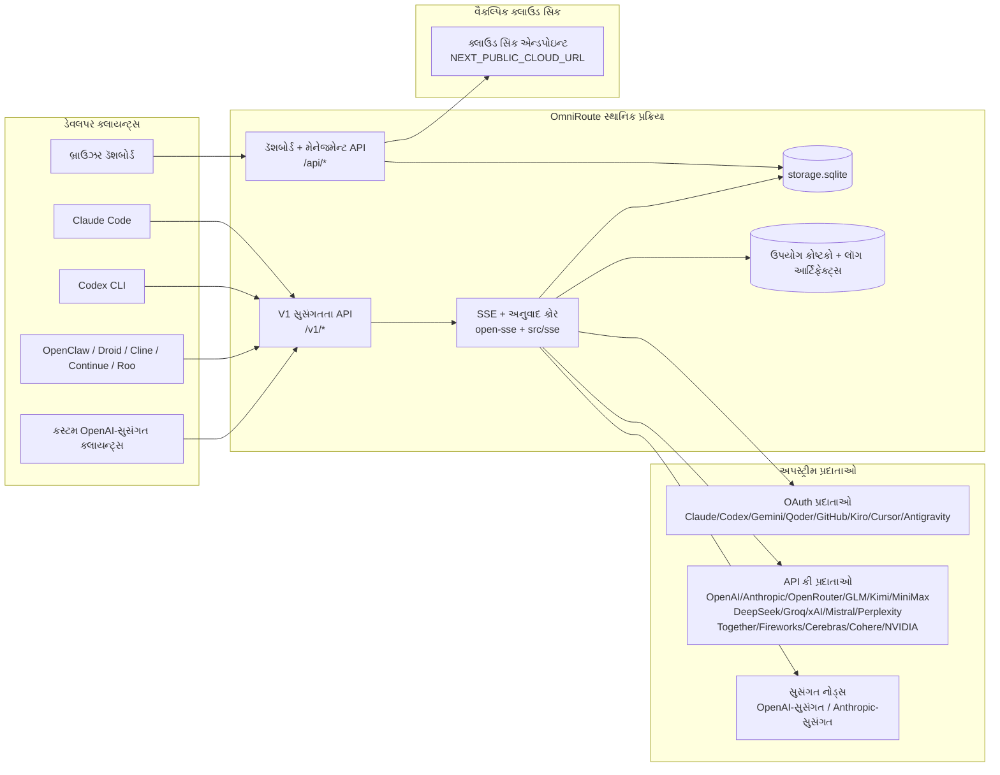
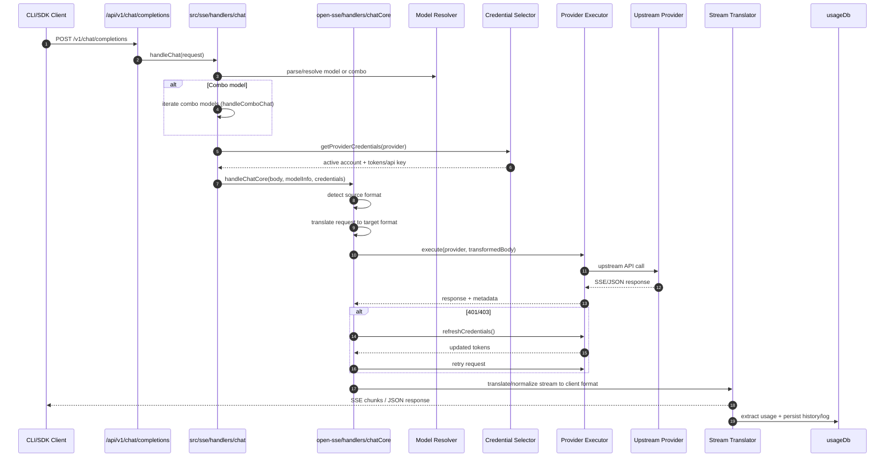
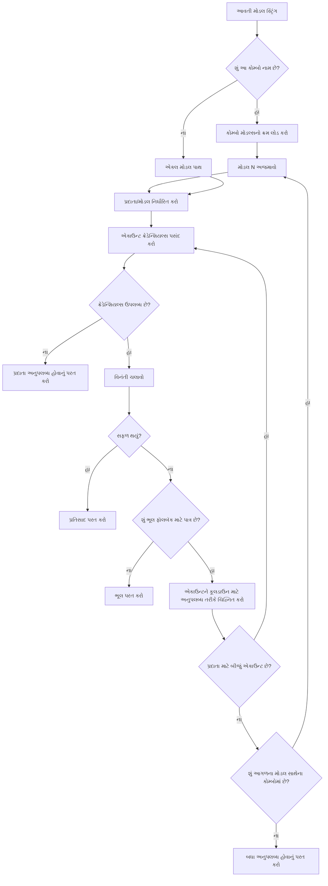
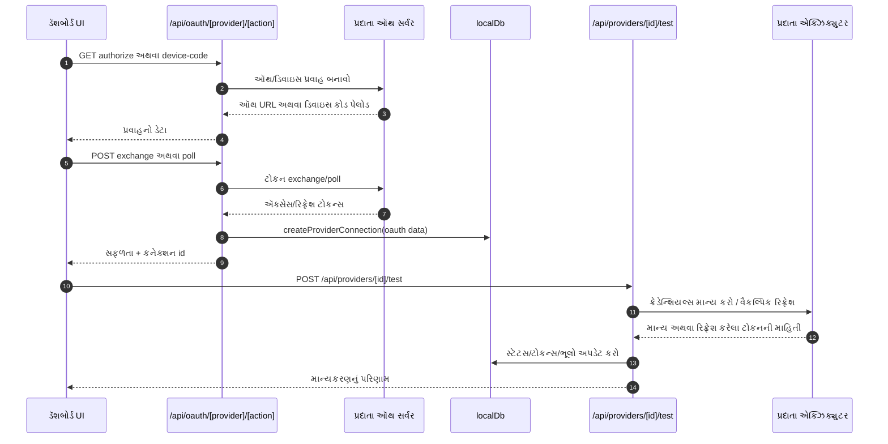
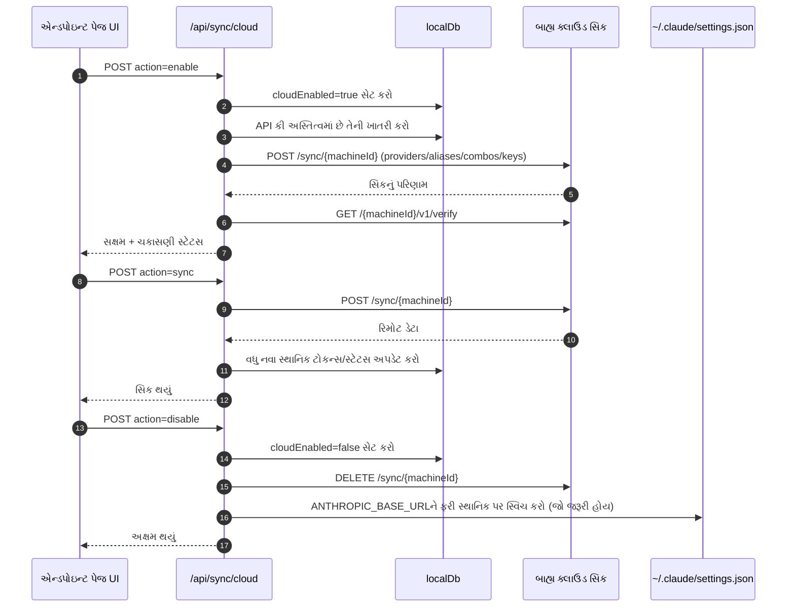
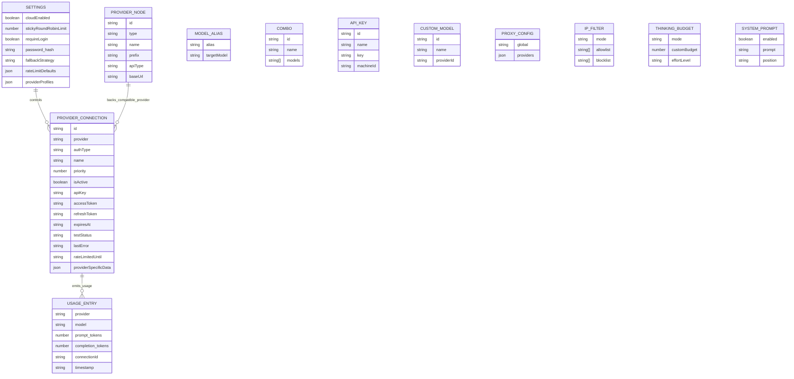
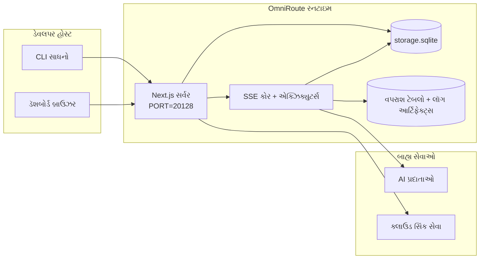

# OmniRoute Architecture (ગુજરાતી)

🌐 **Languages:** 🇺🇸 [English](../../../../architecture/ARCHITECTURE.md) · 🇪🇹 [am](../../../am/docs/architecture/ARCHITECTURE.md) · 🇸🇦 [ar](../../../ar/docs/architecture/ARCHITECTURE.md) · 🇦🇿 [az](../../../az/docs/architecture/ARCHITECTURE.md) · 🇧🇬 [bg](../../../bg/docs/architecture/ARCHITECTURE.md) · 🇧🇩 [bn](../../../bn/docs/architecture/ARCHITECTURE.md) · 🇧🇦 [bs](../../../bs/docs/architecture/ARCHITECTURE.md) · 🇨🇿 [cs](../../../cs/docs/architecture/ARCHITECTURE.md) · 🇩🇰 [da](../../../da/docs/architecture/ARCHITECTURE.md) · 🇩🇪 [de](../../../de/docs/architecture/ARCHITECTURE.md) · 🇬🇷 [el](../../../el/docs/architecture/ARCHITECTURE.md) · 🇪🇸 [es](../../../es/docs/architecture/ARCHITECTURE.md) · 🇪🇪 [et](../../../et/docs/architecture/ARCHITECTURE.md) · 🇮🇷 [fa](../../../fa/docs/architecture/ARCHITECTURE.md) · 🇫🇮 [fi](../../../fi/docs/architecture/ARCHITECTURE.md) · 🇫🇷 [fr](../../../fr/docs/architecture/ARCHITECTURE.md) · 🇮🇪 [ga](../../../ga/docs/architecture/ARCHITECTURE.md) · 🇳🇬 [ha](../../../ha/docs/architecture/ARCHITECTURE.md) · 🇮🇱 [he](../../../he/docs/architecture/ARCHITECTURE.md) · 🇮🇳 [hi](../../../hi/docs/architecture/ARCHITECTURE.md) · 🇭🇷 [hr](../../../hr/docs/architecture/ARCHITECTURE.md) · 🇭🇺 [hu](../../../hu/docs/architecture/ARCHITECTURE.md) · 🇦🇲 [hy](../../../hy/docs/architecture/ARCHITECTURE.md) · 🇮🇩 [id](../../../id/docs/architecture/ARCHITECTURE.md) · 🇳🇬 [ig](../../../ig/docs/architecture/ARCHITECTURE.md) · 🇮🇹 [it](../../../it/docs/architecture/ARCHITECTURE.md) · 🇯🇵 [ja](../../../ja/docs/architecture/ARCHITECTURE.md) · 🇬🇪 [ka](../../../ka/docs/architecture/ARCHITECTURE.md) · 🇰🇭 [km](../../../km/docs/architecture/ARCHITECTURE.md) · 🇮🇳 [kn](../../../kn/docs/architecture/ARCHITECTURE.md) · 🇰🇷 [ko](../../../ko/docs/architecture/ARCHITECTURE.md) · 🇱🇹 [lt](../../../lt/docs/architecture/ARCHITECTURE.md) · 🇱🇻 [lv](../../../lv/docs/architecture/ARCHITECTURE.md) · 🇮🇳 [ml](../../../ml/docs/architecture/ARCHITECTURE.md) · 🇮🇳 [mr](../../../mr/docs/architecture/ARCHITECTURE.md) · 🇲🇾 [ms](../../../ms/docs/architecture/ARCHITECTURE.md) · 🇲🇹 [mt](../../../mt/docs/architecture/ARCHITECTURE.md) · 🇲🇲 [my](../../../my/docs/architecture/ARCHITECTURE.md) · 🇳🇵 [ne](../../../ne/docs/architecture/ARCHITECTURE.md) · 🇳🇱 [nl](../../../nl/docs/architecture/ARCHITECTURE.md) · 🇳🇴 [no](../../../no/docs/architecture/ARCHITECTURE.md) · 🇮🇳 [or](../../../or/docs/architecture/ARCHITECTURE.md) · 🇮🇳 [pa](../../../pa/docs/architecture/ARCHITECTURE.md) · 🇵🇭 [phi](../../../phi/docs/architecture/ARCHITECTURE.md) · 🇵🇱 [pl](../../../pl/docs/architecture/ARCHITECTURE.md) · 🇵🇹 [pt](../../../pt/docs/architecture/ARCHITECTURE.md) · 🇧🇷 [pt-BR](../../../pt-BR/docs/architecture/ARCHITECTURE.md) · 🇷🇴 [ro](../../../ro/docs/architecture/ARCHITECTURE.md) · 🇷🇺 [ru](../../../ru/docs/architecture/ARCHITECTURE.md) · 🇱🇰 [si](../../../si/docs/architecture/ARCHITECTURE.md) · 🇸🇰 [sk](../../../sk/docs/architecture/ARCHITECTURE.md) · 🇸🇮 [sl](../../../sl/docs/architecture/ARCHITECTURE.md) · 🇷🇸 [sr](../../../sr/docs/architecture/ARCHITECTURE.md) · 🇸🇪 [sv](../../../sv/docs/architecture/ARCHITECTURE.md) · 🇰🇪 [sw](../../../sw/docs/architecture/ARCHITECTURE.md) · 🇮🇳 [ta](../../../ta/docs/architecture/ARCHITECTURE.md) · 🇮🇳 [te](../../../te/docs/architecture/ARCHITECTURE.md) · 🇹🇭 [th](../../../th/docs/architecture/ARCHITECTURE.md) · 🇹🇷 [tr](../../../tr/docs/architecture/ARCHITECTURE.md) · 🇺🇦 [uk-UA](../../../uk-UA/docs/architecture/ARCHITECTURE.md) · 🇵🇰 [ur](../../../ur/docs/architecture/ARCHITECTURE.md) · 🇺🇿 [uz](../../../uz/docs/architecture/ARCHITECTURE.md) · 🇻🇳 [vi](../../../vi/docs/architecture/ARCHITECTURE.md) · 🇳🇬 [yo](../../../yo/docs/architecture/ARCHITECTURE.md) · 🇨🇳 [zh-CN](../../../zh-CN/docs/architecture/ARCHITECTURE.md) · 🇹🇼 [zh-TW](../../../zh-TW/docs/architecture/ARCHITECTURE.md)

---

🌐 **Languages:** 🇺🇸 [English](../../../../architecture/ARCHITECTURE.md) · 🇪🇹 [am](../../../am/docs/architecture/ARCHITECTURE.md) · 🇸🇦 [ar](../../../ar/docs/architecture/ARCHITECTURE.md) · 🇦🇿 [az](../../../az/docs/architecture/ARCHITECTURE.md) · 🇧🇬 [bg](../../../bg/docs/architecture/ARCHITECTURE.md) · 🇧🇩 [bn](../../../bn/docs/architecture/ARCHITECTURE.md) · 🇧🇦 [bs](../../../bs/docs/architecture/ARCHITECTURE.md) · 🇨🇿 [cs](../../../cs/docs/architecture/ARCHITECTURE.md) · 🇩🇰 [da](../../../da/docs/architecture/ARCHITECTURE.md) · 🇩🇪 [de](../../../de/docs/architecture/ARCHITECTURE.md) · 🇬🇷 [el](../../../el/docs/architecture/ARCHITECTURE.md) · 🇪🇸 [es](../../../es/docs/architecture/ARCHITECTURE.md) · 🇪🇪 [et](../../../et/docs/architecture/ARCHITECTURE.md) · 🇮🇷 [fa](../../../fa/docs/architecture/ARCHITECTURE.md) · 🇫🇮 [fi](../../../fi/docs/architecture/ARCHITECTURE.md) · 🇫🇷 [fr](../../../fr/docs/architecture/ARCHITECTURE.md) · 🇮🇪 [ga](../../../ga/docs/architecture/ARCHITECTURE.md) · 🇳🇬 [ha](../../../ha/docs/architecture/ARCHITECTURE.md) · 🇮🇱 [he](../../../he/docs/architecture/ARCHITECTURE.md) · 🇮🇳 [hi](../../../hi/docs/architecture/ARCHITECTURE.md) · 🇭🇷 [hr](../../../hr/docs/architecture/ARCHITECTURE.md) · 🇭🇺 [hu](../../../hu/docs/architecture/ARCHITECTURE.md) · 🇦🇲 [hy](../../../hy/docs/architecture/ARCHITECTURE.md) · 🇮🇩 [id](../../../id/docs/architecture/ARCHITECTURE.md) · 🇳🇬 [ig](../../../ig/docs/architecture/ARCHITECTURE.md) · 🇮🇹 [it](../../../it/docs/architecture/ARCHITECTURE.md) · 🇯🇵 [ja](../../../ja/docs/architecture/ARCHITECTURE.md) · 🇬🇪 [ka](../../../ka/docs/architecture/ARCHITECTURE.md) · 🇰🇭 [km](../../../km/docs/architecture/ARCHITECTURE.md) · 🇮🇳 [kn](../../../kn/docs/architecture/ARCHITECTURE.md) · 🇰🇷 [ko](../../../ko/docs/architecture/ARCHITECTURE.md) · 🇱🇹 [lt](../../../lt/docs/architecture/ARCHITECTURE.md) · 🇱🇻 [lv](../../../lv/docs/architecture/ARCHITECTURE.md) · 🇮🇳 [ml](../../../ml/docs/architecture/ARCHITECTURE.md) · 🇮🇳 [mr](../../../mr/docs/architecture/ARCHITECTURE.md) · 🇲🇾 [ms](../../../ms/docs/architecture/ARCHITECTURE.md) · 🇲🇹 [mt](../../../mt/docs/architecture/ARCHITECTURE.md) · 🇲🇲 [my](../../../my/docs/architecture/ARCHITECTURE.md) · 🇳🇵 [ne](../../../ne/docs/architecture/ARCHITECTURE.md) · 🇳🇱 [nl](../../../nl/docs/architecture/ARCHITECTURE.md) · 🇳🇴 [no](../../../no/docs/architecture/ARCHITECTURE.md) · 🇮🇳 [or](../../../or/docs/architecture/ARCHITECTURE.md) · 🇮🇳 [pa](../../../pa/docs/architecture/ARCHITECTURE.md) · 🇵🇭 [phi](../../../phi/docs/architecture/ARCHITECTURE.md) · 🇵🇱 [pl](../../../pl/docs/architecture/ARCHITECTURE.md) · 🇵🇹 [pt](../../../pt/docs/architecture/ARCHITECTURE.md) · 🇧🇷 [pt-BR](../../../pt-BR/docs/architecture/ARCHITECTURE.md) · 🇷🇴 [ro](../../../ro/docs/architecture/ARCHITECTURE.md) · 🇷🇺 [ru](../../../ru/docs/architecture/ARCHITECTURE.md) · 🇱🇰 [si](../../../si/docs/architecture/ARCHITECTURE.md) · 🇸🇰 [sk](../../../sk/docs/architecture/ARCHITECTURE.md) · 🇸🇮 [sl](../../../sl/docs/architecture/ARCHITECTURE.md) · 🇷🇸 [sr](../../../sr/docs/architecture/ARCHITECTURE.md) · 🇸🇪 [sv](../../../sv/docs/architecture/ARCHITECTURE.md) · 🇰🇪 [sw](../../../sw/docs/architecture/ARCHITECTURE.md) · 🇮🇳 [ta](../../../ta/docs/architecture/ARCHITECTURE.md) · 🇮🇳 [te](../../../te/docs/architecture/ARCHITECTURE.md) · 🇹🇭 [th](../../../th/docs/architecture/ARCHITECTURE.md) · 🇹🇷 [tr](../../../tr/docs/architecture/ARCHITECTURE.md) · 🇺🇦 [uk-UA](../../../uk-UA/docs/architecture/ARCHITECTURE.md) · 🇵🇰 [ur](../../../ur/docs/architecture/ARCHITECTURE.md) · 🇺🇿 [uz](../../../uz/docs/architecture/ARCHITECTURE.md) · 🇻🇳 [vi](../../../vi/docs/architecture/ARCHITECTURE.md) · 🇳🇬 [yo](../../../yo/docs/architecture/ARCHITECTURE.md) · 🇨🇳 [zh-CN](../../../zh-CN/docs/architecture/ARCHITECTURE.md) · 🇹🇼 [zh-TW](../../../zh-TW/docs/architecture/ARCHITECTURE.md)

_છેલ્લે અપડેટ કરાયું: 2026-06-28_

## કાર્યકારી સારાંશ

OmniRoute એ Next.js પર બનાવાયેલ સ્થાનિક AI રૂટિંગ ગેટવે અને ડેશબોર્ડ છે.
તે એક જ OpenAI-સુસંગત એન્ડપોઇન્ટ (`/v1/*`) પ્રદાન કરે છે અને અનુવાદ, ફૉલબૅક, ટોકન રિફ્રેશ તથા વપરાશ ટ્રેકિંગ સાથે ટ્રાફિકને અનેક અપસ્ટ્રીમ પ્રદાતાઓમાં રૂટ કરે છે.

મુખ્ય ક્ષમતાઓ:

- CLI/ટૂલ્સ માટે OpenAI-સુસંગત API સપાટી (355 પ્રદાતાઓ, 108 એક્ઝિક્યુટર્સ)
- પ્રદાતા ફોર્મેટ્સ વચ્ચે વિનંતી/પ્રતિસાદનું રૂપાંતરણ
- મોડેલ કોમ્બો ફૉલબૅક (મલ્ટિ-મોડેલ ક્રમ)
- `compositeTiers` દ્વારા રનટાઇમ ક્રમ સાથે સંરચિત કોમ્બો પગલાં (`provider + model + connection`)
- એકાઉન્ટ-સ્તરીય ફૉલબૅક (દરેક પ્રદાતા માટે બહુવિધ એકાઉન્ટ)
- મુખ્ય ચેટ પાથમાં ક્વોટા પૂર્વ-ચકાસણી અને ક્વોટા-સજાગ P2C એકાઉન્ટ પસંદગી
- OAuth + API-key પ્રદાતા કનેક્શન વ્યવસ્થાપન (22 OAuth પ્રદાતા મોડ્યુલ)
- `/v1/embeddings` દ્વારા એમ્બેડિંગ જનરેશન (18 પ્રદાતાઓ)
- `/v1/images/generations` દ્વારા ઇમેજ જનરેશન (10+ પ્રદાતાઓ, 20+ મોડેલો)
- `/v1/audio/transcriptions` દ્વારા ઑડિયો ટ્રાન્સક્રિપ્શન (18 પ્રદાતાઓ)
- `/v1/audio/speech` દ્વારા ટેક્સ્ટ-ટુ-સ્પીચ (24 બિલ્ટ-ઇન પ્રદાતાઓ)
- `/v1/videos/generations` દ્વારા વિડિયો જનરેશન (ComfyUI + SD WebUI)
- `/v1/music/generations` દ્વારા સંગીત જનરેશન (ComfyUI)
- `/v1/search` દ્વારા વેબ શોધ (20 પ્રદાતાઓ)
- `/v1/moderations` દ્વારા મોડરેશન
- `/v1/rerank` દ્વારા પુનઃક્રમનિર્ધારણ
- રીઝનિંગ મોડેલો માટે થિંક ટૅગ પાર્સિંગ (`<think>...</think>`)
- કડક OpenAI SDK સુસંગતતા માટે પ્રતિસાદ શુદ્ધીકરણ
- ક્રોસ-પ્રદાતા સુસંગતતા માટે ભૂમિકા સામાન્યીકરણ (developer→system, system→user)
- સંરચિત આઉટપુટ રૂપાંતરણ (json_schema → Gemini responseSchema)
- પ્રદાતાઓ, કીઓ, ઉપનામો, કોમ્બો, સેટિંગ્સ અને કિંમતો માટે સ્થાનિક સાતત્યપૂર્ણ સંગ્રહ (122 DB મોડ્યુલ)
- વપરાશ/ખર્ચ ટ્રેકિંગ અને વિનંતી લૉગિંગ
- મલ્ટિ-ડિવાઇસ/સ્ટેટ સિંક માટે વૈકલ્પિક ક્લાઉડ સિંક
- API ઍક્સેસ નિયંત્રણ માટે IP મંજૂરીસૂચિ/અવરોધસૂચિ
- થિંકિંગ બજેટ વ્યવસ્થાપન (પાસથ્રૂ/ઑટો/કસ્ટમ/અનુકૂલનશીલ)
- વૈશ્વિક સિસ્ટમ પ્રોમ્પ્ટ ઇન્જેક્શન
- સેશન ટ્રેકિંગ અને ફિંગરપ્રિન્ટિંગ
- પ્રદાતા-વિશિષ્ટ પ્રોફાઇલ્સ સાથે પ્રતિ-એકાઉન્ટ ઉન્નત રેટ લિમિટિંગ
- પ્રદાતા સ્થિતિસ્થાપકતા માટે સર્કિટ બ્રેકર પેટર્ન
- મ્યુટેક્સ લૉકિંગ સાથે ઍન્ટિ-થન્ડરિંગ હર્ડ સુરક્ષા
- સિગ્નેચર-આધારિત વિનંતી ડિડુપ્લિકેશન કૅશ
- ડોમેન સ્તર: ખર્ચ નિયમો, ફૉલબૅક નીતિ, લૉકઆઉટ નીતિ
- કૉન્ટેક્સ્ટ રિલે: એકાઉન્ટ રોટેશન સાતત્ય માટે સેશન હેન્ડઑફ સારાંશો
- ડોમેન સ્ટેટ સાતત્યપૂર્ણ સંગ્રહ (ફૉલબૅક, બજેટ, લૉકઆઉટ અને સર્કિટ બ્રેકર્સ માટે SQLite રાઇટ-થ્રૂ કૅશ)
- કેન્દ્રીકૃત વિનંતી મૂલ્યાંકન માટે નીતિ એન્જિન (લૉકઆઉટ → બજેટ → ફૉલબૅક)
- p50/p95/p99 લેટન્સી એકત્રીકરણ સાથે વિનંતી ટેલિમેટ્રી
- `combo_execution_key` / `combo_step_id` દ્વારા કોમ્બો ટાર્ગેટ ટેલિમેટ્રી અને ઐતિહાસિક કોમ્બો ટાર્ગેટ હેલ્થ
- એન્ડ-ટુ-એન્ડ ટ્રેસિંગ માટે કોરિલેશન ID (X-Request-Id)
- પ્રતિ API key ઑપ્ટ-આઉટ સાથે અનુપાલન ઑડિટ લૉગિંગ
- LLM ગુણવત્તા ખાતરી માટે મૂલ્યાંકન ફ્રેમવર્ક
- રિયલ-ટાઇમ પ્રદાતા સર્કિટ બ્રેકર સ્થિતિ સાથે હેલ્થ ડેશબોર્ડ
- 3 ટ્રાન્સપોર્ટ (stdio/SSE/Streamable HTTP) સાથે MCP Server (110 ટૂલ્સ)
- કૌશલ્યો અને ટાસ્ક લાઇફસાઇકલ સાથે A2A Server (JSON-RPC 2.0 + SSE)
- મેમરી સિસ્ટમ (એક્સટ્રેક્શન, ઇન્જેક્શન, રિટ્રીવલ, સારાંશીકરણ)
- કૌશલ્ય સિસ્ટમ (રજિસ્ટ્રી, એક્ઝિક્યુટર, સૅન્ડબૉક્સ, બિલ્ટ-ઇન કૌશલ્યો)
- સર્ટિફિકેટ વ્યવસ્થાપન અને DNS હેન્ડલિંગ સાથે MITM પ્રોક્સી
- પ્રોમ્પ્ટ ઇન્જેક્શન ગાર્ડ મિડલવેર
- Caveman, RTK, સ્ટૅક્ડ પાઇપલાઇન્સ, કમ્પ્રેશન કોમ્બો, ભાષા પૅક્સ અને ઍનલિટિક્સ સાથે પ્રોમ્પ્ટ કમ્પ્રેશન પાઇપલાઇન
- ACP (Agent Communication Protocol) રજિસ્ટ્રી
- મોડ્યુલર OAuth પ્રદાતાઓ (`src/lib/oauth/providers/` હેઠળ 22 વ્યક્તિગત મોડ્યુલ)
- અનઇન્સ્ટૉલ/સંપૂર્ણ-અનઇન્સ્ટૉલ સ્ક્રિપ્ટ્સ
- OAuth પર્યાવરણ સમારકામ ક્રિયા
- OpenAI-સુસંગત WS ક્લાયન્ટ્સ માટે WebSocket બ્રિજ (`/v1/ws`)
- સિંક ટોકન વ્યવસ્થાપન (જારી/રદ કરવું, ETag-વર્ઝનવાળું કૉન્ફિગ બંડલ ડાઉનલોડ)
- GLM Thinking (`glmt`) પ્રથમ-વર્ગનું પ્રદાતા પ્રીસેટ
- હાઇબ્રિડ ટોકન ગણતરી (અંદાજિત ફૉલબૅક સાથે પ્રદાતા-પક્ષીય `/messages/count_tokens`)
- મોડેલ ઉપનામ ઑટો-સીડિંગ (સ્ટાર્ટઅપ સમયે 30+ ક્રોસ-પ્રોક્સી ડાયલેક્ટ સામાન્યીકરણ)
- SSRF ગાર્ડ, ખાનગી URL અવરોધન અને કૉન્ફિગર કરી શકાય તેવા પુનઃપ્રયાસ સાથે સુરક્ષિત આઉટબાઉન્ડ ફેચ
- કૉન્ફિગર કરી શકાય તેવા `requestRetry` અને `maxRetryIntervalSec` સાથે કૂલડાઉન-સજાગ ચેટ પુનઃપ્રયાસો
- સ્ટાર્ટઅપ સમયે Zod સાથે રનટાઇમ પર્યાવરણ માન્યીકરણ
- પેજિનેશન, પ્રદાતા CRUD ઇવેન્ટ્સ અને SSRF-અવરોધિત માન્યીકરણ લૉગિંગ સાથે અનુપાલન ઑડિટ v2

પ્રાથમિક રનટાઇમ મોડેલ:

- `src/app/api/*` હેઠળના Next.js ઍપ રૂટ્સ ડેશબોર્ડ API અને સુસંગતતા API બંને અમલમાં મૂકે છે
- `src/sse/*` + `open-sse/*` માં રહેલું શેર કરેલ SSE/રૂટિંગ કોર પ્રદાતા એક્ઝિક્યુશન, રૂપાંતરણ, સ્ટ્રીમિંગ, ફૉલબૅક અને વપરાશ સંભાળે છે

## સંદર્ભ આકૃતિઓ

v3.8.0 પ્લેટફોર્મ માટેના પ્રમાણભૂત, વર્ઝન-નિયંત્રિત Mermaid સ્રોતો
[`docs/diagrams/`](../diagrams/README.md)માં ઉપલબ્ધ છે. દિશાનિર્દેશ માટે તેમાંથી બે નીચે પુનઃપ્રસ્તુત કરવામાં આવ્યા છે;
બાકીના તેમના ડોમેન-વિશિષ્ટ માર્ગદર્શિકાઓમાંથી લિંક કરેલા છે.


> સ્રોત: [diagrams/request-pipeline.mmd](../diagrams/request-pipeline.mmd)


> સ્રોત: [diagrams/resilience-3layers.mmd](../diagrams/resilience-3layers.mmd) — આ
> [RESILIENCE_GUIDE.md](./RESILIENCE_GUIDE.md) અને `CLAUDE.md` સ્થિતિસ્થાપકતા સંદર્ભમાંથી પણ લિંક કરેલું છે.

## વ્યાપ અને સીમાઓ

### વ્યાપમાં

- સ્થાનિક ગેટવે રનટાઇમ
- ડૅશબોર્ડ વ્યવસ્થાપન APIs
- પ્રદાતા પ્રમાણીકરણ અને ટોકન રિફ્રેશ
- વિનંતી રૂપાંતરણ અને SSE સ્ટ્રીમિંગ
- સ્થાનિક સ્થિતિ + વપરાશ સ્થાયી સંગ્રહ
- વૈકલ્પિક ક્લાઉડ સિંક સંકલન

### વ્યાપની બહાર

- `NEXT_PUBLIC_CLOUD_URL` પાછળનું ક્લાઉડ સેવા અમલીકરણ
- સ્થાનિક પ્રક્રિયાની બહારનું પ્રદાતા SLA/કંટ્રોલ પ્લેન
- બાહ્ય CLI બાઇનરીઓ પોતે (Claude CLI, Codex CLI, વગેરે)

## ડૅશબોર્ડ સપાટી (વર્તમાન)

`src/app/(dashboard)/dashboard/` હેઠળનાં મુખ્ય પૃષ્ઠો:

- `/dashboard` — ઝડપી શરૂઆત + પ્રદાતા અવલોકન
- `/dashboard/endpoint` — એન્ડપોઇન્ટ પ્રોક્સી + MCP + A2A + API એન્ડપોઇન્ટ ટૅબ્સ
- `/dashboard/providers` — પ્રદાતા કનેક્શન્સ અને ઓળખપત્રો
- `/dashboard/combos` — કોમ્બો વ્યૂહરચનાઓ, ટેમ્પ્લેટ્સ, પગલા-આધારિત બિલ્ડર, મોડેલ રાઉટિંગ નિયમો, મેન્યુઅલ રીતે સ્થાયી કરેલો ક્રમ
- `/dashboard/auto-combo` — Auto Combo Engine: સ્કોરિંગ વેઇટ્સ, મોડ પૅક્સ, વર્ચ્યુઅલ ફેક્ટરી પ્રીસેટ્સ, ટેલિમેટ્રી
- `/dashboard/costs` — ખર્ચ એકત્રીકરણ અને કિંમત દૃશ્યતા
- `/dashboard/analytics` — વપરાશ વિશ્લેષણ, મૂલ્યાંકનો, કોમ્બો લક્ષ્યની સ્થિતિ
- `/dashboard/limits` — ક્વોટા/દર નિયંત્રણો
- `/dashboard/cli-tools` — CLI ઑનબોર્ડિંગ, રનટાઇમ શોધ, કૉન્ફિગરેશન જનરેશન
- `/dashboard/agents` — શોધાયેલા ACP એજન્ટ્સ + કસ્ટમ એજન્ટ નોંધણી
- `/dashboard/cloud-agents` — ક્લાઉડ-હોસ્ટેડ એજન્ટ કાર્યો (Codex Cloud, Devin, Jules) અને કાર્ય જીવનચક્ર
- `/dashboard/skills` — A2A કૌશલ્ય રજિસ્ટ્રી, સૅન્ડબૉક્સ એક્ઝિક્યુશન, બિલ્ટ-ઇન કૌશલ્ય કૅટલૉગ
- `/dashboard/memory` — સ્થાયી સંવાદાત્મક મેમરીનું નિરીક્ષણ અને પુનઃપ્રાપ્તિ
- `/dashboard/webhooks` — આઉટબાઉન્ડ વેબહૂક સબ્સ્ક્રિપ્શન્સ, સિક્રેટ રોટેશન, પુનઃપ્રયાસના આંકડા
- `/dashboard/batch` — બૅચ જોબ સબમિશન અને પ્રગતિ
- `/dashboard/cache` — રીડ-થ્રૂ અને રીઝનિંગ કૅશના આંકડા, ઇવિક્શન નિયંત્રણો
- `/dashboard/playground` — કોઈપણ કૉન્ફિગર કરેલા કોમ્બો/મોડેલ સામે ઇન્ટરેક્ટિવ ચૅટ પ્લેગ્રાઉન્ડ
- `/dashboard/changelog` — ઇન-ઍપ ચેન્જલૉગ વ્યૂઅર (`CHANGELOG.md` રેન્ડર કરે છે)
- `/dashboard/system` — રનટાઇમ નિદાન, વર્ઝન માહિતી, પર્યાવરણ માન્યતા સપાટી
- `/dashboard/onboarding` — નવા ઇન્સ્ટોલેશન્સ માટે પ્રથમ-રન સેટઅપ વિઝાર્ડ
- `/dashboard/media` — છબી/વિડિયો/સંગીત પ્લેગ્રાઉન્ડ
- `/dashboard/search-tools` — શોધ પ્રદાતાનું પરીક્ષણ અને ઇતિહાસ
- `/dashboard/health` — અપટાઇમ, સર્કિટ બ્રેકર્સ, દર મર્યાદાઓ, ક્વોટા-મૉનિટર કરેલા સેશન્સ
- `/dashboard/logs` — વિનંતી/પ્રોક્સી/ઑડિટ/કન્સોલ લૉગ્સ
- `/dashboard/settings` — સિસ્ટમ સેટિંગ્સ ટૅબ્સ (સામાન્ય, રાઉટિંગ, કોમ્બો ડિફૉલ્ટ્સ, વગેરે)
- `/dashboard/context/caveman` — Caveman કમ્પ્રેશન નિયમો, ભાષા પૅક્સ, પૂર્વાવલોકન અને આઉટપુટ મોડ
- `/dashboard/context/rtk` — RTK કમાન્ડ-આઉટપુટ ફિલ્ટર્સ, પૂર્વાવલોકન અને રનટાઇમ સલામતી સેટિંગ્સ
- `/dashboard/context/combos` — રાઉટિંગ કોમ્બોને સોંપેલી નામવાળી કમ્પ્રેશન પાઇપલાઇન્સ
- `/dashboard/translator` — ટ્રાન્સલેટર નિરીક્ષણ અને વિનંતી ફૉર્મેટ રૂપાંતરણનું પૂર્વાવલોકન
- `/dashboard/audit` — પેજિનેશન અને સંરચિત મેટાડેટા સાથેનો અનુપાલન ઑડિટ લૉગ બ્રાઉઝર
- `/dashboard/usage` — `usage_history` સાથે જોડાયેલો પ્રતિ-વિનંતી વપરાશ બ્રાઉઝર
- `/dashboard/compression` — કમ્પ્રેશન વિશ્લેષણ, આંકડા અને પાઇપલાઇન સોંપણી
- `/dashboard/api-manager` — API કી જીવનચક્ર અને મોડેલ પરવાનગીઓ

## ઉચ્ચ-સ્તરીય સિસ્ટમ સંદર્ભ



## મુખ્ય રનટાઇમ ઘટકો

## 1) API અને રૂટિંગ સ્તર (Next.js ઍપ રૂટ્સ)

મુખ્ય ડિરેક્ટરીઓ:

- સુસંગતતા APIs માટે `src/app/api/v1/*` અને `src/app/api/v1beta/*`
- મેનેજમેન્ટ/કન્ફિગરેશન APIs માટે `src/app/api/*`
- `next.config.mjs`માંના Next રીરાઇટ્સ `/v1/*`ને `/api/v1/*` સાથે મેપ કરે છે

મહત્વપૂર્ણ સુસંગતતા રૂટ્સ:

- `src/app/api/v1/chat/completions/route.ts`
- `src/app/api/v1/messages/route.ts`
- `src/app/api/v1/responses/route.ts`
- `src/app/api/v1/models/route.ts` — `custom: true` ધરાવતા કસ્ટમ મોડલ્સનો સમાવેશ કરે છે
- `src/app/api/v1/embeddings/route.ts` — એમ્બેડિંગ જનરેશન (6 પ્રદાતાઓ)
- `src/app/api/v1/images/generations/route.ts` — ઇમેજ જનરેશન (Antigravity/Nebius સહિત 4+ પ્રદાતાઓ)
- `src/app/api/v1/messages/count_tokens/route.ts`
- `src/app/api/v1/providers/[provider]/chat/completions/route.ts` — દરેક પ્રદાતા માટે સમર્પિત ચૅટ
- `src/app/api/v1/providers/[provider]/embeddings/route.ts` — દરેક પ્રદાતા માટે સમર્પિત એમ્બેડિંગ્સ
- `src/app/api/v1/providers/[provider]/images/generations/route.ts` — દરેક પ્રદાતા માટે સમર્પિત ઇમેજિસ
- `src/app/api/v1beta/models/route.ts`
- `src/app/api/v1beta/models/[...path]/route.ts`

મેનેજમેન્ટ ડોમેઇન્સ:

- પ્રમાણીકરણ/સેટિંગ્સ: `src/app/api/auth/*`, `src/app/api/settings/*`
- પ્રદાતાઓ/કનેક્શન્સ: `src/app/api/providers*`
- પ્રદાતા નોડ્સ: `src/app/api/provider-nodes*`
- કસ્ટમ મોડલ્સ: `src/app/api/provider-models` (GET/POST/DELETE)
- મોડલ કૅટલૉગ: `src/app/api/models/route.ts` (GET)
- પ્રૉક્સી કન્ફિગ: `src/app/api/settings/proxy` (GET/PUT/DELETE) + `src/app/api/settings/proxy/test` (POST)
- OAuth: `src/app/api/oauth/*`
- કીઝ/એલિયાસિસ/કૉમ્બોઝ/પ્રાઇસિંગ: `src/app/api/keys*`, `src/app/api/models/alias`, `src/app/api/combos*`, `src/app/api/pricing`
- ઉપયોગ: `src/app/api/usage/*`
- સિંક/ક્લાઉડ: `src/app/api/sync/*`, `src/app/api/cloud/*`
- CLI ટૂલિંગ સહાયકો: `src/app/api/cli-tools/*`
- IP ફિલ્ટર: `src/app/api/settings/ip-filter` (GET/PUT)
- થિંકિંગ બજેટ: `src/app/api/settings/thinking-budget` (GET/PUT)
- સિસ્ટમ પ્રોમ્પ્ટ: `src/app/api/settings/system-prompt` (GET/PUT)
- કમ્પ્રેશન: `src/app/api/settings/compression`, `src/app/api/compression/*`, અને
  `src/app/api/context/*`
- સેશન્સ: `src/app/api/sessions` (GET)
- રેટ લિમિટ્સ: `src/app/api/rate-limits` (GET)
- રેઝિલિયન્સ: `src/app/api/resilience` (GET/PATCH) — રિક્વેસ્ટ ક્યૂ, કનેક્શન કૂલડાઉન, પ્રદાતા બ્રેકર, કૂલડાઉનની રાહ જોવા માટેનું કન્ફિગ
- રેઝિલિયન્સ રીસેટ: `src/app/api/resilience/reset` (POST) — પ્રદાતા બ્રેકર્સને રીસેટ કરે છે
- કૅશ આંકડા: `src/app/api/cache/stats` (GET/DELETE)
- ટેલિમેટ્રી: `src/app/api/telemetry/summary` (GET)
- બજેટ: `src/app/api/usage/budget` (GET/POST)
- ફૉલબૅક ચેઇન્સ: `src/app/api/fallback/chains` (GET/POST/DELETE)
- કમ્પ્લાયન્સ ઑડિટ: `src/app/api/compliance/audit-log` (GET, પેજિનેશન + સંરચિત મેટાડેટા સાથે)
- મૂલ્યાંકનો: `src/app/api/evals` (GET/POST), `src/app/api/evals/[suiteId]` (GET)
- નીતિઓ: `src/app/api/policies` (GET/POST)
- સિંક ટોકન્સ: `src/app/api/sync/tokens` (GET/POST), `src/app/api/sync/tokens/[id]` (GET/DELETE)
- કન્ફિગ બંડલ: `src/app/api/sync/bundle` (GET, સેટિંગ્સ/પ્રદાતાઓ/કૉમ્બોઝ/કીઝનો ETag-વર્ઝનવાળો સ્નૅપશૉટ)
- WebSocket: `src/app/api/v1/ws/route.ts` — OpenAI-સુસંગત WS ક્લાયન્ટ્સ માટે Upgrade હૅન્ડલર

## 2) SSE + અનુવાદ કોર

મુખ્ય ફ્લો મોડ્યુલો:

- એન્ટ્રી: `src/sse/handlers/chat.ts`
- કોર ઓર્કેસ્ટ્રેશન: `open-sse/handlers/chatCore.ts`
- પ્રોવાઇડર એક્ઝિક્યુશન એડેપ્ટર્સ: `open-sse/executors/*`
- ફોર્મેટ ડિટેક્શન/પ્રોવાઇડર કન્ફિગરેશન: `open-sse/services/provider.ts`
- મોડેલ પાર્સ/રિઝોલ્વ: `src/sse/services/model.ts`, `open-sse/services/model.ts`
- એકાઉન્ટ ફૉલબૅક લોજિક: `open-sse/services/accountFallback.ts`
- અનુવાદ રજિસ્ટ્રી: `open-sse/translator/index.ts`
- સ્ટ્રીમ ટ્રાન્સફોર્મેશન્સ: `open-sse/utils/stream.ts`, `open-sse/utils/streamHandler.ts`
- ઉપયોગ એક્સટ્રેક્શન/નોર્મલાઇઝેશન: `open-sse/utils/usageTracking.ts`
- થિંક ટૅગ પાર્સર: `open-sse/utils/thinkTagParser.ts`
- એમ્બેડિંગ હૅન્ડલર: `open-sse/handlers/embeddings.ts`
- એમ્બેડિંગ પ્રોવાઇડર રજિસ્ટ્રી: `open-sse/config/embeddingRegistry.ts`
- ઇમેજ જનરેશન હૅન્ડલર: `open-sse/handlers/imageGeneration.ts`
- ઇમેજ પ્રોવાઇડર રજિસ્ટ્રી: `open-sse/config/imageRegistry.ts`
- રિસ્પોન્સ સેનિટાઇઝેશન: `open-sse/handlers/responseSanitizer.ts`
- રોલ નોર્મલાઇઝેશન: `open-sse/services/roleNormalizer.ts`

સર્વિસિસ (બિઝનેસ લોજિક):

- એકાઉન્ટ પસંદગી/સ્કોરિંગ: `open-sse/services/accountSelector.ts`
- કૉન્ટેક્સ્ટ લાઇફસાઇકલ મેનેજમેન્ટ: `open-sse/services/contextManager.ts`
- IP ફિલ્ટર અમલીકરણ: `open-sse/services/ipFilter.ts`
- સેશન ટ્રૅકિંગ: `open-sse/services/sessionManager.ts`
- રિક્વેસ્ટ ડિડુપ્લિકેશન: `open-sse/services/signatureCache.ts`
- સિસ્ટમ પ્રોમ્પ્ટ ઇન્જેક્શન: `open-sse/services/systemPrompt.ts`
- થિંકિંગ બજેટ મેનેજમેન્ટ: `open-sse/services/thinkingBudget.ts`
- વાઇલ્ડકાર્ડ મોડેલ રાઉટિંગ: `open-sse/services/wildcardRouter.ts`
- રેટ લિમિટ મેનેજમેન્ટ: `open-sse/services/rateLimitManager.ts`
- સર્કિટ બ્રેકર: `src/shared/utils/circuitBreaker.ts`
- કૉન્ટેક્સ્ટ હૅન્ડઑફ: `open-sse/services/contextHandoff.ts` — કૉન્ટેક્સ્ટ-રિલે વ્યૂહરચના માટે હૅન્ડઑફ સારાંશ જનરેશન અને ઇન્જેક્શન
- કમ્પ્રેશન: `open-sse/services/compression/*` — પ્રોવાઇડર અનુવાદ પહેલાં સક્રિય કમ્પ્રેશન;
  તેમાં Caveman નિયમો, RTK ફિલ્ટર્સ, સ્ટૅક્ડ પાઇપલાઇન્સ, કમ્પ્રેશન કૉમ્બોઝ, આંકડાઓ અને વૅલિડેશન સામેલ છે
- Codex ક્વોટા ફેચર: `open-sse/services/codexQuotaFetcher.ts` — કૉન્ટેક્સ્ટ-રિલે હૅન્ડઑફના નિર્ણયો માટે Codex ક્વોટા મેળવે છે
- કૂલડાઉન-અવેર રિટ્રાય: `src/sse/services/cooldownAwareRetry.ts` — કન્ફિગર કરી શકાય તેવા `requestRetry` / `maxRetryIntervalSec` સાથે પ્રતિ-મોડેલ કૂલડાઉન રિટ્રાય
- સુરક્ષિત આઉટબાઉન્ડ ફેચ: `src/shared/network/safeOutboundFetch.ts` — SSRF ગાર્ડ, ખાનગી URL બ્લૉકિંગ, રિટ્રાય અને ટાઇમઆઉટ સાથે સુરક્ષિત પ્રોવાઇડર/મોડેલ ફેચ
- આઉટબાઉન્ડ URL ગાર્ડ: `src/shared/network/outboundUrlGuard.ts` — ખાનગી/localhost CIDR રેન્જ સામે પ્રોવાઇડર URLs ને વૅલિડેટ કરે છે
- પ્રોવાઇડર રિક્વેસ્ટ ડિફૉલ્ટ્સ: `open-sse/services/providerRequestDefaults.ts` — પ્રોવાઇડર-સ્તરના `maxTokens`, `temperature`, `thinkingBudgetTokens` ડિફૉલ્ટ્સ
- GLM પ્રોવાઇડર કૉન્સ્ટન્ટ્સ: `open-sse/config/glmProvider.ts` — શેર કરેલા GLM મોડેલ્સ, ક્વોટા URLs, GLMT ટાઇમઆઉટ/ડિફૉલ્ટ્સ
- Antigravity અપસ્ટ્રીમ: `open-sse/config/antigravityUpstream.ts` — બેઝ URL અને ડિસ્કવરી પાથ કૉન્સ્ટન્ટ્સ
- Codex ક્લાયન્ટ કૉન્સ્ટન્ટ્સ: `open-sse/config/codexClient.ts` — વર્ઝનવાળા યુઝર-એજન્ટ અને ક્લાયન્ટ-વર્ઝન મૂલ્યો
- મોડેલ એલિયસ સીડ: `src/lib/modelAliasSeed.ts` — સ્ટાર્ટઅપ વખતે 30+ ક્રોસ-પ્રૉક્સી ડાયલેક્ટ એલિયસ સીડ કરે છે

ડોમેન લેયર મોડ્યુલો:

- ખર્ચના નિયમો/બજેટ્સ: `src/domain/costRules.ts`
- ફૉલબૅક નીતિ: `src/domain/fallbackPolicy.ts`
- કૉમ્બો રિઝોલ્વર: `src/domain/comboResolver.ts`
- લૉકઆઉટ નીતિ: `src/domain/lockoutPolicy.ts`
- નીતિ એન્જિન: `src/domain/policyEngine.ts` — કેન્દ્રીકૃત લૉકઆઉટ → બજેટ → ફૉલબૅક મૂલ્યાંકન
- એરર કોડ્સ કૅટલૉગ: `src/shared/constants/errorCodes.ts`
- રિક્વેસ્ટ ID: `src/shared/utils/requestId.ts`
- ફેચ ટાઇમઆઉટ: `src/shared/utils/fetchTimeout.ts`
- રિક્વેસ્ટ ટેલિમેટ્રી: `src/shared/utils/requestTelemetry.ts`
- કમ્પ્લાયન્સ/ઑડિટ: `src/lib/compliance/index.ts`
- ઇવૅલ રનર: `src/lib/evals/evalRunner.ts`
- ડોમેન સ્ટેટ પર્સિસ્ટન્સ: `src/lib/db/domainState.ts` — ફૉલબૅક ચેઇન્સ, બજેટ્સ, ખર્ચ ઇતિહાસ, લૉકઆઉટ સ્ટેટ અને સર્કિટ બ્રેકર્સ માટે SQLite CRUD

OAuth પ્રોવાઇડર મોડ્યુલો (`src/lib/oauth/providers/` હેઠળ 22 અલગ ફાઇલો):

- રજિસ્ટ્રી ઇન્ડેક્સ: `src/lib/oauth/providers/index.ts`
- વ્યક્તિગત પ્રોવાઇડર્સ: `agy.ts`, `antigravity.ts`, `claude.ts`, `cline.ts`, `codebuddy-cn.ts`, `codex.ts`, `cursor.ts`, `devin-desktop.ts`, `ghe-copilot.ts`, `github.ts`, `gitlab-duo.ts`, `grok-cli-oauth.ts`, `grok-cli.ts`, `kilocode.ts`, `kimi-coding.ts`, `kiro.ts`, `openference.ts`, `qoder.ts`, `trae.ts`, `xai-oauth.ts`, `zed-hosted.ts`, `zed.ts`
- પાતળું રૅપર: `src/lib/oauth/providers.ts` — વ્યક્તિગત મોડ્યુલોમાંથી ફરીથી એક્સપોર્ટ કરે છે

## 5) એમ્બેડેડ સેવાઓ (v3.8.4)

OmniRoute સ્થાનિક રીતે ચાલતી AI ટૂલ પ્રક્રિયાઓને ઇન્સ્ટોલ કરી શકે છે, તેમની દેખરેખ રાખી શકે છે અને તેમની તરફ રૂટ કરી શકે છે,
જેને **એમ્બેડેડ સેવાઓ** કહેવામાં આવે છે. પાંચ સેવાઓ સાથે આપવામાં આવે છે: 9Router, CLIProxyAPI, Bifrost, Mux અને Dario.

આર્કિટેક્ચરના સ્તરો:

- **UI** (`/dashboard/providers/services`) — લાઇફસાઇકલ નિયંત્રણો,
  લાઇવ લૉગ સ્ટ્રીમિંગ, API કી વ્યવસ્થાપન અને (9Router માટે) આંતરિક રિવર્સ પ્રૉક્સી મારફતે
  એમ્બેડેડ નેટિવ UI ધરાવતું બે-ટૅબનું પૃષ્ઠ.
- **API** (`/api/services/{name}/*`) — 9Router માટે 11 એન્ડપોઇન્ટ, CLIProxyAPI માટે 10, Bifrost / Mux / Dario માટે પ્રત્યેકને 8,
  આ બધાનું વર્ગીકરણ **LOCAL_ONLY** (કડક નિયમ #17) તરીકે થયેલું છે. શેર કરાયેલ `GET /api/services/[name]/logs`
  SSE એન્ડપોઇન્ટ બંને સેવાઓને સેવા આપે છે.
- **સુપરવાઇઝર** (`src/lib/services/`) — સામાન્ય `ServiceSupervisor` ક્લાસ
  `child_process.spawn`ને રૅપ કરે છે, SSE લૉગ સ્ટ્રીમિંગ માટે 5 MBનું રિંગ બફર, હેલ્થ
  પ્રોબ લૂપ, ઍટોમિક ઑપરેશન લૉક અને SIGTERM→SIGKILL ગ્રેસફુલ શટડાઉન જાળવે છે.
  `bootstrap.ts` પ્રક્રિયા શરૂ થાય ત્યારે બધી કૉન્ફિગર કરેલી સેવાઓને જોડે છે.
- **પ્રોવાઇડર/એક્ઝિક્યુટર** (`open-sse/executors/ninerouter.ts`) — 9Routerને
  વાસ્તવિક પ્રોવાઇડર તરીકે રજૂ કરવામાં આવે છે. મૉડલ્સને `9router/{sub}/{model}` પ્રીફિક્સ આપવામાં આવે છે અને 9Routerના
  `/v1/models` એન્ડપોઇન્ટમાંથી દર 5 મિનિટે સિંક કરવામાં આવે છે.

ઊંડાણપૂર્વકની માહિતી: `docs/frameworks/EMBEDDED-SERVICES.md`

## મુખ્ય સબસિસ્ટમ્સ (v3.8.0)

### A. Auto Combo એન્જિન

Auto Combo સ્થિર combo વ્યાખ્યા પર આધાર રાખવાને બદલે, રિક્વેસ્ટ સમયે રૂટિંગ લક્ષ્યોને ગતિશીલ રીતે સ્કોર કરે છે અને પસંદ કરે છે.
તે `auto/*` મૉડલ પ્રીફિક્સ પરિવારને કાર્યરત કરે છે.

- એન્જિન એન્ટ્રી: `open-sse/services/autoCombo/` (`autoComboEngine.ts`,
  `scoringEngine.ts`, `virtualFactory.ts`, `modePacks.ts`)
- રિઝૉલ્વર: `src/domain/comboResolver.ts` (`auto/` પ્રીફિક્સની સ્વચાલિત ઓળખ)
- ડૅશબોર્ડ: `/dashboard/auto-combo`
- ટેલિમેટ્રી: `auto_combo_decisions` SQLite ટેબલ

મુખ્ય ક્ષમતાઓ:

- **19 રૂટિંગ વ્યૂહરચનાઓ** (પ્રાથમિકતા, વેઇટેડ, પહેલાં-ભરો, રાઉન્ડ-રોબિન, P2C, રૅન્ડમ,
  સૌથી-ઓછું-વપરાયેલ, ખર્ચ-ઑપ્ટિમાઇઝ્ડ, રીસેટ-અવેર, રીસેટ-વિન્ડો, હેડરૂમ, સ્ટ્રિક્ટ-રૅન્ડમ,
  **auto**, lkgp, કોન્ટેક્સ્ટ-ઑપ્ટિમાઇઝ્ડ, કોન્ટેક્સ્ટ-રિલે, **fusion**, ઉપરાંત ફૉલબૅક પાથ) —
  auto એ v3.8.0માં ઉમેરાયેલ મુખ્ય સુવિધા છે; `fusion` (પૅનલ ફૅન-આઉટ + જજ સિન્થેસિસ,
  `open-sse/services/fusion.ts`) v3.8.36માં નવું છે.
- **16-પરિબળ સ્કોરિંગ**: ક્વોટા, હેલ્થ, ઇન્વર્સ ખર્ચ, ઇન્વર્સ લેટન્સી, ટાસ્ક ફિટ અને
  અન્ય દસ. પરિબળો અને તેમના ડિફૉલ્ટ વેઇટ્સનું પ્રમાણભૂત ટેબલ
  [`docs/routing/AUTO-COMBO.md`](../routing/AUTO-COMBO.md)માં છે — તેને અહીં ફરી લખવાથી
  તે જૂનું પડી શકે એવું બીજું સ્થાન ઊભું થશે.
- **વર્ચ્યુઅલ ફૅક્ટરી** જ્યારે કોઈ મેળ ખાતું નામિત combo અસ્તિત્વમાં ન હોય ત્યારે
  અલ્પજીવી combos સાકાર કરે છે અને હેલ્ધી સક્રિય પ્રોવાઇડર કનેક્શન્સમાંથી ઉમેદવારો મેળવે છે.
- **Auto પ્રીફિક્સ**: `auto/coding`, `auto/cheap`, `auto/fast`, `auto/offline`,
  `auto/smart`, `auto/lkgp` — દરેકને ટ્યુન કરેલી વેઇટ પ્રોફાઇલનો આધાર છે.
- **6 મોડ પૅક્સ**: `ship-fast`, `cost-saver`, `quality-first`, `offline-friendly`,
  `reliability-first` અને `chaos-mode` — ડૅશબોર્ડમાંથી કૉલ કરી શકાય તેવી પૂર્વનિર્ધારિત વેઇટ
  કૉન્ફિગરેશન્સ. (ઉપરના `auto/*` પ્રીફિક્સ સાથે તેને ગૂંચવશો નહીં, કારણ કે તે
  રિક્વેસ્ટ-સમયના વેરિઅન્ટ્સ છે.)

સંપૂર્ણ અલ્ગોરિધમિક વિગતો (પરિબળોના ફૉર્મ્યુલા, વેઇટ ટ્યુનિંગ) માટે,
[`docs/routing/AUTO-COMBO.md`](../routing/AUTO-COMBO.md) જુઓ.

### B. Cloud Agents

Cloud Agents તૃતીય-પક્ષની હોસ્ટેડ કોડ-એજન્ટ પ્લૅટફૉર્મ્સ (Codex Cloud, Devin,
Jules)ને એકસમાન DB-સમર્થિત ટાસ્ક લાઇફસાઇકલ પાછળ રૅપ કરે છે. ટાસ્ક બનાવવાના/તપાસવાના
તમામ એન્ડપોઇન્ટ્સ માટે મેનેજમેન્ટ ઑથેન્ટિકેશન જરૂરી છે.

- મૉડ્યુલ રૂટ: `src/lib/cloudAgent/` (`baseAgent.ts`, `registry.ts`, `api.ts`,
  `types.ts`, `db.ts`, ઉપરાંત `agents/` હેઠળની દરેક એજન્ટ માટેની સબડિરેક્ટરીઝ)
- દરેક એજન્ટ માટેના અમલીકરણો: `agents/codex/`, `agents/devin/`, `agents/jules/`
- જાહેર એન્ડપોઇન્ટ્સ: `/api/v1/agents/tasks/*` (સૂચિ/બનાવો/મેળવો/રદ કરો)
- મેનેજમેન્ટ એન્ડપોઇન્ટ્સ: `/api/cloud/*` (પ્રોવિઝનિંગ, સ્થિતિ, બૅચ)
- ડૅશબોર્ડ: `/dashboard/cloud-agents`
- સ્ટોરેજ: `cloud_agent_tasks` ટેબલ

દરેક એજન્ટ માટેના પ્રોવિઝનિંગ અને OAuthની વિશિષ્ટ વિગતો માટે,
[`docs/frameworks/CLOUD_AGENT.md`](../frameworks/CLOUD_AGENT.md) જુઓ.

### C. Guardrails

guardrails મૉડ્યુલ એક હૉટ-રીલોડ કરી શકાય એવું મિડલવેર સ્તર છે, જે PII, પ્રૉમ્પ્ટ ઇન્જેક્શન અને
અસુરક્ષિત વિઝન કન્ટેન્ટ માટે રિક્વેસ્ટ્સ અને રિસ્પોન્સિસનું નિરીક્ષણ કરે છે. ઉલ્લંઘનો
HTTP **503** તથા સ્ટ્રક્ચર્ડ એરર કોડ સાથે રિક્વેસ્ટને તરત અટકાવે છે, જેથી
ડાઉનસ્ટ્રીમ કૉલર્સ ફરી પ્રયાસ કરી શકે અથવા અલગ શાખા પસંદ કરી શકે.

- મૉડ્યુલ રૂટ: `src/lib/guardrails/` (`base.ts`, `registry.ts`, `piiMasker.ts`,
  `promptInjection.ts`, `visionBridge.ts`, `visionBridgeHelpers.ts`)
- હૉટ રીલોડ: registry કૉન્ફિગરેશન ફેરફારો પર નજર રાખે છે અને ચેઇનને તેની જગ્યાએ જ ફરીથી બનાવે છે
- જોડાણ બિંદુઓ: ચૅટ હૅન્ડલર એન્ટ્રી, ઇમેજ જનરેશન હૅન્ડલર, રિસ્પોન્સ સૅનિટાઇઝર
- HTTP કરાર: ઉલ્લંઘનો `error.code = "GUARDRAIL_VIOLATION"` સાથે `503` તરીકે પ્રસ્તુત થાય છે

રૂલસેટ લખવા અને થ્રેશોલ્ડ ટ્યુનિંગ માટે,
[`docs/security/GUARDRAILS.md`](../security/GUARDRAILS.md) જુઓ.

### D. ડોમેઇન સ્તર

`src/domain/` નેમસ્પેસ નીતિગત નિર્ણયોનું કેન્દ્રીકરણ કરે છે, જેથી રૂટ હૅન્ડલર્સને
લૉકઆઉટ/બજેટ/ફૉલબૅક લૉજિક જાતે એસેમ્બલ ન કરવું પડે.

- પૉલિસી એન્જિન: `src/domain/policyEngine.ts` — અમલીકરણ-પૂર્વ મૂલ્યાંકન માટેનું
  એકમાત્ર એન્ટ્રી પોઇન્ટ (લૉકઆઉટ → બજેટ → ફૉલબૅક ક્રમ)
- ખર્ચના નિયમો: `src/domain/costRules.ts`
- ફૉલબૅક નીતિ: `src/domain/fallbackPolicy.ts`
- લૉકઆઉટ નીતિ: `src/domain/lockoutPolicy.ts`
- ટૅગ-આધારિત રૂટિંગ: `src/domain/tagRouter.ts`
- combo રિઝૉલ્વર: `src/domain/comboResolver.ts` — combo નામો, auto/\*
  પ્રીફિક્સ અને વાઇલ્ડકાર્ડ મૉડલ લક્ષ્યોને નક્કર એક્ઝિક્યુશન પ્લાન્સમાં રિઝૉલ્વ કરે છે
- કનેક્શન/મૉડલ રૂલ જોઇનર: `src/domain/connectionModelRules.ts`
- મૉડલ ઉપલબ્ધતાના સ્નૅપશૉટ્સ: `src/domain/modelAvailability.ts`
- પ્રોવાઇડર સમાપ્તિ ટ્રૅકિંગ: `src/domain/providerExpiration.ts`
- ક્વોટા કૅશ: `src/domain/quotaCache.ts`
- ડિગ્રેડેશન સ્થિતિ: `src/domain/degradation.ts`
- કૉન્ફિગરેશન ઑડિટ: `src/domain/configAudit.ts`
- OmniRoute રિસ્પોન્સ મેટાડેટા બિલ્ડર: `src/domain/omnirouteResponseMeta.ts`
- મૂલ્યાંકન સબસિસ્ટમ: `src/domain/assessment/` — આવર્તક મૂલ્યાંકન જૉબ્સ

### E. ઑથોરાઇઝેશન પાઇપલાઇન

અધિકૃતતા પાઇપલાઇન દરેક આવતી વિનંતીનું વર્ગીકરણ કરે છે અને તેને મોકલતાં પહેલાં
યોગ્ય નીતિ શૃંખલા લાગુ કરે છે.

- પાઇપલાઇન પ્રવેશ: `src/server/authz/pipeline.ts`
- વિનંતી વર્ગીકરણકર્તા: `src/server/authz/classify.ts` — જાહેર
  સુસંગતતા રૂટ્સને વ્યવસ્થાપન રૂટ્સથી અલગ પાડે છે
- જાહેર રૂટ સૂચિ: `src/shared/constants/publicApiRoutes.ts`
- નીતિઓ: `src/server/authz/policies/` — સંયોજ્ય પ્રેડિકેટ્સ
  (`requireApiKey`, `requireManagement`, `requireFreshAuth`, વગેરે)
- હેડર ઉપયોગિતાઓ: `src/server/authz/headers.ts`
- એસર્શન સહાયક: `src/server/authz/assertAuth.ts`
- વિનંતી સંદર્ભ: `src/server/authz/context.ts`

જાહેર અને વ્યવસ્થાપન રૂટ્સ વચ્ચે કડક સીમા છે: એજન્ટ/કૂલડાઉન APIs અને
પ્રદાતામાં થતા ફેરફારો માટે વ્યવસ્થાપન પ્રમાણીકરણ આવશ્યક છે (ન હોય તો HTTP 401).

રૂટ વર્ગીકરણના સંપૂર્ણ નિયમો માટે,
[`docs/architecture/AUTHZ_GUIDE.md`](./AUTHZ_GUIDE.md) જુઓ.

### F. વર્કફ્લો FSM અને કાર્ય-જાગૃત રાઉટર

શોધાયેલા વર્કફ્લો તબક્કા (આયોજન, અમલીકરણ,
સમીક્ષા) અને પૃષ્ઠભૂમિ-કાર્ય અનુકૂળતાના આધારે ટ્રાફિક દોરવા માટે કોમ્બો પસંદગીની ઉપર સ્તરિત
ફાઇનાઇટ-સ્ટેટ-મશીન સંચાલિત રાઉટર.

- વર્કફ્લો FSM: `open-sse/services/workflowFSM.ts`
- કાર્ય-જાગૃત રાઉટર: `open-sse/services/taskAwareRouter.ts`
- પૃષ્ઠભૂમિ કાર્ય શોધક: `open-sse/services/backgroundTaskDetector.ts`
- ઉદ્દેશ વર્ગીકરણકર્તા: `open-sse/services/intentClassifier.ts`

FSM ટ્રાન્ઝિશન્સ Auto Comboના સ્કોરિંગમાં ઇનપુટ આપે છે, જે પૃષ્ઠભૂમિ/સ્વચાલન કાર્યો માટે
ઓછી કિંમતનાં મોડલ્સ તરફ અને ઇન્ટરેક્ટિવ આયોજન/સમીક્ષા ટર્ન્સ માટે વધુ સક્ષમ
મોડલ્સ તરફ ઝુકાવ આપે છે.

### G. પ્રદાતા-વિશિષ્ટ સ્થિતિસ્થાપકતા

કેટલાક પ્રદાતાઓ સમર્પિત સ્થિતિસ્થાપકતા અને સ્ટેલ્થ મોડ્યુલ્સ પ્રદાન કરે છે, જે
વૈશ્વિક સર્કિટ બ્રેકર / કનેક્શન કૂલડાઉન / મોડલ લોકઆઉટ સ્તરોનો લાભ લે છે:

- Antigravity 429 એન્જિન: `open-sse/services/antigravity429Engine.ts` (ઓળખને
  ફેરવતું રહે છે, પ્રતિસાદ હેડર્સ સાફ કરે છે, અને
  `antigravityCredits.ts`, `antigravityHeaderScrub.ts`, `antigravityHeaders.ts`,
  `antigravityIdentity.ts`, `antigravityVersion.ts` મારફતે ક્રેડિટ્સ/વર્ઝન ટ્રેકિંગ ચલાવે છે)
- ModelScope ક્વોટા નીતિ: `open-sse/services/modelscopePolicy.ts`
- Claude Code CCH (સુસંગતતા ચેનલ હેન્ડશેક): `open-sse/services/claudeCodeCCH.ts`,
  તેમજ `claudeCodeCompatible.ts`, `claudeCodeConstraints.ts`, `claudeCodeExtraRemap.ts`,
  `claudeCodeToolRemapper.ts`
- Claude Code ફિંગરપ્રિન્ટ આકારણ: `open-sse/services/claudeCodeFingerprint.ts`
- Claude Code ઓબ્ફસ્કેશન: `open-sse/services/claudeCodeObfuscation.ts`

સંપૂર્ણ સ્ટેલ્થ પ્લેબુક અને સંચાલન માર્ગદર્શન માટે,
`docs/security/STEALTH_GUIDE.md` જુઓ (git; `/docs`માં કમ્પાઇલ કરેલ નથી).

### H. વેબહુક્સ, રીઝનિંગ કૅશ, રીડ કૅશ

- **વેબહુક્સ** — પ્રદાતા/એકાઉન્ટ/કાર્ય ઇવેન્ટ્સ માટે આઉટબાઉન્ડ ડિસ્પેચ.
  - ડિસ્પેચર: `src/lib/webhookDispatcher.ts`
  - સંગ્રહ: `webhooks` SQLite ટેબલ (`src/lib/db/webhooks.ts` મારફતે)
  - ડૅશબોર્ડ: `/dashboard/webhooks` (સબ્સ્ક્રિપ્શન્સ, સિક્રેટ્સ, પુનઃપ્રયાસ ઇતિહાસ)
  - ઇવેન્ટ વર્ગીકરણ અને પુનઃપ્રયાસ સિમેન્ટિક્સ માટે, [`docs/frameworks/WEBHOOKS.md`](../frameworks/WEBHOOKS.md) જુઓ.
- **રીઝનિંગ કૅશ** — થિંકિંગ ટોકન્સ ઉત્સર્જિત કરતા પ્રદાતાઓ (Claude, GLMT, વગેરે) માટે
  ફરી ચલાવી શકાય તેવા રીઝનિંગ બ્લોક્સ, જેથી સળંગ ટર્ન્સમાં ફરી વિચારવાનું ટાળી શકાય.
  - DB સ્તર: `src/lib/db/reasoningCache.ts`
  - સેવા સ્તર: `open-sse/services/reasoningCache.ts`
  - રિપ્લે સિમેન્ટિક્સ માટે, [`docs/routing/REASONING_REPLAY.md`](../routing/REASONING_REPLAY.md) જુઓ.
- **રીડ કૅશ** — સિગ્નેચર દ્વારા કી કરાયેલ અલ્પજીવી પ્રતિસાદ કૅશ, જેનો ઉપયોગ
  ખામીયુક્ત અપસ્ટ્રીમ SDKs તરફથી આવતા સમાન પુનઃપ્રયાસોને એકત્રિત કરવા માટે થાય છે.
  - DB સ્તર: `src/lib/db/readCache.ts`
  - આંકડા એન્ડપોઇન્ટ: `GET /api/cache/stats`, ડૅશબોર્ડ `/dashboard/cache` પર

## 3) પર્સિસ્ટન્સ લેયર

પ્રાથમિક સ્ટેટ DB (SQLite):

- મુખ્ય ઇન્ફ્રા: `src/lib/db/core.ts` (better-sqlite3, માઇગ્રેશન્સ, WAL)
- DB ઍક્સેસ: ચોક્કસ `src/lib/db/*` મોડ્યુલોને સીધા ઇમ્પોર્ટ કરો (જૂનું `localDb.ts` બેરલ દૂર કરવામાં આવ્યું હતું)
- ફાઇલ: `${DATA_DIR}/storage.sqlite` (અથવા જ્યારે સેટ કરેલું હોય ત્યારે `$XDG_CONFIG_HOME/omniroute/storage.sqlite`, અન્યથા `~/.omniroute/storage.sqlite`)
- એન્ટિટીઝ (ટેબલો + KV નેમસ્પેસ): providerConnections, providerNodes, modelAliases, combos, apiKeys, settings, pricing, **customModels**, **proxyConfig**, **ipFilter**, **thinkingBudget**, **systemPrompt**

ઉપયોગ પર્સિસ્ટન્સ:

- ફસાડ: `src/lib/usageDb.ts` (`src/lib/usage/*`માં વિભાજિત મોડ્યુલો)
- `storage.sqlite`માં SQLite ટેબલો: `usage_history`, `call_logs`, `proxy_logs`
- સુસંગતતા/ડિબગ માટે વૈકલ્પિક ફાઇલ આર્ટિફેક્ટ્સ યથાવત રહે છે (`${DATA_DIR}/log.txt`, `${DATA_DIR}/call_logs/`, `<repo>/logs/...`)
- લેગસી JSON ફાઇલો હાજર હોય ત્યારે સ્ટાર્ટઅપ માઇગ્રેશન્સ દ્વારા SQLiteમાં માઇગ્રેટ કરવામાં આવે છે

ડોમેન સ્ટેટ DB (SQLite):

- `src/lib/db/domainState.ts` — ડોમેન સ્ટેટ માટે CRUD ઑપરેશન્સ
- ટેબલો (`src/lib/db/core.ts`માં બનાવેલ): `domain_fallback_chains`, `domain_budgets`, `domain_cost_history`, `domain_lockout_state`, `domain_circuit_breakers`
- રાઇટ-થ્રૂ કૅશ પેટર્ન: રનટાઇમ દરમિયાન ઇન-મેમરી Maps અધિકૃત હોય છે; ફેરફારો SQLiteમાં સિંક્રોનસ રીતે લખાય છે; કોલ્ડ સ્ટાર્ટ પર DBમાંથી સ્ટેટ પુનઃસ્થાપિત થાય છે

## 4) ઑથ + સુરક્ષા સપાટીઓ

- ડેશબોર્ડ કુકી ઑથ: `src/proxy.ts`, `src/app/api/auth/login/route.ts`
- API કી જનરેશન/વેરિફિકેશન: `src/shared/utils/apiKey.ts`
- પ્રોવાઇડર સિક્રેટ્સ `providerConnections` એન્ટ્રીઓમાં સંગ્રહિત થાય છે
- `open-sse/utils/proxyFetch.ts` (env vars) અને `open-sse/utils/networkProxy.ts` (પ્રતિ-પ્રોવાઇડર અથવા વૈશ્વિક રીતે ગોઠવી શકાય તેવું) દ્વારા આઉટબાઉન્ડ પ્રોક્સી સપોર્ટ
- SSRF / આઉટબાઉન્ડ URL ગાર્ડ: `src/shared/network/outboundUrlGuard.ts` — તમામ પ્રોવાઇડર કૉલ્સ માટે ખાનગી/લૂપબૅક/લિંક-લોકલ રેન્જને બ્લૉક કરે છે
- રનટાઇમ env વેલિડેશન: `src/lib/env/runtimeEnv.ts` — તમામ એન્વાયર્નમેન્ટ વેરિએબલ્સ માટે Zod સ્કીમા, જે સ્ટાર્ટઅપ ભૂલો/ચેતવણીઓ તરીકે દર્શાવવામાં આવે છે
- સિંક ટોકન્સ: `src/lib/db/syncTokens.ts` — કૉન્ફિગ બંડલ ડાઉનલોડ એન્ડપોઇન્ટ્સ માટે સ્કોપ્ડ ટોકન્સ; `sync_tokens` SQLite ટેબલ દ્વારા સમર્થિત (માઇગ્રેશન `024_create_sync_tokens.sql`)
- WebSocket હેન્ડશેક ઑથ: `src/lib/ws/handshake.ts` — API કી અથવા સેશન કુકી દ્વારા WS અપગ્રેડ વિનંતીઓને માન્ય કરે છે

## 5) ક્લાઉડ સિંક

- શેડ્યુલર ઇનિશિયલાઇઝેશન: `src/lib/initCloudSync.ts`, `src/shared/services/initializeCloudSync.ts`, `src/shared/services/modelSyncScheduler.ts`
- સમયાંતરે ચાલતું કાર્ય: `src/shared/services/cloudSyncScheduler.ts`
- સમયાંતરે ચાલતું કાર્ય: `src/shared/services/modelSyncScheduler.ts`
- કંટ્રોલ રૂટ: `src/app/api/sync/cloud/route.ts`

## વિનંતીનું જીવનચક્ર (`/v1/chat/completions`)



## કોમ્બો + એકાઉન્ટ ફૉલબૅક પ્રવાહ



ફૉલબૅકના નિર્ણયો `open-sse/services/accountFallback.ts` દ્વારા સ્ટેટસ કોડ્સ અને ભૂલ-સંદેશ હ્યુરિસ્ટિક્સનો ઉપયોગ કરીને લેવાય છે. કોમ્બો રૂટિંગ એક વધારાનું રક્ષણ ઉમેરે છે: અપસ્ટ્રીમ કન્ટેન્ટ-બ્લૉક અને રોલ-વૅલિડેશન નિષ્ફળતાઓ જેવી પ્રદાતા-સ્કોપ્ડ 400 ભૂલોને મોડલ-સ્થાનિક નિષ્ફળતાઓ તરીકે ગણવામાં આવે છે, જેથી પછીના કોમ્બો લક્ષ્યો હજુ પણ ચાલી શકે.

## OAuth ઑનબોર્ડિંગ અને ટોકન રિફ્રેશ જીવનચક્ર



લાઇવ ટ્રાફિક દરમિયાન રિફ્રેશ `open-sse/handlers/chatCore.ts`ની અંદર એક્ઝિક્યુટર `refreshCredentials()` મારફતે ચલાવવામાં આવે છે.

## ક્લાઉડ સિંક જીવનચક્ર (સક્ષમ કરો / સિંક કરો / અક્ષમ કરો)



ક્લાઉડ સક્ષમ હોય ત્યારે `CloudSyncScheduler` દ્વારા સામયિક સિંક ટ્રિગર કરવામાં આવે છે.

## ડેટા મોડેલ અને સ્ટોરેજ નકશો



ભૌતિક સ્ટોરેજ ફાઇલો:

- પ્રાથમિક રનટાઇમ DB: `${DATA_DIR}/storage.sqlite`
- વિનંતી લૉગ લાઇનો: `${DATA_DIR}/log.txt` (સુસંગતતા/ડિબગ આર્ટિફેક્ટ)
- સંરચિત કૉલ પેલોડ આર્કાઇવ્સ: `${DATA_DIR}/call_logs/`
- વૈકલ્પિક અનુવાદક/વિનંતી ડિબગ સેશન્સ: `<repo>/logs/...`

## ડિપ્લોયમેન્ટ ટોપોલોજી



## મોડ્યુલ મેપિંગ (નિર્ણય માટે મહત્ત્વપૂર્ણ)

### રૂટ અને API મોડ્યુલો

- `src/app/api/v1/*`, `src/app/api/v1beta/*`: સુસંગતતા APIs
- `src/app/api/v1/providers/[provider]/*`: દરેક પ્રદાતા માટે સમર્પિત રૂટ્સ (ચેટ, એમ્બેડિંગ્સ, ઇમેજિસ)
- `src/app/api/providers*`: પ્રદાતા CRUD, માન્યતા અને પરીક્ષણ
- `src/app/api/provider-nodes*`: કસ્ટમ સુસંગત નોડ વ્યવસ્થાપન
- `src/app/api/provider-models`: કસ્ટમ મોડેલ વ્યવસ્થાપન (CRUD)
- `src/app/api/models/route.ts`: મોડેલ કૅટલૉગ API (ઉપનામો + કસ્ટમ મોડેલો)
- `src/app/api/oauth/*`: OAuth/ડિવાઇસ-કોડ ફ્લોઝ
- `src/app/api/keys*`: સ્થાનિક API કી જીવનચક્ર
- `src/app/api/models/alias`: ઉપનામ વ્યવસ્થાપન
- `src/app/api/combos*`: ફૉલબૅક કૉમ્બો વ્યવસ્થાપન
- `src/app/api/pricing`: ખર્ચની ગણતરી માટે કિંમત ઓવરરાઇડ્સ
- `src/app/api/settings/proxy`: પ્રૉક્સી કૉન્ફિગરેશન (GET/PUT/DELETE)
- `src/app/api/settings/proxy/test`: આઉટબાઉન્ડ પ્રૉક્સી કનેક્ટિવિટી પરીક્ષણ (POST)
- `src/app/api/usage/*`: વપરાશ અને લૉગ્સ APIs
- `src/app/api/sync/*` + `src/app/api/cloud/*`: ક્લાઉડ સિંક અને ક્લાઉડ-ફેસિંગ સહાયકો
- `src/app/api/cli-tools/*`: સ્થાનિક CLI કૉન્ફિગ લેખકો/ચકાસકો
- `src/app/api/settings/ip-filter`: IP અનુમતિસૂચિ/અવરોધસૂચિ (GET/PUT)
- `src/app/api/settings/thinking-budget`: વિચાર ટોકન બજેટ કૉન્ફિગ (GET/PUT)
- `src/app/api/settings/system-prompt`: વૈશ્વિક સિસ્ટમ પ્રોમ્પ્ટ (GET/PUT)
- `src/app/api/settings/compression`: વૈશ્વિક કમ્પ્રેશન સેટિંગ્સ (GET/PUT)
- `src/app/api/compression/*`: કમ્પ્રેશન પૂર્વાવલોકન, નિયમ મેટાડેટા અને ભાષા પૅક્સ
- `src/app/api/context/caveman/config`: Caveman સેટિંગ્સ ઉપનામ (GET/PUT)
- `src/app/api/context/rtk/*`: RTK કૉન્ફિગ, ફિલ્ટર કૅટલૉગ, પરીક્ષણ એન્ડપોઇન્ટ અને રૉ-આઉટપુટ પુનઃપ્રાપ્તિ
- `src/app/api/context/combos*`: કમ્પ્રેશન કૉમ્બો CRUD અને રૂટિંગ-કૉમ્બો સોંપણીઓ
- `src/app/api/context/analytics`: કમ્પ્રેશન એનાલિટિક્સ ઉપનામ
- `src/app/api/sessions`: સક્રિય સેશન્સની સૂચિ (GET)
- `src/app/api/rate-limits`: પ્રતિ-એકાઉન્ટ રેટ લિમિટ સ્થિતિ (GET)
- `src/app/api/sync/tokens`: સિંક ટોકન CRUD (GET/POST)
- `src/app/api/sync/tokens/[id]`: સિંક ટોકન મેળવવું/કાઢી નાખવું (GET/DELETE)
- `src/app/api/sync/bundle`: કૉન્ફિગ બંડલ ડાઉનલોડ (GET, ETag વર્ઝનિંગ)
- `src/app/api/v1/ws`: OpenAI-સુસંગત WS ક્લાયન્ટ્સ માટે WebSocket અપગ્રેડ હૅન્ડલર

### રૂટિંગ અને એક્ઝિક્યુશન કોર

- `src/sse/handlers/chat.ts`: વિનંતી પાર્સિંગ, કૉમ્બો હૅન્ડલિંગ, એકાઉન્ટ પસંદગી લૂપ
- `open-sse/handlers/chatCore.ts`: અનુવાદ, એક્ઝિક્યુટર ડિસ્પૅચ, પુનઃપ્રયાસ/રિફ્રેશ હૅન્ડલિંગ, સ્ટ્રીમ સેટઅપ
- `open-sse/executors/*`: પ્રદાતા-વિશિષ્ટ નેટવર્ક અને ફૉર્મેટ વર્તણૂક

### અનુવાદ રજિસ્ટ્રી અને ફૉર્મેટ કન્વર્ટર્સ

- `open-sse/translator/index.ts`: ટ્રાન્સલેટર રજિસ્ટ્રી અને ઓર્કેસ્ટ્રેશન
- રિક્વેસ્ટ ટ્રાન્સલેટર્સ: `open-sse/translator/request/*` (9 મોડ્યુલ્સ — `antigravity-to-openai`, `claude-to-gemini`, `claude-to-openai`, `gemini-to-openai`, `openai-responses`, `openai-to-claude`, `openai-to-cursor`, `openai-to-gemini`, `openai-to-kiro`)
- રિસ્પોન્સ ટ્રાન્સલેટર્સ: `open-sse/translator/response/*` (11 મોડ્યુલ્સ — `claude-to-openai`, `cursor-to-openai`, `gemini-to-claude`, `gemini-to-openai`, `kiro-to-openai`, `openai-responses`, `openai-to-antigravity`, `openai-to-claude`, `openai-to-gemini`, `openai-to-gemini-sse`, `responsesToolItem`)
- સહાયક ઘટકો: `open-sse/translator/helpers/*` (12 મોડ્યુલ્સ — `claudeHelper`, `geminiHelper`, `geminiToolsSanitizer`, `jsonUtil`, `markdownBoundary`, `maxTokensHelper`, `openaiHelper`, `responsesApiHelper`, `schemaCoercion`, `strictSystemHoist`, `toolCallHelper`, `toolCallShim`)
- ફોર્મેટ અચળાંકો: `open-sse/translator/formats.ts`
- બુટસ્ટ્રેપ અને રજિસ્ટ્રી: `open-sse/translator/bootstrap.ts`, `open-sse/translator/registry.ts`
- ઇમેજ-ફોર્મેટ સહાયક ઘટકો: `open-sse/translator/image/`

### સાતત્યપૂર્ણ સંગ્રહ

- `src/lib/db/*`: SQLite પર સાતત્યપૂર્ણ કોન્ફિગ/સ્ટેટ અને ડોમેન ડેટાનો સંગ્રહ
- `src/lib/db/*`: ચોક્કસ મોડ્યુલ્સને સીધા ઇમ્પોર્ટ કરો — કોઈ બેરલ નહીં (જૂનું `localDb.ts` રિ-એક્સપોર્ટ સ્તર દૂર કરવામાં આવ્યું હતું)
- `src/lib/usageDb.ts`: SQLite ટેબલો પર આધારિત ઉપયોગ ઇતિહાસ/કૉલ લૉગ્સ ફસાડ

## પ્રોવાઇડર એક્ઝિક્યુટર કવરેજ (સ્ટ્રેટેજી પેટર્ન)

દરેક પ્રોવાઇડર પાસે `BaseExecutor` (`open-sse/executors/base.ts` માં) ને વિસ્તૃત કરતું વિશિષ્ટ એક્ઝિક્યુટર હોય છે, જે URL બનાવવું, હેડર રચના, એક્સ્પોનેન્શિયલ બેકઑફ સાથે પુનઃપ્રયાસ, ક્રેડેન્શિયલ રિફ્રેશ હુક્સ અને `execute()` ઑર્કેસ્ટ્રેશન મેથડ પ્રદાન કરે છે.

| એક્ઝિક્યુટર               | પ્રદાતા(ઓ)                                                                                                                                                   | વિશેષ સંચાલન                                                             |
| ------------------------- | ------------------------------------------------------------------------------------------------------------------------------------------------------------ | ------------------------------------------------------------------------ |
| `DefaultExecutor`         | OpenAI, Claude, Gemini, Qwen, OpenRouter, GLM, Kimi, MiniMax, DeepSeek, Groq, xAI, Mistral, Perplexity, Together, Fireworks, Cerebras, Cohere, NVIDIA, વગેરે | દરેક પ્રદાતા માટે ડાયનેમિક URL/હેડર રૂપરેખાંકન                           |
| `AntigravityExecutor`     | Google Antigravity                                                                                                                                           | કસ્ટમ પ્રોજેક્ટ/સેશન ID, Retry-After પાર્સિંગ, 429 અસ્પષ્ટીકરણ           |
| `AzureOpenAIExecutor`     | Azure OpenAI                                                                                                                                                 | ડિપ્લોયમેન્ટ-આધારિત રૂટિંગ, api-version ક્વેરીનું અમલીકરણ                |
| `BlackboxWebExecutor`     | Blackbox AI (વેબ-મોડ)                                                                                                                                        | TLS ફિંગરપ્રિન્ટ અનુકરણ સાથે વેબ-સેશન રિવર્સ                             |
| `ClaudeIdentityExecutor`  | Claude.ai (CCH પાથ)                                                                                                                                          | કન્સ્ટ્રેઇન્ટ + ટૂલ-રીમેપ પાઇપલાઇન, ફિંગરપ્રિન્ટ શેપિંગ                  |
| `CliProxyApiExecutor`     | CLIProxyAPI-સુસંગત પ્રદાતાઓ                                                                                                                                  | કસ્ટમ પ્રમાણીકરણ અને પ્રોટોકૉલ સંચાલન                                    |
| `CloudflareAiExecutor`    | Cloudflare Workers AI                                                                                                                                        | એકાઉન્ટ ID ઇન્જેક્શન, Neurons-આધારિત વપરાશ ટ્રેકિંગ                      |
| `CodexExecutor`           | OpenAI Codex                                                                                                                                                 | સિસ્ટમ સૂચનાઓ ઇન્જેક્ટ કરે છે, રીઝનિંગ એફર્ટ ફરજિયાત કરે છે              |
| `ChatGptWebCodexExecutor` | ChatGPT Web (Codex)                                                                                                                                          | થ્રેડ/ટર્ન પિનિંગ સાથે બ્રાઉઝર-સેશન Responses API બ્રિજ                  |
| `CommandCodeExecutor`     | Command Code                                                                                                                                                 | OAuth + દરેક સેશન દીઠ હેડર રોટેશન                                        |
| `CursorExecutor`          | Cursor IDE                                                                                                                                                   | ConnectRPC પ્રોટોકૉલ, Protobuf એન્કોડિંગ, ચેકસમ દ્વારા રિક્વેસ્ટ સાઇનિંગ |
| `DevinCliExecutor`        | Devin CLI                                                                                                                                                    | ક્લાઉડ એજન્ટ મોડ્યુલ દ્વારા Devin ટાસ્ક લાઇફસાઇકલ બ્રિજિંગ               |
| `GithubExecutor`          | GitHub Copilot                                                                                                                                               | Copilot ટોકન રિફ્રેશ, VSCodeનું અનુકરણ કરતા હેડર્સ                       |
| `GitlabExecutor`          | GitLab Duo                                                                                                                                                   | GitLab OAuth + પ્રોજેક્ટ-સ્કોપ્ડ રૂટિંગ                                  |
| `GlmExecutor`             | Z.AI GLM (`glmt` પ્રીસેટ સહિત)                                                                                                                               | થિંકિંગ-બજેટ જાગૃત, GLMT પ્રીસેટ કોન્સ્ટન્ટ્સ                            |
| `GrokWebExecutor`         | xAI Grok વેબ                                                                                                                                                 | વેબ-સેશન રિવર્સ, મોડ પસંદગી (થિંક/સ્ટાન્ડર્ડ)                            |
| `KieExecutor`             | KIE                                                                                                                                                          | રોટેટિંગ સેશન એન્કર્સ સાથે કસ્ટમ ટોકન ઇશ્યુઅન્સ                          |
| `KiroExecutor`            | AWS CodeWhisperer/Kiro                                                                                                                                       | AWS EventStream બાઇનરી ફોર્મેટ → SSE રૂપાંતરણ                            |
| `MuseSparkWebExecutor`    | Muse Spark (વેબ)                                                                                                                                             | ઇમેજ-મેસેજ બ્રિજિંગ સાથે વેબ-સેશન રિવર્સ                                 |
| `NlpCloudExecutor`        | NLP Cloud                                                                                                                                                    | પ્રદાતા-વિશિષ્ટ રિક્વેસ્ટ બોડીનું માળખું                                 |
| `OpenCodeExecutor`        | OpenCode                                                                                                                                                     | AI SDK-સુસંગત પ્રદાતા સેટઅપ                                              |
| `PerplexityWebExecutor`   | Perplexity વેબ                                                                                                                                               | ચેટ ચાલુ રાખવા માટે વેબ-સેશન રિવર્સ                                      |
| `PetalsExecutor`          | Petals વિતરિત ઇન્ફરન્સ                                                                                                                                       | વિકેન્દ્રિત સ્વૉર્મ રૂટિંગ                                               |
| `PollinationsExecutor`    | Pollinations AI                                                                                                                                              | API કીની જરૂર નથી, રેટ-લિમિટેડ રિક્વેસ્ટ્સ                               |
| `QoderExecutor`           | Qoder AI                                                                                                                                                     | PAT અને OAuth સપોર્ટ, મલ્ટિ-મોડલ ફ્રી ટિયર                               |
| `VertexExecutor`          | Google Vertex AI                                                                                                                                             | સર્વિસ એકાઉન્ટ પ્રમાણીકરણ, પ્રદેશ-આધારિત એન્ડપોઇન્ટ્સ                    |
| `DevinDesktopExecutor`    | Devin Desktop                                                                                                                                                | ઇમ્પોર્ટ કરેલી API કી + Connect-protobuf ચેટ સ્ટ્રીમિંગ                  |

અન્ય તમામ પ્રદાતાઓ (કસ્ટમ સુસંગત નોડ્સ સહિત) `DefaultExecutor` નો ઉપયોગ કરે છે.

## પ્રદાતા સુસંગતતા મેટ્રિક્સ

> **નોંધ:** નીચે આપેલ મેટ્રિક્સ OmniRoute v3.8.0 માં નોંધાયેલા 351 પ્રદાતાઓનો પ્રતિનિધિ નમૂનો છે.
> અધિકૃત અને સતત અપડેટ થતી સૂચિ માટે,
> [`docs/reference/PROVIDER_REFERENCE.md`](../reference/PROVIDER_REFERENCE.md) (સ્વયં-જનરેટ થયેલ) અથવા
> `src/shared/constants/providers.ts` માં રહેલા અધિકૃત સ્રોતનો સંદર્ભ લો (લોડ કરતી વખતે Zod દ્વારા માન્ય કરાયેલ).

| પ્રદાતા             | ફોર્મેટ          | પ્રમાણીકરણ               | સ્ટ્રીમ          | નૉન-સ્ટ્રીમ | ટોકન રિફ્રેશ | વપરાશ API             |
| ------------------- | ---------------- | ------------------------ | ---------------- | ----------- | ------------ | --------------------- |
| Claude              | claude           | API કી / OAuth           | ✅               | ✅          | ✅           | ⚠️ ફક્ત એડમિન         |
| Gemini              | gemini           | API કી / OAuth           | ✅               | ✅          | ✅           | ⚠️ Cloud Console      |
| Antigravity         | antigravity      | OAuth                    | ✅               | ✅          | ✅           | ✅ સંપૂર્ણ ક્વોટા API |
| OpenAI              | openai           | API કી                   | ✅               | ✅          | ❌           | ❌                    |
| Codex               | openai-responses | OAuth                    | ✅ ફરજિયાત       | ❌          | ✅           | ✅ દર મર્યાદાઓ        |
| ChatGPT Web (Codex) | openai-responses | બ્રાઉઝર સત્ર             | ✅ ફરજિયાત       | ❌          | ❌           | ❌                    |
| GitHub Copilot      | openai           | OAuth + Copilot ટોકન     | ✅               | ✅          | ✅           | ✅ ક્વોટા સ્નૅપશૉટ્સ  |
| Cursor              | cursor           | કસ્ટમ ચેકસમ              | ✅               | ✅          | ❌           | ❌                    |
| Kiro                | kiro             | AWS SSO OIDC             | ✅ (EventStream) | ❌          | ✅           | ✅ વપરાશ મર્યાદાઓ     |
| Qoder               | openai           | OAuth / PAT              | ✅               | ✅          | ✅           | ⚠️ પ્રતિ વિનંતી       |
| Kilo Code           | openai           | OAuth                    | ✅               | ✅          | ✅           | ❌                    |
| Cline               | openai           | OAuth                    | ✅               | ✅          | ✅           | ❌                    |
| Kimi Coding         | openai           | OAuth                    | ✅               | ✅          | ✅           | ❌                    |
| OpenRouter          | openai           | API કી                   | ✅               | ✅          | ❌           | ❌                    |
| GLM/Kimi/MiniMax    | claude           | API કી                   | ✅               | ✅          | ❌           | ❌                    |
| DeepSeek            | openai           | API કી                   | ✅               | ✅          | ❌           | ❌                    |
| Groq                | openai           | API કી                   | ✅               | ✅          | ❌           | ❌                    |
| xAI (Grok)          | openai           | API કી                   | ✅               | ✅          | ❌           | ❌                    |
| Mistral             | openai           | API કી                   | ✅               | ✅          | ❌           | ❌                    |
| Perplexity          | openai           | API કી                   | ✅               | ✅          | ❌           | ❌                    |
| Together AI         | openai           | API કી                   | ✅               | ✅          | ❌           | ❌                    |
| Fireworks AI        | openai           | API કી                   | ✅               | ✅          | ❌           | ❌                    |
| Cerebras            | openai           | API કી                   | ✅               | ✅          | ❌           | ❌                    |
| Cohere              | openai           | API કી                   | ✅               | ✅          | ❌           | ❌                    |
| NVIDIA NIM          | openai           | API કી                   | ✅               | ✅          | ❌           | ❌                    |
| Cloudflare AI       | openai           | API ટોકન + એકાઉન્ટ ID    | ✅               | ✅          | ❌           | ❌                    |
| Pollinations        | openai           | કોઈ નહીં (કીની જરૂર નથી) | ✅               | ✅          | ❌           | ❌                    |
| Scaleway AI         | openai           | API કી                   | ✅               | ✅          | ❌           | ❌                    |
| LongCat             | openai           | API કી                   | ✅               | ✅          | ❌           | ❌                    |
| Ollama Cloud        | openai           | API કી (વૈકલ્પિક)        | ✅               | ✅          | ❌           | ❌                    |
| HuggingFace         | openai           | API કી                   | ✅               | ✅          | ❌           | ❌                    |
| Nebius              | openai           | API કી                   | ✅               | ✅          | ❌           | ❌                    |
| SiliconFlow         | openai           | API કી                   | ✅               | ✅          | ❌           | ❌                    |
| Hyperbolic          | openai           | API કી                   | ✅               | ✅          | ❌           | ❌                    |
| Vertex AI           | gemini           | સર્વિસ એકાઉન્ટ           | ✅               | ✅          | ✅           | ⚠️ Cloud Console      |
| Command Code        | openai           | OAuth                    | ✅               | ✅          | ✅           | ⚠️ પ્રતિ વિનંતી       |
| Z.AI / GLM          | openai           | API કી / OAuth           | ✅               | ✅          | ❌           | ❌                    |
| GLMT (પ્રીસેટ)      | claude           | API કી                   | ✅               | ✅          | ❌           | ⚠️ પ્રતિ વિનંતી       |
| Kimi Coding         | openai           | OAuth / API કી           | ✅               | ✅          | ✅           | ❌                    |
| KIE                 | openai           | API કી                   | ✅               | ✅          | ❌           | ❌                    |
| Devin Desktop       | openai           | આયાત કરેલી API કી        | ✅ (Connect→SSE) | ✅          | ❌           | ⚠️ પ્રતિ વિનંતી       |
| GitLab Duo          | openai           | OAuth (GitLab)           | ✅               | ✅          | ✅           | ❌                    |
| Devin CLI           | openai           | સ્થાનિક CLI લૉગિન        | ✅               | ✅          | ❌           | ✅ ટાસ્ક API          |
| Codex Cloud         | openai-responses | OAuth                    | ✅               | ❌          | ✅           | ✅ દર મર્યાદાઓ        |
| Jules               | openai           | OAuth                    | ✅               | ✅          | ✅           | ✅ ટાસ્ક API          |
| AgentRouter         | openai           | API કી                   | ✅               | ✅          | ❌           | ❌                    |
| Grok-Web            | openai           | સત્ર કૂકી                | ✅               | ✅          | ❌           | ❌                    |
| Perplexity-Web      | openai           | સત્ર કૂકી                | ✅               | ✅          | ❌           | ❌                    |
| BlackBox-Web        | openai           | સત્ર કૂકી + TLS          | ✅               | ✅          | ❌           | ❌                    |
| Muse-Spark-Web      | openai           | સત્ર કૂકી                | ✅               | ✅          | ❌           | ❌                    |
| ModelScope          | openai           | API કી                   | ✅               | ✅          | ❌           | ⚠️ ક્વોટા નીતિ        |
| BazaarLink          | openai           | API કી                   | ✅               | ✅          | ❌           | ❌                    |
| Petals              | openai           | કોઈ નહીં                 | ✅               | ✅          | ❌           | ❌                    |
| Qoder               | openai           | OAuth / PAT              | ✅               | ✅          | ✅           | ⚠️ પ્રતિ વિનંતી       |
| OpenCode (Go/Zen)   | openai           | OAuth                    | ✅               | ✅          | ✅           | ❌                    |
| CLIProxyAPI         | openai           | કસ્ટમ                    | ✅               | ✅          | ❌           | ❌                    |

## ફોર્મેટ રૂપાંતરણનો વ્યાપ

શોધાયેલા સ્રોત ફોર્મેટમાં આનો સમાવેશ થાય છે:

- `openai`
- `openai-responses`
- `claude`
- `gemini`

લક્ષ્ય ફોર્મેટમાં આનો સમાવેશ થાય છે:

- OpenAI chat/Responses
- Claude
- Gemini/Antigravity એન્વલપ
- Kiro
- Cursor

રૂપાંતરણો **OpenAIને હબ ફોર્મેટ તરીકે** ઉપયોગ કરે છે — તમામ રૂપાંતરણો મધ્યવર્તી ફોર્મેટ તરીકે OpenAI મારફતે થાય છે:

```
સ્રોત ફોર્મેટ → OpenAI (હબ) → લક્ષ્ય ફોર્મેટ
```

સ્રોત પેલોડની સંરચના અને પ્રદાતાના લક્ષ્ય ફોર્મેટના આધારે રૂપાંતરણો ગતિશીલ રીતે પસંદ કરવામાં આવે છે.

રૂપાંતરણ પાઇપલાઇનમાં વધારાના પ્રોસેસિંગ સ્તરો:

- **પ્રતિસાદ શુદ્ધીકરણ** — કડક SDK સુસંગતતા સુનિશ્ચિત કરવા માટે OpenAI-ફોર્મેટના પ્રતિસાદોમાંથી (સ્ટ્રીમિંગ અને નોન-સ્ટ્રીમિંગ બંને) બિન-માનક ફીલ્ડ દૂર કરે છે
- **રોલ સામાન્યકરણ** — બિન-OpenAI લક્ષ્યો માટે `developer` → `system` માં રૂપાંતરિત કરે છે; system રોલને નકારતા મોડેલો (GLM, ERNIE) માટે `system` → `user` માં મર્જ કરે છે
- **Think ટૅગ નિષ્કર્ષણ** — કન્ટેન્ટમાંથી `<think>...</think>` બ્લોક્સનું પાર્સિંગ કરીને તેમને `reasoning_content` ફીલ્ડમાં મૂકે છે
- **સંરચિત આઉટપુટ** — OpenAIના `response_format.json_schema`ને Geminiના `responseMimeType` + `responseSchema`માં રૂપાંતરિત કરે છે

## સમર્થિત API એન્ડપોઇન્ટ્સ

| એન્ડપોઇન્ટ                                         | ફોર્મેટ              | હેન્ડલર                                                             |
| -------------------------------------------------- | -------------------- | ------------------------------------------------------------------- |
| `POST /v1/chat/completions`                        | OpenAI Chat          | `src/sse/handlers/chat.ts`                                          |
| `POST /v1/messages`                                | Claude Messages      | સમાન હેન્ડલર (આપમેળે શોધાયેલ)                                       |
| `POST /v1/responses`                               | OpenAI Responses     | `open-sse/handlers/responsesHandler.ts`                             |
| `POST /v1/embeddings`                              | OpenAI Embeddings    | `open-sse/handlers/embeddings.ts`                                   |
| `GET /v1/embeddings`                               | મોડેલ સૂચિ           | API રૂટ                                                             |
| `POST /v1/images/generations`                      | OpenAI Images        | `open-sse/handlers/imageGeneration.ts`                              |
| `GET /v1/images/generations`                       | મોડેલ સૂચિ           | API રૂટ                                                             |
| `POST /v1/providers/{provider}/chat/completions`   | OpenAI Chat          | મોડેલ માન્યતા સાથે પ્રત્યેક પ્રદાતા માટે સમર્પિત                    |
| `POST /v1/providers/{provider}/embeddings`         | OpenAI Embeddings    | મોડેલ માન્યતા સાથે પ્રત્યેક પ્રદાતા માટે સમર્પિત                    |
| `POST /v1/providers/{provider}/images/generations` | OpenAI Images        | મોડેલ માન્યતા સાથે પ્રત્યેક પ્રદાતા માટે સમર્પિત                    |
| `POST /v1/messages/count_tokens`                   | Claude Token Count   | API રૂટ                                                             |
| `GET /v1/models`                                   | OpenAI Models સૂચિ   | API રૂટ (ચેટ + એમ્બેડિંગ + ઇમેજ + કસ્ટમ મોડેલો)                     |
| `GET /api/models/catalog`                          | કેટલોગ               | પ્રદાતા + પ્રકાર પ્રમાણે જૂથબદ્ધ તમામ મોડેલો                        |
| `POST /v1beta/models/*:streamGenerateContent`      | Gemini નેટિવ         | API રૂટ                                                             |
| `GET/PUT/DELETE /api/settings/proxy`               | પ્રોક્સી કૉન્ફિગ     | નેટવર્ક પ્રોક્સી કૉન્ફિગરેશન                                        |
| `POST /api/settings/proxy/test`                    | પ્રોક્સી કનેક્ટિવિટી | પ્રોક્સી હેલ્થ/કનેક્ટિવિટી ટેસ્ટ એન્ડપોઇન્ટ                         |
| `GET/POST/DELETE /api/provider-models`             | પ્રદાતા મોડેલો       | કસ્ટમ અને સંચાલિત ઉપલબ્ધ મોડેલોને આધાર આપતું પ્રદાતા મોડેલ મેટાડેટા |

## બાયપાસ હેન્ડલર

બાયપાસ હેન્ડલર (`open-sse/utils/bypassHandler.ts`) Claude CLI તરફથી આવતી જાણીતી "ફેંકી દેવા યોગ્ય" વિનંતીઓ — વૉર્મઅપ પિંગ્સ, શીર્ષક નિષ્કર્ષણ અને ટોકન ગણતરી — ને ઇન્ટરસેપ્ટ કરે છે અને અપસ્ટ્રીમ પ્રદાતાના ટોકન્સ વાપર્યા વિના **નકલી પ્રતિસાદ** પરત કરે છે. આ ફક્ત ત્યારે જ ટ્રિગર થાય છે જ્યારે `User-Agent` માં `claude-cli` સામેલ હોય.

## વિનંતી લૉગિંગ અને આર્ટિફેક્ટ્સ

જૂનું ફાઇલ-આધારિત વિનંતી લૉગર (`open-sse/utils/requestLogger.ts`) ફક્ત
લેગસી સુસંગતતા માટે જાળવી રાખવામાં આવ્યું છે. વર્તમાન રનટાઇમ કોન્ટ્રાક્ટ આનો ઉપયોગ કરે છે:

- `<repo>/logs/` હેઠળ લખાતા એપ્લિકેશન અને ઑડિટ લૉગ્સ માટે `APP_LOG_TO_FILE=true`
- `call_logs` માં SQLite-આધારિત કૉલ લૉગ રેકોર્ડ્સ
- જ્યારે કૉલ લૉગ પાઇપલાઇન સક્ષમ હોય ત્યારે `${DATA_DIR}/call_logs/YYYY-MM-DD/...` આર્ટિફેક્ટ્સ

## નિષ્ફળતાના પ્રકારો અને સ્થિતિસ્થાપકતા

## 1) એકાઉન્ટ/પ્રદાતા ઉપલબ્ધતા

- ફરી પ્રયાસ કરી શકાય તેવી અપસ્ટ્રીમ નિષ્ફળતાઓ પર કનેક્શન કૂલડાઉન
- વિનંતી નિષ્ફળ કરતા પહેલાં એકાઉન્ટ ફૉલબૅક
- જ્યારે વર્તમાન મોડેલ/પ્રદાતા પાથ સમાપ્ત થઈ જાય ત્યારે કૉમ્બો મોડેલ ફૉલબૅક

## 2) ટોકનની મુદત સમાપ્તિ

- રિફ્રેશ કરી શકાય તેવા પ્રદાતાઓ માટે ફરી પ્રયાસ સાથે પૂર્વ-તપાસ અને રિફ્રેશ
- મુખ્ય પાથમાં રિફ્રેશના પ્રયાસ પછી 401/403 માટે ફરી પ્રયાસ

## 3) સ્ટ્રીમ સુરક્ષા

- ડિસકનેક્શનથી વાકેફ સ્ટ્રીમ કન્ટ્રોલર
- એન્ડ-ઑફ-સ્ટ્રીમ ફ્લશ અને `[DONE]` હેન્ડલિંગ સાથે ટ્રાન્સલેશન સ્ટ્રીમ
- પ્રદાતા ઉપયોગ મેટાડેટા ઉપલબ્ધ ન હોય ત્યારે ઉપયોગના અંદાજ માટે ફૉલબૅક

## 4) ક્લાઉડ સિંક ડિગ્રેડેશન

- સિંક ભૂલો દર્શાવવામાં આવે છે, પરંતુ સ્થાનિક રનટાઇમ ચાલુ રહે છે
- શેડ્યૂલરમાં ફરી પ્રયાસ કરી શકે તેવું લૉજિક છે, પરંતુ પિરિયોડિક એક્ઝિક્યુશન હાલમાં મૂળભૂત રીતે એક જ પ્રયાસવાળું સિંક કૉલ કરે છે

## 5) ડેટા અખંડિતતા

- સ્ટાર્ટઅપ વખતે SQLite સ્કીમા માઇગ્રેશન્સ અને ઑટો-અપગ્રેડ હુક્સ
- લેગસી JSON → SQLite માઇગ્રેશન સુસંગતતા પાથ

## 6) SSRF / આઉટબાઉન્ડ URL ગાર્ડ

- `src/shared/network/outboundUrlGuard.ts` તમામ પ્રાઇવેટ/લૂપબૅક/લિંક-લોકલ લક્ષ્ય URLs ને પ્રદાતા એક્ઝિક્યુટર્સ સુધી પહોંચે તે પહેલાં બ્લૉક કરે છે
- પ્રદાતા મોડેલ ડિસ્કવરી અને વૅલિડેશન રૂટ્સ `src/shared/network/safeOutboundFetch.ts` નો ઉપયોગ કરે છે, જે દરેક આઉટબાઉન્ડ વિનંતી પહેલાં ગાર્ડ લાગુ કરે છે
- ગાર્ડ ભૂલો HTTP 422 સાથે `URL_GUARD_BLOCKED` તરીકે દર્શાવવામાં આવે છે અને `providerAudit.ts` મારફતે કમ્પ્લાયન્સ ઑડિટ ટ્રેઇલમાં લૉગ થાય છે

## અવલોકનક્ષમતા અને ઑપરેશનલ સિગ્નલ્સ

રનટાઇમ દૃશ્યતાના સ્રોતો:

- `src/sse/utils/logger.ts` માંથી કન્સોલ લૉગ્સ
- SQLite માં પ્રતિ-વિનંતી ઉપયોગ એગ્રીગેટ્સ (`usage_history`, `call_logs`, `proxy_logs`)
- જ્યારે `settings.detailed_logs_enabled=true` હોય ત્યારે SQLite (`request_detail_logs`) માં ચાર-તબક્કાના વિગતવાર પેલોડ કૅપ્ચર્સ
- `log.txt` માં ટેક્સ્ટ-આધારિત વિનંતી સ્ટેટસ લૉગ (વૈકલ્પિક/સુસંગતતા)
- જ્યારે `APP_LOG_TO_FILE=true` હોય ત્યારે `logs/` હેઠળ વૈકલ્પિક એપ્લિકેશન લૉગ ફાઇલો
- જ્યારે કૉલ લૉગ પાઇપલાઇન સક્ષમ હોય ત્યારે `${DATA_DIR}/call_logs/` હેઠળ વૈકલ્પિક વિનંતી આર્ટિફેક્ટ્સ
- UI દ્વારા ઉપયોગ માટે ડૅશબોર્ડ ઉપયોગ એન્ડપોઇન્ટ્સ (`/api/usage/*`)

વિગતવાર વિનંતી પેલોડ કૅપ્ચર દરેક રૂટ કરાયેલા કૉલ માટે વધુમાં વધુ ચાર JSON પેલોડ તબક્કા સંગ્રહે છે:

- ક્લાયન્ટ પાસેથી પ્રાપ્ત થયેલી મૂળ વિનંતી
- વાસ્તવમાં અપસ્ટ્રીમ મોકલવામાં આવેલી અનુવાદિત વિનંતી
- JSON તરીકે પુનઃનિર્મિત પ્રદાતા પ્રતિસાદ; સ્ટ્રીમ કરાયેલા પ્રતિસાદોને અંતિમ સારાંશ અને સ્ટ્રીમ મેટાડેટામાં સંક્ષિપ્ત કરવામાં આવે છે
- OmniRoute દ્વારા પરત કરાયેલ અંતિમ ક્લાયન્ટ પ્રતિસાદ; સ્ટ્રીમ કરાયેલા પ્રતિસાદો સમાન સંક્ષિપ્ત સારાંશ સ્વરૂપમાં સંગ્રહવામાં આવે છે

## સુરક્ષા-સંવેદનશીલ સીમાઓ

- JWT સિક્રેટ (`JWT_SECRET`) ડેશબોર્ડ સેશન કૂકીની ચકાસણી/સાઇનિંગને સુરક્ષિત કરે છે
- પ્રારંભિક પાસવર્ડ બૂટસ્ટ્રેપ (`INITIAL_PASSWORD`) પ્રથમ વખતની પ્રોવિઝનિંગ માટે સ્પષ્ટ રીતે કન્ફિગર કરવું જોઈએ
- API કી HMAC સિક્રેટ (`API_KEY_SECRET`) જનરેટ કરાયેલા સ્થાનિક API કી ફોર્મેટને સુરક્ષિત કરે છે
- પ્રોવાઇડર સિક્રેટ્સ (API કીઓ/ટોકન્સ) સ્થાનિક DBમાં સંગ્રહિત રહે છે અને તેમને ફાઇલસિસ્ટમ સ્તરે સુરક્ષિત રાખવા જોઈએ
- ક્લાઉડ સિંક એન્ડપોઇન્ટ્સ API કી ઓથેન્ટિકેશન + મશીન id સિમેન્ટિક્સ પર આધાર રાખે છે

## એન્વાયર્નમેન્ટ અને રનટાઇમ મેટ્રિક્સ

કોડ દ્વારા સક્રિયપણે ઉપયોગમાં લેવાતા એન્વાયર્નમેન્ટ વેરિએબલ્સ:

- એપ્લિકેશન/ઓથેન્ટિકેશન: `JWT_SECRET`, `INITIAL_PASSWORD`
- સ્ટોરેજ: `DATA_DIR`
- વૈકલ્પિક સ્ટોરેજ બેઝ ઓવરરાઇડ (`DATA_DIR` સેટ ન હોય ત્યારે Linux/macOS પર): `XDG_CONFIG_HOME`
- સુરક્ષા હેશિંગ: `API_KEY_SECRET`, `MACHINE_ID_SALT`
- લોગિંગ: `APP_LOG_TO_FILE`, `APP_LOG_RETENTION_DAYS`, `CALL_LOG_RETENTION_DAYS`
- સિંક/ક્લાઉડ URL નિર્ધારણ: `NEXT_PUBLIC_BASE_URL`, `NEXT_PUBLIC_CLOUD_URL`
- આઉટબાઉન્ડ પ્રોક્સી: `HTTP_PROXY`, `HTTPS_PROXY`, `ALL_PROXY`, `NO_PROXY` અને તેમના lowercase વેરિઅન્ટ્સ
- SOCKS5 ફીચર ફ્લેગ્સ: `ENABLE_SOCKS5_PROXY`, `NEXT_PUBLIC_ENABLE_SOCKS5_PROXY`
- પ્લેટફોર્મ/રનટાઇમ હેલ્પર્સ (એપ્લિકેશન-વિશિષ્ટ કન્ફિગ નથી): `APPDATA`, `NODE_ENV`, `PORT`, `HOSTNAME`

## જાણીતી આર્કિટેક્ચરલ નોંધો

1. `usageDb` અને `localDb`, લેગસી ફાઇલ માઇગ્રેશન સાથે, સમાન બેઝ ડિરેક્ટરી નીતિ (`DATA_DIR` -> `XDG_CONFIG_HOME/omniroute` -> `~/.omniroute`) શેર કરે છે.
2. સિમેન્ટિક અસંગતતા ટાળવા માટે `/api/v1/route.ts`, `/api/v1/models` (`src/app/api/v1/models/catalog.ts`) દ્વારા ઉપયોગમાં લેવાતા સમાન એકીકૃત કેટલોગ બિલ્ડરને કામગીરી સોંપે છે.
3. સક્ષમ કરેલું હોય ત્યારે રિક્વેસ્ટ લોગર સંપૂર્ણ હેડર્સ/બોડી લખે છે; લોગ ડિરેક્ટરીને સંવેદનશીલ ગણો.
4. ક્લાઉડની કામગીરી યોગ્ય `NEXT_PUBLIC_BASE_URL` અને ક્લાઉડ એન્ડપોઇન્ટની પહોંચક્ષમતા પર આધાર રાખે છે.
5. `open-sse/` ડિરેક્ટરીને `@omniroute/open-sse` **npm workspace package** તરીકે પ્રકાશિત કરવામાં આવે છે. સોર્સ કોડ તેને `@omniroute/open-sse/...` દ્વારા ઇમ્પોર્ટ કરે છે (Next.js `transpilePackages` દ્વારા રિઝોલ્વ થાય છે). સુસંગતતા માટે આ દસ્તાવેજમાં ફાઇલ પાથ્સ હજી પણ ડિરેક્ટરી નામ `open-sse/` નો ઉપયોગ કરે છે.
6. ડેશબોર્ડમાં ચાર્ટ્સ સુલભ, ઇન્ટરેક્ટિવ એનાલિટિક્સ વિઝ્યુઅલાઇઝેશન્સ (મોડેલ ઉપયોગના બાર ચાર્ટ્સ, સફળતા દર ધરાવતા પ્રોવાઇડર બ્રેકડાઉન કોષ્ટકો) માટે **Recharts** (SVG-આધારિત) નો ઉપયોગ કરે છે.
7. E2E ટેસ્ટ્સ **Playwright** (`tests/e2e/`) નો ઉપયોગ કરે છે અને `npm run test:e2e` દ્વારા ચલાવવામાં આવે છે. યુનિટ ટેસ્ટ્સ **Node.js test runner** (`tests/unit/`) નો ઉપયોગ કરે છે અને `npm run test:unit` દ્વારા ચલાવવામાં આવે છે. `src/` હેઠળનો સોર્સ કોડ **TypeScript** (`.ts`/`.tsx`) છે; `open-sse/` વર્કસ્પેસ JavaScript (`.js`) જ રહે છે.
8. સેટિંગ્સ પેજ 7 ટેબ્સમાં ગોઠવાયેલું છે: સામાન્ય, દેખાવ, AI, સુરક્ષા, રાઉટિંગ, સ્થિતિસ્થાપકતા, અદ્યતન. સ્થિતિસ્થાપકતા પેજ ફક્ત રિક્વેસ્ટ ક્યૂ, કનેક્શન કૂલડાઉન, પ્રોવાઇડર બ્રેકર અને કૂલડાઉનની રાહ જોવાના વર્તનને કન્ફિગર કરે છે; લાઇવ બ્રેકર રનટાઇમ સ્થિતિ Health પેજ પર બતાવવામાં આવે છે.
9. **Context Relay** વ્યૂહરચના (`context-relay`) બે સ્તરોમાં વિભાજિત છે: `combo.ts` નક્કી કરે છે કે હેન્ડઓફ જનરેટ કરવું જોઈએ કે નહીં, જ્યારે `chat.ts` એકાઉન્ટ રિઝોલ્યુશન પછી હેન્ડઓફ દાખલ કરે છે. હેન્ડઓફ ડેટા `context_handoffs` SQLite કોષ્ટકમાં રહે છે. આ વિભાજન ઇરાદાપૂર્વકનું છે, કારણ કે વાસ્તવિક એકાઉન્ટ બદલાયું છે કે નહીં તે ફક્ત `chat.ts` જાણે છે.
10. **પ્રોક્સી અમલીકરણ** હવે વ્યાપક છે: `tokenHealthCheck.ts` દરેક કનેક્શન માટે પ્રોક્સી રિઝોલ્વ કરે છે, `/api/providers/validate` `runWithProxyContext` નો ઉપયોગ કરે છે અને Node 22 પર ડિસ્પેચર સુસંગતતા જાળવવા માટે `proxyFetch.ts` `undici.fetch()` નો ઉપયોગ કરે છે.
11. **Node.js રનટાઇમ નીતિની શોધ**: `/api/settings/require-login` `nodeVersion` અને `nodeCompatible` ફીલ્ડ્સ પરત કરે છે. જ્યારે રનટાઇમ સમર્થિત સુરક્ષિત Node.js લાઇન્સની બહાર હોય ત્યારે લૉગિન પેજ ચેતવણી બેનર રેન્ડર કરે છે.

## કાર્યાત્મક ચકાસણી સૂચિ

- સ્રોતમાંથી બિલ્ડ કરો: `npm run build`
- Docker ઇમેજ બિલ્ડ કરો: `docker build -t omniroute .`
- સેવા શરૂ કરો અને ચકાસો:
- `GET /api/settings`
- `GET /api/v1/models`
- જ્યારે `PORT=20128` હોય ત્યારે CLI લક્ષ્ય બેઝ URL `http://<host>:20128/v1` હોવું જોઈએ
