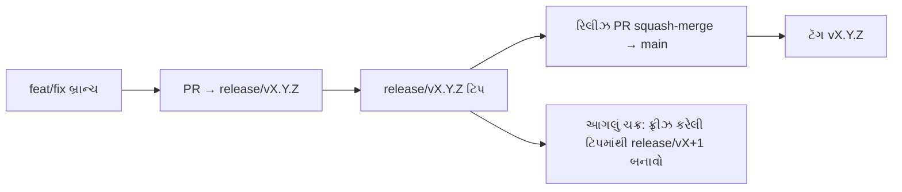

# Branching & Release Model (ગુજરાતી)

🌐 **Languages:** 🇺🇸 [English](../../../../ops/BRANCHING_MODEL.md) · 🇪🇹 [am](../../../am/docs/ops/BRANCHING_MODEL.md) · 🇸🇦 [ar](../../../ar/docs/ops/BRANCHING_MODEL.md) · 🇦🇿 [az](../../../az/docs/ops/BRANCHING_MODEL.md) · 🇧🇬 [bg](../../../bg/docs/ops/BRANCHING_MODEL.md) · 🇧🇩 [bn](../../../bn/docs/ops/BRANCHING_MODEL.md) · 🇧🇦 [bs](../../../bs/docs/ops/BRANCHING_MODEL.md) · 🇨🇿 [cs](../../../cs/docs/ops/BRANCHING_MODEL.md) · 🇩🇰 [da](../../../da/docs/ops/BRANCHING_MODEL.md) · 🇩🇪 [de](../../../de/docs/ops/BRANCHING_MODEL.md) · 🇬🇷 [el](../../../el/docs/ops/BRANCHING_MODEL.md) · 🇪🇸 [es](../../../es/docs/ops/BRANCHING_MODEL.md) · 🇪🇪 [et](../../../et/docs/ops/BRANCHING_MODEL.md) · 🇮🇷 [fa](../../../fa/docs/ops/BRANCHING_MODEL.md) · 🇫🇮 [fi](../../../fi/docs/ops/BRANCHING_MODEL.md) · 🇫🇷 [fr](../../../fr/docs/ops/BRANCHING_MODEL.md) · 🇮🇪 [ga](../../../ga/docs/ops/BRANCHING_MODEL.md) · 🇳🇬 [ha](../../../ha/docs/ops/BRANCHING_MODEL.md) · 🇮🇱 [he](../../../he/docs/ops/BRANCHING_MODEL.md) · 🇮🇳 [hi](../../../hi/docs/ops/BRANCHING_MODEL.md) · 🇭🇷 [hr](../../../hr/docs/ops/BRANCHING_MODEL.md) · 🇭🇺 [hu](../../../hu/docs/ops/BRANCHING_MODEL.md) · 🇦🇲 [hy](../../../hy/docs/ops/BRANCHING_MODEL.md) · 🇮🇩 [id](../../../id/docs/ops/BRANCHING_MODEL.md) · 🇳🇬 [ig](../../../ig/docs/ops/BRANCHING_MODEL.md) · 🇮🇹 [it](../../../it/docs/ops/BRANCHING_MODEL.md) · 🇯🇵 [ja](../../../ja/docs/ops/BRANCHING_MODEL.md) · 🇬🇪 [ka](../../../ka/docs/ops/BRANCHING_MODEL.md) · 🇰🇭 [km](../../../km/docs/ops/BRANCHING_MODEL.md) · 🇮🇳 [kn](../../../kn/docs/ops/BRANCHING_MODEL.md) · 🇰🇷 [ko](../../../ko/docs/ops/BRANCHING_MODEL.md) · 🇱🇹 [lt](../../../lt/docs/ops/BRANCHING_MODEL.md) · 🇱🇻 [lv](../../../lv/docs/ops/BRANCHING_MODEL.md) · 🇮🇳 [ml](../../../ml/docs/ops/BRANCHING_MODEL.md) · 🇮🇳 [mr](../../../mr/docs/ops/BRANCHING_MODEL.md) · 🇲🇾 [ms](../../../ms/docs/ops/BRANCHING_MODEL.md) · 🇲🇹 [mt](../../../mt/docs/ops/BRANCHING_MODEL.md) · 🇲🇲 [my](../../../my/docs/ops/BRANCHING_MODEL.md) · 🇳🇵 [ne](../../../ne/docs/ops/BRANCHING_MODEL.md) · 🇳🇱 [nl](../../../nl/docs/ops/BRANCHING_MODEL.md) · 🇳🇴 [no](../../../no/docs/ops/BRANCHING_MODEL.md) · 🇮🇳 [or](../../../or/docs/ops/BRANCHING_MODEL.md) · 🇮🇳 [pa](../../../pa/docs/ops/BRANCHING_MODEL.md) · 🇵🇭 [phi](../../../phi/docs/ops/BRANCHING_MODEL.md) · 🇵🇱 [pl](../../../pl/docs/ops/BRANCHING_MODEL.md) · 🇵🇹 [pt](../../../pt/docs/ops/BRANCHING_MODEL.md) · 🇧🇷 [pt-BR](../../../pt-BR/docs/ops/BRANCHING_MODEL.md) · 🇷🇴 [ro](../../../ro/docs/ops/BRANCHING_MODEL.md) · 🇷🇺 [ru](../../../ru/docs/ops/BRANCHING_MODEL.md) · 🇱🇰 [si](../../../si/docs/ops/BRANCHING_MODEL.md) · 🇸🇰 [sk](../../../sk/docs/ops/BRANCHING_MODEL.md) · 🇸🇮 [sl](../../../sl/docs/ops/BRANCHING_MODEL.md) · 🇷🇸 [sr](../../../sr/docs/ops/BRANCHING_MODEL.md) · 🇸🇪 [sv](../../../sv/docs/ops/BRANCHING_MODEL.md) · 🇰🇪 [sw](../../../sw/docs/ops/BRANCHING_MODEL.md) · 🇮🇳 [ta](../../../ta/docs/ops/BRANCHING_MODEL.md) · 🇮🇳 [te](../../../te/docs/ops/BRANCHING_MODEL.md) · 🇹🇭 [th](../../../th/docs/ops/BRANCHING_MODEL.md) · 🇹🇷 [tr](../../../tr/docs/ops/BRANCHING_MODEL.md) · 🇺🇦 [uk-UA](../../../uk-UA/docs/ops/BRANCHING_MODEL.md) · 🇵🇰 [ur](../../../ur/docs/ops/BRANCHING_MODEL.md) · 🇺🇿 [uz](../../../uz/docs/ops/BRANCHING_MODEL.md) · 🇻🇳 [vi](../../../vi/docs/ops/BRANCHING_MODEL.md) · 🇳🇬 [yo](../../../yo/docs/ops/BRANCHING_MODEL.md) · 🇨🇳 [zh-CN](../../../zh-CN/docs/ops/BRANCHING_MODEL.md) · 🇹🇼 [zh-TW](../../../zh-TW/docs/ops/BRANCHING_MODEL.md)

---

OmniRoute **સમાંતર-ચક્ર** રિલીઝ મોડલનો ઉપયોગ કરે છે: સક્રિય ચક્ર માટે સમર્પિત `release/vX.Y.Z`
બ્રાન્ચ, પ્રકાશિત લાઇન માટે `main`, અને તે ચક્ર રિલીઝ થાય ત્યારે અપરિવર્તનીય
`vX.Y.Z` ટૅગ. કમિટ્સ `release/*` _અને_ `main` બંને પર આવતા જોવા મળે તે અપેક્ષિત છે — તે કોઈ ગૂંચવણ નથી.

મેઇન્ટેનર માટેની વિગતો `CLAUDE.md` (કઠોર નિયમ #21) અને
[RELEASE_CHECKLIST.md](./RELEASE_CHECKLIST.md)માં છે. આ પાનું યોગદાનકર્તાઓ માટેનો જાહેર
સારાંશ છે.

## એક નજરમાં

| રેફરન્સ          | ભૂમિકા                                                                          |
| ---------------- | ------------------------------------------------------------------------------- |
| `release/vX.Y.Z` | **સક્રિય ચક્ર** — તે વર્ઝન માટે રોજિંદો વિકાસ અને PR મર્જ                       |
| `main`           | **પ્રકાશિત લાઇન** — રિલીઝ શિપ થાય ત્યારે squash-merge દ્વારા ચક્રને સ્વીકારે છે |
| `vX.Y.Z` (ટૅગ)   | **શિપ સૂચક** — રિલીઝ સમયે બનાવવામાં આવતો અપરિવર્તનીય “શું શિપ થયું” પોઇન્ટર     |



## મારા PRનું લક્ષ્ય કયું હોવું જોઈએ?

**સક્રિય `release/vX.Y.Z` બ્રાન્ચને લક્ષ્ય બનાવો — `main`ને નહીં.**

1. સૌથી ઊંચી ખુલ્લી `release/v*` બ્રાન્ચ શોધો (લખવાના સમયે ઉદાહરણ:
   `release/v3.8.49`).
2. તે ટિપમાંથી બ્રાન્ચ બનાવો (`git fetch` + checkout / તેના પર rebase).
3. **base = તે `release/vX.Y.Z`** રાખીને PR ખોલો.

`main` રોજિંદી ઇન્ટિગ્રેશન બ્રાન્ચ નથી. `main` સામે ખોલવામાં આવેલા PRને
મર્જ પહેલાં સામાન્ય રીતે ફરી લક્ષિત કરવા પડે છે.

## રિલીઝ ફ્રીઝ (સમાંતર ચક્રો)

જ્યારે રિલીઝનું સમાધાન થઈ રહ્યું હોય, ત્યારે `release-freeze` લેબલ ધરાવતી સૂચક issue
ખોલવામાં આવે છે. તેનાથી **વિકાસ અટકતો નથી**:

- ફ્રીઝ કરેલી `release/vX.Y.Z` તે રિલીઝ માટે રિલીઝ કૅપ્ટનના નિયંત્રણમાં હોય છે.
- યોગદાનકર્તાઓ કામ મર્જ કરવાનું ચાલુ રાખી શકે તે માટે આગલા ચક્રની `release/vX+1` ફ્રીઝ કરેલી ટિપમાંથી બનાવવામાં આવે છે.
- હજુ પણ ફ્રીઝ કરેલી બ્રાન્ચને લક્ષ્ય બનાવતા ખુલ્લા PRને સક્રિય (સૌથી ઊંચી) `release/v*` બ્રાન્ચ તરફ **ફરી લક્ષિત** કરવા જોઈએ.

તમને જોઈતી બ્રાન્ચ મર્જ કરી શકાય તેવી છે એવું માનતા પહેલાં ખુલ્લી ફ્રીઝ તપાસો:

```bash
gh issue list --repo diegosouzapw/OmniRoute --label release-freeze --state open
```

મર્જ પ્રક્રિયા (માલિકનું `queue` લેબલ → Mergify)નું દસ્તાવેજીકરણ
[MERGE_TRAIN.md](./MERGE_TRAIN.md)માં થયેલું છે.

## બ્રાન્ચ અને ટૅગ બંને શા માટે?

| આર્ટિફેક્ટ       | આયુષ્ય                | હેતુ                                                                             |
| ---------------- | --------------------- | -------------------------------------------------------------------------------- |
| `release/vX.Y.Z` | પ્રગતિમાં રહેલું ચક્ર | સમીક્ષા કરેલા PR એકત્રિત કરે છે, CIને સફળ રાખે છે અને PR base તરીકે કાર્ય કરે છે |
| ટૅગ `vX.Y.Z`     | કાયમ માટે             | npm / GitHub Releases પર શિપ થયેલા ચોક્કસ બિટ્સને ચિહ્નિત કરે છે                 |

બ્રાન્ચ વર્કશોપ છે; ટૅગ સીલ કરેલું પૅકેજ છે. `main` પર squash-merge કર્યા પછી,
અગાઉનો રિલીઝ PR પૂર્ણ થાય તેની રાહ જોયા વિના આગલું ચક્ર `release/vX+1` પર ચાલુ રહે છે.

## સંબંધિત દસ્તાવેજો

- [CONTRIBUTING.md](../../CONTRIBUTING.md) — સેટઅપ, ટેસ્ટ્સ, PR ચેકલિસ્ટ
- [RELEASE_CHECKLIST.md](./RELEASE_CHECKLIST.md) — શિપિંગ પહેલાંનું માન્યીકરણ
- [MERGE_TRAIN.md](./MERGE_TRAIN.md) — મર્જ ક્યૂ અને ફૉલબૅક ટ્રેન
- [RELEASE_GREEN.md](./RELEASE_GREEN.md) — રિલીઝ ટિપને સફળ રાખવી
